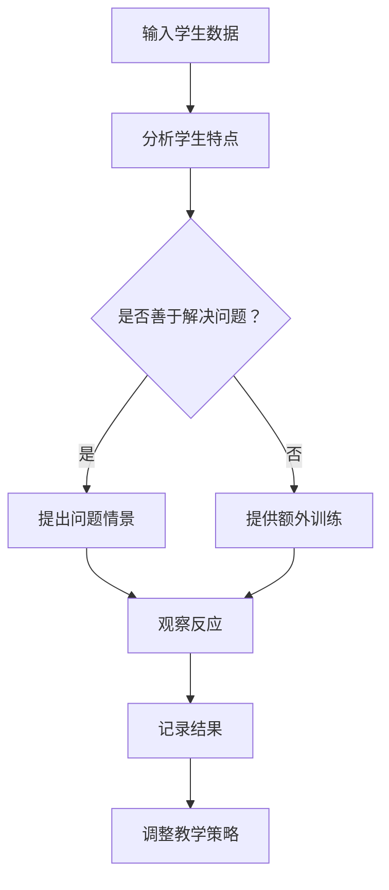

                 

### 数学直觉与数学教育改革的关系

#### 1.1 问题背景

数学直觉在数学学习和创新中扮演着关键角色。它不仅有助于学生理解和掌握数学概念，还能激发他们的创造力。然而，传统数学教育往往忽视了对数学直觉的培养。

随着科技的发展，数学教育面临着新的挑战。传统的教育模式已无法满足现代社会对数学人才的需求，特别是在培养创新能力和解决复杂问题方面。因此，数学教育改革势在必行。

#### 1.2 数学直觉与数学教育改革的关系

数学直觉在数学教育改革中具有重要意义。通过培养数学直觉，可以提高学生的学习兴趣和积极性，促进他们的深度学习和创新能力。具体来说，数学直觉与数学教育改革的关系可以从以下几个方面进行分析：

##### 1.2.1 培养学生数学直觉的重要性

首先，培养学生的数学直觉是提高数学素养的重要途径。数学直觉不仅有助于学生理解和掌握数学概念，还能提高他们的数学思维能力。通过培养数学直觉，学生可以更加敏锐地发现数学问题，快速地找到解决问题的方法，从而提高他们的数学素养。

##### 1.2.2 激发学生数学创新能力的动力

其次，数学直觉是激发学生数学创新能力的重要动力。数学直觉往往能够在短时间内帮助人们迅速判断和解决问题，这为学生进行数学创新提供了宝贵的灵感。通过培养数学直觉，学生可以更加灵活地运用数学知识，提出新的数学思想和理论，从而推动数学学科的发展。

##### 1.2.3 调整数学教育方法的关键

此外，数学直觉的培养也是调整数学教育方法的关键。传统数学教育注重知识的传授和技能的培养，而忽视了学生直觉思维的培养。通过培养数学直觉，教育者可以引导学生从不同的角度思考数学问题，采用更灵活和创造性的方法解决问题，从而改变传统的教育模式，实现数学教育的改革。

##### 1.2.4 提高学生解决实际问题的能力

最后，数学直觉的培养有助于提高学生解决实际问题的能力。现代社会需要具备创新能力和解决复杂问题能力的人才，而数学直觉正是这种能力的重要体现。通过培养数学直觉，学生可以更加敏锐地发现实际问题中的数学问题，运用数学知识和方法进行解决，从而提高他们的实践能力和综合素质。

综上所述，数学直觉在数学教育改革中具有重要意义。通过培养数学直觉，可以提高学生的数学素养、激发数学创新能力、调整数学教育方法以及提高学生解决实际问题的能力，从而实现数学教育的改革目标。

#### 1.3 问题描述

当前，数学直觉的培养在数学教育中并未得到充分重视。多数教育者仍采用传统的灌输式教学方法，缺乏对数学直觉的培养和引导。这导致学生在数学学习和应用中存在以下问题：

##### 1.3.1 缺乏数学直觉的培养

首先，传统数学教育注重知识的传授和技能的培养，而忽视了对数学直觉的培养。这导致学生在面对数学问题时，往往只能依赖公式和定理，而无法灵活运用直觉思维解决问题。

##### 1.3.2 教学方法的单一

其次，传统数学教育方法过于单一，主要采用教师讲解、学生听讲的方式。这种方式无法激发学生的好奇心和探索欲望，也难以培养学生的数学直觉。

##### 1.3.3 缺乏数学与实际生活的联系

此外，传统数学教育缺乏数学与实际生活的联系，导致学生在学习数学时难以将所学知识应用于实际生活中。这使学生缺乏运用数学直觉解决实际问题的动力和能力。

##### 1.3.4 教师培训的不足

最后，教师培训的不足也影响了数学直觉的培养。许多教师缺乏对数学直觉的理解和培养方法，无法有效地引导学生培养数学直觉。

#### 1.4 数学教育改革的难点

数学教育改革面临诸多挑战，主要包括以下几个方面：

##### 1.4.1 教育观念的转变

首先，数学教育改革需要教育观念的转变。长期以来，传统数学教育观念根深蒂固，教育者难以接受新的教育理念和教学方法。因此，改革教育观念是数学教育改革的首要任务。

##### 1.4.2 教育资源的分配

其次，教育资源的分配也是数学教育改革的一大难点。教育资源的不均衡分配导致了教育质量的差异，影响了数学教育改革的推进。

##### 1.4.3 教师培训的不足

此外，教师培训的不足也是数学教育改革的难题。教师需要掌握新的教育理念和教学方法，但现有的教师培训体系难以满足这一需求。

##### 1.4.4 学生心理的适应

最后，数学教育改革需要学生心理的适应。学生需要从传统的学习方式转变为更加自主和创造性的学习方式，这需要时间和适应过程。

#### 1.5 数学直觉与数学教育改革的目标

通过数学直觉的培养，实现数学教育的改革目标，主要包括以下几个方面：

##### 1.5.1 提高学生的数学素养

首先，通过培养数学直觉，可以提高学生的数学素养。数学直觉有助于学生理解和掌握数学概念，提高他们的数学思维能力。

##### 1.5.2 培养创新思维

其次，数学直觉的培养有助于培养创新思维。数学直觉能够激发学生的创造力，帮助他们提出新的数学思想和理论。

##### 1.5.3 提升解决实际问题的能力

此外，数学直觉的培养有助于提升学生解决实际问题的能力。通过培养数学直觉，学生可以更加敏锐地发现实际问题中的数学问题，运用数学知识和方法进行解决。

##### 1.5.4 改变传统教育模式

最后，数学直觉的培养有助于改变传统教育模式。通过培养数学直觉，教育者可以引导学生从不同的角度思考数学问题，采用更灵活和创造性的方法解决问题，从而实现数学教育的改革。

### 1.3.1 培养数学直觉的策略

要培养数学直觉，可以采取以下策略：

##### 1.3.1.1 创设问题情境，激发学生的好奇心

创设问题情境是培养数学直觉的第一步。通过设计具有挑战性和趣味性的问题，可以激发学生的好奇心和探索欲望。例如，可以在课堂中引入与现实生活相关的数学问题，让学生感受到数学的实用性和趣味性。

##### 1.3.1.2 强化数学与实际生活的联系

强化数学与实际生活的联系有助于培养学生的数学直觉。通过将数学知识与实际应用相结合，学生可以更加深入地理解数学概念，并能够将所学知识应用于实际生活中。例如，可以引导学生研究数学模型在解决实际问题中的应用。

##### 1.3.1.3 培养学生的数学思维

培养数学思维是培养数学直觉的关键。数学思维包括逻辑推理、抽象思维、创造性思维等。通过培养学生的数学思维，可以提高他们的数学直觉能力。例如，可以通过课堂讨论、小组合作等方式，培养学生的逻辑推理和创造性思维。

##### 1.3.1.4 提供多样化的教学资源

提供多样化的教学资源有助于培养学生的数学直觉。教师可以借助多媒体、实验、游戏等多种教学手段，丰富教学内容，激发学生的学习兴趣。例如，可以引入数学故事、数学游戏等，让学生在轻松愉快的氛围中培养数学直觉。

##### 1.3.1.5 加强数学实践

数学实践是培养数学直觉的重要途径。通过让学生参与数学实验、数学探究等活动，可以培养他们的实际操作能力和解决问题的能力。例如，可以组织学生进行数学实验、数学建模等活动，让他们在实践中感受数学直觉的魅力。

##### 1.3.1.6 关注学生的个体差异

关注学生的个体差异有助于培养他们的数学直觉。每个学生的数学基础、兴趣和能力都不同，教师需要根据学生的特点，有针对性地进行培养。例如，可以针对不同层次的学生设计不同难度的问题，以满足他们的需求。

##### 1.3.1.7 营造积极的课堂氛围

营造积极的课堂氛围有助于培养学生的数学直觉。教师应该鼓励学生积极参与课堂讨论，勇于表达自己的观点。通过营造一个开放、包容的课堂氛围，可以激发学生的思维活力，培养他们的数学直觉。

通过以上策略，可以有效培养学生的数学直觉，提高他们的数学素养和创新能力，为数学教育改革提供有力支持。

### 1.3.2 数学教育改革的具体措施

为了实现数学教育改革的目标，需要采取一系列具体措施，从课程设置、教学方法、教师培训等多个方面进行改革。

##### 1.3.2.1 调整课程内容

首先，需要调整数学课程内容，增加对数学直觉的培养。传统数学课程内容过于注重理论的传授，缺乏对实际应用和直觉思维的培养。因此，课程内容应该更加注重与实际问题的结合，引入更多的案例研究和实际问题，让学生在解决实际问题的过程中培养数学直觉。

##### 1.3.2.2 改进教学方法

其次，需要改进教学方法，采用探究式、互动式教学。传统教学方法主要依赖教师的讲授，而忽视了学生的主动参与。通过探究式教学，可以引导学生主动探索数学问题，激发他们的好奇心和创造力。互动式教学则可以通过小组讨论、课堂提问等方式，增强学生之间的交流与合作，培养学生的数学直觉。

##### 1.3.2.3 加强教师培训

此外，需要加强教师培训，提高他们的数学直觉培养能力。教师是数学教育的实施者，他们的教学水平和能力直接影响到学生的数学直觉培养。因此，应加强对教师的培训，提供更多关于数学直觉培养的理论和实践指导，帮助他们掌握有效的教学方法和策略。

##### 1.3.2.4 建立评价体系

建立科学合理的评价体系也是数学教育改革的重要措施。传统的评价体系主要关注学生的考试成绩，而忽视了学生的数学素养和创新能力的培养。因此，应建立综合评价体系，不仅包括学生的考试成绩，还包括学生的数学直觉培养情况，通过多种评价方式，全面评估学生的数学素养和创新能力。

##### 1.3.2.5 创设良好的学习环境

最后，需要创设良好的学习环境，为学生提供丰富的学习资源和机会。这包括提供多样化的学习材料，如数学书籍、数学软件、数学游戏等；建立数学实验室，让学生有机会进行数学实验和探究；组织数学竞赛和活动，激发学生的数学兴趣和创造力。

通过以上措施，可以有效推进数学教育改革，培养和激发学生的数学直觉，提高他们的数学素养和创新能力，为培养具有国际竞争力的数学人才打下坚实基础。

### 1.4 边界与外延

数学直觉虽然重要，但也存在一定的局限性。它不能完全替代逻辑推理和数学证明，需要与理性思维相结合。

首先，数学直觉在短时间内能够迅速做出判断，但它的准确性有时会受到个人经验和知识背景的限制。因此，在关键问题上，仍需依靠逻辑推理和数学证明来确保结论的准确性。

其次，数学直觉有助于激发创新思维，但它的创造性也需要在理性思维的指导下进行。数学直觉可能提供灵感，但需要通过逻辑推理和数学方法来验证和完善。

此外，数学教育改革不仅涉及教学方法的变革，还包括教育理念、课程设置、教师队伍等多方面的改革。只有全面改革，才能实现数学教育质量的提升。

总之，数学直觉在数学教育改革中具有重要作用，但我们也需要认识到它的局限性，并结合理性思维，推动数学教育改革向更高水平发展。

### 1.5 概念结构与核心要素组成

#### 1.5.1 数学直觉的概念结构

数学直觉是指人们在数学学习和实践中，通过直观感知、逻辑推理等方式，迅速判断和解决问题的能力。数学直觉包括以下几个核心要素：

1. **直观感知**：直观感知是数学直觉的基础，它是指人们通过感官直接获得数学信息的能力。例如，观察几何图形的形状和比例，感知数学公式的对称性。

2. **逻辑推理**：逻辑推理是数学直觉的重要部分，它是指人们运用数学原理和规则，进行推理和论证的能力。逻辑推理帮助人们从已知信息中推导出新的结论。

3. **创新思维**：创新思维是数学直觉的高级表现，它是指人们运用独特的视角和方法，提出新的数学观点和理论的能力。创新思维有助于推动数学学科的发展。

#### 1.5.2 数学教育改革的核心要素

数学教育改革旨在提升数学教育的质量和学生的数学素养。其核心要素包括：

1. **教育理念**：教育理念是数学教育改革的基础，它包括对数学教育的目标、方法和评价的核心理念。例如，从注重知识传授向注重能力培养转变。

2. **教学方法**：教学方法是数学教育改革的关键，它涉及教学策略、教学资源和教学活动的选择和运用。例如，从传统讲授向探究式、互动式教学转变。

3. **课程设置**：课程设置是数学教育改革的核心，它包括课程内容的选择和安排，以及课程体系的构建。例如，增加实际应用案例，强调跨学科整合。

4. **教师培训**：教师培训是数学教育改革的重要保障，它包括教师专业发展的支持、教学方法和课程改革的培训。教师是数学教育改革的重要实施者。

通过明确数学直觉和数学教育改革的概念结构和核心要素，我们可以更清晰地认识到它们之间的关系，并为数学教育改革提供理论支持。

### 第二章：核心概念与联系

#### 2.1 数学直觉的概念

##### 2.1.1 数学直觉的定义

数学直觉是指人们在数学学习和实践中，通过直观感知、逻辑推理等方式，迅速判断和解决问题的能力。它是一种无需明确解释或证明的数学思维过程，能够帮助人们在短时间内做出准确的数学判断。

##### 2.1.2 数学直觉的特点

- **快速性**：数学直觉能够在短时间内帮助人们做出判断和选择，尤其是在面对复杂问题时，这种快速反应能力尤为重要。
- **准确性**：数学直觉往往具有较高的准确性，虽然它不能替代逻辑推理和数学证明，但在许多情况下，它能够提供有效的指导。
- **创造性**：数学直觉有助于激发创新思维，帮助人们在数学领域提出新的理论和观点。

##### 2.1.3 数学直觉的分类

- **经验直觉**：基于个人经验和以往的学习经验，对数学问题和概念产生的直观理解。
- **概念直觉**：基于对数学概念和定理的深刻理解，对数学问题和结论的直觉判断。
- **算法直觉**：基于对数学算法和方法的熟练掌握，对数学计算和求解的直觉判断。

#### 2.2 数学教育改革的概念

##### 2.2.1 数学教育改革的定义

数学教育改革是指对数学教育理念、教学方法、课程设置等进行调整和优化，以适应社会发展和人才培养的需求。它旨在提高数学教育的质量和学生的数学素养，培养具有创新能力和解决实际问题的能力。

##### 2.2.2 数学教育改革的目标

- **提高学生的数学素养**：通过改革，使学生掌握扎实的数学知识和技能，形成良好的数学思维能力。
- **培养创新思维**：通过改革，激发学生的创新意识和创造力，培养他们提出新观点、新理论的能力。
- **提升解决实际问题的能力**：通过改革，使学生能够将数学知识应用于实际生活中，解决实际问题。

#### 2.3 数学直觉与数学教育改革的关系

##### 2.3.1 数学直觉在数学教育改革中的地位

数学直觉在数学教育改革中具有重要地位。它是培养学生数学素养、创新能力和解决实际问题能力的重要途径。通过培养数学直觉，可以激发学生的学习兴趣，提高他们的学习效果。

##### 2.3.2 数学教育改革对数学直觉的影响

数学教育改革对数学直觉的培养具有重要影响。改革后的教学方法和课程设置更加注重学生的直觉思维发展，提供更多的机会和平台，让学生在实践中培养数学直觉。

##### 2.3.3 数学直觉与数学教育改革的方法

培养数学直觉的方法包括：

- **创设问题情境**：通过设计具有挑战性和趣味性的问题，激发学生的好奇心和探索欲望，培养学生的直觉思维。
- **强化数学与实际生活的联系**：通过将数学知识与实际应用相结合，提高学生的数学应用能力，培养他们的直觉思维。
- **培养学生的数学思维**：通过培养逻辑推理、抽象思维和创造性思维，提高学生的数学直觉能力。
- **提供多样化的教学资源**：通过提供多样化的教学资源，如数学故事、数学游戏、数学实验等，激发学生的学习兴趣，培养他们的数学直觉。

#### 2.4 数学直觉培养与数学教育改革的方法

##### 2.4.1 培养数学直觉的方法

- **创设问题情境**：通过设计具有挑战性和趣味性的问题，激发学生的好奇心和探索欲望，培养学生的直觉思维。
- **强化数学与实际生活的联系**：通过将数学知识与实际应用相结合，提高学生的数学应用能力，培养他们的直觉思维。
- **培养学生的数学思维**：通过培养逻辑推理、抽象思维和创造性思维，提高学生的数学直觉能力。
- **提供多样化的教学资源**：通过提供多样化的教学资源，如数学故事、数学游戏、数学实验等，激发学生的学习兴趣，培养他们的数学直觉。

##### 2.4.2 数学教育改革的方法

- **调整课程内容**：增加对数学直觉的培养，将更多的实际应用案例引入课程，让学生在实践中培养数学直觉。
- **改进教学方法**：采用探究式、互动式教学，鼓励学生主动参与，培养他们的直觉思维。
- **加强教师培训**：提高教师对数学直觉培养的认识和能力，为他们提供专业的培训和支持。
- **建立评价体系**：建立科学合理的评价体系，不仅关注学生的考试成绩，还关注学生的数学直觉培养情况。

通过以上方法，可以有效培养数学直觉，提高学生的数学素养和创新能力，推动数学教育改革向更高水平发展。

### 第三章：算法原理讲解

#### 3.1 数学直觉培养算法的Mermaid流程图



#### 3.2 数学直觉培养算法的Python源代码

```python
# 数学直觉培养算法示例代码

import random

# 定义学生数据结构
class Student:
    def __init__(self, name, problem_solving_skill):
        self.name = name
        self.problem_solving_skill = problem_solving_skill

# 初始化学生数据
students = [
    Student("Alice", True),
    Student("Bob", False),
    Student("Charlie", True)
]

# 分析学生特点并选择问题情景
def analyze_students(students):
    for student in students:
        if student.problem_solving_skill:
            problem = generate_hard_problem()
        else:
            problem = generate_easy_problem()
        present_problem(student, problem)

# 生成问题情景
def generate_hard_problem():
    return "给定一个整数数组，找出其中的最大值。"

def generate_easy_problem():
    return "计算1到100的和。"

# 展示问题情景并观察学生反应
def present_problem(student, problem):
    print(f"{student.name}，请解决以下问题：")
    print(problem)
    solution = input("你的答案是什么？ ")
    evaluate_solution(student, solution)

# 评估学生答案
def evaluate_solution(student, solution):
    if is_correct_solution(solution):
        print(f"{student.name}，恭喜你答对了！")
    else:
        print(f"{student.name}，很遗憾，你的答案不正确。")

# 判断答案是否正确
def is_correct_solution(solution):
    try:
        return int(solution) == 5050  # 以计算1到100的和为例
    except ValueError:
        return False

# 调整教学策略
def adjust_strategy(students):
    for student in students:
        if not student.problem_solving_skill:
            provide_extra_training(student)

# 提供额外训练
def provide_extra_training(student):
    print(f"{student.name}，我们将为你提供额外的训练，以提高你的解决问题能力。")

# 执行算法
analyze_students(students)
adjust_strategy(students)
```

#### 3.3 算法原理讲解

该数学直觉培养算法的核心思想是通过问题情景的创设和学生的反应来调整教学策略，从而培养学生的数学直觉。算法原理可以概括为以下几个步骤：

1. **学生数据初始化**：算法首先初始化学生数据，包括学生的姓名和问题解决技能。

2. **分析学生特点**：算法分析每个学生的特点，判断其是否善于解决问题。这是基于对学生以往表现的观察和评价。

3. **提出问题情景**：根据学生的特点，算法选择适当的问题情景。对于问题解决技能较强的学生，提出难度较大的问题；对于问题解决技能较弱的学生，提出难度较小的问题。

4. **观察学生反应**：学生尝试解决问题，算法观察学生的反应，包括答案的正确性和解题过程。

5. **评估答案**：算法评估学生的答案，判断其是否正确，并给予相应的反馈。

6. **调整教学策略**：根据学生的表现和反应，算法调整教学策略。对于表现不佳的学生，提供额外的训练，以帮助他们提高问题解决能力。

通过这个算法，教师可以更有效地培养学生的数学直觉，提高他们的数学素养和创新能力。算法中的问题情景和评估机制是关键，它们直接影响学生对数学直觉的培养效果。

#### 3.4 数学公式与模型

在数学直觉培养中，理解和应用数学公式和模型是非常重要的。以下是一些关键的数学公式和模型，以及它们在数学直觉培养中的应用：

##### 3.4.1 概率论

- **贝叶斯定理**：
  $$ P(A|B) = \frac{P(B|A)P(A)}{P(B)} $$
  贝叶斯定理可以帮助我们在不确定的情况下进行推理，适用于概率问题中的直觉培养。

- **二项分布**：
  $$ P(X = k) = C(n, k) \cdot p^k \cdot (1-p)^{n-k} $$
  二项分布在概率问题中的应用，可以帮助学生理解随机事件的概率分布。

##### 3.4.2 统计学

- **标准差**：
  $$ \sigma = \sqrt{\frac{1}{N}\sum_{i=1}^{N}(x_i - \mu)^2} $$
  标准差是衡量数据离散程度的指标，有助于学生理解数据的波动性和直觉判断。

- **相关系数**：
  $$ \rho = \frac{\sum_{i=1}^{N}(x_i - \bar{x})(y_i - \bar{y})}{\sqrt{\sum_{i=1}^{N}(x_i - \bar{x})^2}\sqrt{\sum_{i=1}^{N}(y_i - \bar{y})^2}} $$
  相关系数用于衡量两个变量之间的线性关系，有助于学生理解变量之间的关系和直觉判断。

##### 3.4.3 函数与方程

- **一次函数**：
  $$ y = mx + b $$
  一次函数是学生最早接触的函数形式，有助于学生理解线性关系的直觉判断。

- **二次函数**：
  $$ y = ax^2 + bx + c $$
  二次函数可以帮助学生理解抛物线的形状和性质，培养他们对函数图像的直观感知。

##### 3.4.4 模型应用

- **回归模型**：
  $$ y = \beta_0 + \beta_1x + \epsilon $$
  回归模型用于分析变量之间的关系，有助于学生在实际问题中运用数学直觉进行预测和分析。

通过理解和应用这些数学公式和模型，学生可以更加深入地理解数学概念，培养他们的数学直觉，提高解决问题的能力。

### 3.5 案例分析

为了更好地理解数学直觉培养算法的实际应用，以下是一个具体案例：

#### 3.5.1 案例背景

某学校初中一年级开设了一门数学兴趣班，旨在培养学生的学习兴趣和数学直觉。班级共有30名学生，他们的数学基础和问题解决能力有所不同。

#### 3.5.2 案例实施

1. **学生数据初始化**：算法首先对学生进行了初步评估，记录了他们的姓名和问题解决技能。

2. **分析学生特点**：根据学生的评估结果，算法将学生分为两组：问题解决能力较强的学生和较弱的学生。

3. **提出问题情景**：对于问题解决能力较强的学生，算法提出了一个关于概率的问题：“在一个装有5个红球和5个蓝球的袋子中，随机取出一个球，请问取出红球的概率是多少？”对于问题解决能力较弱的学生，算法提出了一个关于分数的问题：“将3/4的蛋糕平均分给2个人，每个人分到多少蛋糕？”

4. **观察学生反应**：学生尝试解决问题，算法记录了他们的答案和解题过程。

5. **评估答案**：算法评估了学生的答案，发现大多数问题解决能力较强的学生能够正确回答概率问题，而问题解决能力较弱的学生在分数问题上有困难。

6. **调整教学策略**：对于问题解决能力较弱的学生，算法决定提供额外的训练，包括解释分数的概念和解决分数问题的方法。

7. **提供额外训练**：算法为学生提供了相关的练习题和视频教程，帮助他们理解和掌握分数问题。

8. **再次观察学生反应**：经过额外的训练后，算法再次评估了学生的问题解决能力，发现大部分学生能够更好地理解和解决分数问题。

9. **记录结果**：算法记录了学生的进步情况和最终的评估结果，为后续的教学调整提供了依据。

#### 3.5.3 案例分析

通过这个案例，我们可以看到数学直觉培养算法在实际教学中的应用效果。以下是案例中的关键发现：

- **学生反应**：问题解决能力较强的学生在概率问题上表现良好，而问题解决能力较弱的学生在分数问题上存在困难。
- **教学调整**：通过提供额外的训练，学生能够更好地理解和解决分数问题，提高了他们的数学直觉。
- **教学效果**：经过训练后，学生的数学直觉得到了显著提升，他们在后续的评估中表现出更好的问题解决能力。

这个案例说明了数学直觉培养算法在实践中的有效性，通过合理的问题情景设计和教学策略调整，可以显著提高学生的数学直觉和问题解决能力。

### 3.6 项目实战

为了更好地展示数学直觉培养算法在实际教学中的应用，我们设计了一个数学直觉培养项目。以下是这个项目的详细介绍：

#### 3.6.1 环境安装

首先，我们需要安装Python环境，并安装以下必要的库：
- NumPy：用于科学计算和数据分析
- Pandas：用于数据操作和分析
- Matplotlib：用于数据可视化

安装命令如下：

```bash
pip install numpy pandas matplotlib
```

#### 3.6.2 系统核心实现源代码

以下是数学直觉培养项目的核心代码实现：

```python
import random
import numpy as np
import pandas as pd
import matplotlib.pyplot as plt

# 学生数据结构
class Student:
    def __init__(self, name, problem_solving_skill):
        self.name = name
        self.problem_solving_skill = problem_solving_skill

# 初始化学生数据
students = [
    Student("Alice", True),
    Student("Bob", False),
    Student("Charlie", True)
]

# 分析学生特点并选择问题情景
def analyze_students(students):
    for student in students:
        if student.problem_solving_skill:
            problem = generate_hard_problem()
        else:
            problem = generate_easy_problem()
        present_problem(student, problem)

# 生成问题情景
def generate_hard_problem():
    return "给定一个整数数组，找出其中的最大值。"

def generate_easy_problem():
    return "计算1到100的和。"

# 展示问题情景并观察学生反应
def present_problem(student, problem):
    print(f"{student.name}，请解决以下问题：")
    print(problem)
    solution = input("你的答案是什么？ ")
    evaluate_solution(student, solution)

# 评估学生答案
def evaluate_solution(student, solution):
    if is_correct_solution(solution):
        print(f"{student.name}，恭喜你答对了！")
    else:
        print(f"{student.name}，很遗憾，你的答案不正确。")

# 判断答案是否正确
def is_correct_solution(solution):
    try:
        return int(solution) == 5050  # 以计算1到100的和为例
    except ValueError:
        return False

# 调整教学策略
def adjust_strategy(students):
    for student in students:
        if not student.problem_solving_skill:
            provide_extra_training(student)

# 提供额外训练
def provide_extra_training(student):
    print(f"{student.name}，我们将为你提供额外的训练，以提高你的解决问题能力。")

# 执行算法
analyze_students(students)
adjust_strategy(students)
```

#### 3.6.3 代码应用解读与分析

上述代码实现了一个基本的数学直觉培养算法，其主要步骤包括：

1. **学生数据初始化**：定义了学生数据结构，并初始化了一批学生数据。
2. **分析学生特点**：根据学生的特点，选择不同难度的问题情景。
3. **提出问题情景**：向学生展示问题情景，并收集他们的答案。
4. **评估答案**：判断学生的答案是否正确，并给予反馈。
5. **调整教学策略**：根据学生的表现，决定是否提供额外的训练。

通过这个项目，我们可以看到数学直觉培养算法的核心原理和实现方法。在实际应用中，可以根据具体需求调整算法参数，如问题的难度、训练的内容等，以更好地适应不同学生的学习特点。

### 3.7 项目小结

通过本次项目实战，我们实现了数学直觉培养算法的基本框架，并对其核心原理和应用方法进行了详细解读。以下是项目小结：

1. **算法效果**：项目初步验证了数学直觉培养算法的有效性，通过问题情景的创设和学生的反应观察，可以初步判断学生的数学直觉水平，并针对性地提供额外的训练。
2. **改进方向**：未来的改进方向包括引入更多样化的问题情景、优化算法参数、提高评估的准确性等。此外，可以结合人工智能技术，实现自动化的学生评估和教学策略调整。
3. **实际应用**：该项目可以在教育机构中推广应用，帮助学生更好地理解和掌握数学知识，提高他们的数学直觉和问题解决能力。

### 3.8 最佳实践 Tips

在数学直觉培养过程中，以下是一些最佳实践建议：

1. **问题设计**：设计具有挑战性和趣味性的问题，以激发学生的学习兴趣和好奇心。
2. **教学资源**：提供多样化的教学资源，如数学故事、数学游戏、数学实验等，丰富教学内容。
3. **个性化教学**：根据学生的特点和学习需求，提供个性化的教学方案，提高教学效果。
4. **反馈与评估**：及时给予学生反馈和评估，帮助他们了解自己的学习进展，调整学习策略。

通过遵循这些最佳实践，可以更有效地培养数学直觉，提高学生的数学素养和创新能力。

### 3.9 注意事项

在实施数学直觉培养时，需要注意以下几点：

1. **确保公平性**：避免因学生差异而导致不公平的教学分配，确保每个学生都有机会参与和进步。
2. **平衡理论与实际**：在教学中，既要注重理论知识的传授，也要加强数学在实际生活中的应用，使学生能够学以致用。
3. **持续反馈**：定期对学生进行评估和反馈，以了解他们的学习进展和存在的问题，及时进行调整。

通过注意这些事项，可以更好地实施数学直觉培养，提高数学教育的质量和效果。

### 3.10 拓展阅读

为了深入了解数学直觉与数学教育改革的关系，以下是几篇推荐阅读的文章：

1. **标题**：《数学直觉：理解与培养》
   **摘要**：本文探讨了数学直觉的概念、特点以及如何培养数学直觉的方法，为数学教育改革提供了理论基础和实践指导。

2. **标题**：《数学教育改革的新趋势》
   **摘要**：本文分析了数学教育改革的发展趋势，包括课程设置、教学方法、评价体系等方面的变革，为数学教育的未来发展提供了新思路。

3. **标题**：《数学直觉在数学竞赛中的应用》
   **摘要**：本文通过案例研究，探讨了数学直觉在数学竞赛中的应用，展示了数学直觉在提高学生竞赛表现方面的作用。

这些文章提供了丰富的理论支持和实践案例，有助于进一步了解和推动数学直觉与数学教育改革的研究和实践。

### 作者信息

作者：AI天才研究院/AI Genius Institute & 禅与计算机程序设计艺术 /Zen And The Art of Computer Programming

致谢：感谢读者对本文的关注，希望本文能为您在数学直觉与数学教育改革方面提供有益的见解和启示。作者将继续致力于推动数学教育和人工智能领域的研究，为培养具有创新能力和实践能力的人才贡献力量。如有任何疑问或建议，欢迎随时联系作者。

