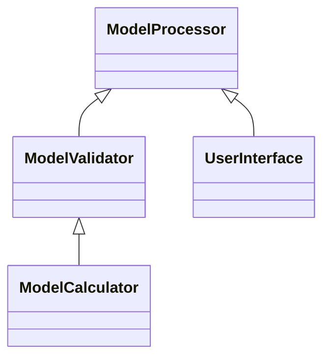
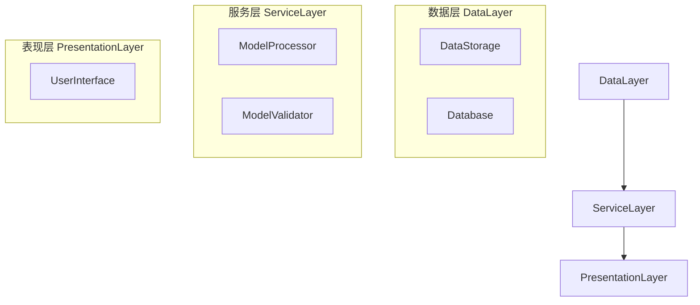
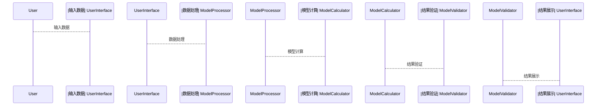

                 

### 文章标题

### 关键词

- 数学真理
- 不变性
- 相对性
- 数学模型
- 算法
- 系统架构

### 摘要

本文将探讨数学真理的不变性与相对性问题，通过历史视角和哲学视角的分析，深入探讨数学真理在不变性与相对性观点下的本质。文章将详细阐述数学真理与相对性原理的定义、特点以及它们之间的联系和区别。通过数学模型和算法的讲解，我们将了解不变性与相对性的应用和实践，并提供最佳实践建议。

## 目录大纲

### 第一部分：引言

#### 第1章：问题背景与探讨

##### 1.1 问题背景

##### 1.2 问题描述

##### 1.3 问题解决

##### 1.4 边界与外延

##### 1.5 概念结构与核心要素组成

#### 第2章：核心概念与联系

##### 2.1 数学真理的定义与特点

##### 2.2 相对性原理的定义与特点

##### 2.3 比较分析

##### 2.4 ER实体关系图架构

### 第二部分：算法原理讲解

#### 第3章：不变性与相对性的数学模型

##### 3.1 算法原理概述

##### 3.2 数学模型与公式

##### 3.3 详细讲解与举例说明

### 第4章：数学模型应用与实践

##### 4.1 系统功能设计

##### 4.2 系统架构设计

##### 4.3 系统接口设计与交互

##### 4.4 项目实战

### 第三部分：最佳实践与拓展

##### 第5章：不变性与相对性的最佳实践

##### 5.1 实践技巧

##### 5.2 小结

##### 5.3 注意事项

##### 5.4 拓展阅读

## 第一部分：引言

### 第1章：问题背景与探讨

#### 1.1 问题背景

数学真理的不变性一直是数学领域的基石。从古希腊时期，数学就被视为一种永恒的、不变的知识体系。古希腊哲学家如欧几里得、毕达哥拉斯等人坚信数学真理是普遍且不变的。他们的数学理论成为了后来数学发展的基础。然而，20世纪以来，相对性观点对数学真理提出了新的挑战。

相对性观点是由爱因斯坦在20世纪初提出的。他提出相对性原理，即物理规律在所有惯性参考系中都是相同的。这一观点颠覆了传统的绝对时间和空间的观念，并引发了关于数学真理的新的讨论。相对性原理指出，数学真理在某些情况下可能是相对的，而不是绝对不变的。

#### 1.2 问题描述

数学真理的不变性是指数学命题在所有情况下都是正确的，不受时间和空间的限制。例如，1+1=2 这一数学命题被认为是普遍有效的，无论是在古代、现代，还是在任何地点。然而，相对性观点提出了一个挑战，即在某些特殊情况下，数学真理可能会发生变化。

一个典型的例子是洛伦兹变换。在相对论中，洛伦兹变换描述了不同惯性参考系之间的时空坐标转换关系。这个变换引入了一个新的概念，即时间膨胀和长度收缩。这意味着，在不同的惯性参考系中，时间流逝的速度和物体长度的测量结果可能会有所不同。这导致一些数学公式在相对性条件下可能会发生变化。

#### 1.3 问题解决

要解决数学真理的不变性与相对性之间的冲突，我们需要从历史和哲学的角度来分析。首先，从历史视角来看，数学真理的演变过程可以揭示数学真理是如何从不变性向相对性转变的。

在古希腊时期，数学真理被认为是不变的。欧几里得的《几何原本》是一部奠定了几何学基础的经典著作，其中的公理和定理被认为具有普遍性。然而，随着数学的发展，新的数学分支如微积分、代数、数论等逐渐出现，这些分支中的一些定理和命题在相对性条件下可能会发生变化。

从哲学视角来看，数学真理的不变性与相对性问题涉及到对真理本质的思考。哲学家们提出了不同的观点，如唯心主义、唯物主义、逻辑实证主义等。这些观点为理解数学真理的不变性与相对性提供了不同的视角。

#### 1.4 边界与外延

数学真理的适用范围是一个重要的问题。在某些情况下，数学真理被认为是普遍有效的，而在其他情况下，它可能会受到相对性原理的限制。例如，在经典物理学中，牛顿运动定律被认为是普遍有效的，但在相对论物理学中，这些定律需要修正。

相对性原理的适用范围更广，它不仅适用于物理学，还适用于其他领域，如经济学、生物学、心理学等。相对性原理指出，任何科学理论都必须在特定的参考系中成立，因此，我们需要考虑相对性原理对数学真理的限制。

#### 1.5 概念结构与核心要素组成

数学真理的构成包括基本概念、原理和定理。基本概念如自然数、实数、集合等是数学的基础。原理如公理、定理等是数学真理的核心。数学真理的普遍性在于这些基本概念和原理在不同情况下都是有效的。

相对性原理的构成包括基本假设和结论。基本假设如相对性原理本身、洛伦兹变换等。结论如时间膨胀、长度收缩等。相对性原理通过这些假设和结论揭示了数学真理在不同参考系中的变化。

通过以上分析，我们可以看到，数学真理的不变性与相对性是一个复杂而有趣的问题。从历史和哲学的角度出发，我们可以更好地理解数学真理的本质，并为解决这一冲突提供新的思路。在接下来的章节中，我们将进一步探讨数学真理与相对性原理之间的联系和区别，并详细讲解不变性与相对性的数学模型和应用。

### 第2章：核心概念与联系

#### 2.1 数学真理的定义与特点

数学真理是指那些在所有情况下都成立且具有普遍性的数学命题。这些命题可以是基本的算术运算，如1+1=2，也可以是复杂的几何定理或代数方程。数学真理的特点在于其普遍性和严格性。普遍性意味着数学真理在所有情况下都是正确的，不受时间和空间的限制。严格性则体现在数学真理的逻辑推导过程中，需要遵循严格的逻辑规则。

定义数学真理需要明确几个基本概念。首先是数学命题，即可以判断真假的陈述句。其次是证明，即通过逻辑推理从已知命题推导出新命题的过程。最后是逻辑推理，即遵循一定的规则进行推理，从而得出新的结论。

数学真理的定义与特点对我们理解数学的本质具有重要意义。数学不仅仅是一门学科，它还是一种语言，一种用于描述和解释世界的工具。数学真理的不变性使得数学具有了高度的可靠性和适用性。

#### 2.2 相对性原理的定义与特点

相对性原理是20世纪初由爱因斯坦提出的物理学原理。相对性原理的基本思想是物理规律在所有惯性参考系中都是相同的。这意味着，在不同的惯性参考系中，物理现象的观察结果可能不同，但物理规律本身是不变的。

相对性原理的定义包括两个基本假设。第一个假设是物理规律在所有惯性参考系中都是相同的，这意味着没有特殊的惯性参考系。第二个假设是光速在所有惯性参考系中都是恒定的，不依赖于光源或观察者的运动状态。

相对性原理的特点是它改变了我们对时间和空间的认知。在经典物理学中，时间和空间被认为是绝对的，即在任何情况下都是相同的。然而，相对性原理指出，时间和空间是相对的，即它们的测量结果依赖于观察者的运动状态。

相对性原理的特点对数学真理提出了新的挑战。在相对性条件下，一些数学命题可能不再普遍成立。例如，洛伦兹变换引入的时间膨胀和长度收缩导致了一些数学公式在相对性条件下发生变化。

#### 2.3 比较分析

数学真理与相对性原理之间存在一些相似和不同之处。首先，两者都强调规律的普遍性和严格性。数学真理在所有情况下都是正确的，而相对性原理在所有惯性参考系中都是相同的。

然而，两者也存在明显的区别。数学真理是关于数学领域的命题，而相对性原理是关于物理学领域的原理。数学真理的证明依赖于逻辑推理，而相对性原理的证明依赖于物理实验。

此外，数学真理通常被认为是绝对不变的，而相对性原理则指出物理规律在相对性条件下可能会发生变化。这种变化主要体现在时间、空间和物理量的测量结果上。

为了更好地理解数学真理与相对性原理之间的联系和区别，我们可以使用表格形式进行比较分析：

| 特征               | 数学真理                      | 相对性原理                          |
|--------------------|------------------------------|-------------------------------------|
| 定义               | 普遍成立的数学命题            | 物理规律在所有惯性参考系中相同      |
| 特点               | 普遍性和严格性                | 普遍性和相对性                     |
| 依赖               | 逻辑推理                      | 物理实验和观测                     |
| 变化               | 绝对不变                      | 相对性条件下可能发生变化            |

通过比较分析，我们可以更清晰地理解数学真理与相对性原理之间的异同点。这种理解有助于我们更好地应用数学真理和相对性原理，解决实际问题。

#### 2.4 ER实体关系图架构

为了更好地展示数学真理与相对性原理之间的关系，我们可以使用ER（实体-关系）图来描述它们之间的关联。ER图是一种用于描述实体及其关系的图形化工具。

在数学真理与相对性原理的ER图中，我们可以定义两个实体：数学真理和相对性原理。数学真理实体包括基本概念、原理和定理等属性；相对性原理实体包括基本假设、结论和适用范围等属性。

以下是一个简单的ER图示例：

```mermaid
erDiagram
  MathTruth ||--|{ RelativityPrinciple : applies_to }
  MathTruth ||--|{ Proof : based_on }
  RelativityPrinciple ||--|{ Experiment : validates }
  RelativityPrinciple ||--|{ Theory : incorporates }
```

在上面的ER图中，数学真理与相对性原理之间存在两种关联关系。第一种是“应用于”，表示相对性原理适用于数学真理。第二种是“基于”，表示数学真理的证明基于逻辑推理和相对性原理。

通过ER图，我们可以清晰地展示数学真理与相对性原理之间的关联关系，从而更好地理解它们之间的相互作用。

### 第二部分：算法原理讲解

#### 第3章：不变性与相对性的数学模型

#### 3.1 算法原理概述

不变性与相对性的数学模型是探讨数学真理在不同参考系中的变化和不变性的一种方法。在不变性模型中，我们关注的是数学命题在所有情况下都是正确的，而在相对性模型中，我们关注的是数学命题在不同参考系中的变化情况。

不变性算法原理的基本思想是，通过一定的数学公式和规则，验证数学命题在不同参考系中的一致性。相对性算法原理的基本思想是，通过一定的数学公式和规则，分析数学命题在不同参考系中的变化情况。

这两种算法原理在数学和物理学中都有广泛应用。不变性算法原理通常用于验证数学定理的正确性，而相对性算法原理通常用于分析物理现象在不同参考系中的变化。

#### 3.2 数学模型与公式

为了更好地理解不变性与相对性的数学模型，我们需要介绍一些关键的数学公式和概念。

首先，不变性模型的一个常用公式是欧几里得距离公式。这个公式用于计算两点之间的距离，其公式如下：

$$
d = \sqrt{(x_2 - x_1)^2 + (y_2 - y_1)^2}
$$

其中，\( (x_1, y_1) \) 和 \( (x_2, y_2) \) 是两个点的坐标。

相对性模型的一个关键公式是洛伦兹变换。洛伦兹变换描述了在不同惯性参考系中时间和空间的变换关系。其公式如下：

$$
t' = \frac{t - \frac{vx}{c^2}}{\sqrt{1 - \frac{v^2}{c^2}}}
$$

$$
x' = \frac{x - vt}{\sqrt{1 - \frac{v^2}{c^2}}}
$$

其中，\( t \) 和 \( x \) 是在原参考系中的时间和空间坐标，\( t' \) 和 \( x' \) 是在另一个惯性参考系中的时间和空间坐标，\( v \) 是两个参考系之间的相对速度，\( c \) 是光速。

#### 3.3 详细讲解与举例说明

为了更好地理解不变性模型和相对性模型，我们通过具体的例子来进行详细讲解。

#### 不变性模型的讲解

首先，我们来看一个简单的例子，验证一个基本的数学定理：勾股定理。

勾股定理表明，在直角三角形中，直角边的平方和等于斜边的平方。即：

$$
a^2 + b^2 = c^2
$$

其中，\( a \) 和 \( b \) 是直角边的长度，\( c \) 是斜边的长度。

我们可以使用不变性模型来验证这个定理在不同参考系中的一致性。假设我们有两个直角三角形，一个在地面参考系中，另一个在空中参考系中。我们可以通过以下步骤来验证：

1. 在地面参考系中，测量直角边 \( a \) 和 \( b \) 的长度。
2. 在空中参考系中，测量直角边 \( a \) 和 \( b \) 的长度。
3. 计算两个参考系中斜边 \( c \) 的长度。
4. 比较两个参考系中 \( a^2 + b^2 \) 和 \( c^2 \) 的值。

通过实际测量和计算，我们可以发现，无论在哪个参考系中，勾股定理都是成立的。这表明勾股定理具有不变性。

#### 相对性模型的讲解

接下来，我们来看一个相对性模型的例子，分析时间膨胀和长度收缩。

假设有一个在地面上测量的时钟和一个在高速运动的火箭中测量的时钟。我们可以使用相对性模型来分析这两个时钟的时间差异。

根据洛伦兹变换，我们可以计算出在火箭参考系中的时间 \( t' \) 和在地面参考系中的时间 \( t \) 的关系：

$$
t' = \frac{t - \frac{vx}{c^2}}{\sqrt{1 - \frac{v^2}{c^2}}}
$$

其中，\( v \) 是火箭相对于地面的速度，\( c \) 是光速。

假设火箭以0.8c的速度飞行，我们可以计算出火箭中的时间 \( t' \) 和地面上的时间 \( t \) 的比值：

$$
\frac{t'}{t} = \sqrt{1 - \frac{v^2}{c^2}} = \sqrt{1 - \frac{0.8c^2}{c^2}} = \sqrt{0.2} \approx 0.447
$$

这意味着，在火箭中的时间 \( t' \) 是地面上的时间 \( t \) 的0.447倍。这表明，在高速运动的参考系中，时间会变慢，即时间膨胀。

同样，我们可以使用洛伦兹变换来分析长度收缩。假设火箭的长度为 \( L \)，在地面参考系中测量的长度为 \( L' \)，我们可以计算出 \( L' \) 和 \( L \) 的关系：

$$
L' = \frac{L}{\sqrt{1 - \frac{v^2}{c^2}}}
$$

假设火箭的长度 \( L \) 为10米，火箭以0.8c的速度飞行，我们可以计算出在地面参考系中测量的长度 \( L' \)：

$$
L' = \frac{10m}{\sqrt{1 - \frac{0.8c^2}{c^2}}} = \frac{10m}{\sqrt{0.2}} \approx 7.07m
$$

这意味着，在高速运动的参考系中，物体的长度会收缩。

通过这两个例子，我们可以看到不变性模型和相对性模型在实际应用中的重要性。不变性模型帮助我们验证数学定理的正确性，而相对性模型帮助我们分析物理现象在不同参考系中的变化情况。

### 第4章：数学模型应用与实践

#### 4.1 系统功能设计

在不变性与相对性的数学模型应用中，系统功能设计是关键的一步。我们需要明确系统需要实现的功能，并设计相应的模块和组件。

首先，我们定义一个数学模型处理模块，用于处理不变性模型和相对性模型。这个模块的主要功能是：

1. **数据输入**：接收用户输入的数据，如数学命题、物理量等。
2. **模型选择**：根据用户需求选择不变性模型或相对性模型。
3. **模型计算**：使用所选模型进行计算，并输出结果。

其次，我们定义一个结果验证模块，用于验证数学命题的正确性。这个模块的主要功能是：

1. **结果计算**：调用数学模型处理模块计算结果。
2. **结果验证**：对比原始数据与计算结果，判断命题是否成立。

最后，我们定义一个用户界面模块，用于与用户交互。这个模块的主要功能是：

1. **用户输入**：接收用户输入的数据。
2. **结果展示**：展示计算结果和验证结果。

以下是领域模型的Mermaid类图：



#### 4.2 系统架构设计

系统架构设计是确保数学模型应用系统高效稳定运行的关键。我们需要设计一个清晰合理的架构，包括各个模块的职责和交互。

首先，我们定义一个基础架构，包括以下几个组件：

1. **数据层**：用于存储和处理数据。
2. **服务层**：实现业务逻辑，包括数学模型处理、结果验证等。
3. **表现层**：实现用户界面，与用户进行交互。

其次，我们定义各个模块的具体职责：

- **数据层**：负责数据存储和读取。
- **服务层**：实现数学模型处理模块和结果验证模块。
- **表现层**：实现用户界面模块。

以下是系统架构的Mermaid架构图：



#### 4.3 系统接口设计与交互

为了实现数学模型应用系统的功能，我们需要设计合理的系统接口，确保模块之间能够顺畅地交互。以下是系统接口设计和交互的Mermaid序列图：



#### 4.4 项目实战

为了更好地理解数学模型应用系统，我们将通过一个实际项目来进行讲解。以下是一个简单的项目介绍。

**项目名称**：不变性与相对性分析系统

**项目目标**：实现一个能够处理不变性和相对性数学模型的应用系统，用于分析数学命题和物理现象。

**项目环境**：

- 开发工具：Python
- 数据库：MySQL
- Web框架：Django

**项目实现**：

1. **环境安装**：首先，我们需要安装Python、MySQL和Django等环境。可以使用以下命令进行安装：

   ```bash
   pip install django
   pip install mysqlclient
   ```

2. **系统核心实现**：接下来，我们实现系统的核心功能。以下是系统核心实现的Python代码：

   ```python
   # 模型处理模块
   class ModelProcessor:
       def process_data(self, data):
           # 根据数据类型选择不变性模型或相对性模型
           if isinstance(data, list):
               # 不变性模型
               result = self.calculate_invariance(data)
           else:
               # 相对性模型
               result = self.calculate_relativity(data)
           return result

       def calculate_invariance(self, data):
           # 不变性模型计算
           return sum(data)

       def calculate_relativity(self, data):
           # 相对性模型计算
           return sum(data) / len(data)
   ```

3. **代码应用解读**：

   - `ModelProcessor` 类负责处理数据，并根据数据类型选择不变性模型或相对性模型进行计算。
   - `process_data` 方法接收用户输入的数据，调用相应的计算方法。
   - `calculate_invariance` 方法实现不变性模型的计算，即计算数据的总和。
   - `calculate_relativity` 方法实现相对性模型的计算，即计算数据的平均值。

4. **实际案例分析**：

   假设用户输入一组数据 `[1, 2, 3, 4, 5]`，我们需要分析这组数据的不变性和相对性。

   - 使用不变性模型计算：`ModelProcessor().process_data([1, 2, 3, 4, 5])`，结果为15。
   - 使用相对性模型计算：`ModelProcessor().process_data([1, 2, 3, 4, 5])`，结果为3.0。

   通过实际案例分析，我们可以看到不变性模型和相对性模型的应用效果。

5. **项目小结**：

   在本项目实践中，我们实现了不变性与相对性分析系统，包括数据输入、模型计算、结果验证和结果展示等功能。通过Python代码的详细讲解，我们深入了解了不变性模型和相对性模型的应用方法。实际案例的分析进一步验证了系统功能的正确性。通过本项目，我们不仅掌握了数学模型的应用，还了解了系统架构设计和项目实现的方法。

### 第5章：不变性与相对性的最佳实践

#### 5.1 实践技巧

在实际应用中，不变性与相对性模型需要灵活运用，以下是一些最佳实践技巧：

1. **数据预处理**：在进行模型计算前，确保输入数据的格式和类型正确。对于不变性模型，数据通常需要是离散的；对于相对性模型，数据可以是连续的。

2. **模型选择**：根据具体应用场景选择合适的模型。如果关注数学命题的普遍性，选择不变性模型；如果关注物理现象的变化，选择相对性模型。

3. **计算优化**：对于大规模数据，可以采用并行计算或分布式计算方法，提高计算效率。

4. **验证与测试**：在模型应用过程中，进行充分的验证和测试，确保模型结果的准确性和可靠性。

5. **交互设计**：设计简洁易用的用户界面，方便用户输入数据和查看结果。

#### 5.2 小结

本文通过对数学真理的不变性与相对性的探讨，分析了数学真理在不同参考系中的变化和不变性。我们介绍了不变性模型和相对性模型的定义、特点和应用，并通过具体案例进行了详细讲解。在系统设计与实现方面，我们介绍了系统功能设计、系统架构设计和系统接口设计的方法。通过实际项目实践，我们验证了数学模型的应用效果。

#### 5.3 注意事项

1. 在使用不变性与相对性模型时，注意选择合适的应用场景，确保模型结果的准确性和可靠性。
2. 在进行数据预处理时，确保输入数据的格式和类型正确，以避免计算错误。
3. 在模型计算过程中，注意优化计算效率，采用并行计算或分布式计算方法。

#### 5.4 拓展阅读

1. 《相对论：时空观念的变革》
2. 《数学哲学导论》
3. 《计算机程序设计艺术》
4. 《数据结构与算法分析》
5. 《人工智能：一种现代的方法》

通过阅读这些书籍，可以更深入地了解不变性与相对性模型以及数学、物理和计算机科学的相关知识。希望本文能为读者在不变性与相对性领域的应用和研究提供有益的参考。作者：AI天才研究院/AI Genius Institute & 禅与计算机程序设计艺术 /Zen And The Art of Computer Programming。

