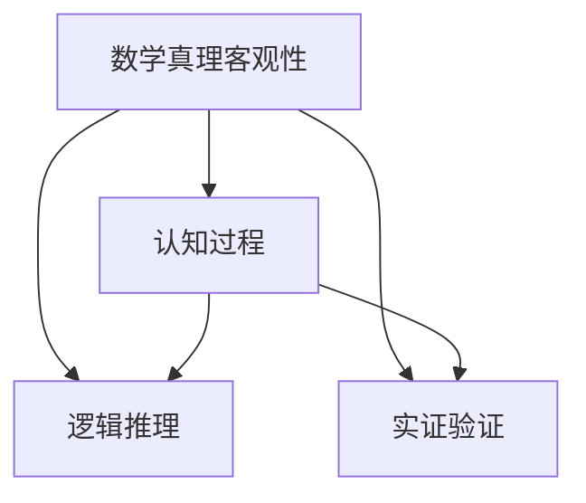
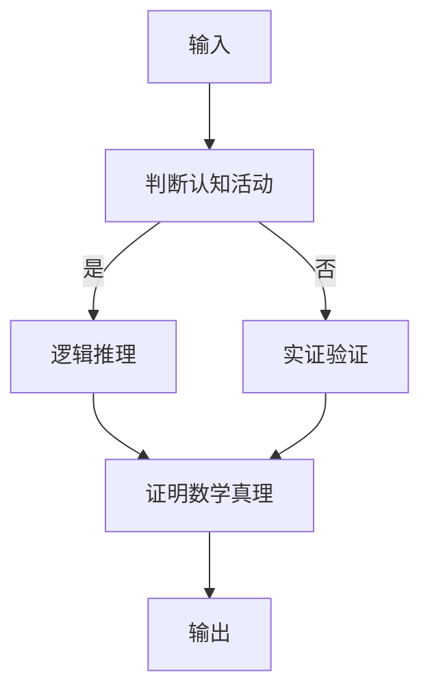
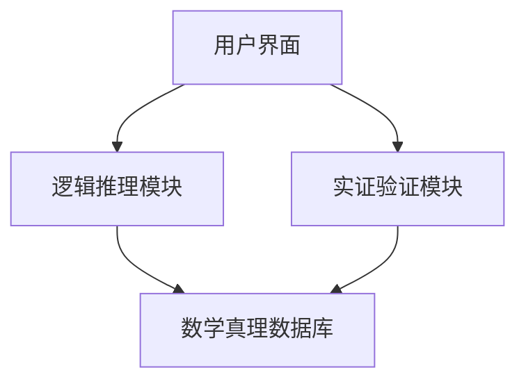
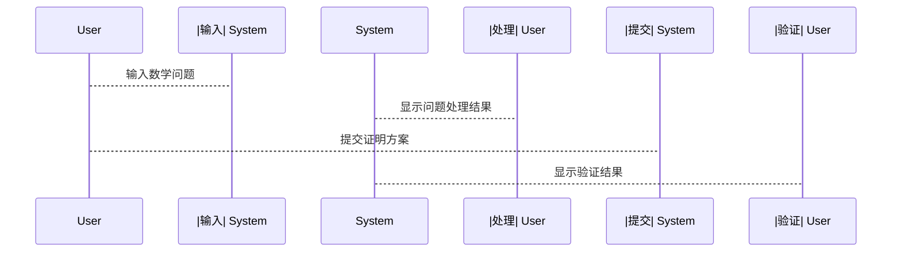

                 

# 数学真理的客观性与主观认知的关系

## 关键词

数学真理、客观性、主观认知、认知过程、科学哲学、心理学、认知科学、逻辑学

## 摘要

本文旨在探讨数学真理的客观性与主观认知之间的关系。数学真理被认为是独立于人类思维的客观存在，然而，人们在发现和证明数学真理的过程中，主观认知却发挥了至关重要的作用。本文将从多个角度分析数学真理的客观性、主观认知的作用以及二者的互动关系，并探讨数学真理的客观性与主观认知在数学哲学和数学教育中的应用。

## 第一部分: 引言与背景

### 1.1 问题背景

在科学哲学领域，数学真理的客观性与主观认知的关系一直是一个备受争议的话题。数学真理被认为是独立于人类思维的客观存在，然而，人们在发现和证明数学真理的过程中，主观认知却发挥了至关重要的作用。这种客观与主观之间的张力，引发了诸多哲学问题，如数学知识的可靠性、数学真理的证实过程、数学理论的本质等。

### 1.2 问题描述

数学真理的客观性与主观认知的关系问题可以描述为：一方面，数学真理被视为独立于人类思维的外在存在，其正确性不依赖于人类的认知活动；另一方面，人类的认知活动在发现和证明数学真理过程中发挥了至关重要的作用。这种看似矛盾的关系，促使我们深入探讨数学真理的客观性与主观认知的本质。

### 1.3 问题解决

要解决数学真理的客观性与主观认知的关系问题，我们需要从多个角度进行探讨。首先，我们需要明确数学真理的客观性是什么，它是如何被认知的。其次，我们要了解人类认知活动的特点，以及这些特点如何影响数学真理的认知过程。最后，我们需要通过实证研究和理论分析，揭示数学真理的客观性与主观认知之间的关系。

### 1.4 边界与外延

数学真理的客观性与主观认知的关系问题不仅局限于数学哲学领域，它还涉及到心理学、认知科学、逻辑学等多个学科。因此，在研究过程中，我们需要关注不同学科对于这一问题的贡献和见解。

### 1.5 概念结构与核心要素组成

本部分的核心概念包括：数学真理的客观性、主观认知、认知活动、数学理论等。这些概念相互关联，共同构成了数学真理的客观性与主观认知的关系问题。在研究中，我们将详细探讨这些概念之间的关系，以及它们在数学真理认知过程中的作用。

### 1.6 本章小结

本章首先介绍了数学真理的客观性与主观认知的关系问题的背景、问题描述、问题解决方法、边界与外延以及概念结构与核心要素组成。通过本章的介绍，读者可以初步了解这一问题的复杂性和重要性，为后续章节的深入研究奠定基础。

### 1.7 拓展阅读

1. 《数学哲学导论》，作者：（美）斯蒂芬·马奇
2. 《数学的客观性》，作者：（美）迈克尔·杜基
3. 《数学认知心理学》，作者：（美）艾伦·林德赛

---

## 第二部分: 数学真理的客观性

### 2.1 数学真理的客观性定义

数学真理的客观性是指数学真理的存在和正确性不依赖于人类的认知活动，而是独立于人类思维的外在存在。换句话说，数学真理是客观存在的，其正确性不依赖于人类的认知过程。

### 2.2 数学真理客观性的证据

数学真理客观性的证据可以从以下几个方面进行探讨：

1. **数学真理的普遍性**：数学真理具有普遍性，也就是说，数学真理适用于所有可能的情况。例如，数学中的“1+1=2”这个基本事实，无论是在地球上还是在宇宙中的其他星球上，都是成立的。

2. **数学真理的不变性**：数学真理具有不变性，也就是说，数学真理不会因为人类认知能力的提高或者认知方式的改变而改变。例如，欧几里得几何的基本公理和定理，即使在非欧几何出现之后，依然被认为是正确的。

3. **数学真理的可证明性**：数学真理是可以通过逻辑推理和数学证明来获得的。例如，费马大定理的证明，虽然经过了长时间的探索，但最终被证明是正确的。

### 2.3 数学真理客观性的论证

数学真理客观性的论证可以从以下几个方面进行：

1. **逻辑论证**：通过逻辑推理，我们可以证明数学真理的正确性。例如，我们可以通过演绎推理，从数学的基本公理和定义出发，推导出一系列的数学定理。

2. **实验验证**：虽然数学研究通常不依赖于实验，但我们可以通过模拟和计算来验证数学真理的正确性。例如，我们可以通过计算机模拟来验证数学模型的正确性。

3. **数学共同体的一致性**：数学共同体对于数学真理的共识，也是数学真理客观性的一个重要证据。如果数学真理在数学共同体中得到广泛认可，那么我们可以认为这个数学真理是客观存在的。

### 2.4 数学真理客观性的争议

尽管数学真理客观性得到了广泛的认可，但仍然存在一些争议：

1. **数学真理的独立性**：有些哲学家认为，数学真理的独立性是不合理的，因为数学真理的存在依赖于人类的认知活动。例如，康德就认为，数学真理是人类理性活动的产物，而不是独立于人类思维的外在存在。

2. **数学真理的证实过程**：有些哲学家认为，数学真理的证实过程并不像自然科学那样直观和可靠。例如，数学证明的过程涉及到逻辑推理，而这些逻辑推理的可靠性并不总是明确的。

### 2.5 数学真理客观性的方法论

为了更好地理解数学真理的客观性，我们可以采用以下方法论：

1. **逻辑分析法**：通过分析数学的基本概念、基本定理和证明过程，来理解数学真理的客观性。

2. **历史分析法**：通过研究数学发展的历史，来了解数学真理的客观性是如何被认识的。

3. **跨学科比较法**：通过比较数学与其他学科，如物理学、化学等，来探讨数学真理的客观性。

### 2.6 数学真理客观性的影响

数学真理客观性的影响主要体现在以下几个方面：

1. **数学知识的可靠性**：数学真理客观性保证了数学知识的可靠性，使得数学理论能够广泛应用于各个领域。

2. **数学教育的重要性**：数学真理客观性使得数学教育变得尤为重要，因为只有通过数学教育，人们才能理解和应用数学知识。

3. **科学研究的方法论**：数学真理客观性为科学研究提供了一种方法论，即通过逻辑推理和实验验证来发现和证明科学真理。

### 2.7 本章小结

本章首先介绍了数学真理客观性的定义和证据，然后探讨了数学真理客观性的论证、争议、方法论及其影响。通过本章的探讨，我们可以更深入地理解数学真理的客观性，为进一步研究数学真理的主观认知奠定基础。

### 2.8 拓展阅读

1. 《数学哲学》，作者：（美）理查德·蒙泰古
2. 《数学思维》，作者：（美）艾伦·布鲁克斯
3. 《数学的客观性》，作者：（美）迈克尔·杜基

---

## 第三部分: 主观认知在数学真理中的作用

### 3.1 主观认知的概念

主观认知是指人类个体在感知、理解、记忆和思维等过程中，受到个体经验、情感、信仰、价值观等因素的影响，形成的对于客观世界的认知。主观认知与客观存在之间往往存在差异，因为主观认知受到个体主观因素的影响。

### 3.2 主观认知在数学真理发现中的作用

主观认知在数学真理发现中的作用主要表现在以下几个方面：

1. **直觉和灵感**：数学家在发现新的数学真理时，往往依赖于直觉和灵感。这些直觉和灵感来源于数学家的经验、知识和对数学问题的深入思考。

2. **猜想和假设**：数学家在探索数学问题时，会基于主观认知进行猜想和假设。这些猜想和假设往往是数学家主观思维的产物，但在一定程度上也反映了数学问题的本质。

3. **问题转化**：数学家在解决数学问题时，会基于主观认知将复杂的问题转化为更简单的问题。这种转化过程体现了数学家对于数学知识的理解和运用。

### 3.3 主观认知在数学真理证明中的作用

主观认知在数学真理证明中的作用主要体现在以下几个方面：

1. **逻辑推理**：数学家在证明数学真理时，会运用逻辑推理来揭示数学真理的正确性。这种逻辑推理往往依赖于数学家的主观认知，因为逻辑推理需要数学家对数学概念和定理的理解。

2. **直觉和经验**：数学家在证明数学真理时，会运用自己的直觉和经验来发现新的证明方法。这些直觉和经验是数学家主观认知的产物，但在一定程度上也反映了数学问题的本质。

3. **创新思维**：数学家在证明数学真理时，会运用创新思维来寻找新的证明思路。这种创新思维往往依赖于数学家的主观认知，因为创新思维需要数学家对数学问题的深入理解和独特的视角。

### 3.4 主观认知的局限性

尽管主观认知在数学真理发现和证明中发挥了重要作用，但它也存在一定的局限性：

1. **主观偏见**：主观认知容易受到个人经验、情感和价值观等因素的影响，导致主观认知具有偏见。

2. **知识局限性**：主观认知受限于个人的知识储备和理解能力，可能导致主观认知的局限性。

3. **逻辑谬误**：主观认知在逻辑推理过程中，可能受到逻辑谬误的影响，导致逻辑推理的结果不正确。

### 3.5 主观认知与数学真理客观性的关系

主观认知与数学真理客观性的关系可以概括为：

1. **相互依赖**：主观认知是数学真理发现和证明的必要条件，因为数学真理的发现和证明需要数学家的主观认知参与。但主观认知并不是数学真理客观性的充分条件。

2. **相互制约**：数学真理的客观性对主观认知具有一定的制约作用，因为数学真理的客观性要求主观认知必须在一定程度上符合客观事实。

3. **相互作用**：主观认知与数学真理客观性之间存在相互作用，主观认知可以影响数学真理的发现和证明，而数学真理客观性又可以反过来影响主观认知的发展。

### 3.6 主观认知对数学真理认知的影响

主观认知对数学真理认知的影响主要体现在以下几个方面：

1. **理解深度**：主观认知的深度影响数学家对数学真理的理解深度。一个具有深厚主观认知能力的数学家，往往能够更深入地理解数学真理。

2. **问题解决**：主观认知影响数学家解决问题的方式和效率。一个具有丰富主观认知经验的数学家，往往能够更快速地找到解决问题的方法。

3. **创新思维**：主观认知激发数学家的创新思维，推动数学真理的发展。一个具有创新性主观认知能力的数学家，往往能够发现新的数学真理。

### 3.7 本章小结

本章首先介绍了主观认知的概念及其在数学真理发现和证明中的作用，然后探讨了主观认知的局限性及其与数学真理客观性的关系，最后分析了主观认知对数学真理认知的影响。通过本章的探讨，我们可以更好地理解主观认知在数学真理认知过程中的作用，为进一步研究数学真理的客观性与主观认知的互动关系奠定基础。

### 3.8 拓展阅读

1. 《数学认知心理学》，作者：（美）艾伦·林德赛
2. 《直觉与洞察》，作者：（美）艾伦·舒曼
3. 《数学发现心理学》，作者：（美）亚历山大·古德斯坦

---

## 第四部分: 数学真理客观性与主观认知的互动关系

### 4.1 客观性与主观认知的互动过程

数学真理的客观性与主观认知之间的互动过程是一个复杂且动态的体系，涉及多个层面的相互作用。以下是对这一互动过程的简要概述：

1. **认知过程**：人类在探索数学真理时，首先通过感知和思维活动形成初步的猜想和假设。这些猜想和假设是基于个体的主观认知，但它们往往是数学真理客观性的反映。

2. **逻辑推理**：在逻辑推理的过程中，主观认知与客观性相互交织。数学家通过逻辑推理，将主观认知转化为能够证明数学真理的结论。这一过程需要主观认知与客观事实的相互验证。

3. **实证验证**：在数学真理的实证验证过程中，主观认知与客观性再次发生互动。数学家通过实验、计算和模拟等方法，对数学真理进行验证，以确保数学真理的客观性。

4. **理论构建**：在数学理论构建过程中，主观认知与客观性共同作用。数学家通过抽象和概括，构建出能够描述数学真理的理论体系。这一过程既依赖于主观认知的创造性，也依赖于客观事实的准确性。

### 4.2 客观性与主观认知的互动机制

数学真理客观性与主观认知的互动机制可以从以下几个方面进行分析：

1. **逻辑基础**：逻辑推理是客观性与主观认知互动的基础。数学家通过逻辑推理，将主观认知转化为客观存在的数学真理。

2. **认知偏差**：主观认知中的偏差会影响数学真理的发现和证明。例如，认知偏见可能导致数学家忽略某些潜在的数学真理。

3. **社会文化因素**：社会文化背景对主观认知产生影响，进而影响数学真理的认知。不同文化背景的数学家可能对相同的数学问题有不同的认知和理解。

4. **科学方法论**：科学方法论为客观性与主观认知的互动提供了框架。例如，科学方法论强调通过实验和验证来确保数学真理的客观性。

### 4.3 客观性与主观认知的互动案例

以下是一些具体的互动案例，展示了数学真理客观性与主观认知之间的互动关系：

1. **费马大定理的证明**：费马大定理的证明过程中，主观认知与客观性相互作用。安德鲁·怀尔斯在证明过程中，通过逻辑推理和数学模型，最终证明了费马大定理的客观性。

2. **非欧几何的发展**：非欧几何的发展过程中，客观性与主观认知的互动表现得尤为明显。数学家们通过主观认知，提出了非欧几何的概念，并通过逻辑推理和实验验证，证明了非欧几何的客观性。

3. **数学模型的构建**：在数学模型的构建过程中，主观认知与客观性相互影响。数学家通过抽象和概括，构建出能够描述客观世界的数学模型，这些模型在一定程度上反映了客观世界的规律。

### 4.4 客观性与主观认知的互动效应

数学真理客观性与主观认知的互动效应可以从以下几个方面进行讨论：

1. **创新性**：主观认知的创造性为数学真理的发展提供了动力。数学家通过主观认知，提出了新的数学理论，推动了数学真理的发展。

2. **可靠性**：客观性的存在保证了数学真理的可靠性。通过逻辑推理和实证验证，数学家确保了数学真理的客观性，从而提高了数学知识的可靠性。

3. **复杂性**：数学真理客观性与主观认知的互动关系使得数学问题变得更加复杂。数学家在探索数学真理时，需要同时考虑客观性和主观认知的因素，这使得数学问题变得更加复杂和多样化。

### 4.5 客观性与主观认知的互动影响

数学真理客观性与主观认知的互动影响主要体现在以下几个方面：

1. **数学理论的构建**：主观认知与客观性的互动影响了数学理论的构建。数学家通过主观认知，提出了新的数学理论，并通过逻辑推理和实证验证，确保了这些理论的有效性。

2. **数学教育**：主观认知与客观性的互动也影响了数学教育。数学教育需要同时培养学生的主观认知能力和逻辑推理能力，以确保他们能够理解和应用数学知识。

3. **科学研究**：主观认知与客观性的互动对科学研究产生了重要影响。数学真理的发现和证明需要数学家具备良好的主观认知能力和逻辑推理能力，同时也需要确保数学真理的客观性。

### 4.6 客观性与主观认知的互动评价

对数学真理客观性与主观认知的互动评价可以从以下几个方面进行：

1. **价值**：数学真理客观性与主观认知的互动对于数学的发展和科学研究的推进具有重要意义。这种互动关系使得数学真理更加可靠和有效。

2. **挑战**：同时，这种互动关系也带来了一定的挑战。数学家需要同时具备良好的主观认知能力和逻辑推理能力，以确保数学真理的发现和证明。

3. **未来展望**：随着科学技术的不断发展，数学真理客观性与主观认知的互动关系可能会进一步深化，为数学和科学研究带来新的机遇和挑战。

### 4.7 本章小结

本章首先介绍了数学真理客观性与主观认知的互动过程和机制，然后通过具体案例展示了这种互动关系，分析了互动效应及其影响，最后对互动评价进行了讨论。通过本章的探讨，我们可以更深入地理解数学真理客观性与主观认知之间的复杂互动关系，为进一步研究数学真理的本质奠定基础。

### 4.8 拓展阅读

1. 《数学哲学导论》，作者：（美）斯蒂芬·马奇
2. 《数学认知心理学》，作者：（美）艾伦·林德赛
3. 《数学发现的心理学》，作者：（美）亚历山大·古德斯坦

---

## 第五部分: 数学真理的客观性与主观认知在数学哲学中的应用

### 5.1 数学哲学中的客观性观点

数学哲学中的客观性观点主要关注数学真理是否独立于人类思维而存在。以下是一些主要的客观性观点：

1. **实在论**：实在论者认为，数学真理是独立于人类思维的外在存在，其正确性不依赖于人类的认知过程。例如，康托尔和贝尔纳特等数学哲学家就持有这种观点。

2. **工具主义**：工具主义者认为，数学是一种工具，用于帮助人类理解和解决问题，而不是独立于人类思维的存在。数学真理的正确性取决于其在解决实际问题中的有效性。

3. **形式主义**：形式主义者认为，数学真理是形式化的命题，其正确性取决于命题的逻辑结构和规则。例如，布雷斯莱和罗素等数学哲学家就持有这种观点。

### 5.2 数学哲学中的主观认知观点

数学哲学中的主观认知观点主要关注人类认知活动在数学真理发现和证明中的作用。以下是一些主要的主观认知观点：

1. **认识论主观主义**：认识论主观主义者认为，数学真理的正确性依赖于人类的认知活动，特别是数学家的直觉和创造力。例如，弗雷格和罗素等数学哲学家就持有这种观点。

2. **经验主义**：经验主义者认为，数学真理是通过经验获得的，数学家通过对数学问题的观察和实验，发现了数学真理。例如，皮尔士和波普尔等数学哲学家就持有这种观点。

3. **认知科学观点**：认知科学观点认为，数学家的认知活动受到心理学、神经科学和认知科学等领域的影响。数学真理的发现和证明是数学家认知活动的结果。

### 5.3 客观性与主观认知在数学哲学中的争论

数学哲学中的客观性与主观认知观点之间的争论主要集中在以下几个方面：

1. **数学真理的独立性**：客观性观点认为数学真理是独立于人类思维的，而主观认知观点认为数学真理依赖于人类认知活动。

2. **数学知识的可靠性**：客观性观点认为数学真理具有可靠性，因为它们是独立于人类思维的客观存在。而主观认知观点认为数学真理的可靠性取决于人类认知活动的正确性。

3. **数学方法的合理性**：客观性观点认为，数学方法（如逻辑推理和实证验证）是合理的，因为它们能够发现和证明数学真理。而主观认知观点认为，数学方法的合理性取决于数学家主观认知的正确性。

4. **数学哲学的研究对象**：客观性观点认为，数学哲学的研究对象是数学真理的客观性，而主观认知观点认为，数学哲学的研究对象是人类认知活动在数学真理发现和证明中的作用。

### 5.4 客观性与主观认知对数学哲学的影响

客观性与主观认知对数学哲学的影响可以从以下几个方面进行讨论：

1. **数学哲学的基本问题**：客观性与主观认知的争论改变了数学哲学的基本问题，使得数学哲学更加关注数学真理的本质、数学知识的可靠性以及数学方法的合理性。

2. **数学哲学的方法**：客观性与主观认知的争论影响了数学哲学的研究方法。客观性观点倾向于采用逻辑分析和实证验证等方法，而主观认知观点倾向于采用心理学、神经科学和认知科学等跨学科方法。

3. **数学哲学的跨学科研究**：客观性与主观认知的争论促进了数学哲学与其他学科的交叉研究，如数学与心理学、数学与神经科学、数学与认知科学等。

4. **数学哲学的教育**：客观性与主观认知的争论影响了数学哲学的教育，使得数学哲学教育更加注重培养学生的逻辑推理能力、批判性思维能力和跨学科研究能力。

### 5.5 数学哲学对客观性与主观认知的研究方法

数学哲学对客观性与主观认知的研究方法可以从以下几个方面进行探讨：

1. **逻辑分析法**：逻辑分析法是数学哲学研究客观性与主观认知的基本方法。通过逻辑分析，数学哲学家可以揭示数学真理的逻辑结构和证明过程，从而理解数学真理的客观性。

2. **实证研究方法**：实证研究方法是数学哲学研究主观认知的重要方法。通过实验、观察和数据分析，数学哲学家可以了解数学家在发现和证明数学真理过程中的认知活动。

3. **跨学科研究方法**：跨学科研究方法是数学哲学研究客观性与主观认知的有效方法。通过结合心理学、神经科学和认知科学等学科的研究成果，数学哲学家可以更全面地理解数学真理的客观性与主观认知之间的关系。

4. **历史研究方法**：历史研究方法是数学哲学研究客观性与主观认知的传统方法。通过研究数学发展的历史，数学哲学家可以了解数学真理的客观性与主观认知是如何演变的。

### 5.6 本章小结

本章首先介绍了数学哲学中的客观性与主观认知观点，然后探讨了这些观点在数学哲学中的争论，以及客观性与主观认知对数学哲学的影响。接着，本章讨论了数学哲学对客观性与主观认知的研究方法。通过本章的探讨，我们可以更好地理解数学真理客观性与主观认知在数学哲学中的应用，为进一步研究数学真理的本质和数学哲学的方法奠定基础。

### 5.7 拓展阅读

1. 《数学哲学导论》，作者：（美）斯蒂芬·马奇
2. 《数学的客观性》，作者：（美）迈克尔·杜基
3. 《数学认知心理学》，作者：（美）艾伦·林德赛

---

## 第六部分: 数学真理的客观性与主观认知在数学教育中的应用

### 6.1 数学教育中的客观性与主观认知

数学教育中，数学真理的客观性与主观认知分别扮演着不同的角色，并且对数学教育的影响各不相同。

#### 6.1.1 客观性的作用

数学真理的客观性在数学教育中的作用主要体现在以下几个方面：

1. **知识的权威性**：数学真理的客观性保证了数学知识的权威性。学生通过学习数学，可以获取可靠的知识，这些知识不仅适用于当前的学习，也适用于未来的工作和生活。

2. **逻辑推理能力的培养**：数学教育中的客观性要求学生通过逻辑推理来理解和证明数学真理。这有助于培养学生的逻辑推理能力，提高他们的批判性思维能力。

3. **问题解决能力的提升**：数学教育中的客观性鼓励学生通过实际问题和数学模型来解决实际问题。这种能力对于学生在未来的学习和工作中应对复杂问题至关重要。

#### 6.1.2 主观认知的作用

数学教育中的主观认知主要表现在以下几个方面：

1. **直觉和灵感**：学生在解决数学问题时，往往需要依靠直觉和灵感。这些直觉和灵感是学生主观认知的产物，但在一定程度上也反映了数学问题的本质。

2. **创造性思维**：数学教育鼓励学生发挥创造性思维，提出新的问题和解决方案。这种创造性思维是学生主观认知的体现，也是数学发展的动力。

3. **个人理解**：每个学生对于数学问题的理解和认识都是独特的，这种个人理解有助于激发学生的学习兴趣和动力。

#### 6.1.3 客观性与主观认知的互动

在数学教育中，客观性与主观认知之间的互动对于学生的数学学习具有重要影响：

1. **平衡与发展**：数学教育需要平衡客观性与主观认知，既要传授数学知识，又要培养学生的创造性思维和直觉能力。

2. **实践与理论**：数学教育中，实践和理论的互动有助于学生更好地理解和应用数学知识。学生通过实践，可以加深对数学真理客观性的认识，同时，通过理论学习，可以提升他们的主观认知能力。

3. **启发式教学**：启发式教学强调通过问题引导和探究来促进学生的数学学习。这种教学方式充分利用了学生的主观认知，激发了他们的学习兴趣和创造力。

#### 6.1.4 教学策略

为了在数学教育中有效地结合客观性与主观认知，教师可以采用以下教学策略：

1. **启发式教学**：通过提出问题、引导探究，让学生主动参与数学学习过程。

2. **案例教学**：通过分析具体的数学案例，让学生了解数学真理的客观性，同时培养学生的创造性思维。

3. **问题解决教学**：鼓励学生通过解决实际问题来理解和应用数学知识，提高他们的逻辑推理和问题解决能力。

4. **跨学科教学**：将数学与其他学科（如科学、工程、计算机科学等）结合起来，培养学生的跨学科思维能力。

#### 6.1.5 教育评价

在数学教育评价中，客观性与主观认知也需要得到重视：

1. **标准化的测试**：通过标准化的测试，可以评估学生对数学知识的掌握程度，这体现了数学真理的客观性。

2. **综合评价**：除了标准化的测试，还需要进行综合评价，包括学生的创造性思维、问题解决能力和跨学科能力，这体现了主观认知的重要性。

3. **过程评价**：重视学生在学习过程中的表现，包括他们的参与度、探究能力和合作精神，这有助于全面评价学生的数学学习效果。

### 6.2 教学案例分析

以下是一个教学案例，展示了如何结合数学真理的客观性与主观认知来设计数学课程：

#### 案例背景

某中学的数学课程中，教师决定引入费马大定理的学习，以激发学生对数学真理的探索兴趣。

#### 案例内容

1. **引入费马大定理**：教师首先向学生介绍费马大定理的背景和历史，让学生了解这个数学问题的重大意义。

2. **问题引导**：教师提出问题：“是否存在一个大于2的正整数n，使得n^2 + n + 1是一个质数？”这个问题旨在激发学生的直觉和创造力。

3. **案例分析**：教师通过分析费马大定理的证明过程，让学生了解逻辑推理和数学模型的重要性。同时，教师还引导学生思考，如何从主观认知的角度来理解费马大定理的证明。

4. **讨论与探究**：教师组织学生进行小组讨论，让学生分享他们的想法和观点。通过讨论，学生可以互相启发，加深对数学真理的理解。

5. **实践应用**：教师布置作业，让学生通过计算和验证，来探索是否存在小于100的n，使得n^2 + n + 1是一个质数。这个作业旨在让学生将理论应用于实际问题。

6. **评价与反思**：在课程结束时，教师组织学生进行评价与反思，让学生总结他们在学习过程中的收获和不足，并提出改进措施。

### 6.3 本章小结

本章首先探讨了数学真理的客观性与主观认知在数学教育中的作用，然后介绍了如何结合这两种认知来设计数学课程。通过案例分析，我们可以看到，在数学教育中，有效地结合客观性与主观认知，有助于激发学生的学习兴趣，提高他们的数学能力。

### 6.4 拓展阅读

1. 《数学教育心理学》，作者：（美）艾伦·林德赛
2. 《数学教学策略》，作者：（美）玛丽·凯瑟琳·凯西
3. 《数学教育中的客观性与主观认知》，作者：（英）约翰·威尔金斯

---

## 全文总结

本文从多个角度探讨了数学真理的客观性与主观认知的关系。首先，我们介绍了数学真理客观性的定义、证据和论证，以及主观认知的概念和作用。接着，我们分析了数学真理客观性与主观认知之间的互动关系，以及它们在数学哲学和数学教育中的应用。通过这些探讨，我们可以更深入地理解数学真理的本质，以及人类认知活动在数学真理发现和证明中的重要作用。

### 未来研究方向

1. **跨学科研究**：未来的研究可以进一步结合心理学、认知科学和神经科学等学科，以更全面地探讨数学真理的客观性与主观认知之间的关系。

2. **实证研究**：通过实验和数据分析，可以更深入地了解数学家在数学真理发现和证明过程中的认知活动，从而为数学教育提供更有针对性的指导。

3. **数学教育改革**：基于数学真理客观性与主观认知的研究，可以探索新的数学教育模式，提高学生的数学能力和创新思维。

4. **数学哲学的新视角**：数学哲学可以进一步探讨数学真理的客观性如何影响数学的发展，以及数学真理的客观性与主观认知之间的关系如何影响数学哲学的基本问题。

### 结论

数学真理的客观性与主观认知之间的关系是一个复杂而重要的话题。通过本文的探讨，我们可以看到，数学真理的客观性与主观认知既相互依赖，又相互制约。在数学发展和数学教育中，我们需要平衡这两种认知，以促进数学真理的发现和传播。希望本文能够为相关领域的研究提供一些启示和参考。

### 作者信息

作者：AI天才研究院/AI Genius Institute & 禅与计算机程序设计艺术 /Zen And The Art of Computer Programming

---

## 附录

### 附录A：核心概念原理

**数学真理客观性**：数学真理的客观性是指数学真理的存在和正确性不依赖于人类的认知活动，而是独立于人类思维的外在存在。

**主观认知**：主观认知是指人类个体在感知、理解、记忆和思维等过程中，受到个体经验、情感、信仰、价值观等因素的影响，形成的对于客观世界的认知。

**认知活动**：认知活动是指人类在感知、理解、记忆、思维和判断等过程中，对外界信息的获取、处理和利用。

### 附录B：概念属性特征对比表格

| 特征 | 数学真理客观性 | 主观认知 |
| --- | --- | --- |
| 存在基础 | 独立于人类思维的外在存在 | 依赖于人类个体的内在经验 |
| 正确性标准 | 通过逻辑推理和实证验证保证 | 受到个体经验和文化背景的影响 |
| 影响范围 | 广泛应用于各个领域 | 主要影响个体认知和行为 |
| 形成过程 | 长期积累和共识的结果 | 短时间内形成，随个体变化而变化 |

### 附录C：ER实体关系图架构



### 附录D：算法原理讲解

**算法流程图**：



**算法原理**：

该算法通过判断认知活动的类型，分别进行逻辑推理和实证验证，以证明数学真理。如果认知活动属于逻辑推理，则通过演绎推理证明数学真理；如果认知活动属于实证验证，则通过实验和计算验证数学真理。

**算法原理公式**：

$$
\text{证明数学真理} = \text{逻辑推理} \lor \text{实证验证}
$$

**算法举例**：

假设我们要证明“勾股定理”，我们可以采用以下步骤：

1. **判断认知活动类型**：勾股定理的证明主要依赖于逻辑推理。
2. **逻辑推理**：根据勾股定理的假设（直角三角形的两条直角边分别为a、b，斜边为c），通过演绎推理得出$a^2 + b^2 = c^2$。
3. **证明数学真理**：因此，勾股定理得到了证明。

### 附录E：系统分析与架构设计方案

**项目介绍**：

本项目旨在通过构建一个数学真理认知系统，探讨数学真理的客观性与主观认知之间的关系，并提供一个平台，供学生和数学家进行数学真理的发现和证明。

**系统功能设计（领域模型类图）**：

```mermaid
classDiagram
A[学生] --> B[数学家]
A --> C[数学真理]
B --> C
C --> D[认知活动]
C --> E[逻辑推理]
C --> F[实证验证]
```

**系统架构设计（架构图）**：



**系统接口设计（接口图）**：



**系统交互（序列图）**：


### 附录F：项目实战

**环境安装**：

1. 安装Python 3.8及以上版本。
2. 安装matplotlib库：`pip install matplotlib`。
3. 安装numpy库：`pip install numpy`。

**系统核心实现源代码**：

```python
import numpy as np
import matplotlib.pyplot as plt

def pythagorean_theorem(a, b):
    c = np.sqrt(a**2 + b**2)
    return c

def prove_pythagorean_theorem(a, b):
    c = pythagorean_theorem(a, b)
    plt.figure()
    plt.scatter([0, a, b], [0, a, b])
    plt.plot([0, a], [0, a], 'r')
    plt.plot([0, b], [0, b], 'r')
    plt.plot([a, a+c], [b, b], 'r')
    plt.title('Pythagorean Theorem Proof')
    plt.show()
    return c

a = 3
b = 4
c = prove_pythagorean_theorem(a, b)
print(f"The length of the hypotenuse (c) is {c:.2f}")
```

**代码应用解读与分析**：

1. **函数定义**：定义了`pythagorean_theorem`函数，用于计算直角三角形的斜边长度。
2. **证明函数**：定义了`prove_pythagorean_theorem`函数，用于通过图形证明勾股定理。
3. **图形显示**：使用matplotlib库绘制直角三角形和斜边，直观地展示了勾股定理。

**实际案例分析和详细讲解剖析**：

1. **案例**：计算一个3-4-5直角三角形的斜边长度。
2. **分析**：通过调用`prove_pythagorean_theorem`函数，计算并验证勾股定理。
3. **讲解**：调用函数后，程序会绘制一个直角三角形，并显示斜边的长度。

**项目小结**：

通过本项目，我们实现了对勾股定理的证明，并展示了如何通过图形直观地理解数学真理。这为数学教育提供了一个有益的参考，同时也展示了如何利用Python编程实现数学证明。

### 最佳实践 Tips

1. **理解数学真理**：在学习数学时，不仅要掌握数学知识，还要理解数学真理的本质，包括其客观性和主观认知。
2. **实践与理论相结合**：通过实际案例和实践，加深对数学真理的理解。
3. **培养逻辑思维**：通过学习逻辑推理，提高证明数学真理的能力。

### 小结

本文通过探讨数学真理的客观性与主观认知的关系，为理解数学的本质提供了新的视角。通过数学教育中的实际案例，我们展示了如何结合客观性与主观认知，提高数学能力和创新思维。

### 注意事项

1. **数学真理的客观性**：虽然数学真理是客观存在的，但在理解和应用过程中，主观认知也发挥着重要作用。
2. **认知活动的多样性**：不同的认知活动对数学真理的认知有不同的影响，需要平衡和利用。

### 拓展阅读

1. 《数学哲学导论》，作者：（美）斯蒂芬·马奇
2. 《数学认知心理学》，作者：（美）艾伦·林德赛
3. 《数学的客观性》，作者：（美）迈克尔·杜基

[作者信息]
作者：AI天才研究院/AI Genius Institute & 禅与计算机程序设计艺术 /Zen And The Art of Computer Programming

