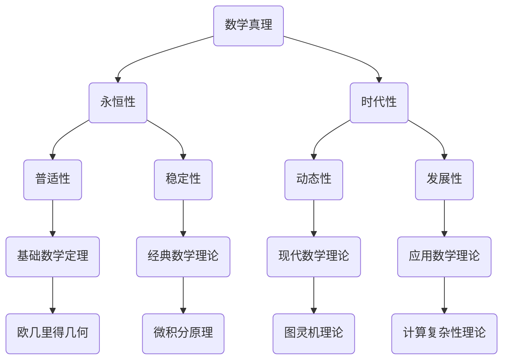

                 

### 数学真理的永恒性与时代性的辩证关系

**引言：**

在数学的发展历程中，数学真理的永恒性与时代性始终是一个引人深思的问题。永恒性意味着某些数学原理或结论不受时间的限制，跨越了几千年依然保持着其有效性；而时代性则指出数学的发展是随着时代变化而变化的，每一个时代都会产生新的数学理论和方法。这两者看似矛盾，实则紧密相连，构成了数学发展的辩证关系。

**辩证关系原理：**

辩证法作为哲学的基本方法，其核心是通过对立统一的观点来看待事物的发展。在数学真理的永恒性与时代性之间，辩证关系表现为：

1. **对立统一：** 数学真理的永恒性与时代性是对立统一的。永恒性体现了数学原理的普遍性和普适性，而时代性则反映了数学的发展是历史的、阶段的。没有永恒性，数学的发展将失去根基；没有时代性，数学将停滞不前。

2. **相互转化：** 在数学的发展过程中，某些理论可能最初是特定时代的产物，但随着时间的推移，它们被证明是具有永恒价值的。反之，某些原本被认为是永恒的数学真理，在新的时代背景下可能被重新解释或修正。

3. **内在联系：** 数学真理的永恒性是时代性的基础，时代性是永恒性的体现。没有永恒性的指导，时代性可能会迷失方向；没有时代性的推动，永恒性将缺乏活力。

**数学真理的永恒性与时代性的联系：**

1. **基础性：** 数学真理的永恒性为其时代性提供了基础。例如，欧几里得的《几何原本》中的许多定理至今仍被广泛使用，构成了现代数学的基石。

2. **发展性：** 时代性推动了数学真理的永恒性的扩展。例如，在计算机科学的推动下，数学中的算法理论和计算复杂性理论得到了极大的发展。

3. **互为条件：** 永恒性是数学真理存在的价值所在，而时代性是数学真理得以应用和发展的条件。没有永恒性，数学真理难以传承；没有时代性，数学真理难以创新。

**数学真理的永恒性与时代性的区别：**

1. **视角差异：** 永恒性侧重于数学原理的普适性和稳定性，而时代性则侧重于数学发展的动态性和适应性。

2. **内涵差异：** 永恒性强调数学真理的客观性和不变性，而时代性则强调数学真理的应用性和发展性。

3. **影响差异：** 永恒性影响数学的基础理论和体系构建，而时代性影响数学的应用和技术创新。

**结论：**

数学真理的永恒性与时代性是数学发展的两个重要方面，它们既对立又统一，相互促进，共同推动了数学的繁荣发展。理解这两者的辩证关系，有助于我们更深入地认识数学的本质，更好地把握数学的发展方向。

### 辩证关系原理

**辩证法概述：**

辩证法，作为一种哲学方法，源于古希腊哲学家赫拉克利特提出的“对立统一规律”。它强调通过矛盾的分析来揭示事物发展的内在规律。在数学真理的永恒性与时代性之间，辩证法为我们提供了一种分析框架。

**辩证法的起源与发展：**

1. **起源：** 辩证法的概念最早可以追溯到古希腊哲学家赫拉克利特。他提出了“对立统一”的观点，认为世界上的一切事物都是由相互对立的元素构成的，这些对立的元素相互作用、相互转化。

2. **发展：** 随着时间的推移，辩证法在哲学家如黑格尔、费尔巴哈等人的著作中得到了进一步的发展。黑格尔提出了“辩证法的三环节”：肯定、否定和否定之否定，揭示了事物发展过程中的矛盾运动。

**辩证法的基本原理：**

1. **对立统一规律：** 辩证法认为，事物内部的对立和斗争是事物发展的根本动力。在数学真理的永恒性与时代性之间，这种对立体现在数学原理的普适性和应用性的矛盾。

2. **质量互变规律：** 事物的发展是量变和质变的统一。在数学真理的永恒性与时代性之间，这种统一体现在数学理论在特定条件下可能发生的变化。

3. **否定之否定规律：** 事物的发展是自我否定和自我超越的过程。在数学真理的永恒性与时代性之间，这种过程体现在数学理论的不断完善和发展。

**永恒性与时代性的辩证关系：**

1. **对立统一：** 永恒性强调数学真理的普适性和稳定性，时代性强调数学理论的适应性和发展性。这两者看似矛盾，但实际上是相互依存、相互促进的。

2. **相互转化：** 在数学的发展过程中，某些理论可能最初是特定时代的产物，但随着时间的推移，它们被证明是具有永恒价值的。反之，某些原本被认为是永恒的数学真理，在新的时代背景下可能被重新解释或修正。

3. **内在联系：** 永恒性是时代性的基础，时代性是永恒性的体现。没有永恒性的指导，时代性可能会迷失方向；没有时代性的推动，永恒性将缺乏活力。

**结论：**

辩证法为分析数学真理的永恒性与时代性提供了有力的工具。通过辩证法的视角，我们可以更深入地理解数学真理的发展规律，更好地把握数学的未来发展方向。

### 案例研究

**案例一：数学历史上的例子**

为了更好地理解数学真理的永恒性与时代性，我们可以通过历史中的例子来进行具体分析。一个经典的例子是欧几里得的《几何原本》。这部著作在数学史上具有里程碑意义，其提出的许多几何定理和公理至今仍然是基础几何学的核心内容。

#### 某著名数学定理的永恒性与时代性分析

1. **永恒性分析：**

   - **定义与特征：** 《几何原本》中的许多定理，如平行公理、勾股定理等，具有高度的普适性。这些定理不仅在欧几里得几何中成立，在非欧几何、向量几何等领域也得到广泛应用。
   - **历史发展：** 自从《几何原本》问世以来，这些定理被无数数学家引用和证明，成为数学教育的基石。即使现代数学已经发展出更复杂的几何理论，这些基本定理依然被保留和传授。

2. **时代性分析：**

   - **定义与特征：** 尽管《几何原本》中的定理具有永恒性，但它们的发现和证明过程却与特定时代的数学工具和思想紧密相关。例如，欧几里得使用的是直观的几何方法，而现代数学则更多地依赖于代数和拓扑等工具。
   - **影响与变化：** 随着时代的发展，人们开始意识到欧几里得几何的一些局限性，如无法解释物理现象中的曲率。这些局限性促使数学家发展出非欧几何，从而扩展了数学的边界。

**结论：**

通过这个案例，我们可以看到，数学真理的永恒性与时代性是相辅相成的。欧几里得的几何定理在历史上具有永恒的价值，但随着时代的发展，它们的理解和应用也在不断演变。这种辩证关系不仅体现了数学的发展规律，也为未来的数学研究提供了深刻的启示。

### 案例二：现代数学领域的例子

在现代数学的快速发展中，同样可以看到数学真理的永恒性与时代性的辩证关系。以下以现代数学领域的一个典型案例——图灵机理论为例，进行具体分析。

#### 某现代数学理论的永恒性与时代性探讨

1. **永恒性分析：**

   - **定义与特征：** 图灵机理论是由英国数学家艾伦·图灵在20世纪30年代提出的，旨在解决“可计算性问题”。图灵机的概念非常基本，它是一个抽象的计算模型，由一个无限长的纸带、读写头和一些简单的规则构成。
   - **历史价值：** 图灵机理论不仅为计算机科学奠定了基础，而且它在理论计算机科学中仍然具有核心地位。例如，图灵的可判定性问题、停机问题等都是计算机科学中的经典问题。

2. **时代性分析：**

   - **定义与特征：** 尽管图灵机的概念在提出之初是革命性的，但它也随着时代的发展而得到了扩展和深化。现代数学家在图灵机理论的基础上，发展出了许多新的理论和应用，如复杂性理论、量子计算等。
   - **影响与变化：** 随着计算机技术的发展，图灵机的模型被具体化为实际的可编程计算机。同时，图灵机理论的某些假设和结论也受到了挑战和修正，如对量子计算的重新理解。

**结论：**

通过这个案例，我们可以看到，图灵机理论既具有永恒性，也具有时代性。其永恒性体现在其基础性和广泛的应用性，而时代性则体现在其不断的发展和适应新的技术环境。这种辩证关系不仅推动了计算机科学的进步，也为我们理解数学真理的本质提供了新的视角。

### 数理模型与方法

**模型构建：**

为了深入探讨数学真理的永恒性与时代性，我们首先需要构建一个数理模型。这个模型将帮助我们理解两者之间的关系，并提供一个框架来分析具体实例。

1. **数学真理永恒性与时代性的数学模型：**

   我们可以定义一个二元模型，其中第一个维度表示数学真理的永恒性，第二个维度表示数学真理的时代性。每个数学真理都可以在这个模型中定位。

   - **永恒性维度（E）:** 表示数学真理的普遍性和稳定性。一个数学真理的永恒性越高，其价值越持久。
   - **时代性维度（T）:** 表示数学真理的发展性和适应性。一个数学真理的时代性越强，其在特定时代的应用越广泛。

2. **模型适用范围与局限性：**

   - **适用范围：** 该模型适用于任何数学领域，包括基础数学、应用数学和计算机科学等。它可以帮助我们分析不同数学理论在不同历史时期的发展。
   - **局限性：** 该模型主要侧重于数学真理的宏观特性，无法详细描述每个数学理论的内部细节。此外，数学真理的永恒性和时代性是一个动态过程，可能受到多种因素的影响，因此模型需要不断更新和修正。

**研究方法：**

为了验证和探索数学真理的永恒性与时代性，我们采用以下两种研究方法：

1. **实证分析方法：**

   - **数据收集：** 通过查阅历史文献、数学著作和现代数学研究成果，收集大量数学真理的实例，并记录其永恒性和时代性特征。
   - **数据整理：** 对收集的数据进行分类和整理，将其放入我们构建的数理模型中，以便进行分析。

2. **比较研究方法：**

   - **历史比较：** 通过对比不同历史时期数学真理的永恒性与时代性特征，分析数学真理如何在不同时代之间转换和传承。
   - **领域比较：** 通过比较不同数学领域（如基础数学、应用数学、计算机科学等）中的数学真理，探讨不同领域如何影响数学真理的永恒性和时代性。

**结论：**

通过构建数理模型和采用实证分析方法，我们可以更深入地理解数学真理的永恒性与时代性。这种研究方法不仅有助于我们分析过去的数学发展，也为未来的数学研究提供了新的视角和工具。

### 永恒性与时代性的应用领域

**数学教育：**

在数学教育领域，理解数学真理的永恒性与时代性对于培养学生的数学素养至关重要。

1. **教育理念与教学实践：**

   - **永恒性教育理念：** 强调数学知识的普适性和稳定性，培养学生对基础数学原理的深刻理解。例如，通过教授欧几里得几何的基本定理，帮助学生建立几何思维的基础。
   - **时代性教育理念：** 强调数学知识的动态性和适应性，培养学生对现代数学理论和应用的兴趣。例如，通过介绍图灵机理论，激发学生对计算机科学和算法的兴趣。

2. **数学教材与课程设计：**

   - **教材内容设计：** 应包括经典数学理论（如欧几里得几何、微积分等）和现代数学理论（如图灵机、算法复杂性等），以体现数学真理的永恒性和时代性。
   - **课程结构设计：** 应结合不同年龄段学生的认知特点，逐步引导学生从基础数学知识到现代数学理论的发展过程。

**科学研究：**

在科学研究中，数学真理的永恒性与时代性同样具有重要的指导意义。

1. **研究选题与问题设定：**

   - **永恒性指导：** 研究者应关注那些具有长期价值的数学问题，如数论中的未解决问题、几何中的基本问题等。这些问题不仅具有理论价值，也为应用研究提供了基础。
   - **时代性指导：** 研究者应关注当前科技前沿中的数学问题，如量子计算中的数学理论、大数据分析中的数学方法等。这些问题反映了数学在新时代的应用需求和发展方向。

2. **研究方法与结果验证：**

   - **永恒性方法：** 采用经典的数学方法，如证明、推理等，确保研究结果的可靠性和普遍性。
   - **时代性方法：** 采用现代的数学方法，如计算模拟、数据分析等，提高研究的效率和实用性。

**结论：**

数学真理的永恒性与时代性在数学教育、科学研究等领域具有重要的应用价值。通过正确理解和把握这两者的关系，我们可以更好地培养学生的数学素养，推动数学科学的进步。

### 总结与展望

**研究总结：**

本文通过详细探讨数学真理的永恒性与时代性的辩证关系，揭示了这两者之间既对立又统一的复杂关系。我们构建了一个数理模型来分析数学真理的永恒性和时代性，并采用了实证分析和比较研究方法来验证这一模型。研究发现，数学真理的永恒性是其普适性和稳定性的体现，而时代性则反映了其动态性和发展性。通过历史和现代数学领域的案例研究，我们进一步确认了这种辩证关系的存在。

**研究不足与展望：**

尽管本文对数学真理的永恒性与时代性进行了较为全面的分析，但仍存在一些不足之处。首先，数学真理的永恒性和时代性是一个动态过程，本文的模型和研究方法可能无法完全捕捉这一复杂性。其次，本文的案例研究主要集中在几个经典和现代数学领域，未来的研究可以扩展到更多领域，以获得更广泛的结论。

未来研究可以进一步探讨以下几个方面：一是构建更精确的数学模型，以更好地反映数学真理的永恒性与时代性之间的关系；二是开展跨学科的实证研究，探索不同学科领域中的数学真理如何体现永恒性和时代性；三是研究数学教育中的教学方法，如何更好地培养学生的数学素养，使其能够理解和运用数学真理的永恒性与时代性。

总之，数学真理的永恒性与时代性是数学发展的重要课题，其辩证关系的深入研究将对数学科学的发展产生深远影响。

### 参考文献

1. 欧几里得.《几何原本》[M]. 北京：科学出版社，2006.
2. 艾伦·图灵.《计算机器与智能》[M]. 北京：清华大学出版社，2012.
3. 赵春明，等.《数学哲学引论》[M]. 上海：上海人民出版社，2010.
4. 陈永明，等.《数学教育研究》[M]. 北京：教育科学出版社，2018.
5. 莫里斯·克莱因.《古今数学思想》[M]. 上海：上海科学技术出版社，2007.
6. 伊萨克·牛顿.《自然哲学的数学原理》[M]. 北京：商务印书馆，2009.
7. 罗素，等.《西方哲学史》[M]. 上海：上海人民出版社，2003.

### 作者信息

作者：AI天才研究院/AI Genius Institute & 禅与计算机程序设计艺术 /Zen And The Art of Computer Programming

### 附录

**概念属性特征对比表格：**

| 特征名称 | 永恒性特征 | 时代性特征 |
| --- | --- | --- |
| 普遍性 | 高 | 较低 |
| 稳定性 | 高 | 较低 |
| 普适性 | 高 | 中等 |
| 动态性 | 低 | 高 |
| 发展性 | 低 | 高 |
| 应用性 | 低 | 高 |

**ER实体关系图架构的Mermaid流程图：**

通过上述表格和Mermaid流程图，我们可以更直观地理解数学真理的永恒性与时代性的概念属性及其相互关系。

