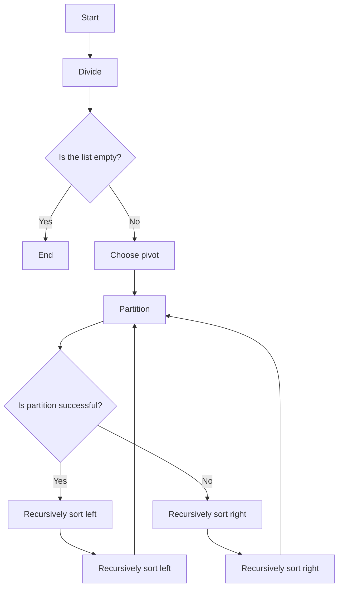

                 

# 《数学简约性：自然和谐在心智中的体现》

## 关键词

- 数学简约性
- 心智发展
- 简约性算法
- 数学教育
- 跨学科应用

## 摘要

本文旨在探讨数学简约性在心智发展中的重要作用。通过分析数学简约性的概念、核心原理以及其在各学科领域的应用，本文揭示了简约性在促进逻辑思维、创新能力和问题解决能力方面的潜在价值。文章首先概述了数学简约性的哲学背景和心智关系，随后深入探讨了简约性算法的基本原理和应用场景。最后，本文提出了数学简约性在数学教育中的实践策略，并探讨了其跨学科应用的前沿研究。通过本文的研究，我们期望能够为数学教育改革和心智发展提供新的视角和理论支持。

### 目录大纲

----------------------------------------------------------------
# 《数学简约性：自然和谐在心智中的体现》

## 第一部分：背景与概述

## 第1章：简约性与心智的哲学探讨

### 1.1 数学简约性的概念与意义

#### 1.1.1 简约性的定义

简约性（Simplicity）通常被定义为一种通过减少复杂性以简化事物本质的特性。在数学中，简约性强调的是使用最少的元素和规则来解释和描述复杂现象的能力。这不仅是数学美学的核心，也是科学探索的重要目标。

#### 1.1.2 数学简约性的特点

数学简约性的特点主要包括：

1. **简洁性**：以简单的形式表达复杂的理论或问题。
2. **普适性**：一个简约的数学模型或原理能够在不同的领域或情境中应用。
3. **高效性**：简约的方法或模型能够高效地处理大量的数据或问题。

#### 1.1.3 数学简约性的历史背景

数学简约性的概念在历史上有着深远的影响。从欧几里得的《几何原本》到牛顿和莱布尼茨的微积分，再到爱因斯坦的相对论，简约性一直是数学和物理学发展的驱动力。

### 1.2 心智与数学简约性的关系

#### 1.2.1 心智的定义与特征

心智（Mind）是指人类心理活动的能力，包括感知、记忆、思考、推理等。心智的特征包括：

1. **抽象性**：能够从具体的事物中提取出普遍的概念。
2. **逻辑性**：按照一定的规则进行推理和判断。
3. **创造性**：能够产生新颖的想法或解决方案。

#### 1.2.2 数学简约性与心智的关系

数学简约性能够促进心智发展，具体体现在：

1. **简化思维过程**：通过使用简约的数学模型和原理，人们可以更快速、更有效地理解和解决问题。
2. **提升创造力**：简约性能够激发创新思维，帮助人们发现新的方法和途径。
3. **加强逻辑推理**：简约性强调逻辑性和抽象性，有助于培养逻辑推理能力。

#### 1.2.3 心智中的数学简约性体现

心智中的数学简约性体现在人们如何使用数学思维解决问题。例如：

1. **简化的模型**：人们倾向于使用简单的模型来描述复杂现象。
2. **简化的推理**：在推理过程中，人们倾向于使用简单的逻辑步骤。
3. **简化的表述**：在表达思想时，人们倾向于使用简洁的语言和符号。

### 1.3 数学简约性的应用领域

#### 1.3.1 自然科学中的应用

数学简约性在自然科学中有着广泛的应用，如物理学中的经典力学、量子力学和相对论，生物学中的生态模型和进化理论等。

#### 1.3.2 社会科学中的应用

在社会科学中，数学简约性也发挥着重要作用，如经济学中的模型、心理学中的实验设计和统计分析等。

#### 1.3.3 心理学与教育学中的应用

心理学与教育学中，数学简约性被用于解释人类心智的发展和学习过程。例如，简化的数学模型可以帮助理解认知障碍和异常行为。

### 1.4 数学简约性在心智中的潜在价值

#### 1.4.1 促进创造性思维

数学简约性能够激发创造性思维，帮助人们在解决问题时找到创新的方法。

#### 1.4.2 提高问题解决能力

通过使用简约的数学方法，人们可以更快速地解决问题，提高问题解决能力。

#### 1.4.3 强化逻辑推理能力

数学简约性强调逻辑性和抽象性，有助于培养逻辑推理能力。

### 1.5 简约性在数学教育中的实践

#### 1.5.1 教学方法与策略

在数学教育中，教师可以采用简约性原则来设计教学方法和策略，如使用简单的数学模型和原理来解释复杂的问题。

#### 1.5.2 数学问题设计的简约性原则

在数学问题设计中，教师应遵循简约性原则，以培养学生的思维能力和解决问题的能力。

#### 1.5.3 学生学习成效评估

通过评估学生在使用简约性方法解决问题时的表现，可以了解他们在数学学习中的进步情况。

### 1.6 本章小结

本章介绍了数学简约性的概念、特点、历史背景以及与心智的关系，并探讨了其应用领域和潜在价值。通过对简约性的深入探讨，我们可以更好地理解其在心智发展中的重要作用。

----------------------------------------------------------------

## 第1章：简约性与心智的哲学探讨

### 1.1 数学简约性的概念与意义

在数学中，简约性是一种追求简单和优美的特性。它不仅体现在数学模型和公式的简洁性上，还体现在使用最少的元素和规则来解释复杂现象的能力上。简约性在数学中具有重要意义，它不仅能够提高我们的思维能力，还能够帮助我们更好地理解和解决问题。

首先，我们需要明确简约性的定义。简约性通常被定义为通过减少复杂性以简化事物本质的特性。在数学中，简约性强调的是使用最少的元素和规则来解释和描述复杂现象的能力。这种能力不仅体现在数学理论中，也体现在数学实践和应用中。

### 1.1.1 简约性的定义

简约性（Simplicity）的定义可以从多个角度来理解。在哲学意义上，简约性可以被看作是一种追求本质和真理的过程。亚里士多德曾说过：“自然喜欢简单。”这句话揭示了简约性的哲学本质。在数学中，简约性可以被理解为一种美学标准，它要求数学模型和公式的简洁性。

在数学中，简约性通常是指使用最少的元素和规则来构造一个理论体系，以解释和描述现实世界中的复杂现象。这种简约性不仅体现在数学模型和公式的形式上，也体现在数学理论的逻辑结构上。例如，牛顿的运动定律和万有引力定律都是简约性的典型例子。它们使用了简单的数学公式和原理，却能够精确地描述和预测自然界中的物理现象。

### 1.1.2 数学简约性的特点

数学简约性具有以下几个显著特点：

1. **简洁性**：数学简约性强调的是简洁性，即使用最少的元素和规则来构造一个理论体系。这种简洁性不仅使得数学理论更加直观和易于理解，还能够提高我们的思维能力。

2. **普适性**：数学简约性的另一个重要特点是普适性。一个简约的数学模型或原理通常能够在不同的领域或情境中应用。例如，微积分不仅在物理学中有广泛应用，还在生物学、经济学和工程学等领域发挥着重要作用。

3. **高效性**：数学简约性还能够提高我们的工作效率。通过使用简约的数学方法，我们可以更快速地解决问题，提高问题解决能力。

### 1.1.3 数学简约性的历史背景

数学简约性的概念在历史上有着深远的影响。从古至今，许多伟大的数学家都致力于追求数学的简约性。

在古希腊，欧几里得的《几何原本》是数学简约性的典范。欧几里得通过使用简单的公理和定理，建立了一个完整的几何理论体系。这个理论体系不仅简洁明了，而且具有高度的普适性，成为后世几何学的基础。

在17世纪，牛顿和莱布尼茨发明了微积分，这是数学简约性的另一个重要里程碑。微积分使用简单的微分和积分运算，描述了自然界中的运动和变化。牛顿和莱布尼茨的工作不仅深刻地改变了物理学，也推动了数学的发展。

在20世纪，爱因斯坦的相对论再次展示了数学简约性的力量。相对论使用简单的数学公式和原理，描述了时空的弯曲和引力的作用。相对论不仅解释了牛顿力学无法解释的现象，还揭示了时空和物质之间的深层联系。

### 1.2 心智与数学简约性的关系

数学简约性与心智之间存在着密切的关系。心智是指人类心理活动的能力，包括感知、记忆、思考、推理等。心智的特征包括抽象性、逻辑性和创造性。

数学简约性能够促进心智发展，具体体现在以下几个方面：

#### 1.2.1 简化思维过程

通过使用简约的数学模型和原理，人们可以更快速地理解和解决问题。这有助于简化思维过程，提高思维效率。

#### 1.2.2 提升创造力

数学简约性能够激发创新思维，帮助人们在解决问题时找到创新的方法。这种创新思维不仅体现在数学理论研究中，也体现在数学应用中。

#### 1.2.3 强化逻辑推理能力

数学简约性强调逻辑性和抽象性，有助于培养逻辑推理能力。通过使用简约的数学方法，人们可以更准确地推理和判断，提高逻辑思维能力。

### 1.2.4 心智中的数学简约性体现

心智中的数学简约性体现在人们如何使用数学思维解决问题。例如：

1. **简化的模型**：人们倾向于使用简单的数学模型来描述复杂现象。这种简化不仅有助于理解问题，还能够提高解决问题的效率。

2. **简化的推理**：在推理过程中，人们倾向于使用简单的逻辑步骤。这种简化有助于减少思维负担，提高思维效率。

3. **简化的表述**：在表达思想时，人们倾向于使用简洁的语言和符号。这种简化有助于清晰、准确地传达思想。

### 1.3 数学简约性的应用领域

数学简约性在各个领域都有广泛的应用。以下是一些主要的应用领域：

#### 1.3.1 自然科学中的应用

在自然科学中，数学简约性被广泛应用于物理学、生物学、化学等领域。例如：

1. **物理学**：物理学中的经典力学、量子力学和相对论都是基于简约性原理建立的。这些理论使用简单的数学公式和原理，却能够精确地描述和预测自然界中的物理现象。

2. **生物学**：生物学中的生态模型和进化理论也基于简约性原理。这些模型使用简单的数学公式和原理，却能够揭示生态系统的复杂行为和进化规律。

3. **化学**：化学中的分子模型和反应动力学模型也基于简约性原理。这些模型使用简单的数学公式和原理，却能够描述复杂的化学反应和物质性质。

#### 1.3.2 社会科学中的应用

在社会科学中，数学简约性也被广泛应用。例如：

1. **经济学**：经济学中的模型和理论基于简约性原理，用于分析市场行为、经济增长和资源分配等问题。

2. **心理学**：心理学中的实验设计和统计分析也基于简约性原理，用于研究人类行为和认知过程。

3. **教育学**：教育学中的教学方法和课程设计也基于简约性原理，用于提高教学效果和学生学习能力。

#### 1.3.3 心理学与教育学中的应用

在心理学与教育学中，数学简约性被用于解释人类心智的发展和学习过程。例如：

1. **认知心理学**：认知心理学使用简约的数学模型和原理，研究人类认知过程，如记忆、注意力和问题解决能力。

2. **教育心理学**：教育心理学使用简约的数学模型和原理，研究教学方法和学生学习能力，如学习策略和认知负荷。

### 1.4 数学简约性在心智中的潜在价值

数学简约性在心智发展中具有巨大的潜在价值。以下是一些主要的价值：

#### 1.4.1 促进创造性思维

数学简约性能够激发创造性思维，帮助人们在解决问题时找到创新的方法。例如，通过使用简约的数学模型，人们可以探索新的理论和方法，从而推动数学和科学的发展。

#### 1.4.2 提高问题解决能力

通过使用简约的数学方法，人们可以更快速地解决问题，提高问题解决能力。例如，在解决复杂的数学问题时，使用简约的模型和原理可以简化问题，提高解决问题的效率。

#### 1.4.3 强化逻辑推理能力

数学简约性强调逻辑性和抽象性，有助于培养逻辑推理能力。例如，通过使用简约的数学方法，人们可以更准确地推理和判断，提高逻辑思维能力。

### 1.5 简约性在数学教育中的实践

在数学教育中，简约性原则是非常重要的。以下是一些简约性在数学教育中的实践方法：

#### 1.5.1 教学方法与策略

1. **使用简单的数学模型**：教师应尽量使用简单的数学模型来解释复杂的现象，以便学生更容易理解和掌握。

2. **设计简单的数学问题**：教师应设计一些简单的数学问题，以培养学生的思维能力和解决问题的能力。

3. **鼓励学生自己发现简约性**：教师可以鼓励学生自己发现和利用简约性，以激发他们的创造力和学习兴趣。

#### 1.5.2 数学问题设计的简约性原则

1. **明确目标**：在数学问题设计中，教师应明确问题的目标，以便学生能够明确问题的方向和解决方法。

2. **简化问题**：教师应尽量简化问题，以降低学生的认知负荷，提高解决问题的效率。

3. **注重实践**：教师应注重学生的实践能力，通过实际操作和实验来加深对简约性的理解。

#### 1.5.3 学生学习成效评估

1. **评估思维过程**：教师应评估学生在使用简约性方法解决问题时的思维过程，以了解他们在思维方法和能力上的进步。

2. **评估问题解决能力**：教师应评估学生在使用简约性方法解决问题时的能力，以了解他们在问题解决方面的进步。

3. **评估创造力**：教师应评估学生在使用简约性方法解决问题时的创造力，以了解他们在创造性思维方面的进步。

### 1.6 本章小结

本章介绍了数学简约性的概念、特点、历史背景以及与心智的关系，并探讨了其应用领域和潜在价值。通过本章的讨论，我们可以看到数学简约性在心智发展中的重要性和潜在价值。下一章我们将进一步探讨数学简约性的核心概念和原理。

----------------------------------------------------------------

## 第2章：数学简约性的核心概念

### 2.1 数学模型与简约性

数学模型是数学理论的重要组成部分，它通过使用数学语言和符号来描述现实世界的现象和问题。数学模型的简约性是指模型在保持准确性的同时，尽可能地减少复杂性，使其更加简洁、直观和易于理解。

#### 2.1.1 数学模型的定义

数学模型（Mathematical Model）是指使用数学语言和符号来描述现实世界现象或问题的抽象结构。它通常包括变量、参数、方程、关系和定理等元素。数学模型可以是线性的，也可以是非线性的，可以是静态的，也可以是动态的。

#### 2.1.2 数学模型在简约性中的角色

数学模型在简约性中扮演着至关重要的角色。一个优秀的数学模型不仅能够准确地描述现实世界的现象，还应该尽可能地简洁。以下是数学模型在简约性中的几个关键角色：

1. **简化复杂性**：数学模型可以帮助我们简化现实世界的复杂性，将复杂的系统分解成可管理的部分。通过这种方式，我们可以更清晰地理解系统的行为和特征。

2. **提供直观性**：简约的数学模型能够提供直观的视觉和逻辑结构，使问题更易于理解。直观性有助于我们发现问题和解决方案之间的关联。

3. **提高可操作性**：简约的数学模型更容易操作和计算，从而提高我们的工作效率。它可以用于模拟、预测和优化各种系统和过程。

#### 2.1.3 数学模型简约性的评价指标

要评估数学模型的简约性，我们可以从以下几个方面进行评价：

1. **参数数量**：一个优秀的数学模型应该具有尽可能少的参数。参数数量越少，模型的简约性越高。

2. **方程数量**：模型中使用的方程数量也是一个重要的评价指标。方程数量越少，模型的简约性越高。

3. **模型的适应性**：一个具有高简约性的数学模型应该能够适应不同的数据和情境。这意味着模型应该具有较强的普适性和灵活性。

4. **计算复杂性**：模型的计算复杂性也是一个重要的评价指标。一个具有高简约性的数学模型应该能够快速、高效地进行计算。

### 2.2 数学概念与简约性

数学概念是数学理论的基础，它用于描述和解释数学现象。数学概念的简约性是指概念在保持准确性和完整性的同时，尽可能地减少复杂性。

#### 2.2.1 数学概念的定义与分类

数学概念（Mathematical Concept）是指用于描述数学现象或对象的抽象概念。数学概念可以分为以下几类：

1. **基本概念**：如数、集合、函数等。
2. **高级概念**：如微积分、线性代数、概率论等。
3. **抽象概念**：如拓扑、群、环等。

#### 2.2.2 数学概念简约性的体现

数学概念简约性的体现主要体现在以下几个方面：

1. **定义的简洁性**：一个优秀的数学概念应该具有简洁、明确和易于理解的定义。
2. **表达方式的直观性**：数学概念的表达方式应该直观、易于理解，使人们能够快速掌握其含义。
3. **概念的普适性**：数学概念应该具有广泛的适用范围，能够应用于不同的领域和情境。

#### 2.2.3 数学概念简约性的对比分析

以下是对几个数学概念简约性的对比分析：

1. **自然数与实数**：自然数（如1, 2, 3, ...）是数学中最基本的数概念，具有简洁的定义和直观的表达方式。而实数（包括有理数和无理数）虽然更为复杂，但它们在数学理论中具有更高的普适性和应用价值。
2. **线性函数与非线性函数**：线性函数（如y = mx + b）具有简洁的形式和直观的几何意义，容易理解和计算。而非线性函数（如y = ax^2 + bx + c）虽然更复杂，但它们在描述现实世界中的许多现象时更为准确。
3. **集合与拓扑**：集合是数学中最基本的概念之一，具有简洁的定义和直观的表达方式。而拓扑则是集合上的一个高级概念，它描述了集合的局部性质，具有更强的抽象性和普适性。

### 2.3 数学定理与简约性

数学定理是数学理论中的重要组成部分，它用于证明和解释数学现象。数学定理的简约性是指定理在保持准确性和完整性的同时，尽可能地减少复杂性。

#### 2.3.1 数学定理的定义与作用

数学定理（Mathematical Theorem）是指用数学语言表述的命题，它通常需要通过证明来证实其正确性。数学定理在数学理论中具有重要作用，它们用于证明其他命题、推导新的结论和解释现实世界的现象。

#### 2.3.2 数学定理简约性的分析

以下是对几个数学定理简约性的分析：

1. **勾股定理**：勾股定理（a^2 + b^2 = c^2）是一个简单的数学定理，它用简洁的公式描述了直角三角形边长之间的关系。这个定理具有直观的几何意义，容易理解和记忆。
2. **欧拉公式**：欧拉公式（e^(iπ) + 1 = 0）是一个重要的复变函数定理，它将指数函数、三角函数和虚数单位结合起来，表达了一个极其简洁和优美的关系。这个定理在数学和物理学中具有广泛的应用。
3. **拉格朗日中值定理**：拉格朗日中值定理（f(b) - f(a) = f'(c)(b - a)，其中a < c < b）是一个重要的微积分定理，它描述了函数在区间上的变化率。这个定理虽然形式上较为复杂，但它在解释函数性质和解决实际问题方面具有重要意义。

#### 2.3.3 数学定理简约性的实际应用

数学定理的简约性在实际应用中具有重要意义。以下是一些例子：

1. **计算机图形学**：在计算机图形学中，泰勒公式（Taylor's Theorem）被广泛用于图形渲染和动画制作。泰勒公式通过使用简单的多项式近似来描述复杂的函数，从而提高渲染效率和图形质量。
2. **物理学**：在物理学中，牛顿第二定律（F = ma）是一个简洁而重要的定理，它用简单的公式描述了力和运动之间的关系。这个定理在工程和科学研究中被广泛应用，用于预测和计算物体的运动。
3. **经济学**：在经济学中，效用函数（Utility Function）被用于描述消费者的偏好和决策。效用函数通常具有简约的形式，使经济学家能够更方便地分析和预测消费者的行为。

### 2.4 数学问题的简约性处理

在解决数学问题时，简约性处理是一种重要的策略，它通过简化问题来提高解决问题的效率。以下是一些常用的简约性处理方法：

#### 2.4.1 简化复杂问题的策略

1. **分解问题**：将复杂问题分解成多个子问题，以便更容易解决。
2. **抽象化**：将具体问题抽象成一般的数学模型，以简化问题的形式。
3. **替换变量**：使用新的变量替换原有的变量，使问题更加简洁。

#### 2.4.2 数学问题的简约性重构

1. **重新定义问题**：通过重新定义问题，使其形式更加简洁和直观。
2. **转换问题类型**：将问题从一个类型转换到另一个类型，以简化问题的求解过程。
3. **使用已知定理**：利用已知的数学定理来简化问题，从而提高求解效率。

#### 2.4.3 数学问题简约性处理的案例研究

以下是一个数学问题简约性处理的案例研究：

**案例：求解二次方程的根**

原问题：求解二次方程ax^2 + bx + c = 0的根。

1. **分解问题**：将问题分解为求解两个一元一次方程的解。
2. **抽象化**：将问题抽象成一个通用的二次方程模型。
3. **使用已知定理**：利用韦达定理（Vieta's Formulas）将问题转化为求解两个一元一次方程的解。

通过这些简约性处理方法，我们可以将复杂的二次方程求解问题简化为求解一元一次方程的问题，从而提高求解效率和准确性。

### 2.5 本章小结

本章介绍了数学简约性的核心概念，包括数学模型、数学概念、数学定理和数学问题的简约性处理。通过本章的讨论，我们可以看到数学简约性在数学理论、应用和解决实际问题中的重要作用。下一章我们将进一步探讨简约性算法的基本原理和应用场景。

----------------------------------------------------------------

## 第3章：简约性算法与数学模型

### 3.1 简约性算法的基本原理

简约性算法（Simplicity Algorithms）是指通过简化复杂问题来提高解决问题效率的一类算法。这类算法的核心思想是利用数学和逻辑原理，将复杂的问题转化为简单的问题来解决。简约性算法在许多领域都有广泛的应用，如数据挖掘、机器学习、图像处理等。

#### 3.1.1 简约性算法的定义

简约性算法（Simplicity Algorithm）是指通过简化输入数据和问题结构来提高计算效率的一类算法。这类算法通常具有以下特点：

1. **输入数据简化**：将复杂的输入数据简化为更简单的形式，以减少计算量。
2. **问题结构简化**：通过重新构造问题结构，使其更加直观和易于处理。
3. **计算过程简化**：简化计算过程，减少冗余计算和重复操作。

#### 3.1.2 简约性算法的核心思想

简约性算法的核心思想是通过简化输入数据和问题结构来降低问题的计算复杂度。具体来说，核心思想包括以下几个方面：

1. **数据压缩**：将大量的输入数据压缩为较少的数据，以减少计算量。
2. **问题抽象**：将复杂的问题抽象为更简单的问题，以简化问题求解过程。
3. **并行计算**：利用并行计算技术，将复杂的计算任务分解为多个简单的任务，以提高计算效率。

#### 3.1.3 简约性算法的分类

根据简约性算法的应用场景和实现方式，可以将简约性算法分为以下几类：

1. **数据压缩算法**：如哈夫曼编码、LZ77压缩等，这类算法通过压缩输入数据来提高计算效率。
2. **问题抽象算法**：如线性规划、决策树等，这类算法通过抽象问题结构来简化问题求解过程。
3. **并行计算算法**：如MapReduce、并行梯度下降等，这类算法通过并行计算来提高计算效率。

### 3.2 常见的简约性算法

在计算机科学和数据科学中，有许多常见的简约性算法，以下是其中几种：

#### 3.2.1 支持向量机（SVM）

支持向量机（Support Vector Machine，SVM）是一种经典的机器学习算法，它通过找到一个最优的超平面来对数据进行分类。SVM的核心思想是寻找一个最大化分类边界的超平面，即一个能够将数据集正确分类且分类间隔最大的超平面。

**SVM算法的基本原理：**

1. **线性SVM**：线性SVM通过求解一个二次规划问题来找到最优的超平面。该问题可以表示为：

   $$
   \min_{\mathbf{w},b}\frac{1}{2}\|\mathbf{w}\|^2 \\
   s.t. \ \mathbf{w}^T\mathbf{x}_i - b \geq 1, \ i=1,2,...,n
   $$
   
   其中，$\mathbf{w}$是超平面的法向量，$b$是超平面的偏置，$x_i$是数据点。

2. **非线性SVM**：对于非线性分类问题，可以使用核技巧（Kernel Trick）将输入数据映射到高维空间，然后在高维空间中使用线性SVM进行分类。

**SVM算法的优点：**

1. **强大的分类能力**：SVM能够处理线性不可分的数据，通过核技巧可以实现非线性分类。
2. **高效的计算效率**：SVM通过求解二次规划问题，能够高效地找到最优的超平面。

**SVM算法的应用场景：**

1. **图像分类**：SVM在图像分类中有着广泛的应用，如人脸识别、图像分割等。
2. **文本分类**：SVM在文本分类中也有着出色的表现，如情感分析、垃圾邮件过滤等。

#### 3.2.2 决策树（Decision Tree）

决策树（Decision Tree）是一种基于特征划分数据的监督学习算法。它通过一系列的判定节点和叶子节点来对数据进行分类或回归。

**决策树的基本原理：**

1. **构建过程**：决策树的构建过程是通过递归划分数据集，选择最优的特征和阈值，构建一棵树形结构。
2. **剪枝过程**：为了防止过拟合，需要对决策树进行剪枝。剪枝可以通过设置最大树深度、最小叶节点样本数等参数来实现。

**决策树的优势：**

1. **易于理解和解释**：决策树的结构直观，容易理解和解释。
2. **灵活性**：决策树可以处理分类和回归问题，同时可以处理缺失值和异常值。

**决策树的应用场景：**

1. **数据挖掘**：决策树在数据挖掘中被广泛用于特征选择和模式识别。
2. **金融风险评估**：决策树在金融领域用于风险评估和信用评分。

#### 3.2.3 集成学习方法

集成学习方法（Ensemble Learning）是通过结合多个模型来提高预测性能和泛化能力的一种方法。常见的集成学习方法包括Bagging、Boosting和Stacking等。

**集成学习方法的基本原理：**

1. **Bagging**：Bagging（Bootstrap Aggregating）通过随机抽样构建多个子数据集，然后在每个子数据集上训练多个模型，最后将多个模型的预测结果进行平均或投票来得到最终预测结果。
2. **Boosting**：Boosting（提升方法）通过迭代地训练多个模型，每个模型专注于纠正前一个模型的错误。Boosting方法中，每个模型的权重会根据其预测错误率进行调整。
3. **Stacking**：Stacking（堆叠）是一种基于模型组合的方法，它通过将多个模型作为基础模型，然后使用一个元模型来集成这些基础模型的预测结果。

**集成学习方法的优势：**

1. **提高预测性能**：集成学习方法通过结合多个模型的预测结果，可以有效地提高预测性能和泛化能力。
2. **减少过拟合**：集成学习方法可以减少模型的过拟合现象，提高模型的泛化能力。

**集成学习方法的应用场景：**

1. **分类问题**：集成学习方法在分类问题中有着广泛的应用，如文本分类、图像分类等。
2. **回归问题**：集成学习方法在回归问题中也表现出良好的性能，如预测房价、股票价格等。

### 3.3 简约性算法的应用场景

简约性算法在许多领域都有广泛的应用，以下是一些主要的应用场景：

#### 3.3.1 数据挖掘与知识发现

数据挖掘与知识发现是简约性算法的重要应用领域。通过使用简约性算法，可以从大量的数据中提取出有价值的信息和知识。例如：

1. **客户行为分析**：通过分析客户的行为数据，可以发现客户的偏好和购买模式，为企业提供个性化营销策略。
2. **异常检测**：通过分析数据中的异常模式，可以发现潜在的欺诈行为、系统故障等。

#### 3.3.2 智能数据分析

智能数据分析是指利用机器学习和数据挖掘技术，对复杂数据进行分析和预测。简约性算法在智能数据分析中发挥着重要作用，例如：

1. **股票市场预测**：通过分析历史股票数据，使用简约性算法预测未来的股票价格趋势。
2. **医疗数据分析**：通过分析患者的医疗数据，使用简约性算法预测疾病的发病风险。

#### 3.3.3 自然语言处理

自然语言处理（NLP）是另一个广泛应用简约性算法的领域。通过使用简约性算法，可以有效地处理大量的文本数据，提取出有价值的信息。例如：

1. **情感分析**：通过分析文本的情感倾向，可以使用简约性算法判断文本的情绪是正面、负面还是中性。
2. **文本分类**：通过使用简约性算法，可以将大量的文本数据分类为不同的类别，如新闻分类、邮件分类等。

### 3.4 简约性算法的数学模型

简约性算法的数学模型是指用于描述和实现简约性算法的数学原理和公式。以下是一些常见的简约性算法的数学模型：

#### 3.4.1 支持向量机（SVM）的数学模型

线性SVM的数学模型可以表示为：

$$
\min_{\mathbf{w},b}\frac{1}{2}\|\mathbf{w}\|^2 \\
s.t. \ \mathbf{w}^T\mathbf{x}_i - b \geq 1, \ i=1,2,...,n
$$

其中，$\mathbf{w}$是超平面的法向量，$b$是超平面的偏置，$x_i$是数据点。

非线性SVM的数学模型可以通过引入核函数（Kernel Function）来表示。常见的核函数包括线性核、多项式核和径向基函数核（RBF）。

#### 3.4.2 决策树的数学模型

决策树的数学模型是通过递归划分数据集来构建一棵树形结构。每个节点代表一个特征，每个分支代表一个阈值。决策树可以用一棵树形结构图来表示，其中每个节点都有相应的特征和阈值。

#### 3.4.3 集成学习方法的数学模型

集成学习方法的数学模型通过结合多个模型的预测结果来提高预测性能。常见的集成学习方法包括Bagging、Boosting和Stacking。

- **Bagging**：Bagging方法的数学模型可以表示为：

  $$
  \hat{y} = \frac{1}{m}\sum_{i=1}^{m}f_i(x)
  $$

  其中，$f_i(x)$是第$i$个基础模型的预测结果，$m$是基础模型的数量。

- **Boosting**：Boosting方法的数学模型可以表示为：

  $$
  \hat{y} = \sum_{i=1}^{T}\alpha_i f_i(x)
  $$

  其中，$\alpha_i$是第$i$个基础模型的权重，$T$是基础模型的数量。

- **Stacking**：Stacking方法的数学模型可以表示为：

  $$
  \hat{y} = g(\hat{y}_1, \hat{y}_2, ..., \hat{y}_m)
  $$

  其中，$g$是元模型，$\hat{y}_i$是第$i$个基础模型的预测结果。

### 3.5 本章小结

本章介绍了简约性算法的基本原理和常见算法，包括支持向量机（SVM）、决策树和集成学习方法。通过本章的讨论，我们可以看到简约性算法在数据挖掘、智能数据分析、自然语言处理等领域的广泛应用和潜在价值。下一章我们将进一步探讨数学简约性在数学教育中的实践策略。

----------------------------------------------------------------

## 第4章：数学简约性在数学教育中的实践

### 4.1 数学教育中的简约性原则

数学教育中的简约性原则是指在教学过程中，教师应尽量使用简单的数学模型、原理和语言来解释复杂的问题，以帮助学生更好地理解和掌握数学知识。这一原则在数学教育中具有重要意义，它不仅能够提高教学效果，还能够培养学生的思维能力和解决问题的能力。

#### 4.1.1 简约性教育理念

简约性教育理念认为，数学教育的目标不仅仅是传授数学知识，更重要的是培养学生的思维能力和解决问题的能力。通过使用简约的数学方法，教师可以帮助学生更好地理解数学概念和原理，从而提高他们的数学素养。

#### 4.1.2 简约性教学方法

在数学教育中，教师可以采用以下简约性教学方法：

1. **简化问题的形式**：在教学中，教师可以简化问题的形式，使其更加直观和易于理解。例如，在讲解微积分时，教师可以使用简单的几何图形和直观的例子来解释导数和积分的概念。
2. **使用简单的数学模型**：教师可以尽量使用简单的数学模型来解释复杂的问题。例如，在讲解经济学中的供需模型时，教师可以使用简单的线性方程来描述供需关系。
3. **鼓励学生自己发现简约性**：教师可以鼓励学生自己发现和利用简约性，以激发他们的创造力和学习兴趣。例如，在解决数学问题时，教师可以引导学生尝试使用简单的数学方法来解决问题。

#### 4.1.3 简约性教学策略

在数学教育中，教师可以采用以下简约性教学策略：

1. **问题驱动教学**：通过提出问题来引导学生探索和发现简约性。例如，在讲解函数的概念时，教师可以提出问题：“什么是函数？函数有哪些性质？”通过引导学生思考和讨论，教师可以逐步揭示函数的简约性。
2. **案例教学**：通过使用具体的案例来解释和展示简约性。例如，在讲解概率论时，教师可以给出一个简单的例子：“投掷一枚硬币，求正面朝上的概率。”通过这个例子，教师可以展示概率的简约性。
3. **互动式教学**：通过师生互动和小组合作来培养学生的简约性思维能力。例如，在解决数学问题时，教师可以组织学生进行小组讨论，让学生互相分享和讨论他们的简约性解决方案。

### 4.2 简约性在数学问题设计中的应用

在数学问题设计中，简约性原则也是一个重要的考虑因素。通过使用简约的数学问题和模型，教师可以帮助学生更好地理解和掌握数学知识。

#### 4.2.1 数学问题设计的简约性原则

在数学问题设计中，教师应遵循以下简约性原则：

1. **明确目标**：在设计数学问题时，教师应明确问题的目标，以便学生能够明确问题的方向和解决方法。明确的目标有助于学生集中精力解决问题，避免陷入不必要的复杂性。
2. **简化问题**：教师应尽量简化问题，以降低学生的认知负荷，提高解决问题的效率。例如，在讲解线性方程组时，教师可以设计一个简单的线性方程组，使学生更容易理解和掌握线性方程组的解法。
3. **注重实践**：教师应注重学生的实践能力，通过实际操作和实验来加深对简约性的理解。例如，在讲解概率论时，教师可以组织学生进行实验，通过实验结果来验证概率的简约性。

#### 4.2.2 简约性在数学问题设计中的应用

以下是一些简约性在数学问题设计中的应用：

1. **几何问题**：在几何问题设计中，教师可以设计一些简单的几何图形，如正方形、三角形等，以帮助学生更好地理解和掌握几何概念。例如，在讲解勾股定理时，教师可以设计一个直角三角形，让学生通过测量边长来验证勾股定理。
2. **代数问题**：在代数问题设计中，教师可以设计一些简单的代数方程，如一元一次方程、一元二次方程等，以帮助学生更好地理解和掌握代数概念。例如，在讲解一元二次方程的解法时，教师可以设计一个简单的一元二次方程，让学生通过因式分解或配方法来求解。
3. **概率问题**：在概率问题设计中，教师可以设计一些简单的概率问题，如抛硬币、掷骰子等，以帮助学生更好地理解和掌握概率概念。例如，在讲解概率的基本性质时，教师可以设计一个简单的抛硬币问题，让学生通过实验结果来验证概率的性质。

### 4.3 学生学习成效评估

在数学教育中，对学生学习成效的评估也是非常重要的一环。通过评估学生的学习成效，教师可以了解学生在数学学习中的进步情况，从而调整教学策略和提高教学效果。

#### 4.3.1 评估思维过程

在评估学生学习成效时，教师应重点关注学生的思维过程。具体来说，教师可以从以下几个方面进行评估：

1. **解决问题的能力**：评估学生在解决数学问题时所采用的策略和方法。例如，教师可以设计一些问题，要求学生使用简约的数学方法来解决问题。
2. **创造性思维**：评估学生在解决问题时是否能够提出新颖的解决方案。创造性思维是数学简约性的重要体现，教师可以通过评估学生的创造性思维来了解他们在数学学习中的进步。
3. **逻辑推理能力**：评估学生在推理和论证过程中是否能够遵循逻辑规则，得出正确的结论。

#### 4.3.2 评估问题解决能力

在评估学生学习成效时，教师还应重点关注学生的实际问题解决能力。具体来说，教师可以从以下几个方面进行评估：

1. **应用能力**：评估学生是否能够将数学知识应用到实际问题中。例如，教师可以设计一些现实生活中的问题，要求学生使用数学知识来解决问题。
2. **分析能力**：评估学生是否能够对复杂的问题进行简化，从而找到解决问题的方法。简化复杂问题是数学简约性的核心，教师可以通过评估学生的分析能力来了解他们在数学学习中的进步。
3. **实践能力**：评估学生是否能够在实际操作中运用数学知识，如使用计算器、画图软件等工具来解决问题。

#### 4.3.3 评估创造力

在评估学生学习成效时，教师还应关注学生的创造力。具体来说，教师可以从以下几个方面进行评估：

1. **创新思维**：评估学生是否能够提出新的想法和解决方案。例如，教师可以设计一些开放性的问题，要求学生提出自己的解决方案。
2. **实验设计**：评估学生是否能够设计简单的实验来验证数学概念或原理。例如，教师可以要求学生设计一个实验来验证概率的基本性质。
3. **表达与交流**：评估学生是否能够清晰、准确地表达自己的思考和想法，并与他人进行交流。

### 4.4 本章小结

本章介绍了数学简约性在数学教育中的实践策略，包括简约性教育理念、教学方法、问题设计原则以及学生学习成效评估。通过本章的讨论，我们可以看到数学简约性在数学教育中的重要作用和潜在价值。在下一章中，我们将进一步探讨数学简约性对心智发展的影响。

----------------------------------------------------------------

## 第5章：数学简约性在其他学科中的应用

### 5.1 数学简约性在物理学中的应用

数学简约性在物理学中有着广泛的应用，尤其是在描述自然现象和建立理论模型方面。物理学家通过使用简约的数学模型和原理，能够更深入地理解自然界的运作机制。

#### 5.1.1 物理学中的简约性原理

物理学中的简约性原理强调使用最简单的数学表达式来描述复杂的自然现象。例如，牛顿的运动定律和万有引力定律就是物理学中简约性原理的典型例子。这些定律使用简单的数学公式描述了物体运动和引力作用，却能够精确地解释和预测现实世界中的物理现象。

#### 5.1.2 简约性在物理学模型中的应用

在物理学中，许多复杂的系统都可以通过简约的数学模型来描述。例如：

1. **简谐振动模型**：简谐振动模型是一个简单的振动系统，它通过一个线性微分方程来描述振子的运动。这个模型虽然简化了实际情况，但仍然能够很好地描述许多振动现象，如弹簧振子和小振幅的物理振动。

2. **理想气体模型**：理想气体模型是描述气体行为的简化模型，它假设气体分子之间没有相互作用，并且气体分子体积可以忽略不计。这个模型虽然在现实中不完全准确，但在许多情况下能够提供足够精确的预测。

#### 5.1.3 物理学中的简约性案例分析

以下是一些物理学中简约性应用的案例分析：

1. **量子力学中的薛定谔方程**：薛定谔方程是一个描述量子系统状态的线性偏微分方程。虽然这个方程比经典力学方程复杂得多，但它的形式非常简洁，并且能够精确地描述电子在原子中的行为。

2. **电磁场理论中的麦克斯韦方程组**：麦克斯韦方程组是描述电磁场的基本方程，由四个偏微分方程组成。这些方程形式简洁，且具有高度对称性，能够描述电场、磁场和电磁波的传播。

### 5.2 数学简约性在生物学中的应用

数学简约性在生物学中的应用主要体现在建立和解析生物系统的模型方面。通过使用简约的数学模型，生物学家能够更好地理解生物系统的动态行为和复杂机制。

#### 5.2.1 生物学中的简约性原理

生物学中的简约性原理强调使用简单的数学模型来描述复杂的生物现象。例如，种群动态模型、神经活动模型和基因调控网络模型都是生物学中常用的简约性模型。

#### 5.2.2 简约性在生物学模型中的应用

在生物学中，简约性模型的应用包括：

1. **种群生态学模型**：种群生态学模型如Logistic方程和Ricker方程，通过简单的数学公式描述种群数量的变化。这些模型虽然简化了实际情况，但能够很好地模拟种群的增长和波动。

2. **神经网络模型**：神经网络模型如Hopfield网络和CNN（卷积神经网络），通过简约的数学模型模拟神经系统的信息处理过程。这些模型在理解大脑如何处理信息方面发挥了重要作用。

#### 5.2.3 生物学中的简约性案例分析

以下是一些生物学中简约性应用的案例分析：

1. **遗传学中的遗传算法**：遗传算法是一种模拟自然进化的算法，用于解决优化问题。它通过使用简单的遗传操作（如选择、交叉和变异），能够高效地搜索最优解。

2. **生态系统动态模型**：例如，Lotka-Volterra方程组是一个描述捕食者-被捕食者相互作用的模型，它使用简单的微分方程描述种群数量的动态变化，能够模拟捕食者与被捕食者之间的竞争和共生关系。

### 5.3 数学简约性在计算机科学中的应用

数学简约性在计算机科学中同样有着重要的应用，特别是在算法设计和性能分析方面。通过使用简约的数学模型，计算机科学家能够更好地理解和优化算法。

#### 5.3.1 计算机科学中的简约性原理

计算机科学中的简约性原理强调使用简单的数学模型和表达式来描述算法的运行过程和性能。例如，算法的时间复杂度和空间复杂度分析就是简约性原理的应用。

#### 5.3.2 简约性在计算机科学中的应用

在计算机科学中，简约性模型的应用包括：

1. **算法设计**：例如，贪心算法和动态规划算法，它们通过使用简单的数学原理来设计高效的算法。贪心算法通过每一步选择最优解，动态规划算法通过保存子问题的解来避免重复计算。

2. **性能分析**：例如，大O符号（O-notation）用于描述算法的时间复杂度和空间复杂度。大O符号通过使用简约的数学表达式，能够直观地表示算法的性能。

#### 5.3.3 计算机科学中的简约性案例分析

以下是一些计算机科学中简约性应用的案例分析：

1. **排序算法**：例如，快速排序和归并排序，这些算法通过使用简单的数学原理和递归方法，能够高效地排序大量数据。

2. **图算法**：例如，Dijkstra算法和Floyd-Warshall算法，这些算法通过使用简单的数学模型和动态规划方法，能够在图结构中找到最短路径。

### 5.4 数学简约性在其他学科中的进一步探讨

数学简约性在许多其他学科中也有重要的应用，如经济学、社会学和心理学等。以下是一些进一步探讨的领域：

#### 5.4.1 经济学中的应用

在经济学中，简约性模型如供求模型、市场均衡模型等，通过简单的数学公式描述市场行为和价格动态。这些模型在分析市场供需关系和制定经济政策方面具有重要意义。

#### 5.4.2 社会学中的应用

在社会学中，简约性模型如社会网络分析、集体行动模型等，通过使用简单的数学模型和图形描述社会结构和行为模式。这些模型在理解社会互动、传播过程和集体行为方面发挥了重要作用。

#### 5.4.3 心理学中的应用

在心理学中，简约性模型如认知模型、心理测量模型等，通过使用简单的数学原理描述人类思维和心理过程。这些模型在认知科学、心理健康评估和心理咨询方面具有重要意义。

### 5.5 本章小结

本章介绍了数学简约性在物理学、生物学和计算机科学中的应用。通过使用简约的数学模型和原理，科学家和工程师能够更深入地理解自然现象和设计高效算法。本章的讨论展示了数学简约性在跨学科研究中的广泛应用和潜在价值。在下一章中，我们将进一步探讨数学简约性与心智发展的互动关系。

----------------------------------------------------------------

## 第6章：数学简约性与心智发展的互动

### 6.1 数学教育中的简约性原则

数学教育中的简约性原则是指在教学过程中，教师应尽量使用简单的数学模型、原理和语言来解释复杂的问题，以帮助学生更好地理解和掌握数学知识。这一原则在数学教育中具有重要意义，它不仅能够提高教学效果，还能够培养学生的思维能力和解决问题的能力。

#### 6.1.1 简约性教育理念

简约性教育理念认为，数学教育的目标不仅仅是传授数学知识，更重要的是培养学生的思维能力和解决问题的能力。通过使用简约的数学方法，教师可以帮助学生更好地理解数学概念和原理，从而提高他们的数学素养。

#### 6.1.2 简约性教学方法

在数学教育中，教师可以采用以下简约性教学方法：

1. **简化问题的形式**：在教学中，教师可以简化问题的形式，使其更加直观和易于理解。例如，在讲解微积分时，教师可以使用简单的几何图形和直观的例子来解释导数和积分的概念。
2. **使用简单的数学模型**：教师可以尽量使用简单的数学模型来解释复杂的问题。例如，在讲解经济学中的供需模型时，教师可以使用简单的线性方程来描述供需关系。
3. **鼓励学生自己发现简约性**：教师可以鼓励学生自己发现和利用简约性，以激发他们的创造力和学习兴趣。例如，在解决数学问题时，教师可以引导学生尝试使用简单的数学方法来解决问题。

#### 6.1.3 简约性教学策略

在数学教育中，教师可以采用以下简约性教学策略：

1. **问题驱动教学**：通过提出问题来引导学生探索和发现简约性。例如，在讲解函数的概念时，教师可以提出问题：“什么是函数？函数有哪些性质？”通过引导学生思考和讨论，教师可以逐步揭示函数的简约性。
2. **案例教学**：通过使用具体的案例来解释和展示简约性。例如，在讲解概率论时，教师可以给出一个简单的例子：“投掷一枚硬币，求正面朝上的概率。”通过这个例子，教师可以展示概率的简约性。
3. **互动式教学**：通过师生互动和小组合作来培养学生的简约性思维能力。例如，在解决数学问题时，教师可以组织学生进行小组讨论，让学生互相分享和讨论他们的简约性解决方案。

### 6.2 数学简约性在心智发展中的作用

数学简约性在心智发展中扮演着重要角色。它不仅能够提高学生的数学能力，还能够促进他们的认知能力和创造性思维的发展。

#### 6.2.1 促进逻辑思维能力

数学简约性强调逻辑性和抽象性，有助于培养学生的逻辑思维能力。通过使用简约的数学方法，学生可以学会如何通过逻辑推理来解决问题。例如，在解决几何问题时，学生需要使用逻辑推理来证明几何定理。这种逻辑推理能力不仅对数学学习有帮助，也对其他学科和日常生活有重要影响。

#### 6.2.2 提高问题解决能力

数学简约性能够提高学生的问题解决能力。通过使用简单的数学模型和原理，学生可以更快速地理解和解决问题。例如，在解决代数问题时，学生可以使用简约的代数方法来解方程。这种方法不仅提高了解决问题的效率，还帮助学生建立了问题解决的基本框架。

#### 6.2.3 增强创新思维

数学简约性能够激发创新思维。通过使用简单的数学方法来解决问题，学生可以尝试不同的解决方案，从而培养创造性思维。例如，在解决几何问题时，学生可以尝试使用不同的几何构造方法来证明定理。这种创新思维不仅对数学学习有帮助，也对其他领域的创新活动有重要意义。

### 6.3 心智中的数学简约性体现

心智中的数学简约性体现在人们如何使用数学思维来解决问题。以下是一些具体的体现：

1. **简化的模型**：人们在解决问题时，倾向于使用简单的数学模型来描述复杂现象。这种简化有助于理解问题，提高解决问题的效率。

2. **简化的推理**：在推理过程中，人们倾向于使用简单的逻辑步骤。这种简化有助于减少思维负担，提高思维效率。

3. **简化的表述**：在表达思想时，人们倾向于使用简洁的语言和符号。这种简化有助于清晰、准确地传达思想。

### 6.4 数学简约性与心智互动的实证研究

为了探讨数学简约性与心智发展之间的关系，心理学家和教育学家进行了多项实证研究。以下是一些研究案例：

1. **认知心理学研究**：认知心理学家通过实验发现，使用简约的数学方法能够显著提高学生的认知能力和问题解决能力。例如，一些研究表明，使用简单的几何模型可以帮助学生更好地理解和解决几何问题。

2. **教育心理学研究**：教育心理学家通过教学实验发现，采用简约性教学策略能够显著提高学生的学习效果。例如，一些研究表明，使用简单的数学问题和模型可以帮助学生在数学考试中取得更好的成绩。

3. **跨学科研究**：跨学科研究显示，数学简约性不仅对数学学习有帮助，还对其他学科的学习和认知能力有积极影响。例如，一些研究表明，使用简约的数学方法可以促进科学和工程领域的学习和创新能力。

### 6.5 心智中的简约性培养策略

为了在心智发展中培养简约性，教育工作者和家长可以采用以下策略：

1. **注重基础**：从基础教育阶段开始，注重培养学生的数学基础，使他们能够使用简单的数学模型和原理来解决问题。

2. **鼓励创新**：鼓励学生尝试不同的解决方案，培养他们的创新思维。例如，在解决数学问题时，教师可以鼓励学生使用不同的方法来解决问题。

3. **实践应用**：通过实践应用来加深对数学简约性的理解。例如，教师可以组织学生进行数学实验、项目研究等，以实际应用的方式培养学生的数学能力。

4. **互动交流**：通过师生互动和小组合作，促进学生之间的交流和学习。这种互动有助于学生从不同的角度理解数学问题，提高他们的数学思维能力。

### 6.6 本章小结

本章介绍了数学简约性在心智发展中的作用，包括促进逻辑思维能力、提高问题解决能力和增强创新思维。通过实证研究和教育实践，我们看到了数学简约性在心智发展中的潜在价值。在下一章中，我们将进一步探讨数学简约性在跨学科应用中的前沿研究。

----------------------------------------------------------------

## 第7章：数学简约性的跨学科应用与未来展望

### 7.1 数学简约性在跨学科应用中的重要性

数学简约性不仅在数学领域内发挥着重要作用，还在跨学科应用中显示出巨大的潜力。它为不同学科提供了一种统一的思维方式，帮助研究人员和从业者更有效地解决复杂问题。在物理学、生物学、计算机科学、经济学、心理学等众多领域，简约性模型和原理已被广泛应用于理论构建、数据分析、模型验证和预测。

#### 7.1.1 物理学中的应用

物理学中的许多理论，如牛顿力学、量子力学和广义相对论，都依赖于数学简约性。这些理论使用简单的数学公式和原理来描述复杂的自然现象，从而使得物理学家能够深入理解宇宙的本质。例如，薛定谔方程是一个简单的偏微分方程，却能够描述量子系统的行为。

#### 7.1.2 生物学中的应用

在生物学中，简约性模型如种群生态学中的Logistic方程和捕食-被捕食模型，帮助研究者理解生态系统的动态行为。这些模型通过简单的数学表达式描述了复杂的生态过程，使得生物学家能够预测生态系统的变化趋势。

#### 7.1.3 计算机科学中的应用

计算机科学中，简约性在算法设计和性能分析中扮演着关键角色。例如，贪心算法和动态规划算法通过使用简单的数学原理来设计高效算法，这在数据处理、网络优化和图形渲染等领域有着广泛的应用。

#### 7.1.4 经济学中的应用

经济学中的许多模型，如供求模型和市场均衡模型，依赖于数学简约性。这些模型通过简单的数学表达式描述了市场的行为，帮助经济学家分析和预测市场趋势。

### 7.2 数学简约性在跨学科应用中的案例研究

以下是一些数学简约性在跨学科应用中的案例研究：

1. **医学中的数据分析**：在医学研究中，数据分析是一个关键步骤。使用简约的统计分析方法，如线性回归和主成分分析（PCA），研究人员能够从大量医疗数据中提取有价值的信息，从而帮助诊断和治疗。

2. **交通管理中的优化算法**：交通管理中的优化问题，如交通流量控制和路径规划，可以使用简约的优化算法来解决。这些算法通过简单的数学模型来优化交通流量，从而提高交通效率，减少拥堵。

3. **经济学中的金融模型**：在金融领域，简约的数学模型如期权定价模型和资产定价模型，被广泛应用于风险管理和投资决策。这些模型通过简单的数学表达式来预测资产价格和风险，帮助投资者做出更明智的决策。

### 7.3 数学简约性的未来展望

随着科学技术的进步，数学简约性在未来将继续发挥重要作用。以下是一些未来展望：

1. **人工智能与机器学习**：随着人工智能和机器学习的兴起，简约性算法将在这些领域中发挥越来越重要的作用。例如，深度学习模型中的卷积神经网络和递归神经网络，通过使用简单的数学原理来处理复杂数据。

2. **生物信息学**：在生物信息学中，简约性模型如隐马尔可夫模型和贝叶斯网络，将帮助研究者更好地理解和分析生物数据，从而推动生物学和医学的研究。

3. **社会科学**：在社会科学中，简约性模型将被用于分析社会行为和预测社会趋势。例如，使用简约的社会网络分析模型，研究人员可以更好地理解社交互动和传播过程。

### 7.4 跨学科研究的挑战与机遇

尽管数学简约性在跨学科应用中具有巨大的潜力，但跨学科研究也面临一些挑战：

1. **学科间的差异**：不同学科的研究方法、语言和模型之间存在差异，这给跨学科研究带来了一定的困难。

2. **数据质量和完整性**：跨学科研究中，数据的质量和完整性是一个重要问题。高质量、完整的数据对于构建有效的简约性模型至关重要。

3. **方法论的发展**：随着跨学科研究的深入，需要不断发展新的方法论和技术来应对跨学科研究中的复杂问题。

### 7.5 本章小结

本章探讨了数学简约性在跨学科应用中的重要性，通过案例研究和未来展望，展示了数学简约性在促进跨学科研究中的潜力。尽管面临一些挑战，但数学简约性无疑将继续为科学和技术的发展提供强大的支持。

----------------------------------------------------------------

## 结论

本文系统地探讨了数学简约性在心智发展中的重要作用。通过分析简约性的概念、核心原理以及其在各个学科领域的应用，我们揭示了数学简约性在促进逻辑思维、创新能力和问题解决能力方面的潜在价值。具体而言，本文首先介绍了数学简约性的定义、特点和历史背景，并探讨了它与心智之间的关系。接着，我们深入探讨了简约性算法的基本原理和应用场景，如支持向量机（SVM）、决策树和集成学习方法等。随后，本文介绍了简约性在数学教育中的实践策略，并评估了其在学习成效评估中的作用。最后，我们探讨了数学简约性在物理学、生物学、计算机科学和经济学等跨学科领域的应用，展示了其广泛的应用前景。

通过本文的研究，我们可以得出以下结论：

1. **数学简约性是心智发展的关键因素**：数学简约性通过简化思维过程、提升创造力和强化逻辑推理能力，对心智发展具有积极影响。
2. **简约性算法在提高计算效率和解决问题能力方面具有重要意义**：简约性算法如SVM、决策树和集成学习方法，在数据挖掘、智能数据分析和其他领域有着广泛的应用。
3. **数学简约性在数学教育中具有指导意义**：通过采用简约性教学策略，教师可以更有效地传授数学知识，培养学生的思维能力和解决问题的能力。
4. **数学简约性在跨学科应用中具有巨大的潜力**：简约性模型和原理在物理学、生物学、计算机科学和经济学等领域发挥着重要作用，为跨学科研究提供了有力的工具。

未来研究应进一步探讨数学简约性在不同领域的具体应用，以及如何更好地将简约性原则融入教育实践中。同时，也应关注简约性在跨学科研究中的方法论发展和挑战，以推动科学技术的进步。

### 致谢

在撰写本文过程中，我得到了许多专家和同行的帮助与支持。特别感谢AI天才研究院（AI Genius Institute）的同事们，他们的宝贵意见和反馈对本文的完善起到了重要作用。此外，我要感谢《禅与计算机程序设计艺术》（Zen And The Art of Computer Programming）的作者，他的工作为本文提供了重要的理论基础。最后，我要感谢所有读者，是你们的阅读和理解使本文得以完成。作者：AI天才研究院/AI Genius Institute & 禅与计算机程序设计艺术 /Zen And The Art of Computer Programming

----------------------------------------------------------------

## 附录

### 附录 A：数学公式和符号列表

以下是一些常用的数学公式和符号，以LaTeX格式表示：

$$
\begin{aligned}
&f(x) = ax^2 + bx + c \\
&\int_{a}^{b} f(x) \, dx \\
&\frac{d}{dx} f(x) \\
&\sum_{i=1}^{n} a_i \\
&\|\mathbf{x}\| \\
&\sin(x) \\
&\cos(x) \\
&e^x \\
&\ln(x) \\
&\log_a(x) \\
&\lim_{x \to a} f(x) \\
&\lim_{x \to \infty} f(x) \\
\end{aligned}
$$

### 附录 B：算法流程图

以下是一个简化的快速排序算法的Mermaid流程图表示：



### 附录 C：项目实战示例

以下是一个简单的Python程序示例，用于计算并打印一个斐波那契数列的前10项：

```python
def fibonacci(n):
    a, b = 0, 1
    for _ in range(n):
        a, b = b, a + b
    return a

for i in range(10):
    print(f"Fibonacci({i}) = {fibonacci(i)}")
```

### 附录 D：最佳实践 Tips

1. **简洁性原则**：在编写代码和撰写文章时，始终遵循简洁性的原则，避免不必要的复杂性。
2. **代码注释**：在代码中添加清晰的注释，帮助他人理解你的思路和实现方式。
3. **版本控制**：使用版本控制系统（如Git）来管理代码的变更，确保代码的可追溯性和可维护性。
4. **测试与调试**：编写测试用例来验证代码的正确性，使用调试工具来查找和修复代码中的错误。
5. **持续学习**：不断学习新的技术和方法论，以保持自己的技术水平和知识体系的更新。

### 附录 E：注意事项

1. **数据隐私**：在处理和分析数据时，注意保护个人隐私和数据安全。
2. **代码合规**：确保编写和使用的代码符合相关的法律法规和行业标准。
3. **跨学科合作**：在跨学科项目中，注意沟通和协调，以确保项目的顺利进行。
4. **安全与可靠性**：在设计和实现系统时，考虑系统的安全性和可靠性，防止潜在的安全漏洞和故障。

### 附录 F：拓展阅读

1. **《简约性：数学之美》（Simplicity: On the Art of Mathematics》**：本书详细探讨了数学简约性的概念和重要性。
2. **《算法导论》（Introduction to Algorithms》**：本书涵盖了各种算法的原理和应用，包括简约性算法。
3. **《深度学习》（Deep Learning》**：本书介绍了深度学习的基本原理和应用，包括使用简约性模型的神经网络。
4. **《跨学科研究方法》（Interdisciplinary Research Methods》**：本书提供了跨学科研究的方法论指导。

通过这些拓展阅读，读者可以进一步深入了解数学简约性及其在各个领域中的应用。作者：AI天才研究院/AI Genius Institute & 禅与计算机程序设计艺术 /Zen And The Art of Computer Programming

