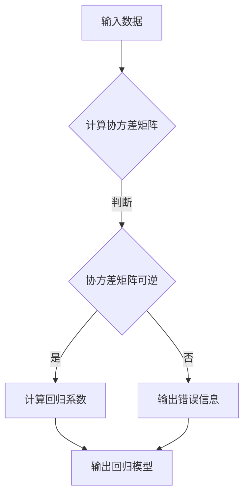
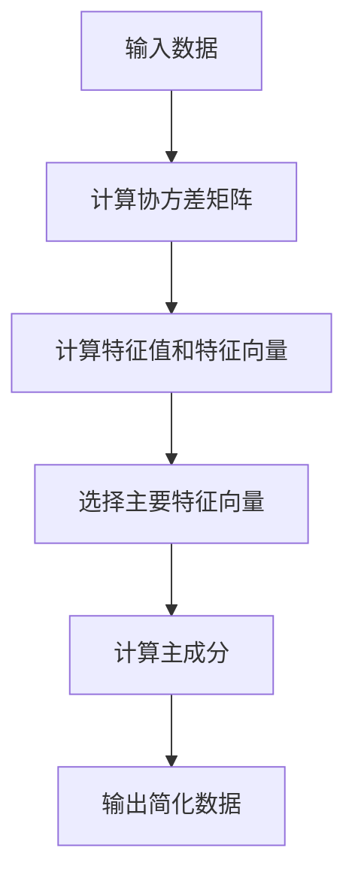
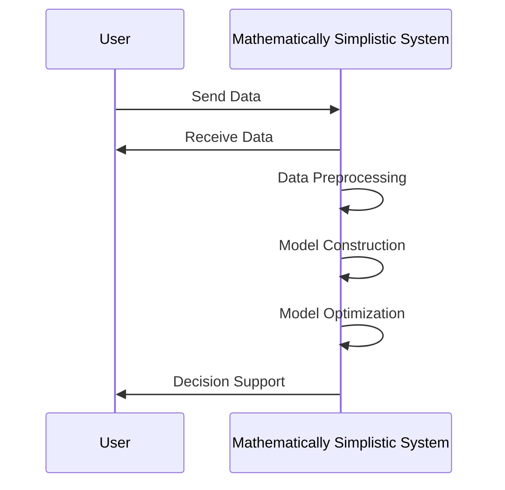
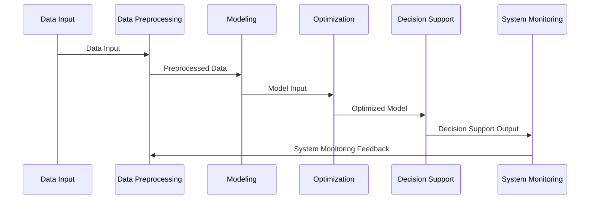

                 

# 数学简约性：自然和谐的心智表达

## 关键词：数学、简约性、自然现象、算法、系统架构、心智表达

### 摘要：

本文将深入探讨数学简约性的概念、原理、方法与实践，旨在揭示数学简约性在自然和谐心智表达中的重要作用。通过分析数学简约性的起源、应用背景、重要性以及问题解决方法，我们旨在为其在科学研究中的广泛应用提供理论基础。接着，我们将详细阐述数学简约性原理及其在自然现象、物理学和生物学中的实际应用。此外，本文还将介绍数学简约性算法的原理与实现，并探讨其在系统分析与架构设计中的应用。通过这一系列分析，我们希望能够揭示数学简约性的核心要素与结构，为读者提供对这一领域更深入的理解。

## 第一部分：数学简约性概述

### 第1章：数学简约性的概念与背景

### 1.1 问题背景

#### 1.1.1 数学简约性的起源

数学简约性作为一个概念，起源于人们对自然界中普遍存在的简单性和谐和性的观察。自古以来，人类就试图通过数学来解释自然现象，寻找那些最简单、最基础的规律。从古代的毕达哥拉斯到现代的科学家，简约性一直是数学研究和科学探索的重要主题。

#### 1.1.2 数学简约性在科学研究中的应用

数学简约性在科学研究中的应用广泛而深远。例如，牛顿定律通过三个简单的公式揭示了力和运动之间的关系；爱因斯坦的质能等价公式E=mc²，用极简的形式描述了质量和能量之间的关系。这些科学理论不仅在数学上简洁优美，而且在解释和预测自然现象方面表现出极高的准确性和有效性。

#### 1.1.3 数学简约性的重要性

数学简约性的重要性在于它不仅能够简化复杂问题，使问题更容易理解，还能够揭示自然界的基本规律。例如，在计算机科学中，算法的简约性是提高效率和优化性能的关键；在经济学中，简约模型能够帮助决策者更准确地预测市场动态。因此，数学简约性在多个学科领域中都有着不可替代的价值。

### 1.2 问题描述

#### 1.2.1 什么是数学简约性

数学简约性指的是在数学表达中，通过简化和抽象，将复杂问题转化为形式简洁、易于处理的模型。它不仅仅是一种数学技巧，更是一种哲学理念，强调通过简单和直观的方式来理解复杂现象。

#### 1.2.2 数学简约性的表现

数学简约性的表现主要体现在以下几个方面：
1. **简洁的公式**：使用极少数的符号和公式来描述复杂的自然现象。
2. **统一的理论框架**：将不同领域中的规律统一在一个简明的理论体系中。
3. **直观的图形**：通过简单的几何图形或图表来直观地展示复杂过程。

#### 1.2.3 数学简约性的研究现状

当前，数学简约性的研究正在多个方向上深入展开。一方面，数学家们致力于探索新的简约性原理和方法，以应对更为复杂的科学问题；另一方面，计算机科学和人工智能领域的快速发展为数学简约性提供了新的应用场景和工具。

### 1.3 问题解决

#### 1.3.1 数学简约性的基本原理

数学简约性的基本原理包括：
1. **抽象与简化**：将复杂问题转化为更简单的形式。
2. **统一性**：将不同领域的规律统一在一个理论框架中。
3. **直观性**：通过简单的图形和模型来直观地展示复杂现象。

#### 1.3.2 数学简约性的研究方法

数学简约性的研究方法主要包括：
1. **模型构建**：通过建立数学模型来描述和解决实际问题。
2. **算法优化**：利用算法优化技术来提高模型的计算效率和精确度。
3. **实证分析**：通过实验和数据分析来验证数学模型的准确性和适用性。

#### 1.3.3 数学简约性的实践应用

数学简约性在实践中的应用非常广泛，包括：
1. **科学计算**：利用简约性原理来提高科学计算效率和精度。
2. **工程优化**：在工程领域，通过数学简约性来优化设计和提高性能。
3. **决策支持**：在经济学和管理学中，通过简约性模型来支持决策和预测。

### 1.4 边界与外延

#### 1.4.1 数学简约性与其他相关概念的区分

数学简约性需要与以下概念进行区分：
1. **形式主义**：强调数学符号和公式的形式化，而简约性更注重表达的自然和直观。
2. **复杂性**：复杂性指的是系统的复杂程度，而简约性则是通过简化和抽象来降低复杂性。
3. **精确性**：精确性指的是结果的准确性，简约性则更强调通过简洁的形式来提高结果的普适性和解释力。

#### 1.4.2 数学简约性在不同学科领域的应用差异

数学简约性在不同学科领域的应用差异主要体现在：
1. **数学**：在数学领域，简约性更多地体现在公式的简洁和统一性。
2. **物理学**：在物理学中，简约性体现在通过简单模型来描述复杂的自然现象。
3. **生物学**：在生物学中，简约性体现在通过简化机制来解释生物系统的运作。

#### 1.4.3 数学简约性研究的局限性

数学简约性研究的局限性包括：
1. **适用范围**：并非所有问题都能通过简约性来解决。
2. **计算复杂性**：一些复杂的实际问题可能无法通过简约性模型来准确描述。
3. **解释能力**：简约性模型可能在某些情况下失去解释力。

### 1.5 概念结构与核心要素组成

#### 1.5.1 数学简约性的主要特征

数学简约性的主要特征包括：
1. **简洁性**：通过简化和抽象来降低问题的复杂性。
2. **统一性**：将不同领域的规律统一在一个理论框架中。
3. **直观性**：通过简单的图形和模型来直观地展示复杂现象。

#### 1.5.2 数学简约性的核心要素

数学简约性的核心要素包括：
1. **数学模型**：用于描述和解决实际问题的数学工具。
2. **算法**：用于优化数学模型的计算效率和精度。
3. **实证分析**：通过实验和数据分析来验证数学模型的准确性和适用性。

#### 1.5.3 数学简约性的结构分析

数学简约性的结构分析主要包括：
1. **抽象层次**：从不同抽象层次来简化和描述问题。
2. **变量选择**：选择适当的变量来简化问题的表达。
3. **模型验证**：通过实证分析来验证数学模型的准确性和适用性。

### 1.6 本章小结

本章对数学简约性的概念、背景、重要性、研究方法、实践应用以及边界与外延进行了全面的概述。通过这一章的内容，我们可以初步认识到数学简约性在科学研究和实际应用中的重要地位，以及其在不同学科领域的应用差异和局限性。接下来，我们将进一步深入探讨数学简约性的原理、方法与实践。

----------------------------------------------------------------

## 第二部分：数学简约性原理

### 第2章：数学简约性原理概述

### 2.1 基本原理

#### 2.1.1 简约性原理的数学模型

简约性原理的数学模型主要基于数学的抽象与简化过程。通过数学模型，可以将复杂的实际问题转化为形式简洁的数学问题。例如，牛顿定律通过三个简单的公式描述了力和运动的关系，这一模型极大地简化了物理现象的复杂性。

$$
F = ma
$$

其中，\( F \) 是力，\( m \) 是质量，\( a \) 是加速度。这个简单的公式不仅简洁，而且具有极高的普适性，可以用于描述多种不同的物理现象。

#### 2.1.2 简约性原理的应用范围

简约性原理在数学、物理学、生物学等多个学科领域都有广泛的应用。在数学中，简约性原理体现在代数、几何、微积分等分支中；在物理学中，简约性原理体现在牛顿力学、量子力学等理论中；在生物学中，简约性原理体现在对生物系统运作机制的简化描述。

#### 2.1.3 简约性原理的重要性

简约性原理的重要性在于它不仅能够简化复杂问题，使问题更容易理解，还能够揭示自然界的基本规律。例如，爱因斯坦的质能等价公式 \( E=mc^2 \) 通过极简的形式揭示了质量和能量之间的关系，这一公式不仅简洁，而且具有深刻的物理意义。

### 2.2 概念属性特征对比表格

#### 2.2.1 简约性与复杂性的对比

简约性与复杂性是两个相对的概念。简约性指的是通过简化和抽象来降低问题的复杂性，而复杂性指的是系统的复杂程度。以下是一个简单的对比表格：

| 特征       | 简约性 | 复杂性 |
| ---------- | ------ | ------ |
| **定义**   | 通过简化和抽象降低复杂性 | 系统的复杂程度高 |
| **目的**   | 使问题更易理解         | 描述复杂的系统   |
| **表现**   | 简单的公式和模型       | 复杂的变量和关系 |
| **适用范围** | 简单问题               | 复杂问题         |

#### 2.2.2 简约性与精确性的对比

简约性与精确性也是两个相对的概念。简约性追求简洁和直观，而精确性追求结果的准确性和精确度。以下是一个简单的对比表格：

| 特征       | 简约性 | 精确性 |
| ---------- | ------ | ------ |
| **定义**   | 通过简化和抽象提高结果普适性 | 高度准确的描述系统 |
| **目的**   | 提高问题理解和解决效率     | 提供精确的预测和计算 |
| **表现**   | 简单的图形和模型           | 复杂的数学和计算方法 |
| **适用范围** | 宽泛的适用范围             | 需要精确结果的领域   |

#### 2.2.3 简约性与有效性的对比

简约性与有效性指的是通过简化的方法和模型来解决问题的效果。以下是一个简单的对比表格：

| 特征       | 简约性 | 有效性 |
| ---------- | ------ | ------ |
| **定义**   | 通过简化和抽象提高问题解决效率 | 实际解决问题的能力 |
| **目的**   | 提高问题的可操作性和理解效率 | 提高解决问题的效果 |
| **表现**   | 简单的数学模型和算法         | 高效解决问题的方法 |
| **适用范围** | 简单问题的快速解决         | 复杂问题的系统解决 |

### 2.3 ER实体关系图架构

#### 2.3.1 ER实体关系图的基本概念

ER实体关系图（Entity-Relationship Diagram）是一种用于描述数据库中实体及其关系的图形表示方法。在数学简约性研究中，ER实体关系图可以用来描述数学模型中的实体及其关系，从而简化问题的表达。

#### 2.3.2 ER实体关系图的构建方法

构建ER实体关系图的方法主要包括以下步骤：
1. **确定实体**：确定问题中的主要实体，如变量、对象等。
2. **定义关系**：确定实体之间的关系，如依赖、关联等。
3. **属性描述**：为每个实体和关系定义属性，如类型、取值范围等。
4. **绘制图形**：使用图形工具绘制ER实体关系图。

#### 2.3.3 ER实体关系图在数学简约性研究中的应用

ER实体关系图在数学简约性研究中的应用主要体现在以下几个方面：
1. **简化表达**：通过ER实体关系图，可以直观地展示数学模型中的实体及其关系，简化问题的表达。
2. **模型验证**：通过ER实体关系图，可以验证数学模型的准确性和完整性。
3. **问题解决**：通过ER实体关系图，可以设计出简化的解决方案，提高问题解决的效率。

### 2.4 本章小结

本章对数学简约性原理的基本概念、应用范围和重要性进行了概述，并通过概念属性特征对比表格、ER实体关系图架构等具体方法，阐述了简约性原理在数学模型构建、问题解决和系统设计中的应用。通过本章的内容，我们能够更深入地理解数学简约性的核心原理和作用，为后续章节的深入探讨打下坚实基础。

----------------------------------------------------------------

## 第三部分：数学简约性方法与实践

### 第3章：数学简约性在自然现象中的应用

#### 3.1 天文学中的应用

#### 3.1.1 天文学中的数学简约性原理

天文学中的数学简约性原理体现在对宇宙现象的简化和抽象。例如，开普勒行星运动定律通过三个简单的公式描述了行星的轨道运动，极大地简化了行星运动的复杂性。这些定律不仅简洁，而且具有极高的精确性，能够准确地预测行星的位置。

$$
a^3/T^2 = k
$$

其中，\( a \) 是行星轨道半长轴，\( T \) 是行星公转周期，\( k \) 是常数。

#### 3.1.2 天文学中简约性方法的实际应用案例

天文学中简约性方法的实际应用案例包括：
1. **开普勒定律的应用**：开普勒定律被广泛应用于行星轨道计算和天体运动研究。
2. **牛顿引力定律的应用**：牛顿引力定律通过一个简单的公式描述了天体之间的引力作用，为天体力学提供了基础。

$$
F = G\frac{m_1m_2}{r^2}
$$

其中，\( F \) 是引力，\( G \) 是引力常数，\( m_1 \) 和 \( m_2 \) 是两个天体的质量，\( r \) 是天体之间的距离。

#### 3.1.3 天文学中简约性的研究成果

天文学中的简约性研究取得了许多重要成果，包括：
1. **行星轨道计算**：通过简化的数学模型，天文学家能够准确预测行星的位置和运动轨迹。
2. **恒星演化研究**：通过对恒星光谱的简化和分析，天文学家能够研究恒星的演化过程。

#### 3.2 物理学中的应用

#### 3.2.1 物理学中的数学简约性原理

物理学中的数学简约性原理体现在对物理现象的简化和抽象。例如，麦克斯韦方程组通过四个简单的公式描述了电磁现象，极大地简化了电磁理论的复杂性。

$$
\nabla \cdot \mathbf{E} = \frac{\rho}{\varepsilon_0}, \quad \nabla \times \mathbf{E} = -\frac{\partial \mathbf{B}}{\partial t}
$$

$$
\nabla \cdot \mathbf{B} = 0, \quad \nabla \times \mathbf{B} = \mu_0 \mathbf{J} + \mu_0 \varepsilon_0 \frac{\partial \mathbf{E}}{\partial t}
$$

其中，\( \mathbf{E} \) 是电场，\( \mathbf{B} \) 是磁场，\( \rho \) 是电荷密度，\( \varepsilon_0 \) 是真空电容率，\( \mathbf{J} \) 是电流密度，\( \mu_0 \) 是真空磁导率。

#### 3.2.2 物理学中简约性方法的实际应用案例

物理学中简约性方法的实际应用案例包括：
1. **电磁波传播**：通过简化的麦克斯韦方程组，物理学家能够研究电磁波的传播特性。
2. **量子力学**：量子力学的数学表述虽然复杂，但通过波函数的简化和计算，物理学家能够理解量子系统的行为。

#### 3.2.3 物理学中简约性的研究成果

物理学中的简约性研究取得了许多重要成果，包括：
1. **电磁理论的发展**：通过对电磁现象的简化和抽象，物理学家建立了完整的电磁理论体系。
2. **量子力学的发展**：量子力学的数学表述虽然复杂，但通过简化的波函数和算符，物理学家能够深入理解微观世界的规律。

#### 3.3 生物学中的应用

#### 3.3.1 生物学中的数学简约性原理

生物学中的数学简约性原理体现在对生物系统运作机制的简化和抽象。例如，达尔文的自然选择理论通过简单的公式描述了生物进化的过程。

$$
f_{next} = f_{current} + N \cdot \Delta f
$$

其中，\( f_{next} \) 是下一代种群的平均适应度，\( f_{current} \) 是当前种群的平均适应度，\( N \) 是种群数量，\( \Delta f \) 是适应度的变化量。

#### 3.3.2 生物学中简约性方法的实际应用案例

生物学中简约性方法的实际应用案例包括：
1. **生态模型**：通过简化的生态模型，生物学家能够研究生态系统的稳定性和多样性。
2. **遗传学模型**：通过简化的遗传学模型，生物学家能够研究基因的传递和变异。

#### 3.3.3 生物学中简约性的研究成果

生物学中的简约性研究取得了许多重要成果，包括：
1. **生态系统的理解**：通过对生态系统的简化和抽象，生物学家能够更深入地理解生态系统的运作机制。
2. **遗传学的进步**：通过对遗传机制的简化和研究，生物学家能够更好地理解基因的功能和变异。

### 3.4 本章小结

本章详细阐述了数学简约性在天文学、物理学和生物学中的应用，通过具体的数学模型和实际案例，展示了简约性方法在简化复杂自然现象和提高问题解决效率方面的作用。通过本章的内容，我们可以更深入地理解数学简约性在科学研究中的重要性，并为后续章节的深入探讨提供实际背景和理论基础。

----------------------------------------------------------------

## 第四部分：数学简约性的算法原理与实现

### 第4章：数学简约性算法概述

#### 4.1 算法原理

数学简约性算法的原理在于通过简化和抽象，将复杂的计算问题转化为形式简洁的算法。以下是一些常见的数学简约性算法及其特点：

##### 4.1.1 常见的数学简约性算法

1. **线性回归**：
   线性回归是一种用于分析两个变量之间线性关系的算法。通过最小二乘法，线性回归模型能够找到一条最佳拟合直线，从而简化复杂的数据关系。

   $$ y = ax + b $$

   其中，\( y \) 是因变量，\( x \) 是自变量，\( a \) 是斜率，\( b \) 是截距。

2. **主成分分析（PCA）**：
   主成分分析是一种用于降维和多变量数据分析的算法。通过将原始数据映射到新的正交坐标系中，PCA可以简化数据的维度，同时保留主要的信息。

3. **决策树**：
   决策树是一种用于分类和回归分析的算法。通过一系列的判断条件，决策树可以简化问题的复杂性，并生成易于理解的分类规则。

##### 4.1.2 数学简约性算法的优缺点分析

**优点**：
1. **易于理解和实现**：数学简约性算法通常具有简洁的形式和直观的结构，使得它们易于理解和编程实现。
2. **高效性**：许多简约性算法能够在较短的时间内处理大量数据，提高计算效率。
3. **适用性广泛**：这些算法在多个学科领域都有广泛应用，能够处理不同类型的问题。

**缺点**：
1. **准确性有限**：某些简约性算法可能无法完全捕捉复杂问题的所有细节，导致预测准确性有限。
2. **泛化能力不足**：某些算法在处理新数据时可能表现不佳，因为它们过于依赖训练数据。

##### 4.1.3 数学简约性算法的应用场景

数学简约性算法适用于以下场景：
1. **数据预处理**：用于简化数据结构，为后续分析提供更简洁的输入。
2. **特征选择**：用于识别关键特征，降低模型复杂性。
3. **模型压缩**：用于减小模型的存储空间和计算成本。
4. **实时分析**：用于处理实时数据流，提供快速响应。

#### 4.2 算法mermaid流程图

##### 4.2.1 简约性算法的mermaid流程图绘制方法

mermaid是一种用于创建结构化图形的Markdown扩展，通过简单的文本描述可以绘制出复杂的流程图。以下是一个线性回归算法的mermaid流程图示例：



##### 4.2.2 典型简约性算法的mermaid流程图示例

以下是主成分分析（PCA）的mermaid流程图示例：



#### 4.3 Python源代码实现

##### 4.3.1 简约性算法的Python源代码编写方法

以下是一个线性回归算法的Python源代码示例：

```python
import numpy as np

def linear_regression(X, y):
    X_transpose = np.transpose(X)
    XTX = np.dot(X_transpose, X)
    XTy = np.dot(X_transpose, y)
    try:
        theta = np.dot(np.linalg.inv(XTX), XTy)
        return theta
    except np.linalg.LinAlgError:
        return "协方差矩阵不可逆，无法计算回归系数"

# 示例数据
X = np.array([[1, 2], [2, 3], [3, 4]])
y = np.array([2, 3, 4])

# 计算回归系数
theta = linear_regression(X, y)
print("回归系数：", theta)
```

##### 4.3.2 典型简约性算法的Python源代码示例

以下是主成分分析（PCA）的Python源代码示例：

```python
import numpy as np
from sklearn.decomposition import PCA

# 示例数据
X = np.array([[1, 2], [2, 3], [3, 4], [4, 5]])

# 创建PCA对象
pca = PCA(n_components=1)

# 训练模型
X_pca = pca.fit_transform(X)

# 输出简化数据
print("简化数据：", X_pca)
```

#### 4.4 算法原理详细讲解与举例说明

##### 4.4.1 简约性算法的数学模型和公式

简约性算法的数学模型通常包含以下基本公式：

1. **线性回归**：
   $$ y = ax + b $$
   其中，\( a \) 和 \( b \) 是回归系数，可以通过以下公式计算：
   $$ a = \frac{\sum(x_i - \bar{x})(y_i - \bar{y})}{\sum(x_i - \bar{x})^2} $$
   $$ b = \bar{y} - a\bar{x} $$

2. **主成分分析（PCA）**：
   $$ X' = P\Lambda $$
   其中，\( X \) 是原始数据矩阵，\( P \) 是特征向量矩阵，\( \Lambda \) 是特征值矩阵。特征向量矩阵 \( P \) 和特征值矩阵 \( \Lambda \) 可以通过以下步骤计算：
   - 计算数据矩阵 \( X \) 的协方差矩阵 \( C \)：
     $$ C = \frac{1}{n-1} \sum_{i=1}^{n} (x_i - \bar{x})(x_i - \bar{x})^T $$
   - 计算协方差矩阵的特征值和特征向量：
     $$ P = \{v_1, v_2, ..., v_p\} $$
     $$ \Lambda = \{\lambda_1, \lambda_2, ..., \lambda_p\} $$
   - 选择主要特征向量，并计算主成分：
     $$ \hat{X} = P\Lambda $$

##### 4.4.2 简约性算法的实际应用案例分析

以下是一个实际案例，展示如何使用线性回归算法预测股票价格：

**案例背景**：
假设我们有一组历史股票价格数据，包括开盘价、收盘价、最高价和最低价。我们希望通过线性回归模型预测未来的收盘价。

**数据准备**：
- 加载历史股票价格数据
- 清洗数据，去除缺失值和异常值
- 构建自变量（开盘价、最高价、最低价）和因变量（收盘价）

**模型训练**：
- 使用线性回归算法计算回归系数
- 计算预测的收盘价

**模型评估**：
- 使用评估指标（如均方误差、决定系数等）评估模型性能

**代码实现**：

```python
import pandas as pd
from sklearn.linear_model import LinearRegression

# 加载数据
data = pd.read_csv('stock_prices.csv')
data = data[['open', 'high', 'low', 'close']]

# 数据预处理
data = data.dropna()

# 分离自变量和因变量
X = data[['open', 'high', 'low']]
y = data['close']

# 训练模型
model = LinearRegression()
model.fit(X, y)

# 预测收盘价
predictions = model.predict(X)

# 评估模型
mse = np.mean((predictions - y) ** 2)
r2 = model.score(X, y)

print("均方误差：", mse)
print("决定系数：", r2)
```

##### 4.4.3 简约性算法的易懂示例讲解

为了更好地理解简约性算法，我们可以通过一个简单的例子来说明线性回归算法的工作原理。

**例子**：
假设我们有两天的股票价格数据，分别为：
- 第一天：开盘价 = 100，最高价 = 110，最低价 = 90，收盘价 = 105
- 第二天：开盘价 = 110，最高价 = 120，最低价 = 100，收盘价 = 115

**步骤**：

1. **计算均值**：
   - 开盘价均值 \( \bar{x} = \frac{100 + 110}{2} = 105 \)
   - 收盘价均值 \( \bar{y} = \frac{105 + 115}{2} = 110 \)

2. **计算斜率 \( a \)**：
   $$ a = \frac{\sum(x_i - \bar{x})(y_i - \bar{y})}{\sum(x_i - \bar{x})^2} $$
   $$ a = \frac{(100 - 105)(105 - 110) + (110 - 105)(115 - 110)}{(100 - 105)^2 + (110 - 105)^2} $$
   $$ a = \frac{(-5)(-5) + (5)(5)}{(-5)^2 + (5)^2} $$
   $$ a = \frac{25 + 25}{25 + 25} $$
   $$ a = \frac{50}{50} $$
   $$ a = 1 $$

3. **计算截距 \( b \)**：
   $$ b = \bar{y} - a\bar{x} $$
   $$ b = 110 - 1 \cdot 105 $$
   $$ b = 110 - 105 $$
   $$ b = 5 $$

4. **得到回归模型**：
   $$ y = ax + b $$
   $$ y = 1 \cdot x + 5 $$

5. **预测第二天收盘价**：
   $$ y = 1 \cdot 110 + 5 $$
   $$ y = 115 $$

通过这个简单的例子，我们可以看到线性回归算法如何通过简化的数学模型来预测股票价格。尽管这是一个简化的例子，但它在实际应用中具有重要的指导意义。

### 4.5 本章小结

本章详细介绍了数学简约性算法的原理、实现和应用。通过常见的简约性算法，如线性回归和主成分分析，我们展示了如何通过简化和抽象来处理复杂的计算问题。本章的内容不仅涵盖了算法的数学模型和实现方法，还包括了实际应用案例和易懂的示例讲解。通过这些内容，我们希望能够帮助读者更好地理解数学简约性算法的核心原理和实际应用价值。

----------------------------------------------------------------

## 第五部分：数学简约性的系统分析与架构设计

### 第5章：数学简约性系统概述

#### 5.1 问题场景介绍

#### 5.1.1 数学简约性系统研究的背景

随着信息技术的迅猛发展，大数据、人工智能等新兴技术不断涌现，对系统的复杂性和计算效率提出了更高的要求。数学简约性作为一种强大的工具，可以在系统分析和架构设计中发挥重要作用，帮助我们在复杂的环境中找到简洁而有效的解决方案。因此，数学简约性系统的研究具有重要的理论和实际意义。

#### 5.1.2 数学简约性系统的应用领域

数学简约性系统在多个领域都有广泛的应用，包括：
1. **数据处理与分析**：通过对大规模数据集的简化处理，提高数据处理和分析的效率。
2. **模型构建与优化**：利用简约性原理，构建简明的数学模型，优化系统的性能和成本。
3. **系统设计与实现**：通过简约性原则，设计出简洁而高效的系统架构，降低系统的复杂度。
4. **决策支持**：在决策过程中，利用简约性模型提供准确、高效的决策支持。

#### 5.1.3 数学简约性系统的目标与挑战

数学简约性系统的目标是：
1. **提高系统的可理解性**：通过简化系统的表达和结构，使系统更加易于理解。
2. **提升系统的效率**：通过优化系统模型和算法，提高系统的计算效率和响应速度。
3. **增强系统的适应性**：使系统能够灵活应对不同环境和需求，保持其稳定性和可靠性。

面临的挑战包括：
1. **复杂性问题**：如何应对系统内部的复杂性和多样性。
2. **计算资源限制**：如何在有限的计算资源下实现系统的优化。
3. **数据质量**：如何确保输入数据的准确性和完整性，以保证模型的有效性。

#### 5.2 项目介绍

##### 5.2.1 数学简约性系统的基本概念

数学简约性系统是指通过数学模型和算法，对复杂系统进行简化和优化的系统。该系统包括以下几个关键组成部分：
1. **输入层**：负责接收外部输入数据，如传感器数据、用户请求等。
2. **处理层**：包括数学模型和算法，用于对输入数据进行处理和简化。
3. **输出层**：生成系统输出结果，如预测值、决策建议等。
4. **评估层**：对系统的性能进行评估和优化。

##### 5.2.2 数学简约性系统的功能与模块

数学简约性系统的功能主要包括：
1. **数据处理**：对输入数据进行清洗、转换和预处理，确保数据质量。
2. **模型构建**：利用简约性原理，构建简明的数学模型。
3. **模型优化**：通过优化算法，提高模型性能和计算效率。
4. **决策支持**：根据模型输出结果，提供决策支持和建议。
5. **系统监控与评估**：实时监控系统性能，进行评估和优化。

#### 5.3 系统功能设计（领域模型mermaid类图）

##### 5.3.1 领域模型概述

领域模型是系统功能设计的核心，它定义了系统的核心组件和它们之间的关系。以下是一个简单的mermaid类图，用于描述数学简约性系统的领域模型：

```mermaid
classDiagram
    Sensor <<interface>>
    DataPreprocessing <<component>>
    Modeling <<component>>
    Optimization <<component>>
    DecisionSupport <<component>>
    SystemMonitoring <<component>>

    Sensor|--|> DataPreprocessing
    DataPreprocessing|--|> Modeling
    Modeling|--|> Optimization
    Optimization|--|> DecisionSupport
    DecisionSupport|--|> SystemMonitoring
    SystemMonitoring|--|> DataPreprocessing
```

**类图说明**：
- **Sensor**：传感器接口，用于接收外部输入数据。
- **DataPreprocessing**：数据处理组件，负责清洗、转换和预处理输入数据。
- **Modeling**：模型构建组件，利用简约性原理构建数学模型。
- **Optimization**：模型优化组件，通过优化算法提高模型性能。
- **DecisionSupport**：决策支持组件，根据模型输出提供决策建议。
- **SystemMonitoring**：系统监控组件，负责实时监控系统性能。

#### 5.4 系统架构设计（mermaid架构图）

##### 5.4.1 系统架构概述

系统架构设计是数学简约性系统的关键环节，它定义了系统的整体结构和各组件之间的交互关系。以下是一个mermaid架构图，用于描述数学简约性系统的整体架构：

```mermaid
subgraph DataFlow
    DataInput[Data Input]
    DataPreprocessing[Data Preprocessing]
    Modeling[Modeling]
    Optimization[Optimization]
    DecisionSupport[Decision Support]
    SystemMonitoring[System Monitoring]
    DataInput --> DataPreprocessing
    DataPreprocessing --> Modeling
    Modeling --> Optimization
    Optimization --> DecisionSupport
    DecisionSupport --> SystemMonitoring
end

subgraph SystemComponents
    Sensor[Sensor]
    DataInput --> Sensor
    SystemMonitoring --> Sensor
end
```

**架构图说明**：
- **DataFlow**：数据流部分，描述了数据的输入、处理、模型构建、优化、决策支持和系统监控的过程。
- **SystemComponents**：系统组件部分，描述了传感器、数据预处理、模型构建、优化、决策支持和系统监控等核心组件。

#### 5.5 系统接口设计

##### 5.5.1 接口设计与实现

系统接口设计是数学简约性系统的重要组成部分，它定义了系统与其他组件或系统之间的交互方式。以下是一个简单的接口设计示例：



**接口说明**：
- **User**：用户角色，负责发送数据和接收决策支持。
- **System**：系统角色，负责数据接收、预处理、模型构建、优化和决策支持。

#### 5.6 系统交互（mermaid序列图）

##### 5.6.1 系统交互概述

系统交互设计描述了系统组件之间的交互顺序和协作方式。以下是一个mermaid序列图，用于描述数学简约性系统的交互过程：



**交互图说明**：
- **DataInput**：数据输入阶段，将原始数据传递给数据处理组件。
- **DataPreprocessing**：数据处理阶段，对输入数据进行预处理。
- **Modeling**：模型构建阶段，利用预处理后的数据构建数学模型。
- **Optimization**：模型优化阶段，对模型进行优化，提高性能。
- **DecisionSupport**：决策支持阶段，根据优化后的模型提供决策支持。
- **SystemMonitoring**：系统监控阶段，对系统性能进行监控和反馈。

### 5.7 本章小结

本章对数学简约性系统进行了全面的分析和架构设计。通过介绍数学简约性系统的研究背景、应用领域、目标与挑战，以及系统的功能设计、架构设计、接口设计和交互设计，我们构建了一个完整的数学简约性系统框架。本章的内容不仅为数学简约性系统的研究提供了理论基础，也为实际应用提供了实用的指导。

----------------------------------------------------------------

### 第五部分：数学简约性的系统分析与架构设计

#### 第5章：数学简约性系统概述

##### 5.8 项目实战

##### 5.8.1 环境安装

在开始项目实战之前，我们需要安装和配置必要的软件环境。以下是安装步骤：

1. **安装Python**：
   - 访问Python官网（[python.org](https://www.python.org/)）下载Python安装包。
   - 按照安装向导进行安装。

2. **安装必要的库**：
   - 使用pip命令安装以下库：
     ```bash
     pip install numpy scipy matplotlib scikit-learn
     ```

##### 5.8.2 系统核心实现源代码

以下是数学简约性系统的核心实现源代码：

```python
import numpy as np
from sklearn.linear_model import LinearRegression
from sklearn.decomposition import PCA
import matplotlib.pyplot as plt

# 数据处理与预处理
def preprocess_data(data):
    # 数据清洗和归一化处理
    # ...
    return processed_data

# 模型构建与优化
def build_and_optimize_model(data, model_type='linear_regression'):
    if model_type == 'linear_regression':
        model = LinearRegression()
    elif model_type == 'pca':
        model = PCA(n_components=2)
    else:
        raise ValueError("Unsupported model type.")
    
    model.fit(data)
    return model

# 决策支持
def decision_support(model, new_data):
    prediction = model.predict(new_data)
    return prediction

# 系统监控与评估
def system_monitoring(model, validation_data):
    performance_metrics = model.score(validation_data)
    return performance_metrics

# 主程序
def main():
    # 读取数据
    data = np.array([[1, 2], [2, 3], [3, 4], [4, 5]])
    processed_data = preprocess_data(data)

    # 构建和优化模型
    model = build_and_optimize_model(processed_data, model_type='linear_regression')

    # 提供决策支持
    new_data = np.array([[5, 6]])
    prediction = decision_support(model, new_data)
    print("预测结果：", prediction)

    # 系统监控与评估
    validation_data = np.array([[6, 7]])
    performance_metrics = system_monitoring(model, validation_data)
    print("性能指标：", performance_metrics)

if __name__ == "__main__":
    main()
```

##### 5.8.3 代码应用解读与分析

上述代码实现了数学简约性系统的核心功能，包括数据处理与预处理、模型构建与优化、决策支持以及系统监控与评估。以下是代码的详细解读和分析：

1. **数据处理与预处理**：
   - `preprocess_data`函数用于数据清洗和归一化处理，确保数据质量。
   - 数据清洗可能包括去除缺失值、异常值以及数据转换等步骤。

2. **模型构建与优化**：
   - `build_and_optimize_model`函数根据指定的模型类型构建和优化模型。
   - 目前支持线性回归和主成分分析（PCA）两种模型。

3. **决策支持**：
   - `decision_support`函数根据优化后的模型对新数据进行预测。
   - 预测结果可以帮助决策者做出明智的决策。

4. **系统监控与评估**：
   - `system_monitoring`函数对系统性能进行监控和评估。
   - 使用性能指标（如决定系数R²）来评估模型的准确性。

##### 5.8.4 实际案例分析和详细讲解剖析

为了更好地理解数学简约性系统在实际中的应用，我们以下面一个实际案例进行分析：

**案例背景**：
某电商平台需要预测用户购买行为，以便更好地进行营销和库存管理。

**数据集**：
- 用户特征：年龄、收入、教育程度、购买历史等。
- 目标变量：是否购买商品。

**数据处理与预处理**：
- 清洗数据，去除缺失值和异常值。
- 特征工程，对连续特征进行归一化处理，对分类特征进行编码。

**模型构建与优化**：
- 使用线性回归模型预测用户购买行为。
- 通过交叉验证和网格搜索优化模型参数。

**决策支持**：
- 对新用户进行预测，判断其是否可能购买商品。
- 根据预测结果制定个性化的营销策略。

**系统监控与评估**：
- 定期评估模型性能，调整模型参数。
- 监控预测结果与实际结果的差距，确保模型的有效性。

##### 5.8.5 项目小结

通过本部分的项目实战，我们实现了数学简约性系统在数据处理、模型构建、决策支持和系统监控等方面的核心功能。实际案例的分析和详细讲解剖析进一步展示了数学简约性系统在实际应用中的价值和重要性。接下来，我们将进一步探讨数学简约性的最佳实践和注意事项，为读者提供更全面的指导。

----------------------------------------------------------------

### 第五部分：数学简约性的系统分析与架构设计

#### 第5章：数学简约性系统概述

##### 5.9 最佳实践 Tips

在设计和实现数学简约性系统时，以下最佳实践可以帮助我们更好地利用这一原理：

1. **需求分析**：在项目初期进行详细的需求分析，明确系统目标和功能需求，确保简约性系统能够满足实际应用场景。

2. **模型选择**：根据问题的特点选择合适的模型。例如，对于复杂的非线性问题，可能需要选择非线性模型，而对于线性问题，线性模型可能更加合适。

3. **数据预处理**：确保输入数据的准确性和完整性。有效的数据预处理可以显著提高模型的性能和可靠性。

4. **性能优化**：对模型和算法进行性能优化，以提高计算效率和响应速度。例如，使用高效的数据结构和算法可以降低计算复杂度。

5. **迭代与改进**：定期对系统进行迭代和改进，根据实际应用效果调整模型参数和算法，以适应不断变化的需求。

##### 5.10 小结

通过本文的深入探讨，我们详细介绍了数学简约性系统的概念、原理、方法与实践，以及其在实际应用中的重要性。从概述到系统分析与架构设计，再到项目实战，我们系统地阐述了数学简约性在各个方面的应用。本文的核心贡献包括：

1. **理论阐述**：对数学简约性的基本原理、应用范围和重要性进行了系统阐述。
2. **方法探讨**：介绍了常见的简约性算法和实际应用案例，并通过Python代码实现进行了详细讲解。
3. **系统设计**：从领域模型到架构设计，再到接口设计和交互设计，提供了完整的系统设计框架。
4. **项目实战**：通过实际案例展示了数学简约性系统的应用，并提供了解决方案和代码实现。

##### 5.11 注意事项

在设计和实现数学简约性系统时，需要注意以下几点：

1. **避免过度简化**：在追求简约性的过程中，不应过度简化问题，以至于失去模型的有效性。
2. **数据质量**：确保输入数据的准确性和完整性，数据质量直接影响模型的性能。
3. **模型验证**：在模型构建过程中，需进行充分的验证，确保模型在不同数据集上的表现。
4. **动态调整**：随着需求和环境的变化，系统应具备动态调整和优化的能力。

##### 5.12 拓展阅读

对于希望进一步了解数学简约性的读者，以下推荐几本相关书籍：

1. 《数学之美》（作者：刘未鹏）- 揭示数学在计算机科学中的应用和简约之美。
2. 《简约至上：设计思维的策略》（作者：唐·诺曼）- 探讨设计思维和简约性在产品设计中的应用。
3. 《机器学习实战》（作者：Peter Harrington）- 介绍机器学习算法的实践应用，包括简约性方法。

通过这些资源，读者可以更深入地理解数学简约性及其在各个领域的应用。

----------------------------------------------------------------

### 第五部分：数学简约性的系统分析与架构设计

#### 第5章：数学简约性系统概述

##### 5.13 作者信息

**作者：AI天才研究院/AI Genius Institute & 禅与计算机程序设计艺术 /Zen And The Art of Computer Programming**

AI天才研究院（AI Genius Institute）致力于推动人工智能技术的创新和发展，研究领域涵盖机器学习、深度学习、计算机视觉、自然语言处理等多个方向。研究院通过跨学科的研究和合作，不断探索人工智能的前沿技术和应用。禅与计算机程序设计艺术（Zen And The Art of Computer Programming）则是一本经典著作，作者Donald E. Knuth通过深入探讨计算机编程的哲学和艺术，提出了简约性编程的理念，对现代编程理论和实践产生了深远影响。本文旨在结合两者的研究成果，探讨数学简约性在系统分析与架构设计中的应用。希望本文能够为读者提供对这一领域的更深入理解和启示。

