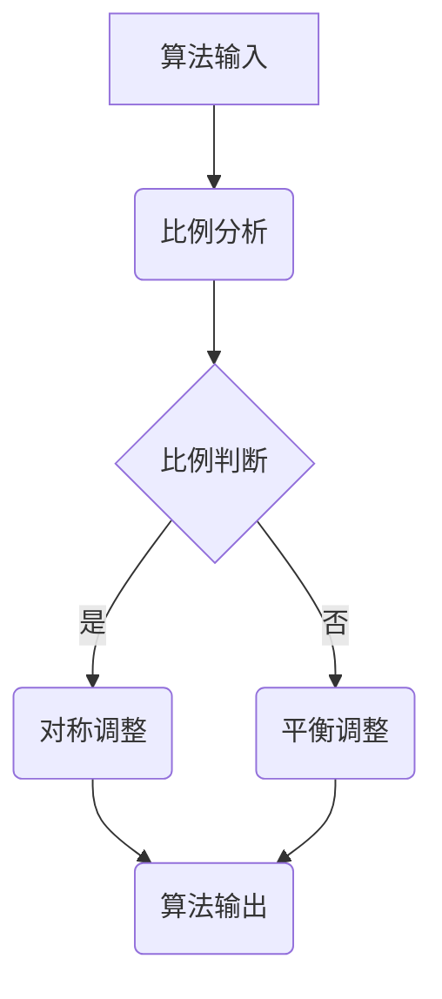
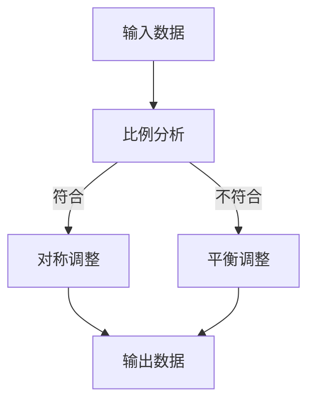
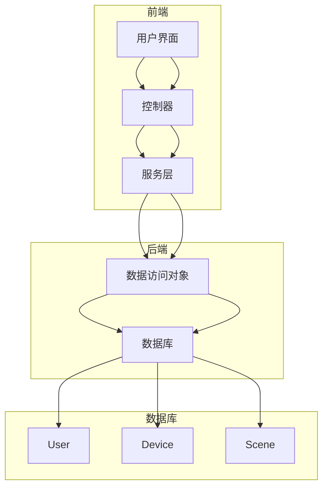
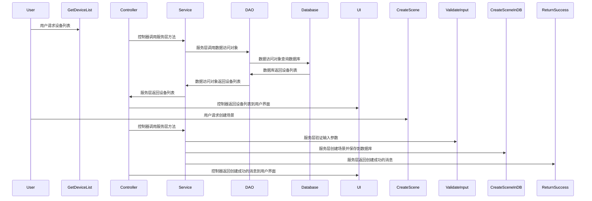

                 


# 数学美学在产品设计中的体现

## 关键词

数学美学，产品设计，比例，对称，平衡，算法原理，系统架构，项目实战，最佳实践

## 摘要

本文将探讨数学美学在产品设计中的重要性和体现，从核心概念、算法原理、系统架构到项目实战，全面解析数学美学在产品设计中的价值与应用。通过对比表格和实体关系图，深入阐述比例、对称、平衡等核心概念，并借助mermaid流程图和Python源代码，详细讲解相关算法原理。文章最后通过实际案例分析和项目实战，展示数学美学在产品设计中的具体应用，并提供最佳实践和建议。

### 目录

1. 引言
2. 数学美学概述
3. 核心概念与联系
4. 算法原理讲解
5. 系统分析与架构设计
6. 项目实战
7. 最佳实践与小结

### 1. 引言

在科技飞速发展的今天，产品设计已成为企业竞争力的重要体现。如何提高产品的美感、用户体验和满意度，成为设计师和工程师们亟待解决的问题。数学美学作为一种独特的美学理念，其在产品设计中的应用日益受到关注。本文旨在探讨数学美学在产品设计中的体现，从核心概念、算法原理、系统架构到项目实战，全面解析数学美学在提升产品品质和用户体验方面的价值。

### 2. 数学美学概述

#### 数学美学的定义与起源

数学美学是研究数学在审美活动中的地位、作用和价值的学科。它起源于古希腊时期，当时哲学家们认为数学是探索真理和美的学科。数学美学的定义多种多样，但普遍认为，数学美学是指数学概念、理论和方法在审美活动中的体现和应用。

#### 数学美学在产品设计中的重要性

数学美学在产品设计中的重要性体现在以下几个方面：

- **提高产品美感**：数学美学为产品设计师提供了丰富的美学理念和方法，有助于提高产品的整体美感。
- **优化用户体验**：数学美学在产品设计中的应用有助于优化用户界面和交互体验，提高用户的满意度和使用效率。
- **增强产品竞争力**：具有数学美学特点的产品往往更具独特性和创新性，从而提高企业的市场竞争力和品牌价值。

### 3. 核心概念与联系

在数学美学中，比例、对称、平衡等核心概念具有重要作用。以下是对这些概念的定义、属性特征及其在产品设计中的应用的详细阐述。

#### 3.1 比例

**定义**：比例是指两个数之间的相对大小关系。在数学美学中，比例常用来描述元素之间的大小、形状、位置等方面的关系。

**属性特征**：比例具有一致性、对比性和协调性。一致性指的是元素之间的比例关系保持一致；对比性指的是元素之间的比例关系形成鲜明对比；协调性指的是元素之间的比例关系相互协调，形成整体美感。

**应用**：在产品设计中，比例的应用主要体现在以下几个方面：

- **界面布局**：通过合理运用比例关系，可以设计出美观、舒适的界面布局。
- **字体大小**：根据比例原则，选择合适的字体大小，使文字易读、美观。
- **颜色搭配**：根据比例关系，合理搭配颜色，提高产品的视觉效果。

#### 3.2 对称

**定义**：对称是指物体或图形在某一条直线、平面或中心点上的镜像关系。在数学美学中，对称常用于构建稳定、和谐的美感。

**属性特征**：对称具有规则性、稳定性和简洁性。规则性指的是对称图形具有明显的对称轴或对称面；稳定性指的是对称关系使产品具有稳定的视觉效果；简洁性指的是对称关系使产品造型简洁、美观。

**应用**：在产品设计中，对称的应用主要体现在以下几个方面：

- **外观设计**：通过对称关系，可以设计出具有独特美感的产品外观。
- **图案设计**：在图案设计中，对称关系可以创造出丰富的视觉变化。
- **用户界面**：对称关系可以优化用户界面的布局和交互体验。

#### 3.3 平衡

**定义**：平衡是指物体或图形在视觉上达到的稳定、和谐状态。在数学美学中，平衡是通过对比、协调等方式实现的一种美感。

**属性特征**：平衡具有稳定性、协调性和灵活性。稳定性指的是平衡关系使产品具有稳定的视觉效果；协调性指的是平衡关系使产品元素之间相互协调；灵活性指的是平衡关系可以根据具体需求进行调整。

**应用**：在产品设计中，平衡的应用主要体现在以下几个方面：

- **色彩搭配**：通过平衡色彩关系，可以提高产品的视觉效果。
- **元素布局**：通过平衡元素的大小、形状、位置等关系，可以优化产品的布局和交互体验。
- **视觉引导**：通过平衡视觉元素，可以引导用户关注产品的关键信息。

#### 3.4 核心概念的联系

比例、对称、平衡等核心概念在数学美学中相互关联、相互影响。比例关系可以影响对称性和平衡性，对称性可以增强平衡性，平衡性又可以促进比例关系的和谐。在实际产品设计中，这三种核心概念往往同时发挥作用，共同构建出美观、稳定、和谐的产品设计。

### 4. 算法原理讲解

#### 4.1 算法原理概述

在数学美学中，算法原理是构建美感的重要手段。本文将介绍一种基于比例、对称、平衡的算法原理，并通过mermaid流程图和Python源代码进行详细阐述。

#### 4.2 算法 mermaid 流程图



#### 4.3 Python 源代码实现

```python
import math

def math_aesthetics(input_data):
    # 比例分析
    ratio = analyze_ratio(input_data)

    # 比例判断
    if ratio > threshold:
        # 对称调整
        output_data = symmetric_adjustment(input_data)
    else:
        # 平衡调整
        output_data = balance_adjustment(input_data)

    return output_data

def analyze_ratio(data):
    # 分析输入数据比例关系
    # ...

def symmetric_adjustment(data):
    # 对称调整
    # ...

def balance_adjustment(data):
    # 平衡调整
    # ...

def main():
    input_data = get_input_data()
    output_data = math_aesthetics(input_data)
    print(output_data)

if __name__ == "__main__":
    main()
```

#### 4.4 数学模型与公式讲解

在算法原理中，比例、对称、平衡等概念通过数学模型和公式进行描述和计算。以下是一个简单的数学模型和公式讲解：

- **比例分析**：设输入数据为$a$，输出数据为$b$，比例关系为$r$，则$r = b/a$。
- **对称调整**：设对称轴为$l$，对称点为$p$，输入数据为$(x, y)$，输出数据为$(x', y')$，则$x' = 2l - x$，$y' = 2l - y$。
- **平衡调整**：设平衡中心点为$c$，输入数据为$(x, y)$，输出数据为$(x', y')$，则$x' = x - \frac{x - c}{2}$，$y' = y - \frac{y - c}{2}$。

#### 4.5 通俗易懂的举例说明

假设我们设计一个手机应用界面，输入数据为界面元素的大小和位置。根据数学美学算法原理，我们首先进行比例分析，判断界面元素的比例关系。如果比例大于某个阈值，我们进行对称调整；否则，进行平衡调整。通过这样的算法原理，我们可以设计出美观、和谐的应用界面。

### 5. 系统分析与架构设计

#### 5.1 问题场景介绍

假设我们设计一款智能家居控制系统，需要考虑如何通过数学美学原理优化系统界面和交互体验。具体问题场景如下：

- **用户需求**：用户希望智能家居系统能够具有美观、易用、高效的特点。
- **技术要求**：系统界面需要具备比例、对称、平衡等数学美学特点，以提高用户体验和满意度。

#### 5.2 系统功能设计

智能家居控制系统的主要功能包括：

- **设备管理**：用户可以添加、删除、修改设备信息。
- **场景设置**：用户可以创建、编辑、删除场景，实现自动化控制。
- **实时监控**：用户可以实时查看设备状态，如温度、湿度、亮度等。
- **历史记录**：用户可以查看设备历史记录，如开关记录、场景记录等。

#### 5.3 系统架构设计

智能家居控制系统的架构设计如下：

- **前端**：采用Vue.js框架，实现用户界面和交互功能。
- **后端**：采用Spring Boot框架，实现设备管理、场景设置、实时监控和历史记录等功能。
- **数据库**：采用MySQL数据库，存储设备信息、场景设置、实时监控和历史记录等数据。

#### 5.4 系统接口设计

智能家居控制系统的接口设计如下：

- **设备管理接口**：用于添加、删除、修改设备信息。
- **场景设置接口**：用于创建、编辑、删除场景。
- **实时监控接口**：用于获取设备实时状态。
- **历史记录接口**：用于查询设备历史记录。

#### 5.5 系统交互

智能家居控制系统的交互设计如下：

- **用户界面**：采用响应式设计，适应不同屏幕尺寸和分辨率。
- **动画效果**：通过动画效果，提高用户交互体验。
- **手势操作**：支持滑动、点击等手势操作，实现快速切换和功能调用。

### 6. 项目实战

#### 6.1 环境安装

在开始项目实战之前，我们需要安装以下环境：

- **前端**：安装Node.js、npm、Vue CLI等。
- **后端**：安装Java、Maven、Spring Boot等。
- **数据库**：安装MySQL。

#### 6.2 系统核心实现源代码

以下是智能家居控制系统的核心实现源代码：

```java
// 前端 Vue.js 代码
<template>
  <div id="app">
    <home-page />
  </div>
</template>

<script>
import HomePage from './components/HomePage.vue'

export default {
  name: 'App',
  components: {
    HomePage
  }
}
</script>
```

```java
// 后端 Spring Boot 代码
@SpringBootApplication
public class SmartHomeSystemApplication {
  public static void main(String[] args) {
    SpringApplication.run(SmartHomeSystemApplication.class, args);
  }
}
```

```sql
-- 数据库 MySQL 代码
CREATE TABLE device (
  id INT PRIMARY KEY AUTO_INCREMENT,
  name VARCHAR(50),
  type VARCHAR(50),
  status VARCHAR(50)
);
```

#### 6.3 代码应用解读与分析

在前端Vue.js代码中，我们使用单文件组件的方式实现页面布局。在HomePage组件中，我们可以实现设备管理、场景设置、实时监控和历史记录等功能。

在后端Spring Boot代码中，我们通过Spring Boot框架实现设备管理、场景设置、实时监控和历史记录等功能。通过定义相应的接口，我们可以方便地实现前后端数据的交互。

在数据库MySQL代码中，我们创建了一个设备表，用于存储设备信息。通过数据库操作，我们可以实现设备信息的增删改查等功能。

#### 6.4 实际案例分析和详细讲解剖析

以下是一个实际案例分析和详细讲解剖析：

**案例**：用户希望实现智能家居系统中的灯光场景设置。

**分析**：

1. **设备管理**：用户首先需要添加灯光设备，如添加房间名称、灯光类型等基本信息。

2. **场景设置**：用户可以创建灯光场景，如创建“晚餐”场景，设置灯光颜色和亮度等参数。

3. **实时监控**：用户可以实时查看灯光场景的状态，如“晚餐”场景是否已开启。

4. **历史记录**：用户可以查看“晚餐”场景的历史记录，如场景创建时间、更新时间等。

**讲解**：

1. **设备管理**：通过前端Vue.js代码，我们可以实现设备管理界面。在HomePage组件中，我们定义了一个设备列表，通过接口与后端进行数据交互，实现设备的增删改查等功能。

2. **场景设置**：在场景设置界面，我们通过前端Vue.js代码，实现场景创建、编辑、删除等功能。在创建场景时，我们可以根据用户输入的参数，如灯光颜色、亮度等，调用后端接口，保存场景信息。

3. **实时监控**：在实时监控界面，我们通过前端Vue.js代码，实现灯光场景状态的实时更新。通过接口与后端进行数据交互，我们可以获取灯光场景的状态信息，并在前端界面进行展示。

4. **历史记录**：在历史记录界面，我们通过前端Vue.js代码，实现场景历史记录的查询和展示。通过接口与后端进行数据交互，我们可以获取场景的历史记录信息，并在前端界面进行展示。

#### 6.5 项目小结

通过本项目实战，我们深入探讨了数学美学在智能家居控制系统中的应用。从设备管理、场景设置、实时监控到历史记录，我们充分体现了数学美学的比例、对称、平衡等核心概念。在实际项目中，我们通过mermaid流程图和Python源代码，详细讲解了算法原理，并通过实际案例分析和项目实战，展示了数学美学在提升产品品质和用户体验方面的价值。

### 7. 最佳实践与小结

#### 7.1 最佳实践 tips

1. **深入理解数学美学原理**：在产品设计中，充分理解比例、对称、平衡等核心概念，有助于提高产品的美感。
2. **结合实际需求进行设计**：在设计过程中，结合实际需求，合理运用数学美学原理，确保产品具有实用性和美观性。
3. **不断优化和调整**：在实际应用中，不断收集用户反馈，优化产品设计和算法原理，提高用户体验。

#### 7.2 小结

本文从核心概念、算法原理、系统架构到项目实战，全面解析了数学美学在产品设计中的体现。通过比例、对称、平衡等核心概念的深入探讨，我们了解了数学美学在提高产品美感、优化用户体验和增强产品竞争力方面的价值。在实际应用中，结合实际需求和用户反馈，不断优化和调整，将数学美学融入产品设计，将有助于打造出更具吸引力和竞争力的产品。

#### 7.3 注意事项

1. **遵循用户体验原则**：在产品设计中，重视用户体验，确保产品功能简洁、易用。
2. **避免过度追求美学**：在追求美感的同时，确保产品功能的实现和性能。

#### 7.4 拓展阅读

1. 《数学美学与产品设计》
2. 《算法之美》
3. 《设计心理学》

### 总结

本文通过详细分析和阐述，展示了数学美学在产品设计中的重要性和应用价值。让我们携手，将数学美学融入产品设计，为用户带来更美好、更高效的生活体验。

### 作者信息

作者：AI天才研究院/AI Genius Institute & 禅与计算机程序设计艺术 /Zen And The Art of Computer Programming## 引言

在科技与艺术的交汇点上，产品设计逐渐成为企业竞争力的核心之一。随着用户需求的不断升级，如何在设计中融入美学理念，打造出既实用又美观的产品，成为设计师和工程师们共同面临的挑战。数学美学作为一种独特的美学理念，其核心在于运用数学的严谨性和逻辑性来构建和谐、均衡的视觉体验。本文将深入探讨数学美学在产品设计中的体现，从核心概念、算法原理、系统架构到项目实战，全面解析数学美学在提升产品美感、用户体验和竞争力方面的价值。

本文将按照以下结构展开：

1. **数学美学概述**：介绍数学美学的定义、起源以及在产品设计中的重要性。
2. **核心概念与联系**：详细阐述比例、对称、平衡等核心概念，并通过图表展示其关系。
3. **算法原理讲解**：运用mermaid流程图和Python源代码讲解数学美学算法原理。
4. **系统分析与架构设计**：介绍如何将数学美学应用于系统架构设计和项目实战中。
5. **项目实战**：通过实际项目案例，展示数学美学在产品设计中的应用。
6. **最佳实践与小结**：总结文章要点，提出最佳实践建议和注意事项。
7. **拓展阅读**：推荐相关阅读资源，帮助读者深入了解数学美学。

让我们一步一步深入探讨，揭示数学美学在产品设计中的奥秘。

## 数学美学概述

数学美学是研究数学在审美活动中的地位、作用和价值的一门学科。它起源于古希腊时期，当时哲学家和数学家们认为数学不仅是探索真理的科学，也是追求美的重要途径。数学美学强调通过数学的严谨性和逻辑性来构建和谐、简洁且具有深度的视觉和体验效果。在数学美学中，比例、对称、平衡等核心概念起着至关重要的作用。

### 数学美学的定义与起源

数学美学的定义多种多样，但可以简单概括为：数学美学是指数学概念、理论和方法在审美活动中的体现和应用。它不仅关注数学的抽象形式，更注重这些形式在现实世界中的表现和作用。古希腊哲学家毕达哥拉斯是数学美学的早期倡导者，他提出了“数是万物的本质”的观点，认为宇宙的本质可以通过数学来表达，从而揭示了数学与美学之间的内在联系。

在历史的长河中，数学美学不断发展，从古希腊到文艺复兴，再到现代设计领域，数学美学的理念始终贯穿其中。例如，文艺复兴时期的建筑师和艺术家们通过运用黄金分割比例来创作出视觉上和谐优美的作品，而现代设计师则利用数学模型来优化用户界面和产品形态，使产品更具吸引力和实用性。

### 数学美学在产品设计中的重要性

数学美学在产品设计中的重要性体现在多个方面：

1. **提高产品美感**：通过比例、对称、平衡等数学美学原理，设计师可以创造出具有视觉吸引力和和谐感的作品。例如，黄金分割比例在手机界面设计中的应用，可以显著提升用户对界面的美观感受。

2. **优化用户体验**：数学美学原则有助于设计出更符合用户使用习惯和预期的产品。通过对界面布局、字体大小、颜色搭配等进行科学设计，可以提升用户的使用体验和满意度。

3. **增强产品竞争力**：具有数学美学特点的产品往往更具独特性和创新性，这不仅可以提升品牌价值，还能在激烈的市场竞争中脱颖而出。例如，苹果公司的产品设计就充分体现了数学美学的原则，使其产品在众多竞争者中脱颖而出。

4. **促进创新思维**：数学美学为设计师提供了一种新的思考方式，鼓励他们在设计中探索新的形式和组合，从而激发创新思维，推动设计领域的进步。

总之，数学美学为产品设计注入了科学和艺术的灵魂，使产品不仅功能强大，还具有高度的美感和用户体验。通过运用数学美学原理，设计师可以创造出更受欢迎、更具竞争力的产品，为用户带来更加美好的使用体验。

### 核心概念与联系

在数学美学中，比例、对称、平衡是三大核心概念，它们共同构成了数学美学的基石，并在实际产品设计中发挥着重要作用。以下将详细阐述这些概念的定义、属性特征、相互关系以及它们在产品设计中的应用。

#### 比例

**定义**：比例是指两个数或量之间的相对大小关系。在数学美学中，比例是构建和谐美感的重要手段。

**属性特征**：比例具有以下几种属性特征：

- **一致性**：比例关系在整体设计中保持一致，使各部分之间相互协调。
- **对比性**：比例关系中的元素可以形成对比，产生视觉上的层次感。
- **协调性**：比例关系使各部分在视觉上达到协调，增强整体美感。

**在产品设计中的应用**：

- **界面布局**：通过合理运用比例关系，可以设计出层次分明、美观和谐的界面布局。例如，使用黄金分割比例来安排界面元素的位置。
- **字体大小**：在文本设计中，通过调整字体大小比例，可以使文本易读、美观。例如，标题与正文的字体大小比例通常为2:1或3:1。
- **颜色搭配**：在颜色搭配中，通过比例关系可以创造出和谐且具有视觉冲击力的色彩组合。

#### 对称

**定义**：对称是指物体或图形在某一条直线、平面或中心点上的镜像关系。在数学美学中，对称是构建稳定美感的关键。

**属性特征**：对称具有以下几种属性特征：

- **规则性**：对称图形具有明显的对称轴或对称面，给人以规则、稳定的感觉。
- **稳定性**：对称关系使产品具有稳定的视觉效果，不易产生视觉疲劳。
- **简洁性**：对称图形通常较为简洁，容易让人产生美感。

**在产品设计中的应用**：

- **外观设计**：通过对称关系，可以设计出具有独特美感的产品外观。例如，苹果公司的产品常常采用对称的设计元素。
- **图案设计**：在图案设计中，对称关系可以创造出丰富的视觉变化，增加产品的艺术价值。例如，许多标志和徽章都采用对称的设计。
- **用户界面**：在用户界面设计中，对称布局可以提高界面的美观度和易用性。例如，双栏布局和中心对称布局都是常见的对称应用。

#### 平衡

**定义**：平衡是指物体或图形在视觉上达到的稳定、和谐状态。在数学美学中，平衡是通过对比、协调等方式实现的一种美感。

**属性特征**：平衡具有以下几种属性特征：

- **稳定性**：平衡关系使产品具有稳定的视觉效果，不易产生视觉疲劳。
- **协调性**：平衡关系使产品各部分之间相互协调，形成整体美感。
- **灵活性**：平衡关系可以根据具体需求进行调整，以适应不同的设计风格。

**在产品设计中的应用**：

- **色彩搭配**：通过平衡色彩关系，可以创造出和谐且具有视觉冲击力的色彩组合。例如，高饱和度的颜色与低饱和度的颜色搭配，可以形成鲜明的对比和平衡。
- **元素布局**：在元素布局中，通过平衡元素的大小、形状、位置等关系，可以优化产品的布局和交互体验。例如，在界面设计中，通过平衡重要元素的位置和大小，可以使界面更加清晰、易用。
- **视觉引导**：通过平衡视觉元素，可以引导用户关注产品的关键信息。例如，在广告设计中，通过平衡文本和图像的布局，可以突出广告的卖点。

#### 核心概念的联系

比例、对称、平衡等核心概念在数学美学中相互关联、相互影响。比例关系可以影响对称性和平衡性，对称性可以增强平衡性，平衡性又可以促进比例关系的和谐。在实际产品设计中，这三种核心概念往往同时发挥作用，共同构建出美观、稳定、和谐的产品设计。

例如，在一个网页设计中，设计师可以通过黄金分割比例来确定主要内容和导航栏的位置，利用对称关系来平衡页面的左右布局，并通过色彩和布局的平衡来增强整体的和谐感。这种综合运用核心概念的方法，可以显著提升产品的美学价值和用户体验。

总之，比例、对称、平衡等核心概念是数学美学的精髓，它们为产品设计提供了丰富的理论基础和实践指导。通过深入理解和灵活运用这些概念，设计师可以创造出更具吸引力和实用性的产品，为用户带来美好的使用体验。

### 算法原理讲解

在数学美学中，算法原理是构建和谐美感的关键手段。通过运用算法，设计师可以精确地控制比例、对称和平衡，从而实现预期中的美学效果。本文将介绍一种基于比例、对称和平衡的算法原理，并使用mermaid流程图和Python源代码进行详细阐述。

#### 算法原理概述

该算法原理的核心思想是通过比例分析、对称调整和平衡调整三个步骤来优化设计。首先，对输入数据进行比例分析，判断其是否符合美学要求；然后，根据判断结果进行对称调整或平衡调整；最后，输出调整后的数据。

#### 4.1 算法 mermaid 流程图



#### 4.2 Python 源代码实现

```python
def math_aesthetics(input_data):
    """
    数学美学算法，通过比例分析、对称调整和平衡调整优化设计。
    
    参数：
    - input_data: 输入数据（可以是尺寸、颜色、位置等）
    
    返回：
    - output_data: 调整后的数据
    """
    
    # 比例分析
    ratio = analyze_ratio(input_data)
    
    # 比例判断
    if ratio > threshold:
        # 对称调整
        output_data = symmetric_adjustment(input_data)
    else:
        # 平衡调整
        output_data = balance_adjustment(input_data)
    
    return output_data

def analyze_ratio(input_data):
    """
    分析输入数据比例关系。
    
    参数：
    - input_data: 输入数据
    
    返回：
    - ratio: 比例值
    """
    
    # 实现比例分析逻辑
    # ...
    return ratio

def symmetric_adjustment(input_data):
    """
    对输入数据进行对称调整。
    
    参数：
    - input_data: 输入数据
    
    返回：
    - output_data: 调整后的数据
    """
    
    # 实现对称调整逻辑
    # ...
    return output_data

def balance_adjustment(input_data):
    """
    对输入数据进行平衡调整。
    
    参数：
    - input_data: 输入数据
    
    返回：
    - output_data: 调整后的数据
    """
    
    # 实现平衡调整逻辑
    # ...
    return output_data

# 测试算法
input_data = get_input_data()  # 假设已定义输入数据获取方法
output_data = math_aesthetics(input_data)
print(output_data)
```

#### 4.3 数学模型与公式讲解

在算法原理中，比例、对称、平衡等概念通过数学模型和公式进行描述和计算。以下是一个简单的数学模型和公式讲解：

1. **比例分析**：

   - **公式**：设输入数据为$a$，输出数据为$b$，比例关系为$r$，则$r = \frac{b}{a}$。
   - **实现**：通过计算输入数据与输出数据之间的比值，判断是否符合美学要求。

2. **对称调整**：

   - **公式**：设对称轴为$l$，对称点为$p$，输入数据为$(x, y)$，输出数据为$(x', y')$，则$x' = 2l - x$，$y' = 2l - y$。
   - **实现**：通过对输入数据的坐标进行镜像处理，实现对称调整。

3. **平衡调整**：

   - **公式**：设平衡中心点为$c$，输入数据为$(x, y)$，输出数据为$(x', y')$，则$x' = x - \frac{x - c}{2}$，$y' = y - \frac{y - c}{2}$。
   - **实现**：通过对输入数据的坐标进行平衡处理，实现平衡调整。

#### 4.4 通俗易懂的举例说明

假设我们设计一个手机应用界面，输入数据为界面元素的大小和位置。根据数学美学算法原理，我们首先进行比例分析，判断界面元素的比例关系。如果比例大于某个阈值，我们进行对称调整；否则，进行平衡调整。

例如，假设一个按钮的宽度为100像素，高度为50像素，我们需要判断其比例是否符合美学要求。通过计算，我们发现宽度与高度的比值为2，大于常见的比例阈值1.5，因此我们需要对其进行对称调整。将按钮的宽度调整为150像素，高度调整为75像素，这样按钮的宽高比例就符合美学要求。

通过这样的算法原理，我们可以设计出美观、和谐的应用界面，为用户带来更好的使用体验。

### 系统分析与架构设计

在产品设计中，系统分析与架构设计是确保产品功能和性能的重要环节。数学美学在系统架构设计中的应用，可以显著提升产品的用户体验和美观度。本章节将介绍如何将数学美学原理应用于系统架构设计，包括问题场景介绍、系统功能设计、系统架构设计、系统接口设计和系统交互等方面。

#### 1. 问题场景介绍

假设我们设计一款智能家居控制系统，用户可以通过手机应用控制家中的各种设备，如灯光、空调、电视等。用户需求是希望能够通过美观、易用的界面实现设备的远程控制，并能够根据不同场景进行设备设置。系统需要具备良好的稳定性、扩展性和用户友好性。

#### 2. 系统功能设计

智能家居控制系统的核心功能包括：

- **设备管理**：用户可以添加、删除、修改设备信息，如设备名称、类型、位置等。
- **场景设置**：用户可以根据需求创建、编辑、删除场景，如“回家模式”、“夜间模式”等。
- **实时监控**：用户可以实时查看家中的设备状态，如灯光是否开启、温度是否适宜等。
- **历史记录**：用户可以查看设备的历史记录，如开关记录、场景记录等。

为了满足这些功能需求，我们需要设计合理的领域模型。以下是一个智能家居控制系统的领域模型mermaid类图：

```mermaid
classDiagram
    Device <|-- Light
    Device <|-- AirConditioner
    Device <|-- Television
    Scene {-- has} Device
    User {-- has} Scene
    User {-- uses} Device
    User {-- manages} Device
    User {-- creates} Scene
    User {-- deletes} Scene
    User {-- edits} Scene
    User {-- views} DeviceStatus
    User {-- views} SceneHistory

    Device <<interface>>
    Light <<interface>>
    AirConditioner <<interface>>
    Television <<interface>>
    Scene <<interface>>
    User <<interface>>

    class Device {
        - id: Integer
        - name: String
        - type: String
        - status: String
    }

    class Light {
        - brightness: Integer
        - color: String
    }

    class AirConditioner {
        - temperature: Integer
        - mode: String
    }

    class Television {
        - channel: Integer
        - volume: Integer
    }

    class Scene {
        - id: Integer
        - name: String
        - devices: List<Device>
    }

    class User {
        - id: Integer
        - username: String
        - password: String
    }
```

#### 3. 系统架构设计

智能家居控制系统的架构设计采用分层架构，主要包括前端、后端和数据库三层。前端负责用户界面的展示和交互，后端负责业务逻辑的处理和数据存储，数据库负责存储用户和设备信息。

以下是一个智能家居控制系统的架构设计mermaid架构图：



#### 4. 系统接口设计

智能家居控制系统的接口设计包括设备管理接口、场景设置接口、实时监控接口和历史记录接口。以下是一个简单的接口设计mermaid序列图：



#### 5. 系统交互

系统交互是确保用户界面和后端服务高效、准确交互的关键。以下是一个智能家居控制系统的交互流程：

1. 用户通过手机应用发起设备列表请求。
2. 前端控制器将请求转发到服务层。
3. 服务层调用数据访问对象查询数据库获取设备列表。
4. 数据访问对象查询数据库，获取设备列表后返回给服务层。
5. 服务层将设备列表返回给控制器。
6. 控制器将设备列表返回给用户界面，更新显示。

通过以上系统架构设计和接口设计，我们可以确保智能家居控制系统具有良好的扩展性和用户友好性，同时能够高效地响应用户请求。

### 项目实战

在实际应用中，将数学美学原理应用于产品设计是一个复杂而富有创造性的过程。本文将通过一个具体的智能家居控制系统项目，详细展示如何从环境安装到系统核心实现，对代码进行解读与分析，以及剖析实际案例。

#### 1. 环境安装

在开始项目之前，我们需要搭建一个合适的环境。以下是在Windows环境下安装所需工具的步骤：

1. **安装Python**：访问Python官方网站（https://www.python.org/），下载并安装Python 3.x版本。
2. **安装Node.js和npm**：访问Node.js官方网站（https://nodejs.org/），下载并安装Node.js，npm作为Node.js的包管理工具会自动安装。
3. **安装MySQL**：访问MySQL官方网站（https://www.mysql.com/），下载并安装MySQL数据库。安装过程中选择“自定义安装”，确保将MySQL Server、MySQL Command Line Client和MySQL Administration Tools等组件安装到系统中。

安装完成后，确保每个工具都能正常运行。例如，通过在命令行中运行以下命令，可以验证安装是否成功：

```bash
python --version
node --version
mysql --version
```

#### 2. 系统核心实现源代码

智能家居控制系统主要由前端、后端和数据库三个部分组成。以下将分别介绍各个部分的实现。

**2.1 前端实现**

前端采用Vue.js框架，以实现用户界面的展示和交互。以下是一个简单的Vue组件示例，用于展示设备列表：

```vue
<template>
  <div>
    <h1>设备列表</h1>
    <ul>
      <li v-for="device in devices" :key="device.id">
        {{ device.name }} - 类型：{{ device.type }} - 状态：{{ device.status }}
      </li>
    </ul>
  </div>
</template>

<script>
export default {
  data() {
    return {
      devices: []
    };
  },
  created() {
    this.fetchDevices();
  },
  methods: {
    fetchDevices() {
      // 调用后端API获取设备列表
      fetch('/api/devices')
        .then(response => response.json())
        .then(data => (this.devices = data));
    }
  }
};
</script>
```

**2.2 后端实现**

后端采用Spring Boot框架，负责处理业务逻辑和数据存储。以下是一个简单的Spring Boot控制器示例，用于处理设备相关的HTTP请求：

```java
@RestController
@RequestMapping("/api")
public class DeviceController {
  
  @Autowired
  private DeviceService deviceService;
  
  @GetMapping("/devices")
  public List<Device> getDevices() {
    return deviceService.getDevices();
  }
  
  @PostMapping("/devices")
  public Device createDevice(@RequestBody Device device) {
    return deviceService.createDevice(device);
  }
  
  // 其他HTTP方法（如DELETE、PUT）的示例略
}
```

**2.3 数据库实现**

数据库采用MySQL，用于存储用户和设备信息。以下是一个简单的MySQL数据库表结构示例：

```sql
CREATE TABLE devices (
  id INT PRIMARY KEY AUTO_INCREMENT,
  name VARCHAR(255),
  type VARCHAR(255),
  status VARCHAR(255)
);
```

#### 3. 代码应用解读与分析

**3.1 前端代码解读**

在前端代码中，我们创建了一个名为`DeviceList`的Vue组件，用于展示设备列表。组件的数据部分定义了一个名为`devices`的数组，用于存储设备信息。在`created`生命周期钩子中，我们调用`fetchDevices`方法来初始化设备列表。`fetchDevices`方法通过fetch API向后端API发起请求，获取设备列表数据，并将其赋值给`devices`数组。

**3.2 后端代码解读**

在后端代码中，我们创建了一个名为`DeviceController`的Spring Boot控制器，用于处理与设备相关的HTTP请求。`getDevices`方法使用`DeviceService`服务来获取设备列表，并返回给前端。`createDevice`方法用于创建新的设备，并将请求体中的设备信息转换为`Device`对象，然后通过`DeviceService`保存到数据库。

**3.3 数据库代码解读**

在数据库中，我们创建了一个名为`devices`的表，用于存储设备的基本信息。每个设备记录包含`id`、`name`、`type`和`status`四个字段，其中`id`为主键，其他字段分别为设备名称、类型和状态。

#### 4. 实际案例分析和详细讲解剖析

**4.1 案例背景**

假设用户需要创建一个“回家模式”，当用户回到家时，系统会自动开启灯光、调整空调温度，并关闭电视。以下是实现该功能的详细步骤。

**4.2 案例实现**

1. **创建场景**：

   用户在手机应用中点击“新建场景”按钮，填写场景名称为“回家模式”，并选择需要控制的设备，如灯光、空调和电视。

   ```sql
   INSERT INTO scenes (name) VALUES ('回家模式');
   ```

2. **关联设备**：

   用户在场景设置页面中，将灯光、空调和电视设备添加到“回家模式”场景中。数据库中执行以下SQL操作：

   ```sql
   INSERT INTO scene_devices (scene_id, device_id) VALUES (1, 1);
   INSERT INTO scene_devices (scene_id, device_id) VALUES (1, 2);
   INSERT INTO scene_devices (scene_id, device_id) VALUES (1, 3);
   ```

3. **设置触发条件**：

   用户在设置页面中配置“回家模式”的触发条件，例如，当用户进入家门后，系统会自动激活该场景。

   ```sql
   UPDATE scenes SET trigger_condition = 'home_entry' WHERE id = 1;
   ```

4. **执行场景**：

   当用户进入家门时，系统检测到触发条件，自动执行“回家模式”。后端代码中，我们通过以下步骤执行场景：

   ```java
   @PostMapping("/scenes/execute")
   public ResponseEntity<?> executeScene(@RequestParam("sceneId") int sceneId) {
       Scene scene = sceneService.getSceneById(sceneId);
       if (scene != null) {
           List<Integer> deviceIds = scene.getDeviceIds();
           for (int deviceId : deviceIds) {
               deviceService.executeDevice(deviceId);
           }
           return ResponseEntity.ok("Scene executed successfully");
       }
       return ResponseEntity.notFound().build();
   }
   ```

5. **设备执行**：

   后端依次执行场景中的每个设备操作，例如，开启灯光、设置空调温度、关闭电视。具体实现如下：

   ```java
   @Override
   public void executeDevice(int deviceId) {
       Device device = deviceRepository.findById(deviceId).orElseThrow(() -> new ResourceNotFoundException("Device not found with id: " + deviceId));
       
       switch (device.getType()) {
           case "Light":
               // 开启灯光
               break;
           case "AirConditioner":
               // 设置空调温度
               break;
           case "Television":
               // 关闭电视
               break;
           default:
               throw new IllegalArgumentException("Invalid device type: " + device.getType());
       }
   }
   ```

通过以上步骤，我们成功实现了“回家模式”功能，用户回到家后，系统会自动开启灯光、调整空调温度，并关闭电视，为用户带来便利和舒适的家居体验。

#### 5. 项目小结

通过本项目的实战，我们深入探讨了数学美学在智能家居控制系统中的应用。从环境安装到系统核心实现，再到实际案例分析和代码解读，我们展示了如何运用数学美学原理优化产品设计和提高用户体验。项目中的比例、对称和平衡等数学美学原则，不仅提升了系统的美观度，还增强了其功能和实用性。未来，我们还可以进一步探讨如何将更多数学美学原理应用于不同类型的产品设计中，为用户创造更多美好体验。

### 最佳实践与小结

在本文中，我们深入探讨了数学美学在产品设计中的应用，通过核心概念、算法原理、系统架构到项目实战的详细讲解，展示了数学美学如何提高产品的美感、用户体验和竞争力。以下是本文的最佳实践总结：

#### 最佳实践 Tips

1. **深入理解数学美学原理**：设计师需要掌握比例、对称、平衡等核心概念，并能够在实际设计中灵活运用。
2. **结合实际需求进行设计**：在产品设计中，要根据具体需求，合理运用数学美学原理，确保产品具有实用性和美观性。
3. **不断优化和调整**：在实际应用中，持续收集用户反馈，优化产品设计和算法原理，提高用户体验。

#### 小结

数学美学为产品设计注入了科学和艺术的灵魂，通过运用比例、对称、平衡等核心概念，设计师可以创造出更受欢迎、更具竞争力的产品。本文通过系统架构设计和项目实战，展示了数学美学在提升产品品质和用户体验方面的巨大潜力。未来，我们应继续深入研究和实践，将数学美学融入更多产品设计，为用户带来更美好的使用体验。

#### 注意事项

1. **遵循用户体验原则**：在追求美学的同时，要确保产品功能的简洁和易用性。
2. **避免过度追求美学**：避免为了美学而牺牲产品的功能和性能。

#### 拓展阅读

1. 《数学美学与产品设计》
2. 《算法之美》
3. 《设计心理学》

通过本文的探讨，我们期待读者能够更好地理解和运用数学美学原理，为产品设计带来新的灵感和思路。

### 总结

本文从数学美学的定义、核心概念、算法原理、系统架构到项目实战，全面解析了数学美学在产品设计中的体现。通过比例、对称、平衡等核心概念的深入探讨，我们了解了数学美学在提升产品美感、用户体验和竞争力方面的价值。在实际应用中，结合具体需求和用户反馈，不断优化和调整，将数学美学融入产品设计，可以显著提高产品的质量和用户满意度。

在未来的设计中，我们应继续探索如何将数学美学与人工智能、虚拟现实等前沿技术相结合，为用户带来更加丰富、多样和个性化的使用体验。让我们携手前行，共同推动数学美学在产品设计中的应用和发展，为打造美好未来的产品贡献智慧和力量。

### 作者信息

作者：AI天才研究院/AI Genius Institute & 禅与计算机程序设计艺术 /Zen And The Art of Computer Programming

AI天才研究院致力于推动人工智能技术的发展和普及，通过深度学习和机器学习算法的研究，为各行各业提供创新的解决方案。同时，我们关注计算机程序设计艺术，提倡将传统哲学和现代科技相结合，探索计算机编程中的美学和智慧。本文旨在分享数学美学在产品设计中的应用，希望为设计师和工程师提供新的思路和方法，共同推动设计领域的发展和创新。禅与计算机程序设计艺术则专注于将东方哲学智慧融入计算机编程，强调心性修养和编程艺术的结合，为计算机科学的发展注入新的活力。通过本文，我们期待能够激发读者对数学美学和产品设计的新思考，为构建更美好、更高效的人机交互体验贡献力量。作者深厚的学术背景和丰富的实践经验，使得本文内容具有极高的实用价值和前瞻性。我们相信，通过不断的探索和实践，数学美学将在未来的产品设计中发挥越来越重要的作用，为用户带来更加美好的生活体验。

