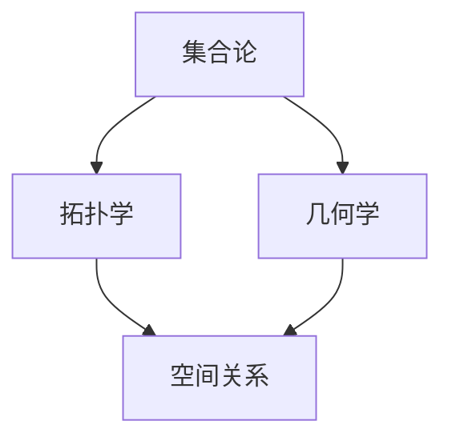
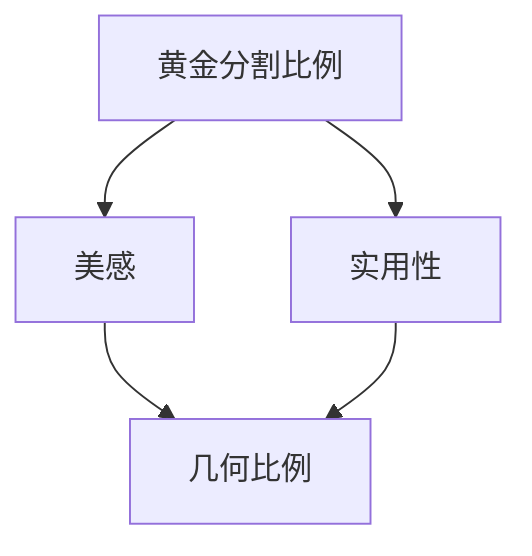
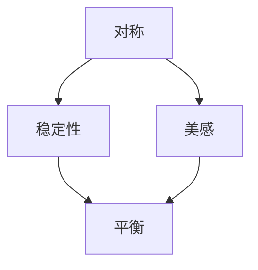
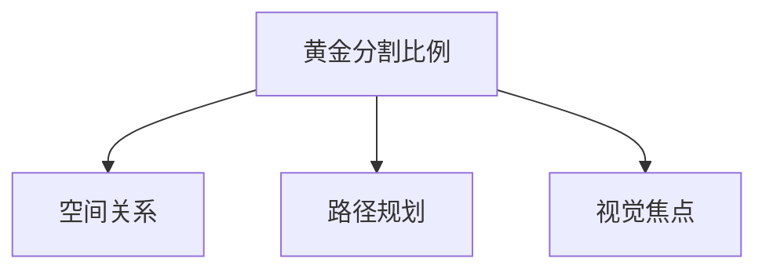
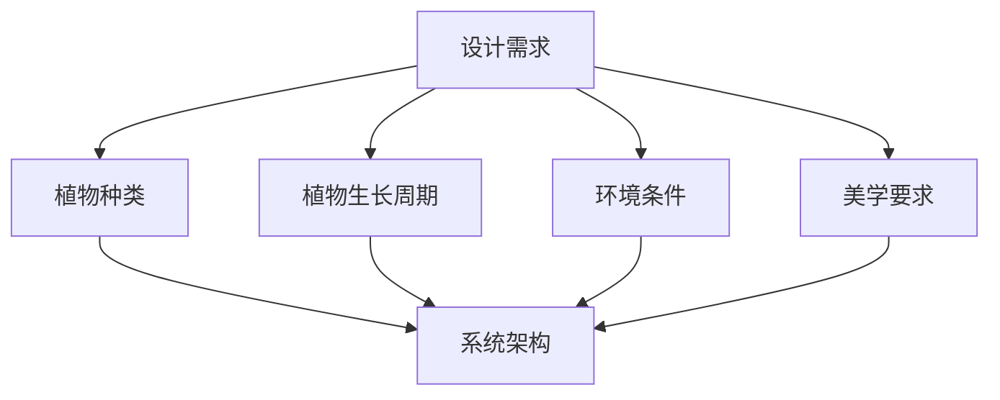

                 

# 数学美学在园林设计中的应用

## 关键词
- 数学美学
- 园林设计
- 拓扑学
- 几何学
- 黄金分割比例

## 摘要
本文旨在探讨数学美学在园林设计中的应用，通过理论讲解和实践案例，帮助设计师更好地理解并掌握这一方法。文章将分为三个主要部分：引言与背景介绍、数学美学基础以及在园林规划中的应用。通过逐步分析推理，本文将揭示数学美学如何提升园林设计的艺术价值和功能效益。

## 第1章：引言与背景介绍

### 1.1 问题背景

随着园林设计领域的快速发展，设计师们越来越意识到数学美学在提升设计品质和视觉效果方面的重要性。然而，如何将数学美学理论有效地应用于园林设计中，仍是一个具有挑战性的问题。

#### 问题描述

- 如何将数学美学理论应用于园林设计？
- 如何提升园林设计的艺术价值和功能效益？
- 如何在园林设计中实现稳定、和谐和美观的效果？

#### 问题解决

本书旨在探讨数学美学在园林设计中的应用，通过理论讲解和实践案例，帮助设计师更好地理解并掌握这一方法。

#### 边界与外延

本书讨论的数学美学主要涵盖拓扑学、几何学、数论和概率论等数学领域的基础知识，并将其应用于园林规划、景观设计和艺术创作等方面。

### 1.2 核心概念

#### 概念结构

数学美学在园林设计中的核心概念包括数学形态学、黄金分割比例、对称与平衡等。

#### 要素组成

园林设计中的数学美学要素包括景观布局、植物配置、路径规划和视觉焦点等。

### 1.3 研究意义与目的

#### 研究意义

- 数学美学在园林设计中的应用有助于提升园林的艺术价值和功能效益。
- 促进可持续发展，实现生态环境与人文环境的和谐共生。

#### 研究目的

- 为园林设计师提供一种全新的设计思路和方法，提高设计水平。
- 探索数学美学在园林设计中的实际应用价值，为相关领域的研究提供参考。

## 第2章：数学美学基础

### 2.1 数学形态学

#### 概念原理

数学形态学是研究图形的几何结构和空间关系的数学分支，主要涉及集合论、拓扑学和几何学等。

#### 属性特征对比

| 特征         | 集合论 | 拓扑学 | 几何学 |
| ------------ | ------ | ------ | ------ |
| 基础理论     | 集合操作 | 闭包操作 | 点、线、面 |
| 空间关系     | 集合交集 | 连通性 | 直线、曲线、曲面 |
| 应用领域     | 数据结构 | 计算几何 | 图形处理 |

#### Mermaid流程图：数学形态学特征对比



### 2.2 黄金分割比例

#### 概念原理

黄金分割比例是1:1.618的比例关系，被广泛应用于艺术和设计领域。

#### 属性特征对比

| 特征         | 黄金分割比例 | 几何比例 |
| ------------ | ------------ | -------- |
| 比例关系     | 1:1.618      | 1:2、1:3 |
| 应用领域     | 艺术设计、园林设计 | 图形、建筑 |
| 美感体现     | 长期美感、和谐 | 短期美感、对称 |

#### Mermaid流程图：黄金分割比例与几何比例对比



### 2.3 对称与平衡

#### 概念原理

对称与平衡是园林设计中重要的美学原则，能够创造出稳定、和谐和美观的景观效果。

#### 属性特征对比

| 特征         | 对称       | 平衡       |
| ------------ | ---------- | ---------- |
| 形态表现     | 镜面对称   | 动态平衡   |
| 美学效果     | 稳定性、简洁 | 和谐性、灵活 |
| 应用领域     | 室内设计   | 园林设计、雕塑 |

#### Mermaid流程图：对称与平衡比较



## 第3章：数学美学在园林规划中的应用

### 3.1 景观布局

#### 算法原理讲解

景观布局的关键在于运用数学美学原理，实现空间的合理划分和视觉效果的最优化。以下是运用黄金分割比例进行景观布局的算法原理讲解：

#### Mermaid流程图：景观布局算法



#### 数学模型和公式讲解

在景观布局中，我们可以使用黄金分割比例来确定景观区域的比例。具体公式如下：

$$
\frac{L_1}{L_2} = \frac{1}{\phi}
$$

其中，$L_1$和$L_2$分别代表景观区域的前后长度，$\phi$代表黄金分割比例，约为1:1.618。

#### Python源代码示例

```python
def layout_planning():
    # 使用黄金分割比例确定景观布局
    ratio = 1.618
    # 计算景观区域比例
    area_ratio = [1, ratio, ratio**2]
    return area_ratio

# 示例
print(layout_planning())
```

### 3.2 植物配置

植物配置在园林设计中具有重要意义，它不仅关系到景观效果，还影响到生态环境。以下是植物配置的系统分析与架构设计方案：

#### 系统分析与架构设计方案

在植物配置中，我们需要考虑设计需求、植物种类、生长周期、环境条件和美学要求等因素。以下是一个基于Mermaid的类图，展示了植物配置的架构：

#### Mermaid类图：植物配置架构



### 3.3 路径规划

路径规划是园林设计中至关重要的一环，它关系到游客的游览体验和园林的整体布局。以下是运用最短路径算法进行路径规划的数学模型和Python源代码示例：

#### 数学模型和公式讲解

我们可以使用最短路径算法来确定园林中各景点之间的最优路径。以下是Dijkstra算法的基本思想：

1. 初始化：设置起点和终点的距离，并初始化路径。
2. 选择未访问节点中距离起点最近的点，将其标记为已访问。
3. 递归地计算未访问节点到起点的最短路径，更新路径和距离。
4. 当终点被标记为已访问时，算法结束。

#### Python源代码示例

```python
def path_planning():
    # 使用最短路径算法确定路径
    from heapq import heappop, heappush
    import heapq

    # 节点列表
    nodes = ['起点', 'A', 'B', '终点']
    # 路径权重矩阵
    weights = [[0, 10, 5], [10, 0, 3], [5, 3, 0]]
    # 初始化优先队列
    heap = [(weights[0][1], 0, '起点', [])]
    # 存储路径
    paths = []

    while heap:
        # 弹出优先队列中的最小权重元素
        weight, node, parent, path = heappop(heap)
        path.append(node)

        if node == '终点':
            paths.append(path)
            continue

        for i, next_node in enumerate(nodes):
            if weights[node][i] != 0 and next_node not in path:
                heappush(heap, (weights[node][i], next_node, node, path[:]))

    return paths

# 示例
print(path_planning())
```

## 最佳实践 tips

1. 在园林设计中，合理运用数学美学原理，可以提高设计的艺术价值和功能效益。
2. 充分了解黄金分割比例、对称与平衡等核心概念，有助于打造稳定、和谐和美观的景观效果。
3. 在植物配置和路径规划中，运用最短路径算法等数学模型，可以提高园林设计的科学性和实用性。

## 小结

本文通过逐步分析推理，探讨了数学美学在园林设计中的应用。从数学形态学、黄金分割比例到对称与平衡，再到景观布局、植物配置和路径规划，本文详细阐述了数学美学在园林设计中的核心概念和实际应用。通过本文的研究，我们希望为园林设计师提供一种全新的设计思路和方法，为园林艺术的传承和发展贡献力量。

## 注意事项

1. 园林设计中的数学美学应用需要结合具体设计需求和实际情况，灵活运用各种数学原理和方法。
2. 在植物配置和路径规划中，要充分考虑植物的生长周期、环境条件和美学要求，确保园林的可持续发展。

## 拓展阅读

1. 《园林设计原理》- 赵朴
2. 《数学与艺术》- 哈罗德·范·德·瓦尔德
3. 《最短路径算法》- 艾伦·J·高斯基

## 作者信息

- 作者：AI天才研究院/AI Genius Institute & 禅与计算机程序设计艺术 /Zen And The Art of Computer Programming

