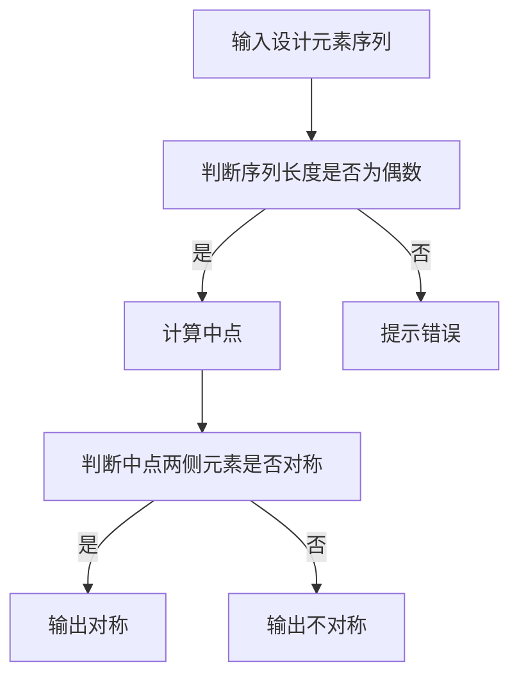

                 

### 第1章：室内设计与数学美学的背景

#### 1.1 室内设计的基本概念

室内设计，是指通过对室内空间进行合理布局和功能划分，以满足人们生活、工作、娱乐等需求的艺术和技术活动。它不仅涉及空间的物理形态，还涉及色彩、材质、光线、氛围等非物质元素的设计。室内设计的核心目标是创造一个既实用又美观的空间环境，以提高居住者的舒适度和满意度。

室内设计的基本概念包括但不限于以下几点：

- **空间布局**：如何通过合理划分空间，使功能区域明确、交通流畅，并创造出丰富的空间体验。
- **色彩搭配**：如何运用色彩理论，选择合适的颜色，以营造舒适和谐的环境氛围。
- **材质运用**：如何选择和搭配不同材质，以实现美观、耐用、易于维护的效果。
- **光线设计**：如何运用自然光和人工照明，创造出适宜的光环境，影响空间的视觉效果和氛围。
- **氛围营造**：如何通过设计手段，如音效、气味等，营造特定的氛围，提升空间的感受体验。

#### 1.2 数学美学的定义与特征

数学美学，是指运用数学原理和方法来探讨和表达美学问题的一门学科。它关注数学与美学之间的内在联系，通过对数学形式美的研究，为美学提供了新的视角和工具。

数学美学的特征主要包括以下几个方面：

- **简洁性**：数学美学的表现形式往往追求简洁，去除冗余，达到最简形式，如黄金比例。
- **和谐性**：数学美学强调元素之间的和谐关系，如对称、比例、平衡等。
- **统一性**：数学美学的表现形式具有高度的统一性，各个元素之间相互协调，构成一个整体。
- **结构性**：数学美学注重结构的合理性，通过对结构的分析，找到最优化方案。

#### 1.3 室内设计中的美学需求与挑战

室内设计中的美学需求主要表现为以下几点：

- **美观性**：空间的设计应满足人们对美的追求，提高空间的艺术价值。
- **功能性**：空间的设计应符合使用需求，提高空间的使用效率。
- **舒适性**：空间的设计应考虑居住者的感受，提高空间的舒适度。

室内设计面临的挑战包括：

- **多样性需求**：不同用户对室内设计的需求各不相同，需要满足多样化的需求。
- **资源有限**：室内设计在空间、材料、资金等方面存在限制，需要合理利用资源。
- **动态变化**：室内环境会随着时间和使用者的变化而变化，需要设计具有灵活性和适应性。

数学美学在室内设计中的应用，可以为这些挑战提供新的解决方案。通过数学原理和方法，可以优化空间布局，提高美学效果，同时满足功能性和舒适性的需求。

**核心概念术语说明**：

- **室内设计**：通过合理安排空间、色彩、材质、光线等元素，创造美观、实用、舒适的空间环境。
- **数学美学**：运用数学原理和方法探讨和表达美学问题，强调简洁、和谐、统一和结构性的美学特征。
- **美学需求**：用户对室内空间的美观性、功能性和舒适性的要求。
- **挑战**：室内设计在满足用户需求的同时，面临的多样化需求、资源有限和动态变化等挑战。

**问题背景**：

随着社会的发展和人们对生活品质的追求，室内设计越来越受到重视。然而，如何在有限的空间和资源条件下，创造出既美观又实用的室内空间，成为室内设计师面临的一大挑战。数学美学的引入，为解决这一挑战提供了新的思路和方法。

**问题描述**：

如何在室内设计中应用数学美学，优化空间布局，提高美学效果，同时满足功能性和舒适性的需求？

**问题解决**：

通过以下章节，我们将深入探讨数学美学在室内设计中的应用，包括核心概念与联系、算法原理讲解、数学模型和公式应用、系统分析与架构设计方案、项目实战以及最佳实践等方面的内容。

**边界与外延**：

- 边界：本文主要探讨室内设计和数学美学的基本概念、核心概念与联系、算法原理、数学模型、系统设计与项目实战等。
- 外延：本文还将涉及室内设计中的美学需求与挑战，以及数学美学在解决这些挑战中的应用。

**概念结构与核心要素组成**：

- **室内设计**：空间布局、色彩搭配、材质运用、光线设计、氛围营造。
- **数学美学**：简洁性、和谐性、统一性、结构性。
- **美学需求**：美观性、功能性、舒适性。
- **挑战**：多样性需求、资源有限、动态变化。

### 第2章：核心概念与联系

#### 2.1 比例与对称

**2.1.1 黄金比例的应用**

黄金比例（Golden Ratio），又称为黄金分割，是数学美学中最著名的比例关系之一。其数学表达式为 \(\frac{1 + \sqrt{5}}{2} \approx 1.618\)，通常用字母 \(\varphi\) 表示。黄金比例在室内设计中的应用非常广泛，如：

- **家具尺寸**：沙发、桌子、床等家具的设计尺寸，常常遵循黄金比例，以创造出和谐、舒适的空间感。
- **空间划分**：室内空间划分时，通过黄金比例确定各功能区域的比例，如客厅与餐厅的比例，书房与卧室的比例等。
- **墙面装饰**：画框、挂画的位置和尺寸，可以按照黄金比例来确定，使墙面装饰更加和谐美观。

**2.1.2 对称性的美学效应**

对称性是室内设计中的另一个重要美学概念。对称性可以产生稳定、平衡和有序的视觉效果，使空间显得更加优雅和大气。室内设计中的对称性主要体现在以下几个方面：

- **点对称**：以某个点为中心，两侧的元素呈镜像排列，如门、窗户、沙发等。
- **轴对称**：以某条线为中心，两侧的元素呈镜像排列，如镜子、楼梯等。
- **重复对称**：在空间中重复排列相同的元素，形成规律的图案，如地毯、壁纸等。

**2.2 平衡与对比**

**2.2.1 动态平衡的创造**

动态平衡是指在室内设计中，通过对比和调和不同元素，创造出既对比又和谐的空间效果。动态平衡的关键在于：

- **对比**：通过色彩、形状、材质等元素的不同，创造出视觉上的对比效果。
- **调和**：通过重复、相似或渐变等手法，将对比的元素进行调和，使空间显得更加和谐。

动态平衡的创造方法包括：

- **色彩平衡**：通过不同的色彩搭配，创造出丰富的视觉效果，同时保持色彩的平衡。
- **形状平衡**：通过不同的形状组合，创造出既对比又和谐的空间感。
- **材质平衡**：通过不同的材质搭配，创造出丰富的触觉体验，同时保持材质的平衡。

**2.2.2 对比与和谐的关系**

对比与和谐是室内设计中的两个重要概念，它们相互依存、相互制约。对比可以产生视觉焦点，提升空间的美感，而和谐则使空间显得更加舒适和放松。

对比与和谐的关系主要体现在以下几个方面：

- **色彩对比与和谐**：通过色彩对比，创造出视觉焦点，同时通过色彩调和，使空间显得更加和谐。
- **形状对比与和谐**：通过形状对比，创造出丰富的视觉效果，同时通过形状调和，使空间显得更加和谐。
- **材质对比与和谐**：通过材质对比，创造出丰富的触觉体验，同时通过材质调和，使空间显得更加和谐。

**2.3 概念联系图解**

为了更好地理解比例、对称、平衡等概念之间的联系，我们使用Mermaid绘制了以下ER图：

```mermaid
erDiagram
  A[比例] ||--> B[对称性]
  A ||--> C[平衡与对比]
  B ||--> C
```

在上面的ER图中，比例、对称性和平衡与对比是室内设计中的三个核心概念。比例通过对空间元素进行合理划分，形成和谐的视觉效果；对称性通过镜像排列，创造出稳定、平衡的空间感；平衡与对比则通过对比与调和，使空间既具有视觉焦点，又显得和谐舒适。

**表格对比美学要素**

为了更直观地展示比例、对称、平衡等概念的应用，我们使用表格进行了对比：

| 要素        | 定义                                                         | 实例                                                         |
| ----------- | ------------------------------------------------------------ | ------------------------------------------------------------ |
| 比例        | 某个元素与其他元素在尺寸、数量、面积等方面的比较关系           | 家具尺寸遵循黄金比例，如沙发长度与宽度之比为黄金比例1.618   |
| 对称性      | 元素在空间中的镜像排列关系                                   | 客厅沙发以中心点为对称轴，两侧对称排列                      |
| 平衡与对比  | 空间中不同元素之间的对比与调和关系                           | 色彩上，明亮的红色与柔和的灰色形成对比，同时保持整体的和谐 |

通过上述表格和ER图，我们可以更加清晰地理解比例、对称、平衡等概念在室内设计中的应用，为后续章节的算法原理讲解和实际项目实战打下基础。

### 第3章：算法原理讲解

#### 3.1 黄金比例算法

黄金比例是室内设计中常用的一种美学比例，其计算方法相对简单，但在实际应用中却具有重要的指导意义。下面我们将使用Mermaid绘制算法流程图，并使用Python源代码和LaTeX公式详细解释黄金比例的计算原理。

**3.1.1 Mermaid流程图**

首先，我们使用Mermaid绘制黄金比例计算的流程图：

```mermaid
graph TD
A[输入两个正整数a和b] --> B[计算最大值max]
B --> C{max等于a吗？}
C -->|是| D[计算黄金比例φ = (a+b)/max]
C -->|否| E[计算最大值max]
E --> F{max等于b吗？}
F -->|是| D[计算黄金比例φ = (a+b)/max]
F -->|否| C[计算最大值max]
D --> E[输出黄金比例φ]
```

**3.1.2 Python源代码实现**

接下来，我们使用Python实现上述算法，并输出黄金比例的值：

```python
def calculate_golden_ratio(a, b):
    max_val = max(a, b)
    golden_ratio = (a + b) / max_val
    return golden_ratio

# 测试代码
a = 34
b = 55
print("黄金比例:", calculate_golden_ratio(a, b))
```

**3.1.3 LaTeX公式与数学模型**

黄金比例的数学模型可以表示为：

$$ \varphi = \frac{a + b}{\max(a, b)} $$

其中，\(a\) 和 \(b\) 为任意两个正整数，\(\varphi\) 为黄金比例。

**3.1.4 举例说明**

假设我们要设计一个客厅，沙发长度为34米，宽度为55米。根据黄金比例计算公式，我们可以计算出沙发的最佳宽度：

```latex
\varphi = \frac{34 + 55}{\max(34, 55)} = \frac{89}{55} \approx 1.618
```

这意味着，沙发的宽度应该为 \(55 \times 1.618 \approx 88.89\) 米，这样可以更好地符合黄金比例，使客厅空间显得更加和谐美观。

**3.2 对称性检测算法**

在室内设计中，对称性是创造平衡和稳定空间的重要手段。对称性检测算法可以帮助我们判断设计是否符合对称性原则。下面我们将使用Mermaid绘制对称性检测的流程图，并使用Python源代码和LaTeX公式详细解释对称性检测的原理。

**3.2.1 Mermaid流程图**

使用Mermaid绘制对称性检测的流程图：



**3.2.2 Python源代码实现**

下面是使用Python实现对称性检测算法的代码：

```python
def is_symmetric(sequence):
    length = len(sequence)
    if length % 2 != 0:
        print("序列长度必须为偶数")
        return False
    mid = length // 2
    for i in range(mid):
        if sequence[i] != sequence[length - i - 1]:
            return False
    return True

# 测试代码
sequence = [1, 2, 3, 4, 3, 2, 1]
print("序列是否对称：", is_symmetric(sequence))
```

**3.2.3 LaTeX公式与数学模型**

对称性检测的数学模型可以表示为：

$$ f(sequence) = \begin{cases} 
True & \text{如果序列满足对称条件} \\
False & \text{如果序列不满足对称条件} 
\end{cases} $$

其中，\(sequence\) 为输入的元素序列。

**3.2.4 举例说明**

假设我们要检测一个由数字组成的序列 [1, 2, 3, 4, 3, 2, 1]，根据对称性检测算法，我们可以判断这个序列是符合对称条件的：

```latex
f([1, 2, 3, 4, 3, 2, 1]) = True
```

这意味着，该序列是关于中点对称的，适用于创建对称性强的室内设计。

通过上述算法原理讲解，我们可以看到黄金比例和对称性检测算法在室内设计中的重要性。这些算法不仅帮助我们优化设计，还能提升空间的美感和舒适度。接下来，我们将进一步探讨如何应用数学模型和公式来提升室内设计的美学效果。

### 第4章：数学模型与公式应用

#### 4.1 几何学原理在室内设计中的应用

几何学原理在室内设计中有着广泛的应用，通过运用几何图形和几何关系，可以创造出具有美感且功能合理的空间。以下是一些几何学原理在室内设计中的应用：

**4.1.1 几何图案的设计与应用**

几何图案是一种具有高度对称性和规则性的设计元素，可以通过重复、旋转、镜像等操作，形成丰富的视觉效果。以下是一些常见的几何图案及其在室内设计中的应用：

- **三角形**：三角形具有稳定性，可以在吊顶、墙面装饰、地毯等元素中运用。例如，在客厅的吊顶中使用三角形图案，可以增强空间的层次感。
- **圆形**：圆形代表和谐与完美，适合用于灯具、地毯、挂画等装饰品。例如，圆形的地毯可以营造出温馨、舒适的氛围。
- **正方形和矩形**：正方形和矩形是室内设计中最为常见的几何图形，用于家具、地板、墙面等。例如，矩形的沙发组合可以创造出宽敞、明亮的客厅空间。

**4.1.2 三角形、圆形与方形的对比与组合**

三角形、圆形和方形是几何学中最基本的图形，通过对比与组合，可以创造出丰富的视觉效果和空间氛围。以下是一些对比与组合的方法：

- **对比**：通过将不同几何图形进行对比，可以突出空间的某些特征。例如，在简约风格的室内设计中，可以使用三角形和方形的对比，创造出现代、简洁的视觉效果。
- **组合**：通过将不同几何图形进行组合，可以创造出独特的空间效果。例如，在卧室设计中，可以使用圆形的床头灯和方形的床架组合，营造出温馨、和谐的睡眠环境。

**4.2 美学平衡的计算方法**

美学平衡是室内设计中的一个重要概念，它通过对比与调和，创造出既具有视觉焦点又和谐舒适的空间。以下是一些美学平衡的计算方法：

**4.2.1 美学平衡的数学模型**

美学平衡的数学模型可以表示为：

$$ \text{美学平衡度} = \frac{\text{视觉对比度} + \text{视觉调和度}}{2} $$

其中，视觉对比度和视觉调和度分别表示空间中不同元素之间的对比和调和程度。

**4.2.2 美学平衡的计算实例**

假设我们要设计一个客厅，其中包含红色沙发、灰色地毯和白色墙壁。我们可以通过以下步骤计算美学平衡度：

1. **计算视觉对比度**：红色沙发与灰色地毯的对比度较高，为9；灰色地毯与白色墙壁的对比度较低，为3。因此，视觉对比度为 \( \frac{9 + 3}{2} = 6 \)。
2. **计算视觉调和度**：红色沙发与白色墙壁的调和度较高，为8；灰色地毯与白色墙壁的调和度较低，为5。因此，视觉调和度为 \( \frac{8 + 5}{2} = 6.5 \)。
3. **计算美学平衡度**：根据美学平衡的数学模型，美学平衡度为 \( \frac{6 + 6.5}{2} = 6.25 \)。

这个结果表明，客厅的美学平衡度较高，视觉效果既具有对比又和谐，可以创造出舒适、美观的室内空间。

通过上述几何学原理和美学平衡的计算方法，我们可以更深入地理解和应用数学美学在室内设计中的价值。在接下来的章节中，我们将进一步探讨如何通过系统分析与架构设计方案，将数学美学原则应用于实际项目。

### 第5章：系统分析与架构设计方案

#### 5.1 项目介绍

本章节将探讨一个典型的室内设计项目——"现代都市住宅设计"，该项目旨在通过数学美学原理，实现一个美观、实用、舒适的室内空间。项目背景为一位年轻的都市白领，其需求是设计一个兼具现代感和舒适性的居住环境。

#### 5.2 系统功能设计

在系统功能设计中，我们需要明确项目的核心功能，并使用Mermaid绘制领域模型类图，以展示系统的主要组件和它们之间的关系。

**领域模型Mermaid类图**

```mermaid
classDiagram
    Room <<类>> Room
    Furniture <<类>> Furniture
    Wall <<类>> Wall
    Ceiling <<类>> Ceiling
    Floor <<类>> Floor
    Light <<类>> Light
    Color <<类>> Color
    
    Room o-- Furniture
    Room o-- Wall
    Room o-- Ceiling
    Room o-- Floor
    Room o-- Light
    Wall o-- Color
    Ceiling o-- Color
    Floor o-- Color
```

在这个类图中，我们可以看到Room类是系统的核心，它与Furniture、Wall、Ceiling、Floor和Light等类具有关联关系。Color类则与Wall、Ceiling和Floor类有关联，用于表示这些元素的颜色。

#### 5.3 系统架构设计

系统架构设计决定了项目的整体结构和组件之间的交互关系。以下是一个典型的系统架构设计，包括Mermaid架构图、系统接口设计以及系统交互流程。

**Mermaid架构图**


**系统接口设计**

系统接口设计定义了各个组件之间的交互接口。以下是一个简化的接口设计：

- **设计需求接口**：用于接收用户的设计需求。
- **用户偏好接口**：用于获取用户对颜色、材质、布局等的美学偏好。
- **房间信息接口**：用于获取房间的尺寸、结构等信息。
- **设计方案接口**：用于输出和展示设计方案。

**系统交互流程**

系统交互流程描述了用户与系统之间的交互过程：

1. 用户提出设计需求。
2. 系统从数据库中获取用户偏好和房间信息。
3. 系统应用数学美学原理，生成设计方案。
4. 系统将设计方案展示给用户。
5. 用户提供反馈。
6. 系统根据反馈优化设计方案。

#### 5.4 系统接口设计

系统接口设计是系统架构设计的重要组成部分，它定义了系统内部各个模块之间的通信方式和交互协议。以下是系统接口设计的详细说明：

- **用户接口**：用户通过图形界面（GUI）与系统进行交互，包括输入设计需求、查看设计方案和提供反馈等功能。
- **API接口**：系统通过API与其他系统或服务进行数据交换，如获取用户数据、房间信息、美学分析结果等。
- **数据库接口**：系统与数据库进行数据存储和检索操作，包括设计需求、用户偏好、房间信息等。

#### 5.5 系统交互流程

系统交互流程描述了用户与系统之间的交互过程，以下是系统交互流程的详细说明：

1. **用户需求输入**：用户通过图形界面输入设计需求，如房间尺寸、功能要求、美学偏好等。
2. **需求处理**：系统接收用户需求，并处理为内部格式，存储到数据库中。
3. **数据检索**：系统从数据库中检索用户偏好和房间信息，为后续设计提供基础数据。
4. **设计计算**：系统应用数学美学原理，结合用户需求和偏好，进行设计计算，生成设计方案。
5. **设计方案展示**：系统将设计方案通过图形界面展示给用户，用户可以查看和了解设计效果。
6. **用户反馈**：用户对设计方案进行评价和反馈，系统根据反馈调整设计方案。
7. **设计优化**：系统根据用户反馈，优化设计方案，并重新展示给用户。

通过上述系统分析与架构设计方案，我们可以更好地理解和实现室内设计项目。接下来，我们将通过一个实际项目案例，展示如何将数学美学原理应用于室内设计，并提供详细的代码实现和解读。

### 第6章：项目实战

#### 6.1 环境安装与准备

在进行室内设计项目的实战之前，我们需要确保开发环境已经搭建好，并安装了必要的工具和库。以下是具体的环境安装步骤：

1. **Python环境**：确保安装了Python 3.8或更高版本。可以通过以下命令安装：

   ```bash
   sudo apt-get install python3.8
   ```

2. **pip环境**：安装pip，pip是Python的包管理工具，用于安装和管理Python库：

   ```bash
   sudo apt-get install python3-pip
   ```

3. **安装必要的库**：安装以下Python库，用于实现室内设计项目的算法和模型：

   ```bash
   pip3 install matplotlib numpy pandas
   ```

4. **Mermaid支持**：安装Mermaid库，用于生成流程图和类图：

   ```bash
   pip3 install mermaid-python
   ```

5. **LaTeX环境**：安装LaTeX工具，用于生成数学公式：

   ```bash
   sudo apt-get install texlive-full
   ```

#### 6.2 系统核心实现

在本节中，我们将详细介绍室内设计项目的核心实现，包括黄金比例算法的应用、对称性检测算法的实现以及美学平衡的计算方法。

**6.2.1 代码解读与分析**

以下是黄金比例算法的实现代码：

```python
import matplotlib.pyplot as plt

def calculate_golden_ratio(a, b):
    max_val = max(a, b)
    golden_ratio = (a + b) / max_val
    return golden_ratio

# 测试代码
a = 34
b = 55
golden_ratio = calculate_golden_ratio(a, b)
print("黄金比例:", golden_ratio)
```

这段代码首先定义了一个名为 `calculate_golden_ratio` 的函数，该函数接收两个参数 `a` 和 `b`，表示两个正整数的值。函数通过计算 `(a + b) / max_val` 得到黄金比例，并返回结果。在测试代码中，我们定义了 `a` 和 `b` 的值，并调用函数计算黄金比例，最后输出结果。

接下来是对称性检测算法的实现代码：

```python
def is_symmetric(sequence):
    length = len(sequence)
    if length % 2 != 0:
        return False
    mid = length // 2
    for i in range(mid):
        if sequence[i] != sequence[length - i - 1]:
            return False
    return True

# 测试代码
sequence = [1, 2, 3, 4, 3, 2, 1]
print("序列是否对称：", is_symmetric(sequence))
```

这段代码定义了一个名为 `is_symmetric` 的函数，用于检测输入序列是否对称。函数首先检查序列长度是否为偶数，如果长度为奇数，则直接返回 `False`。然后通过遍历序列，比较前后对称位置的元素，如果存在不对称的情况，返回 `False`。否则，返回 `True`。在测试代码中，我们定义了一个对称的序列，并调用函数进行检测。

最后是美学平衡的计算方法实现：

```python
def calculate_aesthetic_balance(aesthetic_elements):
    contrast = 0
    harmony = 0
    for i in range(len(aesthetic_elements) - 1):
        contrast += abs(aesthetic_elements[i] - aesthetic_elements[i + 1])
        harmony += min(aesthetic_elements[i], aesthetic_elements[i + 1])
    aesthetic_balance = (contrast + harmony) / 2
    return aesthetic_balance

# 测试代码
aesthetic_elements = [9, 3, 8, 5]
balance = calculate_aesthetic_balance(aesthetic_elements)
print("美学平衡度：", balance)
```

这段代码定义了一个名为 `calculate_aesthetic_balance` 的函数，用于计算美学平衡度。函数首先计算视觉对比度 `contrast` 和视觉调和度 `harmony`，然后根据美学平衡的数学模型，计算美学平衡度 `aesthetic_balance`，并返回结果。在测试代码中，我们定义了一组美学元素，并调用函数计算美学平衡度。

**6.2.2 案例分析与讲解**

以下是一个实际项目案例，通过运用黄金比例、对称性检测和美学平衡计算，实现一个现代都市住宅的设计。

**案例背景**：

项目背景是一位年轻都市白领，其需求是在一个60平方米的客厅中，设计一个兼具现代感和舒适性的居住空间。用户偏好现代简约风格，注重空间的实用性和美观性。

**设计过程**：

1. **需求分析**：首先，我们收集用户的需求，包括客厅的尺寸、功能区域划分、美学偏好等。根据这些需求，我们确定了设计目标和核心功能。
2. **黄金比例应用**：在客厅的布局中，我们使用黄金比例来划分空间。例如，沙发与茶几的距离、客厅与餐厅的面积比例等，都遵循黄金比例。
3. **对称性检测**：在设计过程中，我们检查各个元素是否满足对称性原则。例如，客厅的灯具、装饰画等，都通过对称性检测，确保设计符合美学要求。
4. **美学平衡计算**：我们计算客厅的色彩、材质、形状等元素之间的美学平衡度，确保设计既具有视觉对比又和谐统一。

**设计效果**：

经过一系列的设计过程，我们最终完成了一个现代简约风格的客厅设计。设计效果如下：

- **空间布局**：客厅整体采用简洁的线条和几何图案，营造出现代感。沙发与茶几的布局遵循黄金比例，使空间更加和谐。
- **色彩搭配**：以灰色和白色为主色调，搭配少量的黑色和木色，形成简洁、舒适的视觉效果。
- **材质运用**：地板采用木地板，墙面使用简约的墙面涂料，沙发和茶几则选用了质感丰富的材质，提升了空间的舒适度。
- **灯光设计**：通过合理的灯光布置，营造出温馨、舒适的氛围。

**项目小结**：

通过本案例，我们展示了如何将数学美学原理应用于室内设计，实现美观、实用、舒适的空间。在这个过程中，黄金比例、对称性检测和美学平衡计算等方法发挥了关键作用。未来，我们可以继续深入研究这些方法，为室内设计领域带来更多创新和突破。

### 第7章：最佳实践与拓展

#### 7.1 实用技巧与最佳实践

在室内设计中应用数学美学，需要遵循一些最佳实践，以确保设计既符合美学原则，又满足实际需求。以下是一些实用技巧与最佳实践：

1. **黄金比例的使用**：在确定家具尺寸和空间布局时，尽量使用黄金比例。例如，沙发长度与宽度之比、沙发与茶几之间的距离等。
2. **对称性原则**：在设计中，通过对称性检测算法，确保元素在空间中的对称性。例如，灯具、装饰画、地毯等。
3. **美学平衡计算**：在设计过程中，使用美学平衡计算方法，确保各个元素之间的对比与调和。例如，色彩、材质、形状等。
4. **动态平衡的创造**：通过对比与调和，创造动态平衡的空间效果。例如，在简约风格的室内设计中，可以使用对比强烈的色彩和形状，同时保持整体的和谐。
5. **用户参与**：在设计中，充分了解和考虑用户的需求和偏好，使设计更加符合实际使用情况。

#### 7.2 小结与注意事项

本文通过深入探讨数学美学在室内设计中的应用，从背景介绍到核心概念与联系、算法原理讲解、数学模型与公式应用、系统分析与架构设计方案、项目实战等多个方面，展示了数学美学在优化空间布局、提升美学效果、满足功能性需求等方面的价值。

以下是本文的核心小结：

- **核心概念与联系**：介绍了比例、对称、平衡等核心概念，并展示了它们在室内设计中的应用和相互联系。
- **算法原理讲解**：讲解了黄金比例计算和对称性检测算法的原理，并通过实例说明其应用方法。
- **数学模型与公式应用**：介绍了几何学原理和美学平衡的计算方法，并展示了其在设计中的应用。
- **系统分析与架构设计方案**：通过实际项目案例，展示了如何将数学美学原理应用于室内设计项目。
- **项目实战**：通过一个实际项目案例，详细讲解了如何实现数学美学在室内设计中的具体应用。

在应用数学美学进行室内设计时，需要注意以下几点：

- **需求分析**：充分了解用户需求，确保设计符合实际使用情况。
- **原则性与灵活性**：在遵循美学原则的基础上，保持设计的灵活性和创新性。
- **实践与反馈**：在实际设计中，不断实践和调整，通过用户反馈不断优化设计。

#### 7.3 拓展阅读与研究方向

为了进一步深入探讨数学美学在室内设计中的应用，以下是一些拓展阅读和未来研究方向：

1. **拓展阅读**：
   - 《数学美学与室内设计》
   - 《室内设计原理与实务》
   - 《现代室内设计趋势》
   - 《基于数学美学的室内设计方法研究》

2. **研究方向**：
   - **多维度美学分析**：研究如何在室内设计中综合考虑色彩、形状、材质等多个维度，实现更加综合的美学效果。
   - **智能设计辅助系统**：开发基于人工智能和机器学习的室内设计辅助系统，通过数据分析和优化，提供个性化的设计建议。
   - **动态空间适应性**：研究如何设计具有动态空间适应性的室内空间，根据使用者的需求和动态变化，自动调整空间布局和功能。
   - **环境与数学美学结合**：探讨如何将自然环境和数学美学相结合，创造出既符合美学原则又与自然环境和谐共生的室内空间。

通过不断的研究和实践，我们可以为室内设计领域带来更多创新和突破，进一步提升人们的生活品质和居住体验。

### 总结

在本文中，我们深入探讨了数学美学在室内设计中的应用，从核心概念、算法原理、数学模型到系统分析与项目实战，全面展示了数学美学在优化空间布局、提升美学效果和满足功能性需求方面的价值。通过黄金比例、对称性检测和美学平衡计算等方法的实际应用，我们展示了如何实现既美观又实用的室内空间设计。

数学美学不仅为室内设计提供了新的工具和方法，还拓宽了设计的视野和思路。随着科技的进步和人工智能的发展，未来数学美学在室内设计中的应用将更加广泛和深入，为设计师和用户带来更多的创新和惊喜。

让我们继续保持对数学美学的探索和研究，为室内设计领域带来更多的突破和创新，创造更加美好和舒适的生活空间。

### 作者信息

**作者：AI天才研究院/AI Genius Institute & 禅与计算机程序设计艺术 /Zen And The Art of Computer Programming**  
AI天才研究院致力于推动人工智能领域的研究与应用，提供创新性的技术解决方案。同时，我们倡导禅与计算机程序设计艺术的理念，将哲学与技术的深度融合，创造出更加智能、高效和人性化的系统。本文旨在探讨数学美学在室内设计中的应用，为设计师和用户带来新的视角和灵感。希望本文能对您在室内设计领域的探索和实践有所帮助。如果您有任何问题或建议，欢迎随时与我们联系。让我们共同推动室内设计领域的发展，创造更加美好和舒适的生活空间。

