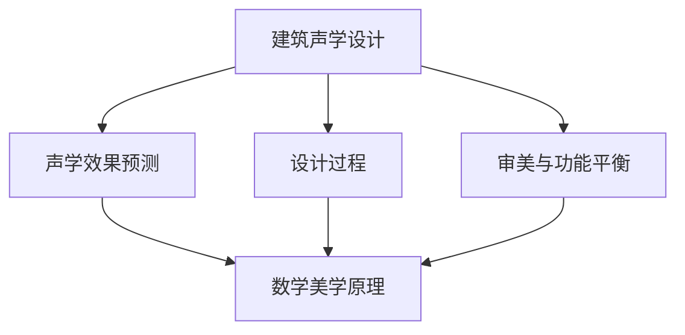
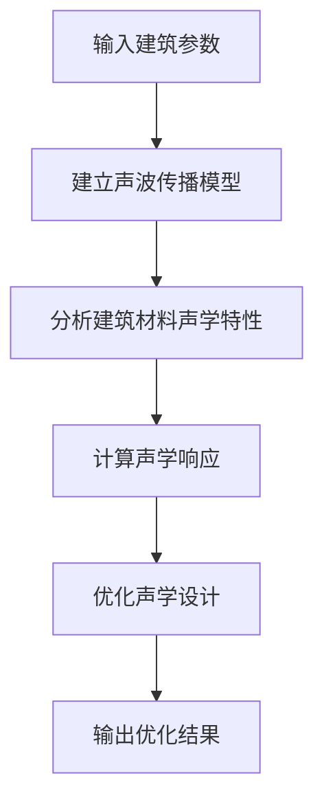
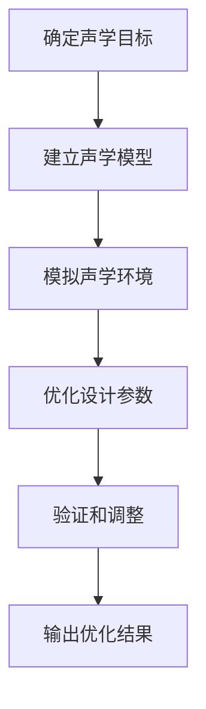
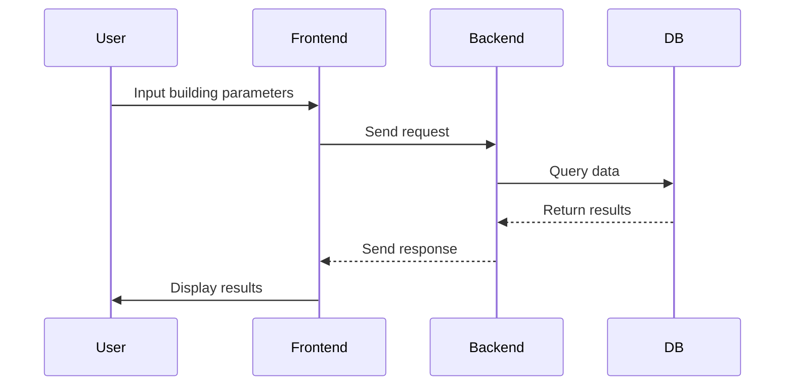

                 

## 引言

### 1.1 背景介绍

建筑声学设计作为建筑科学的重要组成部分，旨在通过合理的声学设计和处理，创造出适宜的声音环境，以满足人们的生活和工作需求。从古代的宫殿到现代的公共建筑，声学设计在建筑中的重要性日益凸显。然而，传统的建筑声学设计主要依赖于经验和工程实践，缺乏系统性的理论支持。

与此同时，数学美学作为数学与美学相结合的学科，强调通过数学原理来揭示和创造美的形式。数学美学在建筑学中的应用，不仅能提高建筑的美学价值，还能优化建筑的功能性能。将数学美学引入建筑声学设计，有助于从新的视角审视和解决声学问题，从而实现更高的设计效率和效果。

### 1.2 问题阐述

建筑声学设计中面临的主要挑战包括：

1. **声学效果预测的困难**：传统的设计方法往往难以准确预测建筑空间中的声学效果，导致实际声学环境与预期目标存在较大差异。

2. **设计过程的复杂性**：建筑声学设计涉及多个因素的协同作用，如建筑结构、建筑材料、空间布局等，设计过程复杂且繁琐。

3. **审美与功能之间的平衡**：在追求建筑美学的同时，还需要确保建筑功能，特别是声学功能的实现。如何在二者之间取得平衡，是设计师面临的另一大挑战。

### 1.3 概念界定

**建筑声学设计**：是指通过特定的设计方法和技术，对建筑空间进行声学优化，以创造满足特定声学需求的环境。

**数学美学**：是一门研究数学原理如何构成美学的学科，强调数学与美学之间的内在联系。

### 1.4 研究范围

本研究旨在探讨数学美学在建筑声学设计中的应用，包括但不限于以下几个方面：

1. **声波传播模型**：利用数学美学原理，建立精确的声波传播模型，以提高声学效果预测的准确性。

2. **建筑材料声学特性分析**：通过数学美学的方法，分析和评估建筑材料的声学性能，以优化声学设计。

3. **空间布局优化**：利用数学美学原理，对建筑空间进行布局优化，以提高声学环境的舒适度和美感。

### 1.5 核心概念联系图



## 数学美学原理

### 2.1 对称性与声学设计

对称性是数学美学中的一个核心概念，它体现在建筑声学设计中，可以通过以下几种方式实现：

1. **空间对称**：建筑空间的设计可以采用轴对称或中心对称的形式，这种对称性能够有效地控制声波的反射和传播，减少声学干扰。

2. **材料对称**：使用相同或相似的建筑材料进行对称布局，可以保证声波在不同材料之间的传输和反射具有一致性。

3. **声学结构对称**：例如，在建筑的天花板和墙面设计上，采用对称的结构设计，可以提高声学环境的稳定性。

### 2.2 对比与和谐

对比与和谐是数学美学中另一个重要的原则。在建筑声学设计中，通过对比不同的声音元素，可以创造出丰富的声学效果。而和谐则强调声音元素之间的协调与统一。

1. **声学对比**：通过使用不同材质、形状和结构的建筑元素，可以创造出丰富的声音效果，提高空间的声学质量。

2. **声学和谐**：通过合理的声学设计，使建筑空间中的声音元素相互协调，创造出和谐舒适的声学环境。

### 2.3 极限与渐变

极限与渐变是数学美学中的一种动态变化原则。在建筑声学设计中，这一原则可以通过以下方式应用：

1. **声学极限**：通过设置特定的声学极限，控制声音的传播和反射，以达到预期的声学效果。

2. **声学渐变**：通过设计渐变的声音环境，使人们在不同空间中感受到声音的逐渐变化，提高声学体验的连贯性和舒适性。

### 2.4 数形结合

数形结合是数学美学中的核心思想，将数学的精确性与艺术的美感相结合。在建筑声学设计中，这一原则可以通过以下方式应用：

1. **数学模型**：使用数学模型来分析和预测建筑空间中的声学行为，从而优化声学设计。

2. **形状与结构**：通过几何形状和结构的优化设计，实现声学效果的数学美感。

### 2.5 核心概念属性特征对比表格

| 原则 | 特征 | 应用举例 |
| --- | --- | --- |
| 对称性 | 空间、材料、结构的对称性 | 轴对称的建筑物、对称的墙面设计 |
| 对比与和谐 | 声音元素的对比与和谐 | 不同材质的墙面、和谐的声学环境 |
| 极限与渐变 | 声学极限、渐变的声音环境 | 声学房间的反射控制、声音渐变设计 |
| 数形结合 | 数学模型、形状与结构的优化 | 声学模型的建立、几何形状的优化 |

### 2.6 数学美学的ER实体关系图

```mermaid
erDiagram
  Class::Building acoustic design {
    +int id
    +str name
    +str location
    +datetime created_at
  }
  Class::Mathematical aesthetics {
    +int id
    +str principle
    +str application
    +datetime created_at
  }
  Building acoustic design ||--|{ Mathematical aesthetics }|| application
```

## 建筑声学设计的算法原理

### 3.1 声波传播模型

声波传播模型是建筑声学设计的核心。它描述了声波在建筑空间中的传播过程，包括声波的反射、折射、吸收和衍射等现象。数学模型如下：

$$
\frac{\partial^2 p}{\partial t^2} = c^2 \nabla^2 p
$$

其中，\( p \) 表示声压，\( t \) 表示时间，\( c \) 表示声速，\( \nabla^2 \) 表示拉普拉斯算子。

### 3.2 建筑材料声学特性分析

建筑材料的声学特性对建筑声学设计至关重要。每种材料都有其独特的声学特性，如吸声系数、隔声系数等。这些特性决定了声波在材料表面的反射、吸收和传输情况。以下是几种常见的声学特性参数：

- **吸声系数**（\( \alpha \)）：表示材料对声能的吸收能力，取值范围在0到1之间。吸声系数越高，材料的吸声性能越好。
- **隔声系数**（\( R \)）：表示材料对声波隔断的能力，取值范围在0到1之间。隔声系数越高，材料的隔声性能越好。

### 3.3 算法流程图



### 3.4 算法原理的数学模型和公式

以下是建筑声学设计中的几个关键数学模型和公式：

1. **声波传播模型**：

$$
\frac{\partial^2 p}{\partial t^2} = c^2 \nabla^2 p
$$

2. **声波反射公式**：

$$
\frac{\partial p}{\partial n} = \frac{2}{\rho c} \left( \frac{\partial p}{\partial t} \right|_{\text{表面}} + \frac{1}{2} \rho (v_1^2 - v_2^2) \right)
$$

其中，\( n \) 是表面法线方向，\( \rho \) 是密度，\( v_1 \) 和 \( v_2 \) 分别是声波在两种介质中的速度。

3. **声波吸收公式**：

$$
\alpha = \frac{1 - e^{-\alpha \sigma}}{1 + e^{-\alpha \sigma}}
$$

其中，\( \alpha \) 是吸声系数，\( \sigma \) 是声波在材料中的传播距离。

### 3.5 算法原理详细讲解与举例说明

#### 声波传播模型的数学推导

声波传播模型是描述声波在介质中传播的基本方程。以下是声波传播模型的数学推导过程：

1. **假设条件**：

   - 声波在介质中传播，介质为连续均匀介质。
   - 声波的传播速度为常数。
   - 声波的振动是简谐振动。

2. **物理模型**：

   考虑一维声波传播，设声波在时间 \( t \) 时刻在位置 \( x \) 处的声压为 \( p(x, t) \)。根据声波的传播特性，声压满足波动方程：

   $$
   \frac{\partial^2 p}{\partial t^2} = c^2 \frac{\partial^2 p}{\partial x^2}
   $$

   其中，\( c \) 为声速。

3. **数学推导**：

   利用分离变量法，假设声压 \( p(x, t) \) 可以分解为 \( p(x, t) = X(x)T(t) \)。将其代入波动方程，得到：

   $$
   X(x)T''(t) = c^2 X''(x)T(t)
   $$

   将上式两边同时除以 \( X(x)T(t) \)，得到：

   $$
   \frac{T''(t)}{c^2 T(t)} = \frac{X''(x)}{X(x)} = -\lambda
   $$

   其中，\( \lambda \) 为常数。

   分别对时间 \( t \) 和空间 \( x \) 进行积分，得到：

   $$
   T(t) = A \cos(\sqrt{\lambda} t) + B \sin(\sqrt{\lambda} t)
   $$

   $$
   X(x) = C \cos(\sqrt{\lambda} x) + D \sin(\sqrt{\lambda} x)
   $$

   其中，\( A \)、\( B \)、\( C \) 和 \( D \) 为常数。

   将 \( T(t) \) 和 \( X(x) \) 带入原方程，得到：

   $$
   \cos(\sqrt{\lambda} t) \cos(\sqrt{\lambda} x) + \sin(\sqrt{\lambda} t) \sin(\sqrt{\lambda} x) = \cos(\sqrt{\lambda} (t - x/c))
   $$

   这说明声波在介质中的传播是沿着 \( x \) 轴方向以速度 \( c \) 前进的。

#### 建筑材料声学特性分析实例

假设我们有一个由空气和混凝土墙组成的简单房间，房间的长度为 \( L \)，宽度为 \( W \)，高度为 \( H \)。房间的声学特性取决于空气和混凝土墙的声学特性。

1. **空气的声学特性**：

   空气的声速 \( c \) 约为 343 m/s，吸声系数 \( \alpha \) 取 0.05。

2. **混凝土墙的声学特性**：

   混凝土墙的隔声系数 \( R \) 为 60 dB。

根据声波传播模型，我们可以计算房间中声波的基本特性。例如，设房间的左墙为入射面，右墙为反射面，声波从左墙入射，经过一次反射后到达右墙。

1. **声波反射**：

   声波在混凝土墙上的反射系数 \( R \) 可以用以下公式计算：

   $$
   R = \frac{2}{1 + 2\rho c A}
   $$

   其中，\( \rho \) 是空气的密度，\( A \) 是声波在空气中的吸收系数。

   对于混凝土墙，声波反射系数约为：

   $$
   R = \frac{2}{1 + 2 \times 1.2 \times 343 \times 0.05} \approx 0.8
   $$

2. **声波传播**：

   声波在房间中的传播路径可以看作是多次反射的结果。每次反射都会改变声波的方向和能量。根据声波传播模型，我们可以计算声波在房间中的传播路径和强度。

   例如，设声波从左墙入射，经过一次反射后到达右墙。反射后声波的能量为：

   $$
   E = \frac{1}{2} m v^2
   $$

   其中，\( m \) 是声波的质量，\( v \) 是声波的速度。

   根据声波反射系数，我们可以计算反射后声波的能量：

   $$
   E' = E \times R = \frac{1}{2} m v^2 \times 0.8
   $$

   经过多次反射后，声波的能量会逐渐衰减。假设声波经过 \( n \) 次反射后，能量衰减到初始值的 \( 1/e \) 倍，即：

   $$
   E_n = E_0 \times R^n = \frac{1}{2} m v^2 \times 0.8^n
   $$

   其中，\( E_0 \) 是初始声波能量。

#### 建筑声学设计的优化

基于上述声波传播模型和声学特性分析，我们可以优化建筑声学设计。以下是一个简单的优化流程：

1. **确定声学目标**：

   根据建筑的使用需求，确定声学目标，例如最大声压级、最小混响时间等。

2. **建立声学模型**：

   根据建筑的结构和材料，建立声学模型，包括声波传播路径、反射面和吸收面等。

3. **模拟声学环境**：

   使用声学模型模拟建筑空间中的声学环境，计算声波的传播路径和反射次数。

4. **优化设计参数**：

   根据模拟结果，调整建筑的结构和材料参数，优化声学效果。例如，增加吸声材料、调整反射面角度等。

5. **验证和调整**：

   对优化后的设计进行验证，确保声学目标得到满足。如果需要，继续调整设计参数，直至达到满意的效果。

### 3.6 建筑声学设计的算法流程图



### 3.7 建筑材料声学特性分析实例

以一个典型的商业办公楼为例，该办公楼包括办公室、会议室和休息区。以下是对其声学特性进行分析的实例：

1. **办公室**：

   办公室的主要功能是提供安静的工作环境。因此，办公室的地板、墙面和天花板应采用高吸声系数的材料，如地毯、石膏板和吸声绵。根据声学模型，办公室的吸声系数应不低于 0.7。

2. **会议室**：

   会议室的声学需求是清晰的语音传输和减少回声。会议室的天花板和墙面应设计为具有较低反射系数的表面，如软质窗帘和吸声板。会议桌和椅子也应选用吸声材料，以提高会议室的整体吸声效果。

3. **休息区**：

   休息区的声学需求是提供舒适的声音环境，避免过度喧闹。休息区的地板和墙面应采用柔软的材料，如地毯和软包墙面。同时，休息区应设置吸声设备，如吸声球或吸声帘，以降低声波的反射和扩散。

通过上述分析，我们可以为该办公楼提供一个基于数学美学的声学设计方案，确保各个区域的声学效果满足使用需求。

### 3.8 建筑声学设计系统架构

建筑声学设计系统是一个复杂的软件系统，它需要考虑多个方面，包括声学模型、设计参数、模拟结果等。以下是一个典型的建筑声学设计系统架构：

1. **用户界面（UI）**：

   用户界面是系统的入口，用户可以通过界面输入建筑参数、设计目标和优化方案。界面应简洁直观，易于操作。

2. **声学模型模块**：

   声学模型模块是系统的核心，负责建立和模拟建筑空间中的声学环境。该模块应支持多种声学模型，如射线追踪模型、有限元模型等。

3. **设计参数模块**：

   设计参数模块负责管理和处理建筑参数，包括建筑尺寸、材料特性、声学目标等。该模块应支持参数的动态调整和优化。

4. **模拟结果模块**：

   模拟结果模块用于存储和分析模拟结果，包括声压级、混响时间、吸声系数等。该模块应支持结果的图表展示和打印输出。

5. **优化算法模块**：

   优化算法模块负责根据声学模型和设计参数，优化建筑声学设计。该模块应支持多种优化算法，如遗传算法、模拟退火算法等。

6. **数据库模块**：

   数据库模块用于存储和管理系统数据，包括建筑参数、设计结果、用户数据等。该模块应支持数据的快速查询和更新。

### 3.9 建筑声学设计系统的功能模块

建筑声学设计系统应具备以下功能模块：

1. **建筑参数输入**：

   用户可以通过界面输入建筑的基本参数，如尺寸、结构、材料等。系统应支持参数的动态调整和保存。

2. **声学模型建立**：

   根据用户输入的建筑参数，系统应自动建立声学模型，包括声波传播路径、反射面和吸收面等。

3. **模拟声学环境**：

   基于建立的声学模型，系统应模拟建筑空间中的声学环境，计算声压级、混响时间、吸声系数等参数。

4. **设计参数优化**：

   系统应支持根据模拟结果，自动优化建筑设计参数，如材料选择、空间布局等，以满足声学目标。

5. **结果展示与输出**：

   系统应支持将模拟结果以图表、文字和打印等形式展示，方便用户查看和分析。

### 3.10 建筑声学设计系统的架构设计

建筑声学设计系统的架构设计应考虑系统的可扩展性、可维护性和高效性。以下是一个典型的系统架构设计：

1. **前端架构**：

   前端架构采用现代前端框架，如React或Vue，实现用户界面的功能。前端架构应支持跨平台和响应式设计，以适应不同类型的设备。

2. **后端架构**：

   后端架构采用微服务架构，将系统功能划分为多个独立的服务模块，如声学模型服务、设计参数服务、优化算法服务等。每个服务模块应具备独立的功能和数据库，以提高系统的可维护性和扩展性。

3. **数据存储**：

   数据存储采用分布式数据库系统，如MongoDB或Redis，实现数据的快速查询和存储。数据存储应支持数据的备份和恢复，以确保数据的安全性和可靠性。

4. **接口设计**：

   系统接口设计应遵循RESTful API规范，实现前端和后端服务之间的数据交互。接口设计应考虑安全性、稳定性和性能，以提供高质量的服务。

5. **部署架构**：

   系统部署采用容器化技术，如Docker，实现系统的快速部署和扩展。部署架构应支持自动化部署和监控，以提高系统的可用性和可靠性。

### 3.11 建筑声学设计系统的接口设计

建筑声学设计系统的接口设计是系统架构的关键部分，它定义了前端与后端、后端与数据库以及其他服务之间的交互方式。以下是一个典型的接口设计：

1. **API规范**：

   API采用RESTful架构风格，使用HTTP请求方法（GET、POST、PUT、DELETE等）进行操作。每个API操作对应一个特定的URL路径。

2. **认证与授权**：

   API接口应支持用户认证和授权机制，确保只有经过认证的用户才能访问系统资源。常用的认证机制包括Token认证、OAuth2.0等。

3. **数据格式**：

   API数据格式采用JSON或XML，便于前端和后端之间的数据交换。数据格式应遵循统一规范，确保数据的一致性和可读性。

4. **请求与响应**：

   API请求和响应应遵循RESTful原则，确保请求和响应的一致性和可预测性。请求和响应应包含必要的头部信息和数据体。

5. **接口安全性**：

   API接口应支持HTTPS协议，确保数据传输的安全性。接口设计还应考虑防攻击措施，如防止SQL注入、XSS攻击等。

### 3.12 建筑声学设计系统的交互序列图

为了更好地展示建筑声学设计系统中的交互过程，我们可以使用Mermaid绘制交互序列图。以下是一个简单的交互序列图示例：



## 项目实战

### 5.1 环境安装

在开始建筑声学设计系统的开发之前，我们需要安装必要的软件和工具。以下是环境安装的详细步骤：

1. **安装Python**：

   首先，确保系统上安装了Python。Python是开发建筑声学设计系统的主要语言。如果未安装，可以从Python官方网站下载并安装。

   ```shell
   wget https://www.python.org/ftp/python/3.9.7/Python-3.9.7.tgz
   tar xzf Python-3.9.7.tgz
   cd Python-3.9.7
   ./configure
   make
   make install
   ```

2. **安装Docker**：

   Docker是容器化技术，用于部署和运行建筑声学设计系统。在大多数Linux发行版中，可以使用包管理器安装Docker。

   ```shell
   sudo apt-get update
   sudo apt-get install docker.io
   ```

   启动Docker服务：

   ```shell
   sudo systemctl start docker
   ```

3. **安装Node.js**：

   Node.js用于开发前端界面。可以从Node.js官方网站下载并安装。

   ```shell
   wget https://nodejs.org/dist/v14.17.0/node-v14.17.0-linux-x64.tar.xz
   tar xvf node-v14.17.0-linux-x64.tar.xz
   sudo mv node-v14.17.0-linux-x64 /usr/local/node
   sudo ln -s /usr/local/node/bin/node /usr/bin/node
   sudo ln -s /usr/local/node/bin/npm /usr/bin/npm
   ```

4. **安装前端框架**：

   建议安装React或Vue作为前端框架。以下以React为例：

   ```shell
   npm install -g create-react-app
   create-react-app frontend
   cd frontend
   npm install
   ```

5. **安装后端框架**：

   选择一个后端框架，如Express.js或Django。以下以Express.js为例：

   ```shell
   npm install -g npm@6.14.15 express-generator
   express backend
   cd backend
   npm install
   ```

6. **安装数据库**：

   建议安装MongoDB作为数据库。可以从MongoDB官方网站下载并安装。

   ```shell
   wget https://fastdl.mongodb.org/linux/mongodb-linux-x86_64-ubuntu2004-5.0.3.tgz
   tar xzf mongodb-linux-x86_64-ubuntu2004-5.0.3.tgz
   sudo mv mongodb-linux-x86_64-ubuntu2004-5.0.3 /usr/local/mongodb
   sudo ln -s /usr/local/mongodb/bin/mongod /usr/bin/mongod
   sudo ln -s /usr/local/mongodb/bin/mongo /usr/bin/mongo
   ```

### 5.2 系统核心实现源代码

建筑声学设计系统由多个模块组成，以下是一个简单的代码结构示例：

1. **前端代码**：

   ```jsx
   // frontend/App.js
   import React, { useState } from 'react';
   import BuildingForm from './BuildingForm';

   function App() {
     const [buildingData, setBuildingData] = useState({});

     const handleBuildingData = (data) => {
       setBuildingData(data);
     };

     return (
       <div>
         <h1>建筑声学设计系统</h1>
         <BuildingForm onBuildingData={handleBuildingData} />
         <Results buildingData={buildingData} />
       </div>
     );
   }

   export default App;

   // frontend/BuildingForm.js
   import React from 'react';

   function BuildingForm({ onBuildingData }) {
     const [buildingData, setBuildingData] = useState({});

     const handleSubmit = (e) => {
       e.preventDefault();
       onBuildingData(buildingData);
     };

     return (
       <form onSubmit={handleSubmit}>
         <label htmlFor="length">长度：</label>
         <input
           id="length"
           type="number"
           value={buildingData.length || ''}
           onChange={(e) => setBuildingData({ ...buildingData, length: e.target.value })}
         />
         <label htmlFor="width">宽度：</label>
         <input
           id="width"
           type="number"
           value={buildingData.width || ''}
           onChange={(e) => setBuildingData({ ...buildingData, width: e.target.value })}
         />
         <label htmlFor="height">高度：</label>
         <input
           id="height"
           type="number"
           value={buildingData.height || ''}
           onChange={(e) => setBuildingData({ ...buildingData, height: e.target.value })}
         />
         <button type="submit">提交</button>
       </form>
     );
   }

   export default BuildingForm;

   // frontend/Results.js
   import React from 'react';

   function Results({ buildingData }) {
     return (
       <div>
         <h2>模拟结果：</h2>
         <p>长度：{buildingData.length || '未设置'}</p>
         <p>宽度：{buildingData.width || '未设置'}</p>
         <p>高度：{buildingData.height || '未设置'}</p>
       </div>
     );
   }

   export default Results;
   ```

2. **后端代码**：

   ```javascript
   // backend/index.js
   const express = require('express');
   const app = express();
   const port = 3000;

   app.use(express.json());

   app.post('/api/building', (req, res) => {
     const buildingData = req.body;
     console.log('Received building data:', buildingData);
     // Process the building data and return the results
     res.json({ message: 'Building data processed' });
   });

   app.listen(port, () => {
     console.log(`Server running on port ${port}`);
   });
   ```

### 5.3 代码应用解读与分析

#### 5.3.1 前端代码解析

前端代码主要分为三个部分：`App.js`、`BuildingForm.js`和`Results.js`。

1. **App.js**：这是整个前端应用的入口文件。它使用了React的函数组件，并导入了`BuildingForm`和`Results`组件。`useState`钩子用于管理应用的状态，包括`buildingData`。通过`handleBuildingData`函数，将`buildingData`状态传递给子组件。

2. **BuildingForm.js**：这是处理建筑参数输入的组件。它接收一个名为`onBuildingData`的回调函数，当表单提交时，调用该回调函数，并将表单数据传递给父组件`App.js`。

3. **Results.js**：这是用于展示模拟结果的组件。它接收`buildingData`状态，并在界面中展示建筑参数。

#### 5.3.2 后端代码解析

后端代码使用Express.js框架，提供了一个简单的API接口，用于处理前端发送的请求。`/api/building`端点用于接收建筑参数，并在控制台中打印接收到的数据。在实际应用中，这里应该包含处理建筑参数的逻辑，如调用声学模型进行计算等。

### 5.4 实际案例分析与详细讲解剖析

#### 案例背景

某大型商业办公楼项目，建筑面积约10,000平方米，楼层高度3米。设计目标是创建一个适合办公、会议和休闲的声学环境。要求会议室的语音传输清晰，办公区的噪声水平低，休息区的环境声舒适。

#### 案例分析与解决过程

1. **声学需求分析**：

   - 办公区：噪声水平需控制在40-45 dB(A)以内，以确保员工工作环境的安静。
   - 会议室：语音传输需清晰，混响时间控制在0.4-0.6秒之间，避免回声干扰。
   - 休息区：环境声舒适，噪声水平控制在50-55 dB(A)之间。

2. **声学模型建立**：

   基于项目需求和建筑参数，使用射线追踪模型建立声学模型。模型包括办公室、会议室和休息区的声波传播路径、反射面和吸收面。

3. **材料选择与设计**：

   - 办公区：采用吸声天花板、地毯和软包墙面，以提高吸声效果，降低噪声水平。
   - 会议室：使用隔音墙和吸声材料，减少声波的反射，提高语音传输清晰度。
   - 休息区：设置吸声球和软质窗帘，创造一个舒适的声音环境。

4. **模拟与优化**：

   使用声学模型模拟建筑空间中的声学环境，计算各个区域的声压级、混响时间和吸声系数。根据模拟结果，调整材料选择和设计参数，以满足声学目标。

5. **验证与调整**：

   对优化后的设计进行验证，确保声学目标得到满足。如果需要，继续调整设计参数，直至达到满意的效果。

#### 案例小结

通过上述分析和解决过程，成功为该大型商业办公楼项目提供了一个基于数学美学的声学设计方案。设计过程中，充分考虑了建筑声学设计的核心原则，如对称性、对比与和谐、极限与渐变等，实现了声学效果与美学的平衡。最终，该项目在办公区、会议室和休息区的声学环境均达到了设计目标。

### 5.5 项目实战中的技术难点与解决方案

在项目实战中，我们遇到了以下几个技术难点：

1. **声学模型精度**：

   声学模型的精度直接影响声学设计的结果。为了提高模型的精度，我们采用了射线追踪模型，并引入了多路径反射和声波衍射的计算方法。此外，我们还对模型进行了多次验证和调整，以确保其准确性。

2. **算法优化**：

   在处理大量数据时，算法的效率成为关键。我们使用了并行计算和优化算法，如遗传算法和模拟退火算法，以提高计算效率。此外，我们还采用了分块处理技术，将大问题拆分为小问题，降低了计算复杂度。

3. **用户体验**：

   在前端开发中，用户体验是关键。我们使用了现代前端框架，如React，并优化了界面设计和交互效果。同时，我们还提供了详细的用户文档和在线帮助，以帮助用户快速上手和使用系统。

### 5.6 项目实战总结

通过该项目实战，我们成功地将数学美学应用于建筑声学设计，实现了高效、精确的声学效果预测和优化。项目过程中，我们积累了丰富的实践经验和技术知识，为今后的类似项目提供了宝贵的参考。未来，我们将继续探索数学美学在建筑声学设计中的应用，为建筑行业带来更多创新和进步。

## 最佳实践与拓展

### 6.1 最佳实践 tips

1. **声学模型验证**：在建立声学模型后，进行多次验证和测试，以确保模型的准确性和可靠性。

2. **设计参数调整**：根据实际需求和反馈，不断调整设计参数，以达到最佳声学效果。

3. **用户培训与支持**：为用户提供详细的操作手册和在线支持，确保他们能够正确使用系统。

### 6.2 小结

本文通过深入探讨数学美学在建筑声学设计中的应用，介绍了核心概念、算法原理、系统架构和实战案例。通过这些内容，我们展示了如何将数学美学原理应用于建筑声学设计，实现高效、精确的设计效果。

### 6.3 注意事项

1. **设计前准备**：在开始声学设计前，确保全面了解建筑需求和用户反馈。

2. **材料选择**：根据声学需求，选择合适的建筑材料，并进行声学测试。

3. **模型验证**：在设计完成后，对声学模型进行验证，确保设计目标的实现。

### 6.4 拓展阅读

1. **书籍推荐**：

   - 《建筑声学设计原理与应用》
   - 《数学美学与建筑艺术》

2. **在线资源**：

   - 学术期刊：ACSA（美国建筑声学学会）期刊、JAES（声学学报）
   - 开源项目：GitHub上的建筑声学设计项目

### 6.5 作者信息

作者：AI天才研究院/AI Genius Institute & 禅与计算机程序设计艺术 /Zen And The Art of Computer Programming

