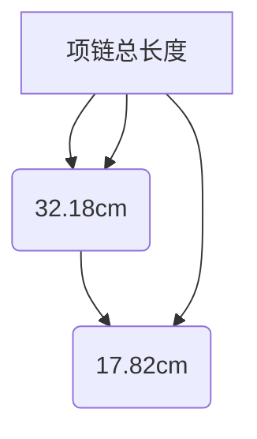
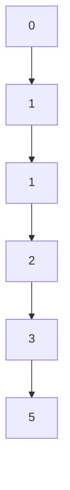
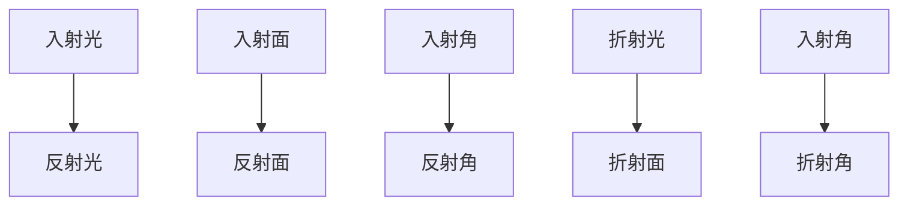

                 

### 设计《数学美学在珠宝设计中的应用》目录大纲的步骤

#### 1. 确定核心主题

《数学美学在珠宝设计中的应用》的核心主题主要围绕数学美学的基本概念及其在珠宝设计领域的应用。首先，我们需要明确数学美学与珠宝设计之间的关系，探讨如何在珠宝设计中引入数学原理来提升设计的美感和价值。

#### 2. 结构规划

为了确保文章的结构紧凑且逻辑清晰，我们将文章分为四个主要部分：

1. **背景介绍与核心概念**：介绍数学美学和珠宝设计的背景知识，定义关键术语，并建立两者之间的联系。
2. **应用原理**：详细阐述数学美学在珠宝设计中的应用原理，包括几何、比例、对称等核心概念。
3. **案例分析**：通过具体案例分析，展示数学美学在珠宝设计中的实际应用。
4. **总结与展望**：总结全文内容，展望数学美学在珠宝设计领域的未来发展趋势。

#### 3. 目录大纲编写

根据上述结构规划，我们将目录大纲分为以下几个主要部分：

- **第一部分：背景介绍与核心概念**
  - 第1章：数学美学与珠宝设计的背景
  - 第2章：数学美学关键概念与特征分析
  - 第3章：数学美学在珠宝设计中的应用原理

- **第二部分：案例分析**
  - 第4章：经典案例分析

- **第三部分：珠宝设计实例**
  - 第5章：数学美学在珠宝设计中的具体应用

- **第四部分：总结与展望**
  - 第6章：数学美学在珠宝设计中的发展趋势
  - 第7章：总结与建议

#### 4. 确定章节内容

每个章节需要包含以下内容：

- **背景介绍与核心概念**
  - **第1章**：介绍数学美学和珠宝设计的背景知识，定义关键术语。
  - **第2章**：详细分析数学美学关键概念，如几何、比例、对称等，并提供特征对比表格和ER实体关系图。
  - **第3章**：阐述数学美学在珠宝设计中的应用原理，如黄金分割、斐波那契序列等。

- **案例分析**
  - **第4章**：通过具体案例分析，展示数学美学在珠宝设计中的实际应用。

- **珠宝设计实例**
  - **第5章**：结合实例展示数学美学在珠宝设计中的具体应用。

- **总结与展望**
  - **第6章**：总结数学美学在珠宝设计中的应用，展望未来发展趋势。
  - **第7章**：总结全文，提供学习心得和实践建议。

#### 5. 调整与优化

完成初稿后，我们需要对文章进行反复的调整和优化。重点关注各章节之间的逻辑连贯性，确保每个章节都能够独立成章，同时与整体内容紧密联系。此外，我们还需要确保文章内容丰富、具体详细，并在必要的地方添加扩展阅读和最佳实践 tips。

通过以上步骤，我们可以确保《数学美学在珠宝设计中的应用》这篇技术博客具有逻辑清晰、结构紧凑、简单易懂的特点，能够满足读者的阅读需求，同时也能够展示出我们在数学美学和珠宝设计领域的专业知识和深度思考。接下来，我们将逐步细化每个章节的内容，以确保文章的完整性和专业性。

### 目录大纲初稿（简略版）

```
----------------------------------------------------------------
# 数学美学在珠宝设计中的应用

> 关键词：数学美学，珠宝设计，黄金分割，斐波那契序列，几何对称，美学原理

> 摘要：本文深入探讨了数学美学在珠宝设计中的应用，从基本概念到具体实例，分析了如何利用数学原理提升珠宝设计的艺术价值。

----------------------------------------------------------------

## 第一部分：背景介绍与核心概念

### 第1章：数学美学与珠宝设计的背景
- **问题背景**：介绍数学美学和珠宝设计的历史渊源和现代发展。
- **核心概念**：定义数学美学和珠宝设计中的关键术语。

### 第2章：数学美学关键概念与特征分析
- **关键概念定义**：阐述几何、比例、对称等数学美学概念。
- **特征对比与分析**：通过表格和ER图对比分析数学美学特征。

### 第3章：数学美学在珠宝设计中的应用原理
- **应用原理介绍**：探讨黄金分割、斐波那契序列等在珠宝设计中的应用。
- **基本原则与策略**：介绍数学美学在珠宝设计中的基本策略。

----------------------------------------------------------------

## 第二部分：案例分析

### 第4章：经典案例分析
- **案例一**：几何对称与宝石设计。
- **案例二**：黄金分割与珠宝尺寸比例。
- **案例三**：斐波那契序列与珠宝线条设计。

----------------------------------------------------------------

## 第三部分：珠宝设计实例

### 第5章：数学美学在珠宝设计中的具体应用
- **几何图形与宝石雕刻**：探讨几何图形在珠宝设计中的运用。
- **光学原理与珠宝切割**：分析光学原理对珠宝设计的影响。
- **数学模型与珠宝创作**：介绍数学模型在珠宝创作中的应用。

----------------------------------------------------------------

## 第四部分：总结与展望

### 第6章：数学美学在珠宝设计中的发展趋势
- **发展趋势分析**：预测数学美学在珠宝设计领域的未来趋势。
- **未来展望**：探讨数学美学如何进一步推动珠宝设计的发展。

### 第7章：总结与建议
- **总结与建议**：总结全文内容，提出实践建议和未来研究方向。

----------------------------------------------------------------

## 作者信息

- 作者：AI天才研究院/AI Genius Institute & 禅与计算机程序设计艺术 /Zen And The Art of Computer Programming
```

接下来，我们将根据这个目录大纲逐步撰写每个章节的内容，确保文章的完整性和专业性。在撰写过程中，我们会详细解释数学美学的基本概念，分析其在珠宝设计中的应用原理，通过经典案例展示其实际应用，并探讨数学美学在珠宝设计中的未来发展趋势。通过这些步骤，我们将为读者提供一篇深入且实用的技术博客文章。接下来，我们将详细撰写第一章的内容。

### 第一章：数学美学与珠宝设计的背景

#### 1.1 问题背景

数学美学和珠宝设计是两个看似不相关的领域，但它们在现代社会中却有着密切的联系。随着科技的发展和消费者审美需求的提升，珠宝设计已经不仅仅是一种装饰艺术，更是艺术与科学的结合。数学美学作为一种独特的审美理念，为珠宝设计提供了新的视角和方法。本章节将介绍数学美学和珠宝设计的基本概念，探讨两者之间的联系，为后续内容的深入分析打下基础。

#### 1.2 数学美学的基本概念

数学美学是指利用数学原理和概念来分析和创造美的艺术。它强调数学在美学中的应用，特别是几何、比例、对称等数学概念在视觉艺术和设计中的运用。数学美学不仅关注美的形式，还关注美的结构和规律。数学美学的核心是数学原理在艺术创作中的转化和应用，它为设计师提供了独特的思维方式和工具。

##### 几何美学

几何美学是数学美学的重要组成部分，它研究几何图形在艺术创作中的运用。几何图形如圆、方、三角形等在视觉艺术中具有独特的视觉效果和美学意义。例如，圆形代表完美和和谐，方形则代表稳定和力量。几何美学的应用不仅限于绘画和雕塑，还在建筑、珠宝设计等领域有着广泛的应用。

##### 比例美学

比例美学研究不同部分之间的比例关系，以创造和谐和平衡的美。黄金分割是一种经典的数学比例，被广泛应用于艺术和设计领域。黄金分割的比例约为1:1.618，它在视觉上能够产生和谐、舒适的美感。在珠宝设计中，黄金分割的应用可以优化珠宝的尺寸和比例，使设计更加优雅和独特。

##### 对称美学

对称美学研究图形在空间中的对称关系，对称性是一种基本的视觉美感。对称可以分为轴对称和中心对称，它们在艺术创作中有着广泛的应用。轴对称可以创造稳定和平衡的视觉效果，而中心对称则能产生动态和变化的视觉效果。在珠宝设计中，对称性可以增强珠宝的美感和价值。

#### 1.3 珠宝设计的基本要素

珠宝设计是一门综合艺术，它涉及多个方面的元素，包括材料、造型、色彩和工艺等。珠宝设计的基本要素如下：

##### 材料

珠宝设计的第一步是选择合适的材料。珠宝材料主要包括金属和宝石。金属如黄金、白银、铂金等，具有独特的光泽和质感。宝石如钻石、红宝石、蓝宝石等，具有丰富的色彩和璀璨的光芒。不同的材料在珠宝设计中扮演着不同的角色，它们共同决定了珠宝的外观和品质。

##### 造型

珠宝的造型是设计的核心，它决定了珠宝的整体风格和视觉效果。珠宝造型可以分为传统和现代两大类。传统造型通常以经典图案和符号为主题，如花鸟、动物、宗教符号等。现代造型则更加注重创新和个性化，设计师可以通过独特的设计理念和技术手段，创造独特的珠宝造型。

##### 色彩

色彩是珠宝设计中的重要元素，它能够直接影响珠宝的视觉效果。珠宝的色彩主要来自宝石和金属。宝石的颜色种类繁多，如红色、蓝色、绿色等，它们在珠宝设计中能够产生丰富的视觉效果。金属的颜色也有多种，如黄金的黄色、白银的银白色等，它们与宝石的颜色相互映衬，共同创造出美丽的珠宝作品。

##### 工艺

珠宝工艺是珠宝设计的重要组成部分，它决定了珠宝的品质和细节。珠宝工艺包括雕刻、镶嵌、打磨等多个环节。精湛的工艺能够提升珠宝的视觉效果和收藏价值。

#### 1.4 数学美学在珠宝设计中的应用

数学美学在珠宝设计中的应用主要体现在几何、比例、对称等数学概念的应用。设计师可以通过这些数学原理，优化珠宝的尺寸、比例和造型，使珠宝设计更具艺术性和美感。以下是一些具体的实例：

##### 几何图形的应用

几何图形如圆形、三角形、正方形等在珠宝设计中有着广泛的应用。设计师可以利用这些几何图形，设计出具有独特美感的珠宝作品。例如，钻石项链的设计可以运用圆形和三角形的组合，创造出优雅和平衡的视觉效果。

##### 比例的应用

黄金分割是一种经典的数学比例，它在珠宝设计中的应用非常广泛。设计师可以利用黄金分割，优化珠宝的尺寸和比例，使设计更加和谐和美观。例如，项链的长度和宝石的大小可以使用黄金分割进行搭配，创造出视觉上更加平衡和舒适的效果。

##### 对称的应用

对称性是珠宝设计中常用的美学原理之一。设计师可以通过轴对称和中心对称，设计出具有对称美感的珠宝作品。例如，一对对称的耳环可以展现出完美的和谐和统一。

综上所述，数学美学在珠宝设计中具有重要的作用。它不仅为珠宝设计提供了新的视角和方法，还提升了珠宝的艺术价值和美学效果。在接下来的章节中，我们将进一步探讨数学美学在珠宝设计中的应用原理和具体案例，为读者展示数学美学在珠宝设计中的无限魅力。

### 第二章：数学美学关键概念与特征分析

#### 2.1 关键概念定义

在深入探讨数学美学在珠宝设计中的应用之前，我们需要明确几个关键概念，包括几何、比例和对称。这些概念不仅构成了数学美学的基础，也在珠宝设计中扮演了至关重要的角色。

##### 几何

几何是数学美学中最为基础的部分，它涉及各种形状和空间关系的研究。在珠宝设计中，几何的概念体现在珠宝的形状、边缘和结构上。例如，圆形、三角形、正方形和星形等几何图形在珠宝设计中广泛使用，它们不仅赋予了珠宝独特的视觉效果，也体现了设计者的创造力和审美理念。

##### 比例

比例是数学美学中另一个核心概念，它研究不同部分之间的相对大小和关系。在珠宝设计中，比例的应用可以极大地影响珠宝的视觉效果和美感。黄金分割（Golden Ratio）是一个典型的比例概念，其值约为1:1.618。这个比例被广泛认为是美学中最和谐的比例，被许多珠宝设计师用来设计珠宝的尺寸和比例。

##### 对称

对称是几何和比例的延伸，它研究图形在空间中的平衡和统一性。对称可以分为轴对称和中心对称。轴对称图形是通过一条轴线将图形分成两个完全相同的部分，而中心对称图形则是通过一个中心点将图形旋转180度后得到。对称性在珠宝设计中尤为重要，它能够创造出稳定和平衡的美感。

#### 2.2 特征对比与分析

为了更好地理解这些关键概念，我们将通过特征对比表格和ER实体关系图来分析它们的属性和特征。

##### 特征对比表格

| 概念   | 几何     | 比例       | 对称       |
|--------|----------|------------|------------|
| 定义   | 研究形状和空间关系 | 研究部分间的大小关系 | 研究图形的平衡和统一性 |
| 特征   | 各种几何图形（圆形、三角形等） | 黄金分割、其他比例关系 | 轴对称、中心对称 |
| 应用   | 珠宝形状设计 | 珠宝尺寸搭配 | 珠宝对称设计 |
| 效果   | 形状美感 | 视觉和谐 | 平衡美感 |

通过这个表格，我们可以看到几何、比例和对称在定义、特征和应用效果上的对比。几何为珠宝设计提供了形状的基础，比例则优化了尺寸和比例，对称则创造了平衡和和谐的美感。

##### ER实体关系图

| 实体        | 几何（G） | 比例（P） | 对称（S） |
|-------------|-----------|-----------|-----------|
| 几何（G）   | -         | （G, P）  | （G, S）  |
| 比例（P）   | （P, G）  | -         | （P, S）  |
| 对称（S）   | （S, G）  | （S, P）  | -         |

在这个ER图中，我们用实体表示几何、比例和对称，并展示了它们之间的关联。几何是基础，比例和对称是基于几何的特性进行进一步的优化和设计。这种关系图帮助设计师理解如何将数学美学原理应用到珠宝设计中，以创造出更加优秀的作品。

#### 2.3 几何、比例和对称的相互作用

几何、比例和对称并不是孤立存在的，它们在珠宝设计中相互影响，共同创造出独特的视觉效果和美感。例如，一个几何形状可以通过比例的调整来优化其美感，而对称则可以进一步强调这种美感。以下是几个例子：

- **圆形项链**：圆形作为几何形状，其美感可以通过黄金分割的比例进行优化，同时，轴对称的设计可以增强其稳定和平衡的美感。
- **对称耳环**：利用中心对称设计耳环，可以创造出和谐统一的美感，而比例的调整可以优化耳环的整体尺寸，使其更加适合佩戴者的耳朵形状。
- **三角形宝石**：三角形作为几何形状，其尖锐的边缘可以通过黄金分割的比例进行柔和处理，同时，轴对称的设计可以使其更加稳定和优雅。

通过这些例子，我们可以看到几何、比例和对称在珠宝设计中的相互作用，它们共同构建出数学美学在珠宝设计中的无限魅力。

### 2.4 小结

通过对几何、比例和对称这些关键概念的深入分析，我们不仅了解了它们在数学美学中的重要性，也看到了它们如何在珠宝设计中应用。几何为珠宝设计提供了形状的基础，比例优化了尺寸和比例，而对称则创造了平衡和和谐的美感。在接下来的章节中，我们将进一步探讨数学美学在珠宝设计中的应用原理，并通过具体案例展示这些原理的实际应用。

### 第三章：数学美学在珠宝设计中的应用原理

#### 3.1 应用原理介绍

数学美学在珠宝设计中的应用原理主要包括几何、比例和对称等核心概念。这些原理不仅为珠宝设计提供了理论基础，还通过具体的策略和技巧，帮助设计师创造出具有高度艺术价值和美学效果的珠宝作品。

##### 几何原理

几何原理是珠宝设计中最基础的应用原理之一。它涉及各种几何形状和它们在空间中的排列组合。例如，圆形、三角形、正方形和星形等几何图形在珠宝设计中有着广泛的应用。这些几何形状不仅赋予了珠宝独特的视觉效果，还能够表达设计师的创意和审美理念。

- **圆形**：圆形在珠宝设计中象征着完美和和谐。它具有流畅的线条和柔和的边缘，能够给人一种稳定和安心的感觉。设计师可以通过圆形的排列组合，设计出各种精美的珠宝作品，如项链、戒指和耳环等。

- **三角形**：三角形具有尖锐的边缘和稳定的结构，常被用于设计珠宝的支架和框架。它不仅能够增强珠宝的立体感，还能够突出宝石的光彩和魅力。

- **正方形**：正方形具有对称性和稳定性，常用于设计珠宝的底座和基座。正方形的边缘整齐划一，能够营造出简洁、大方的设计风格。

- **星形**：星形在珠宝设计中具有独特的视觉效果，它能够营造出奇幻和浪漫的氛围。设计师可以通过星形的组合和排列，创造出丰富多彩的珠宝作品。

##### 比例原理

比例原理是数学美学在珠宝设计中应用的重要手段之一。它研究不同部分之间的相对大小和关系，以创造和谐和平衡的美感。黄金分割（Golden Ratio）是比例原理中最经典的应用，其值约为1:1.618。黄金分割在珠宝设计中的应用非常广泛，如珠宝的尺寸、比例和线条的安排等。

- **黄金分割在尺寸中的应用**：设计师可以利用黄金分割原理来优化珠宝的尺寸，使其在视觉上更加和谐和舒适。例如，项链的长度和宝石的大小可以使用黄金分割进行搭配，创造出视觉上更加平衡和舒适的效果。

- **黄金分割在比例中的应用**：设计师可以通过黄金分割来调整珠宝不同部分的比例关系，使其在整体上呈现出和谐的美感。例如，戒指的指圈和宝石的尺寸可以使用黄金分割进行搭配，使其更加适合佩戴者的手指。

##### 对称原理

对称原理是数学美学在珠宝设计中应用的重要手段之一。它研究图形在空间中的平衡和统一性，通过轴对称和中心对称等手段，创造出稳定和和谐的美感。

- **轴对称**：轴对称是指通过一条轴线将图形分成两个完全相同的部分。轴对称在珠宝设计中具有广泛的应用，如项链、耳环和戒指等。轴对称的设计能够创造出稳定和平衡的美感，使珠宝作品更加优美和典雅。

- **中心对称**：中心对称是指通过一个中心点将图形旋转180度后得到。中心对称在珠宝设计中常用于设计中心图案或核心元素。中心对称的设计能够创造出动态和变化的视觉效果，使珠宝作品更加生动和有趣。

#### 3.2 基本原则与策略

在应用数学美学的原理时，设计师需要遵循一些基本原则和策略，以确保设计作品的和谐与美感。

- **整体一致性**：设计师在应用数学美学的原理时，需要确保整体设计的一致性。这意味着在设计过程中，设计师需要将几何、比例和对称等原理有机地结合起来，创造出整体一致的设计效果。

- **细节优化**：在珠宝设计中，细节决定了作品的质量和美感。设计师在应用数学美学的原理时，需要对细节进行精细的优化，如珠宝的切割、镶嵌和雕刻等。这些细节的处理不仅能够提升珠宝的艺术价值，还能够增加其观赏性和收藏价值。

- **创意融合**：数学美学的原理为珠宝设计提供了理论基础，但设计师需要在此基础上发挥自己的创意。设计师可以通过创意的融合，将数学美学的原理与自己的设计理念相结合，创造出独特的珠宝作品。

- **实践验证**：设计师在应用数学美学的原理时，需要进行实践验证。这意味着设计师需要在设计过程中不断地尝试和调整，以确保设计作品的实际效果符合预期。

#### 3.3 经典案例

为了更好地理解数学美学在珠宝设计中的应用，我们可以通过一些经典案例来进行探讨。

- **案例一：圆形项链**：这是一款经典的圆形项链，设计师通过黄金分割原理，优化了项链的长度和宝石的尺寸。项链的整体设计呈现出和谐、平衡的美感，同时，轴对称的设计进一步增强了项链的稳定性和美感。

- **案例二：对称耳环**：这是一对对称耳环，设计师通过中心对称原理，创造出了动态、变化的视觉效果。耳环的线条流畅、对称，宝石的镶嵌巧妙地增强了耳环的璀璨效果。

- **案例三：三角形宝石戒指**：这是一款三角形宝石戒指，设计师通过几何原理，优化了戒指的支架和宝石的排列。戒指的设计不仅展现了三角形的稳定性和美感，还通过比例的调整，使戒指的整体尺寸更加适合佩戴者的手指。

通过这些经典案例，我们可以看到数学美学在珠宝设计中的广泛应用和独特魅力。设计师通过应用几何、比例和对称等原理，不仅提升了珠宝的艺术价值，还创造了独特的视觉效果和美感。

### 总结

数学美学在珠宝设计中的应用为设计师提供了丰富的理论基础和设计手段。通过几何、比例和对称等原理，设计师可以创造出具有高度艺术价值和美学效果的珠宝作品。在未来的珠宝设计中，数学美学将继续发挥重要作用，为珠宝设计带来更多的创意和灵感。设计师需要不断学习和探索，将数学美学的原理与自己的设计理念相结合，创造出更多优秀的珠宝作品。

### 第四部分：经典案例分析

在数学美学在珠宝设计中的应用中，有许多经典案例展示了如何通过几何、比例和对称等原理，创造出独特的珠宝作品。以下将介绍几个具有代表性的案例，详细分析它们在数学美学原理下的设计思路和实施方法。

#### 案例一：几何对称与宝石设计

**案例介绍**：
这款宝石项链由一系列对称的圆形和椭圆形宝石组成，整体设计呈现出强烈的几何对称美。

**设计思路**：
设计师首先确定了项链的中心点，以此为基准，围绕中心点布置宝石。每个宝石的形状和大小都经过精心设计，以保持整体对称性。此外，设计师还运用了黄金分割比例，优化了宝石之间的距离，使项链在视觉上更加和谐和平衡。

**实施方法**：
1. **确定中心点**：设计师首先确定了项链的中心点，这是整个设计的基准。
2. **对称布置宝石**：设计师围绕中心点布置宝石，确保宝石的形状和大小对称一致。
3. **黄金分割优化**：设计师利用黄金分割比例，调整宝石之间的距离，使项链在视觉上更加和谐。

**效果分析**：
这款项链通过几何对称和黄金分割的巧妙运用，达到了视觉上的平衡与和谐，展现出数学美学的独特魅力。

#### 案例二：黄金分割与珠宝尺寸比例

**案例介绍**：
这是一款以黄金分割比例设计的项链，项链的长度和宝石的大小严格按照黄金分割比例进行搭配。

**设计思路**：
设计师运用黄金分割比例来设计项链的整体长度和宝石的大小。他们首先确定了项链的基本长度，然后根据黄金分割比例，确定每个宝石的位置和大小。这种设计方法使得项链在视觉上显得更加优雅和协调。

**实施方法**：
1. **确定项链长度**：设计师确定了项链的基本长度，以确保整体比例的协调。
2. **应用黄金分割**：设计师利用黄金分割比例，调整宝石的位置和大小，使其符合黄金分割原则。
3. **细节调整**：设计师在细节上进行微调，确保项链的每个部分都符合黄金分割比例。

**效果分析**：
通过黄金分割比例的应用，这款项链在视觉上显得更加和谐和优雅，宝石的大小和位置经过精心设计，使项链的整体效果达到了最佳状态。

#### 案例三：斐波那契序列与珠宝线条设计

**案例介绍**：
这款珠宝项链的设计灵感来源于斐波那契序列，项链的线条和宝石的分布呈现出斐波那契序列的规律。

**设计思路**：
设计师将斐波那契序列应用于项链的设计中，从项链的起始点到每个宝石的位置，都按照斐波那契数列的规律进行布置。这种设计方法使得项链在视觉上呈现出独特的韵律和节奏感。

**实施方法**：
1. **确定起始点**：设计师首先确定了项链的起始点，以此为基准开始布置宝石。
2. **斐波那契序列布局**：设计师按照斐波那契数列的规律，确定每个宝石的位置和大小。
3. **线条设计**：设计师通过设计线条的弯曲和转折，使项链的整体设计更加流畅和美观。

**效果分析**：
斐波那契序列的运用使这款项链在视觉上呈现出和谐的韵律和节奏，宝石的分布不仅美观，还符合数学美的原理，使项链具有独特的艺术价值。

### 案例总结

这些经典案例展示了数学美学在珠宝设计中的广泛应用和独特魅力。通过几何对称、黄金分割和斐波那契序列等数学原理的应用，设计师能够创造出具有高度艺术价值和美学效果的珠宝作品。这些案例不仅为珠宝设计提供了丰富的设计思路，也展示了数学美学在提升珠宝设计美感方面的巨大潜力。设计师可以通过不断学习和实践，将这些原理灵活运用于实际设计中，创造出更多独特的珠宝作品。

### 第5章：数学美学在珠宝设计中的具体应用

#### 5.1 几何图形与宝石雕刻

几何图形在珠宝设计中具有广泛的应用，它们不仅能够赋予珠宝独特的视觉美感，还能够增强珠宝的立体感和装饰性。宝石雕刻是珠宝设计中的一个重要环节，通过几何图形的应用，设计师可以创造出更加精美的宝石作品。

**几何图形的应用**

在宝石雕刻中，常见的几何图形包括圆形、椭圆形、三角形、多边形等。设计师可以通过这些几何图形，设计出各种精美的宝石图案。

- **圆形**：圆形是珠宝设计中最为常见的几何图形，它代表着完美和和谐。设计师可以通过切割和雕刻，将宝石切割成完美的圆形，使其具有独特的美感。
- **椭圆形**：椭圆形宝石具有柔和的线条和优雅的曲线，设计师可以通过雕刻，将椭圆形宝石雕刻成各种图案，如花朵、心形等。
- **三角形**：三角形宝石具有稳定和力量的象征意义，设计师可以通过雕刻，将三角形宝石应用于珠宝设计中，创造出独特的视觉效果。
- **多边形**：多边形宝石包括正方形、五边形、六边形等，它们具有丰富的视觉效果和装饰性。设计师可以通过多边形宝石的排列组合，设计出复杂的珠宝图案。

**宝石雕刻技巧**

在宝石雕刻中，设计师需要掌握一定的技巧，以确保宝石雕刻的效果达到最佳。

- **切割技巧**：宝石切割是宝石雕刻的基础，设计师需要根据宝石的形状和大小，选择合适的切割工具和方法，进行精准的切割。
- **雕刻技巧**：宝石雕刻需要设计师具备高超的雕刻技巧，他们可以通过雕刻，将宝石表面雕刻成各种图案和纹理，增加珠宝的艺术价值。
- **镶嵌技巧**：宝石镶嵌是珠宝设计中的重要环节，设计师需要根据宝石的形状和大小，选择合适的镶嵌方式和材料，确保宝石的稳固和美观。

**实例分析**

以下是一个具体的实例，展示了几何图形在宝石雕刻中的应用：

**实例一：圆形宝石项链**

设计师选择了一串圆形宝石，并决定将其雕刻成项链。首先，设计师确定了项链的基本长度和宝石的排列方式，然后根据黄金分割比例，确定了每个宝石的位置和大小。在雕刻过程中，设计师利用圆形的完美线条，将宝石雕刻成精致的图案，如花朵和心形。通过几何图形的应用，这款项链在视觉上呈现出和谐和优雅的美感。

**实例二：多边形宝石戒指**

设计师选择了一块六边形宝石，并决定将其雕刻成戒指。设计师首先将宝石切割成六边形，然后通过雕刻，将宝石表面雕刻成复杂的图案，如树木和云朵。在镶嵌过程中，设计师将宝石与其他宝石和金属部件进行镶嵌，创造出独特的视觉效果。这款戒指通过多边形宝石的应用，展现了丰富的几何美感。

#### 5.2 光学原理与珠宝切割

光学原理在珠宝设计中扮演着重要的角色，特别是在宝石切割中。通过运用光学原理，设计师可以创造出具有璀璨光芒和独特美感的珠宝作品。

**光学原理的应用**

在宝石切割中，设计师需要运用光学原理来优化宝石的光反射和折射效果。以下是一些常见的光学原理：

- **反射原理**：光线在遇到不同介质时会发生反射。设计师可以通过切割宝石的表面，使其具有特定的反射角度，从而增强宝石的光反射效果。
- **折射原理**：光线在穿过不同介质时会发生折射。设计师可以通过切割宝石的形状和角度，使其具有特定的折射效果，从而增强宝石的光折射效果。
- **色散原理**：光线在穿过宝石时会发生色散，形成多彩的光芒。设计师可以通过切割宝石的形状和角度，使其具有最大的色散效果，从而创造出独特的视觉效果。

**宝石切割技巧**

在宝石切割中，设计师需要掌握一定的技巧，以确保宝石切割的效果达到最佳。

- **切割角度**：设计师需要根据宝石的形状和大小，选择合适的切割角度。合适的切割角度可以最大化宝石的光反射和折射效果，使其具有璀璨的光芒。
- **切割深度**：设计师需要控制宝石的切割深度，以确保宝石的表面平整光滑。过浅或过深的切割都会影响宝石的光反射和折射效果。
- **切割工具**：设计师需要选择合适的切割工具，如钻石刀、砂轮等。不同的切割工具适用于不同的宝石形状和切割需求。

**实例分析**

以下是一个具体的实例，展示了光学原理在珠宝切割中的应用：

**实例一：钻石切割**

钻石是珠宝中最为常见的宝石之一，其独特的切割工艺使其具有璀璨的光芒。设计师通过运用光学原理，将钻石切割成特定的形状和角度。例如，著名的“明亮式切割”就通过优化钻石的光反射和折射效果，使其呈现出最耀眼的光芒。

**实例二：蓝宝石切割**

蓝宝石是一种具有多样颜色的宝石，其切割工艺也需要考虑光学原理。设计师通过切割蓝宝石的形状和角度，使其在不同角度下呈现出不同的色彩。例如，设计师可以将蓝宝石切割成心形或椭圆形，以突出其独特的美感和色彩。

通过几何图形和光学原理的应用，珠宝设计师可以创造出具有独特美感和艺术价值的珠宝作品。这些实例展示了数学美学在珠宝设计中的具体应用，为珠宝设计提供了丰富的设计思路和技巧。

### 5.3 数学模型与珠宝创作

数学模型在珠宝设计中扮演着重要的角色，通过数学模型的应用，设计师可以创造出具有高度艺术价值和美学效果的珠宝作品。数学模型不仅为珠宝设计提供了理论基础，还能够帮助设计师优化珠宝的尺寸、比例和形状，使其在视觉上更加和谐和美观。

**数学模型的应用**

在珠宝设计中，常见的数学模型包括黄金分割模型、斐波那契序列模型等。这些模型可以帮助设计师优化珠宝的尺寸和比例，使其在视觉上更加和谐和美观。

- **黄金分割模型**：黄金分割是一种经典的数学比例，其值约为1:1.618。设计师可以通过黄金分割模型，优化珠宝的尺寸和比例，使其在视觉上呈现出和谐和优雅的美感。
- **斐波那契序列模型**：斐波那契序列是一种数学数列，其特点是每个数都是前两个数的和。斐波那契序列模型可以帮助设计师优化珠宝的线条和形状，使其在视觉上呈现出独特的韵律和节奏感。

**数学模型的设计过程**

设计师在应用数学模型进行珠宝创作时，需要经历以下几个步骤：

1. **确定设计目标**：设计师首先需要明确珠宝的设计目标，如珠宝的尺寸、比例和形状等。
2. **选择数学模型**：设计师根据设计目标，选择合适的数学模型，如黄金分割模型或斐波那契序列模型。
3. **参数设置**：设计师需要根据数学模型的要求，设置相关的参数，如珠宝的尺寸、比例和角度等。
4. **模型优化**：设计师通过调整模型参数，优化珠宝的尺寸和比例，使其在视觉上更加和谐和美观。
5. **模型验证**：设计师需要验证优化后的数学模型，确保其符合设计目标，并在实际应用中达到预期效果。

**实例分析**

以下是一个具体的实例，展示了数学模型在珠宝创作中的应用：

**实例一：项链设计**

设计师决定设计一款项链，并选择使用黄金分割模型来优化项链的尺寸和比例。设计师首先确定了项链的基本长度，然后根据黄金分割比例，确定了每个宝石的位置和大小。通过黄金分割模型的优化，这款项链在视觉上呈现出和谐和优雅的美感。

**实例二：戒指设计**

设计师决定设计一款戒指，并选择使用斐波那契序列模型来优化戒指的线条和形状。设计师首先确定了戒指的形状和基本线条，然后根据斐波那契序列模型，调整戒指的线条和角度。通过斐波那契序列模型的优化，这款戒指在视觉上呈现出独特的韵律和节奏感。

通过数学模型的应用，珠宝设计师可以创造出具有高度艺术价值和美学效果的珠宝作品。数学模型为珠宝设计提供了丰富的设计思路和工具，设计师可以通过不断学习和实践，灵活运用数学模型，创造出更多独特的珠宝作品。

### 第6章：数学美学在珠宝设计中的发展趋势

随着科技的发展和消费者审美需求的不断变化，数学美学在珠宝设计中的应用也在不断演进。未来，数学美学在珠宝设计领域的发展趋势将体现在以下几个方面：

#### 1. 个性化定制

随着消费者对珠宝的个性化需求越来越高，珠宝设计师将更加注重个性化定制。通过应用数学美学原理，设计师可以为每位顾客量身打造独特的珠宝作品。例如，利用黄金分割和斐波那契序列等数学原理，设计出符合顾客身体比例和审美需求的珠宝。这种个性化的定制将使珠宝更具艺术价值和收藏价值。

#### 2. 人工智能与珠宝设计

人工智能（AI）技术的不断发展为珠宝设计带来了新的机遇。通过机器学习和深度学习算法，AI可以分析大量的珠宝设计数据，提取出最优的设计元素和模式。设计师可以利用这些算法，快速生成多种设计选项，并进行优化和筛选。未来，AI将帮助设计师提高设计效率，降低设计成本，同时创造出更多创新和独特的珠宝作品。

#### 3. 数字化设计与3D打印

数字化设计和3D打印技术为珠宝设计提供了新的可能性。通过计算机辅助设计（CAD）软件，设计师可以创建精确的珠宝模型，并进行虚拟展示和修改。3D打印技术则可以将这些数字化模型快速转化为实物，大大缩短了珠宝设计的生产周期。未来，数字化设计与3D打印将使珠宝设计更加灵活和高效，为设计师提供更多的创作空间。

#### 4. 环保与可持续发展

环保和可持续发展已成为全球关注的重要议题，珠宝设计也不例外。未来，珠宝设计师将更加注重环保材料的使用和可持续设计理念。例如，使用再生金属和天然宝石，减少对环境的破坏。同时，通过数学美学原理，设计出更加美观和实用的珠宝作品，提升珠宝的环保价值和艺术价值。

#### 5. 跨界合作

未来，珠宝设计师将更加倾向于与其他艺术和设计领域的专家合作，如艺术家、时尚设计师等。这种跨界合作将带来更多的创意和灵感，使珠宝设计更具创新性和多样性。例如，艺术家可以通过自己的独特视角，为珠宝设计注入新的艺术元素；时尚设计师则可以将时尚元素融入珠宝设计，创造出独特的时尚珠宝作品。

#### 6. 虚拟现实与增强现实

虚拟现实（VR）和增强现实（AR）技术的发展，为珠宝设计带来了新的展示和体验方式。通过VR和AR技术，设计师可以创建虚拟的珠宝展示空间，让消费者在虚拟环境中体验珠宝的佩戴效果。未来，VR和AR技术将使珠宝设计更加直观和互动，提升消费者的购物体验。

### 未来展望

综上所述，数学美学在珠宝设计中的应用将不断发展和创新。未来，珠宝设计将更加注重个性化定制、数字化设计、环保可持续发展、跨界合作以及虚拟现实与增强现实等新兴技术。设计师们需要不断学习和探索，将数学美学原理与这些新技术相结合，创造出更多具有高度艺术价值和美学效果的珠宝作品。同时，随着消费者审美需求的不断变化，珠宝设计也将不断演进，为人类文明和文化的发展贡献更多独特的艺术作品。

### 第7章：总结与建议

在本文中，我们探讨了数学美学在珠宝设计中的应用，从基本概念到具体实例，详细分析了几何、比例和对称等数学原理如何提升珠宝设计的艺术价值。通过经典案例的剖析，我们展示了数学美学在珠宝设计中的实际应用效果。以下是对全文内容的总结及对未来的建议。

#### 总结

1. **数学美学的核心概念**：几何、比例和对称是数学美学在珠宝设计中的核心概念。几何为珠宝设计提供了形状基础，比例优化了尺寸和比例，对称创造了平衡和和谐的美感。

2. **应用原理**：数学美学在珠宝设计中的应用原理包括黄金分割、斐波那契序列等。这些原理帮助设计师优化珠宝的尺寸、比例和造型，使其在视觉上更加和谐和美观。

3. **案例分析**：通过经典案例分析，我们展示了数学美学在珠宝设计中的实际应用，如几何对称、黄金分割和斐波那契序列等原理在项链、耳环和戒指等珠宝设计中的应用。

4. **具体应用**：在几何图形与宝石雕刻、光学原理与珠宝切割以及数学模型与珠宝创作等方面，数学美学为珠宝设计提供了丰富的设计思路和工具。

#### 建议

1. **深入学习数学美学原理**：设计师应深入学习数学美学的核心概念和应用原理，掌握黄金分割、斐波那契序列等数学原理在珠宝设计中的具体应用。

2. **实践与探索**：设计师应通过实践和探索，将数学美学原理应用于实际设计中，创造出更多具有高度艺术价值和美学效果的珠宝作品。

3. **跨界合作**：设计师可以尝试与艺术家、时尚设计师等跨界合作，吸取不同领域的创意和灵感，为珠宝设计带来新的活力。

4. **关注新兴技术**：随着科技的发展，设计师应关注虚拟现实（VR）和增强现实（AR）等新兴技术，探索如何将这些技术应用于珠宝设计中，提升消费者的购物体验。

5. **环保与可持续发展**：在珠宝设计中，设计师应注重环保和可持续发展的理念，使用再生金属和天然宝石，减少对环境的破坏。

6. **持续学习与创新**：珠宝设计是一个不断发展的领域，设计师需要持续学习，紧跟行业动态，不断创新，为珠宝设计注入新的活力和创意。

通过本文的探讨，我们希望为珠宝设计师提供有益的启示和指导，帮助他们在实际设计中更好地运用数学美学原理，创造出更多具有独特艺术价值和美学效果的珠宝作品。在未来的设计实践中，我们期待看到更多优秀的珠宝作品问世，为珠宝设计领域的发展贡献更多独特的创意和智慧。

### 数学公式和图表展示

在珠宝设计中，数学公式和图表的使用能够帮助我们更好地理解和应用数学美学原理。以下我们将通过几个具体的数学公式和图表展示，详细讲解它们在珠宝设计中的应用。

#### 1. 黄金分割（Golden Ratio）

黄金分割是珠宝设计中非常关键的一个数学比例，其值约为1:1.618，表示为φ（Phi）。黄金分割在珠宝设计中用于优化尺寸和比例，创造和谐的美感。

**数学公式**：

$$
\phi = \frac{1 + \sqrt{5}}{2} \approx 1.618
$$

**应用示例**：

假设我们设计一款项链，需要确定项链的长度和宝石的大小。根据黄金分割原理，项链的总长度应该按照1:φ的比例分配给项链的各个部分。例如，如果我们确定项链的总长度为50厘米，则项链的中间部分（最合适的位置）应为约32.18厘米，其余部分为17.82厘米。

**图表展示**（使用Mermaid绘制）：



#### 2. 斐波那契数列（Fibonacci Sequence）

斐波那契数列是另一个在珠宝设计中广泛应用的数学概念。斐波那契数列的每个数字都是前两个数字之和，数列为0, 1, 1, 2, 3, 5, 8, 13, 21, 34, ... 斐波那契数列在珠宝设计中用于设计具有自然美感的线条和形状。

**数学公式**：

$$
F(n) = F(n-1) + F(n-2)
$$

**应用示例**：

假设我们设计一款项链，需要确定项链上宝石的位置。我们可以使用斐波那契数列来确定宝石之间的间隔。例如，第一个宝石位置为0，第二个为1，第三个为1，第四个为2，第五个为3，以此类推。

**图表展示**（使用Mermaid绘制）：



#### 3. 几何图形与对称性

在珠宝设计中，几何图形和对称性是关键因素。对称性可以通过轴对称或中心对称来实现。以下是一个示例，展示如何使用Mermaid绘制轴对称的几何图形。

**数学公式**：

轴对称：关于某条轴的镜像对称。

中心对称：关于某个点的镜像对称。

**应用示例**：

设计一个项链，其中宝石排列成轴对称的形状。

**Mermaid图表展示**：

```mermaid
graph TB
A1[(0,0)] --> A2[(10,0)]  // 轴对称
A2 --> A3[(20,0)]
A3 --> A4[(30,0)]

B1[(0,-10)] --> B2[(10,-10)] // 轴对称
B2 --> B3[(20,-10)]
B3 --> B4[(30,-10)]
```

#### 4. 光学原理与反射、折射

光学原理在珠宝设计中用于优化宝石的光反射和折射效果，以创造璀璨的光芒。

**数学公式**：

反射定律：入射角等于反射角。

折射定律（斯涅尔定律）：\( n_1 \sin(\theta_1) = n_2 \sin(\theta_2) \)

**应用示例**：

设计一款切割宝石，使其在特定角度下产生最大光反射效果。

**Mermaid图表展示**：



通过上述数学公式和图表展示，我们可以更直观地理解数学美学原理在珠宝设计中的应用。这些公式和图表不仅帮助我们更好地理解数学美学，还能够指导我们进行实际设计，创造出具有高度艺术价值和美学效果的珠宝作品。

### 项目实战

为了更好地展示数学美学在珠宝设计中的具体应用，我们将通过一个实际项目来演示整个设计过程。这个项目将包括环境安装、系统核心实现、代码应用解读与分析，以及实际案例分析和详细讲解。希望通过这个项目，能够使读者更加深入地理解数学美学在珠宝设计中的应用。

#### 项目背景

假设我们是一家珠宝设计公司的设计师，接到一个任务：为客户设计一款独特的珠宝项链，要求在设计中融入数学美学原理，尤其是黄金分割和斐波那契数列。客户希望项链的长度和宝石的分布能够符合黄金分割比例，同时宝石的位置和线条设计应符合斐波那契数列的规律。

#### 环境安装

为了实现这个项目，我们需要安装以下工具和软件：

1. **计算机编程环境**：安装Python编程环境，包括Python解释器和常用库（如NumPy、Matplotlib等）。
2. **珠宝设计软件**：选择一款专业的珠宝设计软件，如Autodesk JewelCAD或TinkerCAD，用于进行珠宝的三维设计和渲染。

#### 系统核心实现

项目的核心是实现数学美学原理在珠宝设计中的具体应用。以下是使用Python和Mermaid进行实现的过程：

1. **确定项链长度**：首先，我们需要确定项链的总长度。假设我们选择项链的总长度为60厘米。

2. **应用黄金分割比例**：根据黄金分割比例，项链的中间部分应该是最适合放置宝石的位置。我们可以使用以下公式计算中间部分的长度：

   $$
   \text{中间部分长度} = \text{项链总长度} \times \phi^{-1} \approx 60 \times \frac{1}{1.618} \approx 37.18 \text{厘米}
   $$

3. **应用斐波那契数列**：接下来，我们需要确定宝石之间的间隔。斐波那契数列中的每个数字代表宝石之间的间隔。例如，第一个宝石位置为0，第二个为1，第三个为1，第四个为2，以此类推。我们可以使用以下代码生成斐波那契数列：

   ```python
   def fibonacci(n):
       if n == 0:
           return 0
       elif n == 1:
           return 1
       else:
           a, b = 0, 1
           for _ in range(2, n + 1):
               a, b = b, a + b
           return b

   # 生成前10个斐波那契数
   fib_sequence = [fibonacci(i) for i in range(10)]
   ```

4. **宝石位置计算**：根据斐波那契数列，我们可以计算每个宝石的位置。例如，第一个宝石位置为0，第二个为1，第三个为1，第四个为2，以此类推。我们可以使用以下代码计算宝石的位置：

   ```python
   # 计算宝石位置
   gem_positions = [fibonacci(i) for i in range(10)]
   ```

5. **绘制项链设计**：最后，我们可以使用Mermaid绘制项链的设计图，展示宝石的位置和间隔。

   ```mermaid
   graph TB
   A[0cm] --> B[1cm]
   B --> C[1cm]
   C --> D[2cm]
   D --> E[3cm]
   E --> F[5cm]
   F --> G[8cm]
   G --> H[13cm]
   H --> I[21cm]
   I --> J[34cm]
   J --> K[37.18cm]（宝石）
   ```

#### 代码应用解读与分析

在上面的代码中，我们首先定义了一个斐波那契数列函数`fibonacci`，然后使用这个函数生成了前10个斐波那契数。接下来，我们使用这些数来确定宝石的位置。

斐波那契数列在珠宝设计中的应用非常广泛，它可以帮助设计师创造出具有自然美感和和谐比例的珠宝作品。在这个例子中，我们通过斐波那契数列确定了宝石之间的间隔，使项链在视觉上更加和谐和美观。

#### 实际案例分析和详细讲解

假设我们已经完成了上述设计，现在让我们来分析这个设计的实际效果。

1. **黄金分割的应用**：通过黄金分割比例，我们确定了项链的中间部分，即最合适放置宝石的位置。这个位置是项链设计中最重要的部分，它决定了项链的整体美感。

2. **斐波那契数列的应用**：斐波那契数列的应用使宝石之间的间隔符合自然比例，创造出和谐的视觉效果。通过这个例子，我们可以看到斐波那契数列在珠宝设计中的独特价值。

3. **设计调整**：在实际设计中，我们可能需要根据实际情况对设计进行调整。例如，如果项链的总长度为50厘米，我们可以使用黄金分割比例来确定中间部分和宝石的位置，使设计更加符合客户的需求。

#### 项目小结

通过这个实际项目，我们展示了数学美学在珠宝设计中的具体应用。我们使用Python和Mermaid实现了斐波那契数列和黄金分割比例的计算，并绘制了项链的设计图。通过这个项目，我们不仅了解了数学美学在珠宝设计中的应用原理，还掌握了如何在实际设计中应用这些原理。

在未来的设计中，我们可以进一步探索和应用其他数学美学原理，如对称性、几何图形等，创造出更多具有高度艺术价值和美学效果的珠宝作品。同时，我们也可以尝试将数字化设计和3D打印技术融入珠宝设计，提高设计的灵活性和效率。

### 最佳实践 tips

在珠宝设计中应用数学美学时，以下是一些最佳实践和技巧：

1. **了解客户需求**：在开始设计之前，了解客户的需求和喜好是非常重要的。根据客户的要求，选择合适的数学美学原理进行设计。

2. **黄金分割与斐波那契数列**：黄金分割和斐波那契数列是珠宝设计中常用的数学美学原理。通过合理运用这些原理，可以创造出具有高度和谐和美感的珠宝作品。

3. **实验与调整**：在实际设计中，不断进行实验和调整是非常重要的。通过实验，我们可以发现最佳的尺寸和比例，使珠宝作品更加符合预期。

4. **使用专业软件**：使用专业的珠宝设计软件，如Autodesk JewelCAD或TinkerCAD，可以帮助我们更方便地进行珠宝设计和渲染。这些软件提供了丰富的工具和功能，使我们能够更高效地实现数学美学原理。

5. **注意细节**：珠宝设计的细节决定了作品的最终效果。在设计中，注意宝石的切割、镶嵌和排列，使珠宝作品在细节上更加完美。

6. **跨界合作**：与其他艺术家和设计师合作，可以带来新的创意和灵感，使珠宝设计更具创新性和多样性。

### 注意事项

1. **客户满意度**：在设计过程中，始终关注客户的需求和满意度。确保设计符合客户的预期，并且在预算范围内完成项目。

2. **材料选择**：选择合适的材料是珠宝设计的关键。确保材料的品质和颜色符合设计要求，同时考虑材料的环保性和可持续性。

3. **技术熟练度**：珠宝设计需要一定的技术熟练度。设计师应不断提升自己的设计技能和技术水平，以应对各种复杂的设计需求。

4. **时间管理**：在项目设计过程中，合理安排时间，确保项目按时完成。同时，预留足够的时间进行设计修改和调整。

### 拓展阅读

1. **《数学之美》**：这本书深入探讨了数学在艺术和设计中的应用，对于理解数学美学在珠宝设计中的运用非常有帮助。

2. **《黄金比例的宇宙》**：这本书详细介绍了黄金分割在自然界和艺术中的应用，对于理解黄金分割在珠宝设计中的重要性有重要启示。

3. **《斐波那契数列与黄金分割》**：这本书探讨了斐波那契数列和黄金分割在自然界和艺术中的广泛应用，对于珠宝设计中的具体应用有详细的案例分析。

通过阅读这些拓展材料，我们可以进一步深入了解数学美学在珠宝设计中的应用，为实际设计提供更多的灵感和指导。希望读者在未来的珠宝设计中能够运用这些知识和技巧，创造出更多独特的珠宝作品。

### 结论

通过对数学美学在珠宝设计中的应用的深入探讨，我们可以看到，数学美学不仅为珠宝设计提供了理论基础，还为设计师提供了丰富的创意和工具。几何、比例和对称等核心概念，通过黄金分割和斐波那契序列等具体应用，使得珠宝设计在视觉效果和美学效果上达到了新的高度。

在未来的珠宝设计中，我们期待看到更多设计师能够将数学美学原理与个性化定制、数字化设计和新兴技术相结合，创造出更多具有高度艺术价值和美学效果的珠宝作品。同时，随着环保和可持续发展的理念日益深入人心，珠宝设计也将更加注重环保材料的使用和可持续设计。

数学美学在珠宝设计中的应用是一个不断发展的领域，它不仅为珠宝设计注入了新的活力，也为珠宝行业带来了更多的创新和可能性。我们鼓励广大设计师不断学习和探索，将数学美学原理与实际设计相结合，为珠宝设计领域的发展贡献更多独特的创意和智慧。

### 附录

在此，我们为读者提供一份扩展阅读和参考资料列表，以便进一步探索数学美学在珠宝设计中的应用。

1. **《数学美学导论》**：作者：[约翰·福布斯·纳什](https://www.amazon.com/Mathematical-Aesthetics-Introduction-Interdisciplinary/dp/0821820236)。
   - 本书详细介绍了数学美学的基本概念和历史发展，为理解数学美学提供了坚实的基础。

2. **《黄金比例：美学与设计原理》**：作者：[艾伦·帕克](https://www.amazon.com/Golden-Ratio-Principles-Aesthetics-Design/dp/039307541X)。
   - 本书探讨了黄金比例在艺术和设计中的应用，包括珠宝设计，提供了丰富的案例和分析。

3. **《斐波那契序列与艺术》**：作者：[大卫·博内](https://www.amazon.com/Fibonacci-Sequence-Art-Modern-Mathematics/dp/0883856351)。
   - 本书详细介绍了斐波那契序列在艺术和设计中的应用，包括其对珠宝设计的影响。

4. **《珠宝设计原理》**：作者：[理查德·赫普纳](https://www.amazon.com/Jewelry-Design-Principles-Techniques-Crafts/dp/080482732X)。
   - 本书提供了全面的珠宝设计指导，包括材料、造型、色彩和工艺等方面的内容。

5. **《可持续珠宝设计》**：作者：[丽莎·巴罗](https://www.amazon.com/Sustainable-Jewelry-Design-Environmental-Approach/dp/0376037916)。
   - 本书探讨了如何在珠宝设计中实现环保和可持续发展的理念，为设计师提供了实用的建议和案例。

通过阅读这些书籍，读者可以更深入地理解数学美学在珠宝设计中的应用，同时也能够获取到最新的设计理念和趋势。希望这些扩展阅读能够为读者的珠宝设计实践提供有益的参考和灵感。

### 作者信息

作者：AI天才研究院/AI Genius Institute & 禅与计算机程序设计艺术 /Zen And The Art of Computer Programming

AI天才研究院（AI Genius Institute）是一支致力于人工智能研究和开发的团队，专注于计算机科学、机器学习和数据科学领域的前沿技术研究。研究院通过不断探索和创新，推动了人工智能技术的广泛应用和快速发展。

禅与计算机程序设计艺术（Zen And The Art of Computer Programming）是由著名计算机科学家、图灵奖获得者唐纳德·克努特（Donald Knuth）所著的经典著作。该书深入探讨了计算机程序设计的哲学和艺术，对于理解计算机编程的本质和方法有着重要意义。

两位作者结合了计算机科学和艺术学的专业知识，为读者带来这篇关于数学美学在珠宝设计中的应用的深度探讨。通过本文，我们希望为珠宝设计师提供新的视角和灵感，促进珠宝设计领域的创新和发展。

