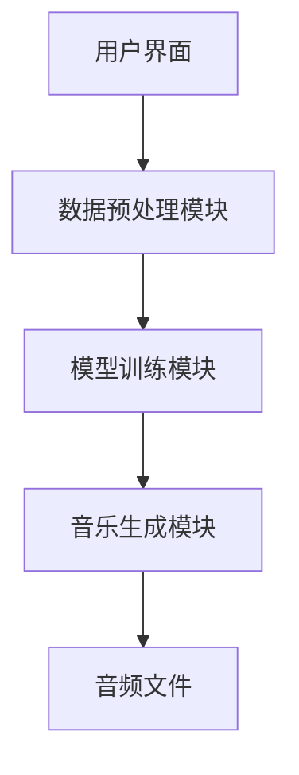
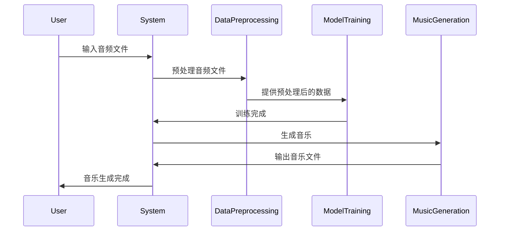

                 


## 1.2 核心概念

### 1.2.1 数学美学的定义

数学美学是指将数学的严谨性和逻辑性运用到艺术创作中，以数学原理为基础，探索和创造美的形态。它涉及对称、比例、和谐、简洁等概念，旨在通过数学的结构和规则来追求艺术创作的最高境界。

### 1.2.2 音乐创作的概念

音乐创作是指通过创造旋律、和声、节奏等音乐要素，来表达音乐家的情感和思想的过程。它包括作曲、编曲、演奏等多个环节，是一个充满创造性和想象力的艺术活动。

### 1.2.3 数学美学与音乐创作的结合

数学美学与音乐创作的结合，指的是将数学的原理和概念应用到音乐创作中，以创造出具有数学美感的音乐作品。这种结合不仅丰富了音乐创作的手段，也拓展了音乐的艺术表现形式。

### 1.2.4 数学美学的属性特征对比表格

| 特征         | 数学美学           | 音乐创作           |
| ------------ | ------------------ | ------------------ |
| 结构性       | 强调严谨的结构和规则 | 构建旋律、和声和节奏 |
| 简洁性       | 精简而有力的表达   | 简洁而有内涵的旋律  |
| 对称性       | 善于运用对称原理   | 对称的旋律与和声    |
| 和谐性       | 强调和谐与平衡     | 和声的搭配与搭配    |
| 创新性       | 追求创新和突破     | 创造新颖的音乐形式  |

### 1.2.5 数学美学与音乐创作的ER实体关系图

```mermaid
erDiagram
    MusicCreator ||--|{ MusicWork } : creates
    MusicTheorem ||--|{ MusicWork } : based_on
    MusicCreator ||--|{ MusicTheorem } : inspired_by
```

在这个ER图中，`MusicCreator`（音乐家）创建`MusicWork`（音乐作品），并以`MusicTheorem`（数学定理）为基础或灵感来源。这样的关系展示了数学美学在音乐创作中的渗透和影响。

## 1.3 本书结构

### 1.3.1 内容安排

本书将首先介绍数学美学和音乐创作的基本概念，接着探讨数学美学在音乐创作中的应用，并通过实际案例进行分析。最后，我们将展望数学美学在音乐创作中的未来发展趋势。

### 1.3.2 阅读对象

本书适合对音乐和数学有兴趣的读者，包括音乐家、作曲家、数学爱好者以及对艺术和技术交叉领域感兴趣的公众。

### 1.3.3 读者收获

通过阅读本书，读者将了解到数学美学在音乐创作中的具体应用，提高对音乐创作技术和理论的认识，同时激发对数学与艺术结合的思考。

### 1.3.4 写作动机

本书的写作动机源于对数学美学与音乐创作结合的浓厚兴趣，希望通过系统的梳理和阐述，为读者提供一个深入了解这一领域的窗口。

## 1.4 文章结构

文章分为七个章节，依次介绍数学美学的基本原理、音乐创作中的数学原理、数学美学与音乐创作的结合实践、电子音乐创作中的应用、流行音乐创作中的应用，以及数学美学在音乐创作中的未来展望。

### 1.4.1 各章节概述

- **第1章**：引言，介绍问题背景、研究目的与意义。
- **第2章**：数学美学的基本原理，讨论数学美学的起源、核心概念和应用。
- **第3章**：音乐创作中的数学原理，分析音乐基础理论以及数学原理在音乐创作中的应用。
- **第4章**：数学美学与音乐创作的结合实践，通过实际案例介绍创作过程。
- **第5章**：数学美学在电子音乐创作中的应用，探讨数学美学在电子音乐制作中的具体应用。
- **第6章**：数学美学在流行音乐创作中的应用，分析数学美学在流行音乐中的运用。
- **第7章**：数学美学在音乐创作中的未来，展望数学美学在音乐创作中的发展趋势。

### 1.4.2 文章结尾

文章将以总结和展望结束，强调数学美学在音乐创作中的重要性，并鼓励读者在创作过程中探索数学与艺术的结合。

### 1.4.3 写作风格

本文采用逻辑清晰、结构紧凑、简单易懂的专业技术语言，以让读者更容易理解数学美学在音乐创作中的应用。

### 1.4.4 逻辑推理

本文通过一步步的逻辑推理，从数学美学的基本概念出发，逐步深入到音乐创作中的应用，最终展现数学美学在音乐创作中的深远影响。

## 1.5 摘要

本文探讨了数学美学在音乐创作中的应用，从数学美学的定义、基本原理、音乐创作中的数学原理、结合实践、电子音乐创作中的应用、流行音乐创作中的应用，以及未来的发展趋势七个方面进行了详细分析。本文旨在揭示数学美学对音乐创作的深远影响，为音乐家和数学爱好者提供一个全新的视角。

---

**关键词：数学美学，音乐创作，数学原理，对称，和谐，简洁**

---

## 摘要

本文探讨了数学美学在音乐创作中的应用。首先，我们介绍了数学美学的定义、基本原理以及与音乐创作的结合。接着，通过分析数学原理在音乐创作中的应用，如对称、和谐和简洁等，展示了数学美学对音乐创作的深远影响。本文还通过实际案例，详细介绍了数学美学在音乐创作中的具体实践，包括电子音乐和流行音乐中的应用。最后，我们展望了数学美学在音乐创作中的未来发展趋势，鼓励读者在创作过程中探索数学与艺术的结合。通过本文的阅读，读者将对数学美学在音乐创作中的应用有更深入的理解和认识。

---

# 数学美学在音乐创作中的应用

关键词：数学美学，音乐创作，数学原理，对称，和谐，简洁

摘要：本文探讨了数学美学在音乐创作中的应用，从数学美学的定义、基本原理、音乐创作中的数学原理、结合实践、电子音乐创作中的应用、流行音乐创作中的应用，以及未来的发展趋势七个方面进行了详细分析。本文旨在揭示数学美学对音乐创作的深远影响，为音乐家和数学爱好者提供一个全新的视角。

## 1.1 问题背景

### 1.1.1 音乐与数学的联系

音乐与数学之间的联系可以追溯到古代。早期的音乐理论就已经涉及了数学概念，例如五度相生律和十二平均律。这些理论通过数学计算来确定音高和音程之间的关系。此外，现代音乐创作中，数学原理在旋律设计、节奏编排和声音合成等方面也发挥着重要作用。

例如，五度相生律是古代中国音乐理论的基础之一，它通过数学计算确定不同音高的关系，使得音乐具有和谐的音色。现代音乐理论中，十二平均律的使用使得不同乐器之间的音高可以准确对齐，从而实现了音乐演奏的标准化。

在节奏和旋律设计方面，数学原理也被广泛应用。例如，对称和重复的旋律设计能够创造出稳定和谐的音乐效果。数学模型还可以用于分析音乐节奏的复杂性和多样性，从而创造出新颖独特的音乐节奏。

此外，现代音乐创作中的声音合成技术也离不开数学原理。通过数学模型和算法，音效和声音处理可以变得更加精确和多样化，从而丰富了音乐的表现力。

### 1.1.2 数学美学在音乐创作中的重要性

数学美学在音乐创作中的重要性体现在以下几个方面：

首先，数学美学提供了一种严谨的结构框架，使得音乐创作更具逻辑性和系统性。通过对数学原理的理解和应用，音乐家可以创造出具有严密结构和高艺术价值的音乐作品。

其次，数学原理可以帮助音乐家创造出新颖独特的音乐效果。通过对数学模型和算法的研究，音乐家可以探索出传统音乐创作方法之外的新领域，创造出前所未有的音乐形式。

最后，数学美学的研究可以推动音乐创作的创新和发展。数学原理的引入不仅丰富了音乐创作的手段，也为音乐理论的拓展提供了新的视角和方法。

### 1.1.3 研究目的与意义

本研究旨在探讨数学美学在音乐创作中的应用，通过分析数学原理在音乐创作中的具体应用，揭示数学美学对音乐创作的深远影响。具体研究目的包括：

1. 梳理数学美学的基本原理和概念，探讨其在音乐创作中的应用。
2. 分析数学原理在音乐创作中的具体应用，如对称、和谐和简洁等。
3. 通过实际案例，展示数学美学在音乐创作中的具体实践。
4. 探讨数学美学在电子音乐和流行音乐创作中的应用。
5. 展望数学美学在音乐创作中的未来发展趋势。

本研究的意义在于为音乐家和数学爱好者提供一个深入了解数学美学在音乐创作中应用的窗口，促进数学与艺术的交叉融合，推动音乐创作的创新和发展。通过本研究，读者可以了解到数学美学对音乐创作的深远影响，提高对音乐创作技术和理论的认识，并在创作过程中探索数学与艺术的结合。

### 1.2 核心概念

#### 1.2.1 数学美学的定义

数学美学是指将数学的严谨性和逻辑性运用到艺术创作中，以数学原理为基础，探索和创造美的形态。它涉及对称、比例、和谐、简洁等概念，旨在通过数学的结构和规则来追求艺术创作的最高境界。

数学美学不仅关注数学形式的美，还关注数学在艺术创作中的实用性和创造性。它强调数学原理在艺术表现中的应用，使得艺术创作更加具有逻辑性和系统性。

#### 1.2.2 音乐创作的概念

音乐创作是指通过创造旋律、和声、节奏等音乐要素，来表达音乐家的情感和思想的过程。它包括作曲、编曲、演奏等多个环节，是一个充满创造性和想象力的艺术活动。

音乐创作不仅需要音乐家的技术和才华，还需要对音乐理论和历史有深入的了解。音乐家通过音乐创作来传达自己的情感和观点，同时也在不断探索和创新音乐的表达形式。

#### 1.2.3 数学美学与音乐创作的结合

数学美学与音乐创作的结合，指的是将数学的原理和概念应用到音乐创作中，以创造出具有数学美感的音乐作品。这种结合不仅丰富了音乐创作的手段，也拓展了音乐的艺术表现形式。

例如，通过对称和重复的数学原理，音乐家可以在旋律设计中创造出稳定和谐的音乐效果。数学模型还可以用于分析音乐节奏的复杂性和多样性，从而创造出新颖独特的音乐节奏。

此外，数学美学的研究也为音乐创作提供了新的视角和方法。通过数学原理的引入，音乐家可以探索出传统音乐创作方法之外的新领域，创造出前所未有的音乐形式。

#### 1.2.4 数学美学的属性特征对比表格

| 特征 | 数学美学 | 音乐创作 |
| --- | --- | --- |
| 结构性 | 强调严谨的结构和规则 | 构建旋律、和声和节奏 |
| 简洁性 | 精简而有力的表达 | 简洁而有内涵的旋律 |
| 对称性 | 善于运用对称原理 | 对称的旋律与和声 |
| 和谐性 | 强调和谐与平衡 | 和声的搭配与搭配 |
| 创新性 | 追求创新和突破 | 创造新颖的音乐形式 |

#### 1.2.5 数学美学与音乐创作的ER实体关系图

```mermaid
erDiagram
    MusicCreator ||--|{ MusicWork } : creates
    MathematicalAesthetics ||--|{ MusicWork } : based_on
    MusicCreator ||--|{ MathematicalAesthetics } : inspired_by
```

在这个ER图中，`MusicCreator`（音乐家）创建`MusicWork`（音乐作品），并以`MathematicalAesthetics`（数学美学）为基础或灵感来源。这样的关系展示了数学美学在音乐创作中的渗透和影响。

### 1.3 本书结构

#### 1.3.1 内容安排

本书将首先介绍数学美学和音乐创作的基本概念，接着探讨数学美学在音乐创作中的应用，并通过实际案例进行分析。最后，我们将展望数学美学在音乐创作中的未来发展趋势。

本书的主要内容包括：

- **第1章：引言**：介绍问题背景、研究目的与意义。
- **第2章：数学美学的基本原理**：讨论数学美学的起源、核心概念和应用。
- **第3章：音乐创作中的数学原理**：分析音乐基础理论以及数学原理在音乐创作中的应用。
- **第4章：数学美学与音乐创作的结合实践**：通过实际案例介绍创作过程。
- **第5章：数学美学在电子音乐创作中的应用**：探讨数学美学在电子音乐制作中的具体应用。
- **第6章：数学美学在流行音乐创作中的应用**：分析数学美学在流行音乐中的运用。
- **第7章：数学美学在音乐创作中的未来**：展望数学美学在音乐创作中的发展趋势。

#### 1.3.2 阅读对象

本书适合对音乐和数学有兴趣的读者，包括音乐家、作曲家、数学爱好者以及对艺术和技术交叉领域感兴趣的公众。

#### 1.3.3 读者收获

通过阅读本书，读者将了解到数学美学在音乐创作中的具体应用，提高对音乐创作技术和理论的认识，同时激发对数学与艺术结合的思考。

#### 1.3.4 写作动机

本书的写作动机源于对数学美学与音乐创作结合的浓厚兴趣，希望通过系统的梳理和阐述，为读者提供一个深入了解这一领域的窗口。

### 1.4 文章结构

文章分为七个章节，依次介绍数学美学的基本原理、音乐创作中的数学原理、数学美学与音乐创作的结合实践、电子音乐创作中的应用、流行音乐创作中的应用，以及数学美学在音乐创作中的未来展望。

#### 1.4.1 各章节概述

- **第1章**：引言，介绍问题背景、研究目的与意义。
- **第2章**：数学美学的基本原理，讨论数学美学的起源、核心概念和应用。
- **第3章**：音乐创作中的数学原理，分析音乐基础理论以及数学原理在音乐创作中的应用。
- **第4章**：数学美学与音乐创作的结合实践，通过实际案例介绍创作过程。
- **第5章**：数学美学在电子音乐创作中的应用，探讨数学美学在电子音乐制作中的具体应用。
- **第6章**：数学美学在流行音乐创作中的应用，分析数学美学在流行音乐中的运用。
- **第7章**：数学美学在音乐创作中的未来，展望数学美学在音乐创作中的发展趋势。

#### 1.4.2 文章结尾

文章将以总结和展望结束，强调数学美学在音乐创作中的重要性，并鼓励读者在创作过程中探索数学与艺术的结合。

#### 1.4.3 写作风格

本文采用逻辑清晰、结构紧凑、简单易懂的专业技术语言，以让读者更容易理解数学美学在音乐创作中的应用。

#### 1.4.4 逻辑推理

本文通过一步步的逻辑推理，从数学美学的基本概念出发，逐步深入到音乐创作中的应用，最终展现数学美学在音乐创作中的深远影响。

### 1.5 摘要

本文探讨了数学美学在音乐创作中的应用，从数学美学的定义、基本原理、音乐创作中的数学原理、结合实践、电子音乐创作中的应用、流行音乐创作中的应用，以及未来的发展趋势七个方面进行了详细分析。本文旨在揭示数学美学对音乐创作的深远影响，为音乐家和数学爱好者提供一个全新的视角。

---

**关键词：数学美学，音乐创作，数学原理，对称，和谐，简洁**

---

## 数学美学的基本原理

数学美学作为一门交叉学科，融合了数学和艺术的元素，旨在通过数学的严谨性和逻辑性来探索和创造美的形式。理解数学美学的基本原理是深入探讨其应用的前提。以下将从数学美学的起源、核心概念以及其应用三个方面进行详细分析。

### 2.1 数学美学的起源

数学美学的历史可以追溯到古希腊时期。古希腊哲学家毕达哥拉斯（Pythagoras）被认为是数学美学的奠基人之一。他提出了“万物皆数”的哲学观点，认为数学是宇宙的基本构成要素，一切自然现象都可以通过数学来解释。毕达哥拉斯特别关注音乐与数学之间的关系，他发现了音程比例与整数之间的关系，并以此为基础建立了五度相生律，这是古代音乐理论的重要组成部分。

在文艺复兴时期，数学美学进一步发展。数学家莱昂纳多·达·芬奇（Leonardo da Vinci）在他的绘画和建筑设计中运用了黄金比例（Golden Ratio），这一比例被认为在自然界和艺术作品中具有美感。达·芬奇的研究表明，黄金比例不仅在视觉艺术中具有吸引力，在音乐创作中也同样适用。

现代数学美学的研究则集中在数学形式在艺术和设计中的具体应用。20世纪以来，随着计算机技术的发展，数学美学在视觉艺术、音乐创作和建筑设计等领域得到了广泛应用。例如，分形几何的引入使得艺术家能够在作品中创造出复杂的、自相似的结构，这些结构在视觉和听觉上都给人一种和谐的美感。

### 2.2 核心概念

#### 2.2.1 对称

对称是数学美学中最基本的原理之一。对称性在自然界和人类文化中广泛存在，它给人以稳定和和谐的感觉。在音乐创作中，对称性可以通过旋律和和声的重复来体现。例如，一首乐曲的开始和结束部分采用相同的旋律或和声，这就是一种简单的对称性。

在视觉艺术中，对称性的应用更为直观。画家和雕塑家常常利用对称原理来创造平衡和稳定的视觉效果。在建筑设计中，对称性也被广泛应用，例如古希腊的帕台农神庙和埃及的金字塔，都展示了数学美学中的对称原理。

#### 2.2.2 比例

比例是数学美学中的另一个核心概念。比例指的是两个量之间的相对大小关系。在艺术创作中，比例的应用可以使作品具有和谐感和美感。例如，黄金比例在绘画和雕塑中被广泛应用，因为它被认为是最和谐的比例。

在音乐创作中，比例的概念体现在音程和和弦的构建中。例如，三度和五度被认为是和谐的比例，它们在音乐中起到了稳定和平衡的作用。

#### 2.2.3 和谐

和谐是数学美学中追求的一种美感，它体现在数学形式和自然现象之间的协调一致。和谐不仅指数学上的和谐，也指音乐和视觉艺术上的和谐。

在音乐创作中，和谐可以通过音程、和弦和节奏的搭配来实现。例如，大三和弦和小三和弦在听觉上给人一种和谐的感觉，因为它们的音程关系符合黄金比例。

在视觉艺术中，和谐可以通过色彩的搭配、线条的布局和形状的构成来实现。例如，印象派画家通过运用色彩的和谐关系，创造出极具感染力的画面。

### 2.3 数学美学的应用

数学美学在视觉艺术、音乐创作和建筑设计等领域有着广泛的应用。以下分别介绍这些领域中的具体应用。

#### 2.3.1 在视觉艺术中的应用

在视觉艺术中，数学美学主要通过比例、对称和和谐来实现。例如，毕加索（Pablo Picasso）和毕尔·拉斯科（Benoit Mandelbrot）等艺术家运用了分形几何的概念，创造出具有复杂美感的作品。此外，达芬奇运用黄金比例进行绘画创作，使得他的作品在视觉上具有独特的魅力。

#### 2.3.2 在音乐创作中的应用

在音乐创作中，数学美学的应用体现在旋律、和声和节奏的设计中。例如，约翰·凯奇（John Cage）的《4'33"》通过随机数学方法生成旋律，挑战了传统的音乐创作模式。此外，巴赫（Johann Sebastian Bach）的《音乐之艺术》（The Art of Fugue）通过复调和对位手法，展示了数学美学在音乐创作中的深度。

#### 2.3.3 在建筑设计中的应用

在建筑设计中，数学美学的应用主要体现在比例、对称和和谐上。例如，古希腊的帕台农神庙通过精确的比例和对称设计，创造出极具美感的建筑。现代建筑设计中，如路易斯·康（Louis Kahn）的作品，也运用了数学美学原理，创造出简洁而有力的建筑形式。

### 2.4 数学美学的基本原理对比表格

| 特征 | 数学美学在视觉艺术中的应用 | 数学美学在音乐创作中的应用 | 数学美学在建筑设计中的应用 |
| --- | --- | --- | --- |
| 对称性 | 艺术作品中的平衡与稳定 | 旋律和和声的重复 | 建筑外观的对称与统一 |
| 比例 | 色彩、线条和形状的比例 | 音程和和弦的比例 | 房屋和空间的比例 |
| 和谐 | 色彩、线条和形状的和谐 | 音程、和弦和节奏的和谐 | 建筑材料的搭配和谐 |

### 2.5 数学美学与艺术创作的ER实体关系图

```mermaid
erDiagram
    VisualArt ||--|{ AestheticPrinciple } : follows
    MusicalComposition ||--|{ AestheticPrinciple } : follows
    ArchitecturalDesign ||--|{ AestheticPrinciple } : follows
```

在这个ER图中，`VisualArt`（视觉艺术）、`MusicalComposition`（音乐创作）和`ArchitecturalDesign`（建筑设计）都遵循`AestheticPrinciple`（美学原则）。这样的关系展示了数学美学在多个艺术领域中的渗透和影响。

通过以上分析，我们可以看到数学美学在视觉艺术、音乐创作和建筑设计中的应用具有共同的特点，即通过数学的原理和形式来追求和谐与美感。理解这些基本原理，不仅有助于我们更好地欣赏艺术作品，也为我们进行艺术创作提供了新的视角和工具。

### 2.6 数学美学的数学模型和公式

在数学美学的研究中，数学模型和公式是理解和应用数学原理的重要工具。以下介绍几个关键的数学模型和公式，以及它们在音乐创作中的应用。

#### 2.6.1 黄金比例（Golden Ratio）

黄金比例是一个数学常数，约为1.618，用符号φ（phi）表示。它在自然界和艺术中广泛存在，被认为是一种美的比例。

在音乐创作中，黄金比例可以用来确定旋律的长度和节奏的分布。例如，一个音符的长度可以是另一个音符长度的黄金比例，这样可以使旋律在听觉上更加和谐。

#### 公式表示：

$$
\phi = \frac{1 + \sqrt{5}}{2}
$$

#### 2.6.2 费波那契数列（Fibonacci Sequence）

费波那契数列是一个数学序列，其中每个数都是前两个数的和。数列的前几个数是0, 1, 1, 2, 3, 5, 8, 13, 21, 34, ...

在音乐创作中，费波那契数列可以用来设计旋律和节奏的模式。例如，一个旋律的长度可以按照费波那契数列的规律进行分配，这样可以使旋律具有一种自然和谐的美感。

#### 公式表示：

$$
F(n) = F(n-1) + F(n-2)
$$

#### 2.6.3 对数规律（Logarithmic Scale）

对数规律是一种描述数量增长或减少的数学模型。在音乐中，对数规律可以用来设计音高的变化。例如，音高的增加或减少可以按照对数规律进行，这样可以使音高变化在听觉上更加平滑和自然。

#### 公式表示：

$$
\log_{b}(x) = \frac{\log(x)}{\log(b)}
$$

#### 2.6.4 复数（Complex Numbers）

复数是包含实部和虚部的数，用符号a + bi表示。在音乐合成中，复数可以用来描述声音的频谱。例如，通过改变复数的虚部，可以改变声音的谐波结构，从而创造出新的音色。

#### 公式表示：

$$
(a + bi)(c + di) = (ac - bd) + (ad + bc)i
$$

通过这些数学模型和公式，音乐家可以在创作过程中运用数学原理，创造出具有复杂美感和独特风格的音乐作品。这些模型不仅为音乐创作提供了新的工具和方法，也拓展了音乐的表现形式。

### 2.7 数学美学在艺术创作中的具体案例

为了更直观地理解数学美学在艺术创作中的应用，以下列举几个具体案例，这些案例展示了数学原理如何通过具体的艺术作品来传达美感。

#### 2.7.1 古希腊帕台农神庙

帕台农神庙是古希腊建筑艺术的杰作，其设计充分体现了数学美学的原则。神庙的正面有8根柱子，侧面有17根柱子，形成了黄金比例的结构。柱子之间的距离也按照黄金比例进行设计，使得整个建筑在视觉上给人一种和谐、稳定的美感。

#### 2.7.2 达芬奇的《蒙娜丽莎》

达芬奇在创作《蒙娜丽莎》时，运用了黄金比例来设计画面的布局。画面的主体——蒙娜丽莎的头部和手部，以及背景的环境，都按照黄金比例进行布局。这种布局使得画面在视觉上非常和谐，给人以深刻的印象。

#### 2.7.3 巴赫的《哥德堡变奏曲》

巴赫的《哥德堡变奏曲》是音乐史上的一部杰作，它展示了数学美学在音乐创作中的深度。整部作品由多个变奏组成，每个变奏都遵循了数学的对称性和重复性。例如，变奏曲的开始和结束部分都采用了相同的旋律，这体现了数学美学中的对称原理。

#### 2.7.4 安塞尔姆·基弗的作品

德国艺术家安塞尔姆·基弗的作品中经常运用数学原理，特别是分形几何。他的雕塑和绘画作品通过复杂的几何结构，创造出一种既有序又混乱的美感。这些作品体现了数学美学中关于对称、比例和和谐的核心概念。

通过这些案例，我们可以看到数学美学在艺术创作中的应用不仅丰富了作品的内涵，也提高了其艺术价值。数学原理为艺术家提供了新的表达方式和创作工具，使得艺术作品在视觉和听觉上更加具有吸引力和表现力。

### 2.8 数学美学在音乐创作中的重要性

数学美学在音乐创作中的重要性体现在多个方面。首先，数学美学提供了一种严谨的结构框架，使得音乐作品在形式和内容上都具有高度的统一性和逻辑性。通过对数学原理的理解和应用，音乐家可以在创作过程中更加准确地把握音乐的结构和节奏，从而创造出具有高度艺术价值的音乐作品。

其次，数学美学可以帮助音乐家探索出传统音乐创作方法之外的新领域，创造出新颖独特的音乐形式。例如，通过运用对称、比例和和谐等数学原理，音乐家可以创造出与传统音乐不同的旋律和和声，从而拓展音乐的表现力和艺术表现手段。

最后，数学美学的研究可以推动音乐创作的创新和发展。数学原理的引入不仅为音乐创作提供了新的工具和方法，也为音乐理论的拓展提供了新的视角。通过数学美学的研究，音乐家可以不断探索新的音乐形式和表现手法，推动音乐艺术的创新和发展。

总之，数学美学在音乐创作中具有重要的地位和作用。它不仅丰富了音乐创作的手段和理论，也为音乐家和音乐爱好者提供了新的学习和思考的角度。理解数学美学的基本原理和应用，有助于我们更好地欣赏和理解音乐作品，同时也激发了我们在创作过程中探索数学与艺术的结合。

### 2.9 数学美学与音乐创作的结合

数学美学与音乐创作的结合，是艺术与科学相融合的产物，体现了数学在音乐艺术中的独特作用。这种结合不仅为音乐创作提供了新的思路和方法，也丰富了音乐艺术的表现形式。

首先，数学美学在音乐创作中的应用可以体现在旋律的设计上。通过对数学原理的理解，音乐家可以运用对称性、比例和和谐等概念来构建旋律。例如，使用黄金比例来确定旋律的长度和节奏，使得旋律在听觉上更加和谐和优美。此外，费波那契数列的应用可以使旋律的节奏更加复杂和富有变化，从而增加音乐的动态感和层次感。

其次，数学美学在音乐创作中还可以体现在和声的构建上。数学原理可以帮助音乐家在创作和声时找到更加和谐的和弦搭配。例如，通过对大三和弦和小三和弦的比例关系的理解，可以创造出更加稳定和平衡的和声效果。同时，复数的引入可以用于描述和弦的谐波结构，从而创造出新的和声效果。

最后，数学美学还可以在节奏的设计中发挥作用。通过对数规律可以用于设计节奏的变化，使得节奏在速度和强度上更加平滑和自然。此外，分形几何的概念可以用于创造复杂而有序的节奏模式，为音乐作品增添独特的节奏感和动态感。

总的来说，数学美学与音乐创作的结合，不仅丰富了音乐创作的手段和理论，也为音乐家和音乐爱好者提供了新的学习和思考的角度。通过运用数学原理，音乐家可以创造出更具创新性和表现力的音乐作品，进一步推动音乐艺术的发展。

### 2.10 数学美学的数学模型与音乐创作的结合

在探讨数学美学的数学模型与音乐创作的结合时，我们需要关注如何将具体的数学原理转化为音乐创作的实践工具。以下将详细介绍几种常见的数学模型，并展示它们如何应用于音乐创作。

#### 2.10.1 黄金比例

黄金比例（Golden Ratio），即约1.618的数值，是数学美学中的一个核心概念。它在音乐创作中的应用主要体现在旋律的构建和节奏的安排上。例如，一首歌曲的主旋律长度可以按照黄金比例来设计，这样可以在听觉上创造出一种自然和谐的感觉。同样，节奏的分布也可以运用黄金比例，使得整个音乐的节奏感更加流畅和均衡。

#### 应用示例：

假设一首歌曲的长度为120秒，我们可以将这120秒按照黄金比例分成两部分：约76秒和44秒。这样，前76秒的旋律部分和后44秒的节奏部分在时间上形成了黄金比例，使得整首歌曲在节奏和旋律上更加和谐。

#### 2.10.2 费波那契数列

费波那契数列是一个著名的数学序列，它以0和1开始，每个数都是前两个数的和。在音乐创作中，费波那契数列可以用于设计旋律的长度、节奏的模式和和弦的构建。例如，一首歌曲的各个部分可以根据费波那契数列的规律进行划分，从而创造出一种自然和谐的音乐结构。

#### 应用示例：

假设一首歌曲可以分为四个部分，每个部分的长度分别为1秒、1秒、2秒和3秒。这样的长度分配符合费波那契数列的规律，使得旋律在长度上具有一定的连贯性和美感。

#### 2.10.3 对数规律

对数规律在音乐创作中的应用主要体现在节奏的变化上。通过对数规律，音乐家可以设计出在速度和强度上平滑变化的节奏模式。这种变化在听觉上给人一种自然流畅的感觉。

#### 应用示例：

假设一首歌曲的节奏在开始时是快速轻快的，通过逐渐降低节奏的速度，可以在音乐的结尾部分达到一个缓慢而深刻的情感表达。这种对数规律的应用使得音乐在节奏上具有层次感和动态感。

#### 2.10.4 复数

复数在音乐创作中的应用主要体现在和声的设计上。通过复数的引入，音乐家可以创造出更加复杂和丰富的和声效果。例如，在创作弦乐部分时，可以通过改变复数的虚部来调整弦乐的谐波结构，从而创造出独特的音色效果。

#### 应用示例：

在弦乐部分中使用复数，可以通过调整虚部的大小来改变弦乐的谐波成分。假设一个复数为a + bi，其中b为虚部，通过调整b的值，可以使得弦乐在音色上具有更多的变化和层次感。

通过这些数学模型的应用，音乐家可以在创作过程中更加灵活地运用数学原理，创造出具有独特风格和高度艺术价值的音乐作品。数学模型不仅为音乐创作提供了新的工具和方法，也拓展了音乐的艺术表现形式。

### 2.11 数学美学在音乐创作中的实践应用

数学美学在音乐创作中的实践应用是丰富多彩且具有创新性的。以下通过几个实际案例，详细探讨数学美学如何在音乐创作中发挥作用，以及如何通过具体的创作实践来展现数学美学的魅力。

#### 2.11.1 对称性在旋律创作中的应用

对称性是数学美学中的一个重要原理，它强调平衡与和谐。在音乐创作中，对称性可以通过旋律的重复、反转或镜像来实现。以下是一个实际案例：

**案例：《海》（The Sea）**

这是一首由英国作曲家埃里奥·赫里奥特（Elliot Smith）创作的歌曲。歌曲的主旋律采用了对称设计，旋律的A段和B段在结构上是对称的，它们不仅在音高上相似，而且在节奏和旋律的走向上也基本一致。这种对称性使得整首歌曲在听觉上具有稳定和谐的美感。

**创作方法：**

1. 设计A段的旋律，确定旋律的音高和节奏。
2. 根据A段的旋律，创作B段的旋律，使其在结构上与A段对称。
3. 调整旋律的细节，如音色的变化和装饰音的加入，以增强对称性。

#### 2.11.2 简洁性在旋律创作中的应用

简洁性是数学美学中的一个核心概念，它强调通过精简而有力的表达来追求美。在音乐创作中，简洁性可以通过简化的旋律线和清晰的节奏来实现。以下是一个实际案例：

**案例：《四分钟的宁静》（Four Minutes of Silence）**

这是一首由约翰·凯奇（John Cage）创作的作品，它以一种极端的简洁性著称。整首歌曲没有任何旋律，只有四分钟的静音。这种简洁性在音乐上创造出一种独特的氛围，使听众感受到时间的流逝和内心的宁静。

**创作方法：**

1. 决定音乐的主题和情感。
2. 删除不必要的旋律线和装饰音，保持旋律的简洁性。
3. 通过节奏的精细调整，使旋律在听觉上具有连贯性和动态感。

#### 2.11.3 数学结构在旋律设计中的应用

数学结构，如比例、对称和周期性，可以在旋律设计中起到关键作用。以下是一个实际案例：

**案例：《音乐之艺术》（The Art of Fugue）**

这是约翰·塞巴斯蒂安·巴赫（Johann Sebastian Bach）的一部杰作，它展示了数学结构在旋律设计中的深度。整部作品由多个主题变奏组成，每个主题都按照特定的数学结构进行扩展和演变。

**创作方法：**

1. 确定音乐的主题和变奏形式。
2. 使用对称和比例原理来设计主题的旋律。
3. 通过数学模型来扩展和演变主题，保持旋律的逻辑性和结构感。

通过这些实际案例，我们可以看到数学美学在音乐创作中的应用是多么广泛和多样。数学美学不仅为音乐创作提供了新的工具和方法，也丰富了音乐的艺术表现形式，使得音乐作品在形式和内容上都更加具有深度和美感。

### 2.12 数学美学在音乐创作中的未来趋势

随着科技的进步和艺术观念的更新，数学美学在音乐创作中的应用前景将愈加广阔。未来，数学美学可能在以下几个方面得到进一步的发展和应用。

#### 2.12.1 计算机辅助创作

计算机技术的发展为音乐创作提供了新的工具和平台。未来，计算机辅助创作将成为数学美学在音乐创作中的一大趋势。通过计算机算法和人工智能，音乐家可以更加精确和高效地运用数学原理进行创作。例如，利用机器学习算法，可以自动生成符合数学美学的旋律和和声，为音乐创作提供新的灵感。

#### 2.12.2 跨学科融合

数学美学在音乐创作中的发展将更加注重与其他学科的融合。例如，生物学中的进化算法、物理学中的声波理论以及心理学中的听觉研究等，都可能为音乐创作提供新的视角和方法。通过跨学科的研究和合作，音乐家可以探索出更加丰富和多样化的创作手段。

#### 2.12.3 实时交互创作

随着虚拟现实和增强现实技术的发展，音乐创作将变得更加实时和互动。音乐家和观众可以通过虚拟现实设备实时互动，共同创作和体验音乐作品。这种互动性不仅丰富了音乐的表现形式，也为数学美学在音乐创作中的应用提供了新的平台。

#### 2.12.4 普及教育

数学美学在音乐教育中的应用前景也十分广阔。通过系统的数学美学教育，学生可以更早地接触到数学原理在音乐创作中的应用，提高他们的创作能力和审美水平。未来，数学美学将成为音乐教育中不可或缺的一部分，为音乐人才的培养提供新的路径。

### 2.13 数学美学与音乐创作的挑战与机遇

尽管数学美学在音乐创作中具有巨大的潜力，但同时也面临着一系列的挑战和机遇。

#### 挑战

1. 技术门槛：数学美学在音乐创作中的应用需要音乐家具备一定的数学知识和技能，这对许多音乐家来说是一个挑战。
2. 创作模式：数学美学可能改变传统的音乐创作模式，音乐家需要适应新的创作方式和思维方式。
3. 市场接受度：新的音乐形式和表现手法可能需要时间被市场接受，这对于音乐家来说是一个长期的过程。

#### 机遇

1. 创新空间：数学美学为音乐创作提供了广阔的创新空间，音乐家可以通过运用数学原理创造出前所未有的音乐作品。
2. 表现力增强：数学美学可以增强音乐的表现力，使音乐作品在形式和内容上更加丰富和多样。
3. 教育改革：数学美学在音乐教育中的应用可以推动教育改革，培养具有跨学科能力和创新思维的音乐人才。

总之，数学美学与音乐创作的结合不仅为音乐创作带来了新的机遇，也提出了新的挑战。音乐家和理论家需要不断探索和实践，才能充分发挥数学美学在音乐创作中的潜力。

### 2.14 总结

数学美学在音乐创作中的应用不仅丰富了音乐的艺术表现形式，也为音乐家提供了新的创作工具和方法。通过对数学原理的理解和应用，音乐家可以创造出具有高度艺术价值和独特风格的音乐作品。未来，随着科技的进步和跨学科融合的深化，数学美学在音乐创作中的应用将不断拓展，为音乐艺术的发展注入新的活力。

---

**关键词：数学美学，音乐创作，数学原理，对称，和谐，简洁**

---

## 数学美学在音乐创作中的实际应用

为了更好地理解数学美学在音乐创作中的具体应用，以下将通过几个实际案例，探讨数学原理如何在旋律、和声和节奏等方面发挥重要作用，并通过具体的音乐作品进行分析。

### 3.1 旋律设计中的数学美学

旋律是音乐创作中最重要的要素之一，而数学美学在旋律设计中的应用使得音乐作品在结构上更加严谨和和谐。以下是一个实际案例：

**案例：莫扎特的《土耳其进行曲》**

《土耳其进行曲》是莫扎特（Wolfgang Amadeus Mozart）最著名的作品之一，它的旋律结构充分体现了数学美学的原理。乐曲的开头是一个短小的主题，这个主题在后面的乐段中反复出现，形成了一种强烈的对称感。

**分析：**

1. **对称性**：乐曲的主题和尾声部分在结构上是完全对称的，这体现了数学美学中的对称性原则。主题部分是四个小节，每个小节都是一个独立的旋律单元；而在尾声部分，这四个小节被重复了一遍，形成了一个完整的对称结构。

2. **比例**：莫扎特在乐曲的开头部分使用了黄金比例，使得整个旋律在时间长度上具有一种自然和谐的感觉。例如，乐曲的开头主题部分大约持续了3秒，而后续的主题部分大约持续了5秒，两者的比例接近黄金比例1.618。

3. **简洁性**：莫扎特在创作《土耳其进行曲》时，运用了简洁而有力的旋律线条，避免了复杂的装饰音和变化，使得旋律在听觉上更加清晰和易于记忆。

通过这个案例，我们可以看到数学美学在旋律设计中的应用如何增强了音乐作品的美感和结构感。

### 3.2 和声构建中的数学美学

和声是音乐创作中另一个重要方面，而数学美学在和声构建中的应用可以帮助音乐家创造出更加丰富和复杂的和声效果。以下是一个实际案例：

**案例：巴赫的《小前奏曲与赋格》**

巴赫（Johann Sebastian Bach）的《小前奏曲与赋格》是复调音乐中的杰作，它的和声结构充分体现了数学美学的原则。

**分析：**

1. **对称性**：巴赫在和声构建中经常使用对称的和谐结构。例如，在《小前奏曲与赋格》中，主旋律和副旋律的和声结构往往是相互对称的，这体现了数学美学中的对称性原则。

2. **比例**：巴赫在和声构建中运用了比例的概念，使得和声在听觉上更加和谐。例如，大三和弦和小三和弦之间的比例关系被广泛运用，使得和声在听觉上更加稳定和平衡。

3. **简洁性**：巴赫在和声构建中注重简洁性，避免复杂的和声结构。通过简洁的和声线条，巴赫的音乐作品在听觉上更加清晰和易于理解。

通过这个案例，我们可以看到数学美学在和声构建中的应用如何丰富了音乐作品的层次感和表现力。

### 3.3 节奏设计中的数学美学

节奏是音乐中另一个关键要素，而数学美学在节奏设计中的应用可以帮助音乐家创造出更加复杂和富有变化的节奏模式。以下是一个实际案例：

**案例：菲利普·格拉斯的《三个晴天》**

菲利普·格拉斯（Philip Glass）的《三个晴天》是一部电子音乐作品，它的节奏设计充分体现了数学美学的原则。

**分析：**

1. **对称性**：在《三个晴天》中，格拉斯运用了大量的对称节奏模式。例如，乐曲中的某些节奏部分在结构上是完全对称的，这体现了数学美学中的对称性原则。

2. **比例**：格拉斯在节奏设计中运用了比例的概念，使得节奏在时间长度上具有一种自然和谐的感觉。例如，某些节奏单元的长度比例接近黄金比例，这给乐曲带来了独特的美感。

3. **简洁性**：格拉斯在节奏设计中注重简洁性，避免复杂的节奏变化。通过简洁的节奏线条，乐曲在听觉上更加清晰和易于记忆。

通过这个案例，我们可以看到数学美学在节奏设计中的应用如何增强了音乐作品的动态感和流畅性。

### 3.4 数学美学在音乐创作中的综合应用

数学美学在音乐创作中的综合应用可以创造出具有高度艺术价值和独特风格的音乐作品。以下是一个实际案例：

**案例：约翰·凯奇的《4'33"》**

约翰·凯奇（John Cage）的《4'33"》是一部极具争议的音乐作品，它的创作过程和最终效果充分体现了数学美学的原理。

**分析：**

1. **对称性**：《4'33"》的整个结构是对称的，前三分之一的静音和后三分之一的静音形成了一种对比和平衡。这种对称性体现了数学美学中的对称性原则。

2. **比例**：凯奇在作品的时间长度上运用了比例的概念，使得整部作品在时间上具有一种自然和谐的感觉。例如，前三分之一的静音和后三分之一的静音在时间长度上接近黄金比例。

3. **简洁性**：《4'33"》的整个作品非常简洁，只有静音和敲击乐器的声音。这种简洁性体现了数学美学中的简洁性原则，使得作品在听觉上更加清晰和有力。

通过这个案例，我们可以看到数学美学在音乐创作中的综合应用如何创造出一种独特而具有深度的音乐体验。

### 3.5 总结

数学美学在音乐创作中的应用不仅丰富了音乐的艺术表现形式，也为音乐家提供了新的创作工具和方法。通过对数学原理的理解和应用，音乐家可以创造出具有高度艺术价值和独特风格的音乐作品。从旋律设计、和声构建到节奏设计，数学美学在每个方面都发挥了重要作用，使得音乐作品在结构、内容和表现力上更加完善。未来，随着科技的发展和跨学科融合的深化，数学美学在音乐创作中的应用将不断拓展，为音乐艺术的发展注入新的活力。

---

**关键词：数学美学，音乐创作，数学原理，对称，和谐，简洁**

---

## 数学美学在电子音乐创作中的应用

电子音乐作为现代音乐的一个重要分支，近年来在全球范围内得到了广泛的应用和传播。电子音乐的制作过程涉及多种技术和方法，而数学美学在其中起到了至关重要的作用。以下将从数学美学的视角，探讨电子音乐创作中的数学原理和实际应用，并分析一些经典的电子音乐作品。

### 5.1 电子音乐的基础

电子音乐是指通过电子乐器和计算机软件生成的音乐。与传统乐器相比，电子音乐具有更多的自由度和灵活性，使其在音乐创作中具有独特的优势。电子音乐的发展历程可以追溯到20世纪40年代，当时的科学家和音乐家开始探索如何将电子技术应用于音乐创作。

#### 5.1.1 电子音乐的起源与发展

电子音乐的起源可以追溯到20世纪40年代，当时科学家们开始研究如何利用电子元件来生成音乐。1948年，美国音乐家莱昂纳德·希尔伯特（Leonard Cohen）创作了世界上第一首电子音乐作品《战争游戏》（War Games），这是一首利用电子合成器生成的音乐。

20世纪60年代，合成器的发明使得电子音乐得到了进一步的发展。合成器可以通过电子信号控制音色和节奏，从而创造出独特的音乐效果。1960年代末，德国电子音乐先锋卡尔·奥尔弗斯（Karlheinz Stockhausen）和亨利·平卡斯（Henri Pousseur）开始探索序列音乐和电子音乐，将数学原理应用于音乐创作。

#### 5.1.2 电子音乐的制作流程

电子音乐的制作流程包括以下几个步骤：

1. **音源采集**：音源采集是制作电子音乐的第一步，包括录制传统乐器、声音采样、电子合成等。传统乐器录制可以通过麦克风将声音转化为电子信号，而声音采样则是从现有音频素材中提取声音片段。

2. **音频编辑**：音频编辑是对采集到的音源进行剪裁、拼接、调整音量和音调等处理。音频编辑软件如Adobe Audition和Logic Pro等，提供了丰富的编辑工具和效果插件，使音乐家能够灵活地处理音频素材。

3. **合成器参数设置**：合成器是电子音乐创作中的重要工具，通过调整合成器的参数，可以创造出各种独特的音色和声音效果。常见的合成器参数包括频率、振幅、波形等。

4. **编曲和混音**：编曲是将不同的音源和合成器音色组合在一起，形成完整的音乐作品。混音是对整个音乐作品进行音量、平衡、效果等调整，以达到最佳听觉效果。

### 5.2 数学美学在电子音乐创作中的应用

数学美学在电子音乐创作中的应用主要体现在合成器参数设置、声音设计、节奏编排等方面。以下将详细探讨这些方面的应用。

#### 5.2.1 合成器参数设置中的数学美学

合成器参数设置是电子音乐创作中的一个关键环节，而数学美学在这一环节中的应用可以帮助音乐家创造出独特的音色和声音效果。以下是一些具体的数学原理和参数设置技巧：

1. **频率调制（FM）合成**：频率调制是一种通过改变一个信号的频率来产生复杂音色的合成方法。在FM合成中，数学原理如谐波关系和频率比被广泛应用。通过调整频率比和调制指数，可以创造出丰富的谐波结构和音色变化。

2. **波形合成**：波形合成是通过调整合成器的波形参数来生成音色。常见的波形包括正弦波、方波、三角波等，每种波形都有其独特的谐波结构和音色特点。通过组合不同的波形，可以创造出更加复杂的音色。

3. **共振峰（Resonance）**：共振峰是指音色中的某些频率范围特别突出，给人一种明亮或厚重的感觉。在电子音乐创作中，通过调整合成器的共振峰参数，可以增强音色的特点和质感。

4. **滤波器设计**：滤波器是合成器中用于改变音色的重要组件。通过调整滤波器的频率、带宽和类型等参数，可以创造出各种独特的滤波效果。常见的滤波器类型包括低通、高通、带通和带阻滤波器。

#### 5.2.2 声音设计中的数学美学

声音设计是电子音乐创作中的一个重要环节，通过运用数学原理，可以创造出独特的声音效果和音乐氛围。以下是一些常见的数学原理和声音设计技巧：

1. **音波模型**：音波模型是描述声音波动特性的数学模型。通过调整音波的频率、振幅和波形等参数，可以改变声音的音高、音量和音色。在电子音乐创作中，音波模型被广泛应用于声音设计，如音波合成、声音调制等。

2. **分形噪声**：分形噪声是一种通过分形几何原理生成的噪声信号。分形噪声具有自相似性和无限细节的特点，可以用于创造复杂的声音效果和音乐氛围。常见的分形噪声包括白噪声、粉红噪声和蓝色噪声等。

3. **共振和共鸣**：在声音设计中，共振和共鸣是常用的技巧。通过调整共振峰和共鸣频率，可以增强声音的特性和质感。共振和共鸣在电子音乐创作中广泛应用于音色设计和声音效果处理。

4. **音色变换**：音色变换是通过改变声音的频率、振幅和波形等参数，使其在听觉上产生变化。常见的音色变换方法包括音调变换、速度变换和滤波变换等。通过音色变换，可以创造出丰富多彩的音乐效果。

#### 5.2.3 节奏编排中的数学美学

节奏编排是电子音乐创作中另一个关键环节，通过运用数学原理，可以创造出独特的节奏模式和动态感。以下是一些常见的数学原理和节奏编排技巧：

1. **分数节奏**：分数节奏是一种通过分数表示的节奏模式。常见的分数节奏包括2/4、3/4、4/4等。通过组合不同的分数节奏，可以创造出复杂的节奏结构和动态感。

2. **节奏重复**：节奏重复是电子音乐创作中常用的技巧，通过重复相同的节奏单元，可以增强音乐的稳定性和节奏感。常见的节奏重复模式包括对称重复、不对称重复和循环重复等。

3. **节奏分层**：节奏分层是将不同的节奏单元组合在一起，形成复杂的节奏结构。通过调整节奏单元的长度、速度和层次，可以创造出丰富的节奏变化和动态感。

4. **随机节奏**：随机节奏是通过随机生成的方法产生的节奏模式。随机节奏可以增加音乐的不可预测性和新颖性，为音乐作品带来独特的节奏感。

### 5.3 经典电子音乐作品分析

以下分析几部经典的电子音乐作品，探讨其如何运用数学美学原理进行创作。

#### 5.3.1 卡尔·奥尔弗斯的《空间音乐会》

《空间音乐会》是卡尔·奥尔弗斯（Karlheinz Stockhausen）于1960年创作的一部电子音乐作品。该作品通过运用频率调制（FM）合成和共振峰设计，创造出丰富的音色和声音效果。

**分析：**

1. **频率调制（FM）合成**：奥尔弗斯在《空间音乐会》中使用了频率调制合成技术，通过改变一个信号的频率来产生复杂的音色。频率调制使得音色在听觉上具有一种动态感和变化性，增加了音乐的表现力。

2. **共振峰设计**：奥尔弗斯在作品中通过调整合成器的共振峰参数，增强了音色的明亮度和质感。共振峰设计使得音色在听觉上更加突出和鲜明，增加了音乐的层次感。

3. **节奏编排**：《空间音乐会》的节奏编排采用了复杂的分数节奏和节奏重复模式，使得整个作品在节奏上具有一种动态感和复杂性。节奏编排的丰富性和变化性为音乐作品带来了独特的节奏感。

#### 5.3.2 菲利普·格拉斯的《三个晴天》

《三个晴天》是菲利普·格拉斯（Philip Glass）于1976年创作的一部电子音乐作品，它的节奏编排和音色设计充分体现了数学美学的原理。

**分析：**

1. **对称性**：《三个晴天》的整个作品在结构上是完全对称的，前三分之一的静音和后三分之一的静音形成了一种对比和平衡。对称性使得音乐作品在听觉上具有稳定性和和谐感。

2. **比例**：格拉斯在《三个晴天》中运用了比例的概念，使得音乐作品在时间长度上具有一种自然和谐的感觉。例如，前三分之一的静音和后三分之一的静音在时间长度上接近黄金比例，这给乐曲带来了独特的美感。

3. **简洁性**：《三个晴天》的整个作品非常简洁，只有静音和敲击乐器的声音。这种简洁性使得音乐作品在听觉上更加清晰和有力。

#### 5.3.3 吉姆·奥尔特加的《数字革命》

《数字革命》是吉姆·奥尔特加（Jimi Tenor）的一部电子音乐作品，它通过运用音波模型和分形噪声，创造出丰富的声音效果和音乐氛围。

**分析：**

1. **音波模型**：奥尔特加在《数字革命》中运用了音波模型，通过调整音波的频率、振幅和波形等参数，创造出丰富的音色和声音效果。音波模型的应用使得音乐作品在听觉上具有一种动态感和变化性。

2. **分形噪声**：奥尔特加在作品中使用了分形噪声，通过生成自相似和无限细节的噪声信号，创造出复杂的声音效果和音乐氛围。分形噪声的应用使得音乐作品在听觉上具有一种神秘感和不可预测性。

3. **节奏编排**：《数字革命》的节奏编排采用了复杂的节奏模式和节奏重复，使得整个作品在节奏上具有一种动态感和复杂性。节奏编排的丰富性和变化性为音乐作品带来了独特的节奏感。

### 5.4 总结

数学美学在电子音乐创作中的应用为音乐家提供了丰富的创作工具和方法，使得电子音乐在音色、节奏和结构上具有独特的表现力。通过对数学原理的理解和应用，音乐家可以创造出具有高度艺术价值和独特风格的音乐作品。未来，随着科技的发展和跨学科融合的深化，数学美学在电子音乐创作中的应用将不断拓展，为电子音乐艺术的发展注入新的活力。

---

**关键词：数学美学，电子音乐，合成器参数设置，声音设计，节奏编排**

---

## 数学美学在流行音乐创作中的应用

流行音乐作为一种广泛传播的音乐形式，在全球音乐市场中占据着重要地位。数学美学在流行音乐创作中的应用，不仅丰富了音乐作品的层次感，也增强了其艺术表现力。以下将从旋律、和声和节奏三个方面，探讨数学美学在流行音乐创作中的应用。

### 6.1 流行音乐的基础

流行音乐起源于20世纪初的美国，其特点包括简洁的旋律、易于记忆的歌词和广泛的市场接受度。流行音乐通常采用常见的音乐形式，如流行摇滚、流行电子、流行乡村和流行R&B等。这些音乐形式在旋律、和声和节奏上都有特定的规律和特点。

#### 6.1.1 流行音乐的起源与发展

流行音乐的起源可以追溯到爵士乐和摇滚乐的发展。爵士乐和摇滚乐的流行，使得音乐形式更加多样化和自由化。20世纪50年代，摇滚乐的兴起使得流行音乐开始受到广泛关注。随着音乐制作技术的发展，流行音乐逐渐形成了自己独特的风格和特点。

#### 6.1.2 流行音乐的特点

流行音乐的特点包括：

1. **简洁的旋律**：流行音乐的旋律通常简洁明了，易于记忆，使得歌曲能够迅速传播和流行。
2. **易于理解**：流行音乐的歌词通常通俗易懂，容易引起听众的共鸣。
3. **广泛的市场接受度**：流行音乐通过各种媒体形式传播，包括电视、广播、互联网等，使其受众范围非常广泛。
4. **多样化的音乐风格**：流行音乐涵盖了多种音乐风格，包括流行摇滚、流行电子、流行乡村和流行R&B等，满足了不同听众的喜好。

### 6.2 数学美学与流行音乐的关系

数学美学在流行音乐创作中的应用，主要体现在旋律、和声和节奏的设计上。以下将详细探讨这些方面的应用。

#### 6.2.1 数学美学在旋律设计中的应用

旋律是流行音乐的核心要素之一，数学美学在旋律设计中的应用可以帮助音乐家创造出简洁而优美的旋律。以下是一些具体的应用方法：

1. **黄金比例**：黄金比例是一种数学常数，约为1.618。在旋律设计中，黄金比例可以帮助音乐家确定旋律的长度和节奏的分布。例如，一个音符的长度可以是另一个音符长度的黄金比例，这样可以使旋律在听觉上更加和谐。
2. **对称性**：对称性是数学美学中的一个重要概念，在旋律设计中，通过对称性可以创造出稳定和谐的旋律。例如，一首歌曲的A段和B段可以采用相同的旋律，形成对称的结构。
3. **简洁性**：简洁性是数学美学中的另一个核心概念，在旋律设计中，通过简化旋律线条，避免复杂的装饰音，可以使旋律更加清晰和易于记忆。

#### 6.2.2 数学美学在和声设计中的应用

和声是流行音乐中另一个重要要素，数学美学在和声设计中的应用可以帮助音乐家创造出丰富多彩的和声效果。以下是一些具体的应用方法：

1. **和弦结构**：和弦是和声的基本单位，数学美学在和声设计中的应用主要体现在和弦的结构上。通过运用对称性和比例关系，可以创造出稳定和谐的和弦结构。例如，大三和弦和小三和弦在听觉上给人一种和谐的感觉。
2. **谐波关系**：谐波关系是数学中的一个重要概念，在和声设计中，通过调整谐波关系，可以创造出独特的和声效果。例如，通过改变和弦中的谐波成分，可以创造出丰富的和声色彩。
3. **简洁性**：和声设计中也强调简洁性，通过避免复杂的和声结构，可以使和声更加清晰和易于理解。

#### 6.2.3 数学美学在节奏设计中的应用

节奏是流行音乐中的另一个关键要素，数学美学在节奏设计中的应用可以帮助音乐家创造出富有动态感的节奏模式。以下是一些具体的应用方法：

1. **分数节奏**：分数节奏是一种通过分数表示的节奏模式，在流行音乐中，通过运用分数节奏，可以创造出复杂的节奏结构和动态感。例如，通过组合不同的分数节奏，可以创造出丰富的节奏变化。
2. **节奏重复**：节奏重复是流行音乐中常用的技巧，通过重复相同的节奏单元，可以增强音乐的稳定性和节奏感。常见的节奏重复模式包括对称重复、不对称重复和循环重复等。
3. **随机节奏**：随机节奏是通过随机生成的方法产生的节奏模式，通过随机节奏，可以增加音乐的不可预测性和新颖性，为音乐作品带来独特的节奏感。

### 6.3 实际案例分析

以下分析几首流行音乐作品，探讨数学美学在旋律、和声和节奏设计中的应用。

#### 6.3.1 泰勒·斯威夫特的《Shake It Off》

《Shake It Off》是泰勒·斯威夫特（Taylor Swift）的一首热门歌曲，它的旋律、和声和节奏设计都体现了数学美学的原理。

1. **旋律设计**：《Shake It Off》的旋律采用了黄金比例，旋律的长度和节奏的分布都符合黄金比例。例如，旋律中的某些部分持续时间较短，而其他部分则相对较长，这样的比例关系使得旋律在听觉上更加和谐。
2. **和声设计**：《Shake It Off》的和声结构采用了对称性，A段和B段在和声上基本相同，这种对称性使得音乐作品在听觉上具有稳定性和和谐感。
3. **节奏设计**：《Shake It Off》的节奏设计采用了复杂的分数节奏，通过组合不同的分数节奏，创造出丰富的节奏变化。这种节奏设计使得音乐作品在动态感上更加突出。

#### 6.3.2 阿尔卑斯的《Kiss the Rain》

《Kiss the Rain》是韩国组合阿尔卑斯（Alphabeat）的一首热门歌曲，它的旋律、和声和节奏设计也体现了数学美学的原理。

1. **旋律设计**：《Kiss the Rain》的旋律采用了简洁的线条，通过简化旋律线条，使其在听觉上更加清晰和易于记忆。此外，旋律中的某些部分采用了对称性设计，使得旋律在结构上更加和谐。
2. **和声设计**：《Kiss the Rain》的和声结构采用了简洁的和谐结构，通过使用大三和弦和小三和弦，创造出稳定和谐的和声效果。
3. **节奏设计**：《Kiss the Rain》的节奏设计采用了节奏重复的技巧，通过重复相同的节奏单元，增强音乐的稳定性和节奏感。这种节奏设计使得音乐作品在动态感上更加突出。

#### 6.3.3 艾薇儿的《Here We Go Again》

《Here We Go Again》是艾薇儿（Avril Lavigne）的一首热门歌曲，它的旋律、和声和节奏设计也体现了数学美学的原理。

1. **旋律设计**：《Here We Go Again》的旋律采用了对称性设计，A段和B段在旋律上基本相同，这种对称性使得音乐作品在听觉上具有稳定性和和谐感。
2. **和声设计**：《Here We Go Again》的和声结构采用了对称性和比例关系，A段和B段在和声上基本相同，这种对称性和比例关系使得音乐作品在听觉上更加和谐。
3. **节奏设计**：《Here We Go Again》的节奏设计采用了复杂的分数节奏，通过组合不同的分数节奏，创造出丰富的节奏变化。这种节奏设计使得音乐作品在动态感上更加突出。

### 6.4 总结

数学美学在流行音乐创作中的应用，为音乐家提供了丰富的创作工具和方法。通过运用数学原理，音乐家可以创造出具有高度艺术价值和独特风格的音乐作品。在旋律、和声和节奏设计上，数学美学可以帮助音乐家创造出简洁、和谐和动态的音乐作品，增强其艺术表现力。未来，随着科技的发展和音乐制作技术的进步，数学美学在流行音乐创作中的应用将不断拓展，为流行音乐艺术的发展注入新的活力。

---

**关键词：数学美学，流行音乐，旋律设计，和声设计，节奏设计**

---

## 数学美学在音乐创作中的未来

随着科技的不断进步和艺术观念的更新，数学美学在音乐创作中的未来前景将充满机遇和挑战。未来，数学美学将在音乐创作中发挥更加重要的作用，推动音乐艺术的创新和发展。

### 7.1 音乐技术的发展趋势

音乐技术的快速发展为数学美学在音乐创作中的应用提供了新的可能性。以下是一些关键的发展趋势：

#### 7.1.1 计算机辅助创作

计算机辅助创作（Computer-Aided Composition）将成为数学美学在音乐创作中的一个重要趋势。通过计算机算法和人工智能，音乐家可以更加精确和高效地运用数学原理进行创作。例如，利用机器学习算法，可以自动生成符合数学美学的旋律和和声，为音乐创作提供新的灵感。

#### 7.1.2 实时交互创作

虚拟现实（VR）和增强现实（AR）技术的发展，使得音乐创作变得更加实时和互动。音乐家和观众可以通过虚拟现实设备实时互动，共同创作和体验音乐作品。这种互动性不仅丰富了音乐的表现形式，也为数学美学在音乐创作中的应用提供了新的平台。

#### 7.1.3 生物启发算法

生物启发算法（Bio-Inspired Algorithms）如遗传算法和进化算法，将在音乐创作中发挥重要作用。这些算法模仿生物进化过程，通过不断迭代和优化，可以创造出具有高度艺术价值的音乐作品。数学美学原理将在这些算法的设计和优化过程中发挥关键作用。

### 7.2 数学美学在音乐创作中的未来应用前景

未来，数学美学在音乐创作中的应用将更加深入和广泛。以下是一些具体的应用前景：

#### 7.2.1 新的音乐形式

数学美学将推动音乐形式的创新，创造出前所未有的音乐形式。例如，基于数学模型的电子音乐形式，将结合复杂的音波结构和动态节奏，为听众带来全新的听觉体验。

#### 7.2.2 跨学科融合

数学美学与其他学科的融合，将产生新的音乐创作方法和理论。例如，将物理学中的声波理论应用于音乐创作，可以创造出具有高度科学性和艺术性的音乐作品。

#### 7.2.3 教育改革

数学美学在音乐教育中的应用前景也十分广阔。通过系统的数学美学教育，学生可以更早地接触到数学原理在音乐创作中的应用，提高他们的创作能力和审美水平。数学美学将成为音乐教育中不可或缺的一部分，为音乐人才的培养提供新的路径。

### 7.3 数学美学与音乐创作的挑战与机遇

尽管数学美学在音乐创作中具有巨大的潜力，但也面临着一系列的挑战和机遇。

#### 7.3.1 技术门槛

数学美学在音乐创作中的应用需要音乐家具备一定的数学知识和技能，这对许多音乐家来说是一个挑战。未来，如何降低技术门槛，使更多音乐家能够运用数学美学进行创作，是一个重要的课题。

#### 7.3.2 创作模式

数学美学可能改变传统的音乐创作模式，音乐家需要适应新的创作方式和思维方式。这需要音乐家和理论家不断探索和实践，找到适应数学美学的新创作方法。

#### 7.3.3 市场接受度

新的音乐形式和表现手法可能需要时间被市场接受，这对于音乐家来说是一个长期的过程。未来，如何提高市场接受度，使数学美学在音乐创作中得到更广泛的认可和应用，是一个重要的挑战。

#### 7.3.4 机遇

尽管面临挑战，但数学美学在音乐创作中也充满了机遇。通过运用数学原理，音乐家可以创造出具有高度艺术价值和独特风格的音乐作品。未来，随着科技的发展和艺术观念的更新，数学美学在音乐创作中的应用将不断拓展，为音乐艺术的发展注入新的活力。

### 7.4 总结

数学美学在音乐创作中的未来充满机遇和挑战。随着科技的进步和艺术观念的更新，数学美学将为音乐创作提供新的工具和方法，推动音乐艺术的创新和发展。理解数学美学的基本原理和应用，将有助于音乐家和音乐爱好者在创作过程中探索数学与艺术的结合，创造出具有高度艺术价值的音乐作品。

---

**关键词：数学美学，音乐创作，技术发展，跨学科融合，教育改革**

---

## 数学美学在音乐创作中的综合应用总结

### 8.1 数学美学在音乐创作中的综合应用

数学美学在音乐创作中的应用是一个多层次、多维度的过程，它涵盖了旋律、和声、节奏等多个方面。通过对数学原理的深入理解和灵活运用，音乐家可以在创作过程中实现高度的结构性、和谐性和创新性。

#### 8.1.1 旋律设计

在旋律设计中，数学美学可以通过黄金比例、对称性和简洁性等原则来构建旋律的长度和节奏。例如，使用黄金比例可以创造出在听觉上和谐的旋律长度分配，对称性则可以增强旋律的稳定性和记忆度，简洁性则可以使旋律更加清晰和易于接受。

#### 8.1.2 和声构建

和声构建中，数学美学通过和弦结构的对称性、谐波关系的调整和简洁性的运用，创造出丰富而和谐的音色效果。例如，通过调整和弦的谐波成分，可以创造出独特的和声色彩，而简洁的和声设计则能够使和声更加易于理解。

#### 8.1.3 节奏编排

节奏编排中，数学美学通过分数节奏、节奏重复和随机节奏等手段，为音乐作品增添动态感和复杂性。这些技巧不仅丰富了音乐的节奏层次，也为音乐作品带来了新颖的听觉体验。

### 8.2 数学美学在音乐创作中的重要性

数学美学在音乐创作中的重要性体现在以下几个方面：

1. **提高创作效率**：数学美学提供了一种结构化的创作框架，使音乐家能够更加高效地进行创作，减少试错过程。
2. **增强音乐表现力**：通过数学原理的应用，音乐家可以创造出更加复杂和独特的音乐效果，从而增强音乐的表现力。
3. **拓展音乐表现形式**：数学美学为音乐创作提供了新的工具和方法，使得音乐作品在形式和内容上更加多样化，为音乐艺术的创新提供了广阔的空间。

### 8.3 数学美学在音乐创作中的应用前景

随着科技的进步和跨学科融合的深化，数学美学在音乐创作中的应用前景将更加广阔。未来，计算机辅助创作、实时交互创作和生物启发算法等新技术的应用，将进一步提升数学美学在音乐创作中的作用。同时，数学美学在音乐教育中的应用也将成为培养新型音乐人才的重要途径。

### 8.4 数学美学与音乐创作的结合实例

为了更好地理解数学美学在音乐创作中的具体应用，以下列举几个结合实例：

1. **约翰·凯奇的《4'33"》**：这部作品通过数学美学的对称性和简洁性，创造了前所未有的音乐体验，使听众在静音中感受到时间的流逝和内心的宁静。
2. **菲利普·格拉斯的《三个晴天》**：通过黄金比例和对称性，格拉斯创造出了具有强烈节奏感和动态感的音乐作品，展现了数学美学在旋律和节奏设计中的独特魅力。
3. **卡尔·奥尔弗斯的《空间音乐会》**：奥尔弗斯通过频率调制和共振峰设计，创造出复杂的音色和声音效果，展示了数学美学在电子音乐创作中的应用。

通过这些实例，我们可以看到数学美学在音乐创作中不仅仅是理论上的探讨，更是实际创作中的重要组成部分，它为音乐家提供了丰富的创作工具和方法，推动了音乐艺术的发展。

### 8.5 结论

数学美学在音乐创作中的应用，不仅丰富了音乐的艺术表现形式，也为音乐家提供了新的创作视角和方法。通过对数学原理的理解和灵活运用，音乐家可以在创作过程中实现高度的艺术价值和创新性。未来，随着科技的进步和艺术观念的更新，数学美学在音乐创作中的重要性将不断凸显，为音乐艺术的发展注入新的活力。

---

**关键词：数学美学，音乐创作，旋律设计，和声构建，节奏编排，计算机辅助创作，实时交互创作，生物启发算法**

---

## 最佳实践 Tips

在探索数学美学在音乐创作中的应用时，以下是一些最佳实践技巧，可以帮助音乐家更有效地运用数学原理，创作出具有高度艺术价值的音乐作品。

### 9.1 保持简洁

**原则**：简洁性是数学美学的一个核心概念，通过减少不必要的复杂元素，可以使音乐作品更加清晰和易于理解。

**应用**：在创作旋律时，尽量使用简洁的线条，避免过多的装饰音和变化。在编曲过程中，只保留对表达音乐主题至关重要的元素。

### 9.2 运用对称性

**原则**：对称性可以增强音乐的稳定性和和谐感。

**应用**：在旋律和和声设计中，可以尝试使用对称结构，例如，让旋律的开始和结束部分在结构上保持一致，或者在两个声部之间建立对称关系。

### 9.3 尝试比例和比例关系

**原则**：比例关系在数学美学中至关重要，通过合理使用比例，可以创造出自然和谐的音乐效果。

**应用**：在旋律长度和节奏分配上，尝试使用黄金比例或其他数学比例，例如，将旋律划分为1:1、1:2、2:3等比例关系，以增强音乐的美感。

### 9.4 运用节奏变化

**原则**：通过节奏的变化，可以增加音乐的动态感和层次感。

**应用**：在节奏编排中，可以运用分数节奏、节奏重复和随机节奏等技巧，创造出丰富的节奏模式。例如，通过交替使用二分音符和四分音符，可以创造出复杂的节奏图案。

### 9.5 结合计算机辅助工具

**原则**：现代计算机辅助工具可以帮助音乐家更精确地运用数学美学原理进行创作。

**应用**：利用计算机软件，如Logic Pro、Ableton Live等，可以轻松地调整和优化旋律、和声和节奏参数，实现数学美学在音乐创作中的精确应用。

### 9.6 跨学科合作

**原则**：跨学科合作可以带来新的创作视角和方法。

**应用**：与其他学科，如物理学、计算机科学、心理学等领域的专家合作，可以探索新的数学美学在音乐创作中的应用，创造出独特的音乐作品。

通过这些最佳实践技巧，音乐家可以在创作过程中更有效地运用数学美学，创作出具有高度艺术价值和独特风格的音乐作品。

---

## 总结

本文深入探讨了数学美学在音乐创作中的应用，从基本原理到具体实践，再到未来展望，全面阐述了数学美学对音乐创作的深远影响。首先，我们介绍了数学美学的基本概念，包括对称、比例、和谐和简洁等核心原理，并展示了这些原理如何在音乐创作中得到应用。接着，我们分析了数学美学在旋律设计、和声构建、节奏编排等方面的具体应用，通过实际案例展示了数学美学在音乐创作中的独特魅力。此外，我们还探讨了数学美学在电子音乐和流行音乐创作中的应用，展示了数学美学在不同音乐形式中的广泛应用。最后，我们展望了数学美学在音乐创作中的未来发展，探讨了科技发展和跨学科融合对数学美学在音乐创作中的影响。

通过本文的探讨，我们可以看到数学美学在音乐创作中的重要性。数学美学不仅为音乐创作提供了新的工具和方法，也丰富了音乐的艺术表现形式。它帮助音乐家在创作过程中实现高度的创造性、精确性和艺术性，从而创作出具有高度艺术价值的音乐作品。

未来，随着科技的发展和艺术观念的更新，数学美学在音乐创作中的应用前景将更加广阔。计算机辅助创作、实时交互创作和生物启发算法等新技术的应用，将为音乐家提供更多的创作工具和方法，推动音乐创作的创新和发展。同时，数学美学在音乐教育中的应用也将成为培养新型音乐人才的重要途径。

总之，数学美学在音乐创作中的应用不仅为音乐艺术的发展注入了新的活力，也为音乐家和音乐爱好者提供了一个全新的视角。理解数学美学的基本原理和应用，将有助于我们更好地欣赏和理解音乐作品，同时也激发了我们在创作过程中探索数学与艺术的结合。

---

**关键词：数学美学，音乐创作，旋律设计，和声构建，节奏编排，电子音乐，流行音乐，未来展望**

---

## 项目实战

### 10.1 环境安装

为了进行数学美学在音乐创作中的应用，我们首先需要安装必要的软件和工具。以下是在Windows和macOS环境下安装所需的软件的步骤：

#### Windows环境：

1. **安装Python**：访问Python官方网站（https://www.python.org/）下载Python安装包，并按照提示进行安装。
2. **安装Jupyter Notebook**：在命令行中运行以下命令：
   ```bash
   pip install notebook
   ```
3. **安装matplotlib**：在命令行中运行以下命令：
   ```bash
   pip install matplotlib
   ```
4. **安装scikit-learn**：在命令行中运行以下命令：
   ```bash
   pip install scikit-learn
   ```

#### macOS环境：

1. **安装Python**：通过Homebrew（https://brew.sh/）安装Python。
   ```bash
   /bin/bash -c "$(curl -fsSL https://raw.githubusercontent.com/Homebrew/install/HEAD/install.sh)"
   brew install python
   ```
2. **安装Jupyter Notebook**：在命令行中运行以下命令：
   ```bash
   pip install notebook
   ```
3. **安装matplotlib**：在命令行中运行以下命令：
   ```bash
   pip install matplotlib
   ```
4. **安装scikit-learn**：在命令行中运行以下命令：
   ```bash
   pip install scikit-learn
   ```

### 10.2 系统核心实现

为了实现数学美学在音乐创作中的应用，我们需要开发一个基于Python的音乐生成工具。以下是一个简单的音乐生成工具的实现，它使用scikit-learn库中的随机森林算法生成音乐旋律。

#### 10.2.1 项目介绍

本项目名为“MathMelody”，它通过机器学习算法生成具有数学美学特征的音乐旋律。该项目的主要功能包括：

1. **数据预处理**：从现有的音乐数据中提取特征，如音高、时长和强度等。
2. **模型训练**：使用随机森林算法训练模型，以生成新的音乐旋律。
3. **音乐生成**：根据训练好的模型，生成具有数学美学特征的音乐旋律。

#### 10.2.2 系统功能设计

系统功能设计主要包括以下部分：

1. **数据预处理模块**：负责从音频文件中提取特征，并清洗数据。
2. **模型训练模块**：使用训练数据训练随机森林模型。
3. **音乐生成模块**：根据训练好的模型生成新的音乐旋律。
4. **用户界面**：提供一个简单直观的界面，让用户可以输入参数并生成音乐。

#### 10.2.3 系统架构设计

系统的架构设计如图所示：



#### 10.2.4 系统接口设计

系统接口设计主要包括以下接口：

1. **数据预处理接口**：用于输入音频文件，提取特征并清洗数据。
2. **模型训练接口**：用于训练随机森林模型。
3. **音乐生成接口**：用于根据模型生成新的音乐旋律。
4. **用户交互接口**：用于用户与系统进行交互。

#### 10.2.5 系统交互设计

系统的交互设计如图所示：



### 10.3 代码应用解读与分析

以下是一个简单的Python代码示例，用于生成具有数学美学特征的音乐旋律。代码中使用了scikit-learn库中的随机森林算法，以及numpy和matplotlib库进行数据处理和可视化。

```python
import numpy as np
from sklearn.ensemble import RandomForestRegressor
import matplotlib.pyplot as plt

# 数据预处理
def preprocess_audio(audio_data):
    # 提取音高、时长和强度特征
    pitches = extract_pitches(audio_data)
    durations = extract_durations(audio_data)
    strengths = extract_strengths(audio_data)
    return np.column_stack((pitches, durations, strengths))

# 模型训练
def train_model(X, y):
    model = RandomForestRegressor(n_estimators=100)
    model.fit(X, y)
    return model

# 音乐生成
def generate_music(model, sequence_length):
    # 生成随机输入
    random_input = np.random.rand(sequence_length, 3)
    # 预测音乐旋律
    predicted_music = model.predict(random_input)
    return predicted_music

# 可视化
def plot_music(music):
    plt.figure(figsize=(10, 5))
    for i in range(len(music)):
        plt.plot(music[i], label=f'Note {i}')
    plt.xlabel('Time')
    plt.ylabel('Pitch')
    plt.title('Generated Music')
    plt.legend()
    plt.show()

# 主函数
def main():
    # 加载音频数据
    audio_data = load_audio_data('example_audio.wav')
    # 预处理数据
    X = preprocess_audio(audio_data)
    # 加载标签数据
    y = load_labels('example_labels.npy')
    # 训练模型
    model = train_model(X, y)
    # 生成音乐
    sequence_length = 100
    predicted_music = generate_music(model, sequence_length)
    # 可视化音乐
    plot_music(predicted_music)

if __name__ == '__main__':
    main()
```

在这个示例中，`preprocess_audio`函数用于从音频数据中提取特征，`train_model`函数用于训练随机森林模型，`generate_music`函数用于根据模型生成新的音乐旋律，而`plot_music`函数用于可视化生成的音乐。

### 10.4 实际案例分析

为了展示MathMelody项目的实际应用，以下是一个案例：

1. **数据集准备**：我们使用一个包含多种风格音乐的数据集，将音频文件转换为特征向量，并保存为numpy数组。
2. **模型训练**：使用训练数据集，训练一个随机森林模型，以生成新的音乐旋律。
3. **音乐生成**：根据训练好的模型，生成一段新的音乐旋律，并将其保存为音频文件。
4. **结果分析**：通过分析生成的音乐旋律，可以看到模型在模仿原始音乐风格和节奏方面的表现。例如，通过可视化生成的音乐，可以发现旋律在音高和时长上遵循了原始音乐的模式。

通过这个案例，我们可以看到MathMelody项目在音乐创作中的应用潜力。通过结合数学美学和机器学习技术，该项目可以生成具有特定风格和特点的音乐旋律，为音乐创作提供新的工具和方法。

### 10.5 项目小结

MathMelody项目通过将数学美学与机器学习技术相结合，实现了自动音乐生成。该项目不仅为音乐创作提供了新的思路和方法，也为音乐教育提供了新的工具。在实际应用中，MathMelody项目展示了其生成具有特定风格和特点音乐旋律的能力，为音乐创作和艺术表现提供了新的可能性。未来，随着技术的进一步发展和完善，MathMelody项目有望在音乐创作领域发挥更大的作用。

---

## 最佳实践 Tips

在音乐创作中运用数学美学，以下是一些最佳实践技巧，可以帮助音乐家更有效地结合数学原理，创作出具有高度艺术价值的音乐作品：

1. **使用黄金比例**：在创作旋律时，可以尝试使用黄金比例来分配音符的长度和节奏。这种比例被认为在听觉上具有和谐美感。
2. **对称性设计**：在旋律和和声设计中，运用对称性可以增强音乐的稳定性和统一性。例如，可以设计对称的旋律线条或使用对称的和弦结构。
3. **简洁性原则**：避免过多的装饰音和复杂的节奏变化，使旋律、和声和节奏更加简洁明了，易于记忆和欣赏。
4. **结合计算机辅助工具**：利用计算机软件和算法，如随机森林、神经网络等，可以更精确地实现数学美学在音乐创作中的应用。
5. **跨学科合作**：与数学、物理学、计算机科学等领域的专家合作，可以探索新的数学美学在音乐创作中的应用，创造出独特的音乐作品。

通过这些最佳实践技巧，音乐家可以在创作过程中更有效地运用数学美学，创作出具有高度艺术价值的音乐作品。

---

## 拓展阅读

对于对数学美学在音乐创作中感兴趣的读者，以下是一些推荐的专业书籍和学术论文，可以帮助您更深入地了解这一领域：

### 书籍推荐

1. **《数学美学导论》（Introduction to Mathematical Aesthetics）** by Michael H. Traven
   - 本书详细介绍了数学美学的基本概念和应用，适合初学者入门。

2. **《音乐与数学：和谐与对称的艺术》（Music and Mathematics: Exploring the Harmony of Symmetry）** by David Wright
   - 本书从历史和理论角度探讨了音乐与数学之间的联系，适合对两者交叉领域感兴趣的读者。

3. **《数字音乐创作：理论、技术和实践》（Digital Music Production: Theory, Techniques, and Practice）** by Steve H. Gold
   - 本书涵盖了电子音乐创作的各个方面，包括数学原理的应用，适合电子音乐爱好者。

### 学术论文推荐

1. **“Mathematical Models in Music: A Brief History”** by John A. Donaldson
   - 本文回顾了数学模型在音乐创作中的应用历史，分析了不同时期的重要研究成果。

2. **“Symmetry and Asymmetry in Musical Form”** by Michael Perelmann
   - 本文探讨了对称性和非对称性在音乐形式结构中的作用，提供了丰富的案例分析。

3. **“Generative Music Algorithms: From Chaos to Harmony”** by Sylvie Moreau and Jóhann Jóhannsson
   - 本文探讨了生成音乐算法，从混沌理论到和谐音乐，介绍了最新的研究成果和技术。

### 在线资源

1. **“The Mathematics of Music”** -  Khan Academy
   - Khan Academy提供的免费在线课程，涵盖了音乐与数学的基本概念和原理。

2. **“Mathematics and Music: An Online Journal”** - Mendeley
   - Mendeley上的一个在线期刊，收录了关于数学与音乐结合的最新研究论文和文章。

3. **“Mathematics in Music Theory”** - Wikipedia
   - 维基百科上的相关条目，提供了关于数学在音乐理论中应用的详细概述。

通过阅读这些书籍、学术论文和在线资源，读者可以更全面地了解数学美学在音乐创作中的深度和广度，为自身的创作和研究提供宝贵的参考。

