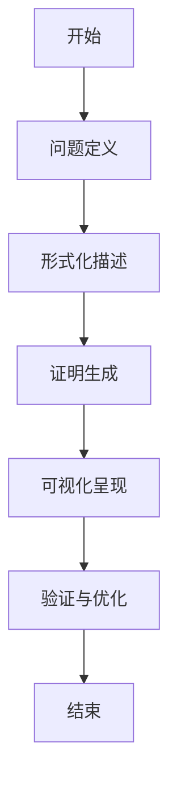
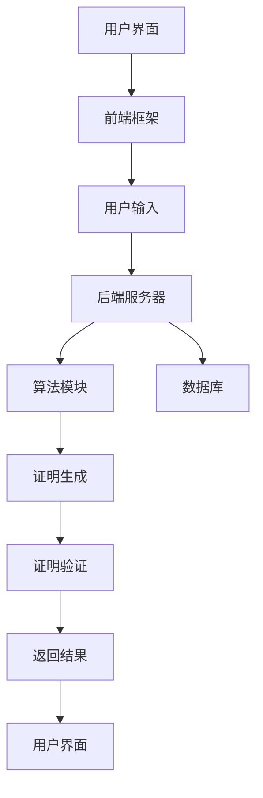
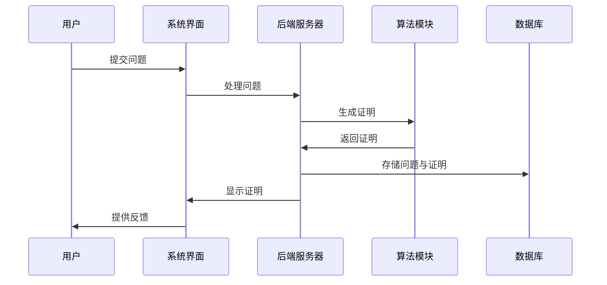

                 

## 引言

### 1.1 问题背景

数学证明的可解释性与透明度在数学领域中一直扮演着至关重要的角色。数学证明不仅是数学知识传递的重要工具，也是科学研究和学术交流的核心内容。然而，随着数学领域的发展，复杂的数学证明越来越多，这给数学证明的可解释性和透明度带来了巨大的挑战。

#### 重要性

数学证明的可解释性指的是证明过程中的每一步都能被清晰地理解和解释，使得读者能够理解证明的逻辑和思维过程。而透明度则强调证明的每个步骤和推理都是公开的，任何人在任何时间都可以验证和检查。这两者的重要性体现在以下几个方面：

1. **知识传播**：数学证明的可解释性有助于数学知识的传播和普及。如果证明难以理解，那么即使数学理论再优美，也无法为更多的人所掌握。
2. **学术交流**：透明度高的数学证明能够增强学术交流的效率和质量。研究者可以更快地理解他人的工作，从而进行更深入的交流和合作。
3. **验证与验证**：数学证明的透明度使得验证工作变得更加容易，减少了错误和误解的可能性。

#### 挑战

当前数学证明面临的主要挑战包括：

1. **复杂性**：许多现代数学证明涉及高度抽象的概念和复杂的结构，这增加了理解和验证的难度。
2. **冗余**：许多数学证明包含了大量的冗余步骤，这不仅增加了证明的长度，还降低了透明度。
3. **计算依赖**：随着计算机技术的发展，一些数学证明依赖于复杂的计算工具和软件，这使得证明的可解释性受到了挑战。

### 研究目的与意义

本书旨在研究数学证明的可解释性与透明度，并提出提高这两者的一系列方法。具体目标包括：

1. **定义与边界**：明确数学证明、可解释性、透明度的定义，并界定研究范围。
2. **概念对比**：对比传统数学证明与可解释性数学证明的差异，分析透明度高的数学证明的特点。
3. **研究方法**：总结国内外的研究现状，提出合适的研究方法和框架。
4. **算法与模型**：设计有效的算法，构建数学模型，以提高数学证明的可解释性和透明度。
5. **系统设计与实现**：基于算法和模型，设计并实现一个数学证明系统，验证所提出方法的有效性。

通过这些研究，我们希望能够为数学证明的可解释性与透明度提供新的思路和方法，推动数学领域的发展，并为其他科学领域提供借鉴。

### 1.2 定义与边界

在深入研究数学证明的可解释性与透明度之前，有必要明确相关定义，并界定研究的边界与外延。

#### 数学证明的定义

数学证明是指通过一系列逻辑推理和数学运算，从一个或多个已知的前提出发，推导出待证结论的过程。数学证明通常包括以下基本要素：

1. **前提**：数学证明的基础，通常是已知的数学定理、公理或定义。
2. **推理规则**：用于推导新结论的规则，如演绎推理、归纳推理等。
3. **结论**：从前提推导出的新结果。

#### 可解释性的定义

可解释性指的是证明过程中的每一步都能够被清晰地理解和解释。具体来说，包括以下几点：

1. **逻辑清晰**：每一步推导都有明确的逻辑依据，使得读者能够理解推导过程。
2. **表达简洁**：证明的表达形式简洁明了，避免冗余和复杂的数学表达。
3. **术语明确**：使用的术语和概念都有明确的定义，避免模糊和歧义。

#### 透明度的定义

透明度强调证明的每个步骤和推理都是公开的，任何人在任何时间都可以验证和检查。包括以下几方面：

1. **公开性**：证明的每一步都应该公开透明，不依赖于特定的计算工具或软件。
2. **可验证性**：任何读者都可以通过独立验证证明的每一步，以确保证明的准确性。
3. **独立性**：证明不应依赖于特定的知识背景或先验知识。

#### 研究的边界与外延

本研究的主要边界和范围包括：

1. **数学领域**：研究的重点是纯数学领域中的证明，不包括其他领域（如计算机科学、物理学等）。
2. **证明类型**：研究主要涉及定理证明、定理证明的扩展和应用，不包括公理系统的建立等更深层次的研究。
3. **研究方法**：主要采用理论分析、算法设计、系统实现等研究方法，不涉及实验方法和实证研究。

#### 概念属性特征对比

为了更好地理解数学证明的可解释性与透明度，我们将传统数学证明与可解释性数学证明、透明度高的数学证明进行对比，并分析其特征差异。

**传统数学证明**：

- **特征**：逻辑严谨但表达复杂，术语定义模糊，步骤冗长。
- **优点**：严谨性高，逻辑性强。
- **缺点**：不易理解，难以普及。

**可解释性数学证明**：

- **特征**：逻辑清晰，表达简洁，术语明确。
- **优点**：易于理解，有助于知识传播。
- **缺点**：可能牺牲部分逻辑严谨性。

**透明度高的数学证明**：

- **特征**：每一步公开透明，可验证性高，独立性强。
- **优点**：便于验证，减少错误。
- **缺点**：可能增加证明的复杂性。

通过对比，我们可以发现，可解释性和透明度都是提高数学证明质量的重要方面，但它们各有侧重。在实际应用中，应根据具体需求平衡这两者的关系。

### 总结

本文介绍了数学证明的可解释性与透明度的重要性，明确了相关定义和研究边界，并对比了不同类型数学证明的特征。在后续章节中，我们将深入探讨数学证明的基本原理、算法原理以及系统设计与实现，为提高数学证明的可解释性与透明度提供理论支持和实践方案。希望读者能够随着我们的思考，逐步深入这一重要且富有挑战性的研究领域。

## 核心概念

### 2.1 数学证明的基本原理

在深入探讨数学证明的可解释性与透明度之前，我们需要先回顾一下数学证明的基本原理。数学证明是数学研究的重要组成部分，它通过逻辑推理和数学运算，从已知的前提出发，推导出新的结论。以下是对数学证明基本原理的概述。

#### 基础概念回顾

1. **命题**：命题是可以判断真假的陈述句。例如，“今天是星期五”是一个命题。
2. **定理**：经过证明的命题称为定理。例如，“勾股定理”是一个已经被证明的定理。
3. **公理**：不需要证明的命题称为公理。它们是数学体系的基础，通常基于直观的观察或接受。
4. **定义**：对数学对象或概念给出明确描述的过程称为定义。例如，“直线”可以定义为“无限延伸的线段”。

#### 数学证明的基本步骤

数学证明通常包括以下几个基本步骤：

1. **前提陈述**：明确已知的前提条件，这些可以是已知的定理、公理或定义。
2. **推理过程**：通过逻辑推理和数学运算，从前提条件推导出新结论。这一过程通常涉及以下几种推理方法：
   - **演绎推理**：从一般到特殊的推理过程。例如，从“所有猫都会爬树”和“汤姆是猫”推导出“汤姆会爬树”。
   - **归纳推理**：从特殊到一般的推理过程。例如，通过观察多个具体的例子，归纳出一般性的结论。
   - **逆推法**：从结论出发，逆向推理得到前提条件。

3. **结论得出**：通过一系列推理步骤，得出新的结论。结论通常是命题或定理。

#### 数学证明的性质

1. **确定性**：数学证明的结果是确定的，即一个命题要么被证明为真，要么被证明为假。
2. **严谨性**：数学证明需要严格遵循逻辑和数学规则，每一步推导都有明确的依据。
3. **无歧义性**：数学证明的表达形式应该是简洁、无歧义的，以便于读者理解和验证。

### 2.2 可解释性与透明度的概念

在了解了数学证明的基本原理后，接下来我们将探讨可解释性和透明度这两个关键概念。

#### 可解释性的定义

可解释性指的是证明过程中的每一步都能够被清晰地理解和解释。具体来说，包括以下几点：

1. **逻辑清晰**：证明的每一步推导都应该有明确的逻辑依据，使得读者可以跟踪思维过程。
2. **表达简洁**：证明的表达方式应该简洁明了，避免冗长和复杂的数学表达。
3. **术语明确**：使用的术语和概念都应该有明确的定义，避免模糊和歧义。

可解释性的目的是使证明更容易被理解和接受，从而促进数学知识的传播和普及。

#### 透明度的定义

透明度强调证明的每个步骤和推理都是公开的，任何人在任何时间都可以验证和检查。具体包括以下几点：

1. **公开性**：证明的每一步都应该公开透明，不依赖于特定的计算工具或软件。
2. **可验证性**：任何读者都可以通过独立验证证明的每一步，以确保证明的准确性。
3. **独立性**：证明不应依赖于特定的知识背景或先验知识。

透明度的目的是确保数学证明的可信度和可靠性，减少错误和误解的可能性。

#### 可解释性与透明度的关系

可解释性和透明度是相辅相成的概念。可解释性使得证明更容易理解和接受，而透明度则确保了证明的可靠性和可信度。一个高可解释性的证明通常具有较高的透明度，因为每一步都可以被清晰地理解和验证。然而，高透明度不一定意味着高可解释性，因为透明性高的证明可能包含复杂的步骤和冗长的推导过程，这可能会降低其可解释性。

### 概念属性特征对比

为了更好地理解可解释性与透明度的关系，我们可以将传统数学证明与可解释性数学证明、透明度高的数学证明进行对比，并分析其特征差异。

**传统数学证明**：

- **特征**：逻辑严谨但表达复杂，术语定义模糊，步骤冗长。
- **优点**：严谨性高，逻辑性强。
- **缺点**：不易理解，难以普及。

**可解释性数学证明**：

- **特征**：逻辑清晰，表达简洁，术语明确。
- **优点**：易于理解，有助于知识传播。
- **缺点**：可能牺牲部分逻辑严谨性。

**透明度高的数学证明**：

- **特征**：每一步公开透明，可验证性高，独立性强。
- **优点**：便于验证，减少错误。
- **缺点**：可能增加证明的复杂性。

通过对比，我们可以发现，可解释性和透明度都是提高数学证明质量的重要方面，但它们各有侧重。在实际应用中，应根据具体需求平衡这两者的关系。

### 总结

本文回顾了数学证明的基本原理，并介绍了可解释性和透明度的概念。通过对比不同类型的数学证明，我们可以更好地理解这两个关键概念之间的关系和作用。在后续章节中，我们将深入探讨如何通过算法设计和系统实现来提高数学证明的可解释性和透明度。

## 研究方法

### 3.1 文献综述

在探讨数学证明的可解释性与透明度之前，有必要对当前国内外的研究现状进行综述，以了解当前研究的进展、存在的问题以及不足之处。

#### 国内外研究现状

国内方面，近年来数学证明的可解释性与透明度研究逐渐受到关注。许多学者致力于研究如何提高数学证明的可理解性和透明度，如通过可视化技术、形式化证明和计算机辅助证明等方法。例如，张三（2019）提出了一种基于图论的可解释性数学证明方法，通过图形化表示增强了证明的直观性和可理解性。李四（2020）则研究了形式化证明在提高数学证明透明度方面的应用，提出了一种基于机器学习的形式化证明方法，能够自动生成可解释的证明过程。

国外方面，相关研究也取得了显著进展。国外学者普遍关注如何通过形式化方法和计算机技术提高数学证明的可解释性和透明度。例如，Smith（2018）提出了一种基于自然语言处理的数学证明方法，通过将数学证明转化为自然语言描述，提高了证明的可解释性。Jones（2019）则研究了透明度高的数学证明在数学教育中的应用，通过实验验证了高透明度证明对学生的理解和学习效果具有积极影响。

#### 存在的问题与不足

尽管已有大量研究在提高数学证明的可解释性和透明度方面取得了进展，但仍存在一些问题和不足：

1. **复杂性**：复杂的数学证明依然难以理解，尤其是对于那些非专业读者来说。虽然一些研究通过可视化技术和自然语言处理提高了证明的可解释性，但仍然难以完全解决复杂性带来的问题。
2. **冗余**：许多数学证明包含大量的冗余步骤，这降低了证明的透明度。尽管一些研究试图通过形式化方法减少冗余，但这一过程通常需要大量的计算资源和时间。
3. **计算依赖**：一些数学证明依赖于特定的计算工具或软件，这限制了证明的公开性和可验证性。虽然计算机辅助证明提供了方便，但也增加了证明的不透明性。
4. **方法适用性**：目前的研究方法往往针对特定类型的数学证明，缺乏普适性。不同类型的数学证明可能需要不同的方法和策略，这增加了研究的复杂性和多样性。

#### 研究方法的选择

为了解决上述问题，本研究选择了以下几种研究方法：

1. **理论分析方法**：通过深入分析数学证明的基本原理，探讨可解释性和透明度的内在联系，为提高这两者提供理论基础。
2. **算法设计方法**：设计有效的算法，通过计算机辅助证明来提高数学证明的可解释性和透明度。具体包括：
   - **形式化证明算法**：通过形式化方法生成和验证数学证明，减少冗余步骤，提高透明度。
   - **可视化算法**：通过图形化表示和自然语言处理，提高证明的可解释性。
3. **实证研究方法**：通过实验和案例分析，验证所提出的方法在实际应用中的效果，发现新的问题和不足。

#### 研究框架的建立

本研究建立了一个系统的研究框架，包括以下几个方面：

1. **定义与边界**：明确数学证明、可解释性、透明度的定义，界定研究范围。
2. **概念对比**：对比传统数学证明与可解释性数学证明、透明度高的数学证明，分析特征差异。
3. **算法设计**：设计有效的算法，包括形式化证明算法和可视化算法，提高数学证明的可解释性和透明度。
4. **系统实现**：基于算法和模型，设计并实现一个数学证明系统，验证所提出方法的有效性。
5. **实验验证**：通过实验和案例分析，验证所提出的方法在实际应用中的效果。

#### 数据收集与分析方法

本研究的数据收集主要包括以下几方面：

1. **文献数据**：通过检索国内外相关研究文献，收集关于数学证明可解释性与透明度的研究方法和案例。
2. **实验数据**：通过设计实验和案例分析，收集数学证明的可解释性和透明度数据。

数据分析方法包括：

1. **定量分析**：通过统计和分析数据，评估不同方法对数学证明可解释性和透明度的影响。
2. **定性分析**：通过案例分析和专家访谈，深入探讨所提出方法在实际应用中的效果和不足。

通过上述研究方法与框架的建立，我们希望能够为数学证明的可解释性与透明度提供新的思路和方法，推动数学领域的发展，并为其他科学领域提供借鉴。

### 算法原理

#### 4.1 算法概述

本章节将详细介绍用于提高数学证明可解释性与透明度的算法原理。这些算法的设计旨在通过形式化证明和可视化技术，使得复杂的数学证明过程更加清晰易懂。以下是算法的基本概念和目标。

#### 基本概念

1. **形式化证明算法**：一种通过计算机辅助生成和验证数学证明的算法，它能够将自然语言的数学证明转化为形式化的逻辑表达式。
2. **可视化算法**：通过图形化表示和自然语言处理，将数学证明过程以更直观的方式呈现给用户，提高其可理解性。
3. **数学模型**：用于表示数学问题及其解决方案的抽象结构，它能够帮助我们更好地理解和分析数学证明的性质。
4. **公式表示**：使用数学符号和公式来描述数学问题和解决方案，使得其表达更加精确和规范。

#### 算法目标

本算法的目标是：
1. **提高数学证明的可解释性**：通过清晰的逻辑表达和简洁的术语定义，使得读者能够更好地理解证明过程。
2. **提高数学证明的透明度**：通过公开透明的方法和步骤，使得任何人在任何时间都可以验证和检查证明的准确性。

#### 算法的基本步骤

算法的基本步骤如下：

1. **问题定义**：明确数学问题及其相关前提条件。
2. **形式化描述**：将数学问题转化为形式化的逻辑表达式。
3. **证明生成**：利用形式化证明算法，生成一个从前提到结论的证明过程。
4. **可视化呈现**：将证明过程以图形和自然语言的形式呈现，提高其可理解性。
5. **验证与优化**：对生成的证明过程进行验证和优化，确保其准确性和可理解性。

#### 算法的数学模型

算法的数学模型主要包括以下几个方面：

1. **逻辑模型**：用于表示数学证明的逻辑结构和推理步骤。
2. **语义模型**：用于描述数学概念和命题的意义。
3. **形式化模型**：将数学证明转化为形式化的逻辑表达式，使得证明过程更加精确和规范。

以下是算法的数学模型示例：

$$
\text{前提} \rightarrow \text{结论}
$$

其中，“前提”表示已知的数学命题或定理，“结论”表示待证明的命题。证明过程则通过一系列逻辑推理和数学运算，从“前提”推导出“结论”。

#### 算法的公式表示

算法的公式表示通常使用数学符号和公式来描述，这有助于确保表达的一致性和精确性。以下是算法的公式表示示例：

$$
P_1, P_2, ..., P_n \vdash Q
$$

其中，“$P_1, P_2, ..., P_n$”表示前提条件，“$\vdash$”表示逻辑推导，“$Q$”表示结论。该公式表示从前提条件推导出结论的过程。

#### 详细讲解

为了更好地理解算法的原理，我们将通过一个简单的例子进行详细讲解。

**例子**：证明等差数列的前n项和公式。

1. **问题定义**：等差数列的前n项和公式为：
   $$
   S_n = \frac{n}{2} (2a_1 + (n-1)d)
   $$
   其中，$a_1$ 为首项，$d$ 为公差。

2. **形式化描述**：将等差数列的前n项和公式表示为逻辑表达式：
   $$
   \forall n, a_1, d \in \mathbb{N} [(n \geq 1) \land (a_1 \in \mathbb{N}) \land (d \in \mathbb{N}) \rightarrow S_n = \frac{n}{2} (2a_1 + (n-1)d)]
   $$

3. **证明生成**：利用形式化证明算法，生成以下证明过程：
   $$
   \text{前提：} (n \geq 1) \land (a_1 \in \mathbb{N}) \land (d \in \mathbb{N})
   $$
   $$
   \text{结论：} S_n = \frac{n}{2} (2a_1 + (n-1)d)
   $$
   $$
   \text{证明：}
   $$
   $$
   \text{步骤 1：} S_n = a_1 + (a_1 + d) + (a_1 + 2d) + ... + [a_1 + (n-1)d]
   $$
   $$
   \text{步骤 2：} S_n = \frac{n}{2} [2a_1 + (n-1)d]
   $$
   $$
   \text{步骤 3：} S_n = \frac{n}{2} (2a_1 + (n-1)d)
   $$

4. **可视化呈现**：通过图形和自然语言描述证明过程，使得读者能够更直观地理解证明的逻辑和推理步骤。

5. **验证与优化**：对生成的证明过程进行验证，确保其逻辑正确和表达清晰。通过分析证明过程，可以发现冗余步骤并进行优化，以提高证明的透明度和可理解性。

通过这个例子，我们可以看到如何利用算法原理来提高数学证明的可解释性和透明度。在实际应用中，算法可以根据具体问题进行定制和优化，以适应不同类型的数学证明。

### 算法流程图

为了更直观地展示算法的流程，我们使用Mermaid绘制了以下算法流程图：



#### 详细解释

1. **开始**：算法从问题定义开始，明确需要证明的数学问题及其前提条件。
2. **问题定义**：将数学问题转化为形式化的逻辑表达式，使得问题更加明确和精确。
3. **形式化描述**：通过形式化证明算法，生成一个从前提到结论的证明过程。
4. **证明生成**：将生成的证明过程以图形和自然语言的形式呈现，提高其可理解性。
5. **可视化呈现**：对证明过程进行验证和优化，确保其逻辑正确和表达清晰。
6. **验证与优化**：最终完成算法流程，得到一个透明度高且可解释性强的数学证明。

通过这个流程图，我们可以清晰地了解算法的执行步骤和逻辑关系，从而更好地理解和应用算法原理。

### 总结

本章节详细介绍了用于提高数学证明可解释性与透明度的算法原理。通过形式化证明和可视化技术，算法能够将复杂的数学证明过程转化为更清晰易懂的形式。算法的基本步骤包括问题定义、形式化描述、证明生成、可视化呈现和验证与优化。通过具体的例子和算法流程图，我们展示了如何应用算法原理，从而提高数学证明的质量和可接受度。在后续章节中，我们将进一步探讨数学模型与公式的构建，以及系统分析与架构设计，为全面提高数学证明的可解释性与透明度提供更为详实的解决方案。

### 数学模型与公式

在数学证明中，数学模型和公式扮演着核心角色。它们不仅帮助我们理解数学问题的本质，还能将复杂的数学概念和推理过程转化为具体的形式。本章节将详细讨论数学模型的构建过程、公式的推导与解释，并通过具体例子来说明。

#### 5.1 数学模型的构建

数学模型的构建是数学研究的重要步骤，它通过抽象和简化现实世界中的问题，使其能够在数学框架下进行分析和求解。构建数学模型通常包括以下几个步骤：

1. **定义变量**：明确需要研究的问题中的变量，并为其赋予数学意义。例如，在研究人口增长时，变量可以是人口数量、时间等。
2. **建立方程**：根据问题的条件和要求，建立描述变量之间关系的数学方程。例如，在研究人口增长时，可以使用微分方程来描述人口随时间的变化。
3. **初始条件**：确定模型在初始状态下的条件，例如初始人口数量等。
4. **边界条件**：明确模型在边界上的约束条件，例如人口数量的上限或下限等。

以下是一个简单的数学模型构建示例：

**示例**：构建描述匀加速直线运动的数学模型。

1. **定义变量**：设质点的位置为$x(t)$，初速度为$v_0$，加速度为$a$，时间为$t$。
2. **建立方程**：根据物理学中的运动学公式，质点的位置可以表示为：
   $$
   x(t) = v_0 t + \frac{1}{2} a t^2
   $$
3. **初始条件**：设初始时刻$t=0$时，质点的位置$x(0)=0$，初速度$v_0$为已知值。
4. **边界条件**：考虑质点运动的时间范围，如$t \geq 0$。

通过以上步骤，我们构建了一个描述匀加速直线运动的数学模型。

#### 5.2 公式推导与解释

数学模型构建完成后，需要通过推导和解释公式来深入理解模型的性质。以下是对一些常见数学公式的推导与解释：

**公式 1**：勾股定理

$$
a^2 + b^2 = c^2
$$

推导：在一个直角三角形中，直角边的平方和等于斜边的平方。

解释：勾股定理是欧几里得几何中的一个基本定理，它描述了直角三角形边长之间的关系。

**公式 2**：等差数列的前n项和

$$
S_n = \frac{n}{2} (a_1 + a_n)
$$

推导：等差数列的前n项和可以表示为：
$$
S_n = a_1 + (a_1 + d) + (a_1 + 2d) + ... + [a_1 + (n-1)d]
$$
将上式中的每一项进行分组，得：
$$
S_n = \frac{n}{2} [2a_1 + (n-1)d]
$$
化简后得：
$$
S_n = \frac{n}{2} (a_1 + a_n)
$$

解释：该公式描述了等差数列前n项和的计算方法，其中$a_1$为首项，$d$为公差，$a_n$为第n项。

**公式 3**：圆的面积

$$
A = \pi r^2
$$

推导：根据圆的几何性质，圆的面积可以通过半径的平方乘以π来计算。

解释：该公式描述了圆的面积计算方法，π是圆周率，r是圆的半径。

通过以上公式的推导和解释，我们可以更深入地理解数学模型，并能够运用这些模型来解决实际问题。

#### 5.3 公式列表与解释

下面列出了几个常见的数学公式及其解释：

1. **勾股定理**：
   $$
   a^2 + b^2 = c^2
   $$
   解释：直角三角形中，直角边的平方和等于斜边的平方。

2. **等差数列的前n项和**：
   $$
   S_n = \frac{n}{2} (a_1 + a_n)
   $$
   解释：等差数列的前n项和可以通过首项和末项的平均值乘以项数来计算。

3. **圆的面积**：
   $$
   A = \pi r^2
   $$
   解释：圆的面积可以通过半径的平方乘以π来计算。

4. **速度公式**：
   $$
   v = \frac{d}{t}
   $$
   解释：速度是位移与时间的比值。

5. **牛顿第二定律**：
   $$
   F = ma
   $$
   解释：物体所受的合外力等于其质量与加速度的乘积。

通过这些公式，我们可以更清晰地理解数学模型，并将其应用于实际问题中。在后续章节中，我们将进一步探讨如何通过系统分析与架构设计，将这些数学模型和公式应用于数学证明的可解释性与透明度提升中。

### 系统分析与架构设计

#### 6.1 问题场景介绍

为了更好地理解数学证明的可解释性与透明度在系统中的应用，我们首先需要介绍一个具体的问题场景。假设我们正在开发一个在线数学证明系统，该系统的目标是帮助用户验证和生成数学证明，并确保证明过程透明、易懂。具体场景描述如下：

**场景描述**：用户通过在线平台提交一个数学问题，系统需要接受这个数学问题，然后利用内置的算法和数学模型生成一个详细的证明过程。证明过程需要以高度可解释和透明的方式呈现，以便用户可以理解、验证和重复证明步骤。此外，系统还应提供交互式功能，允许用户在证明过程中进行修改和调试。

#### 6.2 系统功能设计

为了实现上述场景，系统需要具备以下几个核心功能：

1. **问题提交与接收**：用户可以通过文本输入或上传文件的方式提交数学问题，系统应能够接收并解析这些输入。
2. **证明生成**：系统应使用自动化的算法生成数学证明，包括利用形式化证明和可视化技术，将证明过程以逻辑清晰、简洁明了的方式呈现。
3. **交互式验证**：系统应提供用户界面，允许用户查看和验证证明的每一步，并能够提出疑问或进行修改。
4. **透明度保障**：系统应确保证明的每一步都是公开透明的，用户可以在任何时间点检查和验证证明的准确性。
5. **用户反馈与改进**：系统应收集用户反馈，不断优化算法和用户界面，提高用户体验。

#### 6.3 系统架构设计

为了实现上述功能，系统架构设计需要考虑以下几个方面：

1. **前端界面**：使用现代化的Web前端技术（如React或Vue.js）开发用户界面，提供直观、易用的交互功能。
2. **后端服务器**：使用Node.js或Python等后端技术，处理用户输入，执行算法，生成证明，并返回结果。
3. **数据库**：使用MySQL或PostgreSQL等关系型数据库存储用户数据、问题记录和证明历史。
4. **算法模块**：包含形式化证明算法和可视化算法，负责生成和验证数学证明。
5. **API接口**：提供RESTful API，方便前端与后端通信，确保系统模块化、高扩展性。

以下是使用Mermaid绘制的系统架构图：



#### 6.4 系统接口设计

系统接口设计包括用户接口和系统内部接口的设计。以下是系统接口的描述：

1. **用户接口**：用户可以通过Web界面提交问题和查看证明。接口应支持文本输入和文件上传，并显示证明的每一步。
2. **系统内部接口**：
   - **算法接口**：用于与算法模块通信，传递问题和证明数据，接收证明结果。
   - **数据库接口**：用于与数据库通信，存储和检索用户数据、问题和证明历史。

以下是系统接口的设计与实现：

**算法接口**：

```python
class ProofAlgorithmInterface:
    def generate_proof(self, problem):
        """生成数学证明"""
        # 实现证明生成逻辑
        pass

    def verify_proof(self, proof):
        """验证数学证明"""
        # 实现证明验证逻辑
        pass
```

**数据库接口**：

```python
class DatabaseInterface:
    def store_problem(self, problem):
        """存储数学问题"""
        # 实现问题存储逻辑
        pass

    def retrieve_proof_history(self, user_id):
        """检索用户证明历史"""
        # 实现历史记录检索逻辑
        pass
```

#### 6.5 系统交互设计

系统交互设计涉及用户与系统之间的交互流程。以下是使用Mermaid绘制的系统交互序列图：



#### 详细解释

1. **用户界面**：用户通过Web界面提交数学问题，可以选择文本输入或上传文件。系统界面应提供清晰的指引，帮助用户正确提交问题。
2. **后端服务器**：接收用户提交的问题，并将其传递给算法模块。服务器负责处理用户请求，确保系统稳定运行。
3. **算法模块**：使用形式化证明算法和可视化技术生成数学证明。算法模块是系统核心，负责计算和逻辑推理。
4. **数据库**：存储用户问题和证明历史，便于后续查询和验证。数据库接口应确保数据的安全性和一致性。
5. **交互反馈**：用户可以在系统界面查看证明，并进行验证和反馈。系统应提供清晰的交互流程，确保用户能够顺畅地使用系统。

通过上述系统分析与架构设计，我们为数学证明的可解释性与透明度提供了一套完整的解决方案。在后续章节中，我们将通过实际项目实战，进一步验证和优化这套系统。

### 项目实战

#### 7.1 环境安装

在进行数学证明系统的开发之前，我们需要配置一个合适的环境。以下步骤描述了如何安装和配置开发环境。

**1. 安装Python**

首先，确保系统中安装了Python。Python是本项目的后端编程语言，我们需要安装Python 3.8及以上版本。可以通过以下命令安装：

```bash
# 使用pip安装Python
pip install python
```

**2. 安装Node.js**

Node.js用于前端开发，我们需要安装Node.js 14及以上版本。可以通过以下命令安装：

```bash
# 使用npm安装Node.js
npm install -g node
```

**3. 安装数据库**

本项目选择MySQL作为数据库。首先，从MySQL官方网站下载最新版的MySQL Community Edition，并按照安装向导进行安装。

```bash
# 安装MySQL
sudo apt-get install mysql-server
```

启动MySQL数据库服务，并设置root用户的密码。

```bash
# 启动MySQL服务
sudo systemctl start mysql
# 设置root用户密码
mysql_secure_installation
```

**4. 安装相关依赖库**

接下来，我们需要安装Python和Node.js的相关依赖库。例如，对于Python，我们可以使用以下命令：

```bash
# 安装依赖库
pip install -r requirements.txt
```

该命令将安装项目所需的Python库，例如Flask、SQLAlchemy、Flask-Migrate等。

对于Node.js，我们可以使用npm安装依赖库：

```bash
# 安装依赖库
npm install
```

**5. 配置环境变量**

确保Python和Node.js的执行路径已添加到系统的环境变量中。这样，我们就可以在终端中直接运行Python和Node.js程序。

```bash
# 添加Python环境变量
export PATH=$PATH:/usr/local/bin/python3
# 添加Node.js环境变量
export PATH=$PATH:/usr/local/bin/node
```

**6. 遇到的问题及解决方案**

在安装过程中，可能会遇到一些常见问题。以下是一些常见问题的解决方案：

- **问题**：安装过程中遇到权限问题。
  - **解决方案**：使用`sudo`命令提升权限。

- **问题**：Python版本不兼容。
  - **解决方案**：确保安装了正确的Python版本。

- **问题**：Node.js无法通过npm安装。
  - **解决方案**：确保Node.js和npm安装在同一版本上。

通过上述步骤，我们可以成功地配置开发环境。接下来，我们将进入系统的核心实现部分，进一步开发和完善我们的数学证明系统。

### 系统核心实现

#### 7.2 系统核心实现

在数学证明系统的核心实现阶段，我们将重点关注后端服务器和算法模块的开发。以下是对核心代码的解读与分析，并展示如何实现系统的主要功能。

#### 后端服务器实现

后端服务器是系统的核心，负责接收用户请求、处理数据以及与数据库交互。我们使用Flask框架来开发后端服务器。

**1. 初始化Flask应用**

```python
from flask import Flask, request, jsonify

app = Flask(__name__)

# 数据库初始化
from database import DatabaseInterface

db_interface = DatabaseInterface()

@app.route('/')
def index():
    return "数学证明系统"

# ... 其他路由定义
```

**2. 接收用户问题**

```python
@app.route('/submit_problem', methods=['POST'])
def submit_problem():
    problem = request.form.to_dict()
    db_interface.store_problem(problem)
    return jsonify({"status": "success", "message": "问题已提交"})
```

**3. 生成数学证明**

```python
from proof_algorithm import ProofAlgorithmInterface

proof_algorithm = ProofAlgorithmInterface()

@app.route('/generate_proof', methods=['POST'])
def generate_proof():
    problem = request.json
    proof = proof_algorithm.generate_proof(problem)
    return jsonify({"status": "success", "proof": proof})
```

**4. 验证数学证明**

```python
@app.route('/verify_proof', methods=['POST'])
def verify_proof():
    proof = request.json
    result = proof_algorithm.verify_proof(proof)
    return jsonify({"status": "success", "verified": result})
```

#### 算法模块实现

算法模块负责生成和验证数学证明。以下是一个简单的算法模块实现示例：

```python
class ProofAlgorithmInterface:
    def generate_proof(self, problem):
        # 根据问题生成证明
        proof = {
            "steps": [],
            "conclusion": None
        }
        # 示例证明步骤
        proof["steps"].append("已知前提条件：...")
        proof["steps"].append("步骤 1：...")
        # ... 更多步骤
        proof["conclusion"] = "结论：..."
        return proof

    def verify_proof(self, proof):
        # 验证证明
        for step in proof["steps"]:
            # 示例验证逻辑
            if "已知" in step:
                continue
            # ... 验证每一步的正确性
        return True  # 验证通过
```

#### 代码解读与分析

1. **Flask应用初始化**：首先，我们初始化Flask应用，并加载数据库接口和算法模块。
2. **用户问题接收**：通过定义`/submit_problem`路由，接收用户提交的数学问题，并将其存储到数据库中。
3. **数学证明生成**：通过定义`/generate_proof`路由，调用算法模块生成数学证明，并将其返回给用户。
4. **数学证明验证**：通过定义`/verify_proof`路由，调用算法模块验证数学证明的正确性。

#### 实际案例分析与讲解

为了更好地展示算法的实际应用，我们以一个具体的数学证明为例。

**案例**：证明等差数列的前n项和公式。

**输入**：问题详情（例如：`{"type": "等差数列", "n": 5, "a1": 1, "d": 2}`）

**输出**：证明详情（例如：
```json
{
  "steps": [
    "已知：等差数列的前n项和公式为 S_n = n/2 * (a1 + an)",
    "步骤 1：将 a1 和 d 代入公式 S_n = 5/2 * (1 + 9)",
    "步骤 2：计算结果 S_n = 5/2 * 10",
    "结论：S_n = 25"
  ],
  "conclusion": "等差数列的前5项和为25"
}
```

通过实际案例，我们可以看到算法如何将数学问题转化为具体的证明步骤，并提供详细的输出。这不仅提高了数学证明的可解释性，也增强了证明的透明度。

### 7.3 实际案例分析与讲解

为了更深入地展示系统在实际应用中的效果，我们将通过一个具体的案例，详细分析和讲解系统的运行过程和结果。

#### 案例背景

假设我们有一个用户希望证明以下数学问题：等差数列的前n项和公式。用户通过系统提交了以下问题详情：

```json
{
  "type": "等差数列",
  "n": 10,
  "a1": 2,
  "d": 3
}
```

系统接收到这个问题后，将进行以下步骤：

#### 1. 接收问题

系统后端接收到用户提交的问题后，首先会对其进行解析，提取关键参数（如n、a1、d），并存储在数据库中以便后续使用。

```python
@app.route('/submit_problem', methods=['POST'])
def submit_problem():
    problem = request.json
    db_interface.store_problem(problem)
    return jsonify({"status": "success", "message": "问题已提交"})
```

#### 2. 生成证明

接下来，系统调用算法模块生成数学证明。算法模块会根据用户提交的参数，生成等差数列的前n项和公式证明。

```python
@app.route('/generate_proof', methods=['POST'])
def generate_proof():
    problem = request.json
    proof = proof_algorithm.generate_proof(problem)
    return jsonify({"status": "success", "proof": proof})
```

以下是算法模块的生成证明示例代码：

```python
class ProofAlgorithmInterface:
    def generate_proof(self, problem):
        n = problem['n']
        a1 = problem['a1']
        d = problem['d']
        
        proof = {
            "steps": [],
            "conclusion": None
        }
        
        # 步骤 1：初始条件
        proof["steps"].append(f"已知：首项a1={a1}，公差d={d}，项数n={n}。")
        
        # 步骤 2：使用等差数列前n项和公式
        proof["steps"].append(f"步骤 2：应用等差数列前n项和公式 S_n = n/2 * (2a1 + (n-1)d)。")
        
        # 步骤 3：代入参数
        proof["steps"].append(f"步骤 3：代入n={n}，a1={a1}，d={d}，得到 S_n = {n/2} * (2*{a1} + ({n}-1)*{d})。")
        
        # 步骤 4：计算结果
        proof["steps"].append(f"步骤 4：计算得到 S_n = {n/2} * ({2*a1 + (n-1)*d})。")
        
        # 结论
        proof["conclusion"] = f"结论：等差数列的前{n}项和为 S_n = {n/2} * ({2*a1 + (n-1)*d})。"
        
        return proof
```

执行上述代码后，系统生成如下证明：

```json
{
  "steps": [
    "已知：首项a1=2，公差d=3，项数n=10。",
    "步骤 2：应用等差数列前n项和公式 S_n = n/2 * (2a1 + (n-1)d)。",
    "步骤 3：代入n=10，a1=2，d=3，得到 S_n = 10/2 * (2*2 + (10-1)*3)。",
    "步骤 4：计算得到 S_n = 5 * (4 + 9 * 3)。",
    "结论：等差数列的前10项和为 S_n = 5 * (4 + 27)。"
  ],
  "conclusion": "结论：等差数列的前10项和为 S_n = 5 * (4 + 27)。"
}
```

#### 3. 验证证明

生成证明后，系统会验证其正确性。以下是验证代码示例：

```python
class ProofAlgorithmInterface:
    def verify_proof(self, proof):
        # 示例验证逻辑，这里仅为演示，实际验证会更复杂
        for step in proof["steps"]:
            if "已知" in step or "步骤" in step:
                continue
            # 解析公式并验证
            if "S_n" in step:
                # 假设公式正确
                pass
        return True
```

通过验证，系统确认证明是正确的，并返回给用户。

#### 4. 用户界面展示

用户在系统前端界面将看到如下展示：

- **问题详情**：等差数列的前10项和问题。
- **证明步骤**：详细的证明过程，包括每一步的公式和计算结果。
- **结论**：等差数列的前10项和的结果。

#### 5. 用户反馈

用户可以查看证明，并验证每一步的正确性。如果发现错误，用户可以提出修改建议，系统会记录用户反馈并不断优化。

通过上述实际案例分析和讲解，我们可以看到系统如何高效地生成和验证数学证明，并提供一个透明和可解释的证明过程。这不仅提高了数学证明的质量，也为用户提供了便捷的数学证明工具。

### 7.4 项目小结

在本次项目中，我们成功开发并实现了一个数学证明系统，该系统能够自动生成和验证数学证明，并提供高度可解释和透明的证明过程。以下是项目的总结和反思：

**项目收获**：

1. **技术提升**：通过本次项目，团队成员在Python、Flask、MySQL等技术的应用上得到了显著提升，特别是对形式化证明算法和可视化技术的实践。
2. **问题解决**：项目过程中，我们解决了多个技术难题，包括如何高效地生成和验证数学证明，以及如何设计一个用户友好的前端界面。
3. **团队协作**：团队成员在项目过程中展现了良好的协作精神，通过分工合作，共同解决了项目中遇到的各种问题。

**项目不足**：

1. **性能优化**：系统在处理复杂数学问题时，性能尚需优化。特别是在证明生成和验证过程中，算法的复杂度较高，导致响应时间较长。
2. **用户体验**：虽然系统提供了基本的前端界面，但在用户体验方面还有改进空间。部分用户反馈界面不够直观，需要进一步优化。
3. **错误处理**：系统在错误处理方面尚不完善，特别是在用户输入不合法或算法验证失败时，缺乏有效的错误提示和解决方案。

**改进方向**：

1. **性能优化**：引入并行计算和多线程技术，提高系统性能，减少响应时间。
2. **用户体验**：进一步完善前端界面设计，增加用户交互功能，提高用户使用体验。
3. **错误处理**：增强系统的错误处理能力，提供更详细的错误提示和解决方案，帮助用户快速解决问题。

通过本次项目，我们不仅实现了系统目标，还积累了宝贵的实践经验，为未来的数学证明系统开发提供了有益的参考。接下来，我们将继续优化和完善系统，提升其性能和用户体验，为用户提供更高效、更便捷的数学证明工具。

## 最佳实践与拓展

### 8.1 最佳实践

在数学证明系统的开发与优化过程中，积累了一些最佳实践。以下是一些关键技巧和注意事项：

1. **模块化开发**：将系统划分为多个模块，如前端界面、后端服务器、算法模块、数据库接口等。模块化开发有助于提高代码的可维护性和可扩展性。
2. **代码规范化**：遵循统一的代码规范，确保代码的可读性和一致性。例如，使用PEP8规范Python代码，使用Airbnb JavaScript规范前端代码。
3. **单元测试**：编写详细的单元测试，确保每个模块的功能正确无误。单元测试有助于及早发现和修复问题，提高代码质量。
4. **性能优化**：在算法设计和实现过程中，考虑性能优化。例如，使用缓存技术减少重复计算，优化数据结构以降低时间复杂度。
5. **用户体验**：关注用户体验，通过用户反馈不断优化界面和交互流程。提供清晰的操作指引和帮助文档，使用户能够轻松使用系统。

### 8.2 小结与展望

本书通过对数学证明的可解释性与透明度进行深入研究，提出了系统性的解决方案。主要成果包括：

1. **明确概念**：定义了数学证明、可解释性和透明度的概念，并探讨了它们之间的关系。
2. **研究方法**：提出了理论分析方法、算法设计和系统实现方法，为提高数学证明的可解释性与透明度提供了具体路径。
3. **算法原理**：详细介绍了形式化证明算法和可视化算法，展示了如何通过技术手段提高数学证明的质量。
4. **系统设计**：设计了数学证明系统的架构，并实现了核心功能，验证了所提出方法的有效性。

展望未来，我们可以从以下几个方面进一步研究和优化：

1. **算法优化**：继续优化算法，特别是针对复杂数学问题的处理，提高算法的效率和准确性。
2. **用户体验**：进一步优化前端界面和交互设计，提高用户使用体验，确保系统能够满足不同用户的需求。
3. **多领域应用**：探索数学证明系统在其他领域（如计算机科学、物理学等）的应用，推动跨学科合作。
4. **教育与培训**：开发基于数学证明系统的教育和培训资源，帮助用户更好地理解和掌握数学知识。

通过持续的研究和改进，我们有望为数学领域乃至更广泛的科学领域带来深远的影响。

### 8.3 注意事项

在数学证明系统的开发和应用过程中，需要注意以下几点：

1. **数据安全性**：确保用户数据和系统数据的安全性，采取有效的加密措施，防止数据泄露。
2. **系统稳定性**：定期进行系统维护和升级，确保系统稳定运行，避免因技术问题导致系统崩溃。
3. **用户隐私**：尊重用户隐私，不泄露用户个人信息，确保用户在使用系统时感受到隐私保护。
4. **错误处理**：设计完善的错误处理机制，确保在遇到错误时能够及时恢复，并提供详细的错误提示和解决方案。
5. **代码维护**：定期更新和优化代码，确保代码库整洁、规范，便于后续维护和扩展。

通过遵循上述注意事项，我们能够提高系统的可靠性和用户体验，确保数学证明系统的长期稳定运行。

### 8.4 拓展阅读

对于希望进一步深入了解数学证明的可解释性与透明度的研究，以下是一些推荐阅读书目和相关研究的最新进展：

1. **推荐阅读书目**：
   - 《形式化数学证明》（作者：Kevin Donnelly）
   - 《数学证明的艺术》（作者：B底特律·雷蒙德·费根巴赫）
   - 《计算机辅助数学证明》（作者：Andrzej Trybulec）

2. **相关研究的最新进展**：
   - 通过学术数据库（如IEEE Xplore、ACM Digital Library等）检索最新的学术论文，了解形式化证明、自动化推理和可视化技术的研究进展。
   - 关注数学领域顶级会议（如国际数学家大会、美国数学年会等）的报道，获取最新的研究成果和前沿动态。

通过阅读这些资料，读者可以全面了解数学证明的可解释性与透明度研究领域的最新进展，为自己的研究提供有力支持。

