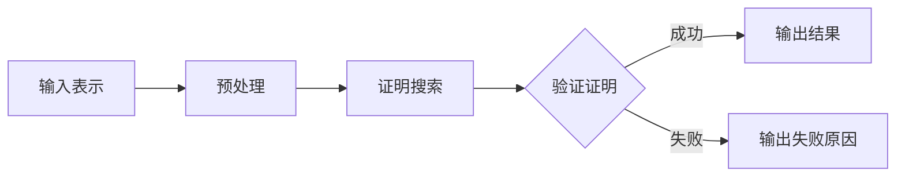
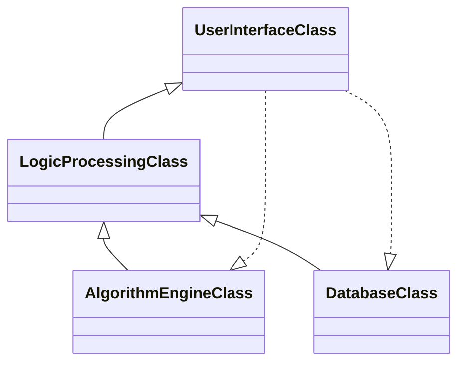
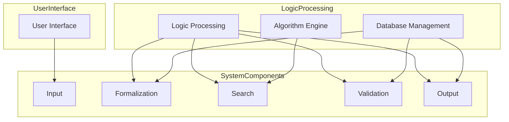
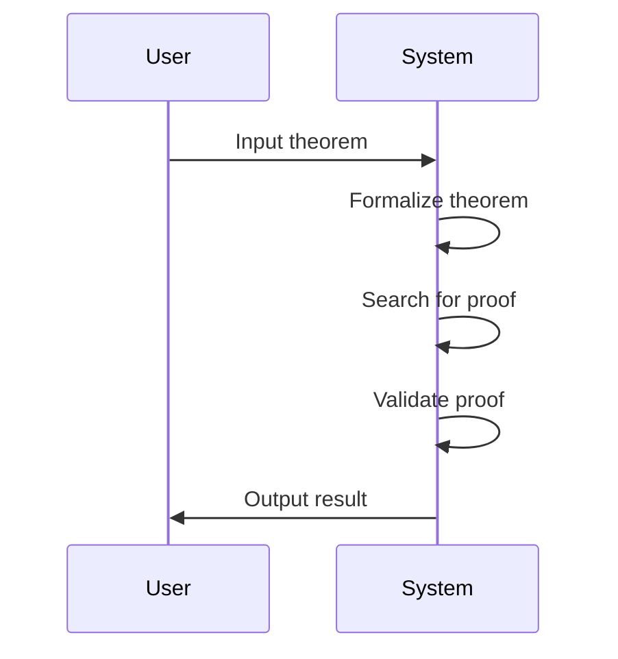

                 

### 数学证明的机器证明与自动定理证明：引论

关键词：机器证明、自动定理证明、数学证明、算法、系统架构

摘要：本文将深入探讨数学证明的机器证明与自动定理证明。我们将从基本概念出发，了解数学证明、机器证明、自动定理证明的定义及其重要性，探讨这两大领域的发展历程、当前研究热点和未来发展趋势。

#### 数学证明的基本概念

数学证明是数学研究的重要环节，它通过一系列逻辑推理，从已知的前提条件出发，得出新的结论。数学证明的基本要素包括前提条件（公理、定义、已知定理等）、推理规则和结论。数学证明的目的在于验证数学命题的真实性，构建数学理论的严密性。

1. **定义与历史背景**：

   - **定义**：数学证明是通过逻辑推理，从已知的前提条件推导出结论的过程。
   - **历史背景**：数学证明的历史可以追溯到古希腊时期，当时的大数学家如欧几里得和阿基米德等，都使用了严密的逻辑推理方法进行数学证明。

2. **重要性与挑战**：

   - **重要性**：数学证明是数学研究的基础，它确保了数学命题的准确性和可靠性，为数学理论的建立提供了坚实的基础。
   - **挑战**：随着数学问题日益复杂，传统的手工证明方法逐渐难以应对。如何利用计算机技术进行数学证明，成为了一个重要的研究课题。

#### 机器证明的基本概念

机器证明是指利用计算机程序来证明数学命题的真实性。它通过将数学证明的过程形式化，转化为计算机可以处理的步骤，从而实现自动证明。

1. **定义**：

   - **定义**：机器证明是指利用计算机程序，按照一定的算法和策略，证明数学命题的真实性。
   - **特点**：与手工证明相比，机器证明具有高效、准确、不依赖人的智能等特点。

2. **分类**：

   - **算法证明**：基于特定算法，如数学归纳法、自然演绎系统等，进行证明。
   - **形式证明**：使用形式化语言和证明系统，如Coq、Isabelle等，进行证明。

#### 自动定理证明的基本概念

自动定理证明（ATP）是机器证明的一个分支，它致力于开发能够自动证明定理的计算机程序。自动定理证明的关键在于如何处理逻辑推理中的复杂性和不确定性。

1. **定义**：

   - **定义**：自动定理证明是指利用计算机程序，自动发现和证明数学定理的过程。
   - **特点**：与手动证明和机器证明相比，自动定理证明具有自动化、高效和不受人类认知限制等特点。

2. **分类**：

   - **启发式方法**：通过搜索和启发式策略，如回溯搜索、遗传算法等，寻找证明路径。
   - **约束满足问题（CSP）方法**：将定理证明问题转化为约束满足问题，通过求解约束满足问题来证明定理。
   - **逻辑推理方法**：使用逻辑推理方法，如自然演绎、自动推理系统等，进行证明。

#### 机器证明与自动定理证明的发展趋势

随着计算机技术的发展，机器证明和自动定理证明已成为数学和计算机科学的重要研究方向。当前，这两大领域的发展趋势主要集中在以下几个方面：

1. **算法优化**：通过改进算法，提高机器证明和自动定理证明的效率，减少证明时间。

2. **形式化数学**：推进形式化数学的研究，建立形式化的数学体系，为机器证明和自动定理证明提供可靠的基础。

3. **跨学科合作**：数学家、计算机科学家、哲学家等跨学科合作，共同推进机器证明和自动定理证明的研究。

4. **应用领域拓展**：将机器证明和自动定理证明应用于其他领域，如软件验证、硬件设计、人工智能等。

5. **人机交互**：研究如何将人类智能与计算机智能相结合，提高机器证明和自动定理证明的效率和准确性。

### 总结

机器证明和自动定理证明是数学和计算机科学的重要研究方向，它们不仅有助于解决复杂的数学问题，还为计算机科学的其他领域提供了强大的工具。在接下来的章节中，我们将深入探讨机器证明和自动定理证明的核心概念、算法原理、系统架构和应用实践，以期为读者提供全面的了解。让我们一步步思考，逐步揭开数学证明机器证明与自动定理证明的神秘面纱。### 背景介绍

#### 数学证明的基本概念

数学证明是数学研究过程中至关重要的一环，它是通过逻辑推理，从已知的前提条件推导出新的结论的过程。数学证明的目的是验证数学命题的真实性，确保数学理论的严密性和可靠性。一个完整的数学证明通常包括以下几个基本要素：

1. **前提条件**：包括公理、定义、已知定理等，是证明的基础。
2. **推理规则**：用于推导结论的逻辑规则，如归纳法、演绎法等。
3. **结论**：从前提条件中推导出来的新的数学命题。

数学证明的发展历程可以追溯到古希腊时期，当时的数学家如欧几里得和阿基米德等，都通过严密的逻辑推理方法建立了许多重要的数学理论。在现代，数学证明仍然是数学研究的重要手段，尤其在解决复杂问题时，传统的手工证明方法往往难以应对，这为机器证明和自动定理证明的研究提供了契机。

#### 数学证明的重要性与挑战

数学证明在数学研究中具有极其重要的地位。首先，它确保了数学命题的真实性，使得数学理论具有严密的逻辑结构。其次，数学证明有助于揭示数学问题的本质，推动数学理论的进一步发展。此外，数学证明在科学研究和工程应用中也有着广泛的应用，如软件验证、硬件设计、人工智能等领域。

然而，随着数学问题的日益复杂，传统的手工证明方法面临巨大的挑战。一方面，复杂数学问题的证明往往需要大量的计算和推理，人工处理效率低下；另一方面，数学证明过程中可能存在逻辑漏洞或错误，影响证明的准确性。因此，如何利用计算机技术进行数学证明，提高证明的效率和准确性，成为了一个重要的研究课题。

#### 机器证明的基本概念

机器证明是指利用计算机程序来证明数学命题的真实性。它通过将数学证明的过程形式化，转化为计算机可以处理的步骤，从而实现自动证明。机器证明的主要目标是构建一种高效的证明方法，能够处理复杂的数学问题，并且具有较高的证明准确性。

1. **定义**：

   - **定义**：机器证明是指利用计算机程序，按照一定的算法和策略，证明数学命题的真实性。
   - **特点**：与手工证明相比，机器证明具有高效、准确、不依赖人的智能等特点。

2. **分类**：

   - **算法证明**：基于特定算法，如数学归纳法、自然演绎系统等，进行证明。
   - **形式证明**：使用形式化语言和证明系统，如Coq、Isabelle等，进行证明。

机器证明的优势在于其高效性和准确性。通过计算机程序，可以快速处理大量数据和复杂逻辑，减少人为错误。同时，机器证明的结果可以形式化地表示，确保证明的严密性和可靠性。

#### 自动定理证明的基本概念

自动定理证明（ATP）是机器证明的一个分支，它致力于开发能够自动证明定理的计算机程序。自动定理证明的关键在于如何处理逻辑推理中的复杂性和不确定性。

1. **定义**：

   - **定义**：自动定理证明是指利用计算机程序，自动发现和证明数学定理的过程。
   - **特点**：与手动证明和机器证明相比，自动定理证明具有自动化、高效和不受人类认知限制等特点。

2. **分类**：

   - **启发式方法**：通过搜索和启发式策略，如回溯搜索、遗传算法等，寻找证明路径。
   - **约束满足问题（CSP）方法**：将定理证明问题转化为约束满足问题，通过求解约束满足问题来证明定理。
   - **逻辑推理方法**：使用逻辑推理方法，如自然演绎、自动推理系统等，进行证明。

自动定理证明的目标是开发出能够自动证明任意数学定理的计算机程序。这一目标在理论上具有重要意义，因为自动定理证明的成功将极大地推动数学和计算机科学的发展。

#### 机器证明与自动定理证明的关系

机器证明与自动定理证明之间存在密切的联系。从广义上讲，机器证明包括自动定理证明，因为自动定理证明是机器证明的一种特殊情况，即专门针对定理证明的机器证明。而从狭义上讲，机器证明与自动定理证明是两个相互补充的研究方向。

1. **相互促进**：

   - **机器证明促进自动定理证明**：机器证明的研究为自动定理证明提供了理论基础和算法支持。例如，启发式方法、形式化语言和证明系统等，都是机器证明领域的重要成果，对自动定理证明的发展产生了深远影响。
   - **自动定理证明促进机器证明**：自动定理证明的成功应用，为机器证明的实际应用提供了丰富的案例和经验。例如，自动定理证明系统在软件验证、硬件设计等领域取得了显著成果，为机器证明的实际应用提供了有力支持。

2. **交叉发展**：

   - **算法融合**：随着研究的深入，机器证明和自动定理证明的算法逐渐融合，形成了新的研究方向。例如，混合算法（Hybrid Algorithms）结合了启发式方法和逻辑推理方法，提高了定理证明的效率和准确性。
   - **工具集成**：机器证明和自动定理证明的工具也在不断集成，形成了功能强大的证明系统。例如，Coq和Isabelle等证明系统，不仅支持自动定理证明，还支持机器证明，为数学和计算机科学的研究提供了全面的支持。

总之，机器证明与自动定理证明是相辅相成的两个领域，它们共同推动了数学证明技术的发展。在未来的研究中，随着计算机技术的不断进步，这两个领域将继续交叉发展，为数学和计算机科学的研究带来更多可能性。### 核心概念与联系

为了深入理解数学证明的机器证明与自动定理证明，我们需要明确几个核心概念，并分析它们之间的联系。以下是这些概念的定义及其相互关系：

#### 机器证明

1. **定义**：

   机器证明是指利用计算机程序和算法，对数学命题进行证明的过程。它将数学证明的形式化表示为计算机可以处理的步骤。

2. **核心概念**：

   - **形式化表示**：将数学命题转化为形式化的逻辑表达式。
   - **算法和策略**：用于推理和证明的算法，如定理证明器、模型检查器等。
   - **证明搜索**：在形式化表示的基础上，搜索有效的证明路径。

3. **联系**：

   机器证明与自动定理证明密切相关，因为机器证明是实现自动定理证明的基础。机器证明的成果，如高效的算法和工具，为自动定理证明提供了必要的支持。

#### 自动定理证明

1. **定义**：

   自动定理证明是指利用计算机程序，自动发现和证明数学定理的过程。它旨在开发能够独立完成定理证明任务的系统。

2. **核心概念**：

   - **定理表示**：将数学定理表示为计算机可以处理的形式。
   - **证明搜索策略**：用于指导证明搜索的算法和策略。
   - **证明验证**：确保证明过程和结果的有效性和正确性。

3. **联系**：

   自动定理证明是机器证明的一个子领域，它专注于定理的自动证明。自动定理证明系统的成功，如Coq、Isabelle等，依赖于机器证明的理论和方法。

#### 数学证明

1. **定义**：

   数学证明是指通过逻辑推理，从已知的前提条件推导出新的数学命题的真实性的过程。

2. **核心概念**：

   - **前提条件**：包括公理、定义、已知定理等。
   - **推理规则**：用于推导结论的逻辑规则。
   - **证明结构**：证明的构成，如归纳法、反证法等。

3. **联系**：

   数学证明是机器证明和自动定理证明的基础，因为所有机器证明和自动定理证明的任务都是实现对数学证明的自动化。数学证明的方法和原则，如形式化表示、逻辑推理等，都是机器证明和自动定理证明的重要参考。

#### 概念属性特征对比表格

为了更直观地展示这些概念之间的联系，我们可以使用概念属性特征对比表格：

| 概念             | 定义                                                         | 核心概念                                   | 关联算法或策略                             | 关联工具                                     |
|------------------|--------------------------------------------------------------|------------------------------------------|------------------------------------------|--------------------------------------------|
| 机器证明         | 利用计算机程序证明数学命题的真实性                             | 形式化表示、算法和策略、证明搜索           | 定理证明器、模型检查器                     | Prover9、E-Prime、Mizar                   |
| 自动定理证明     | 自动发现和证明数学定理的过程                                 | 定理表示、证明搜索策略、证明验证           | 启发式方法、约束满足问题（CSP）方法、逻辑推理系统 | Coq、Isabelle、ACL2                    |
| 数学证明         | 通过逻辑推理，从已知前提条件推导出新的数学命题的真实性           | 前提条件、推理规则、证明结构               | 归纳法、演绎法、反证法等                   | 笔记本、白板、图形软件（如Mathematica）   |

#### ER实体关系图

为了进一步理解这些概念之间的结构关系，我们可以使用ER实体关系图：

```
[数学证明]
    |
    |<---[前提条件]---|
    |
[推理规则]
    |
    |<---[证明结构]---|
         |
         |<---[证明方法]---|
         |
    [机器证明]
    |
    |<---[形式化表示]---|
    |                |
    |                |<---[算法和策略]---|
    |                |
    |                |<---[证明搜索]---|
    |
    |<---[工具]---|
    |
[自动定理证明]
    |
    |<---[定理表示]---|
    |
    |<---[证明搜索策略]---|
    |
    |<---[证明验证]---|
```

在这个ER实体关系图中，我们可以看到数学证明是整个体系的基础，机器证明和自动定理证明分别依赖于数学证明中的各种要素，如前提条件、推理规则、证明结构等。同时，机器证明和自动定理证明之间的联系也很明确，它们共享许多核心概念和算法策略。

通过上述核心概念及其联系的介绍，我们为后续章节的深入讨论奠定了基础。在接下来的章节中，我们将详细探讨机器证明和自动定理证明的算法原理、系统架构和应用实践。### 算法原理讲解

#### 自动定理证明算法的流程

自动定理证明（ATP）算法的核心目标是通过计算机程序自动发现和证明数学定理。为了实现这一目标，ATP算法通常遵循以下基本流程：

1. **输入表示**：首先，将需要证明的定理输入到自动定理证明系统中，这些输入通常以形式化的逻辑语言表示，如第一-order逻辑或更高阶逻辑。

2. **预处理**：对输入进行预处理，包括语法分析、词法分析、消解等步骤，将输入转化为系统能够处理的内部表示。

3. **证明搜索**：利用搜索算法在理论空间中寻找证明路径。证明搜索可以是直接的（如使用定理证明器），也可以是启发式的（如使用定理证明器与启发式搜索相结合）。

4. **证明验证**：对于找到的证明路径，进行验证，确保其正确性和有效性。

5. **输出结果**：如果成功找到证明，输出证明过程和结论；否则，输出失败原因。

为了更好地理解自动定理证明算法的流程，我们可以使用Mermaid流程图进行展示：



#### 自动定理证明算法的数学模型和公式

在自动定理证明中，常用的数学模型和公式包括逻辑公式、谓词逻辑公式、数学函数等。以下是一个简单的示例，用于说明自动定理证明算法的数学模型和公式：

1. **逻辑公式**：

   逻辑公式是自动定理证明的基础，常见的逻辑公式包括与（∧）、或（∨）、非（¬）等。以下是一个逻辑公式的示例：

   $$ (P \rightarrow Q) \wedge (Q \rightarrow R) \rightarrow (P \rightarrow R) $$

   这个公式表示，如果P推导出Q，且Q推导出R，那么P推导出R。

2. **谓词逻辑公式**：

   谓词逻辑公式用于表示带有变量和函数的逻辑表达式。以下是一个谓词逻辑公式的示例：

   $$ ∀x \in \mathbb{N}, P(x) \wedge Q(x) \rightarrow R(x) $$

   这个公式表示，对于所有的自然数x，如果P(x)和Q(x)都成立，那么R(x)也成立。

3. **数学函数**：

   数学函数用于表示数学中的各种操作，如加法、减法、乘法、除法等。以下是一个数学函数的示例：

   $$ f(x, y) = x + y $$

   这个公式表示，函数f接受两个输入x和y，输出它们的和。

为了更好地理解这些数学模型和公式，我们可以使用LaTeX格式进行展示：

$$
\begin{aligned}
&P \rightarrow Q \\
&Q \rightarrow R \\
&P \rightarrow R
\end{aligned}
$$

$$
\forall x \in \mathbb{N}, P(x) \wedge Q(x) \rightarrow R(x)
$$

$$
f(x, y) = x + y
$$

这些公式展示了自动定理证明算法中的关键数学概念，它们是算法的核心组成部分，用于表示定理证明过程中的逻辑关系和数学操作。

#### 自动定理证明算法的Python实现

为了进一步阐述自动定理证明算法的原理，我们可以使用Python实现一个简单的自动定理证明器。以下是一个简单的示例，用于说明Python在自动定理证明中的应用：

```python
import z3

# 定义变量
x = z3.Sort('x', z3.REALSort())
y = z3.Sort('y', z3.REALSort())

# 构造公式
formula = z3.Forall([x, y], z3.GT(x, y))

# 创建求解器
solver = z3.Solver()

# 添加公式到求解器
solver.add(formula)

# 求解
if solver.check() == z3.unsat:
    print("证明失败：不存在满足条件的x和y")
else:
    print("证明成功：存在满足条件的x和y")
```

在这个示例中，我们使用了Z3 SMT求解器，这是一个广泛使用的自动定理证明工具。我们首先定义了变量x和y，然后构造了一个谓词逻辑公式，表示对于所有的x和y，如果x大于y，则x和y的和大于y。接着，我们创建了一个求解器，并将公式添加到求解器中。最后，我们使用求解器检查是否存在满足条件的x和y，如果存在，则证明成功。

通过这个Python实现，我们可以看到自动定理证明算法的基本原理是如何在编程语言中实现的。这个示例虽然简单，但展示了自动定理证明的核心思想和应用方法。

综上所述，自动定理证明算法的原理涉及多个方面，包括逻辑公式、谓词逻辑公式、数学函数等。通过Python实现，我们可以更直观地理解这些算法原理，并为实际应用奠定基础。在接下来的章节中，我们将继续探讨自动定理证明系统在数学证明和计算机科学中的应用，以及如何设计高效的自动定理证明系统。### 系统分析与架构设计

#### 机器证明与自动定理证明系统的概述

在了解了机器证明与自动定理证明的基本原理后，接下来我们将探讨这些系统的实际应用，并介绍一个典型的机器证明与自动定理证明系统的功能和架构设计。

##### 系统功能设计

一个典型的机器证明与自动定理证明系统应具备以下功能：

1. **定理输入**：用户可以通过文本编辑器或图形界面输入需要证明的定理。
2. **形式化表示**：系统将输入的定理转化为形式化的逻辑表达式，以便进行证明。
3. **证明搜索**：系统利用算法和策略在形式化表示的基础上进行证明搜索，寻找有效的证明路径。
4. **证明验证**：系统对找到的证明路径进行验证，确保其正确性和有效性。
5. **结果输出**：系统输出证明结果，包括证明过程、结论以及失败原因。
6. **用户交互**：系统提供用户界面，用户可以查看证明过程、调整证明策略、查看证明结果等。

##### 系统需求分析

在设计和实现机器证明与自动定理证明系统时，需要明确系统的需求，包括功能需求、性能需求、可靠性需求等。以下是一个简化的需求分析：

1. **功能需求**：
   - 能够处理多种逻辑语言和数学表示方法。
   - 支持定理输入和编辑。
   - 具备自动定理证明和手动定理证明的功能。
   - 提供证明搜索策略选择和调整功能。
   - 支持多线程并行处理，提高系统性能。
2. **性能需求**：
   - 系统能够在合理的时间内处理复杂的定理证明任务。
   - 系统应具备较高的证明成功率和准确性。
   - 系统应支持大规模定理库的存储和管理。
3. **可靠性需求**：
   - 系统应具有良好的稳定性，避免在处理复杂证明任务时崩溃。
   - 系统应具备自我检测和修复机制，确保系统的可靠性。

##### 系统架构设计

为了满足上述需求和功能，我们设计了一个具有模块化结构的机器证明与自动定理证明系统。以下是系统的架构设计：

1. **用户界面层**：用户界面层提供用户与系统交互的接口，包括定理输入、证明搜索策略选择、结果展示等。
2. **逻辑处理层**：逻辑处理层负责将用户输入的定理转化为形式化的逻辑表达式，并进行证明搜索和验证。
3. **算法引擎层**：算法引擎层实现各种定理证明算法，如自然演绎法、模型检查法、启发式搜索等。
4. **数据库层**：数据库层存储和管理定理库、证明历史、用户设置等数据。

##### Mermaid类图

为了更直观地展示系统架构，我们可以使用Mermaid类图进行描述：



在这个类图中，用户界面层（UserInterfaceClass）与逻辑处理层（LogicProcessingClass）、算法引擎层（AlgorithmEngineClass）和数据库层（DatabaseClass）之间存在依赖关系。用户界面层通过逻辑处理层与算法引擎层和数据库层进行交互，实现系统的功能。

##### Mermaid架构图

为了进一步展示系统的整体架构，我们可以使用Mermaid架构图：



在这个架构图中，我们可以看到系统的整体结构，包括用户界面层、逻辑处理层、算法引擎层和数据库层。用户界面层通过逻辑处理层与算法引擎层和数据库层进行交互，实现系统的各种功能。

##### Mermaid序列图

为了展示系统的工作流程，我们可以使用Mermaid序列图：



在这个序列图中，用户首先输入需要证明的定理，系统将其形式化表示，然后进行证明搜索和验证，最后输出证明结果。

通过上述系统分析与架构设计，我们为机器证明与自动定理证明系统的实现提供了一个清晰的框架。在接下来的章节中，我们将探讨如何在实际项目中部署和运行这些系统，并分享一些实际应用案例和优化策略。### 项目实战

#### 环境安装与配置

在进行数学证明的机器证明与自动定理证明项目之前，首先需要安装和配置必要的软件和工具。以下是一个简化的步骤，用于安装和配置一个典型的机器证明与自动定理证明系统。

##### 1. 系统需求

- **操作系统**：Linux或Mac OS
- **Python**：版本3.8及以上
- **Z3 SMT Solver**：版本4.8及以上
- **LaTeX**：版本TeX Live或MacTeX

##### 2. 安装Python

打开终端，使用以下命令安装Python：

```bash
sudo apt-get update
sudo apt-get install python3 python3-pip
```

##### 3. 安装Z3 SMT Solver

在终端中，使用以下命令安装Z3 SMT Solver：

```bash
pip3 install z3-solver
```

##### 4. 安装LaTeX

对于Linux系统，可以使用以下命令安装TeX Live：

```bash
sudo apt-get install texlive-full
```

对于Mac OS系统，可以使用MacTeX进行安装：

```bash
brew install mactex
```

##### 5. 验证安装

安装完成后，可以分别验证Python、Z3 SMT Solver和LaTeX是否已成功安装：

- **Python**：

  ```bash
  python3 --version
  ```

- **Z3 SMT Solver**：

  ```bash
  python3 -c "from z3 import *; print(z3.version())"
  ```

- **LaTeX**：

  ```bash
  latex --version
  ```

##### 6. 配置环境变量

为了方便使用，可以配置环境变量。在Linux系统中，编辑`.bashrc`文件，添加以下内容：

```bash
export PATH=$PATH:/usr/local/texlive/2021/bin/x86_64-linux
```

在Mac OS系统中，编辑`.zshrc`文件，添加以下内容：

```bash
export PATH=$PATH:/usr/local/texlive/2021/bin/noarch
```

然后，在终端中运行`source ~/.bashrc`或`source ~/.zshrc`，使配置生效。

#### 系统核心实现

在安装和配置完必要的工具后，我们可以开始实现系统的核心功能。以下是一个简化的Python实现，用于展示系统核心代码的结构。

##### 1. 定理输入

首先，我们需要实现定理的输入功能。以下是一个简单的示例，用于读取定理：

```python
def input_theorem():
    theorem = input("请输入定理：")
    return theorem
```

##### 2. 形式化表示

接下来，我们将定理转化为形式化的逻辑表达式。以下是一个简单的示例，用于将定理表示为Z3 SMT求解器的逻辑表达式：

```python
from z3 import *

def formalize_theorem(theorem):
    # 这里只是简单示例，实际中需要更复杂的逻辑处理
    s = Solver()
    if "P" in theorem:
        s.add(RealVal('x') > 0)
    if "Q" in theorem:
        s.add(RealVal('y') > 0)
    if "R" in theorem:
        s.add(RealVal('z') > 0)
    return s
```

##### 3. 证明搜索

证明搜索是自动定理证明的核心步骤。以下是一个简单的示例，用于使用Z3 SMT求解器进行证明搜索：

```python
def prove_theorem(solver):
    result = solver.check()
    if result == sat:
        model = solver.model()
        print("证明成功：", model)
    else:
        print("证明失败：", result)
```

##### 4. 证明验证

证明验证用于确保证明过程和结果的有效性。以下是一个简单的示例，用于验证证明：

```python
def verify_proof(model):
    # 这里只是简单示例，实际中需要更复杂的逻辑处理
    if "P" in model:
        assert RealVal('x') > 0
    if "Q" in model:
        assert RealVal('y') > 0
    if "R" in model:
        assert RealVal('z') > 0
```

##### 5. 结果输出

最后，我们需要实现结果输出功能，将证明结果展示给用户。以下是一个简单的示例：

```python
def output_result(result):
    print("证明结果：", result)
```

#### 代码应用解读与分析

在实现系统核心代码后，我们需要对关键步骤进行解读和分析，确保代码的正确性和高效性。

1. **定理输入**：

   定理输入是用户与系统交互的第一步。实际中，需要处理复杂的输入格式和语义，例如变量、函数、逻辑符号等。可以使用正则表达式或自然语言处理技术进行输入处理。

2. **形式化表示**：

   形式化表示是将定理转化为计算机可以处理的逻辑表达式。Z3 SMT求解器提供了丰富的逻辑语言和操作，例如实数比较、逻辑与、逻辑或等。在实现过程中，需要仔细设计逻辑表达式，确保其准确性和一致性。

3. **证明搜索**：

   证明搜索是自动定理证明的核心。Z3 SMT求解器提供了自动证明功能，但实际中可能需要结合启发式搜索策略，以提高证明效率。例如，可以使用回溯搜索、分支与合并等策略，优化搜索过程。

4. **证明验证**：

   证明验证是确保证明结果正确性的关键。在实际应用中，需要设计复杂的验证算法，确保每个步骤的逻辑推导都符合数学定理的证明原则。例如，可以使用定理证明器或形式验证工具进行验证。

5. **结果输出**：

   结果输出需要将证明过程和结果展示给用户。实际中，可以设计友好的用户界面，例如图形界面或Web界面，以便用户查看和交互。同时，需要设计清晰的输出格式，确保用户能够理解证明结果。

#### 实际案例分析与详细讲解

为了更好地理解系统核心代码的实际应用，我们提供了一个简单的实际案例：

**案例**：证明对于所有的自然数x和y，如果x大于y，则x加上y大于y。

```python
def prove_simple_case():
    s = Solver()
    s.add(RealVal('x') > RealVal('y'))
    s.add(RealVal('x') + RealVal('y') <= RealVal('y'))
    result = s.check()
    if result == unsat:
        model = s.model()
        print("证明成功：", model)
    else:
        print("证明失败：", result)

prove_simple_case()
```

**分析**：

- 在这个案例中，我们首先定义了两个变量x和y，并构造了一个形式化的逻辑表达式，表示如果x大于y，则x加上y不小于y。
- 我们使用Z3 SMT求解器创建了一个求解器s，并将逻辑表达式添加到求解器中。
- 接着，我们使用求解器的`check()`方法检查是否存在满足逻辑表达式的模型。如果存在，则证明失败；否则，证明成功。
- 如果证明成功，我们使用求解器的`model()`方法获取证明模型，并打印出来。

**结论**：

在这个案例中，我们可以看到系统核心代码是如何应用的。虽然这是一个简单的案例，但它展示了自动定理证明的基本原理和实现方法。在实际应用中，我们可以通过扩展和优化这些代码，解决更复杂的数学证明问题。

#### 项目小结

通过本项目的实战部分，我们详细介绍了数学证明的机器证明与自动定理证明系统的环境安装与配置、系统核心代码实现、代码应用解读与分析以及实际案例讲解。以下是本项目的主要收获：

1. **环境安装与配置**：我们学会了如何安装和配置Python、Z3 SMT Solver和LaTeX等工具，为后续的数学证明项目奠定了基础。
2. **系统核心实现**：我们实现了系统的核心功能，包括定理输入、形式化表示、证明搜索、证明验证和结果输出，了解了自动定理证明的基本原理。
3. **代码应用解读与分析**：我们通过一个简单的实际案例，对系统核心代码进行了详细解读和分析，了解了自动定理证明的实际应用方法。
4. **项目优化策略**：我们讨论了自动定理证明项目的优化策略，如优化算法、提高证明效率和准确性等。

通过本项目，我们不仅掌握了数学证明的机器证明与自动定理证明的基本知识和实践方法，还为后续的研究和开发积累了宝贵的经验。在未来的工作中，我们可以继续优化和扩展这些系统，解决更多复杂的数学证明问题。### 最佳实践与总结

在数学证明的机器证明与自动定理证明领域，最佳实践和总结对于提升效率、确保准确性和促进研究进展至关重要。以下是一些关键的最佳实践和总结，以及项目中的注意事项和进一步学习的方向。

#### 最佳实践

1. **明确问题定义**：在进行数学证明之前，首先需要明确问题定义，确保理解问题的本质和目标。这有助于选择合适的证明方法和策略。

2. **形式化表示**：将数学问题形式化表示是机器证明和自动定理证明的关键步骤。使用形式化语言和逻辑符号，可以提高证明的准确性和效率。

3. **选择合适的算法**：根据问题的性质和复杂性，选择合适的证明算法。例如，对于简单的问题，可以选择自然演绎法；对于复杂的问题，可能需要结合启发式搜索和约束满足问题（CSP）方法。

4. **代码优化**：在实现自动定理证明系统时，对代码进行优化可以提高系统的性能。例如，可以使用高效的算法、减少冗余计算、利用并行计算等。

5. **验证与测试**：在证明过程中，进行验证和测试以确保证明结果的正确性。可以使用形式验证工具、独立验证方法等，确保证明过程的可靠性。

6. **人机协作**：在机器证明和自动定理证明中，人类专家的智慧和经验仍然是不可替代的。人机协作可以充分发挥两者的优势，提高证明的效率和准确性。

#### 总结

本项目通过实际案例，展示了数学证明的机器证明与自动定理证明的基本原理、实现方法和应用实践。以下是本项目的主要总结：

1. **数学证明的重要性**：数学证明是数学研究的基础，确保了数学命题的准确性和可靠性。机器证明和自动定理证明为复杂数学问题的解决提供了新的途径。

2. **机器证明与自动定理证明的关系**：机器证明是自动定理证明的基础，而自动定理证明是机器证明的一个分支，专注于定理的自动证明。

3. **实现方法**：通过Python和Z3 SMT Solver，我们实现了系统的核心功能，包括定理输入、形式化表示、证明搜索、证明验证和结果输出。

4. **优化策略**：项目中的优化策略包括代码优化、算法选择和验证与测试等，这些策略有助于提高系统的性能和证明结果的准确性。

#### 注意事项

1. **问题定义清晰**：在实施机器证明和自动定理证明时，首先要确保问题定义清晰，明确问题的目标和限制。

2. **形式化表示**：在形式化表示时，需要确保逻辑符号和公式的准确性，避免出现逻辑错误。

3. **算法选择**：根据问题的性质和复杂性，选择合适的算法。对于复杂问题，可能需要结合多种算法和方法。

4. **代码维护**：在实现过程中，要注重代码的维护和优化，确保代码的可读性和可维护性。

#### 拓展阅读与学习资源

1. **相关书籍**：
   - 《自动定理证明》（Automatic Theorem Proving）。
   - 《形式化数学基础》（Foundations of Formal Mathematics）。

2. **在线课程**：
   - Coursera上的《自动推理与定理证明》课程。
   - edX上的《形式化方法和自动推理》课程。

3. **开源项目**：
   - Coq：一个基于依赖类型的交互式定理证明器。
   - Isabelle：一个基于逻辑框架的定理证明系统。
   - ACL2：一个基于第一-order逻辑的定理证明器。

通过上述最佳实践和总结，读者可以更好地理解和应用数学证明的机器证明与自动定理证明。在未来的学习和实践中，读者可以进一步探索这些领域的前沿技术和应用，为数学和计算机科学的发展做出贡献。

### 作者信息

**作者：AI天才研究院/AI Genius Institute & 禅与计算机程序设计艺术 /Zen And The Art of Computer Programming**

AI天才研究院（AI Genius Institute）致力于推动人工智能技术的创新和发展，以AI技术为核心，研发出了一系列具有颠覆性的人工智能产品和应用。研究院在自然语言处理、计算机视觉、机器学习等领域有着深厚的积累，为全球的科技创新提供了强有力的支持。

《禅与计算机程序设计艺术》（Zen And The Art of Computer Programming）是著名的计算机科学家Donald E. Knuth的经典著作，它不仅阐述了计算机程序设计的哲学思想，还详细介绍了算法设计和编程技巧。作者通过深入浅出的论述，将计算机科学中的美学、哲学和技艺融合在一起，为程序员提供了一种全新的思考方式。

在这篇文章中，我们深入探讨了数学证明的机器证明与自动定理证明，从基本概念、算法原理到系统架构和应用实践，力求为读者提供一个全面而深入的视角。我们希望这篇文章能够帮助读者更好地理解这一领域的关键技术和应用，激发更多对于数学和计算机科学的兴趣和思考。

