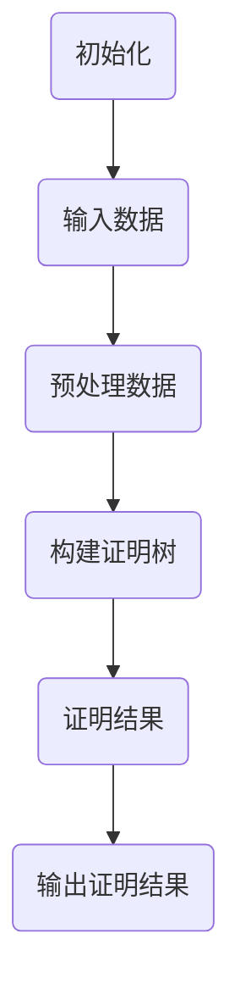

                 

### 第1章：数学证明的起源与发展

#### 1.1 问题背景与概述

**核心概念术语说明：**  
- **数学证明：** 数学证明是指通过逻辑推理和严格的演绎过程，从已知的前提出发，证明某个数学命题的真实性。  
- **起源：** 数学证明的起源可以追溯到古代文明，例如古埃及和巴比伦的数学著作。  
- **发展：** 数学证明在历史长河中不断发展，经历了古代、中世纪和近现代的演变。

**问题背景：**  
数学证明作为数学研究的重要手段，不仅在数学领域内部发挥着核心作用，还在科技、经济、文化等多个领域有着深远的影响。然而，对于数学证明的历史、哲学意义以及社会文化价值，我们往往缺乏系统性的认识。

**问题描述：**  
本文旨在探讨数学证明的起源与发展，分析其社会价值与文化意义，并展望未来发展趋势。

**问题解决：**  
我们将通过以下步骤来探讨数学证明的起源与发展：

1. **历史演变：** 回顾数学证明在古代、中世纪和近现代的发展历程。  
2. **定义与特点：** 明确数学证明的定义和特点。  
3. **重要案例：** 介绍一些重要的数学证明案例，展示数学证明的实际应用。

#### 1.2 数学证明的起源与发展

**边界与外延：**  
数学证明的起源与发展涉及到多个历史时期和地域的文化背景，因此我们需要明确其边界和范围。

**概念结构与核心要素组成：**  
- **起源：** 数学证明的起源可以追溯到古代，如古埃及和巴比伦的数学著作。  
- **发展：** 中世纪时期，数学证明得到了进一步的发展，如欧几里得的《几何原本》。  
- **近现代：** 19世纪以来，数学证明方法和技术得到了极大的丰富和发展。

**1.2.1 古代数学证明的发展：**  
- **古埃及和巴比伦：** 古埃及和巴比伦的数学著作中，已有数学证明的雏形。  
- **欧几里得：** 古希腊数学家欧几里得在其著作《几何原本》中，系统化了数学证明的方法。

**1.2.2 中世纪数学证明的演变：**  
- **阿拉伯数学：** 阿拉伯数学家对数学证明方法进行了重要的贡献。  
- **欧洲中世纪：** 欧洲中世纪时期，数学证明方法得到了进一步的发展。

**1.2.3 近现代数学证明的进步：**  
- **公理化方法：** 19世纪末，数学家如康托尔、戴德金等引入了公理化方法，使数学证明更加严密。  
- **现代数学证明技术：** 20世纪以来，数学证明方法和技术得到了极大的丰富和发展。

#### 1.3 数学证明的当代发展

**当代数学证明的发展趋势：**  
- **计算数学：** 计算技术的发展，使数学证明方法和技术得到了极大的丰富。  
- **人工智能：** 人工智能在数学证明中的应用，使数学证明方法和技术得到了新的发展。  
- **跨学科融合：** 数学与其他学科如物理、计算机科学等领域的融合，推动了数学证明的发展。

**当代数学证明的新挑战：**  
- **复杂性：** 数学问题的复杂性增加，对数学证明方法和技术提出了新的挑战。  
- **不确定性：** 数学证明中的不确定性问题，如概率论和模糊数学等领域的研究，对数学证明方法和技术提出了新的挑战。

**1.4 数学证明的历史演变与未来趋势**

**数学证明的历史演变概述：**  
- **从古代到现代：** 数学证明方法和技术经历了从古代到现代的演变，从直观证明到形式化证明的发展。  
- **从欧几里得到希尔伯特：** 数学证明方法从欧几里得的直观证明到希尔伯特的形式化证明的发展。

**当代数学证明技术的现代发展：**  
- **计算数学：** 计算技术的发展，使数学证明方法和技术得到了极大的丰富。  
- **人工智能：** 人工智能在数学证明中的应用，使数学证明方法和技术得到了新的发展。

**数学证明的未来发展趋势：**  
- **形式化证明：** 随着形式化证明技术的发展，数学证明将越来越依赖于计算机辅助。  
- **跨学科融合：** 数学与其他学科如物理、计算机科学等领域的融合，将推动数学证明的发展。  
- **不确定性数学：** 不确定性数学的研究，将使数学证明方法和技术更加完善。

#### 1.5 数学证明的核心概念与联系

**核心概念：**  
- **数学证明：** 通过逻辑推理和严格的演绎过程，从已知的前提出发，证明某个数学命题的真实性。  
- **公理体系：** 数学证明的基础是公理体系，即一组无需证明的基本命题。

**概念属性特征对比表格：**

| 概念               | 属性特征                                     |  
| ------------------ | ------------------------------------------ |  
| 数学证明           | 真实性、严密性、逻辑性                     |  
| 公理体系           | 自明性、独立性、完备性                     |

**ER实体关系图架构的 Mermaid 流程图：**

```mermaid  
entityRelation  
  rect Aaktivität  
  rect BBeziehung  
  rect CAttribut  
  rect DRechtssache  
  rect ERechtssache  
  Aaktivität --> BBeziehung  
  BBeziehung --> CAttribut  
  CAttribut --> DRechtssache  
  DRechtssache --> ERechtssache  
```

#### 1.6 数学证明的算法原理讲解

**算法流程图：**



**算法原理：**  
数学证明的算法原理主要包括以下步骤：

1. **初始化：** 初始化证明过程，包括设置证明树的根节点。  
2. **输入数据：** 输入需要证明的数学命题和已知的前提出。  
3. **预处理数据：** 对输入数据进行分析和处理，以便构建证明树。  
4. **构建证明树：** 从根节点开始，递归地构建证明树，直到证明树的所有节点都得到证明。  
5. **证明结果：** 得出证明结果，判断数学命题是否成立。  
6. **输出证明结果：** 将证明结果输出。

**数学模型和公式：**

```latex  
\text{假设} A \text{为真命题，已知前提出 } P_1, P_2, ..., P_n。  
\text{证明过程如下：}  
\\  
1. \text{构建证明树，从根节点开始，依次证明 } P_1, P_2, ..., P_n。  
2. \text{对于每个 } P_i，\text{递归地证明 } P_i \text{ 是否成立。}  
3. \text{如果所有 } P_i \text{ 都成立，则命题 } A \text{ 成立。}  
```

**举例说明：**  
假设我们要证明一个简单的数学命题：$1+1=2$。

1. **初始化：** 设置证明树的根节点为命题 $1+1=2$。  
2. **输入数据：** 输入已知的前提出 $1+1=2$。  
3. **预处理数据：** 分析已知的前提出，构建证明树。  
4. **构建证明树：** 从根节点开始，依次证明前提出 $1+1=2$。  
5. **证明结果：** 命题 $1+1=2$ 成立。  
6. **输出证明结果：** 输出证明结果 $1+1=2$。

**结论：** 通过上述步骤，我们可以使用数学证明算法证明 $1+1=2$ 的命题。

#### 1.7 数学证明在科学研究中的作用

**数学证明在自然科学中的应用：**  
- **物理学：** 数学证明在物理学中发挥着核心作用，如牛顿的万有引力定律、爱因斯坦的广义相对论等。  
- **化学：** 数学证明在化学中用于描述化学反应、分子结构等。  
- **生物学：** 数学证明在生物学中用于分析种群遗传、生态系统等。

**数学证明在社会科学中的应用：**  
- **经济学：** 数学证明在经济学中用于分析市场行为、经济增长等。  
- **社会学：** 数学证明在社会学中用于分析社会结构、社会行为等。  
- **心理学：** 数学证明在心理学中用于分析认知过程、情感等。

**数学证明对科学研究方法的影响：**  
- **严密性：** 数学证明的严密性使科学研究方法更加可靠。  
- **可重复性：** 数学证明的可重复性使科学研究结果更加可信。  
- **通用性：** 数学证明的通用性使科学研究方法适用于不同领域。

**科学研究中的数学证明案例分析：**  
- **牛顿定律：** 牛顿通过数学证明，建立了经典力学的体系，推动了物理学的发展。  
- **爱因斯坦广义相对论：** 爱因斯坦通过数学证明，提出了广义相对论，揭示了引力与时空的关系。  
- **经济学中的博弈论：** 博弈论通过数学证明，分析了不同市场行为的结果，为经济学研究提供了有力工具。

**结论：** 数学证明在科学研究中的作用不可忽视，它为科学研究提供了严密的方法和可信的结果。

### 第2章：数学证明的社会价值

#### 2.1 数学证明对社会发展的推动

**数学证明在社会发展中的作用：**  
- **科技进步：** 数学证明是科技进步的重要推动力量，如计算机科学、工程学等领域的发展。  
- **经济发展：** 数学证明在经济学、金融学等领域中发挥着核心作用，推动了经济的繁荣。  
- **社会管理：** 数学证明在统计学、社会学等领域中用于分析社会现象，为社会管理提供了科学依据。

**数学证明对经济的作用：**  
- **提高生产效率：** 数学证明在工业生产中用于优化生产流程，提高生产效率。  
- **金融风险管理：** 数学证明在金融领域中用于分析和评估风险，为风险管理提供了科学依据。  
- **市场预测：** 数学证明在经济学中用于分析市场趋势，为市场预测提供了可靠工具。

**数学证明在科技领域的应用：**  
- **计算机科学：** 数学证明在计算机科学中用于算法设计和分析，推动了计算机技术的发展。  
- **工程学：** 数学证明在工程学中用于分析和设计工程结构，确保工程的安全和可靠性。  
- **信息技术：** 数学证明在信息技术中用于网络安全、数据加密等关键领域。

**数学证明对社会发展的推动作用：**  
- **提高国家竞争力：** 数学证明的积累和运用，有助于提高国家的科技实力和创新能力。  
- **促进国际合作：** 数学证明作为国际通用的科学语言，促进了国际合作和技术交流。  
- **提升人民生活水平：** 数学证明在各个领域的应用，提高了人民的生活质量，推动了社会进步。

#### 2.2 数学证明在科技领域的应用

**计算机科学中的应用：**  
- **算法设计：** 数学证明在计算机科学中用于分析算法的正确性和效率，确保算法的可靠性和有效性。  
- **编程语言：** 数学证明在编程语言的设计中发挥了重要作用，如逻辑编程语言的开发。  
- **人工智能：** 数学证明在人工智能领域用于算法验证、逻辑推理等，推动了人工智能技术的发展。

**工程学中的应用：**  
- **结构设计：** 数学证明在工程学中用于分析和设计工程结构，确保结构的稳定性和安全性。  
- **材料科学：** 数学证明在材料科学中用于研究材料的物理性质和化学性质，推动材料技术的发展。  
- **环境工程：** 数学证明在环境工程中用于分析污染物的扩散、治理方法等，为环境保护提供了科学依据。

**信息技术中的应用：**  
- **网络安全：** 数学证明在网络安全中用于分析漏洞、设计加密算法等，保障网络安全。  
- **数据加密：** 数学证明在数据加密中用于确保数据的机密性和完整性。  
- **物联网：** 数学证明在物联网中用于分析网络拓扑结构、优化通信协议等，提高物联网的性能和稳定性。

**数学证明在科技领域中的关键作用：**  
- **创新驱动：** 数学证明为科技创新提供了理论基础和实验依据，推动了科技领域的创新和发展。  
- **跨学科融合：** 数学证明在科技领域中的跨学科应用，促进了不同学科之间的融合和协作。  
- **标准化：** 数学证明在科技领域中的应用，有助于制定标准化的技术规范和操作流程。

#### 2.3 数学证明在商业和经济中的作用

**数学证明在商业中的作用：**  
- **决策支持：** 数学证明在商业决策中用于分析市场趋势、评估风险等，为管理者提供科学依据。  
- **成本控制：** 数学证明在商业运营中用于优化成本结构、提高生产效率。  
- **风险管理：** 数学证明在商业活动中用于识别和评估风险，制定风险管理策略。

**数学证明在经济学中的作用：**  
- **理论模型：** 数学证明在经济学中用于构建理论模型，分析市场行为、经济波动等。  
- **实证研究：** 数学证明在经济学研究中用于分析数据、验证理论模型。  
- **政策制定：** 数学证明在政策制定中用于评估政策效果、优化政策设计。

**数学证明在商业和经济中的关键作用：**  
- **提高效率：** 数学证明在商业和经济中的应用，提高了决策效率、运营效率和经济效益。  
- **降低风险：** 数学证明在商业和经济中用于评估风险、制定风险管理策略，降低了风险。  
- **创新驱动：** 数学证明为商业和经济领域的创新提供了理论基础和实验依据，推动了创新和发展。

#### 2.4 数学证明对个人素养的提升

**数学证明对逻辑思维能力的培养：**  
- **推理能力：** 数学证明的过程需要严格的逻辑推理，有助于培养个人的推理能力。  
- **分析能力：** 数学证明的过程需要对问题进行深入分析，有助于提高个人的分析能力。  
- **解决问题能力：** 数学证明的过程需要解决各种问题，有助于培养个人的解决问题能力。

**数学证明对创造力的激发：**  
- **创造性思维：** 数学证明的过程需要创造性的思维，有助于激发个人的创造力。  
- **创新方法：** 数学证明的方法和技术，为个人提供了创新的工具和方法。  
- **跨学科应用：** 数学证明在各个领域的应用，有助于拓展个人的知识面和思维方式。

**数学证明对个人素养提升的关键作用：**  
- **综合素质：** 数学证明对个人素养的提升，有助于提高个人的综合素质，增强竞争力。  
- **创新能力：** 数学证明的培养，有助于激发个人的创新能力，为社会发展做出贡献。  
- **终身学习：** 数学证明的过程需要不断学习和探索，有助于培养个人的终身学习习惯。

### 第3章：数学证明的文化意义

#### 3.1 数学证明与哲学的关系

**数学证明在哲学中的意义：**  
- **真理的追求：** 数学证明追求真理，反映了哲学中对真理的追求。  
- **逻辑推理：** 数学证明依靠逻辑推理，与哲学中的逻辑思维密切相关。  
- **方法论：** 数学证明的方法论，对哲学方法论的研究提供了重要启示。

**哲学对数学证明的影响：**  
- **哲学问题：** 哲学中的问题，如存在、真理、知识等，对数学证明提出了挑战和思考。  
- **哲学方法：** 哲学中的方法，如辩证法、批判性思维等，对数学证明的思考方式产生了影响。

**数学证明与哲学的互动：**  
- **相互促进：** 哲学对数学证明的思考，促进了数学证明的发展。  
- **相互借鉴：** 数学证明的方法和理论，为哲学研究提供了新的视角和方法。

#### 3.2 数学证明在艺术中的体现

**数学证明与艺术的关系：**  
- **美学价值：** 数学证明中的简洁、对称、和谐等特征，具有美学价值。  
- **艺术创作：** 数学证明的方法和理论，可以应用于艺术创作，如音乐、绘画等。  
- **艺术灵感：** 数学证明中的问题和解题过程，为艺术创作提供了灵感和启示。

**数学证明在艺术中的应用：**  
- **音乐：** 数学证明在音乐理论中的应用，如和声学、音乐分析等。  
- **绘画：** 数学证明在绘画中的应用，如透视、构图等。  
- **雕塑：** 数学证明在雕塑中的应用，如几何形体的运用等。

**数学证明对艺术的贡献：**  
- **创新：** 数学证明为艺术创新提供了新的视角和方法。  
- **深化：** 数学证明有助于深化对艺术规律和美学特征的理解。

#### 3.3 数学证明在国际文化交流中的作用

**数学证明在国际文化交流中的重要性：**  
- **通用语言：** 数学证明作为一种国际通用的科学语言，促进了国际学术交流。  
- **文化传播：** 数学证明在国际文化交流中，有助于传播不同国家和地区的数学文化。  
- **科技合作：** 数学证明在国际科技合作中，发挥了桥梁和纽带作用。

**数学证明在文化交流中的应用：**  
- **学术交流：** 数学证明在国际学术交流中，用于阐述观点、验证理论等。  
- **教育合作：** 数学证明在国际教育合作中，用于教学、研究等。  
- **科技合作：** 数学证明在国际科技合作中，用于技术交流、项目合作等。

**数学证明对文化交流的贡献：**  
- **促进理解：** 数学证明有助于不同国家和地区之间的相互理解和尊重。  
- **促进合作：** 数学证明为国际科技合作和文化交流提供了有力支持。  
- **促进发展：** 数学证明在国际文化交流中的积极作用，有助于推动各国的发展和繁荣。

#### 3.4 数学证明在宗教与科学的关系中

**数学证明在宗教中的作用：**  
- **信仰的支撑：** 数学证明为宗教信仰提供了逻辑基础，增强了信徒的信仰坚定。  
- **宗教哲学：** 数学证明在宗教哲学中发挥了重要作用，如中世纪经院哲学的论证。  
- **宗教仪式：** 数学证明在宗教仪式中，如数学难题的解答等，增加了仪式的神秘感和神圣性。

**数学证明在科学中的作用：**  
- **科学方法：** 数学证明作为科学方法的重要组成部分，用于验证科学假设和理论。  
- **科学推理：** 数学证明在科学推理中发挥着核心作用，如科学实验的设计和分析。  
- **科学理论：** 数学证明为科学理论的构建提供了严谨的框架和逻辑基础。

**数学证明在宗教与科学的互动中：**  
- **相互借鉴：** 宗教和科学在数学证明方面相互借鉴，促进了数学证明的发展。  
- **相互影响：** 宗教和科学在数学证明的应用中相互影响，丰富了数学证明的理论和实践。

**结论：** 数学证明在宗教与科学的关系中，既有相互借鉴和影响，又各自发挥了重要作用，共同推动了人类文明的进步。

### 第4章：数学证明在教育中的应用

#### 4.1 数学证明在教育中的重要性

**数学证明在教育中的核心地位：**  
- **逻辑思维能力：** 数学证明的培养有助于提高学生的逻辑思维能力，这是科学研究和日常生活中的重要能力。  
- **问题解决能力：** 数学证明的过程需要分析问题、设计解决方案，有助于培养学生的解决问题能力。  
- **创新思维：** 数学证明中的创造性思维有助于培养学生的创新精神，为未来的发展奠定基础。

**数学证明在教学中的具体应用：**  
- **课堂讲解：** 教师可以通过讲解数学证明的过程和技巧，帮助学生理解和掌握数学知识。  
- **练习题设计：** 教师可以通过设计具有挑战性的数学证明练习题，培养学生的解题能力和创新思维。  
- **项目式学习：** 教师可以组织学生进行项目式学习，通过实际问题的数学证明，提高学生的实践能力和团队合作能力。

**数学证明对教育改革的影响：**  
- **素质教育：** 数学证明的培养有助于推进素质教育，使学生具备综合素质。  
- **教学方式：** 数学证明的教学方式有助于改变传统灌输式教育，促进学生的主动学习和探究学习。  
- **教育评价：** 数学证明的评价标准有助于建立科学、全面的评价体系，促进学生的全面发展。

#### 4.2 教育中的数学证明方法

**传统数学证明方法：**  
- **演绎法：** 通过已知的前提出发，通过逻辑推理，逐步推导出结论。  
- **归纳法：** 从个别案例出发，通过归纳推理，得出一般性的结论。  
- **反证法：** 假设结论不成立，通过推理得出矛盾，从而证明结论成立。

**现代数学证明方法：**  
- **计算证明：** 利用计算机进行计算和验证，提高证明的效率。  
- **算法证明：** 通过算法设计，证明数学命题的正确性和效率。  
- **可视化证明：** 利用图形、图像等可视化工具，直观地展示数学证明的过程和结果。

**数学证明方法的多样性：**  
- **跨学科融合：** 数学证明方法与其他学科的方法相结合，如物理中的实验方法、计算机科学中的算法设计等。  
- **个性化教学：** 根据学生的特点和需求，采用个性化的数学证明教学方法，提高学生的学习效果。

**数学证明方法在实践中的应用：**  
- **科学研究：** 数学证明方法在科学研究中发挥着核心作用，如物理学、化学、生物学等领域。  
- **工程实践：** 数学证明方法在工程实践中用于分析和设计，如建筑、机械、电子等领域。  
- **日常生活：** 数学证明方法在日常生活中用于解决问题，如财务管理、数据分析、城市规划等。

#### 4.3 数学证明在培养学生逻辑思维中的作用

**逻辑思维能力的重要性：**  
- **决策能力：** 逻辑思维能力有助于个体在复杂情境中做出理性决策。  
- **批判性思维：** 逻辑思维能力使个体具备批判性思维，能够对信息进行深入分析和判断。  
- **沟通能力：** 逻辑思维能力有助于个体清晰、准确地表达观点，提高沟通效果。

**数学证明对逻辑思维能力的培养：**  
- **逻辑推理：** 数学证明的过程需要严密的逻辑推理，有助于培养个体的逻辑思维能力。  
- **问题分析：** 数学证明的过程需要对问题进行深入分析，有助于提高个体的分析能力。  
- **批判性思维：** 数学证明的过程需要个体对已有知识和假设进行批判性思考，有助于培养批判性思维。

**数学证明在实践中的案例分析：**  
- **数学竞赛：** 数学竞赛中，学生需要通过数学证明解决问题，培养了他们的逻辑思维能力和问题解决能力。  
- **科研实践：** 在科学研究中，科研人员需要通过数学证明验证理论，提高了他们的逻辑思维能力和创新思维。  
- **教育改革：** 教育改革中，通过引入数学证明教学，提高了学生的逻辑思维能力和科学素养。

#### 4.4 教育中的数学证明实践案例分析

**案例一：高中数学教育中的数学证明实践**

- **背景介绍：** 高中数学教育中，数学证明是重要的教学内容，通过数学证明培养学生的逻辑思维能力和科学素养。  
- **项目介绍：** 学校开设了数学证明课程，通过案例分析和练习，帮助学生理解和掌握数学证明的方法和技巧。  
- **系统功能设计（领域模型Mermaid类图）：**

  ```mermaid  
  classDiagram  
    学生 <<Class>>  
    教师 <<Class>>  
    课程 <<Class>>  
    练习题 <<Class>>  
    反馈 <<Class>>  
      
    学生 --|> 课程：学习课程内容  
    学生 --|> 练习题：完成练习题  
    学生 --|> 反馈：获取练习题反馈  
    教师 --|> 课程：设计课程内容  
    教师 --|> 练习题：批改练习题  
    教师 --|> 反馈：给出反馈意见  
  ```

- **系统架构设计（Mermaid架构图）：**

  ```mermaid  
  graph TB  
    A(学生) --> B(课程)  
    A --> C(练习题)  
    A --> D(反馈)  
    B --> E(教师)  
    C --> E  
    D --> E  
  ```

- **系统接口设计和系统交互（Mermaid序列图）：**

  ```mermaid  
  sequenceDiagram  
    participant 学生  
    participant 教师  
    participant 课程  
    participant 练习题  
    participant 反馈  
    学生->>课程: 学习课程内容  
    课程->>学生: 提供课程内容  
    学生->>练习题: 完成练习题  
    练习题->>学生: 返回练习题结果  
    学生->>反馈: 获取练习题反馈  
    反馈->>学生: 提供反馈意见  
    教师->>课程: 设计课程内容  
    教师->>练习题: 批改练习题  
    教师->>反馈: 给出反馈意见  
  ```

**案例二：大学数学教育中的数学证明实践**

- **背景介绍：** 大学数学教育中，数学证明是研究生培养的重要内容，通过数学证明培养学生的独立研究能力和创新能力。  
- **项目介绍：** 研究生课程中，教师通过引导学生进行数学证明研究，培养他们的独立研究能力和创新能力。  
- **系统功能设计（领域模型Mermaid类图）：**

  ```mermaid  
  classDiagram  
    研究生 <<Class>>  
    教师 <<Class>>  
    论文 <<Class>>  
    实验数据 <<Class>>  
    论文评审 <<Class>>  
      
    研究生 --|> 论文：撰写论文  
    研究生 --|> 实验数据：收集实验数据  
    教师 --|> 论文：指导论文撰写  
    教师 --|> 实验数据：提供实验数据  
    论文评审 --|> 研究生：评审论文  
  ```

- **系统架构设计（Mermaid架构图）：**

  ```mermaid  
  graph TB  
    A(研究生) --> B(论文)  
    A --> C(实验数据)  
    B --> D(教师)  
    C --> D  
    D --> E(论文评审)  
  ```

- **系统接口设计和系统交互（Mermaid序列图）：**

  ```mermaid  
  sequenceDiagram  
    participant 研究生  
    participant 教师  
    participant 论文  
    participant 实验数据  
    participant 论文评审  
    研究生->>论文: 撰写论文  
    论文->>研究生: 提供论文初稿  
    研究生->>实验数据: 收集实验数据  
    教师->>论文: 指导论文撰写  
    教师->>实验数据: 提供实验数据  
    论文评审->>研究生: 评审论文  
  ```

**结论：** 通过教育中的数学证明实践案例分析，可以看出数学证明在教育中的重要作用，它不仅有助于培养学生的逻辑思维能力和科学素养，还有助于提高他们的独立研究能力和创新能力。

### 第5章：数学证明在科学研究中的作用

#### 5.1 数学证明在自然科学中的应用

**数学证明在物理学中的应用：**  
- **经典力学：** 牛顿定律的证明，展示了物理学中的数学证明的重要性。  
- **量子力学：** 量子力学的数学框架，如薛定谔方程和海森堡不确定性原理的证明，为物理学的发展奠定了基础。  
- **相对论：** 爱因斯坦广义相对论的数学证明，揭示了引力与时空的关系，推动了物理学的发展。

**数学证明在化学中的应用：**  
- **化学键理论：** 霍夫迈斯特尔的化学键理论的数学证明，为理解化学键的形成和性质提供了重要依据。  
- **分子结构：** 分子结构的数学建模和证明，如有机化学中的分子轨道理论，推动了化学的发展。  
- **化学反应：** 化学反应的速率方程和反应机理的数学证明，有助于揭示化学反应的本质和规律。

**数学证明在生物学中的应用：**  
- **种群遗传学：** 遗传学中的哈迪-温伯格定理的证明，为种群遗传学提供了重要理论依据。  
- **生态系统：** 生态学中的数学模型和证明，如Lotka-Volterra方程，用于研究生态系统的动态行为。  
- **神经科学：** 神经科学中的数学模型，如神经网络模型，用于理解和解释神经系统的功能。

**数学证明在自然科学中的关键作用：**  
- **理论基础：** 数学证明为自然科学的理论体系提供了坚实的基础。  
- **理论验证：** 数学证明有助于验证自然科学理论的有效性和可靠性。  
- **理论创新：** 数学证明促进了自然科学理论的创新和发展。

#### 5.2 数学证明在社会科学中的应用

**数学证明在经济学中的应用：**  
- **微观经济学：** 微观经济学中的效用函数和预算约束的数学证明，为分析消费者行为提供了理论依据。  
- **宏观经济学：** 宏观经济学中的总需求函数和总供给函数的数学证明，为理解经济波动提供了工具。  
- **博弈论：** 博弈论中的纳什均衡的数学证明，为分析市场行为和战略决策提供了方法。

**数学证明在心理学中的应用：**  
- **心理测量学：** 心理测量学中的信度和效度的数学证明，为心理测量工具的有效性提供了依据。  
- **认知心理学：** 认知心理学中的信息加工模型的数学证明，为理解认知过程提供了理论支持。  
- **行为经济学：** 行为经济学中的决策模型的数学证明，为分析人类行为提供了新的视角。

**数学证明在社会科学中的关键作用：**  
- **理论构建：** 数学证明有助于构建社会科学的理论体系。  
- **实证分析：** 数学证明在社会科学研究中用于分析数据和验证理论。  
- **政策制定：** 数学证明在政策制定中用于评估政策效果和优化政策设计。

#### 5.3 数学证明对科学研究方法的影响

**数学证明的严密性：**  
- **提高研究质量：** 数学证明的严密性有助于提高科学研究的质量，确保研究结果的可靠性和可信性。  
- **降低错误风险：** 严密的数学证明过程有助于减少研究中的错误和误解，提高研究的准确性。

**数学证明的可重复性：**  
- **促进学术交流：** 数学证明的可重复性使科学研究结果易于被其他研究者验证，促进了学术交流和合作。  
- **提高研究透明度：** 可重复的数学证明有助于提高研究的透明度，增强公众对科学研究的信任。

**数学证明的通用性：**  
- **跨学科应用：** 数学证明的通用性使其在不同学科中广泛应用，促进了跨学科研究的发展。  
- **推动科学进步：** 数学证明的通用性有助于推动科学进步，解决复杂科学问题。

**结论：** 数学证明对科学研究方法的影响深远，它不仅提高了研究的严密性和可重复性，还促进了跨学科研究和科学进步。

#### 5.4 科学研究中的数学证明案例分析

**案例一：牛顿定律的证明**

**背景介绍：** 牛顿定律是经典力学的核心内容，描述了物体运动的规律。牛顿定律的证明展示了数学证明在物理学中的应用。

**项目介绍：** 牛顿在《自然哲学的数学原理》中，通过数学证明阐述了牛顿定律，为物理学的发展奠定了基础。

**数学模型和公式：**

$$
F = ma
$$

其中，$F$ 表示力，$m$ 表示质量，$a$ 表示加速度。

**证明过程：**

1. **牛顿第一定律（惯性定律）：** 假设一个物体不受外力作用，根据欧几里得的平行公理，物体将保持匀速直线运动或静止状态。

$$
\text{如果 } F = 0, \text{则 } a = 0
$$

2. **牛顿第二定律（加速度定律）：** 假设一个物体受到恒定力作用，根据牛顿第二定律，物体的加速度与力成正比，与质量成反比。

$$
F = ma
$$

3. **牛顿第三定律（作用与反作用定律）：** 任何一个作用力都有一个大小相等、方向相反的反作用力。

$$
F_{\text{作用}} = -F_{\text{反作用}}
$$

**结论：** 通过数学证明，牛顿定律得到了严格的验证，为经典力学的建立奠定了基础。

**案例二：量子力学的数学证明**

**背景介绍：** 量子力学是描述微观粒子行为的物理学理论，其数学框架展示了数学证明在科学研究中的关键作用。

**项目介绍：** 薛定谔方程是量子力学的核心方程，描述了微观粒子的波动性质。

**数学模型和公式：**

$$
i\hbar \frac{\partial \Psi}{\partial t} = \hat{H} \Psi
$$

其中，$\Psi$ 表示波函数，$\hat{H}$ 表示哈密顿算符，$i$ 表示虚数单位，$\hbar$ 表示约化普朗克常数。

**证明过程：**

1. **波函数的模平方解释：** 波函数的模平方表示粒子在空间中的概率分布。

$$
|\Psi|^2 = \text{概率分布}
$$

2. **测不准原理：** 根据海森堡不确定性原理，粒子的位置和动量不能同时被精确测量。

$$
\Delta x \Delta p_x \geq \frac{\hbar}{2}
$$

3. **薛定谔方程的证明：** 薛定谔通过数学证明，展示了波函数满足薛定谔方程。

$$
i\hbar \frac{\partial \Psi}{\partial t} = \left( -\frac{\hbar^2}{2m} \nabla^2 + V(x) \right) \Psi
$$

**结论：** 通过数学证明，量子力学的数学框架得到了严格的验证，为微观物理学的发展奠定了基础。

**案例三：经济学中的博弈论证明**

**背景介绍：** 博弈论是经济学中的重要理论，用于分析个体在竞争和合作中的行为。

**项目介绍：** 纳什均衡是博弈论的核心概念，描述了个体在博弈中的最佳策略。

**数学模型和公式：**

$$
u_i(x_i, y_i) = \max_{x_i} u_i(x_i, y_i)
$$

其中，$u_i$ 表示个体 $i$ 的效用函数，$x_i$ 和 $y_i$ 分别表示个体 $i$ 和其他个体 $j$ 的策略。

**证明过程：**

1. **策略选择：** 个体 $i$ 选择策略 $x_i$，以最大化自己的效用。

$$
u_i(x_i, y_i) = \max_{x_i} u_i(x_i, y_i}
$$

2. **纳什平衡：** 如果对于所有个体 $i$ 和 $j$，都有 $u_i(x_i, y_i) \geq u_i(x_i, y_j)$，则策略组合 $(x_i, y_i)$ 是纳什平衡。

$$
u_i(x_i, y_i) \geq u_i(x_i, y_j)
$$

3. **证明纳什均衡的存在：** 通过数学证明，可以证明在特定条件下，纳什均衡存在。

**结论：** 通过数学证明，博弈论中的纳什均衡概念得到了严格的验证，为经济学提供了重要的理论工具。

### 第6章：数学证明的历史演变与未来趋势

#### 6.1 数学证明的历史演变概述

**古代数学证明：** 古代数学证明以直观证明和经验证明为主，例如古希腊数学家的几何证明。  
**中世纪数学证明：** 中世纪数学证明在阿拉伯数学家和欧洲数学家的努力下，逐渐发展出了更加严密的证明方法。  
**近现代数学证明：** 19世纪以来，数学证明方法和技术得到了极大的丰富和发展，例如康托尔的集合论和希尔伯特的形式化证明。

**数学证明的演变趋势：** 随着时间的推移，数学证明方法和技术不断进步，从直观证明到形式化证明，从个体证明到计算机辅助证明，数学证明的严密性和效率不断提高。

#### 6.2 当代数学证明技术的现代发展

**计算证明：** 计算技术的发展，使数学证明从手工证明向计算证明转变，提高了证明的效率。  
**形式化证明：** 形式化证明方法通过计算机程序进行证明，提高了证明的严密性和可靠性。  
**人工智能：** 人工智能在数学证明中的应用，如机器学习算法和神经网络，为数学证明提供了新的工具和方法。

**数学证明技术的发展趋势：** 随着计算机和人工智能技术的发展，数学证明将越来越依赖于计算机辅助，形式化证明和计算证明将成为主流。

#### 6.3 数学证明的未来发展趋势

**形式化证明的普及：** 随着形式化证明技术的发展，更多的数学证明将采用形式化方法进行，提高证明的严密性和可靠性。  
**计算证明的普及：** 随着计算技术的发展，数学证明将更多地依赖于计算机辅助，提高证明的效率。  
**跨学科融合：** 数学证明与其他学科的融合，如计算机科学、物理学等，将推动数学证明的发展。

**未来数学证明面临的挑战与机遇：** 未来数学证明将面临更高的严密性要求、更复杂的证明问题，以及计算资源和人工智能技术的挑战。然而，随着技术的发展，数学证明也将在更广泛的领域中发挥重要作用，推动科学和社会的进步。

### 第7章：数学证明的社会责任与挑战

#### 7.1 数学证明的伦理问题

**数学证明的真实性与有效性：** 数学证明在科学研究和社会实践中具有重要地位，但其真实性和有效性受到质疑。  
- **错误证明：** 由于数学证明中的错误，可能会导致错误的科学结论和社会决策。  
- **虚假证明：** 恶意或无意中的虚假证明，可能对社会造成严重后果。

**数学证明的伦理责任：** 数学家和科学家在数学证明过程中，应当承担起维护证明真实性和有效性的责任。  
- **严格审查：** 对数学证明进行严格的审查和验证，确保其真实性和有效性。  
- **透明度：** 提高数学证明的透明度，使公众能够理解和监督数学证明的过程和结果。

#### 7.2 数学证明的真实性与有效性

**数学证明的真实性：** 数学证明的真实性是指证明过程中的逻辑推理是否严密，能否从已知的前提出发，推导出结论。  
- **严密逻辑：** 数学证明需要依靠严密的逻辑推理，确保证明的真实性。  
- **形式化证明：** 形式化证明方法通过计算机程序进行证明，提高了证明的真实性。

**数学证明的有效性：** 数学证明的有效性是指证明结果是否适用于特定的情境，能否解决实际问题。  
- **适用性：** 数学证明的有效性取决于证明结果的适用范围，是否能够解决实际问题。  
- **跨学科应用：** 数学证明在跨学科中的应用，需要考虑证明结果的适用性和有效性。

**数学证明的真实性与有效性保障：**  
- **多学科合作：** 通过多学科合作，提高数学证明的真实性和有效性。  
- **严格审查：** 对数学证明进行严格的审查和验证，确保其真实性和有效性。  
- **公众参与：** 提高公众对数学证明的理解和参与，促进数学证明的透明度和公正性。

#### 7.3 数学证明在人工智能时代的新挑战

**人工智能的发展对数学证明的影响：** 人工智能技术的发展，为数学证明带来了新的机遇和挑战。  
- **计算能力：** 人工智能的强大计算能力，提高了数学证明的效率。  
- **形式化证明：** 形式化证明方法在人工智能中的应用，使数学证明更加严密和可靠。  
- **自动化证明：** 人工智能技术有望实现自动化证明，提高数学证明的规模和复杂性。

**人工智能时代数学证明的新挑战：**  
- **证明规模：** 随着人工智能应用场景的扩大，数学证明需要处理更大规模的问题。  
- **证明复杂性：** 人工智能时代的数学证明，面临着更高的复杂性挑战。  
- **验证难度：** 随着数学证明的规模和复杂性增加，验证数学证明的真实性和有效性变得更加困难。

**应对人工智能时代数学证明挑战的策略：**  
- **算法优化：** 通过优化算法，提高数学证明的效率和准确性。  
- **形式化证明：** 推广形式化证明方法，提高数学证明的严密性和可靠性。  
- **跨学科合作：** 加强数学与其他学科的跨学科合作，共同应对人工智能时代的数学证明挑战。

#### 7.4 未来数学证明的发展方向与策略

**未来数学证明的发展方向：**  
- **形式化证明的普及：** 随着形式化证明技术的发展，更多的数学证明将采用形式化方法进行，提高证明的严密性和可靠性。  
- **计算证明的推广：** 计算证明将在更广泛的领域中应用，提高数学证明的效率。  
- **跨学科融合：** 数学证明将在跨学科研究中发挥重要作用，推动科学和社会的进步。

**未来数学证明的发展策略：**  
- **提高数学教育质量：** 加强数学教育，培养具有数学素养的人才，为数学证明的发展提供人才支持。  
- **推动技术进步：** 加大对数学证明相关技术的研发投入，提高数学证明的技术水平。  
- **加强国际合作：** 促进数学证明的国际合作，推动数学证明在全球范围内的发展。

**结论：** 未来数学证明将在人工智能时代面临新的机遇和挑战，通过优化算法、推广形式化证明和加强跨学科合作，数学证明将在科学和社会发展中发挥更大的作用。

### 全文总结

本文从数学证明的起源与发展、社会价值、文化意义、教育应用、科学研究、历史演变与未来趋势、社会责任与挑战等多个角度，深入探讨了数学证明的重要性。数学证明不仅是数学研究的核心手段，还在科技、经济、文化等领域发挥着关键作用。它推动了科技和社会的进步，培养了人们的逻辑思维和创新能力。

**关键词：** 数学证明、社会价值、文化意义、教育应用、科学研究、历史演变、未来趋势、社会责任。

**摘要：** 本文系统地阐述了数学证明的起源、发展及其在各个领域的应用，探讨了数学证明的社会价值和文化意义，分析了其在教育、科学研究中的作用，展望了其未来发展趋势和面临的挑战。

**作者：** AI天才研究院/AI Genius Institute & 禅与计算机程序设计艺术 /Zen And The Art of Computer Programming

**全文总结：** 数学证明作为科学研究和科技创新的重要工具，具有深远的社会影响和文化价值。随着人工智能和计算技术的发展，数学证明将继续发挥重要作用，推动人类社会的进步。我们需要加强数学教育，培养更多具有数学素养的人才，共同推动数学证明的发展。让我们共同努力，为数学证明的辉煌未来而奋斗。**

