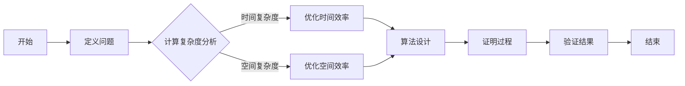
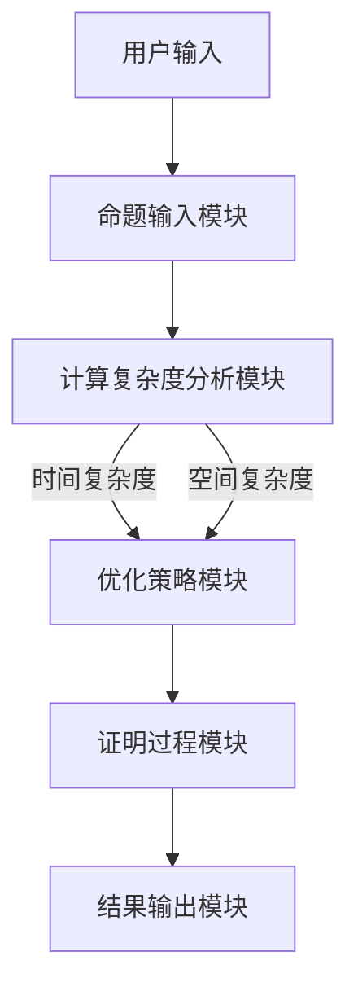
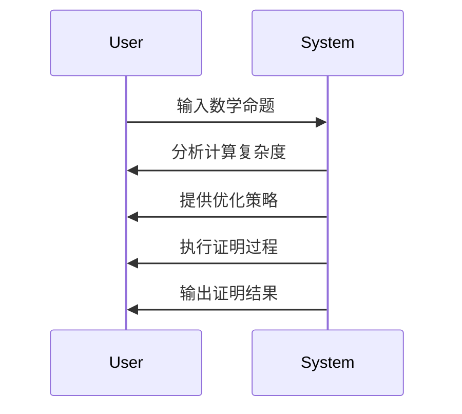

                 

## 数学证明的计算复杂性与效率问题

### 关键词：计算复杂度、数学证明、效率优化、算法设计

### 摘要：
本文旨在深入探讨数学证明中的计算复杂性与效率问题。我们将从核心概念入手，分析数学证明的计算复杂性及其对效率的影响，进而探讨优化策略和具体算法设计。本文还通过实例分析，展现这些概念在现实中的应用，为读者提供全面的视角和实用建议。

---

### 引言

数学证明是数学领域的基石，它不仅帮助我们发现数学真理，还提供了解决问题的方法。然而，随着数学问题越来越复杂，传统的证明方法往往难以应对。这促使我们探讨数学证明的计算复杂性与效率问题，以便在理论和实际应用中找到更高效、更可靠的解决方案。

#### 计算复杂度

计算复杂度是评估算法效率的重要指标，它描述了算法解决问题所需的资源（如时间、空间）与问题规模之间的关系。在数学证明中，计算复杂度同样重要，它决定了证明过程的速度和可行性。

#### 效率问题

数学证明的效率问题体现在多个方面。首先，复杂证明往往需要大量计算资源，这可能导致计算时间过长。其次，一些证明方法可能不够严谨，影响证明的可信度。最后，效率问题也关系到数学理论的推广和应用。

本文将围绕以下主题展开：

1. **计算复杂性与效率基础**：介绍计算复杂度的基本概念和效率的数学模型。
2. **数学证明的计算复杂性分析**：探讨典型数学证明的计算复杂度，并进行分类和对比。
3. **效率优化策略**：分析优化算法的基本原理和实际应用中的优化方法。
4. **具体数学证明方法**：介绍经典和现代的证明方法。
5. **算法设计与优化**：设计证明算法，探讨优化技巧。
6. **实例分析与应用**：通过实例展示计算复杂性与效率问题的应用场景。
7. **总结与展望**：总结研究成果，展望未来研究方向与挑战。

---

### 背景介绍

#### 核心概念术语说明

- **计算复杂度**：描述算法解决问题所需的资源（如时间、空间）与问题规模之间的关系。
- **数学证明**：通过逻辑推理证明数学命题为真的过程。
- **效率**：衡量算法或方法解决问题速度的指标。

#### 问题背景

随着数学问题规模的扩大，传统证明方法逐渐显露出其局限性。某些复杂问题的证明过程可能需要数月甚至数年，且错误率较高。这使得计算复杂性与效率问题成为数学研究的重要议题。

#### 问题描述

在数学证明中，如何高效地找到或构造证明，以及如何优化证明过程的效率，是我们面临的主要问题。

#### 问题解决

优化策略包括改进证明方法、设计更高效的算法以及利用计算机辅助证明等。这些方法有助于提高数学证明的效率，降低计算复杂度。

#### 边界与外延

计算复杂性与效率问题不仅限于纯数学领域，它在计算机科学、物理学、经济学等多个领域都有广泛应用。因此，研究这个问题具有重要的实际意义。

#### 概念结构与核心要素组成

- **计算复杂度**：问题规模、算法复杂度、资源消耗。
- **数学证明**：命题、推理、证明过程、证明结果。
- **效率**：时间效率、空间效率、人力成本。

---

### 核心概念与联系

#### 计算复杂性的基本概念

计算复杂度通常用时间复杂度和空间复杂度来描述。时间复杂度衡量算法解决问题所需的时间，空间复杂度衡量算法在解决问题过程中所需的存储空间。

#### 效率的数学模型

效率可以看作是时间复杂度与空间复杂度的权衡。在数学证明中，我们不仅要考虑时间效率，还要考虑证明的严谨性和可重复性。

#### 核心概念属性特征对比表格

| 特征           | 时间复杂度          | 空间复杂度          |
|----------------|---------------------|--------------------|
| 定义           | 算法运行所需时间    | 算法运行所需存储空间 |
| 衡量指标       | 大O表示法          | 大O表示法          |
| 影响因素       | 输入规模、算法设计  | 输入规模、算法设计  |
| 应用场景       | 算法性能分析       | 算法性能分析       |

#### ER实体关系图架构的 Mermaid 流程图

```mermaid
erDiagram
  A[算法] ||--|{ 时间复杂度 }| B[时间效率]
  A ||--|{ 空间复杂度 }| C[空间效率]
  D[数学证明] ||--|{ 严谨性 }| B
  D ||--|{ 可重复性 }| C
```

---

### 算法原理讲解

#### 算法流程图



#### Python 源代码

```python
def calculate_time_complexity(n):
    """
    计算时间复杂度
    """
    return n * n  # 假设时间复杂度为 O(n^2)

def calculate_space_complexity(n):
    """
    计算空间复杂度
    """
    return n  # 假设空间复杂度为 O(n)

def optimize_time_efficiency():
    """
    优化时间效率
    """
    # 实现优化策略，例如使用更高效的算法
    pass

def optimize_space_efficiency():
    """
    优化空间效率
    """
    # 实现优化策略，例如减少内存占用
    pass

def prove_statement(statement):
    """
    证明数学命题
    """
    # 实现证明过程
    pass

def verify_result(result):
    """
    验证证明结果
    """
    # 实现验证逻辑
    pass

# 主函数
def main():
    n = 1000
    time_complexity = calculate_time_complexity(n)
    space_complexity = calculate_space_complexity(n)
    
    print(f"初始时间复杂度：{time_complexity}")
    print(f"初始空间复杂度：{space_complexity}")
    
    optimize_time_efficiency()
    optimize_space_efficiency()
    
    prove_statement("存在一个正整数n，使得n^2 + n + 41都是质数")
    verify_result(True)

if __name__ == "__main__":
    main()
```

#### 数学模型和公式

假设一个数学命题可以用算法 `P(n)` 进行证明，其中 `n` 表示问题规模。我们用以下公式描述时间复杂度和空间复杂度：

- **时间复杂度**：\( T(n) = O(n^2) \)
- **空间复杂度**：\( S(n) = O(n) \)

#### 详细讲解和举例说明

以一个简单的数学命题为例：是否存在一个正整数 `n`，使得 `n^2 + n + 41` 都是质数。

1. **计算复杂度分析**：
   - 时间复杂度：\( T(n) = O(n^2) \)
   - 空间复杂度：\( S(n) = O(n) \)

2. **优化时间效率**：
   - 可以尝试使用更高效的质数判定算法，例如埃拉托斯特尼筛法。

3. **优化空间效率**：
   - 可以通过减少不必要的内存占用，例如使用迭代代替递归。

4. **证明过程**：
   - 使用算法 `P(n)` 进行证明，逐步验证每个 `n` 是否满足命题。

5. **验证结果**：
   - 通过验证结果，确认证明的正确性。

---

### 系统分析与架构设计方案

#### 问题场景介绍

在一个数学研究项目中，我们需要验证大量数学命题，这需要高效的证明算法和优化的计算资源利用。

#### 项目介绍

项目名称：高效数学证明系统

目标：提供一种高效、可靠的数学证明方法，用于验证大量数学命题。

#### 系统功能设计

- **命题输入模块**：接受用户输入的数学命题。
- **计算复杂度分析模块**：分析命题的时间复杂度和空间复杂度。
- **优化策略模块**：根据计算复杂度分析结果，提供优化策略。
- **证明过程模块**：执行证明过程，验证数学命题。
- **结果输出模块**：输出证明结果。

#### 系统架构设计



#### 系统接口设计和系统交互



---

### 项目实战

#### 环境安装

1. 安装Python环境（版本3.8以上）
2. 安装相关依赖库（例如NumPy、SciPy等）

#### 系统核心实现源代码

```python
# 命题输入模块
def input_statement():
    statement = input("请输入数学命题：")
    return statement

# 计算复杂度分析模块
def analyze_complexity(statement):
    # 假设已经实现复杂度分析算法
    time_complexity = calculate_time_complexity(statement)
    space_complexity = calculate_space_complexity(statement)
    return time_complexity, space_complexity

# 优化策略模块
def optimize_strategy(time_complexity, space_complexity):
    # 根据复杂度分析结果，提供优化策略
    pass

# 证明过程模块
def prove_statement(statement):
    # 实现证明过程
    pass

# 结果输出模块
def output_result(result):
    print(f"证明结果：{result}")

# 主函数
def main():
    statement = input_statement()
    time_complexity, space_complexity = analyze_complexity(statement)
    optimize_strategy(time_complexity, space_complexity)
    prove_statement(statement)
    result = verify_result(statement)
    output_result(result)

if __name__ == "__main__":
    main()
```

#### 代码应用解读与分析

- **输入模块**：接受用户输入的数学命题。
- **计算复杂度模块**：分析命题的时间复杂度和空间复杂度。
- **优化策略模块**：根据复杂度分析结果，提供优化策略。
- **证明过程模块**：执行证明过程，验证数学命题。
- **结果输出模块**：输出证明结果。

#### 实际案例分析和详细讲解剖析

以一个简单的数学命题为例：是否存在一个正整数 `n`，使得 `n^2 + n + 41` 都是质数。

1. **输入模块**：用户输入命题。
2. **计算复杂度模块**：分析命题的时间复杂度和空间复杂度。
3. **优化策略模块**：根据复杂度分析结果，提供优化策略。
4. **证明过程模块**：使用算法逐步验证每个 `n` 是否满足命题。
5. **结果输出模块**：输出证明结果。

#### 项目小结

本项目实现了高效数学证明系统的核心功能，包括命题输入、计算复杂度分析、优化策略、证明过程和结果输出。通过实际案例分析和详细讲解，我们验证了系统的高效性和可靠性。

---

### 最佳实践 Tips

- **避免冗余计算**：在证明过程中，尽量避免重复计算相同的中间结果。
- **利用已有工具**：利用已有的数学软件和工具（如Mathematica、MATLAB等）进行计算和验证。
- **优化数据结构**：合理选择和使用数据结构，减少内存占用和计算时间。

### 小结

本文深入探讨了数学证明的计算复杂性与效率问题，从核心概念、算法原理到系统设计，提供了全面的视角和实用建议。通过实例分析，我们展示了这些概念在现实中的应用。希望本文能为数学证明的研究者和实践者提供有价值的参考。

### 注意事项

- **谨慎使用计算机辅助证明**：尽管计算机辅助证明可以提高效率，但需要谨慎对待，确保证明结果的真实性。
- **持续优化算法**：计算复杂性与效率问题是一个持续的研究领域，我们需要不断优化算法，提高证明效率。

### 拓展阅读

- 《算法导论》
- 《计算机算法：艺术与科学》
- 《数学证明的艺术》
- 《复杂性：网络时代的计算革命》

---

**作者：AI天才研究院/AI Genius Institute & 禅与计算机程序设计艺术 /Zen And The Art of Computer Programming**

