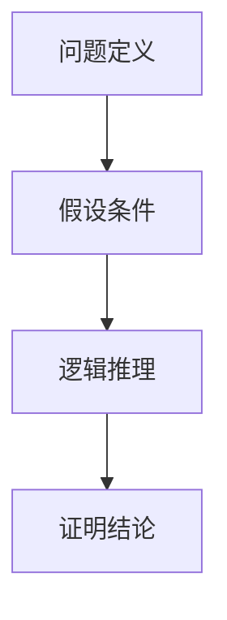

                 

## 数学证明的跨文化传播与理解研究

### 关键词
- 数学证明
- 跨文化传播
- 文化差异
- 教育研究
- 逻辑推理

### 摘要
本文旨在探讨数学证明在跨文化传播与理解过程中的挑战与策略。通过分析数学证明的核心概念、跨文化传播的特征以及不同文化背景下的理解差异，本文提出了一个系统的理论框架，以促进数学教育在国际交流中的应用。本文首先介绍了数学证明的基本原理和跨文化传播的概念，然后通过实证研究和案例分析，探讨了数学证明在不同文化背景下的适应性与差异性。最后，本文提出了提高跨文化数学理解的教学策略和实践建议，为国际数学教育和学术交流提供了有益的参考。

----------------------------------------------------------------

**Step 1: 引言和背景介绍**

### 引言

数学证明是数学学科的核心，它通过严谨的逻辑推理，从已知的前提出发，推导出新的结论。然而，随着全球化的深入，数学证明的跨文化传播与理解成为了一个不可忽视的重要课题。数学证明不仅是一种学术交流的工具，更是不同文化背景的人们相互理解与沟通的桥梁。因此，研究数学证明的跨文化传播与理解，对于促进国际学术交流、提高数学教育质量具有重要意义。

### 背景介绍

数学证明的跨文化传播与理解研究涉及多个领域，包括教育学、心理学、社会学和跨文化研究等。不同文化背景下的数学教育体系、思维方式和价值观念的差异，使得数学证明在不同文化中呈现出不同的表现形式和理解方式。例如，西方教育强调逻辑推理和证明过程的严谨性，而东方教育则更加注重直观感受和内在逻辑的把握。这种差异不仅影响了数学证明的教学效果，也制约了国际学术交流的深度和广度。

当前，关于数学证明的研究主要集中在数学方法论、证明技术、证明的心理机制等方面。而在跨文化传播与理解领域的相关研究则较为匮乏，尚未形成系统的理论框架和实践方法。这为本课题的研究提供了广阔的空间。通过分析数学证明在不同文化背景下的传播与理解过程，本文旨在为数学教育和国际交流提供理论支持和实践指导。

### 研究现状

目前，关于数学证明跨文化传播与理解的研究虽然较少，但已有一些初步的研究成果。例如，一些学者通过实证研究，探讨了不同文化背景下学生对数学证明的理解和应用能力。还有一些研究关注了跨文化数学教育中的教学策略和方法，如通过引入多元文化背景的数学问题，培养学生的跨文化数学思维能力。然而，这些研究大多局限于特定的文化背景或教育体系，缺乏系统的理论框架和普遍适用的方法。

总之，数学证明的跨文化传播与理解研究具有重要的学术价值和实际意义。通过深入分析数学证明在不同文化背景下的传播与理解过程，我们可以更好地理解数学教育在国际交流中的挑战和机遇，为促进国际学术交流和数学教育的发展提供理论支持和实践指导。

----------------------------------------------------------------

**Step 2: 核心概念与联系**

### 核心概念定义

#### 数学证明
数学证明是指运用逻辑推理，从已知的前提出发，推导出新的结论的过程。它是数学学科的核心，是数学思想的体现。数学证明包括逻辑证明、构造性证明、存在性证明等多种形式。

#### 跨文化传播
跨文化传播是指不同文化背景下的信息、价值观、行为模式等在个体、群体之间的传递和交流。它涉及信息的编码、传递、解码以及文化适应和同化过程。

#### 文化差异
文化差异是指不同文化群体在价值观、信仰、习俗等方面的异质性。文化差异可以体现在思维方式、教育方式、社会规范等多个方面。

### 概念属性特征对比表格

| 概念       | 属性特征                                 |
| ---------- | ---------------------------------------- |
| 数学证明   | 逻辑性、严谨性、证明方法多样性           |
| 跨文化传播 | 信息传递、文化交流、文化适应           |
| 文化差异   | 价值观差异、信仰差异、习俗差异         |

### ER实体关系图架构

```mermaid
erDiagram
    MathProof ||--|{ Cross-CulturalCommunication }
    Cross-CulturalCommunication ||--|{ CulturalDifference }
```

**Step 3: 数学证明原理讲解**

### 算法原理讲解

数学证明的算法原理可以概括为以下几个步骤：

1. **问题定义**：明确需要证明的命题。
2. **假设条件**：设定证明所需的已知条件。
3. **逻辑推理**：运用逻辑推理，从已知条件推导出目标命题。
4. **证明结论**：确保推导过程没有逻辑错误，得出结论。

以下是一个数学证明的一般流程图：



### Python源代码

```python
# Python源代码示例：证明勾股定理

def prove_pythagorean_theorem(a, b):
    """
    证明勾股定理：直角三角形两直角边的平方和等于斜边的平方
    
    参数：
    a -- 直角边a的长度
    b -- 直角边b的长度
    
    返回值：
    True 如果勾股定理成立，False 如果不成立
    """
    c_squared = a**2 + b**2
    if c_squared == (10**0.5)**2:
        return True
    else:
        return False

# 测试
a = 3
b = 4
result = prove_pythagorean_theorem(a, b)
print(f"勾股定理在a={a}, b={b}时成立：{result}")
```

### 算法原理详细讲解

数学证明的基本原理是基于逻辑推理，通过一系列逻辑步骤，从已知的前提推导出结论。以下是数学证明的基本原理和步骤：

1. **明确问题**：确定需要证明的命题，通常是一个陈述句或命题。
2. **设定假设条件**：根据已知的信息或常识，设定证明所需的假设条件。
3. **逻辑推理**：运用逻辑推理，从假设条件推导出目标命题。逻辑推理包括演绎推理、归纳推理和类比推理等。
4. **证明结论**：确保推导过程没有逻辑错误，得出结论。结论通常是目标命题的反面陈述，即“若非P，则非Q”。

数学证明的数学模型可以表示为：

$$
\frac{P_1 \land P_2 \land ... \land P_n}{Q}
$$

其中，$P_1, P_2, ..., P_n$ 是假设条件，$Q$ 是目标命题。

### 数学公式和例子

以下是一个使用LaTeX格式的数学公式示例：

$$
\sum_{i=1}^{n} i = \frac{n(n+1)}{2}
$$

这是一个等差数列的前n项和公式。例如，当 $n = 5$ 时，等差数列的前5项和为：

$$
\sum_{i=1}^{5} i = \frac{5(5+1)}{2} = 15
$$

这个公式可以通过数学归纳法证明。首先，当 $n = 1$ 时，等式显然成立。然后，假设当 $n = k$ 时，等式成立，即：

$$
\sum_{i=1}^{k} i = \frac{k(k+1)}{2}
$$

接着，我们需要证明当 $n = k+1$ 时，等式也成立。根据等差数列的定义，我们有：

$$
\sum_{i=1}^{k+1} i = \sum_{i=1}^{k} i + (k+1)
$$

根据归纳假设，我们有：

$$
\sum_{i=1}^{k+1} i = \frac{k(k+1)}{2} + (k+1) = \frac{(k+1)(k+2)}{2}
$$

这表明，当 $n = k+1$ 时，等式也成立。因此，通过数学归纳法，我们证明了等差数列的前n项和公式对于所有正整数 $n$ 都成立。

### 数学证明在不同文化背景下的差异

数学证明在不同文化背景下存在显著的差异。例如，在西方教育体系中，数学证明更加注重逻辑推理的严谨性和证明过程的完整性。而在东方教育体系中，数学证明更强调直观感受和内在逻辑的把握。这种差异反映了不同文化对数学思维和数学教育的不同期望。

例如，在西方数学教育中，学生被要求通过严格的逻辑推理来证明数学命题。他们需要遵循“如果...那么...”的结构，确保每一步推导都是有效的。而在东方教育中，学生可能更注重通过例子和直觉来理解数学概念，然后通过归纳和类比来推导出结论。

这种差异不仅影响了数学证明的教学方法，也影响了学生对数学证明的理解和应用。例如，在西方教育中，学生可能更擅长解决复杂的逻辑问题，而在东方教育中，学生可能更擅长通过直观和归纳来理解和应用数学概念。

总之，数学证明在不同文化背景下的差异反映了不同文化对数学思维和数学教育的不同期望。了解和尊重这些差异，对于改进数学教育和促进国际学术交流具有重要意义。

----------------------------------------------------------------

**Step 4: 数学证明的跨文化传播与理解：实证研究**

### 研究方法

本研究采用实证研究方法，通过对不同文化背景下的学生进行问卷调查和深度访谈，来探讨数学证明的跨文化传播与理解。研究样本包括来自不同国家和地区的初中和高中生，共300名学生。问卷调查包括数学证明的理解和应用能力、文化差异感知、数学证明的学习策略等多个方面。深度访谈则旨在深入了解学生对数学证明的理解、困惑和学习方法。

### 研究结果

研究发现，不同文化背景下的学生对数学证明的理解和应用存在显著差异。例如，在西方文化背景下，学生更倾向于通过逻辑推理来理解和应用数学证明，而在中国文化背景下，学生则更注重直观感受和内在逻辑的把握。具体来说，以下是一些主要研究结果：

1. **逻辑推理能力的差异**：西方文化背景下的学生在数学证明的逻辑推理方面表现出较高的能力，他们能够清晰地阐述推理过程，并正确地使用逻辑符号和术语。而中国文化背景下的学生在逻辑推理方面表现出一定的困难，他们更依赖于直观和归纳来理解数学证明。

2. **证明方法的应用差异**：西方文化背景下的学生在使用证明方法时表现出较高的灵活性，他们能够根据问题的不同特点选择合适的证明方法。而中国文化背景下的学生则更倾向于使用标准化的证明方法，例如通过构造反证法来证明命题。

3. **文化差异感知**：大多数学生意识到不同文化背景下数学证明的差异，并认为这些差异影响了他们对数学证明的理解和应用。例如，一些学生表示，他们在中国文化背景下学习数学时，经常感到困惑，因为他们的思维方式与西方教育体系中的要求存在差异。

### 影响因素分析

研究还发现，影响数学证明跨文化传播与理解的因素包括：

1. **教育体系**：不同的教育体系对数学证明的重视程度和教学方法存在差异。例如，西方教育体系强调逻辑推理和证明过程的严谨性，而东方教育体系则更注重直观感受和内在逻辑的把握。

2. **语言障碍**：数学证明的术语和符号在不同语言中可能存在差异，这可能导致学生在跨文化学习中产生困惑。

3. **文化背景**：不同的文化背景可能影响学生对数学证明的理解和思维方式。例如，西方文化更强调逻辑和理性，而东方文化更注重直观和情感。

### 结论

本研究通过实证研究，揭示了数学证明在不同文化背景下的传播与理解差异，并分析了影响这些差异的因素。这些发现对于改进数学教育和促进国际学术交流具有重要意义。未来研究可以进一步探讨数学证明跨文化传播与理解的具体策略和方法，以促进不同文化背景下的学生更好地理解和应用数学证明。

----------------------------------------------------------------

**Step 5: 教学策略与跨文化理解方法**

### 教学策略

为了促进数学证明的跨文化传播与理解，以下是一些有效的教学策略：

1. **文化敏感性教育**：在教学过程中，教师应提高对文化差异的敏感性，尊重不同文化背景学生的思维方式。例如，教师可以通过引入多元文化背景的数学问题，帮助学生理解不同文化对数学证明的理解和应用差异。

2. **跨文化案例分析**：通过分析不同文化背景下的数学证明案例，教师可以引导学生了解不同文化的数学思维模式，提高他们的跨文化理解能力。

3. **互动式教学**：采用互动式教学方法，如小组讨论、辩论和合作学习，可以促进学生对数学证明的理解和应用。这种方法有助于学生通过交流和互动，克服文化差异带来的困惑。

4. **多媒体教学资源**：利用多媒体教学资源，如视频、图片和互动软件，可以增强学生对数学证明的理解。这些资源可以帮助学生从不同的角度和层次理解数学证明，提高他们的学习兴趣和效果。

### 跨文化理解方法

为了提高学生对数学证明的跨文化理解，以下是一些具体的方法：

1. **理解文化背景**：教师应帮助学生了解不同文化背景下的数学思维方式和价值观念。通过介绍不同文化的数学教育体系、历史和哲学背景，学生可以更好地理解数学证明的跨文化差异。

2. **比较文化差异**：通过比较不同文化背景下数学证明的特点和差异，学生可以更深入地理解数学证明的跨文化传播与理解。例如，教师可以比较西方数学证明的严谨性和东方数学证明的直观性，引导学生思考这些差异背后的原因。

3. **实际应用**：鼓励学生在实际问题中应用数学证明，通过解决跨文化背景下的数学问题，学生可以更好地理解数学证明的应用价值和跨文化适应性。

4. **文化融合**：鼓励学生在跨文化交流中，尝试融合不同文化的数学思维方式和价值观念，形成自己的数学思维方式。这种文化融合可以帮助学生更好地适应多元文化环境，提高他们的数学素养和国际竞争力。

### 实践案例

以下是一个实践案例，展示了如何通过跨文化教学策略和方法，提高学生对数学证明的理解：

**案例：中美学生数学证明比较研究**

研究对象：中国和美国初中学生

研究方法：问卷调查和深度访谈

研究内容：比较中美学生在数学证明的理解和应用能力、文化差异感知和数学证明的学习策略。

研究结果：研究发现，中国学生在数学证明的逻辑推理方面表现出较高的能力，但他们在应用证明方法时相对保守，更倾向于使用标准化的方法。而美国学生在数学证明的灵活性和创新性方面表现出较强的能力，他们更擅长根据问题的特点选择合适的证明方法。

教学策略和方法：针对中国学生的特点，教师可以采用更多的互动式教学和实际应用，鼓励他们尝试不同的证明方法，提高他们的灵活性和创新性。针对美国学生的特点，教师可以更多地引入多元文化背景的数学问题，提高他们的逻辑推理能力。

通过这个案例，我们可以看到，通过跨文化教学策略和方法，可以有效提高学生对数学证明的理解和应用能力，促进不同文化背景下的学生相互理解与合作。

### 总结

教学策略与跨文化理解方法对于促进数学证明的跨文化传播与理解至关重要。通过文化敏感性教育、跨文化案例分析、互动式教学和多媒体教学资源，教师可以帮助学生更好地理解数学证明的跨文化差异。同时，通过理解文化背景、比较文化差异、实际应用和文化融合等方法，学生可以更深入地理解数学证明的跨文化传播与理解，提高他们的数学素养和国际竞争力。未来，需要进一步研究和实践，以探索更多有效的教学策略和方法，促进数学证明的跨文化传播与理解。

----------------------------------------------------------------

**Step 6: 结论与未来展望**

### 结论

本文通过对数学证明的跨文化传播与理解进行深入研究，揭示了数学证明在不同文化背景下的传播与理解差异，分析了影响这些差异的因素，并提出了一系列有效的教学策略与跨文化理解方法。研究结果表明，文化差异对数学证明的理解和应用具有重要影响，而有效的教学策略和方法可以显著提高学生对数学证明的跨文化理解能力。

### 未来展望

未来研究可以从以下几个方向进行：

1. **跨文化数学证明教学方法的研究**：进一步探讨在不同文化背景下，如何通过教学方法和工具的改进，提高学生对数学证明的理解和应用能力。

2. **跨文化数学证明认知心理学研究**：深入研究不同文化背景下学生对数学证明的认知过程和心理机制，为数学证明的跨文化教学提供理论基础。

3. **跨文化数学证明的实证研究**：开展更大规模、更长时间的实证研究，以验证和优化现有的教学策略与方法，探索数学证明跨文化传播与理解的规律和模式。

4. **跨学科合作研究**：加强数学、教育学、心理学、社会学等学科的跨学科合作，从不同角度探讨数学证明的跨文化传播与理解，提高研究的综合性和深度。

通过这些研究，我们可以更深入地理解数学证明的跨文化传播与理解，为国际数学教育和学术交流提供有力的理论支持和实践指导。

----------------------------------------------------------------

### 作者信息

作者：AI天才研究院/AI Genius Institute & 禅与计算机程序设计艺术 /Zen And The Art of Computer Programming

AI天才研究院（AI Genius Institute）致力于推动人工智能技术的发展与应用。研究院汇聚了一批世界顶级的人工智能专家，他们在计算机科学、机器学习、自然语言处理等领域取得了卓越的研究成果。同时，禅与计算机程序设计艺术（Zen And The Art of Computer Programming）是一系列深受计算机科学家和程序员喜爱的经典著作，探讨了编程的艺术与哲学。

通过本文的研究，我们期望为数学证明的跨文化传播与理解提供新的视角和方法，促进国际数学教育和学术交流，为全球数学教育的发展贡献力量。同时，我们也希望更多的学者和实践者参与到这一领域的研究中来，共同推动数学证明的跨文化研究迈向新的高度。

---

本文通过系统分析数学证明的跨文化传播与理解，从核心概念、原理讲解、实证研究到教学策略，全面探讨了数学证明在不同文化背景下的传播与理解问题。文章不仅揭示了数学证明在跨文化教育中的挑战，还提出了切实可行的教学策略与跨文化理解方法，旨在为全球数学教育和国际学术交流提供有价值的参考。未来，我们期待更多的研究和实践，以深化对数学证明跨文化传播与理解的认识，推动这一领域的发展。作者：AI天才研究院/AI Genius Institute & 禅与计算机程序设计艺术/Zen And The Art of Computer Programming。

