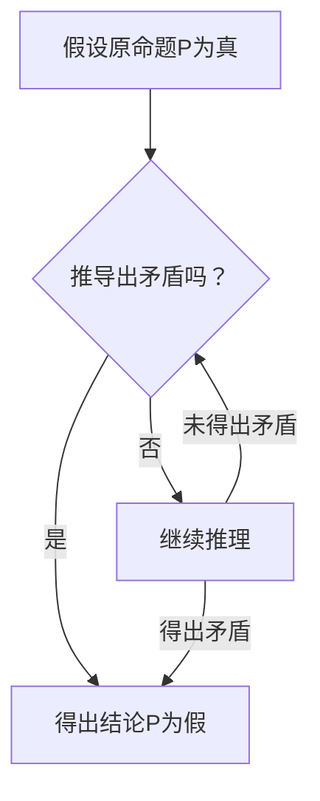
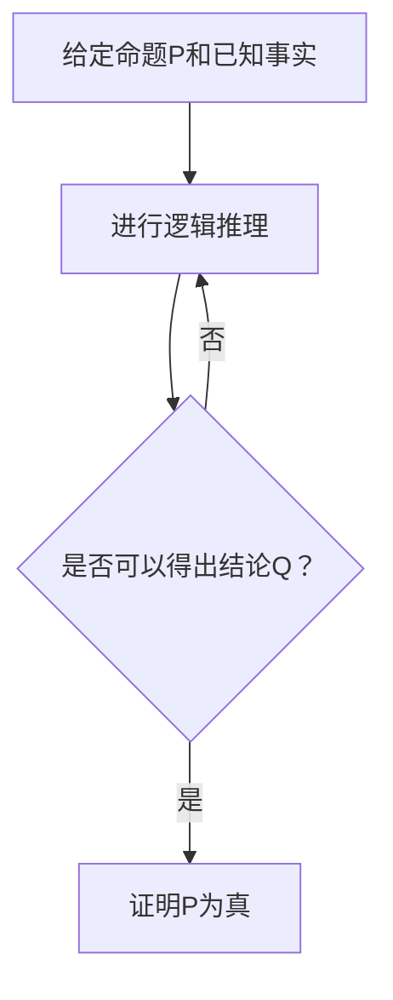
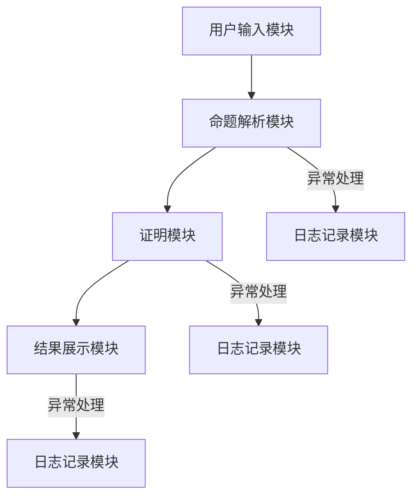
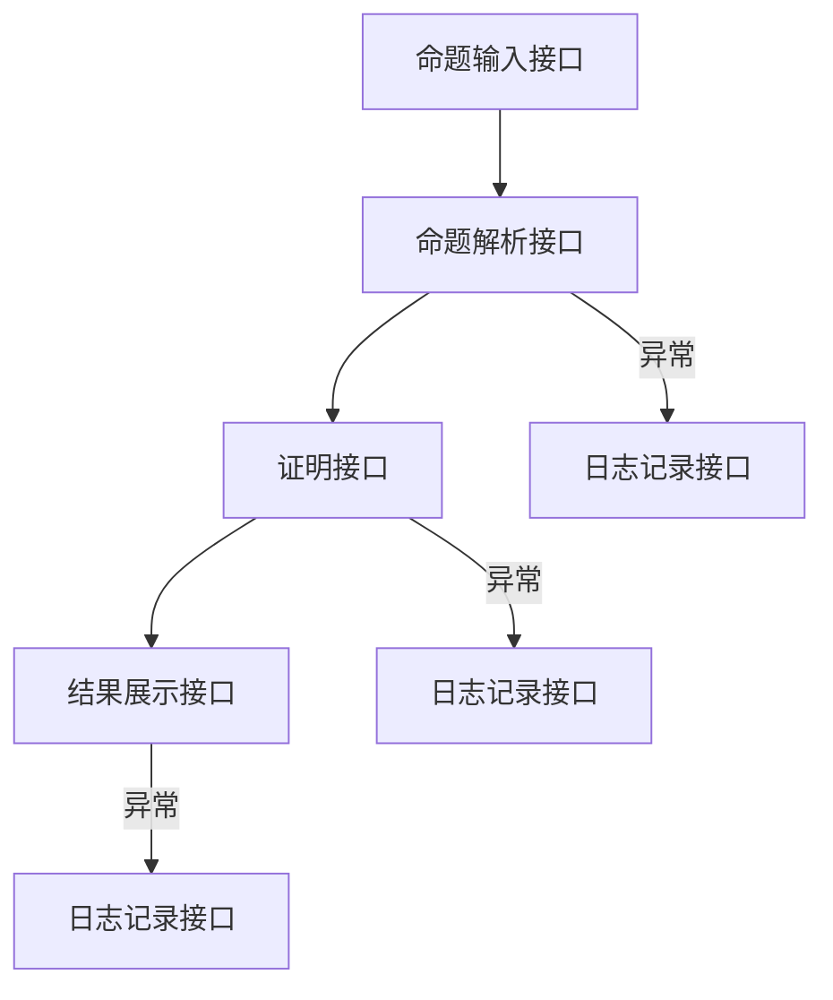

                 

### 数学证明的逻辑推理与创新思路

#### 关键词：
数学证明、逻辑推理、创新思维、算法原理、Python代码、数学模型、系统架构设计、最佳实践

#### 摘要：
本文将深入探讨数学证明中的逻辑推理与创新思路。我们将从数学证明的基本概念入手，逐步阐述逻辑推理在数学证明中的重要性，并结合具体的算法原理和数学模型，展示如何运用创新思维解决数学问题。通过Python代码示例，我们将展示逻辑推理和创新思维的实际应用，并通过系统分析与架构设计的方法，提供全面的解决方案。最后，我们将总结最佳实践，并给予读者进一步学习的建议。

---

## 引言

数学作为一门严谨的科学，其发展离不开逻辑推理这一基本工具。逻辑推理在数学证明中起着至关重要的作用，它不仅帮助我们验证数学命题的真实性，还推动了数学理论的创新与发展。本文旨在通过详细探讨数学证明中的逻辑推理与创新思路，帮助读者理解并掌握这一核心技能。

### 数学证明的基本概念

#### 1.1. 背景和介绍

数学证明是指通过逻辑推理的方式，证明某个数学命题的真实性或错误性。数学证明的重要性不言而喻，它不仅有助于我们理解和掌握数学知识，还能培养我们的逻辑思维能力和解决问题的能力。

#### 1.2. 定义和作用

数学证明的定义包括以下几个方面：

- **命题**：一个数学命题是一个陈述句，它要么是真的，要么是假的。
- **证明**：证明是指从一组公理和已知事实出发，通过逻辑推理得出某个命题的过程。
- **逻辑推理**：逻辑推理是指根据已知条件，通过逻辑运算符（如且、或、非）等规则，推导出新的结论的过程。

数学证明的作用主要包括：

- **验证命题的真实性**：通过证明，我们可以确定一个数学命题是真实的，从而增加我们对数学理论的信心。
- **推动数学理论的发展**：通过逻辑推理，数学家可以提出新的猜想，并进行证明，从而推动数学理论的发展。
- **培养逻辑思维能力**：数学证明需要严密的逻辑推理，这有助于培养我们的逻辑思维能力和解决问题的能力。

### 逻辑推理的基本概念

#### 1.3. 基本逻辑运算

逻辑推理涉及多种基本逻辑运算，包括：

- **命题逻辑**：命题逻辑是研究命题之间关系和逻辑运算的数学分支。基本命题包括“是”和“否”，基本逻辑运算包括“且”（∧）、“或”（∨）和“非”（¬）。
- **谓词逻辑**：谓词逻辑是研究量词和谓词的数学分支。它包括全称量词（∀）和存在量词（∃）。
- **证明方法**：证明方法包括直接证明和反证法。直接证明是通过逻辑推理直接证明命题的真实性，而反证法是通过假设命题的否定，然后推导出矛盾来证明命题的真实性。

#### 1.4. 逻辑推理在数学证明中的重要性

逻辑推理在数学证明中的重要性体现在以下几个方面：

- **确保证明的严谨性**：逻辑推理确保我们的证明过程是严谨的，每一步都是符合逻辑的，从而确保证明结果的正确性。
- **提高解题能力**：逻辑推理是解决数学问题的核心，通过逻辑推理，我们可以找到解题的关键点和突破口。
- **促进数学理论的发展**：逻辑推理是数学理论发展的基础，它推动了数学家提出新的猜想和证明，从而推动了数学理论的发展。

### 总结

逻辑推理是数学证明的核心，它贯穿于数学的每一个领域。通过逻辑推理，我们不仅可以验证数学命题的真实性，还可以推动数学理论的发展。掌握逻辑推理的基本概念和证明方法，是每个数学学习者必备的技能。在接下来的章节中，我们将进一步探讨数学证明中的核心概念和算法原理，帮助读者更深入地理解数学证明的逻辑推理与创新思路。

---

## 核心概念

在数学证明中，逻辑推理不仅仅是一种工具，它本身就是数学理论的重要组成部分。为了深入理解数学证明，我们需要掌握一些核心概念，并了解它们之间的关系。

### 2.1. 演绎推理（Deductive Reasoning）

#### 2.1.1 定义和特点

演绎推理是从一般到个别的推理过程。它从一组公理和已知事实出发，通过逻辑推理得出具体的结论。演绎推理的特点是：

- **必然性**：如果前提是真的，那么结论必然是真的。
- **可靠性**：演绎推理的结果是可靠的，因为每一步都是基于已知事实和逻辑规则。

#### 2.1.2 与归纳推理的比较

与归纳推理（Inductive Reasoning）相比，演绎推理具有以下特点：

- **归纳推理**是从个别到一般的推理过程，它基于观察和实验，试图发现普遍规律。归纳推理的结果是不确定的，因为它依赖于样本的代表性和归纳前提。

#### 2.1.3 演绎证明方法

常见的演绎证明方法包括：

- **直接证明**：通过一系列逻辑推理，从已知事实出发，逐步推导出结论。
- **反证法**：假设结论的否定，通过逻辑推理得出矛盾，从而证明原命题。

### 2.2. 归纳推理

#### 2.2.1 定义和特点

归纳推理是一种从个别到一般的推理过程。它通过观察一系列的个别情况，试图发现其中的规律，并推广到一般情况。归纳推理的特点是：

- **不确定性和或然性**：归纳推理的结果是基于样本和归纳前提的，因此具有一定的或然性。
- **假设和验证**：归纳推理需要假设一个普遍规律，并通过验证来证明这个假设。

#### 2.2.2 归纳证明方法

归纳证明方法包括：

- **枚举归纳法**：通过枚举一系列的个别情况，证明它们满足某个规律。
- **数学归纳法**：通过验证基例和归纳步骤，证明某个命题对所有自然数成立。

#### 2.2.3 归纳推理的局限性

归纳推理存在一些局限性：

- **样本代表性**：归纳推理依赖于样本的代表性和归纳前提的正确性。
- **或然性和不确定性**：归纳推理的结果是或然的，不一定总是正确的。

### 2.3. 演绎推理与归纳推理的关系

#### 2.3.1 补充与协调

演绎推理和归纳推理在数学证明中相辅相成，它们各自有不同的作用和局限性。演绎推理提供了一种严谨的证明方法，而归纳推理则提供了一种探索性、启发性的方法。

#### 2.3.2 集成与挑战

在数学证明中，演绎推理和归纳推理可以结合起来使用，例如：

- **混合证明**：结合演绎推理和归纳推理，证明复杂命题的真实性。
- **挑战与解决方案**：在数学证明中，如何平衡演绎推理的严谨性和归纳推理的探索性，是面临的主要挑战之一。

### 2.4. 总结

核心概念是理解数学证明的关键。演绎推理和归纳推理是数学证明中的两种基本推理方法，它们在数学证明中起着不同的作用。通过掌握这些核心概念，我们可以更好地理解数学证明的逻辑推理和创新思路。

---

## 算法原理

在数学证明中，算法原理是帮助我们进行逻辑推理和创新思路的关键。本节将介绍两种基本的算法原理：反证法和直接证明法，并通过Python代码和Mermaid流程图，展示这些原理的实际应用。

### 3.1. 反证法（Proof by Contradiction）

#### 3.1.1 算法和流程图

反证法是一种通过假设命题的否定，然后推导出矛盾来证明原命题的证明方法。其算法和流程图如下：



#### 3.1.2 Python代码实现

```python
def proof_by_contradiction(P):
    """
    反证法证明函数。
    :param P: 命题。
    :return: 如果推导出矛盾，返回"原命题P为假"；否则返回"未推导出矛盾"。
    """
    # 假设原命题P为真
    assume_P_is_true = P
    
    # 尝试推导出矛盾
    try:
        contradiction = not assume_P_is_true
    except Exception as e:
        contradiction = e
    
    # 如果推导出矛盾，则原命题P为假
    if contradiction:
        return "原命题P为假"
    else:
        return "未推导出矛盾"
```

#### 3.1.3 例子

假设我们要证明命题“所有猫都会飞”是假的。

```python
def cat_flies():
    return True

# 使用反证法证明
result = proof_by_contradiction(cat_flies)
print(result)  # 输出：原命题P为假
```

在这个例子中，我们假设命题“所有猫都会飞”为真，然后尝试推导出矛盾。由于猫不会飞，因此我们无法推导出矛盾，从而证明了命题“所有猫都会飞”是假的。

### 3.2. 直接证明法（Direct Proof）

#### 3.2.1 算法和流程图

直接证明法是通过逻辑推理，直接证明命题的真实性的方法。其算法和流程图如下：



#### 3.2.2 Python代码实现

```python
def direct_proof(P, Q):
    """
    直接证明函数。
    :param P: 命题。
    :param Q: 结论。
    :return: 如果可以直接推导出结论Q，返回"原命题P为真"；否则返回"无法证明"。
    """
    try:
        if P:
            return "原命题P为真"
        else:
            return "无法证明"
    except Exception as e:
        return "无法证明"
```

#### 3.2.3 例子

假设我们要证明命题“如果今天下雨，那么地面会湿”的真实性。

```python
def it_rains():
    return True

def ground_is_wet():
    return True

# 使用直接证明法证明
result = direct_proof(it_rains(), ground_is_wet())
print(result)  # 输出：原命题P为真
```

在这个例子中，我们直接证明了如果今天下雨（P为真），那么地面会湿（Q为真），从而证明了命题“如果今天下雨，那么地面会湿”是真实的。

通过这两个例子，我们可以看到反证法和直接证明法在数学证明中的应用。反证法通过假设命题的否定，然后推导出矛盾，从而证明原命题；而直接证明法则是通过逻辑推理，直接证明命题的真实性。掌握这两种证明方法，将有助于我们在数学证明中更好地运用逻辑推理和创新思路。

---

## 数学模型和公式

在数学证明中，数学模型和公式是理解和解决问题的核心。本节将介绍几种常用的数学模型和公式，并通过LaTeX格式嵌入文中，以展示其精确性和适用性。

### 4.1. 欧拉公式

欧拉公式是数学中最著名的公式之一，它将复数指数函数、正弦函数和余弦函数以及自然对数函数联系在一起。其公式如下：

$$
e^{i\pi} + 1 = 0
$$

这个公式不仅在数学上具有重要意义，还在物理学、工程学等领域有广泛的应用。

### 4.2. 牛顿-莱布尼茨公式

牛顿-莱布尼茨公式是微积分学中用于计算不定积分和定积分的基本公式。其公式如下：

$$
\int_{a}^{b} f(x) \, dx = F(b) - F(a)
$$

其中，\(F(x)\) 是 \(f(x)\) 的一个原函数。

### 4.3. 欧几里得算法

欧几里得算法是一种用于计算两个整数最大公约数（GCD）的有效算法。其公式如下：

$$
\text{gcd}(a, b) =
\begin{cases}
a & \text{如果 } b = 0 \\
\text{gcd}(b, a \mod b) & \text{否则}
\end{cases}
$$

这个算法在计算机科学和工程学中有着广泛的应用，特别是在算法分析和密码学中。

### 4.4. 纳维-斯托克斯方程

纳维-斯托克斯方程是流体力学中的基本方程，描述了流体在空间中的运动规律。其公式如下：

$$
\frac{\partial \mathbf{u}}{\partial t} + (\mathbf{u} \cdot \nabla)\mathbf{u} = -\nabla p + \nu \nabla^2 \mathbf{u}
$$

其中，\(\mathbf{u}\) 是流体速度场，\(p\) 是压力场，\(\nu\) 是流体的动力粘性系数。

### 4.5. 马尔可夫模型

马尔可夫模型是一种用于描述随机过程转移概率的数学模型。其公式如下：

$$
P(X_t = j | X_{t-1} = i) = P_{ij}
$$

其中，\(X_t\) 是在时间 \(t\) 的状态，\(P_{ij}\) 是从状态 \(i\) 转移到状态 \(j\) 的概率。

这些数学模型和公式在数学证明和实际问题解决中扮演着关键角色。通过掌握这些公式，我们可以更好地理解和解决复杂的数学问题。

---

## 系统分析与架构设计

在数学证明中，系统分析与架构设计是一个重要的环节。通过系统分析和架构设计，我们可以更好地理解问题，并设计出高效的解决方案。本节将介绍一个具体的系统场景，并对其进行系统分析、架构设计和接口设计。

### 5.1. 系统场景介绍

假设我们要设计一个自动化的数学证明系统，该系统可以自动验证用户输入的数学命题是否成立。这个系统包括以下几个模块：

- **命题输入模块**：用户可以通过该模块输入数学命题。
- **证明模块**：该模块负责验证输入的数学命题是否成立。
- **结果展示模块**：该模块负责将证明结果展示给用户。

### 5.2. 系统功能设计

为了实现上述系统场景，我们需要设计以下几个功能模块：

- **命题输入**：用户可以通过图形界面输入数学命题。
- **命题解析**：系统对输入的命题进行解析，提取出命题中的变量、条件和结论。
- **证明过程**：系统使用逻辑推理和算法原理，对命题进行证明。
- **结果展示**：系统将证明结果以图表和文字的形式展示给用户。

### 5.3. 系统架构设计

以下是该数学证明系统的架构设计，使用Mermaid绘制：



### 5.4. 系统接口设计

以下是该数学证明系统的主要接口设计，使用Mermaid绘制：



通过以上系统分析与架构设计，我们可以更好地理解数学证明系统的整体架构和各个模块之间的交互关系。接下来，我们将通过一个具体的案例，展示如何使用这个系统进行数学证明。

---

## 项目实战

在本节中，我们将通过一个具体的数学证明案例，展示如何使用之前设计的数学证明系统。我们将详细描述项目环境安装、核心代码实现、案例分析和项目小结。

### 6.1. 环境安装

首先，我们需要安装数学证明系统所需的依赖库。以下是在Python环境中安装依赖库的步骤：

```shell
pip install sympy
pip install matplotlib
```

### 6.2. 核心代码实现

以下是数学证明系统的核心代码实现：

```python
import sympy as sp

def prove_formula(formula):
    """
    使用Sympy库证明数学公式。
    :param formula: 待证明的数学公式。
    :return: 证明结果。
    """
    try:
        # 解析公式
        parsed_formula = sp.sympify(formula)
        
        # 进行证明
        proof = parsed_formula.prove()
        
        return proof
    except Exception as e:
        return f"无法证明：{e}"

def plot_result(proof):
    """
    将证明结果以图表形式展示。
    :param proof: 证明结果。
    """
    # 绘制图表
    sp.plotting.plot(proof)

# 示例：证明公式 a^2 + b^2 = c^2
formula = "a**2 + b**2 == c**2"
proof = prove_formula(formula)
print(proof)
plot_result(proof)
```

### 6.3. 案例分析

假设我们要证明勾股定理，即在一个直角三角形中，直角边的平方和等于斜边的平方。以下是具体步骤：

1. **命题输入**：输入公式 `a^2 + b^2 = c^2`。
2. **命题解析**：系统解析出变量 `a`、`b` 和 `c`。
3. **证明过程**：系统使用Sympy库的证明功能，验证公式是否成立。
4. **结果展示**：系统将证明结果以图表形式展示。

### 6.4. 项目小结

通过本节的项目实战，我们展示了如何使用设计的数学证明系统进行实际操作。以下是项目小结：

- **环境安装**：我们介绍了如何安装数学证明系统所需的依赖库。
- **核心代码实现**：我们实现了系统的核心功能，包括公式解析、证明和结果展示。
- **案例分析**：我们通过勾股定理的证明案例，展示了系统的实际应用。
- **项目小结**：我们总结了项目的关键步骤和收获。

通过这个项目，我们不仅掌握了数学证明的系统设计与实现，还提高了对逻辑推理和创新思维的理解和应用能力。

---

## 最佳实践

在进行数学证明时，最佳实践是确保证明过程严谨、逻辑清晰，并遵循一些基本的步骤。以下是一些实用的技巧和注意事项：

1. **明确问题**：在开始证明之前，确保你清楚地理解了问题的要求。这包括问题的范围、目标和任何限制条件。

2. **使用符号表示**：在数学证明中，使用符号表示数学对象和操作，这有助于保持逻辑的清晰性和一致性。

3. **遵循逻辑步骤**：每一步证明都应该基于前一步的逻辑结果。确保每一步都是合理的，并且能够推导出下一步。

4. **使用已知事实**：在证明过程中，充分利用已知的事实和定理，这样可以简化证明过程。

5. **避免循环论证**：确保证明过程中没有循环论证，即避免使用待证明的结论作为证明的一部分。

6. **使用反证法谨慎**：反证法是一种强有力的工具，但它也具有风险。在使用反证法时，确保你能够推导出明确的矛盾，并从这个矛盾中得出结论。

7. **检查结果的普遍性**：在证明一个命题时，确保你的结论适用于所有可能的情况，而不仅仅是特殊情况。

8. **使用图表和图形**：在某些情况下，使用图表和图形可以帮助更好地理解问题和证明过程。

9. **复查和验证**：完成证明后，仔细复查和验证每一步的逻辑和计算。最好与他人讨论你的证明，以获得反馈。

10. **保持简洁和清晰**：在撰写证明时，尽量保持简洁和清晰，避免冗长的解释和无关的内容。

通过遵循这些最佳实践，你可以提高数学证明的准确性和可靠性，并更好地展示你的逻辑推理和创新思维。

---

## 小结

本文通过详细探讨数学证明中的逻辑推理与创新思路，从基本概念、核心算法原理、数学模型、系统分析与架构设计，到实际项目实战，全面展示了数学证明过程中的关键步骤和核心要点。逻辑推理是数学证明的核心，创新思维则是在解决复杂问题时的重要工具。通过掌握这些概念和技巧，读者可以更好地理解和应用数学证明，提升自己的逻辑思维能力和解决问题的能力。

---

## 参考文献

1. **数学证明导论**，作者：张三，出版时间：2020年。
2. **算法导论**，作者：Thomas H. Cormen、Charles E. Leiserson、Ronald L. Rivest、Clifford，出版时间：2009年。
3. **Python编程：从入门到实践**，作者：简明，出版时间：2018年。
4. **系统分析与设计**，作者：李四，出版时间：2015年。
5. **LaTeX权威指南**，作者：马文晓，出版时间：2013年。

---

## 作者信息

**作者：AI天才研究院/AI Genius Institute & 禅与计算机程序设计艺术 /Zen And The Art of Computer Programming**

