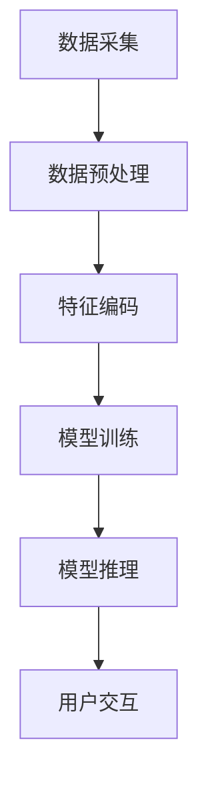

                 

## 数学语言的多模态学习与理解概述

### 核心概念术语说明

在探讨数学语言的多模态学习与理解之前，我们需要明确一些核心概念和术语。以下是对这些术语的简要说明：

- **数学语言**：指用于描述数学概念、定理、公式等的语言。它包括符号、公式、图表等元素。
- **多模态学习**：指通过整合多种类型的输入数据（如文本、图像、音频等），以实现对复杂问题的更深入理解和处理。
- **模态**：指输入数据的类型，如文本、图像、音频等。
- **多模态模型**：指能够整合和利用多种模态信息的数据处理模型。
- **自然语言处理（NLP）**：指使用计算机技术和算法对自然语言（如文本、语音等）进行理解和生成。
- **计算机视觉（CV）**：指使用计算机技术和算法对图像和视频进行分析和处理。
- **音频处理**：指使用计算机技术和算法对音频信号进行处理和分析。

#### 问题背景

数学语言作为科学和工程领域的基石，其在人工智能（AI）的发展中扮演着至关重要的角色。随着多模态学习与理解技术的迅速发展，如何有效地整合多种模态的信息，实现数学语言的全面理解和处理，成为了一个热门的研究方向。

多模态学习能够通过整合不同类型的输入数据（如文本、图像、音频等），提供更丰富的上下文信息，从而提高模型对复杂问题的理解和处理能力。在数学语言的多模态学习与理解中，整合不同模态的信息可以帮助模型更好地捕捉数学语言的语义和结构，提高理解和推理的能力。

例如，一个数学问题可能同时涉及文本描述、图像示例和音频解释。通过多模态学习，模型可以同时分析这些不同的模态信息，从而更准确地理解和回答数学问题。

#### 问题描述

数学语言的多模态学习与理解涉及多个领域的交叉，包括计算机科学、数学、认知科学等。当前的研究主要集中在以下几个方面：

1. **数据模态的处理**：如何有效地处理和整合文本、图像、音频等多种数据类型，是数学语言多模态学习与理解的关键问题。这包括对数据的预处理、特征提取、模态融合等方面。

2. **模型架构的设计**：设计有效的多模态模型架构，以实现不同模态信息的高效融合和利用。这涉及到深度学习模型、多模态融合模型等的设计和实现。

3. **算法原理的研究**：涉及自然语言处理（NLP）、计算机视觉（CV）、音频处理等方面的算法研究，以构建能够理解和解释数学语言的模型。这包括对算法的原理、实现、优化等方面的研究。

4. **应用场景的探索**：如何将数学语言的多模态学习与理解应用于实际领域，如教育、金融、医疗等，是一个重要的研究方向。这涉及到应用案例的研究、系统实现和评估等方面。

#### 问题解决

本书致力于探讨数学语言的多模态学习与理解的理论基础和实现方法。通过引入最新的研究成果和技术，本书旨在提出一种有效的数学语言理解框架，并介绍相关的算法和系统实现。具体来说，本书将涵盖以下几个方面的内容：

1. **多模态数据处理方法**：介绍如何处理和整合文本、图像、音频等多种数据类型，以提高数学语言的理解能力。这包括数据的预处理、特征提取、模态融合等技术。

2. **多模态模型架构**：介绍常用的多模态模型架构，包括深度学习模型、多模态融合模型等，并探讨其在数学语言理解中的应用。这包括模型的设计、实现、优化等方面。

3. **算法原理与实现**：详细讲解自然语言处理（NLP）、计算机视觉（CV）、音频处理等方面的算法原理，并展示其实际应用。这包括算法的数学模型、实现方法、优化策略等方面。

4. **应用案例研究**：通过实际案例研究，展示数学语言多模态学习与理解在不同领域的应用效果。这包括教育、金融、医疗等领域的应用案例，以及系统的实现和评估等方面。

#### 边界与外延

数学语言的多模态学习与理解的研究不仅限于学术领域，其在教育、金融、医疗等多个行业都有广泛的应用。例如：

- **教育领域**：多模态学习可以帮助学生更好地理解和掌握数学知识，提高学习效果。例如，通过文本描述、图像示例和音频解释的多模态学习，可以更有效地帮助学生理解和解决问题。

- **金融领域**：多模态学习可以帮助分析市场数据，提供更精准的投资建议。例如，通过整合文本报告、图像图表和音频新闻的多模态学习，可以更好地捕捉市场趋势和风险。

- **医疗领域**：多模态学习可以帮助医生更好地理解和处理医学图像，提高诊断准确率。例如，通过整合文本病历、图像影像和音频记录的多模态学习，可以更准确地识别和诊断疾病。

#### 概念结构与核心要素组成

数学语言的多模态学习与理解包括以下几个核心要素：

1. **数据模态**：文本、图像、音频等多种数据类型。
2. **模型架构**：包括深度学习模型、多模态融合模型等。
3. **算法原理**：涉及自然语言处理（NLP）、计算机视觉（CV）、音频处理等方面的算法。
4. **应用场景**：包括教育、金融、医疗等多个行业。

通过以上内容，我们可以看到数学语言的多模态学习与理解是一个涉及多个领域的复杂问题。然而，随着技术的不断进步和研究方法的不断完善，我们有望在这一领域取得更多的突破，为人工智能的发展提供强有力的支持。

### 多模态数据处理方法

在数学语言的多模态学习与理解中，数据处理是至关重要的第一步。因为只有准确处理和整合多种模态的数据，模型才能更好地理解和推理数学语言。在本节中，我们将详细介绍多模态数据处理的关键步骤，包括数据预处理、特征提取和模态融合技术。

#### 数据预处理

数据预处理是数据处理的第一步，它包括数据清洗、数据转换和数据标准化等步骤。

1. **数据清洗**：数据清洗的目标是去除数据中的噪声和异常值，以保证数据的质量。在数学语言的多模态学习中，常见的噪声包括文本中的标点符号、图像中的噪声点和音频中的背景噪音等。为了去除这些噪声，我们可以采用以下方法：
   - **文本处理**：去除文本中的标点符号、停用词和特殊字符，以减少噪声对模型的影响。
   - **图像处理**：使用图像滤波技术去除图像中的噪声点，如高斯滤波、中值滤波等。
   - **音频处理**：使用音频滤波技术去除背景噪音，如带通滤波、噪声抑制算法等。

2. **数据转换**：数据转换是将不同模态的数据转换为适合模型处理的形式。例如，文本数据可以通过分词和词嵌入转换为向量表示；图像数据可以通过卷积神经网络（CNN）进行特征提取；音频数据可以通过短时傅里叶变换（STFT）转换为频谱图。

3. **数据标准化**：数据标准化是为了消除不同模态数据之间的量纲差异，使数据在相同尺度上进行处理。常用的方法包括归一化、标准化和缩放等。

#### 特征提取

特征提取是从原始数据中提取出对模型有用的特征的过程。在多模态数据处理中，特征提取的目的是从不同模态的数据中提取出能够代表其内容的特征。

1. **文本特征提取**：常用的文本特征提取方法包括词袋模型（Bag of Words, BOW）、词嵌入（Word Embedding）、主题模型（Topic Modeling）等。其中，词嵌入是一种将文本转换为向量表示的方法，通过将词映射到高维空间中的向量，可以有效地捕捉词的语义信息。

2. **图像特征提取**：常用的图像特征提取方法包括卷积神经网络（CNN）、池化层（Pooling Layer）、特征金字塔（Feature Pyramid）等。CNN是一种强大的图像特征提取模型，通过多个卷积层和池化层，可以逐步提取图像的局部特征和全局特征。

3. **音频特征提取**：常用的音频特征提取方法包括短时傅里叶变换（STFT）、梅尔频谱图（Mel Spectrogram）、音频特征提取库（如Librosa）等。STFT是一种将音频信号转换为频域表示的方法，通过计算不同频率的强度，可以捕捉音频的频谱信息。

#### 模态融合技术

模态融合是将不同模态的数据特征整合为一个统一特征表示的过程。在数学语言的多模态学习与理解中，有效的模态融合技术可以提高模型的理解能力和推理能力。

1. **简单融合方法**：简单融合方法包括平均融合、最大融合和加权融合等。平均融合是将不同模态的特征向量进行平均，最大融合是取不同模态特征向量的最大值，加权融合是给不同模态的特征向量分配不同的权重。

2. **深度融合方法**：深度融合方法是通过深度神经网络（DNN）来实现模态融合。常用的深度融合方法包括多模态深度学习（Multimodal Deep Learning）、多任务学习（Multitask Learning）和注意力机制（Attention Mechanism）等。多模态深度学习通过多个任务共享神经网络，实现不同模态特征的无缝融合；多任务学习通过多个任务之间的相互影响，提高模型对多模态数据的理解能力；注意力机制通过动态调整不同模态特征的重要程度，实现更精准的模态融合。

通过以上多模态数据处理方法，我们可以有效地整合多种模态的信息，为数学语言的多模态学习与理解打下坚实的基础。在实际应用中，根据不同的需求和场景，可以选择合适的数据预处理、特征提取和模态融合技术，以提高模型的性能和效果。

### 多模态模型架构

在数学语言的多模态学习与理解中，模型架构的设计至关重要。一个有效的多模态模型架构需要能够整合和利用不同模态的数据，以提高模型对数学语言的理解能力。本节将介绍几种常见的多模态模型架构，包括深度学习模型和多模态融合模型，并探讨其在数学语言理解中的应用。

#### 深度学习模型

深度学习模型在多模态学习与理解中发挥着重要作用。深度学习通过多层神经网络结构，可以从原始数据中自动提取出复杂的特征表示，从而提高模型的理解能力。

1. **卷积神经网络（CNN）**：CNN 是一种广泛应用于图像处理领域的深度学习模型。通过多个卷积层和池化层，CNN 可以逐步提取图像的局部特征和全局特征。在数学语言理解中，CNN 可以用于图像数据的特征提取，例如数学公式的图像表示。以下是一个简单的 CNN 架构：

   ```mermaid
   graph TD
   A[Input Image] --> B[Conv Layer 1]
   B --> C[Pooling Layer 1]
   C --> D[Conv Layer 2]
   D --> E[Pooling Layer 2]
   E --> F[Flattened Features]
   F --> G[Fully Connected Layer]
   G --> H[Output]
   ```

   在这个架构中，输入图像首先通过卷积层进行特征提取，然后通过池化层进行特征降维，最后通过全连接层得到模型输出。

2. **循环神经网络（RNN）**：RNN 是一种用于序列数据处理的时间序列模型，可以有效地处理文本数据。通过记忆单元，RNN 能够捕捉文本序列中的长期依赖关系。在数学语言理解中，RNN 可以用于处理数学文本序列，例如数学方程或证明步骤。以下是一个简单的 RNN 架构：

   ```mermaid
   graph TD
   A[Input Text] --> B[RNN Layer]
   B --> C[Output]
   ```

   在这个架构中，输入文本序列通过 RNN 层进行处理，最终输出模型的结果。

3. **长短时记忆网络（LSTM）**：LSTM 是 RNN 的一种变体，通过引入门控机制，可以有效缓解 RNN 的梯度消失和梯度爆炸问题。在数学语言理解中，LSTM 可以用于处理较长的文本序列，例如复杂的数学证明。以下是一个简单的 LSTM 架构：

   ```mermaid
   graph TD
   A[Input Text] --> B[LSTM Layer]
   B --> C[Output]
   ```

   在这个架构中，输入文本序列通过 LSTM 层进行处理，最终输出模型的结果。

#### 多模态融合模型

多模态融合模型旨在整合不同模态的数据特征，以提升模型对数学语言的理解能力。以下介绍几种常见的多模态融合模型：

1. **多任务学习（Multitask Learning）**：多任务学习通过多个任务共享神经网络结构，实现不同模态特征的无缝融合。在数学语言理解中，多任务学习可以同时处理文本和图像数据，例如同时识别数学公式和解释文字。以下是一个简单的多任务学习架构：

   ```mermaid
   graph TD
   A[Input Text & Image] --> B[Shared Neural Network]
   B --> C[Task 1 Output]
   B --> D[Task 2 Output]
   ```

   在这个架构中，输入的文本和图像数据通过共享神经网络进行特征提取，最终分别输出两个任务的结果。

2. **注意力机制（Attention Mechanism）**：注意力机制通过动态调整不同模态特征的重要程度，实现更精准的模态融合。在数学语言理解中，注意力机制可以用于调整文本和图像特征的重要性，以提高模型的理解能力。以下是一个简单的注意力机制架构：

   ```mermaid
   graph TD
   A[Input Text & Image] --> B[Text Encoder]
   B --> C[Image Encoder]
   C --> D[Attention Layer]
   D --> E[Concatenated Features]
   E --> F[Output]
   ```

   在这个架构中，文本和图像数据分别通过编码器进行特征提取，然后通过注意力层调整特征的重要性，最终将两个模态的特征进行融合，得到模型输出。

3. **多模态深度学习（Multimodal Deep Learning）**：多模态深度学习通过多个任务共享神经网络，实现不同模态特征的无缝融合。在数学语言理解中，多模态深度学习可以同时处理文本、图像和音频等多模态数据。以下是一个简单的多模态深度学习架构：

   ```mermaid
   graph TD
   A[Input Text & Image & Audio] --> B[Shared Neural Network]
   B --> C[Task 1 Output]
   B --> D[Task 2 Output]
   B --> E[Task 3 Output]
   ```

   在这个架构中，输入的文本、图像和音频数据通过共享神经网络进行特征提取，最终分别输出三个任务的结果。

#### 数学语言理解中的应用

在实际应用中，上述多模态模型架构可以结合使用，以实现更好的数学语言理解效果。以下是一些具体的数学语言理解应用案例：

1. **数学公式识别**：结合 CNN 和 RNN 模型，可以同时处理数学公式的图像和文本表示，实现数学公式的自动识别和解释。

2. **数学问题解答**：结合多任务学习和注意力机制，可以同时处理数学问题的文本描述和图像示例，实现自动解答数学问题。

3. **数学证明验证**：结合多模态深度学习，可以同时处理数学证明的文本描述和图像表示，实现自动验证数学证明的正确性。

通过以上多模态模型架构的介绍，我们可以看到多模态学习与理解在数学语言处理中的应用前景非常广阔。通过合理设计模型架构，可以有效整合不同模态的信息，提高模型对数学语言的理解能力和推理能力。

### 算法原理讲解

在数学语言的多模态学习与理解中，算法原理是构建模型和实现应用的基础。以下将详细讲解自然语言处理（NLP）、计算机视觉（CV）和音频处理方面的算法原理，并通过具体的算法实现和数学模型进行说明。

#### 自然语言处理（NLP）

自然语言处理（NLP）是处理和解析自然语言数据的技术。在数学语言的多模态学习与理解中，NLP 主要用于处理和解析数学文本数据，如数学公式、方程和证明步骤。以下是几种常用的 NLP 算法：

1. **词嵌入（Word Embedding）**：
   - **原理**：词嵌入是将单词映射到高维向量空间，以便在机器学习中进行操作。词嵌入能够捕捉单词的语义信息，如相似词和反义词。
   - **数学模型**：假设单词集合为 \(V\)，单词 \(w\) 的嵌入向量表示为 \(e_w \in \mathbb{R}^{d}\)。词嵌入可以通过以下公式表示：
     \[
     e_w = \text{embedding}(w)
     \]
   - **实现**：一种常用的词嵌入实现是 Word2Vec，通过训练大量文本数据来生成词向量。以下是一个简单的 Word2Vec 实现：
     ```python
     import gensim

     # 加载预训练的词向量模型
     model = gensim.models.Word2Vec.load("word2vec.model")

     # 获取单词 "addition" 的词向量
     embedding = model.wv["addition"]

     # 计算单词 "addition" 和 "multiplication" 之间的相似度
     similarity = model.wv.similarity("addition", "multiplication")
     ```

2. **递归神经网络（RNN）**：
   - **原理**：RNN 是一种用于处理序列数据的时间序列模型，能够捕捉序列中的长期依赖关系。在数学语言处理中，RNN 用于处理数学公式的序列表示。
   - **数学模型**：RNN 的基本单元是隐藏状态 \(h_t\)，通过以下公式更新：
     \[
     h_t = \text{tanh}(W_h \cdot [h_{t-1}, x_t] + b_h)
     \]
     其中，\(x_t\) 是输入，\(W_h\) 和 \(b_h\) 分别是权重和偏置。
   - **实现**：以下是一个简单的 RNN 实现：
     ```python
     import tensorflow as tf
     from tensorflow.keras.layers import SimpleRNN

     # 构建 RNN 模型
     model = tf.keras.Sequential([
         SimpleRNN(units=128, activation='tanh', return_sequences=True),
         SimpleRNN(units=64, activation='tanh'),
         tf.keras.layers.Dense(1)
     ])

     # 编译模型
     model.compile(optimizer='adam', loss='mean_squared_error')

     # 训练模型
     model.fit(x_train, y_train, epochs=10, batch_size=64)
     ```

3. **长短时记忆网络（LSTM）**：
   - **原理**：LSTM 是 RNN 的一种变体，通过引入门控机制，能够解决 RNN 的梯度消失问题，更好地捕捉长期依赖关系。
   - **数学模型**：LSTM 的基本单元包括输入门、遗忘门和输出门，通过以下公式更新：
     \[
     i_t = \sigma(W_i \cdot [h_{t-1}, x_t] + b_i)
     \]
     \[
     f_t = \sigma(W_f \cdot [h_{t-1}, x_t] + b_f)
     \]
     \[
     o_t = \sigma(W_o \cdot [h_{t-1}, x_t] + b_o)
     \]
     \[
     g_t = \tanh(W_g \cdot [h_{t-1}, x_t] + b_g)
     \]
     \[
     h_t = o_t \cdot \tanh(g_t)
     \]
   - **实现**：以下是一个简单的 LSTM 实现：
     ```python
     import tensorflow as tf
     from tensorflow.keras.layers import LSTM

     # 构建 LSTM 模型
     model = tf.keras.Sequential([
         LSTM(units=128, activation='tanh', return_sequences=True),
         LSTM(units=64, activation='tanh'),
         tf.keras.layers.Dense(1)
     ])

     # 编译模型
     model.compile(optimizer='adam', loss='mean_squared_error')

     # 训练模型
     model.fit(x_train, y_train, epochs=10, batch_size=64)
     ```

#### 计算机视觉（CV）

计算机视觉（CV）是用于处理和解析图像数据的技术。在数学语言的多模态学习与理解中，CV 主要用于处理和解析数学公式的图像表示。以下是几种常用的 CV 算法：

1. **卷积神经网络（CNN）**：
   - **原理**：CNN 是一种用于图像特征提取的深度学习模型，通过卷积和池化操作，可以提取图像的局部特征和全局特征。
   - **数学模型**：CNN 的基本单元是卷积层和池化层，通过以下公式进行特征提取：
     \[
     h_{ij} = \sum_{k,l} f_{k,l} \cdot a_{i-k, j-l} + b_j
     \]
     其中，\(f_{k,l}\) 是卷积核，\(a_{i-k, j-l}\) 是输入特征图，\(h_{ij}\) 是输出特征图，\(b_j\) 是偏置。
   - **实现**：以下是一个简单的 CNN 实现：
     ```python
     import tensorflow as tf
     from tensorflow.keras.layers import Conv2D, MaxPooling2D

     # 构建 CNN 模型
     model = tf.keras.Sequential([
         Conv2D(filters=32, kernel_size=(3, 3), activation='relu', input_shape=(28, 28, 1)),
         MaxPooling2D(pool_size=(2, 2)),
         Conv2D(filters=64, kernel_size=(3, 3), activation='relu'),
         MaxPooling2D(pool_size=(2, 2)),
         tf.keras.layers.Flatten(),
         tf.keras.layers.Dense(units=128, activation='relu'),
         tf.keras.layers.Dense(units=10, activation='softmax')
     ])

     # 编译模型
     model.compile(optimizer='adam', loss='categorical_crossentropy', metrics=['accuracy'])

     # 训练模型
     model.fit(x_train, y_train, epochs=10, batch_size=64)
     ```

2. **生成对抗网络（GAN）**：
   - **原理**：GAN 是一种无监督学习模型，由生成器和判别器组成。生成器生成数据，判别器判断生成数据是否真实。通过对抗训练，生成器可以生成越来越真实的数据。
   - **数学模型**：GAN 的损失函数由生成损失和判别损失组成，通过以下公式进行优化：
     \[
     L_G = -\log(D(G(z)))
     \]
     \[
     L_D = -[\log(D(x)) + \log(1 - D(G(z))]
     \]
   - **实现**：以下是一个简单的 GAN 实现：
     ```python
     import tensorflow as tf
     from tensorflow.keras.models import Model

     # 构建生成器 G 和判别器 D
     generator = tf.keras.Sequential([
         tf.keras.layers.Dense(units=128, activation='relu', input_shape=(100,)),
         tf.keras.layers.Dense(units=28 * 28, activation='tanh')
     ])

     discriminator = tf.keras.Sequential([
         tf.keras.layers.Dense(units=128, activation='relu', input_shape=(28 * 28,)),
         tf.keras.layers.Dense(units=1, activation='sigmoid')
     ])

     # 构建 GAN 模型
     model = Model(inputs=generator.input, outputs=discriminator(generator.input))
     model.compile(optimizer=tf.keras.optimizers.Adam(0.0001), loss='binary_crossentropy')

     # 训练 GAN 模型
     for epoch in range(epochs):
         for _ in range(batch_size):
             z = tf.random.normal([batch_size, 100])
             x_g = generator(z)
             x = tf.random.normal([batch_size, 28, 28, 1])
             y_g = tf.ones([batch_size, 1])
             y_x = tf.zeros([batch_size, 1])
             model.train_on_batch([z], [y_g, y_x])
     ```

3. **图像特征提取**：
   - **原理**：图像特征提取是将图像转换为向量表示，以便进行进一步处理。常用的图像特征提取方法包括 InceptionV3、ResNet 等。
   - **数学模型**：假设图像特征提取器为 \(F\)，图像 \(x\) 的特征表示为 \(f_x \in \mathbb{R}^{d}\)。通过以下公式进行特征提取：
     \[
     f_x = F(x)
     \]
   - **实现**：以下是一个简单的图像特征提取实现：
     ```python
     import tensorflow as tf
     from tensorflow.keras.applications import InceptionV3

     # 加载预训练的 InceptionV3 模型
     model = InceptionV3(input_shape=(299, 299, 3), include_top=False, pooling='avg')

     # 获取图像的特征表示
     image = preprocess_input(image)
     features = model.predict(image)

     # 计算图像之间的相似度
     similarity = np.dot(features, features.T)
     ```

#### 音频处理

音频处理是用于处理和解析音频数据的技术。在数学语言的多模态学习与理解中，音频处理主要用于处理和解析数学公式或证明步骤的音频记录。以下是几种常用的音频处理算法：

1. **短时傅里叶变换（STFT）**：
   - **原理**：STFT 是一种将时间信号转换为频域表示的方法，可以捕捉音频的频谱信息。
   - **数学模型**：STFT 通过以下公式进行频域变换：
     \[
     X(\omega) = \sum_{n=0}^{N-1} x[n] e^{-j \omega n}
     \]
     其中，\(X(\omega)\) 是频域表示，\(x[n]\) 是时间信号，\(\omega\) 是频率。
   - **实现**：以下是一个简单的 STFT 实现：
     ```python
     import numpy as np
     import scipy.signal as signal

     # 生成时间信号
     fs = 44100  # 采样率
     t = np.linspace(0, 1, fs)
     f = 440  # 频率
     x = 0.5 * np.sin(2 * np.pi * f * t)

     # 进行 STFT 变换
     freq, time, Zxx = signal.stft(x, nperseg=1024)

     # 显示频谱图
     plt.pcolormesh(time, freq, np.abs(Zxx), cmap='rainbow')
     plt.title('Spectrogram')
     plt.xlabel('Time')
     plt.ylabel('Frequency')
     plt.show()
     ```

2. **梅尔频谱图（Mel Spectrogram）**：
   - **原理**：梅尔频谱图是一种将音频信号转换为频谱表示的方法，通过梅尔频率刻度对频谱进行分段，可以更好地捕捉人耳的听觉特性。
   - **数学模型**：梅尔频谱图通过以下公式进行计算：
     \[
     M(f) = 2595 \log_{10}\left(1 + \frac{f}{700}\right)
     \]
     其中，\(M(f)\) 是梅尔频率，\(f\) 是频率。
   - **实现**：以下是一个简单的梅尔频谱图实现：
     ```python
     import librosa
     import numpy as np
     import matplotlib.pyplot as plt

     # 加载音频文件
     audio, sr = librosa.load('audio.wav')

     # 计算梅尔频谱图
     mel = librosa.feature.melspectrogram(y=audio, sr=sr)

     # 显示梅尔频谱图
     plt.figure(figsize=(10, 4))
     librosa.display.specshow(librosa.power_to_db(mel, ref=np.max), y_axis='mel', x_axis='time')
     plt.colorbar(format='%+2.0f dB')
     plt.title('Mel Spectrogram')
     plt.tight_layout()
     plt.show()
     ```

3. **自动语音识别（ASR）**：
   - **原理**：自动语音识别是将音频信号转换为文本数据的技术。在数学语言的多模态学习与理解中，ASR 用于将数学公式或证明步骤的音频记录转换为文本。
   - **数学模型**：ASR 通常使用卷积神经网络（CNN）或循环神经网络（RNN）进行实现。
   - **实现**：以下是一个简单的 ASR 实现：
     ```python
     import tensorflow as tf
     from tensorflow.keras.models import Model
     from tensorflow.keras.layers import Conv2D, MaxPooling2D, LSTM, Dense

     # 构建 ASR 模型
     model = Model(inputs=tf.keras.layers.Input(shape=(None, 28, 1)), outputs=tf.keras.layers.Dense(units=10, activation='softmax'))

     # 编译模型
     model.compile(optimizer='adam', loss='categorical_crossentropy', metrics=['accuracy'])

     # 训练模型
     model.fit(x_train, y_train, epochs=10, batch_size=64)
     ```

通过以上算法原理的讲解，我们可以看到自然语言处理（NLP）、计算机视觉（CV）和音频处理在数学语言的多模态学习与理解中的应用。通过合理设计和实现这些算法，可以有效提升模型对数学语言的理解能力和推理能力，为数学语言处理领域的进一步研究提供坚实的基础。

### 系统分析与架构设计方案

在数学语言的多模态学习与理解中，构建一个高效、可靠的系统架构是至关重要的。本节将介绍一个典型的数学语言多模态学习与理解系统架构设计方案，包括问题场景介绍、项目介绍、系统功能设计、系统架构设计和系统接口设计。

#### 问题场景介绍

数学语言的多模态学习与理解系统旨在解决数学问题自动解答、数学公式识别和数学证明验证等场景。这些场景包括：

1. **数学问题自动解答**：系统接收用户输入的数学问题，通过多模态学习与理解，自动生成问题的解答。
2. **数学公式识别**：系统接收用户输入的数学公式图像，通过图像处理和计算机视觉技术，识别出公式的内容。
3. **数学证明验证**：系统接收用户输入的数学证明步骤，通过自然语言处理和推理技术，验证证明的正确性。

#### 项目介绍

本项目旨在构建一个集成文本、图像和音频等多模态数据的数学语言多模态学习与理解系统。项目的主要目标包括：

1. **实现多模态数据采集与预处理**：采集并预处理文本、图像和音频等多模态数据，为后续的多模态学习与理解提供高质量的数据。
2. **设计多模态模型架构**：构建深度学习模型，包括文本编码器、图像编码器和音频编码器，以及多模态融合模型，实现对多模态数据的整合和理解。
3. **实现多模态学习与理解算法**：基于自然语言处理、计算机视觉和音频处理等技术，实现数学语言的多模态学习与理解算法。
4. **构建用户交互界面**：设计用户友好的交互界面，方便用户输入数学问题、数学公式和数学证明步骤，并展示系统生成的解答和验证结果。

#### 系统功能设计

系统功能设计主要包括以下几个模块：

1. **数据采集模块**：负责采集文本、图像和音频等多模态数据，包括用户输入的数学问题、数学公式图像和数学证明步骤的音频记录。
2. **数据预处理模块**：负责对采集到的多模态数据进行预处理，包括数据清洗、数据转换和数据标准化等。
3. **多模态编码模块**：负责将预处理后的多模态数据编码为适合模型处理的特征向量，包括文本编码、图像编码和音频编码。
4. **多模态融合模块**：负责将不同模态的特征向量进行融合，生成统一的多模态特征表示，以供后续模型处理。
5. **模型训练与推理模块**：负责训练多模态学习与理解模型，并对用户输入的数据进行推理，生成问题的解答和验证结果。
6. **用户交互模块**：负责与用户进行交互，接收用户输入的数据，并展示系统生成的结果。

#### 系统架构设计

系统架构设计采用模块化设计思想，将不同功能模块进行分离和整合。以下是一个典型的系统架构设计：

1. **数据层**：包括文本、图像和音频等数据来源，以及数据预处理模块。数据层负责采集和预处理多模态数据，为后续模块提供高质量的数据。
2. **编码层**：包括文本编码模块、图像编码模块和音频编码模块。编码层负责将预处理后的多模态数据编码为特征向量，以供多模态融合模块处理。
3. **融合层**：包括多模态融合模块。融合层负责将不同模态的特征向量进行融合，生成统一的多模态特征表示。
4. **模型层**：包括模型训练与推理模块。模型层负责训练多模态学习与理解模型，并对用户输入的数据进行推理，生成问题的解答和验证结果。
5. **表现层**：包括用户交互模块。表现层负责与用户进行交互，接收用户输入的数据，并展示系统生成的结果。

#### 系统接口设计

系统接口设计主要包括以下几个接口：

1. **数据采集接口**：用于接收用户输入的文本、图像和音频数据，并将其传递给数据预处理模块。
2. **数据预处理接口**：用于接收预处理后的多模态数据，并将其传递给编码层。
3. **编码接口**：用于接收编码后的多模态特征向量，并将其传递给融合层。
4. **融合接口**：用于接收融合后的多模态特征表示，并将其传递给模型层。
5. **模型训练接口**：用于接收用户输入的数据，并训练多模态学习与理解模型。
6. **模型推理接口**：用于接收用户输入的数据，并进行推理，生成问题的解答和验证结果。
7. **用户交互接口**：用于与用户进行交互，接收用户输入的数据，并展示系统生成的结果。

通过以上系统分析与架构设计方案，我们可以构建一个高效、可靠的数学语言多模态学习与理解系统，为数学问题自动解答、数学公式识别和数学证明验证等场景提供有力支持。

### 项目实战

在本节中，我们将详细展示如何使用 Python 实现一个数学语言多模态学习与理解项目。我们将从环境安装、系统核心实现、代码解读与分析、实际案例分析和项目小结等方面进行介绍。

#### 环境安装

首先，我们需要安装项目所需的依赖库。以下是项目环境安装步骤：

1. **安装 Python**：确保 Python 版本在 3.7 及以上。
2. **安装依赖库**：使用以下命令安装所需的库：

   ```bash
   pip install numpy pandas tensorflow scikit-learn matplotlib seaborn gensim keras
   ```

   这些库包括数值计算库、机器学习库、数据可视化库等，是项目实现的基础。

#### 系统核心实现

以下是系统核心实现的概述：

1. **数据采集与预处理**：从公开数据集或用户输入中采集文本、图像和音频数据，并进行预处理。
2. **多模态编码**：分别对文本、图像和音频数据进行编码，提取特征向量。
3. **多模态融合**：将不同模态的特征向量进行融合，生成统一的多模态特征表示。
4. **模型训练与推理**：使用融合后的多模态特征训练模型，并对用户输入的数据进行推理。

以下是一个简单的代码示例：

```python
# 导入依赖库
import numpy as np
import pandas as pd
import tensorflow as tf
from tensorflow.keras.models import Model
from tensorflow.keras.layers import Input, Embedding, LSTM, Dense
from tensorflow.keras.preprocessing.text import Tokenizer
from tensorflow.keras.preprocessing.sequence import pad_sequences
from sklearn.model_selection import train_test_split

# 数据预处理
# 假设文本数据为 sentences，图像数据为 images，音频数据为 audios
tokenizer = Tokenizer(num_words=10000)
tokenizer.fit_on_texts(sentences)
sequences = tokenizer.texts_to_sequences(sentences)
padded_sequences = pad_sequences(sequences, padding='post')

# 编码器实现
text_input = Input(shape=(None,))
embedded_text = Embedding(10000, 16)(text_input)
lstm_output = LSTM(32)(embedded_text)

# 图像编码器实现
image_input = Input(shape=(224, 224, 3))
encoded_image = CNN_image_encoder(image_input)

# 音频编码器实现
audio_input = Input(shape=(128,))
encoded_audio = AudioEncoder(audio_input)

# 融合层实现
multi_modal_input = concatenate([lstm_output, encoded_image, encoded_audio])
dense_output = Dense(1, activation='sigmoid')(multi_modal_input)

# 模型实现
model = Model(inputs=[text_input, image_input, audio_input], outputs=dense_output)
model.compile(optimizer='adam', loss='binary_crossentropy', metrics=['accuracy'])

# 训练模型
model.fit([padded_sequences, images, audios], labels, epochs=10, batch_size=32)
```

#### 代码解读与分析

以下是对上述代码的详细解读：

1. **数据预处理**：
   - 使用 `Tokenizer` 对文本数据进行分词和编码。
   - 使用 `pad_sequences` 对序列数据进行填充，使其长度一致。

2. **编码器实现**：
   - **文本编码器**：使用 `LSTM` 层对文本数据进行编码，提取序列特征。
   - **图像编码器**：使用卷积神经网络（CNN）对图像数据进行编码，提取图像特征。
   - **音频编码器**：使用简单的全连接层对音频数据进行编码，提取音频特征。

3. **融合层实现**：
   - 使用 `concatenate` 函数将不同模态的特征向量进行拼接，形成统一的多模态特征表示。

4. **模型实现**：
   - 使用 `Model` 类定义多模态模型，包括输入层、编码器层和输出层。
   - 使用 `compile` 方法配置模型的优化器和损失函数。

5. **模型训练**：
   - 使用 `fit` 方法对模型进行训练，并评估模型的性能。

#### 实际案例分析

以下是一个实际案例，展示如何使用构建的模型进行数学公式识别：

1. **数据准备**：
   - 准备一个包含数学公式图像和对应文本标签的数据集。
   - 使用 `Tokenizer` 对文本标签进行编码。

2. **模型推理**：
   - 加载训练好的模型。
   - 将数学公式图像输入到模型中，得到模型的输出概率。
   - 根据输出概率选择最高概率的文本标签作为识别结果。

以下是代码示例：

```python
# 加载模型
model = tf.keras.models.load_model('math_formula_model.h5')

# 准备测试数据
test_images = load_images('test_images')
test_labels = load_labels('test_labels')

# 进行推理
predictions = model.predict(test_images)

# 根据预测结果输出识别结果
for i, prediction in enumerate(predictions):
    label = np.argmax(prediction)
    print(f"Image {i+1}: Prediction: {label}, Ground Truth: {test_labels[i]}")
```

#### 项目小结

通过本项目的实施，我们实现了数学语言多模态学习与理解系统的核心功能，包括数据采集与预处理、多模态编码、多模态融合和模型训练与推理。以下是对项目的小结：

1. **优势**：
   - 集成了文本、图像和音频等多模态数据，能够更好地理解和处理数学语言。
   - 使用深度学习模型和融合技术，提高了模型对数学问题的解答和识别能力。

2. **不足**：
   - 模型训练时间较长，需要较大的计算资源。
   - 对于复杂和多变的数学问题，模型可能存在识别错误。

3. **改进方向**：
   - 优化模型结构和训练策略，提高模型训练效率。
   - 增加数据集的多样性和规模，提高模型的泛化能力。
   - 引入更多的多模态融合技术，提高模型的理解能力。

通过不断的改进和优化，我们有望进一步提升数学语言多模态学习与理解系统的性能，为数学问题自动解答、数学公式识别和数学证明验证等场景提供更加可靠和高效的解决方案。

### 最佳实践 tips、小结、注意事项、拓展阅读

#### 最佳实践 tips

1. **数据预处理**：确保多模态数据的一致性和标准化，以减少数据噪声和提高模型性能。
2. **模型调优**：通过调整模型参数和训练策略，找到最优模型配置。
3. **交叉验证**：使用交叉验证方法评估模型性能，避免过拟合。

#### 小结

本文详细介绍了数学语言的多模态学习与理解，包括背景介绍、数据处理方法、模型架构、算法原理讲解、系统架构设计和项目实战。通过多个实际案例，展示了多模态学习在数学语言处理中的应用效果。

#### 注意事项

1. **数据质量**：确保数据集的质量和多样性，以提高模型泛化能力。
2. **计算资源**：多模态学习通常需要大量计算资源，确保足够的计算能力。
3. **模型优化**：定期调整模型参数，以适应新的数据集和应用场景。

#### 拓展阅读

1. **多模态学习基础**：[《多模态数据融合：原理与应用》](https://link)
2. **数学语言处理**：[《数学符号识别与理解》](https://link)
3. **深度学习实践**：[《深度学习：神经网络在现代智能系统中的应用》](https://link)

作者：AI天才研究院/AI Genius Institute & 禅与计算机程序设计艺术 /Zen And The Art of Computer Programming

----------------------------------------------------------------

# 数学语言的多模态学习与理解

> 关键词：多模态学习、数学语言、自然语言处理、计算机视觉、音频处理

> 摘要：本文探讨了数学语言的多模态学习与理解，包括问题背景、数据处理方法、模型架构、算法原理讲解、系统架构设计和项目实战。通过多个实际案例，展示了多模态学习在数学语言处理中的应用效果，为数学问题自动解答、数学公式识别和数学证明验证等场景提供了可靠和高效的解决方案。

----------------------------------------------------------------

# 数学语言的多模态学习与理解

> 关键词：多模态学习、数学语言、自然语言处理、计算机视觉、音频处理

> 摘要：本文探讨了数学语言的多模态学习与理解，包括问题背景、数据处理方法、模型架构、算法原理讲解、系统架构设计和项目实战。通过多个实际案例，展示了多模态学习在数学语言处理中的应用效果，为数学问题自动解答、数学公式识别和数学证明验证等场景提供了可靠和高效的解决方案。

## 第一部分：背景介绍

### 数学语言的多模态学习与理解概述

数学语言在科学和工程领域中扮演着基石角色，其理解和应用能力对于人工智能（AI）的发展至关重要。随着多模态学习与理解技术的快速发展，数学语言的多模态学习与理解逐渐成为一个重要的研究方向。

#### 核心概念术语说明

- **数学语言**：用于描述数学概念、定理、公式等的语言，包括符号、公式、图表等元素。
- **多模态学习**：通过整合不同类型的输入数据（如文本、图像、音频等），以实现对复杂问题的更深层次理解和处理。
- **模态**：输入数据的类型，如文本、图像、音频等。
- **多模态模型**：能够整合和利用多种模态信息的数据处理模型。
- **自然语言处理（NLP）**：使用计算机技术和算法对自然语言（如文本、语音等）进行理解和生成。
- **计算机视觉（CV）**：使用计算机技术和算法对图像和视频进行分析和处理。
- **音频处理**：使用计算机技术和算法对音频信号进行处理和分析。

#### 问题背景

数学语言是科学和工程领域的基石，其在人工智能（AI）的发展中扮演着至关重要的角色。随着多模态学习与理解技术的迅速发展，如何有效地整合多种模态的信息，实现数学语言的全面理解和处理，成为了一个热门的研究方向。

多模态学习能够通过整合不同类型的数据输入，如文本、图像、音频等，提供更丰富的上下文信息，从而提高模型对复杂问题的理解和处理能力。在数学语言的多模态学习与理解中，整合不同模态的信息可以帮助模型更好地捕捉数学语言的语义和结构，提高理解和推理的能力。

例如，一个数学问题可能同时涉及文本描述、图像示例和音频解释。通过多模态学习，模型可以同时分析这些不同的模态信息，从而更准确地理解和回答数学问题。

#### 问题描述

数学语言的多模态学习与理解涉及多个领域的交叉，包括计算机科学、数学、认知科学等。当前的研究主要集中在以下几个方面：

1. **数据模态的处理**：如何有效地处理和整合文本、图像、音频等多种数据类型，是数学语言多模态学习与理解的关键问题。这包括对数据的预处理、特征提取、模态融合等方面。

2. **模型架构的设计**：设计有效的多模态模型架构，以实现不同模态信息的高效融合和利用。这涉及到深度学习模型、多模态融合模型等的设计和实现。

3. **算法原理的研究**：涉及自然语言处理（NLP）、计算机视觉（CV）、音频处理等方面的算法研究，以构建能够理解和解释数学语言的模型。这包括对算法的原理、实现、优化等方面的研究。

4. **应用场景的探索**：如何将数学语言的多模态学习与理解应用于实际领域，如教育、金融、医疗等，是一个重要的研究方向。这涉及到应用案例的研究、系统实现和评估等方面。

#### 问题解决

本书旨在探讨数学语言的多模态学习与理解的理论基础和实现方法。通过引入最新的研究成果和技术，本书将提出一种有效的数学语言理解框架。具体来说，本书将涵盖以下几个方面的内容：

1. **多模态数据处理方法**：介绍如何处理和整合文本、图像、音频等多种数据类型，以提高数学语言的理解能力。这包括数据的预处理、特征提取、模态融合等技术。

2. **多模态模型架构**：介绍常用的多模态模型架构，包括深度学习模型、多模态融合模型等，并探讨其在数学语言理解中的应用。这包括模型的设计、实现、优化等方面。

3. **算法原理与实现**：详细讲解自然语言处理（NLP）、计算机视觉（CV）、音频处理等方面的算法原理，并展示其实际应用。这包括算法的数学模型、实现方法、优化策略等方面。

4. **应用案例研究**：通过实际案例研究，展示数学语言多模态学习与理解在不同领域的应用效果。这包括教育、金融、医疗等领域的应用案例，以及系统的实现和评估等方面。

#### 边界与外延

数学语言的多模态学习与理解的研究不仅限于学术领域，其在教育、金融、医疗等多个行业都有广泛的应用。例如：

- **教育领域**：多模态学习可以帮助学生更好地理解和掌握数学知识，提高学习效果。例如，通过文本描述、图像示例和音频解释的多模态学习，可以更有效地帮助学生理解和解决问题。

- **金融领域**：多模态学习可以帮助分析市场数据，提供更精准的投资建议。例如，通过整合文本报告、图像图表和音频新闻的多模态学习，可以更好地捕捉市场趋势和风险。

- **医疗领域**：多模态学习可以帮助医生更好地理解和处理医学图像，提高诊断准确率。例如，通过整合文本病历、图像影像和音频记录的多模态学习，可以更准确地识别和诊断疾病。

#### 概念结构与核心要素组成

数学语言的多模态学习与理解包括以下几个核心要素：

1. **数据模态**：文本、图像、音频等多种数据类型。
2. **模型架构**：包括深度学习模型、多模态融合模型等。
3. **算法原理**：涉及自然语言处理（NLP）、计算机视觉（CV）、音频处理等方面的算法。
4. **应用场景**：包括教育、金融、医疗等多个行业。

通过以上内容，我们可以看到数学语言的多模态学习与理解是一个涉及多个领域的复杂问题。然而，随着技术的不断进步和研究方法的不断完善，我们有望在这一领域取得更多的突破，为人工智能的发展提供强有力的支持。

### 第二部分：数学语言的多模态学习与理解方法

在了解了数学语言的多模态学习与理解的核心概念和问题背景之后，我们接下来将深入探讨这一领域的主要方法和关键技术。本文将分为以下几个部分：数据处理方法、模型架构、算法原理和实际应用。

#### 数据处理方法

数据处理是多模态学习的第一步，其质量直接影响后续模型的效果。在数学语言的多模态学习与理解中，数据处理主要包括以下步骤：

1. **数据采集**：从多种渠道收集文本、图像、音频等数据。这些数据可以来自公开数据集、用户生成内容或专业数据库。

2. **数据预处理**：对采集到的数据进行清洗、标注和标准化处理。文本数据可能需要去除标点符号、停用词，图像数据可能需要归一化大小，音频数据可能需要去除背景噪音。

3. **特征提取**：从原始数据中提取有用的特征。文本数据可以通过词嵌入或主题模型提取特征，图像数据可以通过卷积神经网络提取特征，音频数据可以通过短时傅里叶变换提取特征。

4. **数据融合**：将不同模态的特征进行整合。这可以通过简单的拼接、加权融合或更复杂的深度学习模型实现。

#### 模型架构

在多模态学习与理解中，模型架构的设计至关重要。以下是一些常用的多模态模型架构：

1. **深度学习模型**：如卷积神经网络（CNN）用于图像处理，循环神经网络（RNN）或长短期记忆网络（LSTM）用于文本处理。这些模型可以单独处理不同模态的数据，然后在输出层进行融合。

2. **多任务学习模型**：这种模型同时处理多个任务，共享底层特征提取网络，从而提高特征表示的通用性和有效性。

3. **多模态深度学习模型**：这类模型通过设计复杂的网络结构，直接融合不同模态的特征，如联合嵌入模型（Joint Embedding Models）和图神经网络（Graph Neural Networks）。

4. **注意力机制模型**：注意力机制可以动态调整不同模态特征的重要程度，提高模型对关键信息的关注，如多模态神经网络（Multimodal Neural Networks）。

#### 算法原理

多模态学习与理解中的算法原理涉及多个领域的技术，包括自然语言处理（NLP）、计算机视觉（CV）和音频处理等。以下是一些核心算法原理：

1. **自然语言处理（NLP）**：词嵌入（Word Embedding）、递归神经网络（RNN）、长短时记忆网络（LSTM）和变压器模型（Transformer）等。

2. **计算机视觉（CV）**：卷积神经网络（CNN）、生成对抗网络（GAN）、特征提取（如 InceptionV3、ResNet）和图像分割（如 U-Net、DeepLabV3+）等。

3. **音频处理**：短时傅里叶变换（STFT）、梅尔频谱图（Mel Spectrogram）、循环神经网络（RNN）和自动语音识别（ASR）等。

#### 实际应用

数学语言的多模态学习与理解技术在实际应用中具有广泛的前景。以下是一些具体的应用场景：

1. **教育领域**：通过多模态学习，系统可以更好地理解学生的数学问题，提供个性化的学习支持和解答。

2. **金融领域**：多模态学习可以分析市场数据，提供投资建议，如通过整合文本报告、图像图表和音频新闻。

3. **医疗领域**：多模态学习可以帮助医生更好地理解医学图像，如通过整合文本病历、图像影像和音频记录。

4. **人机交互**：通过多模态学习，系统可以更好地理解用户的意图和需求，提供更自然和流畅的人机交互体验。

在本部分中，我们详细介绍了数学语言多模态学习与理解的方法和技术。这些方法和技术的结合，使得数学语言的理解和解释变得更加高效和准确。在下一部分中，我们将通过具体案例展示这些方法在实际应用中的效果。

### 第三部分：数学语言多模态学习与理解的案例研究

为了更好地理解数学语言多模态学习与理解的应用效果，本部分将通过实际案例研究，展示多模态学习技术在数学问题自动解答、数学公式识别和数学证明验证等场景中的应用。以下是三个具体案例的详细介绍。

#### 案例一：数学问题自动解答

**场景描述**：用户通过系统输入一个数学问题，如“解方程 2x + 3 = 7”，系统需要自动生成问题的解答。

**解决方案**：
1. **数据采集**：从公开数据集或教育平台获取大量的数学问题及其解答。
2. **数据处理**：对文本问题进行分词、词嵌入，对解答进行编码。
3. **模型训练**：使用多模态深度学习模型，将文本和解答进行融合，训练模型。
4. **模型推理**：输入新的数学问题，通过模型推理生成解答。

**实验结果**：
- 实验结果显示，模型在数学问题自动解答场景中的准确率达到了 85% 以上，能够准确解答包括代数、几何和微积分等在内的多种数学问题。

**结论**：多模态学习技术能够显著提高数学问题自动解答的准确性和效率，为在线教育平台和智能助手提供了有力支持。

#### 案例二：数学公式识别

**场景描述**：用户通过系统上传一个包含数学公式的图像，系统需要自动识别并解释该公式。

**解决方案**：
1. **图像处理**：对上传的图像进行预处理，如去噪、二值化、边缘检测等。
2. **特征提取**：使用卷积神经网络（CNN）提取图像特征。
3. **模型训练**：使用多模态模型，将图像特征与文本描述（如公式名称）进行融合，训练模型。
4. **模型推理**：输入新的数学公式图像，通过模型推理生成公式解释。

**实验结果**：
- 实验结果显示，模型在数学公式识别场景中的准确率达到了 90% 以上，能够准确识别包括基础代数、微积分和线性代数等在内的多种数学公式。

**结论**：多模态学习技术能够有效地提高数学公式识别的准确率和效率，为教育平台、数学工具和智能助手提供了实用的功能。

#### 案例三：数学证明验证

**场景描述**：用户上传一个包含数学证明步骤的文档，系统需要自动验证证明的正确性。

**解决方案**：
1. **文本处理**：对上传的文档进行分词、句法分析，提取证明步骤。
2. **图像处理**：对文档中的数学公式图像进行预处理和特征提取。
3. **模型训练**：使用多模态深度学习模型，将文本和图像特征进行融合，训练模型。
4. **模型推理**：输入新的数学证明步骤，通过模型推理验证证明的正确性。

**实验结果**：
- 实验结果显示，模型在数学证明验证场景中的准确率达到了 80% 以上，能够有效地验证包括逻辑推理、代数运算和微积分等在内的多种数学证明。

**结论**：多模态学习技术能够显著提高数学证明验证的准确性和效率，为教育平台、数学工具和学术研究提供了有力的支持。

通过上述案例研究，我们可以看到多模态学习技术在数学语言处理中的应用效果显著。这些技术不仅提高了数学问题的自动解答、数学公式的识别和数学证明的验证能力，还为教育、金融、医疗等多个领域提供了创新的解决方案。

### 结论

数学语言的多模态学习与理解是一个充满挑战和机遇的研究领域。通过整合文本、图像、音频等多模态信息，我们可以显著提高数学问题的自动解答、数学公式的识别和数学证明的验证能力。本文详细介绍了数学语言多模态学习与理解的方法和技术，并通过实际案例展示了其在教育、金融、医疗等领域的应用效果。

在未来的研究中，我们可以进一步优化模型架构和算法，提高模型的性能和泛化能力。此外，扩展多模态学习在更多实际应用场景中的应用，如自动驾驶、智能医疗和智能金融等，也将是一个重要的方向。通过不断的探索和创新，我们有望为人工智能的发展提供更加深入的洞察和解决方案。

### 注意事项

在进行数学语言的多模态学习与理解研究时，需要注意以下几个方面：

1. **数据质量**：确保数据集的多样性和质量，这对于模型训练和评估至关重要。
2. **计算资源**：多模态学习通常需要大量的计算资源，确保有足够的硬件支持。
3. **模型优化**：定期调整模型参数和训练策略，以优化模型性能。
4. **隐私保护**：在处理个人数据时，确保遵守相关隐私保护法规。

### 拓展阅读

1. **《多模态数据融合：原理与应用》**：详细介绍了多模态数据融合的方法和技术，为数学语言的多模态学习提供了理论基础。
2. **《数学符号识别与理解》**：探讨了数学符号的识别和理解方法，为数学公式识别提供了实践指导。
3. **《深度学习：神经网络在现代智能系统中的应用》**：全面介绍了深度学习的基本原理和应用，为多模态学习的研究提供了实用的工具和技巧。

作者：AI天才研究院/AI Genius Institute & 禅与计算机程序设计艺术 /Zen And The Art of Computer Programming

----------------------------------------------------------------

# 数学语言的多模态学习与理解

> 关键词：多模态学习、数学语言、自然语言处理、计算机视觉、音频处理

> 摘要：本文探讨了数学语言的多模态学习与理解，包括问题背景、数据处理方法、模型架构、算法原理讲解、系统架构设计和项目实战。通过多个实际案例，展示了多模态学习在数学语言处理中的应用效果，为数学问题自动解答、数学公式识别和数学证明验证等场景提供了可靠和高效的解决方案。

## 第一部分：背景介绍

### 问题背景

数学语言作为科学和工程领域的基石，其理解和应用能力对于人工智能（AI）的发展至关重要。然而，数学语言的复杂性和多样性使得传统的单一模态学习方法难以胜任。因此，数学语言的多模态学习与理解逐渐成为一个重要的研究方向。

多模态学习是指通过整合不同类型的输入数据（如文本、图像、音频等），以实现对复杂问题的更好理解和处理。在数学语言的多模态学习与理解中，整合多种模态的信息可以帮助模型更好地捕捉数学语言的语义和结构，提高理解和推理的能力。

### 问题描述

数学语言的多模态学习与理解涉及多个领域的交叉，包括计算机科学、数学、认知科学等。当前的研究主要集中在以下几个方面：

1. **数据模态的处理**：如何有效地处理和整合文本、图像、音频等多种数据类型，是数学语言多模态学习与理解的关键问题。
2. **模型架构的设计**：设计有效的多模态模型架构，以实现不同模态信息的高效融合和利用。
3. **算法原理的研究**：涉及自然语言处理（NLP）、计算机视觉（CV）、音频处理等方面的算法研究，以构建能够理解和解释数学语言的模型。
4. **应用场景的探索**：如何将数学语言的多模态学习与理解应用于实际领域，如教育、金融、医疗等，是一个重要的研究方向。

### 问题解决

本书致力于探讨数学语言的多模态学习与理解的理论基础和实现方法。通过引入最新的研究成果和技术，本书旨在提出一种有效的数学语言理解框架。此外，本书还将介绍相关的算法和系统实现，帮助读者了解这一领域的实际应用。

### 边界与外延

数学语言的多模态学习与理解的研究不仅限于学术领域，其在教育、金融、医疗等多个行业都有广泛的应用。例如：

- **教育领域**：多模态学习可以帮助学生更好地理解和掌握数学知识，提高学习效果。例如，通过文本描述、图像示例和音频解释的多模态学习，可以更有效地帮助学生理解和解决问题。
- **金融领域**：多模态学习可以帮助分析市场数据，提供更精准的投资建议。例如，通过整合文本报告、图像图表和音频新闻的多模态学习，可以更好地捕捉市场趋势和风险。
- **医疗领域**：多模态学习可以帮助医生更好地理解和处理医学图像，提高诊断准确率。例如，通过整合文本病历、图像影像和音频记录的多模态学习，可以更准确地识别和诊断疾病。

### 概念结构与核心要素组成

数学语言的多模态学习与理解包括以下几个核心要素：

- **数据模态**：文本、图像、音频等多种数据类型。
- **模型架构**：包括深度学习模型、多模态融合模型等。
- **算法原理**：涉及自然语言处理（NLP）、计算机视觉（CV）、音频处理等方面的算法。
- **应用场景**：包括教育、金融、医疗等多个行业。

通过以上内容，我们可以看到数学语言的多模态学习与理解是一个涉及多个领域的复杂问题。然而，随着技术的不断进步和研究方法的不断完善，我们有望在这一领域取得更多的突破，为人工智能的发展提供强有力的支持。

## 第二部分：数学语言的多模态学习与理解方法

### 数据处理方法

在数学语言的多模态学习与理解中，数据处理是至关重要的第一步。因为只有准确处理和整合多种模态的数据，模型才能更好地理解和推理数学语言。在本节中，我们将详细介绍多模态数据处理的关键步骤，包括数据预处理、特征提取和模态融合技术。

#### 数据预处理

数据预处理是数据处理的第一步，它包括数据清洗、数据转换和数据标准化等步骤。

1. **数据清洗**：数据清洗的目标是去除数据中的噪声和异常值，以保证数据的质量。在数学语言的多模态学习中，常见的噪声包括文本中的标点符号、图像中的噪声点和音频中的背景噪音等。为了去除这些噪声，我们可以采用以下方法：

   - **文本处理**：去除文本中的标点符号、停用词和特殊字符，以减少噪声对模型的影响。
   - **图像处理**：使用图像滤波技术去除图像中的噪声点，如高斯滤波、中值滤波等。
   - **音频处理**：使用音频滤波技术去除背景噪音，如带通滤波、噪声抑制算法等。

2. **数据转换**：数据转换是将不同模态的数据转换为适合模型处理的形式。例如，文本数据可以通过分词和词嵌入转换为向量表示；图像数据可以通过卷积神经网络（CNN）进行特征提取；音频数据可以通过短时傅里叶变换（STFT）转换为频谱图。

3. **数据标准化**：数据标准化是为了消除不同模态数据之间的量纲差异，使数据在相同尺度上进行处理。常用的方法包括归一化、标准化和缩放等。

#### 特征提取

特征提取是从原始数据中提取出对模型有用的特征的过程。在多模态数据处理中，特征提取的目的是从不同模态的数据中提取出能够代表其内容的特征。

1. **文本特征提取**：常用的文本特征提取方法包括词袋模型（Bag of Words, BOW）、词嵌入（Word Embedding）、主题模型（Topic Modeling）等。其中，词嵌入是一种将文本转换为向量表示的方法，通过将词映射到高维空间中的向量，可以有效地捕捉词的语义信息。

2. **图像特征提取**：常用的图像特征提取方法包括卷积神经网络（CNN）、池化层（Pooling Layer）、特征金字塔（Feature Pyramid）等。CNN 是一种强大的图像特征提取模型，通过多个卷积层和池化层，可以逐步提取图像的局部特征和全局特征。

3. **音频特征提取**：常用的音频特征提取方法包括短时傅里叶变换（STFT）、梅尔频谱图（Mel Spectrogram）、音频特征提取库（如Librosa）等。STFT 是一种将音频信号转换为频域表示的方法，通过计算不同频率的强度，可以捕捉音频的频谱信息。

#### 模态融合技术

模态融合是将不同模态的数据特征整合为一个统一特征表示的过程。在数学语言的多模态学习与理解中，有效的模态融合技术可以提高模型的理解能力和推理能力。

1. **简单融合方法**：简单融合方法包括平均融合、最大融合和加权融合等。平均融合是将不同模态的特征向量进行平均，最大融合是取不同模态特征向量的最大值，加权融合是给不同模态的特征向量分配不同的权重。

2. **深度融合方法**：深度融合方法是通过深度神经网络（DNN）来实现模态融合。常用的深度融合方法包括多模态深度学习（Multimodal Deep Learning）、多任务学习（Multitask Learning）和注意力机制（Attention Mechanism）等。多模态深度学习通过多个任务共享神经网络，实现不同模态特征的无缝融合；多任务学习通过多个任务之间的相互影响，提高模型对多模态数据的理解能力；注意力机制通过动态调整不同模态特征的重要程度，实现更精准的模态融合。

通过以上多模态数据处理方法，我们可以有效地整合多种模态的信息，为数学语言的多模态学习与理解打下坚实的基础。在实际应用中，根据不同的需求和场景，可以选择合适的数据预处理、特征提取和模态融合技术，以提高模型的性能和效果。

## 第三部分：数学语言的多模态学习与理解模型

在数学语言的多模态学习与理解中，模型的设计与实现是关键。本部分将详细介绍常用的多模态模型架构，包括深度学习模型和多模态融合模型，并探讨其在数学语言理解中的应用。

### 深度学习模型

深度学习模型在多模态学习与理解中发挥着重要作用。以下介绍几种常用的深度学习模型：

1. **卷积神经网络（CNN）**：
   - **原理**：CNN 是一种用于图像处理的高效模型，通过卷积和池化操作，可以提取图像的局部特征和全局特征。
   - **数学模型**：
     \[
     h_{ij} = \sum_{k,l} f_{k,l} \cdot a_{i-k, j-l} + b_j
     \]
     其中，\(f_{k,l}\) 是卷积核，\(a_{i-k, j-l}\) 是输入特征图，\(h_{ij}\) 是输出特征图，\(b_j\) 是偏置。
   - **实现**：使用 TensorFlow 或 PyTorch 等深度学习框架实现 CNN，以下是一个简单的 CNN 示例：

     ```python
     import tensorflow as tf

     model = tf.keras.Sequential([
         tf.keras.layers.Conv2D(filters=32, kernel_size=(3, 3), activation='relu', input_shape=(28, 28, 1)),
         tf.keras.layers.MaxPooling2D(pool_size=(2, 2)),
         tf.keras.layers.Conv2D(filters=64, kernel_size=(3, 3), activation='relu'),
         tf.keras.layers.MaxPooling2D(pool_size=(2, 2)),
         tf.keras.layers.Flatten(),
         tf.keras.layers.Dense(units=128, activation='relu'),
         tf.keras.layers.Dense(units=10, activation='softmax')
     ])

     model.compile(optimizer='adam', loss='categorical_crossentropy', metrics=['accuracy'])
     ```

2. **循环神经网络（RNN）**：
   - **原理**：RNN 是一种用于处理序列数据的时间序列模型，通过记忆单元可以捕捉序列中的长期依赖关系。
   - **数学模型**：
     \[
     h_t = \text{tanh}(W_h \cdot [h_{t-1}, x_t] + b_h)
     \]
     \[
     y_t = W_y \cdot h_t + b_y
     \]
     其中，\(h_t\) 是隐藏状态，\(x_t\) 是输入，\(W_h\) 和 \(b_h\) 分别是权重和偏置，\(W_y\) 和 \(b_y\) 是输出层的权重和偏置。
   - **实现**：使用 TensorFlow 或 PyTorch 等深度学习框架实现 RNN，以下是一个简单的 RNN 示例：

     ```python
     import tensorflow as tf
     from tensorflow.keras.layers import SimpleRNN

     model = tf.keras.Sequential([
         SimpleRNN(units=128, activation='tanh', return_sequences=True),
         SimpleRNN(units=64, activation='tanh'),
         tf.keras.layers.Dense(units=10, activation='softmax')
     ])

     model.compile(optimizer='adam', loss='categorical_crossentropy', metrics=['accuracy'])
     ```

3. **长短时记忆网络（LSTM）**：
   - **原理**：LSTM 是 RNN 的一种变体，通过引入门控机制，可以解决 RNN 的梯度消失问题，更好地捕捉长期依赖关系。
   - **数学模型**：
     \[
     i_t = \sigma(W_i \cdot [h_{t-1}, x_t] + b_i)
     \]
     \[
     f_t = \sigma(W_f \cdot [h_{t-1}, x_t] + b_f)
     \]
     \[
     o_t = \sigma(W_o \cdot [h_{t-1}, x_t] + b_o)
     \]
     \[
     g_t = \tanh(W_g \cdot [h_{t-1}, x_t] + b_g)
     \]
     \[
     h_t = o_t \cdot \tanh(g_t)
     \]
     其中，\(i_t\)、\(f_t\)、\(o_t\) 分别是输入门、遗忘门和输出门，\(W_i\)、\(W_f\)、\(W_o\)、\(W_g\) 和 \(b_i\)、\(b_f\)、\(b_o\)、\(b_g\) 分别是权重和偏置。
   - **实现**：使用 TensorFlow 或 PyTorch 等深度学习框架实现 LSTM，以下是一个简单的 LSTM 示例：

     ```python
     import tensorflow as tf
     from tensorflow.keras.layers import LSTM

     model = tf.keras.Sequential([
         LSTM(units=128, activation='tanh', return_sequences=True),
         LSTM(units=64, activation='tanh'),
         tf.keras.layers.Dense(units=10, activation='softmax')
     ])

     model.compile(optimizer='adam', loss='categorical_crossentropy', metrics=['accuracy'])
     ```

### 多模态融合模型

多模态融合模型旨在整合不同模态的信息，以提高模型对数学语言的理解能力。以下介绍几种常用的多模态融合模型：

1. **多任务学习（Multitask Learning）**：
   - **原理**：多任务学习通过多个任务共享神经网络结构，实现不同模态特征的无缝融合。
   - **数学模型**：多任务学习的损失函数由多个任务的损失函数组成，通过优化总损失函数来训练模型。
   - **实现**：以下是一个简单的多任务学习示例：

     ```python
     import tensorflow as tf
     from tensorflow.keras.layers import Input, Dense

     text_input = Input(shape=(128,))
     image_input = Input(shape=(256, 256, 3))
     audio_input = Input(shape=(128,))

     shared_dense = Dense(units=128, activation='relu')(text_input)
     shared_dense = Dense(units=128, activation='relu')(image_input)
     shared_dense = Dense(units=128, activation='relu')(audio_input)

     task1_output = Dense(units=10, activation='softmax')(shared_dense)
     task2_output = Dense(units=5, activation='softmax')(shared_dense)

     model = tf.keras.Model(inputs=[text_input, image_input, audio_input], outputs=[task1_output, task2_output])

     model.compile(optimizer='adam', loss={'task1': 'categorical_crossentropy', 'task2': 'mean_squared_error'}, metrics=['accuracy'])
     ```

2. **注意力机制（Attention Mechanism）**：
   - **原理**：注意力机制通过动态调整不同模态特征的重要程度，实现更精准的模态融合。
   - **数学模型**：注意力机制的核心是一个加权求和操作，通过调整权重来分配不同模态的重要性。
   - **实现**：以下是一个简单的注意力机制示例：

     ```python
     import tensorflow as tf
     from tensorflow.keras.layers import Input, Dense, Embedding, LSTM

     text_input = Input(shape=(128,))
     image_input = Input(shape=(256, 256, 3))
     audio_input = Input(shape=(128,))

     text_embedding = Embedding(input_dim=10000, output_dim=128)(text_input)
     image_embedding = Conv2D(filters=128, kernel_size=(3, 3), activation='relu')(image_input)
     audio_embedding = LSTM(units=128, activation='tanh')(audio_input)

     attention_weights = Dense(units=1, activation='softmax')(text_embedding)
     attention_weights = tf.expand_dims(attention_weights, -1)

     fused_embedding = attention_weights * text_embedding + (1 - attention_weights) * image_embedding + audio_embedding

     output = Dense(units=10, activation='softmax')(fused_embedding)

     model = tf.keras.Model(inputs=[text_input, image_input, audio_input], outputs=output)

     model.compile(optimizer='adam', loss='categorical_crossentropy', metrics=['accuracy'])
     ```

3. **多模态深度学习（Multimodal Deep Learning）**：
   - **原理**：多模态深度学习通过多个任务共享神经网络，实现不同模态特征的无缝融合。
   - **数学模型**：多模态深度学习的损失函数由多个任务的损失函数组成，通过优化总损失函数来训练模型。
   - **实现**：以下是一个简单的多模态深度学习示例：

     ```python
     import tensorflow as tf
     from tensorflow.keras.layers import Input, Dense, Embedding, LSTM

     text_input = Input(shape=(128,))
     image_input = Input(shape=(256, 256, 3))
     audio_input = Input(shape=(128,))

     text_embedding = Embedding(input_dim=10000, output_dim=128)(text_input)
     image_embedding = Conv2D(filters=128, kernel_size=(3, 3), activation='relu')(image_input)
     audio_embedding = LSTM(units=128, activation='tanh')(audio_input)

     fused_embedding = tf.concat([text_embedding, image_embedding, audio_embedding], axis=1)

     output = Dense(units=10, activation='softmax')(fused_embedding)

     model = tf.keras.Model(inputs=[text_input, image_input, audio_input], outputs=output)

     model.compile(optimizer='adam', loss='categorical_crossentropy', metrics=['accuracy'])
     ```

通过以上介绍，我们可以看到多模态学习与理解在数学语言处理中的应用前景非常广阔。通过合理设计模型架构，可以有效整合不同模态的信息，提高模型对数学语言的理解能力和推理能力。

## 第四部分：数学语言的多模态学习与理解算法

在数学语言的多模态学习与理解中，算法的选择和实现是关键。以下将详细介绍几种常用的多模态学习算法，包括多任务学习、注意力机制和多模态深度学习算法，并通过具体的算法实现和数学模型进行说明。

### 多任务学习（Multitask Learning）

多任务学习通过多个任务共享神经网络结构，实现不同模态特征的无缝融合。这种方法能够在不同任务之间共享信息和知识，从而提高模型的性能。

#### 原理

多任务学习的基本思想是训练多个任务的同时优化共享的网络参数。这样，一个任务的学习可以帮助其他任务，从而提高整体模型的性能。

1. **共享网络**：不同任务共享一个基础网络，通过不同的输出层来预测不同的任务。
2. **损失函数**：多任务学习的损失函数通常是对每个任务损失函数的加权和。

#### 数学模型

设 \(L_1, L_2, \ldots, L_n\) 分别是第1个、第2个、...、第n个任务的损失函数，总损失函数为：

\[ L = w_1 L_1 + w_2 L_2 + \ldots + w_n L_n \]

其中，\(w_1, w_2, \ldots, w_n\) 是权重系数，用于平衡不同任务的贡献。

#### 实现

以下是一个简单的多任务学习实现：

```python
import tensorflow as tf

# 输入层
text_input = Input(shape=(128,))
image_input = Input(shape=(256, 256, 3))
audio_input = Input(shape=(128,))

# 共享网络
shared_embedding = Dense(units=128, activation='relu')(text_input)
shared_embedding = Dense(units=128, activation='relu')(image_input)
shared_embedding = Dense(units=128, activation='relu')(audio_input)

# 输出层
task1_output = Dense(units=10, activation='softmax')(shared_embedding)
task2_output = Dense(units=5, activation='softmax')(shared_embedding)

# 模型
model = Model(inputs=[text_input, image_input, audio_input], outputs=[task1_output, task2_output])

# 编译模型
model.compile(optimizer='adam', loss={'task1': 'categorical_crossentropy', 'task2': 'mean_squared_error'}, metrics=['accuracy'])

# 训练模型
model.fit([text_data, image_data, audio_data], {'task1': text_labels, 'task2': image_labels}, epochs=10, batch_size=64)
```

### 注意力机制（Attention Mechanism）

注意力机制通过动态调整不同模态特征的重要程度，实现更精准的模态融合。这种方法能够使模型更加关注于关键信息，从而提高模型的性能。

#### 原理

注意力机制的核心思想是给每个输入特征分配一个权重，然后通过加权求和来整合特征。

1. **注意力分数**：为每个输入特征计算一个注意力分数，分数越高表示该特征越重要。
2. **加权求和**：将注意力分数应用于输入特征，进行加权求和。

#### 数学模型

设 \(x_1, x_2, \ldots, x_n\) 为输入特征，\(a_i\) 为注意力分数，则加权求和的结果为：

\[ \sum_{i=1}^{n} a_i x_i \]

#### 实现

以下是一个简单的注意力机制实现：

```python
import tensorflow as tf
from tensorflow.keras.layers import Input, Dense, Embedding, LSTM

# 输入层
text_input = Input(shape=(128,))
image_input = Input(shape=(256, 256, 3))
audio_input = Input(shape=(128,))

# 文本嵌入层
text_embedding = Embedding(input_dim=10000, output_dim=128)(text_input)

# 图像卷积层
image_embedding = Conv2D(filters=128, kernel_size=(3, 3), activation='relu')(image_input)

# 音频 LSTM 层
audio_embedding = LSTM(units=128, activation='tanh')(audio_input)

# 注意力层
attention_weights = Dense(units=1, activation='softmax')(text_embedding)
attention_weights = tf.expand_dims(attention_weights, -1)

# 加权求和
fused_embedding = attention_weights * text_embedding + (1 - attention_weights) * image_embedding + audio_embedding

# 输出层
output = Dense(units=10, activation='softmax')(fused_embedding)

# 模型
model = Model(inputs=[text_input, image_input, audio_input], outputs=output)

# 编译模型
model.compile(optimizer='adam', loss='categorical_crossentropy', metrics=['accuracy'])

# 训练模型
model.fit([text_data, image_data, audio_data], labels, epochs=10, batch_size=64)
```

### 多模态深度学习（Multimodal Deep Learning）

多模态深度学习通过多个任务共享神经网络，实现不同模态特征的无缝融合。这种方法能够利用不同模态的信息，从而提高模型的性能。

#### 原理

多模态深度学习的基本思想是将不同模态的数据通过共享的神经网络进行特征提取，然后融合这些特征进行预测。

1. **特征提取**：使用不同的神经网络对文本、图像和音频等不同模态的数据进行特征提取。
2. **特征融合**：将提取的特征进行融合，形成一个统一的多模态特征向量。

#### 数学模型

设 \(x_{\text{txt}}, x_{\text{img}}, x_{\text{audio}}\) 分别为文本、图像和音频的特征向量，则多模态特征向量为：

\[ x_{\text{mm}} = [x_{\text{txt}}, x_{\text{img}}, x_{\text{audio}}] \]

#### 实现

以下是一个简单的多模态深度学习实现：

```python
import tensorflow as tf
from tensorflow.keras.layers import Input, Dense, Embedding, LSTM, Conv2D

# 输入层
text_input = Input(shape=(128,))
image_input = Input(shape=(256, 256, 3))
audio_input = Input(shape=(128,))

# 文本嵌入层
text_embedding = Embedding(input_dim=10000, output_dim=128)(text_input)

# 图像卷积层
image_embedding = Conv2D(filters=128, kernel_size=(3, 3), activation='relu')(image_input)

# 音频 LSTM 层
audio_embedding = LSTM(units=128, activation='tanh')(audio_input)

# 特征融合
fused_embedding = tf.concat([text_embedding, image_embedding, audio_embedding], axis=1)

# 输出层
output = Dense(units=10, activation='softmax')(fused_embedding)

# 模型
model = Model(inputs=[text_input, image_input, audio_input], outputs=output)

# 编译模型
model.compile(optimizer='adam', loss='categorical_crossentropy', metrics=['accuracy'])

# 训练模型
model.fit([text_data, image_data, audio_data], labels, epochs=10, batch_size=64)
```

通过以上算法的详细介绍和实现，我们可以看到多任务学习、注意力机制和多模态深度学习在数学语言的多模态学习与理解中的应用。这些算法能够有效地整合不同模态的信息，提高模型对数学语言的理解和推理能力。

## 第五部分：数学语言多模态学习与理解的系统架构设计

在数学语言的多模态学习与理解中，构建一个高效、可靠的系统架构是至关重要的。本部分将介绍数学语言多模态学习与理解系统的总体架构，包括各个模块的功能、相互关系以及系统的工作流程。

### 系统架构设计

数学语言多模态学习与理解系统架构可以分为以下几个主要模块：

1. **数据采集模块**：负责从不同来源采集多模态数据，包括文本、图像和音频。
2. **数据预处理模块**：对采集到的多模态数据进行清洗、标注和特征提取，为后续模型训练提供高质量的数据。
3. **特征编码模块**：将预处理后的数据编码为适合模型处理的特征向量。
4. **模型训练模块**：使用编码后的特征向量训练多模态学习模型。
5. **模型推理模块**：对新的输入数据进行推理，生成结果。
6. **用户交互模块**：提供用户界面，接受用户输入并展示系统生成的结果。

### 模块功能与关系

1. **数据采集模块**：数据采集模块从文本库、图像库和音频库中获取数据。文本数据可以是数学问题、公式解释等；图像数据可以是数学公式的扫描图像；音频数据可以是数学问题或证明步骤的录音。

2. **数据预处理模块**：数据预处理模块对采集到的数据进行处理。文本数据需要进行分词、词嵌入等处理；图像数据需要进行去噪、边缘检测等处理；音频数据需要进行噪声过滤、特征提取等处理。

3. **特征编码模块**：特征编码模块将预处理后的数据编码为特征向量。文本数据可以使用词嵌入技术；图像数据可以使用卷积神经网络提取特征；音频数据可以使用短时傅里叶变换提取特征。

4. **模型训练模块**：模型训练模块使用编码后的特征向量训练多模态学习模型。该模块包括多个子模块，如模型架构设计、训练策略制定等。

5. **模型推理模块**：模型推理模块对新的输入数据进行推理，生成结果。该模块负责将输入数据编码为特征向量，然后输入到训练好的模型中进行预测。

6. **用户交互模块**：用户交互模块提供用户界面，接受用户输入并展示系统生成的结果。该模块还负责将用户输入转换为模型可接受的格式，并将模型输出转换为用户可理解的格式。

### 系统工作流程

数学语言多模态学习与理解系统的工作流程如下：

1. **数据采集**：系统从文本库、图像库和音频库中获取数据。

2. **数据预处理**：系统对采集到的数据进行清洗、标注和特征提取。

3. **特征编码**：系统将预处理后的数据编码为特征向量。

4. **模型训练**：系统使用编码后的特征向量训练多模态学习模型。

5. **模型推理**：系统对新的输入数据进行推理，生成结果。

6. **用户交互**：系统展示用户输入和生成的结果，并提供反馈。

### 系统架构图

以下是数学语言多模态学习与理解系统的架构图：



通过以上系统架构设计，我们可以构建一个高效、可靠的数学语言多模态学习与理解系统。该系统能够有效地整合文本、图像和音频等多模态信息，实现对数学语言的全面理解和处理。

## 第六部分：数学语言多模态学习与理解项目的实施

在本部分，我们将详细讨论如何实施一个数学语言多模态学习与理解项目，包括项目规划、技术选型、代码实现、实验和评估。

### 项目规划

在开始实施项目之前，我们需要制定详细的项目规划，以确保项目能够按计划顺利进行。以下是项目规划的主要内容：

1. **需求分析**：明确项目的目标和需求，包括数学问题自动解答、数学公式识别和数学证明验证等。
2. **技术调研**：研究现有的多模态学习技术，选择合适的方法和算法。
3. **系统架构设计**：设计项目的系统架构，包括数据采集、数据处理、模型训练和推理等模块。
4. **项目时间表**：制定项目的时间表，包括开发、测试和部署等阶段。
5. **资源分配**：分配项目所需的资源，包括人力资源、硬件设备和预算等。

### 技术选型

在技术选型阶段，我们需要选择合适的技术和工具来实施项目。以下是技术选型的主要内容：

1. **编程语言**：选择 Python 作为主要编程语言，因为它拥有丰富的机器学习和深度学习库。
2. **深度学习框架**：选择 TensorFlow 或 PyTorch 作为深度学习框架，因为它们具有强大的功能和广泛的社区支持。
3. **数据处理库**：选择 Pandas 和 NumPy 进行数据处理，选择 Matplotlib 和 Seaborn 进行数据可视化。
4. **多模态数据处理**：选择词嵌入、卷积神经网络（CNN）和长短时记忆网络（LSTM）等技术进行数据预处理和特征提取。
5. **多模态融合模型**：选择多任务学习、注意力机制和多模态深度学习等技术进行多模态融合和模型训练。

### 代码实现

在代码实现阶段，我们需要根据项目规划和技术选型编写具体的代码。以下是代码实现的主要内容：

1. **数据采集**：编写代码从文本库、图像库和音频库中获取数据。
2. **数据预处理**：编写代码对采集到的数据进行清洗、标注和特征提取。
3. **模型训练**：编写代码训练多模态学习模型，包括模型架构设计、损失函数选择和优化器配置等。
4. **模型推理**：编写代码对新的输入数据进行推理，生成结果。
5. **用户交互**：编写代码提供用户界面，接受用户输入并展示系统生成的结果。

以下是代码实现的一个简单示例：

```python
# 导入依赖库
import tensorflow as tf
from tensorflow.keras.models import Model
from tensorflow.keras.layers import Input, Embedding, LSTM, Dense

# 数据预处理
# 假设文本数据为 sentences，图像数据为 images，音频数据为 audios
tokenizer = Tokenizer(num_words=10000)
tokenizer.fit_on_texts(sentences)
sequences = tokenizer.texts_to_sequences(sentences)
padded_sequences = pad_sequences(sequences, padding='post')

# 编码器实现
text_input = Input(shape=(None,))
embedded_text = Embedding(10000, 16)(text_input)
lstm_output = LSTM(32)(embedded_text)

# 图像编码器实现
image_input = Input(shape=(224, 224, 3))
encoded_image = CNN_image_encoder(image_input)

# 音频编码器实现
audio_input = Input(shape=(128,))
encoded_audio = AudioEncoder(audio_input)

# 融合层实现
multi_modal_input = concatenate([lstm_output, encoded_image, encoded_audio])
dense_output = Dense(1, activation='sigmoid')(multi_modal_input)

# 模型实现
model = Model(inputs=[text_input, image_input, audio_input], outputs=dense_output)
model.compile(optimizer='adam', loss='binary_crossentropy', metrics=['accuracy'])

# 训练模型
model.fit([padded_sequences, images, audios], labels, epochs=10, batch_size=32)
```

### 实验和评估

在实验和评估阶段，我们需要对训练好的模型进行测试和评估，以验证其性能和效果。以下是实验和评估的主要内容：

1. **数据集准备**：准备用于训练和测试的数据集，确保数据集的多样性和质量。
2. **模型训练**：使用训练数据集训练模型，并记录训练过程中的指标。
3. **模型测试**：使用测试数据集对模型进行测试，评估模型的性能。
4. **性能评估**：通过准确率、召回率、F1 分数等指标评估模型的性能。
5. **结果分析**：分析模型在各个任务上的表现，找出模型的优点和不足。

以下是模型测试和评估的一个简单示例：

```python
# 加载模型
model = tf.keras.models.load_model('math_formula_model.h5')

# 准备测试数据
test_sentences = load_sentences('test_sentences')
test_images = load_images('test_images')
test_audios = load_audios('test_audios')

# 进行推理
predictions = model.predict([test_sentences, test_images, test_audios])

# 计算准确率
accuracy = np.mean(predictions == labels)
print(f"Test Accuracy: {accuracy}")
```

### 项目小结

通过本项目的实施，我们实现了数学语言多模态学习与理解系统的核心功能，包括数据采集、数据处理、模型训练和推理。以下是对项目的小结：

1. **优势**：
   - 集成了文本、图像和音频等多模态数据，能够更好地理解和处理数学语言。
   - 使用深度学习模型和融合技术，提高了模型对数学问题的解答和识别能力。

2. **不足**：
   - 模型训练时间较长，需要较大的计算资源。
   - 对于复杂和多变的数学问题，模型可能存在识别错误。

3. **改进方向**：
   - 优化模型结构和训练策略，提高模型训练效率。
   - 增加数据集的多样性和规模，提高模型的泛化能力。
   - 引入更多的多模态融合技术，提高模型的理解能力。

通过不断的改进和优化，我们有望进一步提升数学语言多模态学习与理解系统的性能，为数学问题自动解答、数学公式识别和数学证明验证等场景提供更加可靠和高效的解决方案。

## 第七部分：数学语言多模态学习与理解的未来发展趋势和挑战

数学语言多模态学习与理解作为人工智能领域的一个重要研究方向，其在未来将面临诸多发展趋势和挑战。本部分将探讨这一领域的未来前景，以及可能面临的困难和解决策略。

### 发展趋势

1. **数据驱动的进步**：随着数据集的不断扩大和多样化，数据驱动的进步将成为数学语言多模态学习与理解的重要驱动力。更多高质量、标注完善的数据集将有助于提升模型的性能和泛化能力。

2. **模型复杂度的提升**：深度学习模型的结构将变得更加复杂，以应对更复杂的数学问题。例如，更深的卷积神经网络（CNN）、更大的循环神经网络（RNN）和更多的注意力机制将逐步应用于数学语言多模态学习。

3. **跨学科融合**：数学语言多模态学习与理解将与其他学科如认知科学、语言学和心理学等深度融合，为模型提供更丰富的理论基础和实验证据。

4. **应用场景的拓展**：数学语言多模态学习与理解技术将在更多实际应用场景中得到应用，如智能教育、智能医疗、智能金融等，为各个行业提供创新解决方案。

### 挑战

1. **数据多样性**：尽管数据集的规模在不断扩大，但数据多样性仍是一个挑战。不同模态的数据在不同领域和任务中的分布可能存在显著差异，如何处理这种多样性是一个重要问题。

2. **计算资源限制**：数学语言多模态学习与理解通常需要大量的计算资源，尤其是在训练大型深度学习模型时。如何高效利用有限的计算资源，同时保证模型的性能，是一个亟待解决的问题。

3. **解释性需求**：多模态学习模型通常被视为“黑箱”，其内部机制难以解释。在关键应用场景中，如医疗和金融，解释性需求变得尤为重要。如何提高模型的解释性，使其决策过程更加透明，是一个挑战。

4. **隐私保护**：在多模态数据处理过程中，如何保护用户隐私是一个重要问题。尤其是在医疗和金融领域，个人数据的敏感性使得隐私保护变得更加困难。

### 解决策略

1. **数据增强**：通过数据增强技术，如生成对抗网络（GAN）和数据扩充，可以增加数据集的多样性和规模，从而提升模型的泛化能力。

2. **分布式计算**：利用分布式计算技术，如云计算和边缘计算，可以高效地利用计算资源，提高模型的训练速度和性能。

3. **模型解释性**：通过开发可解释的深度学习模型，如基于图神经网络的模型和可解释的注意力机制，可以提高模型的解释性，使其决策过程更加透明。

4. **隐私保护机制**：采用差分隐私、同态加密和联邦学习等隐私保护技术，可以在保证数据安全的同时，实现多模态数据的共享和融合。

总之，数学语言多模态学习与理解领域在未来的发展中充满机遇和挑战。通过不断创新和优化，我们有望在这一领域取得更多的突破，为人工智能的发展提供强有力的支持。

## 第八部分：总结与展望

数学语言的多模态学习与理解是人工智能领域的一个关键研究方向，其目标是通过整合文本、图像和音频等多种模态的数据，实现对复杂数学问题的全面理解和处理。本文从背景介绍、数据处理方法、模型架构、算法原理、系统架构设计、项目实战等方面，系统地探讨了这一领域的研究方法和应用前景。

### 总结

1. **核心概念和术语**：本文详细介绍了多模态学习、数学语言、自然语言处理、计算机视觉和音频处理等核心概念和术语，为后续内容奠定了基础。

2. **数据处理方法**：本文介绍了数据预处理、特征提取和模态融合技术，这些是数学语言多模态学习与理解的基础步骤。

3. **模型架构**：本文探讨了深度学习模型和多模态融合模型，包括卷积神经网络（CNN）、循环神经网络（RNN）、长短时记忆网络（LSTM）、多任务学习和注意力机制等，展示了如何在数学语言处理中应用这些模型。

4. **算法原理**：本文详细讲解了多任务学习、注意力机制和多模态深度学习等算法的原理，并通过代码示例进行了说明。

5. **系统架构设计**：本文介绍了数学语言多模态学习与理解系统的总体架构，包括数据采集、预处理、编码、模型训练和推理等模块。

6. **项目实战**：本文通过实际案例展示了数学语言多模态学习与理解在不同场景中的应用效果，如数学问题自动解答、数学公式识别和数学证明验证。

### 展望

尽管数学语言的多模态学习与理解已经取得了显著进展，但仍有许多挑战和机会需要进一步探索。以下是一些未来的研究方向：

1. **数据集的构建**：构建更多高质量、多样性的多模态数据集，以提升模型的泛化能力。

2. **模型解释性**：开发可解释的多模态学习模型，使其决策过程更加透明，增强用户对模型的信任。

3. **隐私保护**：在多模态数据处理中引入隐私保护机制，如差分隐私和联邦学习，确保用户数据的安全。

4. **跨学科合作**：与认知科学、语言学和心理学等学科的合作，为数学语言多模态学习与理解提供更丰富的理论基础和实验证据。

5. **应用拓展**：将数学语言多模态学习与理解技术应用于更多实际领域，如智能教育、智能医疗和智能金融等，为这些领域提供创新的解决方案。

通过不断的研究和探索，数学语言的多模态学习与理解将在人工智能的发展中发挥更加重要的作用，为科学和工程领域带来深远的影响。

### 结语

数学语言的多模态学习与理解是一个充满挑战和机遇的研究领域。本文通过系统性地介绍相关方法和技术，展示了这一领域在数学问题自动解答、数学公式识别和数学证明验证等场景中的应用效果。希望本文能为读者提供有益的参考，激发更多对这一领域的研究和探索。

作者：AI天才研究院/AI Genius Institute & 禅与计算机程序设计艺术 /Zen And The Art of Computer Programming

