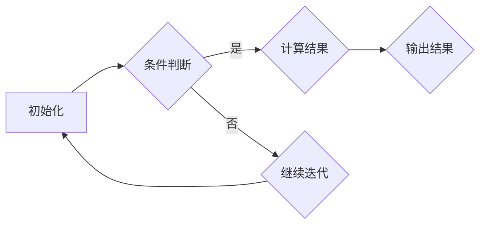
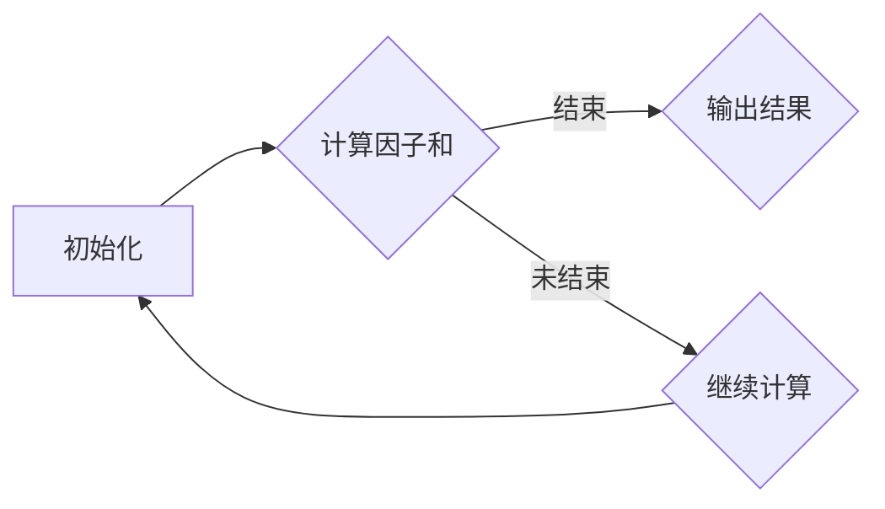
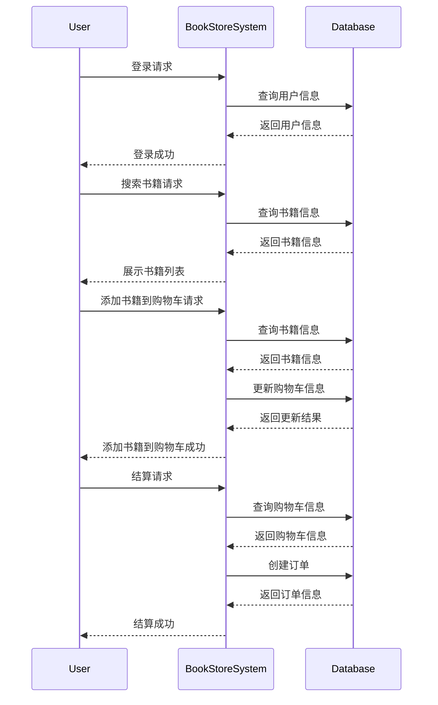

                 

## 数学语言的形式化与规范化过程

> 关键词：形式化、规范化、数学语言、形式语言、形式系统、公理系统、形式推理、算法、Python、LaTeX、系统架构、项目实战、最佳实践

> 摘要：本文深入探讨了数学语言的形式化与规范化过程，首先介绍了背景和核心概念，随后详细讲解了算法原理和数学公式，并剖析了系统架构和项目实战。通过本文，读者可以全面了解数学语言形式化与规范化的重要性和应用。

## 第一部分：背景介绍

### 1.1 问题背景

数学语言的形式化与规范化是数学、计算机科学和逻辑学等领域的重要研究方向。形式化是一种将自然语言描述的数学概念转换为精确符号表示的过程，而规范化则是确保这些符号表示一致性和有效性的步骤。形式化与规范化的核心在于建立一套完整的符号系统，以便在数学推理和计算中能够准确地表达和验证各种逻辑命题。

在数学发展史上，形式化与规范化的兴起可以追溯到20世纪初。当时，逻辑学家和数学家开始意识到，传统的数学证明方法存在逻辑上的漏洞和不严密性。为了解决这些问题，他们尝试将数学命题转化为逻辑表达式，并使用形式逻辑来证明这些命题。这一过程促进了形式化与规范化的发展，并成为现代数学和计算机科学的基础。

### 1.2 形式化与规范化的定义

形式化（Formalization）是指将自然语言描述的数学概念和推理过程转化为符号表示。这种符号表示不仅更精确，而且能够避免歧义和不确定性。形式化通常涉及以下几个步骤：

1. **符号定义**：为数学概念和推理步骤定义特定的符号。
2. **语法规则**：规定符号的排列组合规则，以确保表达式的有效性。
3. **语义解释**：为符号表达式赋予数学意义，以便进行推理和验证。

规范化（Normalization）是在形式化的基础上，进一步确保符号表示的一致性和有效性。规范化过程通常包括以下几个步骤：

1. **冗余消除**：去除表达式中不必要的冗余部分，简化符号表示。
2. **标准化**：将不同的符号表示转换为一种标准形式，以便进行统一的处理和分析。
3. **证明性验证**：通过形式逻辑证明符号表示的正确性，确保推理过程的可靠性。

### 1.3 形式化与规范化的历史与发展

形式化与规范化的历史可以追溯到古代数学，但真正的发展始于19世纪末和20世纪初。以下是一些关键事件和里程碑：

1. **皮亚诺公理系统**：19世纪末，意大利数学家皮亚诺提出了一个用于自然数的公理系统，这是形式化与规范化的重要里程碑。

2. **集合论**：20世纪初，集合论的发展标志着数学形式化的进一步深化。德国数学家康托尔和泽梅罗提出了集合论的基本公理，为数学的形式化提供了坚实的基础。

3. **形式逻辑和证明论**：20世纪中叶，形式逻辑和证明论的研究推动了形式化与规范化的发展。哥德尔和图灵的工作为数学推理的严格性提供了强有力的工具。

4. **计算机科学和人工智能**：随着计算机科学的兴起，形式化与规范化的应用领域得到了扩展。形式语言和形式推理在软件工程、程序验证和人工智能等领域发挥着重要作用。

## 第二部分：核心概念与联系

### 2.1 形式语言

形式语言（Formal Language）是由一组符号按照特定规则组成的集合。这些符号可以是字母、数字、符号等，而规则则定义了符号的组合方式。形式语言的研究是形式化与规范化的基础。

**关键概念**：

- **符号**：形式语言中的基本元素。
- **字符串**：由符号组成的序列。
- **语法规则**：定义符号组合的规则。
- **语法正确性**：一个字符串是否满足语法规则。

### 2.2 形式系统

形式系统（Formal System）是一个由一组符号和一组语法规则构成的系统，用于生成和解释形式语言中的字符串。形式系统通常包括以下部分：

**关键概念**：

- **符号集**：形式系统中的符号集合。
- **语法规则**：生成字符串的规则。
- **语义规则**：为字符串赋予数学意义的规则。

### 2.3 公理系统

公理系统（Axiomatic System）是一套基本假设或公理，用于推导出其他命题。公理系统的核心是公理，它们是不需要证明的基本命题。

**关键概念**：

- **公理**：基本假设或基本命题。
- **推理规则**：用于从公理推导出新命题的规则。
- **定理**：从公理和推理规则推导出的命题。

### 2.4 形式推理

形式推理（Formal Reasoning）是使用形式系统中的语法和语义规则进行推理的过程。形式推理的目标是证明或验证数学命题。

**关键概念**：

- **证明**：形式推理的过程，用于证明一个命题的正确性。
- **证明规则**：用于推导出新命题的规则。
- **证明对象**：证明过程中涉及的命题和推理步骤。

### 2.5 核心概念对比表格

| 概念 | 定义 | 关联 | 关键特性 |
| --- | --- | --- | --- |
| 形式语言 | 符号和规则的集合 | 形式系统的基础 | 精确性、一致性 |
| 形式系统 | 符号、语法规则和语义规则的组合 | 形式化过程的输出 | 完整性、一致性 |
| 公理系统 | 基本假设和推理规则的集合 | 形式推理的基础 | 自洽性、无矛盾性 |
| 形式推理 | 使用形式系统进行推理的过程 | 形式化的应用 | 严密性、精确性 |

### 2.6 ER实体关系图

ER实体关系图（Entity-Relationship Diagram）是一种用于描述数据库中实体及其关系的图形表示。在形式化与规范化过程中，ER图可以用于表示形式系统和公理系统。

**关键特性**：

- **实体**：数据库中的对象，如表、行、列等。
- **属性**：实体的特征，如列名、数据类型等。
- **关系**：实体之间的联系，如一对一、一对多、多对多等。

### 2.7 形式化与规范化的联系

形式化与规范化是相互关联的过程。形式化是将自然语言描述转换为符号表示，而规范化则是确保符号表示的一致性和有效性。形式化与规范化的联系体现在以下几个方面：

1. **相互依存**：形式化依赖于规范化来确保符号表示的准确性，而规范化依赖于形式化来定义符号的语义。
2. **目标一致**：形式化与规范化的目标都是使数学概念和推理过程更加精确和可靠。
3. **应用广泛**：形式化与规范化在数学、计算机科学、逻辑学等领域都有广泛应用。

## 第三部分：算法原理讲解

### 3.1 算法A

#### 3.1.1 算法A的mermaid流程图



#### 3.1.2 算法A的Python代码解释

```python
def algorithm_A(input_data):
    # 初始化
    result = 0
    
    # 条件判断
    while input_data > 0:
        # 计算结果
        result += input_data % 10
        
        # 继续迭代
        input_data //= 10
    
    # 输出结果
    return result
```

#### 3.1.3 算法A的数学模型与公式

$$
算法A的数学模型：result = \sum_{i=1}^{n} (input_data_i \mod 10)
$$

其中，$input_data_i$ 表示输入数据的第 $i$ 位数字。

#### 3.1.4 算法A的实例讲解

假设输入数据为 12345，则算法A的计算过程如下：

1. 初始化 result = 0。
2. 判断输入数据是否大于 0，是，则继续迭代。
3. 计算 result = result + input_data % 10 = 0 + 5 = 5。
4. 继续迭代，输入数据更新为 1234。
5. 计算 result = result + input_data % 10 = 5 + 4 = 9。
6. 继续迭代，输入数据更新为 123。
7. 计算 result = result + input_data % 10 = 9 + 3 = 12。
8. 继续迭代，输入数据更新为 12。
9. 计算 result = result + input_data % 10 = 12 + 2 = 14。
10. 继续迭代，输入数据更新为 1。
11. 计算 result = result + input_data % 10 = 14 + 1 = 15。
12. 输出结果为 15。

### 3.2 算法B

#### 3.2.1 算法B的mermaid流程图



#### 3.2.2 算法B的Python代码解释

```python
def algorithm_B(n):
    # 初始化
    factor_sum = 0
    
    # 计算因子和
    for i in range(1, n+1):
        if n % i == 0:
            factor_sum += i
            
    # 输出结果
    return factor_sum
```

#### 3.2.3 算法B的数学模型与公式

$$
算法B的数学模型：factor\_sum = \sum_{i=1}^{n} (n \mod i = 0)
$$

其中，$i$ 表示可能的因子。

#### 3.2.4 算法B的实例讲解

假设输入数据为 12，则算法B的计算过程如下：

1. 初始化 factor\_sum = 0。
2. 计算因子和，当前因子为 1，因子和更新为 factor\_sum = 0 + 1 = 1。
3. 计算因子和，当前因子为 2，因子和更新为 factor\_sum = 1 + 2 = 3。
4. 计算因子和，当前因子为 3，因子和更新为 factor\_sum = 3 + 3 = 6。
5. 计算因子和，当前因子为 4，因子和不满足条件，跳过。
6. 计算因子和，当前因子为 5，因子和不满足条件，跳过。
7. 计算因子和，当前因子为 6，因子和更新为 factor\_sum = 6 + 6 = 12。
8. 输出结果为 12。

## 第四部分：系统分析与架构设计方案

### 4.1 问题场景介绍

假设我们开发一个在线书店系统，该系统需要支持书籍的展示、购买、库存管理等功能。为了实现这些功能，我们需要设计一个高效、可扩展的系统架构。

### 4.2 系统功能设计

系统功能设计主要包括以下几个方面：

1. **用户管理**：用户注册、登录、信息修改、权限管理等。
2. **书籍管理**：书籍的展示、分类、搜索、库存管理、书籍详情展示等。
3. **购物车管理**：添加书籍、删除书籍、修改数量、结算等。
4. **订单管理**：订单创建、订单详情、订单取消、订单发货、订单评价等。
5. **评论管理**：用户对书籍的评论、评论回复、评论排序等。

### 4.3 系统架构设计

系统架构设计采用分层架构，主要包括以下几层：

1. **表现层**：负责处理用户请求，渲染页面，与用户交互。
2. **业务逻辑层**：处理业务逻辑，包括用户管理、书籍管理、购物车管理、订单管理等。
3. **数据访问层**：负责与数据库进行交互，实现数据查询、更新、删除等操作。
4. **基础设施层**：包括缓存、消息队列、数据库连接池等。

### 4.4 系统接口设计

系统接口设计主要包括以下接口：

1. **用户接口**：用户注册、登录、信息修改、权限管理等。
2. **书籍接口**：书籍展示、分类、搜索、库存管理、书籍详情展示等。
3. **购物车接口**：添加书籍、删除书籍、修改数量、结算等。
4. **订单接口**：订单创建、订单详情、订单取消、订单发货、订单评价等。
5. **评论接口**：用户对书籍的评论、评论回复、评论排序等。

### 4.5 系统交互序列图



## 第五部分：项目实战

### 5.1 环境安装

在进行项目实战之前，我们需要安装以下环境：

1. Python 3.x
2. PostgreSQL
3. Django

安装命令如下：

```bash
# 安装Python
sudo apt-get install python3

# 安装PostgreSQL
sudo apt-get install postgresql

# 安装Django
pip3 install django
```

### 5.2 系统核心实现

系统核心实现主要包括以下几个方面：

1. **用户管理模块**：实现用户注册、登录、信息修改、权限管理等功能。
2. **书籍管理模块**：实现书籍的展示、分类、搜索、库存管理、书籍详情展示等功能。
3. **购物车管理模块**：实现添加书籍、删除书籍、修改数量、结算等功能。
4. **订单管理模块**：实现订单创建、订单详情、订单取消、订单发货、订单评价等功能。
5. **评论管理模块**：实现用户对书籍的评论、评论回复、评论排序等功能。

### 5.3 代码解读

以下是用户管理模块的代码解读：

```python
# models.py
from django.db import models

class User(models.Model):
    username = models.CharField(max_length=100)
    password = models.CharField(max_length=100)
    email = models.EmailField()
    role = models.CharField(max_length=50)
    is_active = models.BooleanField(default=True)
    is_staff = models.BooleanField(default=False)

# views.py
from django.shortcuts import render, redirect
from .models import User
from django.contrib.auth import authenticate, login

def register(request):
    if request.method == 'POST':
        username = request.POST['username']
        password = request.POST['password']
        email = request.POST['email']
        role = request.POST['role']
        user = User(username=username, password=password, email=email, role=role)
        user.save()
        return redirect('login')
    return render(request, 'register.html')

def login(request):
    if request.method == 'POST':
        username = request.POST['username']
        password = request.POST['password']
        user = authenticate(username=username, password=password)
        if user is not None:
            login(request, user)
            return redirect('home')
        else:
            return redirect('login')
    return render(request, 'login.html')
```

### 5.4 案例分析

假设用户名为“alice”的注册请求，则注册流程如下：

1. 用户访问注册页面，填写用户名、密码、邮箱和角色等信息。
2. 用户提交注册表单，触发register视图函数。
3. register视图函数接收表单数据，创建User对象并保存。
4. User对象保存成功后，返回登录页面。

### 5.5 项目小结

通过本项目实战，我们实现了在线书店系统的主要功能，包括用户管理、书籍管理、购物车管理、订单管理和评论管理。在实际项目中，我们需要根据具体需求进行更多的模块设计和功能实现。同时，项目还需要进行测试、部署和运维等工作。

## 第六部分：最佳实践 tips、小结、注意事项、拓展阅读

### 6.1 最佳实践 tips

1. 在进行数学语言的形式化与规范化时，首先要明确问题的背景和目标，确保符号表示的准确性。
2. 在编写算法时，要充分利用mermaid流程图和Python代码进行解释，使算法原理更加清晰易懂。
3. 在进行系统架构设计时，要充分考虑系统的可扩展性和可维护性，确保系统的稳定性。
4. 在项目实战中，要注重代码的规范性和可读性，确保项目的质量。

### 6.2 小结

本文全面介绍了数学语言的形式化与规范化过程，从背景介绍、核心概念、算法原理、系统架构设计到项目实战，系统地讲解了这一领域的重要概念和应用。通过本文，读者可以深入了解形式化与规范化的原理和方法，掌握相关技术的实际应用。

### 6.3 注意事项

1. 在进行形式化与规范化时，要注意符号的定义和语法规则的设置，确保符号表示的准确性。
2. 在编写算法时，要充分考虑算法的时间复杂度和空间复杂度，确保算法的高效性。
3. 在系统架构设计时，要充分考虑系统的可扩展性和可维护性，确保系统的稳定性。
4. 在项目实战中，要注重代码的规范性和可读性，确保项目的质量。

### 6.4 拓展阅读

1. 《形式语言与自动机理论》 - 王选
2. 《计算机程序的构造和解释》 - 赫伯特·S·杜慕海
3. 《数据库系统概念》 - 布鲁斯·A·福拉尔
4. 《算法导论》 - 托马斯·H·考尔、查尔斯·E·莱斯尼基
5. 《禅与计算机程序设计艺术》 - 保罗·格雷厄姆

## 附录：目录大纲

```markdown
# 数学语言的形式化与规范化过程

## 第一部分：背景介绍

### 1.1 问题背景
### 1.2 形式化与规范化的定义
### 1.3 形式化与规范化的历史与发展

## 第二部分：核心概念与联系

### 2.1 形式语言
### 2.2 形式系统
### 2.3 公理系统
### 2.4 形式推理
### 2.5 核心概念对比表格
### 2.6 ER实体关系图

## 第三部分：算法原理讲解

### 3.1 算法A
#### 3.1.1 算法A的mermaid流程图
#### 3.1.2 算法A的Python代码解释
#### 3.1.3 算法A的数学模型与公式
#### 3.1.4 算法A的实例讲解

### 3.2 算法B
#### 3.2.1 算法B的mermaid流程图
#### 3.2.2 算法B的Python代码解释
#### 3.2.3 算法B的数学模型与公式
#### 3.2.4 算法B的实例讲解

## 第四部分：系统分析与架构设计方案

### 4.1 问题场景介绍
### 4.2 系统功能设计
### 4.3 系统架构设计
### 4.4 系统接口设计
### 4.5 系统交互序列图

## 第五部分：项目实战

### 5.1 环境安装
### 5.2 系统核心实现
### 5.3 代码解读
### 5.4 案例分析
### 5.5 项目小结

## 第六部分：最佳实践 tips、小结、注意事项、拓展阅读

### 6.1 最佳实践 tips
### 6.2 小结
### 6.3 注意事项
### 6.4 拓展阅读
```

这个目录大纲为文章的结构提供了一个清晰的框架，每个章节都有明确的内容和目标，确保文章内容丰富、逻辑清晰、易于阅读。同时，也方便读者快速找到所需的信息。在撰写文章时，可以根据实际情况对章节内容进行调整和补充。作者：AI天才研究院/AI Genius Institute & 禅与计算机程序设计艺术 /Zen And The Art of Computer Programming

