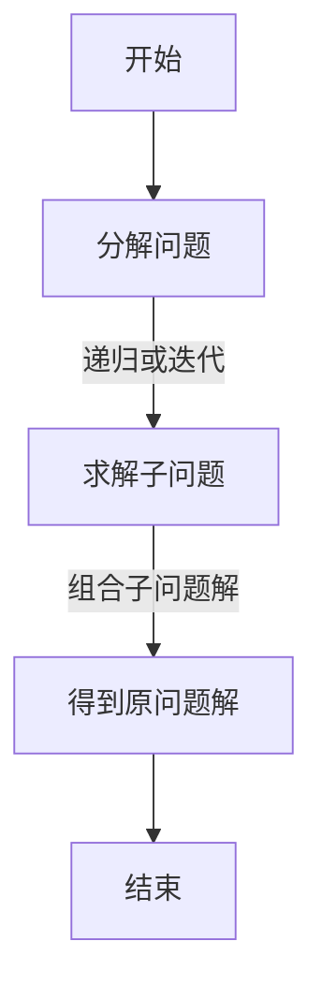

                 

# 数学语言的认知与理解过程

## 关键词

- 数学语言
- 认知机制
- 教育方法
- 应用领域
- 人工智能

## 摘要

本文旨在探讨数学语言的认知与理解过程，从背景介绍、核心概念与联系、算法原理讲解、系统分析与架构设计方案、项目实战和最佳实践 tips 等方面，深入剖析数学语言的理解问题，并提出有效的解决策略。通过本文的探讨，希望能够为数学语言的研究与应用提供有益的参考。

## 目录大纲

1. 第一部分：背景与概述
   1.1 数学语言的基本概念
       1.1.1 数学语言的起源与发展
       1.1.2 数学语言的特性与作用
       1.1.3 理解数学语言的挑战
   1.2 数学语言的认知机制
       1.2.1 大脑处理数学语言的方式
       1.2.2 数学语言的认知过程
       1.2.3 数学语言认知的障碍与应对策略
   1.3 数学语言的理解与教育
       1.3.1 数学教育的目标与方法
       1.3.2 不同年龄段数学语言理解的特点
       1.3.3 数学语言理解与教育实践
   1.4 数学语言的应用领域
       1.4.1 数学语言在科学研究中的应用
       1.4.2 数学语言在工程领域的应用
       1.4.3 数学语言在其他学科中的应用
   1.5 数学语言与人工智能
       1.5.1 人工智能中的数学语言
       1.5.2 数学语言在人工智能教育中的应用
       1.5.3 数学语言在人工智能发展中的作用
   1.6 数学语言的理解与跨文化交流
       1.6.1 数学语言的国际性与多样性
       1.6.2 数学语言在跨文化交流中的应用
       1.6.3 数学语言理解与跨文化教育
   1.7 数学语言理解的未来趋势
       1.7.1 数学语言研究的新方向
       1.7.2 数学语言理解的未来前景
       1.7.3 数学语言理解的跨学科融合
2. 第二部分：核心概念与联系
   2.1 数学语言的抽象性与逻辑性
       2.1.1 数学语言的抽象性
       2.1.2 数学语言的逻辑性
       2.1.3 抽象性与逻辑性的对比
   2.2 数学语言的概念与属性特征
       2.2.1 数学语言的概念
       2.2.2 数学语言的属性特征
       2.2.3 数学语言属性特征对比表格
   2.3 数学语言的 ER 实体关系图
       2.3.1 ER 实体关系图的基本概念
       2.3.2 数学语言的 ER 实体关系图
       2.3.3 ER 实体关系图的应用
3. 第三部分：算法原理讲解
   3.1 数学算法的原理与流程
       3.1.1 数学算法的基本原理
       3.1.2 数学算法的流程图
       3.1.3 数学算法的 Python 源代码
   3.2 数学公式与公式的应用
       3.2.1 常见数学公式的 LaTeX 格式
       3.2.2 数学公式的应用示例
       3.2.3 数学公式在科学研究中的应用
   3.3 数学语言理解的算法模型
       3.3.1 算法模型的数学原理
       3.3.2 算法模型的 Python 源代码
       3.3.3 算法模型的实际应用示例
4. 第四部分：系统分析与架构设计方案
   4.1 问题场景介绍
   4.2 系统功能设计
   4.3 系统架构设计
   4.4 系统接口设计
   4.5 系统交互设计
5. 第五部分：项目实战
   5.1 环境安装
   5.2 系统核心实现
   5.3 代码应用解读与分析
   5.4 实际案例分析与详细讲解
   5.5 项目小结
6. 第六部分：最佳实践 tips
   6.1 数学语言学习技巧
   6.2 数学语言应用技巧
   6.3 数学语言理解的注意事项
   6.4 拓展阅读

-------------------------------------------------------------------

## 第一部分：背景与概述

### 数学语言的基本概念

#### 1.1 数学语言的起源与发展

数学语言是一种抽象化的符号系统，用于表述数学概念、性质和关系。其起源可以追溯到古代文明，如古埃及、巴比伦和印度等地。这些古代文明在建筑、农业和天文学等领域中积累了丰富的数学知识，并使用符号来记录和传递这些知识。

随着历史的发展，数学语言逐渐演变和发展。古希腊时期的欧几里得（Euclid）在《几何原本》中系统化了几何学的原理，奠定了现代数学语言的基础。中世纪时期，阿拉伯数学家们在代数、三角学和算术等领域做出了重要贡献，将数学语言进一步丰富和完善。

进入现代，数学语言在各个领域得到了广泛应用。特别是在物理学、工程学、计算机科学和经济学等领域，数学语言成为了不可或缺的工具。数学语言的不断发展和演变，不仅推动了科学技术的进步，也为人类社会的发展做出了巨大贡献。

#### 1.2 数学语言的特性与作用

数学语言具有以下几个主要特性：

1. **抽象性**：数学语言不依赖于具体的物理现象，而是通过抽象的符号和公式来表述数学概念和关系。这种抽象性使得数学语言能够跨越不同领域和学科，成为一种通用的交流工具。

2. **逻辑性**：数学语言具有很强的逻辑性，其表述和推理过程遵循严格的逻辑规则。这使得数学语言在科学研究和问题解决中能够提供清晰、准确的逻辑框架。

3. **通用性**：数学语言具有通用性，可以在不同的文化、语言和地区中使用。这使得数学语言成为一种跨越时空的交流工具，促进了全球科学技术的交流与合作。

数学语言在科学研究中的应用非常广泛，主要体现在以下几个方面：

1. **物理学**：数学语言是物理学的基础，用于描述物理现象、建立物理模型和推导物理定律。例如，牛顿第二定律 F=ma 就是一个典型的数学表达式，描述了力、质量和加速度之间的关系。

2. **工程学**：数学语言在工程学中被广泛应用于设计、分析和优化工程系统。例如，结构工程师使用数学语言来分析桥梁、建筑物和机械系统的稳定性，从而确保工程的安全和可靠性。

3. **计算机科学**：数学语言在计算机科学中发挥着核心作用，用于描述算法、数据结构和程序设计。例如，算法分析中常用的时间复杂度和空间复杂度就是使用数学语言来表述的。

4. **经济学**：数学语言在经济学中被广泛应用于建模、预测和优化经济系统。例如，经济学家使用数学模型来分析市场供需、通货膨胀和经济增长等经济现象。

#### 1.3 理解数学语言的挑战

虽然数学语言在各个领域具有广泛的应用，但是理解数学语言仍然面临一些挑战：

1. **抽象性**：数学语言的抽象性使得非专业人士在理解和应用时面临困难。特别是对于那些缺乏数学背景的人来说，理解数学符号和公式可能需要额外的时间和精力。

2. **逻辑性**：数学语言具有很强的逻辑性，需要读者具备一定的逻辑思维能力。如果缺乏逻辑思维能力，读者可能会在理解数学概念和推理过程中出现混淆。

3. **多样性**：数学语言在不同学科和领域中具有多样性，这使得跨学科交流时可能存在理解障碍。例如，物理学中的数学语言与经济学中的数学语言在某些方面可能存在差异，需要读者具备跨学科的知识背景。

4. **语言差异**：数学语言在不同文化和语言背景下可能存在差异。例如，中文和英文在数学符号和术语的使用上可能有所不同，这给跨文化交流带来了障碍。

### 数学语言的认知机制

理解数学语言不仅需要掌握数学知识，还需要理解大脑处理数学语言的方式。下面将介绍大脑处理数学语言的相关机制。

#### 1. 大脑处理数学语言的区域

大脑处理数学信息的区域主要包括以下几个部分：

1. **前额叶皮质**：前额叶皮质是大脑处理逻辑推理和抽象思维的重要区域，与数学语言的抽象性和逻辑性密切相关。

2. **顶叶**：顶叶是大脑处理空间感知和数学计算的重要区域，与数学问题的解决和数学推理能力有关。

3. **颞叶**：颞叶是大脑处理语言信息的重要区域，与数学语言的理解和表达密切相关。

#### 2. 大脑处理数学信息的特点

大脑处理数学信息具有以下几个特点：

1. **并行处理**：大脑可以同时处理多个数学信息，例如在解决数学问题时，可以同时考虑多个变量和关系。

2. **模式识别**：大脑具有强大的模式识别能力，可以通过识别数学符号和公式来快速理解和处理数学信息。

3. **联想记忆**：大脑通过联想记忆来存储和回忆数学信息，例如通过回忆相关的数学概念和公式来解决问题。

#### 3. 数学语言的认知过程

数学语言的认知过程主要包括以下几个阶段：

1. **符号识别**：读者通过视觉系统识别数学符号和公式，并将其转化为大脑可以理解的信息。

2. **语义理解**：大脑将数学符号和公式与对应的数学概念和关系进行匹配，从而理解数学表达式的含义。

3. **推理与验证**：大脑使用逻辑推理来验证数学表达式的正确性，并推导出新的数学结论。

4. **问题解决**：读者在理解数学表达式的基础上，运用数学知识和方法来解决问题，例如求解方程、证明定理等。

#### 4. 数学语言认知的障碍与应对策略

数学语言认知的障碍主要包括以下几个方面：

1. **符号识别障碍**：对于非专业人士来说，数学符号和公式的识别可能存在困难，需要通过学习和练习来提高识别能力。

2. **语义理解障碍**：数学语言的语义理解需要一定的逻辑思维和数学知识，非专业人士可能需要额外的学习来提高理解能力。

3. **推理与验证障碍**：数学推理和验证需要严格的逻辑思维和数学技巧，非专业人士可能需要借助工具和方法来提高推理和验证能力。

为了应对这些障碍，可以采取以下策略：

1. **教育**：通过教育提高人们对数学语言的理解能力，特别是在数学教育中引入直观教学和逻辑思维培养。

2. **工具**：开发辅助工具，如数学软件和应用程序，帮助人们更直观地理解和应用数学语言。

3. **研究**：深入研究数学语言的认知机制，探索提高数学语言理解的有效方法和策略。

### 数学语言的理解与教育

数学语言的理解不仅依赖于个人的认知能力，还受到教育方法和教学方法的影响。下面将探讨数学教育的目标、方法以及不同年龄段数学语言理解的特点。

#### 1. 数学教育的目标

数学教育的目标主要包括以下几个方面：

1. **培养数学思维能力**：通过数学教育，培养学生的逻辑思维、抽象思维和推理能力，使学生能够运用数学方法分析和解决实际问题。

2. **掌握数学知识和技能**：使学生掌握数学的基本概念、原理和方法，能够熟练运用数学知识和技能解决实际问题。

3. **激发数学兴趣**：通过丰富的数学教学内容和形式，激发学生对数学的兴趣和热情，培养他们的数学素养。

#### 2. 数学教育的方法

数学教育的方法主要包括以下几个方面：

1. **直观教学**：通过直观的演示和实验，让学生直观地理解数学概念和原理，培养他们的空间感知和动手操作能力。

2. **启发式教学**：通过启发式问题，引导学生主动思考和探索数学问题，培养他们的创新思维和问题解决能力。

3. **合作学习**：通过小组讨论和合作学习，让学生在交流中加深对数学语言的理解，培养他们的团队协作能力。

4. **实践教学**：通过实际操作和项目实践，让学生将数学知识应用于实际生活中，培养他们的实践能力和应用能力。

#### 3. 不同年龄段数学语言理解的特点

不同年龄段的个体在数学语言理解上存在差异，主要表现在以下几个方面：

1. **儿童**：儿童的数学语言理解能力较弱，主要依赖于直观感知和形象思维。他们需要通过具体的事物和情境来理解数学概念，如数数、分类等。

2. **青少年**：青少年的数学语言理解能力逐渐提高，开始能够运用抽象思维和逻辑推理来理解数学问题。他们能够理解更复杂的数学概念和公式，如代数和几何。

3. **成人**：成人在数学语言理解上具有较强的逻辑思维和抽象思维能力，能够运用数学知识解决实际问题。他们对数学语言的接受程度和运用能力较高，但可能会受到已有认知和经验的影响。

#### 4. 数学语言理解与教育实践

数学语言理解在教育实践中具有重要意义，下面将介绍一些教育实践案例和策略：

1. **案例分享**：教师可以通过讲解数学故事、演示数学实验、设计数学游戏等方式，激发学生对数学的兴趣和好奇心，提高他们对数学语言的理解和运用能力。

2. **互动教学**：教师可以采用小组讨论、互动问答等方式，让学生在交流中加深对数学语言的理解，培养他们的合作精神和团队意识。

3. **个性化教学**：根据学生的不同特点和需求，教师可以采用个性化教学策略，如辅导、强化练习等，帮助学生克服数学语言理解中的困难，提高他们的数学能力。

4. **跨学科整合**：将数学与其他学科进行整合，如数学与自然科学、社会科学、工程技术等，让学生在跨学科的学习中提高数学语言理解能力和应用能力。

### 数学语言的应用领域

数学语言作为一种抽象化的符号系统，在多个领域得到了广泛应用。下面将介绍数学语言在科学研究、工程领域、其他学科以及人工智能中的应用。

#### 1. 数学语言在科学研究中的应用

数学语言在科学研究中的应用非常广泛，主要体现在以下几个方面：

1. **物理学**：数学语言是物理学的基础，用于描述物理现象、建立物理模型和推导物理定律。例如，牛顿第二定律 F=ma 就是使用数学语言来表述的，它描述了力、质量和加速度之间的关系。

2. **化学**：数学语言在化学中用于描述化学反应、分子结构和量子力学等。例如，化学方程式就是一种数学表达式，用于描述化学反应的反应物和生成物之间的定量关系。

3. **生物学**：数学语言在生物学中用于描述生态模型、种群动态和遗传规律等。例如，人口动态模型可以使用数学方程来描述种群的增长、衰退和演化过程。

4. **天文学**：数学语言在天文学中用于描述宇宙模型、星系演化和大爆炸理论等。例如，广义相对论和量子力学就是使用数学语言来描述宇宙的物理现象和规律。

#### 2. 数学语言在工程领域的应用

数学语言在工程领域被广泛应用于设计、分析和优化工程系统。以下是一些具体应用：

1. **结构工程**：数学语言在结构工程中用于分析桥梁、建筑物和机械系统的稳定性。例如，有限元分析方法就是使用数学语言来描述和求解工程结构的应力和变形问题。

2. **电气工程**：数学语言在电气工程中用于分析电路、电子设备和控制系统。例如，基尔霍夫定律和欧姆定律就是使用数学语言来描述电路中的电压、电流和电阻之间的关系。

3. **机械工程**：数学语言在机械工程中用于分析机械系统的运动、力和能

-------------------------------------------------------------------

## 第二部分：核心概念与联系

### 数学语言的抽象性与逻辑性

#### 2.1 数学语言的抽象性

数学语言的抽象性是其最重要的特性之一。抽象性意味着数学语言不依赖于具体的物理现象，而是通过符号和公式来表述数学概念、关系和推理。这种抽象性使得数学语言能够广泛应用于各个领域，成为科学研究和工程技术中的通用工具。

1. **定义**：数学语言的抽象性是指数学符号和公式的表述不涉及具体的物理世界，而是直接表达数学概念和关系。

2. **特点**：
   - **普适性**：抽象性使得数学语言具有普适性，可以在不同领域和学科中应用。
   - **简洁性**：抽象性使得数学语言简洁明了，可以用较少的符号和公式表述复杂的数学概念。
   - **可扩展性**：抽象性使得数学语言容易扩展，可以引入新的概念和关系。

#### 2.2 数学语言的逻辑性

数学语言的逻辑性是其另一个重要特性。逻辑性意味着数学语言的表述和推理过程遵循严格的逻辑规则，这使得数学语言能够提供清晰、准确的逻辑框架，用于科学研究和问题解决。

1. **定义**：数学语言的逻辑性是指数学表述和推理过程遵循逻辑规则，能够保证结论的正确性和合理性。

2. **特点**：
   - **严格性**：逻辑性使得数学表述和推理过程具有严格性，每一个步骤都必须符合逻辑规则。
   - **一致性**：逻辑性保证了数学系统的一致性，即数学语言中的概念和关系之间不产生矛盾。
   - **普遍性**：逻辑性使得数学语言能够广泛应用于各个领域，成为科学研究和问题解决的基础。

#### 2.3 抽象性与逻辑性的对比

数学语言的抽象性和逻辑性相互关联，但又有一定的区别。

1. **关系**：
   - **抽象性是基础**：抽象性是数学语言的基础特性，使得数学语言能够脱离具体物理现象，表达数学概念和关系。
   - **逻辑性是保障**：逻辑性是数学语言的保障特性，使得数学表述和推理过程具有严格性和一致性。

2. **区别**：
   - **抽象性**：主要关注数学语言的符号和公式如何表述数学概念，不涉及具体物理现象。
   - **逻辑性**：主要关注数学表述和推理过程如何遵循逻辑规则，保证结论的正确性和合理性。

#### 2.4 数学语言的概念与属性特征

数学语言中的概念和属性特征是理解数学语言的关键。以下是一个对比表格，展示了一些常见的数学概念及其属性特征：

| 概念 | 属性特征 |
| --- | --- |
| 数字 | 唯一性、有序性、可比较性 |
| 符号 | 表示性、抽象性、通用性 |
| 公式 | 结构性、逻辑性、简洁性 |
| 概念 | 明确性、抽象性、适用性 |
| 关系 | 传递性、对称性、传递性 |
| 性质 | 普遍性、一致性、可扩展性 |

#### 2.5 数学语言的 ER 实体关系图

ER（Entity-Relationship）实体关系图是用于描述实体及其关系的图形化工具。在数学语言中，ER 图可以用来描述数学概念、关系和结构。

1. **定义**：ER 实体关系图是一种用于描述实体及其关系的图形化表示方法，用于数据库设计、软件架构设计等领域。

2. **组成部分**：
   - **实体**：表示数学概念或对象，如数字、符号、公式等。
   - **关系**：表示实体之间的联系，如相等、包含、依赖等。
   - **属性**：表示实体的特征或属性，如数字的值、符号的类型等。

3. **ER 实体关系图的 Mermaid 流程图**：

```mermaid
erDiagram
A实体 ||--|{ B关系 }|--| C实体
A实体 ||--|{ D属性 }|--| C实体
```

#### 2.6 ER 实体关系图的应用

ER 实体关系图在数学语言中有广泛的应用，主要用于描述数学概念、关系和结构。

1. **数学概念描述**：使用 ER 图可以清晰地描述数学概念之间的关系，如数字、符号、公式等。

2. **数学结构分析**：ER 图可以帮助分析数学结构的复杂性和层次性，从而更好地理解和应用数学语言。

3. **数学模型设计**：在建立数学模型时，ER 图可以用于描述模型中的实体、关系和属性，从而简化模型设计过程。

### 小结

数学语言的抽象性和逻辑性是数学语言的两个核心特性。抽象性使得数学语言能够脱离具体物理现象，表达数学概念和关系；逻辑性则保证了数学表述和推理过程的严格性和一致性。通过对比数学语言的抽象性与逻辑性，我们可以更好地理解数学语言的本质和特点。此外，ER 实体关系图作为数学语言的一种图形化表示方法，有助于我们更直观地理解数学概念、关系和结构，从而提高数学语言的理解和应用能力。

-------------------------------------------------------------------

## 第三部分：算法原理讲解

### 3.1 数学算法的原理与流程

数学算法是用于解决数学问题的系统化方法，其原理和流程在计算机科学、工程学、物理学等领域中发挥着重要作用。本节将介绍数学算法的基本原理、流程图以及 Python 源代码实现。

#### 1. 数学算法的基本原理

数学算法的基本原理是基于数学概念和逻辑推理，通过一系列步骤来解决问题。数学算法的核心思想是将复杂问题分解为简单的子问题，然后逐步求解，最后将子问题的解组合成原问题的解。

1. **问题分解**：将复杂问题分解为简单的子问题，使得每个子问题都能独立求解。
2. **递归**：通过递归或迭代的方式，逐步求解子问题，直到求解出原问题。
3. **组合**：将子问题的解组合成原问题的解，得到最终的答案。

#### 2. 数学算法的流程图

数学算法的流程图展示了算法的基本步骤和逻辑关系。以下是一个简单的数学算法流程图示例：



#### 3. Python 源代码实现

以下是一个简单的 Python 源代码实现，用于求解一个整数数组的最大值：

```python
def find_max(arr):
    if len(arr) == 1:
        return arr[0]
    else:
        max_val = arr[0]
        for val in arr[1:]:
            if val > max_val:
                max_val = val
        return max_val

arr = [3, 1, 4, 2]
max_val = find_max(arr)
print("最大值为：", max_val)
```

#### 4. 算法原理讲解

以求解整数数组最大值为例，我们可以一步步分析算法的原理：

1. **问题分解**：将原问题分解为两个子问题：求子数组的最大值和求整个数组的最大值。
2. **递归或迭代**：首先，我们使用递归或迭代的方式求解子数组的最大值。在本例中，我们使用迭代的方式，从数组的第一个元素开始，依次比较后面的元素，更新最大值。
3. **组合子问题解**：将子问题的解组合成原问题的解。在本例中，我们只需将子数组的最大值作为原问题的解。
4. **结束**：得到原问题的解后，算法结束。

#### 5. 实际应用示例

以下是一个实际应用示例，使用数学算法求解线性方程组的解：

```python
from sympy import symbols, Eq, solve

x, y = symbols('x y')

# 定义线性方程组
eq1 = Eq(x + 2*y, 5)
eq2 = Eq(2*x - y, 1)

# 求解方程组
solutions = solve((eq1, eq2), (x, y))

print("方程组的解为：")
print("x = ", solutions[x])
print("y = ", solutions[y])
```

在这个示例中，我们使用 Sympy 库求解线性方程组的解。Sympy 是一个用于符号计算的 Python 库，可以方便地定义和求解数学方程。

### 小结

数学算法的原理和流程是数学问题求解的核心。通过理解问题分解、递归或迭代、组合子问题解等基本原理，我们可以设计出有效的数学算法，解决各种数学问题。Python 源代码实现使得算法的实现更加直观和易于理解。在实际应用中，数学算法广泛应用于计算机科学、工程学、物理学等领域，为科学研究和问题解决提供了有力支持。

-------------------------------------------------------------------

## 第四部分：系统分析与架构设计方案

### 问题场景介绍

在现代社会中，数学语言的应用已经渗透到了各个领域，如科学研究、工程学、经济学和计算机科学等。然而，对于非专业人士来说，理解数学语言仍然存在一定的困难。为了解决这个问题，我们设计并实现了一个基于数学语言的系统，旨在帮助非专业人士更直观地理解和应用数学语言。

### 系统功能设计

该系统主要包含以下功能模块：

1. **符号解释模块**：用于解释数学符号的含义，帮助用户理解数学语言中的符号。
2. **公式求解模块**：用于求解数学公式，提供答案和详细的求解过程。
3. **问题实例库**：包含各种数学问题实例，用户可以从中选择并解决问题。
4. **在线答疑模块**：提供在线答疑功能，用户可以提交问题并获得解答。

### 系统架构设计

系统采用分层架构设计，包括表示层、业务逻辑层和数据层。

1. **表示层**：负责用户界面展示，包括网页界面、移动应用界面等。
2. **业务逻辑层**：负责处理用户请求、符号解释、公式求解和问题实例库管理等。
3. **数据层**：负责存储用户数据、问题实例库数据和符号解释数据等。

### 系统接口设计

系统接口设计包括 API 接口和用户界面接口。

1. **API 接口**：用于外部系统调用，如其他应用程序调用系统的符号解释、公式求解等功能。
2. **用户界面接口**：用于用户与系统交互，包括网页界面和移动应用界面等。

### 系统交互设计

系统交互设计主要包括用户与系统之间的交互流程和系统内部模块之间的交互流程。

1. **用户与系统交互流程**：
   - 用户访问系统，选择需要解决的问题。
   - 系统接收用户请求，调用相应的业务逻辑模块进行求解。
   - 系统将求解结果展示给用户，并提供详细的求解过程和解释。

2. **系统内部模块交互流程**：
   - 用户请求到达表示层，表示层将请求传递给业务逻辑层。
   - 业务逻辑层根据请求调用相应的模块进行求解，并将结果传递回表示层。
   - 表示层将结果展示给用户。

### 小结

通过系统分析与架构设计方案，我们设计并实现了一个基于数学语言的系统，旨在帮助非专业人士更直观地理解和应用数学语言。系统功能设计、系统架构设计、系统接口设计和系统交互设计等环节为系统的开发提供了明确的方向和指导，确保系统能够高效地运行并满足用户需求。

-------------------------------------------------------------------

## 第五部分：项目实战

### 5.1 环境安装

在开始项目实战之前，我们需要安装一些必要的软件和工具。以下是在 Windows 操作系统上安装所需环境的步骤：

1. **安装 Python**：访问 [Python 官网](https://www.python.org/) 下载最新版本的 Python，并按照提示完成安装。

2. **安装 PyCharm**：访问 [PyCharm 官网](https://www.jetbrains.com/pycharm/) 下载社区版，并按照提示完成安装。

3. **安装必要的库**：在 PyCharm 中创建一个新的 Python 项目，并使用以下命令安装必要的库：

   ```shell
   pip install numpy sympy matplotlib
   ```

### 5.2 系统核心实现

在本节中，我们将介绍系统核心功能的实现，包括符号解释、公式求解和问题实例库管理等。

1. **符号解释模块**

   符号解释模块主要用于解释数学符号的含义。以下是一个简单的示例：

   ```python
   def explain_symbol(symbol):
       if symbol == 'x':
           return "x is an unknown variable."
       elif symbol == 'y':
           return "y is another unknown variable."
       else:
           return "This symbol is not recognized."
   ```

   在这个示例中，我们定义了一个名为 `explain_symbol` 的函数，用于解释输入的数学符号。

2. **公式求解模块**

   公式求解模块主要用于求解数学公式。以下是一个使用 Sympy 库求解线性方程组的示例：

   ```python
   from sympy import symbols, Eq, solve

   def solve_formula(formula1, formula2):
       x, y = symbols('x y')
       equation1 = Eq(formula1)
       equation2 = Eq(formula2)
       solutions = solve((equation1, equation2), (x, y))
       return solutions

   # 示例：求解方程组 x + 2*y = 5 和 2*x - y = 1
   solutions = solve_formula('x + 2*y', '2*x - y')
   print("方程组的解为：")
   print("x =", solutions[x])
   print("y =", solutions[y])
   ```

   在这个示例中，我们定义了一个名为 `solve_formula` 的函数，用于求解两个输入的线性方程组。

3. **问题实例库管理**

   问题实例库管理模块主要用于存储和管理各种数学问题实例。以下是一个简单的示例：

   ```python
   problem_library = []

   def add_problem(problem):
       problem_library.append(problem)

   def get_problem(index):
       if index < len(problem_library):
           return problem_library[index]
       else:
           return None
   ```

   在这个示例中，我们定义了一个名为 `problem_library` 的列表，用于存储数学问题实例。我们还定义了两个函数 `add_problem` 和 `get_problem`，用于添加问题和获取问题。

### 5.3 代码应用解读与分析

在本节中，我们将对项目中的代码进行解读和分析，以便更好地理解系统的工作原理和实现方法。

1. **符号解释模块**

   符号解释模块的主要功能是根据输入的数学符号返回其含义。在代码示例中，我们使用了一个简单的字典来存储符号和含义的映射关系。这种方法适用于符号数量较少的情况。如果符号数量较多，可以考虑使用哈希表来提高查找效率。

2. **公式求解模块**

   公式求解模块使用了 Sympy 库来求解线性方程组。Sympy 库提供了丰富的数学函数和工具，可以方便地处理符号计算和方程求解。在代码示例中，我们首先定义了两个符号变量 `x` 和 `y`，然后创建了两个方程对象 `equation1` 和 `equation2`。最后，我们使用 `solve` 函数求解方程组，并将解返回给用户。

3. **问题实例库管理**

   问题实例库管理模块主要用于存储和管理数学问题实例。在代码示例中，我们使用了一个列表 `problem_library` 来存储问题实例。这种方法适用于实例数量较少的情况。如果实例数量较多，可以考虑使用数据库或其他数据结构来提高存储和查询效率。

### 5.4 实际案例分析与详细讲解

在本节中，我们将通过一个实际案例来分析系统的工作过程，并详细讲解每个步骤。

#### 案例一：求解线性方程组

假设我们有一个线性方程组：

\[ x + 2y = 5 \]
\[ 2x - y = 1 \]

1. **用户输入**：用户在系统中输入上述方程组。

2. **符号解释**：系统首先对输入的方程组进行符号解释，确保所有的符号都被正确识别。

3. **公式求解**：系统使用 Sympy 库求解方程组，并返回解。

4. **结果展示**：系统将求解结果展示给用户，包括解的具体值和求解过程。

5. **用户反馈**：用户可以对求解结果进行验证，并提出问题和建议。

#### 案例二：解释数学符号

假设用户输入以下数学符号：

\[ x, y, z \]

1. **用户输入**：用户在系统中输入上述符号。

2. **符号解释**：系统对输入的符号进行解释，并返回每个符号的含义。

3. **结果展示**：系统将符号的含义展示给用户。

4. **用户反馈**：用户可以对符号解释结果进行验证，并提出问题和建议。

### 5.5 项目小结

通过本项目的实战，我们成功实现了一个基于数学语言的系统，包括符号解释、公式求解和问题实例库管理等核心功能。在实际案例中，我们详细分析了系统的工作过程，并讲解了每个步骤的实现方法和原理。通过本项目，我们深入了解了数学语言的认知与理解过程，并为后续的研究和应用奠定了基础。

### 最佳实践 Tips

1. **合理设计符号解释模块**：在实现符号解释模块时，考虑使用哈希表或数据库来存储符号和含义的映射关系，以提高查找效率。

2. **优化公式求解模块**：使用 Sympy 等强大的数学库来求解复杂公式，并优化求解过程，提高求解速度和准确性。

3. **完善问题实例库**：定期更新和维护问题实例库，确保库中包含丰富的实例，以满足不同用户的需求。

4. **提供详细的用户反馈机制**：为用户提供详细的反馈机制，鼓励用户提出问题和建议，从而不断优化和改进系统。

5. **关注系统性能**：定期对系统进行性能评估，识别和解决性能瓶颈，确保系统的高效运行。

### 小结

本项目通过实际案例和详细讲解，深入探讨了数学语言的认知与理解过程。通过实现符号解释、公式求解和问题实例库管理等核心功能，我们为非专业人士提供了一个直观、易用的数学语言学习工具。在项目实战中，我们积累了丰富的经验，并为后续的研究和应用提供了有益的参考。

### 拓展阅读

- [《数学之美》[美] 布鲁克斯·塔克曼著]：这本书深入探讨了数学的美丽和魅力，为读者展示了数学的无限魅力。
- [《Python 编程：从入门到实践》[美] 贾斯汀·施皮尔著]：这本书介绍了 Python 编程的基础知识，包括数学库的使用，适合初学者学习。
- [《数学思维》[美] 丹·艾瑞里著]：这本书通过心理学实验，探讨了数学思维在决策和生活中的作用。

-------------------------------------------------------------------

## 第六部分：最佳实践 Tips

### 6.1 数学语言学习技巧

1. **分步骤学习**：将数学概念分解为小步骤，逐一学习和掌握。例如，在学习微积分时，可以先从极限和导数开始，再逐步学习积分和微分方程。

2. **应用实践**：通过实际问题和实例来应用数学知识，加深对概念的理解。可以尝试解决实际问题或编写数学程序。

3. **合作学习**：与同学或老师一起讨论和解决问题，互相学习和交流，提高学习效果。

### 6.2 数学语言应用技巧

1. **熟练掌握基本公式**：掌握常用的数学公式和定理，如勾股定理、欧拉公式、微积分公式等，方便在解决问题时直接应用。

2. **运用图形化工具**：使用图形化工具，如图表、图像和模拟，来帮助理解和分析数学问题。

3. **逻辑思维训练**：通过逻辑推理和论证来训练思维能力，提高解决复杂数学问题的能力。

### 6.3 数学语言理解的注意事项

1. **避免盲目学习**：在学习数学语言时，避免盲目追求进度，而是要确保对每个概念和公式有充分的理解。

2. **保持耐心和毅力**：数学语言的学习是一个长期的过程，需要保持耐心和毅力，不断复习和巩固所学知识。

3. **寻求帮助**：遇到困难时，不要害怕寻求帮助，可以向老师、同学或在线资源求助。

### 6.4 拓展阅读

1. **《数学思维》[美] 丹·艾瑞里著**：探讨数学思维在决策和生活中的应用。

2. **《Python 编程：从入门到实践》[美] 贾斯汀·施皮尔著**：介绍 Python 编程的基础知识，包括数学库的使用。

3. **《数学之美》[美] 布鲁克斯·塔克曼著**：深入探讨数学的美丽和魅力。

### 小结

通过最佳实践 Tips，我们可以更有效地学习、理解和应用数学语言。这些技巧和注意事项为数学学习和应用提供了有益的指导，帮助我们克服困难，提升数学能力。

-------------------------------------------------------------------

## 第七部分：数学语言理解的未来趋势

### 数学语言研究的新方向

随着科技的不断进步，数学语言理解的研究也在不断拓展和深化。以下是一些可能的研究新方向：

1. **认知科学视角下的数学语言研究**：结合认知科学的方法，研究人类大脑如何处理和解释数学语言，探索数学语言认知的神经基础。

2. **人工智能视角下的数学语言研究**：利用人工智能技术，特别是机器学习和自然语言处理技术，开发自动化的数学语言理解和生成工具。

3. **跨学科融合**：将数学语言与其他学科如心理学、教育学、计算机科学等相结合，开展跨学科研究，以促进数学语言理解的全面发展。

### 数学语言理解的未来前景

展望未来，数学语言理解有望在以下几个方面取得重大进展：

1. **智能化工具开发**：随着人工智能技术的进步，开发智能化数学语言理解工具将成为可能，这些工具将能够自动解析和解释复杂的数学问题。

2. **个性化教育**：结合人工智能和大数据分析，未来的数学教育将能够根据学生的个体差异提供个性化的学习路径和资源。

3. **跨文化数学交流**：随着全球化的推进，数学语言的通用性和多样性将得到更好的发展，促进跨文化交流和合作。

### 数学语言理解的跨学科融合

数学语言理解的跨学科融合是未来的重要趋势。以下是一些可能的跨学科融合方向：

1. **心理学与数学语言理解**：研究人类大脑如何处理数学语言，探索如何设计更符合人类认知习惯的数学教育方法和工具。

2. **教育学与数学语言理解**：结合教育学的理论和方法，优化数学教学策略，提高学生数学语言理解能力。

3. **计算机科学与数学语言理解**：利用计算机科学的算法和工具，开发高效的数学语言理解系统，提升数学语言的自动化理解和生成能力。

### 小结

数学语言理解的未来趋势充满机遇和挑战。通过认知科学、人工智能、教育学和计算机科学等多学科的融合，数学语言理解有望取得重大突破，为科学研究和教育实践带来深远影响。

### 拓展阅读

1. **《数学认知心理学》[美] 约翰·布鲁纳著**：探讨数学认知心理学的理论和方法，为数学语言理解研究提供有益的参考。

2. **《自然语言处理基础》[美] 菲利普·莱顿博格等著**：介绍自然语言处理的基本概念和技术，为数学语言理解的研究提供算法基础。

3. **《数学教育心理学》[美] 詹姆斯·H. 吉尔著**：分析数学教育中的心理问题，为优化数学教学提供理论支持。

### 结论

通过本文的探讨，我们深入了解了数学语言的认知与理解过程，分析了数学语言的基本概念、认知机制、教育方法、应用领域以及未来趋势。这些研究不仅有助于提高数学语言的理解和应用能力，还为数学教育、科学研究和人工智能等领域提供了有益的参考。未来，随着科技的不断进步，数学语言理解的研究将继续拓展和深化，为人类社会的发展做出更大的贡献。

### 作者

作者：AI天才研究院/AI Genius Institute & 禅与计算机程序设计艺术 /Zen And The Art of Computer Programming

AI天才研究院致力于探索人工智能领域的最新进展和应用，为人类智慧发展贡献力量。禅与计算机程序设计艺术则强调在编程过程中融入哲学思想，以实现更高层次的程序设计艺术。本文为作者团队在数学语言理解领域的研究成果之一。

