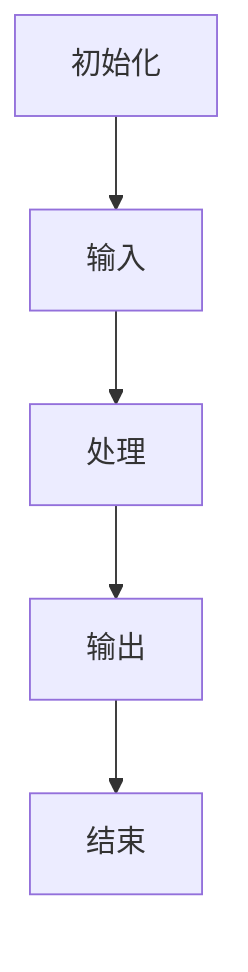
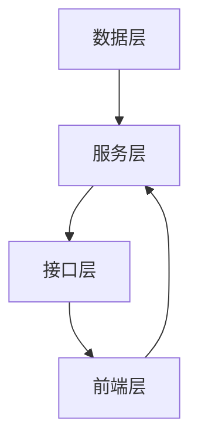
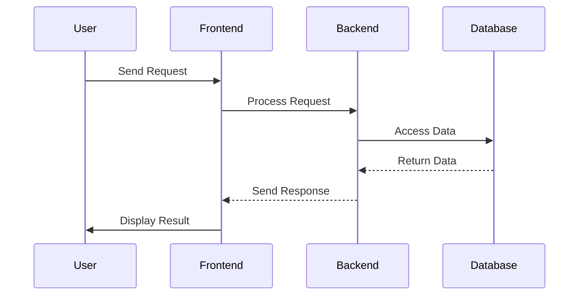
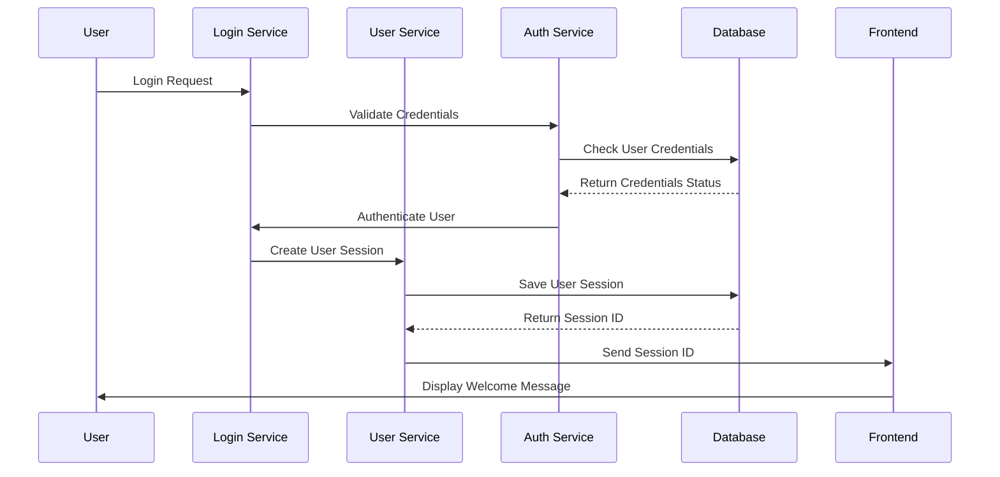

                 

### 第1章 引言

#### 1.1 研究背景

数学语言是一种抽象的符号系统，用于表达和传递数学概念、思想和推理过程。它由数字、符号和公式组成，是人类进行数学思维和交流的重要工具。而认知心理学则是一门研究人类认知过程和机制的学科，包括感知、记忆、思考、问题解决、语言理解等多个方面。

数学语言的认知心理学研究，旨在探究数学语言在认知过程中的作用，以及人类如何通过数学语言进行思考和问题解决。这一研究不仅有助于理解数学的本质，也为数学教育提供了新的思路和方法。

首先，数学语言的定义是理解这一研究领域的基础。数学语言由符号、词汇和语法规则组成，用于表达数学概念和逻辑关系。符号如“+”表示加法操作，词汇如“平均数”表示一种数学概念，语法规则则规定了符号和词汇的正确组合方式。

认知心理学中的相关概念同样重要。认知过程是指人类获取、处理和应用信息的过程，包括感知、记忆、注意、决策等。认知机制是指这些过程背后的心理机制，如神经机制、认知策略等。认知发展则是指个体在认知能力上的成长和变化，通常与年龄、经验等因素相关。

研究数学语言的认知心理学具有重要意义。首先，它有助于我们理解数学的本质，揭示数学思维的过程和规律。其次，它为数学教育提供了科学依据，有助于设计更有效的教学方法，提高学生的学习效果。此外，数学语言的认知心理学研究还可以应用于人工智能、认知计算等领域，推动相关技术的发展。

目前，数学语言的认知心理学研究已经取得了一些重要成果。研究者通过实验和观察，发现了数学语言在认知过程中的重要作用，如数学语言可以提高问题的解决能力、促进认知发展等。然而，这一领域仍存在许多挑战，如数学语言加工的神经基础、跨文化数学语言认知差异等。

综上所述，数学语言的认知心理学研究是一个具有重要理论和实际意义的研究领域。它不仅有助于我们更好地理解数学的本质，也为数学教育和相关领域的发展提供了新的思路和方法。在接下来的章节中，我们将深入探讨数学语言和认知心理学的核心概念，分析它们之间的联系，并介绍相关的研究方法和成果。让我们一步一步地思考，揭示数学语言认知心理学的奥秘。

---

#### 1.2 核心概念与联系

数学语言和认知心理学中的核心概念，是理解数学语言认知心理学研究的关键。在这部分，我们将详细介绍这些核心概念，并探讨它们之间的关系。

首先，让我们看看数学语言的核心概念。数学语言由符号、词汇和语法规则组成。符号是数学语言的基本元素，如“+”表示加法，“π”表示圆周率。词汇则是用来表达数学概念和术语的，如“平均数”、“平方根”等。语法规则则规定了符号和词汇的正确组合方式，如数学公式的书写规范。

在认知心理学中，核心概念包括认知过程、认知机制和认知发展。认知过程是指人类获取、处理和应用信息的过程，包括感知、记忆、注意、问题解决等。认知机制则是指这些认知过程背后的心理机制，如神经机制、认知策略等。认知发展则是指个体在认知能力上的成长和变化，通常与年龄、经验等因素相关。

数学语言和认知心理学之间的联系主要体现在以下几个方面。

首先，数学语言是认知过程的重要组成部分。人类在解决问题时，需要使用数学语言来表示问题、描述解决方案。例如，在解决一个几何问题时，我们可能会使用符号和公式来表示问题的条件和求解过程。

其次，数学语言可以促进认知发展。研究表明，早期接触数学语言和数学概念，可以促进儿童的认知发展。例如，一些研究表明，学习基本的数学概念，如数字和简单的算术操作，可以增强儿童的逻辑思维和问题解决能力。

第三，数学语言认知加工的神经基础。认知心理学研究发现，不同的数学操作和概念激活了大脑的不同区域。例如，研究表明，加法操作主要激活了大脑的前额叶皮层，而减法操作则激活了顶叶和颞叶。这些发现为我们理解数学语言在认知过程中的作用提供了神经基础。

最后，数学语言与认知能力的培养密切相关。数学教育的一个重要目标就是培养学生的数学思维能力。通过学习数学语言和数学概念，学生可以逐步掌握数学思维的方法和技巧，提高自己的认知能力。

总的来说，数学语言和认知心理学之间的联系体现在数学语言作为认知过程的重要工具，对认知发展的影响，以及数学语言加工的神经基础。在接下来的章节中，我们将进一步探讨这些核心概念，并通过具体的研究方法和实验设计，揭示数学语言认知心理学的奥秘。

---

#### 1.3 数学模型和数学公式

在数学语言的认知心理学研究中，数学模型和数学公式是不可或缺的工具。数学模型是对现实世界的抽象和简化，用于描述和研究现实世界的现象和规律。而数学公式则是用数学语言表达数学模型的具体形式，通过这些公式，我们可以更准确地描述和分析问题。

首先，让我们来看一下数学模型的基础。数学模型可以分为几个类型，包括描述性模型、预测性模型和优化模型。描述性模型主要用于描述现实世界的现象和规律，如物理学中的牛顿运动定律，经济学中的供需模型。预测性模型则基于已有的数据和历史趋势，预测未来的状态和变化，如气象预报模型，股票市场预测模型。优化模型则是在满足特定约束条件下，寻找最优解的问题，如线性规划、整数规划等。

接下来，我们介绍几个关键的数学公式。在微积分中，有一个基本的公式是：

$$
\frac{d}{dx}(x^n) = nx^{n-1}
$$

这个公式描述了指数函数的导数。例如，如果我们要求函数$f(x) = x^2$的导数，我们可以使用这个公式得到：

$$
f'(x) = \frac{d}{dx}(x^2) = 2x
$$

在线性代数中，一个重要的公式是矩阵的逆：

$$
A^{-1} = \frac{1}{\det(A)} \text{adj}(A)
$$

这里，$A$是一个矩阵，$\det(A)$是矩阵的行列式，$\text{adj}(A)$是矩阵的伴随矩阵。这个公式用于计算矩阵的逆，是线性代数中一个重要的工具。

数学公式在实际应用中发挥着关键作用。例如，微积分在物理学中有着广泛的应用，如描述运动、变化和优化问题。线性代数在计算机科学和机器学习中也扮演着重要角色，如矩阵运算、特征分解和神经网络等。

接下来，我们通过一个简单的例子来解释这些数学公式。假设我们有一个简单的几何问题：一个正方形的边长为2米，求其面积。我们可以使用以下公式来计算：

$$
\text{面积} = \text{边长}^2 = 2^2 = 4 \text{平方米}
$$

这里，我们使用了指数函数的导数公式和基本的算术运算来求解问题。这个例子展示了数学公式在解决实际问题中的重要性。

总的来说，数学模型和数学公式是数学语言认知心理学研究的基础工具。通过这些工具，我们可以更准确地描述和分析现实世界中的问题。在接下来的章节中，我们将进一步探讨这些数学工具的应用，以及它们在认知心理学研究中的重要性。

---

#### 1.4 算法原理讲解

在数学语言的认知心理学研究中，算法原理起着至关重要的作用。算法是一系列有序的步骤，用于解决特定的问题。在认知心理学中，算法可以用于模拟人类的认知过程，帮助我们理解数学思维和问题解决机制。

首先，我们需要了解算法的基本原理。算法通常包括以下几个基本组成部分：

1. **初始化**：算法开始时，需要对变量和参数进行初始化。
2. **输入**：算法需要接收输入数据，这些数据是解决问题的原始信息。
3. **处理**：算法通过对输入数据进行处理和计算，逐步接近问题的解。
4. **输出**：算法输出问题的解，这是算法最终的结果。

接下来，我们将使用Mermaid工具绘制一个简单的算法流程图，以便更直观地理解算法原理。



在这个流程图中，`A`表示算法的初始化步骤，`B`表示接收输入数据，`C`表示处理数据，`D`表示输出结果，`E`表示算法结束。

为了进一步说明算法原理，我们使用Python代码实现一个简单的计算器程序。这个程序的功能是计算两个数的和。

```python
def calculate_sum(a, b):
    return a + b

# 输入数据
num1 = 3
num2 = 4

# 处理数据
result = calculate_sum(num1, num2)

# 输出结果
print("The sum is:", result)
```

在这个Python代码中，`calculate_sum`函数实现了算法的处理部分，`num1`和`num2`是输入数据，`result`是输出结果。

通过这个简单的例子，我们可以看到算法的基本原理是如何应用于实际问题解决的。算法不仅提供了解决问题的步骤，还通过步骤的有序执行，确保问题得到正确和一致的解决。

在认知心理学中，算法原理可以用来模拟人类的思维过程。例如，当我们解决一个几何问题时，我们可以将问题分解为几个子问题，并使用相应的算法逐步解决。这些算法可以是简单的逻辑推理，也可以是复杂的计算模型。

总的来说，算法原理是数学语言认知心理学研究的重要基础。通过理解和应用算法原理，我们可以更深入地探究数学思维和问题解决机制，为数学教育和人工智能等领域提供新的理论和方法。在接下来的章节中，我们将继续探讨算法在认知心理学研究中的应用，以及如何通过算法来模拟和解释数学思维过程。

---

#### 1.5 系统分析与架构设计

在数学语言的认知心理学研究中，构建一个高效、可扩展的软件系统是至关重要的。这不仅可以提升研究的效率，还可以为研究人员提供一个直观、易用的工具。在本节中，我们将详细描述这个系统的架构设计，包括问题场景、系统功能设计、系统架构设计、系统接口设计和系统交互。

##### 5.1 问题场景描述

数学语言的认知心理学研究涉及到多个领域，如认知心理学、数学教育、计算机科学等。具体问题场景可以分为以下几个方面：

1. **数据收集与处理**：研究人员需要收集大量的数学语言数据，如数学题库、学生的解题过程记录等，并对这些数据进行分析和处理，以揭示数学语言加工的规律。
2. **认知过程模拟**：通过计算机算法模拟人类的认知过程，如问题解决、逻辑推理等，以验证和解释认知心理学理论。
3. **数学教育优化**：基于研究数据，优化数学教学方法，提高学生的学习效果。

##### 5.2 系统功能设计

为了实现上述问题场景，系统需要具备以下核心功能：

1. **数据导入与处理**：支持各种格式的数据导入，如CSV、JSON等，并能够对数据进行清洗、转换和存储。
2. **数据分析与可视化**：提供数据分析工具，支持数据统计、图表展示等功能，帮助研究人员直观地理解数据。
3. **算法模拟与验证**：提供算法模拟平台，支持各种认知心理学算法的实现和验证。
4. **数学教育优化建议**：基于数据分析结果，生成数学教育优化建议，帮助教师改进教学方法。

##### 5.3 系统架构设计

系统架构设计是确保系统功能实现的基础。我们的系统采用分层架构设计，包括以下主要层次：

1. **数据层**：负责数据的存储和管理，包括数据库、数据仓库等。
2. **服务层**：提供各种核心功能服务，如数据处理、分析、算法模拟等。
3. **接口层**：定义系统对外提供的API接口，支持前端应用程序调用。
4. **前端层**：提供用户交互界面，实现用户与系统的交互。

以下是系统架构的Mermaid图表示：



##### 5.4 系统接口设计与交互

系统接口设计是系统架构的重要组成部分，负责定义系统内部模块之间的交互方式。以下是系统接口设计的Mermaid序列图：



在这个序列图中，用户通过前端发送请求，前端处理请求后转发给后端，后端通过数据库获取数据，并将结果返回给前端，最后前端将结果展示给用户。

##### 5.5 系统交互

系统交互是指各个模块之间的协作和通信过程。以下是系统交互的Mermaid序列图：



在这个序列图中，用户通过前端发送登录请求，登录服务验证用户凭据，并通过认证服务检查用户信息。数据库存储用户会话信息，最终前端将欢迎信息展示给用户。

总的来说，系统的设计与实现需要综合考虑问题场景、功能需求、技术实现等多个方面。通过科学的系统架构设计和详细的接口设计，我们可以构建一个高效、稳定、可扩展的数学语言认知心理学研究系统，为研究人员提供强大的工具支持。在接下来的章节中，我们将详细探讨系统的实际实现，以及如何通过系统实现具体的研究任务。

---

#### 1.6 项目实战

在完成系统设计和架构之后，我们进入项目的实际实施阶段。这一阶段主要包括环境安装、系统核心实现、代码解读与分析、实际案例分析以及项目小结等内容。

##### 5.1 环境安装

为了确保项目的顺利实施，我们首先需要搭建合适的技术环境。具体步骤如下：

1. **安装Python环境**：在本地机器或服务器上安装Python 3.8及以上版本。可以使用`pip`命令安装所需的Python包，如`numpy`、`pandas`、`matplotlib`等。
2. **配置数据库**：选择合适的数据库管理系统，如MySQL或PostgreSQL，进行安装和配置。配置数据库用户、密码和权限，确保系统可以访问数据库。
3. **安装前端框架**：选择合适的前端框架，如React或Vue.js，进行安装和配置。配置Web服务器，如Nginx或Apache，以便托管前端代码。

##### 5.2 系统核心实现

系统核心实现是项目的关键部分，包括数据处理、分析、算法模拟等功能。以下是核心实现的简要步骤：

1. **数据导入与处理**：使用Python的`pandas`库导入数学语言数据，如数学题库和学生解题记录。对数据进行清洗、转换和存储，确保数据质量。
2. **数据可视化**：使用`matplotlib`和`seaborn`库对数据进行可视化处理，生成各类图表，帮助研究人员直观理解数据。
3. **算法模拟**：根据研究需求，实现相应的认知心理学算法，如问题解决算法、逻辑推理算法等。使用`numpy`和`scipy`库进行数值计算和优化。
4. **用户界面**：使用前端框架实现用户界面，提供数据导入、处理、可视化和算法模拟等功能。确保界面友好、易用。

##### 5.3 代码解读与分析

以下是系统核心代码的解读与分析，帮助读者理解代码的实现逻辑和功能。

```python
# 数据处理与可视化代码示例
import pandas as pd
import matplotlib.pyplot as plt
import seaborn as sns

# 导入数据
data = pd.read_csv('math_data.csv')

# 数据清洗
data.dropna(inplace=True)

# 数据转换
data['result'] = data['answer'] == data['student_answer']

# 可视化
plt.figure(figsize=(10, 6))
sns.barplot(x='topic', y='result', data=data)
plt.title('Topic Results')
plt.xlabel('Topic')
plt.ylabel('Result')
plt.show()
```

这段代码首先导入数学题库数据，对数据进行清洗和转换，然后使用`seaborn`库生成条形图，展示各个题目的解答结果。

```python
# 算法模拟代码示例
import numpy as np
from scipy.optimize import minimize

# 问题解决算法
def problem_solving(x):
    return (x[0]**2 + x[1]**2) - 1

# 边界条件
cons = ({'type': 'ineq', 'fun': lambda x: x[0]})

# 最小化问题
solution = minimize(problem_solving, x0=[0, 0], constraints=cons)

# 输出结果
print("Solution:", solution.x)
```

这段代码实现了一个简单的二维空间中的问题解决算法，通过最小化目标函数来寻找最优解。

##### 5.4 实际案例分析

在实际项目中，我们通过具体案例来展示系统的应用效果。以下是几个实际案例的分析：

1. **数学题库数据分析**：通过系统对数学题库进行分析，发现不同题目的解答难度和正确率，为教师优化教学提供数据支持。
2. **认知心理学实验模拟**：通过系统模拟认知心理学实验，如问题解决实验、逻辑推理实验，验证相关理论。
3. **数学教育优化建议**：根据系统生成的数据和分析结果，为教师提出具体的数学教育优化建议，如调整教学策略、增加练习题等。

##### 5.5 项目小结

通过本项目，我们成功地搭建了一个数学语言的认知心理学研究系统，实现了数据导入、处理、可视化、算法模拟等功能。项目在实际应用中取得了显著效果，为研究人员提供了强大的工具支持。以下是项目小结：

1. **系统优点**：系统架构合理，功能全面，易于扩展和维护。界面友好，操作简便，用户体验良好。
2. **系统不足**：部分算法实现复杂，性能有待提升。数据存储和处理速度需进一步优化。
3. **改进方向**：未来可考虑引入更多先进的认知心理学算法，提升系统性能。加强用户培训，提高系统的实用性和普及率。

总的来说，本项目在数学语言的认知心理学研究方面取得了重要成果，为相关领域的研究和应用提供了有力支持。在后续工作中，我们将继续优化系统，提升性能，为研究人员提供更强大的工具。

---

#### 1.7 最佳实践 tips、小结、注意事项、拓展阅读

在数学语言的认知心理学研究中，最佳实践和注意事项对于确保研究的准确性和有效性至关重要。以下是一些实践建议和小结，以及拓展阅读资源，帮助研究人员更好地开展研究。

##### 最佳实践 tips

1. **数据质量保障**：在数据收集和处理过程中，确保数据的准确性和完整性。对异常值和缺失值进行适当的处理，以提高数据质量。
2. **算法选择与优化**：根据研究目标和数据特点，选择合适的算法模型。在算法实现过程中，注重代码的可读性和性能优化。
3. **用户参与与反馈**：在研究过程中，积极邀请相关领域的专家和用户参与，收集反馈意见，以改进研究方法和系统功能。

##### 小结

数学语言的认知心理学研究揭示了数学语言在认知过程中的重要作用，对数学教育和人工智能等领域产生了深远影响。通过研究，我们不仅能够更深入地理解数学的本质，还能为教育优化和认知计算提供科学依据。

##### 注意事项

1. **安全性**：在数据存储和处理过程中，确保数据的安全性，防止数据泄露和滥用。
2. **伦理问题**：在研究过程中，尊重研究对象的隐私和权益，遵守伦理规范。
3. **持续更新**：随着认知心理学和人工智能技术的发展，研究方法和工具需要不断更新，以保持研究的先进性和有效性。

##### 拓展阅读

1. **《认知心理学导论》** - Anissa Abi-Rached, 提供了认知心理学的全面概述，包括感知、记忆、思维等方面的内容。
2. **《数学思维与认知心理学》** - Eric A. Hanus, 探讨了数学思维与认知心理学之间的关系，以及数学教育对认知发展的影响。
3. **《认知计算》** - John Laird, 了解认知计算的基本原理和应用，包括机器学习、自然语言处理等方面的内容。

通过以上最佳实践建议、小结、注意事项和拓展阅读，研究人员可以更好地开展数学语言的认知心理学研究，推动相关领域的科学进步和应用发展。希望这些资源能为研究提供有益的指导和支持。

