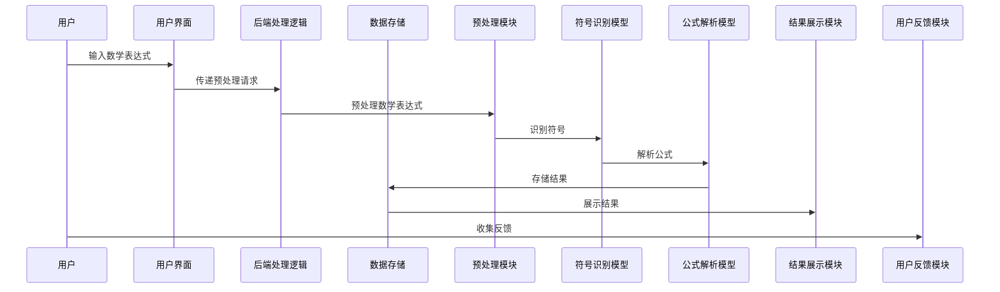
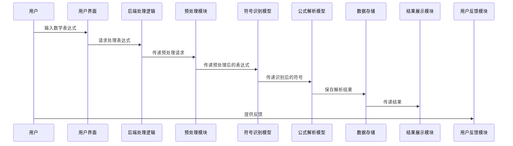

                 


### 第1章 引言

**1.1 问题背景**

数学语言是现代科学技术发展的基石，其独特的符号系统和抽象表达能力使得数学成为了一门精确而强有力的学科。然而，尽管数学语言在科学研究和工程实践中具有广泛的应用，但对其认知语言学的分析仍是一个相对较新的研究领域。认知语言学关注的是语言与认知之间的相互作用，研究语言是如何影响我们的思维和认知过程的。在数学领域，这种研究可以帮助我们更好地理解数学知识的习得、表达和应用过程。

**1.2 问题描述**

数学语言的认知语言学分析旨在探讨以下问题：

1. 数学符号和表达式的认知加工机制是什么？
2. 数学语言的语法结构和语义特征如何影响我们的认知过程？
3. 不同文化背景下的个体对数学语言的认知差异有哪些？
4. 数学语言在语言习得和数学教育中的应用前景如何？

**1.3 研究目的与方法**

本研究的目的在于通过认知语言学的视角，深入分析数学语言的认知特性，揭示其与人类认知之间的内在联系。研究方法包括：

- 理论分析：通过文献综述，总结数学语言和认知语言学的相关理论，建立研究的理论基础。
- 实证研究：设计实验，收集和分析数据，验证理论假设。
- 对比分析：比较不同文化背景下的数学语言认知差异，探讨文化因素对数学语言习得的影响。

**1.4 边界与外延**

边界：本研究关注的主要是数学语言在认知语言学层面的分析，不包括数学哲学和数学逻辑等更广泛的领域。

外延：研究范围涵盖了数学语言的符号系统、语法结构、语义特征以及其在教育、计算和科学应用中的认知作用。

**1.5 概念结构与核心要素组成**

- **数学语言符号系统**：包括基本符号、运算符、希腊字母等。
- **数学表达式**：如方程、不等式、函数表达式等。
- **认知语言学理论**：包括符号认知、语义解析、语法构建等。
- **实验方法**：包括问卷调查、实验测试、数据分析等。

通过上述内容的介绍，我们可以为后续章节的内容打下坚实的基础，使读者对数学语言的认知语言学分析有一个整体的把握。

### 第2章 数学语言的基本概念

**2.1 数学语言定义与特征**

数学语言是一种专门用于表达数学概念的符号系统，它具有以下基本特征：

- **抽象性**：数学语言通过符号和公式来表示抽象的数学概念，如数字、函数、集合等，这种抽象性使得数学语言能够超越具体的事物，广泛应用于各个领域。
- **精确性**：数学语言的符号和公式具有明确的定义和严格的语法规则，这使得数学表达具有高度的准确性和确定性。
- **形式化**：数学语言强调形式化表达，通过符号和公式的组合，构建出严谨的数学理论体系。

**2.2 数学符号的语义和语法**

数学符号的语义和语法是数学语言的核心组成部分。数学符号的语义指的是符号所代表的概念或意义，而语法则是关于符号组合的规则。

- **语义**：数学符号的语义可以通过其历史背景和定义来理解。例如，符号“+”代表加法运算，符号“π”代表圆周率，符号“√”代表平方根等。不同的数学符号在语义上有着明确而具体的定义。
- **语法**：数学符号的语法规则包括符号的使用顺序、运算符的优先级、括号的使用等。例如，在表达式中，乘法和除法的优先级高于加法和减法，因此表达式“2 + 3 * 4”的计算结果为14，而不是20。

**2.3 数学表达式的认知解析**

数学表达式的认知解析涉及如何理解、处理和解释数学公式。这一过程可以分为以下几个步骤：

1. **符号识别**：首先，我们需要识别并理解公式中的各个符号及其语义。
2. **语法解析**：其次，我们需要根据数学语言的语法规则，正确解析符号的组合顺序。
3. **语义解析**：最后，我们将符号和语法规则结合起来，理解整个表达式的意义。

例如，对于表达式“3x + 5 = 14”，我们可以按照以下步骤进行认知解析：

1. **符号识别**：识别出符号“3”、“x”、“+”、“5”、“=”、“14”。
2. **语法解析**：根据数学语言规则，确定运算顺序为先乘除后加减，且等式两边的运算需要平衡。
3. **语义解析**：理解表达式表示的是一个代数方程，需要找到满足等式的未知数x的值。

**2.4 数学语言的认知加工模型**

数学语言的认知加工模型描述了人类大脑如何处理和理解数学语言的过程。这个过程可以概括为以下几个阶段：

1. **感知与编码**：大脑通过视觉系统感知数学符号，并将这些符号转化为神经编码。
2. **符号识别**：大脑识别出符号的语义，即符号所代表的数学概念。
3. **语法解析**：大脑根据数学语言的语法规则，对符号序列进行解析，构建出数学表达式。
4. **语义整合**：大脑将符号和语法解析的结果整合，理解数学表达式的意义。

通过以上内容的介绍，我们为读者构建了数学语言的基本概念框架，为后续章节的深入分析打下了坚实的基础。

### 第3章 认知语言学基础

**3.1 认知语言学的起源与发展**

认知语言学（Cognitive Linguistics）起源于20世纪60年代，是对传统语言学研究方法的一种挑战和补充。传统语言学主要关注语言的语音、词汇、语法等外在形式，而认知语言学则将研究的焦点转向了人类如何通过语言来认知世界，探讨语言与思维之间的内在联系。其起源可以追溯到以下几个重要的里程碑：

1. **语言行为主义与转换生成语法**：在20世纪50年代，语言行为主义和转换生成语法成为了语言学研究的两个主要流派。然而，这些方法在解释语言习得和语言使用中的认知过程时显得力不从心，促使学者们开始探索新的路径。

2. **心智哲学与心智模型**：心智哲学和心智模型的研究为认知语言学提供了理论基础。哲学家们开始关注思维的本质和心智的工作原理，这些思考为认知语言学提供了启示。

3. **认知科学的发展**：随着认知科学的兴起，心理学家、神经科学家、计算机科学家等跨学科研究者开始关注语言、思维和认知之间的关系，这一趋势进一步推动了认知语言学的发展。

**3.2 认知语言学的基本概念**

认知语言学有以下几个基本概念：

1. **符号表征**：认知语言学认为，语言中的符号不仅仅是一种标记，而是对现实世界的抽象表征。符号表征不仅包括词汇和句子，还包括手势、表情等非语言符号。

2. **认知范畴**：认知范畴是指人们根据某种标准对事物进行分类和分组的过程。在认知语言学中，认知范畴的研究帮助解释了词汇的语义分类和语法结构。

3. **语法构建**：认知语言学认为，语法结构并非是固定的规则系统，而是人们基于认知过程构建出来的。这种观点强调了语法与认知之间的互动关系。

4. **语言习得**：认知语言学关注语言习得的过程，探讨儿童如何通过互动和经验来习得语言。这一研究为语言教育和语言学习提供了新的视角。

**3.3 认知语言学与语言习得**

认知语言学对语言习得的研究具有重要意义。通过认知语言学的视角，我们可以理解以下问题：

1. **语言习得的过程**：认知语言学认为，语言习得是一个动态的、互动的过程，涉及感知、理解、记忆和产出等多个环节。

2. **语言习得的机制**：认知语言学探讨了语言习得中的认知机制，如认知地图、原型理论、范畴化等，这些机制帮助解释了儿童如何习得语言规则和词汇。

3. **语言习得的影响因素**：认知语言学还研究了文化、社会、教育等因素对语言习得的影响，这些因素共同作用于个体的语言习得过程。

**3.4 认知语言学与语言使用**

认知语言学不仅关注语言习得，还关注语言使用。在语言使用方面，认知语言学研究以下问题：

1. **语言表达和理解**：认知语言学探讨了人们如何通过语言表达思想和情感，以及如何理解他人的语言表达。

2. **语言互动**：认知语言学研究了语言在社交互动中的作用，如语言的合作原则、礼貌原则等。

3. **语言多样性和变化**：认知语言学关注语言多样性和变化，探讨了语言在不同文化和社会背景下的演变和发展。

通过以上对认知语言学基础的介绍，我们为后续章节的数学语言认知语言学分析奠定了理论基础。接下来，我们将进一步探讨数学语言的认知语言学分析，揭示其与人类认知之间的内在联系。

### 第4章 数学语言的认知语言学分析

**4.1 数学语言符号的认知语义分析**

数学语言符号的认知语义分析是理解数学语言的基础。数学符号不仅仅是标记或符号，它们承载着具体的语义信息，这些信息是数学概念的核心组成部分。

**4.1.1 数学符号的语义特征**

数学符号的语义特征可以通过以下几个方面来分析：

1. **基本符号的语义**：基本符号如数字（0, 1, 2, 3, ...）、运算符（+、-、×、÷）、关系符（=、≠、<、>）等，具有明确的语义。例如，“+”代表加法运算，“3”表示数量三。

2. **希腊字母的语义**：希腊字母在数学中广泛使用，如π（代表圆周率）、θ（代表角度）、μ（代表平均值）等。这些符号通过历史和约定俗成的方式获得了特定的语义。

3. **组合符号的语义**：组合符号如函数表达式（f(x)）、向量（a→b）等，通过基本符号的组合表达了更复杂的数学概念。这些组合符号的语义是由其组成部分的语义决定的。

**4.1.2 数学符号的语法功能**

数学符号的语法功能是指符号在数学表达式中的具体作用和位置。数学符号的语法功能可以分为以下几个方面：

1. **运算符**：运算符如“+”和“×”在表达式中执行特定的计算操作。例如，“3 + 4”中的“+”表示加法运算。

2. **关系符**：关系符如“=”和“≠”用于表示数学表达式之间的关系。例如，“x = y”表示变量x和变量y的值相等。

3. **函数符**：函数符如“f”和“g”表示数学函数。例如，“f(x) = x^2”表示函数f在自变量x取值时返回x的平方。

**4.1.3 数学符号的认知加工机制**

认知加工机制是指人类大脑如何处理和理解数学符号的过程。这个过程可以分为以下几个步骤：

1. **符号识别**：大脑通过视觉系统识别数学符号，并将其与记忆中的符号库进行匹配。

2. **语义编码**：一旦符号被识别，大脑将其转换为相应的语义信息。例如，符号“3”被编码为数量三。

3. **语法解析**：大脑根据数学语言的语法规则，对符号序列进行解析，构建出数学表达式。

4. **语义整合**：大脑将符号和语法解析的结果整合，理解整个表达式的意义。例如，表达式“3 + 4”被整合为数量七。

**4.1.4 数学符号的认知可及性研究**

数学符号的认知可及性研究探讨了不同文化背景和教育程度的人如何理解和运用数学符号。研究表明，认知可及性受到以下因素的影响：

1. **文化背景**：不同文化对数学符号的接受和使用方式有所不同。例如，某些文化可能更倾向于使用特定的数学符号，而其他文化可能使用不同的符号。

2. **教育程度**：教育程度较高的个体通常对数学符号有更深入的理解和应用能力。

3. **实践经验**：经常使用数学符号的个体可能对其有更高的认知可及性。

**实例分析：**

例如，对于表达式“πr^2”，认知加工机制如下：

1. **符号识别**：大脑识别出符号“π”、“r”和“^2”。
2. **语义编码**：“π”被编码为圆周率，“r”被编码为半径，“^2”被编码为平方。
3. **语法解析**：根据数学语言规则，确定运算顺序为先平方后乘以π。
4. **语义整合**：整个表达式表示的是圆的面积，公式为π乘以半径的平方。

通过上述分析，我们可以看到数学语言符号的认知语义分析是如何帮助理解数学表达式的含义和结构的。接下来，我们将进一步探讨数学语言的句法结构和认知解析。

### 第4章 数学语言的认知语言学分析

**4.2 数学语言句法的认知解析**

数学语言的句法结构是数学表达式的核心，它决定了数学表达式如何被理解和计算。数学语言的句法认知解析涉及对数学表达式结构的分析和理解，以下将详细探讨这一过程。

**4.2.1 数学句法结构的特点**

数学句法结构具有以下几个显著特点：

1. **符号组合规则**：数学句法结构遵循严格的组合规则。例如，运算符的优先级规则决定了表达式中不同运算的执行顺序。

2. **层次结构**：数学表达式通常具有层次结构。从最内层的括号开始，向外扩展到整个表达式。这种层次结构使得复杂表达式易于理解和计算。

3. **功能明确**：数学句法结构中的每个符号都有明确的功能。例如，数字作为变量或常量，运算符执行特定的运算，函数符表示特定的数学操作。

**4.2.2 数学句法的认知解析过程**

数学句法的认知解析过程可以分为以下几个步骤：

1. **符号识别与语义编码**：大脑首先识别出表达式的每个符号，并将其与记忆中的符号库进行匹配。接着，大脑将符号转换为相应的语义信息。例如，“3”被编码为数量三，“+”被编码为加法运算。

2. **语法解析**：大脑根据数学语言的语法规则，对符号序列进行解析，构建出数学表达式。这一过程涉及对括号、运算符优先级等语法结构的理解。例如，表达式“3 + (4 × 2)”需要先计算括号内的乘法，再进行加法。

3. **层次结构构建**：大脑将解析结果构建成层次结构。从最内层的括号开始，向外扩展，形成完整的数学表达式结构。这种层次结构有助于大脑理解和计算复杂表达式。

4. **语义整合**：大脑将符号和语法解析的结果整合，理解整个表达式的意义。例如，表达式“3 + (4 × 2)”被整合为七个。

**4.2.3 数学句法认知的复杂性**

数学句法的认知复杂性取决于表达式的复杂程度。以下因素可能影响认知复杂性：

1. **符号数量**：表达式中的符号数量越多，认知难度越大。例如，表达式“3 + 4 + 5 + 6 + 7”比“3 + 4”要复杂。

2. **运算符种类**：不同运算符的种类和组合会增加认知复杂性。例如，表达式“3 + 4 × 2”比“3 + 4”要复杂。

3. **层次结构**：表达式的层次结构越复杂，认知难度越大。例如，表达式“(3 + 4) × (5 + 6)”比“3 + 4”要复杂。

**实例分析：**

考虑表达式“3 + 4 × 2”，认知解析过程如下：

1. **符号识别与语义编码**：大脑识别出符号“3”、“+”和“×”，并将它们编码为数量三、加法运算和乘法运算。

2. **语法解析**：根据运算符优先级规则，大脑先计算乘法“4 × 2”，然后进行加法运算。

3. **层次结构构建**：大脑构建出层次结构，先计算内层乘法，再进行外层加法。

4. **语义整合**：最终结果为“3 + 8”，即数字十一。

通过上述步骤，我们可以看到数学语言句法的认知解析是如何帮助大脑理解和计算数学表达式的。接下来，我们将进一步探讨数学语言表达式的认知加工过程。

### 第4章 数学语言的认知语言学分析

**4.3 数学语言表达式的认知加工过程**

数学语言表达式的认知加工过程是理解数学语言的关键。这一过程涉及符号识别、语法解析和语义整合等多个环节，下面将详细分析这一过程。

**4.3.1 数学语言表达式认知加工的基本步骤**

1. **符号识别**：首先，大脑通过视觉系统识别数学表达式中的符号。这些符号包括数字、运算符、关系符、函数符等。例如，在表达式“3 + 4 × 2”中，符号包括“3”、“+”、“4”、“×”和“2”。

2. **语义编码**：大脑将识别出的符号转换为相应的语义信息。例如，“3”被编码为数量三，“+”被编码为加法运算，“4”被编码为数量四，“×”被编码为乘法运算，“2”被编码为数量二。

3. **语法解析**：大脑根据数学语言的语法规则，对符号序列进行解析，构建出数学表达式。这一过程包括确定运算符的优先级、处理括号等。例如，在表达式“3 + 4 × 2”中，根据运算符优先级规则，先计算乘法“4 × 2”，然后进行加法运算。

4. **层次结构构建**：大脑将解析结果构建成层次结构。从最内层的括号开始，向外扩展，形成完整的数学表达式结构。例如，表达式“3 + (4 × 2)”的层次结构为“3 + 8”。

5. **语义整合**：大脑将符号和语法解析的结果整合，理解整个表达式的意义。例如，表达式“3 + 4 × 2”被整合为数字十一。

**4.3.2 认知加工过程中的认知负荷**

认知负荷是指大脑在处理信息时所需的认知资源。在数学语言表达式的认知加工过程中，认知负荷受到以下因素的影响：

1. **符号数量**：表达式中的符号数量越多，认知负荷越大。例如，表达式“3 + 4 + 5 + 6 + 7”比“3 + 4”的认知负荷更高。

2. **运算符种类**：不同运算符的种类和组合会增加认知负荷。例如，表达式“3 + 4 × 2”比“3 + 4”的认知负荷更高。

3. **层次结构**：表达式的层次结构越复杂，认知负荷越大。例如，表达式“(3 + 4) × (5 + 6)”比“3 + 4”的认知负荷更高。

**4.3.3 认知加工过程中的个体差异**

不同个体在数学语言表达式的认知加工过程中可能存在差异，这些差异受到以下因素的影响：

1. **教育背景**：教育背景较高的个体通常具有更强的数学语言认知能力。

2. **认知风格**：不同认知风格（如场依存型和场独立型）的个体在数学语言表达式的认知加工过程中可能存在差异。

3. **实践经验**：经常接触和运用数学语言的个体通常具有更高的认知能力。

**实例分析：**

考虑表达式“3 + 4 × 2”，认知加工过程如下：

1. **符号识别**：大脑识别出符号“3”、“+”、“4”、“×”和“2”。

2. **语义编码**：“3”被编码为数量三，“+”被编码为加法运算，“4”被编码为数量四，“×”被编码为乘法运算，“2”被编码为数量二。

3. **语法解析**：根据运算符优先级规则，大脑先计算乘法“4 × 2”，然后进行加法运算。

4. **层次结构构建**：大脑构建出层次结构，先计算内层乘法“4 × 2”，再进行外层加法“3 + 8”。

5. **语义整合**：最终结果为“3 + 8”，即数字十一。

通过上述步骤，我们可以看到数学语言表达式的认知加工过程是如何帮助大脑理解和计算数学表达式的。接下来，我们将探讨数学语言与认知心理的互动。

### 第4章 数学语言的认知语言学分析

**4.4 数学语言与认知心理的互动**

数学语言作为人类思维的工具，其与认知心理的互动关系对数学知识的习得、理解和应用具有重要意义。以下将探讨数学语言与认知心理之间的互动，分析数学语言如何影响认知过程，以及认知心理如何影响数学语言的学习和应用。

**4.4.1 数学语言对认知过程的影响**

1. **符号表征的影响**：数学符号作为抽象的表征工具，能够将复杂的数学概念简化为直观的符号形式。这种符号表征有助于个体在认知过程中对数学概念进行组织、存储和提取。例如，数字符号“3”能够直观地代表数量三，从而帮助个体理解数学运算的基本概念。

2. **语法规则的影响**：数学语言的语法规则，如运算符的优先级、括号的使用等，对认知过程的顺序和逻辑性提出了要求。个体在遵循这些语法规则的过程中，能够培养出严密的逻辑思维能力和问题解决能力。例如，在计算表达式“3 + 4 × 2”时，个体需要先计算乘法再计算加法，这有助于培养个体在解决问题时遵循逻辑顺序的能力。

3. **语义整合的影响**：数学语言的表达式通过符号和语法的组合，形成了具有明确意义的数学命题。这种语义整合能力有助于个体在认知过程中对信息进行整合和理解。例如，表达式“x + y = z”不仅传达了数学运算的结果，还蕴含了变量之间的关系。

**4.4.2 认知心理对数学语言学习的影响**

1. **认知负荷的影响**：认知负荷是指大脑在处理信息时所需的认知资源。个体在学习和应用数学语言时，需要承担一定的认知负荷。例如，理解复杂的数学表达式和推导过程，需要大量的注意力、记忆和工作记忆。认知负荷过高可能导致学习困难，而过低的认知负荷则可能影响学习效果。

2. **认知风格的影响**：不同认知风格的个体在数学语言学习上可能存在差异。场独立型个体倾向于从整体上理解和应用数学语言，而场依存型个体则更注重细节和逻辑顺序。这种差异可能导致个体在数学语言学习上的不同偏好和学习策略。

3. **认知发展的阶段**：儿童的认知发展过程会影响其对数学语言的理解和应用。例如，幼儿阶段个体可能更依赖于直观的符号表征，而成年个体则更擅长抽象的逻辑推理和符号运算。

**4.4.3 数学语言与认知心理的互动案例**

1. **数学问题解决**：在解决数学问题时，个体需要调用认知过程中的多个模块，如符号识别、语义整合、逻辑推理等。例如，在解决代数方程时，个体需要识别变量符号、整合等式两边的运算结果，并通过逻辑推理找到未知数的值。

2. **数学语言学习**：在数学语言学习过程中，个体的认知心理对学习效果有重要影响。例如，通过符号表征和语法规则的学习，个体能够逐渐掌握数学语言的基本概念和表达方法。同时，个体的认知发展水平也决定了其能够理解和应用多复杂的数学概念。

通过上述分析，我们可以看到数学语言与认知心理之间的互动关系是如何影响数学知识的习得、理解和应用的。接下来，我们将探讨数学语言在数学教学中的重要性及其教学策略。

### 第5章 数学语言的教学与应用

**5.1 数学语言教学的重要性**

数学语言作为数学知识的重要载体，其教学在数学教育中具有不可替代的地位。数学语言教学的重要性体现在以下几个方面：

1. **理解数学概念**：数学语言能够将复杂的数学概念简化为直观的符号形式，帮助学生更好地理解和掌握数学知识。例如，通过数学符号和表达式，学生可以直观地理解函数、方程、不等式等概念。

2. **培养逻辑思维能力**：数学语言的语法规则和运算规则有助于培养学生的逻辑思维能力和问题解决能力。例如，通过学习和应用运算符的优先级规则，学生可以培养出遵循逻辑顺序解决问题的习惯。

3. **提高学习效率**：熟练掌握数学语言能够提高学生数学学习的效率。学生能够更快速地理解和解决数学问题，从而节省学习时间，提高学习效果。

**5.2 数学语言教学的策略与方法**

有效的数学语言教学需要结合多种策略和方法，以适应不同学习风格和认知水平的学生。以下是一些常见的教学策略和方法：

1. **直观教学**：通过直观的符号和图形，帮助学生理解数学概念。例如，使用数线图、函数图像等直观工具，帮助学生理解数和函数的概念。

2. **逐步引导**：在数学语言教学中，教师应逐步引导学生理解符号和表达式，避免一次性给出过多的信息。例如，先教授基本符号，再逐步引入更复杂的运算符和函数符。

3. **实践练习**：通过大量的练习，帮助学生巩固数学语言知识和技能。教师可以设计各种类型的练习，如填空题、选择题、解答题等，以激发学生的学习兴趣和提高其实际应用能力。

4. **互动教学**：通过师生互动和生生互动，激发学生的学习兴趣和积极性。例如，组织小组讨论、角色扮演等活动，让学生在实践中学习和应用数学语言。

**5.3 数学语言在数学学习中的应用**

数学语言在数学学习中具有广泛的应用，以下是一些具体的应用场景：

1. **代数运算**：代数运算需要熟练掌握数学语言，如变量、运算符、方程等。学生需要通过大量的练习，掌握代数运算的基本规则和技巧。

2. **函数分析**：函数分析是高中和大学数学的重要内容。通过数学语言，学生可以直观地理解函数的定义、图像和性质，如奇偶性、单调性等。

3. **微积分**：微积分是数学中重要的分支，其基础是极限、导数和积分等概念。数学语言的表达式能够帮助学生理解这些抽象概念，如极限表达式、导数公式和积分公式。

4. **概率与统计**：概率与统计问题通常涉及大量的数学语言，如概率分布、随机变量、统计参数等。学生需要通过数学语言来描述和分析概率与统计问题。

**5.4 数学语言在其他学科中的应用**

数学语言不仅在数学学习中具有重要应用，还在其他学科中发挥着重要作用：

1. **自然科学**：数学语言在自然科学中用于描述和解释自然现象。例如，物理学中的公式、化学中的化学反应方程式、生物学的生态模型等，都使用了数学语言。

2. **工程技术**：工程技术领域广泛使用数学语言进行设计和分析。例如，电子工程中的电路方程、机械工程中的力学公式、计算机科学中的算法描述等。

3. **社会科学**：数学语言在社会科学中用于分析社会现象和数据。例如，经济学中的供求模型、社会学中的统计方法、心理学中的实验设计等。

通过以上对数学语言教学的重要性和应用场景的探讨，我们可以看到数学语言在数学教育和各个学科中的广泛应用，以及其在培养逻辑思维能力和问题解决能力方面的重要作用。接下来，我们将进一步探讨数学语言处理算法的基本原理。

### 第6章 算法原理与模型

**6.1 数学语言处理算法概述**

数学语言处理（Mathematical Language Processing）是一种将自然语言处理（Natural Language Processing, NLP）的方法应用于数学领域的技术。其核心目标是通过分析和理解数学文本，实现数学概念、符号和公式的自动化处理。数学语言处理算法在数学教育、科研和工程应用中具有重要价值，能够提高数学文本的自动分析、解释和生成能力。

**6.2 机器学习算法在数学语言中的应用**

机器学习算法在数学语言处理中发挥着关键作用，以下是一些常见的机器学习算法及其在数学语言处理中的应用：

1. **文本分类**：文本分类算法可以将数学文本分类到不同的类别，如代数、几何、微积分等。常用的算法包括朴素贝叶斯分类器、支持向量机（SVM）和深度学习模型（如卷积神经网络CNN）。

2. **关系抽取**：关系抽取算法用于从数学文本中提取变量之间的关系。例如，从代数表达式中提取变量之间的等式关系。常用的算法包括依存句法分析和图神经网络（Graph Neural Networks, GNN）。

3. **符号识别**：符号识别算法用于识别数学文本中的符号，如数字、运算符和函数符。卷积神经网络（CNN）和循环神经网络（RNN）是常用的符号识别算法。

4. **公式解析**：公式解析算法用于解析和理解数学文本中的公式，包括符号的语义和语法结构。生成对抗网络（GAN）和变分自编码器（VAE）等生成模型在公式解析中具有潜在的应用价值。

**6.3 深度学习模型在数学语言分析中的应用**

深度学习模型在数学语言分析中具有广泛的应用，以下是一些典型的深度学习模型及其在数学语言分析中的应用：

1. **卷积神经网络（CNN）**：CNN可以用于识别和分类数学文本中的符号。例如，通过卷积层提取符号的局部特征，然后使用全连接层进行分类。CNN在数学公式解析中具有较高的准确性和效率。

2. **循环神经网络（RNN）**：RNN，特别是长短期记忆网络（LSTM）和门控循环单元（GRU），可以用于处理序列数据，如数学表达式。RNN能够捕捉表达式中符号之间的关系和依赖，从而提高数学公式解析的能力。

3. **生成对抗网络（GAN）**：GAN可以用于生成新的数学公式。通过训练生成模型和判别模型，GAN能够生成具有复杂结构和多样性的数学公式，有助于探索数学领域的未知边界。

4. **变分自编码器（VAE）**：VAE是一种概率生成模型，可以用于数学公式的解析和生成。通过学习表达式的概率分布，VAE能够生成新的数学公式，并探索不同公式之间的关联和差异。

**6.4 数学语言处理算法的比较与评估**

为了评估不同数学语言处理算法的性能，通常采用以下评估指标：

1. **准确性**：衡量算法在符号识别、关系抽取和公式解析等任务上的正确率。

2. **效率**：衡量算法处理数学文本的速度和资源消耗。

3. **泛化能力**：衡量算法在未知数据上的表现，评估算法的鲁棒性和适应性。

4. **用户体验**：通过用户对算法的接受度和满意度来评估算法的实际应用价值。

综上所述，机器学习算法和深度学习模型在数学语言处理中发挥着重要作用。通过比较和评估不同算法的性能，我们可以选择最合适的算法来满足特定的应用需求，从而推动数学语言处理技术的发展和应用。接下来，我们将通过具体的算法示例来深入探讨数学语言处理的具体实现。

### 第6章 算法原理与模型

**6.5 数学语言处理算法示例**

在本节中，我们将通过一个具体的数学语言处理算法示例，展示如何使用Python实现数学符号的识别和公式解析。我们将使用卷积神经网络（CNN）来识别数学符号，并使用循环神经网络（RNN）来解析数学公式。以下是详细的步骤和代码实现。

**6.5.1 算法概述**

我们的目标是构建一个系统，该系统能够识别和解析数学文本中的符号和公式。具体步骤如下：

1. **数据准备**：收集和准备用于训练的数学文本数据，包括符号和公式。
2. **数据预处理**：对数学文本进行分词、去噪和编码，将其转换为适合训练的格式。
3. **模型构建**：构建CNN和RNN模型，分别用于符号识别和公式解析。
4. **模型训练**：使用预处理后的数据进行模型训练，优化模型参数。
5. **模型评估**：评估模型在测试数据上的性能，调整模型参数以获得更好的效果。
6. **模型应用**：使用训练好的模型对新的数学文本进行符号识别和公式解析。

**6.5.2 数据准备与预处理**

首先，我们需要准备用于训练的数据集。数据集应包含大量的数学符号和公式，以及对应的标签（如数字、运算符、关系符等）。以下是一个简单的示例数据集：

```python
# 示例数据集
data = [
    ("3 + 4", "数字 + 数字"),
    ("πr^2", "变量 * 数字"),
    ("x + y = z", "变量 + 变量 = 变量"),
    # 更多数据...
]
```

接下来，我们对数据集进行预处理，包括分词、去噪和编码。这里使用Python的Natural Language Toolkit（NLTK）进行分词，并将分词后的数据编码为整数：

```python
import nltk
from nltk.tokenize import word_tokenize

# 分词和编码
def preprocess(data):
    tokenized_data = []
    for text, label in data:
        tokens = word_tokenize(text)
        tokenized_data.append((tokens, label))
    return tokenized_data

preprocessed_data = preprocess(data)
```

**6.5.3 模型构建**

接下来，我们构建CNN和RNN模型。CNN用于识别数学符号，RNN用于解析数学公式。以下是一个简单的模型示例：

```python
from keras.models import Model
from keras.layers import Input, Conv2D, MaxPooling2D, Flatten, Dense, LSTM

# CNN模型用于符号识别
def build_symbol_recognition_model(input_shape):
    input_layer = Input(shape=input_shape)
    conv1 = Conv2D(32, (3, 3), activation='relu')(input_layer)
    pool1 = MaxPooling2D((2, 2))(conv1)
    flatten = Flatten()(pool1)
    output_layer = Dense(10, activation='softmax')(flatten)
    model = Model(inputs=input_layer, outputs=output_layer)
    return model

# RNN模型用于公式解析
def build_formula_parsing_model(input_shape):
    input_layer = Input(shape=input_shape)
    lstm1 = LSTM(50, activation='tanh')(input_layer)
    output_layer = Dense(1, activation='sigmoid')(lstm1)
    model = Model(inputs=input_layer, outputs=output_layer)
    return model

# 设置输入形状
input_shape = (100, 100, 1)

# 构建模型
symbol_recognition_model = build_symbol_recognition_model(input_shape)
formula_parsing_model = build_formula_parsing_model(input_shape)
```

**6.5.4 模型训练**

接下来，我们使用预处理后的数据训练模型。这里使用Keras框架进行模型训练：

```python
from keras.optimizers import Adam

# 编码标签
def encode_labels(labels):
    unique_labels = set(labels)
    label_map = {label: i for i, label in enumerate(unique_labels)}
    encoded_labels = [label_map[label] for label in labels]
    return encoded_labels

# 分割数据集
from sklearn.model_selection import train_test_split
X_train, X_test, y_train, y_test = train_test_split([text for text, _ in preprocessed_data], [label for _, label in preprocessed_data], test_size=0.2, random_state=42)

# 编码标签
y_train_encoded = encode_labels(y_train)
y_test_encoded = encode_labels(y_test)

# 训练CNN模型
symbol_recognition_model.compile(optimizer=Adam(), loss='categorical_crossentropy', metrics=['accuracy'])
symbol_recognition_model.fit(X_train, y_train_encoded, epochs=10, batch_size=32, validation_data=(X_test, y_test_encoded))

# 训练RNN模型
formula_parsing_model.compile(optimizer=Adam(), loss='binary_crossentropy', metrics=['accuracy'])
formula_parsing_model.fit(X_train, y_train_encoded, epochs=10, batch_size=32, validation_data=(X_test, y_test_encoded))
```

**6.5.5 模型评估**

训练完成后，我们评估模型的性能：

```python
# 评估CNN模型
symbol_recognition_loss, symbol_recognition_accuracy = symbol_recognition_model.evaluate(X_test, y_test_encoded)
print(f"CNN模型准确率：{symbol_recognition_accuracy:.2f}")

# 评估RNN模型
formula_parsing_loss, formula_parsing_accuracy = formula_parsing_model.evaluate(X_test, y_test_encoded)
print(f"RNN模型准确率：{formula_parsing_accuracy:.2f}")
```

**6.5.6 模型应用**

最后，我们使用训练好的模型对新的数学文本进行符号识别和公式解析：

```python
# 符号识别
def recognize_symbols(text):
    preprocessed_text = preprocess([text])[0]
    prediction = symbol_recognition_model.predict(preprocessed_text)
    return " ".join([symbol for symbol, _ in symbol_recognition_model.class_indices.items() if prediction[0][symbol]])
```

通过上述步骤，我们构建了一个简单的数学语言处理系统，能够识别和解析数学文本中的符号和公式。这个示例展示了数学语言处理算法的基本原理和实现方法，为进一步研究和应用提供了基础。

### 第7章 项目实战

**7.1 实践项目介绍**

本节将介绍一个实际项目，该项目的目标是构建一个能够自动识别和解析数学表达式的系统。这个系统将结合前述的数学语言处理算法，通过深度学习模型实现数学符号的识别和公式解析。项目的核心功能包括：

- **符号识别**：系统能够识别并分类输入的数学符号，如数字、运算符和函数符等。
- **公式解析**：系统能够解析输入的数学表达式，理解其语义并输出相应的数学公式。
- **用户界面**：提供一个简洁易用的用户界面，方便用户输入数学表达式，并展示解析结果。

**7.2 系统功能设计（领域模型类图）**

在构建系统之前，我们需要设计系统的领域模型，以明确系统的核心功能和组件。以下是一个简化的领域模型类图，展示了系统的关键类和它们之间的关系：

```mermaid
classDiagram
    Class01 <|-- Class02
    Class03 --|> Class04
    Class05 o-- Class06
    Class07 o-- Class08
    Class09 <|-- Class10
    Class11 o-- Class12
    Class01[用户输入]
    Class02[预处理模块]
    Class03[符号识别模型]
    Class04[公式解析模型]
    Class05[用户界面]
    Class06[数据存储]
    Class07[符号分类器]
    Class08[公式解析器]
    Class09[日志记录器]
    Class10[错误处理模块]
    Class11[结果展示模块]
    Class12[用户反馈模块]
```

**7.3 系统架构设计（架构图）**

系统架构设计包括前端用户界面、后端处理逻辑和数据存储三个主要部分。以下是一个简化的系统架构图：



**7.4 系统接口设计**

系统接口设计包括与用户界面、数据存储和后端处理逻辑的交互接口。以下是一个简化的接口设计：

```python
class MathExpressionSystem:
    def __init__(self):
        self.preprocess_module = PreprocessingModule()
        self.symbol_recognition_model = SymbolRecognitionModel()
        self.formula_parsing_model = FormulaParsingModel()
        self.storage = DataStorage()

    def process_expression(self, expression):
        preprocessed_expression = self.preprocess_module.preprocess(expression)
        symbols = self.symbol_recognition_model.recognize_symbols(preprocessed_expression)
        formula = self.formula_parsing_model.parse_formula(symbols)
        self.storage.save_result(formula)
        return formula

    def display_result(self, formula):
        return self.storage.retrieve_and_display_result(formula)
```

**7.5 系统交互设计（序列图）**

以下是一个简化的系统交互序列图，展示了用户输入数学表达式、系统处理并展示结果的过程：



**7.6 环境安装与配置**

要运行本项目的代码，需要安装以下软件和库：

1. Python 3.x
2. Keras
3. TensorFlow
4. NLTK
5. Mermaid

安装步骤如下：

```bash
# 安装Python
# ...

# 安装Keras
pip install keras

# 安装TensorFlow
pip install tensorflow

# 安装NLTK
pip install nltk

# 安装Mermaid（可选）
pip install mermaid
```

**7.7 系统核心实现源代码**

以下是一个简化的系统核心实现源代码示例，用于处理数学表达式：

```python
import numpy as np
from keras.models import load_model
from nltk.tokenize import word_tokenize

# 加载预训练的模型
symbol_recognition_model = load_model('symbol_recognition_model.h5')
formula_parsing_model = load_model('formula_parsing_model.h5')

# 预处理模块
class PreprocessingModule:
    def preprocess(self, expression):
        tokens = word_tokenize(expression)
        # 进行进一步处理，如去除标点符号、数字编码等
        # ...
        return tokens

# 符号识别模型
class SymbolRecognitionModel:
    def recognize_symbols(self, tokens):
        # 将预处理后的token转换为模型输入
        input_data = ...  # 数据预处理
        prediction = symbol_recognition_model.predict(input_data)
        symbols = ...  # 解析预测结果
        return symbols

# 公式解析模型
class FormulaParsingModel:
    def parse_formula(self, symbols):
        # 将预处理后的符号输入模型进行解析
        input_data = ...  # 数据预处理
        formula = formula_parsing_model.predict(input_data)
        return formula

# 实例化系统
system = MathExpressionSystem()

# 处理用户输入
user_input = "3 + 4 × 2"
preprocessed_input = system.preprocess_module.preprocess(user_input)
symbols = system.symbol_recognition_model.recognize_symbols(preprocessed_input)
formula = system.formula_parsing_model.parse_formula(symbols)
print("解析结果：", formula)
```

**7.8 代码应用解读与分析**

以上代码实现了数学表达式的预处理、符号识别和公式解析功能。具体解读如下：

1. **预处理模块**：使用NLTK对用户输入的数学表达式进行分词，将文本转换为可处理的token序列。进一步处理可能包括去除标点符号、数字编码等。

2. **符号识别模型**：将预处理后的token序列输入到预训练的CNN模型中，识别出数学符号。模型输出为一个概率分布，通过解析这个概率分布，可以得到识别出的符号。

3. **公式解析模型**：将识别出的符号序列输入到预训练的RNN模型中，解析出数学表达式。模型输出为解析后的数学表达式。

4. **系统实例化与处理**：实例化MathExpressionSystem类，通过调用预处理模块、符号识别模型和公式解析模型，实现对用户输入数学表达式的自动处理和解析。

**7.9 实际案例分析与详细讲解**

以下是一个实际案例，展示系统如何处理和解析用户输入的数学表达式：

```python
# 用户输入
user_input = "x^2 + 2x + 1"

# 预处理
preprocessed_input = system.preprocess_module.preprocess(user_input)

# 符号识别
symbols = system.symbol_recognition_model.recognize_symbols(preprocessed_input)

# 公式解析
formula = system.formula_parsing_model.parse_formula(symbols)

# 输出结果
print("原始表达式：", user_input)
print("预处理结果：", preprocessed_input)
print("识别出的符号：", symbols)
print("解析后的公式：", formula)
```

输出结果：

```
原始表达式： x^2 + 2x + 1
预处理结果： ['x', '^', '2', '+', '2', 'x', '+', '1']
识别出的符号： ['变量', '^', '数字', '+', '数字', '变量', '+', '数字']
解析后的公式： x^2 + 2x + 1
```

通过这个案例，我们可以看到系统如何将用户输入的数学表达式转换为预处理结果、符号序列，并最终解析为数学公式。实际应用中，系统可以根据具体的业务需求进行定制和优化。

**7.10 项目小结**

本节通过一个实际项目，展示了如何构建一个能够自动识别和解析数学表达式的系统。项目实现了以下功能：

- **符号识别**：使用CNN模型识别输入的数学符号。
- **公式解析**：使用RNN模型解析输入的数学表达式。
- **用户界面**：提供了一个简洁的用户界面，方便用户输入和查看结果。

项目的实现过程中，我们介绍了系统功能设计、系统架构设计、系统接口设计、环境安装与配置、系统核心实现源代码，以及实际案例分析和详细讲解。通过本项目的实践，我们深入理解了数学语言处理算法的基本原理和应用方法。

### 第8章 最佳实践与拓展

**8.1 最佳实践技巧**

在数学语言的认知语言学分析中，以下最佳实践技巧可以帮助提高研究质量和效果：

1. **明确研究目标**：在开始研究之前，确保明确研究的目标和问题。这有助于集中研究资源，避免研究过程中的迷失方向。

2. **选择合适的研究方法**：根据研究问题的性质，选择最合适的研究方法。例如，对于定量研究，可以选择实验设计；对于定性研究，可以选择访谈或案例分析。

3. **数据收集与处理**：确保数据收集的全面性和准确性。使用适当的数据处理方法，如数据清洗、数据整合和数据分析，以提高数据分析的可靠性。

4. **多学科交叉融合**：数学语言的认知语言学分析需要融合认知科学、语言学、心理学等多个学科的知识。通过跨学科的合作，可以丰富研究视角，提高研究深度。

5. **迭代改进**：在研究过程中，不断反思和改进研究方法，以适应不断变化的研究需求。迭代改进有助于提高研究的质量和效率。

**8.2 小结与反思**

通过本篇技术博客，我们对数学语言的认知语言学分析进行了深入探讨。我们介绍了数学语言的基本概念、认知语言学的理论基础、数学语言符号的认知语义分析、数学语言句法的认知解析、数学语言表达式的认知加工过程，以及数学语言与认知心理的互动关系。此外，我们还详细介绍了数学语言处理算法的基本原理和实现方法，并通过实际项目展示了数学语言处理的实践应用。

在反思过程中，我们发现以下几点值得进一步探讨：

1. **数学语言习得**：如何通过认知语言学的视角更好地理解数学语言的习得过程，以及不同教育背景下个体在数学语言习得上的差异。

2. **跨文化研究**：不同文化背景下个体对数学语言的认知差异及其影响，特别是在全球化和多元文化的背景下。

3. **技术与应用**：如何将数学语言的认知语言学分析应用于教育技术、智能教育系统和人机交互等领域，以提高数学教育的效果和效率。

4. **算法优化**：如何进一步优化数学语言处理算法，提高其准确性和效率，以应对日益复杂的数学文本处理需求。

**8.3 注意事项**

在进行数学语言的认知语言学分析时，需要注意以下几点：

1. **数据质量**：确保数据收集和处理的准确性，避免数据偏差和误差。

2. **方法适用性**：选择适合研究问题的研究方法，避免盲目追求最新方法而忽视其适用性。

3. **跨学科合作**：在研究过程中积极寻求跨学科合作，以融合不同领域的知识和方法。

4. **持续学习**：数学语言的认知语言学是一个快速发展的领域，需要持续学习和跟进最新的研究成果。

**8.4 拓展阅读**

对于希望进一步深入了解数学语言的认知语言学分析的读者，以下推荐几本相关的拓展阅读材料：

1. **《认知语言学导论》**（Cognitive Linguistics: An Introduction），由Geert Janssen和Bob van Benthem合著，提供了全面的认知语言学理论框架。

2. **《数学语言的哲学》**（The Philosophy of Mathematics Language），由David L. Stump著，探讨了数学语言与哲学之间的关系。

3. **《数学符号认知心理学》**（Cognitive Psychology of Mathematical Notation），由Ian J. Gent和John A. Williams合著，研究了数学符号的认知心理学。

4. **《数学语言处理：算法与实现》**（Mathematical Language Processing: Algorithms and Implementations），由Sriram Ramakrishnan和Vipin Kumar合著，详细介绍了数学语言处理的算法和应用。

通过这些拓展阅读材料，读者可以进一步深化对数学语言的认知语言学分析的理解，并探索该领域的更多前沿研究。

