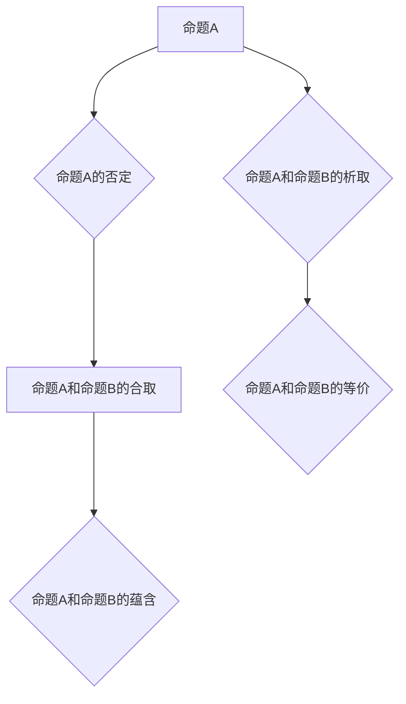
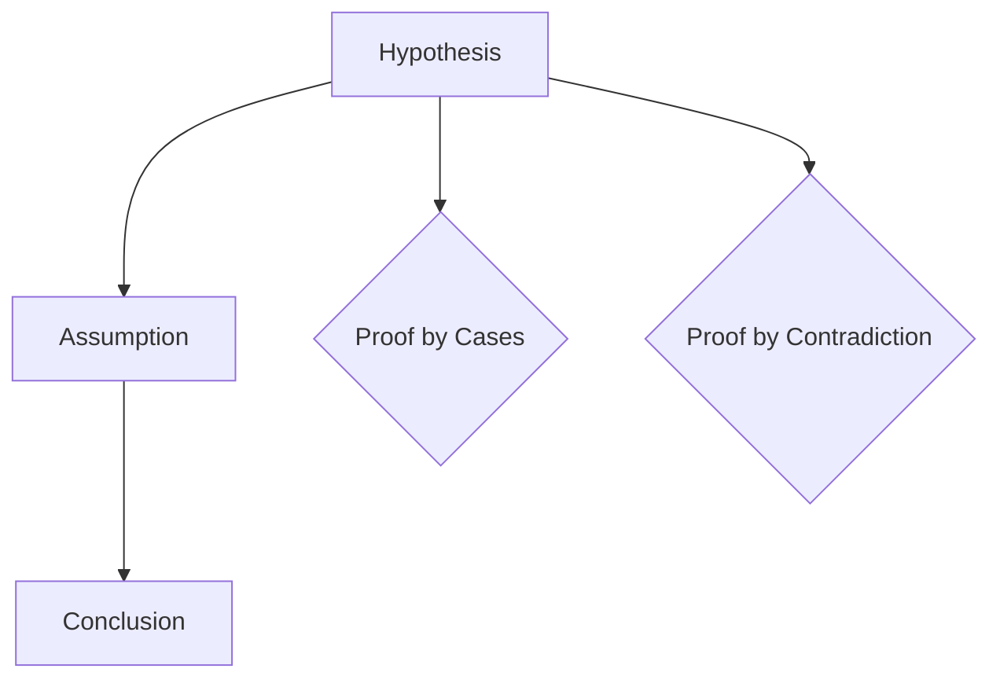

                 


### 1.1 问题背景

**问题描述：**  
在人工智能和计算领域，逻辑作为一种核心工具，已被广泛应用。其中，数学逻辑和模糊逻辑是两种主要的逻辑体系，它们各自有着独特的理论基础和应用场景。数学逻辑以其严格的推理规则和形式化方法，广泛应用于计算机科学、人工智能等领域；而模糊逻辑则通过处理不确定性和模糊性，在控制理论、人工智能等领域展示了其独特的优势。然而，两者之间的对比研究相对较少，导致在许多实际应用场景中无法充分利用各自的优点。

**问题解决：**  
通过对比数学逻辑和模糊逻辑，可以揭示它们在形式化表达、推理规则、适用性等方面的异同，为特定问题选择合适的逻辑体系提供理论依据。此外，研究两者的结合，可能会产生新的逻辑体系，进一步提升人工智能和计算领域的发展。

**边界与外延：**  
数学逻辑主要研究基于布尔代数和集合论的逻辑体系，包括命题逻辑、谓词逻辑等。模糊逻辑则研究基于模糊集合理论的逻辑体系，其核心在于处理模糊性和不确定性。

**概念结构与核心要素组成：**  
数学逻辑的核心要素包括：命题、命题联结词、推理规则等。模糊逻辑的核心要素包括：模糊集合、模糊集合的运算、模糊推理规则等。

### 1.2 核心概念与联系

**数学逻辑**：  
数学逻辑是一种形式化的逻辑体系，其基本原理是基于集合论和布尔代数。数学逻辑包括命题逻辑、谓词逻辑、证明论等多个分支。命题逻辑主要研究命题之间的逻辑关系，如蕴含、等价、矛盾等。谓词逻辑则研究量词、存在性、全称性等。证明论则研究证明方法及其有效性。

**模糊逻辑**：  
模糊逻辑是一种处理不确定性和模糊性的逻辑体系，其基本原理是基于模糊集合理论。模糊逻辑的核心是模糊集合，它通过隶属函数描述元素对集合的隶属程度。模糊逻辑包括模糊集合的运算、模糊推理、模糊控制器等多个方面。

**概念属性特征对比表格：**  

| 特征 | 数学逻辑 | 模糊逻辑 |
| --- | --- | --- |
| 基本原理 | 集合论、布尔代数 | 模糊集合理论 |
| 推理规则 | 确定性推理 | 模糊推理 |
| 应用领域 | 计算机科学、人工智能 | 控制理论、人工智能 |

**ER实体关系图架构：**  

```mermaid
erDiagram
    Class1 ||--|{ Class2 }| Class3
    Class1 ||--|{ Class4 }| Class5
```

在接下来的内容中，我们将分别深入探讨数学逻辑和模糊逻辑的基本原理、算法原理、数学模型和数学公式，以及它们的对比与应用。通过这些详细的分析，我们将更清晰地理解这两种逻辑体系在人工智能和计算领域的重要性。

## 第二部分: 数学逻辑深入讲解

### 2.1 数学逻辑的算法原理讲解

**算法原理讲解：**  

数学逻辑中的算法原理主要基于集合论和布尔代数。以下是几个常见的算法原理及其Mermaid流程图表示：

**命题逻辑算法原理：**  



**谓词逻辑算法原理：**  

```mermaid
graph TD
    P(x)[存在性谓词] --> Q(x)[全称性谓词]
    P(x) --> R(x)[谓词逻辑的推理规则]
    Q(x) --> S(x)[谓词逻辑的推理规则]
```

**证明论算法原理：**  



**Python源代码：**  

```python
# 命题逻辑算法示例
def logic_gate(input1, input2, operation):
    if operation == "AND":
        return input1 and input2
    elif operation == "OR":
        return input1 or input2
    elif operation == "NOT":
        return not input1
    else:
        raise ValueError("Invalid operation")

# 谓词逻辑算法示例
def predicate_logic(exists, all, x, proposition):
    if exists:
        return proposition(x)
    elif all:
        return all(x for x in range(1, 11))
    else:
        raise ValueError("Invalid predicate")

# 证明论算法示例
def proof_by_cases(hypothesis, assumption, conclusion):
    if assumption:
        return conclusion
    else:
        return proof_by_contradiction(hypothesis, assumption)

def proof_by_contradiction(hypothesis, assumption):
    if assumption:
        return not hypothesis
    else:
        raise ValueError("Proof by contradiction failed")
```

**数学模型和数学公式讲解：**  

数学逻辑的数学模型主要基于集合论和布尔代数。以下是几个关键数学模型和公式的详细讲解：

**命题逻辑的数学模型：**  

- **命题**：命题是能够判断真假的陈述句。用符号表示为P。
- **命题联结词**：包括“与”、“或”、“非”等。用符号表示为“AND”、“OR”、“NOT”。
- **命题公式**：由命题和命题联结词组成的表达式。用符号表示为F。

**谓词逻辑的数学模型：**  

- **谓词**：谓词是对个体进行描述或判断的词语。用符号表示为P(x)。
- **量词**：包括“存在性量词”和“全称性量词”。用符号表示为∃和∀。
- **谓词公式**：由谓词、量词和逻辑联结词组成的表达式。用符号表示为G。

**证明论的数学模型：**  

- **证明**：证明是逻辑推理的一种方法，用来证明某个命题的正确性。用符号表示为Proof。
- **推理规则**：推理规则是证明过程中的基本操作。包括“合取律”、“析取律”、“蕴含律”等。

**举例说明：**  

**命题逻辑的举例**：  

假设P表示“今天下雨”，Q表示“我会带伞”。根据命题逻辑的运算规则，我们可以得到以下结果：

- P AND Q：表示“今天下雨且我会带伞”。
- P OR Q：表示“今天下雨或我会带伞”。
- NOT P：表示“今天不下雨”。
- P IMPLIES Q：表示“如果今天下雨，那么我会带伞”。

**谓词逻辑的举例**：  

假设P(x)表示“x是人的兄弟”，Q(x)表示“x是男人”。根据谓词逻辑的运算规则，我们可以得到以下结果：

- ∃x P(x)：表示“存在一个人的兄弟”。
- ∀x Q(x)：表示“所有男人都是人”。

**证明论的举例**：  

假设我们要证明命题P：“所有狗都有四条腿”。根据证明论的推理规则，我们可以得到以下证明：

1. 假设存在一个狗没有四条腿。
2. 这个狗要么有两条腿，要么有六条腿。
3. 如果这个狗有两条腿，那么它与鸟类相似，与狗的特性相悖。
4. 如果这个狗有六条腿，那么它与四足动物相似，与狗的特性也相悖。
5. 因此，我们的假设是错误的。
6. 结论：所有狗都有四条腿。

通过上述讲解，我们可以更深入地理解数学逻辑的算法原理、数学模型和数学公式。在接下来的章节中，我们将继续探讨模糊逻辑的深入讲解，以进一步对比数学逻辑和模糊逻辑的异同点。

