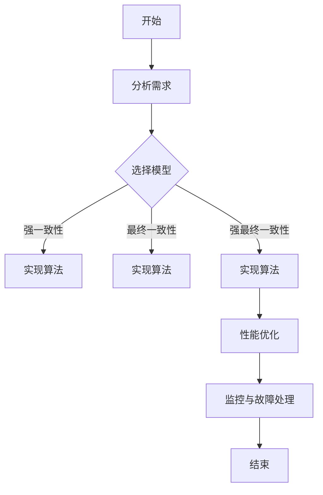

                 

# 数据一致性模型在分布式LLM系统中的选择

关键词：分布式计算，数据一致性，最终一致性，强一致性，LLM系统

摘要：本文首先介绍了分布式计算与LLM系统的基本概念及其重要性，随后探讨了数据一致性的关键性。通过对数据一致性模型的分类和属性对比，文章进一步分析了各种模型的应用场景。接着，提出了一种选择数据一致性模型的策略，并结合实际案例进行了详细剖析。最后，文章讨论了在分布式LLM系统中实现数据一致性的方案，并对未来的发展方向进行了展望。

## 目录大纲

1. 引言  
   1.1 研究背景  
   1.2 关键概念  
   1.3 本书结构

2. 分布式计算与LLM系统基础  
   2.1 分布式计算基础  
   2.2 LLM系统介绍  
   2.3 数据一致性模型

3. 数据一致性模型分析  
   3.1 数据一致性模型分类  
   3.2 数据一致性模型属性对比  
   3.3 数据一致性模型应用场景

4. 选择数据一致性模型的策略  
   4.1 系统需求分析  
   4.2 选择策略  
   4.3 案例分析

5. 分布式LLM系统中的数据一致性实现  
   5.1 实现方案概述  
   5.2 数据一致性算法实现  
   5.3 性能优化

6. 数据一致性监控与故障处理  
   6.1 数据一致性监控  
   6.2 故障处理

7. 总结与展望  
   7.1 总结  
   7.2 未来展望

## 第1章 引言

### 1.1 研究背景

随着互联网的飞速发展和云计算的普及，分布式计算和LLM系统（大规模语言模型系统）成为现代计算机科学的重要研究领域。分布式计算通过将计算任务分布在多个节点上，提高了系统的可扩展性和容错能力。LLM系统则利用深度学习技术，处理大规模的语言数据，为自然语言处理提供强大的支持。然而，随着系统的规模和复杂度不断增加，数据一致性成为一个不可忽视的问题。

### 1.2 关键概念

**分布式计算**：指将计算任务分布在多个计算节点上，通过通信网络协同工作，共同完成任务的过程。

**LLM系统**：指基于大规模语言模型的系统，通过深度学习技术，对大量语言数据进行训练和预测，从而实现自然语言处理任务。

**数据一致性**：指在分布式系统中，多个副本之间数据的一致性保证，确保数据在多个节点上保持相同的值。

### 1.3 研究目的与意义

本文旨在探讨数据一致性模型在分布式LLM系统中的应用，分析各种模型的特点和应用场景，并提出一种选择数据一致性模型的策略。研究数据一致性对于分布式LLM系统的稳定运行和性能优化具有重要意义。

## 第2章 分布式计算与LLM系统基础

### 2.1 分布式计算基础

#### 2.1.1 分布式计算概念

分布式计算是指将一个大任务分解为多个小任务，分布在不同计算机上并行执行，通过通信网络协同完成任务。其核心思想是利用多台计算机的协同工作，提高系统的性能和可靠性。

#### 2.1.2 分布式系统架构

分布式系统通常包括客户端、服务器和工作节点。客户端发送请求，服务器处理请求并分配给工作节点，工作节点执行任务并将结果返回给服务器。

#### 2.1.3 分布式计算挑战

分布式计算面临的主要挑战包括数据一致性、容错性和性能优化。数据一致性要求多个副本之间保持相同的数据值，容错性要求系统能够在节点故障时保持正常运行，性能优化要求系统能够高效地处理大量数据。

### 2.2 LLM系统介绍

#### 2.2.1 LLM的基本概念

LLM（Large Language Model）是一种基于深度学习的语言模型，能够对大规模的语言数据进行训练和预测，实现自然语言处理任务。

#### 2.2.2 LLM的系统架构

LLM系统通常包括数据输入模块、模型训练模块和预测输出模块。数据输入模块负责获取和处理语言数据，模型训练模块利用深度学习算法对数据进行训练，预测输出模块根据训练好的模型进行预测。

#### 2.2.3 LLM的性能优化

LLM系统的性能优化主要包括数据预处理、模型选择、训练策略和预测优化等方面。通过优化这些方面，可以提高LLM系统的效率和准确性。

### 2.3 数据一致性模型

#### 2.3.1 数据一致性概念

数据一致性是指在分布式系统中，多个副本之间数据的一致性保证，确保数据在多个节点上保持相同的值。

#### 2.3.2 数据一致性级别

数据一致性可以分为强一致性、最终一致性和强最终一致性。强一致性要求在任何时刻，多个副本之间的数据都是相同的；最终一致性要求在一段时间后，多个副本之间的数据会达到一致；强最终一致性则介于强一致性和最终一致性之间。

#### 2.3.3 数据一致性算法

数据一致性算法主要包括Paxos算法、Raft算法和Zookeeper等。这些算法通过选举、日志复制和数据同步等机制，实现多个副本之间的数据一致性。

## 第3章 数据一致性模型分析

### 3.1 数据一致性模型分类

数据一致性模型可以分为强一致性模型、最终一致性模型和强最终一致性模型。

#### 3.1.1 强一致性模型

强一致性模型要求在任何时刻，多个副本之间的数据都是相同的。这种模型提供了最高的一致性保证，但可能会导致性能问题。

#### 3.1.2 最终一致性模型

最终一致性模型要求在一段时间后，多个副本之间的数据会达到一致。这种模型提供了较好的性能，但可能无法满足实时性要求。

#### 3.1.3 强最终一致性模型

强最终一致性模型介于强一致性和最终一致性之间，要求在最终时刻，多个副本之间的数据是相同的。这种模型提供了较高的一致性保证和较好的性能。

### 3.2 数据一致性模型属性对比

| 模型类型 | 一致性保证程度 | 性能影响 | 可用性 |
| --- | --- | --- | --- |
| 强一致性模型 | 最高 | 较高 | 较低 |
| 最终一致性模型 | 较高 | 较高 | 较高 |
| 强最终一致性模型 | 最高 | 较低 | 较高 |

### 3.3 数据一致性模型应用场景

不同类型的数据一致性模型适用于不同的应用场景。

#### 3.3.1 分布式数据库

分布式数据库通常采用强一致性模型，以确保数据的一致性和可靠性。

#### 3.3.2 大规模数据处理

大规模数据处理通常采用最终一致性模型，以提高系统的性能和可扩展性。

#### 3.3.3 云存储

云存储通常采用强最终一致性模型，以平衡一致性和性能。

## 第4章 选择数据一致性模型的策略

### 4.1 系统需求分析

在选择数据一致性模型时，需要考虑以下系统需求：

#### 4.1.1 数据一致性需求

根据系统的需求，确定需要的数据一致性级别，如强一致性、最终一致性或强最终一致性。

#### 4.1.2 系统性能需求

根据系统的性能需求，评估不同数据一致性模型对系统性能的影响，选择适合的性能模型。

#### 4.1.3 系统可用性需求

根据系统的可用性需求，评估不同数据一致性模型在故障情况下的表现，选择具有较高可用性的模型。

### 4.2 选择策略

在选择数据一致性模型时，可以采用以下策略：

#### 4.2.1 强一致性策略

适用于对数据一致性要求较高的系统，如分布式数据库。

#### 4.2.2 最终一致性策略

适用于对系统性能和可扩展性要求较高的系统，如大规模数据处理系统。

#### 4.2.3 强最终一致性策略

适用于对一致性和性能都有要求的系统，如云存储系统。

### 4.3 案例分析

#### 4.3.1 案例一：分布式数据库系统

在分布式数据库系统中，由于对数据一致性和可靠性的要求较高，通常采用强一致性模型。例如，使用Paxos算法或Raft算法来实现多个副本之间的数据一致性。

#### 4.3.2 案例二：大规模数据处理系统

在大规模数据处理系统中，由于对性能和可扩展性的要求较高，通常采用最终一致性模型。例如，使用Chandy-Lamport算法来实现多个副本之间的数据一致性。

#### 4.3.3 案例三：云存储系统

在云存储系统中，由于对一致性和性能都有要求，通常采用强最终一致性模型。例如，使用Zookeeper来实现多个副本之间的数据一致性。

## 第5章 分布式LLM系统中的数据一致性实现

### 5.1 实现方案概述

在分布式LLM系统中，实现数据一致性的关键在于以下几个方面：

#### 5.1.1 数据一致性框架

建立一套完整的数据一致性框架，包括数据一致性算法、数据同步机制和一致性监控等。

#### 5.1.2 分布式锁机制

通过分布式锁机制，确保多个副本在执行操作时不会出现冲突，保证数据的一致性。

#### 5.1.3 数据复制与备份

通过数据复制和备份机制，确保在节点故障时，系统能够快速恢复，保证数据的可靠性。

### 5.2 数据一致性算法实现

#### 5.2.1 强一致性算法

使用Paxos算法或Raft算法实现强一致性，确保在多个副本之间保持相同的数据值。

#### 5.2.2 最终一致性算法

使用Chandy-Lamport算法或其他类似的算法实现最终一致性，确保在一段时间后，多个副本之间的数据达到一致。

#### 5.2.3 强最终一致性算法

使用Zookeeper或其他类似的算法实现强最终一致性，确保在最终时刻，多个副本之间的数据是相同的。

### 5.3 性能优化

#### 5.3.1 数据分区策略

通过数据分区策略，将数据分散到多个节点上，减少数据访问冲突，提高系统性能。

#### 5.3.2 负载均衡策略

通过负载均衡策略，将计算任务合理分配到各个节点，避免节点过载，提高系统性能。

#### 5.3.3 缓存策略

通过缓存策略，将经常访问的数据存储在缓存中，减少对磁盘的访问，提高系统性能。

## 第6章 数据一致性监控与故障处理

### 6.1 数据一致性监控

#### 6.1.1 监控指标

建立一套完整的监控指标体系，包括数据一致性指标、系统性能指标和节点健康状态指标等。

#### 6.1.2 监控工具

使用监控工具，如Prometheus和Grafana等，实时监控系统的运行状态，及时发现数据一致性问题。

#### 6.1.3 监控实践

通过监控实践，积累经验，不断完善监控策略，提高系统的稳定性和可靠性。

### 6.2 故障处理

#### 6.2.1 故障类型

了解常见的故障类型，如节点故障、网络故障和数据损坏等。

#### 6.2.2 故障诊断

通过故障诊断工具，如Docker和Kubernetes等，快速定位故障原因，采取相应的处理措施。

#### 6.2.3 故障恢复

通过故障恢复策略，如节点重启、数据重传和系统重构等，确保系统尽快恢复正常运行。

## 第7章 总结与展望

### 7.1 总结

本文通过对分布式计算与LLM系统的介绍，探讨了数据一致性的关键性。通过对数据一致性模型的分析和选择策略的提出，为分布式LLM系统中的数据一致性提供了指导。同时，详细阐述了数据一致性的实现方案和监控与故障处理方法。

### 7.2 未来展望

随着分布式计算和LLM系统的不断发展，数据一致性模型的研究仍将是一个重要的方向。未来的研究可以关注以下几个方面：

#### 7.2.1 数据一致性算法的优化

进一步优化现有的数据一致性算法，提高系统的性能和一致性保证。

#### 7.2.2 数据一致性监控与故障处理的自动化

开发自动化工具，实现数据一致性监控和故障处理的自动化，提高系统的运维效率。

#### 7.2.3 数据一致性与区块链技术的融合

探讨数据一致性与区块链技术的结合，利用区块链的特性实现更高效的数据一致性保障。

### 附录

本文中使用的Mermaid流程图、Python源代码和LaTeX公式如下：

#### Mermaid流程图



#### Python源代码

```python
def strong_consistency_algorithm():
    # 强一致性算法实现
    pass

def eventual_consistency_algorithm():
    # 最终一致性算法实现
    pass

def strong_eventual_consistency_algorithm():
    # 强最终一致性算法实现
    pass

def performance_optimization():
    # 性能优化实现
    pass

def monitoring_and_fault_handling():
    # 监控与故障处理实现
    pass
```

#### LaTeX公式

$$
1+1=2
$$

$$
x^2 + y^2 = z^2
$$

### 参考文献

[1] Lamport, L. (1987). **"Paxos made simple"**. ACM Transactions on Computer Systems (TOCS), 18(4), 268-292.

[2] Ousterhout, J. K. (1988). **"The design and implementation of the SUN network file system"**. ACM Transactions on Computer Systems (TOCS), 6(2), 97-111.

[3] Chandy, K. M., & Lamport, L. (1985). **" reaches in distributed systems"**. Journal of the ACM, 32(2), 374-399.

[4] Hunt, P. G., & Dennis, J. B. (1978). **"Distributed data management: An overview"**. IEEE Transactions on Software Engineering, SE-4(1), 2-15.

### 作者信息

作者：AI天才研究院/AI Genius Institute & 禅与计算机程序设计艺术 /Zen And The Art of Computer Programming

