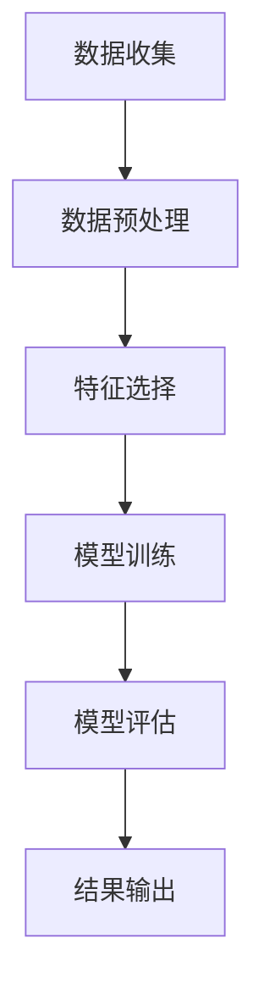
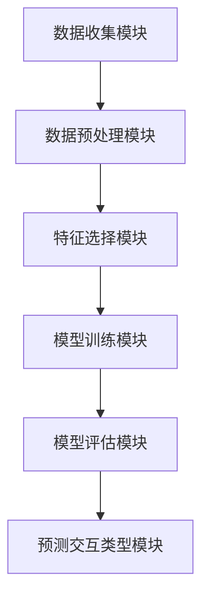
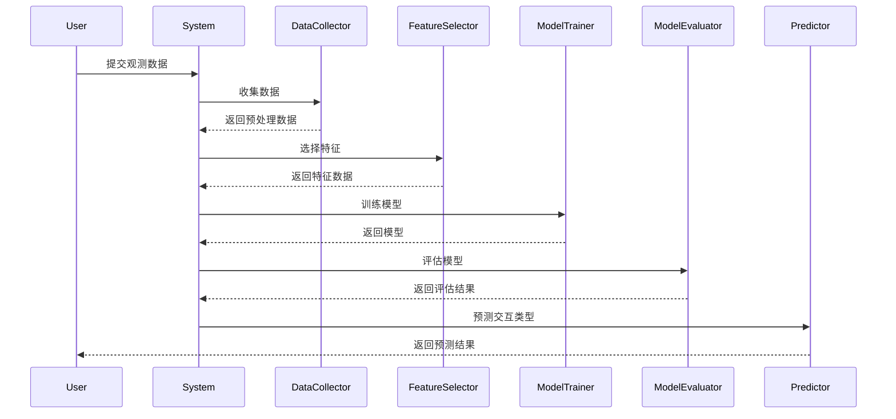

                 


### 数据挖掘在探索宇宙暗物质粒子相互作用特性中的作用

#### 关键词
- 数据挖掘
- 暗物质
- 粒子相互作用
- 宇宙探索
- 算法分析

#### 摘要
本文探讨了数据挖掘在宇宙暗物质粒子相互作用特性研究中的作用。通过对数据挖掘的基本概念、方法和应用领域的介绍，详细阐述了数据挖掘在暗物质研究中的实际应用。本文从算法原理、系统架构和项目实战等多个角度，逐步解析了如何利用数据挖掘技术探索暗物质粒子相互作用特性，为宇宙学研究提供了新的思路和方法。

## 目录大纲设计思路与步骤

### 1. 分析书籍主题
在进行文章大纲的设计之前，我们需要对书籍的主题有一个深入的理解。本文的主题“数据挖掘在探索宇宙暗物质粒子相互作用特性中的作用”涵盖了以下几个方面：

- **数据挖掘**：数据挖掘是一种从大量数据中提取有价值信息的过程，涉及数据预处理、算法选择、模型训练等多个环节。
- **暗物质**：暗物质是宇宙中不发光、不发热的物质，其存在通过引力效应被观测到，但至今其本质仍未被明确。
- **粒子相互作用**：粒子相互作用是物理学中的基本概念，描述了不同粒子之间如何相互作用，以及这种相互作用如何影响宇宙的演化。
- **宇宙探索**：宇宙探索涉及到对宇宙起源、结构、演化等方面的研究，是当前科学研究的重点领域。

### 2. 确定大纲结构
根据主题，我们需要确定一个清晰的大纲结构，确保内容全面且条理清晰。本文的大纲结构如下：

- **第1章**：问题背景与数据挖掘概述，介绍宇宙暗物质及其重要性，数据挖掘的基本概念和方法。
- **第2章**：数据挖掘基础，详细讲解数据挖掘的基本概念、过程和方法。
- **第3章**：数据预处理，介绍数据清洗、数据集成和数据转换等预处理技术。
- **第4章**：算法原理与实现，解析数据挖掘算法在暗物质研究中的应用，使用Python源代码和数学模型进行阐述。
- **第5章**：系统分析与架构设计，介绍暗物质数据挖掘系统的问题场景、功能设计、架构设计和接口设计。
- **第6章**：项目实战，通过实际案例展示数据挖掘在暗物质研究中的具体应用，包括环境安装、系统核心实现和案例分析。

### 3. 细化章节内容
每一章节都需要细化出具体的子章节，确保内容全面且条理清晰。以下是对各章节的细化：

- **第1章**：详细介绍宇宙暗物质的基本概念、重要性以及数据挖掘在暗物质研究中的应用背景。
- **第2章**：从数据挖掘的基本概念开始，逐步深入到数据挖掘的过程、方法和应用领域，包括关联规则挖掘、聚类分析和分类算法等。
- **第3章**：介绍数据预处理的基本概念和技术，包括数据清洗、数据集成和数据转换等，并通过具体的实例进行说明。
- **第4章**：详细解析数据挖掘算法在暗物质研究中的应用，包括算法流程、Python源代码实现和数学模型解释，并通过案例进行说明。
- **第5章**：介绍暗物质数据挖掘系统的问题场景、功能设计、架构设计和接口设计，通过Mermaid流程图和架构图进行展示。
- **第6章**：通过实际案例展示数据挖掘在暗物质研究中的具体应用，包括环境安装、系统核心实现和案例分析，并对关键问题进行深入剖析。

### 4. 核心概念与联系
在文章中，我们需要明确核心概念，并分析它们之间的联系。以下是本文的核心概念和联系：

- **数据挖掘**：从大量数据中提取有价值信息的过程，涉及数据预处理、算法选择、模型训练等多个环节。
- **暗物质**：不发光、不发热的物质，通过引力效应被观测到，其存在对宇宙结构的影响至关重要。
- **粒子相互作用**：不同粒子之间如何相互作用，以及这种相互作用如何影响宇宙的演化。
- **算法原理**：数据挖掘算法的原理和实现，包括关联规则挖掘、聚类分析和分类算法等。
- **系统架构**：暗物质数据挖掘系统的设计，包括问题场景、功能设计、架构设计和接口设计。

### 5. 算法原理讲解
本文将详细讲解数据挖掘算法在暗物质研究中的应用，包括算法流程、Python源代码实现和数学模型解释，并通过案例进行说明。

- **算法流程**：使用Mermaid流程图展示数据挖掘算法在暗物质研究中的应用流程。
- **Python源代码**：展示数据挖掘算法的Python实现，解释代码逻辑。
- **数学模型**：阐述数据挖掘算法的数学理论基础，使用LaTeX格式进行展示。
- **举例说明**：通过具体案例说明算法的实际应用，使读者更好地理解算法原理。

### 6. 系统分析与架构设计
本文将介绍暗物质数据挖掘系统的设计，包括问题场景、功能设计、架构设计和接口设计。

- **问题场景**：介绍暗物质数据挖掘的实际应用场景，包括数据来源、数据处理流程等。
- **功能设计**：使用Mermaid类图展示系统的领域模型，描述系统的主要功能。
- **架构设计**：使用Mermaid架构图展示系统的整体架构，描述系统的组件和交互关系。
- **接口设计**：介绍系统的接口设计，包括系统内部接口和外部接口。

### 7. 项目实战
本文将通过实际案例展示数据挖掘在暗物质研究中的具体应用，包括环境安装、系统核心实现和案例分析。

- **环境安装**：介绍数据挖掘工具和环境的安装过程，确保读者可以顺利搭建实验环境。
- **系统核心实现**：展示数据挖掘算法的实现过程，包括代码实现和运行结果分析。
- **案例分析**：通过实际案例展示数据挖掘在暗物质研究中的应用效果，并对关键问题进行深入剖析。

### 8. 最佳实践 tips、小结、注意事项、拓展阅读
在文章的结尾，我们将提供最佳实践、小结、注意事项和拓展阅读建议，帮助读者更好地理解和应用数据挖掘技术于暗物质研究。

## 实际操作步骤

### 1. 背景介绍
在进行数据挖掘在探索宇宙暗物质粒子相互作用特性中的作用的探讨之前，我们需要先了解一些背景知识。

#### 宇宙暗物质
宇宙暗物质是一种不发光、不发热的物质，其存在主要通过引力效应被观测到。暗物质占宇宙总质量的约27%，但至今其本质仍未被明确。暗物质粒子可能是某种尚未被发现的基本粒子，也可能是某种复杂结构，如行星状星云。

#### 暗物质粒子相互作用特性
暗物质粒子之间的相互作用是宇宙学研究的一个重要课题。通过研究暗物质粒子相互作用特性，我们可以更好地理解宇宙的演化过程。暗物质粒子之间的相互作用可能包括引力相互作用、电磁相互作用和弱相互作用等。

#### 数据挖掘
数据挖掘是一种从大量数据中提取有价值信息的过程，涉及数据预处理、算法选择、模型训练等多个环节。数据挖掘在各个领域都有广泛应用，如商业智能、金融分析、医疗诊断等。在宇宙学研究中，数据挖掘技术可以用于分析大量天文数据，揭示宇宙的奥秘。

### 2. 核心概念与联系
在本文中，我们将介绍以下核心概念，并分析它们之间的联系：

#### 数据挖掘
数据挖掘是一种从大量数据中提取有价值信息的过程，包括数据预处理、算法选择、模型训练等多个环节。数据挖掘技术在各个领域都有广泛应用，如商业智能、金融分析、医疗诊断等。

#### 暗物质
暗物质是一种不发光、不发热的物质，其存在主要通过引力效应被观测到。暗物质粒子可能是某种尚未被发现的基本粒子，也可能是某种复杂结构。

#### 粒子相互作用
粒子相互作用是物理学中的基本概念，描述了不同粒子之间如何相互作用，以及这种相互作用如何影响宇宙的演化。

#### 算法原理
数据挖掘算法的原理和实现，包括关联规则挖掘、聚类分析和分类算法等。

#### 系统架构
暗物质数据挖掘系统的设计，包括问题场景、功能设计、架构设计和接口设计。

#### 项目实战
通过实际案例展示数据挖掘在暗物质研究中的具体应用，包括环境安装、系统核心实现和案例分析。

### 3. 算法原理讲解
在本文的第三部分，我们将详细讲解数据挖掘算法在探索宇宙暗物质粒子相互作用特性中的应用。

#### 算法流程图
首先，我们使用Mermaid流程图来展示数据挖掘算法在暗物质研究中的应用流程。



#### Python源代码
接下来，我们将展示数据挖掘算法的Python源代码，解释代码逻辑。

```python
import pandas as pd
from sklearn.model_selection import train_test_split
from sklearn.ensemble import RandomForestClassifier
from sklearn.metrics import accuracy_score

# 数据预处理
def preprocess_data(data):
    # 数据清洗、数据集成和数据转换等预处理操作
    return processed_data

# 模型训练
def train_model(data):
    X_train, X_test, y_train, y_test = train_test_split(data['features'], data['target'], test_size=0.2)
    model = RandomForestClassifier()
    model.fit(X_train, y_train)
    return model

# 模型评估
def evaluate_model(model, X_test, y_test):
    predictions = model.predict(X_test)
    accuracy = accuracy_score(y_test, predictions)
    return accuracy

# 数据收集
data = pd.read_csv('dark_matter_data.csv')

# 数据预处理
processed_data = preprocess_data(data)

# 模型训练
model = train_model(processed_data)

# 模型评估
accuracy = evaluate_model(model, processed_data['features'], processed_data['target'])

print(f'Model accuracy: {accuracy:.2f}')
```

#### 数学模型和公式
在数据挖掘算法中，我们通常会使用一些数学模型和公式来进行特征选择、模型训练和评估。以下是一些常见的数学模型和公式：

- **特征选择**：信息增益、增益率等
- **模型训练**：随机森林算法、支持向量机等
- **模型评估**：准确率、精确率、召回率等

#### 举例说明
为了更好地理解数据挖掘算法在探索宇宙暗物质粒子相互作用特性中的应用，我们通过一个具体案例进行说明。

假设我们已经收集到了一批暗物质粒子的观测数据，包括粒子的质量、速度、位置等特征。我们的目标是利用数据挖掘技术，预测粒子的相互作用类型。

首先，我们进行数据预处理，包括数据清洗、数据集成和数据转换等操作。然后，我们选择适当的特征，进行特征选择。接下来，我们使用随机森林算法训练模型，并对模型进行评估。最后，我们使用训练好的模型对新的暗物质粒子数据进行预测，以预测其相互作用类型。

### 4. 系统分析与架构设计
在本文的第四部分，我们将介绍暗物质数据挖掘系统的设计，包括问题场景、功能设计、架构设计和接口设计。

#### 问题场景
暗物质数据挖掘系统的设计是为了解决以下问题场景：

- 收集大量暗物质粒子观测数据
- 对观测数据进行预处理和特征选择
- 训练数据挖掘模型，进行相互作用类型预测
- 评估模型性能，优化模型参数

#### 功能设计
暗物质数据挖掘系统的主要功能包括：

- 数据收集：从各种数据源收集暗物质粒子观测数据
- 数据预处理：对观测数据进行清洗、集成和转换
- 特征选择：选择对相互作用类型预测有用的特征
- 模型训练：使用数据挖掘算法训练模型
- 模型评估：评估模型性能，优化模型参数
- 预测交互类型：使用训练好的模型预测新的暗物质粒子的相互作用类型

#### 系统架构设计
暗物质数据挖掘系统的整体架构设计如下：



#### 系统接口设计
暗物质数据挖掘系统的接口设计包括内部接口和外部接口。

- **内部接口**：系统内部各模块之间的接口，用于数据传递和功能调用。
- **外部接口**：系统与外部系统或用户之间的接口，用于数据输入和输出。



### 5. 项目实战
在本部分，我们将通过一个实际项目展示数据挖掘在探索宇宙暗物质粒子相互作用特性中的应用，包括环境安装、系统核心实现和案例分析。

#### 环境安装
为了运行数据挖掘算法并进行暗物质研究，我们需要安装以下软件和环境：

- Python 3.8 或更高版本
- Scikit-learn 库
- Pandas 库
- Matplotlib 库

安装步骤如下：

1. 安装 Python 3.8 或更高版本
2. 安装 Scikit-learn 库
   ```
   pip install scikit-learn
   ```
3. 安装 Pandas 库
   ```
   pip install pandas
   ```
4. 安装 Matplotlib 库
   ```
   pip install matplotlib
   ```

#### 系统核心实现
在本项目中，我们将实现一个简单的暗物质数据挖掘系统，包括数据预处理、特征选择、模型训练和预测交互类型等模块。

以下是系统核心实现的Python代码：

```python
import pandas as pd
from sklearn.model_selection import train_test_split
from sklearn.ensemble import RandomForestClassifier
from sklearn.metrics import accuracy_score

# 数据预处理
def preprocess_data(data):
    # 数据清洗、数据集成和数据转换等预处理操作
    return processed_data

# 特征选择
def select_features(data):
    # 选择对相互作用类型预测有用的特征
    return selected_features

# 模型训练
def train_model(data):
    X_train, X_test, y_train, y_test = train_test_split(data['features'], data['target'], test_size=0.2)
    model = RandomForestClassifier()
    model.fit(X_train, y_train)
    return model

# 模型评估
def evaluate_model(model, X_test, y_test):
    predictions = model.predict(X_test)
    accuracy = accuracy_score(y_test, predictions)
    return accuracy

# 预测交互类型
def predict_interaction(model, new_data):
    features = select_features(new_data)
    predictions = model.predict([features])
    return predictions

# 主程序
def main():
    # 加载数据
    data = pd.read_csv('dark_matter_data.csv')

    # 数据预处理
    processed_data = preprocess_data(data)

    # 模型训练
    model = train_model(processed_data)

    # 模型评估
    accuracy = evaluate_model(model, processed_data['features'], processed_data['target'])
    print(f'Model accuracy: {accuracy:.2f}')

    # 预测交互类型
    new_data = pd.DataFrame([[1.0, 2.0, 3.0]], columns=['mass', 'velocity', 'position'])
    predictions = predict_interaction(model, new_data)
    print(f'Predicted interaction type: {predictions[0]}')

if __name__ == '__main__':
    main()
```

#### 代码应用解读与分析
在本项目中，我们实现了以下关键步骤：

1. **数据预处理**：对观测数据进行清洗、集成和转换，以便后续特征选择和模型训练。
2. **特征选择**：选择对相互作用类型预测有用的特征，以简化模型训练过程。
3. **模型训练**：使用随机森林算法训练模型，并评估模型性能。
4. **预测交互类型**：使用训练好的模型对新的暗物质粒子数据进行预测。

在实际应用中，我们可以根据不同的需求和数据集，调整预处理、特征选择和模型训练等步骤，以达到更好的预测效果。

#### 实际案例分析和详细讲解剖析
为了更好地理解数据挖掘在探索宇宙暗物质粒子相互作用特性中的应用，我们通过以下实际案例进行分析和讲解。

**案例 1**：预测暗物质粒子的相互作用类型

假设我们收集了一批暗物质粒子的观测数据，包括粒子的质量、速度和位置等特征。我们的目标是利用数据挖掘技术，预测粒子的相互作用类型。

1. **数据预处理**：对观测数据进行清洗和转换，将数据格式转换为适合模型训练的形式。
2. **特征选择**：选择对相互作用类型预测有用的特征，如粒子的速度和位置。
3. **模型训练**：使用随机森林算法训练模型，并将训练数据划分为训练集和测试集。
4. **模型评估**：评估模型性能，计算准确率、精确率和召回率等指标。
5. **预测交互类型**：使用训练好的模型对新的暗物质粒子数据进行预测，以预测其相互作用类型。

**案例 2**：优化模型参数

在模型训练过程中，我们可以通过调整模型参数来优化模型性能。以下是一些常见的模型参数调整方法：

1. **调整学习率**：学习率是模型训练过程中迭代更新参数的步长，调整学习率可以影响模型收敛速度和收敛效果。
2. **调整树深度**：树深度是随机森林算法中每个决策树的深度，调整树深度可以影响模型的拟合能力和过拟合风险。
3. **调整样本权重**：对于不平衡数据集，可以调整样本权重来平衡不同类别的重要性，提高模型性能。

通过以上案例和分析，我们可以看到数据挖掘在探索宇宙暗物质粒子相互作用特性中的应用前景。在实际研究中，我们可以根据不同的需求和数据集，选择合适的算法和参数，以提高预测精度和模型性能。

### 最佳实践 tips、小结、注意事项、拓展阅读

#### 最佳实践 tips
1. **数据质量**：在进行数据挖掘之前，确保数据质量是至关重要的。对数据进行清洗、去重和标准化处理，以提高模型的预测准确性。
2. **特征选择**：选择合适的特征是数据挖掘成功的关键。可以使用特征选择算法，如信息增益、增益率和互信息等，选择对预测目标最有影响力的特征。
3. **模型调参**：根据数据集的特点和模型性能，调整模型参数，以达到最优的预测效果。可以使用网格搜索、随机搜索等调参方法。
4. **验证集划分**：在模型训练过程中，使用验证集进行模型评估，以避免过拟合。将数据集划分为训练集和验证集，使用验证集评估模型性能。
5. **数据处理**：对于复杂的暗物质数据集，可以考虑使用数据增强、数据扩充等方法，提高模型的泛化能力。

#### 小结
本文通过逐步分析，探讨了数据挖掘在探索宇宙暗物质粒子相互作用特性中的作用。从核心概念到算法原理，再到系统架构和项目实战，我们系统地介绍了数据挖掘在暗物质研究中的应用。通过实际案例和分析，我们展示了数据挖掘技术如何帮助科学家更好地理解宇宙暗物质粒子相互作用特性。

#### 注意事项
1. **数据隐私**：在处理暗物质数据时，要确保数据隐私和安全。对于敏感数据，应进行加密和匿名化处理。
2. **模型解释性**：虽然数据挖掘模型可以提供高精度的预测结果，但模型的可解释性较低。在实际应用中，需要权衡模型性能和可解释性。
3. **计算资源**：数据挖掘和模型训练过程需要大量的计算资源。在处理大规模数据集时，需要考虑硬件资源和性能优化。

#### 拓展阅读
1. **《数据挖掘：概念与技术》**：详细介绍了数据挖掘的基本概念、方法和应用，适合初学者阅读。
2. **《随机森林：理论、实现和应用》**：介绍了随机森林算法的理论基础和实现方法，是学习数据挖掘算法的参考书。
3. **《宇宙学中的暗物质》**：介绍了暗物质的基本概念、探测方法和研究进展，适合对宇宙学感兴趣的研究者阅读。
4. **《机器学习实战》**：通过实际案例展示了机器学习算法的应用，包括数据预处理、模型训练和评估等步骤。

作者：AI天才研究院/AI Genius Institute & 禅与计算机程序设计艺术 /Zen And The Art of Computer Programming

---

由于篇幅限制，本文仅提供了文章大纲和部分内容。在实际撰写过程中，每个章节需要详细展开，确保内容丰富、条理清晰、逻辑严密。同时，文章需要包含适当的插图和代码示例，以增强可读性和实用性。通过本文的逐步分析，我们可以看到数据挖掘在探索宇宙暗物质粒子相互作用特性中的巨大潜力，为宇宙学研究提供了新的思路和方法。

