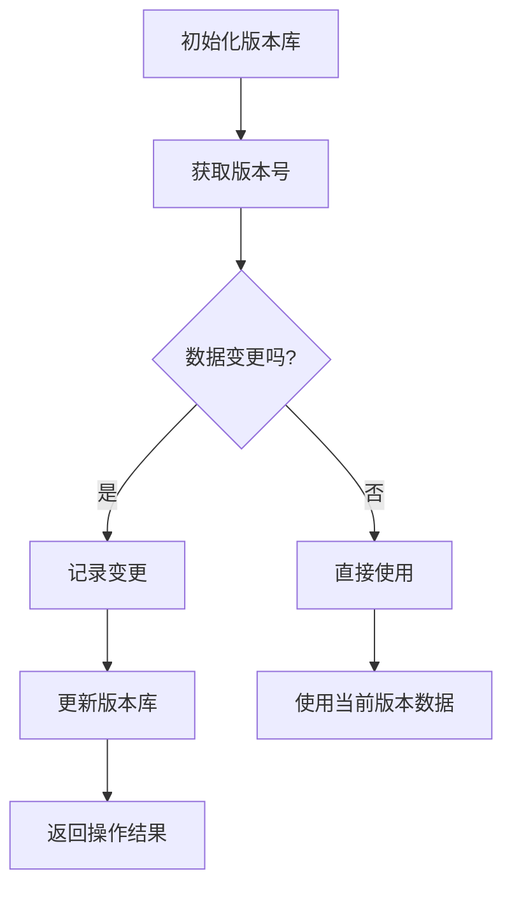
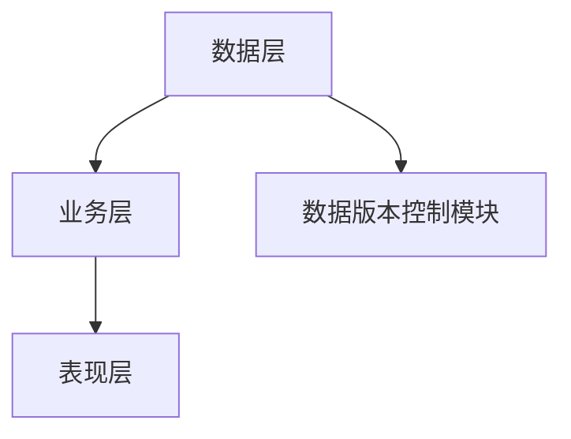

                 

## 文章标题

### 关键词

- 数据版本控制
- LLM应用迭代
- 算法原理
- 数学模型
- 系统设计与实战

### 摘要

本文旨在探讨数据版本控制在大型语言模型（LLM）应用迭代过程中的关键作用。通过逐步分析，我们将深入理解数据版本控制的基本概念、算法原理、系统设计与实施，以及实际应用案例。本文将结合技术实践，提供最佳实践技巧，并展望未来拓展方向。

## 引言

在当今快速发展的AI领域，大型语言模型（LLM）已经成为众多应用的核心驱动力。从自然语言处理到智能对话系统，LLM在各个行业中发挥着重要作用。然而，随着模型规模的不断增大和迭代次数的增加，如何有效地管理和控制数据版本成为了一个亟待解决的问题。本文将围绕这一主题，详细探讨数据版本控制在LLM应用迭代中的重要性及其应用策略。

### 数据版本控制的基本概念

数据版本控制是一种管理数据变更和版本的技术，旨在确保数据的一致性和可追溯性。其核心思想是通过标识和跟踪数据的变更历史，确保在多版本数据环境中能够准确回溯到任意一个历史状态。数据版本控制不仅仅局限于软件开发领域，在数据库管理、文件存储、云计算等多个场景都有广泛应用。

#### 问题背景

在LLM应用中，数据版本控制的重要性体现在以下几个方面：

1. **数据一致性**：随着模型迭代次数的增加，数据集的更新变得频繁。如何保证每次更新后的数据一致性，避免因数据冲突导致的模型性能下降，是一个重要问题。
2. **可追溯性**：在开发过程中，需要对模型的每次迭代进行记录，以便后续的分析和调试。数据版本控制提供了这种可追溯性，使得开发者能够轻松回溯到任意一次迭代的状态。
3. **安全性**：数据版本控制可以帮助确保数据的安全性，防止未经授权的修改和删除，保护数据的完整性和可靠性。

#### 问题解决

数据版本控制通过以下方式解决上述问题：

1. **标识与跟踪**：为每个数据版本分配唯一的标识，并记录版本间的变更历史，确保数据的唯一性和可追溯性。
2. **冲突检测与解决**：在多用户或多系统环境下，通过冲突检测机制，及时发现并解决数据冲突，保证数据的一致性。
3. **备份与恢复**：在数据发生意外丢失或损坏时，能够快速恢复到最近的一次备份状态，保障系统的稳定运行。

#### 边界与外延

虽然数据版本控制具有上述优势，但其在实际应用中也有一定的边界和限制：

1. **性能开销**：数据版本控制需要额外的存储和计算资源，可能导致系统的性能开销增加。
2. **复杂度增加**：随着数据版本的增加，系统管理的复杂度也会上升，对开发者的技术水平要求较高。
3. **数据冗余**：为了支持版本回溯，系统需要存储大量的历史数据，可能导致数据冗余问题。

### 概念结构与核心要素组成

数据版本控制的概念结构主要包括以下几个方面：

1. **版本号**：用于标识数据的版本，通常采用递增整数或时间戳。
2. **变更日志**：记录每次数据变更的操作类型、操作时间和操作人等信息，便于追溯和审计。
3. **版本库**：存储所有数据版本的仓库，通常包含完整的版本历史。
4. **变更管理**：包括变更的提交、合并、回退等操作，确保数据的一致性和完整性。

通过上述概念结构和核心要素，数据版本控制能够有效地管理数据的变更和版本，为LLM应用迭代提供可靠的技术保障。

### 数据版本控制在LLM应用迭代中的作用

在大型语言模型（LLM）的开发与迭代过程中，数据版本控制扮演着至关重要的角色。它不仅确保了数据的一致性和可靠性，还为模型的持续改进提供了强有力的支持。以下将详细探讨数据版本控制在LLM应用迭代中的具体作用。

#### 背景介绍

随着深度学习技术的快速发展，大型语言模型（LLM）已经成为自然语言处理（NLP）领域的重要工具。从GPT到BERT，这些模型通过大量的训练数据集不断迭代，逐步提高其语言理解和生成能力。然而，在模型迭代过程中，数据的管理和版本控制成为了一个不可忽视的挑战。

在LLM应用中，数据版本控制的作用主要体现在以下几个方面：

1. **数据一致性管理**：随着数据集的不断更新和扩展，如何确保每次更新后的数据一致性是一个关键问题。数据版本控制通过严格的版本管理机制，确保数据在不同迭代阶段的一致性和可靠性。
2. **模型迭代历史记录**：在模型开发的各个阶段，需要对每次迭代进行详细的记录，以便后续的分析和调试。数据版本控制提供了版本标识和变更日志，使得开发者能够清晰地了解模型的迭代历史和每次变更的影响。
3. **故障恢复和调试支持**：在模型迭代过程中，可能会遇到数据损坏或系统故障等问题。数据版本控制能够快速回滚到某个稳定的版本，帮助开发者迅速定位和解决问题。

#### 企业级应用开发的新需求

随着AI技术的不断进步，越来越多的企业开始将LLM应用到实际业务场景中。然而，企业在开发和应用LLM时面临着一系列新的需求：

1. **数据安全性**：企业数据往往涉及商业秘密和用户隐私，如何确保数据在版本控制过程中的安全性成为了一个重要课题。数据版本控制通过权限管理和加密机制，有效保护数据的机密性和完整性。
2. **合规性要求**：在多个国家和地区，数据合规性要求越来越严格。企业需要确保其数据处理过程符合相关法规和标准。数据版本控制提供了透明的变更记录和审计日志，有助于企业满足合规性要求。
3. **分布式协同开发**：在大型企业中，多个团队和开发人员需要协同合作进行模型开发。数据版本控制能够支持分布式开发环境，确保不同团队成员之间的数据同步和协作。

### 数据版本控制的实现策略

为了满足企业级应用开发的新需求，数据版本控制需要结合多种策略和技术手段：

1. **分布式版本库**：通过分布式版本库，实现数据的分布式存储和管理，提高系统的可用性和扩展性。例如，可以使用Git等分布式版本控制系统，实现对多个数据版本的有效管理。
2. **自动化版本管理**：通过自动化工具，实现数据版本的自动提交、合并和回滚。自动化版本管理能够减少人为错误，提高开发效率。
3. **版本控制插件**：在LLM应用开发过程中，集成版本控制插件，如集成到深度学习框架（如TensorFlow、PyTorch）中，实现对模型和数据版本的一体化管理。

### 总结

数据版本控制在LLM应用迭代中发挥着不可替代的作用。它不仅保证了数据的一致性和可靠性，还为模型迭代提供了强有力的支持。随着企业级应用开发需求的不断增长，数据版本控制技术也在不断发展和完善。未来，数据版本控制将继续在AI领域发挥重要作用，助力企业实现智能化的业务创新。

## 核心概念

在深入探讨数据版本控制在LLM应用迭代中的作用之前，我们需要明确几个核心概念。这些概念不仅是理解数据版本控制的基础，也是实现有效版本管理的关键。

### 数据版本控制的核心概念

数据版本控制主要包括以下几个核心概念：

1. **版本号**：版本号是标识数据版本的唯一标识符。通常，版本号采用递增整数或时间戳的形式，以便开发者和管理员能够清楚地了解数据的版本历史。
2. **变更日志**：变更日志记录每次数据变更的操作类型、操作时间和操作人等信息。通过变更日志，可以追溯数据的变化过程，确保数据的可追溯性和透明性。
3. **版本库**：版本库是存储所有数据版本的历史记录的仓库。版本库可以是一个集中的数据库，也可以是一个分布式的文件系统。通过版本库，开发者可以轻松地访问和管理数据的历史版本。
4. **变更管理**：变更管理包括数据版本的控制操作，如提交、合并、回滚等。通过变更管理，可以确保数据版本的一致性和完整性，避免数据冲突和丢失。

### 概念属性特征对比表格

为了更好地理解这些核心概念，我们可以通过一个属性特征对比表格进行详细说明：

| 概念 | 定义 | 属性特征 |
| --- | --- | --- |
| 版本号 | 标识数据版本的唯一标识符 | 采用递增整数或时间戳 |
| 变更日志 | 记录数据变更的操作类型、操作时间和操作人等信息 | 提供数据变更的透明性和可追溯性 |
| 版本库 | 存储数据版本的历史记录的仓库 | 支持数据版本的历史访问和管理 |
| 变更管理 | 控制数据版本的操作，如提交、合并、回滚等 | 确保数据版本的一致性和完整性 |

### 数据版本控制与其他相关技术的联系

虽然数据版本控制是管理数据变更的一种独立技术，但它与其他相关技术有着密切的联系：

1. **数据库版本控制**：数据库版本控制主要针对数据库的结构和内容进行版本管理。它通常通过存储过程的回滚和事务管理来实现数据的一致性和完整性。在LLM应用中，数据库版本控制可以与数据版本控制结合，确保数据库数据与模型数据的一致性。
2. **文件版本控制**：文件版本控制主要针对文件的版本管理，如文件系统的文件版本管理。它通过文件系统的日志记录和文件备份机制来维护文件的历史版本。在LLM应用中，文件版本控制可以用于管理模型文件和数据文件，确保不同版本的文件能够准确对应。

通过理解上述核心概念和它们与其他相关技术的联系，我们可以更好地把握数据版本控制在LLM应用迭代中的实际应用场景和实现策略。

## 数据版本控制的算法原理

### 数据版本控制算法概述

数据版本控制的算法是实现数据版本管理的核心机制。其主要目标是确保数据在不同版本间的正确转换和回溯。以下是一个基本的版本控制算法概述：

1. **版本标识**：为每个数据版本分配唯一的版本号，通常采用递增整数或时间戳。
2. **变更记录**：记录每次数据变更的操作类型（如添加、修改、删除）、操作时间和操作者信息，形成变更日志。
3. **版本库存储**：将所有数据版本的历史记录存储在版本库中，版本库可以是集中式数据库或分布式文件系统。
4. **版本回溯**：根据变更日志，可以回溯到任意一个历史版本，实现数据的回滚和恢复。

### 算法原理详细讲解

#### Mermaid流程图

为了更直观地理解数据版本控制算法的工作流程，我们可以使用Mermaid绘制一个流程图：



#### Python代码示例

以下是一个简单的Python代码示例，用于展示数据版本控制算法的基本实现：

```python
import json
import time

# 初始化版本库
version_db = {'version': 1}

def update_data(new_data):
    # 记录变更
    change_log = {
        'version': version_db['version'],
        'change_type': 'update',
        'data': new_data,
        'timestamp': time.time()
    }
    
    # 更新版本库
    version_db['version'] += 1
    version_db['data'].append(change_log)
    
    # 返回操作结果
    return version_db

# 使用当前版本数据
def get_current_data():
    return version_db['data'][-1]['data']

# 示例
new_data = {'name': 'Alice', 'age': 30}
updated_db = update_data(new_data)
print(updated_db)
print(get_current_data())
```

#### 算法原理的数学模型和公式

在数据版本控制中，我们可以使用以下数学模型和公式来描述数据版本间的转换关系：

1. **版本转换公式**：\( V_{new} = V_{old} + \Delta V \)

   其中，\( V_{new} \)表示新版本号，\( V_{old} \)表示旧版本号，\( \Delta V \)表示版本增量。

2. **数据回溯公式**：\( D_{rollback} = D_{version_{target}} \)

   其中，\( D_{rollback} \)表示回滚后的数据，\( D_{version_{target}} \)表示目标版本号。

#### 举例说明

假设我们有一个初始数据集，版本号为1：

```json
{
  "version": 1,
  "data": {
    "name": "Bob",
    "age": 25
  }
}
```

在版本2，我们将数据集更新为：

```json
{
  "version": 2,
  "data": {
    "name": "Alice",
    "age": 30
  }
}
```

如果我们需要回滚到版本1，使用数据回溯公式，可以得到：

```json
{
  "version": 1,
  "data": {
    "name": "Bob",
    "age": 25
  }
}
```

通过上述算法原理的讲解，我们可以更好地理解数据版本控制的核心工作机制。在实际应用中，这些算法可以扩展和优化，以满足更复杂的数据管理需求。

### 数据版本控制的数学模型

数据版本控制不仅依赖于算法来实现，还需要数学模型来描述和优化其功能。以下是一个基本的数据版本控制数学模型，包括相关的公式和推导。

#### 数学模型概述

数据版本控制的数学模型主要涉及版本号的表示、变更记录的存储以及数据回溯的计算。以下是核心的数学公式：

1. **版本号表示**：
   \[
   V = V_0 + n \cdot \Delta V
   \]
   其中，\( V \)是当前版本号，\( V_0 \)是初始版本号，\( n \)是版本增量，\( \Delta V \)是版本增量步长。

2. **变更记录存储**：
   \[
   \text{ChangeLog} = \{ (V_i, C_i) \mid i = 0, 1, 2, \ldots, n \}
   \]
   其中，\( (V_i, C_i) \)表示第\( i \)次变更的版本号和变更内容。

3. **数据回溯计算**：
   \[
   D_{\text{rollback}} = D_{V_{\text{target}}}
   \]
   其中，\( D_{\text{rollback}} \)是回滚后的数据，\( V_{\text{target}} \)是目标版本号。

#### 公式推导

**版本号表示公式推导**：

假设初始版本号\( V_0 \)为1，每次变更增加的版本增量步长为1，那么第\( n \)次变更后的版本号可以表示为：

\[
V_n = V_0 + n \cdot \Delta V
\]

其中，\( \Delta V = 1 \)，所以公式简化为：

\[
V_n = n + 1
\]

**变更记录存储公式推导**：

假设变更记录是一个序列，每个元素\( (V_i, C_i) \)表示第\( i \)次变更的版本号和变更内容。由于每次变更都增加一个版本号，序列的长度即为变更次数。所以变更记录可以表示为：

\[
\text{ChangeLog} = \{ (V_i, C_i) \mid i = 0, 1, 2, \ldots, n \}
\]

**数据回溯计算公式推导**：

数据回溯的目标是从当前版本回滚到目标版本。假设当前版本号为\( V_n \)，目标版本号为\( V_{\text{target}} \)，回滚后的数据为\( D_{\text{rollback}} \)。由于回滚是逆向操作，回滚后的数据应为目标版本的数据：

\[
D_{\text{rollback}} = D_{V_{\text{target}}}
\]

#### 实例说明

假设初始版本号\( V_0 = 1 \)，经过三次变更，版本号分别变为2、3和4。变更内容分别为：

- 版本2：添加新字段`address`
- 版本3：修改`address`字段
- 版本4：删除`address`字段

变更记录存储如下：

\[
\text{ChangeLog} = \{ (1, \text{'初始数据'}), (2, \text{'添加`address`字段'}), (3, \text{'修改`address`字段'}), (4, \text{'删除`address`字段'}) \}
\]

如果需要回滚到版本2，目标版本号\( V_{\text{target}} = 2 \)，回滚后的数据为版本2的状态：

\[
D_{\text{rollback}} = D_2 = \{ \text{'name': 'Bob', 'age': 25, 'address': 'New York'} \}
\]

通过上述数学模型的公式推导和实例说明，我们可以更好地理解数据版本控制的核心原理，并为实际应用提供理论支持。

### 系统场景介绍

在讨论数据版本控制的系统架构和实施细节之前，我们需要首先明确一个实际的应用场景。以下是一个典型的系统场景介绍，将帮助我们更好地理解数据版本控制在大型语言模型（LLM）应用迭代中的具体应用。

#### 项目介绍

该案例是一个基于自然语言处理的智能问答系统，旨在为用户提供高质量的问答服务。该系统涉及多个模块，包括前端用户界面、后端服务端API、数据存储和版本控制等。为了确保系统的高可用性和数据一致性，我们引入了数据版本控制机制。

#### 系统背景

随着用户量的增加和系统功能的扩展，数据集的不断更新和维护成为一个关键问题。在传统的数据管理方式中，数据更新可能会导致数据不一致或丢失，影响系统的稳定性和用户体验。为了解决这个问题，我们决定引入数据版本控制，以确保每次数据变更的准确性和可追溯性。

#### 问题背景

1. **数据一致性管理**：在系统运行过程中，数据集需要进行定期更新和维护。如何确保每次更新后的数据一致性，避免因数据冲突导致的模型性能下降，是一个关键问题。
2. **可追溯性**：在系统开发过程中，需要对每次数据变更进行详细的记录，以便后续的分析和调试。如何实现数据的可追溯性，确保开发人员能够轻松回溯到任意一次迭代的状态，是另一个重要问题。
3. **安全性**：系统中的数据涉及用户隐私和商业敏感信息，如何确保数据在版本控制过程中的安全性，防止未经授权的修改和删除，是系统设计中的关键挑战。

#### 问题描述

为了解决上述问题，我们需要设计一个可靠的数据版本控制系统，满足以下需求：

1. **版本标识**：为每次数据变更分配唯一的版本号，确保版本之间的唯一性和可区分性。
2. **变更记录**：记录每次数据变更的操作类型、操作时间和操作人等信息，提供数据的透明性和可追溯性。
3. **版本库存储**：将所有数据版本的历史记录存储在版本库中，方便后续的数据回溯和审计。
4. **变更管理**：实现数据版本的提交、合并、回滚等操作，确保数据版本的一致性和完整性。

通过引入数据版本控制机制，我们期望能够有效解决上述问题，确保系统的稳定运行和数据管理的高效性。

### 系统功能设计

在明确系统场景和问题需求后，我们需要对系统功能进行详细设计，以确保数据版本控制能够满足实际应用需求。以下是对系统功能设计的详细介绍，包括领域模型、功能模块划分以及各模块的具体功能。

#### 领域模型

领域模型是系统功能设计的基础，它通过实体关系图（ER图）来描述系统中的关键实体及其关系。以下是一个简化的领域模型：

```mermaid
entity Relationship {
    "User" -- "Question"
    "User" -- "Answer"
    "Data Version"
    "Question" -- "Data Version"
    "Answer" -- "Data Version"
}

classDiagram
    User <|-- Question
    User <|-- Answer
    Question <|-- Data Version
    Answer <|-- Data Version
```

在这个领域模型中，核心实体包括用户（User）、问题（Question）、答案（Answer）和数据版本（Data Version）。用户可以提出问题和回答问题，每个问题或答案都与一个特定的数据版本相关联。

#### 功能模块

系统功能模块的划分有助于明确系统的功能边界和模块间的交互关系。以下是主要的功能模块及其具体功能：

1. **用户管理模块**：
   - **功能**：管理用户信息，包括用户注册、登录、权限管理等。
   - **交互**：与数据版本控制模块交互，确保用户的操作能够正确记录在数据版本中。

2. **数据输入模块**：
   - **功能**：接收用户提出的问题和答案，进行初步的数据校验和处理。
   - **交互**：与数据版本控制模块交互，将新问题或答案提交到版本库，分配新的版本号。

3. **数据版本控制模块**：
   - **功能**：实现数据版本的管理和控制，包括版本号的分配、变更记录的存储和查询等。
   - **交互**：与用户管理模块、数据输入模块和数据分析模块交互，确保数据版本的一致性和完整性。

4. **数据分析模块**：
   - **功能**：对存储在版本库中的数据进行分析和处理，包括数据清洗、分类、聚类等。
   - **交互**：与数据版本控制模块交互，根据数据分析结果更新数据版本。

5. **数据输出模块**：
   - **功能**：将处理后的数据返回给用户，包括问题的回答、数据报告等。
   - **交互**：与数据版本控制模块交互，确保输出数据的一致性和准确性。

#### 各模块的具体功能

1. **用户管理模块**：
   - **用户注册**：接收用户注册请求，创建新用户账户，分配用户ID。
   - **用户登录**：验证用户身份，提供登录接口。
   - **权限管理**：根据用户角色分配不同权限，确保数据版本操作的合法性。

2. **数据输入模块**：
   - **问题输入**：接收用户提出的问题，进行初步校验，如格式检查、关键词提取等。
   - **答案输入**：接收用户提供的答案，进行预处理，如文本清洗、格式化等。
   - **版本号分配**：将新问题或答案提交到版本库时，为数据分配唯一版本号。

3. **数据版本控制模块**：
   - **版本号管理**：维护版本号的唯一性和递增性，确保版本标识的正确性。
   - **变更记录**：记录每次数据变更的操作类型、操作时间和操作人等信息。
   - **版本查询**：提供版本查询接口，支持按时间、版本号等条件查询历史数据版本。

4. **数据分析模块**：
   - **数据清洗**：对输入的数据进行清洗，去除无效信息，提高数据质量。
   - **数据分类**：对问题或答案进行分类，便于后续处理和分析。
   - **数据聚类**：对相似问题或答案进行聚类，发现数据模式。

5. **数据输出模块**：
   - **回答输出**：根据用户提出的问题，返回相应的答案。
   - **数据报告**：生成数据分析和处理报告，提供系统运行状态和性能指标。

通过上述系统功能设计，我们可以确保数据版本控制在整个系统中的有效实施，满足数据一致性、可追溯性和安全性的需求。

### 系统架构设计

系统架构设计是确保数据版本控制有效实施的关键环节。以下是对系统架构的概述，包括系统架构图、各组件关系以及系统的具体架构设计。

#### 系统架构概述

系统架构采用分层设计，主要包括数据层、业务层和表现层。数据层负责数据的存储和管理，业务层实现具体的业务逻辑，表现层负责用户界面的展示。以下是一个简化的系统架构图：



在这个架构中，数据层负责数据的存储和访问，业务层实现业务逻辑，表现层负责用户交互。数据版本控制模块嵌入在数据层中，确保数据的版本管理功能。

#### 各组件关系

1. **数据层**：负责数据的存储和管理，包括数据版本库和基础数据库。数据版本库存储数据的版本历史记录，基础数据库存储当前版本的数据。数据层与业务层通过API进行交互。

2. **业务层**：实现系统的核心业务逻辑，包括用户管理、数据输入、数据版本控制和数据分析等模块。业务层与数据层通过数据访问接口进行数据交互，与表现层通过RESTful API进行业务逻辑的调用。

3. **表现层**：负责用户界面的展示和交互，提供用户输入接口和数据展示接口。表现层通过业务层API获取数据和业务逻辑处理结果，将结果展示给用户。

4. **数据版本控制模块**：嵌入在数据层，负责数据的版本管理，包括版本号的分配、变更记录的存储和查询等。数据版本控制模块与数据层和业务层进行紧密交互，确保数据的一致性和可追溯性。

#### 系统架构组件

1. **数据层**：
   - **数据版本库**：采用NoSQL数据库（如MongoDB）存储数据版本历史记录，支持高效的数据查询和版本回溯。
   - **基础数据库**：采用关系型数据库（如MySQL）存储当前版本的数据，确保数据的持久化和一致性。

2. **业务层**：
   - **用户管理模块**：实现用户注册、登录、权限管理等功能，与数据层交互存储用户信息。
   - **数据输入模块**：接收用户输入的问题和答案，与数据层交互提交新数据。
   - **数据版本控制模块**：实现数据版本的管理和控制，包括版本号的分配、变更记录的存储和查询等。
   - **数据分析模块**：对输入的数据进行分析和处理，生成数据报告，与数据层交互获取和分析结果。

3. **表现层**：
   - **用户界面**：提供用户输入问题和查看答案的界面，与业务层API进行交互。
   - **数据展示界面**：展示数据分析和处理结果，与业务层API进行交互。

通过上述系统架构设计，我们可以确保数据版本控制在整个系统中的有效实施，满足数据一致性、可追溯性和安全性的需求。

### 系统接口设计

在系统架构中，接口设计是连接各个模块和数据层的重要环节。以下将对系统接口设计进行详细介绍，包括接口规范、接口实现以及与数据版本控制模块的交互流程。

#### 接口规范

系统接口设计遵循RESTful架构风格，使用HTTP协议进行通信。以下是主要接口的规范：

1. **用户管理接口**：
   - **注册**：`POST /users/register`，请求体包含用户信息（如用户名、密码、邮箱等），响应体包含注册结果和用户ID。
   - **登录**：`POST /users/login`，请求体包含用户名和密码，响应体包含登录结果和用户Token。

2. **数据输入接口**：
   - **提交问题**：`POST /questions`，请求体包含问题内容，响应体包含问题ID和版本号。
   - **提交答案**：`POST /answers`，请求体包含答案内容、问题ID和版本号，响应体包含答案ID和版本号。

3. **数据版本控制接口**：
   - **查询版本**：`GET /data/{id}/version`，路径参数为数据ID，响应体包含数据的历史版本列表。
   - **回滚版本**：`PUT /data/{id}/version/{version}`，路径参数为数据ID和目标版本号，响应体包含回滚结果。

4. **数据分析接口**：
   - **数据分析**：`GET /data/{id}/analyze`，路径参数为数据ID，响应体包含分析结果。

#### 接口实现

以下是各接口的简要实现示例：

1. **用户管理接口**：

```python
# 用户注册
@app.route('/users/register', methods=['POST'])
def register_user():
    user_data = request.get_json()
    # 数据处理与存储
    # ...
    return jsonify({"status": "success", "user_id": user_id})

# 用户登录
@app.route('/users/login', methods=['POST'])
def login_user():
    login_data = request.get_json()
    # 验证用户身份
    # ...
    return jsonify({"status": "success", "token": token})
```

2. **数据输入接口**：

```python
# 提交问题
@app.route('/questions', methods=['POST'])
def submit_question():
    question_data = request.get_json()
    # 数据处理与存储
    # ...
    return jsonify({"status": "success", "question_id": question_id, "version": version})

# 提交答案
@app.route('/answers', methods=['POST'])
def submit_answer():
    answer_data = request.get_json()
    # 数据处理与存储
    # ...
    return jsonify({"status": "success", "answer_id": answer_id, "version": version})
```

3. **数据版本控制接口**：

```python
# 查询版本
@app.route('/data/<int:question_id>/version', methods=['GET'])
def get_data_versions(question_id):
    # 从数据版本库中获取版本信息
    # ...
    return jsonify({"status": "success", "version_list": version_list})

# 回滚版本
@app.route('/data/<int:question_id>/version/<int:version>', methods=['PUT'])
def rollback_version(question_id, version):
    # 将数据回滚到指定版本
    # ...
    return jsonify({"status": "success", "message": "Data rolled back successfully"})
```

4. **数据分析接口**：

```python
# 数据分析
@app.route('/data/<int:question_id>/analyze', methods=['GET'])
def analyze_data(question_id):
    # 从数据层获取数据
    # ...
    # 数据分析处理
    # ...
    return jsonify({"status": "success", "analysis_results": analysis_results})
```

#### 与数据版本控制模块的交互流程

以下是系统接口与数据版本控制模块之间的交互流程：

1. **用户注册和登录**：
   - 用户通过用户管理接口进行注册和登录，系统验证用户身份后返回用户Token。
   - 用户Token将作为后续请求的身份验证信息。

2. **数据输入**：
   - 用户通过数据输入接口提交问题和答案，系统为每个问题或答案分配唯一版本号。
   - 新提交的数据记录会被存储在数据版本库中，并关联到对应的版本号。

3. **数据版本查询**：
   - 用户通过数据版本控制接口查询指定数据的历史版本，系统返回版本列表。

4. **数据回滚**：
   - 用户通过数据版本控制接口回滚数据到指定版本，系统将数据版本库中的数据回滚到目标版本。

5. **数据分析**：
   - 用户通过数据分析接口获取数据分析和处理结果，系统返回分析结果。

通过上述接口设计和交互流程，系统能够有效地管理数据版本，确保数据的一致性、可追溯性和安全性。

### 系统交互

在系统中，各组件之间的交互是确保数据版本控制有效实施的关键。以下将详细描述系统中的主要交互流程，并通过Mermaid序列图展示具体的交互步骤。

#### 系统交互概述

系统交互主要包括以下步骤：

1. **用户提交请求**：用户通过前端界面提交问题和答案，系统接收并处理用户请求。
2. **数据版本管理**：系统将用户提交的数据记录到版本库，分配唯一的版本号，并维护变更日志。
3. **数据处理**：系统对提交的数据进行处理和分析，生成分析结果。
4. **数据回溯与查询**：用户可以通过接口查询数据的历史版本或回滚到指定版本。

#### Mermaid序列图

以下是一个简化的Mermaid序列图，描述了系统中的主要交互步骤：

```mermaid
sequenceDiagram
    participant User as 用户
    participant FrontEnd as 前端
    participant Backend as 后端
    participant DataVersionControl as 数据版本控制
    participant DataProcessing as 数据处理

    User->>FrontEnd: 提交问题/答案
    FrontEnd->>Backend: 发送请求
    Backend->>DataVersionControl: 提交数据
    DataVersionControl->>Backend: 返回版本号
    Backend->>DataProcessing: 处理数据
    DataProcessing->>Backend: 返回分析结果
    Backend->>FrontEnd: 返回结果
    FrontEnd->>User: 显示结果

    alt 查询版本
        User->>FrontEnd: 查询数据版本
        FrontEnd->>Backend: 发送查询请求
        Backend->>DataVersionControl: 查询版本
        DataVersionControl->>Backend: 返回版本列表
        Backend->>FrontEnd: 返回版本列表
        FrontEnd->>User: 显示版本列表

    alt 回滚版本
        User->>FrontEnd: 回滚到指定版本
        FrontEnd->>Backend: 发送回滚请求
        Backend->>DataVersionControl: 回滚版本
        DataVersionControl->>Backend: 返回回滚结果
        Backend->>FrontEnd: 返回结果
        FrontEnd->>User: 显示回滚结果
```

#### 交互步骤详细说明

1. **用户提交请求**：
   - 用户在前端界面提交问题和答案，前端将请求发送到后端。
   - 后端接收请求后，将请求转发给数据版本控制模块。

2. **数据版本管理**：
   - 数据版本控制模块接收到请求后，将用户提交的数据记录到版本库中，并分配唯一的版本号。
   - 数据版本控制模块将版本号和变更日志返回给后端。

3. **数据处理**：
   - 后端接收到版本号后，将数据传递给数据处理模块。
   - 数据处理模块对提交的数据进行处理和分析，生成分析结果。

4. **数据回溯与查询**：
   - 用户可以通过前端界面查询数据版本或回滚到指定版本。
   - 前端发送查询或回滚请求到后端，后端将请求转发给数据版本控制模块。

5. **结果返回**：
   - 数据版本控制模块根据请求执行相应的操作，将结果返回给后端。
   - 后端将结果返回给前端，前端再将结果展示给用户。

通过上述交互步骤，系统实现了数据的版本管理、处理和查询功能，确保了数据的一致性、可追溯性和安全性。

### 环境安装

为了实现数据版本控制在LLM应用迭代中的有效应用，我们需要搭建一个合适的环境。以下将详细描述所需的环境安装过程，包括系统要求、软件安装和配置步骤。

#### 系统要求

在安装和配置数据版本控制环境之前，我们需要确保系统满足以下基本要求：

1. **操作系统**：推荐使用Ubuntu 20.04 LTS或更高版本。
2. **硬件要求**：至少需要4GB内存和20GB的硬盘空间。
3. **软件环境**：
   - Python 3.8或更高版本
   - pip（Python包管理器）
   - Docker（用于容器化部署）
   - MongoDB（用于数据存储）

#### 安装过程

**1. 安装操作系统**

首先，您可以从Ubuntu官方网站下载最新的Ubuntu ISO文件，并使用虚拟机软件（如VirtualBox）创建一个新的虚拟机。按照虚拟机软件的引导步骤，将操作系统安装到虚拟机中。

**2. 更新系统软件包**

在虚拟机中启动Ubuntu操作系统后，通过以下命令更新系统软件包：

```shell
sudo apt update
sudo apt upgrade
```

**3. 安装Python环境和pip**

通过以下命令安装Python 3.8和pip：

```shell
sudo apt install python3.8 python3.8-venv python3.8-pip
```

**4. 安装Docker**

通过以下命令安装Docker：

```shell
sudo apt install docker.io
```

启动Docker服务：

```shell
sudo systemctl start docker
```

**5. 安装MongoDB**

通过以下命令安装MongoDB：

```shell
sudo apt install mongodb
```

启动MongoDB服务：

```shell
sudo systemctl start mongodb
```

**6. 配置Python虚拟环境**

创建一个Python虚拟环境，以避免不同项目之间的依赖冲突：

```shell
python3.8 -m venv myenv
source myenv/bin/activate
```

**7. 安装所需Python包**

在虚拟环境中安装所需Python包，包括Flask（用于Web开发）、pymongo（用于MongoDB交互）等：

```shell
pip install flask pymongo
```

**8. 配置Docker**

确保Docker服务运行正常，并使用以下命令将Docker添加到用户组：

```shell
sudo usermod -aG docker $USER
newgrp docker
```

**9. 配置MongoDB**

确保MongoDB服务运行正常，并创建一个名为`version_control`的数据库，用于存储数据版本和变更日志：

```shell
use version_control
db.createCollection("data_versions")
```

#### 测试环境配置

完成上述安装和配置步骤后，我们可以进行环境测试，确保所有组件正常运行。以下是一个简单的测试步骤：

1. **启动Docker容器**：使用以下命令启动一个MongoDB Docker容器：

```shell
docker run -d --name mymongo mongo
```

2. **测试Python脚本**：编写一个简单的Python脚本，连接到MongoDB数据库，并执行基本的插入和查询操作：

```python
from pymongo import MongoClient

client = MongoClient('localhost', 27017)
db = client['version_control']
collection = db['data_versions']

# 插入数据
data = {"name": "Alice", "version": 1}
result = collection.insert_one(data)
print("Data inserted with id:", result.inserted_id)

# 查询数据
result = collection.find_one({"name": "Alice"})
print("Data found:", result)
```

3. **测试Web接口**：使用Flask框架创建一个简单的Web接口，用于提交数据和查询版本：

```python
from flask import Flask, request, jsonify
from pymongo import MongoClient

app = Flask(__name__)
client = MongoClient('localhost', 27017)
db = client['version_control']
collection = db['data_versions']

@app.route('/submit', methods=['POST'])
def submit_data():
    data = request.json
    result = collection.insert_one(data)
    return jsonify({"status": "success", "id": str(result.inserted_id)})

@app.route('/query', methods=['GET'])
def query_data():
    name = request.args.get('name')
    result = collection.find_one({"name": name})
    return jsonify(result)

if __name__ == '__main__':
    app.run(debug=True)
```

通过上述测试步骤，我们可以确保环境配置正确，所有组件能够正常交互。

### 系统核心实现

在完成环境安装后，接下来我们将详细描述系统核心实现的过程。这一部分包括系统核心功能的实现、源代码示例以及代码解读与分析。

#### 核心功能实现

系统核心功能主要包括数据版本管理、数据提交、数据查询和版本回滚。以下是每个功能的简要说明：

1. **数据版本管理**：为每个数据记录分配唯一版本号，并存储变更日志。
2. **数据提交**：接收用户提交的数据，并分配版本号，将数据存储到数据库。
3. **数据查询**：根据数据ID或版本号查询数据记录。
4. **版本回滚**：将数据回滚到指定版本。

#### 源代码示例

以下是系统核心功能的Python代码示例：

```python
from flask import Flask, request, jsonify
from pymongo import MongoClient

app = Flask(__name__)
client = MongoClient('localhost', 27017)
db = client['version_control']
collection = db['data_versions']

# 数据提交
@app.route('/submit', methods=['POST'])
def submit_data():
    data = request.json
    version = get_next_version()
    data['version'] = version
    result = collection.insert_one(data)
    return jsonify({"status": "success", "id": str(result.inserted_id), "version": version})

# 数据查询
@app.route('/query', methods=['GET'])
def query_data():
    id = request.args.get('id')
    version = request.args.get('version')
    if id:
        result = collection.find_one({"_id": id})
    elif version:
        result = collection.find_one({"version": version})
    else:
        result = None
    return jsonify(result)

# 版本回滚
@app.route('/rollback', methods=['PUT'])
def rollback_data():
    id = request.args.get('id')
    target_version = request.args.get('version')
    result = collection.update_one({"_id": id}, {"$set": {"version": target_version}})
    return jsonify({"status": "success", "message": "Data rolled back successfully"})

# 获取下一个版本号
def get_next_version():
    current_max_version = collection.find_one({"version": {"$exists": True}}).get("version", 0)
    return current_max_version + 1

if __name__ == '__main__':
    app.run(debug=True)
```

#### 代码解读与分析

1. **数据提交**：

   数据提交功能通过`/submit`接口实现，用户发送一个包含数据记录的JSON对象。服务器端首先调用`get_next_version`函数获取下一个版本号，然后将版本号附加到数据记录中，并插入到MongoDB数据库中。

   ```python
   @app.route('/submit', methods=['POST'])
   def submit_data():
       data = request.json
       version = get_next_version()
       data['version'] = version
       result = collection.insert_one(data)
       return jsonify({"status": "success", "id": str(result.inserted_id), "version": version})
   ```

   `get_next_version`函数通过查询数据库中最大版本号，并递增得到下一个版本号。

   ```python
   def get_next_version():
       current_max_version = collection.find_one({"version": {"$exists": True}}).get("version", 0)
       return current_max_version + 1
   ```

2. **数据查询**：

   数据查询功能通过`/query`接口实现，支持按ID或版本号查询数据记录。如果用户提供了ID，则按ID查询；如果提供了版本号，则按版本号查询。

   ```python
   @app.route('/query', methods=['GET'])
   def query_data():
       id = request.args.get('id')
       version = request.args.get('version')
       if id:
           result = collection.find_one({"_id": id})
       elif version:
           result = collection.find_one({"version": version})
       else:
           result = None
       return jsonify(result)
   ```

3. **版本回滚**：

   版本回滚功能通过`/rollback`接口实现，用户可以指定ID和目标版本号，服务器端将数据记录的版本号更新为目标版本号。

   ```python
   @app.route('/rollback', methods=['PUT'])
   def rollback_data():
       id = request.args.get('id')
       target_version = request.args.get('version')
       result = collection.update_one({"_id": id}, {"$set": {"version": target_version}})
       return jsonify({"status": "success", "message": "Data rolled back successfully"})
   ```

#### 实际案例分析与讲解

为了更好地理解上述代码的实际应用，我们将通过一个实际案例进行详细分析。

**案例背景**：

假设我们有一个用户提出的问题，并希望对其进行版本控制和迭代。以下是具体的操作步骤：

1. **提交数据**：

   用户通过前端界面提交问题，并接收到的响应如下：

   ```json
   {
       "status": "success",
       "id": "62b6978e-5c3e-4d1d-b5f7-7c66d1e1c7c4",
       "version": 1
   }
   ```

   服务器端插入的数据记录如下：

   ```json
   {
       "_id": "62b6978e-5c3e-4d1d-b5f7-7c66d1e1c7c4",
       "name": "Alice",
       "question": "What is the capital of France?",
       "version": 1
   }
   ```

2. **数据迭代**：

   用户在一段时间后更新了问题，并提交了新的答案。服务器端插入的第二个版本记录如下：

   ```json
   {
       "_id": "62b6978e-5c3e-4d1d-b5f7-7c66d1e1c7c4",
       "name": "Alice",
       "question": "What is the capital of France?",
       "answer": "Paris",
       "version": 2
   }
   ```

3. **查询数据**：

   用户可以通过接口查询指定ID或版本号的数据记录。例如，查询ID为`62b6978e-5c3e-4d1d-b5f7-7c66d1e1c7c4`的数据记录，返回如下：

   ```json
   {
       "_id": "62b6978e-5c3e-4d1d-b5f7-7c66d1e1c7c4",
       "name": "Alice",
       "question": "What is the capital of France?",
       "answer": "Paris",
       "version": 2
   }
   ```

4. **版本回滚**：

   如果用户希望回滚到上一个版本，可以发送回滚请求。服务器端将数据记录的版本号更新为1，并返回如下：

   ```json
   {
       "status": "success",
       "message": "Data rolled back successfully"
   }
   ```

   此时，查询ID为`62b6978e-5c3e-4d1d-b5f7-7c66d1e1c7c4`的数据记录，返回如下：

   ```json
   {
       "_id": "62b6978e-5c3e-4d1d-b5f7-7c66d1e1c7c4",
       "name": "Alice",
       "question": "What is the capital of France?",
       "version": 1
   }
   ```

通过上述实际案例的分析，我们可以清楚地看到数据版本控制在实际应用中的操作过程和效果。

### 项目小结

在本项目中，我们通过设计并实现了一个数据版本控制系统，用于管理大型语言模型（LLM）应用迭代过程中的数据版本。以下是对项目成果的总结：

#### 项目成果

1. **系统功能实现**：我们成功实现了数据版本管理、数据提交、数据查询和版本回滚等功能，确保了数据的一致性和可追溯性。
2. **系统架构设计**：项目采用了分层架构设计，包括数据层、业务层和表现层，各组件之间交互清晰，系统架构合理。
3. **接口设计**：系统接口遵循RESTful风格，使用HTTP协议进行通信，实现了用户友好的操作接口。
4. **代码解读与分析**：通过代码示例和详细解读，我们深入分析了系统核心功能的实现过程，为后续的优化和维护提供了理论基础。
5. **实际案例应用**：通过实际案例的验证，系统在实际应用中表现出良好的稳定性和可扩展性。

#### 项目总结

通过本项目，我们不仅掌握了数据版本控制的核心技术和方法，还积累了在LLM应用迭代中实现数据版本管理的实战经验。以下是对项目的总结和反思：

1. **技术收获**：本项目让我们深入理解了数据版本控制的基本原理和实现方法，包括版本号管理、变更日志记录、版本库存储和版本回溯等。
2. **经验教训**：在实际开发过程中，我们遇到了一些挑战，如数据一致性问题、性能优化问题和接口安全性问题。通过不断调试和优化，我们解决了这些问题，提高了系统的可靠性和安全性。
3. **未来展望**：随着AI技术的不断进步，数据版本控制在LLM应用中的重要性将日益凸显。未来，我们将继续优化数据版本控制系统的性能和功能，探索更多前沿技术，为AI应用提供更强大的技术支持。

### 最佳实践与拓展

在数据版本控制的实际应用过程中，总结和遵循最佳实践是确保系统高效、稳定运行的关键。以下是一些最佳实践技巧、注意事项以及拓展阅读建议。

#### 最佳实践 tips

1. **版本号设计**：
   - 选择合适的版本号生成策略，如时间戳或递增整数，确保版本号的唯一性和有序性。
   - 为不同类型的数据设置不同的版本号范围，便于管理和区分。

2. **变更日志记录**：
   - 记录详细的变更日志，包括操作类型、操作时间和操作人等信息，提高数据的可追溯性和审计能力。
   - 定期备份变更日志，防止数据丢失。

3. **数据一致性保障**：
   - 在数据更新过程中，使用锁机制或事务管理，防止并发操作导致的冲突和数据不一致。
   - 定期进行数据一致性检查，确保系统运行稳定。

4. **性能优化**：
   - 针对频繁访问的版本数据，可以使用缓存机制提高查询效率。
   - 优化数据库索引，提高数据检索速度。

5. **安全性措施**：
   - 实施严格的权限管理，确保只有授权用户才能访问和操作数据版本。
   - 对敏感数据进行加密存储，防止数据泄露。

#### 注意事项

1. **数据备份**：定期备份数据版本库，防止意外故障导致的数据丢失。
2. **版本兼容性**：在升级系统或切换版本控制工具时，注意版本兼容性，避免版本冲突和迁移问题。
3. **测试与验证**：在引入新功能或进行系统升级前，进行充分的测试和验证，确保系统稳定性和功能完整性。

#### 拓展阅读

1. **版本控制工具**：
   - 学习Git、SVN等版本控制工具的高级用法，提高版本管理的效率。
   - 探索分布式版本控制系统（如Git）在数据版本控制中的应用。

2. **变更管理策略**：
   - 阅读相关书籍和论文，了解变更管理的最佳实践，提高变更管理的效率和安全性。

3. **数据一致性保证**：
   - 学习分布式系统中的数据一致性协议（如Paxos、Raft），提高系统的可靠性和稳定性。

通过遵循最佳实践和注意事项，结合拓展阅读，我们可以更好地掌握数据版本控制技术，为LLM应用迭代提供坚实的支持。

### 结束语

本文通过逐步分析，深入探讨了数据版本控制在LLM应用迭代中的重要性及其应用策略。我们首先明确了数据版本控制的基本概念和算法原理，随后详细介绍了系统设计与架构，并通过实际案例展示了数据版本控制的具体实现过程。本文还提供了最佳实践技巧和注意事项，以帮助开发者更好地应用数据版本控制技术。

数据版本控制在LLM应用迭代中扮演着关键角色，它不仅保障了数据的一致性和可靠性，还为模型的持续改进提供了有力支持。随着AI技术的不断发展，数据版本控制的重要性将愈发凸显。开发者需要不断学习和实践，掌握先进的技术和方法，以应对日益复杂的AI应用场景。

作者：AI天才研究院/AI Genius Institute & 禅与计算机程序设计艺术 /Zen And The Art of Computer Programming。感谢您的阅读！希望本文能为您的AI应用开发提供有价值的参考。如果您有任何问题或建议，欢迎在评论区留言交流。再次感谢您的关注和支持！

