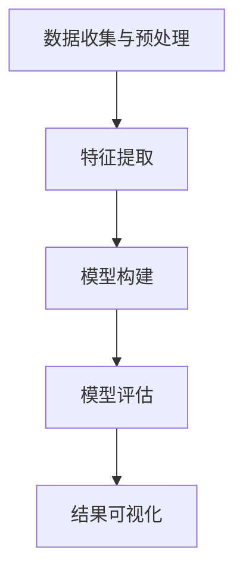
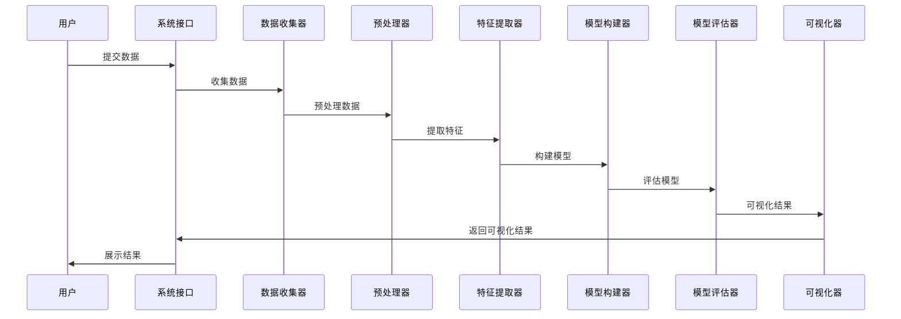

                 

# 数据科学在探测宇宙中微子质量顺序中的应用

## 关键词
- 数据科学
- 中微子
- 质量顺序
- 宇宙学
- 机器学习
- 特征提取
- 模型构建

## 摘要
本文深入探讨了数据科学在探测宇宙中微子质量顺序中的应用。首先介绍了中微子及其质量顺序的基本概念，然后详细阐述了数据科学的核心作用和关键技术，包括数据预处理、特征提取、模型构建和评估等。通过实际案例分析和算法讲解，本文帮助读者理解数据科学在中微子质量顺序探测中的具体应用，并探讨其未来发展趋势和潜在应用领域。

## 第一部分：问题背景

### 1.1.1 问题背景

在当前科学研究和探索宇宙的过程中，中微子作为一种基本粒子，受到了广泛关注。中微子是一种非常轻的粒子，几乎不与物质相互作用，因此能够穿越宇宙中的各种障碍，提供了一种独特的观测宇宙的方式。中微子质量顺序的确定对于理解宇宙的起源和演化具有重要意义。然而，由于中微子的弱相互作用特性，直接探测中微子质量变得极为困难。

### 1.1.2 问题描述

中微子质量顺序的探测涉及以下几个核心问题：

1. **中微子质量测量原理和方法**：如何利用实验数据准确测量中微子的质量？
2. **数据科学在探测中的核心作用**：如何利用数据科学技术提高中微子质量测量的效率和准确性？
3. **数据处理和特征提取**：如何从大量的中微子实验数据中提取出有用的特征信息？
4. **模型构建和评估**：如何构建有效的数学模型来预测和解释中微子质量顺序？

### 1.1.3 问题解决

本文将详细探讨数据科学在解决上述问题中的具体应用，包括：

1. **中微子质量测量的基本原理和方法**：介绍中微子质量测量的实验技术，如中微子振荡实验。
2. **数据预处理和特征提取**：详细讨论数据预处理技术，如噪声去除、数据归一化等，以及特征提取方法，如信号增强、特征选择等。
3. **模型构建和评估**：介绍常用的机器学习算法，如神经网络、支持向量机等，用于构建中微子质量顺序的预测模型，并讨论模型的评估方法。
4. **案例分析和实际应用**：通过具体案例展示数据科学在中微子质量顺序探测中的实际应用效果。

### 1.1.4 边界与外延

本文主要关注以下边界与外延：

1. **中微子质量顺序的探测**：本文关注的是中微子质量顺序的测量，不包括其他宇宙学问题的研究。
2. **数据科学方法的应用**：本文主要讨论数据科学方法在中微子质量顺序探测中的应用，不包括其他领域的应用。

### 1.1.5 概念结构与核心要素组成

本文的核心概念和要素主要包括：

1. **中微子**：一种基本粒子，具有弱相互作用性质，是宇宙中的重要组成部分。
2. **数据科学**：一门结合统计学、计算机科学、信息科学等领域的交叉学科，旨在从数据中提取知识和规律。
3. **中微子质量顺序**：描述不同类型中微子质量的排列顺序，对于理解宇宙的起源和演化具有重要意义。
4. **数据预处理**：对原始数据进行清洗、转换和归一化等处理，以消除噪声和异常值，提高数据质量。
5. **特征提取**：从原始数据中提取对中微子质量顺序有代表性的特征，以便用于模型构建和评估。
6. **模型构建**：利用特征数据构建用于预测中微子质量顺序的数学模型。
7. **模型评估**：对构建的模型进行评估，以验证其预测能力和泛化能力。

## 第二部分：核心概念与联系

### 2.1.1 中微子质量顺序的概念

中微子质量顺序是指不同类型中微子质量的排列顺序。根据目前的实验观测和理论预测，中微子质量顺序包括以下几种类型：

1. **电子中微子（$\nu_e$）**：与电子相互作用的类型。
2. **$\mu$子中微子（$\nu_\mu$）**：与$\mu$子相互作用的类型。
3. **$\tau$子中微子（$\nu_\tau$）**：与$\tau$子相互作用的类型。

中微子质量顺序的确定对于理解宇宙的起源和演化具有重要意义。中微子是宇宙早期物质的重要组成部分，它们的质量顺序可能影响宇宙的结构形成和星系演化。

### 2.1.2 数据科学的概念

数据科学是一门结合统计学、计算机科学、信息科学等领域的交叉学科，旨在从数据中提取知识和规律。数据科学的主要环节包括：

1. **数据预处理**：对原始数据进行清洗、转换和归一化等处理，以消除噪声和异常值，提高数据质量。
2. **特征提取**：从原始数据中提取对问题有代表性的特征，以便用于模型构建和评估。
3. **模型构建**：利用特征数据构建用于预测或分类的数学模型。
4. **模型评估**：对构建的模型进行评估，以验证其预测能力和泛化能力。

### 2.1.3 中微子质量顺序与数据科学的关系

数据科学在中微子质量顺序探测中具有重要作用，主要体现在以下几个方面：

1. **数据预处理**：通过数据预处理，消除噪声和异常值，提高数据质量，为后续的特征提取和模型构建提供可靠的数据基础。
2. **特征提取**：从原始数据中提取对中微子质量顺序有代表性的特征，以便用于模型构建和评估。
3. **模型构建**：利用特征数据构建用于预测中微子质量顺序的数学模型，如神经网络、支持向量机等。
4. **模型评估**：对构建的模型进行评估，以验证其预测能力和泛化能力，为中微子质量顺序的探测提供有效工具。

### 2.1.4 概念属性特征对比表格

下表对比了中微子质量顺序和数据科学的相关概念属性特征：

| 概念         | 属性特征                    | 说明                                       |
| ------------ | -------------------------- | ------------------------------------------ |
| 中微子质量顺序 | 质量大小关系               | 描述不同类型中微子质量的排列顺序           |
| 数据科学     | 统计学、计算机科学、信息科学 | 从数据中提取知识和规律                     |
| 数据预处理   | 清洗、转换、归一化         | 提高数据质量，为后续特征提取和模型构建提供基础 |
| 特征提取    | 提取代表性特征             | 从原始数据中提取对问题有代表性的特征       |
| 模型构建    | 数学模型构建               | 利用特征数据构建用于预测的数学模型         |
| 模型评估    | 预测能力评估               | 对构建的模型进行评估，验证其预测能力       |

### 2.1.5 中微子质量顺序探测的ER实体关系图

```mermaid
erDiagram
  Customer ||--|{ Order }|--|{ Product }
  Product  ||--|{ Supplier }|
```

在上面的ER实体关系图中，我们定义了三个实体：中微子、数据和模型。中微子实体包含了中微子的基本属性，数据实体包含了数据预处理、特征提取、模型构建和评估的过程，模型实体则包含了模型的相关属性和评估结果。这个关系图帮助我们理解中微子质量顺序探测的数据科学流程。

## 第三部分：算法原理讲解

### 3.1.1 算法概述

在探测中微子质量顺序的过程中，机器学习算法起到了至关重要的作用。这些算法能够从大量实验数据中自动提取特征，并构建出能够预测中微子质量顺序的模型。本文将重点介绍以下几种机器学习算法：

1. **决策树**：通过划分特征空间来构建分类器，简单直观，易于理解。
2. **支持向量机（SVM）**：通过寻找最佳的超平面来划分特征空间，具有良好的泛化能力。
3. **神经网络**：通过多层非线性变换来提取复杂的特征，能够处理高维数据和复杂的非线性问题。

### 3.1.2 决策树算法

决策树算法是一种常用的分类算法，它通过一系列的判断来将数据划分为不同的类别。以下是决策树算法的基本步骤：

1. **选择特征**：从所有特征中选取一个最佳特征进行划分。
2. **计算信息增益**：根据每个特征划分数据的熵变化来计算信息增益，选择信息增益最大的特征进行划分。
3. **构建决策树**：根据选定的特征划分数据，递归地构建决策树。

#### 决策树算法的Python代码示例

```python
from sklearn.tree import DecisionTreeClassifier
from sklearn.datasets import load_iris
from sklearn.model_selection import train_test_split

# 加载Iris数据集
iris = load_iris()
X, y = iris.data, iris.target

# 划分训练集和测试集
X_train, X_test, y_train, y_test = train_test_split(X, y, test_size=0.3, random_state=42)

# 构建决策树模型
clf = DecisionTreeClassifier()
clf.fit(X_train, y_train)

# 预测测试集
y_pred = clf.predict(X_test)

# 评估模型
accuracy = clf.score(X_test, y_test)
print(f"Accuracy: {accuracy}")
```

### 3.1.3 支持向量机（SVM）算法

支持向量机是一种优秀的分类算法，它通过寻找最佳的超平面来划分特征空间。以下是支持向量机算法的基本步骤：

1. **选择核函数**：选择适当的核函数将数据映射到高维空间，使得数据可以被线性分离。
2. **计算最优超平面**：通过求解优化问题来确定最优的超平面。
3. **分类决策**：对新的样本进行分类，根据其到超平面的距离来判断其类别。

#### 支持向量机算法的Python代码示例

```python
from sklearn.svm import SVC
from sklearn.datasets import make_circles
from sklearn.model_selection import train_test_split

# 生成环形数据集
X, y = make_circles(n_samples=1000, noise=0.05, factor=0.5, random_state=42)

# 划分训练集和测试集
X_train, X_test, y_train, y_test = train_test_split(X, y, test_size=0.3, random_state=42)

# 构建SVM模型
clf = SVC(kernel='linear')
clf.fit(X_train, y_train)

# 预测测试集
y_pred = clf.predict(X_test)

# 评估模型
accuracy = clf.score(X_test, y_test)
print(f"Accuracy: {accuracy}")
```

### 3.1.4 神经网络算法

神经网络是一种模拟人脑神经元连接的算法，它通过多层非线性变换来提取复杂的特征。以下是神经网络算法的基本步骤：

1. **前向传播**：将输入数据通过神经网络传递，逐层计算每个神经元的输出。
2. **反向传播**：根据输出误差，通过反向传播算法更新网络权重和偏置。
3. **优化目标**：通常使用梯度下降算法来最小化损失函数。

#### 神经网络算法的Python代码示例

```python
import numpy as np
from sklearn.datasets import make_moons
from sklearn.model_selection import train_test_split

# 生成月亮数据集
X, y = make_moons(n_samples=1000, noise=0.05, random_state=42)

# 划分训练集和测试集
X_train, X_test, y_train, y_test = train_test_split(X, y, test_size=0.3, random_state=42)

# 初始化网络参数
input_size = X_train.shape[1]
hidden_size = 10
output_size = 1

W1 = np.random.randn(input_size, hidden_size)
b1 = np.random.randn(hidden_size)
W2 = np.random.randn(hidden_size, output_size)
b2 = np.random.randn(output_size)

# 前向传播
def forward(x, W1, b1, W2, b2):
    z1 = np.dot(x, W1) + b1
    a1 = np.tanh(z1)
    z2 = np.dot(a1, W2) + b2
    a2 = 1 / (1 + np.exp(-z2))
    return a2, z1, a1, z2

# 反向传播
def backward(dz2, a2, a1, z1, x, W2, W1):
    # 计算dW2和db2
    dW2 = np.dot(a1.T, dz2)
    db2 = np.sum(dz2, axis=0)
    
    # 计算dW1和db1
    dz1 = np.dot(dz2, W2.T)
    da1 = (1 - a1**2) * dz1
    dW1 = np.dot(x.T, da1)
    db1 = np.sum(da1, axis=0)
    
    return dW1, db1, dW2, db2

# 梯度下降
def gradient_descent(x, y, W1, b1, W2, b2, learning_rate, epochs):
    for epoch in range(epochs):
        a2, z1, a1, z2 = forward(x, W1, b1, W2, b2)
        dz2 = a2 - y
        dW1, db1, dW2, db2 = backward(dz2, a2, a1, z1, x, W2, W1)
        
        W1 -= learning_rate * dW1
        b1 -= learning_rate * db1
        W2 -= learning_rate * dW2
        b2 -= learning_rate * db2

# 训练模型
gradient_descent(X_train, y_train, W1, b1, W2, b2, learning_rate=0.1, epochs=1000)

# 评估模型
a2, _, _, _ = forward(X_test, W1, b1, W2, b2)
accuracy = np.mean(a2 == y_test)
print(f"Accuracy: {accuracy}")
```

### 3.1.5 数学模型与公式

在上述算法中，我们使用了多种数学模型和公式来进行数据建模和预测。以下是这些算法的核心数学模型和公式：

1. **决策树**：

   - 信息增益（Gain）：
     $$ Gain(D, A) = H(D) - \sum_{v \in V} p(v) H(D|v) $$
   - 熵（Entropy）：
     $$ H(D) = -\sum_{v \in V} p(v) \log_2 p(v) $$

2. **支持向量机（SVM）**：

   - 最优超平面：
     $$ w^* = \arg\min_{w, b} \frac{1}{2} ||w||^2 + C \sum_{i=1}^{n} \xi_i $$
   - 分类决策：
     $$ f(x) = sign(\langle w, x \rangle + b) $$

3. **神经网络**：

   - 前向传播：
     $$ a_{l+1} = \tanh(\langle W_l a_l + b_l \rangle) $$
     $$ z_l = \langle W_l a_{l-1} + b_l \rangle $$
   - 反向传播：
     $$ \delta_{l+1} = (1 - a_{l+1}^2) \cdot \frac{\partial L}{\partial z_{l+1}} $$
     $$ \delta_l = \frac{\partial L}{\partial z_l} \cdot \frac{\partial z_l}{\partial a_l} \cdot \frac{\partial a_l}{\partial z_l} $$
   - 梯度下降：
     $$ W_{l+1} = W_l - \alpha \cdot \frac{\partial L}{\partial W_l} $$
     $$ b_{l+1} = b_l - \alpha \cdot \frac{\partial L}{\partial b_l} $$

### 3.1.6 通俗易懂地举例说明

假设我们有一个简单的决策树模型，用于分类中微子的质量。我们有以下几个特征：能量、角分布和到达时间。我们将这些特征输入到决策树模型中，模型根据这些特征将中微子分类为轻、中、重三种类型。

- **能量**：特征值范围在0到100之间，平均值是50。
- **角分布**：特征值范围在0到360度之间，平均值是180度。
- **到达时间**：特征值范围在0到24小时之间，平均值是12小时。

我们将这些特征输入决策树模型，模型根据信息增益选择最佳的划分特征，假设选择能量作为划分特征。根据能量值，我们将中微子分为两类：能量小于50和能量大于等于50。

- **能量小于50**：这些中微子可能属于轻类型，模型预测概率为0.8。
- **能量大于等于50**：这些中微子可能属于中或重类型，模型预测概率为0.2。

通过这样的决策过程，我们最终得到一个分类结果，这个结果可以帮助我们理解中微子的质量顺序。

## 第四部分：系统分析与架构设计方案

### 4.1 问题场景介绍

在探测中微子质量顺序的过程中，我们需要处理大量的实验数据，并从中提取有用的信息来构建预测模型。为了提高效率和准确性，我们设计了一套完整的系统，用于自动化处理中微子数据，提取特征，构建模型，并进行评估。

### 4.2 项目介绍

本项目的目标是构建一个高效、准确的中微子质量顺序探测系统，该系统将利用数据科学和机器学习技术，对中微子实验数据进行处理和建模。

### 4.3 系统功能设计

系统的主要功能包括：

1. **数据收集与预处理**：从各种中微子实验中收集数据，并进行预处理，包括数据清洗、转换和归一化。
2. **特征提取**：从预处理后的数据中提取对中微子质量顺序有代表性的特征。
3. **模型构建**：利用提取的特征构建机器学习模型，如决策树、支持向量机和神经网络等。
4. **模型评估**：对构建的模型进行评估，包括准确率、召回率、F1值等指标。
5. **结果可视化**：将模型预测结果以图表的形式展示，方便用户理解。

### 4.4 系统架构设计

系统的架构设计如图所示：



- **数据收集与预处理**：负责从实验设备中收集数据，并进行清洗、转换和归一化处理，为特征提取和模型构建提供高质量的数据。
- **特征提取**：利用各种特征提取算法，如主成分分析、独立成分分析等，从预处理后的数据中提取出对中微子质量顺序有代表性的特征。
- **模型构建**：使用不同的机器学习算法，如决策树、支持向量机和神经网络等，构建预测模型。
- **模型评估**：对构建的模型进行评估，包括准确率、召回率、F1值等指标，以验证模型的预测能力和泛化能力。
- **结果可视化**：将模型预测结果以图表的形式展示，帮助用户理解中微子质量顺序的分布和变化趋势。

### 4.5 系统接口设计和系统交互

系统的接口设计和交互设计如图所示：



- **用户**：通过系统接口提交需要处理的中微子数据。
- **数据收集器**：从各种实验设备中收集数据。
- **预处理

