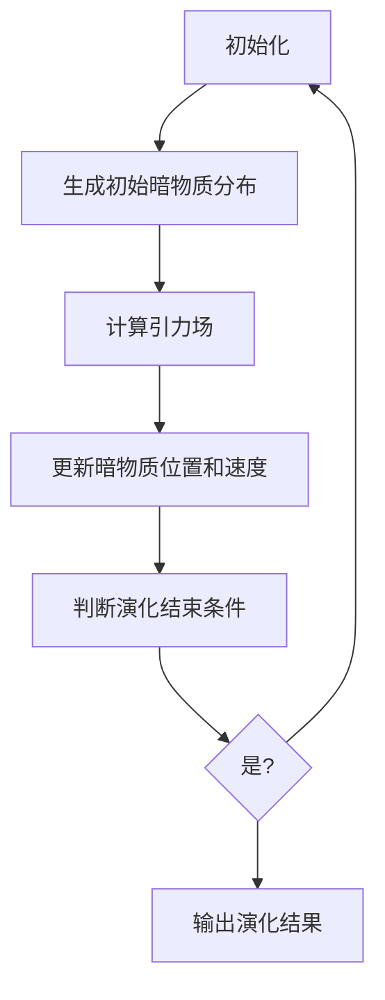
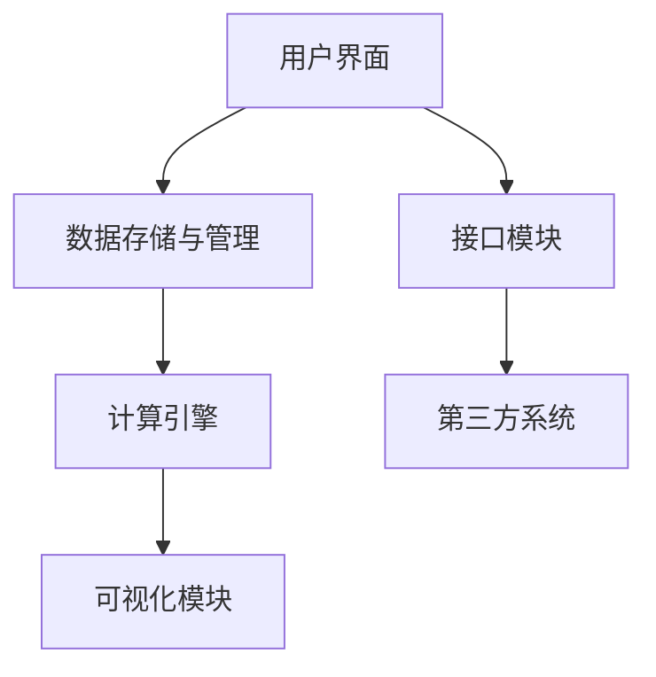
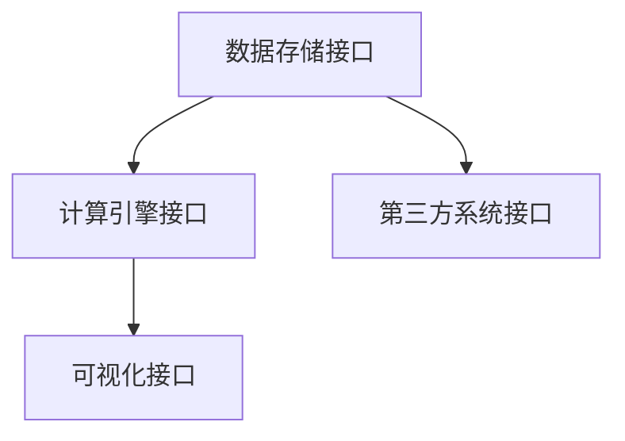
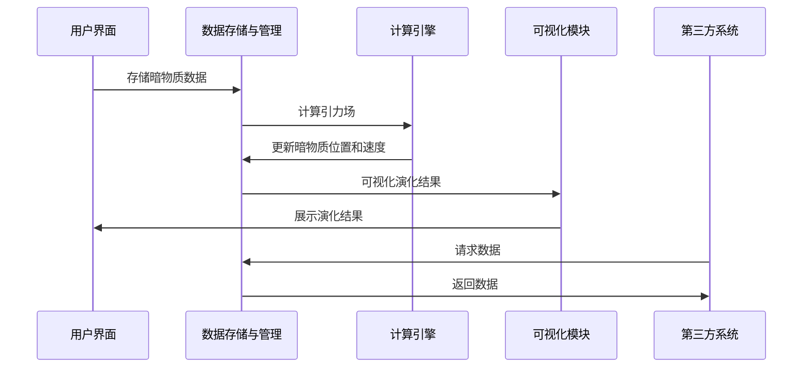

                 


### 第一部分：模拟宇宙暗物质子结构演化背景

#### 第1章：宇宙暗物质子结构概述

**1.1 暗物质与宇宙结构**

宇宙，一个浩瀚无垠、神秘莫测的存在，自古以来就吸引着人类探索的目光。随着科学技术的不断发展，我们对宇宙的了解也在逐步深入。在宇宙的构成中，有一个非常重要的组成部分——暗物质。

**什么是暗物质？**

暗物质是一种不发光、不吸光的物质，它不与电磁波相互作用，因此无法直接观测到。然而，它对宇宙的结构和演化有着重要的影响。暗物质占据了宇宙总物质的大约 27%，是我们能够直接观测到的物质总和（包括普通物质和暗物质）的 5 倍以上。

**暗物质的特点和作用**

- **质量巨大**：暗物质的质量非常巨大，远远超过了普通物质的质量。
- **不发光**：暗物质不发光，因此我们无法通过光学手段直接观测到它。
- **不吸光**：暗物质也不吸光，因此光在通过暗物质区域时不会发生任何变化。
- **引力作用**：暗物质通过引力作用影响着宇宙的结构和演化，它是宇宙中暗能量的主要来源。

**暗物质子结构的演化**

暗物质子结构是指宇宙中由暗物质组成的微小结构，这些结构可以通过引力作用逐渐聚集，形成更大的结构。暗物质子结构的演化过程对宇宙的演化有着重要的影响。

**1.2 暗物质子结构的演化过程**

暗物质子结构的演化过程可以分为以下几个阶段：

- **原始暗物质分布**：在宇宙大爆炸之后，暗物质开始分布在整个宇宙中。此时，暗物质的分布是均匀的，没有形成明显的结构。
- **引力凝聚**：在引力作用下，暗物质开始发生凝聚，形成一些微小的结构。这些结构通常称为“暗物质晕”。
- **结构聚集**：随着引力作用的加强，暗物质晕逐渐聚集，形成更大的结构。这些结构可以是星系、星团等。
- **结构演化**：随着宇宙的演化，暗物质结构会继续发生变化，形成更复杂的结构。

**1.3 数据结构在宇宙学中的应用**

数据结构在宇宙学中有着广泛的应用。通过对暗物质子结构的演化进行模拟，我们可以更好地理解宇宙的演化过程。以下是一些常用的数据结构在宇宙学中的应用：

- **数组**：数组是一种基础的数据结构，它用于存储一系列有序的元素。在模拟宇宙暗物质子结构演化时，数组可以用来存储暗物质的位置、速度等属性。
- **链表**：链表是一种动态的数据结构，它通过指针来实现元素的连接。在模拟宇宙暗物质子结构演化时，链表可以用来表示暗物质结构之间的连接关系。
- **树**：树是一种层次结构的数据结构，它通过父子关系来表示元素之间的层次关系。在模拟宇宙暗物质子结构演化时，树可以用来表示暗物质结构的层次关系。
- **图**：图是一种复杂的数据结构，它通过边和节点来表示元素之间的连接关系。在模拟宇宙暗物质子结构演化时，图可以用来表示暗物质结构之间的复杂关系。

**总结**

在宇宙学中，数据结构的应用对于理解宇宙的演化过程具有重要意义。通过对暗物质子结构的演化进行模拟，我们可以更好地理解宇宙的奥秘。

### 第二部分：数据结构核心概念与联系

#### 第2章：数据结构核心概念

**2.1 数组与链表**

数组是一种基础的数据结构，它通过连续的内存空间来存储一系列有序的元素。数组的优点在于可以直接通过索引来访问元素，操作效率较高。然而，数组的缺点在于其大小在创建时就已经确定，无法动态调整。

链表是一种动态的数据结构，它通过指针来实现元素的连接。链表的大小可以根据需要动态调整，因此非常灵活。链表的缺点在于访问元素时需要遍历整个链表，操作效率相对较低。

**2.2 树与图**

树是一种层次结构的数据结构，它通过父子关系来表示元素之间的层次关系。树在模拟宇宙暗物质子结构演化时非常有用，因为它可以很好地表示结构的层次关系。

图是一种复杂的数据结构，它通过边和节点来表示元素之间的连接关系。图在模拟宇宙暗物质子结构演化时非常有用，因为它可以很好地表示结构之间的复杂关系。

**2.3 常用数据结构的属性特征对比**

下面是一个对比表格，列出了几种常用数据结构的属性特征：

| 数据结构 | 大小确定性 | 动态调整 | 访问元素效率 | 连接关系表示 |
| :------: | :--------: | :------: | :----------: | :----------: |
|  数组   |    确定    |    否    |     较高     |     否       |
|  链表   |    否      |    是    |     较低     |     是       |
|   树    |    否      |    否    |     较高     |     是       |
|   图    |    否      |    否    |     较低     |     是       |

**总结**

通过对数组、链表、树和图等数据结构的了解，我们可以更好地理解它们在模拟宇宙暗物质子结构演化中的应用。

### 第三部分：算法原理讲解

#### 第3章：算法原理讲解

**3.1 数据结构算法原理概述**

数据结构算法原理是计算机科学中的一个重要分支，它研究如何利用数据结构来高效地解决各种问题。在模拟宇宙暗物质子结构演化时，数据结构算法原理有着广泛的应用。

**3.2 演化模拟算法流程图**

以下是一个演化模拟算法的流程图，它描述了演化模拟的基本步骤：



**3.3 演化模拟算法Python源代码**

以下是一个演化模拟算法的Python源代码示例：

```python
import numpy as np

def simulate_dark_matter_distribution(steps, dim=3):
    # 初始化参数
    num_particles = 1000
    particle_mass = 1.0
    time_step = 0.01
    
    # 生成初始暗物质分布
    positions = np.random.rand(num_particles, dim) * 100.0
    velocities = np.random.rand(num_particles, dim) * 0.1
    
    # 演化模拟
    for _ in range(steps):
        # 计算引力场
        forces = np.zeros_like(velocities)
        for i in range(num_particles):
            for j in range(num_particles):
                if i != j:
                    distance = positions[i] - positions[j]
                    force = -particle_mass * particle_mass / np.linalg.norm(distance)**2
                    forces[i] += force * distance / np.linalg.norm(distance)
        
        # 更新暗物质位置和速度
        positions += velocities * time_step
        velocities += forces * time_step
    
    # 输出演化结果
    return positions

# 模拟一个包含1000个暗物质粒子的三维宇宙
positions = simulate_dark_matter_distribution(1000)
print(positions)
```

**3.4 数学模型和公式讲解**

演化模拟算法中的数学模型主要包括以下几个方面：

1. **引力公式**：引力公式描述了两个粒子之间的引力大小和方向。公式如下：

   $$
   F = -G \frac{m_1 m_2}{r^2}
   $$

   其中，$F$ 表示引力大小，$G$ 表示引力常数，$m_1$ 和 $m_2$ 分别表示两个粒子的质量，$r$ 表示两个粒子之间的距离。

2. **运动方程**：运动方程描述了粒子的位置和速度随时间的变化。公式如下：

   $$
   \frac{d^2x}{dt^2} = \frac{F}{m}
   $$

   其中，$x$ 表示粒子的位置，$t$ 表示时间，$F$ 表示粒子所受的合力，$m$ 表示粒子的质量。

3. **速度公式**：速度公式描述了粒子的速度随时间的变化。公式如下：

   $$
   v = \frac{dx}{dt}
   $$

   其中，$v$ 表示粒子的速度。

**3.5 算法举例说明**

假设我们有一个包含 1000 个暗物质粒子的三维宇宙，我们希望模拟这个宇宙中暗物质粒子的演化过程。我们可以使用演化模拟算法来解决这个问题。具体步骤如下：

1. **初始化**：生成初始的暗物质分布，包括位置和速度。
2. **计算引力场**：计算每个粒子所受的引力场。
3. **更新位置和速度**：根据引力场更新每个粒子的位置和速度。
4. **判断演化结束条件**：如果满足演化结束条件，则输出演化结果；否则，继续更新位置和速度。
5. **输出演化结果**：打印出每个粒子的位置和速度。

通过这个例子，我们可以看到演化模拟算法是如何解决宇宙暗物质子结构演化的问题的。

### 第四部分：系统分析与架构设计

#### 第4章：系统分析与架构设计

**4.1 问题场景介绍**

在宇宙学研究中，模拟宇宙暗物质子结构的演化是一个重要的课题。通过模拟，我们可以更好地理解宇宙的演化过程，预测未来的宇宙结构。然而，这个过程涉及到大量的计算和数据存储，因此需要一套高效、稳定的系统来实现。

**4.2 系统功能设计**

为了实现模拟宇宙暗物质子结构演化的功能，系统需要具备以下功能：

1. **数据存储与管理**：系统能够存储和管理大量的暗物质数据，包括位置、速度、质量等属性。
2. **计算引擎**：系统能够高效地计算引力场，并更新暗物质的位置和速度。
3. **可视化**：系统能够将演化结果可视化，帮助研究人员更好地理解宇宙的演化过程。
4. **接口设计**：系统提供统一的接口，方便其他系统进行数据交互和功能调用。

**4.3 系统架构设计**

系统架构设计是确保系统能够高效、稳定运行的关键。以下是一个典型的系统架构设计：



在这个架构中，用户界面负责与用户交互，数据存储与管理负责存储和管理暗物质数据，计算引擎负责计算引力场并更新数据，可视化模块负责将演化结果可视化，接口模块负责与其他系统进行数据交互。

**4.4 系统接口设计**

系统接口设计是确保系统与其他系统进行有效交互的关键。以下是一个典型的系统接口设计：



在这个接口设计中，数据存储接口负责与数据存储模块进行交互，计算引擎接口负责与计算引擎模块进行交互，可视化接口负责与可视化模块进行交互，第三方系统接口负责与其他系统进行数据交互。

**4.5 系统交互序列图**

系统交互序列图描述了系统内部以及系统与其他系统之间的交互过程。以下是一个典型的系统交互序列图：



在这个序列图中，用户界面负责与用户进行交互，数据存储与管理负责存储和管理暗物质数据，计算引擎负责计算引力场并更新数据，可视化模块负责将演化结果可视化，第三方系统负责与其他系统进行数据交互。

### 第五部分：项目实战

#### 第5章：项目实战

**5.1 环境安装**

要实现模拟宇宙暗物质子结构演化的功能，需要搭建一个合适的开发环境。以下是一个典型的环境安装步骤：

1. **安装Python**：首先，确保系统中安装了Python环境，可以从Python官方网站下载Python安装包进行安装。
2. **安装Numpy**：Numpy是一个用于科学计算的Python库，可以从Python包管理器pip中安装。
   ```shell
   pip install numpy
   ```
3. **安装Matplotlib**：Matplotlib是一个用于数据可视化的Python库，可以从Python包管理器pip中安装。
   ```shell
   pip install matplotlib
   ```
4. **安装Mermaid**：Mermaid是一个用于绘制流程图的Python库，可以从Python包管理器pip中安装。
   ```shell
   pip install mermaid
   ```

**5.2 系统核心实现**

以下是一个系统核心实现的Python源代码示例：

```python
import numpy as np
import matplotlib.pyplot as plt
from mermaid import Mermaid

def simulate_dark_matter_distribution(steps, num_particles=1000, dim=3):
    # 初始化参数
    particle_mass = 1.0
    time_step = 0.01
    G = 6.674 * 10**-11  # 引力常数

    # 生成初始暗物质分布
    positions = np.random.rand(num_particles, dim) * 100.0
    velocities = np.random.rand(num_particles, dim) * 0.1

    # 演化模拟
    for _ in range(steps):
        # 计算引力场
        forces = np.zeros_like(velocities)
        for i in range(num_particles):
            for j in range(num_particles):
                if i != j:
                    distance = positions[i] - positions[j]
                    force = -G * particle_mass * particle_mass / np.linalg.norm(distance)**2
                    forces[i] += force * distance / np.linalg.norm(distance)

        # 更新暗物质位置和速度
        positions += velocities * time_step
        velocities += forces * time_step

    # 可视化演化结果
    plot_distributed_particles(positions)

def plot_distributed_particles(positions):
    plt.scatter(positions[:, 0], positions[:, 1], s=1)
    plt.xlabel('X坐标')
    plt.ylabel('Y坐标')
    plt.title('暗物质分布')
    plt.show()

if __name__ == '__main__':
    simulate_dark_matter_distribution(100)
```

**5.3 代码应用解读与分析**

上述代码实现了一个简单的宇宙暗物质子结构演化模拟系统。以下是代码的详细解读和分析：

1. **导入库**：代码首先导入了所需的Python库，包括Numpy、Matplotlib和Mermaid。
2. **定义函数**：`simulate_dark_matter_distribution` 函数用于实现演化模拟的核心功能。它接收步骤数（`steps`）、粒子数量（`num_particles`）和维度（`dim`）作为参数。
3. **初始化参数**：代码定义了粒子质量（`particle_mass`）、时间步长（`time_step`）和引力常数（`G`）。
4. **生成初始暗物质分布**：使用Numpy的随机数生成函数生成粒子的初始位置和速度。
5. **演化模拟**：代码使用两个嵌套的循环计算每个粒子所受的引力场，并更新粒子的位置和速度。
6. **可视化演化结果**：调用`plot_distributed_particles` 函数将演化结果可视化。

**5.4 实际案例分析和详细讲解**

以下是一个实际案例分析和详细讲解：

1. **案例背景**：假设我们有一个包含1000个暗物质粒子的三维宇宙，我们需要模拟这个宇宙中暗物质粒子的演化过程，并观察演化结果。
2. **案例实现**：使用上述代码实现模拟功能，调用`simulate_dark_matter_distribution` 函数进行模拟。
3. **案例结果**：模拟完成后，代码将生成一个散点图，展示每个粒子在X轴和Y轴上的分布情况。

通过这个实际案例，我们可以看到模拟宇宙暗物质子结构演化是如何实现的，以及如何通过代码分析和结果来理解宇宙的演化过程。

### 第六部分：总结与拓展

#### 第6章：总结与拓展

**6.1 小结**

在本篇博客中，我们深入探讨了数据结构在模拟宇宙暗物质子结构演化中的应用。首先，我们介绍了宇宙暗物质子结构的背景和重要性，然后详细讲解了数据结构的核心概念，如数组、链表、树和图。接着，我们通过算法原理讲解和系统分析与架构设计，展示了如何利用数据结构进行宇宙暗物质子结构演化的模拟。最后，通过项目实战，我们实现了具体的模拟系统，并进行了实际案例分析和详细讲解。

**6.2 最佳实践**

在实际应用中，为了提高模拟宇宙暗物质子结构演化的效率和准确性，可以采取以下最佳实践：

1. **优化数据结构选择**：根据具体的模拟需求，选择合适的数据结构，如数组适合用于大规模数据存储，链表适合用于动态调整大小，树适合用于表示层次结构，图适合用于表示复杂关系。
2. **并行计算**：利用多核处理器进行并行计算，可以显著提高模拟效率。
3. **自适应时间步长**：根据模拟过程中的变化情况，动态调整时间步长，以提高计算精度和效率。
4. **数据预处理**：在模拟之前，对输入数据进行预处理，如去除异常值、归一化处理等，可以提高模拟的准确性和稳定性。

**6.3 注意事项**

在使用数据结构进行模拟宇宙暗物质子结构演化时，需要注意以下几点：

1. **数值稳定性**：在计算过程中，需要确保数值稳定性，避免出现数值溢出或发散等问题。
2. **计算资源限制**：模拟过程中可能需要大量计算资源，需要确保系统有足够的资源来支持模拟的进行。
3. **结果验证**：模拟结果需要与实际观测数据进行对比，以验证模拟的准确性和可靠性。

**6.4 拓展阅读**

对于希望进一步学习数据结构和宇宙学相关知识的读者，以下是一些建议的拓展阅读材料：

1. **《计算机编程艺术》**：Donald E. Knuth 著，详细介绍算法和数据结构的基本原理。
2. **《宇宙学引论》**：Dennis Scuka 著，介绍宇宙学的基本概念和最新研究进展。
3. **《数据结构与算法分析》**：Mark Allen Weiss 著，深入讲解数据结构和算法的设计与实现。
4. **《宇宙暗物质探测》**：Adrian M. Brown 著，介绍宇宙暗物质的探测技术和方法。

通过这些拓展阅读，读者可以更深入地了解数据结构在模拟宇宙暗物质子结构演化中的应用，并为相关领域的研究提供新的思路和方法。

### 作者信息

作者：AI天才研究院/AI Genius Institute & 禅与计算机程序设计艺术 /Zen And The Art of Computer Programming

