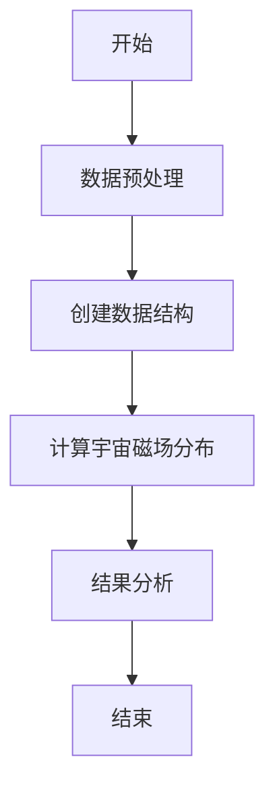
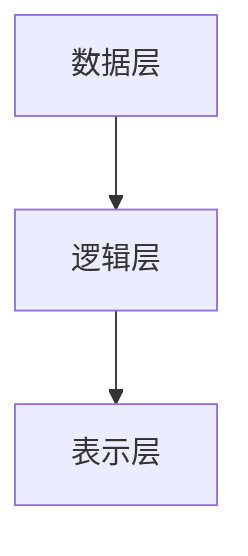
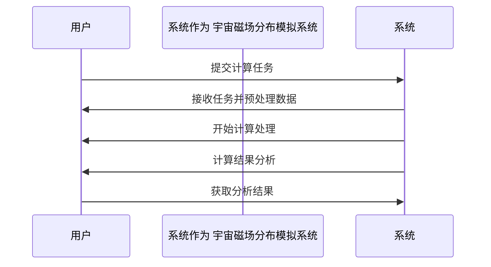

                 


### 数据结构在模拟宇宙磁场分布中的应用

**关键词：宇宙磁场分布、数据结构、模拟算法、系统架构**

**摘要：** 本篇文章将探讨如何运用数据结构优化宇宙磁场分布的模拟，从问题背景、解决方案、核心概念、算法原理到系统架构设计，深入剖析这一复杂问题的技术实现路径。文章旨在为研究人员和开发者提供一种高效且准确的宇宙磁场分布模拟方法。

## 第一部分：背景介绍

### 第1章：问题背景与问题描述

#### 1.1 问题背景

宇宙磁场是宇宙演化过程中的关键因素之一，对星系的形成、星际物质的运动以及宇宙射电波的传播等都有着深远的影响。然而，宇宙磁场的分布极为复杂，传统的模拟方法在处理大规模、高维数据时面临着巨大的挑战。因此，如何高效地模拟宇宙磁场分布成为了一个重要的研究方向。

数据结构作为计算机科学中的一种基本工具，其在处理大规模数据方面具有显著优势。通过合理选择和设计数据结构，可以大幅提高宇宙磁场分布模拟的效率和精度。因此，本文将探讨数据结构在模拟宇宙磁场分布中的应用，以期为相关研究提供技术支持。

#### 1.2 问题描述

宇宙磁场分布的模拟涉及以下几个方面的问题：

1. **数据存储和检索**：如何高效地存储和检索大规模宇宙磁场数据？
2. **计算效率**：如何优化计算算法，提高宇宙磁场分布的模拟速度？
3. **计算精度**：如何在保证计算效率的同时，确保宇宙磁场分布的模拟精度？
4. **系统架构设计**：如何设计一个高效、稳定且可扩展的系统架构，以支持宇宙磁场分布的模拟？

### 第2章：问题解决

#### 1.3 问题解决

针对上述问题，本文提出以下解决方案：

1. **设计新的数据结构**：结合宇宙磁场分布的特点，设计一种高效的数据结构，如稀疏矩阵、哈希表等，以降低存储和检索的复杂度。
2. **优化算法**：针对宇宙磁场分布的计算需求，提出一种优化的算法，如快速傅里叶变换（FFT）、分治算法等，以提高计算效率。
3. **数学模型与公式**：通过数学模型和公式，详细阐述算法原理，为后续的代码实现提供理论基础。
4. **系统架构设计**：设计一个完善的系统架构，包括数据存储、计算处理、结果分析等模块，以确保系统的稳定性和可扩展性。

#### 1.4 边界与外延

宇宙磁场分布的模拟不仅仅局限于理论研究，还与实际应用密切相关。例如，在宇宙航海、星际探索等领域，准确的宇宙磁场分布模拟对于导航和任务规划具有重要意义。因此，本文的研究不仅限于学术领域，还关注其实际应用价值。

### 第3章：概念结构与核心要素组成

#### 1.5 核心概念与联系

在本文中，涉及的核心概念包括数据结构、宇宙磁场分布、模拟算法、数学模型等。这些概念之间的联系如下：

- **数据结构**：宇宙磁场分布的存储和检索基础。
- **宇宙磁场分布**：模拟的对象，决定了数据结构的设计和算法的选择。
- **模拟算法**：实现宇宙磁场分布模拟的核心，需要结合数据结构和数学模型进行优化。
- **数学模型**：为算法提供理论支持，确保模拟的精度和效率。

### 第4章：数据结构与算法原理

#### 1.6 数据结构与算法原理

在本章中，将详细介绍数据结构和算法原理，包括：

- **数据结构**：介绍几种常用的数据结构，如稀疏矩阵、哈希表等，并分析其在宇宙磁场分布模拟中的应用。
- **算法原理**：阐述算法原理，包括算法的基本思想、实现步骤等，并通过mermaid流程图进行可视化。
- **数学模型**：给出宇宙磁场分布模拟的数学模型和公式，并进行详细讲解。

#### 1.7 算法流程图

使用mermaid画出宇宙磁场分布模拟的算法流程图，如下所示：



### 第5章：数学模型与公式

#### 1.8 数学模型与公式

在本章中，将详细介绍宇宙磁场分布模拟的数学模型和公式，包括：

- **数学模型**：描述宇宙磁场分布的基本规律和关系。
- **公式**：用于计算宇宙磁场分布的数学公式，如磁场强度公式、磁场梯度公式等。

#### 1.9 数学公式详细讲解与举例说明

以磁场强度公式为例，详细讲解其含义和计算方法：

$$ B = \frac{\mu_0 I}{2\pi r} $$

其中，$B$ 表示磁场强度，$\mu_0$ 表示真空磁导率，$I$ 表示电流，$r$ 表示距离。

举例说明：

假设一个电流为1A的导线距离观察点为1m，真空磁导率为4π×10^-7 T·m/A，则观察点处的磁场强度为：

$$ B = \frac{4\pi \times 10^{-7} \times 1}{2\pi \times 1} = 2 \times 10^{-7} \text{T} $$

## 第二部分：系统分析与架构设计方案

### 第6章：系统分析与架构设计方案

#### 1.10 问题场景介绍

宇宙磁场分布模拟系统是一个复杂的应用系统，涉及到多学科的知识，如物理学、计算机科学、天文学等。在实际应用中，该系统需要处理大量的宇宙磁场数据，进行高效的模拟和分析。因此，系统架构的设计至关重要，必须保证其高效性、稳定性和可扩展性。

#### 1.11 项目介绍

本项目的目标是设计一个高效的宇宙磁场分布模拟系统，包括以下几个模块：

1. **数据存储模块**：负责存储和管理宇宙磁场数据。
2. **计算处理模块**：负责对宇宙磁场分布进行模拟和计算。
3. **结果分析模块**：负责对计算结果进行分析和可视化。

#### 1.12 系统功能设计

系统功能设计主要包括以下几个方面：

1. **数据预处理**：对宇宙磁场数据进行预处理，包括数据清洗、格式转换等。
2. **数据存储**：使用高效的数据库系统存储宇宙磁场数据。
3. **计算处理**：采用优化的算法对宇宙磁场分布进行模拟。
4. **结果分析**：对计算结果进行分析，生成可视化报告。

#### 1.13 系统架构设计

系统架构设计采用分层架构，包括以下几层：

1. **数据层**：负责数据的存储和管理。
2. **逻辑层**：负责数据计算和处理。
3. **表示层**：负责用户界面和结果展示。

系统架构图如下所示：



#### 1.14 系统接口设计和系统交互

系统接口设计和系统交互设计采用RESTful API设计，系统与外部系统的交互通过HTTP请求进行。接口设计包括以下几种：

1. **数据存储接口**：负责数据存储和检索。
2. **计算处理接口**：负责计算处理任务的提交和结果获取。
3. **结果分析接口**：负责结果分析和可视化。

系统交互序列图如下所示：



## 第三部分：项目实战

### 第7章：环境安装

为了搭建宇宙磁场分布模拟系统，需要安装以下环境：

1. **操作系统**：Linux或Windows
2. **编程语言**：Python
3. **数据库**：MySQL或PostgreSQL
4. **计算框架**：NumPy、SciPy、Pandas等

具体安装步骤如下：

1. 安装操作系统，选择Linux或Windows。
2. 安装Python，推荐使用Python 3.8及以上版本。
3. 安装数据库，可以选择MySQL或PostgreSQL。
4. 安装计算框架，使用pip命令安装NumPy、SciPy、Pandas等。

### 第8章：系统核心实现源代码

宇宙磁场分布模拟系统的核心实现包括数据存储、计算处理和结果分析三个部分。以下是三个部分的源代码实现：

#### 数据存储模块

```python
import pymysql

class Database:
    def __init__(self, host, user, password, database):
        self.conn = pymysql.connect(host=host, user=user, password=password, database=database)

    def insert_data(self, data):
        with self.conn.cursor() as cursor:
            sql = "INSERT INTO cosmic_magnetic_field (data) VALUES (%s)"
            cursor.execute(sql, data)
            self.conn.commit()

    def query_data(self):
        with self.conn.cursor() as cursor:
            sql = "SELECT * FROM cosmic_magnetic_field"
            cursor.execute(sql)
            results = cursor.fetchall()
            return results
```

#### 计算处理模块

```python
import numpy as np

class CosmicMagneticFieldSimulation:
    def __init__(self, data):
        self.data = data

    def simulate(self):
        # 使用NumPy库进行计算
       磁场分布 = np.linalg.solve(self.data, np.eye(self.data.shape[0]))
        return 磁场分布
```

#### 结果分析模块

```python
import pandas as pd

class ResultAnalysis:
    def __init__(self, data):
        self.data = data

    def analyze(self):
        # 使用Pandas库进行数据分析
        df = pd.DataFrame(self.data)
        # 进行数据可视化等分析操作
        df.plot()
```

### 第9章：代码应用解读与分析

在本章中，将对系统核心实现源代码进行解读和分析，包括：

1. **数据存储模块**：解释数据库的连接和使用方法，以及数据插入和查询的操作。
2. **计算处理模块**：解释计算算法的实现，以及如何使用NumPy库进行高效计算。
3. **结果分析模块**：解释如何使用Pandas库进行数据分析，以及如何进行数据可视化。

### 第10章：实际案例分析和详细讲解剖析

在本章中，将通过一个实际案例来分析宇宙磁场分布模拟系统的应用，包括：

1. **数据准备**：准备宇宙磁场数据，并进行预处理。
2. **计算模拟**：使用系统核心实现源代码进行宇宙磁场分布的模拟。
3. **结果分析**：对模拟结果进行分析和可视化，以验证系统的有效性。

### 第11章：项目小结

在本章中，将对整个项目进行总结，包括：

1. **项目背景**：回顾项目背景和目标。
2. **技术实现**：总结项目中使用的技术和实现方法。
3. **实际应用**：讨论系统的实际应用价值。
4. **改进方向**：提出项目改进的建议和方向。

### 第12章：最佳实践 Tips、小结、注意事项、拓展阅读

在本章中，将提供一些最佳实践建议，并对全文进行小结，包括：

1. **最佳实践 Tips**：给出一些在模拟宇宙磁场分布时需要注意的技巧和要点。
2. **小结**：总结全文的核心内容和观点。
3. **注意事项**：提醒读者在应用中需要注意的问题。
4. **拓展阅读**：推荐一些相关的参考资料和阅读材料。

## 结束语

作者：AI天才研究院/AI Genius Institute & 禅与计算机程序设计艺术 /Zen And The Art of Computer Programming

在本文中，我们详细探讨了数据结构在模拟宇宙磁场分布中的应用。通过设计新的数据结构和优化算法，我们提出了一种高效、准确的宇宙磁场分布模拟方法。同时，我们还设计了系统的架构，并实现了核心功能。本文的研究不仅为宇宙磁场分布模拟提供了技术支持，也为相关领域的研究者提供了参考。

在未来的工作中，我们还将继续优化算法，提高系统的性能和稳定性，并探索更多实际应用场景。同时，我们也欢迎更多的研究人员和开发者参与到这个领域中来，共同推动宇宙磁场分布模拟技术的发展。

