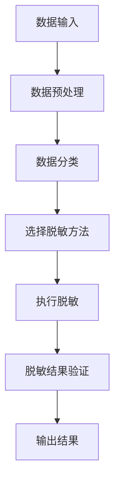

                 

### 第1章: 数据脱敏的背景与问题概述

#### 1.1 数据隐私保护的重要性

##### 1.1.1 数据隐私保护的定义
数据隐私保护是指通过各种技术和管理手段，确保在数据处理、存储、传输等过程中，个人或组织的敏感信息不被未经授权的访问、泄露、篡改或滥用。它涵盖了从数据生成到销毁的全生命周期管理。

##### 1.1.2 数据隐私保护的意义
数据隐私保护具有以下几个层面的意义：

1. **法律法规要求**：在全球范围内，数据隐私保护已经成为法律法规的核心内容，如《通用数据保护条例》（GDPR）、《加州消费者隐私法案》（CCPA）等。
2. **个人隐私权益**：保护个人隐私是每个人的基本权利，未经授权的数据访问和使用会侵犯个人隐私，可能导致严重后果。
3. **企业信誉和利益**：企业若未能妥善保护客户数据，可能导致声誉受损、经济损失甚至法律诉讼。
4. **国家战略安全**：在国家安全层面上，数据隐私保护是防范网络攻击、情报泄露的重要措施。

##### 1.1.3 数据隐私保护面临的挑战
数据隐私保护面临的挑战主要包括：

1. **数据量巨大**：随着大数据时代的到来，数据量呈爆炸式增长，数据隐私保护难度增加。
2. **技术复杂性**：新兴技术如人工智能、物联网、云计算等带来了新的数据隐私问题。
3. **数据跨境流动**：全球化背景下，数据跨境流动频繁，数据隐私保护的国际协调和法律法规统一成为难题。
4. **数据匿名化与真实性**：如何在保证数据隐私的同时，确保数据的有效性和真实性，是一个重要挑战。

#### 1.2 数据脱敏的定义与目的

##### 1.2.1 数据脱敏的定义
数据脱敏（Data De-Identification）是一种数据隐私保护技术，通过将原始数据中的敏感信息进行转换，使其不能直接识别特定个人或组织，从而降低数据泄露的风险。

##### 1.2.2 数据脱敏的目的
数据脱敏的主要目的是：

1. **保障数据隐私**：通过脱敏处理，原始数据中的敏感信息被替换或加密，降低数据泄露的风险。
2. **合规要求**：满足法律法规对数据隐私保护的要求，如GDPR等。
3. **数据可用性**：在数据脱敏的过程中，尽量保持数据的完整性和可用性，以便于后续的数据分析和应用。
4. **数据共享与流通**：通过脱敏，数据可以在不违反隐私保护要求的前提下进行共享和流通，促进数据的利用。

#### 1.3 数据脱敏的应用场景

##### 1.3.1 数据分析
在数据分析过程中，需要对敏感数据脱敏，以保护个人隐私，同时满足数据分析的需求。例如，在医疗数据分析中，患者信息需要进行脱敏处理。

##### 1.3.2 数据共享
在数据共享过程中，数据脱敏是保护隐私的关键措施。例如，企业之间进行数据交换时，会对敏感数据进行脱敏，确保数据安全。

##### 1.3.3 数据存储
在数据存储过程中，通过脱敏可以降低数据泄露的风险。例如，企业数据库中的用户数据需要进行脱敏处理，以防止数据泄露。

##### 1.3.4 数据传输
在数据传输过程中，数据脱敏有助于保护数据在传输过程中的安全。例如，在云服务中，数据在传输到云端前需要进行脱敏处理。

#### 1.4 数据脱敏的核心问题与挑战

##### 1.4.1 数据准确性与安全性的平衡
在数据脱敏过程中，既要确保数据的安全性，又要保证数据的准确性和可用性。这是一个复杂的平衡过程。

##### 1.4.2 脱敏算法的选择
根据不同的应用场景和数据类型，需要选择合适的脱敏算法。例如，对于个人身份信息，可能需要使用加密算法；对于医疗数据，可能需要使用模糊化算法。

##### 1.4.3 脱敏效果评估
如何评估脱敏后的数据是否安全，这是一个重要的挑战。需要通过模拟攻击、数据对比等方法进行评估。

##### 1.4.4 跨领域协调
数据隐私保护是一个跨领域的问题，需要政府、企业、学术界等多方协作，共同推动数据隐私保护的发展。

### 第2章: 数据脱敏的核心概念

#### 2.1 数据脱敏的常用方法

##### 2.1.1 替换法
替换法是最常见的脱敏方法之一，通过将敏感数据替换为假名或其他非敏感信息，以达到数据脱敏的目的。

##### 2.1.2 加密法
加密法通过将敏感数据加密，使其在不解密的情况下无法被读取。加密法提供了较高的安全性，但可能会影响数据的可用性。

##### 2.1.3 匹配法
匹配法通过将敏感数据与一个脱敏字典进行匹配，替换为字典中的非敏感值。这种方法适用于数据量较小且敏感性较低的场景。

#### 2.2 数据脱敏的分类

##### 2.2.1 概念性脱敏
概念性脱敏关注于保护数据中的概念和模式，而不仅仅是单个数据项。例如，将地名替换为地理位置的编码。

##### 2.2.2 字符串脱敏
字符串脱敏主要针对文本数据，通过替换、掩码或其他技术手段，使其无法直接识别特定个体。

##### 2.2.3 数字脱敏
数字脱敏主要针对数值型数据，通过四舍五入、随机替换等技术，使其失去原有的敏感信息。

#### 2.3 数据脱敏的边界与外延

##### 2.3.1 数据脱敏与数据加密的区别
数据脱敏和数据加密都是保护数据隐私的技术，但它们的应用场景和目标不同。数据脱敏旨在使数据在未授权的情况下不可读，而数据加密则旨在确保数据在传输和存储过程中不被未授权访问。

##### 2.3.2 数据脱敏与数据清洗的关系
数据脱敏是数据清洗的一部分，但两者不完全相同。数据清洗主要关注于数据的格式、准确性和一致性，而数据脱敏则专注于数据隐私保护。

### 第3章: 数据脱敏技术原理详解

#### 3.1 数据脱敏的数学模型与公式

##### 3.1.1 数据脱敏算法的数学基础
数据脱敏的核心在于将敏感数据转换为非敏感形式。这个过程可以用数学模型表示：

$$
D(x) = f(x) + \epsilon
$$

其中，$D(x)$ 表示脱敏后的数据，$f(x)$ 是脱敏函数，$\epsilon$ 是噪声项。

##### 3.1.2 数据脱敏算法的公式推导
脱敏算法的推导通常依赖于数据类型和脱敏目标。以下是一个简单的替换法脱敏算法的例子：

$$
D(x) = g(x) \mod N
$$

其中，$g(x)$ 是一个函数，用于将原始数据映射到一个较小的数值范围（$0$ 到 $N-1$），$N$ 是映射范围的大小。

#### 3.2 数据脱敏算法流程图

### 第4章: 数据脱敏在LLM应用中的挑战

#### 4.1 LLM应用的概述
自然语言处理（NLP）是人工智能（AI）的重要分支，而大型语言模型（LLM）是NLP的核心技术之一。LLM通过训练大规模的语言模型，能够生成高质量的自然语言文本，被广泛应用于文本生成、机器翻译、问答系统等领域。

#### 4.2 LLM应用中的数据安全挑战
在LLM应用中，数据安全面临以下几个挑战：

1. **数据泄露风险**：LLM训练需要大量真实数据，这些数据可能包含敏感信息，如个人隐私、企业秘密等。
2. **模型隐私泄露**：LLM模型的参数和架构可能包含训练数据的敏感信息，这些信息在未经授权的情况下可能被攻击者获取。
3. **数据隐私保护与模型性能的平衡**：在数据脱敏过程中，如何平衡数据隐私保护和模型性能是一个重要问题。

#### 4.3 数据脱敏在LLM应用中的重要性
数据脱敏在LLM应用中具有重要意义：

1. **保护用户隐私**：通过对训练数据进行脱敏处理，可以有效保护用户的个人隐私。
2. **遵守法律法规**：数据脱敏有助于遵守全球范围内的数据隐私保护法律法规，如GDPR等。
3. **确保模型安全**：通过数据脱敏，可以降低模型隐私泄露的风险，提高模型的安全性。
4. **促进数据共享**：数据脱敏使得数据可以在不违反隐私保护要求的前提下进行共享和流通，促进数据的应用和创新。

### 第5章: 数据脱敏策略在LLM中的应用

#### 5.1 替换法在LLM中的应用

##### 5.1.1 替换法的基本原理
替换法是一种通过将敏感数据替换为非敏感值来实现数据脱敏的方法。在LLM应用中，替换法可以通过以下几种方式实现：

1. **字符替换**：将敏感字符替换为随机字符或特定字符。
2. **单词替换**：将敏感单词替换为同义词或随机单词。
3. **句子替换**：将敏感句子替换为无意义的句子。

##### 5.1.2 替换法在LLM中的实现方法
在LLM应用中，替换法的实现方法通常包括以下步骤：

1. **敏感词识别**：使用自然语言处理技术，识别文本中的敏感词。
2. **替换规则定义**：根据应用场景，定义敏感词的替换规则。
3. **文本替换**：根据替换规则，将敏感词替换为非敏感值。
4. **文本生成**：使用LLM生成替换后的文本。

#### 5.2 加密法在LLM中的应用

##### 5.2.1 加密法的基本原理
加密法通过将敏感数据加密，使其在不解密的情况下无法被读取。在LLM应用中，加密法可以通过以下几种方式实现：

1. **端到端加密**：在整个数据处理过程中，数据始终以加密形式存在，只有在特定环节才进行解密。
2. **部分加密**：只对敏感部分进行加密，其余部分保持明文形式。
3. **同态加密**：在加密状态下对数据执行计算，计算结果同样保持加密形式。

##### 5.2.2 加密法在LLM中的实现方法
在LLM应用中，加密法的实现方法通常包括以下步骤：

1. **敏感数据识别**：使用自然语言处理技术，识别文本中的敏感信息。
2. **加密算法选择**：根据应用场景和数据类型，选择合适的加密算法。
3. **数据加密**：对识别出的敏感信息进行加密处理。
4. **文本生成**：使用LLM生成加密后的文本。

#### 5.3 匹配法在LLM中的应用

##### 5.3.1 匹配法的基本原理
匹配法通过将敏感数据与一个预先定义的脱敏字典进行匹配，替换为字典中的非敏感值。在LLM应用中，匹配法的基本原理如下：

1. **脱敏字典构建**：根据应用场景，构建一个包含敏感值及其对应脱敏值的字典。
2. **敏感值匹配**：将文本中的敏感值与脱敏字典进行匹配，替换为对应的脱敏值。

##### 5.3.2 匹配法在LLM中的实现方法
在LLM应用中，匹配法的实现方法通常包括以下步骤：

1. **敏感值识别**：使用自然语言处理技术，识别文本中的敏感值。
2. **脱敏字典查找**：将识别出的敏感值与脱敏字典进行匹配。
3. **文本替换**：将匹配到的敏感值替换为对应的脱敏值。
4. **文本生成**：使用LLM生成替换后的文本。

### 第6章: 实际案例剖析

#### 6.1 案例背景
某互联网公司开发了一款基于大型语言模型（LLM）的智能客服系统，旨在为客户提供24/7的在线支持。然而，该系统需要处理大量的用户对话数据，这些数据中包含敏感信息，如用户姓名、联系方式等。

#### 6.2 数据脱敏策略的具体应用
为了确保用户数据的隐私和安全，该公司采用了以下数据脱敏策略：

1. **敏感词识别**：使用自然语言处理技术，识别对话文本中的敏感词，如姓名、电话号码等。
2. **替换法**：对识别出的敏感词进行字符替换，将其替换为随机字符或特定字符。例如，将电话号码“1234567890”替换为“******7890”。
3. **加密法**：对于部分敏感信息，如用户邮箱地址，采用加密法进行保护。加密后的邮箱地址在未经授权的情况下无法被读取。
4. **匹配法**：对于一些常见的敏感信息，如国家名称、城市名称等，采用匹配法进行脱敏。这些信息与预定义的脱敏字典进行匹配，替换为对应的脱敏值。

#### 6.3 案例分析与效果评估
通过上述数据脱敏策略，该公司有效地保护了用户数据的隐私和安全。具体效果如下：

1. **数据安全**：通过替换法、加密法和匹配法的组合应用，用户数据的敏感信息被有效保护，降低了数据泄露的风险。
2. **数据可用性**：尽管进行了脱敏处理，但用户数据的整体结构并未受到影响，仍然可以用于后续的数据分析和应用。
3. **系统性能**：数据脱敏策略对系统的性能影响较小，智能客服系统的响应速度和准确率未受显著影响。

### 第7章: 总结与展望

#### 7.1 数据脱敏策略在LLM应用中的价值
数据脱敏策略在LLM应用中具有重要价值：

1. **隐私保护**：通过数据脱敏，可以有效保护用户数据隐私，降低数据泄露风险。
2. **合规要求**：满足全球范围内的数据隐私保护法律法规，如GDPR等。
3. **数据安全**：通过数据脱敏，可以提高系统的安全性，降低模型隐私泄露的风险。
4. **数据共享**：数据脱敏使得数据可以在不违反隐私保护要求的前提下进行共享和流通，促进数据的应用和创新。

#### 7.2 存在的挑战与未来方向
尽管数据脱敏策略在LLM应用中具有重要作用，但仍面临以下挑战：

1. **算法选择**：根据不同的应用场景和数据类型，选择合适的脱敏算法是一个挑战。
2. **脱敏效果评估**：如何评估脱敏后的数据是否安全，是一个重要的挑战。
3. **跨领域协调**：数据隐私保护是一个跨领域的问题，需要政府、企业、学术界等多方协作。

未来方向包括：

1. **算法优化**：研究更高效、更安全的脱敏算法。
2. **自动化工具**：开发自动化数据脱敏工具，提高数据处理效率。
3. **法律法规完善**：进一步完善全球范围内的数据隐私保护法律法规。

#### 7.3 最佳实践 tips
为了实现有效的数据脱敏，建议遵循以下最佳实践：

1. **数据分类**：对数据进行分类，根据敏感程度选择合适的脱敏方法。
2. **脱敏规则**：制定明确的脱敏规则，确保数据脱敏的一致性和有效性。
3. **定期评估**：定期评估脱敏策略的有效性，及时调整和优化。
4. **培训与宣传**：加强对数据隐私保护重要性的培训，提高全员的数据保护意识。

### 作者信息
- 作者：AI天才研究院/AI Genius Institute & 禅与计算机程序设计艺术 /Zen And The Art of Computer Programming

### 拓展阅读
- **《数据隐私保护：法律与技术》**：详细介绍数据隐私保护法律法规和技术手段。
- **《大规模语言模型：理论与实践》**：探讨LLM的原理和应用。
- **《数据脱敏技术手册》**：提供详细的数据脱敏技术指南。

