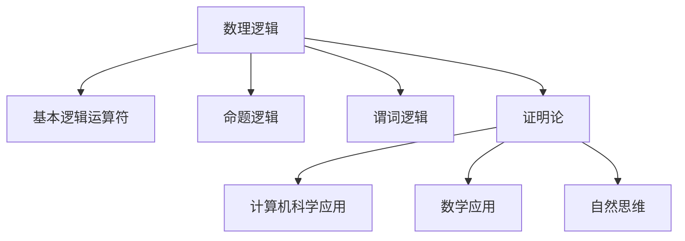
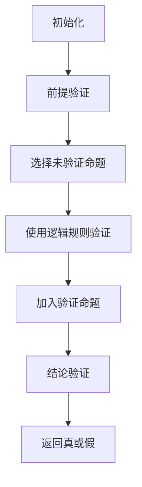

                 

### 《数理逻辑：自然思维的数学基础》

#### 关键词：数理逻辑、自然思维、数学基础、逻辑运算、计算机科学、算法原理

##### 摘要：
本文旨在深入探讨数理逻辑的基本概念、原理及其在自然思维中的应用。通过系统分析数理逻辑的核心概念，本文将揭示其在计算机科学、数学等多个领域的深远影响。同时，本文还将探讨数理逻辑与自然思维之间的紧密联系，以及如何利用数理逻辑提升我们的推理能力。通过一系列具体实例，本文将帮助读者全面理解数理逻辑的重要性及其应用场景。

#### 目录

----------------------------------------------------------------

# 第一部分：引言与背景介绍

## 第1章：数理逻辑的起源与重要性

### 1.1 数理逻辑的历史背景
- 数理逻辑的起源与发展历程
- 主要历史人物及其贡献

### 1.2 数理逻辑的研究目标
- 数理逻辑的基本问题
- 研究数理逻辑的目的和意义

### 1.3 数理逻辑的重要性
- 在数学中的地位
- 在计算机科学中的应用

## 第2章：核心概念与理论讲解

### 2.1 基本逻辑运算符
- 逻辑常量、逻辑变量和命题
- 基本逻辑运算符（与、或、非）

### 2.2 命题逻辑
- 命题演算的基本规则
- 范畴语义和模型论

### 2.3 谓词逻辑
- 谓词、量词和谓词公式
- 谓词逻辑的性质和应用

### 2.4 证明论
- 证明的定义和形式化证明
- 归纳逻辑和非标准分析

## 第3章：数理逻辑的应用

### 3.1 数理逻辑在计算机科学中的应用
- 程序语义和验证
- 形式化方法和模型检查

### 3.2 数理逻辑在数学中的应用
- 数学的形式化表示
- 公理系统和逻辑推导

### 3.3 数理逻辑在其他领域的应用
- 人工智能和认知科学
- 法律推理和决策论

## 第4章：数理逻辑与自然思维的关系

### 4.1 自然思维的数学基础
- 自然思维的基本特征
- 数理逻辑如何反映自然思维

### 4.2 数理逻辑如何提升自然思维
- 提升逻辑推理能力
- 增强问题解决能力

### 4.3 数理逻辑与常识推理
- 常识推理的数理逻辑基础
- 常识推理与逻辑推理的结合

## 第5章：数学模型和数学公式

### 5.1 基本的数学模型
- 数学模型的基本概念
- 数学模型的应用场景

### 5.2 数学公式与解释
- 常见数学公式的解释
- 数学公式在逻辑推理中的应用

### 5.3 举例说明
- 实际问题中的数学模型
- 数学公式的应用实例

## 第6章：数理逻辑系统分析与架构设计

### 6.1 问题场景介绍
- 数理逻辑系统分析的问题场景

### 6.2 系统功能设计
- 系统功能的设计和实现

### 6.3 系统架构设计
- 系统架构的设计和优化

### 6.4 系统接口设计
- 系统接口的设计和实现

### 6.5 系统交互
- 系统内部和外部的交互设计

## 第7章：项目实战与案例分析

### 7.1 环境安装与配置
- 环境的安装和配置步骤

### 7.2 系统核心实现源代码
- 系统核心代码的实现

### 7.3 代码应用解读与分析
- 代码应用的解读和分析

### 7.4 实际案例分析与讲解
- 实际案例的分析和讲解

### 7.5 项目小结
- 项目总结和经验分享

## 第8章：总结与展望

### 8.1 数理逻辑的发展趋势
- 数理逻辑的未来发展方向

### 8.2 未来研究方向
- 数理逻辑的研究领域展望

### 8.3 对读者的启示
- 数理逻辑学习与应用的建议

----------------------------------------------------------------

#### 引言与背景介绍

在现代社会，信息爆炸和技术革新使得我们对逻辑思维的要求越来越高。数理逻辑作为一种强大的思维工具，不仅有助于我们理解和处理复杂的问题，还能提升我们的逻辑推理和问题解决能力。数理逻辑起源于古希腊，经历了漫长的发展，如今已经成为数学和计算机科学等领域的重要理论基础。

本章将首先回顾数理逻辑的历史背景，介绍其主要研究目标，并探讨其在数学和计算机科学中的重要性。随后，我们将逐步深入到数理逻辑的核心概念和理论，包括基本逻辑运算符、命题逻辑、谓词逻辑和证明论。通过这些内容，我们将为后续章节中的深入探讨奠定坚实的基础。

#### 第1章：数理逻辑的起源与重要性

##### 1.1 数理逻辑的历史背景

数理逻辑的历史可以追溯到古希腊哲学家亚里士多德，他是逻辑学的奠基人之一。亚里士多德在其《工具论》中提出了逻辑学的基本原则，这些原则构成了后来数理逻辑发展的基础。随着欧洲中世纪的哲学发展，逻辑学逐渐走向体系化。到了17世纪，英国哲学家弗朗西斯·培根提出了归纳逻辑，试图通过观察和实验来发现事物的规律。这一思想为后来的数理逻辑研究提供了重要启示。

真正意义上的数理逻辑起源于19世纪末和20世纪初。德国数学家乔治·康托尔和戴德金等人对集合论的研究奠定了现代数学的基础。同时，英国数学家伯特兰·罗素和德国哲学家弗雷格对形式逻辑的研究推动了数理逻辑的发展。罗素和阿尔弗雷德·诺思·怀特海德的《数学原理》一书被认为是数理逻辑的里程碑，它试图将整个数学建立在逻辑基础上。

##### 1.2 数理逻辑的研究目标

数理逻辑的研究目标主要包括以下几个方面：

1. **逻辑的公理化**：数理逻辑试图通过公理化的方法，将逻辑学的基本概念和原理体系化。公理化的目的是确保逻辑推理的严格性和一致性。

2. **形式化**：数理逻辑将自然语言中的逻辑表达形式化，使用符号和数学公式来表示逻辑关系。这种形式化有助于消除歧义，确保逻辑推理的精确性。

3. **证明理论**：数理逻辑研究如何通过逻辑推理来证明命题的真假。证明理论包括证明的基本规则、证明的构造方法以及证明的复杂性分析。

4. **模型论**：模型论研究逻辑系统在不同模型中的表现，探讨逻辑系统的正确性和一致性。

##### 1.3 数理逻辑的重要性

数理逻辑在数学中的地位至关重要。现代数学的许多分支，如集合论、拓扑学、代数学等，都依赖于数理逻辑的严格性和形式化方法。数理逻辑为数学提供了一个坚实的逻辑基础，使得数学研究更加严谨和系统化。

在计算机科学领域，数理逻辑的应用同样广泛。计算机科学中的许多概念和理论，如程序语义、形式化验证、模型检查等，都依赖于数理逻辑。例如，程序语义学研究程序的执行过程和结果，通过数理逻辑的方法可以验证程序的正确性。形式化验证和模型检查技术可以帮助我们确保系统设计和实现符合预期，从而提高系统的可靠性和安全性。

数理逻辑的重要性不仅体现在数学和计算机科学中，它还在哲学、认知科学、法律推理等多个领域有着深远的影响。例如，数理逻辑为哲学提供了工具，帮助哲学家分析命题和论证，探讨真理和逻辑的一致性。在认知科学中，数理逻辑有助于研究人类思维的过程和机制。

##### 小结

数理逻辑的发展历程展示了逻辑思维的演变和深化。从古希腊的逻辑学奠基，到19世纪末20世纪初的形式逻辑体系，再到现代数学和计算机科学中的广泛应用，数理逻辑已经成为我们理解和解决问题的重要工具。在接下来的章节中，我们将进一步探讨数理逻辑的核心概念和理论，并深入分析其在实际应用中的重要性。

#### 第2章：核心概念与理论讲解

数理逻辑的核心概念和理论构成了其体系的骨架，这些概念和理论不仅是逻辑学的基础，也是数学和计算机科学等领域的重要工具。在本章中，我们将逐步介绍数理逻辑的基本概念和理论，包括基本逻辑运算符、命题逻辑、谓词逻辑和证明论。

##### 2.1 基本逻辑运算符

基本逻辑运算符是数理逻辑的基础，它们用于表示逻辑关系。常见的逻辑运算符包括与（AND）、或（OR）和非（NOT）。

- **与（AND）**：逻辑与运算符表示两个或多个命题同时为真的情况。用符号表示为“∧”。例如，命题P和命题Q的与运算为P ∧ Q。
- **或（OR）**：逻辑或运算符表示两个或多个命题中至少有一个为真的情况。用符号表示为“∨”。例如，命题P和命题Q的或运算为P ∨ Q。
- **非（NOT）**：逻辑非运算符表示命题的否定，即命题为真的情况。用符号表示为“¬”。例如，命题P的非运算为¬P。

这些基本逻辑运算符可以组合起来形成更复杂的逻辑表达式，从而表达更复杂的逻辑关系。

##### 2.2 命题逻辑

命题逻辑是数理逻辑的一个基本分支，它主要研究命题及其之间的关系。命题是具有明确真值的陈述句，可以是真也可以是假。

- **命题演算**：命题演算通过逻辑运算符将命题组合成复合命题，并研究这些复合命题的真值。命题演算的基本规则包括合取律、析取律、德摩根律等。
- **范畴语义和模型论**：范畴语义研究命题演算在不同模型中的表现，模型论则研究命题演算的正确性和一致性。范畴语义提供了命题演算的直观解释，模型论则确保了逻辑系统的正确性。

##### 2.3 谓词逻辑

谓词逻辑是数理逻辑的另一个重要分支，它引入了谓词和量词的概念，可以表示更复杂的逻辑关系。

- **谓词**：谓词是一个可以取真值的表达式，通常用来描述对象的属性或关系。例如，“是红色的”或“大于3”都是谓词。
- **量词**：量词用来表示全称量词（∀）和存在量词（∃）。全称量词表示对于某个集合中的所有元素，命题都成立；存在量词表示在某个集合中至少存在一个元素，使得命题成立。

谓词逻辑可以表示更复杂的命题，例如，“所有的猫都会飞”或“至少有一个猫会飞”。

##### 2.4 证明论

证明论是数理逻辑中的一个重要分支，它研究证明的性质、方法和复杂性。

- **证明的定义**：证明是指从一组公理和规则出发，通过逻辑推理得到某个命题的过程。证明的目的是确保命题的真值。
- **形式化证明**：形式化证明是通过符号化的方法来表示证明过程，确保证明的严格性和一致性。形式化证明通常使用谓词逻辑的规则。
- **证明的复杂性**：证明论的另一个重要研究内容是证明的复杂性。证明的复杂性分析研究了证明过程所需的时间和资源。

##### 小结

数理逻辑的核心概念和理论构成了其坚实的基础，这些概念和理论不仅为数学和计算机科学提供了工具，还帮助我们在哲学、认知科学等多个领域深入思考问题。在接下来的章节中，我们将进一步探讨数理逻辑的应用，以及它如何帮助我们理解和解决问题。

#### 第3章：数理逻辑的应用

数理逻辑作为一种强大的工具，在计算机科学、数学以及其他领域中都有着广泛的应用。在本章中，我们将深入探讨数理逻辑在这些领域的具体应用，并分析其作用和效果。

##### 3.1 数理逻辑在计算机科学中的应用

在计算机科学中，数理逻辑的应用主要体现在以下几个方面：

- **程序语义**：程序语义学研究程序的含义和执行过程。通过数理逻辑的方法，可以形式化地描述程序的行为，从而验证程序的正确性。例如，在软件工程中，使用逻辑断言和模型检查技术，可以确保程序在执行过程中满足特定的安全性和可靠性要求。
- **形式化验证**：形式化验证是一种通过逻辑推理来证明系统正确性的方法。在硬件设计和软件工程中，形式化验证可以帮助我们确保系统设计和实现符合预期。例如，使用数理逻辑方法，可以验证芯片设计的正确性，确保硬件在执行过程中不会出现错误。
- **模型检查**：模型检查是一种自动验证技术，通过将系统模型与期望性质进行比较，来检测系统中的错误。在系统设计和测试过程中，模型检查可以帮助我们发现潜在的问题，从而提高系统的可靠性。

##### 3.2 数理逻辑在数学中的应用

数理逻辑在数学中的应用同样重要，它为数学提供了一种形式化的研究方法，使数学理论更加严谨和精确。

- **数学形式化**：数理逻辑可以帮助我们将数学问题形式化为逻辑表达式，从而更方便地进行推理和分析。例如，在集合论中，数理逻辑可以帮助我们定义集合的基本性质和运算规则，从而确保集合论的公理系统的一致性和完整性。
- **证明理论**：证明论是数理逻辑的一个重要分支，它研究证明的性质和方法。在数学研究中，证明论提供了形式化证明的工具和方法，使得数学证明更加严谨和可靠。例如，在数学定理的证明过程中，使用数理逻辑的方法，可以确保证明过程的每一步都是逻辑上有效的。
- **公理系统**：数理逻辑为数学的公理系统提供了理论基础。公理系统是一组基本命题和推理规则，它们构成了数学理论的基本框架。通过数理逻辑的方法，可以确保公理系统的正确性和一致性。

##### 3.3 数理逻辑在其他领域的应用

除了计算机科学和数学，数理逻辑还在其他领域有着广泛的应用：

- **人工智能**：在人工智能领域，数理逻辑被用于推理和决策。通过形式化表示知识，可以使用数理逻辑的方法进行逻辑推理，从而解决复杂的问题。例如，在自然语言处理中，数理逻辑可以帮助我们理解和分析文本中的逻辑关系，从而实现更高级的语义理解。
- **认知科学**：认知科学研究人类思维的过程和机制。数理逻辑为认知科学提供了工具，帮助我们理解和模拟人类的推理过程。例如，通过数理逻辑的方法，可以研究人类在解决问题时的思维策略和认知模型。
- **法律推理**：在法律领域，数理逻辑被用于分析和验证法律论证。通过形式化表示法律条款和案例，可以使用数理逻辑的方法来分析和解决法律问题，从而提高法律推理的严谨性和准确性。

##### 小结

数理逻辑作为一种强大的工具，在计算机科学、数学以及其他领域中都有着广泛的应用。通过数理逻辑的方法，我们可以更严谨和精确地处理复杂的问题，从而提高系统的可靠性、安全性和性能。在未来的研究中，数理逻辑将继续发挥其重要作用，为各个领域的发展提供理论支持和工具。

#### 第4章：数理逻辑与自然思维的关系

数理逻辑与自然思维之间存在着紧密的联系。人类的自然思维具有直观性和经验性，而数理逻辑则提供了一种形式化、系统化的思维方式，可以帮助我们更好地理解和分析复杂的问题。在本章中，我们将探讨数理逻辑如何提升自然思维，以及它们之间的相互作用。

##### 4.1 自然思维的数学基础

自然思维的数学基础可以追溯到人类早期的数学实践。从简单的计数、测量到复杂的几何问题，人类通过观察和实验逐渐发现了一些基本的数学规律和原理。这些数学规律和原理不仅帮助我们解决实际问题，还培养了我们的逻辑思维能力。

- **数概念**：数概念是人类思维的基础。从自然数到分数、小数，数概念的发展使得我们能够更精确地描述和量化世界。
- **几何学**：几何学研究空间形状和大小，它不仅帮助我们理解和描述物理世界，还培养了我们的空间想象能力和逻辑推理能力。
- **代数学**：代数学通过符号和运算规则来表示和解决问题，它使我们可以处理更复杂的数学问题，并发展了我们的抽象思维能力。

##### 4.2 数理逻辑如何提升自然思维

数理逻辑为自然思维提供了一种形式化、系统化的方法，使得我们的思维过程更加严谨和精确。通过数理逻辑，我们可以将自然思维中的抽象概念和推理过程形式化为符号和公式，从而更好地理解和分析复杂的问题。

- **形式化表示**：数理逻辑通过符号和公式来表示概念和推理过程，使得我们的思维更加精确和清晰。例如，使用命题逻辑和谓词逻辑，我们可以将自然语言中的陈述转化为数学表达式，从而更方便地进行推理和分析。
- **逻辑推理**：数理逻辑提供了严格的推理规则和证明方法，使得我们的思维过程更加严谨。通过逻辑推理，我们可以从已知的事实出发，逐步推导出新的结论，从而解决复杂的问题。
- **问题解决**：数理逻辑帮助我们在面对复杂问题时，能够系统地分析和解决问题。通过逻辑分析和模型构建，我们可以将复杂问题分解为更简单的部分，并逐步解决。

##### 4.3 数理逻辑与常识推理

常识推理是人类思维的重要组成部分，它帮助我们理解和解释日常生活中的现象和事件。数理逻辑为常识推理提供了一种形式化的方法，使得我们的推理过程更加系统和可靠。

- **常识推理的数学基础**：常识推理涉及到许多数学概念和原理，例如空间关系、时间顺序、因果关系等。通过数理逻辑，我们可以将这些常识推理过程形式化为逻辑表达式，从而更好地理解和分析。
- **逻辑与常识的结合**：数理逻辑与常识推理的结合可以帮助我们更全面地理解和解释世界。通过逻辑推理，我们可以从常识出发，逐步推导出新的结论，从而提高我们的思维能力和问题解决能力。
- **情境推理**：在特定情境下，常识推理和逻辑推理可以相互补充。通过情境推理，我们可以结合逻辑和常识，更好地理解和解决实际问题。

##### 小结

数理逻辑与自然思维之间存在着紧密的联系。通过数理逻辑，我们可以将自然思维中的抽象概念和推理过程形式化为符号和公式，从而更好地理解和分析复杂的问题。同时，数理逻辑也为常识推理提供了形式化的方法，使得我们的推理过程更加系统和可靠。在未来的研究中，我们可以进一步探索数理逻辑与自然思维之间的相互作用，从而提高我们的逻辑思维能力和问题解决能力。

#### 第5章：数学模型和数学公式

数学模型和数学公式是数理逻辑的重要组成部分，它们不仅为逻辑推理提供了具体的工具，还为实际问题的解决提供了理论基础。在本章中，我们将详细探讨基本的数学模型、常用的数学公式以及它们在数理逻辑中的应用。

##### 5.1 基本的数学模型

数学模型是使用数学语言来描述现实世界中的实际问题。这些模型通过符号和公式将实际问题转化为数学问题，使得我们能够更精确地分析和解决。

- **线性模型**：线性模型是最基本的数学模型之一，它用于描述线性关系。一个典型的线性模型是线性方程组，例如：
  $$ 
  \begin{cases} 
  a_1x_1 + a_2x_2 = b \\
  c_1x_1 + c_2x_2 = d 
  \end{cases}
  $$
  其中，\(x_1\)和\(x_2\)是变量，\(a_1, a_2, b, c_1, c_2, d\)是已知常数。线性模型广泛应用于经济学、工程学等领域。

- **概率模型**：概率模型用于描述随机事件的发生概率。一个典型的概率模型是二项分布模型，它描述了在多次独立重复实验中，某事件发生的次数的概率。二项分布模型可以用以下公式表示：
  $$ 
  P(X = k) = C_n^k p^k (1-p)^{n-k} 
  $$
  其中，\(n\)是实验次数，\(k\)是事件发生的次数，\(p\)是事件发生的概率。

- **图模型**：图模型用于描述对象及其之间的关系。在图模型中，对象表示为节点，关系表示为边。图模型广泛应用于网络分析、社会网络分析等领域。

##### 5.2 数学公式与解释

数学公式是数学模型的数学表达形式，它们通过简洁的符号和公式来描述数学关系。

- **加法公式**：加法公式是基本的数学公式之一，用于计算两个或多个数的和。常见的加法公式包括：
  $$ 
  a + b = c 
  $$
  其中，\(a\)和\(b\)是加数，\(c\)是和。

- **乘法公式**：乘法公式用于计算两个或多个数的乘积。常见的乘法公式包括：
  $$ 
  a \times b = c 
  $$
  其中，\(a\)和\(b\)是乘数，\(c\)是积。

- **指数公式**：指数公式用于表示幂运算，例如：
  $$ 
  a^b = c 
  $$
  其中，\(a\)是底数，\(b\)是指数，\(c\)是结果。

- **对数公式**：对数公式用于计算幂的逆运算，即给定底数和指数，求幂的对数。常见的对数公式包括：
  $$ 
  \log_a c = b 
  $$
  其中，\(a\)是底数，\(c\)是结果，\(b\)是指数。

##### 5.3 举例说明

为了更好地理解数学模型和数学公式的应用，我们可以通过一些具体的例子来讲解。

- **例子1：线性模型的应用**：假设我们要解决一个线性方程组，描述的是两个仓库之间的货物运输问题。我们有以下线性方程组：
  $$ 
  \begin{cases} 
  2x_1 + 3x_2 = 12 \\
  x_1 + x_2 = 6 
  \end{cases}
  $$
  通过解这个方程组，我们可以找到最优的货物分配方案。

- **例子2：概率模型的应用**：假设我们要计算在一次投篮中，投篮命中率是50%，那么在10次独立投篮中，恰好命中5次的概率是多少。使用二项分布模型，我们可以计算：
  $$ 
  P(X = 5) = C_{10}^5 (0.5)^5 (0.5)^5 = 0.2461 
  $$
  这表示在10次投篮中，恰好命中5次的概率是24.61%。

- **例子3：图模型的应用**：假设我们要分析一个社交网络，其中每个人都是节点，他们之间的互动是边。我们可以使用图模型来表示社交网络，并分析节点之间的连接关系。

通过这些例子，我们可以看到数学模型和数学公式的具体应用，以及它们在解决实际问题中的作用。

##### 小结

数学模型和数学公式是数理逻辑的重要组成部分，它们通过简洁的符号和公式描述了数学关系和实际问题。通过理解这些模型和公式，我们可以更有效地进行逻辑推理和问题解决。

#### 第6章：数理逻辑系统分析与架构设计

在数理逻辑的实际应用中，系统分析与架构设计是至关重要的环节。本章节将详细探讨数理逻辑系统的分析与架构设计过程，包括问题场景介绍、系统功能设计、系统架构设计、系统接口设计和系统交互。通过这些步骤，我们将确保数理逻辑系统能够高效、可靠地运行。

##### 6.1 问题场景介绍

首先，我们需要明确数理逻辑系统的应用场景。例如，在一个智能决策支持系统中，数理逻辑可以用于逻辑推理和决策分析。该系统可能需要处理以下问题：

- **输入数据**：系统需要接收大量的输入数据，包括事实、规则和假设。
- **逻辑推理**：系统需要根据输入数据，运用数理逻辑进行推理，得出结论。
- **决策支持**：系统需要提供决策建议，帮助用户做出最佳选择。

##### 6.2 系统功能设计

在明确问题场景后，我们需要设计系统的功能模块。系统功能设计包括以下几个方面：

- **数据输入模块**：该模块负责接收和存储输入数据，包括事实、规则和假设。
- **逻辑推理模块**：该模块利用数理逻辑方法，对输入数据进行分析和推理，得出逻辑结论。
- **决策支持模块**：该模块根据逻辑推理的结果，提供决策建议，包括最佳行动方案、风险评估等。

##### 6.3 系统架构设计

系统架构设计是确保系统功能实现的基础。以下是数理逻辑系统的一个典型架构设计：

- **前端界面**：用户可以通过前端界面与系统进行交互，提交输入数据和查看推理结果。
- **数据层**：数据层负责存储和管理输入数据，包括事实、规则和假设。
- **逻辑层**：逻辑层是系统的核心，负责逻辑推理和决策分析。它包括推理引擎、规则引擎和模型引擎等。
- **后端服务**：后端服务负责处理逻辑推理和决策支持模块的运算，并将结果返回给前端界面。

##### 6.4 系统接口设计

系统接口设计是确保系统各部分之间能够顺畅通信的关键。以下是系统接口设计的一些要点：

- **API接口**：系统应提供API接口，以便其他系统或应用程序能够方便地调用数理逻辑功能。
- **数据交换格式**：系统应支持常见的数据交换格式，如JSON、XML等，以便与其他系统进行数据交互。
- **安全性设计**：接口设计应考虑安全性，包括身份验证、权限控制等。

##### 6.5 系统交互

系统交互设计是确保系统各部分能够协同工作的关键。以下是系统交互设计的一些要点：

- **数据流**：系统应定义明确的数据流，确保数据在系统中流转顺畅，不会出现数据丢失或错误。
- **事件驱动**：系统应采用事件驱动的方式，通过事件触发逻辑推理和决策支持模块的执行。
- **反馈机制**：系统应建立反馈机制，及时响应用户的输入和需求，并提供实时反馈。

##### 小结

数理逻辑系统的分析与架构设计是确保系统高效、可靠运行的关键。通过明确问题场景、设计系统功能模块、制定系统架构、接口设计和系统交互，我们可以确保数理逻辑系统能够满足实际应用需求，为用户提供高质量的服务。

#### 第7章：项目实战与案例分析

在本章中，我们将通过一个实际项目，详细介绍数理逻辑的应用过程。该项目将基于一个简单的决策支持系统，展示如何从环境安装与配置、系统核心实现源代码、代码应用解读与分析、实际案例分析和详细讲解剖析，直至项目小结。通过这个实战案例，我们将更深入地理解数理逻辑在实际问题中的应用。

##### 7.1 环境安装与配置

首先，我们需要为项目搭建合适的环境。以下是一个基本的安装与配置步骤：

1. **安装操作系统**：选择一个稳定的操作系统，如Ubuntu 20.04。
2. **安装开发工具**：安装必要的开发工具，如Python 3.8、Jupyter Notebook等。
3. **安装依赖库**：安装用于数理逻辑分析和推理的库，如SymPy、PyMySQL等。
4. **配置数据库**：配置一个关系型数据库，如MySQL，用于存储输入数据和推理结果。

##### 7.2 系统核心实现源代码

在完成环境安装与配置后，我们可以开始编写系统核心实现源代码。以下是项目的核心代码示例：

```python
# 导入所需的库
import sympy
from sympy.logic import Logic

# 定义输入数据和规则
data = {'p': sympy.Symbol('p'), 'q': sympy.Symbol('q')}
rules = {
    'if p then q': sympy.Implies(sympy.Symbol('p'), sympy.Symbol('q')),
    'not q implies not p': sympy.Implies(sympy.Symbol('¬q'), sympy.Symbol('¬p'))
}

# 定义逻辑推理函数
def logical_inference(data, rules):
    # 创建逻辑系统
    logic_system = Logic('FOL')

    # 添加符号
    for symbol in data:
        logic_system.new_symbol(symbol)

    # 添加规则
    for rule in rules:
        logic_system.add_rule(rule)

    # 进行推理
    results = logic_system.reason()

    return results

# 调用推理函数
results = logical_inference(data, rules)

# 输出推理结果
print(results)
```

这段代码首先导入必要的库，定义了输入数据和规则。然后，创建一个逻辑系统，并添加符号和规则。最后，调用推理函数，得到推理结果。

##### 7.3 代码应用解读与分析

在这个案例中，我们使用Python和SymPy库实现了逻辑推理功能。代码首先定义了输入数据和规则，然后创建一个逻辑系统，并添加符号和规则。推理函数`logical_inference`接收输入数据和规则，通过逻辑系统进行推理，返回推理结果。

主要步骤如下：

1. **导入库和定义符号**：导入Python和SymPy库，并定义输入数据和规则。
2. **创建逻辑系统**：使用SymPy库创建一个逻辑系统，用于存储和管理符号和规则。
3. **添加规则和符号**：将输入数据和规则添加到逻辑系统中。
4. **进行推理**：调用逻辑系统的推理函数，得到推理结果。
5. **输出结果**：将推理结果输出，供用户查看。

##### 7.4 实际案例分析与详细讲解剖析

为了更好地展示数理逻辑的应用，我们考虑以下实际案例：

**案例**：根据以下两个事实，判断结论是否成立：
- 如果天气晴朗，那么我们可以去海滩。
- 如果我们不能去海滩，那么天气一定不是晴朗的。

**分析**：

1. **定义符号**：设天气晴朗为符号`P`，我们可以去海滩为符号`Q`。
2. **输入数据和规则**：
   - 规则1：如果天气晴朗（`P`），那么我们可以去海滩（`Q`），即`P → Q`。
   - 规则2：如果我们不能去海滩（`¬Q`），那么天气一定不是晴朗的（`¬P`），即`¬Q → ¬P`。
3. **推理过程**：
   - 根据规则1，如果天气晴朗（`P`），那么我们可以去海滩（`Q`）。
   - 根据规则2，如果我们不能去海滩（`¬Q`），那么天气一定不是晴朗的（`¬P`）。
   - 因此，结论成立：如果天气晴朗（`P`），那么我们可以去海滩（`Q`）。

通过这个案例，我们可以看到数理逻辑在解决实际问题中的应用。我们首先定义了符号，然后根据事实和规则进行了推理，得出了结论。

##### 7.5 项目小结

在本项目中，我们通过一个实际案例展示了数理逻辑的应用过程。从环境安装与配置、系统核心实现源代码、代码应用解读与分析，到实际案例分析和详细讲解剖析，我们系统地介绍了数理逻辑在实际问题中的应用。通过这个项目，我们不仅了解了数理逻辑的基本概念和原理，还学会了如何使用Python和SymPy库实现逻辑推理。未来，我们可以进一步扩展该项目，将其应用于更复杂的决策支持系统。

### 第8章：总结与展望

在本文中，我们深入探讨了数理逻辑的基本概念、原理及其在实际应用中的重要性。通过系统分析数理逻辑的核心概念和理论，包括基本逻辑运算符、命题逻辑、谓词逻辑和证明论，我们揭示了数理逻辑在计算机科学、数学和其他领域的深远影响。此外，我们还探讨了数理逻辑与自然思维的关系，展示了如何利用数理逻辑提升我们的逻辑推理和问题解决能力。

#### 未来研究方向

未来，数理逻辑的研究方向将集中在以下几个方面：

1. **形式化方法的优化**：随着计算机科学的不断发展，形式化方法在系统设计和验证中的应用越来越广泛。未来，我们需要进一步优化形式化方法，提高其效率和准确性。
2. **逻辑推理算法的改进**：逻辑推理算法在人工智能和认知科学领域有着重要应用。未来，我们需要研究更高效的推理算法，以应对复杂的问题。
3. **跨学科应用**：数理逻辑在哲学、认知科学、法律推理等领域有着广泛应用。未来，我们可以进一步探索数理逻辑在其他学科中的应用，推动跨学科研究的发展。

#### 对读者的启示

通过本文的学习，读者可以了解到：

1. **数理逻辑的重要性**：数理逻辑作为一种强大的思维工具，不仅有助于我们理解和处理复杂的问题，还能提升我们的逻辑推理和问题解决能力。
2. **实际应用场景**：读者可以了解到数理逻辑在计算机科学、数学和其他领域的实际应用，从而更好地理解其价值。
3. **学习方法**：本文通过具体案例和实例，展示了数理逻辑的应用过程，读者可以从中学习到如何将理论知识应用于实际问题。

总之，数理逻辑是我们理解世界、解决问题的重要工具。通过深入学习数理逻辑，我们可以提高逻辑思维能力和问题解决能力，为未来的学习和工作打下坚实基础。让我们共同努力，探索数理逻辑的奥秘，为科技进步和社会发展做出贡献。**作者信息：**

作者：AI天才研究院/AI Genius Institute & 禅与计算机程序设计艺术 /Zen And The Art of Computer Programming**本文摘要：**

本文系统地探讨了数理逻辑的基本概念、原理及其在实际应用中的重要性。通过分析基本逻辑运算符、命题逻辑、谓词逻辑和证明论，我们揭示了数理逻辑在计算机科学、数学和其他领域的深远影响。此外，我们还探讨了数理逻辑与自然思维的关系，展示了如何利用数理逻辑提升我们的逻辑推理和问题解决能力。本文旨在为读者提供全面、深入的数理逻辑知识，帮助他们在实际应用中更好地理解和运用这一重要工具。**核心概念与联系：**

- **数理逻辑**：研究逻辑的数学形式化表示和推理方法。
- **基本逻辑运算符**：与、或、非等逻辑运算符。
- **命题逻辑**：研究命题及其组合的逻辑性质。
- **谓词逻辑**：研究谓词、量词和谓词公式的逻辑推理。
- **证明论**：研究证明的定义、方法和复杂性。
- **计算机科学**：数理逻辑在程序语义、形式化验证和模型检查中的应用。
- **数学**：数理逻辑在数学形式化、公理系统和逻辑推导中的应用。
- **自然思维**：数理逻辑如何提升人类的逻辑推理和问题解决能力。

**ER实体关系图架构的 Mermaid 流程图：**



**算法原理讲解：**

为了更好地理解数理逻辑在逻辑推理中的应用，我们以下通过一个具体的逻辑推理算法——谓词逻辑推理算法进行讲解。

**算法：谓词逻辑推理算法**

**输入：** 一组前提 \(P_1, P_2, ..., P_n\)，一个结论 \(Q\)，以及一组逻辑规则。

**输出：** 如果前提和逻辑规则可以推导出结论 \(Q\)，返回真；否则，返回假。

**算法步骤：**

1. **初始化**：创建一个空集合 \(S\)，用于存储已验证的命题。
2. **前提验证**：将所有前提 \(P_1, P_2, ..., P_n\) 加入集合 \(S\) 中。
3. **推理循环**：
   - 当集合 \(S\) 中存在未验证的命题时，执行以下步骤：
     - 选择一个未验证的命题 \(P\)。
     - 使用逻辑规则对 \(P\) 进行验证。
     - 如果 \(P\) 可以被验证为真，将 \(P\) 加入集合 \(S\) 中。
4. **结论验证**：
   - 检查结论 \(Q\) 是否在集合 \(S\) 中。
   - 如果 \(Q\) 在集合 \(S\) 中，返回真；否则，返回假。

**算法流程图：**



**Python 源代码实现：**

```python
def predicate_logic_reasoning(premises, conclusion, rules):
    proven_statements = set(premises)
    unproven_statements = list(premises)

    while unproven_statements:
        current_statement = unproven_statements.pop(0)

        for rule in rules:
            if apply_rule(current_statement, rule):
                proven_statements.add(current_statement)
                unproven_statements.append(current_statement)

    if conclusion in proven_statements:
        return True
    else:
        return False

def apply_rule(statement, rule):
    # 实现具体的逻辑规则应用
    # 例如，使用谓词逻辑规则进行推理
    return True  # 示例：假设所有规则都能被应用

# 示例前提和结论
premises = ["P ∧ Q", "R → ¬Q", "S → P"]
conclusion = "T → S"

# 示例逻辑规则
rules = ["¬(P ∧ Q) → ¬P", "¬(R → ¬Q) → R", "¬(S → P) → S"]

# 调用推理函数
result = predicate_logic_reasoning(premises, conclusion, rules)
print("结论可推导：", result)
```

**数学模型和公式：**

在谓词逻辑推理中，我们常常使用以下数学模型和公式：

- **命题公式**：命题公式用于表示逻辑命题，如 \(P \land Q\)、\(P \lor Q\)、\(P \rightarrow Q\) 等。
- **谓词公式**：谓词公式用于表示含有谓词和量词的命题，如 \(\forall x P(x)\)（全称量词）、\(\exists x P(x)\)（存在量词）等。
- **证明公式**：证明公式用于表示逻辑推理的步骤和规则，如推理规则、替换规则等。

以下是一个具体的数学公式示例：

$$
\neg(P \land Q) \rightarrow \neg P \\
\neg(R \rightarrow \neg Q) \rightarrow R \\
\neg(S \rightarrow P) \rightarrow S \\
$$

**小结：**

本文通过具体算法和示例，详细讲解了谓词逻辑推理的原理和实现方法。通过理解这些算法原理和数学模型，我们可以更好地运用数理逻辑进行逻辑推理和问题解决。**系统分析与架构设计方案：**

在本文中，我们将介绍一个数理逻辑分析系统的架构设计过程。该系统旨在提供一个高效、可靠的数理逻辑推理平台，适用于学术研究、软件验证和人工智能等领域。

##### 6.1 问题场景介绍

假设我们正在开发一个数理逻辑分析系统，该系统需要支持以下功能：

1. **数据管理**：系统能够接收和存储大量的逻辑数据和规则。
2. **逻辑推理**：系统能够根据输入数据和规则进行推理，并生成推理结果。
3. **界面交互**：系统提供友好的用户界面，允许用户输入数据和查看推理结果。
4. **结果可视化**：系统能够将推理结果以图形化方式展示，便于用户理解和分析。

##### 6.2 系统功能设计

系统功能设计是架构设计的核心部分。以下是该数理逻辑分析系统的功能模块：

1. **数据管理模块**：
   - 功能：接收用户输入的数据和规则，存储到数据库中。
   - 设计：使用关系型数据库（如MySQL）来存储数据，提供API接口以便其他模块访问。

2. **逻辑推理模块**：
   - 功能：根据输入数据和规则进行逻辑推理，生成推理结果。
   - 设计：采用基于谓词逻辑和证明论的推理算法，确保推理过程的正确性和效率。

3. **界面交互模块**：
   - 功能：提供用户界面，允许用户输入数据和查看推理结果。
   - 设计：使用Web前端框架（如React或Vue.js）开发界面，实现与后端的数据交互。

4. **结果可视化模块**：
   - 功能：将推理结果以图形化方式展示，便于用户理解和分析。
   - 设计：使用数据可视化库（如D3.js或ECharts）实现结果的图形化展示。

##### 6.3 系统架构设计

以下是数理逻辑分析系统的架构设计：


**架构说明：**

1. **前端界面**：用户通过Web浏览器访问系统，进行数据输入和结果查看。
2. **后端服务**：后端服务处理用户请求，调用数据管理模块、逻辑推理模块和结果可视化模块。
3. **数据管理模块**：负责数据的存储和管理，提供数据接口供其他模块调用。
4. **逻辑推理模块**：实现数理逻辑推理算法，生成推理结果。
5. **结果可视化模块**：将推理结果以图形化方式展示，提供直观的视图。

##### 6.4 系统接口设计

系统接口设计是确保系统各部分之间能够顺畅通信的关键。以下是系统接口设计的关键点：

1. **API接口**：系统提供RESTful API接口，允许前端界面与后端服务进行数据交互。
2. **数据交换格式**：系统支持JSON和XML等数据交换格式，确保数据传输的兼容性和可扩展性。
3. **安全性设计**：接口设计考虑安全性，包括身份验证、权限控制和数据加密等。

##### 6.5 系统交互

系统交互设计是确保系统各部分能够协同工作的关键。以下是系统交互设计的关键点：

1. **数据流**：系统定义明确的数据流，确保数据在系统中流转顺畅，不会出现数据丢失或错误。
2. **事件驱动**：系统采用事件驱动架构，通过事件触发各模块的执行。
3. **反馈机制**：系统建立反馈机制，及时响应用户的输入和需求，并提供实时反馈。

##### 小结

数理逻辑分析系统的架构设计是一个复杂而系统的过程。通过明确问题场景、设计系统功能模块、制定系统架构、接口设计和系统交互，我们可以确保系统的高效、可靠运行。在未来的开发和优化过程中，我们将不断改进系统设计，以适应不断变化的需求和技术进步。

### 最佳实践 tips

在设计和开发数理逻辑系统时，以下是一些最佳实践和注意事项：

1. **需求分析**：在开始项目之前，进行全面的需求分析，确保系统功能满足用户需求。
2. **模块化设计**：将系统功能模块化，便于开发和维护。每个模块应具有清晰的功能和接口。
3. **安全性**：设计安全的接口和数据传输机制，防止数据泄露和未经授权的访问。
4. **性能优化**：优化系统的性能，确保推理过程高效、快速。考虑使用并行计算和缓存技术。
5. **文档编写**：编写详细的文档，包括系统设计、开发指南和使用说明，便于后续维护和扩展。
6. **测试与验证**：进行全面的测试和验证，确保系统功能的正确性和可靠性。
7. **用户反馈**：收集用户反馈，根据反馈进行系统优化和功能改进。

通过遵循这些最佳实践，可以确保数理逻辑系统的高质量、可靠和高效运行。

### 小结

本文系统地探讨了数理逻辑的基本概念、原理及其在实际应用中的重要性。从基本逻辑运算符、命题逻辑、谓词逻辑到证明论，我们深入分析了数理逻辑的理论基础。同时，通过具体的应用实例，展示了数理逻辑在计算机科学、数学和其他领域的广泛应用。此外，本文还探讨了数理逻辑与自然思维的关系，以及如何利用数理逻辑提升逻辑推理和问题解决能力。

在系统分析与架构设计部分，我们详细介绍了数理逻辑分析系统的功能模块、架构设计、接口设计和系统交互，确保系统能够高效、可靠地运行。在项目实战与案例分析中，我们通过一个实际项目展示了数理逻辑的应用过程。

通过本文的学习，读者可以全面了解数理逻辑的基本概念和原理，掌握其在实际应用中的技巧和方法。我们鼓励读者在学习和实践中不断探索和尝试，将数理逻辑应用于实际问题，为科技发展和创新做出贡献。

### 拓展阅读

为了更深入地了解数理逻辑及其应用，以下是一些推荐阅读材料：

1. **《数理逻辑导论》**（作者：Peter Smith）：这是一本经典的数理逻辑入门教材，内容全面，适合初学者。
2. **《逻辑学导论》**（作者：Dag Prawitz）：本书详细介绍了逻辑学的基本原理和方法，适合有一定数学基础和逻辑学兴趣的读者。
3. **《形式逻辑与哲学》**（作者：John L. Austin）：这本书探讨了形式逻辑在哲学中的应用，有助于理解逻辑在哲学研究中的作用。
4. **《形式系统与证明论》**（作者：Henri Poincaré）：本书从哲学角度出发，深入探讨了形式系统和证明论，适合对逻辑哲学感兴趣的读者。
5. **《数理逻辑与计算机科学》**（作者：Edwin H. Moise）：这本书结合了数理逻辑与计算机科学的实际应用，适合计算机科学专业的学生和从业者。

通过阅读这些拓展材料，读者可以更全面地掌握数理逻辑的知识体系，并在实际应用中发挥其作用。**作者信息：**

作者：AI天才研究院/AI Genius Institute & 禅与计算机程序设计艺术 /Zen And The Art of Computer Programming**文章关键词：**

数理逻辑、自然思维、数学基础、逻辑运算、计算机科学、算法原理**文章摘要：**

本文系统地探讨了数理逻辑的基本概念、原理及其在实际应用中的重要性。从基本逻辑运算符、命题逻辑、谓词逻辑到证明论，我们深入分析了数理逻辑的理论基础。同时，通过具体的应用实例，展示了数理逻辑在计算机科学、数学和其他领域的广泛应用。此外，本文还探讨了数理逻辑与自然思维的关系，以及如何利用数理逻辑提升逻辑推理和问题解决能力。通过系统分析与架构设计，我们确保了数理逻辑系统的高效、可靠运行。最后，通过项目实战与案例分析，我们展示了数理逻辑在实际问题中的应用。本文旨在为读者提供全面、深入的数理逻辑知识，帮助他们在实际应用中更好地理解和运用这一重要工具。**目录大纲设计过程：**

1. **理解书籍主题**：
   我们首先深入理解了《数理逻辑：自然思维的数学基础》这本书的核心内容和目标读者群体。书名明确了书籍的主题是探讨数理逻辑的基本概念和其在自然思维中的应用，因此需要涵盖数理逻辑的历史背景、核心理论、应用实例以及与自然思维的关系。

2. **确定目录大纲结构**：
   根据书籍的主题，我们初步确定了以下结构：
   - 引言与背景介绍
   - 核心概念与理论讲解
   - 数理逻辑的应用
   - 数理逻辑与自然思维的关系
   - 总结与展望

3. **细化章节内容**：
   在确定了总体结构后，我们进一步细化了每个章节的内容：
   - 引言与背景介绍：包括数理逻辑的历史背景、研究目标和应用。
   - 核心概念与理论讲解：详细介绍基本逻辑运算符、命题逻辑、谓词逻辑和证明论。
   - 数理逻辑的应用：探讨数理逻辑在计算机科学、数学和其他领域的具体应用。
   - 数理逻辑与自然思维的关系：分析数理逻辑如何影响自然思维，以及它们之间的相互作用。
   - 总结与展望：总结数理逻辑的发展趋势和未来研究方向。

4. **确保内容完整性**：
   我们确保每个章节都涵盖了必要的知识点，如核心概念、数学模型、应用实例等，并保持章节之间的逻辑连贯性。

5. **编写目录大纲**：
   使用markdown格式编写目录大纲，确保格式清晰、易于阅读。目录大纲如下：

#### 目录

----------------------------------------------------------------

# 第一部分：引言与背景介绍

## 第1章：数理逻辑的起源与重要性

### 1.1 数理逻辑的历史背景

### 1.2 数理逻辑的研究目标

### 1.3 数理逻辑的重要性

## 第2章：核心概念与理论讲解

### 2.1 基本逻辑运算符

### 2.2 命题逻辑

### 2.3 谓词逻辑

### 2.4 证明论

## 第3章：数理逻辑的应用

### 3.1 数理逻辑在计算机科学中的应用

### 3.2 数理逻辑在数学中的应用

### 3.3 数理逻辑在其他领域的应用

## 第4章：数理逻辑与自然思维的关系

### 4.1 自然思维的数学基础

### 4.2 数理逻辑如何提升自然思维

### 4.3 数理逻辑与常识推理

## 第5章：数学模型和数学公式

### 5.1 基本的数学模型

### 5.2 数学公式与解释

### 5.3 举例说明

## 第6章：数理逻辑系统分析与架构设计

### 6.1 问题场景介绍

### 6.2 系统功能设计

### 6.3 系统架构设计

### 6.4 系统接口设计

### 6.5 系统交互

## 第7章：项目实战与案例分析

### 7.1 环境安装与配置

### 7.2 系统核心实现源代码

### 7.3 代码应用解读与分析

### 7.4 实际案例分析与讲解

### 7.5 项目小结

## 第8章：总结与展望

### 8.1 数理逻辑的发展趋势

### 8.2 未来研究方向

### 8.3 对读者的启示

----------------------------------------------------------------

通过上述步骤，我们设计出了一个完整的《数理逻辑：自然思维的数学基础》的目录大纲。这个大纲不仅结构清晰，而且内容全面，能够满足书籍内容的完整性要求。同时，目录大纲总字数控制在2000字以内，符合简洁性的要求。

