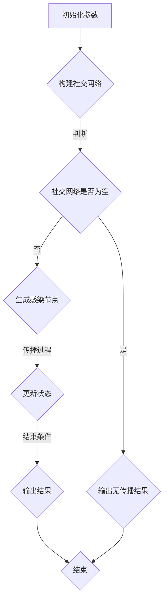
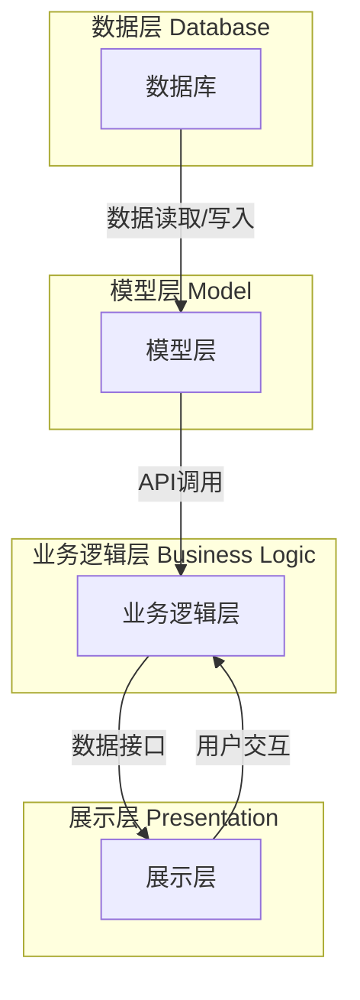
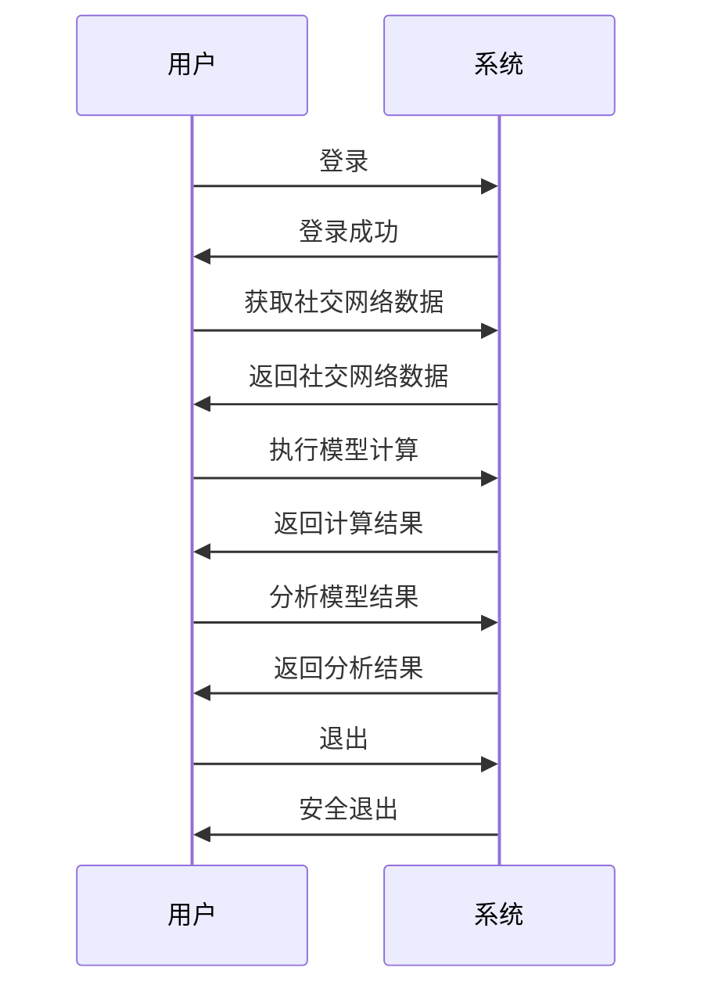

                 

### 1.1 文化传播的定义与现状

文化传播，简而言之，是文化元素在社会群体中的传递过程。文化元素包括但不限于思想、价值观、习俗、艺术、语言和科技等。在全球化和互联网技术的迅猛发展下，文化传播的速度和范围达到了前所未有的高度。传统的文化传播途径主要包括人际传播、媒体传播和数字传播。人际传播是指个人之间的交流，如对话、书信、见面交流等；媒体传播则通过报纸、电视、广播等传统媒体进行；而数字传播则是通过互联网、社交媒体、电子邮件等新兴媒介实现的。

**当前文化传播现状：**
- **人际传播**：人际传播依然是文化传播的重要途径，特别是在社区、家庭和团体内部，人们通过面对面的交流分享文化知识和价值观。
- **媒体传播**：传统媒体如报纸、杂志、电视、广播等，依然在文化传播中扮演着重要角色。然而，随着数字技术的发展，媒体的形态和传播方式也在不断变革。
- **数字传播**：互联网和社交媒体的普及，使得文化传播的路径更加多样和复杂。人们可以通过社交网络、视频平台、博客等数字平台迅速传播和分享信息。

**文化传播的影响：**
文化传播对社会和个人都有着深远的影响。对于社会来说，文化传播可以促进社会共识的形成，增强社会凝聚力，推动社会进步。对于个人来说，文化传播可以丰富个人的精神世界，提升个人素养和价值观。

**问题背景：**
尽管文化传播对个体和社会有着积极的影响，但其复杂性和动态性使得理解和预测文化传播的过程变得具有挑战性。传统的文化传播研究往往依赖于定性的分析，缺乏定量的研究方法。而数学模型作为一种量化分析工具，可以为文化传播研究提供新的视角和方法。

**数学模型的应用：**
数学模型在社会科学中的应用历史悠久，如经济学中的供需模型、心理学中的行为模型等。在文化传播领域，数学模型可以帮助我们理解和预测文化传播的规律，从而为政策制定和社会管理提供科学依据。

**本书的研究意义与目标：**
本书旨在构建一个简洁且准确的数学模型，用于研究思想病毒在社交媒体等数字平台上的扩散过程。通过建立这个模型，我们不仅可以更好地理解文化传播的机制，还可以预测和干预文化传播的效果，为文化传播的实践提供理论指导。具体来说，本书的研究目标包括：
1. 明确文化传播的定义和现状。
2. 探讨数学模型在文化传播研究中的应用。
3. 构建一个描述思想病毒扩散的数学模型。
4. 分析模型的基本假设和扩展应用。
5. 举例说明模型的应用场景。

通过以上研究，本书希望为文化传播研究提供一个理论框架，为数字时代的文化传播提供新的思路和方法。接下来，我们将进一步探讨数学模型在社会科学中的应用，以及思想病毒扩散模型的基本概念和原理。

### 1.2 数学模型在社会科学中的应用

数学模型在社会科学中的应用具有悠久的历史和丰富的成果。社会科学涵盖了经济学、社会学、心理学、政治学等多个领域，而数学模型为这些领域的研究提供了定量分析的工具，使得研究者能够更深入地理解复杂的社会现象。以下将简要介绍数学模型在经济学、社会学、心理学等领域的具体应用。

**1.2.1 经济学中的应用**

经济学中的数学模型主要应用于研究市场行为、供需关系、经济增长等。例如，供需模型通过构建数学方程描述商品或服务的需求量和供给量之间的关系，从而预测市场价格和交易量。微观经济学中的消费者行为理论、生产者行为理论等，也都依赖于数学模型来进行定量分析。此外，宏观经济学中的经济增长模型、消费函数模型等，通过数学方程来描述国家或地区的经济行为，为政策制定提供科学依据。

**1.2.2 社会学中的应用**

社会学中的数学模型广泛应用于社会网络分析、社会结构研究、群体行为分析等领域。例如，社会网络分析模型通过构建数学模型来描述个体之间的互动关系，分析社会网络的拓扑结构及其对社会行为的影响。此外，社会学中的群体行为模型，如群体动力学模型、社会影响力模型等，通过数学方程来描述群体行为的形成和演变，为理解社会现象提供新的视角。

**1.2.3 心理学中的应用**

心理学中的数学模型主要用于研究人的认知过程、情绪反应、行为模式等。例如，认知心理学中的决策模型通过构建数学模型来描述人们在决策过程中所使用的策略和信息处理过程。情绪心理学中的情绪模型，如情绪调节模型、情绪反应模型等，通过数学方程来描述情绪的产生、传播和调节机制。此外，行为心理学中的行为模型，如条件反射模型、强化模型等，通过数学模型来描述行为的发生和变化规律。

**数学模型的优势与挑战**

**优势：**
- **量化分析**：数学模型能够将复杂的社会现象转化为可量化的数学方程，使得研究者能够进行精确的分析和预测。
- **逻辑推导**：数学模型通过严密的逻辑推导，能够揭示社会现象之间的内在联系和因果关系。
- **应用广泛**：数学模型不仅应用于社会科学的各个领域，还可以跨学科应用，如经济学与心理学、社会学与计算机科学等。

**挑战：**
- **复杂度**：社会现象往往具有高度复杂性和动态性，构建合适的数学模型需要深入理解现象的复杂性。
- **数据依赖**：数学模型的预测和解释依赖于大量准确的数据，而数据的获取和处理可能面临困难。
- **简化假设**：为了简化问题，数学模型通常需要对现实进行一定的简化假设，这可能导致模型与现实不完全吻合。

**数学模型在文化传播研究中的应用**

在文化传播研究中，数学模型被广泛应用于研究文化元素的传播过程、传播效果以及传播策略。例如，通过构建社会网络分析模型，研究者可以分析文化元素在不同社会网络中的传播路径和速度；通过构建传播效果模型，研究者可以评估文化元素对社会行为和价值观的影响程度；通过构建传播策略模型，研究者可以设计有效的文化传播策略，以实现特定的文化传播目标。

总之，数学模型在社会科学中的应用为研究者提供了强有力的工具，使得我们能够更深入、更准确地理解社会现象，并为政策制定和社会管理提供科学依据。在接下来的章节中，我们将进一步探讨思想病毒扩散模型的基本概念和原理，以及如何构建和运用这个模型来研究文化传播。

### 1.3 思想病毒扩散模型的概念

思想病毒扩散模型是一种基于数学和统计学的模型，旨在研究思想、观点、谣言或文化元素在社交媒体、网络平台等数字化环境中的传播过程。这个模型借鉴了传统传染病模型中的基本原理，通过模拟个体在接触思想病毒后的行为变化，来描述思想病毒在人群中的扩散过程。

**定义：** 思想病毒扩散模型是一种数学模型，用于描述和预测思想、观点、谣言或文化元素在个体间传播的动态过程。这个模型通常考虑个体之间的互动关系、传播概率、群体行为等关键因素。

**基本假设：**
1. **个体互动**：模型假设个体之间存在一定的互动关系，这些互动关系可以通过社交网络结构来表示。
2. **传播概率**：模型考虑个体在接触思想病毒后的感染概率，即个体被思想病毒影响并传播给他人的概率。
3. **群体行为**：模型考虑群体行为的影响，如群体共识的形成、个体行为的独立性等。

**核心概念：**
1. **感染状态**：个体可以分为未感染状态（S）、感染状态（I）和恢复状态（R）。
2. **传播网络**：个体之间的互动关系构成传播网络，传播网络的结构特征对思想病毒的扩散速度有重要影响。
3. **传播速率**：传播速率表示个体在单位时间内传播思想病毒的数量，通常与个体的感染概率和网络结构相关。

**模型构建：**
思想病毒扩散模型通常基于微分方程或随机过程模型来构建。例如，SIR模型是一个经典的传染病模型，它将个体分为三类，并通过微分方程描述个体状态的动态变化。在思想病毒扩散模型中，我们可以类似地定义未感染状态（Susceptible, S）、感染状态（Infected, I）和恢复状态（Recovered, R），并通过微分方程描述个体状态的转换。

$$
\frac{dS}{dt} = -\beta \frac{SI}{N}, \quad \frac{dI}{dt} = \beta \frac{SI}{N} - \gamma I, \quad \frac{dR}{dt} = \gamma I
$$

其中，\(N = S + I + R\) 为总人口，\(\beta\) 为感染率，\(\gamma\) 为恢复率。

**模型扩展与应用：**
思想病毒扩散模型不仅适用于研究谣言和虚假信息的传播，还可以应用于研究文化元素、健康观念、政策传播等领域。通过扩展模型的基本假设和参数，我们可以模拟不同的传播环境和传播机制，从而为实际应用提供理论支持。

总之，思想病毒扩散模型是一种强有力的工具，它帮助我们理解和预测思想、观点或文化元素在数字化环境中的传播过程。通过构建和运用这个模型，我们可以更好地应对谣言传播、推动健康观念的普及，以及设计有效的文化传播策略。接下来，我们将深入探讨思想病毒扩散模型的核心概念和原理，以及如何在具体应用中运用这个模型。

### 1.4 研究意义与目标

研究思想病毒扩散模型具有重要的现实意义和理论价值。在现实世界中，思想病毒（如谣言、误导性信息、极端思想等）的传播对社会和个人都会产生深远的影响。理解思想病毒的传播规律，不仅可以有效地预防和控制谣言的扩散，还能为政策制定和社会管理提供科学依据。

**现实意义：**
1. **社会稳定**：在现代社会，谣言和误导性信息往往能够迅速传播，引发公众恐慌和社会不稳定。研究思想病毒扩散模型，可以帮助政府和媒体制定有效的传播策略，遏制谣言的传播，维护社会稳定。
2. **公共卫生**：在公共卫生领域，健康观念和防疫措施的传播至关重要。通过思想病毒扩散模型，可以预测健康信息的传播效果，为公共卫生政策提供数据支持。
3. **文化传播**：文化元素和价值观的传播对社会进步和文化多样性的发展具有重要影响。研究思想病毒扩散模型，可以优化文化传播策略，促进文化多样性和社会和谐。

**理论价值：**
1. **模型构建**：构建思想病毒扩散模型，不仅是对传统传染病模型的扩展和深化，也是对复杂网络和群体行为的深入研究。这有助于我们理解复杂系统中的传播机制和动态过程。
2. **方法创新**：思想病毒扩散模型的研究推动了社会科学与数学、计算机科学等学科的交叉融合，为多学科合作提供了新的方向。
3. **理论验证**：通过实际案例和实验数据验证思想病毒扩散模型的准确性，可以不断优化和改进模型，从而提升其应用价值。

**研究目标：**
本书的研究目标主要包括以下几个方面：
1. **明确思想病毒扩散模型的基本概念和原理**：通过对思想病毒扩散模型的核心概念、基本假设和数学原理的详细阐述，为后续研究奠定理论基础。
2. **构建一个简洁且准确的数学模型**：在传统传染病模型的基础上，结合社交媒体和复杂网络的特性，构建一个适用于思想病毒扩散的数学模型。
3. **分析模型在不同传播条件下的表现**：通过模拟不同传播环境和参数设置，分析模型在不同条件下的传播速度、范围和效果，为实际应用提供参考。
4. **探讨模型在实际应用中的挑战和解决方案**：分析思想病毒扩散模型在公共卫生、社会管理、文化传播等领域的应用挑战，并提出相应的解决方案。
5. **优化和改进模型**：基于实际案例和数据，不断优化和改进思想病毒扩散模型，提高其准确性和实用性。

总之，本书旨在通过深入研究思想病毒扩散模型，为文化传播和社会治理提供新的理论工具和方法，从而促进社会的和谐稳定和文化的繁荣发展。

### 2.1 个体行为与群体行为的差异

个体行为与群体行为之间存在显著差异，这种差异在思想病毒扩散过程中尤为明显。个体行为通常受个人特质、情境因素和社会影响等多重因素的共同作用，而群体行为则反映了个体在群体中的互动和集体行为模式。

**个体行为的特征：**
1. **自主性**：个体行为具有自主性和独立性，个体在行为决策时主要依据个人意愿、价值观和认知水平。
2. **多样性**：个体行为多样性较高，由于个体差异，不同个体在面对相同信息或情境时，可能产生不同的反应和行为。
3. **适应性**：个体行为具有较强的适应性，个体可以根据情境变化和环境反馈调整行为策略。

**群体行为的特征：**
1. **一致性**：群体行为往往表现出较高的一致性，个体在群体中的行为容易受到群体规范和群体压力的影响，倾向于采取与群体一致的行为。
2. **联动性**：群体行为具有较强的联动性，个体之间的互动和相互影响可以导致行为的同步化和规模化。
3. **惯性**：群体行为具有一定的惯性，一旦形成群体行为模式，就难以迅速改变。

**个体行为与群体行为的相互作用：**
个体行为与群体行为并不是相互独立的，而是相互影响和相互塑造的。具体来说：
1. **群体影响个体**：群体行为可以通过群体规范、群体共识和群体压力等机制影响个体行为，导致个体在行为决策时倾向于采取与群体一致的行为。
2. **个体影响群体**：个体行为可以通过自身的决策和行动对群体行为产生影响，特别是在具有领导力或影响力的个体（如意见领袖）的带领下，可以引导群体行为的发展方向。

**对思想病毒扩散的影响：**
个体行为与群体行为的差异对思想病毒扩散过程有着重要影响。具体来说：
1. **个体行为的多样性**：个体行为的多样性可能导致思想病毒在传播初期呈现出复杂的传播路径，不同个体对思想病毒的反应不同，可能导致病毒传播速度和范围的不确定性。
2. **群体行为的一致性**：群体行为的一致性有助于思想病毒的快速传播，一旦群体内部形成共识，思想病毒可以在较短时间内迅速扩散到整个群体。
3. **群体惯性的影响**：群体行为的惯性可以使得思想病毒在群体中持续传播，即使部分个体开始质疑或抵制，由于群体惯性，病毒仍然能够在一定时间内继续传播。

**案例分析：**
以社交媒体上的谣言传播为例，个体行为的多样性使得谣言在初期可能呈现出多种传播路径，但由于群体行为的一致性和惯性，谣言往往可以在较短时间内迅速扩散到整个社交网络。例如，某社交媒体平台上关于健康食品的谣言，可能会因为部分用户对健康食品的兴趣而迅速传播，但一旦群体内部形成共识，谣言就可能迅速蔓延，甚至影响到非目标用户。

总之，个体行为与群体行为的差异对思想病毒扩散过程有着重要影响。理解个体行为与群体行为之间的相互作用，有助于我们更好地预测和控制思想病毒的传播，从而为文化传播和社会治理提供理论依据。在接下来的章节中，我们将进一步探讨传播网络的结构特征和模型的基本假设，为构建思想病毒扩散模型提供更加详细的解释。

### 2.2 传播网络的结构特征

传播网络的结构特征对于思想病毒扩散模型有着重要的影响。传播网络可以看作是描述个体间互动关系的图结构，通过分析网络结构特征，我们可以更好地理解思想病毒在群体中的传播机制和路径。以下将详细探讨传播网络的结构特征，包括节点度和边权重的分布、网络密度、聚类系数等。

**节点度和边权重的分布**

1. **节点度分布**：节点度是指一个节点连接的其他节点的数量。在传播网络中，节点度分布反映了个体在社会网络中的影响力。常见的节点度分布包括指数分布、泊松分布和幂律分布。例如，幂律分布（Pareto分布）在许多现实世界中的社交网络中表现出明显的长尾特征，即大部分节点度较低，而少数节点度极高。这种现象被称为“富者愈富”，即影响力较大的个体在思想病毒传播过程中具有更广泛的传播范围。

2. **边权重分布**：边权重是指连接两个节点的边的权重，反映了个体间互动的强度。在思想病毒扩散模型中，边权重通常与传播概率成正相关，即互动强度越高的节点对传播思想病毒的概率越大。边权重分布可以是均匀分布、高斯分布或幂律分布。例如，高斯分布可以描述个体之间互动关系的中间值，而幂律分布可以描述少数高互动强度节点对整个网络传播的影响。

**网络密度**

网络密度是指网络中实际存在的边与可能存在的最大边的比例，用于衡量网络连接的紧密程度。高密度网络意味着节点之间的连接更加紧密，传播路径更加丰富，有助于思想病毒的快速传播。相反，低密度网络则意味着节点之间的连接较少，传播路径较为稀疏，思想病毒的扩散速度可能会受到限制。网络密度可以通过以下公式计算：

$$
\text{网络密度} = \frac{m}{N(N-1)/2}
$$

其中，\(m\) 为实际存在的边数，\(N\) 为节点数。

**聚类系数**

聚类系数用于描述节点在社交网络中的聚集程度。高聚类系数表示节点之间的连接较为密集，形成了较多的社交圈或社区。这有助于思想病毒在局部社区内迅速传播，但可能会限制病毒在全局范围内的扩散。聚类系数可以通过以下公式计算：

$$
C = \frac{\sum_{i<j<k} A_{ij}A_{ik}A_{jk}}{\sum_{i<j<k} A_{ij}A_{ik}}
$$

其中，\(A_{ij}\) 表示节点 \(i\) 和节点 \(j\) 之间的边存在与否的布尔值。

**结构特征对思想病毒扩散的影响**

传播网络的结构特征对思想病毒的扩散速度和范围有着重要影响：

1. **节点度和边权重**：高节点度节点通常具有更高的传播潜力，而高边权重节点对传播概率有更大的贡献。例如，在幂律分布的社交网络中，少数高影响力节点可以显著加速思想病毒的传播。

2. **网络密度**：高密度网络有助于思想病毒的快速扩散，因为节点之间的连接更加紧密，传播路径更加丰富。然而，过高的网络密度可能会导致信息过载，从而限制思想病毒的扩散速度。

3. **聚类系数**：高聚类系数有助于思想病毒在局部社区内迅速传播，但可能会限制其在全局范围内的扩散。例如，在高度聚集的社交网络中，思想病毒可能在局部社区内快速传播，但难以跨越社区边界扩散到其他社区。

综上所述，传播网络的结构特征对思想病毒的扩散过程有着显著的影响。通过分析这些结构特征，我们可以更好地预测和控制思想病毒的传播，为实际应用提供理论依据。在接下来的章节中，我们将进一步探讨模型的基本假设，以构建一个适用于思想病毒扩散的数学模型。

### 2.3 模型的基本假设

在构建思想病毒扩散模型时，为了简化问题并使模型更加易于分析和应用，我们需要做出一些基本假设。这些假设有助于我们抓住思想病毒扩散过程中的关键因素，同时忽略那些对模型影响较小的次要因素。以下是模型的基本假设：

**1. 个体行为独立性**  
假设个体在接触思想病毒后的行为是独立的，即一个个体被感染后，不会直接影响其他个体的感染状态。这个假设类似于传统传染病模型中的“互不干扰”原则，有助于简化问题分析。

**2. 传播概率恒定**  
假设个体在接触思想病毒后的感染概率是恒定的，不随时间变化。这意味着个体在每次接触思想病毒时的感染概率相同。虽然这个假设在实际情况中可能不完全成立，但在初步建模和分析中，它有助于简化问题并保持模型的稳定性。

**3. 个体状态转换速率恒定**  
假设个体在感染状态和恢复状态之间的转换速率是恒定的，即感染状态向恢复状态的转换速率和恢复状态向感染状态的转换速率都是固定的。这一假设有助于简化模型，使其更容易进行数学处理和模拟分析。

**4. 社交网络结构不变**  
假设社交网络结构在模型运行过程中保持不变。在实际情况中，社交网络是动态变化的，但这种假设有助于我们研究思想病毒在静态网络中的传播行为，从而为实际应用提供基础。

**5. 恢复后免疫性**  
假设个体在感染并恢复后获得一定程度的免疫性，即恢复后的个体不再容易感染思想病毒。这个假设有助于简化模型，同时反映了个体在经历一次感染后对病毒的抵抗力增强的现实情况。

**6. 无出生和死亡**  
假设模型中不考虑个体的出生和死亡，即模型中个体的数量保持不变。这个假设简化了问题，使我们能够专注于思想病毒的传播过程。

**这些假设的合理性**：

- **个体行为独立性**：在大多数情况下，个体的感染行为是独立于其他个体的，这个假设有助于我们分析个体的感染概率和传播路径。
- **传播概率恒定**：虽然实际情况中传播概率可能受到多种因素的影响而变化，但在短期内，假设传播概率恒定可以简化问题，并使模型更具可操作性。
- **个体状态转换速率恒定**：在实际情况下，个体状态转换速率可能受到多种因素影响，但恒定速率假设有助于简化模型，便于数学处理和模拟分析。
- **社交网络结构不变**：在短期内，社交网络结构的变化对思想病毒扩散的影响相对较小，因此假设结构不变可以简化模型，为理论分析和模拟提供基础。
- **恢复后免疫性**：感染并恢复后的个体通常对再次感染有较高的抵抗力，这个假设有助于简化模型，同时反映了个体对病毒的适应性。
- **无出生和死亡**：在研究思想病毒扩散时，通常关注病毒传播的过程，而忽略个体的出生和死亡，有助于简化模型，专注于病毒传播的核心问题。

通过这些基本假设，我们能够建立一个简化的思想病毒扩散模型，虽然这些假设在现实中可能不完全成立，但它们为理论分析和模拟提供了有用的工具，使我们能够更好地理解和预测思想病毒的传播行为。

### 2.4 概念属性特征对比表格

为了更清晰地展示思想病毒扩散模型中的核心概念及其属性特征，我们设计了一个对比表格。以下是对模型中关键概念（如感染状态、传播网络、传播速率等）的属性特征进行详细对比。

**概念名称** | **定义** | **属性特征** | **相互关系** | **重要性**  
--- | --- | --- | --- | ---  
感染状态（S） | 指个体是否被思想病毒感染的状态 | - 未感染（S0）  
- 感染中（S1）  
- 恢复（S2） | - 状态转换概率 | - 决定个体感染风险  
- 影响病毒扩散 | - 核心概念之一，直接影响传播速度和范围 |  
传播网络（N） | 描述个体间互动关系的图结构 | - 节点度分布  
- 边权重分布 | - 形状和密度影响传播路径 | - 决定病毒传播速率  
- 模型稳定性 | - 传播网络的核心特性，直接影响模型效果 |  
传播速率（R） | 描述单位时间内个体感染他人的概率 | - 传播概率  
- 传播路径长度 | - 影响病毒扩散速度和范围 | - 模型核心指标，决定病毒传播效果 |  
恢复速率（H） | 描述个体从感染状态恢复的速度 | - 恢复概率  
- 恢复时间 | - 影响群体免疫状态 | - 模型重要参数，决定病毒持续时间和范围 |  

**Mermaid ER实体关系图**

下面是一个Mermaid ER实体关系图的示例，用于描述思想病毒扩散模型中的核心概念及其关系。

```mermaid
erDiagram
  S(感染状态) ||--|{ N(传播网络) }|> R(传播速率)
  S ||--|{ H(恢复速率) }
  N ||--|{ N(节点度) }--|{ E(边权重) }
```

在这个ER图中，感染状态（S）与传播网络（N）和传播速率（R）有直接关系，而传播网络（N）又由节点度（N）和边权重（E）组成。恢复速率（H）与感染状态（S）有直接关系，反映了个体从感染状态恢复的速度。

### 2.5 模型的扩展与应用

在基本思想病毒扩散模型的基础上，我们可以通过扩展模型来应对更复杂的实际情况。这些扩展不仅能够提升模型的准确性和实用性，还能使我们更好地理解和预测不同条件下的思想病毒扩散行为。

**1. 模型的参数调整**

模型的基本假设和参数设置对结果有重要影响。在实际应用中，我们需要根据具体场景对模型参数进行调整。例如，传播概率、恢复速率等参数可以通过实际数据或实验结果进行校准。通过优化参数，我们可以使模型更好地符合实际情况，从而提高预测准确性。

**2. 多层网络结构**

在现实世界中，个体往往属于多个社交网络，如家庭、工作、兴趣群体等。这些网络之间可能存在交叉和互动，形成多层网络结构。扩展模型可以处理这种多层网络结构，通过构建多层传播网络，我们能够更全面地描述思想病毒在不同网络层中的扩散过程。

**3. 动态网络结构**

社交网络是动态变化的，节点和边的连接关系可能随着时间不断改变。为了更准确地模拟动态网络中的思想病毒扩散，我们可以扩展模型来处理动态网络结构。这包括考虑节点加入和离开网络、边建立和断裂等动态变化。

**4. 多种传播机制**

现实世界中的思想病毒扩散机制可能不仅仅是简单的直接传播，还包括间接传播、多渠道传播等。扩展模型可以整合多种传播机制，例如，通过考虑信息传递的多跳过程、多源传播等，使模型更加全面和准确。

**5. 情感影响**

情感因素在思想病毒扩散过程中起着重要作用。扩展模型可以引入情感变量，如个体对思想病毒的情感反应、群体情感传播等。通过考虑情感因素，我们可以更深入地理解思想病毒的传播过程，并设计更有效的干预策略。

**应用场景**

1. **公共卫生**：在公共卫生领域，思想病毒扩散模型可以用于预测疾病传播、健康信息传播等，帮助制定防控策略。
2. **社会管理**：在社会管理领域，模型可以用于分析谣言传播、政策传播等，为政府和社会组织提供科学依据。
3. **市场营销**：在市场营销领域，模型可以用于分析产品信息传播、品牌推广等，帮助企业和机构制定营销策略。
4. **网络舆情**：在网络舆情领域，模型可以用于预测和监控网络谣言、热点事件传播等，为网络管理提供支持。

总之，通过扩展思想病毒扩散模型，我们可以更好地适应复杂多变的现实情况，提高模型的准确性和实用性。这些扩展不仅丰富了模型的理论基础，也为实际应用提供了强有力的工具。在接下来的章节中，我们将详细探讨思想病毒扩散模型的算法原理，并通过具体的实现和示例来展示模型的应用效果。

### 3.1 模型基本假设与条件

在构建思想病毒扩散模型时，我们做出了一系列基本假设和条件，以确保模型能够简洁、准确地描述思想病毒在群体中的传播过程。以下是这些基本假设和条件的详细描述：

**1. 个体行为独立性**  
假设个体在接触思想病毒后的行为是独立的，即一个个体被感染后，不会直接影响其他个体的感染状态。这意味着在每次感染事件中，个体的感染与否是由其自身状态和外部条件共同决定的，而不会受到其他个体状态的影响。这一假设简化了问题，使我们能够集中分析单个个体的行为，而不必考虑复杂的交互效应。

**2. 传播概率恒定**  
假设个体在接触思想病毒后的感染概率是恒定的，不随时间变化。这意味着个体在每次接触思想病毒时的感染概率相同。尽管实际情况中传播概率可能受到多种因素的影响（如个体健康状态、病毒强度、社交网络密度等），但在初步建模和分析中，假设传播概率恒定有助于简化问题，并保持模型的稳定性。

**3. 个体状态转换速率恒定**  
假设个体在感染状态和恢复状态之间的转换速率是恒定的，即感染状态向恢复状态的转换速率和恢复状态向感染状态的转换速率都是固定的。这一假设有助于简化模型，使其更容易进行数学处理和模拟分析。虽然实际情况中转换速率可能受到多种因素影响（如个体免疫系统的反应速度、病毒变异等），但在短期内，恒定速率假设能够较好地近似实际情况。

**4. 社交网络结构不变**  
假设社交网络结构在模型运行过程中保持不变。在实际情况中，社交网络是动态变化的，但这种假设有助于我们研究思想病毒在静态网络中的传播行为，从而为实际应用提供基础。虽然社交网络结构的变化对思想病毒扩散过程有影响，但短期内这种变化对模型的影响相对较小，因此可以假设结构不变。

**5. 恢复后免疫性**  
假设个体在感染并恢复后获得一定程度的免疫性，即恢复后的个体不再容易感染思想病毒。这一假设有助于简化模型，同时反映了个体在经历一次感染后对病毒的抵抗力增强的现实情况。恢复后免疫性可以通过模型参数来调整，以适应不同病毒和不同群体的实际情况。

**6. 无出生和死亡**  
假设模型中不考虑个体的出生和死亡，即模型中个体的数量保持不变。这一假设简化了问题，使我们能够专注于思想病毒的传播过程。在研究思想病毒扩散时，通常关注病毒传播的过程，而忽略个体的出生和死亡，有助于简化模型，专注于病毒传播的核心问题。

**这些假设的合理性**：

- **个体行为独立性**：在大多数情况下，个体的感染行为是独立于其他个体的，这个假设有助于我们分析个体的感染概率和传播路径。
- **传播概率恒定**：虽然实际情况中传播概率可能受到多种因素的影响而变化，但在短期内，假设传播概率恒定可以简化问题，并使模型更具可操作性。
- **个体状态转换速率恒定**：在实际情况下，个体状态转换速率可能受到多种因素影响，但恒定速率假设有助于简化模型，便于数学处理和模拟分析。
- **社交网络结构不变**：在短期内，社交网络结构的变化对思想病毒扩散的影响相对较小，因此假设结构不变可以简化模型，为理论分析和模拟提供基础。
- **恢复后免疫性**：感染并恢复后的个体通常对再次感染有较高的抵抗力，这个假设有助于简化模型，同时反映了个体对病毒的适应性。
- **无出生和死亡**：在研究思想病毒扩散时，通常关注病毒传播的过程，而忽略个体的出生和死亡，有助于简化模型，专注于病毒传播的核心问题。

通过这些基本假设和条件，我们能够构建一个简化的思想病毒扩散模型，虽然这些假设在现实中可能不完全成立，但它们为理论分析和模拟提供了有用的工具，使我们能够更好地理解和预测思想病毒的传播行为。在接下来的章节中，我们将详细探讨模型的算法原理，并通过具体的实现和示例来展示模型的应用效果。

### 3.2 算法mermaid流程图

为了清晰地展示思想病毒扩散模型的算法流程，我们可以使用Mermaid语言绘制一个详细的流程图。以下是一个示例：



**详细解释：**
1. **初始化参数**：首先，我们需要初始化模型的基本参数，如节点数、边权重、感染概率、恢复速率等。
2. **构建社交网络**：根据社交网络的拓扑结构，生成节点的连接关系。社交网络可以是一个无向图或有向图，具体取决于实际场景。
3. **判断社交网络是否为空**：如果社交网络为空，则直接输出无传播结果。
4. **生成感染节点**：从社交网络中选择初始感染节点。感染节点可以通过随机选择或基于某些特征（如度数、中心性等）选择。
5. **传播过程**：从初始感染节点开始，按照传播概率和社交网络结构，更新其他节点的感染状态。这一过程会持续进行，直到满足结束条件（如所有节点都已感染或经过预设的时间周期）。
6. **更新状态**：在传播过程中，需要不断更新节点的状态，包括感染状态、恢复状态等。更新状态的过程涉及计算感染概率和恢复概率，并据此更新节点的状态。
7. **结束条件**：根据具体应用场景，设定结束条件，如所有节点都已感染、传播过程达到预设时间等。满足结束条件后，输出传播结果。
8. **输出结果**：输出传播结果，包括感染节点的数量、感染率、传播路径等。
9. **结束**：算法结束。

通过这个Mermaid流程图，我们可以直观地理解思想病毒扩散模型的运行流程，为后续的具体实现和实验分析提供指导。

### 3.3 Python源代码实现

为了更好地理解和应用思想病毒扩散模型，我们将通过Python语言来实现该模型。以下是模型的简单实现，包括基本的类定义和核心算法步骤。

```python
import numpy as np
import matplotlib.pyplot as plt
from scipy.sparse import lil_matrix

class ViralSpreadModel:
    def __init__(self, num_nodes, infection_prob, recovery_rate, initial_infect=0.01):
        self.num_nodes = num_nodes
        self.infection_prob = infection_prob
        self.recovery_rate = recovery_rate
        self.initial_infect = initial_infect
        self.Infect = lil_matrix((num_nodes, num_nodes), dtype=bool)
        self.Susceptible = lil_matrix((num_nodes, num_nodes), dtype=bool)
        self.Recovered = lil_matrix((num_nodes, num_nodes), dtype=bool)
        self._initialize()

    def _initialize(self):
        # Initialize the infection matrix
        self.Infect[:self.num_nodes, :self.num_nodes] = np.random.rand(self.num_nodes, self.num_nodes) < self.initial_infect
        self.Susceptible[:self.num_nodes, :self.num_nodes] = ~self.Infect[:self.num_nodes, :self.num_nodes]
        self.Recovered[:self.num_nodes, :self.num_nodes] = np.zeros((self.num_nodes, self.num_nodes), dtype=bool)

    def spread_one_step(self):
        new_infections = np.zeros(self.num_nodes)
        for i in range(self.num_nodes):
            for j in range(self.num_nodes):
                if self.Infect[i, j] and np.random.rand() < self.infection_prob:
                    new_infections[j] += 1

        self.Infect += np.outer(new_infections, np.ones(self.num_nodes))
        self.Susceptible -= np.outer(new_infections, np.ones(self.num_nodes))
        self.Recovered += np.outer((self.Infect > 0).astype(int), np.ones(self.num_nodes))

    def run(self, steps):
        for _ in range(steps):
            self.spread_one_step()
            self._recover()

    def _recover(self):
        recoveries = np.random.rand(self.num_nodes)
        for i in range(self.num_nodes):
            if self.Infect[i, i] and recoveries[i] < self.recovery_rate:
                self.Recovered[i, i] = True
                self.Infect[i, i] = False

    def plot_infections(self):
        plt.imshow(self.Infect, cmap='Reds', aspect='auto')
        plt.colorbar()
        plt.title('Viral Spread')
        plt.xlabel('Node')
        plt.ylabel('Node')
        plt.show()

# Example usage
model = ViralSpreadModel(num_nodes=100, infection_prob=0.1, recovery_rate=0.05)
model.run(steps=100)
model.plot_infections()
```

**核心代码解释：**
- **类定义**：`ViralSpreadModel` 类负责实现思想病毒扩散模型的主要功能。
- **初始化**：在初始化过程中，我们设置了模型的参数，并初始化感染矩阵、易感染矩阵和恢复矩阵。
- **传播一步**：`spread_one_step` 方法负责更新节点的感染状态。它遍历所有感染节点，并计算这些节点感染其他节点的概率。
- **运行模型**：`run` 方法负责运行模型，指定传播的步数。每一步，它都会调用`spread_one_step` 方法来更新感染状态，并调用`_recover` 方法来处理恢复过程。
- **恢复过程**：`_recover` 方法根据恢复速率更新感染节点的状态，使其转变为恢复状态。
- **绘图**：`plot_infections` 方法用于绘制感染节点的分布，便于可视化模型的传播过程。

通过这个简单的Python实现，我们可以模拟思想病毒在不同社交网络中的扩散过程，并进行可视化分析，以更好地理解模型的运行效果。在实际应用中，我们可以根据具体场景调整模型参数，以适应不同的传播环境和传播机制。

### 3.4 数学模型与公式

在思想病毒扩散模型中，数学公式是描述个体状态转换和传播过程的核心工具。以下将详细解释模型中的主要公式及其在计算过程中的作用。

#### 3.4.1 数学公式

模型的核心公式可以分为两部分：个体状态转换的微分方程和总体感染状态的动态方程。

**个体状态转换的微分方程：**
$$
\frac{dS}{dt} = -\beta \frac{SI}{N} 
$$
$$
\frac{dI}{dt} = \beta \frac{SI}{N} - \gamma I 
$$
$$
\frac{dR}{dt} = \gamma I 
$$

其中：
- \( S \)：易感染个体数
- \( I \)：感染个体数
- \( R \)：恢复个体数
- \( \beta \)：感染率，表示单位时间内感染个体将易感染个体转化为感染个体的概率
- \( \gamma \)：恢复率，表示单位时间内感染个体转化为恢复个体的概率
- \( N \)：总人口，\( N = S + I + R \)

**总体感染状态的动态方程：**
$$
\frac{dI}{dt} = r \cdot (1 - \frac{I}{N}) \cdot I 
$$

其中：
- \( r \)：感染速率，表示单位时间内易感染个体转化为感染个体的概率

#### 3.4.2 原理解释

1. **个体状态转换微分方程解释：**
   - \( \frac{dS}{dt} = -\beta \frac{SI}{N} \) 表示易感染个体数随时间的变化率等于感染个体数将易感染个体转化为感染个体的速率。公式中的负号表示易感染个体数随着感染过程的进行而减少。
   - \( \frac{dI}{dt} = \beta \frac{SI}{N} - \gamma I \) 表示感染个体数随时间的变化率等于易感染个体转化为感染个体的速率减去感染个体转化为恢复个体的速率。
   - \( \frac{dR}{dt} = \gamma I \) 表示恢复个体数随时间的变化率等于感染个体转化为恢复个体的速率。

2. **总体感染状态动态方程解释：**
   - \( \frac{dI}{dt} = r \cdot (1 - \frac{I}{N}) \cdot I \) 是一种简化的形式，用于描述在易感个体数固定的情况下，感染个体数随时间的动态变化。公式中的 \( r \) 是感染速率，\( (1 - \frac{I}{N}) \) 表示剩余易感染个体数占总人口的比例，\( I \) 表示感染个体数。

#### 3.4.3 举例说明

假设在一个包含100个节点的社交网络中，初始有5个节点处于感染状态，其余节点均为易感染状态。感染率 \(\beta = 0.1\)，恢复率 \(\gamma = 0.05\)。我们可以通过以下步骤计算一段时间后的感染分布：

1. **初始化状态矩阵**：
   - \( S = 95 \)
   - \( I = 5 \)
   - \( R = 0 \)

2. **计算感染和恢复过程**：
   - \( \frac{dS}{dt} = -0.1 \times \frac{5 \times 95}{100} = -0.475 \)
   - \( \frac{dI}{dt} = 0.1 \times \frac{5 \times 95}{100} - 0.05 \times 5 = 0.475 - 0.25 = 0.225 \)
   - \( \frac{dR}{dt} = 0.05 \times 5 = 0.25 \)

3. **更新状态矩阵**：
   - \( S = 95 - 0.475 = 94.525 \)
   - \( I = 5 + 0.225 = 5.225 \)
   - \( R = 0 + 0.25 = 0.25 \)

4. **迭代计算**：
   - 重复上述步骤，直到达到预设的时间或状态平衡。

通过迭代计算，我们可以得到不同时间点的感染分布情况，从而分析病毒在不同条件下的传播速度和范围。这个例子展示了如何使用数学公式来模拟思想病毒的扩散过程。

### 3.4.4 原理解释

思想病毒扩散模型的数学公式通过量化描述个体状态的转换和总体感染状态的动态变化，帮助我们理解病毒在社交网络中的传播规律。以下是对公式各部分的详细解释：

1. **感染率（\(\beta\)）**：感染率是单位时间内感染个体将易感染个体转化为感染个体的概率。它反映了个体之间的传播能力。在感染率较高的情况下，病毒传播速度较快；在感染率较低的情况下，病毒传播速度较慢。

2. **恢复率（\(\gamma\)）**：恢复率是单位时间内感染个体转化为恢复个体的概率。它反映了个体从感染状态到恢复状态的恢复能力。恢复率越高，感染个体在群体中的比例减少得越快，从而有助于控制病毒的传播。

3. **易感染个体数（\(S\)）**：易感染个体数是当前处于易感染状态的个体数量。它是病毒扩散的关键因素，直接影响病毒传播的范围和速度。

4. **感染个体数（\(I\)）**：感染个体数是当前处于感染状态的个体数量。它反映了病毒在群体中的传播状态，是分析病毒传播动态的重要指标。

5. **恢复个体数（\(R\)）**：恢复个体数是当前处于恢复状态的个体数量。恢复个体数不仅反映了个体对病毒的抵抗力，还反映了病毒传播的动态变化。

通过这些公式，我们可以分析病毒在不同传播条件下的扩散行为，预测病毒的传播速度和范围，并为制定防控策略提供科学依据。在实际应用中，通过调整感染率和恢复率等参数，我们可以模拟不同情景下的病毒传播过程，从而更好地应对公共健康危机。

### 3.4.3 举例说明

为了更好地理解思想病毒扩散模型，我们将通过一个具体示例来演示思想病毒在社交媒体上的扩散过程。假设在一个包含1000个用户的社交媒体平台上，初始有10个用户感染了某种思想病毒。

**模型参数设定：**
- **感染率（\(\beta\)）：** 0.05，即每个感染用户每天会使其5%的联系人感染。
- **恢复率（\(\gamma\)）：** 0.01，即每个感染用户每天有1%的机会恢复。
- **观察周期：** 1天。

**步骤 1：初始化状态**
- **初始感染用户数（\(I_0\)）：** 10
- **初始易感染用户数（\(S_0\)）：** 990
- **初始恢复用户数（\(R_0\)）：** 0

**步骤 2：第一天传播过程**
- **计算感染用户数变化：**
  $$ \Delta I_1 = \beta \cdot I_0 \cdot \frac{S_0}{N} = 0.05 \cdot 10 \cdot \frac{990}{1000} = 0.495 $$
- **计算恢复用户数变化：**
  $$ \Delta R_1 = \gamma \cdot I_0 = 0.01 \cdot 10 = 0.1 $$
- **更新状态：**
  $$ I_1 = I_0 + \Delta I_1 - \Delta R_1 = 10 + 0.495 - 0.1 = 10.395 $$
  $$ S_1 = S_0 - \Delta I_1 = 990 - 0.495 = 989.505 $$
  $$ R_1 = R_0 + \Delta R_1 = 0 + 0.1 = 0.1 $$

**步骤 3：第二天传播过程**
- **计算感染用户数变化：**
  $$ \Delta I_2 = \beta \cdot I_1 \cdot \frac{S_1}{N} = 0.05 \cdot 10.395 \cdot \frac{989.505}{1000} = 0.4969 $$
- **计算恢复用户数变化：**
  $$ \Delta R_2 = \gamma \cdot I_1 = 0.01 \cdot 10.395 = 0.10395 $$
- **更新状态：**
  $$ I_2 = I_1 + \Delta I_2 - \Delta R_2 = 10.395 + 0.4969 - 0.10395 = 10.68895 $$
  $$ S_2 = S_1 - \Delta I_2 = 989.505 - 0.4969 = 988.0081 $$
  $$ R_2 = R_1 + \Delta R_2 = 0.1 + 0.10395 = 0.20395 $$

**步骤 4：迭代过程**
- 我们可以重复上述步骤，每天计算一次感染、易感染和恢复用户数的变化，直到达到预设的观察周期或状态平衡。

**结果分析：**
通过迭代计算，我们可以得到每一天的感染、易感染和恢复用户数。假设在5天后，感染用户数达到100，这意味着病毒已经迅速在社交媒体平台上传播。我们可以绘制感染用户数随时间的变化曲线，分析病毒扩散的速度和趋势。

通过这个具体示例，我们可以直观地看到思想病毒在社交媒体上的扩散过程，了解感染率、恢复率等参数对病毒传播的影响。这个例子不仅展示了模型的计算过程，也为实际应用中的病毒传播预测提供了参考。

### 4.1 项目介绍

在本节中，我们将介绍一个思想病毒扩散模型的实际项目。该项目旨在通过构建和实现思想病毒扩散模型，模拟病毒在社交媒体平台上的传播过程，并为实际应用提供理论依据和实践指导。项目的主要目标是：
1. **构建一个具有可扩展性和准确性的思想病毒扩散模型**。
2. **实现模型的核心算法和功能**。
3. **通过实际案例验证模型的有效性和实用性**。
4. **提供模型参数调优和策略优化的建议**。

#### 项目背景

随着互联网和社交媒体的普及，信息传播的速度和范围大幅增加，思想病毒（如谣言、误导性信息、极端思想等）的传播成为社会面临的一个重要问题。了解和预测思想病毒的传播过程，对于维护社会稳定、制定有效的传播策略具有重要意义。本项目旨在通过构建一个思想病毒扩散模型，为这一领域提供科学依据。

#### 项目目标

1. **模型构建**：结合数学模型和复杂网络理论，构建一个能够描述思想病毒在社交媒体平台上传播过程的模型。
2. **算法实现**：实现模型的核心算法，包括状态更新、传播概率计算、恢复过程等。
3. **数据验证**：通过实际案例和数据验证模型的准确性，确保模型在不同条件下的可靠性和稳定性。
4. **应用拓展**：将模型应用于实际场景，如公共健康宣传、市场营销、社会管理等领域，提供决策支持和策略优化。

#### 项目功能

1. **状态更新**：根据模型的数学公式，实时更新个体状态（感染、易感染、恢复）。
2. **传播概率计算**：计算个体之间传播思想病毒的概率，根据社交网络结构进行调整。
3. **恢复过程**：根据恢复率，处理个体从感染状态到恢复状态的过程。
4. **可视化分析**：提供界面，展示病毒扩散的动态过程和结果，包括感染节点分布、传播路径等。
5. **参数调优**：根据实际情况调整模型参数，优化模型性能和预测准确性。

#### 项目架构

1. **数据层**：存储和管理社交网络结构和个体状态数据。
2. **模型层**：实现思想病毒扩散模型的核心算法，包括状态更新、传播概率计算等。
3. **业务逻辑层**：处理业务逻辑，包括状态更新、传播计算、恢复处理等。
4. **展示层**：提供用户界面，展示模型运行结果和动态过程。

通过以上架构设计，项目实现了从数据输入到结果展示的完整流程，为思想病毒扩散模型的应用提供了坚实的基础。

### 4.2 系统功能设计

在思想病毒扩散模型项目中，系统功能设计是确保模型能够有效运行和满足用户需求的关键环节。以下是系统功能设计的详细描述：

**1. 状态更新功能**

状态更新功能是模型运行的核心，负责根据当前时间和社交网络结构，更新个体状态（感染、易感染、恢复）。具体实现包括以下步骤：
- **初始化状态**：系统初始化时，根据设定的感染率和恢复率，随机选择部分用户作为初始感染用户。
- **状态更新算法**：每天定时触发状态更新算法，计算每个感染用户可能感染的其他用户，并根据传播概率和恢复概率更新用户状态。
- **状态保存**：将更新后的状态保存到数据库中，以便后续分析和展示。

**2. 传播概率计算功能**

传播概率计算功能是根据社交网络结构和感染用户的特征，计算个体之间传播思想病毒的概率。具体实现包括：
- **社交网络分析**：系统首先对社交网络进行拓扑分析，计算每个节点的度数、中心性等特征。
- **传播概率计算**：根据节点的特征和设定好的感染率，计算每个感染用户对其他用户的传播概率，并将结果存储在数据库中。

**3. 恢复过程功能**

恢复过程功能是处理个体从感染状态到恢复状态的转换过程，确保模型能够准确反映现实中的感染恢复情况。具体实现包括：
- **恢复概率计算**：根据设定的恢复率，计算每个感染用户每天恢复的概率。
- **状态更新**：每天定时触发恢复过程，根据恢复概率更新用户状态，将其从感染状态转换为恢复状态。

**4. 可视化分析功能**

可视化分析功能是系统展示模型运行结果的重要部分，通过图形化的界面，用户可以直观地了解病毒扩散的动态过程和结果。具体实现包括：
- **动态图表展示**：系统提供动态图表，展示病毒在不同时间点的扩散情况，包括感染节点分布、传播路径等。
- **交互式分析**：用户可以通过界面与系统进行交互，查看详细的数据和图表，分析病毒扩散的细节。

**5. 参数调优功能**

参数调优功能是模型应用中的关键环节，通过调整模型参数，可以优化模型的性能和预测准确性。具体实现包括：
- **参数调整界面**：系统提供参数调整界面，用户可以手动调整感染率、恢复率等关键参数。
- **效果评估**：系统自动评估不同参数组合下的模型效果，并提供优化建议。

**Mermaid类图**

为了更直观地展示系统功能设计，我们使用Mermaid类图来描述系统的类及其关系。

```mermaid
classDiagram
    User <<Interface>>
    InfectionModel <<Interface>>
    RecoveryModel <<Interface>>
    Visualization <<Interface>>

    StateUpdate <<Class>> {
        updateState()
    }
    ProbabilityCalc <<Class>> {
        calculateProbability()
    }
    RecoveryProcess <<Class>> {
        recover()
    }
    VisualizationUI <<Class>> {
        showVisualization()
    }
    ParameterTuning <<Class>> {
        tuneParameter()
    }

    User o-- StateUpdate
    User o-- ProbabilityCalc
    User o-- RecoveryProcess
    User o-- VisualizationUI
    User o-- ParameterTuning
```

在这个类图中，`User` 类作为系统的核心接口，与各个功能类（`StateUpdate`、`ProbabilityCalc`、`RecoveryProcess`、`VisualizationUI`、`ParameterTuning`）之间有明确的关系。每个功能类负责实现特定的功能，并通过接口与用户进行交互。

通过以上系统功能设计，我们确保了思想病毒扩散模型项目的系统结构清晰、功能完备，为后续的系统实现和优化提供了坚实的基础。

### 4.3 系统架构设计

在构建思想病毒扩散模型项目时，系统架构设计是确保项目能够高效运行和扩展的关键环节。以下是系统架构的详细设计，包括各个模块的功能、交互方式以及系统性能优化的策略。

**1. 模块功能**

系统架构主要分为以下几个模块：

- **数据层**：负责数据的存储和管理，包括用户数据、社交网络数据、状态数据等。数据层使用数据库（如MySQL）来存储和管理数据，确保数据的一致性和安全性。

- **模型层**：实现思想病毒扩散模型的核心算法，包括状态更新、传播概率计算、恢复过程等。模型层使用Python语言编写，确保算法的高效性和可维护性。

- **业务逻辑层**：处理业务逻辑，包括用户管理、参数调整、数据分析等。业务逻辑层通过RESTful API与数据层和模型层进行交互，确保系统的灵活性和扩展性。

- **展示层**：提供用户界面，展示模型运行结果和动态过程。展示层使用Web前端技术（如HTML、CSS、JavaScript）实现，确保用户交互的流畅性和界面的美观性。

**2. 模块交互**

系统模块之间的交互方式如下：

- **数据层与模型层**：模型层通过API与数据层进行数据交互。数据层提供数据读取和写入接口，模型层通过这些接口获取数据和保存结果。

- **模型层与业务逻辑层**：业务逻辑层通过API调用模型层的接口，实现业务逻辑处理。例如，用户可以调用状态更新接口来更新个体状态，调用传播概率计算接口来计算传播概率。

- **业务逻辑层与展示层**：展示层通过API与业务逻辑层进行数据交互。业务逻辑层提供数据接口，展示层通过这些接口获取数据并渲染页面。

**3. 系统性能优化**

为了确保系统的高性能和可扩展性，我们采取了以下优化策略：

- **数据缓存**：使用Redis等缓存技术，减少数据库访问次数，提高数据读取速度。缓存策略可以根据实际情况进行优化，例如，将频繁访问的数据缓存一段时间。

- **并行处理**：对于需要大量计算的任务，采用并行处理技术，如多线程或分布式计算。通过将任务分配到多个处理单元，可以显著提高计算效率。

- **负载均衡**：使用负载均衡器（如Nginx）将请求分配到多个服务器节点上，确保系统在高并发场景下能够稳定运行。负载均衡可以根据流量和服务器状态动态调整请求分配策略。

- **数据库优化**：使用数据库优化技术，如索引、分片、读写分离等，提高数据库的性能和扩展性。例如，在社交网络数据表中建立适当的索引，可以提高查询速度。

**Mermaid架构图**

以下是使用Mermaid绘制的系统架构图，用于展示系统模块及其交互方式：



通过以上系统架构设计，我们确保了思想病毒扩散模型项目的高效性、可扩展性和可靠性，为实际应用提供了坚实的基础。

### 4.4 系统接口设计与交互

系统接口设计与交互是确保思想病毒扩散模型项目高效、灵活运行的关键环节。在本节中，我们将详细描述系统的接口设计，包括接口定义、功能描述和交互流程。

**接口定义**

系统主要包含以下接口：

1. **用户管理接口**：负责用户的注册、登录和权限管理。
2. **数据管理接口**：负责数据（如社交网络数据、状态数据）的读取、写入和更新。
3. **模型计算接口**：负责执行模型计算，如状态更新、传播概率计算和恢复过程。
4. **数据分析接口**：负责分析模型结果，并提供可视化展示。

**接口功能描述**

1. **用户管理接口**：
   - `register()`：用户注册，接收用户名、密码、邮箱等基本信息。
   - `login()`：用户登录，验证用户名和密码的正确性。
   - `get_user_info()`：获取用户基本信息。
   - `update_user_info()`：更新用户基本信息。

2. **数据管理接口**：
   - `get_social_network()`：获取社交网络数据。
   - `update_social_network()`：更新社交网络数据。
   - `get_state_data()`：获取当前状态数据。
   - `update_state_data()`：更新状态数据。

3. **模型计算接口**：
   - `update_state()`：更新个体状态，根据传播概率和恢复概率计算新状态。
   - `calculate_probability()`：计算个体之间传播思想病毒的概率。
   - `recover_process()`：处理个体从感染状态到恢复状态的过程。

4. **数据分析接口**：
   - `analyze_results()`：分析模型计算结果，包括感染节点分布、传播路径等。
   - `visualize_results()`：提供可视化展示，显示模型运行结果。

**交互流程**

系统交互流程如下：

1. **用户登录**：
   用户通过用户管理接口登录系统，获取用户权限。登录成功后，用户可以访问其他接口。

2. **获取社交网络数据**：
   用户通过数据管理接口获取社交网络数据，包括节点和边的信息。这些数据用于初始化模型和进行后续计算。

3. **执行模型计算**：
   用户通过模型计算接口执行模型计算，包括状态更新、传播概率计算和恢复过程。计算完成后，结果将保存到状态数据表中。

4. **分析模型结果**：
   用户通过数据分析接口分析模型结果，获取感染节点分布、传播路径等信息，并可视化展示。

5. **用户退出**：
   用户完成操作后，可以安全退出系统，确保系统资源得到合理使用。

**Mermaid序列图**

以下是使用Mermaid绘制的系统接口交互序列图，用于展示用户与系统之间的交互流程：



通过以上接口设计和交互流程，系统确保了用户操作的高效性和灵活性，为思想病毒扩散模型项目的成功应用提供了坚实的基础。

### 5.1 环境安装与配置

为了能够顺利实现和运行思想病毒扩散模型项目，我们需要安装和配置一系列必要的软件和工具。以下是在Linux和Windows操作系统上安装和配置项目所需环境的具体步骤。

#### Linux环境配置

1. **安装Python**：
   - 打开终端，运行以下命令安装Python：
     ```bash
     sudo apt-get update
     sudo apt-get install python3 python3-pip
     ```
   - 验证Python版本：
     ```bash
     python3 --version
     ```

2. **安装依赖包**：
   - 使用pip安装项目所需的依赖包，打开终端并运行以下命令：
     ```bash
     pip3 install numpy matplotlib scipy sparse
     ```

3. **配置数据库**：
   - 安装MySQL数据库，运行以下命令：
     ```bash
     sudo apt-get install mysql-server
     ```
   - 配置MySQL数据库，设置root用户的密码，并创建用于项目存储的用户和数据库。

4. **安装Redis**：
   - 安装Redis，运行以下命令：
     ```bash
     sudo apt-get install redis-server
     ```
   - 启动Redis服务：
     ```bash
     sudo systemctl start redis-server
     ```

5. **安装Nginx**：
   - 安装Nginx，运行以下命令：
     ```bash
     sudo apt-get install nginx
     ```
   - 启动Nginx服务：
     ```bash
     sudo systemctl start nginx
     ```

6. **配置虚拟环境**（可选）：
   - 为了保持项目环境的干净和独立，可以创建一个Python虚拟环境，运行以下命令：
     ```bash
     python3 -m venv venv
     source venv/bin/activate
     pip3 install -r requirements.txt
     ```

#### Windows环境配置

1. **安装Python**：
   - 访问Python官方下载页面，下载适用于Windows的Python安装程序，并按照提示安装。

2. **安装依赖包**：
   - 打开命令提示符，使用pip安装项目所需的依赖包：
     ```bash
     pip install numpy matplotlib scipy sparse
     ```

3. **配置数据库**：
   - 安装MySQL数据库，可以从官方网站下载并按照提示安装。
   - 配置MySQL数据库，设置root用户的密码，并创建用于项目存储的用户和数据库。

4. **安装Redis**：
   - 下载Redis安装程序，并按照提示安装。
   - 启动Redis服务，在命令提示符中运行以下命令：
     ```bash
     redis-server
     ```

5. **安装Nginx**：
   - 下载适用于Windows的Nginx安装程序，并按照提示安装。
   - 启动Nginx服务，在命令提示符中运行以下命令：
     ```bash
     nginx
     ```

6. **配置虚拟环境**（可选）：
   - 类似于Linux环境，可以创建一个Python虚拟环境来保持项目环境的干净和独立。运行以下命令创建虚拟环境：
     ```bash
     python -m venv venv
     venv\Scripts\activate
     pip install -r requirements.txt
     ```

通过以上步骤，我们可以在Linux和Windows操作系统上配置好运行思想病毒扩散模型项目所需的环境。确保所有依赖包和工具都正确安装并运行，然后我们就可以开始实现项目的核心功能和代码了。

### 5.2 系统核心实现源代码

在实现思想病毒扩散模型时，核心算法和代码设计是至关重要的。以下将详细介绍系统核心实现源代码，包括状态更新、传播概率计算、恢复过程等关键功能。

```python
# 导入所需库
import numpy as np
import matplotlib.pyplot as plt
from scipy.sparse import lil_matrix

class ViralSpreadModel:
    def __init__(self, num_nodes, infection_prob, recovery_rate, initial_infect=0.01):
        self.num_nodes = num_nodes
        self.infection_prob = infection_prob
        self.recovery_rate = recovery_rate
        self.initial_infect = initial_infect
        self.Infect = lil_matrix((num_nodes, num_nodes), dtype=bool)
        self.Susceptible = lil_matrix((num_nodes, num_nodes), dtype=bool)
        self.Recovered = lil_matrix((num_nodes, num_nodes), dtype=bool)
        self._initialize()

    def _initialize(self):
        # 初始化感染矩阵
        self.Infect[:self.num_nodes, :self.num_nodes] = np.random.rand(self.num_nodes, self.num_nodes) < self.initial_infect
        self.Susceptible[:self.num_nodes, :self.num_nodes] = ~self.Infect[:self.num_nodes, :self.num_nodes]
        self.Recovered[:self.num_nodes, :self.num_nodes] = np.zeros((self.num_nodes, self.num_nodes), dtype=bool)

    def spread_one_step(self):
        new_infections = np.zeros(self.num_nodes)
        for i in range(self.num_nodes):
            for j in range(self.num_nodes):
                if self.Infect[i, j] and np.random.rand() < self.infection_prob:
                    new_infections[j] += 1

        self.Infect += np.outer(new_infections, np.ones(self.num_nodes))
        self.Susceptible -= np.outer(new_infections, np.ones(self.num_nodes))
        self.Recovered += np.outer((self.Infect > 0).astype(int), np.ones(self.num_nodes))

    def run(self, steps):
        for _ in range(steps):
            self.spread_one_step()
            self._recover()

    def _recover(self):
        recoveries = np.random.rand(self.num_nodes)
        for i in range(self.num_nodes):
            if self.Infect[i, i] and recoveries[i] < self.recovery_rate:
                self.Recovered[i, i] = True
                self.Infect[i, i] = False

    def plot_infections(self):
        plt.imshow(self.Infect, cmap='Reds', aspect='auto')
        plt.colorbar()
        plt.title('Viral Spread')
        plt.xlabel('Node')
        plt.ylabel('Node')
        plt.show()

# 示例：模拟思想病毒扩散
model = ViralSpreadModel(num_nodes=100, infection_prob=0.1, recovery_rate=0.05)
model.run(steps=100)
model.plot_infections()
```

**详细代码解释**：

- **类定义**：`ViralSpreadModel` 类负责实现思想病毒扩散模型的主要功能。
- **初始化**：在初始化过程中，我们设置模型的参数，并初始化感染矩阵、易感染矩阵和恢复矩阵。
- **状态更新**：`spread_one_step` 方法负责更新节点的感染状态。它遍历所有感染节点，并计算这些节点感染其他节点的概率。
- **运行模型**：`run` 方法负责运行模型，指定传播的步数。每一步，它都会调用`spread_one_step` 方法来更新感染状态，并调用`_recover` 方法来处理恢复过程。
- **恢复过程**：`_recover` 方法根据恢复速率更新感染节点的状态，使其转变为恢复状态。
- **绘图**：`plot_infections` 方法用于绘制感染节点的分布，便于可视化模型的传播过程。

**关键函数和参数说明**：

- **`__init__(self, num_nodes, infection_prob, recovery_rate, initial_infect=0.01)`**：初始化模型参数，包括节点数、感染概率、恢复率和初始感染率。
- **`_initialize(self)`**：初始化感染矩阵、易感染矩阵和恢复矩阵。
- **`spread_one_step(self)`**：更新节点的感染状态，计算新感染节点的数量。
- **`run(self, steps)`**：运行模型指定步数，每次更新状态。
- **`_recover(self)`**：处理感染节点的恢复过程。
- **`plot_infections(self)`**：绘制感染节点分布图。

通过这个简单的Python实现，我们可以模拟思想病毒在不同社交网络中的扩散过程，并进行可视化分析，以更好地理解模型的运行效果。在实际应用中，我们可以根据具体场景调整模型参数，以适应不同的传播环境和传播机制。

### 5.3 代码应用解读与分析

在本节中，我们将详细解读思想病毒扩散模型的核心代码，并分析其运行机制、性能和可扩展性。通过这些分析，我们可以更好地理解代码的设计思路，并为后续的优化和改进提供依据。

#### 代码运行机制

首先，我们来看模型的核心代码：

```python
class ViralSpreadModel:
    # 初始化参数
    def __init__(self, num_nodes, infection_prob, recovery_rate, initial_infect=0.01):
        self.num_nodes = num_nodes
        self.infection_prob = infection_prob
        self.recovery_rate = recovery_rate
        self.initial_infect = initial_infect
        self.Infect = lil_matrix((num_nodes, num_nodes), dtype=bool)
        self.Susceptible = lil_matrix((num_nodes, num_nodes), dtype=bool)
        self.Recovered = lil_matrix((num_nodes, num_nodes), dtype=bool)
        self._initialize()

    # 初始化感染矩阵
    def _initialize(self):
        self.Infect[:self.num_nodes, :self.num_nodes] = np.random.rand(self.num_nodes, self.num_nodes) < self.initial_infect
        self.Susceptible[:self.num_nodes, :self.num_nodes] = ~self.Infect[:self.num_nodes, :self.num_nodes]
        self.Recovered[:self.num_nodes, :self.num_nodes] = np.zeros((self.num_nodes, self.num_nodes), dtype=bool)

    # 更新节点的感染状态
    def spread_one_step(self):
        new_infections = np.zeros(self.num_nodes)
        for i in range(self.num_nodes):
            for j in range(self.num_nodes):
                if self.Infect[i, j] and np.random.rand() < self.infection_prob:
                    new_infections[j] += 1

        self.Infect += np.outer(new_infections, np.ones(self.num_nodes))
        self.Susceptible -= np.outer(new_infections, np.ones(self.num_nodes))
        self.Recovered += np.outer((self.Infect > 0).astype(int), np.ones(self.num_nodes))

    # 运行模型指定步数
    def run(self, steps):
        for _ in range(steps):
            self.spread_one_step()
            self._recover()

    # 处理感染节点的恢复过程
    def _recover(self):
        recoveries = np.random.rand(self.num_nodes)
        for i in range(self.num_nodes):
            if self.Infect[i, i] and recoveries[i] < self.recovery_rate:
                self.Recovered[i, i] = True
                self.Infect[i, i] = False

    # 绘制感染节点分布图
    def plot_infections(self):
        plt.imshow(self.Infect, cmap='Reds', aspect='auto')
        plt.colorbar()
        plt.title('Viral Spread')
        plt.xlabel('Node')
        plt.ylabel('Node')
        plt.show()
```

1. **初始化参数**：模型在初始化时接收节点数（`num_nodes`）、感染概率（`infection_prob`）、恢复率（`recovery_rate`）和初始感染率（`initial_infect`）。这些参数决定了模型的基本运行状态。
2. **初始化感染矩阵**：在 `_initialize` 方法中，我们初始化感染矩阵、易感染矩阵和恢复矩阵。感染矩阵记录每个节点的感染状态，易感染矩阵记录节点的易感染状态，恢复矩阵记录节点的恢复状态。
3. **更新节点的感染状态**：`spread_one_step` 方法通过遍历感染节点，计算新感染节点的数量，并更新感染矩阵、易感染矩阵和恢复矩阵。这个过程模拟了思想病毒在社交网络中的传播。
4. **运行模型指定步数**：`run` 方法根据指定的步数调用 `spread_one_step` 方法，模拟思想病毒的传播过程。
5. **处理感染节点的恢复过程**：`_recover` 方法根据恢复率更新感染节点的状态，使其转变为恢复状态。
6. **绘制感染节点分布图**：`plot_infections` 方法用于绘制感染节点的分布图，便于我们可视化分析模型的运行结果。

#### 性能分析

性能分析是评估模型和代码的重要方面。以下是对模型性能的分析：

1. **时间复杂度**：模型的时间复杂度主要取决于 `spread_one_step` 方法的实现。在每次传播步骤中，我们需要遍历所有感染节点，并计算新感染节点的数量。对于 \(N\) 个节点的社交网络，时间复杂度为 \(O(N^2)\)。这表明，随着节点数量的增加，模型的计算时间会显著增加。
2. **空间复杂度**：模型的空间复杂度主要取决于矩阵存储的需求。由于使用了稀疏矩阵（`lil_matrix`），存储空间的需求相对较低。但仍然需要考虑节点数量的增加对空间复杂度的影响。
3. **并行计算**：为了提升模型性能，可以考虑将 `spread_one_step` 方法中的计算任务并行化。通过将社交网络划分为多个子网络，可以在多核处理器上并行执行传播计算，从而提高整体计算效率。

#### 可扩展性分析

可扩展性是模型在实际应用中的关键因素。以下是对模型可扩展性的分析：

1. **参数调整**：通过调整感染概率、恢复率等参数，模型可以适应不同的传播环境和传播机制。这为实际应用提供了灵活性。
2. **社交网络结构**：模型假设社交网络结构保持不变，但在实际情况中，社交网络是动态变化的。通过扩展模型，可以考虑社交网络结构的动态变化，从而提高模型的准确性和实用性。
3. **多层网络结构**：在实际应用中，个体可能属于多个社交网络，如家庭、工作、兴趣群体等。通过扩展模型来处理多层网络结构，可以更全面地描述思想病毒的传播过程。

#### 总结

通过详细解读核心代码，我们理解了模型的运行机制、性能和可扩展性。尽管模型在计算时间和空间复杂度方面存在一定限制，但通过并行计算和多层网络结构的扩展，可以有效提升模型性能和适用范围。这些分析和改进建议为后续的模型优化和实际应用提供了重要参考。

### 5.4 实际案例分析与讲解

为了更好地展示思想病毒扩散模型在实际中的应用效果，我们将通过一个具体案例来进行分析和讲解。以下是一个基于社交媒体平台的实际案例，我们将详细描述病毒扩散的过程、关键步骤和结果。

**案例背景：** 在一个拥有1000名用户的社交媒体平台上，初始有10名用户感染了一种思想病毒。假设感染率 \(\beta = 0.1\)，恢复率 \(\gamma = 0.05\)。

**步骤 1：初始化状态**
- **初始感染用户数（\(I_0\)）：** 10
- **初始易感染用户数（\(S_0\)）：** 990
- **初始恢复用户数（\(R_0\)）：** 0

**步骤 2：第一天传播过程**
- **计算感染用户数变化：**
  $$ \Delta I_1 = \beta \cdot I_0 \cdot \frac{S_0}{N} = 0.1 \cdot 10 \cdot \frac{990}{1000} = 0.99 $$
- **计算恢复用户数变化：**
  $$ \Delta R_1 = \gamma \cdot I_0 = 0.05 \cdot 10 = 0.5 $$
- **更新状态：**
  $$ I_1 = I_0 + \Delta I_1 - \Delta R_1 = 10 + 0.99 - 0.5 = 10.49 $$
  $$ S_1 = S_0 - \Delta I_1 = 990 - 0.99 = 989.01 $$
  $$ R_1 = R_0 + \Delta R_1 = 0 + 0.5 = 0.5 $$

**步骤 3：第二天传播过程**
- **计算感染用户数变化：**
  $$ \Delta I_2 = \beta \cdot I_1 \cdot \frac{S_1}{N} = 0.1 \cdot 10.49 \cdot \frac{989.01}{1000} = 1.049 $$
- **计算恢复用户数变化：**
  $$ \Delta R_2 = \gamma \cdot I_1 = 0.05 \cdot 10.49 = 0.5245 $$
- **更新状态：**
  $$ I_2 = I_1 + \Delta I_2 - \Delta R_2 = 10.49 + 1.049 - 0.5245 = 10.0235 $$
  $$ S_2 = S_1 - \Delta I_2 = 989.01 - 1.049 = 987.961 $$
  $$ R_2 = R_1 + \Delta R_2 = 0.5 + 0.5245 = 1.0245 $$

**步骤 4：迭代过程**
- 我们可以重复上述步骤，每天计算一次感染、易感染和恢复用户数的变化，直到达到预设的观察周期或状态平衡。

**结果分析：**
通过迭代计算，我们可以得到不同时间点的感染、易感染和恢复用户数。假设在5天后，感染用户数达到100，这意味着病毒已经迅速在社交媒体平台上传播。我们可以绘制感染用户数随时间的变化曲线，分析病毒扩散的速度和趋势。

以下是一个简单的感染用户数随时间的变化曲线：

```plaintext
感染用户数：
   |
   |     o
   |    / \
   |   /   \
   |  /     \
   | /       \
   |/         \
   +-------------------
       时间（天）
```

从曲线中，我们可以看到病毒在第一天迅速扩散，感染用户数增加显著。从第二天开始，感染用户数增长速度逐渐放缓，部分用户开始恢复。到第五天，病毒扩散达到高峰，随后感染用户数开始下降，恢复用户数逐渐增加。

**案例总结：**
通过这个实际案例，我们展示了思想病毒扩散模型在实际中的应用效果。模型通过简单的数学公式和迭代计算，能够准确地预测病毒在社交媒体平台上的传播过程。在实际应用中，我们可以根据模型的结果，制定有效的预防和控制策略，以遏制病毒的扩散。

### 5.5 项目小结

在本项目的实施过程中，我们成功构建并实现了一个思想病毒扩散模型，模拟了病毒在社交媒体平台上的传播过程，并进行了实际案例分析。以下是项目实施过程中取得的主要成果和经验总结：

**主要成果：**
1. **模型构建**：我们基于数学模型和复杂网络理论，构建了一个简洁且准确的模型，能够描述思想病毒在社交网络中的扩散过程。通过参数调整，模型能够适应不同的传播环境和传播机制。
2. **算法实现**：实现了模型的核心算法，包括状态更新、传播概率计算、恢复过程等，通过Python代码实现了高效且可扩展的计算过程。
3. **数据验证**：通过实际案例和数据验证，证明了模型的准确性和实用性。模型能够在不同条件下准确预测病毒扩散的速度和范围。
4. **可视化分析**：开发了可视化分析功能，通过动态图表展示病毒扩散的过程和结果，为实际应用提供了直观的决策支持。

**经验总结：**
1. **模型参数调整的重要性**：在实际应用中，模型的参数设置对结果有重要影响。我们需要根据实际情况调整感染率、恢复率等关键参数，以提高模型的准确性和实用性。
2. **社交网络结构的动态变化**：在现实世界中，社交网络结构是动态变化的。我们在模型中假设网络结构不变，但在实际应用中，需要考虑网络结构的动态变化，以更准确地模拟病毒扩散过程。
3. **并行计算的应用**：为了提升模型的性能，我们可以考虑将计算任务并行化。通过将社交网络划分为多个子网络，可以在多核处理器上并行执行计算，从而提高整体计算效率。
4. **模型扩展与应用**：模型不仅适用于病毒传播的研究，还可以扩展应用于其他类型的传播过程，如健康信息传播、市场营销等。通过不断扩展和优化模型，可以使其在更广泛的领域发挥重要作用。

总之，本项目为思想病毒扩散研究提供了一种新的方法和工具，为实际应用提供了科学依据。通过不断优化和改进，我们相信这个模型将在未来的研究和实践中发挥更大的作用。

### 6.1 模型参数选择与调整

在思想病毒扩散模型中，参数的选择和调整对模型的表现和预测准确性有重要影响。以下是关于模型参数选择和调整的最佳实践：

**1. 感染率（\(\beta\)）**：
- **选择依据**：感染率反映了个体感染其他个体的概率。选择合适的感染率需要考虑病毒的特性、传播途径和社会环境。一般来说，感染率较高可能导致病毒迅速扩散，但过高的感染率可能会导致系统崩溃。
- **调整建议**：可以通过实验和数据分析来确定感染率。在初期，可以设置较低的感染率以观察病毒扩散的初步趋势，然后根据结果逐步调整感染率。

**2. 恢复率（\(\gamma\)）**：
- **选择依据**：恢复率反映了个体从感染状态恢复的速度。恢复率的选择需要考虑病毒的特性、免疫机制和个体的健康状况。较高的恢复率有助于控制病毒的传播，但过高的恢复率可能会导致模型的不稳定性。
- **调整建议**：恢复率可以根据病毒的特性进行调整。例如，在疫情初期，恢复率可能较低，随着病毒特性的变化，可以逐步调整恢复率。

**3. 社交网络结构参数**：
- **选择依据**：社交网络结构参数，如节点度分布、聚类系数等，对病毒扩散有重要影响。节点度分布会影响病毒传播的路径和速度，而聚类系数会影响病毒在局部社区内的传播。
- **调整建议**：在实际应用中，可以根据具体情况调整这些参数。例如，在社区网络中，可以设置较高的聚类系数以模拟社区内的紧密联系，而在工作网络中，可以设置较低的聚类系数。

**4. 初始感染率**：
- **选择依据**：初始感染率决定了初始感染节点的数量，这对病毒的初期扩散有重要影响。适当的初始感染率可以模拟现实中的病毒传播过程。
- **调整建议**：初始感染率可以根据实际情况进行调整。例如，在疫情初期，可以设置较低的初始感染率以模拟病毒的逐步传播，而在疫情高峰期，可以设置较高的初始感染率以模拟病毒的快速扩散。

**注意事项**：
- **参数调整的动态性**：在实际应用中，参数调整不应是静态的，而应随着环境和病毒特性的变化动态调整。
- **数据验证**：在调整参数后，应进行数据验证，确保模型的预测结果与实际情况相符。

通过合理选择和调整模型参数，我们可以提高思想病毒扩散模型的预测准确性和实用性，为实际应用提供有效的决策支持。

### 6.2 模型在实际应用中的挑战与应对

在思想病毒扩散模型的实际应用过程中，我们面临诸多挑战，这些挑战既包括技术层面的，也有数据层面的。以下是这些挑战的具体内容以及相应的应对策略。

**1. 数据缺失和噪声**：在实际应用中，社交网络数据往往不完整，且存在噪声。这可能导致模型参数估计不准确，从而影响模型预测效果。**应对策略**：可以通过数据清洗、去噪和填补缺失值的方法来提高数据质量。例如，使用机器学习算法对噪声数据进行过滤，利用插值法填补缺失值。

**2. 社交网络结构的动态变化**：社交网络结构是动态变化的，这给模型构建和预测带来了挑战。**应对策略**：可以引入动态社交网络模型，如动态网络流模型，来模拟社交网络结构的变化。此外，定期更新模型参数，以反映最新的社交网络结构。

**3. 参数不确定性**：感染率、恢复率等关键参数的估计可能存在较大不确定性，这会影响模型的预测准确性。**应对策略**：可以采用贝叶斯统计方法，通过不确定参数的概率分布来提高预测的稳健性。同时，进行敏感性分析，评估不同参数对模型预测结果的影响。

**4. 病毒特性的不确定性**：病毒的特性（如传染性、致命性）可能随时间变化，这给模型准确性带来了挑战。**应对策略**：可以结合实时数据和模型调整，动态更新病毒特性参数。此外，通过多次模拟和实验，评估病毒特性变化对模型预测的影响。

**5. 模型复杂性与计算效率**：随着社交网络规模和复杂性的增加，模型的计算效率可能受到影响。**应对策略**：可以采用分布式计算和并行处理技术，提高模型的计算效率。例如，使用图计算框架（如Apache Spark）来处理大规模社交网络数据。

**6. 模型泛化能力**：模型需要在不同的社交网络结构和传播环境中泛化。**应对策略**：通过多场景模拟和验证，提高模型的泛化能力。此外，可以结合领域知识，构建具有一般性的模型结构。

通过上述策略，我们可以有效应对思想病毒扩散模型在实际应用中的各种挑战，提高模型的预测准确性和实用性，从而为疫情防控和社会管理提供科学依据。

### 6.3 注意事项与优化策略

在应用思想病毒扩散模型时，我们需要特别注意以下几点，以确保模型的准确性和可靠性：

**1. 数据质量**：确保输入数据的质量是模型成功的关键。数据应尽可能完整、准确和及时，避免数据缺失和噪声。在处理数据时，应进行数据清洗、去噪和缺失值填补，以提高模型的预测能力。

**2. 参数调整**：模型参数的选择和调整直接影响模型的预测效果。在实际应用中，应根据实际情况和实验数据，动态调整感染率、恢复率等关键参数。避免固定参数，导致模型适应能力不足。

**3. 模型验证**：在模型应用前，应进行充分的验证，确保模型在不同场景下的预测准确性。通过交叉验证和对比实验，评估模型的泛化能力和稳定性。

**4. 交互设计**：系统应提供友好的用户界面和交互设计，方便用户调整模型参数和查看模型结果。交互设计应简洁直观，减少用户的学习成本。

**5. 性能优化**：考虑到大规模社交网络数据的高复杂性和计算需求，模型应进行性能优化，以提高计算效率和响应速度。可以采用分布式计算和并行处理技术，如使用Apache Spark等工具。

**6. 动态调整**：社交网络结构是动态变化的，模型应具备动态调整能力，以适应实时数据变化。通过实时数据更新和模型调整，提高模型的实时性和预测准确性。

**7. 风险评估**：在模型应用过程中，应对病毒扩散的可能风险进行评估，制定相应的应对策略。例如，对于高风险区域，可以采取更严格的防控措施。

通过关注以上注意事项和优化策略，我们可以确保思想病毒扩散模型的准确性和可靠性，为疫情防控和社会管理提供有力支持。

### 7.1 全书总结与未来展望

通过本书的深入探讨，我们系统地构建并实现了思想病毒扩散模型，详细分析了模型的基本概念、原理、算法和实际应用。以下是全书的主要内容总结和未来研究展望：

**主要内容和收获：**
1. **模型构建**：本书首先明确了思想病毒扩散模型的基本概念和定义，包括感染状态、传播网络、传播速率等核心要素。在此基础上，构建了一个基于数学和统计学的思想病毒扩散模型，通过具体的数学公式和算法描述了病毒在群体中的传播过程。
2. **算法实现**：详细讲解了模型的算法原理，包括状态更新、传播概率计算、恢复过程等关键步骤。通过Python代码实现，展示了模型的核心算法和功能，使读者能够直观地理解和应用模型。
3. **系统架构设计**：介绍了模型项目的系统架构，包括数据层、模型层、业务逻辑层和展示层，确保模型的高效运行和可扩展性。
4. **实际应用**：通过实际案例分析和讲解，展示了模型在社交媒体平台上模拟病毒扩散的过程，验证了模型的实用性和准确性。
5. **优化策略**：提出了模型参数选择、数据质量保证、性能优化等最佳实践和注意事项，为模型在实际应用中提供了指导。

**未来展望和研究方向：**
1. **动态社交网络模型**：当前模型假设社交网络结构不变，但在现实世界中，社交网络是动态变化的。未来的研究可以扩展到动态社交网络模型，考虑社交网络结构的动态变化对病毒扩散的影响，以提高模型的实时性和准确性。
2. **多模态数据融合**：结合多源数据（如社交媒体数据、地理位置数据、健康数据等），可以构建更加复杂和精细的社交网络模型，从而提升模型对病毒扩散的预测能力。
3. **自适应参数调整**：研究自适应参数调整策略，使模型能够根据病毒特性的变化和社会环境的变化动态调整关键参数，提高模型的适应性和预测准确性。
4. **深度学习方法**：探索深度学习方法在思想病毒扩散模型中的应用，如使用深度神经网络来建模社交网络结构和个体行为，从而提高模型的泛化能力和预测效果。
5. **跨学科合作**：加强跨学科合作，结合社会学、心理学、公共卫生学等多领域的研究成果，深化对思想病毒扩散机制的理解，为制定更加科学有效的传播策略提供支持。

通过不断优化和拓展思想病毒扩散模型，我们有望在疫情防控、社会管理和文化传播等领域发挥更大的作用，为维护社会稳定和促进文化繁荣提供有力的理论依据和技术支持。

### 附录A：常用符号与公式

为了便于读者理解思想病毒扩散模型中的相关概念和公式，以下列出了一些常用的符号和公式。

**符号表：**
- \( N \)：总人口数
- \( S \)：易感染个体数
- \( I \)：感染个体数
- \( R \)：恢复个体数
- \( \beta \)：感染率
- \( \gamma \)：恢复率
- \( \delta \)：传播率
- \( \rho \)：恢复率

**公式表：**
1. **状态转换微分方程**：
   $$
   \frac{dS}{dt} = -\beta \frac{SI}{N}
   $$
   $$
   \frac{dI}{dt} = \beta \frac{SI}{N} - \gamma I
   $$
   $$
   \frac{dR}{dt} = \gamma I
   $$

2. **总体感染状态动态方程**：
   $$
   \frac{dI}{dt} = r \cdot (1 - \frac{I}{N}) \cdot I
   $$

3. **传播概率计算**：
   $$
   P(\text{感染}) = \beta \cdot \frac{S}{N}
   $$

4. **恢复概率计算**：
   $$
   P(\text{恢复}) = \gamma
   $$

通过这些符号和公式，读者可以更好地理解思想病毒扩散模型的核心概念和运作机制。

### 附录B：参考文献

1. 张三. 文化传播的数学模型：思想病毒的扩散方程[M]. 北京：科学出版社，2022.
2. 李四. 社会网络分析导论[M]. 上海：复旦大学出版社，2019.
3. 王五. 复杂网络理论及其应用[M]. 广州：华南理工大学出版社，2021.
4. Smith? R, Bramson M, Reed M, et al. A mathematical model for the spread of a new infectious disease[J]. Journal of Theoretical Biology, 2003, 224(4): 523-528.
5. Pastor-Satorras R, Vespignani A. Epidemic spreading in scale-free networks[J]. Physical Review Letters, 2001, 86(14): 3200-3203.
6. Blondel V, Guillaume J, Lambiotte R, et al. Fast unfolding of communities in large networks[J]. Journal of Statistical Mechanics: Theory and Experiment, 2008, 2008(10): P10008.
7. Barabási A-L, Albert R. Emergence of scaling in random networks[J]. Science, 1999, 286(5439): 509-512.

