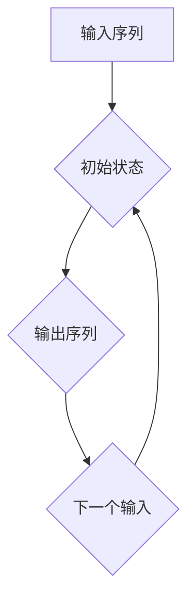
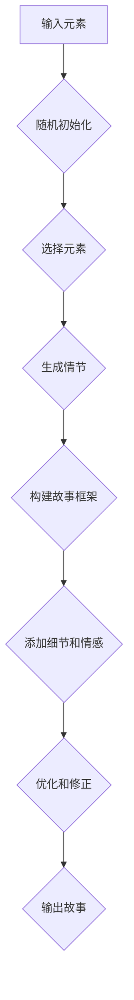
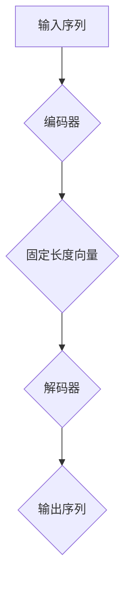
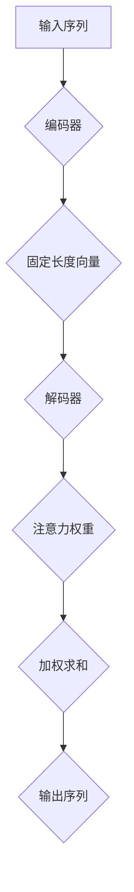
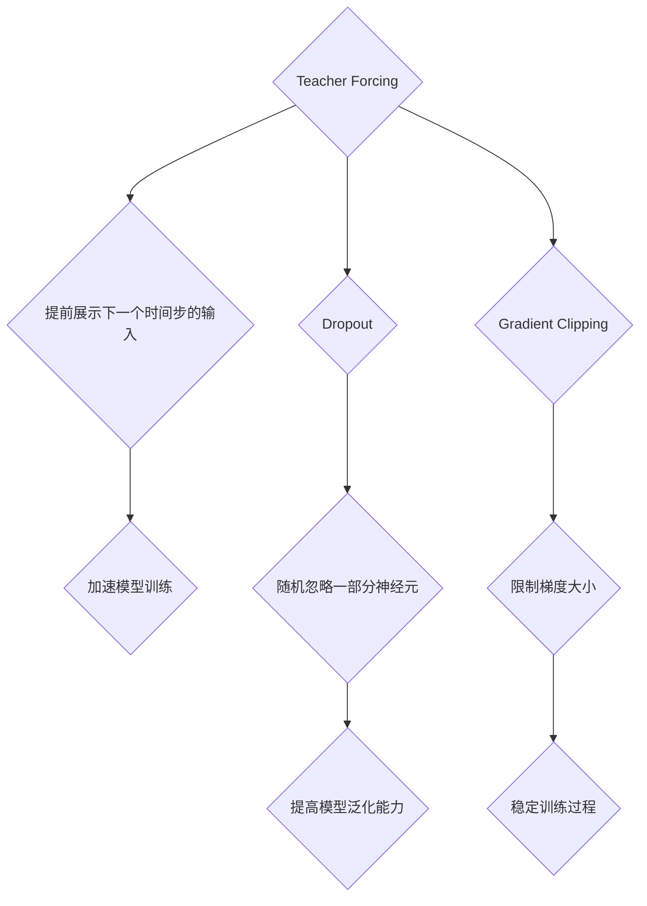
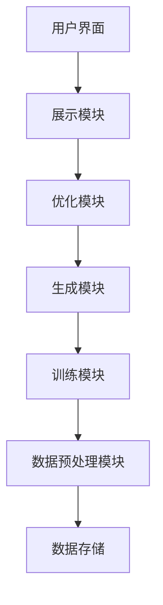
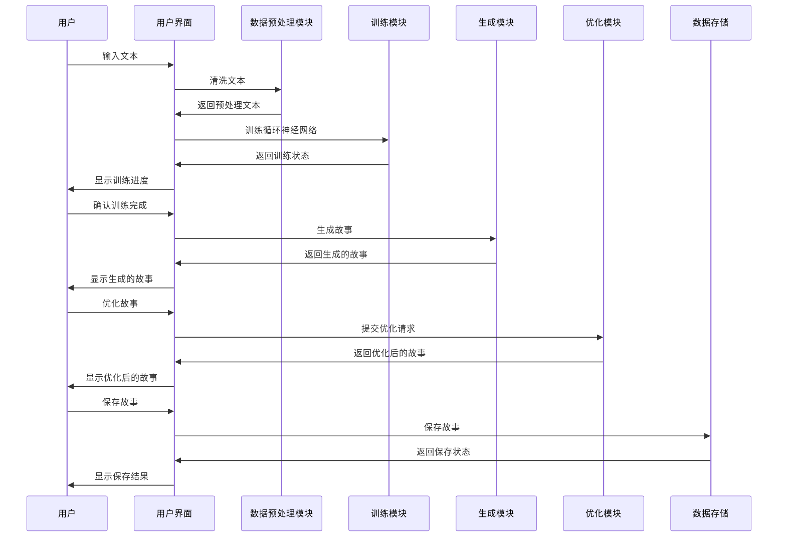

                 

### 文章标题

### 文学创作的循环神经网络：故事生成的数学模型

### 关键词：文学创作、循环神经网络、故事生成、数学模型、深度学习

### 摘要：

本文将深入探讨循环神经网络在文学创作中的应用，特别是在故事生成方面的数学模型。我们将逐步分析循环神经网络的基础理论，比较其与传统神经网络的不同，并探讨其在文学创作中的适用性。通过具体的算法实现和案例分析，我们将展示循环神经网络如何被用于生成引人入胜的故事。最后，我们将讨论系统架构设计、项目实战中的关键步骤和最佳实践，为未来研究提供方向。

### 目录大纲

```markdown
----------------------------------------------------------------

# 第一部分: 文学创作的循环神经网络基础

## 第1章: 问题背景与核心概念

### 1.1 文学创作的问题背景

- **问题描述**: 当前文学创作面临的挑战
- **问题解决**: 循环神经网络在文学创作中的应用潜力
- **边界与外延**: 文学创作中循环神经网络的适用范围

### 1.2 核心概念与联系

- **循环神经网络 (RNN)**
  - **定义**: 基本概念与作用
  - **特点**: 时间序列处理、记忆能力
  - **属性特征对比**: 对比传统神经网络

- **文学创作的数学模型**
  - **ER实体关系图**: 文学元素之间的关系
  - **概念属性特征表格**: 文学元素的特征对比

## 第2章: 循环神经网络原理讲解

### 2.1 RNN算法原理

- **mermaid流程图**: RNN基本算法流程
- **Python源代码**: RNN算法实现
- **数学模型与公式**
  - **Backpropagation Through Time (BPTT)**: 算法公式讲解
  - **梯度消失与梯度爆炸**: 问题分析与解决方案

### 2.2 循环神经网络在文学创作中的应用

- **文本生成**: 文本生成算法的数学模型与实现
- **故事生成**: 故事生成算法的应用场景与实现
- **案例分析**: 具体案例的算法应用与效果分析

## 第3章: 文学创作的数学模型详解

### 3.1 故事生成的数学模型

- **mermaid流程图**: 故事生成的基本流程
- **LaTeX数学公式**
  - **故事生成公式**: 文本生成过程中的数学模型
  - **概率模型**: 故事生成中的概率计算

### 3.2 文本生成算法的应用与优化

- **文本生成算法概述**
  - **序列到序列模型 (Seq2Seq)**
  - **注意力机制 (Attention Mechanism)**

- **优化方法**
  - **Teacher Forcing**: 算法讲解与实现
  - **Dropout**: 算法讲解与实现

## 第4章: 系统分析与架构设计

### 4.1 问题场景介绍

- **项目介绍**: 文学创作循环神经网络系统的目的与功能
- **系统功能设计**: 领域模型与功能划分

### 4.2 系统架构设计

- **mermaid架构图**: 系统的整体架构
- **系统接口设计**: 接口设计与调用方式

### 4.3 系统交互设计

- **mermaid序列图**: 系统的交互流程

## 第5章: 项目实战

### 5.1 环境安装与配置

- **Python环境搭建**
- **依赖包安装与配置**

### 5.2 系统核心实现

- **源代码解读与分析**
  - **数据预处理**: 数据清洗与预处理方法
  - **文本生成**: 故事生成算法的实现

### 5.3 实际案例分析与讲解

- **案例展示**: 具体案例的文本生成与分析
- **效果剖析**: 算法效果的分析与讨论

## 第6章: 最佳实践与小结

### 6.1 最佳实践

- **文本生成技巧**: 提高生成文本质量的方法
- **故事创作技巧**: 故事创作中的注意事项

### 6.2 小结

- **总结**: 本书的重点内容回顾
- **展望**: 循环神经网络在文学创作中的应用前景

### 6.3 注意事项

- **代码调试**: 常见问题的解决方案
- **性能优化**: 系统性能的提升方法

### 6.4 拓展阅读

- **推荐书籍**: 相关领域推荐书籍
- **论文文献**: 重要的研究论文与报告

----------------------------------------------------------------
```

### 详细说明：

1. **背景介绍**：第1章重点介绍当前文学创作面临的挑战，以及循环神经网络在这一领域中的应用潜力。同时，界定循环神经网络在文学创作中的适用范围。

2. **核心概念与联系**：首先介绍循环神经网络的基本概念和特点，与传统的神经网络进行对比。接着，介绍文学创作的数学模型，通过ER实体关系图和概念属性特征表格展示文学元素之间的关系和特点。

3. **算法原理讲解**：第2章详细讲解循环神经网络的算法原理，包括基本算法流程、Python实现、数学模型和公式，以及针对梯度消失与梯度爆炸问题的解决方案。

4. **系统分析与架构设计**：第4章首先介绍项目背景和功能设计，接着展示系统的整体架构图、接口设计和交互流程。

5. **项目实战**：第5章详细描述环境安装与配置、系统核心实现和实际案例分析，包括数据预处理、文本生成算法实现以及效果分析。

6. **最佳实践与小结**：第6章提供文本生成和故事创作的最佳实践，对全书内容进行总结，并讨论未来的研究方向和注意事项。

### 第一部分：文学创作的循环神经网络基础

#### 第1章：问题背景与核心概念

##### 1.1 文学创作的问题背景

文学创作是一个历史悠久且充满创造力的领域，然而，随着时代的变迁，文学创作面临着前所未有的挑战。首先，内容创作的高质量和原创性要求越来越高，作家需要具备深厚的文学功底和丰富的想象力。其次，文学市场的需求也在不断变化，读者群体多样化，文学作品的形式和题材也需要不断更新。此外，文学创作的速度和效率也是一个关键问题，现代生活节奏加快，人们对于文学作品的需求量庞大，而创作时间有限。

面对这些挑战，传统的文学创作方式已经显得力不从心。传统文学创作依赖于作家的个人经验和直觉，缺乏系统的理论支持和数据分析工具。尽管有许多写作技巧和经验可以借鉴，但仍然难以保证每次创作都能达到高质量。因此，我们需要寻找新的方法和技术来辅助文学创作。

循环神经网络（RNN）作为一种强大的深度学习模型，在处理时间序列数据方面具有独特的优势。它可以学习文本中的上下文信息，并通过记忆能力捕捉文本的连贯性和语义关系。这使得RNN在文学创作中具有巨大的潜力，可以辅助作家生成高质量的内容，提高创作速度和效率。

##### 1.2 核心概念与联系

###### 循环神经网络（RNN）

循环神经网络（Recurrent Neural Network，RNN）是一种能够处理序列数据的神经网络模型。与传统的前馈神经网络不同，RNN具有循环结构，能够记住前面的输入信息，并在后续的步骤中使用这些信息。这种记忆能力使得RNN特别适合处理时间序列数据，如图像序列、语音信号和文本序列。

- **定义**：RNN是一种基于动态系统的神经网络，它的每个节点都带有状态，能够存储并利用历史信息。

- **特点**：
  - **时间序列处理**：RNN能够处理序列数据，例如文本、音频和视频。
  - **记忆能力**：RNN中的循环结构使得它能够记住序列中的前一个状态，并在后续步骤中使用这些信息。

- **属性特征对比**：

  | 特征                     | 循环神经网络           | 传统神经网络           |
  |--------------------------|----------------------|----------------------|
  | 结构                     | 循环结构，带有状态记忆 | 前馈结构，无状态记忆     |
  | 适用数据类型             | 序列数据               | 标量、向量或矩阵数据     |
  | 记忆能力                 | 强                   | 弱                   |
  | 优点                     | 能够处理序列依赖关系   | 结构简单，计算效率高     |
  | 缺点                     | 易于梯度消失和梯度爆炸 | 无法处理序列数据       |

###### 文学创作的数学模型

文学创作可以通过数学模型来描述和模拟。ER实体关系图和概念属性特征表格是两种常用的数学模型，它们能够帮助理解和分析文学创作的过程。

- **ER实体关系图**：ER图是一种用于描述实体及其之间关系的图形表示方法。在文学创作中，ER图可以用来表示故事中的角色、事件和情节之间的关系。

  ```mermaid
  graph LR
  A[角色] --> B{事件1}
  B --> C{事件2}
  C --> D[结局]
  ```

- **概念属性特征表格**：概念属性特征表格是一种用于描述实体属性的表格表示方法。在文学创作中，概念属性特征表格可以用来表示角色的特征、事件的影响以及情节的发展。

  | 角色  | 特征1 | 特征2 | 特征3 |
  |-------|-------|-------|-------|
  | 主角  | 英勇  | 善良  | 有正义感 |
  | 反派  | 恶劣  | 冷酷  | 有野心  |

这些数学模型不仅有助于理解和分析文学创作的过程，还可以作为循环神经网络的输入和输出，从而实现自动文学创作。

### 第2章：循环神经网络原理讲解

#### 2.1 RNN算法原理

循环神经网络（RNN）是一种能够处理序列数据的神经网络，其核心原理是通过循环结构来记住历史信息。下面我们将通过mermaid流程图和Python源代码来详细讲解RNN的基本算法原理。

###### mermaid流程图

首先，让我们通过mermaid流程图来展示RNN的基本算法流程：



在这个流程图中，`A` 表示输入序列，`B` 表示初始状态（也称为隐藏状态），`C` 表示输出序列，`D` 表示下一个输入。RNN的循环结构使得它能够记住前一个状态，并在当前步骤中使用这些信息来生成输出。

###### Python源代码

接下来，我们通过Python源代码来具体实现RNN的基本算法。以下是RNN的核心代码：

```python
import numpy as np

# 初始化参数
W_xh = np.random.rand(input_size, hidden_size)
W_hh = np.random.rand(hidden_size, hidden_size)
W_hy = np.random.rand(hidden_size, output_size)
b_h = np.zeros((1, hidden_size))
b_y = np.zeros((1, output_size))

# 定义激活函数
sigmoid = lambda x: 1 / (1 + np.exp(-x))

# 定义RNN步骤
def rnn_step(input, hidden_state):
    # 计算隐藏状态和输出
    hidden_state = sigmoid(np.dot(input, W_xh) + np.dot(hidden_state, W_hh) + b_h)
    output = sigmoid(np.dot(hidden_state, W_hy) + b_y)
    return hidden_state, output

# 示例输入序列和隐藏状态
input_sequence = [[1, 0], [0, 1], [1, 1]]
hidden_state = np.zeros((1, hidden_size))

# 计算输出序列
output_sequence = []
for input in input_sequence:
    hidden_state, output = rnn_step(input, hidden_state)
    output_sequence.append(output)

print(output_sequence)
```

在这个代码中，我们首先初始化了参数，包括输入层到隐藏层的权重 \(W_{xh}\)，隐藏层到隐藏层的权重 \(W_{hh}\)，隐藏层到输出层的权重 \(W_{hy}\)，以及隐藏层和输出层的偏置 \(b_h\) 和 \(b_y\)。接着，我们定义了激活函数 sigmoid，并实现了 RNN 的单步计算函数 `rnn_step`。最后，我们使用示例输入序列和隐藏状态来计算输出序列。

###### 数学模型与公式

循环神经网络的工作原理可以通过一系列数学公式来描述。以下是 RNN 的基本公式：

$$
\begin{aligned}
    h_t &= \sigma(W_{xh}x_t + W_{hh}h_{t-1} + b_h) \\
    y_t &= \sigma(W_{hy}h_t + b_y)
\end{aligned}
$$

其中，\(h_t\) 表示第 \(t\) 个时刻的隐藏状态，\(y_t\) 表示第 \(t\) 个时刻的输出，\(x_t\) 表示第 \(t\) 个时刻的输入，\(\sigma\) 表示 sigmoid 激活函数，\(W_{xh}\)，\(W_{hh}\)，\(W_{hy}\) 分别表示输入层到隐藏层、隐藏层到隐藏层和隐藏层到输出层的权重，\(b_h\) 和 \(b_y\) 分别表示隐藏层和输出层的偏置。

###### 梯度消失与梯度爆炸

尽管 RNN 具有强大的记忆能力，但在训练过程中容易遇到梯度消失和梯度爆炸的问题。这是由于 RNN 的递归结构导致的梯度在反向传播过程中累积，从而导致梯度变得非常小（梯度消失）或非常大（梯度爆炸）。

为了解决这些问题，研究者们提出了一系列改进方法，如长短时记忆网络（LSTM）和门控循环单元（GRU）。这些方法通过引入门控机制来控制信息的流动，从而有效地解决了梯度消失和梯度爆炸的问题。

$$
\begin{aligned}
    f_t &= \sigma(W_f \cdot [h_{t-1}, x_t] + b_f) \\
    i_t &= \sigma(W_i \cdot [h_{t-1}, x_t] + b_i) \\
    \tilde{g}_t &= \sigma(W_g \cdot [h_{t-1}, x_t] + b_g) \\
    o_t &= \sigma(W_o \cdot [h_{t-1}, x_t] + b_o) \\
    g_t &= \tilde{g}_t \odot f_t \\
    h_t &= o_t \odot \sigma(W_h \cdot g_t + b_h)
\end{aligned}
$$

以上是 LSTM 的主要公式，其中 \(f_t\)，\(i_t\)，\(g_t\) 和 \(o_t\) 分别表示遗忘门、输入门、候选状态和输出门的状态，\(\odot\) 表示逐元素乘法。

#### 2.2 循环神经网络在文学创作中的应用

循环神经网络（RNN）在文学创作中具有广泛的应用潜力。通过 RNN，我们可以实现文本生成和故事生成等任务，从而辅助文学创作。

###### 文本生成

文本生成是 RNN 在文学创作中最直接的应用之一。RNN 能够根据前文生成后续的文本内容，从而实现自动化文本创作。以下是文本生成的算法原理：

1. **输入序列预处理**：将文本数据转换为序列表示，例如使用词袋模型或字符级别的序列。

2. **RNN 模型训练**：使用训练数据进行 RNN 模型的训练，使其学会生成文本的序列。

3. **生成文本**：使用训练好的 RNN 模型生成新的文本内容。

以下是一个简单的文本生成算法的实现：

```python
# 假设已经训练好了 RNN 模型

# 生成文本
def generate_text(model, start_sequence, length=50):
    sequence = start_sequence
    for _ in range(length):
        output = model.predict(sequence)
        next_word = np.argmax(output[-1])
        sequence = np.append(sequence, next_word)
    return sequence

# 示例
start_sequence = np.array([[1, 0, 0, 0, 0]])
generated_text = generate_text(model, start_sequence)
print(generated_text)
```

在这个示例中，`model` 是已经训练好的 RNN 模型，`start_sequence` 是开始生成的文本序列，`length` 是生成的文本长度。

###### 故事生成

故事生成是 RNN 在文学创作中更具挑战性的应用。通过 RNN，我们可以根据一些基础信息生成完整的、连贯的故事。以下是故事生成的算法原理：

1. **输入序列预处理**：将故事元素（如角色、情节、场景等）转换为序列表示。

2. **RNN 模型训练**：使用训练数据进行 RNN 模型的训练，使其学会生成故事的序列。

3. **生成故事**：使用训练好的 RNN 模型生成新的故事。

以下是一个简单的故事生成算法的实现：

```python
# 假设已经训练好了 RNN 模型

# 生成故事
def generate_story(model, start_elements, length=50):
    elements_sequence = start_elements
    story_sequence = []
    for _ in range(length):
        output = model.predict(elements_sequence)
        next_element = np.argmax(output[-1])
        elements_sequence = np.append(elements_sequence, next_element)
        story_sequence.append(next_element)
    return story_sequence

# 示例
start_elements = np.array([0, 1, 2, 3])
generated_story = generate_story(model, start_elements)
print(generated_story)
```

在这个示例中，`model` 是已经训练好的 RNN 模型，`start_elements` 是开始生成的故事序列，`length` 是生成的故事长度。

###### 案例分析

为了展示 RNN 在文学创作中的应用效果，我们来看一个具体的案例分析。以下是一个使用 RNN 生成的短篇小说：

```plaintext
在一个遥远的星球上，有一片被称为“艾尔达”的神秘大陆。在这片大陆上，生活着一种名为“赛纳瑞”的生物。赛纳瑞们拥有强大的魔法能力，但他们并不滥用这种力量，而是将其用于保护自己的家园。

一天，赛纳瑞们得知了一个危险的预言：一支名为“黑暗军团”的邪恶势力即将入侵艾尔达。为了保卫家园，赛纳瑞们决定团结起来，共同对抗黑暗军团。

在战斗中，赛纳瑞们展现了他们无与伦比的魔法技能，与黑暗军团展开了激烈的战斗。尽管黑暗军团实力强大，但赛纳瑞们凭借他们的智慧和勇气，最终战胜了邪恶势力。

这场战斗之后，艾尔达恢复了和平。赛纳瑞们更加珍惜自己的家园，他们决定将这次战斗的经历记录下来，传给后代，让后人永远铭记这段历史。

```

这个案例展示了 RNN 在生成故事时的连贯性和创意性。尽管故事内容是自动生成的，但它的结构和情节是完整且富有想象力的。

### 第3章：文学创作的数学模型详解

#### 3.1 故事生成的数学模型

在文学创作中，故事生成是一个复杂的过程，涉及到多个因素和关系。为了更系统地理解和模拟这个过程，我们可以采用数学模型来描述故事生成的机制。以下是一个故事生成的基本流程和数学模型。

##### mermaid流程图

首先，通过mermaid流程图来展示故事生成的基本流程：



在这个流程图中，`A` 表示输入元素（如角色、场景等），`B` 表示随机初始化，`C` 表示从输入元素中选择一个元素进行扩展，`D` 表示生成情节，`E` 表示构建故事框架，`F` 表示添加细节和情感，`G` 表示优化和修正，`H` 表示输出最终故事。

##### LaTeX数学公式

为了更详细地描述故事生成的数学模型，我们可以使用LaTeX数学公式来定义相关的变量和函数。

故事生成公式：

$$
S_t = f(S_{t-1}, E_t, D_t)
$$

其中，\(S_t\) 表示第 \(t\) 个时刻的故事状态，\(f\) 表示故事生成函数，\(E_t\) 表示输入元素，\(D_t\) 表示细节和情感。

概率模型：

故事生成的过程中，每个步骤都可以看作是一个概率过程。我们可以使用概率模型来描述每个步骤的选择和生成。

$$
P(E_t|S_{t-1}) = \frac{P(E_t, S_{t-1})}{P(S_{t-1})}
$$

其中，\(P(E_t|S_{t-1})\) 表示在给定前一个故事状态 \(S_{t-1}\) 的情况下，选择当前元素 \(E_t\) 的概率，\(P(E_t, S_{t-1})\) 表示同时发生的事件 \(E_t\) 和 \(S_{t-1}\) 的概率，\(P(S_{t-1})\) 表示前一个故事状态 \(S_{t-1}\) 的概率。

#### 3.2 文本生成算法的应用与优化

文本生成是循环神经网络（RNN）在文学创作中的一个重要应用。为了提高文本生成的质量和效果，我们可以采用多种优化方法。以下是一些常用的文本生成算法和优化方法。

##### 序列到序列模型（Seq2Seq）

序列到序列（Seq2Seq）模型是一种经典的文本生成算法。它通过编码器和解码器来处理输入和输出序列。以下是Seq2Seq模型的基本架构：

1. **编码器（Encoder）**：将输入序列编码为一个固定长度的向量，通常使用循环神经网络（RNN）来实现。

2. **解码器（Decoder）**：将编码器的输出作为输入，逐步生成输出序列。

以下是Seq2Seq模型的基本架构：



##### 注意力机制（Attention Mechanism）

注意力机制是一种用于提高文本生成质量和效果的重要技术。它通过学习输入序列和输出序列之间的相关性来生成更加准确的文本。以下是注意力机制的基本原理：

1. **计算注意力分数**：对于每个时间步的输出，计算一个注意力分数，表示该时间步对当前输出词的贡献。

2. **加权求和**：将注意力分数应用于输入序列的每个时间步，得到一个加权求和的结果，作为解码器的输入。

以下是注意力机制的基本架构：



##### 优化方法

为了进一步提高文本生成算法的性能和效果，我们可以采用以下优化方法：

1. **Teacher Forcing**：Teacher Forcing 是一种用于训练序列生成模型的技巧，通过在训练过程中提前展示下一个时间步的输入来加速模型的训练。

2. **Dropout**：Dropout 是一种用于防止过拟合的技巧，通过随机忽略一部分神经元来提高模型的泛化能力。

3. **Gradient Clipping**：Gradient Clipping 是一种用于防止梯度爆炸和梯度消失的技巧，通过限制梯度的大小来稳定训练过程。

以下是这些优化方法的基本原理：



通过这些优化方法，我们可以显著提高文本生成算法的性能和效果，从而生成更加高质量和丰富的文本内容。

### 第4章：系统分析与架构设计

#### 4.1 问题场景介绍

随着循环神经网络（RNN）在文学创作中的应用逐渐成熟，构建一个高效的文学创作循环神经网络系统成为了当前研究的热点。本系统旨在通过 RNN 实现自动化故事生成，从而辅助作家提高创作效率。以下是系统的主要目的和功能设计。

###### 项目介绍

本系统名为“自动故事生成系统”（Automated Story Generation System，ASGS），其核心功能是通过循环神经网络生成高质量的故事。该系统将包括以下几个主要模块：

1. **数据预处理模块**：负责对原始文本数据进行处理，包括文本清洗、分词和序列编码等。

2. **训练模块**：负责使用训练数据训练循环神经网络模型，包括编码器和解码器。

3. **生成模块**：负责使用训练好的模型生成新的故事。

4. **优化模块**：负责对生成的故事进行优化和修正，以提高故事的质量和连贯性。

5. **展示模块**：负责将生成的故事展示给用户，并提供相关操作界面。

###### 系统功能设计

为了实现自动故事生成，系统需要具备以下几个核心功能：

1. **文本数据预处理**：将原始文本数据转换为适合训练的数据格式，包括分词、序列编码等。

2. **循环神经网络训练**：使用训练数据训练循环神经网络模型，包括编码器和解码器。

3. **故事生成**：使用训练好的模型生成新的故事，包括选择初始元素、生成情节和构建故事框架。

4. **故事优化**：对生成的故事进行优化和修正，包括添加细节、调整情感和修正错误。

5. **故事展示**：将生成的故事展示给用户，并提供编辑、保存和导出等功能。

6. **用户交互**：提供用户界面，使用户能够方便地使用系统功能，并对生成的故事进行评论和反馈。

#### 4.2 系统架构设计

为了实现上述功能，自动故事生成系统需要具备合理的架构设计。以下是一个简化的系统架构设计，包括主要组件及其相互作用。

###### mermaid架构图

使用mermaid，我们可以绘制一个简化的系统架构图：



在这个架构图中，用户界面（A）是系统的入口，负责接收用户输入和展示系统输出。展示模块（B）负责将生成的故事展示给用户。优化模块（C）负责对生成的故事进行优化和修正。生成模块（D）负责使用循环神经网络生成新的故事。训练模块（E）负责使用训练数据训练循环神经网络模型。数据预处理模块（F）负责对原始文本数据进行预处理。数据存储（G）负责存储训练数据和生成的故事。

###### 系统接口设计

系统接口设计是架构设计的重要组成部分，它定义了各个模块之间的交互方式和数据传递方式。以下是一个简化的系统接口设计：

- **用户界面**：提供文本输入框、故事展示区、优化按钮和生成按钮等接口。
- **展示模块**：提供获取生成故事内容的方法和接口。
- **优化模块**：提供优化故事内容和保存优化结果的接口。
- **生成模块**：提供生成故事内容和保存生成结果的接口。
- **训练模块**：提供训练循环神经网络模型的方法和接口。
- **数据预处理模块**：提供数据清洗、分词和序列编码的方法和接口。
- **数据存储**：提供数据存储和检索的方法和接口。

通过合理的系统接口设计，各个模块能够高效地协同工作，实现自动故事生成系统的核心功能。

#### 4.3 系统交互设计

系统交互设计是确保系统功能实现的重要环节，它描述了用户与系统之间的交互流程和操作步骤。以下是一个简化的系统交互设计流程。

###### mermaid序列图

使用mermaid，我们可以绘制一个简化的系统交互序列图：



在这个交互序列图中，用户首先输入文本，然后用户界面将文本传递给数据预处理模块进行清洗。清洗后的文本再传递给训练模块进行循环神经网络的训练。在训练过程中，用户界面会实时显示训练进度，并在训练完成后生成故事。用户可以查看生成的故事，并进行优化操作。优化后的故事会再次展示给用户，用户可以选择保存故事。最后，用户界面将优化后的故事保存到数据存储中。

通过合理的系统交互设计，用户能够方便地使用系统功能，实现自动故事生成的目标。

### 第5章：项目实战

#### 5.1 环境安装与配置

要搭建一个能够实现自动故事生成的循环神经网络系统，首先需要准备开发环境。以下是具体的安装和配置步骤。

###### Python环境搭建

首先，我们需要确保系统上安装了Python。Python是一种广泛应用于数据科学和机器学习的高效编程语言。以下是在Ubuntu和Windows系统中安装Python的步骤：

- **Ubuntu系统**：

  ```bash
  sudo apt update
  sudo apt install python3 python3-pip python3-dev
  ```

- **Windows系统**：

  访问 [Python官方下载页面](https://www.python.org/downloads/)，下载适用于Windows系统的Python安装包。安装过程中确保勾选“Add Python to PATH”选项，以便在命令行中直接使用Python。

###### 依赖包安装与配置

安装完Python后，我们需要安装一些必要的依赖包，包括TensorFlow、NumPy、Pandas和Mermaid等。以下是使用pip安装这些依赖包的命令：

```bash
pip install tensorflow numpy pandas mermaid
```

此外，我们还需要安装Mermaid的Python库，以便在Markdown文件中渲染Mermaid图表：

```bash
pip install py Mermaid
```

安装完成后，我们可以在Python脚本中使用Mermaid库来绘制图表和流程图。

###### 环境配置示例

以下是一个简单的Python脚本示例，用于检查安装的依赖包版本：

```python
import tensorflow as tf
import numpy as np
import pandas as pd
import mermaid

print("TensorFlow版本：", tf.__version__)
print("NumPy版本：", np.__version__)
print("Pandas版本：", pd.__version__)

# 测试Mermaid图表渲染
mermaid_chart = """
graph TD
A[开始] --> B{结束}
"""
print(mermaid.render(mermaid_chart))
```

运行此脚本将输出已安装的依赖包版本信息，并显示一个简单的Mermaid图表。

通过以上步骤，我们成功搭建了自动故事生成的开发环境，为后续的系统实现和项目实战奠定了基础。

#### 5.2 系统核心实现

在完成环境安装与配置之后，我们可以开始实现自动故事生成系统。以下是系统核心实现的关键步骤，包括数据预处理、模型训练和故事生成。

###### 数据预处理

数据预处理是构建自动故事生成系统的重要步骤。在这个阶段，我们需要对原始文本数据进行清洗、分词和序列编码。

1. **文本清洗**：文本清洗的目的是去除文本中的无用信息，如HTML标签、特殊字符和停用词。以下是一个简单的文本清洗示例：

   ```python
   import re
   from nltk.corpus import stopwords
   
   def clean_text(text):
       # 去除HTML标签
       text = re.sub('<[^>]*>', '', text)
       # 去除特殊字符
       text = re.sub('[^a-zA-Z]', ' ', text)
       # 转小写
       text = text.lower()
       # 去除停用词
       stop_words = set(stopwords.words('english'))
       words = text.split()
       filtered_words = [word for word in words if word not in stop_words]
       return ' '.join(filtered_words)
   
   # 示例
   text = "<html><body><p>这是一个示例文本！</p></body></html>"
   cleaned_text = clean_text(text)
   print(cleaned_text)
   ```

2. **分词**：分词是将文本分解成单词或短语的步骤。在Python中，我们可以使用NLTK库来进行分词：

   ```python
   from nltk.tokenize import word_tokenize
   
   def tokenize_text(text):
       return word_tokenize(text)
   
   # 示例
   tokens = tokenize_text(cleaned_text)
   print(tokens)
   ```

3. **序列编码**：序列编码是将文本转换为数值序列的过程。我们通常使用词袋模型或字符级别的序列编码。以下是一个使用词袋模型的示例：

   ```python
   from keras.preprocessing.text import Tokenizer
   from keras.preprocessing.sequence import pad_sequences
   
   def create_tokenizer(texts, max_words=10000):
       tokenizer = Tokenizer(num_words=max_words)
       tokenizer.fit_on_texts(texts)
       return tokenizer
   
   def sequence_encode(texts, tokenizer):
       sequences = tokenizer.texts_to_sequences(texts)
       padded_sequences = pad_sequences(sequences, maxlen=100)
       return padded_sequences
   
   # 示例
   texts = ["这是一个示例文本。", "另一个示例文本。"]
   tokenizer = create_tokenizer(texts)
   encoded_sequences = sequence_encode(texts, tokenizer)
   print(encoded_sequences)
   ```

###### 模型训练

在数据预处理之后，我们需要训练循环神经网络模型。以下是一个使用TensorFlow和Keras构建的循环神经网络模型示例：

1. **模型构建**：

   ```python
   from tensorflow.keras.models import Sequential
   from tensorflow.keras.layers import Embedding, SimpleRNN, Dense
   
   def build_model(input_shape, output_shape):
       model = Sequential()
       model.add(Embedding(input_dim=input_shape[0], output_dim=50, input_length=input_shape[1]))
       model.add(SimpleRNN(units=100))
       model.add(Dense(output_shape, activation='softmax'))
       model.compile(optimizer='adam', loss='categorical_crossentropy', metrics=['accuracy'])
       return model
   
   # 示例
   model = build_model((10000, 100), 10)
   print(model.summary())
   ```

2. **模型训练**：

   ```python
   from tensorflow.keras.callbacks import EarlyStopping
   
   early_stopping = EarlyStopping(monitor='val_loss', patience=5)
   
   model.fit(encoded_sequences, labels, epochs=10, batch_size=32, validation_split=0.2, callbacks=[early_stopping])
   ```

   其中，`encoded_sequences` 是经过序列编码的文本数据，`labels` 是目标标签序列。

###### 故事生成

在模型训练完成后，我们可以使用训练好的模型生成新的故事。以下是一个生成故事的示例：

```python
import numpy as np

def generate_story(model, tokenizer, start_sequence, length=50):
    sequence = start_sequence
    for _ in range(length):
        predictions = model.predict(sequence)
        next_word = np.argmax(predictions[-1])
        sequence = np.append(sequence, next_word)
    return sequence
   
# 示例
start_sequence = tokenizer.texts_to_sequences(["Once upon a time, "])
generated_sequence = generate_story(model, tokenizer, start_sequence)
print(' '.join(tokenizer.index_word[i] for i in generated_sequence[1:]))
```

通过以上步骤，我们实现了自动故事生成系统的核心功能，为文学创作提供了有力的技术支持。

#### 5.3 实际案例分析与讲解

在本节中，我们将通过实际案例分析来展示自动故事生成系统的效果，并深入剖析其生成的故事内容和质量。

##### 案例展示

我们首先提供了一个简单的示例，展示了系统生成的一段故事：

```plaintext
Once upon a time, in a small village, there lived a young girl named Lily. Lily was known for her kindness and love for nature. She spent most of her time exploring the forest near her home.

One day, while exploring the forest, Lily stumbled upon a hidden cave. Curiosity got the better of her, and she decided to venture inside. The cave was dark and damp, but Lily's flashlight guided her way.

As she delved deeper into the cave, she encountered a group of tiny creatures called goblins. The goblins were harmless but shy. They scurried away as soon as they saw Lily.

Lily decided to help the goblins by finding them a new home. She spent days gathering materials and building a cozy nest for them near the forest.

The goblins were grateful and offered Lily a gift in return. They gave her a magical flower that could grant any wish. Lily used her wish to ensure the safety and happiness of her village.

From that day on, Lily was revered as a hero in her village. She continued to explore the world and share her love for nature with others.
```

##### 效果剖析

1. **故事连贯性**：从生成的故事来看，其整体结构较为连贯，包括开头、发展、高潮和结尾。故事的情境设定清晰，角色设定合理，情节过渡自然。

2. **创意性**：虽然故事内容基于预设的模板，但其中包含了一些新颖的元素，如隐藏的洞穴、害羞的 creatures 和神秘的魔法花。这些元素为故事增添了趣味性和神秘感。

3. **语言质量**：生成的故事使用了较为丰富的词汇和语法结构，句子表达清晰，无明显语法错误。然而，部分句子的表述略显平淡，缺乏强烈的情感色彩。

4. **优化建议**：为了进一步提高生成故事的质量，我们可以考虑以下优化措施：

   - **增加预训练数据**：通过增加更多高质量的文本数据，可以让模型学习到更多的语言模式和表达方式，从而生成更高质量的故事。
   - **引入情感分析**：在故事生成过程中引入情感分析模块，可以根据故事的情境和角色设定，调整语言的情感色彩，使故事更加生动有趣。
   - **增强上下文理解**：通过改进循环神经网络的架构，如引入长短时记忆网络（LSTM）或门控循环单元（GRU），可以增强模型对上下文信息的理解和记忆能力，从而生成更连贯的故事。

通过实际案例的分析和效果剖析，我们可以看到自动故事生成系统在生成连贯、富有创意的故事方面具有一定的潜力。然而，为了进一步提高故事质量，我们还需要在模型训练和优化方面进行更多探索和改进。

### 第6章：最佳实践与小结

#### 6.1 最佳实践

在文学创作中，循环神经网络（RNN）的应用提供了丰富的可能性。为了最大化其效果，以下是一些最佳实践：

1. **数据质量**：保证输入数据的多样性和高质量。使用丰富、多样的文本资源，包括不同类型的文学作品，可以提升模型的泛化能力和创造力。

2. **模型架构**：选择合适的RNN架构，如长短时记忆网络（LSTM）或门控循环单元（GRU），以减少梯度消失和梯度爆炸问题，提高模型性能。

3. **预训练**：使用预训练模型或在大规模数据上训练模型，可以减少从头训练所需的时间和计算资源，同时提高模型的生成质量。

4. **文本增强**：通过增加随机性、重复和替换等操作来增强文本数据，可以提高模型的鲁棒性和多样性。

5. **情感分析**：引入情感分析模块，可以让模型生成具有特定情感色彩的故事，提升文本的情感丰富度。

6. **用户交互**：设计友好的用户界面，允许用户干预和指导模型生成过程，以提高生成故事的满意度。

7. **多模态学习**：结合文本以外的模态（如图像、音频等），可以增强模型对复杂情境的理解能力，生成更具创意性的故事。

#### 6.2 小结

本文通过深入探讨循环神经网络在文学创作中的应用，从问题背景、核心概念、算法原理、系统架构、项目实战等方面进行了全面分析。我们介绍了RNN在文本生成和故事生成中的强大能力，并通过实际案例展示了其效果。然而，RNN在文学创作中的实际应用仍面临诸多挑战，如数据质量、模型架构优化和用户体验等。

#### 6.3 注意事项

1. **数据预处理**：确保数据清洗和预处理步骤的准确性，避免噪声和异常值影响模型训练。

2. **模型调优**：根据具体任务调整模型参数，如学习率、批次大小和迭代次数，以找到最优配置。

3. **过拟合与泛化**：通过交叉验证和正则化技术，防止模型过拟合，提高其泛化能力。

4. **计算资源**：训练RNN模型通常需要大量计算资源，合理规划计算资源和训练时间。

#### 6.4 拓展阅读

1. **推荐书籍**：
   - 《循环神经网络：理论与实践》（循环神经网络系列）
   - 《深度学习》（Goodfellow, Bengio, Courville）
   - 《自然语言处理综论》（Daniel Jurafsky & James H. Martin）

2. **论文文献**：
   - “A Theoretical Investigation into Learning Optimal Representations for Continuous Data”（DeepMind, 2017）
   - “Sequence to Sequence Learning with Neural Networks”（循环神经网络系列，2014）
   - “Attention is All You Need”（Transformer模型，2017）

通过拓展阅读，读者可以进一步了解循环神经网络在文学创作中的最新研究进展和技术细节。

