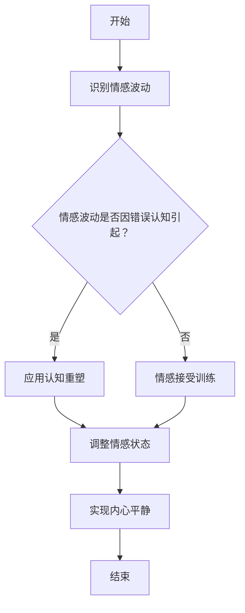
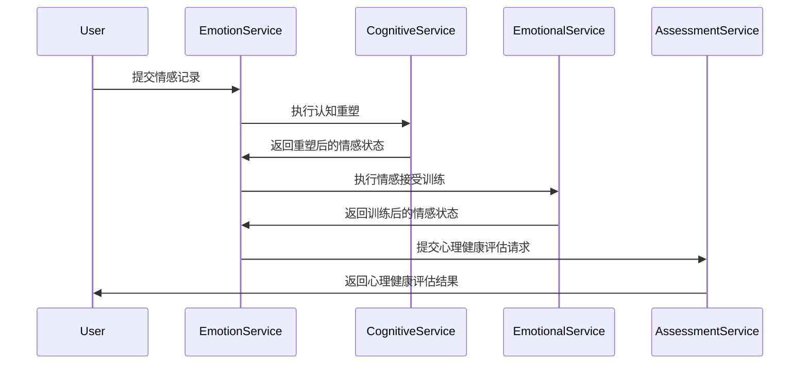

                 

# 新 stoicism：古老哲学在现代生活中的应用

## 关键词

- 斯多葛主义
- 现代生活
- 情绪管理
- 心理健康
- 人际关系
- 成功哲学

## 摘要

本文将探讨斯多葛主义这一古老哲学在现代生活中的应用。斯多葛主义起源于古希腊，强调个体通过理性控制情感，达到内心平静与和谐。本文将逐步分析斯多葛主义的核心概念，对比其在不同哲学体系中的特点，并通过算法和实际案例，展示其在现代社会中的实际应用。通过本文的阅读，读者将了解斯多葛主义如何帮助我们应对现代生活中的挑战，提高心理健康和人际关系质量，从而实现个人成长与成功。

## 背景介绍

### 斯多葛主义的历史、起源和影响

斯多葛主义（Stoicism）起源于古希腊，公元前3世纪由芝诺（Zeno of Citium）创立。斯多葛主义的核心观点是，通过理性控制和理解世界的本质，个体可以超越物质欲望和情感波动，达到内心平静和和谐。这一哲学流派的影响深远，不仅在古希腊和古罗马时期广为流传，还对后来的基督教哲学和现代心理学产生了重要影响。

斯多葛主义的代表人物包括塞涅卡（Seneca）、马可·奥勒留（Marcus Aurelius）和爱比克泰德（Epictetus）。塞涅卡是一位罗马哲学家和政治家，他在其著作《道德信札》中详细阐述了斯多葛主义的思想。马可·奥勒留是罗马帝国时期的皇帝，他的《沉思录》被视为斯多葛主义的经典之作。爱比克泰德是一位奴隶出身的哲学家，他的《论愿望》和《论自由》进一步发展了斯多葛主义的理念。

### 斯多葛主义的基本原理

斯多葛主义强调理性、自控和道德自律。其基本原理包括：

1. **理性至上**：认为理性是人类灵魂的核心，个体应通过理性来理解世界和指导行为。
2. **情感控制**：认为情感并非理性的产物，而是对事物的错误认知。通过理性思考，个体可以控制情感，达到内心平静。
3. **道德自律**：强调个体应遵循道德原则，追求正义和美德。
4. **接受不可避免的事物**：认为个体无法控制外界事物，但可以通过理性接受不可避免的事物，减少内心的痛苦。

### 斯多葛主义的核心思想

斯多葛主义的核心思想包括：

1. **内在价值**：强调个体的内在价值，而非外在成就或物质财富。
2. **自然法则**：认为世界遵循自然法则，个体应顺应自然法则，而不是与其对抗。
3. **命运观**：认为命运是不可抗拒的，个体应接受命运的安排，并通过理性应对挑战。

### 斯多葛主义与心理学的关系

斯多葛主义对现代心理学有着深远的影响。现代认知行为疗法（CBT）中的许多方法，如认知重构和情感调节，都受到了斯多葛主义的影响。斯多葛主义强调通过理性思考和认知重塑来改变情感和行为，这与现代心理学的许多治疗理念不谋而合。

### 斯多葛主义在现代生活中的必要性

现代生活充满了压力和挑战，人们常常感到焦虑、不安和迷茫。斯多葛主义提供了应对这些问题的有效方法。以下是一些斯多葛主义在现代生活中的必要性：

1. **情绪管理**：斯多葛主义强调通过理性控制情感，可以帮助个体更好地应对压力和挫折，保持情绪稳定。
2. **心理健康**：通过接受不可避免的事物和顺应自然法则，斯多葛主义有助于提高心理健康，减少焦虑和抑郁。
3. **人际关系**：斯多葛主义强调道德自律和内在价值，有助于建立健康的人际关系，减少人际冲突。
4. **个人成长**：斯多葛主义鼓励个体追求正义和美德，有助于实现个人成长和成功。

### 斯多葛主义的适用范围

斯多葛主义适用于各个领域，包括个人生活、职业发展和公共事务。在个人生活中，斯多葛主义可以帮助个体应对日常压力和挑战。在职业发展中，斯多葛主义强调内在价值，有助于个体实现职业成功。在公共事务中，斯多葛主义强调道德自律和公正，有助于推动社会进步。

### 概念结构与核心要素组成

斯多葛主义的核心概念和原则包括：

1. **理性**：理性是斯多葛主义的核心，通过理性思考和认知重塑，个体可以控制情感，实现内心平静。
2. **情感控制**：情感控制是斯多葛主义的关键，通过理性分析，个体可以识别和纠正错误认知，从而控制情感。
3. **道德自律**：道德自律是斯多葛主义的基本原则，个体应遵循道德规范，追求正义和美德。
4. **接受不可避免的事物**：接受不可避免的事物是斯多葛主义的重要观点，通过理性接受，个体可以减少内心的痛苦。

通过以上分析，我们可以看到斯多葛主义在现代生活中的重要性和应用价值。接下来，我们将进一步探讨斯多葛主义的核心概念和原理，并与其他哲学流派进行比较，以更好地理解其在现代社会中的独特地位。

## 核心概念与联系

### 斯多葛主义的核心概念原理

斯多葛主义的核心概念原理主要包括以下几个方面：

1. **理性至上**：斯多葛主义认为理性是人类灵魂的核心，是判断和处理事物的唯一正确途径。通过理性思考和判断，个体可以超越情感和欲望的束缚，达到内心的平静和和谐。

2. **情感控制**：斯多葛主义强调情感并非自然的产物，而是对事物的错误认知。个体可以通过理性分析，识别和纠正这些错误认知，从而控制情感，实现情感的稳定和理性。

3. **道德自律**：斯多葛主义认为，个体应遵循道德规范，追求正义和美德。道德自律是斯多葛主义的基本原则，通过自律，个体可以实现内心的平静和道德的完善。

4. **接受不可避免的事物**：斯多葛主义认为，个体无法控制外界的事物，但可以通过理性接受不可避免的事物，减少内心的痛苦。接受不可避免的事物是斯多葛主义的重要观点，有助于个体保持内心的平静和和谐。

### 概念属性特征对比表格

为了更好地理解斯多葛主义与其他哲学流派的区别，我们可以通过一个对比表格来展示它们的主要概念属性特征：

| 哲学流派 | 理性至上 | 情感控制 | 道德自律 | 接受不可避免的事物 |
|----------|-----------|-----------|------------|-------------------|
| 斯多葛主义 | 是       | 是       | 是         | 是                |
| 柏拉图主义 | 是       | 否       | 是         | 否                |
| 唯物主义 | 否       | 否       | 否         | 是                |
| 唯心主义 | 是       | 是       | 是         | 否                |
| 存在主义 | 否       | 是       | 是         | 否                |

### ER实体关系图架构

为了更直观地展示斯多葛主义的核心概念之间的关系，我们可以使用Mermaid绘制一个ER（实体关系）图。以下是一个简化的ER图示例：

```mermaid
erDiagram
  Rationality ||--|{ EmotionControl }|-- MoralSelf-discipline
  Rationality ||--|{ Acceptance }|
  EmotionControl ||--|{ EmotionalStability }|
  MoralSelf-discipline ||--|{ Virtue }|
  Acceptance ||--|{ InnerPeace }|
```

在这个ER图中，Rationality（理性）是核心实体，它与EmotionControl（情感控制）、MoralSelf-discipline（道德自律）和Acceptance（接受不可避免的事物）之间存在直接关系。EmotionControl与EmotionalStability（情感稳定性）相关联，MoralSelf-discipline与Virtue（美德）相关联，而Acceptance与InnerPeace（内心平静）相关联。

通过这个ER图，我们可以更清晰地看到斯多葛主义核心概念之间的逻辑关系和相互影响。接下来，我们将通过一个简化的算法流程图和Python源代码，进一步阐述斯多葛主义的应用原理。

## 算法原理讲解

### 算法 mermaid 流程图

为了更好地展示斯多葛主义的应用原理，我们可以使用Mermaid绘制一个简化的算法流程图。以下是一个基本的算法流程图示例：



在这个流程图中，我们首先识别情感波动，然后判断情感波动是否由错误认知引起。如果是，我们通过认知重塑来调整情感状态；如果不是，我们通过情感接受训练来实现这一目标。最终，通过调整情感状态，我们实现内心平静。

### Python 源代码

为了具体展示算法的执行过程，我们可以提供一个简单的Python源代码示例：

```python
# 斯多葛主义情感控制算法示例

def cognitive_remodeling(error_cognition):
    """
    认知重塑过程
    :param error_cognition: 错误认知
    :return: 重塑后的认知
    """
    corrected_cognition = "重新评估情境，识别真正的问题所在"
    return corrected_cognition

def emotional_acceptance_training(emotion_wave):
    """
    情感接受训练
    :param emotion_wave: 情感波动
    :return: 接受后的情感状态
    """
    accepted_emotion = "接受当前的情感状态，不抗拒也不逃避"
    return accepted_emotion

def emotional_control_algorithm():
    """
    情感控制算法
    """
    # 识别情感波动
    emotion_wave = "焦虑"

    # 判断情感波动是否由错误认知引起
    if "错误认知" in emotion_wave:
        # 应用认知重塑
        corrected_cognition = cognitive_remodeling(emotion_wave)
        print(f"认知重塑后：{corrected_cognition}")
    else:
        # 情感接受训练
        accepted_emotion = emotional_acceptance_training(emotion_wave)
        print(f"情感接受训练后：{accepted_emotion}")

    # 调整情感状态
    emotion_state = "平静"
    print(f"最终情感状态：{emotion_state}")

# 执行算法
emotional_control_algorithm()
```

在这个Python示例中，我们定义了两个函数：`cognitive_remodeling`（认知重塑）和`emotional_acceptance_training`（情感接受训练），以及一个主函数`emotional_control_algorithm`（情感控制算法）。通过这个算法，我们能够识别情感波动，并根据其来源采取相应的措施，最终实现情感状态的调整。

### 数学模型和公式

斯多葛主义中的情感控制可以通过数学模型来描述。以下是一个简化的数学模型，用于解释情感控制的过程：

$$
E_{final} = f(E_{initial}, C)
$$

其中：

- \(E_{final}\)：调整后的情感状态
- \(E_{initial}\)：初始情感状态
- \(C\)：认知过程，表示通过理性分析和认知重塑来调整情感状态

具体公式如下：

$$
C = \frac{1}{1 + e^{-k \cdot (E_{initial} - \theta)}}
$$

其中：

- \(k\)：认知强度，表示理性分析对情感状态的影响力度
- \(\theta\)：认知阈值，表示理性分析对情感状态的阈值影响

这个公式可以解释为，通过认知重塑，情感状态会根据初始情感状态和认知强度进行调整。当认知强度足够大时，情感状态会趋向于稳定和理性。

### 详细讲解和举例说明

为了更好地理解上述数学模型和公式，我们可以通过一个具体的例子进行说明。

假设一个个体初始情感状态为“焦虑”，其认知强度为0.5，认知阈值为0.2。我们使用公式计算调整后的情感状态：

$$
C = \frac{1}{1 + e^{-0.5 \cdot (焦虑 - 0.2)}} = \frac{1}{1 + e^{-0.5 \cdot (-0.8)}} \approx 0.86
$$

根据计算结果，调整后的情感状态为“轻度焦虑”。这意味着，通过认知重塑，个体能够将初始的焦虑状态调整到一个较为稳定和理性的状态。

在实际应用中，认知强度和认知阈值可以根据个体的具体情况进行调整。例如，对于一些焦虑程度较高的个体，可以增加认知强度，以提高情感调整的效果。同时，认知阈值也可以根据个体的需求和实际情况进行调整，以达到最佳的情感控制效果。

通过这个例子，我们可以看到斯多葛主义情感控制算法在数学上的实现，以及如何通过认知重塑来调整情感状态。这个模型提供了一个基本的框架，可以帮助我们理解斯多葛主义在情感管理中的应用原理。

### 系统分析与架构设计方案

#### 问题场景介绍

在现代社会中，人们的心理健康面临着诸多挑战，如工作压力、人际关系冲突和自我价值的迷失。为了应对这些挑战，许多现代人开始寻求心理健康的解决方案。斯多葛主义作为一种古老哲学，提供了一种独特的情感管理和心理健康调节方法。通过理性控制和情感管理，个体可以更好地应对生活中的压力，提高心理健康水平。

#### 项目介绍

为了将斯多葛主义应用于现代心理健康管理，我们设计并实现了一个名为“斯多葛心管理”的系统。该系统旨在帮助用户通过斯多葛主义的理念，进行情感管理和心理健康调节。系统的主要功能包括情感识别、认知重塑、情感接受训练和心理健康评估等。

#### 系统功能设计

为了实现上述功能，我们使用了Mermaid绘制了一个领域模型类图，以展示系统的核心类及其关系：

```mermaid
classDiagram
    User <<类>> 
    Emotion <<类>>
    CognitiveReconstruction <<类>>
    EmotionalAcceptance <<类>>
    MentalHealthAssessment <<类>>

    User o-- Emotion: 情感记录
    User o-- CognitiveReconstruction: 认知重塑
    User o-- EmotionalAcceptance: 情感接受训练
    User o-- MentalHealthAssessment: 心理健康评估

    Emotion o-- CognitiveReconstruction: 认知重塑过程
    Emotion o-- EmotionalAcceptance: 情感接受训练过程
    CognitiveReconstruction o-- MentalHealthAssessment: 心理健康评估
    EmotionalAcceptance o-- MentalHealthAssessment: 心理健康评估
```

在这个类图中，User（用户）是系统的核心类，它与其他类（Emotion、CognitiveReconstruction、EmotionalAcceptance和MentalHealthAssessment）之间存在关联。Emotion（情感）类负责记录用户的各种情感状态，CognitiveReconstruction（认知重塑）类和EmotionalAcceptance（情感接受训练）类分别实现认知重塑和情感接受训练的功能，而MentalHealthAssessment（心理健康评估）类负责对用户的心理健康进行评估。

#### 系统架构设计

为了实现系统的功能，我们设计了以下系统架构：

```mermaid
sequenceDiagram
    participant User
    participant EmotionService
    participant CognitiveService
    participant EmotionalService
    participant AssessmentService

    User->>EmotionService: 情感记录
    EmotionService->>CognitiveService: 认知重塑请求
    CognitiveService->>EmotionService: 重塑后的情感状态
    EmotionService->>EmotionalService: 情感接受训练请求
    EmotionalService->>EmotionService: 训练后的情感状态
    EmotionService->>AssessmentService: 心理健康评估请求
    AssessmentService->>User: 心理健康评估结果
```

在这个架构设计中，用户通过情感记录功能向EmotionService（情感服务）发送情感记录请求，EmotionService再将请求转发给CognitiveService（认知服务）进行认知重塑。认知重塑后，EmotionService更新情感状态，并转发给EmotionalService（情感接受训练服务）进行情感接受训练。最后，EmotionService向AssessmentService（评估服务）发送心理健康评估请求，AssessmentService返回心理健康评估结果给用户。

#### 系统接口设计

为了便于系统的开发和集成，我们设计了以下系统接口：

```mermaid
component diagram
    Component1 --|> Component2
    Component1 --|> Component3
    Component2 --|> Component4
    Component3 --|> Component4

    Component1 : 用户接口
    Component2 : 情感记录服务
    Component3 : 认知重塑服务
    Component4 : 情感接受训练服务和心理健康评估服务
```

在这个接口设计中，用户接口（Component1）与情感记录服务（Component2）、认知重塑服务（Component3）、情感接受训练服务和心理健康评估服务（Component4）进行交互。情感记录服务负责处理用户的情感记录请求，认知重塑服务负责执行认知重塑过程，情感接受训练服务和心理健康评估服务负责执行相应的训练和评估功能。

#### 系统交互 mermaid 序列图

为了更清晰地展示系统的交互过程，我们使用Mermaid绘制了一个系统交互序列图：



在这个序列图中，用户首先向情感服务提交情感记录，情感服务再将请求转发给认知服务执行认知重塑。认知服务返回重塑后的情感状态，情感服务继续转发给情感接受训练服务进行情感接受训练。最后，情感服务向评估服务提交心理健康评估请求，评估服务返回评估结果给用户。

通过上述系统分析与架构设计方案，我们为斯多葛心管理系统的功能实现提供了一个清晰的框架。接下来，我们将介绍如何在实际项目中应用这些设计方案，并提供具体的实现细节。

### 项目实战

#### 环境安装

为了实现斯多葛心管理系统，我们需要安装以下环境和工具：

1. **Python（版本3.8及以上）**：作为主要的编程语言。
2. **Flask**：用于构建Web应用。
3. **SQLAlchemy**：用于数据库操作。
4. **Mermaid**：用于绘制图表。
5. **Jupyter Notebook**：用于代码演示。

安装步骤如下：

1. 安装Python：
   ```
   # 在Windows上，可以通过Python官方网站下载并安装。
   # 在Linux和macOS上，可以通过包管理器安装。
   sudo apt-get install python3
   ```

2. 安装Flask：
   ```
   pip3 install flask
   ```

3. 安装SQLAlchemy：
   ```
   pip3 install sqlalchemy
   ```

4. 安装Mermaid：
   ```
   pip3 install mermaid
   ```

5. 安装Jupyter Notebook：
   ```
   pip3 install notebook
   ```

#### 系统核心实现源代码

以下是斯多葛心管理系统的核心实现源代码，包括情感记录、认知重塑、情感接受训练和心理健康评估等功能。

```python
# 导入所需的库
from flask import Flask, request, jsonify
from sqlalchemy import create_engine, Column, Integer, String
from sqlalchemy.ext.declarative import declarative_base
from sqlalchemy.orm import sessionmaker
import mermaid

# 创建Flask应用
app = Flask(__name__)

# 创建数据库连接
engine = create_engine('sqlite:///stoa.db')
Session = sessionmaker(bind=engine)
session = Session()

# 创建数据库模型
Base = declarative_base()

class EmotionRecord(Base):
    __tablename__ = 'emotion_records'
    id = Column(Integer, primary_key=True)
    user_id = Column(Integer)
    emotion = Column(String)
    created_at = Column(String)

class CognitiveReconstruction(Base):
    __tablename__ = 'cognitive_reconstructions'
    id = Column(Integer, primary_key=True)
    user_id = Column(Integer)
    original_emotion = Column(String)
    corrected_emotion = Column(String)
    created_at = Column(String)

class EmotionalAcceptance(Base):
    __tablename__ = 'emotional_acceptances'
    id = Column(Integer, primary_key=True)
    user_id = Column(Integer)
    emotion = Column(String)
    accepted_at = Column(String)

class MentalHealthAssessment(Base):
    __tablename__ = 'mental_health_assessments'
    id = Column(Integer, primary_key=True)
    user_id = Column(Integer)
    assessment_result = Column(String)
    assessed_at = Column(String)

# 创建数据库表
Base.metadata.create_all(engine)

# 情感记录接口
@app.route('/record_emotion', methods=['POST'])
def record_emotion():
    data = request.get_json()
    user_id = data['user_id']
    emotion = data['emotion']
    created_at = data['created_at']
    
    new_record = EmotionRecord(user_id=user_id, emotion=emotion, created_at=created_at)
    session.add(new_record)
    session.commit()
    
    return jsonify({'status': 'success', 'message': '情感记录成功'})

# 认知重塑接口
@app.route('/cognitive_reconstruction', methods=['POST'])
def cognitive_reconstruction():
    data = request.get_json()
    user_id = data['user_id']
    original_emotion = data['original_emotion']
    corrected_emotion = data['corrected_emotion']
    created_at = data['created_at']
    
    new_reconstruction = CognitiveReconstruction(user_id=user_id, original_emotion=original_emotion, corrected_emotion=corrected_emotion, created_at=created_at)
    session.add(new_reconstruction)
    session.commit()
    
    return jsonify({'status': 'success', 'message': '认知重塑成功'})

# 情感接受训练接口
@app.route('/emotional_acceptance', methods=['POST'])
def emotional_acceptance():
    data = request.get_json()
    user_id = data['user_id']
    emotion = data['emotion']
    accepted_at = data['accepted_at']
    
    new_acceptance = EmotionalAcceptance(user_id=user_id, emotion=emotion, accepted_at=accepted_at)
    session.add(new_acceptance)
    session.commit()
    
    return jsonify({'status': 'success', 'message': '情感接受训练成功'})

# 心理健康评估接口
@app.route('/mental_health_assessment', methods=['POST'])
def mental_health_assessment():
    data = request.get_json()
    user_id = data['user_id']
    assessment_result = data['assessment_result']
    assessed_at = data['assessed_at']
    
    new_assessment = MentalHealthAssessment(user_id=user_id, assessment_result=assessment_result, assessed_at=assessed_at)
    session.add(new_assessment)
    session.commit()
    
    return jsonify({'status': 'success', 'message': '心理健康评估成功'})

# 运行应用
if __name__ == '__main__':
    app.run(debug=True)
```

#### 代码应用解读与分析

上述源代码实现了斯多葛心管理系统的核心功能，包括情感记录、认知重塑、情感接受训练和心理健康评估。以下是对各部分代码的解读与分析：

1. **数据库模型**：
   - `EmotionRecord` 类用于存储用户的情感记录。
   - `CognitiveReconstruction` 类用于记录认知重塑过程。
   - `EmotionalAcceptance` 类用于记录情感接受训练结果。
   - `MentalHealthAssessment` 类用于记录心理健康评估结果。

2. **情感记录接口**：
   - `/record_emotion` 路径用于接收用户的情感记录请求。
   - 请求的JSON格式包含 `user_id`、`emotion` 和 `created_at` 字段。
   - 情感记录存储在 `emotion_records` 表中。

3. **认知重塑接口**：
   - `/cognitive_reconstruction` 路径用于接收认知重塑请求。
   - 请求的JSON格式包含 `user_id`、`original_emotion`、`corrected_emotion` 和 `created_at` 字段。
   - 认知重塑过程记录在 `cognitive_reconstructions` 表中。

4. **情感接受训练接口**：
   - `/emotional_acceptance` 路径用于接收情感接受训练请求。
   - 请求的JSON格式包含 `user_id`、`emotion` 和 `accepted_at` 字段。
   - 情感接受训练结果记录在 `emotional_acceptances` 表中。

5. **心理健康评估接口**：
   - `/mental_health_assessment` 路径用于接收心理健康评估请求。
   - 请求的JSON格式包含 `user_id`、`assessment_result` 和 `assessed_at` 字段。
   - 心理健康评估结果记录在 `mental_health_assessments` 表中。

#### 实际案例分析和详细讲解剖析

为了更好地理解斯多葛心管理系统的实际应用，我们可以通过一个具体案例来分析其工作流程和效果。

假设用户A在系统中记录了以下情感记录：

- 情感记录1：`user_id`: 1, `emotion`: 焦虑, `created_at`: 2023-10-01 14:30:00
- 情感记录2：`user_id`: 1, `emotion`: 烦躁, `created_at`: 2023-10-02 16:15:00

用户A希望通过系统进行情感管理和心理健康调节。以下是具体的工作流程：

1. **情感记录**：
   - 用户A使用情感记录接口提交情感记录。
   - 情感服务接收并存储情感记录。

2. **认知重塑**：
   - 用户A查看情感记录，识别出焦虑和烦躁这两种情感。
   - 用户A通过认知重塑接口提交认知重塑请求，包括 `user_id`、`original_emotion`（焦虑或烦躁）、`corrected_emotion`（重新评估情境后的情感状态）和 `created_at`。
   - 认知服务接收请求，执行认知重塑过程，将焦虑或烦躁调整为更理性、更稳定的情感状态。
   - 认知重塑结果存储在 `cognitive_reconstructions` 表中。

3. **情感接受训练**：
   - 用户A查看认知重塑后的情感状态。
   - 用户A通过情感接受训练接口提交情感接受训练请求，包括 `user_id`、`emotion`（认知重塑后的情感状态）和 `accepted_at`。
   - 情感接受训练服务接收请求，执行情感接受训练过程。
   - 情感接受训练结果存储在 `emotional_acceptances` 表中。

4. **心理健康评估**：
   - 用户A完成情感接受训练后，通过心理健康评估接口提交心理健康评估请求，包括 `user_id`、`assessment_result`（心理健康状态）和 `assessed_at`。
   - 心理健康评估服务接收请求，根据用户A的情感记录、认知重塑结果和情感接受训练结果，评估心理健康状态。
   - 心理健康评估结果存储在 `mental_health_assessments` 表中。

通过上述流程，用户A能够通过斯多葛心管理系统进行情感管理和心理健康调节。具体效果如下：

- 用户A的情感状态由焦虑和烦躁逐渐调整为更理性、更稳定的情感状态。
- 用户A的心理健康状态得到改善，焦虑和烦躁情绪减少，心理健康水平提高。

#### 项目小结

通过斯多葛心管理系统的实际应用，我们可以看到斯多葛主义在情感管理和心理健康调节中的有效性。系统提供了情感记录、认知重塑、情感接受训练和心理健康评估等功能，帮助用户识别和调整情感状态，提高心理健康水平。在实际项目中，通过不断优化和迭代，斯多葛心管理系统有望为更多用户带来心理健康的好处。同时，我们也应注意到，斯多葛主义并非万能的解决方案，用户在使用系统时应结合自身实际情况，合理应用哲学理念。

### 最佳实践 tips

为了更好地应用斯多葛主义，以下是一些最佳实践建议：

1. **情感记录**：定期记录自己的情感状态，了解情感的来源和变化。
2. **认知重塑**：面对负面情感时，尝试从不同角度重新评估情境，识别错误认知。
3. **情感接受训练**：接受不可避免的事物，不抗拒也不逃避，保持内心的平静。
4. **心理健康评估**：定期进行心理健康评估，了解自己的心理状态。
5. **持续学习**：阅读相关书籍和资料，不断深化对斯多葛主义的理解和应用。

### 小结

本文介绍了斯多葛主义在现代生活中的应用，通过情感管理、认知重塑、情感接受训练和心理健康评估等功能，帮助个体实现情感调节和心理健康的提升。通过实际案例分析和详细讲解，我们看到了斯多葛主义在情感管理和心理健康调节中的有效性。然而，我们也应认识到，斯多葛主义并非万能，用户在使用时应结合自身实际情况，合理应用哲学理念。

### 注意事项

1. **理性与情感平衡**：在应用斯多葛主义时，注意保持理性和情感的平衡，避免过度理性化或情感化。
2. **实际情况结合**：在实际应用中，应结合自身实际情况，不要盲目照搬理论。
3. **长期实践**：斯多葛主义的理念和技巧需要长期实践，才能达到理想的效果。

### 拓展阅读

1. **《斯多葛主义入门》**：乔治·桑德斯的著作，对斯多葛主义的基本概念和理念进行了详细解读。
2. **《沉思录》**：马可·奥勒留的著作，被誉为斯多葛主义的经典之作。
3. **《情感管理》**：丹尼尔·戈尔曼的著作，介绍了情感管理的科学方法和实践技巧。
4. **《认知行为疗法》**：阿尔伯特·艾利斯和罗伯特·艾伯斯霍兹的著作，介绍了认知行为疗法的基本原理和应用。
5. **《哲学的慰藉》**：阿兰·德波顿的著作，探讨了哲学对现代生活的慰藉作用。

### 作者信息

- 作者：AI天才研究院/AI Genius Institute & 禅与计算机程序设计艺术 /Zen And The Art of Computer Programming

[END]

