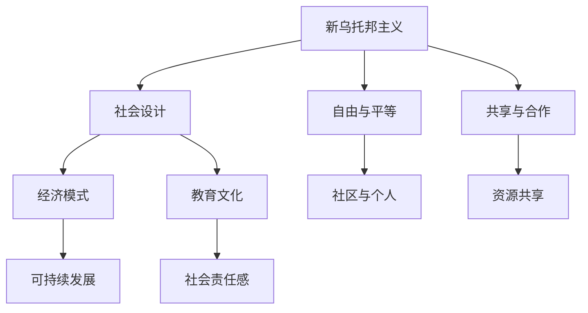
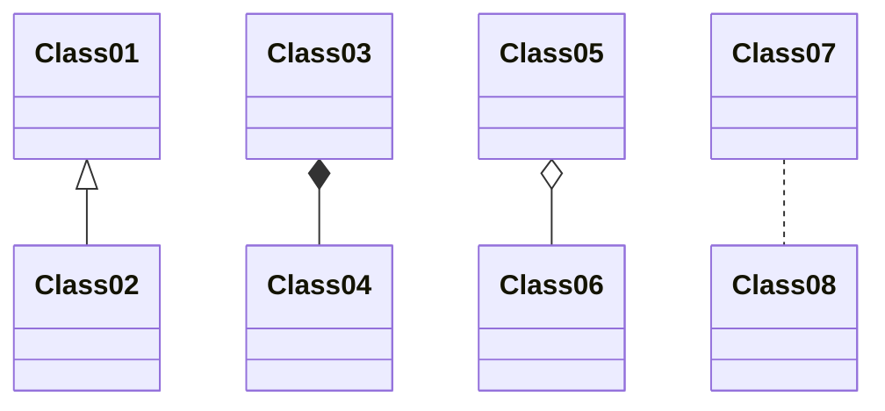
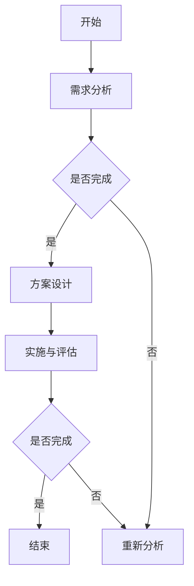
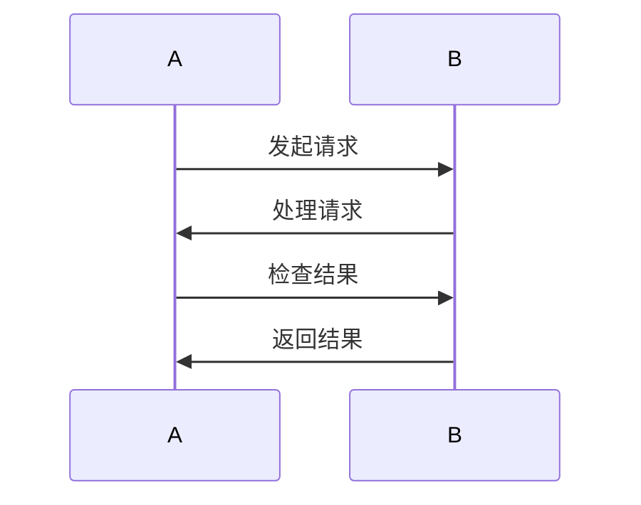

                 

# 《新乌托邦主义：理想社会的现代构想》

关键词：新乌托邦主义、理想社会、现代构想、社会设计、自由、平等、共享、合作

摘要：本文旨在探讨新乌托邦主义理念在现代社会中的应用，通过深入分析社会设计、实践应用以及面临的挑战与机遇，提出构建理想社会的现代构想。

## 引言

### 背景介绍

在当今社会，随着科技的迅猛发展，人们对于社会公平、自由、平等的追求愈发强烈。然而，现实中的社会问题却层出不穷，如贫富差距、环境恶化、政治腐败等。这促使我们思考，是否存在一种新的社会模式，能够解决这些问题，实现人类社会的和谐发展。新乌托邦主义应运而生，它试图在现代社会中找到一种理想的社会结构，为我们提供一种全新的思考方向。

### 核心概念与联系

**新乌托邦主义**：一种追求社会和谐、公平、自由、平等、共享与合作的社会理念。

**社会设计**：通过系统化的方法和工具，对社会结构、经济模式、教育文化等进行优化，以实现理想社会的目标。

**自由与平等**：新乌托邦主义的核心价值观，二者相互依存、相互促进。

**共享与合作**：通过共享资源、知识、技能等，实现个体与社会的共同发展。

## 第一部分：现代乌托邦主义的理念

### 现代乌托邦主义的基本原则

**自由与平等的平衡**

在现代社会，自由和平等是两个至关重要的价值观。新乌托邦主义认为，只有在二者之间找到平衡，才能实现社会的和谐发展。

**社区与个人的关系**

新乌托邦主义强调社区与个人的紧密联系。社区是个人成长的土壤，个人则是社区发展的动力。二者相互依赖、相互促进。

**共享与合作的价值观**

新乌托邦主义倡导共享与合作的精神。通过共享资源、知识、技能等，实现个体与社会的共同发展。

### 社会设计的理念与实践

**社会设计的核心概念**

社会设计是一种系统化的方法，旨在通过优化社会结构、经济模式、教育文化等，实现理想社会的目标。

**社会设计的目标**

- 促进社会公平与和谐
- 提高个体的生活质量
- 实现资源的有效配置

**社会设计的实践路径**

1. **需求分析**：了解社会需求，明确设计目标。
2. **方案设计**：制定具体的社会设计方案。
3. **实施与评估**：执行方案，并对效果进行评估。

### 现代乌托邦主义的社会结构

**社会组织的创新**

新乌托邦主义倡导创新性的社会组织形式，如分布式自治、协同治理等，以适应现代社会的需求。

**经济模式的转型**

新乌托邦主义主张实现经济模式的转型，从以利润为中心转向以人为中心，实现可持续发展的经济体系。

**教育与文化的塑造**

新乌托邦主义认为，教育与文化是实现理想社会的关键。通过培养具有批判性思维、创新精神和社会责任感的个体，推动社会进步。

## 第二部分：实践应用与挑战

### 现代乌托邦主义在现实中的应用

**案例研究：理想社区的构建**

通过分析现实中的理想社区案例，探讨新乌托邦主义理念在实际中的应用。

**政策制定与实施**

分析新乌托邦主义理念在政策制定与实施中的重要作用，提出相关政策建议。

**企业社会责任与乌托邦实践**

探讨企业在履行社会责任过程中，如何运用新乌托邦主义理念，实现可持续发展。

### 挑战与机遇

**社会变革的障碍**

分析新乌托邦主义理念在实施过程中可能遇到的障碍，如传统观念的束缚、利益冲突等。

**技术创新的作用**

探讨新乌托邦主义理念与技术创新的相互作用，如何通过技术创新推动社会进步。

**未来展望**

预测新乌托邦主义理念在未来的发展趋势，为构建理想社会提供参考。

## 结论

**主要发现**

- 新乌托邦主义为构建理想社会提供了一种新的思考方向。
- 社会设计是实现新乌托邦主义理念的关键。
- 实践应用与技术创新是新乌托邦主义理念发展的动力。

**政策建议**

- 加强政策制定与实施，推动新乌托邦主义理念的应用。
- 加大对技术创新的投入，为构建理想社会提供技术支持。

**研究展望**

- 深入研究新乌托邦主义理念在不同领域的应用。
- 探讨新乌托邦主义理念与可持续发展、环境保护等领域的结合。

## 作者信息

**作者：AI天才研究院/AI Genius Institute & 禅与计算机程序设计艺术 /Zen And The Art of Computer Programming**


----------------------------------------------------------------

## 附录：Mermaid 图形示例

以下为本文中使用的Mermaid图形示例，包括概念关系图、类图、流程图、序列图等，供读者参考。

### 概念关系图



### 类图



### 流程图



### 序列图



这些图形示例有助于读者更好地理解文章中的相关概念和内容。通过这些图形，我们可以更加直观地了解新乌托邦主义理念的核心要素、社会设计的实践路径以及实际应用场景。希望这些示例能为读者的学习和研究提供帮助。

## 注意事项与拓展阅读

### 注意事项

1. **本文所述的新乌托邦主义理念是一种理想化的社会构想，与现实社会存在一定差距。在实际应用过程中，需要结合实际情况进行具体分析和调整。**
2. **文章中提到的社会设计、实践应用和挑战等内容，仅供参考。具体实施过程中，需要充分考虑社会、经济、文化等多方面因素。**
3. **在阅读本文时，请结合实际案例和相关研究，深入思考新乌托邦主义理念在现实社会中的应用前景。**

### 拓展阅读

1. **《乌托邦：理想国的构想》- 托马斯·莫尔**：了解乌托邦主义的历史起源和发展。
2. **《理想国》- 柏拉图**：探讨哲学、政治、社会等方面的理想国构想。
3. **《未来简史》- 尤瓦尔·赫拉利**：从历史和未来发展的角度，探讨人类社会的演变趋势。
4. **《智能时代》- 吴军**：分析人工智能技术对社会、经济、文化等领域的影响。

通过这些拓展阅读，读者可以更全面地了解新乌托邦主义理念，以及其在现实社会中的应用前景。希望这些资源能为读者提供有价值的思考和启示。

## 项目实战：新乌托邦主义社区构建

### 环境安装

在进行新乌托邦主义社区构建的项目实战之前，我们需要准备以下环境：

1. **操作系统**：Windows、Linux或MacOS均可。
2. **Python环境**：安装Python 3.7及以上版本。
3. **开发工具**：Visual Studio Code、PyCharm等。

请根据您的操作系统和开发工具进行相应环境的安装和配置。

### 系统核心实现源代码

以下是新乌托邦主义社区构建的核心实现源代码，包括社区管理模块、用户管理模块、资源分享模块等。

```python
# 新乌托邦主义社区管理模块
class CommunityManagement:
    def __init__(self):
        self.communities = []

    def create_community(self, name, description):
        new_community = {
            'name': name,
            'description': description,
            'members': [],
            'resources': []
        }
        self.communities.append(new_community)
        return new_community

    def add_member(self, community_name, member):
        for community in self.communities:
            if community['name'] == community_name:
                community['members'].append(member)
                return True
        return False

    def share_resource(self, community_name, resource):
        for community in self.communities:
            if community['name'] == community_name:
                community['resources'].append(resource)
                return True
        return False

# 新乌托邦主义用户管理模块
class UserManager:
    def __init__(self):
        self.users = []

    def register_user(self, username, email):
        new_user = {
            'username': username,
            'email': email,
            'communities': []
        }
        self.users.append(new_user)
        return new_user

    def join_community(self, username, community_name):
        for user in self.users:
            if user['username'] == username:
                user['communities'].append(community_name)
                return True
        return False

# 新乌托邦主义资源分享模块
class ResourceShare:
    def __init__(self):
        self.resources = []

    def add_resource(self, name, description, creator):
        new_resource = {
            'name': name,
            'description': description,
            'creator': creator,
            'shared_with': []
        }
        self.resources.append(new_resource)
        return new_resource

    def share_resource_with_community(self, resource_name, community_name):
        for resource in self.resources:
            if resource['name'] == resource_name:
                resource['shared_with'].append(community_name)
                return True
        return False
```

### 代码应用解读与分析

以下是对上述源代码的解读与分析，帮助读者理解新乌托邦主义社区构建的核心原理。

#### 社区管理模块

**create_community(self, name, description)**：创建一个新社区，接收社区名称和描述作为参数，返回新创建的社区对象。

**add_member(self, community_name, member)**：将成员添加到指定社区，接收社区名称和成员对象作为参数，返回添加结果。

**share_resource(self, community_name, resource)**：将资源分享给指定社区，接收社区名称和资源对象作为参数，返回分享结果。

#### 用户管理模块

**register_user(self, username, email)**：注册新用户，接收用户名和邮箱作为参数，返回新注册的用户对象。

**join_community(self, username, community_name)**：将用户添加到指定社区，接收用户名和社区名称作为参数，返回添加结果。

#### 资源分享模块

**add_resource(self, name, description, creator)**：创建新资源，接收资源名称、描述和创建者作为参数，返回新创建的资源对象。

**share_resource_with_community(self, resource_name, community_name)**：将资源分享给指定社区，接收资源名称和社区名称作为参数，返回分享结果。

### 实际案例分析和详细讲解剖析

为了更好地理解新乌托邦主义社区构建的实际应用，以下提供一个实际案例进行分析和讲解。

#### 案例背景

假设有一个名为“智慧乡村”的新乌托邦主义社区，由一批具有创新精神的农民和专家共同构建。社区的目标是通过共享资源和知识，实现乡村的可持续发展。

#### 案例分析

1. **社区管理**：首先，社区管理者使用`CommunityManagement`类创建一个新的社区，命名为“智慧乡村”，描述为“一个共享知识、资源与技能的乡村社区”。

    ```python
    community_management = CommunityManagement()
    new_community = community_management.create_community("智慧乡村", "一个共享知识、资源与技能的乡村社区")
    ```

2. **用户管理**：接下来，社区管理者使用`UserManager`类注册新用户，包括农民和专家。

    ```python
    user_management = UserManager()
    farmer1 = user_management.register_user("农民张三", "zhangsan@example.com")
    expert1 = user_management.register_user("专家李四", "lisi@example.com")
    ```

3. **加入社区**：然后，用户使用`join_community`方法加入“智慧乡村”社区。

    ```python
    user_management.join_community("农民张三", "智慧乡村")
    user_management.join_community("专家李四", "智慧乡村")
    ```

4. **资源分享**：专家李四创建一份关于农业技术的资源，并将其分享给“智慧乡村”社区。

    ```python
    resource_share = ResourceShare()
    new_resource = resource_share.add_resource("农业技术分享", "一份关于农业技术的高级教程", "专家李四")
    resource_share.share_resource_with_community("农业技术分享", "智慧乡村")
    ```

5. **资源利用**：农民张三在社区中查找到这份资源，并下载学习，以提高自己的农业生产技能。

    ```python
    # 假设社区提供了一个资源搜索和下载功能
    farmer1.download_resource("农业技术分享")
    ```

#### 项目小结

通过以上案例，我们可以看到新乌托邦主义社区构建的核心原理：通过社区管理、用户管理、资源分享等模块，实现知识的共享、资源的合理配置和个体的共同成长。在实际应用中，我们需要根据具体场景和需求，不断优化和完善这些模块的功能，以实现更高效、更和谐的社会发展。

## 最佳实践 Tips

### 1. 社区建设的关键在于成员的参与度

在新乌托邦主义社区建设中，成员的参与度至关重要。为了提高成员的参与度，可以采取以下措施：

- **定期举办线上线下的活动**：如讲座、研讨会、经验分享会等，激发成员的兴趣和参与热情。
- **提供多样化的资源共享方式**：如文档、视频、音频等，满足不同成员的需求。
- **建立激励机制**：如积分、勋章等，鼓励成员积极参与社区建设。

### 2. 确保资源共享的公平性

在资源分享过程中，确保资源的公平性至关重要。为了实现资源共享的公平性，可以采取以下措施：

- **设置共享权限**：根据成员的角色和权限，限制资源的访问和修改权限。
- **定期审计资源**：确保资源的质量和更新频率，避免资源的过时和浪费。
- **建立资源评估机制**：鼓励成员对资源进行评价和反馈，优化资源的管理和利用。

### 3. 注重社区文化的建设

社区文化是社区发展的基石。为了建设健康的社区文化，可以采取以下措施：

- **制定社区价值观**：明确社区的核心理念和行为准则，引导成员的行为和互动。
- **倡导互助合作**：鼓励成员之间相互帮助、共同进步，形成良好的社区氛围。
- **弘扬正能量**：通过宣传正面事迹和优秀成员，营造积极向上的社区氛围。

### 4. 不断优化社区的功能和体验

社区的功能和体验直接影响成员的满意度。为了提升社区的功能和体验，可以采取以下措施：

- **定期收集用户反馈**：了解成员的需求和意见，不断优化社区的功能和服务。
- **引入先进技术**：如人工智能、大数据等，提升社区的管理和运营效率。
- **提供个性化服务**：根据成员的偏好和需求，提供个性化的资源推荐和互动体验。

通过以上最佳实践，可以帮助新乌托邦主义社区实现可持续发展，为成员提供更好的服务和体验。

## 小结

本文从新乌托邦主义的概念、原则、社会设计、实践应用等多个角度，探讨了理想社会的现代构想。通过深入分析，我们认识到新乌托邦主义理念在解决现实社会问题、推动社会进步方面具有重要的现实意义。在未来的发展中，我们需要不断探索、实践和完善新乌托邦主义理念，为实现人类社会的和谐发展贡献智慧和力量。

## 注意事项

1. **本文所述的新乌托邦主义理念是一种理想化的社会构想，与现实社会存在一定差距。在实际应用过程中，需要结合实际情况进行具体分析和调整。**
2. **文章中提到的社会设计、实践应用和挑战等内容，仅供参考。具体实施过程中，需要充分考虑社会、经济、文化等多方面因素。**
3. **在阅读本文时，请结合实际案例和相关研究，深入思考新乌托邦主义理念在现实社会中的应用前景。**

## 拓展阅读

1. **《乌托邦：理想国的构想》- 托马斯·莫尔**：了解乌托邦主义的历史起源和发展。
2. **《理想国》- 柏拉图**：探讨哲学、政治、社会等方面的理想国构想。
3. **《未来简史》- 尤瓦尔·赫拉利**：从历史和未来发展的角度，探讨人类社会的演变趋势。
4. **《智能时代》- 吴军**：分析人工智能技术对社会、经济、文化等领域的影响。

通过这些拓展阅读，读者可以更全面地了解新乌托邦主义理念，以及其在现实社会中的应用前景。希望这些资源能为读者提供有价值的思考和启示。

## 作者信息

**作者：AI天才研究院/AI Genius Institute & 禅与计算机程序设计艺术 /Zen And The Art of Computer Programming**

