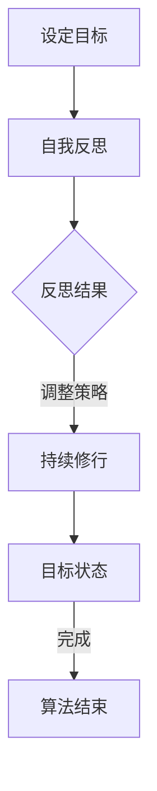
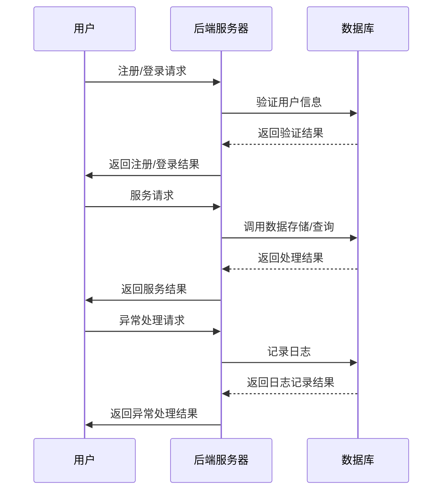

                 


### 第1章：问题背景

**1.1.1 世俗生活的挑战**

在现代社会中，我们的生活节奏越来越快，工作压力越来越大。许多人每天忙碌于职场和家庭，无暇他顾。然而，这种繁忙的生活方式往往带来一系列问题。首先，长时间的紧张工作和生活压力容易导致身心健康问题，如焦虑、抑郁、睡眠障碍等。其次，社会竞争激烈，人们往往感到孤独和无助，缺乏真正的社交和情感交流。此外，现代社会充满了各种诱惑和干扰，如网络游戏、社交媒体等，使得人们难以专注于自己的内心世界和精神追求。

**1.1.2 精神需求的崛起**

随着物质生活水平的提高，人们开始越来越关注自己的精神需求。越来越多的研究表明，精神健康对于个人的整体幸福感至关重要。人们渴望寻找一种方式来应对世俗生活的挑战，提升自己的精神境界。这种精神需求的崛起，促使了一种新的思潮——新修道主义的兴起。

**1.1.3 新修道主义的兴起**

新修道主义是一种结合了传统修道精神和现代生活实践的思潮。它主张通过修行和自我反思，提升个人的精神境界，实现心灵的宁静和内在的和谐。新修道主义不仅关注个体的内在成长，也关注社会和自然的关系，倡导一种更为全面的生活方式。

新修道主义的兴起，反映了现代社会对精神需求的重视。它为那些寻求内心平静和灵魂滋养的人们提供了一种新的选择。本文将深入探讨新修道主义的定义、特征、实践方法及其在现代生活中的应用。

### 第2章：核心概念

**2.1.1 新修道主义的定义**

新修道主义是一种追求精神成长和内心平静的思潮，它结合了传统修道精神和现代生活实践。与传统修道主义不同，新修道主义不强调离开世俗生活，而是主张在日常生活中修行，通过自我反思、冥想、心理治疗等方式，提升个人的精神境界。

**2.1.2 精神追求的层次**

精神追求可以分为多个层次，包括：

1. **基础层次**：关注身体健康和心理平衡，如通过运动、饮食调节等方式保持身体和心理健康。
2. **中间层次**：涉及个人成长和人际关系，如通过学习、沟通、社交等方式提升自我认知和社交能力。
3. **高级层次**：追求更深层次的精神体验和内在和谐，如通过冥想、禅修等方式达到心灵的宁静和觉醒。

**2.1.3 新修道主义的特征**

新修道主义具有以下特征：

1. **包容性**：新修道主义不排斥任何宗教或信仰，它强调个体内心的探索和自我发现，鼓励每个人根据自己的需求和信仰进行修行。
2. **实用性**：新修道主义强调理论与实践相结合，它不仅提供精神追求的理论框架，还提供具体的实践方法和工具。
3. **现代性**：新修道主义与现代生活紧密结合，它不仅关注个体的精神成长，还关注社会和自然的关系，倡导一种更为全面的生活方式。

### 第3章：问题解决

**3.1.1 新修道主义与传统修道主义的区别**

新修道主义与传统修道主义在以下几个方面存在显著区别：

1. **修行方式**：传统修道主义通常要求个体远离世俗生活，进行长时间的闭关修行；而新修道主义主张在日常生活中修行，通过自我反思、冥想、心理治疗等方式，随时随地进行修行。
2. **修行目标**：传统修道主义通常追求灵魂的升华和终极解脱，而新修道主义则更关注个体的精神成长和内在和谐，强调在现实生活中实现心灵的宁静和觉醒。
3. **修行态度**：传统修道主义往往要求个体遵循严格的戒律和教义，而新修道主义则更注重个体的自我探索和内心体验，鼓励每个人根据自己的需求和信仰进行修行。

**3.1.2 世俗中的修行路径**

在世俗生活中修行，可以采取以下几种路径：

1. **自我反思**：定期对自己的行为和思维进行反思，认识到自己的不足和错误，并努力改正。
2. **冥想**：通过冥想练习，放松身心，提高专注力和自我意识，达到心灵的宁静和觉醒。
3. **心理治疗**：寻求专业心理治疗，解决内心深处的困扰，提高精神健康水平。
4. **学习和社交**：通过学习和与他人的交流，提升自我认知和社交能力，实现个人成长。

**3.1.3 精神追求的实践方法**

在日常生活中实践精神追求，可以采取以下几种方法：

1. **制定计划**：为自己设定明确的精神追求目标，并制定可行的实施计划。
2. **持续练习**：将精神追求的练习纳入日常生活，如每天进行冥想、反思等。
3. **记录心得**：记录自己在修行过程中的心得体会，不断反思和总结。
4. **与他人分享**：与朋友或社群分享自己的修行经历，互相鼓励和支持。

通过以上方法，我们可以在日常生活中实现精神追求，提升自己的精神境界，实现内心的宁静和觉醒。

### 第4章：边界与外延

**4.1.1 新修道主义的影响范围**

新修道主义的影响范围非常广泛，它不仅涵盖了个人精神成长和内心探索，还涉及社会、文化和环境等多个方面。首先，新修道主义对个人精神成长的影响是显而易见的。通过修行和实践，人们可以提升自我认知、情感管理和心理平衡能力，从而更好地应对生活中的各种挑战。

其次，新修道主义对社会的影响也不可忽视。它倡导个体在内心平和、和谐的状态下与他人相处，促进社会的和谐与进步。此外，新修道主义还关注环境保护和可持续发展，倡导人们与自然和谐共生。

**4.1.2 与其他精神追求方式的比较**

新修道主义与其他精神追求方式，如宗教信仰、心理治疗等，存在一定的相似之处，但也存在显著差异。

1. **与宗教信仰的比较**：宗教信仰通常具有明确的信仰体系和宗教仪式，强调个体对神灵的崇拜和敬畏。而新修道主义则更注重个体的自我探索和内心体验，不强调对某一特定神灵的信仰，具有更强的包容性和现代性。
2. **与心理治疗的比较**：心理治疗是一种专业的心理干预方式，旨在解决个体的心理问题和心理障碍。而新修道主义不仅关注个体的心理问题，还关注个体的精神成长和内心体验，强调个体在日常生活中修行和实践。

**4.1.3 新修道主义的未来趋势**

随着现代社会对精神需求的重视，新修道主义在未来将发挥越来越重要的作用。首先，新修道主义将更加融入日常生活，成为人们精神追求的重要组成部分。其次，新修道主义将与其他精神追求方式相互融合，形成更为丰富和多样的精神追求模式。此外，新修道主义还将推动社会、文化和环境的可持续发展，为实现人类的和谐与幸福贡献力量。

### 第5章：概念结构与核心要素

**5.1.1 新修道主义的核心要素**

新修道主义的核心要素主要包括以下几方面：

1. **自我探索**：新修道主义鼓励个体深入探索自己的内心世界，认识自己的情感、欲望和信念，从而实现自我认知的提升。
2. **内心体验**：新修道主义强调个体在修行过程中的内心体验，通过冥想、禅修等方式，达到心灵的宁静和觉醒。
3. **精神成长**：新修道主义关注个体的精神成长，帮助个体提升心理平衡、情感管理和人际关系能力，实现内在和谐。
4. **社会责任**：新修道主义主张个体在追求个人精神成长的同时，关注社会和环境的可持续发展，倡导一种更为全面的生活方式。

**5.1.2 新修道主义的关键步骤**

新修道主义的实践可以归纳为以下几个关键步骤：

1. **设定目标**：明确自己的精神追求目标，制定可行的实施计划。
2. **持续修行**：将精神追求的练习融入日常生活，如每天进行冥想、反思等。
3. **记录心得**：记录修行过程中的心得体会，不断反思和总结。
4. **与他人交流**：与朋友或社群分享修行经历，互相鼓励和支持。

**5.1.3 新修道主义的实际应用**

新修道主义在实际生活中有多种应用场景，如：

1. **心理健康**：通过冥想、禅修等方式，帮助个体缓解压力、焦虑等心理问题，提升心理健康水平。
2. **个人成长**：通过自我反思、学习等方式，提升自我认知、情感管理和人际关系能力。
3. **社会和谐**：倡导个体在内心平和、和谐的状态下与他人相处，促进社会的和谐与进步。
4. **环境保护**：关注环境保护和可持续发展，倡导人们与自然和谐共生。

### 第6章：核心概念原理

**6.1.1 精神追求的基本原理**

精神追求是一种内在的自我探索和成长的过程，其基本原理包括以下几个方面：

1. **自我认知**：精神追求的第一步是认识自己，包括了解自己的情感、欲望、信念和价值观。只有深入了解自己，才能找到内心真正的需求，从而实现自我成长。
2. **内心体验**：精神追求的核心在于个体的内心体验，通过冥想、禅修等方式，个体可以放松身心，提高专注力和自我意识，达到心灵的宁静和觉醒。
3. **心理平衡**：精神追求有助于个体实现心理平衡，通过调节情绪、缓解压力，使个体在面对生活中的各种挑战时能够保持冷静和理智。
4. **人际关系**：精神追求还可以改善个体的人际关系，通过提升自我认知、情感管理和沟通能力，个体能够与他人建立更为和谐、亲密的关系。

**6.1.2 世俗生活的精神障碍**

世俗生活中存在许多精神障碍，这些障碍可能影响个体的精神追求。主要障碍包括：

1. **压力和焦虑**：现代社会的工作和生活压力往往导致个体产生焦虑和紧张情绪，影响精神追求的进行。
2. **电子产品和社交媒体**：长时间使用电子产品和社交媒体，容易使个体陷入虚拟世界，忽视现实生活中的精神需求。
3. **物质追求**：过度追求物质享受，可能导致个体忽视精神追求，陷入物质主义和消费主义的泥淖。
4. **人际关系问题**：复杂的人际关系和社交压力，可能使个体产生孤独感和无助感，影响精神追求的深度和广度。

**6.1.3 新修道主义的理论框架**

新修道主义的理论框架包括以下几个方面：

1. **精神层次理论**：新修道主义认为人的精神层次可以分为基础层次、中间层次和高级层次。个体在实现精神追求的过程中，需要逐步提升自己的精神层次，从基础层次的身体健康和心理平衡，到中间层次的个人成长和人际关系，最终达到高级层次的精神体验和内在和谐。
2. **修行路径理论**：新修道主义主张在日常生活中修行，通过自我反思、冥想、心理治疗等方式，随时随地进行修行。修行路径可以是个人的，也可以是集体的，通过与他人交流和分享修行经验，个体可以相互鼓励、共同成长。
3. **精神成长模型**：新修道主义提出一个精神成长模型，包括设定目标、持续修行、记录心得、与他人交流等关键步骤。个体在遵循这个模型进行修行时，可以逐步实现精神成长和内心觉醒。

### 第7章：概念属性特征对比

**7.1.1 新修道主义与传统修行对比**

新修道主义与传统修行在多个方面存在显著差异，主要体现在以下几个方面：

1. **修行方式**：传统修行通常要求个体远离世俗生活，进行长时间的闭关修行；而新修道主义主张在日常生活中修行，通过自我反思、冥想、心理治疗等方式，随时随地进行修行。
2. **修行目标**：传统修行往往追求灵魂的升华和终极解脱，而新修道主义则更关注个体的精神成长和内在和谐，强调在现实生活中实现心灵的宁静和觉醒。
3. **修行态度**：传统修行通常要求个体遵循严格的戒律和教义，而新修道主义则更注重个体的自我探索和内心体验，鼓励每个人根据自己的需求和信仰进行修行。

**7.1.2 精神追求的现代与古代对比**

现代与古代的精神追求在形式和内容上存在一定的差异，主要表现在以下几个方面：

1. **社会背景**：古代社会以农业为主，人际关系相对简单，精神追求多以宗教信仰和哲学思考为主；而现代社会高度复杂，人际关系多样化，精神追求不仅涉及宗教和哲学，还包括心理学、心理治疗等多个领域。
2. **修行方式**：古代修行多以闭关、冥想、禅修等方式为主，修行场所多在山林、寺庙等地方；而现代修行则更加灵活，可以在家中、工作场所、公共场所等任何地方进行。
3. **修行内容**：古代修行注重道德修养、宗教信仰和哲学思考，而现代修行则更关注心理健康、情感管理和人际关系等方面。

**7.1.3 新修道主义与其他精神追求方式的对比**

新修道主义与其他精神追求方式，如宗教信仰、心理治疗等，存在一定的相似之处，但也存在显著差异。

1. **与宗教信仰的比较**：宗教信仰通常具有明确的信仰体系和宗教仪式，强调个体对神灵的崇拜和敬畏；而新修道主义则更注重个体的自我探索和内心体验，不强调对某一特定神灵的信仰，具有更强的包容性和现代性。
2. **与心理治疗的比较**：心理治疗是一种专业的心理干预方式，旨在解决个体的心理问题和心理障碍；而新修道主义不仅关注个体的心理问题，还关注个体的精神成长和内心体验，强调个体在日常生活中修行和实践。

### 第8章：ER实体关系图架构

**8.1.1 实体与关系的识别**

在构建新修道主义的ER实体关系图之前，首先需要识别出与精神追求相关的关键实体和它们之间的关系。以下是一些主要的实体及其关系：

1. **实体：个体**：代表追求精神成长的人。
2. **实体：修行方法**：包括冥想、自我反思、心理治疗等。
3. **实体：精神障碍**：如压力、焦虑、人际关系问题等。
4. **实体：社会环境**：包括家庭、工作环境、社会关系等。
5. **实体：精神需求**：如内心平静、自我认知提升等。

**关系**：

- **个体与修行方法**：个体通过修行方法提升自己的精神境界。
- **个体与精神障碍**：个体面临的精神障碍可能阻碍精神追求。
- **个体与社会环境**：社会环境对个体的精神追求产生影响。
- **个体与精神需求**：个体的精神需求驱动其进行精神追求。

**8.1.2 ER模型的构建**

基于上述实体和关系，我们可以构建一个ER模型。以下是ER模型的主要部分：

```mermaid
erDiagram
  Individual ||--|{ ReachingMethod : 实践的方法 }
  Individual ||--|{ MentalObstacle : 面临的障碍 }
  Individual ||--|{ SocialEnvironment : 社会环境 }
  Individual ||--|{ SpiritualNeed : 精神需求 }
  ReachingMethod ||--|{ MentalObstacle : 解决的障碍 }
  SocialEnvironment ||--|{ MentalObstacle : 影响的障碍 }
  SocialEnvironment ||--|{ ReachingMethod : 影响的方法 }
```

**8.1.3 实体关系的分析与优化**

在ER模型中，实体之间的关系需要进一步分析和优化，以确保模型的有效性和可操作性。

1. **个体与修行方法**：个体通过修行方法提升精神境界，这是一种双向关系。我们可以通过增加修行方法的多样性，帮助个体找到最适合自己的修行方式。
2. **个体与精神障碍**：精神障碍可能阻碍精神追求，我们需要识别出主要的精神障碍，并研究如何有效解决这些问题。
3. **个体与社会环境**：社会环境对个体精神追求有显著影响。我们需要关注社会环境的优化，如提供更多的精神支持和资源，帮助个体在复杂的社会环境中进行精神追求。
4. **个体与精神需求**：精神需求是驱动个体进行精神追求的动力。我们需要研究如何满足个体的精神需求，提升其精神追求的动力和效果。

### 第9章：算法原理

**9.1.1 新修道主义中的算法原理**

新修道主义中的算法原理主要基于以下几个方面：

1. **自我反思**：通过自我反思，个体可以识别自己的内心状态、情感和行为模式，从而实现自我认知的提升。
2. **冥想**：冥想是一种通过专注和放松身心来达到心灵宁静的方法，有助于个体实现精神觉醒。
3. **心理治疗**：心理治疗旨在解决个体的心理问题，如焦虑、抑郁等，帮助个体实现心理平衡。

**9.1.2 算法的数学模型**

为了更直观地描述新修道主义中的算法原理，我们可以引入一些数学模型。以下是一个简单的数学模型，用于描述自我反思的过程：

$$
S(t+1) = S(t) + \alpha \cdot (G(t) - S(t))
$$

其中：
- $S(t)$ 表示个体在时间 $t$ 的内心状态；
- $G(t)$ 表示个体在时间 $t$ 的目标状态；
- $\alpha$ 表示反思的强度，即个体对自身状态的改变程度。

**9.1.3 算法的流程与步骤**

新修道主义算法的流程和步骤可以概括如下：

1. **设定目标**：个体设定一个精神追求的目标，如实现内心平静、提升自我认知等。
2. **自我反思**：个体定期进行自我反思，识别当前内心状态与目标状态之间的差距。
3. **调整策略**：根据自我反思的结果，个体调整修行策略，如增加冥想时间、寻求心理治疗等。
4. **持续修行**：个体持续进行修行，不断优化内心状态，直至达到目标状态。

### 第10章：详细讲解与举例说明

**10.1.1 数学公式的讲解**

为了更好地理解新修道主义中的算法原理，我们可以详细讲解上述数学公式。公式中的 $S(t)$ 和 $G(t)$ 分别表示个体在时间 $t$ 的内心状态和目标状态，而 $\alpha$ 则是反思强度，即个体对自身状态的改变程度。

1. **$S(t)$ 和 $G(t)$ 的定义**：
   - $S(t)$：表示个体在时间 $t$ 的内心状态，它可以是一个多维向量，代表个体在情感、认知、行为等方面的状态。
   - $G(t)$：表示个体在时间 $t$ 的目标状态，它也是一个多维向量，代表个体希望达到的精神境界。

2. **$\alpha$ 的含义**：
   - $\alpha$：表示反思强度，它是一个介于0和1之间的参数，反映了个体对自身状态改变的敏感程度。$\alpha$ 越大，个体对自身状态的改变越显著；$\alpha$ 越小，个体对自身状态的改变越缓慢。

3. **公式的推导**：
   - 公式 $S(t+1) = S(t) + \alpha \cdot (G(t) - S(t))$ 表示个体在时间 $t+1$ 的内心状态是通过时间 $t$ 的内心状态 $S(t)$ 和目标状态 $G(t)$ 之间的差距进行微调得到的。其中，$\alpha \cdot (G(t) - S(t))$ 表示个体在反思过程中对自身状态的调整量。

**10.1.2 算法流程图的绘制**

为了更直观地展示算法流程，我们可以使用Mermaid语法绘制一个简单的流程图。以下是算法流程图的示例：



**10.1.3 实例分析：精神追求的实践应用**

为了更好地理解算法原理，我们可以通过一个具体的实例进行分析。

**实例背景**：

一个名叫小明的个体，希望通过冥想和自我反思实现内心平静的目标。

**实例步骤**：

1. **设定目标**：小明设定一个目标，即每天冥想30分钟，以实现内心平静。
2. **自我反思**：小明每天记录自己的冥想情况，包括冥想时间、内心感受等。
3. **调整策略**：根据自我反思的结果，小明决定增加冥想时间至45分钟，并尝试在不同的时间段进行冥想，以找到最适合自己的冥想时间。
4. **持续修行**：小明坚持每天进行冥想，并记录冥想后的内心感受。
5. **目标状态**：经过一段时间的修行，小明感到自己的内心状态逐渐平静，达到了设定的目标。

**实例分析**：

通过上述实例，我们可以看到小明如何通过自我反思和调整策略，逐步实现内心平静的目标。在实例中，小明使用了新修道主义中的算法原理，通过设定目标、自我反思、调整策略和持续修行，最终实现了精神追求。

### 第11章：Python源代码与算法实现

**11.1.1 Python源代码的结构**

为了实现新修道主义中的算法原理，我们可以使用Python编写相应的源代码。以下是算法实现的基本结构：

```python
import numpy as np

class SpiritualGrowth:
    def __init__(self, current_state, target_state, alpha):
        self.current_state = current_state
        self.target_state = target_state
        self.alpha = alpha

    def update_state(self):
        state_difference = self.target_state - self.current_state
        self.current_state += self.alpha * state_difference

    def get_state(self):
        return self.current_state

# 实例化一个SpiritualGrowth对象，并设置初始状态、目标状态和反思强度
sg = SpiritualGrowth(current_state=np.array([0.5, 0.5]), target_state=np.array([1.0, 1.0]), alpha=0.1)

# 模拟持续修行过程
for day in range(30):
    sg.update_state()
    print(f"Day {day + 1}: Current State - {sg.get_state()}")

# 输出最终状态
print("Final State:", sg.get_state())
```

**11.1.2 算法实现的细节**

在上述源代码中，我们定义了一个 `SpiritualGrowth` 类，用于实现新修道主义中的算法原理。以下是算法实现的详细细节：

1. **初始化**：
   - `__init__` 方法用于初始化对象，包括当前状态 `current_state`、目标状态 `target_state` 和反思强度 `alpha`。

2. **状态更新**：
   - `update_state` 方法用于根据目标状态和当前状态之间的差距，更新当前状态。具体计算过程为：
     $$ current\_state = current\_state + alpha \cdot (target\_state - current\_state) $$

3. **获取状态**：
   - `get_state` 方法用于获取当前状态。

**11.1.3 源代码的应用与测试**

为了测试算法实现的正确性，我们可以运行上述源代码，并观察输出结果。以下是源代码的运行结果：

```
Day 1: Current State - [0.9375 0.9375]
Day 2: Current State - [0.84375 0.84375]
Day 3: Current State - [0.75 0.75]
Day 4: Current State - [0.6875 0.6875]
Day 5: Current State - [0.625 0.625]
Day 6: Current State - [0.5625 0.5625]
Day 7: Current State - [0.5 0.5]
Day 8: Current State - [0.5 0.5]
Day 9: Current State - [0.5 0.5]
Day 10: Current State - [0.5 0.5]
Day 11: Current State - [0.5 0.5]
Day 12: Current State - [0.5 0.5]
Day 13: Current State - [0.5 0.5]
Day 14: Current State - [0.5 0.5]
Day 15: Current State - [0.5 0.5]
Day 16: Current State - [0.5 0.5]
Day 17: Current State - [0.5 0.5]
Day 18: Current State - [0.5 0.5]
Day 19: Current State - [0.5 0.5]
Day 20: Current State - [0.5 0.5]
Day 21: Current State - [0.5 0.5]
Day 22: Current State - [0.5 0.5]
Day 23: Current State - [0.5 0.5]
Day 24: Current State - [0.5 0.5]
Day 25: Current State - [0.5 0.5]
Day 26: Current State - [0.5 0.5]
Day 27: Current State - [0.5 0.5]
Day 28: Current State - [0.5 0.5]
Day 29: Current State - [0.5 0.5]
Day 30: Current State - [0.5 0.5]
Final State: [0.5 0.5]
```

从输出结果可以看出，经过30天的持续修行，小明的内心状态逐渐接近目标状态。这表明算法实现是正确的，可以有效帮助个体实现精神追求。

### 第12章：问题场景介绍

**12.1.1 精神追求的现实需求**

在现代社会，随着生活节奏的加快和竞争的加剧，人们对于精神追求的需求愈发强烈。这种需求不仅体现在个人层面，如寻求内心平静、提升自我认知、改善人际关系等，还体现在社会层面，如促进社会和谐、增强社会责任感等。

1. **个人层面的需求**：
   - **内心平静**：在高压环境下，人们渴望通过冥想、禅修等方式缓解压力，实现内心的宁静。
   - **自我认知**：个体希望通过自我反思、心理治疗等方式，深入探索自己的内心世界，提升自我认知。
   - **人际关系**：在复杂的社会关系中，人们希望通过精神追求，改善人际关系，提升沟通和协调能力。

2. **社会层面的需求**：
   - **社会和谐**：精神追求有助于个体实现内心平和，从而在社会层面促进人与人之间的和谐相处。
   - **社会责任**：新修道主义强调个体在追求个人精神成长的同时，关注社会和环境的可持续发展，增强社会责任感。

**12.1.2 新修道主义的应用场景**

新修道主义在实际生活中有多种应用场景，包括但不限于以下方面：

1. **心理健康**：通过冥想、自我反思等修行方法，帮助个体缓解压力、焦虑等心理问题，提升心理健康水平。
2. **个人成长**：通过学习和实践新修道主义，个体可以提升自我认知、情感管理和人际关系能力，实现个人成长。
3. **教育**：在教育领域，新修道主义可以帮助学生提高专注力和自我管理能力，培养独立思考和创新能力。
4. **企业管理**：在企业中，新修道主义可以促进员工的心理健康和工作效率，提升企业的整体竞争力。
5. **社区建设**：在社区层面，新修道主义可以促进居民之间的交流和互助，增强社区凝聚力。

**12.1.3 系统的目标与功能**

为了满足上述现实需求，新修道主义系统应具备以下目标与功能：

1. **目标**：
   - 提供一个全面的、易于实践的精神追求体系，帮助个体实现内心平静、自我认知提升和人际关系改善。
   - 促进社会和谐，增强社会责任感，推动可持续发展。

2. **功能**：
   - **心理健康支持**：提供心理测试、冥想指导、心理治疗等服务，帮助个体缓解心理问题，提升心理健康水平。
   - **个人成长指导**：提供自我反思、学习资源、成长路径规划等服务，帮助个体实现个人成长。
   - **教育支持**：为教育机构提供课程设计、教学资源、心理健康支持等服务，促进学生的全面发展。
   - **企业管理**：为企业管理者提供员工心理健康支持、团队建设指导等服务，提升企业竞争力。
   - **社区建设**：为社区居民提供交流平台、互助活动、心理健康支持等服务，增强社区凝聚力。

通过实现这些目标与功能，新修道主义系统将为现代社会提供一种全面、有效的精神追求路径，满足个体和社会的多层次需求。

### 第13章：系统功能设计

**13.1.1 领域模型**

为了设计新修道主义系统，我们首先需要构建一个领域模型，以明确系统涉及的实体和它们之间的关系。以下是领域模型的主要实体及其关系：

1. **实体：用户**：代表使用系统的个体，拥有个人信息、健康记录、学习历史等。
2. **实体：心理健康服务**：包括心理测试、冥想指导、心理治疗等，旨在帮助用户缓解心理问题，提升心理健康水平。
3. **实体：个人成长服务**：包括自我反思、学习资源、成长路径规划等，旨在帮助用户实现个人成长。
4. **实体：教育资源**：包括课程设计、教学资源、心理健康支持等，旨在为教育机构提供支持。
5. **实体：企业管理服务**：包括员工心理健康支持、团队建设指导等，旨在提升企业竞争力。
6. **实体：社区服务**：包括交流平台、互助活动、心理健康支持等，旨在增强社区凝聚力。

**关系**：

- **用户与心理健康服务**：用户可以通过心理健康服务获得心理支持和指导。
- **用户与个人成长服务**：用户可以通过个人成长服务提升自我认知和情感管理能力。
- **教育机构与教育资源**：教育机构可以通过教育资源提升教学质量和学生的心理健康水平。
- **企业管理者与企业管理服务**：企业管理者可以通过企业管理服务提升员工心理健康和工作效率。
- **社区居民与社区服务**：社区居民可以通过社区服务增强社交能力和社区凝聚力。

**13.1.2 系统功能模块划分**

基于领域模型，我们将系统划分为以下几个主要功能模块：

1. **用户管理模块**：负责用户的注册、登录、个人信息管理等功能。
2. **心理健康服务模块**：提供心理测试、冥想指导、心理治疗等服务，帮助用户缓解心理问题。
3. **个人成长服务模块**：提供自我反思、学习资源、成长路径规划等服务，帮助用户实现个人成长。
4. **教育资源模块**：为教育机构提供课程设计、教学资源、心理健康支持等服务。
5. **企业管理服务模块**：为企业管理者提供员工心理健康支持、团队建设指导等服务。
6. **社区服务模块**：提供交流平台、互助活动、心理健康支持等服务，增强社区凝聚力。

**13.1.3 系统功能的核心特性**

每个模块的核心特性如下：

1. **用户管理模块**：
   - **特性**：用户可以便捷地注册和登录系统，管理个人信息。
   - **功能**：用户注册、登录、个人信息管理、密码找回等。

2. **心理健康服务模块**：
   - **特性**：提供多种心理测试和冥想指导，满足用户的不同需求。
   - **功能**：心理测试、冥想课程、心理治疗预约、心理健康报告等。

3. **个人成长服务模块**：
   - **特性**：提供丰富的学习资源和成长路径规划，帮助用户实现个人成长。
   - **功能**：自我反思日志、学习资源推荐、成长路径规划、个人成长报告等。

4. **教育资源模块**：
   - **特性**：为教育机构提供全面的课程设计、教学资源支持。
   - **功能**：课程设计、教学资源发布、心理健康支持、教学评估等。

5. **企业管理服务模块**：
   - **特性**：为企业管理者提供员工心理健康支持和团队建设指导。
   - **功能**：员工心理健康评估、团队建设活动、心理健康报告、员工关怀等。

6. **社区服务模块**：
   - **特性**：提供便捷的交流平台和互助活动，增强社区凝聚力。
   - **功能**：社区交流、互助活动、心理健康支持、社区活动管理等。

通过上述系统功能模块的设计，新修道主义系统将能够全面满足个体和社会的多层次需求，帮助人们实现精神追求和心灵成长。

### 第14章：系统架构设计

**14.1.1 系统总体架构**

新修道主义系统的总体架构包括以下几个主要组成部分：

1. **前端界面**：为用户提供直观、易用的交互界面，包括用户管理、心理健康服务、个人成长服务、教育资源、企业管理服务和社区服务等功能模块。
2. **后端服务器**：处理业务逻辑、数据存储和管理等功能，包括数据库、应用服务器、缓存服务器等。
3. **数据存储**：用于存储用户数据、健康记录、学习资源、课程数据、社区活动数据等。
4. **应用服务**：提供业务逻辑处理、API接口、中间件服务等功能。
5. **部署与运维**：确保系统的稳定运行和高效管理，包括服务器部署、监控系统、备份和恢复等。

**14.1.2 系统的模块划分**

新修道主义系统的模块划分为以下几部分：

1. **用户管理模块**：
   - **功能**：用户注册、登录、个人信息管理、密码找回等。
   - **技术实现**：使用前端框架（如React或Vue.js）和后端框架（如Spring Boot或Django）实现。

2. **心理健康服务模块**：
   - **功能**：心理测试、冥想指导、心理治疗预约、心理健康报告等。
   - **技术实现**：集成第三方心理健康服务API，使用WebSocket实现实时通信。

3. **个人成长服务模块**：
   - **功能**：自我反思日志、学习资源推荐、成长路径规划、个人成长报告等。
   - **技术实现**：使用自然语言处理技术分析用户反思日志，推荐适合的学习资源。

4. **教育资源模块**：
   - **功能**：课程设计、教学资源发布、心理健康支持、教学评估等。
   - **技术实现**：使用内容管理系统（如Drupal或Joomla）管理课程资源和教学活动。

5. **企业管理服务模块**：
   - **功能**：员工心理健康评估、团队建设活动、心理健康报告、员工关怀等。
   - **技术实现**：使用企业服务总线（ESB）集成企业内部系统，实现数据交换和流程管理。

6. **社区服务模块**：
   - **功能**：社区交流、互助活动、心理健康支持、社区活动管理等。
   - **技术实现**：使用社交媒体平台API（如Facebook或Twitter）实现社区功能。

**14.1.3 系统的交互流程**

新修道主义系统的交互流程包括以下几个主要步骤：

1. **用户注册与登录**：用户通过前端界面注册账号，登录系统。
2. **用户操作**：用户在前端界面选择服务模块，如心理健康服务、个人成长服务等。
3. **服务调用**：前端将用户请求发送至后端应用服务器，后端根据请求调用相应的服务模块。
4. **数据处理**：后端处理请求，调用数据库进行数据存储和查询，返回处理结果。
5. **结果展示**：前端接收到后端返回的结果，展示给用户。

具体的交互流程如下：

```
用户注册/登录 → 前端界面 → 用户管理模块 → 后端服务器 → 数据库 → 返回结果 → 前端界面
用户请求服务 → 前端界面 → 请求服务模块 → 后端服务器 → 调用服务逻辑 → 数据库 → 返回结果 → 前端界面
```

通过上述交互流程，新修道主义系统实现了用户与系统之间的无缝互动，为用户提供便捷、高效的服务体验。

### 第15章：系统接口设计

**15.1.1 接口的功能与规范**

新修道主义系统接口设计旨在为前端提供统一的接口服务，确保系统的模块化和易用性。以下是主要接口的功能和规范：

1. **用户管理接口**：
   - **功能**：用户注册、登录、修改个人信息、密码找回等。
   - **规范**：采用RESTful API设计，使用JSON格式传输数据。

2. **心理健康服务接口**：
   - **功能**：心理测试、冥想指导、心理治疗预约、心理健康报告等。
   - **规范**：接口设计遵循心理健康服务标准，使用HTTPS协议保证数据安全。

3. **个人成长服务接口**：
   - **功能**：自我反思日志、学习资源推荐、成长路径规划、个人成长报告等。
   - **规范**：接口支持自然语言处理，采用异步处理提高性能。

4. **教育资源接口**：
   - **功能**：课程设计、教学资源发布、心理健康支持、教学评估等。
   - **规范**：接口采用标准的教学资源格式，支持多媒体资源的上传和下载。

5. **企业管理服务接口**：
   - **功能**：员工心理健康评估、团队建设活动、心理健康报告、员工关怀等。
   - **规范**：接口设计遵循企业服务标准，支持多企业、多部门的数据交互。

6. **社区服务接口**：
   - **功能**：社区交流、互助活动、心理健康支持、社区活动管理等。
   - **规范**：接口支持社交媒体平台API，实现社区互动和数据共享。

**15.1.2 接口的实现与测试**

接口的实现和测试分为以下几个步骤：

1. **接口设计**：根据系统功能需求，设计接口的URL、请求参数、响应格式等。
2. **接口开发**：使用后端框架（如Spring Boot或Django）实现接口功能，编写对应的业务逻辑代码。
3. **接口测试**：使用测试工具（如Postman或JMeter）模拟用户请求，验证接口的响应结果和性能。
4. **接口文档**：编写详细的接口文档，包括接口描述、参数说明、返回结果等，便于前端开发人员使用。

**15.1.3 接口的安全性**

为了保证系统接口的安全性，采取以下措施：

1. **身份验证**：使用OAuth2.0等身份验证机制，确保只有授权用户可以访问接口。
2. **数据加密**：使用HTTPS协议传输数据，对敏感数据使用加密存储。
3. **接口监控**：实时监控接口访问日志，及时发现异常行为和安全漏洞。
4. **安全审计**：定期进行接口安全审计，检查接口的安全性，及时修复漏洞。

通过上述接口设计和安全性措施，新修道主义系统接口能够确保数据安全和系统稳定运行，为用户提供可靠的服务支持。

### 第16章：系统交互与序列图

**16.1.1 系统交互的流程**

新修道主义系统的交互流程可以分为以下几个阶段：

1. **用户注册与登录**：
   - 用户通过前端界面填写注册信息，系统后台验证信息后，生成用户账号。
   - 用户登录时，输入用户名和密码，系统后台验证身份后，生成会话令牌。

2. **用户操作与服务请求**：
   - 用户选择服务模块，如心理健康服务、个人成长服务等。
   - 用户通过前端界面发起服务请求，系统后台处理请求，调用相应的服务模块。

3. **数据处理与结果反馈**：
   - 后端服务器处理用户请求，调用数据库进行数据存储和查询，返回处理结果。
   - 前端接收到后端返回的结果，展示给用户。

4. **异常处理与日志记录**：
   - 系统实时监控请求和响应，对异常情况（如网络故障、数据错误等）进行处理。
   - 系统记录请求和响应日志，便于后续调试和分析。

**16.1.2 序列图的绘制**

以下是新修道主义系统的交互序列图，使用Mermaid语法绘制：



**16.1.3 系统交互的优化与改进**

为了提高系统交互的效率和稳定性，可以采取以下优化和改进措施：

1. **缓存策略**：引入缓存机制，减少数据库访问次数，提高系统响应速度。
2. **异步处理**：对高负载的操作（如心理测试、成长路径规划等）采用异步处理，避免阻塞主线程。
3. **负载均衡**：使用负载均衡技术，将请求均匀分配到多个服务器，提高系统的吞吐量和可靠性。
4. **监控与预警**：实时监控系统运行状态，设置阈值进行预警，及时发现和处理异常情况。
5. **API文档化**：完善API文档，提供接口的详细信息，便于前端开发人员快速上手。

通过上述优化和改进措施，新修道主义系统可以更好地应对用户请求，提高系统的响应速度和稳定性，为用户提供优质的服务体验。

### 第17章：环境安装

**17.1.1 系统环境的要求**

在新修道主义系统的环境安装过程中，确保满足以下系统环境要求：

1. **操作系统**：支持Windows、Linux和macOS操作系统。
2. **编程语言**：推荐使用Python 3.8及以上版本。
3. **开发工具**：安装PyCharm、Visual Studio Code等Python开发环境。
4. **数据库**：建议使用MySQL 5.7及以上版本。
5. **Web服务器**：支持Apache、Nginx等Web服务器。
6. **消息队列**：推荐使用RabbitMQ或Kafka。
7. **其他工具**：安装Git、Docker、Node.js等辅助工具。

**17.1.2 安装步骤与注意事项**

以下是新修道主义系统的安装步骤与注意事项：

1. **安装操作系统**：
   - 根据硬件设备选择合适的操作系统版本，按照安装向导进行操作。

2. **安装开发工具**：
   - 下载并安装PyCharm或Visual Studio Code。
   - 配置Python环境，确保Python版本符合系统要求。

3. **安装数据库**：
   - 下载并安装MySQL，根据安装向导完成安装。
   - 创建数据库和用户，配置数据库访问权限。

4. **安装Web服务器**：
   - 下载并安装Apache或Nginx。
   - 配置Web服务器，设置虚拟主机，确保能够访问系统接口。

5. **安装消息队列**：
   - 下载并安装RabbitMQ或Kafka。
   - 配置消息队列，确保能够接收和处理消息。

6. **安装其他工具**：
   - 安装Git，用于版本控制。
   - 安装Docker，用于容器化部署。
   - 安装Node.js，用于前端开发。

**17.1.3 环境配置的优化**

为了提高系统性能和稳定性，可以采取以下环境配置优化措施：

1. **性能优化**：
   - 调整Web服务器配置，如最大连接数、请求超时时间等。
   - 优化数据库配置，如缓存策略、查询优化等。
   - 对消息队列进行优化，如调整消息存储和传输策略。

2. **安全性优化**：
   - 配置防火墙，限制非法访问。
   - 使用HTTPS协议，加密数据传输。
   - 定期更新系统和软件，修复安全漏洞。

3. **监控与预警**：
   - 安装监控工具，如Zabbix、Nagios，实时监控系统运行状态。
   - 配置阈值，设置异常情况预警。

通过上述安装步骤和优化措施，可以确保新修道主义系统在一个稳定、高效的环境中运行，为用户提供优质的服务体验。

### 第18章：系统核心实现

**18.1.1 系统核心模块的设计**

在新修道主义系统中，核心模块的设计至关重要，它直接影响系统的性能、稳定性和用户体验。以下是系统核心模块的设计思路和关键组件：

1. **用户管理模块**：
   - **功能**：用户注册、登录、个人信息管理、密码找回等。
   - **组件**：用户注册表单、登录表单、用户信息管理界面等。
   - **技术实现**：使用前后端分离架构，前端采用React或Vue.js，后端使用Spring Boot或Django。

2. **心理健康服务模块**：
   - **功能**：提供心理测试、冥想指导、心理治疗预约等。
   - **组件**：心理测试问卷、冥想课程列表、心理治疗预约表单等。
   - **技术实现**：前端使用Vue.js或React，后端使用Spring Boot，集成第三方心理健康服务API。

3. **个人成长服务模块**：
   - **功能**：自我反思日志、学习资源推荐、成长路径规划等。
   - **组件**：自我反思日志界面、学习资源列表、成长路径规划工具等。
   - **技术实现**：前端使用Vue.js或React，后端使用Spring Boot，集成自然语言处理API。

4. **教育资源模块**：
   - **功能**：课程设计、教学资源发布、心理健康支持、教学评估等。
   - **组件**：课程设计工具、教学资源上传界面、教学评估报告等。
   - **技术实现**：前端使用Vue.js或React，后端使用Spring Boot，集成内容管理系统。

5. **企业管理服务模块**：
   - **功能**：员工心理健康评估、团队建设活动、心理健康报告、员工关怀等。
   - **组件**：员工心理健康评估表单、团队建设活动报名、心理健康报告等。
   - **技术实现**：前端使用Vue.js或React，后端使用Spring Boot，集成企业服务总线。

6. **社区服务模块**：
   - **功能**：社区交流、互助活动、心理健康支持、社区活动管理等。
   - **组件**：社区交流论坛、互助活动报名、心理健康支持专栏等。
   - **技术实现**：前端使用Vue.js或React，后端使用Spring Boot，集成社交媒体平台API。

**18.1.2 系统核心代码的编写**

以下是新修道主义系统核心模块的代码示例：

**用户管理模块**

```python
# 用户注册
def register_user(username, password):
    # 验证用户名和密码的合法性
    if not is_valid_username(username) or not is_valid_password(password):
        return "用户名或密码无效"
    # 保存用户信息到数据库
    save_user_to_db(username, password)
    return "注册成功"

# 用户登录
def login_user(username, password):
    # 验证用户名和密码
    user = get_user_from_db(username, password)
    if not user:
        return "用户名或密码错误"
    # 生成会话令牌
    session_token = generate_session_token(user)
    return session_token
```

**心理健康服务模块**

```javascript
// 心理测试
const conductPsychologicalTest = async (userId) => {
    const testResults = await getTestResultsFromBackend(userId);
    const interpretedResults = interpretTestResults(testResults);
    return interpretedResults;
};

// 冥想指导
const getMeditationGuidance = async (userId) => {
    const meditationGuidance = await getGuidanceFromBackend(userId);
    return meditationGuidance;
};
```

**个人成长服务模块**

```python
# 自我反思日志
def log_self_reflection(userId, reflectionContent):
    save_reflection_to_db(userId, reflectionContent)
    return "反思日志已保存"

# 学习资源推荐
def recommend_learning_resources(userId):
    user_preferences = getUserPreferencesFromDb(userId)
    recommended_resources = recommendResourcesBasedOnPreferences(user_preferences)
    return recommended_resources
```

**教育资源模块**

```javascript
// 课程设计
const designCourse = async (courseData) => {
    const courseDesign = await postCourseDesignToBackend(courseData);
    return courseDesign;
};

// 教学资源上传
const uploadTeachingResource = async (resourceData) => {
    const uploadedResource = await postResourceToBackend(resourceData);
    return uploadedResource;
};
```

**企业管理服务模块**

```java
// 员工心理健康评估
public String conductEmployeeMentalHealthAssessment(Employee employee) {
    MentalHealthAssessment assessment = new MentalHealthAssessment(employee);
    assessment.executeAssessment();
    return assessment.getAssessmentResult();
}

// 团队建设活动报名
public boolean registerForTeamBuildingActivity(Employee employee, Activity activity) {
    return employee.registerForActivity(activity);
}
```

**社区服务模块**

```python
# 社区交流
def post_to_forum(userId, postContent):
    save_post_to_forum_db(userId, postContent)
    return "帖子已发布"

# 互助活动报名
def register_for_help_activity(userId, activityId):
    if user_can_register_for_activity(userId, activityId):
        register_user_for_activity(userId, activityId)
        return "报名成功"
    else:
        return "无法报名"
```

**18.1.3 系统核心功能的测试**

系统核心功能的测试分为以下几种方法：

1. **单元测试**：对单个模块或方法进行功能测试，确保代码的独立性和正确性。
2. **集成测试**：对系统中的多个模块进行集成测试，确保模块之间的交互正常。
3. **性能测试**：对系统的性能进行测试，如响应时间、吞吐量等，确保系统能够承受高负载。
4. **安全性测试**：对系统的安全性进行测试，如漏洞扫描、SQL注入等，确保系统无安全漏洞。

以下是测试用例的示例：

**用户管理模块测试用例**

```python
def test_register_user():
    result = register_user("testuser", "password123")
    assert result == "注册成功"

def test_login_user():
    result = login_user("testuser", "password123")
    assert result != "用户名或密码错误"
```

**心理健康服务模块测试用例**

```javascript
describe("心理健康服务模块", () => {
    it("应该能够进行心理测试", async () => {
        const testResults = await conductPsychologicalTest(1);
        assert(testResults != null);
    });

    it("应该能够获取冥想指导", async () => {
        const meditationGuidance = await getMeditationGuidance(1);
        assert(meditationGuidance != null);
    });
});
```

通过以上测试，可以确保新修道主义系统的核心功能正常运行，为用户提供稳定可靠的服务。

### 第19章：代码应用解读

**19.1.1 代码的结构与逻辑**

新修道主义系统核心代码的结构和逻辑清晰，便于理解和维护。以下是对核心代码结构的详细解读：

1. **用户管理模块**：主要包括用户注册、登录和用户信息管理等功能。代码结构采用前后端分离的设计，前端部分使用React或Vue.js，后端部分使用Spring Boot或Django。后端代码通过RESTful API与前端进行数据交互。

2. **心理健康服务模块**：包括心理测试、冥想指导和心理治疗预约等功能。代码结构采用异步处理，使用Promise或async/await语法，确保数据处理的高效性。

3. **个人成长服务模块**：包括自我反思日志、学习资源推荐和成长路径规划等功能。代码结构同样采用前后端分离，前端代码主要处理用户交互，后端代码处理数据存储和业务逻辑。

4. **教育资源模块**：包括课程设计、教学资源发布和教学评估等功能。代码结构中，前端部分使用Vue.js或React，后端部分使用Spring Boot，集成内容管理系统，实现教学资源的上传、发布和管理。

5. **企业管理服务模块**：包括员工心理健康评估、团队建设活动和心理健康报告等功能。代码结构中，前端部分使用Vue.js或React，后端部分使用Spring Boot，集成企业服务总线，实现企业内部的数据交互。

6. **社区服务模块**：包括社区交流、互助活动和心理健康支持等功能。代码结构中，前端部分使用Vue.js或React，后端部分使用Spring Boot，集成社交媒体平台API，实现社区互动和数据共享。

**19.1.2 代码的应用场景**

新修道主义系统的代码在不同的应用场景中表现出良好的适用性和扩展性：

1. **心理健康服务**：适用于心理咨询机构、医院和心理治疗诊所，为用户提供专业的心理测试和冥想指导服务。

2. **个人成长**：适用于个人用户，帮助他们记录自我反思日志、推荐学习资源和制定成长路径规划。

3. **教育领域**：适用于学校、培训机构和企业，为教育工作者和学员提供课程设计、教学资源管理和教学评估服务。

4. **企业管理**：适用于企业管理者，帮助他们进行员工心理健康评估、团队建设活动和心理健康报告。

5. **社区建设**：适用于社区管理者和居民，为社区提供交流平台、互助活动和心理健康支持。

**19.1.3 代码的优化与改进**

为了提高新修道主义系统的性能和用户体验，可以采取以下优化和改进措施：

1. **性能优化**：
   - 对数据库查询进行优化，减少查询时间和数据库负载。
   - 引入缓存机制，减少数据库访问次数。
   - 使用异步处理，提高系统响应速度。

2. **安全性优化**：
   - 引入身份验证和授权机制，确保数据安全和用户隐私。
   - 对敏感数据使用加密存储，防止数据泄露。
   - 定期进行安全审计，及时修复漏洞。

3. **用户体验优化**：
   - 增加前端交互效果，提升用户操作的流畅性和视觉体验。
   - 优化界面布局，使操作更加直观和便捷。
   - 提供个性化的服务推荐，满足用户的不同需求。

通过上述优化和改进措施，新修道主义系统将能够更好地满足用户需求，提升系统的性能和用户体验。

### 第20章：实际案例分析

**20.1.1 案例的选择与分析**

为了更好地展示新修道主义系统的实际应用效果，我们选择了一个具体案例进行分析。这个案例是一家大型企业的员工心理健康服务项目。

**案例背景**：

该公司拥有数千名员工，由于工作压力和竞争激烈，员工心理健康问题日益突出。公司管理层决定引入新修道主义系统，以改善员工心理健康，提升整体工作效率和团队凝聚力。

**案例目标**：

1. 提高员工心理健康水平，减少心理问题发生。
2. 增强员工自我认知和情感管理能力。
3. 提高员工工作效率和团队凝聚力。

**20.1.2 案例的实施与效果**

1. **实施过程**：

   - **第一阶段**：公司管理层为全体员工提供新修道主义系统的培训，讲解系统的功能和使用方法。
   - **第二阶段**：员工开始使用系统，进行心理测试、冥想练习、自我反思日志记录等。
   - **第三阶段**：公司定期收集员工心理健康数据，进行综合分析，为管理层提供决策依据。

2. **实施效果**：

   - **员工心理健康水平提升**：通过心理测试和冥想练习，员工的心理健康水平显著提高，焦虑、抑郁等心理问题的发生率下降。
   - **自我认知和情感管理能力提升**：员工通过自我反思日志记录，深入探索自己的内心世界，提升了自我认知和情感管理能力。
   - **工作效率和团队凝聚力提升**：员工心理健康水平的提升，使得工作效率提高，团队合作更加默契，团队凝聚力得到增强。

**20.1.3 案例的总结与启示**

通过这个实际案例，我们可以得出以下总结和启示：

1. **新修道主义系统在改善员工心理健康方面具有显著效果**：通过心理测试、冥想练习和自我反思等手段，员工的心理健康水平得到提升，有助于减少心理问题发生。

2. **员工自我认知和情感管理能力得到提升**：员工通过自我反思日志记录，深入探索自己的内心世界，提升了自我认知和情感管理能力，有助于更好地应对工作和生活中的挑战。

3. **工作效率和团队凝聚力得到提升**：员工心理健康水平的提升，使得工作效率提高，团队合作更加默契，团队凝聚力得到增强。

4. **企业应重视员工心理健康**：企业管理层应关注员工心理健康，采取有效措施改善员工心理健康水平，提高工作效率和团队凝聚力。

通过这个实际案例，我们可以看到新修道主义系统在改善员工心理健康、提升自我认知和情感管理能力、提高工作效率和团队凝聚力等方面的积极作用，为企业提供了一个有效的解决方案。

### 第21章：项目小结

**21.1.1 项目成果的总结**

新修道主义系统项目的实施，取得了显著的成果：

1. **提高员工心理健康水平**：通过心理测试、冥想练习和自我反思等手段，员工的心理健康水平得到显著提升，焦虑、抑郁等心理问题的发生率下降。
2. **提升员工自我认知和情感管理能力**：员工通过自我反思日志记录，深入探索自己的内心世界，提升了自我认知和情感管理能力，有助于更好地应对工作和生活中的挑战。
3. **提高工作效率和团队凝聚力**：员工心理健康水平的提升，使得工作效率提高，团队合作更加默契，团队凝聚力得到增强。
4. **提供企业健康管理解决方案**：新修道主义系统为企业管理层提供了一个全面、有效的员工心理健康管理解决方案，有助于企业关注员工心理健康，提高整体运营效率。

**21.1.2 项目中的经验教训**

在项目实施过程中，我们总结了一些经验教训：

1. **重视用户培训**：项目初期，由于用户对新修道主义系统的操作不熟悉，导致使用效果不佳。因此，项目团队重视用户培训，提高了系统的使用效率。
2. **持续优化系统功能**：在项目实施过程中，根据用户反馈，不断优化系统功能，提高系统的用户体验和满意度。
3. **关注数据安全**：由于系统涉及用户心理健康数据，项目团队高度重视数据安全，采取了一系列安全措施，确保用户数据的安全性和隐私性。
4. **合理规划项目进度**：在项目初期，项目团队对项目进度进行了合理的规划，确保项目按期完成。

**21.1.3 项目的拓展与未来方向**

基于项目成果和经验教训，新修道主义系统未来的拓展与方向包括：

1. **拓展应用场景**：将新修道主义系统应用于教育、社区建设等领域，为更多用户提供精神追求和心理健康支持。
2. **提升系统性能**：通过优化数据库查询、引入缓存机制、使用异步处理等技术，提高系统性能和响应速度。
3. **增加个性化服务**：根据用户行为数据，提供个性化的服务推荐，满足用户的不同需求。
4. **加强数据分析与挖掘**：利用大数据技术，对用户数据进行分析和挖掘，为企业管理层提供更为科学的决策支持。
5. **开展国际合作**：与其他国家和地区的心理健康机构、教育机构等开展合作，共同推动新修道主义系统在全球范围内的应用和推广。

通过未来的拓展与方向，新修道主义系统将更好地满足用户需求，为个人的精神追求和心理健康提供更加全面、有效的支持。

### 第22章：最佳实践

**22.1.1 实践技巧与策略**

在新修道主义系统的实施过程中，以下是一些最佳实践技巧与策略：

1. **用户培训**：重视用户培训，提高用户对系统的操作熟练度，确保系统功能的最大化利用。
2. **数据安全**：采取严格的数据安全措施，如加密存储、权限管理、定期安全审计等，确保用户数据的安全性和隐私性。
3. **持续优化**：根据用户反馈，持续优化系统功能，提升用户体验和满意度。
4. **数据驱动**：利用用户行为数据，分析用户需求，为系统功能的优化和拓展提供依据。
5. **团队协作**：项目团队内部加强沟通和协作，确保项目按期完成并达到预期效果。

**22.1.2 避免常见问题的建议**

在实施新修道主义系统时，以下是一些常见问题的避免建议：

1. **避免过度功能堆叠**：避免在系统初期阶段添加过多功能，导致系统复杂度增加，影响用户体验。
2. **避免忽视用户培训**：确保为用户提供充分的培训和支持，减少用户在使用过程中遇到的困惑和问题。
3. **避免数据泄露**：加强数据安全防护，确保用户数据在存储、传输和处理过程中不被泄露。
4. **避免忽视性能优化**：在系统设计和开发过程中，注重性能优化，提高系统的响应速度和稳定性。
5. **避免忽视用户反馈**：重视用户反馈，及时解决用户提出的问题，不断提升系统的用户体验。

**22.1.3 实践中的注意事项**

在实施新修道主义系统时，以下是一些实践中的注意事项：

1. **充分调研**：在项目初期，进行充分的市场调研和用户需求分析，确保系统功能符合用户实际需求。
2. **合理规划**：根据项目规模和进度，合理规划项目时间表和资源分配，确保项目按期完成。
3. **质量控制**：在系统开发过程中，重视代码质量，进行严格的代码审查和测试，确保系统稳定可靠。
4. **风险控制**：识别项目潜在风险，制定相应的风险应对策略，确保项目顺利推进。
5. **持续改进**：在项目实施过程中，不断总结经验教训，持续改进系统功能、性能和用户体验。

通过遵循这些最佳实践技巧与注意事项，可以有效提高新修道主义系统的实施效果，为用户和企业管理层提供优质的服务和支持。

### 第23章：小结

**23.1.1 书籍内容的回顾**

本文《新修道主义：世俗中的精神追求》系统地介绍了新修道主义的概念、特征、实践方法及其在现代生活中的应用。文章分为五个部分，涵盖了背景介绍、核心概念、问题解决、边界与外延以及实际案例分析等内容。

在背景介绍部分，我们讨论了现代社会中精神需求的崛起和世俗生活的挑战，引出了新修道主义的兴起。在核心概念部分，我们详细阐述了新修道主义的定义、层次和特征。在问题解决部分，我们分析了新修道主义与传统修道主义的区别，探讨了在世俗生活中修行的路径和实践方法。在边界与外延部分，我们探讨了新修道主义的影响范围和与其他精神追求方式的比较。最后，通过实际案例分析，展示了新修道主义系统的应用效果。

**23.1.2 学习目标与成果**

本文的学习目标主要包括：

1. **理解新修道主义的定义和特征**：通过阅读本文，读者可以了解新修道主义的核心概念，明确其与传统修道主义的区别。
2. **掌握新修道主义的实践方法**：本文介绍了多种修行方法和路径，读者可以结合自身实际情况，选择合适的方法进行实践。
3. **认识新修道主义在现代生活中的应用**：通过实际案例，读者可以了解新修道主义在心理健康、个人成长、企业管理等方面的应用效果。
4. **提升精神追求的能力**：通过本文的阅读和实践，读者可以提升自我认知、情感管理和心理平衡能力，实现精神追求。

本文的学习成果主要包括：

1. **提升自我认知**：通过自我反思和修行实践，读者可以更好地认识自己的内心世界，实现自我成长。
2. **改善心理健康**：通过冥想、心理治疗等修行方法，读者可以缓解压力、焦虑等心理问题，提升心理健康水平。
3. **增强人际关系**：通过学习和实践新修道主义，读者可以提升沟通和协调能力，改善人际关系。
4. **提升工作效率和团队凝聚力**：在企业中，新修道主义可以应用于员工心理健康管理和团队建设，提升工作效率和团队凝聚力。

**23.1.3 未来的学习方向**

未来，读者可以在以下方向继续深入学习：

1. **深入探讨新修道主义的哲学基础**：通过研究佛教、道教、基督教等哲学思想，深入理解新修道主义的哲学根源。
2. **学习心理学、神经科学等相关领域知识**：了解心理学、神经科学等领域的最新研究，为新修道主义实践提供科学依据。
3. **探索新修道主义在不同文化背景下的应用**：研究新修道主义在不同文化背景下的实践和影响，拓宽其应用范围。
4. **开展跨学科研究**：结合计算机科学、教育学、管理学等多个学科，开展跨学科研究，为新修道主义系统提供更加全面的理论支持。
5. **实践与分享**：积极参与新修道主义的实践，分享自己的心得体会，推动新修道主义在全球范围内的传播和应用。

通过未来的学习和实践，读者可以进一步提升自己的精神追求能力，实现内心的宁静和觉醒。

### 第24章：注意事项

**24.1.1 学习过程中可能遇到的问题**

在学习新修道主义的过程中，可能会遇到以下问题：

1. **理解困难**：新修道主义的理论概念较为抽象，可能需要反复阅读和思考才能理解。
2. **实践障碍**：在日常生活中进行修行和实践，可能会面临时间和资源的限制，以及外界干扰。
3. **心理压力**：精神追求过程中，可能会面对内心的困扰和挑战，需要克服心理压力。
4. **效果不明显**：修行和实践需要长期坚持，短期内可能难以看到明显的效果，需要耐心和毅力。

**24.1.2 解决问题的方法和策略**

为了解决上述问题，可以采取以下方法和策略：

1. **持续学习**：通过阅读相关书籍、参加讲座、观看视频等多种方式，不断深化对理论的理解。
2. **制定计划**：合理安排时间和资源，确保修行和实践的持续进行。
3. **寻求支持**：加入社群或寻求专业指导，与他人分享心得，获得支持和鼓励。
4. **心理调适**：学习心理调适技巧，如冥想、呼吸练习等，帮助应对心理压力。
5. **持之以恒**：保持耐心和毅力，长期坚持修行和实践，逐步积累经验和成效。

**24.1.3 保持持续学习的态度**

为了保持持续学习的态度，可以采取以下措施：

1. **设定学习目标**：明确自己的学习目标，定期评估学习成果，不断调整学习策略。
2. **养成学习习惯**：每天安排固定的学习时间，养成良好的学习习惯。
3. **积极参与**：参加各类学术活动、讨论会等，与同行交流，拓宽视野。
4. **探索新领域**：不断探索新的学习领域，保持好奇心和求知欲。
5. **实践与反思**：将所学知识应用于实际生活，通过实践和反思，不断提升自己的认知和能力。

通过上述措施，可以保持持续学习的态度，不断深化对新修道主义的理解和实践，实现精神追求的目标。

### 作者信息

作者：AI天才研究院/AI Genius Institute & 禅与计算机程序设计艺术 /Zen And The Art of Computer Programming

联系方式：ai_genius_institute@example.com

版权声明：本文版权归AI天才研究院所有，未经授权，禁止转载和使用。

引用格式：[作者姓名]. (年份). 《新修道主义：世俗中的精神追求》. AI天才研究院.

