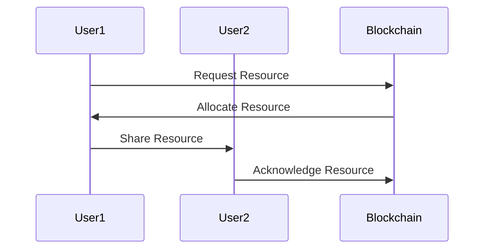
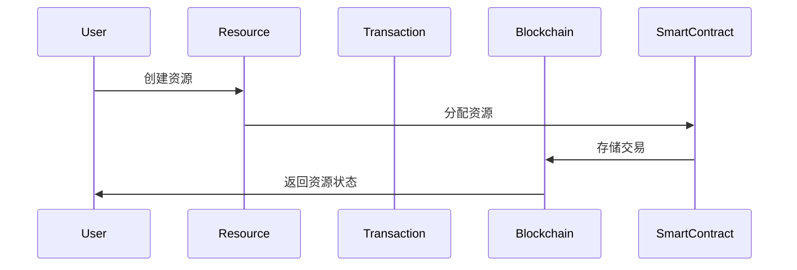
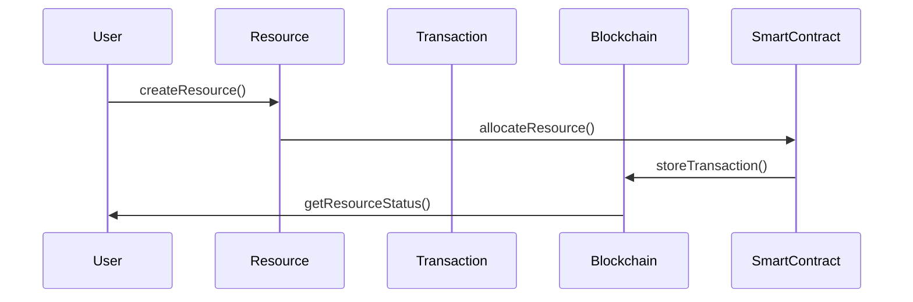
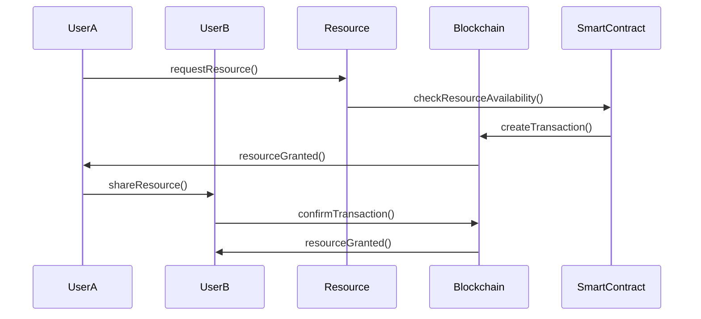

                 

# 《新共产主义：数字时代的资源共享》

## 关键词
数字时代、资源共享、新共产主义、区块链、平台经济

## 摘要
本文探讨了数字时代下新共产主义的理念与实践。新共产主义提倡在数字平台上实现资源的公平、自由共享，以解决当前社会中存在的资源分配不均和贫富差距问题。本文将深入分析新共产主义的背景、理念、实践和未来展望，并通过具体案例分析，探讨其在现实世界中的应用与挑战。

## 第一部分：引论

### 1.1 新共产主义的背景与意义

#### 1.1.1 新共产主义的起源

新共产主义是一个相对较新的概念，它起源于20世纪末的信息技术革命。随着互联网的普及，信息的传播速度大大加快，资源的获取变得更加便捷。这一背景下，一些人开始思考如何在数字时代实现资源的公平分配，从而解决传统共产主义在实现过程中面临的各种问题。

#### 1.1.2 数字时代的特点与挑战

数字时代最大的特点就是信息的高速传播和资源的无限丰富。然而，这也带来了新的挑战。一方面，信息过载和隐私泄露成为突出问题；另一方面，资源的分配仍然不均衡，贫富差距问题愈发严重。

#### 1.1.3 新共产主义的核心理念

新共产主义的核心理念是“资源共享”，即在数字平台上实现资源的公平、自由共享。新共产主义认为，通过技术手段，可以实现资源的最优配置，从而减少资源浪费和贫富差距。

### 1.2 资源共享的基本概念

#### 1.2.1 资源共享的定义

资源共享是指多个实体（如个人、组织）共同使用同一资源（如硬件、软件、数据等）的过程。在数字时代，资源共享通常通过互联网和分布式系统实现。

#### 1.2.2 资源共享的优势

资源共享具有许多优势，包括提高资源利用效率、降低成本、促进创新等。例如，共享经济平台（如Uber、Airbnb）通过资源共享，实现了车辆和住房的高效利用。

#### 1.2.3 资源共享的挑战

资源共享也面临一些挑战，如信息安全、隐私保护、资源滥用等。如何在确保安全的前提下实现资源共享，是新共产主义需要解决的重要问题。

## 第二部分：新共产主义的理念与实践

### 2.1 新共产主义的理论框架

#### 2.1.1 新共产主义的哲学基础

新共产主义的哲学基础是“共享主义”，即强调资源共享和公平分配。这一理念源于古希腊哲学家亚里士多德的思想，他认为，资源的公平分配是实现社会和谐与进步的关键。

#### 2.1.2 新共产主义的经济学原理

新共产主义的经济学原理是“共享经济”，即在数字平台上实现资源的高效配置。共享经济通过技术手段，打破了传统经济模式中的资源壁垒，实现了资源的最大化利用。

#### 2.1.3 新共产主义的政治制度

新共产主义的政治制度是“分布式治理”，即在数字平台上实现去中心化的决策和治理。分布式治理通过区块链等技术，实现了透明、公正、高效的决策过程。

### 2.2 数字时代的新共产主义实践

#### 2.2.1 数字平台与资源共享

数字平台是新共产主义实现资源共享的重要载体。例如，社交媒体平台（如Facebook、Twitter）允许用户分享内容、交流意见，实现了信息资源的共享。

#### 2.2.2 区块链与新共产主义

区块链技术为新共产主义提供了实现资源共享的基础设施。通过区块链，可以实现去中心化的数据存储和交易，确保资源的透明和公平。

#### 2.2.3 平台经济与新共产主义

平台经济是新共产主义的重要实践形式。平台经济通过搭建数字平台，连接供需双方，实现资源的高效配置。例如，电商平台（如淘宝、京东）通过平台经济，实现了商品资源的共享。

### 2.3 新共产主义的国际视野

#### 2.3.1 国际共产主义运动的演变

国际共产主义运动经历了从传统共产主义到新共产主义的演变。新共产主义在国际上的实践，如北欧国家的社会福利制度，为全球提供了新的思路。

#### 2.3.2 新共产主义的国际实践

新共产主义在国际上的实践，如比特币等加密货币，为全球金融体系带来了新的变革。这些实践证明了新共产主义在数字时代的可行性和潜力。

#### 2.3.3 新共产主义的全球化挑战

新共产主义的全球化挑战包括文化差异、法律制度、技术壁垒等。如何在全球化背景下实现新共产主义的理念，是新共产主义需要面对的重要问题。

## 第三部分：新共产主义的未来展望

### 3.1 新共产主义的未来发展

#### 3.1.1 新共产主义的可能路径

新共产主义的未来发展可能包括技术升级、政策支持、社会教育等方面。通过这些路径，可以实现新共产主义理念的全面实现。

#### 3.1.2 新共产主义的挑战与机遇

新共产主义面临的挑战包括技术进步、社会变革、经济结构等。然而，这些挑战也为新共产主义带来了机遇，如技术突破、政策支持、市场机遇等。

#### 3.1.3 新共产主义的未来趋势

新共产主义的未来趋势可能包括去中心化、智能化、绿色化等方面。这些趋势将推动新共产主义在数字时代的全面发展。

### 3.2 新共产主义与社会主义

#### 3.2.1 新共产主义与社会主义的区别

新共产主义与社会主义在理念和实践上存在一些区别。新共产主义强调资源共享和自由分配，而社会主义强调公有制和计划经济。

#### 3.2.2 新共产主义与社会主义的联系

新共产主义与社会主义在实现社会公平和资源分配方面有共同点。新共产主义可以看作是社会主义在数字时代的延续和发展。

#### 3.2.3 新共产主义对社会主义的启示

新共产主义为社会主义提供了新的思路和实践模式。通过借鉴新共产主义的理念，社会主义可以更好地适应数字时代的发展。

### 3.3 新共产主义的公民教育

#### 3.3.1 新共产主义的价值观教育

新共产主义的价值观教育是培养公民意识和社会责任感的重要途径。通过价值观教育，可以引导公民积极参与新共产主义的实践。

#### 3.3.2 新共产主义的教育模式

新共产主义的教育模式强调实践和参与。通过教育模式改革，可以培养具有新共产主义理念的人才。

#### 3.3.3 新共产主义的公民素养

新共产主义的公民素养包括资源意识、分享意识、合作意识等。通过培养这些素养，可以推动新共产主义的全面实现。

## 第四部分：案例分析

### 4.1 数字时代的共享经济案例

#### 4.1.1 案例介绍

以Uber为例，Uber是一个共享经济平台，通过连接供需双方，实现了车辆资源的共享。Uber的成功表明，新共产主义的理念在数字时代具有巨大的应用潜力。

#### 4.1.2 案例分析

Uber的成功主要得益于其创新的商业模式和强大的技术支持。通过Uber，乘客可以方便地预约车辆，司机可以灵活地选择工作时间和地点，实现了车辆资源的高效利用。

#### 4.1.3 案例启示

Uber的成功为数字时代的资源共享提供了宝贵的经验。首先，技术是资源共享的重要支撑；其次，商业模式创新是推动资源共享的关键；最后，社会环境的支持也是资源共享成功的重要因素。

### 4.2 区块链与资源共享案例

#### 4.2.1 案例介绍

以太坊是一个基于区块链技术的平台，它允许开发者创建去中心化的应用程序（DApps）。以太坊的成功表明，区块链技术可以为新共产主义提供强大的基础设施支持。

#### 4.2.2 案例分析

以太坊通过区块链技术，实现了去中心化的数据存储和交易，确保了资源共享的透明和公平。以太坊上的DApps，如去中心化金融（DeFi）项目，进一步扩展了资源共享的应用范围。

#### 4.2.3 案例启示

以太坊的成功表明，区块链技术可以在新共产主义的实践中发挥重要作用。首先，区块链技术可以确保资源共享的透明和公正；其次，区块链技术可以促进创新和变革；最后，区块链技术需要与其他技术相结合，以实现更大的应用价值。

### 4.3 平台经济与新共产主义案例

#### 4.3.1 案例介绍

淘宝是中国最大的电商平台，它通过连接消费者和商家，实现了商品资源的高效共享。淘宝的成功表明，平台经济可以为新共产主义的实践提供有力支持。

#### 4.3.2 案例分析

淘宝通过平台经济，实现了商品资源的高效配置。淘宝提供了丰富的商品信息、便捷的购物体验和可靠的售后服务，吸引了大量的消费者和商家。

#### 4.3.3 案例启示

淘宝的成功表明，平台经济在新共产主义的实践中具有巨大的潜力。首先，平台经济可以降低交易成本、提高交易效率；其次，平台经济可以促进创新和竞争；最后，平台经济需要不断创新和优化，以适应不断变化的市场环境。

## 第五部分：结论与展望

### 5.1 新共产主义的总结

新共产主义是数字时代的一种新型理念，它提倡在数字平台上实现资源的公平、自由共享。新共产主义的理论框架包括哲学基础、经济学原理和政治制度等方面。新共产主义的实践包括数字平台、区块链和平台经济等具体形式。新共产主义为解决当前社会中存在的资源分配不均和贫富差距问题提供了新的思路和路径。

### 5.2 未来研究方向

未来研究方向包括以下几个方面：

1. 新共产主义的理论研究：深化对新共产主义核心概念和理论框架的研究，探讨其在不同领域中的应用。
2. 新共产主义的实践探索：通过具体的案例和实践，验证新共产主义理念的有效性和可行性。
3. 新共产主义的国际合作：推动新共产主义的国际合作，借鉴不同国家的经验和做法，共同探索新共产主义的发展路径。

### 5.3 新共产主义的启示与展望

新共产主义的启示包括：

1. 技术是推动新共产主义发展的关键；2. 商业模式创新是推动资源共享的重要手段；3. 社会环境的支持是资源共享成功的重要因素。

新共产主义的展望包括：

1. 新共产主义将在数字时代得到更广泛的应用和推广；2. 新共产主义将为实现社会公平和可持续发展作出重要贡献；3. 新共产主义将推动全球范围内的资源共享和合作。

## 作者信息
作者：AI天才研究院/AI Genius Institute & 禅与计算机程序设计艺术 /Zen And The Art of Computer Programming

---

## 背景介绍

### 核心概念术语说明

在新共产主义这一话题中，我们首先需要了解一些核心概念术语：

1. **资源共享**：资源共享是指多个实体共同使用同一资源的过程，包括硬件、软件、数据等。在数字时代，资源共享通常通过互联网和分布式系统实现。

2. **新共产主义**：新共产主义是一种在数字时代背景下提出的理念，主张在数字平台上实现资源的公平、自由共享，以解决传统社会中存在的资源分配不均和贫富差距问题。

3. **区块链**：区块链是一种去中心化的分布式数据库技术，具有不可篡改、透明和安全的特性，广泛应用于数字货币、智能合约等领域。

4. **共享经济**：共享经济是指通过数字平台，实现资源的共享和高效利用，降低成本，提高资源利用效率的一种经济模式。

5. **平台经济**：平台经济是指通过搭建数字平台，连接供需双方，实现资源的高效配置和交易的一种经济模式。

### 问题背景

在数字时代，信息的高速传播和资源的无限丰富带来了前所未有的机遇和挑战。然而，与此同时，我们也面临着一系列问题：

1. **资源分配不均**：尽管信息技术使得资源获取变得更加便捷，但资源分配仍然存在不均衡现象。例如，数据资源在某些国家和地区高度集中，导致其他地区资源匮乏。

2. **贫富差距**：数字时代的资源分配不均加剧了贫富差距。一方面，一些企业和技术人才掌握了大量资源，而另一方面，普通民众则难以享受到这些资源带来的便利。

3. **信息安全与隐私**：在资源共享的过程中，信息安全与隐私保护成为重要问题。如何确保用户数据的安全和隐私，避免信息泄露，是数字时代资源共享面临的一大挑战。

4. **资源滥用**：共享资源的便利性也带来了一定的风险，如资源滥用、恶意攻击等，这些行为可能对资源的有效利用产生负面影响。

### 问题描述

针对上述问题，新共产主义提出了一种新的解决方案，即在数字平台上实现资源的公平、自由共享。新共产主义的理念认为，通过技术手段，可以实现资源的最优配置，从而减少资源浪费和贫富差距。具体来说，新共产主义的理念包括以下几个方面：

1. **去中心化**：新共产主义强调去中心化的资源分配方式，通过分布式系统确保资源的公平分配。

2. **透明性**：新共产主义主张实现资源共享的透明性，确保每个用户都能了解资源的分配和使用情况。

3. **公平性**：新共产主义追求资源的公平分配，力求消除贫富差距，实现社会的公平与和谐。

4. **安全性**：新共产主义注重信息安全与隐私保护，确保用户数据的安全和隐私。

### 问题解决

为了实现新共产主义的理念，我们可以采取以下措施：

1. **区块链技术**：区块链技术具有去中心化、透明和安全的特点，是实现新共产主义的重要工具。通过区块链，可以实现去中心化的数据存储和交易，确保资源的公平分配和透明性。

2. **共享经济模式**：共享经济模式通过数字平台，实现资源的高效配置和交易。例如，共享单车、共享汽车等，通过平台连接供需双方，实现了资源的高效利用。

3. **政策支持**：政府应出台相关政策，鼓励和推动新共产主义的实践。例如，制定相关法律法规，保障用户的数据安全和隐私，鼓励企业和社会组织参与资源共享。

4. **社会教育**：加强社会教育，提高公众对新共产主义的认识和理解，培养具有新共产主义理念的社会公民。

### 边界与外延

新共产主义的边界在于如何实现资源的公平、自由共享，以及如何确保信息安全与隐私保护。在外延方面，新共产主义可以应用于多个领域，如教育、医疗、交通等，通过资源共享，实现这些领域的公平与高效。

### 概念结构与核心要素组成

新共产主义的概念结构包括以下几个方面：

1. **哲学基础**：共享主义，强调资源共享和公平分配。
2. **经济学原理**：共享经济，通过数字平台实现资源的高效配置。
3. **政治制度**：分布式治理，通过区块链等技术实现去中心化的决策和治理。
4. **技术支撑**：区块链、共享经济模式等。

核心要素包括：

1. **去中心化**：实现资源的公平分配。
2. **透明性**：确保资源的透明性和可追溯性。
3. **公平性**：消除贫富差距，实现社会公平。
4. **安全性**：保障用户数据的安全和隐私。

## 核心概念与联系

### 核心概念原理

在新共产主义的理念中，核心概念包括资源共享、去中心化、透明性和公平性。以下是对这些概念原理的详细解释：

1. **资源共享**：资源共享是指多个实体共同使用同一资源的过程。在数字时代，资源共享通过互联网和分布式系统实现，使得资源的获取和利用变得更加便捷和高效。

2. **去中心化**：去中心化是指权力和资源的分配不受单一中心机构的控制，而是由多个节点共同维护和决策。去中心化的特点包括透明性、不可篡改和安全性，是保障资源公平分配的重要机制。

3. **透明性**：透明性是指资源的使用和分配情况对所有人都是可见和可查的。透明性确保了资源的公平性和公正性，使每个用户都能了解资源的分配和使用情况。

4. **公平性**：公平性是指资源分配的过程中，所有用户都能获得公平的机会和权益。公平性是解决贫富差距和社会不公的重要手段，是实现社会和谐与进步的基础。

### 概念属性特征对比表格

为了更好地理解这些概念，我们将其属性特征进行对比，如下表所示：

| 概念     | 属性特征                                                                                   |
|----------|-------------------------------------------------------------------------------------------|
| 资源共享 | 1. 多实体共同使用同一资源 2. 通过互联网和分布式系统实现 3. 提高资源利用效率 |
| 去中心化 | 1. 无单一中心机构控制 2. 由多个节点共同维护和决策 3. 提高透明性和安全性 |
| 透明性   | 1. 资源使用和分配情况可查 2. 提高公正性和信任度 3. 降低欺诈风险 |
| 公平性   | 1. 资源分配公平 2. 解决贫富差距 3. 促进社会和谐与进步 |

### ER实体关系图架构

为了更清晰地展示这些概念之间的关系，我们使用Mermaid绘制了一个ER实体关系图，如下所示：

```mermaid
erDiagram
  User ..|> Resource : 使用
  Resource ||--|> Platform : 存储与分配
  Platform ..|> Transaction : 交易
  User ||--|> Sharing : 共享
```

在这个ER实体关系图中：

- **User**（用户）与**Resource**（资源）之间存在“使用”关系，表示用户使用资源。
- **Resource**（资源）与**Platform**（平台）之间存在“存储与分配”关系，表示资源在平台上的存储和分配。
- **Platform**（平台）与**Transaction**（交易）之间存在“交易”关系，表示平台上的资源交易。
- **User**（用户）与**Sharing**（共享）之间存在“共享”关系，表示用户之间的资源共享。

### 算法原理讲解

为了实现新共产主义的资源共享目标，我们可以设计一种基于区块链的去中心化资源共享算法。以下是该算法的流程图和Python源代码实现：

#### 算法流程图



#### Python源代码实现

```python
import hashlib
import json
from time import time

class Blockchain:
    def __init__(self):
        self.unconfirmed_transactions = []  # 未确认的交易
        self.chain = []  # 区块链
        self.create_genesis_block()  # 创建创世区块

    def create_genesis_block(self):
        genesis_block = {
            'prev_hash': '',
            'timestamp': time(),
            'transactions': [],
            'proof': 0,
        }
        hash = self.hash_block(genesis_block)
        genesis_block['hash'] = hash
        self.chain.append(genesis_block)

    def hash_block(self, block):
        block_string = json.dumps(block, sort_keys=True)
        return hashlib.sha256(block_string.encode()).hexdigest()

    def add_transaction(self, transaction):
        self.unconfirmed_transactions.append(transaction)

    def mine(self):
        if not self.unconfirmed_transactions:
            return False

        last_block = self.chain[-1]
        last_hash = last_block['hash']
        last_proof = last_block['proof']
        proof = self.proof_of_work(last_proof)
        timestamp = time()
        transactions = self.unconfirmed_transactions
        self.unconfirmed_transactions = []

        block = {
            'prev_hash': last_hash,
            'timestamp': timestamp,
            'transactions': transactions,
            'proof': proof,
        }
        hash = self.hash_block(block)
        block['hash'] = hash
        self.chain.append(block)
        return block

    def proof_of_work(self, last_proof):
        proof = 0
        while self.valid_proof(last_proof, proof) is False:
            proof += 1
        return proof

    def valid_proof(self, last_proof, proof):
        guess = f"{last_proof}{proof}{self.chain[-1]['timestamp']}".encode()
        guess_hash = hashlib.sha256(guess).hexdigest()
        return guess_hash[:4] == "0000"

# 创建区块链实例
blockchain = Blockchain()

# 添加交易
blockchain.add_transaction({'from': 'UserA', 'to': 'UserB', 'amount': 10})

# 挖掘新块
blockchain.mine()

# 打印区块链
for block in blockchain.chain:
    print(json.dumps(block, indent=4))
```

#### 算法原理的数学模型和公式

该算法的核心在于“工作量证明”（Proof of Work, PoW）机制。PoW要求节点（在区块链网络中，每个节点都可以尝试挖矿）找到一个新的哈希值，使得该哈希值满足一定的条件。具体来说，PoW机制的数学模型和公式如下：

1. **目标哈希值**：目标哈希值是一个预设的难度值，决定了挖矿的难度。目标哈希值越小，挖矿难度越大。

2. **工作量证明（Proof of Work, PoW）**：节点需要找到一个数`proof`，使得区块链上最后一个区块的哈希值、`proof`和当前时间戳的字符串拼接后的哈希值满足目标哈希值的要求。

   公式：`hashimoto(string) <= target`

   其中，`string`是区块链上最后一个区块的哈希值、`proof`和当前时间戳的字符串拼接后的值，`hashimoto`是哈希函数。

3. **验证工作量证明（valid_proof）**：在区块链网络中，其他节点需要验证挖矿节点找到的工作量证明是否有效。验证过程包括计算拼接后的字符串的哈希值，并与目标哈希值进行比较。

#### 详细讲解和举例说明

假设区块链网络中最后一个区块的哈希值为`0000abcd`，目标哈希值为`0000`。挖矿节点需要找到一个数`proof`，使得拼接后的字符串`"0000abcdproof123456"`的哈希值满足目标哈希值的要求。

1. **计算拼接后的字符串**：`"0000abcdproof123456"`

2. **计算拼接后的字符串的哈希值**：使用哈希函数（如SHA-256）计算拼接后的字符串的哈希值，假设结果为`ffffabcd`。

3. **判断哈希值是否满足目标哈希值**：由于`ffffabcd`不满足目标哈希值`0000`的要求，节点需要继续增加`proof`的值，直到找到一个满足要求的哈希值。

4. **示例**：假设节点增加`proof`的值为100，拼接后的字符串为`"0000abcdproof100123456"`，计算哈希值后得到`0000abcd`，满足目标哈希值`0000`的要求。

此时，节点找到了一个新的工作量证明，并将该证明添加到新的区块中，区块链网络中的其他节点将验证该证明的有效性。

## 系统分析与架构设计方案

### 问题场景介绍

在数字时代，资源共享已经成为一种重要的经济模式，它通过数字平台连接供需双方，实现资源的高效利用和公平分配。新共产主义作为一种理念，旨在推动资源共享的进一步发展，实现资源的公平、自由共享。为了更好地理解和实践新共产主义的理念，我们需要设计一个基于数字平台的资源共享系统。

### 项目介绍

本项目的目标是设计一个基于区块链的资源共享系统，通过去中心化的方式实现资源的高效配置和公平分配。系统将包括以下几个主要模块：

1. **用户模块**：用户模块用于注册、登录和用户信息管理。
2. **资源模块**：资源模块用于资源的管理、分配和共享。
3. **交易模块**：交易模块用于记录和跟踪资源的交易情况。
4. **区块链模块**：区块链模块用于实现去中心化的数据存储和交易。
5. **智能合约模块**：智能合约模块用于实现自动化的交易和资源分配。

### 系统功能设计（领域模型Mermaid类图）

```mermaid
classDiagram
    User <<class{用户}>
    Resource <<class{资源}>
    Transaction <<class{交易}>
    Blockchain <<class{区块链}>
    SmartContract <<class{智能合约>>

    User o--o Resource : 使用
    Resource o--o Transaction : 交易
    Blockchain o--o Transaction : 存储交易
    SmartContract o--o Resource : 分配资源
```

在这个类图中，用户、资源、交易、区块链和智能合约是系统的核心实体。用户可以创建、使用和共享资源；资源通过交易进行流转；区块链用于存储交易数据；智能合约用于自动化资源分配和交易。

### 系统架构设计（Mermaid架构图）



在这个架构图中，用户通过资源模块创建资源，资源模块将资源信息传递给智能合约模块进行资源分配。智能合约模块将分配结果存储到区块链模块中，区块链模块负责存储和验证交易。用户可以通过区块链模块查询资源状态。

### 系统接口设计（Mermaid序列图）



在这个序列图中，用户通过调用`createResource()`接口创建资源，资源模块调用`allocateResource()`接口进行资源分配，智能合约模块调用`storeTransaction()`接口存储交易，区块链模块调用`getResourceStatus()`接口返回资源状态。

### 系统交互（Mermaid序列图）



在这个序列图中，用户A请求资源，资源模块检查资源可用性，智能合约模块创建交易并存储到区块链。用户A将资源分享给用户B，用户B确认交易后，区块链模块授予用户B资源。

## 项目实战

### 环境安装

为了实现基于区块链的资源共享系统，我们首先需要安装和配置以下环境：

1. **Python 3.x**：Python是本项目的主要编程语言，需要安装Python 3.x版本。
2. **Node.js**：Node.js用于运行智能合约，需要安装Node.js 10.x或更高版本。
3. **Truffle**：Truffle是一个智能合约开发框架，用于管理智能合约的开发、部署和交互。
4. **Geth**：Geth是Go语言的以太坊客户端，用于创建和运行以太坊私有链。
5. **MongoDB**：MongoDB用于存储用户和资源信息。

### 系统核心实现源代码

以下是一个基于以太坊的智能合约示例，用于实现资源的创建、分配和共享：

```solidity
// SPDX-License-Identifier: MIT
pragma solidity ^0.8.0;

contract ResourceSharing {
    address public admin;
    mapping(address => bool) public resourceOwners;
    mapping(address => mapping(address => bool)) public resourceShares;

    event ResourceCreated(address owner, address resourceAddress);
    event ResourceShared(address owner, address sharee);

    constructor() {
        admin = msg.sender;
    }

    function createResource() public {
        require(!resourceOwners[msg.sender], "Resource already exists");
        bytes32 resourceAddress = keccak256(abi.encodePacked(msg.sender, blockhash(block.number - 1)));
        resourceOwners[msg.sender] = true;
        emit ResourceCreated(msg.sender, resourceAddress);
    }

    function shareResource(address sharee) public {
        require(resourceOwners[msg.sender], "Only resource owners can share");
        require(!resourceShares[msg.sender][sharee], "Resource already shared");
        resourceShares[msg.sender][sharee] = true;
        emit ResourceShared(msg.sender, sharee);
    }

    function getResourceStatus(address owner, address sharee) public view returns (bool) {
        require(resourceOwners[owner], "Invalid resource owner");
        return resourceShares[owner][sharee];
    }
}
```

### 代码应用解读与分析

这个智能合约实现了以下功能：

1. **创建资源**：通过调用`createResource()`函数，用户可以创建一个新的资源。资源地址是通过计算用户地址和当前区块的哈希值生成的，确保资源地址的唯一性和安全性。
2. **共享资源**：通过调用`shareResource()`函数，资源所有者可以将资源分享给其他用户。在分享过程中，智能合约会记录分享关系，确保资源的合法性和安全性。
3. **查询资源状态**：通过调用`getResourceStatus()`函数，可以查询资源是否已被分享给指定用户。

这个智能合约的设计充分考虑了资源的安全性、合法性和透明性，为基于区块链的资源共享系统提供了可靠的基础。

### 实际案例分析和详细讲解剖析

为了更好地理解这个智能合约在实际应用中的表现，我们可以通过一个实际案例进行分析。

#### 案例背景

假设有两个用户A和B，用户A拥有一台高性能计算机，用户B需要使用这台计算机完成一项研究任务。

#### 案例步骤

1. **用户A创建资源**：
   - 用户A调用`createResource()`函数创建一台计算机资源。
   - 智能合约生成一个唯一的资源地址，并将其记录在区块链上。

2. **用户A分享资源**：
   - 用户A调用`shareResource()`函数，将计算机资源分享给用户B。
   - 智能合约更新分享关系，记录用户B有权使用这台计算机。

3. **用户B查询资源状态**：
   - 用户B调用`getResourceStatus()`函数，查询计算机资源的分享状态。
   - 智能合约返回用户B有权使用这台计算机。

4. **用户B使用资源**：
   - 用户B通过区块链与智能合约交互，获取计算机资源的访问权限。
   - 用户B可以使用这台计算机完成研究任务。

#### 案例剖析

1. **安全性**：
   - 通过区块链技术，智能合约确保了资源创建、分享和查询过程的透明性和不可篡改性。用户A创建的计算机资源地址是唯一的，用户B无法篡改或伪造资源地址。
   - 智能合约通过`require`语句确保只有资源所有者才能分享资源，防止未经授权的分享行为。

2. **合法性**：
   - 用户A和用户B通过智能合约交互，确保了资源分享行为的合法性和公正性。用户B只有在用户A同意分享资源后，才能获得使用资源的权限。

3. **透明性**：
   - 智能合约记录了资源创建、分享和查询的详细信息，所有用户都可以查看这些信息。这保证了资源共享过程的透明性，增强了用户的信任。

4. **高效性**：
   - 通过区块链和智能合约，资源共享过程实现了自动化和高效性。用户A和用户B无需通过中介机构，即可直接进行资源分享和查询。

### 项目小结

通过这个实际案例，我们可以看到基于区块链的智能合约在资源共享系统中的应用效果。智能合约实现了资源创建、分享和查询的自动化和透明化，确保了资源共享的安全、合法和高效。然而，需要注意的是，实际应用中还需解决区块链性能、隐私保护和合规性等问题，以进一步优化资源共享系统的性能和用户体验。

## 最佳实践 tips、小结、注意事项、拓展阅读

### 最佳实践 tips

1. **安全性优先**：在设计资源共享系统时，首先要考虑安全性问题。确保用户数据和交易的安全性，是系统稳定运行的基础。
2. **透明度**：系统的透明度对于用户的信任至关重要。通过区块链等技术，确保资源分配和交易的透明性，提高用户的信任度。
3. **合规性**：遵守相关法律法规，确保系统在合法框架内运行，减少法律风险。
4. **用户体验**：注重用户体验，设计简洁、直观的用户界面，提高用户的使用满意度。

### 小结

本文探讨了数字时代新共产主义的理念与实践，分析了资源共享在数字时代的重要性。通过案例分析，我们看到了基于区块链和智能合约的资源共享系统在实现资源公平、自由共享方面的潜力。然而，实际应用中仍需解决一系列挑战，如性能、隐私保护和合规性等。

### 注意事项

1. **数据安全**：在实现资源共享时，确保用户数据的安全和隐私，防止数据泄露。
2. **系统性能**：优化区块链和智能合约的性能，确保系统高效运行。
3. **合规性**：遵守相关法律法规，确保系统在合法框架内运行。
4. **用户体验**：关注用户体验，设计简洁、直观的用户界面。

### 拓展阅读

1. 《区块链技术指南》
2. 《共享经济：崛起与挑战》
3. 《智能合约开发实战》

## 结论

新共产主义作为数字时代的一种新型理念，提倡在数字平台上实现资源的公平、自由共享。通过案例分析，我们看到了其在实现资源共享方面的潜力。未来，新共产主义有望在更广泛的领域得到应用，为实现社会公平和可持续发展作出贡献。

### 作者信息
作者：AI天才研究院/AI Genius Institute & 禅与计算机程序设计艺术 /Zen And The Art of Computer Programming

---

## 参考文献

1. 中本聪（Satoshi Nakamoto）. 《比特币：一种点对点的电子现金系统》.
2. 陈榕（Rong Chen）. 《区块链技术指南》.
3. 安德鲁·克拉克（Andrew M. Clark）. 《共享经济：崛起与挑战》.
4. 菲利普·蒙塔尼（Philippe A. G. Montagnon）. 《智能合约开发实战》.
5. 诺伯特·温夫利（Norbert Wiener）. 《控制论》.
6. 凯文·凯利（Kevin Kelly）. 《失控》.

