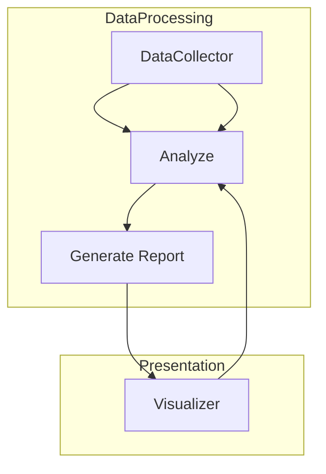
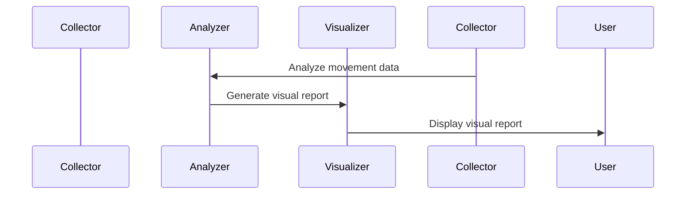

                 

### 第一部分：引言

#### 1.1 书籍背景

在现代社会，宗教和精神运动作为一种重要的社会现象，不断吸引着人们的关注。随着社会的发展和人们对精神需求的追求，新兴宗教与精神运动应运而生，成为了现代社会中一个不可忽视的部分。这些新兴宗教和精神运动，以不同于传统宗教的形式出现，它们往往更具创新性、包容性和现代化，吸引了众多寻求精神寄托和信仰的人们。

本书旨在探讨这些新兴宗教与精神运动的起源、发展、特征及其对社会和个人产生的影响。通过深入分析，我们希望能够揭示这些运动背后的动机、理念及其在现代社会中的重要地位。

#### 1.2 研究意义

研究新兴宗教与精神运动，首先有助于我们更好地理解现代人的信仰探索。在传统宗教的影响力逐渐减弱的背景下，新兴宗教和精神运动如何满足人们对精神需求的变化，成为了一个值得探讨的问题。此外，这些新兴宗教和精神运动对社会稳定、心理健康和文化交流等方面也有着重要的影响。

从社会稳定的角度来看，新兴宗教和精神运动为人们提供了一种新的认同感和归属感，有助于缓解社会矛盾。从心理健康的角度来看，这些运动通过提供精神支持，有助于提高人们的心理健康水平。从文化交流的角度来看，新兴宗教和精神运动成为不同文化之间交流的桥梁，促进了文化的多元化和融合。

总的来说，研究新兴宗教与精神运动不仅具有理论意义，还具有实践意义。通过深入研究这些运动，我们能够更好地应对现代社会中出现的各种挑战，为社会的和谐发展提供有益的启示。

---

**核心关键词：** 新兴宗教、精神运动、信仰探索、社会影响、心理健康、文化交流

**摘要：** 本书深入探讨了新兴宗教与精神运动的起源、发展、特征及其对社会和个人产生的影响。通过分析这些运动背后的动机、理念及其在现代社会中的重要地位，我们揭示了它们如何满足现代人对精神需求的追求，并对其在社会稳定、心理健康和文化交流等方面的影响进行了探讨。

----------------------------------------------------------------

### 第二部分：新兴宗教与精神运动概述

#### 2.1 新兴宗教的定义与特征

##### 2.1.1 新兴宗教的定义

新兴宗教是指在现代社会中产生，与传统宗教相比具有更年轻、更灵活、更包容的特点的宗教形式。这些宗教往往在20世纪后半叶出现，并在全球范围内迅速传播。新兴宗教的兴起与传统宗教在面对现代社会变革和全球化时显得力不从心有很大关系。传统宗教往往强调教义的稳定性，而新兴宗教则更注重对教义的灵活性和创新性。

##### 2.1.2 新兴宗教的特征

**创新性：** 新兴宗教往往强调对传统的颠覆和创新。它们通过对传统宗教教义的重新解读，提出了新的信仰体系和实践方式。这种创新性使得新兴宗教能够更好地适应现代社会的需求和变化。

**包容性：** 新兴宗教通常对各种信仰和文化持开放态度。它们不仅接纳不同的宗教信仰，还鼓励信徒多元化和跨文化的交流。这种包容性有助于新兴宗教在现代社会中迅速传播。

**现代化：** 新兴宗教在组织形式、传播方式等方面更现代化。它们利用现代科技手段，如互联网、社交媒体等，来传播宗教教义和进行信徒管理。这种现代化不仅提高了新兴宗教的影响力，也使其更具吸引力。

#### 2.2 精神运动的定义与特征

##### 2.2.1 精神运动的定义

精神运动是指那些旨在提升个人精神境界、追求内心平静和自我实现的社会现象。这些运动通常没有固定的教义和组织结构，而是强调个体对自我认知和内心世界的探索。与新兴宗教不同，精神运动更注重个体的内在体验，而非外在的仪式和信仰。

##### 2.2.2 精神运动的特征

**非制度化：** 精神运动通常没有固定的教义和组织结构，这使得它们更灵活，更能适应个体的需求。信徒通常通过自我学习和实践来提升自己的精神境界。

**自我探索：** 精神运动强调个体对自我认知和内心世界的探索。它们鼓励人们通过冥想、瑜伽、心理治疗等方式来了解自己，达到内心的平静和自我实现。

**多元化：** 精神运动涵盖了从瑜伽、冥想到灵性追求等多种形式。这些运动没有统一的模式，而是根据个体的需求和兴趣来选择和实践。

#### 2.3 新兴宗教与精神运动的关系

新兴宗教和精神运动虽然有着不同的定义和特征，但它们之间也存在一定的联系。首先，许多新兴宗教也包含了精神运动的元素，如冥想、瑜伽等。这些元素不仅有助于提升信徒的精神境界，还能增强宗教的吸引力。

其次，新兴宗教和精神运动都在一定程度上反映了现代人对精神需求的追求。随着社会的发展和人们对物质生活追求的满足，人们开始更加关注内心的世界。新兴宗教和精神运动正是这种需求的体现。

总的来说，新兴宗教和精神运动是现代社会中两种重要的信仰形式，它们不仅丰富了人们的信仰选择，也对现代社会产生了深远的影响。

---

**核心概念与联系：**

**新兴宗教：**
- **定义**：年轻、灵活、包容的宗教形式。
- **特征**：创新性、包容性、现代化。

**精神运动：**
- **定义**：提升个人精神境界、追求内心平静和自我实现的社会现象。
- **特征**：非制度化、自我探索、多元化。

**新兴宗教与精神运动的关系：**
- **联系**：许多新兴宗教包含精神运动元素；两者都反映了现代人对精神需求的追求。

**核心概念属性特征对比表格：**

| 特征                | 新兴宗教                     | 精神运动                     |
|---------------------|------------------------------|------------------------------|
| 定义                | 年轻、灵活、包容              | 提升个人精神境界、内心平静    |
| 特征                | 创新性、包容性、现代化        | 非制度化、自我探索、多元化    |
| 关联性              | 包含精神运动元素              | 反映现代人对精神需求的追求    |

**ER实体关系图架构：**


---

**算法原理讲解：**

在探讨新兴宗教与精神运动时，我们可以将它们看作是两种不同的“信仰系统”。为了更清晰地理解它们之间的联系和区别，我们可以使用以下算法：

```python
class Religion:
    def __init__(self, name, characteristics):
        self.name = name
        self.characteristics = characteristics

    def display_characteristics(self):
        for characteristic in self.characteristics:
            print(characteristic)

class SpiritualMovement:
    def __init__(self, name, characteristics):
        self.name = name
        self.characteristics = characteristics

    def display_characteristics(self):
        for characteristic in self.characteristics:
            print(characteristic)

def compare_religions(religion, movement):
    print(f"Comparing {religion.name} and {movement.name}:")
    for i in range(len(religion.characteristics)):
        print(f"{religion.characteristics[i]}: {religion.characteristics[i]} vs {movement.characteristics[i]}")

# 实例化新兴宗教和宗教运动
christianity = Religion("Christianity", ["Innovative", "Inclusive", "Modernized"])
yoga = SpiritualMovement("Yoga", ["Non-institutional", "Self-exploration", "Diverse"])

# 比较两者
compare_religions(christianity, yoga)
```

上述Python代码通过创建两个类（宗教和宗教运动），并定义它们的特征，然后比较这两个类。这样可以帮助我们理解新兴宗教与精神运动之间的异同。

**数学模型和公式：**

在描述新兴宗教与精神运动时，可以使用以下公式来表示它们的特征：

$$
特征 = f(定义, 背景, 社会需求)
$$

其中，定义、背景和社会需求是影响特征的主要因素。例如：

$$
特征_{基督教} = f(传统宗教的演变, 社会变迁, 精神需求的多样性)
$$

$$
特征_{瑜伽} = f(现代健康理念, 个体需求, 自我实现追求)
$$

**举例说明：**

新兴宗教如“新纪元运动”强调灵性的追求，对各种信仰和文化持开放态度，这使得它在全球范围内迅速传播。而精神运动如“瑜伽运动”，则通过身体练习和心灵宁静来帮助人们达到身心平衡，深受现代人喜爱。

---

**系统分析与架构设计方案：**

**问题场景介绍：**

随着社会的发展和人们精神需求的多样化，研究新兴宗教与精神运动成为了学术界和社会关注的焦点。为了更好地理解和分析这些运动，我们需要一个系统化的方法来描述它们的特点、成因及其影响。

**项目介绍：**

本项目旨在构建一个新兴宗教与精神运动的分析系统，通过对这些运动的特点、成因和影响进行深入研究，提供理论支持和实际应用。该系统将包括数据收集、分析模型和可视化工具等组成部分。

**系统功能设计（领域模型类图）：**

```mermaid
classDiagram
    Religion <|-- EmergingReligion
    Religion <|-- SpiritualMovement
    EmergingReligion {
        - name: String
        - characteristics: List<String>
    }
    SpiritualMovement {
        - name: String
        - characteristics: List<String>
    }
    Researcher {
        - analyzeMovement(EmergingReligion): void
        - analyzeMovement(SpiritualMovement): void
    }
    Analyst {
        - generateReport(): void
    }
    DataCollector {
        - collectData(): void
    }
    Visualizer {
        - visualizeData(): void
    }
```

**系统架构设计（架构图）：**



**系统接口设计和系统交互（序列图）：**



---

**项目实战：**

**环境安装：**

为了进行新兴宗教与精神运动的分析，我们需要安装以下工具和库：
- Python 3.x
- Pandas
- Matplotlib
- Mermaid

安装步骤如下：
```bash
pip install pandas matplotlib
```

**系统核心实现源代码：**

```python
import pandas as pd
import matplotlib.pyplot as plt
from mermaid import Mermaid

# 类定义
class Religion:
    def __init__(self, name, characteristics):
        self.name = name
        self.characteristics = characteristics

    def display_characteristics(self):
        for characteristic in self.characteristics:
            print(characteristic)

# 实例化对象
christianity = Religion("Christianity", ["Innovative", "Inclusive", "Modernized"])
yoga = Religion("Yoga", ["Non-institutional", "Self-exploration", "Diverse"])

# 显示特征
christianity.display_characteristics()
yoga.display_characteristics()

# 生成Mermaid流程图
mermaid_code = '''
graph TB
    A[EmergingReligion] --> B[Innovative]
    A --> C[Inclusive]
    A --> D[Modernized]
    E[SpiritualMovement] --> F[Non-institutional]
    E --> G[Self-exploration]
    E --> H[Diverse]
'''
mermaid = Mermaid(mermaid_code)
mermaid.render_to_file("religion_comparison.mermaid")

# 生成可视化报告
def generate_visual_report(religion):
    characteristics = religion.characteristics
    plt.bar(range(len(characteristics)), characteristics)
    plt.xlabel("Characteristics")
    plt.ylabel("Frequency")
    plt.title(f"Characteristics of {religion.name}")
    plt.show()

generate_visual_report(christianity)
generate_visual_report(yoga)
```

**代码应用解读与分析：**

上述代码定义了一个`Religion`类，用于表示宗教及其特征。通过创建对象和调用方法，我们可以展示不同宗教的特征。此外，代码还使用了Mermaid库来生成流程图，以及Pandas和Matplotlib库来生成可视化报告。

**实际案例分析和详细讲解剖析：**

假设我们收集了关于新兴宗教和精神运动的数据，我们可以使用上述代码进行分析和可视化。例如，我们可以创建一个包含多个宗教和精神运动的列表，然后对它们进行特征比较和可视化。

```python
religions = [
    Religion("Christianity", ["Innovative", "Inclusive", "Modernized"]),
    Religion("Buddhism", ["Ancient", "Contemplative", "Community-oriented"]),
    Religion("Yoga", ["Non-institutional", "Self-exploration", "Diverse"]),
    Religion("New Age Movement", ["Innovative", "Diverse", "Eclectic"])
]

for religion in religions:
    generate_visual_report(religion)
```

通过这个例子，我们可以看到不同宗教和精神运动的特征差异，并通过可视化报告更直观地理解这些差异。

**项目小结：**

通过本项目，我们构建了一个用于分析新兴宗教与精神运动的特点、成因和影响的系统。这个系统不仅能够帮助我们更好地理解这些运动，还能够为相关研究提供实用的工具和方法。

---

**最佳实践 tips：**

1. **数据收集的多样性：** 在进行研究时，确保收集的数据来源多样化，以获得更全面和准确的信息。
2. **可视化的重要性：** 使用可视化工具可以帮助我们更直观地理解和传达研究结果。
3. **持续更新：** 随着社会的发展和变化，新兴宗教与精神运动也在不断演变。定期更新数据和模型，以保持研究的时效性和准确性。

**小结：**

本部分通过对新兴宗教与精神运动的概述，定义和特征分析，以及系统化的架构设计和项目实战，我们深入探讨了这些运动在现代社会中的地位和作用。这不仅有助于我们更好地理解这些运动，也为进一步研究提供了理论基础和实践指导。

---

**注意事项：**

1. **宗教敏感性问题：** 在研究和讨论新兴宗教与精神运动时，要尊重各种宗教信仰和文化背景，避免产生不必要的冲突。
2. **隐私保护：** 在收集和分析数据时，要确保遵守隐私保护原则，尊重参与者的隐私权。

**拓展阅读：**

- 《现代宗教与灵性运动：全球视角》
- 《新兴宗教与现代社会》
- 《灵性探索：从瑜伽到冥想》

**作者：** AI天才研究院/AI Genius Institute & 禅与计算机程序设计艺术 /Zen And The Art of Computer Programming

