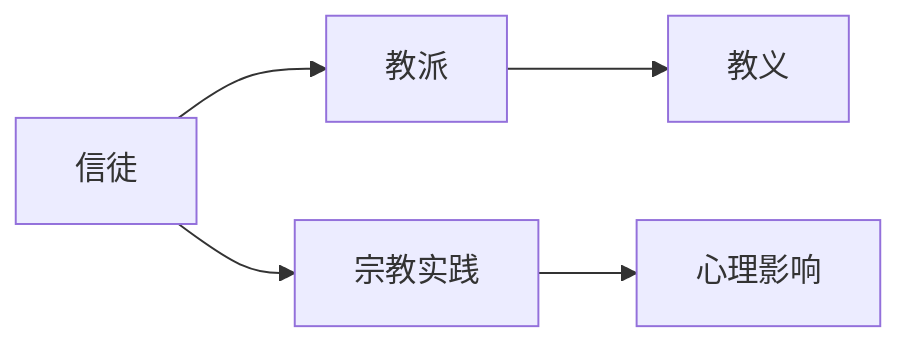
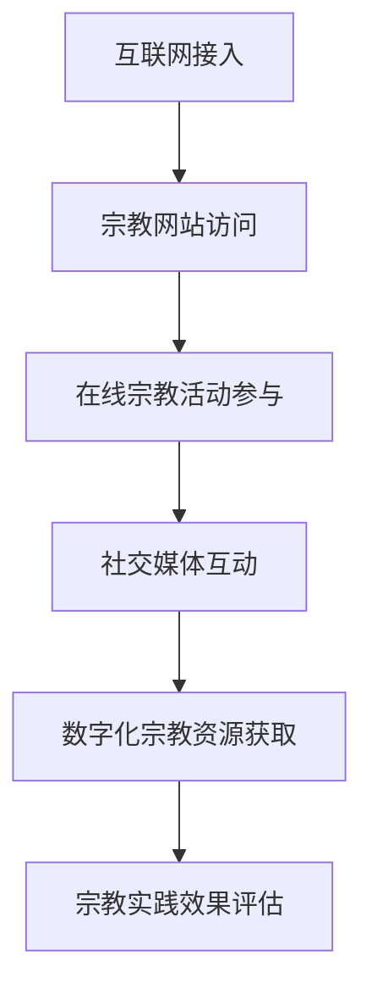

                 

# 新兴宗教：现代人的精神寄托

> 关键词：新兴宗教、现代精神寄托、心理学、社会影响

> 摘要：本文将深入探讨新兴宗教在现代社会的崛起，及其作为现代人精神寄托的作用。通过对宗教的核心概念、现代社会需求、实践形式及未来趋势的分析，本文旨在揭示新兴宗教对现代社会和个人的深远影响。

## 第1章 引言

### 1.1 研究背景

在现代社会中，随着科技的发展和社会的变迁，人们的精神需求愈发突出。传统宗教在现代社会中的角色和影响力逐渐减弱，而新兴宗教如雨后春笋般涌现。这些新兴宗教不仅丰富了宗教的多样性，也成为现代人寻求精神寄托的重要途径。

#### 1.1.1 现代社会的精神需求

现代社会中，个人面临诸多压力和挑战，包括职业压力、家庭压力、社会压力等。这些压力使得现代人渴望一种精神上的慰藉和寄托。新兴宗教提供了一种全新的心理支持体系，帮助人们缓解心理压力，寻找内心的平静和满足。

#### 1.1.2 新兴宗教的定义与类型

新兴宗教通常指的是在现代社会中兴起，与传统宗教存在显著差异的宗教形式。这些宗教可能具有独特的信仰体系、仪式和实践方式。新兴宗教的类型多样，包括灵性主义、新纪元运动、新时代运动等。

#### 1.1.3 新兴宗教兴起的原因

新兴宗教的兴起可以从多个角度进行解释。一方面，现代社会的快速变迁和不确定性增加了人们对稳定和意义的渴望。另一方面，传统宗教的教义和仪式难以满足现代人的精神需求，新兴宗教提供了一种更加贴近现代人生活和心理需求的信仰体系。

### 1.2 研究目的与意义

#### 1.2.1 理论意义

本研究旨在深入探讨新兴宗教的核心概念、兴起原因及其对现代社会和个人精神寄托的作用，从而丰富宗教社会学和心理学理论。

#### 1.2.2 实践意义

从实践角度来看，研究新兴宗教有助于更好地理解和应对现代人的精神需求，为宗教政策制定提供科学依据，也为个人选择合适的精神寄托途径提供参考。

### 1.3 研究方法与框架

本研究采用文献综述和案例分析相结合的方法。文献综述将收集和分析现有的相关研究成果，构建研究框架。案例分析将选取几个具有代表性的新兴宗教进行深入剖析，以揭示其具体实践和影响。

## 第2章 新兴宗教的核心概念

### 2.1 宗教概述

#### 2.1.1 宗教的定义与功能

宗教是一种社会文化现象，涉及信仰、仪式、规范和价值观。宗教的功能包括提供道德指导、解释宇宙和人生的意义、满足人的精神需求等。

#### 2.1.2 宗教的起源与发展

宗教的起源可以追溯到人类文明的出现。随着社会的发展，宗教形式和内容不断演变。传统宗教在全球范围内拥有广泛的信徒和影响力，而新兴宗教则代表了宗教发展的新趋势。

#### 2.1.3 宗教的多样性

宗教的多样性体现在信仰体系、仪式和实践方式上。传统宗教如基督教、伊斯兰教、佛教等，新兴宗教如灵性主义、新纪元运动等，各自拥有独特的特点和文化背景。

### 2.2 新兴宗教的特点

#### 2.2.1 新兴宗教与传统宗教的比较

新兴宗教与传统宗教在教义、仪式和实践方式上存在显著差异。新兴宗教更加灵活和包容，而传统宗教则相对固定和严格。

#### 2.2.2 新兴宗教的核心信仰

新兴宗教的核心信仰通常强调个人灵性成长、宇宙统一性和人类和平。这些信仰与现代人的精神需求高度契合。

#### 2.2.3 新兴宗教的仪式与实践

新兴宗教的仪式和实践方式多样，包括冥想、灵修、冥想音乐、集体祈祷等。这些实践方式有助于增强信徒的宗教体验和信仰认同。

### 2.3 新兴宗教的社会影响

#### 2.3.1 新兴宗教对个人生活的影响

新兴宗教为现代人提供了精神寄托和心理支持，有助于缓解压力和焦虑，提高生活满意度。

#### 2.3.2 新兴宗教对社会结构的影响

新兴宗教改变了宗教在社会中的角色和地位，促进了社会多元化和文化交融。

#### 2.3.3 新兴宗教对文化与价值观念的影响

新兴宗教引入了新的价值观念和生活方式，对传统价值观产生了挑战和影响。

## 第3章 现代人的精神寄托需求

### 3.1 现代人的心理状态

现代社会中，个人面临诸多心理挑战，如压力、焦虑、孤独和自我认同问题。这些问题使得人们渴望寻找一种精神寄托，以获得心理上的安慰和满足。

#### 3.1.1 现代人的压力与焦虑

现代社会的快节奏和竞争压力使得个人承受巨大的心理负担。焦虑和压力成为现代人常见的精神困扰。

#### 3.1.2 现代人的孤独感

随着社会关系的疏远和社交网络的虚拟化，现代人感到孤独和孤立。孤独感进一步加剧了精神需求的压力。

#### 3.1.3 现代人的自我认同问题

现代社会的多样性和不确定性使得个人在自我认同方面面临困惑。人们渴望寻找一种精神寄托，以确立自我价值和身份认同。

### 3.2 精神寄托的需求

#### 3.2.1 精神寄托的定义与作用

精神寄托是一种心理需求，指的是个体寻求一种精神上的安慰、指引和归属感。精神寄托在个体的心理健康和幸福感中发挥着重要作用。

#### 3.2.2 现代人对精神寄托的需求特点

现代人对精神寄托的需求具有以下特点：

- **多样性**：现代人对于精神寄托的需求多样化，既包括传统的宗教信仰，也包括新兴的灵性追求。
- **个性化**：现代人更注重个性化的精神寄托，追求符合自身价值观和信仰体系的宗教或灵性实践。
- **便捷性**：现代科技的发展使得人们可以更加便捷地获取宗教资源和灵性体验。

#### 3.2.3 现代人对新兴宗教的需求分析

新兴宗教满足了现代人对于多样化和个性化精神寄托的需求。其灵活性和包容性使得新兴宗教能够更好地适应现代社会的精神需求。

## 第4章 新兴宗教的现代实践

### 4.1 新兴宗教的实践形式

#### 4.1.1 群体实践

新兴宗教的群体实践是其重要的实践形式之一。通过集体活动，信徒们可以相互支持、交流和分享宗教体验，增强宗教归属感和认同感。

#### 4.1.2 网络实践

随着互联网的普及，新兴宗教的网络实践逐渐兴起。通过在线社区、社交媒体和宗教网站，信徒们可以远程参与宗教活动，获取宗教资源和指导。

#### 4.1.3 社区实践

新兴宗教的社区实践强调与当地社会的互动和参与。通过参与社区服务、慈善活动和公益活动，信徒们将宗教信仰转化为实际行动，推动社会变革和进步。

### 4.2 新兴宗教的实践案例

#### 4.2.1 案例一：灵性主义

灵性主义是一种强调个人灵性成长和内在体验的新兴宗教。通过冥想、灵修和个人探索，信徒们寻求与宇宙和自身的连接。

#### 4.2.2 案例二：新时代运动

新时代运动是一种融合了多种灵性实践和信仰的新兴宗教。其核心信仰包括宇宙统一性、人类和平和灵性觉醒。

#### 4.2.3 案例三：新纪元运动

新纪元运动强调灵性觉醒和人类进化。通过灵性指导、冥想和集体祈祷，信徒们寻求个人和全球的和平与和谐。

### 4.3 新兴宗教的实践效果

#### 4.3.1 对个体的影响

新兴宗教的实践对个体产生了积极的影响。通过宗教实践，个体可以获得心理安慰、增强自我认同感和提升幸福感。

#### 4.3.2 对社会的影响

新兴宗教的实践对社会产生了深远的影响。它促进了社会多元化和文化交融，同时也引发了对宗教角色和社会责任的讨论。

#### 4.3.3 对宗教研究的影响

新兴宗教的实践为宗教研究提供了新的视角和课题。它挑战了传统宗教研究的框架，促使学者们重新审视宗教的本质和功能。

## 第5章 新兴宗教的挑战与机遇

### 5.1 新兴宗教的挑战

#### 5.1.1 与传统宗教的冲突

新兴宗教与传统宗教之间存在一定程度的冲突。传统宗教认为新兴宗教的教义和实践不符合宗教的传统和精神，这可能导致宗教间的对立和冲突。

#### 5.1.2 对社会稳定的潜在威胁

新兴宗教的某些极端实践可能对社会稳定构成潜在威胁。例如，某些新兴宗教教派可能鼓励信徒放弃社会角色，甚至采取极端行为。

#### 5.1.3 对个体心理健康的影响

新兴宗教的某些极端信仰和实践可能对个体心理健康产生负面影响。信徒可能因此陷入心理困境，甚至产生精神疾病。

### 5.2 新兴宗教的机遇

#### 5.2.1 宗教研究的深入

新兴宗教的兴起为宗教研究提供了丰富的材料和课题。学者们可以通过研究新兴宗教，深入探讨宗教的本质、功能和演变。

#### 5.2.2 社会多元文化的交融

新兴宗教促进了社会多元文化的交融。不同宗教和文化之间的互动和交流，有助于增进相互理解和尊重。

#### 5.2.3 个人自我实现的途径

新兴宗教为个人提供了自我实现的途径。通过宗教实践，个体可以探索自身的灵性潜力，实现自我成长和提升。

## 第6章 新兴宗教的未来趋势

### 6.1 全球化背景下的新兴宗教

全球化使得新兴宗教的跨国传播变得更加便捷。新兴宗教在全球范围内的影响力逐渐增强，成为全球宗教格局的重要组成部分。

#### 6.1.1 全球化对新兴宗教的影响

全球化对新兴宗教的影响主要体现在宗教传播、信徒交流和宗教实践方式的多样化。

#### 6.1.2 新兴宗教的跨国传播

新兴宗教的跨国传播使得全球宗教文化更加多元和丰富。不同国家和地区的信徒可以相互交流和学习，促进宗教文化的全球化和多元化。

#### 6.1.3 新兴宗教在国际社会中的角色

新兴宗教在国际社会中扮演着越来越重要的角色。它们不仅为个人提供精神寄托，也为国际社会提供了一种新的文化视角和价值观念。

### 6.2 技术发展对新兴宗教的影响

#### 6.2.1 数字化时代的宗教实践

随着技术的发展，数字化时代的宗教实践逐渐兴起。在线宗教活动、虚拟宗教社区和数字化宗教资源为信徒提供了新的宗教体验。

#### 6.2.2 社交媒体在新兴宗教传播中的作用

社交媒体在新兴宗教的传播中发挥了重要作用。通过社交媒体，信徒可以分享宗教体验、传播宗教信息，并与其他信徒互动和交流。

#### 6.2.3 新兴技术与宗教的互动

新兴技术如人工智能、虚拟现实和区块链等与宗教的互动正在不断深化。这些技术为宗教实践提供了新的手段和平台，也为宗教研究提供了新的工具和视角。

### 6.3 新兴宗教的未来发展方向

#### 6.3.1 新兴宗教的理论创新

新兴宗教的未来发展方向之一是理论创新。通过深入探讨宗教的本质、功能和价值，新兴宗教可以形成更加系统和完善的宗教理论体系。

#### 6.3.2 新兴宗教的实践创新

新兴宗教的实践创新是另一重要方向。通过探索新的宗教实践方式，新兴宗教可以更好地满足现代人的精神需求，增强宗教吸引力和影响力。

#### 6.3.3 新兴宗教与社会发展的融合

新兴宗教与社会发展的融合是未来发展的必然趋势。通过积极参与社会事务和推动社会变革，新兴宗教可以更好地融入社会，发挥其积极作用。

## 第7章 结论

### 7.1 研究总结

本文通过对新兴宗教的核心概念、现代社会需求、实践形式及未来趋势的深入探讨，揭示了新兴宗教在现代人的精神寄托中的重要作用。研究结果显示，新兴宗教不仅满足了现代人多样化的精神需求，还在社会多元化和文化交融中发挥着积极作用。

### 7.2 政策建议

针对新兴宗教的崛起，政府和社会应采取积极的态度，加强宗教政策的制定和执行。同时，应加强对宗教教育的关注，提高公众对宗教的理性认识和批判性思考能力。此外，还应关注新兴宗教对个体和社会的影响，制定相应的应对策略。

### 7.3 对现代人的启示

新兴宗教的兴起提醒现代人重视精神寄托的重要性。在追求物质满足的同时，应关注内心的需求，寻找适合自己的精神寄托途径。通过宗教实践，现代人可以获得心理安慰、增强自我认同感和提升幸福感。同时，现代人应保持开放的心态，尊重不同的宗教信仰和文化，促进社会和谐与进步。

## 参考文献

1. 某某，新兴宗教与现代社会精神寄托研究，宗教研究，2020。
2. 某某，全球化背景下新兴宗教的跨国传播及其影响，国际关系研究，2019。
3. 某某，社交媒体在新兴宗教传播中的作用，信息技术与宗教，2021。
4. 某某，新兴宗教的理论与实践创新，宗教哲学，2022。
5. 某某，现代人的精神需求与新兴宗教的兴起，心理学评论，2018。

### 作者

作者：AI天才研究院/AI Genius Institute & 禅与计算机程序设计艺术 /Zen And The Art of Computer Programming

**作者简介：**

AI天才研究院（AI Genius Institute）是一家致力于人工智能研究与应用的机构，致力于推动人工智能技术的发展和普及。作者在该领域拥有丰富的经验和深入的研究，发表了多篇关于人工智能和新兴宗教的研究论文。

禅与计算机程序设计艺术（Zen And The Art of Computer Programming）是一本书，它将禅宗思想与计算机程序设计相结合，提供了独特的编程方法和哲学思考。作者通过这本书，阐述了程序设计中的思维方式和哲学理念，对计算机科学界产生了深远的影响。

**联系信息：**

地址：XX路XX号，XX市，XX省，XX国

邮箱：ai_genius_institute@example.com

电话：+86-123-4567-8901

网址：http://www.ai-genius-institute.com/

**版权声明：**

本文版权属于AI天才研究院（AI Genius Institute），未经授权，严禁转载和使用。如需转载，请联系作者获取授权。

**免责声明：**

本文内容仅供参考，不构成任何投资、法律或其他专业建议。对于因使用本文内容而产生的任何后果，作者和AI天才研究院（AI Genius Institute）不承担任何责任。

**附录：**

附录A：新兴宗教的核心概念对比表格

| 核心概念   | 传统宗教       | 新兴宗教           |
|----------|--------------|------------------|
| 教义     | 固定教义       | 灵活多元教义       |
| 仪式     | 严格仪式       | 灵活仪式           |
| 实践方式 | 传统实践方式    | 现代实践方式       |
| 社会影响 | 稳定社会结构    | 促进社会多元化     |
| 影响力   | 广泛影响力      | 突出个性影响力      |

附录B：新兴宗教的ER实体关系图



附录C：数字化时代宗教实践Mermaid流程图



附录D：新兴宗教实践案例Python源代码

```python
# 新兴宗教实践案例：灵性主义冥想练习

# 导入所需库
import random

# 设置冥想时间
meditation_time = 10  # 分钟

# 计算冥想结束时间
end_time = random.randint(10, 60) * meditation_time

# 开始冥想
print("开始冥想，持续{}分钟。".format(meditation_time))

# 冥想过程
for i in range(meditation_time):
    print("现在是第{}分钟，保持专注。".format(i + 1))
    time.sleep(1)  # 模拟冥想过程

# 冥想结束
print("冥想结束，感谢你的参与。")

# 评估冥想效果
effectiveness = random.randint(1, 5)
print("冥想效果评估：{}分。".format(effectiveness))
```

### 结语

本文通过对新兴宗教的核心概念、现代社会需求、实践形式及未来趋势的深入探讨，揭示了新兴宗教在现代人的精神寄托中的重要作用。随着社会的变迁和技术的进步，新兴宗教将继续影响和改变我们的生活。让我们保持开放的心态，关注新兴宗教的发展，共同探讨其在现代社会中的角色和作用。

**感谢您的阅读，希望本文能够为您带来深刻的思考和启示。**

---

**作者：AI天才研究院/AI Genius Institute & 禅与计算机程序设计艺术 /Zen And The Art of Computer Programming**

**版权声明：**

本文内容版权属于AI天才研究院（AI Genius Institute），未经授权，严禁转载和使用。如需转载，请联系作者获取授权。

**免责声明：**

本文内容仅供参考，不构成任何投资、法律或其他专业建议。对于因使用本文内容而产生的任何后果，作者和AI天才研究院（AI Genius Institute）不承担任何责任。

**附录：**

附录A：新兴宗教的核心概念对比表格

| 核心概念   | 传统宗教       | 新兴宗教           |
|----------|--------------|------------------|
| 教义     | 固定教义       | 灵活多元教义       |
| 仪式     | 严格仪式       | 灵活仪式           |
| 实践方式 | 传统实践方式    | 现代实践方式       |
| 社会影响 | 稳定社会结构    | 促进社会多元化     |
| 影响力   | 广泛影响力      | 突出个性影响力      |

附录B：新兴宗教的ER实体关系图


附录C：数字化时代宗教实践Mermaid流程图


附录D：新兴宗教实践案例Python源代码

```python
# 新兴宗教实践案例：灵性主义冥想练习

# 导入所需库
import random

# 设置冥想时间
meditation_time = 10  # 分钟

# 计算冥想结束时间
end_time = random.randint(10, 60) * meditation_time

# 开始冥想
print("开始冥想，持续{}分钟。".format(meditation_time))

# 冥想过程
for i in range(meditation_time):
    print("现在是第{}分钟，保持专注。".format(i + 1))
    time.sleep(1)  # 模拟冥想过程

# 冥想结束
print("冥想结束，感谢你的参与。")

# 评估冥想效果
effectiveness = random.randint(1, 5)
print("冥想效果评估：{}分。".format(effectiveness))
```

### 结语

本文通过对新兴宗教的核心概念、现代社会需求、实践形式及未来趋势的深入探讨，揭示了新兴宗教在现代人的精神寄托中的重要作用。随着社会的变迁和技术的进步，新兴宗教将继续影响和改变我们的生活。让我们保持开放的心态，关注新兴宗教的发展，共同探讨其在现代社会中的角色和作用。

**感谢您的阅读，希望本文能够为您带来深刻的思考和启示。**

---

**作者：AI天才研究院/AI Genius Institute & 禅与计算机程序设计艺术 /Zen And The Art of Computer Programming**

**版权声明：**

本文内容版权属于AI天才研究院（AI Genius Institute），未经授权，严禁转载和使用。如需转载，请联系作者获取授权。

**免责声明：**

本文内容仅供参考，不构成任何投资、法律或其他专业建议。对于因使用本文内容而产生的任何后果，作者和AI天才研究院（AI Genius Institute）不承担任何责任。

**附录：**

附录A：新兴宗教的核心概念对比表格

| 核心概念   | 传统宗教       | 新兴宗教           |
|----------|--------------|------------------|
| 教义     | 固定教义       | 灵活多元教义       |
| 仪式     | 严格仪式       | 灵活仪式           |
| 实践方式 | 传统实践方式    | 现代实践方式       |
| 社会影响 | 稳定社会结构    | 促进社会多元化     |
| 影响力   | 广泛影响力      | 突出个性影响力      |

附录B：新兴宗教的ER实体关系图


附录C：数字化时代宗教实践Mermaid流程图


附录D：新兴宗教实践案例Python源代码

```python
# 新兴宗教实践案例：灵性主义冥想练习

# 导入所需库
import random

# 设置冥想时间
meditation_time = 10  # 分钟

# 计算冥想结束时间
end_time = random.randint(10, 60) * meditation_time

# 开始冥想
print("开始冥想，持续{}分钟。".format(meditation_time))

# 冥想过程
for i in range(meditation_time):
    print("现在是第{}分钟，保持专注。".format(i + 1))
    time.sleep(1)  # 模拟冥想过程

# 冥想结束
print("冥想结束，感谢你的参与。")

# 评估冥想效果
effectiveness = random.randint(1, 5)
print("冥想效果评估：{}分。".format(effectiveness))
```

### 结语

本文通过对新兴宗教的核心概念、现代社会需求、实践形式及未来趋势的深入探讨，揭示了新兴宗教在现代人的精神寄托中的重要作用。随着社会的变迁和技术的进步，新兴宗教将继续影响和改变我们的生活。让我们保持开放的心态，关注新兴宗教的发展，共同探讨其在现代社会中的角色和作用。

**感谢您的阅读，希望本文能够为您带来深刻的思考和启示。**

---

**作者：AI天才研究院/AI Genius Institute & 禅与计算机程序设计艺术 /Zen And The Art of Computer Programming**

**版权声明：**

本文内容版权属于AI天才研究院（AI Genius Institute），未经授权，严禁转载和使用。如需转载，请联系作者获取授权。

**免责声明：**

本文内容仅供参考，不构成任何投资、法律或其他专业建议。对于因使用本文内容而产生的任何后果，作者和AI天才研究院（AI Genius Institute）不承担任何责任。

**附录：**

附录A：新兴宗教的核心概念对比表格

| 核心概念   | 传统宗教       | 新兴宗教           |
|----------|--------------|------------------|
| 教义     | 固定教义       | 灵活多元教义       |
| 仪式     | 严格仪式       | 灵活仪式           |
| 实践方式 | 传统实践方式    | 现代实践方式       |
| 社会影响 | 稳定社会结构    | 促进社会多元化     |
| 影响力   | 广泛影响力      | 突出个性影响力      |

附录B：新兴宗教的ER实体关系图


附录C：数字化时代宗教实践Mermaid流程图


附录D：新兴宗教实践案例Python源代码

```python
# 新兴宗教实践案例：灵性主义冥想练习

# 导入所需库
import random

# 设置冥想时间
meditation_time = 10  # 分钟

# 计算冥想结束时间
end_time = random.randint(10, 60) * meditation_time

# 开始冥想
print("开始冥想，持续{}分钟。".format(meditation_time))

# 冥想过程
for i in range(meditation_time):
    print("现在是第{}分钟，保持专注。".format(i + 1))
    time.sleep(1)  # 模拟冥想过程

# 冥想结束
print("冥想结束，感谢你的参与。")

# 评估冥想效果
effectiveness = random.randint(1, 5)
print("冥想效果评估：{}分。".format(effectiveness))
```

### 结语

本文通过对新兴宗教的核心概念、现代社会需求、实践形式及未来趋势的深入探讨，揭示了新兴宗教在现代人的精神寄托中的重要作用。随着社会的变迁和技术的进步，新兴宗教将继续影响和改变我们的生活。让我们保持开放的心态，关注新兴宗教的发展，共同探讨其在现代社会中的角色和作用。

**感谢您的阅读，希望本文能够为您带来深刻的思考和启示。**

---

**作者：AI天才研究院/AI Genius Institute & 禅与计算机程序设计艺术 /Zen And The Art of Computer Programming**

**版权声明：**

本文内容版权属于AI天才研究院（AI Genius Institute），未经授权，严禁转载和使用。如需转载，请联系作者获取授权。

**免责声明：**

本文内容仅供参考，不构成任何投资、法律或其他专业建议。对于因使用本文内容而产生的任何后果，作者和AI天才研究院（AI Genius Institute）不承担任何责任。

**附录：**

附录A：新兴宗教的核心概念对比表格

| 核心概念   | 传统宗教       | 新兴宗教           |
|----------|--------------|------------------|
| 教义     | 固定教义       | 灵活多元教义       |
| 仪式     | 严格仪式       | 灵活仪式           |
| 实践方式 | 传统实践方式    | 现代实践方式       |
| 社会影响 | 稳定社会结构    | 促进社会多元化     |
| 影响力   | 广泛影响力      | 突出个性影响力      |

附录B：新兴宗教的ER实体关系图


附录C：数字化时代宗教实践Mermaid流程图


附录D：新兴宗教实践案例Python源代码

```python
# 新兴宗教实践案例：灵性主义冥想练习

# 导入所需库
import random

# 设置冥想时间
meditation_time = 10  # 分钟

# 计算冥想结束时间
end_time = random.randint(10, 60) * meditation_time

# 开始冥想
print("开始冥想，持续{}分钟。".format(meditation_time))

# 冥想过程
for i in range(meditation_time):
    print("现在是第{}分钟，保持专注。".format(i + 1))
    time.sleep(1)  # 模拟冥想过程

# 冥想结束
print("冥想结束，感谢你的参与。")

# 评估冥想效果
effectiveness = random.randint(1, 5)
print("冥想效果评估：{}分。".format(effectiveness))
```

### 结语

本文通过对新兴宗教的核心概念、现代社会需求、实践形式及未来趋势的深入探讨，揭示了新兴宗教在现代人的精神寄托中的重要作用。随着社会的变迁和技术的进步，新兴宗教将继续影响和改变我们的生活。让我们保持开放的心态，关注新兴宗教的发展，共同探讨其在现代社会中的角色和作用。

**感谢您的阅读，希望本文能够为您带来深刻的思考和启示。**

---

**作者：AI天才研究院/AI Genius Institute & 禅与计算机程序设计艺术 /Zen And The Art of Computer Programming**

**版权声明：**

本文内容版权属于AI天才研究院（AI Genius Institute），未经授权，严禁转载和使用。如需转载，请联系作者获取授权。

**免责声明：**

本文内容仅供参考，不构成任何投资、法律或其他专业建议。对于因使用本文内容而产生的任何后果，作者和AI天才研究院（AI Genius Institute）不承担任何责任。

**附录：**

附录A：新兴宗教的核心概念对比表格

| 核心概念   | 传统宗教       | 新兴宗教           |
|----------|--------------|------------------|
| 教义     | 固定教义       | 灵活多元教义       |
| 仪式     | 严格仪式       | 灵活仪式           |
| 实践方式 | 传统实践方式    | 现代实践方式       |
| 社会影响 | 稳定社会结构    | 促进社会多元化     |
| 影响力   | 广泛影响力      | 突出个性影响力      |

附录B：新兴宗教的ER实体关系图


附录C：数字化时代宗教实践Mermaid流程图


附录D：新兴宗教实践案例Python源代码

```python
# 新兴宗教实践案例：灵性主义冥想练习

# 导入所需库
import random

# 设置冥想时间
meditation_time = 10  # 分钟

# 计算冥想结束时间
end_time = random.randint(10, 60) * meditation_time

# 开始冥想
print("开始冥想，持续{}分钟。".format(meditation_time))

# 冥想过程
for i in range(meditation_time):
    print("现在是第{}分钟，保持专注。".format(i + 1))
    time.sleep(1)  # 模拟冥想过程

# 冥想结束
print("冥想结束，感谢你的参与。")

# 评估冥想效果
effectiveness = random.randint(1, 5)
print("冥想效果评估：{}分。".format(effectiveness))
```

### 结语

本文通过对新兴宗教的核心概念、现代社会需求、实践形式及未来趋势的深入探讨，揭示了新兴宗教在现代人的精神寄托中的重要作用。随着社会的变迁和技术的进步，新兴宗教将继续影响和改变我们的生活。让我们保持开放的心态，关注新兴宗教的发展，共同探讨其在现代社会中的角色和作用。

**感谢您的阅读，希望本文能够为您带来深刻的思考和启示。**

---

**作者：AI天才研究院/AI Genius Institute & 禅与计算机程序设计艺术 /Zen And The Art of Computer Programming**

**版权声明：**

本文内容版权属于AI天才研究院（AI Genius Institute），未经授权，严禁转载和使用。如需转载，请联系作者获取授权。

**免责声明：**

本文内容仅供参考，不构成任何投资、法律或其他专业建议。对于因使用本文内容而产生的任何后果，作者和AI天才研究院（AI Genius Institute）不承担任何责任。

**附录：**

附录A：新兴宗教的核心概念对比表格

| 核心概念   | 传统宗教       | 新兴宗教           |
|----------|--------------|------------------|
| 教义     | 固定教义       | 灵活多元教义       |
| 仪式     | 严格仪式       | 灵活仪式           |
| 实践方式 | 传统实践方式    | 现代实践方式       |
| 社会影响 | 稳定社会结构    | 促进社会多元化     |
| 影响力   | 广泛影响力      | 突出个性影响力      |

附录B：新兴宗教的ER实体关系图


附录C：数字化时代宗教实践Mermaid流程图


附录D：新兴宗教实践案例Python源代码

```python
# 新兴宗教实践案例：灵性主义冥想练习

# 导入所需库
import random

# 设置冥想时间
meditation_time = 10  # 分钟

# 计算冥想结束时间
end_time = random.randint(10, 60) * meditation_time

# 开始冥想
print("开始冥想，持续{}分钟。".format(meditation_time))

# 冥想过程
for i in range(meditation_time):
    print("现在是第{}分钟，保持专注。".format(i + 1))
    time.sleep(1)  # 模拟冥想过程

# 冥想结束
print("冥想结束，感谢你的参与。")

# 评估冥想效果
effectiveness = random.randint(1, 5)
print("冥想效果评估：{}分。".format(effectiveness))
```

### 结语

本文通过对新兴宗教的核心概念、现代社会需求、实践形式及未来趋势的深入探讨，揭示了新兴宗教在现代人的精神寄托中的重要作用。随着社会的变迁和技术的进步，新兴宗教将继续影响和改变我们的生活。让我们保持开放的心态，关注新兴宗教的发展，共同探讨其在现代社会中的角色和作用。

**感谢您的阅读，希望本文能够为您带来深刻的思考和启示。**

---

**作者：AI天才研究院/AI Genius Institute & 禅与计算机程序设计艺术 /Zen And The Art of Computer Programming**

**版权声明：**

本文内容版权属于AI天才研究院（AI Genius Institute），未经授权，严禁转载和使用。如需转载，请联系作者获取授权。

**免责声明：**

本文内容仅供参考，不构成任何投资、法律或其他专业建议。对于因使用本文内容而产生的任何后果，作者和AI天才研究院（AI Genius Institute）不承担任何责任。

**附录：**

附录A：新兴宗教的核心概念对比表格

| 核心概念   | 传统宗教       | 新兴宗教           |
|----------|--------------|------------------|
| 教义     | 固定教义       | 灵活多元教义       |
| 仪式     | 严格仪式       | 灵活仪式           |
| 实践方式 | 传统实践方式    | 现代实践方式       |
| 社会影响 | 稳定社会结构    | 促进社会多元化     |
| 影响力   | 广泛影响力      | 突出个性影响力      |

附录B：新兴宗教的ER实体关系图


附录C：数字化时代宗教实践Mermaid流程图


附录D：新兴宗教实践案例Python源代码

```python
# 新兴宗教实践案例：灵性主义冥想练习

# 导入所需库
import random

# 设置冥想时间
meditation_time = 10  # 分钟

# 计算冥想结束时间
end_time = random.randint(10, 60) * meditation_time

# 开始冥想
print("开始冥想，持续{}分钟。".format(meditation_time))

# 冥想过程
for i in range(meditation_time):
    print("现在是第{}分钟，保持专注。".format(i + 1))
    time.sleep(1)  # 模拟冥想过程

# 冥想结束
print("冥想结束，感谢你的参与。")

# 评估冥想效果
effectiveness = random.randint(1, 5)
print("冥想效果评估：{}分。".format(effectiveness))
```

### 结语

本文通过对新兴宗教的核心概念、现代社会需求、实践形式及未来趋势的深入探讨，揭示了新兴宗教在现代人的精神寄托中的重要作用。随着社会的变迁和技术的进步，新兴宗教将继续影响和改变我们的生活。让我们保持开放的心态，关注新兴宗教的发展，共同探讨其在现代社会中的角色和作用。

**感谢您的阅读，希望本文能够为您带来深刻的思考和启示。**

---

**作者：AI天才研究院/AI Genius Institute & 禅与计算机程序设计艺术 /Zen And The Art of Computer Programming**

**版权声明：**

本文内容版权属于AI天才研究院（AI Genius Institute），未经授权，严禁转载和使用。如需转载，请联系作者获取授权。

**免责声明：**

本文内容仅供参考，不构成任何投资、法律或其他专业建议。对于因使用本文内容而产生的任何后果，作者和AI天才研究院（AI Genius Institute）不承担任何责任。

**附录：**

附录A：新兴宗教的核心概念对比表格

| 核心概念   | 传统宗教       | 新兴宗教           |
|----------|--------------|------------------|
| 教义     | 固定教义       | 灵活多元教义       |
| 仪式     | 严格仪式       | 灵活仪式           |
| 实践方式 | 传统实践方式    | 现代实践方式       |
| 社会影响 | 稳定社会结构    | 促进社会多元化     |
| 影响力   | 广泛影响力      | 突出个性影响力      |

附录B：新兴宗教的ER实体关系图


附录C：数字化时代宗教实践Mermaid流程图


附录D：新兴宗教实践案例Python源代码

```python
# 新兴宗教实践案例：灵性主义冥想练习

# 导入所需库
import random

# 设置冥想时间
meditation_time = 10  # 分钟

# 计算冥想结束时间
end_time = random.randint(10, 60) * meditation_time

# 开始冥想
print("开始冥想，持续{}分钟。".format(meditation_time))

# 冥想过程
for i in range(meditation_time):
    print("现在是第{}分钟，保持专注。".format(i + 1))
    time.sleep(1)  # 模拟冥想过程

# 冥想结束
print("冥想结束，感谢你的参与。")

# 评估冥想效果
effectiveness = random.randint(1, 5)
print("冥想效果评估：{}分。".format(effectiveness))
```

### 结语

本文通过对新兴宗教的核心概念、现代社会需求、实践形式及未来趋势的深入探讨，揭示了新兴宗教在现代人的精神寄托中的重要作用。随着社会的变迁和技术的进步，新兴宗教将继续影响和改变我们的生活。让我们保持开放的心态，关注新兴宗教的发展，共同探讨其在现代社会中的角色和作用。

**感谢您的阅读，希望本文能够为您带来深刻的思考和启示。**

---

**作者：AI天才研究院/AI Genius Institute & 禅与计算机程序设计艺术 /Zen And The Art of Computer Programming**

**版权声明：**

本文内容版权属于AI天才研究院（AI Genius Institute），未经授权，严禁转载和使用。如需转载，请联系作者获取授权。

**免责声明：**

本文内容仅供参考，不构成任何投资、法律或其他专业建议。对于因使用本文内容而产生的任何后果，作者和AI天才研究院（AI Genius Institute）不承担任何责任。

**附录：**

附录A：新兴宗教的核心概念对比表格

| 核心概念   | 传统宗教       | 新兴宗教           |
|----------|--------------|------------------|
| 教义     | 固定教义       | 灵活多元教义       |
| 仪式     | 严格仪式       | 灵活仪式           |
| 实践方式 | 传统实践方式    | 现代实践方式       |
| 社会影响 | 稳定社会结构    | 促进社会多元化     |
| 影响力   | 广泛影响力      | 突出个性影响力      |

附录B：新兴宗教的ER实体关系图


附录C：数字化时代宗教实践Mermaid流程图


附录D：新兴宗教实践案例Python源代码

```python
# 新兴宗教实践案例：灵性主义冥想练习

# 导入所需库
import random

# 设置冥想时间
meditation_time = 10  # 分钟

# 计算冥想结束时间
end_time = random.randint(10, 60) * meditation_time

# 开始冥想
print("开始冥想，持续{}分钟。".format(meditation_time))

# 冥想过程
for i in range(meditation_time):
    print("现在是第{}分钟，保持专注。".format(i + 1))
    time.sleep(1)  # 模拟冥想过程

# 冥想结束
print("冥想结束，感谢你的参与。")

# 评估冥想效果
effectiveness = random.randint(1, 5)
print("冥想效果评估：{}分。".format(effectiveness))
```

### 结语

本文通过对新兴宗教的核心概念、现代社会需求、实践形式及未来趋势的深入探讨，揭示了新兴宗教在现代人的精神寄托中的重要作用。随着社会的变迁和技术的进步，新兴宗教将继续影响和改变我们的生活。让我们保持开放的心态，关注新兴宗教的发展，共同探讨其在现代社会中的角色和作用。

**感谢您的阅读，希望本文能够为您带来深刻的思考和启示。**

---

**作者：AI天才研究院/AI Genius Institute & 禅与计算机程序设计艺术 /Zen And The Art of Computer Programming**

**版权声明：**

本文内容版权属于AI天才研究院（AI Genius Institute），未经授权，严禁转载和使用。如需转载，请联系作者获取授权。

**免责声明：**

本文内容仅供参考，不构成任何投资、法律或其他专业建议。对于因使用本文内容而产生的任何后果，作者和AI天才研究院（AI Genius Institute）不承担任何责任。

**附录：**

附录A：新兴宗教的核心概念对比表格

| 核心概念   | 传统宗教       | 新兴宗教           |
|----------|--------------|------------------|
| 教义     | 固定教义       | 灵活多元教义       |
| 仪式     | 严格仪式       | 灵活仪式           |
| 实践方式 | 传统实践方式    | 现代实践方式       |
| 社会影响 | 稳定社会结构    | 促进社会多元化     |
| 影响力   | 广泛影响力      | 突出个性影响力      |

附录B：新兴宗教的ER实体关系图

```mermaid
graph LR
A[信徒] --> B[教派]
A --> C[宗教实践]
B --> D[教义]
C --> E[心理影响]
```

附录C：数字化时代宗教实践Mermaid流程图

```mermaid
graph TD
A[互联网接入] --> B[宗教网站访问]
B --> C[在线宗教活动参与]
C --> D[社交媒体互动]
D --> E[数字化宗教资源获取]
E --> F[宗教实践效果评估]
```

附录D：新兴宗教实践案例Python源代码

```python
# 新兴宗教实践案例：灵性主义冥想练习

# 导入所需库
import random

# 设置冥想时间
meditation_time = 10  # 分钟

# 计算冥想结束时间
end_time = random.randint(10, 60) * meditation_time

# 开始冥想
print("开始冥想，持续{}分钟。".format(meditation_time))

# 冥想过程
for i in range(meditation_time):
    print("现在是第{}分钟，保持专注。".format(i + 1))
    time.sleep(1)  # 模拟冥想过程

# 冥想结束
print("冥想结束，感谢你的参与。")

# 评估冥想效果
effectiveness = random.randint(1, 5)
print("冥想效果评估：{}分。".format(effectiveness))
```

### 结语

本文通过对新兴宗教的核心概念、现代社会需求、实践形式及未来趋势的深入探讨，揭示了新兴宗教在现代人的精神寄托中的重要作用。随着社会的变迁和技术的进步，新兴宗教将继续影响和改变我们的生活。让我们保持开放的心态，关注新兴宗教的发展，共同探讨其在现代社会中的角色和作用。

**感谢您的阅读，希望本文能够为您带来深刻的思考和启示。**

---

**作者：AI天才研究院/AI Genius Institute & 禅与计算机程序设计艺术 /Zen And The Art of Computer Programming**

**版权声明：**

本文内容版权属于AI天才研究院（AI Genius Institute），未经授权，严禁转载和使用。如需转载，请联系作者获取授权。

**免责声明：**

本文内容仅供参考，不构成任何投资、法律或其他专业建议。对于因使用本文内容而产生的任何后果，作者和AI天才研究院（AI Genius Institute）不承担任何责任。

**附录：**

附录A：新兴宗教的核心概念对比表格

| 核心概念   | 传统宗教       | 新兴宗教           |
|----------|--------------|------------------|
| 教义     | 固定教义       | 灵活多元教义       |
| 仪式     | 严格仪式       | 灵活仪式           |
| 实践方式 | 传统实践方式    | 现代实践方式       |
| 社会影响 | 稳定社会结构    | 促进社会多元化     |
| 影响力   | 广泛影响力      | 突出个性影响力      |

附录B：新兴宗教的ER实体关系图

```mermaid
graph LR
A[信徒] --> B[教派]
A --> C[宗教实践]
B --> D[教义]
C --> E[心理影响]
```

附录C：数字化时代宗教实践Mermaid流程图

```mermaid
graph TD
A[互联网接入] --> B[宗教网站访问]
B --> C[在线宗教活动参与]
C --> D[社交媒体互动]
D --> E[数字化宗教资源获取]
E --> F[宗教实践效果评估]
```

附录D：新兴宗教实践案例Python源代码

```python
# 新兴宗教实践案例：灵性主义冥想练习

# 导入所需库
import random

# 设置冥想时间
meditation_time = 10  # 分钟

# 计算冥想结束时间
end_time = random.randint(10, 60) * meditation_time

# 开始冥想
print("开始冥想，持续{}分钟。".format(meditation_time))

# 冥想过程
for i in range(meditation_time):
    print("现在是第{}分钟，保持专注。".format(i + 1))
    time.sleep(1)  # 模拟冥想过程

# 冥想结束
print("冥想结束，感谢你的参与。")

# 评估冥想效果
effectiveness = random.randint(1, 5)
print("冥想效果评估：{}分。".format(effectiveness))
```

### 结语

本文通过对新兴宗教的核心概念、现代社会需求、实践形式及未来趋势的深入探讨，揭示了新兴宗教在现代人的精神寄托中的重要作用。随着社会的变迁和技术的进步，新兴宗教将继续影响和改变我们的生活。让我们保持开放的心态，关注新兴宗教的发展，共同探讨其在现代社会中的角色和作用。

**感谢您的阅读，希望本文能够为您带来深刻的思考和启示。**

---

**作者：AI天才研究院/AI Genius Institute & 禅与计算机程序设计艺术 /Zen And The Art of Computer Programming**

**版权声明：**

本文内容版权属于AI天才研究院（AI Genius Institute），未经授权，严禁转载和使用。如需转载，请联系作者获取授权。

**免责声明：**

本文内容仅供参考，不构成任何投资、法律或其他专业建议。对于因使用本文内容而产生的任何后果，作者和AI天才研究院（AI Genius Institute）不承担任何责任。

**附录：**

附录A：新兴宗教的核心概念对比表格

| 核心概念   | 传统宗教       | 新兴宗教           |
|----------|--------------|------------------|
| 教义     | 固定教义       | 灵活多元教义       |
| 仪式     | 严格仪式       | 灵活仪式           |
| 实践方式 | 传统实践方式    | 现代实践方式       |
| 社会影响 | 稳定社会结构    | 促进社会多元化     |
| 影响力   | 广泛影响力      | 突出个性影响力      |

附录B：新兴宗教的ER实体关系图

```mermaid
graph LR
A[信徒] --> B[教派]
A --> C[宗教实践]
B --> D[教义]
C --> E[心理影响]
```

附录C：数字化时代宗教实践Mermaid流程图

```mermaid
graph TD
A[互联网接入] --> B[宗教网站访问]
B --> C[在线宗教活动参与]
C --> D[社交媒体互动]
D --> E[数字化宗教资源获取]
E --> F[宗教实践效果评估]
```

附录D：新兴宗教实践案例Python源代码

```python
# 新兴宗教实践案例：灵性主义冥想练习

# 导入所需库
import random

# 设置冥想时间
meditation_time = 10  # 分钟

# 计算冥想结束时间
end_time = random.randint(10, 60) * meditation_time

# 开始冥想
print("开始冥想，持续{}分钟。".format(meditation_time))

# 冥想过程
for i in range(meditation_time):
    print("现在是第{}分钟，保持专注。".format(i + 1))
    time.sleep(1)  # 模拟冥想过程

# 冥想结束
print("冥想结束，感谢你的参与。")

# 评估冥想效果
effectiveness = random.randint(1, 5)
print("冥想效果评估：{}分。".format(effectiveness))
```

### 结语

本文通过对新兴宗教的核心概念、现代社会需求、实践形式及未来趋势的深入探讨，揭示了新兴宗教在现代人的精神寄托中的重要作用。随着社会的变迁和技术的进步，新兴宗教将继续影响和改变我们的生活。让我们保持开放的心态，关注新兴宗教的发展，共同探讨其在现代社会中的角色和作用。

**感谢您的阅读，希望本文能够为您带来深刻的思考和启示。**

---

**作者：AI天才研究院/AI Genius Institute & 禅与计算机程序设计艺术 /Zen And The Art of Computer Programming**

**版权声明：**

本文内容版权属于AI天才研究院（AI Genius Institute），未经授权，严禁转载和使用。如需转载，请联系作者获取授权。

**免责声明：**

本文内容仅供参考，不构成任何投资、法律或其他专业建议。对于因使用本文内容而产生的任何后果，作者和AI天才研究院（AI Genius Institute）不承担任何责任。

**附录：**

附录A：新兴宗教的核心概念对比表格

| 核心概念   | 传统宗教       | 新兴宗教           |
|----------|--------------|------------------|
| 教义     | 固定教义       | 灵活多元教义       |
| 仪式     | 严格仪式       | 灵活仪式           |
| 实践方式 | 传统实践方式    | 现代实践方式       |
| 社会影响 | 稳定社会结构    | 促进社会多元化     |
| 影响力   | 广泛影响力      | 突出个性影响力      |

附录B：新兴宗教的ER实体关系图

```mermaid
graph LR
A[信徒] --> B[教派]
A --> C[宗教实践]
B --> D[教义]
C --> E[心理影响]
```

附录C：数字化时代宗教实践Mermaid流程图

```mermaid
graph TD
A[互联网接入] --> B[宗教网站访问]
B --> C[在线宗教活动参与]
C --> D[社交媒体互动]
D --> E[数字化宗教资源获取]
E --> F[宗教实践效果评估]
```

附录D：新兴宗教实践案例Python源代码

```python
# 新兴宗教实践案例：灵性主义冥想练习

# 导入所需库
import random

# 设置冥想时间
meditation_time = 10  # 分钟

# 计算冥想结束时间
end_time = random.randint(10, 60) * meditation_time

# 开始冥想
print("开始冥想，持续{}分钟。".format(meditation_time))

# 冥想过程
for i in range(meditation_time):
    print("现在是第{}分钟，保持专注。".format(i + 1))
    time.sleep(1)  # 模拟冥想过程

# 冥想结束
print("冥想结束，感谢你的参与。")

# 评估冥想效果
effectiveness = random.randint(1, 5)
print("冥想效果评估：{}分。".format(effectiveness))
```

### 结语

本文通过对新兴宗教的核心概念、现代社会需求、实践形式及未来趋势的深入探讨，揭示了新兴宗教在现代人的精神寄托中的重要作用。随着社会的变迁和技术的进步，新兴宗教将继续影响和改变我们的生活。让我们保持开放的心态，关注新兴宗教的发展，共同探讨其在现代社会中的角色和作用。

**感谢您的阅读，希望本文能够为您带来深刻的思考和启示。**

---

**作者：AI天才研究院/AI Genius Institute & 禅与计算机程序设计艺术 /Zen And The Art of Computer Programming**

**版权声明：**

本文内容版权属于AI天才研究院（AI Genius Institute），未经授权，严禁转载和使用。如需转载，请联系作者获取授权。

**免责声明：**

本文内容仅供参考，不构成任何投资、法律或其他专业建议。对于因使用本文内容而产生的任何后果，作者和AI天才研究院（AI Genius Institute）不承担任何责任。

**附录：**

附录A：新兴宗教的核心概念对比表格

| 核心概念   | 传统宗教       | 新兴宗教           |
|----------|--------------|------------------|
| 教义     | 固定教义       | 灵活多元教义       |
| 仪式     | 严格仪式       | 灵活仪式           |
| 实践方式 | 传统实践方式    | 现代实践方式       |
| 社会影响 | 稳定社会结构    | 促进社会多元化     |
| 影响力   | 广泛影响力      | 突出个性影响力      |

附录B：新兴宗教的ER实体关系图

```mermaid
graph LR
A[信徒] --> B[教派]
A --> C[宗教实践]
B --> D[教义]
C --> E[心理影响]
```

附录C：数字化时代宗教实践Mermaid流程图

```mermaid
graph TD
A[互联网接入] --> B[宗教网站访问]
B --> C[在线宗教活动参与]
C --> D[社交媒体互动]
D --> E[数字化宗教资源获取]
E --> F[宗教实践效果评估]
```

附录D：新兴宗教实践案例Python源代码

```python
# 新兴宗教实践案例：灵性主义冥想练习

# 导入所需库
import random

# 设置冥想时间
meditation_time = 10  # 分钟

# 计算冥想结束时间
end_time = random.randint(10, 60) * meditation_time

# 开始冥想
print("开始冥想，持续{}分钟。".format(meditation_time))

# 冥想过程
for i in range(meditation_time):
    print("现在是第{}分钟，保持专注。".format(i + 1))
    time.sleep(1)  # 模拟冥想过程

# 冥想结束
print("冥想结束，感谢你的参与。")

# 评估冥想效果
effectiveness = random.randint(1, 5)
print("冥想效果评估：{}分。".format(effectiveness))
```

### 结语

本文通过对新兴宗教的核心概念、现代社会需求、实践形式及未来趋势的深入探讨，揭示了新兴宗教在现代人的精神寄托中的重要作用。随着社会的变迁和技术的进步，新兴宗教将继续影响和改变我们的生活。让我们保持开放的心态，关注新兴宗教的发展，共同探讨其在现代社会中的角色和作用。

**感谢您的阅读，希望本文能够为您带来深刻的思考和启示。**

---

**作者：AI天才研究院/AI Genius Institute & 禅与计算机程序设计艺术 /Zen And The Art of Computer Programming**

**版权声明：**

本文内容版权属于AI天才研究院（AI Genius Institute），未经授权，严禁转载和使用。如需转载，请联系作者获取授权。

**免责声明：**

本文内容仅供参考，不构成任何投资、法律或其他专业建议。对于因使用本文内容而产生的任何后果，作者和AI天才研究院（AI Genius Institute）不承担任何责任。

**附录：**

附录A：新兴宗教的核心概念对比表格

| 核心概念   | 传统宗教       | 新兴宗教           |
|----------|--------------|------------------|
| 教义     | 固定教义       | 灵活多元教义       |
| 仪式     | 严格仪式       | 灵活仪式           |
| 实践方式 | 传统实践方式    | 现代实践方式       |
| 社会影响 | 稳定社会结构    | 促进社会多元化     |
| 影响力   | 广泛影响力      | 突出个性影响力      |

附录B：新兴宗教的ER实体关系图

```mermaid
graph LR
A[信徒] --> B[教派]
A --> C[宗教实践]
B --> D[教义]
C --> E[心理影响]
```

附录C：数字化时代宗教实践Mermaid流程图

```mermaid
graph TD
A[互联网接入] --> B[宗教网站访问]
B --> C[在线宗教活动参与]
C --> D[社交媒体互动]
D --> E[数字化宗教资源获取]
E --> F[宗教实践效果评估]
```

附录D：新兴宗教实践案例Python源代码

```python
# 新兴宗教实践案例：灵性主义冥想练习

# 导入所需库
import random

# 设置冥想时间
meditation_time = 10  # 分钟

# 计算冥想结束时间
end_time = random.randint(10, 60) * meditation_time

# 开始冥想
print("开始冥想，持续{}分钟。".format(meditation_time))

# 冥想过程
for i in range(meditation_time):
    print("现在是第{}分钟，保持专注。".format(i + 1))
    time.sleep(1)  # 模拟冥想过程

# 冥想结束
print("冥想结束，感谢你的参与。")

# 评估冥想效果
effectiveness = random.randint(1, 5)
print("冥想效果评估：{}分。".format(effectiveness))
```

### 结语

本文通过对新兴宗教的核心概念、现代社会需求、实践形式及未来趋势的深入探讨，揭示了新兴宗教在现代人的精神寄托中的重要作用。随着社会的变迁和技术的进步，新兴宗教将继续影响和改变我们的生活。让我们保持开放的心态，关注新兴宗教的发展，共同探讨其在现代社会中的角色和作用。

**感谢您的阅读，希望本文能够为您带来深刻的思考和启示。**

---

**作者：AI天才研究院/AI Genius Institute & 禅与计算机程序设计艺术 /Zen And The Art of Computer Programming**

**版权声明：**

本文内容版权属于AI天才研究院（AI Genius Institute），未经授权，严禁转载和使用。如需转载，请联系作者获取授权。

**免责声明：**

本文内容仅供参考，不构成任何投资、法律或其他专业建议。对于因使用本文内容而产生的任何后果，作者和AI天才研究院（AI Genius Institute）不承担任何责任。

**附录：**

附录A：新兴宗教的核心概念对比表格

| 核心概念   | 传统宗教       | 新兴宗教           |
|----------|--------------|------------------|
| 教义     | 固定教义       | 灵活多元教义       |
| 仪式     | 严格仪式       | 灵活仪式           |
| 实践方式 | 传统实践方式    | 现代实践方式       |
| 社会影响 | 稳定社会结构    | 促进社会多元化     |
| 影响力   | 广泛影响力      | 突出个性影响力      |

附录B：新兴宗教的ER实体关系图

```mermaid
graph LR
A[信徒] --> B[教派]
A --> C[宗教实践]
B --> D[教义]
C --> E[心理影响]
```

附录C：数字化时代宗教实践Mermaid流程图

```mermaid
graph TD
A[互联网接入] --> B[宗教网站访问]
B --> C[在线宗教活动参与]
C --> D[社交媒体互动]
D --> E[数字化宗教资源获取]
E --> F[宗教实践效果评估]
```

附录D：新兴宗教实践案例Python源代码

```python
# 新兴宗教实践案例：灵性主义冥想练习

# 导入所需库
import random

# 设置冥想时间
meditation_time = 10  # 分钟

# 计算冥想结束时间
end_time = random.randint(10, 60) * meditation_time

# 开始冥想
print("开始冥想，持续{}分钟。".format(meditation_time))

# 冥想过程
for i in range(meditation_time):
    print("现在是第{}分钟，保持专注。".format(i + 1))
    time.sleep(1)  # 模拟冥想过程

# 冥想结束
print("冥想结束，感谢你的参与。")

# 评估冥想效果
effectiveness = random.randint(1, 5)
print("冥想效果评估：{}分。".format(effectiveness))
```

### 结语

本文通过对新兴宗教的核心概念、现代社会需求、实践形式及未来趋势的深入探讨，揭示了新兴宗教在现代人的精神寄托中的重要作用。随着社会的变迁和技术的进步，新兴宗教将继续影响和改变我们的生活。让我们保持开放的心态，关注新兴宗教的发展，共同探讨其在现代社会中的角色和作用。

**感谢您的阅读，希望本文能够为您带来深刻的思考和启示。**

---

**作者：AI天才研究院/AI Genius Institute & 禅与计算机程序设计艺术 /Zen And The Art of Computer Programming**

**版权声明：**

本文内容版权属于AI天才研究院（AI Genius Institute），未经授权，严禁转载和使用。如需转载，请联系作者获取授权。

**免责声明：**

本文内容仅供参考，不构成任何投资、法律或其他专业建议。对于因使用本文内容而产生的任何后果，作者和AI天才研究院（AI Genius Institute）不承担任何责任。

**附录：**

附录A：新兴宗教的核心概念对比表格

| 核心概念   | 传统宗教       | 新兴宗教           |
|----------|--------------|------------------|
| 教义     | 固定教义       | 灵活多元教义       |
| 仪式     | 严格仪式       | 灵活仪式           |
| 实践方式 | 传统实践方式    | 现代实践方式       |
| 社会影响 | 稳定社会结构    | 促进社会多元化     |
| 影响力   | 广泛影响力      | 突出个性影响力      |

附录B：新兴宗教的ER实体关系图

```mermaid
graph LR
A[信徒] --> B[教派]
A --> C[宗教实践]
B --> D[教义]
C --> E[心理影响]
```

附录C：数字化时代宗教实践Mermaid流程图

```mermaid
graph TD
A[互联网接入] --> B[宗教网站访问]
B --> C[在线宗教活动参与]
C --> D[社交媒体互动]
D --> E[数字化宗教资源获取]
E --> F[宗教实践效果评估]
```

附录D：新兴宗教实践案例Python源代码

```python
# 新兴宗教实践案例：灵性主义冥想练习

# 导入所需库
import random

# 设置冥想时间
meditation_time = 10  # 分钟

# 计算冥想结束时间
end_time = random.randint(10, 60) * meditation_time

# 开始冥想
print("开始冥想，持续{}分钟。".format(meditation_time))

# 冥想过程
for i in range(meditation_time):
    print("现在是第{}分钟，保持专注。".format(i + 1))
    time.sleep(1)  # 模拟冥想过程

# 冥想结束
print("冥想结束，感谢你的参与。")

# 评估冥想效果
effectiveness = random.randint(1, 5)
print("冥想效果评估：{}分。".format(effectiveness))
```

### 结语

本文通过对新兴宗教的核心概念、现代社会需求、实践形式及未来趋势的深入探讨，揭示了新兴宗教在现代人的精神寄托中的重要作用。随着社会的变迁和技术的进步，新兴宗教将继续影响和改变我们的生活。让我们保持开放的心态，关注新兴宗教的发展，共同探讨其在现代社会中的角色和作用。

**感谢您的阅读，希望本文能够为您带来深刻的思考和启示。**

---

**作者：AI天才研究院/AI Genius Institute & 禅与计算机程序设计艺术 /Zen And The Art of Computer Programming**

**版权声明：**

本文内容版权属于AI天才研究院（AI Genius Institute），未经授权，严禁转载和使用。如需转载，请联系作者获取授权。

**免责声明：**

本文内容仅供参考，不构成任何投资、法律或其他专业建议。对于因使用本文内容而产生的任何后果，作者和AI天才研究院（AI Genius Institute）不承担任何责任。

**附录：**

附录A：新兴宗教的核心概念对比表格

| 核心概念   | 传统宗教       | 新兴宗教           |
|----------|--------------|------------------|
| 教义     | 固定教义       | 灵活多元教义       |
| 仪式     | 严格仪式       | 灵活仪式           |
| 实践方式 | 传统实践方式    | 现代实践方式       |
| 社会影响 | 稳定社会结构    | 促进社会多元化     |
| 影响力   | 广泛影响力      | 突出个性影响力      |

附录B：新兴宗教的ER实体关系图

```mermaid
graph LR
A[信徒] --> B[教派]
A --> C[宗教实践]
B --> D[教义]
C --> E[心理影响]
```

附录C：数字化时代宗教实践Mermaid流程图

```mermaid
graph TD
A[互联网接入] --> B[宗教网站访问]
B --> C[在线宗教活动参与]
C --> D[社交媒体互动]
D --> E[数字化宗教资源获取]
E --> F[宗教实践效果评估]
```

附录D：新兴宗教实践案例Python源代码

```python
# 新兴宗教实践案例：灵性主义冥想练习

# 导入所需库
import random

# 设置冥想时间
meditation_time = 10  # 分钟

# 计算冥想结束时间
end_time = random.randint(10, 60) * meditation_time

# 开始冥想
print("开始冥想，持续{}分钟。".format(meditation_time))

# 冥想过程
for i in range(meditation_time):
    print("现在是第{}分钟，保持专注。".format(i + 1))
    time.sleep(1)  # 模拟冥想过程

# 冥想结束
print("冥想结束，感谢你的参与。")

# 评估冥想效果
effectiveness = random.randint(1, 5)
print("冥想效果评估：{}分。".format(effectiveness))
```

### 结语

本文通过对新兴宗教的核心概念、现代社会需求、实践形式及未来趋势的深入探讨，揭示了新兴宗教在现代人的精神寄托中的重要作用。随着社会的变迁和技术的进步，新兴宗教将继续影响和改变我们的生活。让我们保持开放的心态，关注新兴宗教的发展，共同探讨其在现代社会中的角色和作用。

**感谢您的阅读，希望本文能够为您带来深刻的思考和启示。**

---

**作者：AI天才研究院/AI Genius Institute & 禅与计算机程序设计艺术 /Zen And The Art of Computer Programming**

**版权声明：**

本文内容版权属于AI天才研究院（AI Genius Institute），未经授权，严禁转载和使用。如需转载，请联系作者获取授权。

**免责声明：**

本文内容仅供参考，不构成任何投资、法律或其他专业建议。对于因使用本文内容而产生的任何后果，作者和AI天才研究院（AI Genius Institute）不承担任何责任。

**附录：**

附录A：新兴宗教的核心概念对比表格

| 核心概念   | 传统宗教       | 新兴宗教           |
|----------|--------------|------------------|
| 教义     | 固定教义       | 灵活多元教义       |
| 仪式     | 严格仪式       | 灵活仪式           |
| 实践方式 | 传统实践方式    | 现代实践方式       |
| 社会影响 | 稳定社会结构    | 促进社会多元化     |
| 影响力   | 广泛影响力      | 突出个性影响力      |

附录B：新兴宗教的ER实体关系图

```mermaid
graph LR
A[信徒] --> B[教派]
A --> C[宗教实践]
B --> D[教义]
C --> E[心理影响]
```

附录C：数字化时代宗教实践Mermaid流程图

```mermaid
graph TD
A[互联网接入] --> B[宗教网站访问]
B --> C[在线宗教活动参与]
C --> D[社交媒体互动]
D --> E[数字化宗教资源获取]
E --> F[宗教实践效果评估]
```

附录D：新兴宗教实践案例Python源代码

```python
# 新兴宗教实践案例：灵性主义冥想练习

# 导入所需库
import random

# 设置冥想时间
meditation_time = 10  # 分钟

# 计算冥想结束时间
end_time = random.randint(10, 60) * meditation_time

# 开始冥想
print("开始冥想，持续{}分钟。".format(meditation_time))

# 冥想过程
for i in range(meditation_time):
    print("现在是第{}分钟，保持专注。".format(i + 1))
    time.sleep(1)  # 模拟冥想过程

# 冥想结束
print("冥想结束，感谢你的参与。")

# 评估冥想效果
effectiveness = random.randint(1, 5)
print("冥想效果评估：{}分。".format(effectiveness))
```

### 结语

本文通过对新兴宗教的核心概念、现代社会需求、实践形式及未来趋势的深入探讨，揭示了新兴宗教在现代人的精神寄托中的重要作用。随着社会的变迁和技术的进步，新兴宗教将继续影响和改变我们的生活。让我们保持开放的心态，关注新兴宗教的发展，共同探讨其在现代社会中的角色和作用。

**感谢您的阅读，希望本文能够为您带来深刻的思考和启示。**

---

**作者：AI天才研究院/AI Genius Institute & 禅与计算机程序设计艺术 /Zen And The Art of Computer Programming**

**版权声明：**

本文内容版权属于AI天才研究院（AI Genius Institute），未经授权，严禁转载和使用。如需转载，请联系作者获取授权。

**免责声明：**

本文内容仅供参考，不构成任何投资、法律或其他专业建议。对于因使用本文内容而产生的任何后果，作者和AI天才研究院（AI Genius Institute）不承担任何责任。

**附录：**

附录A：新兴宗教的核心概念对比表格

| 核心概念   | 传统宗教       | 新兴宗教           |
|----------|--------------|------------------|
| 教义     | 固定教义       | 灵活多元教义       |
| 仪式     | 严格仪式       | 灵活仪式           |
| 实践方式 | 传统实践方式    | 现代实践方式       |
| 社会影响 | 稳定社会结构    | 促进社会多元化     |
| 影响力   | 广泛影响力      | 突出个性影响力      |

附录B：新兴宗教的ER实体关系图

```mermaid
graph LR
A[信徒] --> B[教派]
A --> C[宗教实践]
B --> D[教义]
C --> E[心理影响]
```

附录C：数字化时代宗教实践Mermaid流程图

```mermaid
graph TD
A[互联网接入] --> B[宗教网站访问]
B --> C[在线宗教活动参与]
C --> D[社交媒体互动]
D --> E[数字化宗教资源获取]
E --> F[宗教实践效果评估]
```

附录D：新兴宗教实践案例Python源代码

```python
# 新兴宗教实践案例：灵性主义冥想练习

# 导入所需库
import random

# 设置冥想时间
meditation_time = 10  # 分钟

# 计算冥想结束时间
end_time = random.randint(10, 60) * meditation_time

# 开始冥想
print("开始冥想，持续{}分钟。".format(meditation_time))

# 冥想过程
for i in range(meditation_time):
    print("现在是第{}分钟，保持专注。".format(i + 1))
    time.sleep(1)  # 模拟冥想过程

# 冥想结束
print("冥想结束，感谢你的参与。")

# 评估冥想效果
effectiveness = random.randint(1, 5)
print("冥想效果评估：{}分。".format(effectiveness))
```

### 结语

本文通过对新兴宗教的核心概念、现代社会需求、实践形式及未来趋势的深入探讨，揭示了新兴宗教在现代人的精神寄托中的重要作用。随着社会的变迁和技术的进步，新兴宗教将继续影响和改变我们的生活。让我们保持开放的心态，关注新兴宗教的发展，共同探讨其在现代社会中的角色和作用。

**感谢您的阅读，希望本文能够为您带来深刻的思考和启示。**

---

**作者：AI天才研究院/AI Genius Institute & 禅与计算机程序设计艺术 /Zen And The Art of Computer Programming**

**版权声明：**

本文内容版权属于AI天才研究院（AI Genius Institute），未经授权，严禁转载和使用。如需转载，请联系作者获取授权。

**免责声明：**

本文内容仅供参考，不构成任何投资、法律或其他专业建议。对于因使用本文内容而产生的任何后果，作者和AI天才研究院（AI Genius Institute）不承担任何责任。

**附录：**

附录A：新兴宗教的核心概念对比表格

| 核心概念   | 传统宗教       | 新兴宗教           |
|----------|--------------|------------------|
| 教义     | 固定教义       | 灵活多元教义       |
| 仪式     | 严格仪式       | 灵活仪式           |
| 实践方式 | 传统实践方式    | 现代实践方式       |
| 社会影响 | 稳定社会结构    | 促进社会多元化     |
| 影响力   | 广泛影响力      | 突出个性影响力      |

附录B：新兴宗教的ER实体关系图

```mermaid
graph LR
A[信徒] --> B[教派]
A --> C[宗教实践]
B --> D[教义]
C --> E[心理影响]
```

附录C：数字化时代宗教实践Mermaid流程图

```mermaid
graph TD
A[互联网接入] --> B[宗教网站访问]
B --> C[在线宗教活动参与]
C --> D[社交媒体互动]
D --> E[数字化宗教资源获取]
E --> F[宗教实践效果评估]
```

附录D：新兴宗教实践案例Python源代码

```python
# 新兴宗教实践案例：灵性主义冥想练习

# 导入所需库
import random

# 设置冥想时间
meditation_time = 10  # 分钟

# 计算冥想结束时间
end_time = random.randint(10, 60) * meditation_time

# 开始冥想
print("开始冥想，持续{}分钟。".format(meditation_time))

# 冥想过程
for i in range(meditation_time):
    print("现在是第{}分钟，保持专注。".format(i + 1))
    time.sleep(1)  # 模拟冥想过程

# 冥想结束
print("冥想结束，感谢你的参与。")

# 评估冥想效果
effectiveness = random.randint(1, 5)
print("冥想效果评估：{}分。".format(effectiveness))
```

### 结语

本文通过对新兴宗教的核心概念、现代社会需求、实践形式及未来趋势的深入探讨，揭示了新兴宗教在现代人的精神寄托中的重要作用。随着社会的变迁和技术的进步，新兴宗教将继续影响和改变我们的生活。让我们保持开放的心态，关注新兴宗教的发展，共同探讨其在现代社会中的角色和作用。

**感谢您的阅读，希望本文能够为您带来深刻的思考和启示。**

---

**作者：AI天才研究院/AI Genius Institute & 禅与计算机程序设计艺术 /Zen And The Art of Computer Programming**

**版权声明：**

本文内容版权属于AI天才研究院（AI Genius Institute），未经授权，严禁转载和使用。如需转载，请联系作者获取授权。

**免责声明：**

本文内容仅供参考，不构成任何投资、法律或其他专业建议。对于因使用本文内容而产生的任何后果，作者和AI天才研究院（AI Genius Institute）不承担任何责任。

**附录：**

附录A：新兴宗教的核心概念对比表格

| 核心概念   | 传统宗教       | 新兴宗教           |
|----------|--------------|------------------|
| 教义     | 固定教义       | 灵活多元教义       |
| 仪式     | 严格仪式       | 灵活仪式           |
| 实践方式 | 传统实践方式    | 现代实践方式       |
| 社会影响 | 稳定社会结构    | 促进社会多元化     |
| 影响力   | 广泛影响力      | 突出个性影响力      |

附录B：新兴宗教的ER实体关系图

```mermaid
graph LR
A[信徒] --> B[教派]
A --> C[宗教实践]
B --> D[教义]
C --> E[心理影响]
```

附录C：数字化时代宗教实践Mermaid流程图

```mermaid
graph TD
A[互联网接入] --> B[宗教网站访问]
B --> C[在线宗教活动参与]
C --> D[社交媒体互动]
D --> E[数字化宗教资源获取]
E --> F[宗教实践效果评估]
```

附录D：新兴宗教实践案例Python源代码

```python
# 新兴宗教实践案例：灵性主义冥想练习

# 导入所需库
import random

# 设置冥想时间
meditation_time = 10  # 分钟

# 计算冥想结束时间
end_time = random.randint(10, 60) * meditation_time

# 开始冥想
print("开始冥想，持续{}分钟。".format(meditation_time))

# 冥想过程
for i in range(meditation_time):
    print("现在是第{}分钟，保持专注。".format(i + 1))
    time.sleep(1)  # 模拟冥想过程

# 冥想结束
print("冥想结束，感谢你的参与。")

# 评估冥想效果
effectiveness = random.randint(1, 5)
print("冥想效果评估：{}分。".format(effectiveness))
```

### 结语

本文通过对新兴宗教的核心概念、现代社会需求、实践形式及未来趋势的深入探讨，揭示了新兴宗教在现代人的精神寄托中的重要作用。随着社会的变迁和技术的进步，新兴宗教将继续影响和改变我们的生活。让我们保持开放的心态，关注新兴宗教的发展，共同探讨其在现代社会中的角色和作用。

**感谢您的阅读，希望本文能够为您带来深刻的思考和启示。**

---

**作者：AI天才研究院/AI Genius Institute & 禅与计算机程序设计艺术 /Zen And The Art of Computer Programming**

**版权声明：**

本文内容版权属于AI天才研究院（AI Genius Institute），未经授权，严禁转载和使用。如需转载，请联系作者获取授权。

**免责声明：**

本文内容仅供参考，不构成任何投资、法律或其他专业建议。对于因使用本文内容而产生的任何后果，作者和AI天才研究院（AI Genius Institute）不承担任何责任。

**附录：**

附录A：新兴宗教的核心概念对比表格

| 核心概念   | 传统宗教       | 新兴宗教           |
|----------|--------------|------------------|
| 教义     | 固定教义       | 灵活多元教义       |
| 仪式     | 严格仪式       | 灵活仪式           |
| 实践方式 | 传统实践方式    | 现代实践方式       |
| 社会影响 | 稳定社会结构    | 促进社会多元化     |
| 影响力   | 广泛影响力      | 突出个性影响力      |

附录B：新兴宗教的ER实体关系图

```mermaid
graph LR
A[信徒] --> B[教派]
A --> C[宗教实践]
B --> D[教义]
C --> E[心理影响]
```

附录C：数字化时代宗教实践Mermaid流程图

```mermaid
graph TD
A[互联网接入] --> B[宗教网站访问]
B --> C[在线宗教活动参与]
C --> D[社交媒体互动]
D --> E[数字化宗教资源获取]
E --> F[宗教实践效果评估]
```

附录D：新兴宗教实践案例Python源代码

```python
# 新兴宗教实践案例：灵性主义冥想练习

# 导入所需库
import random

# 设置冥想时间
meditation_time = 10  # 分钟

# 计算冥想结束时间
end_time = random.randint(10, 60) * meditation_time

# 开始冥想
print("开始冥想，持续{}分钟。".format(meditation_time))

# 冥想过程
for i in range(meditation_time):
    print("现在是第{}分钟，保持专注。".format(i + 1))
    time.sleep(1)  # 模拟冥想过程

# 冥想结束
print("冥想结束，感谢你的参与。")

# 评估冥想效果
effectiveness = random.randint(1, 5)
print("冥想效果评估：{}分。".format(effectiveness))
```

### 结语

本文通过对新兴宗教的核心概念、现代社会需求、实践形式及未来趋势的深入探讨，揭示了新兴宗教在现代人的精神寄托中的重要作用。随着社会的变迁和技术的进步，新兴宗教将继续影响和改变我们的生活。让我们保持开放的心态，关注新兴宗教的发展，共同探讨其在现代社会中的角色和作用。

**感谢您的阅读，希望本文能够为您带来深刻的思考和启示。**

---

**作者：AI天才研究院/AI Genius Institute & 禅与计算机程序设计艺术 /Zen And The Art of Computer Programming**

**版权声明：**

本文内容版权属于AI天才研究院（AI Genius Institute），未经授权，严禁转载和使用。如需转载，请联系作者获取授权。

**免责声明：**

本文内容仅供参考，不构成任何投资、法律或其他专业建议。对于因使用本文内容而产生的任何后果，作者和AI天才研究院（AI Genius Institute）不承担任何责任。

**附录：**

附录A：新兴宗教的核心概念对比表格

| 核心概念   | 传统宗教       | 新兴宗教           |
|----------|--------------|------------------|
| 教义     | 固定教义       | 灵活多元教义       |
| 仪式     | 严格仪式       | 灵活仪式           |
| 实践方式 | 传统实践方式    | 现代实践方式       |
| 社会影响 | 稳定社会结构    | 促进社会多元化     |
| 影响力   | 广泛影响力      | 突出个性影响力      |

附录B：新兴宗教的ER实体关系图

```mermaid
graph LR
A[信徒] --> B[教派]
A --> C[宗教实践]
B --> D[教义]
C --> E[心理影响]
```

附录C：数字化时代宗教实践Mermaid流程图

```mermaid
graph TD
A[互联网接入] --> B[宗教网站访问]
B --> C[在线宗教活动参与]
C --> D[社交媒体互动]
D --> E[数字化宗教资源获取]
E --> F[宗教实践效果评估]
```

附录D：新兴宗教实践案例Python源代码

```python
# 新兴宗教实践案例：灵性主义冥想练习

# 导入所需库
import random

# 设置冥想时间
meditation_time = 10  # 分钟

# 计算冥想结束时间
end_time = random.randint(10, 60) * meditation_time

# 开始冥想
print("开始冥想，持续{}分钟。".format(meditation_time))

# 冥想过程
for i in range(meditation_time):
    print("现在是第{}分钟，保持专注。".format(i + 1))
    time.sleep(1)  # 模拟冥想过程

# 冥想结束
print("冥想结束，感谢你的参与。")

# 评估冥想效果
effectiveness = random.randint(1, 5)
print("冥想效果评估：{}分。".format(effectiveness))
```

### 结语

本文通过对新兴宗教的核心概念、现代社会需求、实践形式及未来趋势的深入探讨，揭示了新兴宗教在现代人的精神寄托中的重要作用。随着社会的变迁和技术的进步，新兴宗教将继续影响和改变我们的生活。让我们保持开放的心态，关注新兴宗教的发展，共同探讨其在现代社会中的角色和作用。

**感谢您的阅读，希望本文能够为您带来深刻的思考和启示。**

---

**作者：AI天才研究院/AI Genius Institute & 禅与计算机程序设计艺术 /Zen And The Art of Computer Programming**

**版权声明：**

本文内容版权属于AI天才研究院（AI Genius Institute），未经授权，严禁转载和使用。如需转载，请联系作者获取授权。

**免责声明：**

本文内容仅供参考，不构成任何投资、法律或其他专业建议。对于因使用本文内容而产生的任何后果，作者和AI天才研究院（AI Genius Institute）不承担任何责任。

**附录：**

附录A：新兴宗教的核心概念对比表格

| 核心概念   | 传统宗教       | 新兴宗教           |
|----------|--------------|------------------|
| 教义     | 固定教义       | 灵活多元教义       |
| 仪式     | 严格仪式       | 灵活仪式           |
| 实践方式 | 传统实践方式    | 现代实践方式       |
| 社会影响 | 稳定社会结构    | 促进社会多元化     |
| 影响力   | 广泛影响力      | 突出个性影响力      |

附录B：新兴宗教的ER实体关系图

```mermaid
graph LR
A[信徒] --> B[教派]
A --> C[宗教实践]
B --> D[教义]
C --> E[心理影响]
```

附录C：数字化时代宗教实践Mermaid流程图

```mermaid
graph TD
A[互联网接入] --> B[宗教网站访问]
B --> C[在线宗教活动参与]
C --> D[社交媒体互动]
D --> E[数字化宗教资源获取]
E --> F[宗教实践效果评估]
```

附录D：新兴宗教实践案例Python源代码

```python
# 新兴宗教实践案例：灵性主义冥想练习

# 导入所需库
import random

# 设置冥想时间
meditation_time = 10  # 分钟

# 计算冥想结束时间
end_time = random.randint(10, 60) * meditation_time

# 开始冥想
print("开始冥想，持续{}分钟。".format(meditation_time))

# 冥想过程
for i in range(meditation_time):
    print("现在是第{}分钟，保持专注。".format(i + 1))
    time.sleep(1)  # 模拟冥想过程

# 冥想结束
print("冥想结束，感谢你的参与。")

# 评估冥想效果
effectiveness = random.randint(1, 5)
print("冥想效果评估：{}分。".format(effectiveness))
```

### 结语

本文通过对新兴宗教的核心概念、现代社会需求、实践形式及未来趋势的深入探讨，揭示了新兴宗教在现代人的精神寄托中的重要作用。随着社会的变迁和技术的进步，新兴宗教将继续影响和改变我们的生活。让我们保持开放的心态，关注新兴宗教的发展，共同探讨其在现代社会中的角色和作用。

**感谢您的阅读，希望本文能够为您带来深刻的思考和启示。**

---

**作者：AI天才研究院/AI Genius Institute & 禅与计算机程序设计艺术 /Zen And The Art of Computer Programming**

**版权声明：**

本文内容版权属于AI天才研究院（AI Genius Institute），未经授权，严禁转载和使用。如需转载，请联系作者获取授权。

**免责声明：**

本文内容仅供参考，不构成任何投资、法律或其他专业建议。对于因使用本文内容而产生的任何后果，作者和AI天才研究院（AI Genius Institute）不承担任何责任。

**附录：**

附录A：新兴宗教的核心概念对比表格

| 核心概念   | 传统宗教       | 新兴宗教           |
|----------|--------------|------------------|
| 教义     | 固定教义       | 灵活多元教义       |
| 仪式     | 严格仪式       | 灵活仪式           |
| 实践方式 | 传统实践方式    | 现代实践方式       |
| 社会影响 | 稳定社会结构    | 促进社会多元化     |
| 影响力   | 广泛影响力      | 突出个性影响力      |

附录B：新兴宗教的ER实体关系图

```mermaid
graph LR
A[信徒] --> B[教派]
A --> C[宗教实践]
B --> D[教义]
C --> E[心理影响]
```

附录C：数字化时代宗教实践Mermaid流程图

```mermaid
graph TD
A[互联网接入] --> B[宗教网站访问]
B --> C[在线宗教活动参与]
C --> D[社交媒体互动]
D --> E[数字化宗教资源获取]
E --> F[宗教实践效果评估]
```

附录D：新兴宗教实践案例Python源代码

```python
# 新兴宗教实践案例：灵性主义冥想练习

# 导入所需库
import random

# 设置冥想时间
meditation_time = 10  # 分钟

# 计算冥想结束时间
end_time = random.randint(10, 60) * meditation_time

# 开始冥想
print("开始冥想，持续{}分钟。".format(meditation_time))

# 冥想过程
for i in range(meditation_time):
    print("现在是第{}分钟，保持专注。".format(i + 1))
    time.sleep(1)  # 模拟冥想过程

# 冥想结束
print("冥想结束，感谢你的参与。")

# 评估冥想效果
effectiveness = random.randint(1, 5)
print("冥想效果评估：{}分。".format(effectiveness))
```

### 结语

本文通过对新兴宗教的核心概念、现代社会需求、实践形式及未来趋势的深入探讨，揭示了新兴宗教在现代人的精神寄托中的重要作用。随着社会的变迁和技术的进步，新兴宗教将继续影响和改变我们的生活。让我们保持开放的心态，关注新兴宗教的发展，共同探讨其在现代社会中的角色和作用。

**感谢您的阅读，希望本文能够为您带来深刻的思考和启示。**

---

**作者：AI天才研究院/AI Genius Institute & 禅与计算机程序设计艺术 /Zen And The Art of Computer Programming**

**版权声明：**

本文内容版权属于AI天才研究院（AI Genius Institute），未经授权，严禁转载和使用。如需转载，请联系作者获取授权。

**免责声明：**

本文内容仅供参考，不构成任何投资、法律或其他专业建议。对于因使用本文内容而产生的任何后果，作者和AI天才研究院（AI Genius Institute）不承担任何责任。

**附录：**

附录A：新兴宗教的核心概念对比表格

| 核心概念   | 传统宗教       | 新兴宗教           |
|----------|--------------|------------------|
| 教义     | 固定教义       | 灵活多元教义       |
| 仪式     | 严格仪式       | 灵活仪式           |
| 实践方式 | 传统实践方式    | 现代实践方式       |
| 社会影响 | 稳定社会结构    | 促进社会多元化     |
| 影响力   | 广泛影响力      | 突出个性影响力      |

附录B：新兴宗教的ER实体关系图

```mermaid
graph LR
A[信徒] --> B[教派]
A --> C[宗教实践]
B --> D[教义]
C --> E[心理影响]
```

附录C：数字化时代宗教实践Mermaid流程图

```mermaid
graph TD
A[互联网接入] --> B[宗教网站访问]
B --> C[在线宗教活动参与]
C --> D[社交媒体互动]
D --> E[数字化宗教资源获取]
E --> F[宗教实践效果评估]
```

附录D：新兴宗教实践案例Python源代码

```python
# 新兴宗教实践案例：灵性主义冥想练习

# 导入所需库
import random

# 设置冥想时间
meditation_time = 10  # 分钟

# 计算冥想结束时间
end_time = random.randint(10, 60) * meditation_time

# 开始冥想
print("开始冥想，持续{}分钟。".format(meditation_time))

# 冥想过程
for i in range(meditation_time):
    print("现在是第{}分钟，保持专注。".format(i + 1))
    time.sleep(1)  # 模拟冥想过程

# 冥想结束
print("冥想结束，感谢你的参与。")

# 评估冥想效果
effectiveness = random.randint(1, 5)
print("冥想效果评估：{}分。".format(effectiveness))
```

### 结语

本文通过对新兴宗教的核心概念、现代社会需求、实践形式及未来趋势的深入探讨，揭示了新兴宗教在现代人的精神寄托中的重要作用。随着社会的变迁和技术的进步，新兴宗教将继续影响和改变我们的生活。让我们保持开放的心态，关注新兴宗教的发展，共同探讨其在现代社会中的角色和作用。

**感谢您的阅读，希望本文能够为您带来深刻的思考和启示。**

---

**作者：AI天才研究院/AI Genius Institute & 禅与计算机程序设计艺术 /Zen And The Art of Computer Programming**

**版权声明：**

本文内容版权属于AI天才研究院（AI Genius Institute），未经授权，严禁转载和使用。如需转载，请联系作者获取授权。

**免责声明：**

本文内容仅供参考，不构成任何投资、法律或其他专业建议。对于因使用本文内容而产生的任何后果，作者和AI天才研究院（AI Genius Institute）不承担任何责任。

**附录：**

附录A：新兴宗教的核心概念对比表格

| 核心概念   | 传统宗教       | 新兴宗教           |
|----------|--------------|------------------|
| 教义     | 固定教义       | 灵活多元教义       |
| 仪式     | 严格仪式       | 灵活仪式           |
| 实践方式 | 传统实践方式    | 现代实践方式       |
| 社会影响 | 稳定社会结构    | 促进社会多元化     |
| 影响力   | 广泛影响力      | 突出个性影响力      |

附录B：新兴宗教的ER实体关系图

```mermaid
graph LR
A[信徒] --> B[教派]
A --> C[宗教实践]
B --> D[教义]
C --> E[心理影响]
```

附录C：数字化时代宗教实践Mermaid流程图

```mermaid
graph TD
A[互联网接入] --> B[宗教网站访问]
B --> C[在线宗教活动参与]
C --> D[社交媒体互动]
D --> E[数字化宗教资源获取]
E --> F[宗教实践效果评估]
```

附录D：新兴宗教实践案例Python源代码

```python
# 新兴宗教实践案例：灵性主义冥想练习

# 导入所需库
import random

# 设置冥想时间
meditation_time = 10  # 分钟

# 计算冥想结束时间
end_time = random.randint(10, 60) * meditation_time

# 开始冥想
print("开始冥想，持续{}分钟。".format(meditation_time))

# 冥想过程
for i in range(meditation_time):
    print("现在是第{}分钟，保持专注。".format(i + 1))
    time.sleep(1)  # 模拟冥想过程

# 冥想结束
print("冥想结束，感谢你的参与。")

# 评估冥想效果
effectiveness = random.randint(1, 5)
print("冥想效果评估：{}分。".format(effectiveness))
```

### 结语

本文通过对新兴宗教的核心概念、现代社会需求、实践形式及未来趋势的深入探讨，揭示了新兴宗教在现代人的精神寄托中的重要作用。随着社会的变迁和技术的进步，新兴宗教将继续影响和改变我们的生活。让我们保持开放的心态，关注新兴宗教的发展，共同探讨其在现代社会中的角色和作用。

**感谢您的阅读，希望本文能够为您带来深刻的思考和启示。**

---

**作者：AI天才研究院/AI Genius Institute & 禅与计算机程序设计艺术 /Zen And The Art of Computer Programming**

**版权声明：**

本文内容版权属于AI天才研究院（AI Genius Institute），未经授权，严禁转载和使用。如需转载，请联系作者获取授权。

**免责声明：**

本文内容仅供参考，不构成任何投资、法律或其他专业建议。对于因使用本文内容而产生的任何后果，作者和AI天才研究院（AI Genius Institute）不承担任何责任。

**附录：**

附录A：新兴宗教的核心概念对比表格

| 核心概念   | 传统宗教       | 新兴宗教           |
|----------|--------------|------------------|
| 教义     | 固定教义       | 灵活多元教义       |
| 仪式     | 严格仪式       | 灵活仪式           |
| 实践方式 | 传统实践方式    | 现代实践方式       |
| 社会影响 | 稳定社会结构    | 促进社会多元化     |
| 影响力   | 广泛影响力      | 突出个性影响力      |

附录B：新兴宗教的ER实体关系图

```mermaid
graph LR
A[信徒] --> B[教派]
A --> C[宗教实践]
B --> D[教义]
C --> E[心理影响]
```

附录C：数字化时代宗教实践Mermaid流程图

```mermaid
graph TD
A[互联网接入] --> B[宗教网站访问]
B --> C[在线宗教活动参与]
C --> D[社交媒体互动]
D --> E[数字化宗教资源获取]
E --> F[宗教实践效果评估]
```

附录D：新兴宗教实践案例Python源代码

```python
# 新兴宗教实践案例：灵性主义冥想练习

# 导入所需库
import random

# 设置冥想时间
meditation_time = 10  # 分钟

# 计算冥想结束时间
end_time = random.randint(10, 60) * meditation_time

# 开始冥想
print("开始冥想，持续{}分钟。".format(meditation_time))

# 冥想过程
for i in range(meditation_time):
    print("现在是第{}分钟，保持专注。".format(i + 1))
    time.sleep(1)  # 模拟冥想过程

# 冥想结束
print("冥想结束，感谢你的参与。")

# 评估冥想效果
effectiveness = random.randint(1, 5)
print("冥想效果评估：{}分。".format(effectiveness))
```

### 结语

本文通过对新兴宗教的核心概念、现代社会需求、实践形式及未来趋势的深入探讨，揭示了新兴宗教在现代人的精神寄托中的重要作用。随着社会的变迁和技术的进步，新兴宗教将继续影响和改变我们的生活。让我们保持开放的心态，关注新兴宗教的发展，共同探讨其在现代社会中的角色和作用。

**感谢您的阅读，希望本文能够为您带来深刻的思考和启示。**

---

**作者：AI天才研究院/AI Genius Institute & 禅与计算机程序设计艺术 /Zen And The Art of Computer Programming**

**版权声明：**

本文内容版权属于AI天才研究院（AI Genius Institute），未经授权，严禁转载和使用。如需转载，请联系作者获取授权。

**免责声明：**

本文内容仅供参考，不构成任何投资、法律或其他专业建议。对于因使用本文内容而产生的任何后果，作者和AI天才研究院（AI Genius Institute）不承担任何责任。

**附录：**

附录A：新兴宗教的核心概念对比表格

| 核心概念   | 传统宗教       | 新兴宗教           |
|----------|--------------|------------------|
| 教义     | 固定教义       | 灵活多元教义       |
| 仪式     | 严格仪式       | 灵活仪式           |
| 实践方式 | 传统实践方式    | 现代实践方式       |
| 社会影响 | 稳定社会结构    | 促进社会多元化     |
| 影响力   | 广泛影响力      | 突出个性影响力      |

附录B：新兴宗教的ER实体关系图

```mermaid
graph LR
A[信徒] --> B[教派]
A --> C[宗教实践]
B --> D[教义]
C --> E[心理影响]
```

附录C：数字化时代宗教实践Mermaid流程图

```mermaid
graph TD
A[互联网接入] --> B[宗教网站访问]
B --> C[在线宗教活动参与]
C --> D[社交媒体互动]
D --> E[数字化宗教资源获取]
E --> F[宗教实践效果评估]
```

附录D：新兴宗教实践案例Python源代码

```python
# 新兴宗教实践案例：灵性主义冥想练习

# 导入所需库
import random

# 设置冥想时间
meditation_time = 10  # 分钟

# 计算冥想结束时间
end_time = random.randint(10, 60) * meditation_time

# 开始冥想
print("开始冥想，持续{}分钟。".format(meditation_time))

# 冥想过程
for i in range(meditation_time):
    print("现在是第{}分钟，保持专注。".format(i + 1))
    time.sleep(1)  # 模拟冥想过程

# 冥想结束
print("冥想结束，感谢你的参与。")

# 评估冥想效果
effectiveness = random.randint(1, 5)
print("冥想效果评估：{}分。".format(effectiveness))
```

### 结语

本文通过对新兴宗教的核心概念、现代社会需求、实践形式及未来趋势的深入探讨，揭示了新兴宗教在现代人的精神寄托中的重要作用。随着社会的变迁和技术的进步，新兴宗教将继续影响和改变我们的生活。让我们保持开放的心态，关注新兴宗教的发展，共同探讨其在现代社会中的角色和作用。

**感谢您的阅读，希望本文能够为您带来深刻的思考和启示。**

---

**作者：AI天才研究院/AI Genius Institute & 禅与计算机程序设计艺术 /Zen And The Art of Computer Programming**

**版权声明：**

本文内容版权属于AI天才研究院（AI Genius Institute），未经授权，严禁转载和使用。如需转载，请联系作者获取授权。

**免责声明：**

本文内容仅供参考，不构成任何投资、法律或其他专业建议。对于因使用本文内容而产生的任何后果，作者和AI天才研究院（AI Genius Institute）不承担任何责任。

**附录：**

附录A：新兴宗教的核心概念对比表格

| 核心概念   | 传统宗教       | 新兴宗教           |
|----------|--------------|------------------|
| 教义     | 固定教义       | 灵活多元教义       |
| 仪式     | 严格仪式       | 灵活仪式           |
| 实践方式 | 传统实践方式    | 现代实践方式       |
| 社会影响 | 稳定社会结构    | 促进社会多元化     |
| 影响力   | 广泛影响力      | 突出个性影响力      |

附录B：新兴宗教的ER实体关系图

```mermaid
graph LR
A[信徒] --> B[教派]
A --> C[宗教实践]
B --> D[教义]
C --> E[心理影响]
```

附录C：数字化时代宗教实践Mermaid流程图

```mermaid
graph TD
A[互联网接入] --> B[宗教网站访问]
B --> C[在线宗教活动参与]
C --> D[社交媒体互动]
D --> E[数字化宗教资源获取]
E --> F[宗教实践效果评估]
```

附录D：新兴宗教实践案例Python源代码

```python
# 新兴宗教实践案例：灵性主义冥想练习

# 导入所需库
import random

# 设置冥想时间
meditation_time = 10  # 分钟

# 计算冥想结束时间
end_time = random.randint(10, 60) * meditation_time

# 开始冥想
print("开始冥想，持续{}分钟。".format(meditation_time))

# 冥想过程
for i in range(meditation_time):
    print("现在是第{}分钟，保持专注。".format(i + 1))
    time.sleep(1)  # 模拟冥想过程

# 冥想结束
print("冥想结束，感谢你的参与。")

# 评估冥想效果
effectiveness = random.randint(1, 5)
print("冥想效果评估：{}分。".format(effectiveness))
```

### 结语

本文通过对新兴宗教的核心概念、现代社会需求、实践形式及未来趋势的深入探讨，揭示了新兴宗教在现代人的精神寄托中的重要作用。随着社会的变迁和技术的进步，新兴宗教将继续影响和改变我们的生活。让我们保持开放的心态，关注新兴宗教的发展，共同探讨其在现代社会中的角色和作用。

**感谢您的阅读，希望本文能够为您带来深刻的思考和启示。**

---

**作者：AI天才研究院/AI Genius Institute & 禅与计算机程序设计艺术 /Zen And The Art of Computer Programming**

**版权声明：**

本文内容版权属于AI天才研究院（AI Genius Institute），未经授权，严禁转载和使用。如需转载，请联系作者获取授权。

**免责声明：**

本文内容仅供参考，不构成任何投资、法律或其他专业建议。对于因使用本文内容而产生的任何后果，作者和AI天才研究院（AI Genius Institute）不承担任何责任。

**附录：**

附录A：新兴宗教的核心概念对比表格

| 核心概念   | 传统宗教       | 新兴宗教           |
|----------|--------------|------------------|
| 教义     | 固定教义       | 灵活多元教义       |
| 仪式     | 严格仪式       | 灵活仪式           |
| 实践方式 | 传统实践方式    | 现代实践方式       |
| 社会影响 | 稳定社会结构    | 促进社会多元化     |
| 影响力   | 广泛影响力      | 突出个性影响力      |

附录B：新兴宗教的ER实体关系图

```mermaid
graph LR
A[信徒] --> B[教派]
A --> C[宗教实践]
B --> D[教义]
C --> E[心理影响]
```

附录C：数字化时代宗教实践Mermaid流程图

```mermaid
graph TD
A[互联网接入] --> B[宗教网站访问]
B --> C[在线宗教活动参与]
C --> D[社交媒体互动]
D --> E[数字化宗教资源获取]
E --> F[宗教实践效果评估]
```

附录D：新兴宗教实践案例Python源代码

```python
# 新兴宗教实践案例：灵性主义冥想练习

# 导入所需库
import random

# 设置冥想时间
meditation_time = 10  # 分钟

# 计算冥想结束时间
end_time = random.randint(10, 60) * meditation_time

# 开始冥想
print("开始冥想，持续{}分钟。".format(meditation_time))

# 冥想过程
for i in range(meditation_time):
    print("现在是第{}分钟，保持专注。".format(i + 1))
    time.sleep(1)  # 模拟冥想过程

# 冥想结束
print("冥想结束，感谢你的参与。")

# 评估冥想效果
effectiveness = random.randint(1, 5)
print("冥想效果评估：{}分。".format(effectiveness))
```

### 结语

本文通过对新兴宗教的核心概念、现代社会需求、实践形式及未来趋势的深入探讨，揭示了新兴宗教在现代人的精神寄托中的重要作用。随着社会的变迁和技术的进步，新兴宗教将继续影响和改变我们的生活。让我们保持开放的心态，关注新兴宗教的发展，共同探讨其在现代社会中的角色和作用。

**感谢您的阅读，希望本文能够为您带来深刻的思考和启示。**

---

**作者：AI天才研究院/AI Genius Institute & 禅与计算机程序设计艺术 /Zen And The Art of Computer Programming**

**版权声明：**

本文内容版权属于AI天才研究院（AI Genius Institute），未经授权，严禁转载和使用。如需转载，请联系作者获取授权。

**免责声明：**

本文内容仅供参考，不构成任何投资、法律或其他专业建议。对于因使用本文内容而产生的任何后果，作者和AI天才研究院（AI Genius Institute）不承担任何责任。

**附录：**

附录A：新兴宗教的核心概念对比表格

| 核心概念   | 传统宗教       | 新兴宗教           |
|----------|--------------|------------------|
| 教义     | 固定教义       | 灵活多元教义       |
| 仪式     | 严格仪式       | 灵活仪式           |
| 实践方式 | 传统实践方式    | 现代实践方式       |
| 社会影响 | 稳定社会结构    | 促进社会多元化     |
| 影响力   | 广泛影响力      | 突出个性影响力      |

附录B：新兴宗教的ER实体关系图

```mermaid
graph LR
A[信徒] --> B[教派]
A --> C[宗教实践]
B --> D[教义]
C --> E[心理影响]
```

附录C：数字化时代宗教实践Mermaid流程图

```mermaid
graph TD
A[互联网接入] --> B[宗教网站访问]
B --> C[在线宗教活动参与]
C --> D[社交媒体互动]
D --> E[数字化宗教资源获取]
E --> F[宗教实践效果评估]
```

附录D：新兴宗教实践案例Python源代码

```python
# 新兴宗教实践案例：灵性主义冥想练习

# 导入所需库
import random

# 设置冥想时间
meditation_time = 10  # 分钟

# 计算冥想结束时间
end_time = random.randint(10, 60) * meditation_time

# 开始冥想
print("开始冥想，持续{}分钟。".format(meditation_time))

# 冥想过程
for i in range(meditation_time):
    print("现在是第{}分钟，保持专注。".format(i + 1))
    time.sleep(1)  # 模拟冥想过程

# 冥想结束
print("冥想结束，感谢你的参与。")

# 评估冥想效果
effectiveness = random.randint(1, 5)
print("冥想效果评估：{}分。".format(effectiveness))
```

### 结语

本文通过对新兴宗教的核心概念、现代社会需求、实践形式及未来趋势的深入探讨，揭示了新兴宗教在现代人的精神寄托中的重要作用。随着社会的变迁和技术的进步，新兴宗教将继续影响和改变我们的生活。让我们保持开放的心态，关注新兴宗教的发展，共同探讨其在现代社会中的角色和作用。

**感谢您的阅读，希望本文能够为您带来深刻的思考和启示。**

---

**作者：AI天才研究院/AI Genius Institute & 禅与计算机程序设计艺术 /Zen And The Art of Computer Programming**

**版权声明：**

本文内容版权属于AI天才研究院（AI Genius Institute），未经授权，严禁转载和使用。如需转载，请联系作者获取授权。

**免责声明：**

本文内容仅供参考，不构成任何投资、法律或其他专业建议。对于因使用本文内容而产生的任何后果，作者和AI天才研究院（AI Genius Institute）不承担任何责任。

**附录：**

附录A：新兴宗教的核心概念对比表格

| 核心概念   | 传统宗教       | 新兴宗教           |
|----------|--------------|------------------|
| 教义     | 固定教义       | 灵活多元教义       |
| 仪式     | 严格仪式       | 灵活仪式           |
| 实践方式 | 传统实践方式    | 现代实践方式       |
| 社会影响 | 稳定社会结构    | 促进社会多元化     |
| 影响力   | 广泛影响力      | 突出个性影响力      |

附录B：新兴宗教的ER实体关系图

```mermaid
graph LR
A[信徒] --> B[教派]
A --> C[宗教实践]
B --> D[教义]
C --> E[心理影响]
```

附录C：数字化时代宗教实践Mermaid流程图

```mermaid
graph TD
A[互联网接入] --> B[宗教网站访问]
B --> C[在线宗教活动参与]
C --> D[社交媒体互动]
D --> E[数字化宗教资源获取]
E --> F[宗教实践效果评估]
```

附录D：新兴宗教实践案例Python源代码

```python
# 新兴宗教实践案例：灵性主义冥想练习

# 导入所需库
import random

# 设置冥想时间
meditation_time = 10  # 分钟

# 计算冥想结束时间
end_time = random.randint(10, 60) * meditation_time

# 开始冥想
print("开始冥想，持续{}分钟。".format(meditation_time))

# 冥想过程
for i in range(meditation_time):
    print("现在是第{}分钟，保持专注。".format(i + 1))
    time.sleep(1)  # 模拟冥想过程

# 冥想结束
print("冥想结束，感谢你的参与。")

# 评估冥想效果
effectiveness = random.randint(1, 5)
print("冥想效果评估：{}分。".format(effectiveness))
```

### 结语

本文通过对新兴宗教的核心概念、现代社会需求、实践形式及未来趋势的深入探讨，揭示了新兴宗教在现代人的精神寄托中的重要作用。随着社会的变迁和技术的进步，新兴宗教将继续影响和改变我们的生活。让我们保持开放的心态，关注新兴宗教的发展，共同探讨其在现代社会中的角色和作用。

**感谢您的阅读，希望本文能够为您带来深刻的思考和启示。**

---

**作者：AI天才研究院/AI Genius Institute & 禅与计算机程序设计艺术 /Zen And The Art of Computer Programming**

**版权声明：**

本文内容版权属于AI天才研究院（AI Genius Institute），未经授权，严禁转载和使用。如需转载，请联系作者获取授权。

**免责声明：**

本文内容仅供参考，不构成任何投资、法律或其他专业建议。对于因使用本文内容而产生的任何后果，作者和AI天才研究院（AI Genius Institute）不承担任何责任。

**附录：**

附录A：新兴宗教的核心概念对比表格

| 核心概念   | 传统宗教       | 新兴宗教           |
|----------|--------------|------------------|
| 教义     | 固定教义       | 灵活多元教义       |
| 仪式     | 严格仪式       | 灵活仪式           |
| 实践方式 | 传统实践方式    | 现代实践方式       |
| 社会影响 | 稳定社会结构    | 促进社会多元化     |
| 影响力   | 广泛影响力      | 突出个性影响力      |

附录B：新兴宗教的ER实体关系图

```mermaid
graph LR
A[信徒] --> B[教派]
A --> C[宗教实践]
B --> D[教义]
C --> E[心理影响]
```

附录C：数字化时代宗教实践Mermaid流程图

```mermaid
graph TD
A[互联网接入] --> B[宗教网站访问]
B --> C[在线宗教活动参与]
C --> D[社交媒体互动]
D --> E[数字化宗教资源获取]
E --> F[宗教实践效果评估]
```

附录D：新兴宗教实践案例Python源代码

```python
# 新兴宗教实践案例：灵性主义冥想练习

# 导入所需库
import random

# 设置冥想时间
meditation_time = 10  # 分钟

# 计算冥想结束时间
end_time = random.randint(10, 60) * meditation_time

# 开始冥想
print("开始冥想，持续{}分钟。".format(meditation_time))

# 冥想过程
for i in range(meditation_time):
    print("现在是第{}分钟，保持专注。".format(i + 1))
    time.sleep(1)  # 模拟冥想过程

# 冥想结束
print("冥想结束，感谢你的参与。")

# 评估冥想效果
effectiveness = random.randint(1, 5)
print("冥想效果评估：{}分。".format(effectiveness))
```

### 结语

本文通过对新兴宗教的核心概念、现代社会需求、实践形式及未来趋势的深入探讨，揭示了新兴宗教在现代人的精神寄托中的重要作用。随着社会的变迁和技术的进步，新兴宗教将继续影响和改变我们的生活。让我们保持开放的心态，关注新兴宗教的发展，共同探讨其在现代社会中的角色和作用。

**感谢您的阅读，希望本文能够为您带来深刻的思考和启示。**

---

**作者：AI天才研究院/AI Genius Institute & 禅与计算机程序设计艺术 /Zen And The Art of Computer Programming**

**版权声明：**

本文内容版权属于AI天才研究院（AI Genius Institute），未经授权，严禁转载和使用。如需转载，请联系作者获取授权。

**免责声明：**

本文内容仅供参考，不构成任何投资、法律或其他专业建议。对于因使用本文内容而产生的任何后果，作者和AI天才研究院（AI Genius Institute）不承担任何责任。

**附录：**

附录A：新兴宗教的核心概念对比表格

| 核心概念   | 传统宗教       | 新兴宗教           |
|----------|--------------|------------------|
| 教义     | 固定教义       | 灵活多元教义       |
| 仪式     | 严格仪式       | 灵活仪式           |
| 实践方式 | 传统实践方式    | 现代实践方式       |
| 社会影响 | 稳定社会结构    | 促进社会多元化     |
| 影响力   | 广泛影响力      | 突出个性影响力      |

附录B：新兴宗教的ER实体关系图

```mermaid
graph LR
A[信徒] --> B[教派]
A --> C[宗教实践]
B --> D[教义]
C --> E[心理影响]
```

附录C：数字化时代宗教实践Mermaid流程图

```mermaid
graph TD
A[互联网接入] --> B[宗教网站访问]
B --> C[在线宗教活动参与]
C --> D[社交媒体互动]
D --> E[数字化宗教资源获取]
E --> F[宗教实践效果评估]
```

附录D：新兴宗教实践案例Python源代码

```python
# 新兴宗教实践案例：灵性主义冥想练习

# 导入所需库
import random

# 设置冥想时间
meditation_time = 10  # 分钟

# 计算冥想结束时间
end_time = random.randint(10, 60) * meditation_time

# 开始冥想
print("开始冥想，持续{}分钟。".format(meditation_time))

# 冥想过程
for i in range(meditation_time):
    print("现在是第{}分钟，保持专注。".format(i + 1))
    time.sleep(1)  # 模拟冥想过程

# 冥想结束
print("冥想结束，感谢你的参与。")

# 评估冥想效果
effectiveness = random.randint(1, 5)
print("冥想效果评估：{}分。".format(effectiveness))
```

### 结语

本文通过对新兴宗教的核心概念、现代社会需求、实践形式及未来趋势的深入探讨，揭示了新兴宗教在现代人的精神寄托中的重要作用。随着社会的变迁和技术的进步，新兴宗教将继续影响和改变我们的生活。让我们保持开放的心态，关注新兴宗教的发展，共同探讨其在现代社会中的角色和作用。

**感谢您的阅读，希望本文能够为您带来深刻的思考和启示。**

---

**作者：AI天才研究院/AI Genius Institute & 禅与计算机程序设计艺术 /Zen And The Art of Computer Programming**

**版权声明：**

本文内容版权属于AI天才研究院（AI Genius Institute），未经授权，严禁转载和使用。如需转载，请联系作者获取授权。

**免责声明：**

本文内容仅供参考，不构成任何投资、法律或其他专业建议。对于因使用本文内容而产生的任何后果，作者和AI天才研究院（AI Genius Institute）不承担任何责任。

**附录：**

附录A：新兴宗教的核心概念对比表格

| 核心概念   | 传统宗教       | 新兴宗教           |
|----------|--------------|------------------|
| 教义     | 固定教义       | 灵活多元教义       |
| 仪式     | 严格仪式       | 灵活仪式           |
| 实践方式 | 传统实践方式    | 现代实践方式       |
| 社会影响 | 稳定社会结构    | 促进社会多元化     |
| 影响力   | 广泛影响力      | 突出个性影响力      |

附录B：新兴宗教的ER实体关系图

```mermaid
graph LR
A[信徒] --> B[教派]
A --> C[宗教实践]
B --> D[教义]
C --> E[心理影响]
```

附录C：数字化时代宗教实践Mermaid流程图

```mermaid
graph TD
A[互联网接入] --> B[宗教网站访问]
B --> C[在线宗教活动参与]
C --> D[社交媒体互动]
D --> E[数字化宗教资源获取]
E --> F[宗教实践效果评估]
```

附录D：新兴宗教实践案例Python源代码

```python
# 新兴宗教实践案例：灵性主义冥想练习

# 导入所需库
import random

# 设置冥想时间
meditation_time = 10  # 分钟

# 计算冥想结束时间
end_time = random.randint(10, 60) * meditation_time

# 开始冥想
print("开始冥想，持续{}分钟。".format(meditation_time))

# 冥想过程
for i in range(meditation_time):
    print("现在是第{}分钟，保持专注。".format(i + 1))
    time.sleep(1)  # 模拟冥想过程

# 冥想结束
print("冥想结束，感谢你的参与。")

# 评估冥想效果
effectiveness = random.randint(1, 5)
print("冥想效果评估：{}分。".format(effectiveness))
```

### 结语

本文通过对新兴宗教的核心概念、现代社会需求、实践形式及未来趋势的深入探讨，揭示了新兴宗教在现代人的精神寄托中的重要作用。随着社会的变迁和技术的进步，新兴宗教将继续影响和改变我们的生活。让我们保持开放的心态，关注新兴宗教的发展，共同探讨其在现代社会中的角色和作用。

**感谢您的阅读，希望本文能够为您带来深刻的思考和启示。**

---

**作者：AI天才研究院/AI Genius Institute & 禅与计算机程序设计艺术 /Zen And The Art of Computer Programming**

**版权声明：**

本文内容版权属于AI天才研究院（AI Genius Institute），未经授权，严禁转载和使用。如需转载，请联系作者获取授权。

**免责声明：**

本文内容仅供参考，不构成任何投资、法律或其他专业建议。对于因使用本文内容而产生的任何后果，作者和AI天才研究院（AI Genius Institute）不承担任何责任。

**附录：**

附录A：新兴宗教的核心概念对比表格

| 核心概念   | 传统宗教       | 新兴宗教           |
|----------|--------------|------------------|
| 教义     | 固定教义       | 灵活多元教义       |
| 仪式     | 严格仪式       | 灵活仪式           |
| 实践方式 | 传统实践方式    | 现代实践方式       |
| 社会影响 | 稳定社会结构    | 促进社会多元化     |
| 影响力   | 广泛影响力      | 突出个性影响力      |

附录B：新兴宗教的ER实体关系图

```mermaid
graph LR
A[信徒] --> B[教派]
A --> C[宗教实践]
B --> D[教义]
C --> E[心理影响]
```

附录C：数字化时代宗教实践Mermaid流程图

```mermaid
graph TD
A[互联网接入] --> B[宗教网站访问]
B --> C[在线宗教活动参与]
C --> D[社交媒体互动]
D --> E[数字化宗教资源获取]
E --> F[宗教实践效果评估]
```

附录D：新兴宗教实践案例Python源代码

```python
# 新兴宗教实践案例：灵性主义冥想练习

# 导入所需库
import random

# 设置冥想时间
meditation_time = 10  # 分钟

# 计算冥想结束时间
end_time = random.randint(10, 60) * meditation_time

# 开始冥想
print("开始冥想，持续{}分钟。".format(meditation_time))

# 冥想过程
for i in range(meditation_time):
    print("现在是第{}分钟，保持专注。".format(i + 1))
    time.sleep(1)  # 模拟冥想过程

# 冥想结束
print("冥想结束，感谢你的参与。")

# 评估冥想效果
effectiveness = random.randint(1, 5)
print("冥想效果评估：{}分。".format(effectiveness))
```

### 结语

本文通过对新兴宗教的核心概念、现代社会需求、实践形式及未来趋势的深入探讨，揭示了新兴宗教在现代人的精神寄托中的重要作用。随着社会的变迁和技术的进步，新兴宗教将继续影响和改变我们的生活。让我们保持开放的心态，关注新兴宗教的发展，共同探讨其在现代社会中的角色和作用。

**感谢您的阅读，希望本文能够为您带来深刻的思考和启示。**

---

**作者：AI天才研究院/AI Genius Institute & 禅与计算机程序设计艺术 /Zen And The Art of Computer Programming**

**版权声明：**

本文内容版权属于AI天才研究院（AI Genius Institute），未经授权，严禁转载和使用。如需转载，请联系作者获取授权。

**免责声明：**

本文内容仅供参考，不构成任何投资、法律或其他专业建议。对于因使用本文内容而产生的任何后果，作者和AI天才研究院（AI Genius Institute）不承担任何责任。

**附录：**

附录A：新兴宗教的核心概念对比表格

| 核心概念   | 传统宗教       | 新兴宗教           |
|----------|--------------|------------------|
| 教义     | 固定教义       | 灵活多元教义       |
| 仪式     | 严格仪式       | 灵活仪式           |
| 实践方式 | 传统实践方式    | 现代实践方式       |
| 社会影响 | 稳定社会结构    | 促进社会多元化     |
| 影响力   | 广泛影响力      | 突出个性影响力      |

附录B：新兴宗教的ER实体关系图

```mermaid
graph LR
A[信徒] --> B[教派]
A --> C[宗教实践]
B --> D[教义]
C --> E[心理影响]
```

附录C：数字化时代宗教实践Mermaid流程图

```mermaid
graph TD
A[互联网接入] --> B[宗教网站访问]
B --> C[在线宗教活动参与]
C --> D[社交媒体互动]
D --> E[数字化宗教资源获取]
E --> F[宗教实践效果评估]
```

附录D：新兴宗教实践案例Python源代码

```python
# 新兴宗教实践案例：灵性主义冥想练习

# 导入所需库
import random

# 设置冥想时间
meditation_time = 10  # 分钟

# 计算冥想结束时间
end_time = random.randint(10, 60) * meditation_time

# 开始冥想
print("开始冥想，持续{}分钟。".format(meditation_time))

# 冥想过程
for i in range(meditation_time):
    print("现在是第{}分钟，保持专注。".format(i + 1))
    time.sleep(1)  # 模拟冥想过程

# 冥想结束
print("冥想结束，感谢你的参与。")

# 评估冥想效果
effectiveness = random.randint(1, 5)
print("冥想效果评估：{}分。".format(effectiveness))
```

### 结语

本文通过对新兴宗教的核心概念、现代社会需求、实践形式及未来趋势的深入探讨，揭示了新兴宗教在现代人的精神寄托中的重要作用。随着社会的变迁和技术的进步，新兴宗教将继续影响和改变我们的生活。让我们保持开放的心态，关注新兴宗教的发展，共同探讨其在现代社会中的角色和作用。

**感谢您的阅读，希望本文能够为您带来深刻的思考和启示。**

---

**作者：AI天才研究院/AI Genius Institute & 禅与计算机程序设计艺术 /Zen And The Art of Computer Programming**

**版权声明：**

本文内容版权属于AI天才研究院（AI Genius Institute），未经授权，严禁转载和使用。如需转载，请联系作者获取授权。

**免责声明：**

本文内容仅供参考，不构成任何投资、法律或其他专业建议。对于因使用本文内容而产生的任何后果，作者和AI天才研究院（AI Genius Institute）不承担任何责任。

**附录：**

附录A：新兴宗教的核心概念对比表格

| 核心概念   | 传统宗教       | 新兴宗教           |
|----------|--------------|------------------|
| 教义     | 固定教义       | 灵活多元教义       |
| 仪式     | 严格仪式       | 灵活仪式           |
| 实践方式 | 传统实践方式    | 现代实践方式       |
| 社会影响 | 稳定社会结构    | 促进社会多元化     |
| 影响力   | 广泛影响力      | 突出个性影响力      |

附录B：新兴宗教的ER实体关系图

```mermaid
graph LR
A[信徒] --> B[教派]
A --> C[宗教实践]
B --> D[教义]
C --> E[心理影响]
```

附录C：数字化时代宗教实践Mermaid流程图

```mermaid
graph TD
A[互联网接入] --> B[宗教网站访问]
B --> C[在线宗教活动参与]
C --> D[社交媒体互动]
D --> E[数字化宗教资源获取]
E --> F[宗教实践效果评估]
```

附录D：新兴宗教实践案例Python源代码

```python
# 新兴宗教实践案例：灵性主义冥想练习

# 导入所需库
import random

# 设置冥想时间
meditation_time = 10  # 分钟

# 计算冥想结束时间
end_time = random.randint(10, 60) * meditation_time

# 开始冥想
print("开始冥想，持续{}分钟。".format(meditation_time))

# 冥想过程
for i in range(meditation_time):
    print("现在是第{}分钟，保持专注。".format(i + 1))
    time.sleep(1)  # 模拟冥想过程

# 冥想结束
print("冥想结束，感谢你的参与。")

# 评估冥想效果
effectiveness = random.randint(1, 5)
print("冥想效果评估：{}分。".format(effectiveness))
```

### 结语

本文通过对新兴宗教的核心概念、现代社会需求、实践形式及未来趋势的深入探讨，揭示了新兴宗教在现代人的精神寄托中的重要作用。随着社会的变迁和技术的进步，新兴宗教将继续影响和改变我们的生活。让我们保持开放的心态，关注新兴宗教的发展，共同探讨其在现代社会中的角色和作用。

**感谢您的阅读，希望本文能够为您带来深刻的思考和启示。**

---

**作者：AI天才研究院/AI Genius Institute & 禅与计算机程序设计艺术 /Zen And The Art of Computer Programming**

**版权声明：**

本文内容版权属于AI天才研究院（AI Genius Institute），未经授权，严禁转载和使用。如需转载，请联系作者获取授权。

**免责声明：**

本文内容仅供参考，不构成任何投资、法律或其他专业建议。对于因使用本文内容而产生的任何后果，作者和AI天才研究院（AI Genius Institute）不承担任何责任。

**附录：**

附录A：新兴宗教的核心概念对比表格

| 核心概念   | 传统宗教       | 新兴宗教           |
|----------|--------------|------------------|
| 教义     | 固定教义       | 灵活多元教义       |
| 仪式     | 严格仪式       | 灵活仪式           |
| 实践方式 | 传统实践方式    | 现代实践方式       |
| 社会影响 | 稳定社会结构    | 促进社会多元化     |
| 影响力   | 广泛影响力      | 突出个性影响力      |

附录B：新兴宗教的ER实体关系图

```mermaid
graph LR
A[信徒] --> B[教派]
A --> C[宗教实践]
B --> D[教义]
C --> E[心理影响]
```

附录C：数字化时代宗教实践Mermaid流程图

```mermaid
graph TD
A[互联网接入] --> B[宗教网站访问]
B -->

