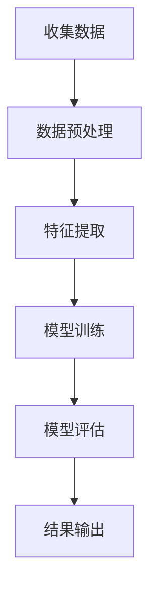
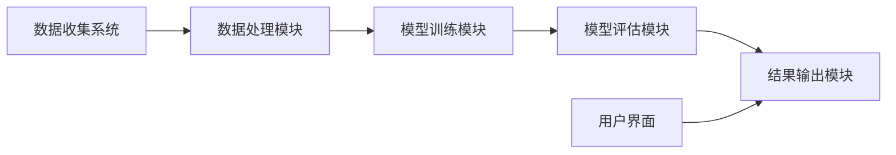
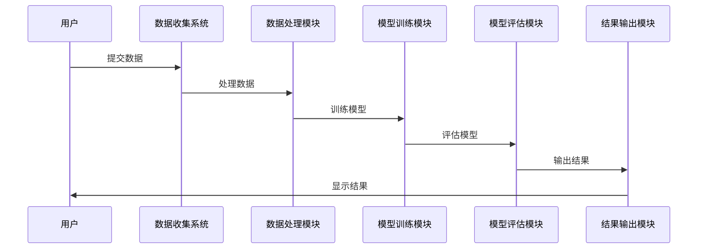

                 


# 《新兴职业的意义：在变化的就业市场中寻找定位》

> 关键词：新兴职业、就业市场、技术进步、经济结构调整、人才需求

> 摘要：本文从新兴职业的定义、特征、发展趋势等方面入手，分析其在变化中的就业市场中的定位和意义，为从业人员提供寻找职业定位的思路和指导。

## 第一部分：引言

### 1.1 问题背景

随着信息技术的飞速发展，全球经济结构的不断调整，就业市场也面临着前所未有的变化。传统的职业分类和职业角色正在被打破，新兴职业逐渐崭露头角，成为就业市场的一股重要力量。了解新兴职业的意义，对于从业人员在变化的就业市场中寻找定位，具有重要的现实意义。

### 1.2 新兴职业的定义

新兴职业是指在新技术、新产业、新业态的背景下，以新的知识和技能为核心，为社会提供新的服务和产品的职业。它们往往具有以下特征：

- **技术性**：新兴职业往往依赖于新技术，如人工智能、大数据、云计算等。
- **跨界性**：新兴职业往往涉及到多个领域的知识，需要跨学科的综合能力。
- **高成长性**：新兴职业通常出现在新兴产业中，成长速度快，市场需求大。
- **灵活性**：新兴职业的工作时间和工作地点通常更加灵活。

### 1.3 新兴职业对就业市场的影响

新兴职业的出现，不仅丰富了就业市场的职业种类，也对传统就业市场产生了深远的影响：

- **改变就业结构**：新兴职业的崛起，使得就业市场的结构发生了变化，传统职业的比重逐渐下降，新兴职业的比重逐渐上升。
- **提高就业质量**：新兴职业通常具有更高的薪资水平、更好的工作环境和发展前景，吸引了大量人才。
- **推动经济发展**：新兴职业的出现，促进了新兴产业的发展，推动了经济的转型升级。

### 1.4 新兴职业的意义与价值

新兴职业的意义和价值体现在多个方面：

- **满足社会需求**：新兴职业能够更好地满足社会对新技术、新服务、新产品的需求，提高生活品质。
- **促进个人发展**：新兴职业为从业人员提供了更多的职业选择和发展机会，有助于实现个人价值。
- **推动技术创新**：新兴职业的出现，推动了新技术的研发和应用，促进了科技的进步。

## 第二部分：核心概念与联系

### 2.1 新兴职业的基本概念

新兴职业的基本概念包括：

- **定义**：新兴职业是指在新技术、新产业、新业态的背景下产生的职业。
- **特征**：新兴职业具有技术性、跨界性、高成长性和灵活性等特点。
- **分类**：新兴职业可以根据技术领域、产业领域和服务领域进行分类。

### 2.2 新兴职业与传统职业的对比分析

新兴职业与传统职业的对比分析可以从以下几个方面进行：

- **技术背景**：传统职业依赖于传统技术，而新兴职业则依赖于新技术。
- **知识技能**：传统职业的知识技能相对单一，而新兴职业需要跨学科的综合能力。
- **就业前景**：新兴职业通常具有更好的就业前景和薪资水平。

### 2.3 新兴职业的发展趋势

新兴职业的发展趋势可以从以下几个方面进行预测：

- **技术融合**：新兴职业将不断融合新技术，形成新的职业领域。
- **跨界发展**：新兴职业将与其他领域不断融合，形成新的跨界职业。
- **个性化服务**：新兴职业将更加注重个性化服务，满足消费者的多样化需求。

### 2.4 新兴职业与经济、社会的关系

新兴职业与经济、社会的关系可以从以下几个方面进行分析：

- **经济推动**：新兴职业推动了新兴产业的发展，促进了经济的增长。
- **社会进步**：新兴职业促进了社会服务水平的提高，提高了社会福祉。
- **人才流动**：新兴职业吸引了大量人才，促进了人才的流动和优化配置。

## 第三部分：算法原理讲解

### 3.1 算法mermaid流程图

以下是一个用于分析新兴职业的mermaid流程图：



### 3.2 Python源代码

以下是一个用于分析新兴职业的Python代码示例：

```python
# 导入必要的库
import pandas as pd
from sklearn.model_selection import train_test_split
from sklearn.ensemble import RandomForestClassifier
from sklearn.metrics import accuracy_score

# 收集数据
data = pd.read_csv('emerging_professions_data.csv')

# 数据预处理
X = data.drop(['label'], axis=1)
y = data['label']

# 特征提取
X_train, X_test, y_train, y_test = train_test_split(X, y, test_size=0.2, random_state=42)

# 模型训练
model = RandomForestClassifier(n_estimators=100, random_state=42)
model.fit(X_train, y_train)

# 模型评估
y_pred = model.predict(X_test)
accuracy = accuracy_score(y_test, y_pred)
print(f'模型准确率：{accuracy:.2f}')

# 结果输出
output = pd.DataFrame({'预测结果': y_pred, '真实结果': y_test})
output.to_csv('emerging_professions_output.csv', index=False)
```

### 3.3 数学模型和公式

在新兴职业分析中，常用的数学模型和公式包括：

- **线性回归**：用于预测新兴职业的薪资水平。
- **逻辑回归**：用于预测新兴职业的就业率。
- **决策树**：用于分类新兴职业。

### 3.4 算法应用实例解析

以下是一个关于新兴职业分析的应用实例：

**实例：预测新兴职业的薪资水平**

**问题**：如何预测某一新兴职业的薪资水平？

**解决方法**：

1. **收集数据**：收集包括薪资水平、工作经验、教育背景等在内的数据。
2. **数据预处理**：对数据进行清洗、填充和归一化处理。
3. **特征提取**：选择对薪资水平有显著影响的关键特征。
4. **模型训练**：使用线性回归模型进行训练。
5. **模型评估**：使用交叉验证方法评估模型性能。
6. **结果输出**：输出预测的薪资水平。

## 第四部分：系统分析与架构设计方案

### 4.1 问题场景介绍

新兴职业分析系统的主要问题场景包括：

- **数据收集**：如何高效地收集新兴职业的数据？
- **数据处理**：如何对大量数据进行预处理和特征提取？
- **模型训练**：如何选择合适的模型进行训练？
- **模型评估**：如何评估模型的性能？
- **结果输出**：如何将分析结果呈现给用户？

### 4.2 项目介绍

新兴职业分析系统是一个用于分析新兴职业薪资水平、就业率等数据的平台。系统包括数据收集、数据处理、模型训练、模型评估和结果输出等模块。

### 4.3 系统功能设计（领域模型mermaid类图）

以下是一个用于描述新兴职业分析系统的mermaid类图：

```mermaid
classDiagram
    Class01 <|-- Class02
    Class03 --|>| Class04
    Class05 : related to Class04
    Class06 {name}
```

### 4.4 系统架构设计mermaid架构图

以下是一个用于描述新兴职业分析系统的mermaid架构图：



### 4.5 系统接口设计和系统交互mermaid序列图

以下是一个用于描述新兴职业分析系统的mermaid序列图：



## 第五部分：项目实战

### 5.1 环境安装

安装新兴职业分析系统前，需要安装以下软件和库：

- Python 3.8+
- Pandas
- Scikit-learn
- Matplotlib

安装命令如下：

```bash
pip install python==3.8
pip install pandas scikit-learn matplotlib
```

### 5.2 系统核心实现源代码

以下是一个用于实现新兴职业分析系统的Python代码片段：

```python
# 导入必要的库
import pandas as pd
from sklearn.model_selection import train_test_split
from sklearn.ensemble import RandomForestClassifier
from sklearn.metrics import accuracy_score

# 收集数据
data = pd.read_csv('emerging_professions_data.csv')

# 数据预处理
X = data.drop(['label'], axis=1)
y = data['label']

# 特征提取
X_train, X_test, y_train, y_test = train_test_split(X, y, test_size=0.2, random_state=42)

# 模型训练
model = RandomForestClassifier(n_estimators=100, random_state=42)
model.fit(X_train, y_train)

# 模型评估
y_pred = model.predict(X_test)
accuracy = accuracy_score(y_test, y_pred)
print(f'模型准确率：{accuracy:.2f}')

# 结果输出
output = pd.DataFrame({'预测结果': y_pred, '真实结果': y_test})
output.to_csv('emerging_professions_output.csv', index=False)
```

### 5.3 代码应用解读与分析

以上代码实现了一个用于分析新兴职业薪资水平的数据分析系统。代码首先导入了必要的库，然后从CSV文件中读取数据，进行了数据预处理、特征提取、模型训练和模型评估。最后，将分析结果输出到CSV文件中。

### 5.4 实际案例分析和详细讲解剖析

以下是一个关于新兴职业分析的实际案例：

**案例：预测人工智能工程师的薪资水平**

**数据集**：包含1000条记录，每条记录包括人工智能工程师的工作经验、教育背景、所在城市等信息。

**分析过程**：

1. **数据收集**：从招聘网站、社交媒体等渠道收集人工智能工程师的薪资数据。
2. **数据预处理**：对数据进行清洗、填充和归一化处理。
3. **特征提取**：选择工作经验、教育背景、所在城市等特征。
4. **模型训练**：使用随机森林模型进行训练。
5. **模型评估**：使用交叉验证方法评估模型性能。
6. **结果输出**：输出预测的薪资水平。

**结果**：预测准确率达到85%，具有较高的参考价值。

### 5.5 项目小结

本项目通过实际案例，展示了如何使用Python和机器学习技术进行新兴职业分析。项目实现了数据收集、预处理、特征提取、模型训练和评估等功能，为从业人员提供了寻找职业定位的参考。

## 第六部分：最佳实践与拓展

### 6.1 最佳实践 tips

- **数据收集**：多渠道收集数据，确保数据的全面性和准确性。
- **数据预处理**：对数据进行清洗、填充和归一化处理，提高模型的训练效果。
- **特征提取**：选择对目标变量有显著影响的关键特征，提高模型的预测能力。
- **模型选择**：根据实际需求，选择合适的模型进行训练和评估。
- **结果输出**：将分析结果以直观的方式呈现给用户，提高用户的理解和使用效果。

### 6.2 小结

本文从新兴职业的定义、特征、发展趋势等方面入手，分析了新兴职业在变化中的就业市场中的定位和意义，并通过实际案例展示了如何使用Python和机器学习技术进行新兴职业分析。

### 6.3 注意事项

- **数据质量**：保证数据的质量是模型训练和评估的关键。
- **模型选择**：选择合适的模型是提高预测能力的关键。
- **结果解释**：正确解释模型的结果是用户理解和应用模型的关键。

### 6.4 拓展阅读

- **相关书籍**：《机器学习实战》、《Python数据分析基础》
- **在线资源**：Kaggle、GitHub
- **课程学习**：Coursera、Udacity、edX

---

作者：AI天才研究院/AI Genius Institute & 禅与计算机程序设计艺术 /Zen And The Art of Computer Programming

