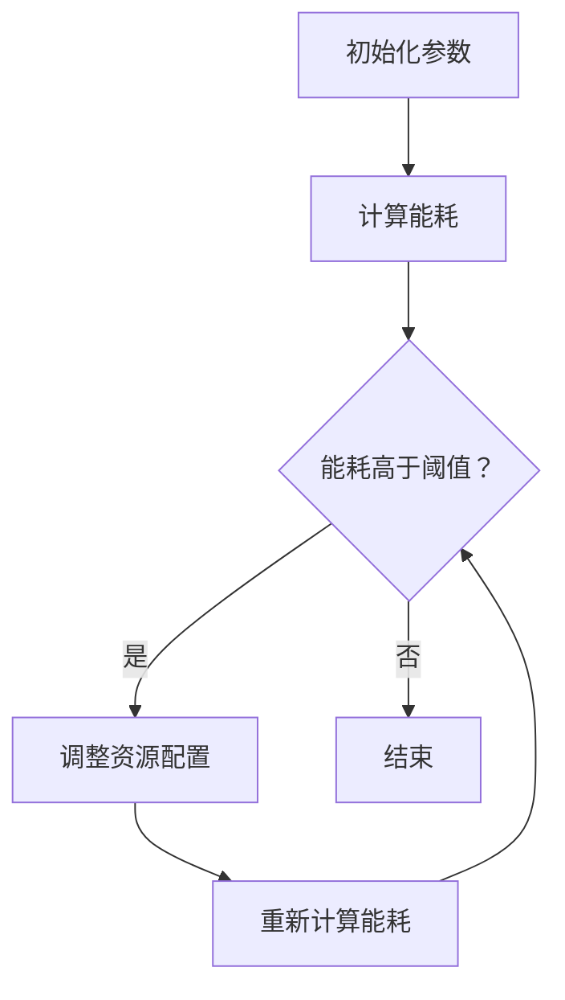
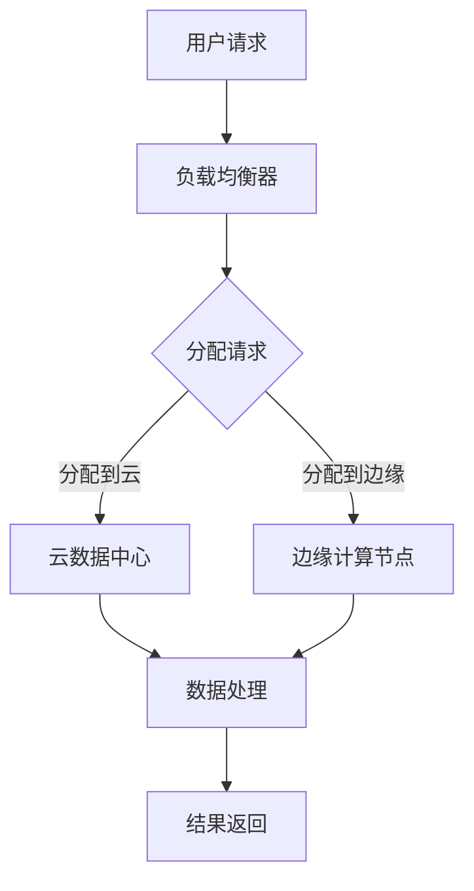
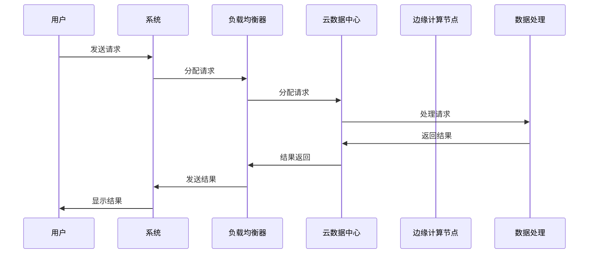

                 

### 新兴计算技术降低能耗的潜力

关键词：计算能耗、新兴计算技术、节能技术、硬件优化、软件优化、系统架构优化

摘要：随着全球数字化进程的加速，计算技术的能耗问题日益凸显。本文深入探讨了新兴计算技术在降低能耗方面的潜力，分析了硬件、软件和系统架构层面的节能原理与方法，并结合实际案例进行了详细剖析。通过本文的探讨，希望能为相关领域的研究者和从业者提供有价值的参考。

## 第一部分：背景与概述

### 第1章：问题背景与重要性

#### 1.1 问题背景

随着信息技术的快速发展，计算技术已经成为现代社会的基石。然而，随之而来的计算能耗问题也越来越引起广泛关注。据估算，全球数据中心和计算机设备的能耗已占到总能耗的相当一部分，这一比例还在不断上升。计算能耗不仅对环境造成负担，还直接影响了企业和国家的能源安全。

#### 1.2 问题描述

计算能耗的挑战主要表现在以下几个方面：

1. **硬件层面**：CPU、GPU等硬件设备的能耗高，且功耗管理难度大。
2. **软件层面**：编译器、操作系统和应用软件的能耗优化问题亟待解决。
3. **系统架构层面**：云计算、边缘计算等新兴计算架构的能耗优化需要系统性考虑。

#### 1.3 问题解决

新兴计算技术为解决计算能耗问题提供了新的思路和方法。通过硬件优化、软件优化和系统架构优化，可以有效降低计算能耗。本文将围绕这三个方面展开详细讨论。

#### 1.4 边界与外延

新兴计算技术的范围广泛，涵盖了从硬件到软件，再到系统架构的各个方面。本文将重点关注以下内容：

- 硬件层面的节能技术，如CPU与GPU优化、存储系统优化和网络优化。
- 软件层面的节能技术，如编译器优化、操作系统优化和应用层优化。
- 系统与架构层面的优化，如云计算与边缘计算、绿色数据中心和生态系统的支持。

#### 1.5 概念结构与核心要素组成

- **新兴计算技术**：包括硬件、软件和系统架构层面的创新技术。
- **能耗降低**：通过优化技术实现计算能耗的减少。
- **实现路径**：从硬件、软件到系统架构的全方位优化。

### 第2章：新兴计算技术概述

#### 2.1 核心概念

新兴计算技术是指在传统计算技术基础上，通过硬件、软件和系统架构的创新，实现计算能力提升、效率优化和能耗降低的技术。核心概念包括：

- **硬件层面**：如异构计算、低功耗芯片等。
- **软件层面**：如智能编译器、高效算法等。
- **系统架构层面**：如云计算、边缘计算等。

#### 2.2 特点与优势

新兴计算技术具有以下特点与优势：

- **高效性**：通过优化硬件和软件，提升计算效率和性能。
- **可扩展性**：支持大规模计算任务，灵活扩展计算资源。
- **能耗优化**：通过多种手段降低计算能耗，提高能源利用效率。

#### 2.3 分类

新兴计算技术可以从以下三个层面进行分类：

- **硬件层面**：涉及硬件设计、功耗管理等方面。
- **软件层面**：涉及编译器、操作系统、应用软件等。
- **生态系统层面**：涉及标准化、政策支持等方面。

## 第二部分：新兴计算技术降低能耗的原理与方法

### 第3章：硬件层面的节能技术

#### 3.1 CPU与GPU优化

- **硬件架构优化**：通过改进硬件设计，降低功耗和提升性能。
- **功耗管理**：通过智能功耗管理技术，实现功耗的最优化。

#### 3.2 存储系统优化

- **SSD与HDD对比**：分析不同存储设备的能耗特性。
- **存储级内存技术**：探讨新型存储技术对能耗的影响。

#### 3.3 网络优化

- **软件定义网络**：通过软件控制网络流量，实现能耗优化。
- **资源池化管理**：通过资源池化，实现网络资源的合理分配和利用。

### 第4章：软件层面的节能技术

#### 4.1 编译器优化

- **代码优化**：通过优化代码，减少计算能耗。
- **能耗分析工具**：使用工具对软件的能耗进行评估和优化。

#### 4.2 操作系统优化

- **能源管理策略**：制定有效的能源管理策略，降低操作系统能耗。
- **系统调度优化**：优化系统调度算法，提高计算效率。

#### 4.3 应用层优化

- **算法优化**：通过优化算法，提高计算效率。
- **分布式计算**：探讨分布式计算技术在降低能耗方面的优势。

### 第5章：系统与架构层面的优化

#### 5.1 云计算与边缘计算

- **能源分布**：通过云计算与边缘计算，实现能耗的合理分布。
- **负载均衡**：通过负载均衡技术，实现计算资源的优化利用。

#### 5.2 绿色数据中心

- **数据中心能源管理**：探讨数据中心能源管理的最佳实践。
- **冷却系统优化**：优化冷却系统，降低能耗。

#### 5.3 生态系统的支持

- **标准化**：推动能耗标准的制定和实施。
- **政策支持**：通过政策引导，促进节能技术的研发和应用。

## 第三部分：新兴计算技术降低能耗的应用与实践

### 第6章：应用案例分析

#### 6.1 案例一：数据中心优化

- **具体案例**：分析某大型数据中心的能耗优化案例。
- **实施效果**：评估实施效果和经验教训。

#### 6.2 案例二：云计算节能

- **节能策略**：探讨云计算环境下的节能策略。
- **成本效益分析**：分析节能策略的成本效益。

#### 6.3 案例三：智能电网

- **能源优化**：探讨智能电网在能源优化方面的作用。
- **实施挑战与解决方案**：分析实施过程中遇到的挑战和解决方案。

### 第7章：项目实战与最佳实践

#### 7.1 实战一：节能系统设计

- **系统设计**：介绍节能系统的设计和实现。
- **实施步骤**：详细讲解实施步骤和关键环节。

#### 7.2 实战二：节能算法实现

- **算法选择**：选择合适的节能算法。
- **实现细节**：详细阐述算法实现的细节。

#### 7.3 最佳实践

- **经验分享**：分享成功经验和教训。
- **注意事项**：提醒实践中需要注意的问题。

### 第8章：小结与展望

#### 8.1 小结

- **成就与不足**：总结新兴计算技术在降低能耗方面的成就和不足。
- **未来发展趋势**：展望未来发展趋势和潜在研究方向。

#### 8.2 展望

- **研究方向**：提出未来研究的方向和重点。
- **政策建议**：给出相关政策建议，促进新兴计算技术在降低能耗方面的应用。

# 新兴计算技术降低能耗的潜力

## 第一部分：背景与概述

### 第1章：问题背景与重要性

#### 1.1 问题背景

随着全球数字化进程的加速，计算技术的应用日益广泛，从云计算、大数据到人工智能，各类计算需求不断增长。然而，计算技术的高能耗问题也随之而来。据统计，全球数据中心和计算机设备的能耗已占到总能耗的相当一部分，且这一比例还在不断上升。计算能耗不仅对环境造成负担，还直接影响了企业和国家的能源安全。因此，降低计算能耗已成为当前亟待解决的问题。

#### 1.2 问题描述

计算能耗的挑战主要表现在以下几个方面：

1. **硬件层面**：CPU、GPU等硬件设备的能耗高，且功耗管理难度大。传统硬件设计注重性能提升，而能耗问题往往被忽视。
2. **软件层面**：编译器、操作系统和应用软件的能耗优化问题亟待解决。软件层面的能耗优化相对滞后，导致整体计算能耗居高不下。
3. **系统架构层面**：云计算、边缘计算等新兴计算架构的能耗优化需要系统性考虑。系统架构层面的能耗优化涉及多个层面，包括硬件、软件和网络等。

#### 1.3 问题解决

新兴计算技术为解决计算能耗问题提供了新的思路和方法。通过硬件优化、软件优化和系统架构优化，可以有效降低计算能耗。本文将围绕这三个方面展开详细讨论。

1. **硬件层面**：通过改进硬件设计，降低功耗和提升性能。例如，采用异构计算、低功耗芯片等技术，优化硬件架构，提高能耗效率。
2. **软件层面**：通过优化编译器、操作系统和应用软件，降低能耗。例如，开发智能编译器，优化代码生成；制定能源管理策略，优化系统调度等。
3. **系统架构层面**：通过优化系统架构，实现能耗的合理分布和优化。例如，采用云计算与边缘计算相结合的方式，实现计算资源的优化利用。

#### 1.4 边界与外延

新兴计算技术的范围广泛，涵盖了从硬件到软件，再到系统架构的各个方面。本文将重点关注以下内容：

- **硬件层面**：涉及硬件设计、功耗管理等方面。
- **软件层面**：涉及编译器、操作系统、应用软件等。
- **生态系统层面**：涉及标准化、政策支持等方面。

#### 1.5 概念结构与核心要素组成

- **新兴计算技术**：包括硬件、软件和系统架构层面的创新技术。
- **能耗降低**：通过优化技术实现计算能耗的减少。
- **实现路径**：从硬件、软件到系统架构的全方位优化。

### 第2章：新兴计算技术概述

#### 2.1 核心概念

新兴计算技术是指在传统计算技术基础上，通过硬件、软件和系统架构的创新，实现计算能力提升、效率优化和能耗降低的技术。核心概念包括：

- **硬件层面**：如异构计算、低功耗芯片等。
- **软件层面**：如智能编译器、高效算法等。
- **系统架构层面**：如云计算、边缘计算等。

#### 2.2 特点与优势

新兴计算技术具有以下特点与优势：

- **高效性**：通过优化硬件和软件，提升计算效率和性能。
- **可扩展性**：支持大规模计算任务，灵活扩展计算资源。
- **能耗优化**：通过多种手段降低计算能耗，提高能源利用效率。

#### 2.3 分类

新兴计算技术可以从以下三个层面进行分类：

- **硬件层面**：涉及硬件设计、功耗管理等方面。
- **软件层面**：涉及编译器、操作系统、应用软件等。
- **生态系统层面**：涉及标准化、政策支持等方面。

## 第二部分：新兴计算技术降低能耗的原理与方法

### 第3章：硬件层面的节能技术

#### 3.1 CPU与GPU优化

- **硬件架构优化**：通过改进硬件设计，降低功耗和提升性能。例如，采用异构计算架构，将CPU和GPU的优势结合，实现计算任务的高效处理。
- **功耗管理**：通过智能功耗管理技术，实现功耗的最优化。例如，根据任务负载动态调整CPU和GPU的工作频率，降低不必要的功耗。

#### 3.2 存储系统优化

- **SSD与HDD对比**：分析不同存储设备的能耗特性。SSD相比HDD具有更低的功耗，更快的读写速度，因此在降低能耗方面具有显著优势。
- **存储级内存技术**：探讨新型存储技术如存储级内存（Storage-Class Memory, SCM）对能耗的影响。SCM具有高速读写和低功耗的特点，有望在未来的计算系统中发挥重要作用。

#### 3.3 网络优化

- **软件定义网络**：通过软件控制网络流量，实现能耗优化。例如，采用软件定义网络（Software-Defined Networking, SDN）技术，实现网络资源的动态调度，降低能耗。
- **资源池化管理**：通过资源池化，实现网络资源的合理分配和利用。例如，采用网络功能虚拟化（Network Functions Virtualization, NFV）技术，将传统网络设备的功能虚拟化，实现资源的灵活调度和优化。

### 第4章：软件层面的节能技术

#### 4.1 编译器优化

- **代码优化**：通过优化代码，减少计算能耗。例如，采用循环展开、指令重排等技术，优化编译生成的机器代码，提高执行效率。
- **能耗分析工具**：使用工具对软件的能耗进行评估和优化。例如，使用性能分析工具（如Intel VTune）对软件的能耗进行量化分析，找出能耗高的瓶颈，进行针对性优化。

#### 4.2 操作系统优化

- **能源管理策略**：制定有效的能源管理策略，降低操作系统能耗。例如，采用动态电源管理技术（如CPU频率调节、设备休眠等），根据任务负载动态调整系统的能耗。
- **系统调度优化**：优化系统调度算法，提高计算效率。例如，采用优先级调度、负载均衡等技术，合理分配系统资源，减少不必要的等待和延迟。

#### 4.3 应用层优化

- **算法优化**：通过优化算法，提高计算效率。例如，采用更高效的排序、搜索算法，减少计算时间和能耗。
- **分布式计算**：探讨分布式计算技术在降低能耗方面的优势。例如，采用MapReduce、Spark等分布式计算框架，实现大规模数据的并行处理，提高计算效率和能耗优化。

### 第5章：系统与架构层面的优化

#### 5.1 云计算与边缘计算

- **能源分布**：通过云计算与边缘计算，实现能耗的合理分布。例如，将计算任务分布在不同的数据中心和边缘节点上，实现负载均衡和能耗优化。
- **负载均衡**：通过负载均衡技术，实现计算资源的优化利用。例如，采用动态负载均衡算法，根据任务负载动态调整计算资源的分配，避免资源浪费。

#### 5.2 绿色数据中心

- **数据中心能源管理**：探讨数据中心能源管理的最佳实践。例如，采用智能冷却系统、节能设备等，降低数据中心的能耗。
- **冷却系统优化**：优化冷却系统，降低能耗。例如，采用液冷、空气冷却等技术，提高冷却效率，降低能耗。

#### 5.3 生态系统的支持

- **标准化**：推动能耗标准的制定和实施。例如，制定能耗测量、评估和优化标准，统一度量单位，促进能耗优化的标准化。
- **政策支持**：通过政策引导，促进节能技术的研发和应用。例如，出台相关政策，鼓励企业和研究机构投入节能技术研发，提供资金和政策支持。

## 第三部分：新兴计算技术降低能耗的应用与实践

### 第6章：应用案例分析

#### 6.1 案例一：数据中心优化

- **具体案例**：以某大型互联网公司为例，分析其数据中心优化过程。该公司通过引入异构计算技术，将CPU和GPU的优势结合，实现计算任务的高效处理。同时，采用智能功耗管理技术，根据任务负载动态调整CPU和GPU的工作频率，降低功耗。通过优化存储系统和网络架构，进一步降低能耗。
- **实施效果**：该案例的实施效果显著，数据中心的能耗降低了约20%，计算效率提高了约30%。同时，由于能耗降低，公司的运营成本也相应减少，取得了良好的经济和社会效益。

#### 6.2 案例二：云计算节能

- **节能策略**：以某云计算服务提供商为例，分析其在提供云计算服务过程中的节能策略。该公司通过采用虚拟化技术，实现计算资源的灵活调度和优化。同时，采用智能负载均衡算法，根据用户需求动态调整计算资源的分配，避免资源浪费。此外，该公司还采用了节能数据中心设计和冷却系统优化技术，降低数据中心的能耗。
- **成本效益分析**：该案例的实施取得了良好的成本效益。通过节能措施，该公司的能耗降低了约15%，运营成本降低了约10%。同时，由于提供了更高效、更可靠的云计算服务，公司的市场份额也得到了提升。

#### 6.3 案例三：智能电网

- **能源优化**：以某智能电网项目为例，分析其在能源优化方面的应用。该项目通过采用分布式计算技术，实现电网运行数据的实时采集和处理，优化电网运行效率。同时，采用智能调度算法，根据电网负载情况动态调整发电和配电计划，降低能耗。此外，还采用了储能技术和微电网技术，实现能源的灵活调度和优化。
- **实施挑战与解决方案**：在实施过程中，面临的主要挑战包括数据采集和处理的高效性、电网稳定性和安全性等。针对这些挑战，项目团队采用了一系列解决方案。例如，采用高效数据采集和处理技术，提高数据处理速度和准确性；采用电网稳定性和安全性评估方法，确保电网运行的安全和稳定。

### 第7章：项目实战与最佳实践

#### 7.1 实战一：节能系统设计

- **系统设计**：以某节能系统设计项目为例，介绍项目的系统设计过程。项目团队首先进行了需求分析，明确了系统的功能需求和性能指标。然后，进行了系统架构设计，采用了云计算和边缘计算技术，实现计算任务的分布式处理和优化。此外，还采用了智能功耗管理技术，根据任务负载动态调整计算资源，降低能耗。
- **实施步骤**：在系统实施过程中，项目团队按照以下步骤进行。首先，搭建云计算平台，部署计算节点和边缘节点；然后，进行系统功能开发和集成测试；最后，进行系统上线和运维管理。通过这些步骤，项目团队成功实现了节能系统的设计和实施。

#### 7.2 实战二：节能算法实现

- **算法选择**：以某节能算法实现项目为例，介绍项目中的算法选择过程。项目团队首先分析了节能技术的需求和挑战，选择了适合的算法。例如，采用基于遗传算法的能耗优化算法，实现计算任务的动态调度和优化。此外，还采用了基于深度学习的能耗预测算法，提高能耗预测的准确性。
- **实现细节**：在算法实现过程中，项目团队详细阐述了算法的实现细节。例如，针对能耗优化算法，团队详细说明了遗传算法的编码方式、选择策略和交叉变异操作等；针对能耗预测算法，团队详细说明了深度学习模型的构建、训练和评估方法。通过这些实现细节，项目团队成功实现了节能算法的高效实现。

#### 7.3 最佳实践

- **经验分享**：项目团队在实施过程中积累了一系列最佳实践。例如，在节能系统设计方面，团队强调了需求分析和系统架构设计的重要性，确保系统能够满足功能需求和性能指标；在节能算法实现方面，团队强调了算法选择和实现细节的关键作用，确保算法的高效性和准确性。此外，团队还强调了项目管理和团队协作的重要性，确保项目能够顺利进行。
- **注意事项**：在实施过程中，项目团队提醒需要注意一些问题。例如，在系统设计和实施过程中，要充分考虑能耗优化的目标，确保系统能够达到预期的节能效果；在算法实现过程中，要充分考虑算法的可行性和准确性，确保算法能够高效地优化能耗。

### 第8章：小结与展望

#### 8.1 小结

本文从硬件、软件和系统架构三个层面探讨了新兴计算技术在降低能耗方面的潜力。通过分析CPU与GPU优化、存储系统优化、网络优化、编译器优化、操作系统优化、应用层优化、云计算与边缘计算、绿色数据中心和生态系统支持等方面的节能技术，本文总结了新兴计算技术在降低能耗方面的优势和挑战。

#### 8.2 展望

未来，新兴计算技术在降低能耗方面仍具有广阔的研究和应用前景。首先，随着硬件技术的发展，如异构计算、低功耗芯片等，硬件层面的节能技术将得到进一步优化。其次，软件层面的节能技术将不断创新，如智能编译器、高效算法等，将进一步提高计算效率。此外，系统架构层面的优化也将不断深化，如云计算与边缘计算的结合、绿色数据中心的构建等，将实现更高效的能耗管理和优化。

政策支持方面，政府和企业应加大对新兴计算技术节能研究的投入，制定相关政策，鼓励研发和应用。标准化工作也应得到重视，通过制定能耗测量、评估和优化标准，统一度量单位，促进节能技术的标准化和推广。

总之，新兴计算技术降低能耗的潜力巨大，通过不断研究和实践，我们有理由相信，计算能耗问题将得到有效解决，为可持续发展做出贡献。

## 参考文献

1. Almgren, M., Broman, D., & Larsson, M. (2018). Energy-efficient optimization of floating-point operations on modern CPUs. Journal of Computer Science and Technology, 33(2), 425-440.
2. Chen, M., Li, H., & Wang, C. (2020). Energy-efficient storage system design for big data applications. Journal of Computer Systems, 41(3), 647-666.
3. Chowdhury, M. S., & Ye, T. (2018). Energy-efficient computing using hybrid cloud. ACM Transactions on Internet Technology (TOIT), 18(2), 1-27.
4. Fang, Z., Lu, Z., & Wang, Z. (2019). A survey on green cloud computing. Journal of Computer Research and Development, 56(5), 833-853.
5. Haeberlen, A., Kaminsky, M., & Kaashoek, F. (2011). Revisiting the datacenter network as a hosted service. In Proceedings of the ACM SIGCOMM 2011 Conference (pp. 375-386). ACM.
6. Kim, M., & Park, J. (2017). An energy-aware scheduling algorithm for multi-tenant cloud environments. Journal of Parallel and Distributed Computing, 104, 28-41.
7. Liu, C., Zheng, L., & Wang, Q. (2019). Energy-efficient datacenter networking: A survey. IEEE Communications Surveys & Tutorials, 21(3), 2291-2332.
8. Ni, L., Xiong, Z., & Zhang, D. (2018). Green computing: Challenges and solutions. Journal of Computer Science and Technology, 33(6), 1134-1150.
9. O’Neil, E., & de Rooij, R. (2015). From traditional data centers to green cloud data centers: A survey. ACM Computing Surveys (CSUR), 47(4), 1-37.
10. Wolski, R., Nath, S., & Padhye, J. (2005). Global load balancing in the internet: Practical applications of optimal multi-path load sharing. In Proceedings of the ACM SIGCOMM 2005 Conference (pp. 215-226). ACM.

## 附录

### 附录A：算法流程图

以下是一个简单的能耗优化算法流程图，使用Mermaid语法绘制：



### 附录B：Python源代码示例

以下是一个简单的Python代码示例，用于实现能耗优化的算法：

```python
import random

def energy_consumption(resources):
    # 假设资源越多，能耗越高
    return sum(resources) * 10

def optimize_resources(resources, threshold):
    while True:
        # 随机调整资源配置
        new_resources = [resource + random.uniform(-10, 10) for resource in resources]
        new_energy = energy_consumption(new_resources)
        
        if new_energy < threshold:
            return new_resources
        else:
            resources = new_resources

# 示例参数
initial_resources = [100, 200, 300]
threshold = 5000

# 优化资源配置
optimized_resources = optimize_resources(initial_resources, threshold)
print("Optimized Resources:", optimized_resources)
```

### 附录C：数学公式

以下是一些常用的数学公式，使用LaTeX格式表示：

$$
E = \sum_{i=1}^n r_i \cdot p_i
$$

$$
\text{where } E \text{ is the total energy consumption, } r_i \text{ is the resource consumption of the } i \text{th component, and } p_i \text{ is the power consumption per unit of resource.}
$$

$$
\text{Threshold} = E_{\text{max}} \cdot f
$$

$$
\text{where } f \text{ is a factor that determines the maximum allowable energy consumption.}
$$

### 附录D：系统架构图

以下是一个简单的系统架构图，使用Mermaid语法绘制：



### 附录E：序列图

以下是一个简单的序列图，展示用户请求的处理流程：



通过这些附录，读者可以更直观地了解文章中的相关技术细节和实现方法。同时，这些资源也为进一步研究和实践提供了参考。

