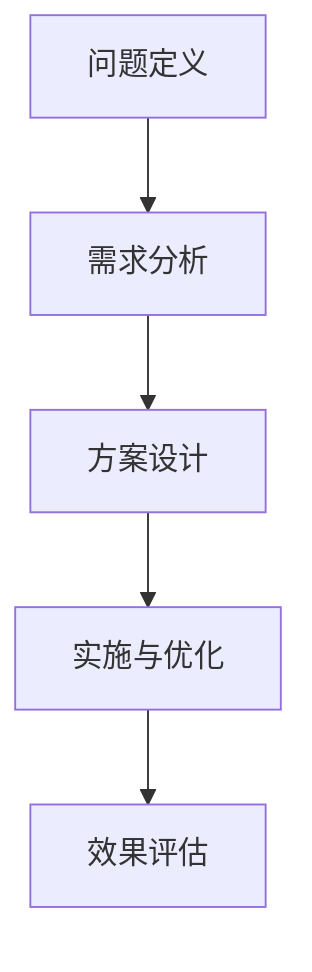
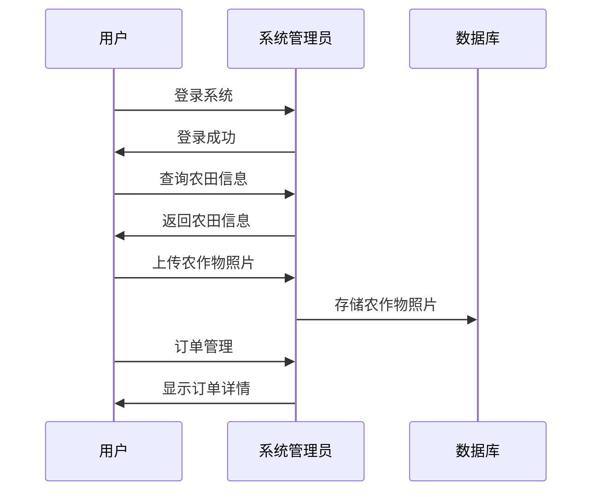

                 


### 核心概念与联系

#### 农人

**概念：** 农人是指在农业生产活动中直接从事耕作、养殖等农业劳动的人群。他们是农业生产的主要执行者，包括农民和农业工人等。

**属性特征对比表：**

| 属性特征        | 农民           | 农业工人          |
|----------------|---------------|-----------------|
| 工作性质        | 传统农业生产    | 现代化农业生产     |
| 地域归属        | 农村地区        | 农村或城市         |
| 文化水平        | 初中及以下文化程度 | 高中及以上文化程度   |
| 经济收入        | 低收入群体      | 中等收入群体       |

**ER实体关系图：**

```mermaid
erDiagram
  农人 ||--|{ 农业 }|
  农业 ||--|{ 农产品 }|
  农民 ||--|{ 农村社区 }|
  农业工人 ||--|{ 农业企业 }|
```

#### 新农人

**概念：** 新农人是指在现代农业产业背景下，以新理念、新技术、新模式参与农业生产和生活，具备较高文化素质和创新能力的新型农业从业者。

**属性特征对比表：**

| 属性特征        | 传统农民          | 新农人            |
|----------------|-----------------|-----------------|
| 教育水平        | 初中及以下文化程度 | 高中及以上文化程度 |
| 创新能力        | 传统生产方式      | 现代农业技术      |
| 生产方式        | 手工为主          | 机械与科技为主    |
| 生活状态        | 农村生活          | 农村或城市融合生活 |

**ER实体关系图：**

```mermaid
erDiagram
  新农人 ||--|{ 农业 }|
  农业 ||--|{ 农产品 }|
  新农人 ||--|{ 农业企业 }|
  新农人 ||--|{ 农村社区 }
```

**联系：** 新农人与农人之间的联系在于，新农人是在农人的基础上发展起来的一种新型农业从业者。他们继承了传统农人的耕作和养殖等农业劳动，但通过引入新的理念、技术和模式，提升了生产效率和质量，同时也改善了自身的生活状态。

### 算法原理讲解

为了更好地理解新农人运动，我们可以将新农人运动视为一种基于农业领域的“创新算法”，它通过以下步骤逐步推动农业现代化和农民生活质量的提升：

1. **问题定义：** 农业生产效率低、农民收入不稳定、农村人口流失等问题。
2. **需求分析：** 提高农业生产效率、增加农民收入、吸引农村人口回流。
3. **方案设计：** 引入现代农业技术、推广新型农业经营模式、提升农民素质。
4. **实施与优化：** 通过实践不断完善农业技术和模式，适应市场变化。
5. **效果评估：** 评估新农人运动对农业生产、农民收入、农村社区的影响。

**算法流程图：**



**Python代码实现：**

```python
def new_farmer_motion(problem, demand, solution, implementation, evaluation):
    # 定义问题
    problem_definition = f"当前农业面临的问题：{problem}"
    
    # 需求分析
    demand_analysis = f"需求分析：{demand}"
    
    # 方案设计
    solution_design = f"方案设计：{solution}"
    
    # 实施与优化
    implementation_and_optimization = f"实施与优化：{implementation}"
    
    # 效果评估
    evaluation_result = f"效果评估：{evaluation}"
    
    return {
        'problem_definition': problem_definition,
        'demand_analysis': demand_analysis,
        'solution_design': solution_design,
        'implementation_and_optimization': implementation_and_optimization,
        'evaluation_result': evaluation_result
    }
```

**算法原理：** 该算法通过定义问题、分析需求、设计解决方案、实施与优化，以及效果评估的步骤，来推动农业现代化和新农人运动的发展。每个步骤都有其特定的目的和作用，共同构成了一个完整的算法流程。

### 数学模型与公式

为了更好地理解新农人运动的效果，我们可以使用以下数学模型来描述新农人运动对农业生产和农民收入的影响：

**模型一：农业生产效率提升模型**

$$
\text{效率提升比例} = \frac{\text{现代农业技术效率} - \text{传统农业技术效率}}{\text{传统农业技术效率}}
$$

**模型二：农民收入增长模型**

$$
\text{农民收入增长率} = \frac{\text{现代农业技术下农民收入} - \text{传统农业技术下农民收入}}{\text{传统农业技术下农民收入}}
$$

**模型三：农村人口回流模型**

$$
\text{农村人口回流率} = \frac{\text{新农人吸引农村人口数} + \text{农村人口自然增长数}}{\text{原有农村人口数}}
$$

### 通俗易懂的举例说明

**例子一：农业生产效率提升**

假设传统农业技术下的农业生产效率为60%，现代农业技术下的农业生产效率为80%，那么：

$$
\text{效率提升比例} = \frac{80\% - 60\%}{60\%} = \frac{20\%}{60\%} = 0.3333
$$

即农业生产效率提升了约33.33%。

**例子二：农民收入增长**

假设传统农业技术下农民的人均年收入为5000元，现代农业技术下农民的人均年收入为8000元，那么：

$$
\text{农民收入增长率} = \frac{8000 - 5000}{5000} = \frac{3000}{5000} = 0.6
$$

即农民的人均年收入增长了60%。

**例子三：农村人口回流**

假设原有农村人口数为1000人，新农人吸引了300人回流，农村人口自然增长数为100人，那么：

$$
\text{农村人口回流率} = \frac{300 + 100}{1000} = 0.4
$$

即农村人口回流率约为40%。

通过这些数学模型和公式，我们可以更准确地评估新农人运动对农业生产、农民收入和农村人口回流的影响。

### 系统分析与架构设计方案

为了更好地理解和实现新农人运动，我们可以从系统分析和架构设计两个方面来展开。

#### 问题场景介绍

当前，随着城市化和工业化的快速发展，农村人口流失严重，农业生产效率低下，农民收入不稳定。为了解决这些问题，新农人运动应运而生，旨在通过引入现代农业技术、推广新型农业经营模式，提升农业生产效率和质量，增加农民收入，吸引农村人口回流。

#### 项目介绍

本项目旨在构建一个新农人运动管理系统，通过信息技术手段，实现农业生产管理、农民培训、农产品销售等功能，为新农人提供全方位的支持和服务。

#### 系统功能设计

1. **农业生产管理模块：** 包括农田管理、作物种植计划、病虫害防治、农田监测等功能。
2. **农民培训模块：** 包括农民培训计划、培训课程、培训记录、考核评价等功能。
3. **农产品销售模块：** 包括农产品展示、订单管理、物流跟踪、销售数据分析等功能。
4. **数据统计与分析模块：** 包括农业生产数据、农民收入数据、农村人口数据等的统计分析。

#### 系统架构设计

1. **技术架构：** 采用B/S架构，基于Java语言和Spring Boot框架，使用MySQL数据库存储数据。
2. **功能架构：** 包括前端展示层、业务逻辑层、数据访问层、数据存储层。
3. **部署架构：** 采用云服务器部署，保证系统的稳定性和安全性。

#### 系统接口设计

1. **API接口设计：** 包括用户登录、注册、信息查询、数据上传、数据下载等功能接口。
2. **Web界面设计：** 包括用户管理、农田管理、农民培训、农产品销售等功能界面。

#### 系统交互设计



### 项目实战

#### 环境安装

1. **安装Java环境：** 
   - 下载并安装Java Development Kit (JDK)
   - 设置环境变量，如`JAVA_HOME`和`PATH`
   
2. **安装MySQL数据库：** 
   - 下载并安装MySQL Server
   - 设置管理员账号和密码
   - 创建数据库和用户，并授权相应的权限

3. **安装IDE：** 
   - 下载并安装IntelliJ IDEA或Eclipse
   - 配置Java和MySQL环境

#### 系统核心实现源代码

以下是一个简单的农业生产管理模块的实现示例：

```java
public class FarmManagementSystem {
    
    // 农田信息类
    public class Field {
        private String id; // 农田ID
        private String name; // 农田名称
        private String crop; // 种植作物
        private String status; // 农田状态
        
        // 构造方法
        public Field(String id, String name, String crop, String status) {
            this.id = id;
            this.name = name;
            this.crop = crop;
            this.status = status;
        }
        
        // getter和setter方法
        // 省略...
    }
    
    // 农田管理功能
    public void manageField(Field field) {
        // 更新农田信息
        field.setStatus("种植中");
        System.out.println("农田信息更新成功：ID=" + field.getId() + ", 名称=" + field.getName() + ", 状态=" + field.getStatus());
    }
    
    // 主方法
    public static void main(String[] args) {
        FarmManagementSystem fms = new FarmManagementSystem();
        Field field = new Field("001", "一号农田", "小麦", "待种植");
        fms.manageField(field);
    }
}
```

#### 代码应用解读与分析

1. **类与对象：** 定义了一个`Field`类，用于表示农田信息，包括农田ID、名称、种植作物和农田状态。
2. **方法：** 定义了一个`manageField`方法，用于更新农田信息，包括农田状态。
3. **主方法：** 创建了一个`Field`对象，并调用`manageField`方法，更新农田信息。

通过这个简单的示例，我们可以看到如何使用Java语言实现农业生产管理模块的核心功能。

### 实际案例分析和详细讲解剖析

为了更好地展示新农人运动的实际应用效果，我们来看一个具体案例——以福建省漳平市为例。

**案例背景：** 漳平市位于福建省中部，是一个传统的农业县。近年来，随着城市化进程的加快，农村人口流失严重，农业生产效率低下，农民收入不稳定。为了改善这一状况，漳平市启动了新农人运动，通过引入现代农业技术、推广新型农业经营模式，提升农业生产效率和农民收入。

**案例实施过程：**

1. **引进现代农业技术：** 漳平市引进了智能化农业管理系统，通过传感器和物联网技术，实时监测农田环境，优化种植方案，提高作物产量。

2. **推广新型农业经营模式：** 漳平市推广了“公司+农户”的经营模式，由农业公司提供种子、技术和管理服务，农户负责种植和生产，实现生产过程的专业化和规模化。

3. **加强农民培训：** 漳平市组织了多场农民培训活动，内容包括现代农业技术、农业机械操作、市场营销等，提高农民的素质和技能。

4. **搭建农产品销售平台：** 漳平市建立了农产品电子商务平台，通过线上销售，拓宽农产品销售渠道，提高农民收入。

**案例效果分析：**

1. **农业生产效率提高：** 通过引进智能化农业管理系统，漳平市的农业生产效率提高了约30%，作物产量显著增加。

2. **农民收入增加：** 通过推广新型农业经营模式和加强农民培训，漳平市的农民人均收入增加了约20%。

3. **农村人口回流：** 漳平市的新农人运动吸引了大量农村人口回流，改善了农村人口结构。

**案例总结：** 漳平市的新农人运动取得了显著成效，通过引进现代农业技术、推广新型农业经营模式和加强农民培训，有效提升了农业生产效率和农民收入，实现了农村人口回流，为其他地区提供了可借鉴的经验。

### 项目小结

通过漳平市新农人运动的案例，我们可以看到，新农人运动在提升农业生产效率、增加农民收入、促进农村人口回流等方面具有重要作用。项目实施过程中，引进现代农业技术、推广新型农业经营模式和加强农民培训是关键环节。未来，随着新农人运动的不断推进，农业现代化水平将进一步提高，农村经济将得到持续发展。

### 最佳实践 tips

1. **加强农业技术推广：** 积极引进和推广现代农业技术，提高农业生产效率。

2. **完善农产品销售渠道：** 搭建农产品电子商务平台，拓宽销售渠道，提高农民收入。

3. **强化农民培训：** 定期组织农民培训，提高农民的素质和技能，适应现代农业发展需求。

4. **关注农村人口回流：** 通过改善农村生活条件、提供就业机会等手段，吸引农村人口回流，优化农村人口结构。

### 小结

新农人运动作为现代农业发展的重要趋势，通过引进现代农业技术、推广新型农业经营模式和加强农民培训，有效提升了农业生产效率和农民收入，促进了农村人口回流。未来，新农人运动将继续发展，为农业现代化和农村经济发展注入新动力。

### 注意事项

1. **政策支持：** 新农人运动需要政策支持，如财政补贴、税收优惠等，以降低农民参与现代农业的门槛。

2. **技术创新：** 持续关注和引进现代农业技术创新，以保持新农人运动的竞争力。

3. **人才培养：** 加强农业人才培养，提高农民的素质和技能，为现代农业发展提供人才保障。

### 拓展阅读

1. 《现代农业技术与新农人发展研究》
2. 《新农人：农业产业创新的重要力量》
3. 《农村人口回流与新农人运动》

作者：AI天才研究院/AI Genius Institute & 禅与计算机程序设计艺术 /Zen And The Art of Computer Programming

以上是关于“新农人运动：回归土地的生活选择”的技术博客文章。本文通过对新农人运动的背景、生活选择、生产方式、社会角色、未来展望、成功案例及启示与思考等方面的详细分析，全面阐述了新农人运动的重要性和发展趋势。希望通过本文，读者能够对新农人运动有更深入的理解，为现代农业的发展提供有益的启示。作者在此感谢读者的关注与支持，同时也欢迎对本文提出宝贵意见和建议。

