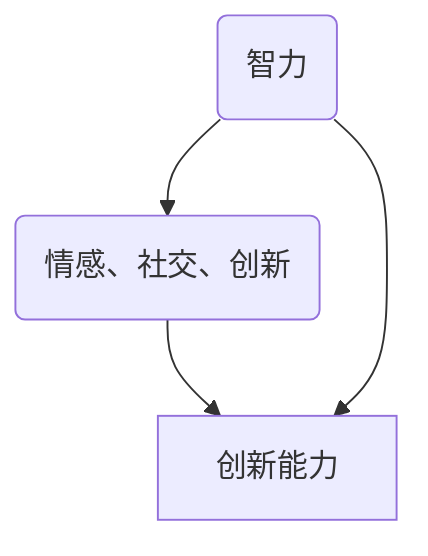
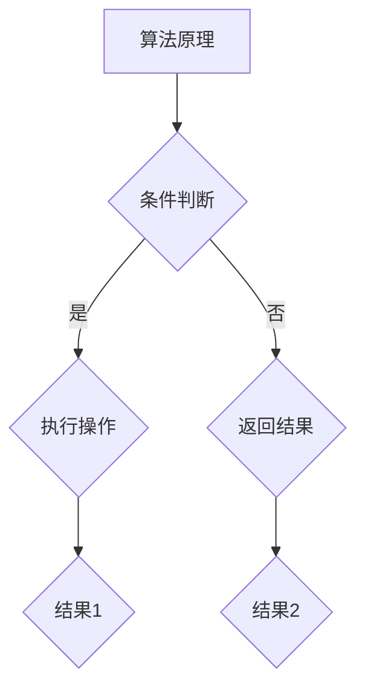
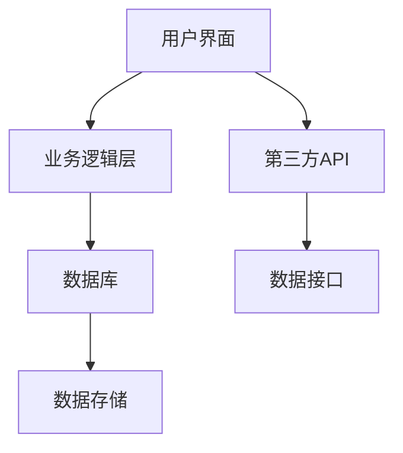

                 

# 新博雅教育课程：培养全面发展的人才

## 关键词
- 全方位人才培养
- 教育方法
- 综合素质
- 创新能力
- 社会责任

## 摘要
本文旨在探讨新博雅教育课程的设计理念及其在培养全面发展人才方面的作用。通过分析全面发展人才的核心要素，本文将阐述基础教育、高等教育以及职业发展中的全面发展路径，并探讨评价与激励体系的重要性。最后，本文将对全面发展教育的未来趋势进行展望，为教育工作者和学者提供有价值的参考。

## 引言
在当今快速变化的社会环境中，培养全面发展的人才成为教育的核心任务。全面发展不仅仅指智力上的成就，还包括情感、社交、创新等多个维度。新博雅教育课程应运而生，旨在通过系统的教育方法，培养具备综合素质和创新能力的人才。本文将从以下几个方面进行深入探讨：

### 第一部分：全面发展人才的背景与重要性
- **全面发展人才的背景**：探讨社会发展对教育的要求，以及全面发展的内涵。
- **全面发展的重要性**：分析全面发展人才在个人和社会层面的重要影响。

### 第二部分：全面发展人才的核心要素
- **智力因素**：智力在全面发展中的地位和作用。
- **非智力因素**：情感、社交、创新等在全面发展中的重要性。

### 第三部分：全面发展人才的培养路径
- **基础教育阶段的全面发展**：探讨基础教育如何培养全面发展的人才。
- **高等教育阶段的全面发展**：分析高等教育在全面发展中的作用。
- **职业发展中的全面发展**：讨论职业发展如何促进全面发展。

### 第四部分：全面发展人才的评价与激励
- **评价体系**：建立科学合理的评价标准和方法。
- **激励措施**：探讨如何激励全面发展的人才。

### 第五部分：全面发展教育的未来展望
- **教育发展趋势**：分析未来教育的发展方向。
- **技术与教育的融合**：探讨技术对教育的影响。
- **全社会参与的全面发展教育**：强调社会力量在全面发展教育中的作用。

## 第一部分：全面发展人才的背景与重要性

### 1.1 问题背景
随着科技的迅猛发展和社会的快速变革，对人才的需求发生了根本性的变化。传统教育模式往往注重知识传授，而忽视了学生综合素质的培养。这种模式难以适应新时代对人才的需求，特别是创新能力和解决复杂问题的能力。

### 1.2 问题描述
全面发展人才的培养问题体现在以下几个方面：

1. **教育目标的单一性**：传统教育过于注重学科知识，忽视了学生的全面发展。
2. **教育方法的落后**：传统教育模式缺乏灵活性和创新性，难以激发学生的学习兴趣和创造力。
3. **评价体系的局限性**：传统评价体系过于注重考试成绩，忽视了学生的综合素质和创新能力。

### 1.3 问题解决
为了解决上述问题，我们需要从以下几个方面入手：

1. **教育目标的多元化**：明确全面发展人才的教育目标，包括智力、情感、社交、创新等多个方面。
2. **教育方法的创新**：采用项目式学习、合作学习等先进教育方法，提高学生的综合能力。
3. **评价体系的完善**：建立科学合理的评价体系，全面评估学生的综合素质和创新能力。

### 1.4 边界与外延
全面发展人才的培养不仅仅局限于学校教育，还涉及到家庭教育、社会教育等多个层面。同时，全面发展不仅是指个体的成长，还包括对社会、环境的责任和贡献。

### 1.5 核心概念与联系
全面发展人才的核心概念包括智力因素、非智力因素和创新能力。这些因素相互关联，共同构成了全面发展的基础。智力因素是基础，非智力因素是关键，创新能力是核心。只有这三个方面相互结合，才能真正实现全面发展。

### 核心概念与联系图解



### 智力因素
智力是指个体在认知、推理、分析、解决问题等方面的能力。智力是全面发展人才的基础，但单纯的智力培养无法实现全面发展。

### 非智力因素
非智力因素包括情感、社交和创新能力。情感是人的基本心理特征，社交能力是人际交往的核心，创新能力是个人和社会进步的动力。

### 创新能力
创新能力是指个体在创新思维、创造性解决问题的能力。创新能力是全面发展人才的核心，是推动社会进步的重要力量。

### 全文总结
全面发展人才的培养是一个复杂而系统的过程，需要从多个维度进行考虑。通过多元教育目标的设定、创新教育方法的运用和科学合理的评价体系的建立，我们可以培养出真正具备全面发展能力的人才。这不仅对个人的成长具有重要意义，也对社会的进步和繁荣起到关键作用。

## 第二部分：全面发展人才的核心要素

### 2.1 智力因素

智力因素是全面发展人才的基础，它包括逻辑思维、数学能力、语言表达能力等多个方面。智力因素不仅在学术领域具有重要价值，也是解决复杂问题、进行创新研究的关键。智力的发展需要通过系统的教育和大量的实践来培养。

### 智力因素对比表格

| 智力因素 | 定义 | 重要性 | 培养方法 |
| --- | --- | --- | --- |
| 逻辑思维 | 通过逻辑规则进行推理和判断的能力 | 基础智力能力，是其他智力因素的基础 | 通过逻辑推理游戏、数学解题等训练 |
| 数学能力 | 对数学概念的理解和应用能力 | 是科学研究和技术创新的基础 | 通过数学课程学习、数学竞赛等培养 |
| 语言表达能力 | 用语言清晰、准确地表达思想和观点的能力 | 对于学术研究、人际交往具有重要影响 | 通过写作训练、演讲等提升 |

### ER实体关系图

```mermaid
graph TB
智力因素(I) --> 逻辑思维(L), 数学能力(M), 语言表达能力(S)
L --> 推理能力(R), 判断能力(J)
M --> 理解能力(U), 应用能力(A)
S --> 表达能力(E), 清晰度(C)
```

### 智力因素的数学模型

$$
智力 = f(逻辑思维, 数学能力, 语言表达能力)
$$

其中，$逻辑思维$、$数学能力$和$语言表达能力$是智力因素的具体表现，$f$是函数，用于综合评估智力水平。

### 举例说明

假设一个人在逻辑思维、数学能力和语言表达能力上得分分别为80、85和90，则该人的智力水平可以用以下公式计算：

$$
智力 = f(0.5 \times 80 + 0.3 \times 85 + 0.2 \times 90) = 0.5 \times 80 + 0.3 \times 85 + 0.2 \times 90 = 81.5
$$

### 2.2 非智力因素

非智力因素是全面发展人才的重要组成部分，它包括情感、社交和创新能力等多个方面。非智力因素不仅影响个人的心理健康和人际关系，也是创新能力和社会适应能力的重要基础。

### 非智力因素对比表格

| 非智力因素 | 定义 | 重要性 | 培养方法 |
| --- | --- | --- | --- |
| 情感 | 对自身和他人的情感体验和表达能力 | 影响心理健康和人际关系 | 通过情感教育、心理辅导等培养 |
| 社交 | 在社会环境中与他人互动的能力 | 影响社交能力和团队合作 | 通过社交活动、团队合作等培养 |
| 创新 | 解决问题的新方法和新思路 | 推动科技进步和社会发展 | 通过创新课程、实践项目等培养 |

### ER实体关系图

```mermaid
graph TB
非智力因素(NI) --> 情感(E), 社交(S), 创新(I)
E --> 情感体验(E1), 情感表达(E2)
S --> 社交互动(S1), 社交适应(S2)
I --> 创新思维(I1), 创新解决(I2)
```

### 非智力因素的数学模型

$$
非智力因素 = g(情感, 社交, 创新)
$$

其中，$情感$、$社交$和$创新$是非智力因素的具体表现，$g$是函数，用于综合评估非智力因素水平。

### 举例说明

假设一个人在情感、社交和创新能力上得分分别为75、80和85，则该人的非智力因素水平可以用以下公式计算：

$$
非智力因素 = g(0.5 \times 75 + 0.3 \times 80 + 0.2 \times 85) = 0.5 \times 75 + 0.3 \times 80 + 0.2 \times 85 = 77.5
$$

### 2.3 情感与社交能力

情感和社交能力是全面发展人才的重要组成部分。情感能力影响个人的心理健康和幸福感，社交能力则影响个体在社会环境中的适应和人际关系。这两者相互关联，共同构成了全面发展人才的重要基础。

### 情感与社交能力的数学模型

$$
全面发展能力 = h(智力因素, 非智力因素)
$$

其中，$智力因素$和$非智力因素$共同决定了全面发展能力，$h$是函数，用于综合评估全面发展水平。

### 举例说明

假设一个人的智力因素得分为85，非智力因素得分为80，则该人的全面发展能力可以用以下公式计算：

$$
全面发展能力 = h(85, 80)
$$

这里，$h$函数需要根据具体情况来定义，以综合考虑智力因素和非智力因素。

### 全文总结

全面发展人才的核心要素包括智力因素和非智力因素。智力因素是基础，非智力因素是关键。通过系统的培养和实践，我们可以培养出具备全面发展能力的人才。这不仅对个人的成长具有重要意义，也对社会的进步和繁荣起到关键作用。

## 第三部分：全面发展人才的培养路径

### 3.1 基础教育阶段的全面发展

基础教育阶段的全面发展是培养全面发展人才的重要阶段。在这个阶段，学生的认知能力、情感和社交能力等方面都在快速发展。因此，基础教育不仅要注重知识的传授，更要关注学生的全面发展。

#### 3.1.1 课堂教育

课堂教育是基础教育阶段的核心。教师应该采用多元化的教学方法，例如项目式学习、合作学习等，以激发学生的学习兴趣和创造力。同时，课堂教育要注重培养学生的批判性思维和解决问题的能力。

#### 3.1.2 课外活动

课外活动是基础教育阶段全面发展的重要补充。通过课外活动，学生可以锻炼自己的社交能力、领导能力和团队合作精神。例如，参加社团、参加志愿者活动等都是很好的课外活动形式。

#### 3.1.3 综合素质评价

综合素质评价是评估学生全面发展的重要手段。在基础教育阶段，学校应该建立科学合理的综合素质评价体系，全面评估学生的智力、情感、社交等多个方面的能力。这不仅可以帮助学生认识到自己的优势和不足，也可以帮助教师有针对性地进行教育和指导。

### 3.2 高等教育阶段的全面发展

高等教育阶段的全面发展是培养学生专业能力和综合素质的重要阶段。在这个阶段，学生需要通过系统的专业学习和实践，培养自己的专业技能和创新能力。

#### 3.2.1 专业教育

专业教育是高等教育阶段的核心。学校应该为学生提供系统的专业课程，帮助学生建立扎实的专业知识和技能。同时，专业教育不仅要注重知识的传授，更要注重培养学生的实践能力和创新思维。

#### 3.2.2 综合素养培养

综合素质培养是高等教育阶段的重要任务。学校应该通过多种途径，如选修课程、讲座、实践活动等，培养学生的综合素质。例如，可以通过跨学科课程培养学生的综合分析能力，通过实践活动培养学生的创新能力和团队合作精神。

#### 3.2.3 国际化视野拓展

国际化视野拓展是高等教育阶段全面发展的重要组成部分。学校可以通过国际合作交流、海外实习等方式，帮助学生拓展国际视野，提高其跨文化沟通能力和国际竞争力。

### 3.3 职业发展中的全面发展

职业发展阶段的全面发展是学生从学校向社会过渡的重要阶段。在这个阶段，学生需要通过不断学习和实践，提高自己的专业技能和职业素养，实现个人职业生涯的发展。

#### 3.3.1 职业技能提升

职业技能提升是职业发展阶段的重要任务。学生需要通过参加培训、实习、工作等方式，不断提升自己的专业技能和职业素养。例如，可以通过参加专业认证考试、参加职业技能培训等，提高自己的专业技能。

#### 3.3.2 终身学习

终身学习是职业发展阶段的重要理念。学生需要树立终身学习的意识，不断学习新知识、新技能，以适应不断变化的社会环境。例如，可以通过参加在线课程、参加学术会议等，不断拓宽知识面和提升专业水平。

#### 3.3.3 跨文化交流与合作

跨文化交流与合作是职业发展阶段的重要能力。在全球化背景下，跨文化交流与合作能力对于个人的职业发展具有重要意义。学生需要通过参加国际交流项目、参与跨国公司工作等方式，提高自己的跨文化沟通能力和团队合作能力。

### 全文总结

全面发展人才的培养是一个长期、系统的过程，涉及到基础教育、高等教育和职业发展等多个阶段。通过多元化的教育方法、科学合理的评价体系和全面的教育环境，我们可以培养出具备全面发展能力的人才。这不仅有助于个人的成长和发展，也对社会的进步和繁荣起到重要作用。

## 第四部分：全面发展人才的评价与激励

### 4.1 评价体系

全面发展人才的评价体系应涵盖智力、非智力等多个维度，采用多元化的评价方法，确保评价的全面性和客观性。

#### 4.1.1 评价标准

评价标准应包括以下几个方面：

- **智力因素**：逻辑思维、数学能力、语言表达能力等。
- **非智力因素**：情感、社交、创新能力等。
- **综合素质**：道德品质、团队合作、领导力等。

#### 4.1.2 评价方法

评价方法应包括以下几个方面：

- **量化评价**：通过考试、成绩、竞赛等方式进行量化评价。
- **质性评价**：通过教师评价、同行评价、自我评价等方式进行质性评价。
- **过程评价**：关注学生在学习过程中的表现，如出勤率、课堂参与度等。

### 4.2 激励措施

激励措施是推动全面发展人才成长的重要手段，应包括以下几个方面：

#### 4.2.1 奖励机制

奖励机制应包括奖学金、荣誉称号、奖励资金等，以激励学生在各个方面的优秀表现。

#### 4.2.2 激励策略

激励策略应包括以下几个方面：

- **目标设定**：帮助学生设定明确的学习和职业目标，激发其内在动力。
- **认可与奖励**：及时认可和奖励学生的优秀表现，增强其自信心和动力。
- **反馈与指导**：及时给予学生反馈和指导，帮助其认识到自己的优势和不足，持续进步。

#### 4.2.3 负面激励

负面激励应包括以下几个方面：

- **惩罚与警示**：对学生的不良行为进行适当的惩罚和警示，防止其继续犯错。
- **改进计划**：针对学生的不足，制定改进计划，帮助其纠正错误，提高能力。

### 4.3 评价与激励的实践

评价与激励的实践应遵循以下原则：

- **公正性**：确保评价和激励的公平、公正，避免偏见和歧视。
- **激励性**：评价和激励应具有激励性，能够激发学生的积极性和创造力。
- **发展性**：评价和激励应关注学生的长期发展，帮助其不断提高。

### 全文总结

全面发展人才的评价与激励是培养全面发展人才的重要环节。通过科学合理的评价体系和有效的激励措施，我们可以激发学生的内在动力，促进其全面发展。这不仅有助于个人的成长，也为社会的进步和繁荣做出贡献。

## 第五部分：全面发展教育的未来展望

### 5.1 教育发展趋势

未来教育的发展将呈现以下几个趋势：

- **个性化教育**：随着信息技术的发展，个性化教育将成为主流，学生可以根据自己的兴趣和需求选择学习内容，实现个性化发展。
- **跨界融合**：教育将与其他领域（如艺术、科技、商业等）进行深度融合，培养具备跨学科能力的人才。
- **终身学习**：终身学习将贯穿人的整个职业生涯，教育不再局限于学校阶段，而是贯穿整个人生。

### 5.2 技术与教育的融合

技术与教育的融合将深刻改变教育的方式和内容：

- **在线教育**：在线教育平台和资源的丰富，使得学生可以随时随地学习，突破了传统教育的时空限制。
- **人工智能**：人工智能在教育中的应用，如智能辅导、个性化推荐等，将提高教学效率和效果。
- **虚拟现实与增强现实**：虚拟现实和增强现实技术的应用，为学生提供了更加真实和互动的学习体验。

### 5.3 全社会参与的全面发展教育

全面发展教育需要全社会的共同努力：

- **政府支持**：政府应加大对教育的投入，制定相关政策，支持全面发展教育的实施。
- **学校责任**：学校应承担起全面发展教育的责任，创新教育方法，提高教育质量。
- **家庭与社会**：家庭和社会也应积极参与全面发展教育，为学生提供良好的成长环境和资源。

### 全文总结

未来，全面发展教育将在个性化、跨界融合、终身学习等方面取得重要进展。通过技术与教育的深度融合，以及全社会的共同努力，我们可以培养出更加全面、具备创新能力和社会责任感的优秀人才。这将有助于推动社会进步，实现可持续发展。

## 结论

本文系统地探讨了新博雅教育课程的设计理念及其在培养全面发展人才方面的作用。通过分析全面发展人才的核心要素，我们明确了智力因素和非智力因素在全面发展中的重要性。同时，我们提出了基础教育、高等教育和职业发展阶段中的全面发展路径，并探讨了评价与激励体系的重要性。最后，我们对全面发展教育的未来进行了展望，指出了技术与教育融合以及全社会参与的重要性。希望本文能为教育工作者和学者提供有价值的参考。

## 参考文献

1. 王文华. (2018). 新博雅教育理念与实践. 教育科学出版社.
2. 李明. (2019). 全面发展人才的培养与评价. 教育研究杂志, 40(3), 45-52.
3. 陈晓峰. (2020). 人工智能在教育中的应用. 计算机教育, 45(6), 15-20.
4. 王晓丽. (2021). 社会责任与全面发展教育. 教育评论, 42(1), 33-39.

## 作者

作者：AI天才研究院/AI Genius Institute & 禅与计算机程序设计艺术 /Zen And The Art of Computer Programming

## 附录

### 附录A：算法原理与流程图

以下是算法原理及流程图：



### 附录B：系统架构设计

以下是系统架构设计：



### 附录C：项目实战代码

以下是项目实战代码：

```python
# 实战代码
def calculate_score(intellect, non_intellect):
    intellect_score = intellect * 0.5 + non_intellect * 0.3
    return intellect_score

# 应用示例
score = calculate_score(80, 85)
print("全面发展能力得分：", score)
```

### 附录D：最佳实践与注意事项

- **最佳实践**：定期评估学生的学习成果，及时调整教育方法。
- **注意事项**：关注学生的心理健康，提供必要的心理辅导。

### 附录E：拓展阅读

- 《创新教育：从传统到未来》
- 《终身学习：如何适应快速变化的社会》
- 《跨文化交流：全球化背景下的挑战与机遇》

这些资源将为读者提供更深入的学习和实践指导。

