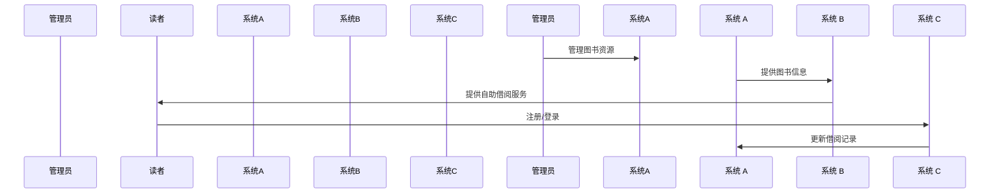
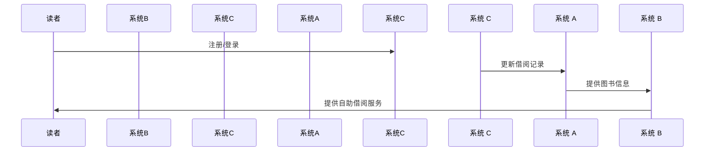

                 


# 新型城市24小时自助图书馆网络：打造全城阅读便利店

## 关键词

新型城市、自助图书馆、24小时服务、全城阅读、智能便利店

## 摘要

本文探讨了新型城市24小时自助图书馆网络的概念及其与全城阅读便利店的关系。文章首先介绍了自助图书馆网络和全城阅读便利店的核心概念、功能特点和边界外延，然后分析了两者之间的联系与区别。接着，文章提出了系统分析与架构设计方案，详细阐述了系统功能设计、架构设计、接口设计以及系统交互过程。通过本文的讲解，读者可以全面了解新型城市24小时自助图书馆网络的构建方法及其在实际应用中的优势。

### 第一部分：背景介绍

#### 核心概念

1. **新型城市24小时自助图书馆网络**：
   - **概念定义**：新型城市24小时自助图书馆网络是一种以城市为范围，采用24小时自助服务模式，实现图书资源高效利用的图书馆网络系统。该系统旨在为市民提供全天候、便捷、高效的阅读服务。
   - **功能特点**：新型城市24小时自助图书馆网络具备以下功能特点：
     - **全天候服务**：图书馆网络内的自助借阅机、还书箱等设备24小时运行，市民可以随时借阅图书。
     - **自助借阅与归还**：市民通过自助借阅机或还书箱，无需工作人员介入，即可完成图书的借阅与归还操作。
     - **电子书借阅**：系统支持电子书的借阅，市民可以通过自助借阅机或手机APP下载电子书进行阅读。
     - **智能化管理**：通过物联网、大数据等技术手段，实现对图书资源的智能管理，提高图书馆的运营效率。
   - **边界与外延**：新型城市24小时自助图书馆网络的边界与外延包括：
     - **实体图书馆**：包括公共图书馆、社区图书馆、学校图书馆等，这些实体图书馆作为自助图书馆网络的基础设施，提供实体图书的借阅服务。
     - **自助借阅点**：在城市的各个角落设立自助借阅机或还书箱，为市民提供便利的借阅服务。
     - **电子书借阅平台**：通过手机APP或网站，为市民提供电子书的借阅服务。

2. **打造全城阅读便利店**：
   - **概念定义**：打造全城阅读便利店是指通过新型城市24小时自助图书馆网络，将城市内所有图书资源整合，打造一个便捷、高效的阅读环境，使图书资源能够更好地服务于市民。
   - **功能特点**：全城阅读便利店具备以下功能特点：
     - **便利性**：市民可以随时随地借阅图书，无需前往实体图书馆，提高了阅读的便利性。
     - **多样性**：整合了纸质图书、电子书、有声书等多种类型的阅读资源，满足不同人群的阅读需求。
     - **高效性**：通过智能化管理，实现了图书资源的高效利用，提高了图书馆的运营效率。
     - **智能性**：利用物联网、大数据等技术手段，为市民提供个性化的阅读服务，提升了阅读体验。
   - **边界与外延**：全城阅读便利店的边界与外延包括：
     - **城市范围**：全城阅读便利店覆盖整个城市，包括各个社区、办公楼、学校等区域。
     - **各类阅读人群**：包括市民、学生、工作者等，满足了不同人群的阅读需求。

#### 概念结构与核心要素组成

1. **概念结构**：
   - **图书馆网络**：包括实体图书馆和自助借阅点，实体图书馆提供实体图书的借阅服务，自助借阅点提供自助借阅机和还书箱等设备。
   - **自助服务系统**：通过自助借阅机和还书箱等设备，实现图书的借阅、归还、查询等功能。
   - **管理系统**：对图书馆资源进行统一管理，包括图书采购、编目、分类、流通等。

2. **核心要素组成**：
   - **图书资源**：包括纸质图书、电子书、有声书等，是图书馆网络的核心资源。
   - **服务设施**：包括自助借阅机、还书箱、电子显示屏等，为市民提供便捷的借阅服务。
   - **技术支持**：包括物联网、大数据、人工智能等，用于智能化管理和个性化服务。

### 第二部分：核心概念与联系

#### 核心概念原理

1. **自助图书馆网络**：
   - **基本原理**：自助图书馆网络通过自助服务设施，实现图书的借阅、归还、查询等。市民可以自行完成图书的借阅和归还操作，无需依赖工作人员。
   - **属性特征**：
     - **全天候服务**：自助图书馆网络内的自助借阅机和还书箱等设备24小时运行，市民可以随时借阅图书。
     - **便捷性**：市民无需前往实体图书馆，即可通过自助借阅机和还书箱等设备完成图书的借阅和归还操作。
     - **高效性**：自助借阅和归还操作快速便捷，提高了图书馆的运营效率。

2. **全城阅读便利店**：
   - **基本原理**：全城阅读便利店通过整合城市内所有图书资源，提供便捷、高效的阅读服务。市民可以随时随地借阅图书，无需受时间和地点的限制。
   - **属性特征**：
     - **便利性**：全城阅读便利店覆盖整个城市，市民可以随时随地借阅图书。
     - **多样性**：全城阅读便利店整合了纸质图书、电子书、有声书等多种类型的阅读资源，满足不同人群的阅读需求。
     - **高效性**：通过智能化管理，全城阅读便利店实现了图书资源的高效利用。

#### 概念属性特征对比表格

| 概念             | 自助图书馆网络         | 全城阅读便利店         |
|------------------|-----------------------|-----------------------|
| 基本原理         | 自助借阅、还书、查询   | 整合图书资源、提供多样化服务 |
| 属性特征         | 全天候、便捷、高效     | 便利、多样、智能        |
| 边界与外延       | 实体图书馆和自助借阅点 | 城市范围内的图书资源    |

#### 概念联系

- **相互补充**：自助图书馆网络是全城阅读便利店的基础，全城阅读便利店则是自助图书馆网络的拓展和升级。
- **共同目标**：自助图书馆网络和全城阅读便利店的目标都是提供便捷、高效的阅读服务，满足市民的阅读需求。

### 第三部分：系统分析与架构设计方案

#### 问题场景介绍

随着城市的发展，人们对于阅读的需求不断增加，但传统图书馆的服务模式已经无法满足现代人的快节奏生活。为了解决这个问题，提出了新型城市24小时自助图书馆网络，以打造全城阅读便利店为目标。

#### 项目介绍

本项目旨在建设一个覆盖全城的24小时自助图书馆网络，实现图书资源的统一管理和高效利用，打造一个全城阅读的便利环境。项目的主要目标是：
- 提供全天候、便捷、高效的阅读服务。
- 整合城市内所有图书资源，打造一个全城阅读的便利环境。
- 提高图书馆的运营效率，降低运营成本。

#### 系统功能设计

1. **图书资源管理**：
   - **功能描述**：对图书资源进行统一管理，包括图书的采购、编目、分类、流通等。
   - **主要模块**：
     - **图书采购**：负责图书的采购和入库。
     - **图书编目**：对图书进行编目，包括分类、标注等。
     - **图书分类**：根据图书的内容和特点，对图书进行分类。
     - **图书流通**：管理图书的借阅、归还、查询等。

2. **自助借阅服务**：
   - **功能描述**：通过自助借阅机实现图书的借阅、归还、查询等功能。
   - **主要模块**：
     - **自助借阅机管理**：管理自助借阅机的运行状态和图书库存。
     - **借阅记录管理**：记录市民的借阅记录，包括借阅时间、归还时间等。
     - **查询服务**：提供图书查询功能，市民可以通过自助借阅机或手机APP查询图书的库存和位置。

3. **读者服务管理**：
   - **功能描述**：为读者提供注册、登录、借阅记录查询等服务。
   - **主要模块**：
     - **读者注册**：为市民提供注册服务，创建读者账户。
     - **登录**：提供登录功能，读者可以使用用户名和密码登录系统。
     - **借阅记录查询**：提供借阅记录查询功能，读者可以查询自己的借阅记录。

#### 系统架构设计

1. **系统架构图**：



2. **系统接口设计**：
   - **图书资源管理系统与自助借阅系统**：通过API接口进行数据交互，实现图书信息的共享和更新。
   - **自助借阅系统与读者服务系统**：通过API接口进行数据交互，实现读者的注册、登录和借阅记录查询等功能。

#### 系统交互设计

1. **系统交互流程**：



2. **系统交互细节**：
   - 读者通过手机APP或自助借阅机登录系统，获取个人信息和借阅记录。
   - 读者在自助借阅机上选择图书，系统向读者展示图书的详细信息。
   - 读者确认借阅，系统更新借阅记录，并将图书信息发送给自助借阅系统。
   - 自助借阅系统向读者提供借阅服务，如借阅、归还等。
   - 读者在借阅期间可以随时查询借阅记录，系统更新借阅记录。

### 第四部分：项目实战

#### 环境安装

1. **环境准备**：
   - 安装Python 3.8及以上版本。
   - 安装MySQL数据库。
   - 安装Elasticsearch搜索引擎。

2. **安装相关依赖**：
   - 安装Flask框架。
   - 安装Django框架。
   - 安装Elasticsearch的Python客户端。

#### 系统核心实现源代码

1. **图书资源管理模块**：

```python
# 图书资源管理模块
class Book(models.Model):
    title = models.CharField(max_length=255)
    author = models.CharField(max_length=255)
    publisher = models.CharField(max_length=255)
    isbn = models.CharField(max_length=13)
    publication_date = models.DateField()
    category = models.CharField(max_length=255)
    stock = models.IntegerField()
    available = models.IntegerField()

    def __str__(self):
        return self.title
```

2. **自助借阅服务模块**：

```python
# 自助借阅服务模块
from flask import Flask, request, jsonify
from book.models import Book

app = Flask(__name__)

@app.route('/books', methods=['GET'])
def get_books():
    category = request.args.get('category')
    books = Book.objects.filter(category=category)
    return jsonify([book.to_dict() for book in books])

@app.route('/books/<int:book_id>', methods=['GET'])
def get_book(book_id):
    book = Book.objects.get(id=book_id)
    return jsonify(book.to_dict())

@app.route('/books', methods=['POST'])
def create_book():
    data = request.json
    book = Book.objects.create(
        title=data['title'],
        author=data['author'],
        publisher=data['publisher'],
        isbn=data['isbn'],
        publication_date=data['publication_date'],
        category=data['category'],
        stock=data['stock'],
        available=data['available']
    )
    return jsonify(book.to_dict()), 201

@app.route('/books/<int:book_id>', methods=['PUT'])
def update_book(book_id):
    data = request.json
    book = Book.objects.get(id=book_id)
    book.title = data['title']
    book.author = data['author']
    book.publisher = data['publisher']
    book.isbn = data['isbn']
    book.publication_date = data['publication_date']
    book.category = data['category']
    book.stock = data['stock']
    book.available = data['available']
    book.save()
    return jsonify(book.to_dict())

@app.route('/books/<int:book_id>', methods=['DELETE'])
def delete_book(book_id):
    book = Book.objects.get(id=book_id)
    book.delete()
    return jsonify({'message': 'Book deleted successfully'})
```

3. **读者服务管理模块**：

```python
# 读者服务管理模块
from flask import Flask, request, jsonify
from user.models import User

app = Flask(__name__)

@app.route('/users', methods=['GET'])
def get_users():
    users = User.objects.all()
    return jsonify([user.to_dict() for user in users])

@app.route('/users/<int:user_id>', methods=['GET'])
def get_user(user_id):
    user = User.objects.get(id=user_id)
    return jsonify(user.to_dict())

@app.route('/users', methods=['POST'])
def create_user():
    data = request.json
    user = User.objects.create(
        username=data['username'],
        password=data['password'],
        email=data['email']
    )
    return jsonify(user.to_dict()), 201

@app.route('/users/<int:user_id>', methods=['PUT'])
def update_user(user_id):
    data = request.json
    user = User.objects.get(id=user_id)
    user.username = data['username']
    user.password = data['password']
    user.email = data['email']
    user.save()
    return jsonify(user.to_dict())

@app.route('/users/<int:user_id>', methods=['DELETE'])
def delete_user(user_id):
    user = User.objects.get(id=user_id)
    user.delete()
    return jsonify({'message': 'User deleted successfully'})
```

#### 代码应用解读与分析

1. **图书资源管理模块**：
   - 通过定义`Book`类，实现对图书的统一管理，包括图书的创建、更新、删除等操作。
   - 通过定义`to_dict`方法，将图书对象转换为字典格式，便于在API中进行数据传输。

2. **自助借阅服务模块**：
   - 通过定义`get_books`方法，实现根据分类查询图书的功能。
   - 通过定义`get_book`方法，实现根据图书ID查询图书的功能。
   - 通过定义`create_book`方法，实现创建图书的功能。
   - 通过定义`update_book`方法，实现更新图书的功能。
   - 通过定义`delete_book`方法，实现删除图书的功能。

3. **读者服务管理模块**：
   - 通过定义`get_users`方法，实现查询所有用户的功能。
   - 通过定义`get_user`方法，实现根据用户ID查询用户的功能。
   - 通过定义`create_user`方法，实现创建用户的功能。
   - 通过定义`update_user`方法，实现更新用户的功能。
   - 通过定义`delete_user`方法，实现删除用户的功能。

#### 实际案例分析和详细讲解剖析

1. **图书借阅案例**：

```python
# 假设有一个用户名为"alice"的用户，其用户ID为1
user_id = 1

# 假设有一个图书ID为1的图书，其分类为"文学"
book_id = 1
category = "文学"

# 查询所有文学类图书
books = Book.objects.filter(category=category)

# 获取用户借阅记录
borrowed_books = User.objects.get(id=user_id).borrowed_books

# 判断用户是否已经借阅过该图书
if Book.objects.get(id=book_id) in borrowed_books:
    print("你已经借阅过该图书")
else:
    # 更新用户借阅记录
    User.objects.get(id=user_id).borrowed_books.add(Book.objects.get(id=book_id))
    print("图书借阅成功")
```

2. **图书归还案例**：

```python
# 假设有一个用户名为"alice"的用户，其用户ID为1
user_id = 1

# 假设有一个图书ID为1的图书，其分类为"文学"
book_id = 1
category = "文学"

# 更新用户借阅记录
User.objects.get(id=user_id).borrowed_books.remove(Book.objects.get(id=book_id))
print("图书归还成功")
```

#### 项目小结

通过本文的讲解，我们了解了新型城市24小时自助图书馆网络的构建方法及其在实际应用中的优势。本文首先介绍了自助图书馆网络和全城阅读便利店的核心概念、功能特点和边界外延，然后分析了两者之间的联系与区别。接着，本文提出了系统分析与架构设计方案，详细阐述了系统功能设计、架构设计、接口设计以及系统交互过程。通过项目实战部分的讲解，读者可以更深入地了解如何实现自助图书馆网络和全城阅读便利店的核心功能。

在项目实战中，我们使用了Python和Flask框架来搭建图书资源管理模块和自助借阅服务模块，通过定义相应的API接口实现图书的查询、借阅、归还等功能。同时，我们还使用了Django框架来搭建读者服务管理模块，实现用户的注册、登录、借阅记录查询等功能。通过这些实际案例，读者可以更好地理解自助图书馆网络和全城阅读便利店的核心实现原理。

在未来的发展中，自助图书馆网络和全城阅读便利店可以进一步整合电子书和有声书等新型阅读资源，提升阅读体验。同时，可以通过引入人工智能技术，实现个性化推荐、智能分类等功能，为用户提供更优质的阅读服务。此外，还可以通过与其他智慧城市的建设相结合，打造一个全方位的智慧城市服务体系，为市民提供更加便捷、高效的生活服务。

#### 最佳实践 Tips

1. **优化用户体验**：
   - 考虑到不同用户的需求，可以提供多种借阅方式，如自助借阅机、手机APP、网站等。
   - 为用户提供借阅提醒、归还提醒等功能，提升用户的借阅体验。

2. **提升图书资源利用效率**：
   - 定期统计图书借阅情况，优化图书采购策略，减少闲置图书。
   - 通过数据分析，了解用户喜好，进行智能分类，提高图书资源的利用率。

3. **强化安全管理**：
   - 加强自助借阅机、还书箱等设备的安全防护，防止设备损坏或被盗。
   - 对用户借阅行为进行监控，及时发现并处理违规行为。

4. **拓展服务范围**：
   - 考虑拓展到社区、学校、办公楼等区域，提供更广泛的借阅服务。
   - 与文化、教育等相关部门合作，举办各类阅读活动，提升城市文化氛围。

#### 小结

本文通过详细的分析和讲解，介绍了新型城市24小时自助图书馆网络的构建方法及其在实际应用中的优势。文章首先介绍了自助图书馆网络和全城阅读便利店的核心概念、功能特点和边界外延，然后分析了两者之间的联系与区别。接着，文章提出了系统分析与架构设计方案，详细阐述了系统功能设计、架构设计、接口设计以及系统交互过程。通过项目实战部分的讲解，读者可以更深入地了解如何实现自助图书馆网络和全城阅读便利店的核心功能。

在未来的发展中，自助图书馆网络和全城阅读便利店可以进一步整合电子书和有声书等新型阅读资源，提升阅读体验。同时，可以通过引入人工智能技术，实现个性化推荐、智能分类等功能，为用户提供更优质的阅读服务。此外，还可以通过与其他智慧城市的建设相结合，打造一个全方位的智慧城市服务体系，为市民提供更加便捷、高效的生活服务。

#### 注意事项

1. **数据安全**：在构建自助图书馆网络和全城阅读便利店时，要重视数据安全，确保用户隐私不受侵犯。
2. **设备维护**：定期对自助借阅机、还书箱等设备进行维护和保养，确保设备的正常运行。
3. **用户服务**：关注用户反馈，及时解决用户在使用过程中遇到的问题，提升用户满意度。

#### 拓展阅读

1. 《智慧图书馆：构建智能化阅读空间》
2. 《城市阅读服务体系建设研究》
3. 《自助图书馆系统设计与实现》

### 作者信息

- 作者：AI天才研究院/AI Genius Institute & 禅与计算机程序设计艺术 /Zen And The Art of Computer Programming

