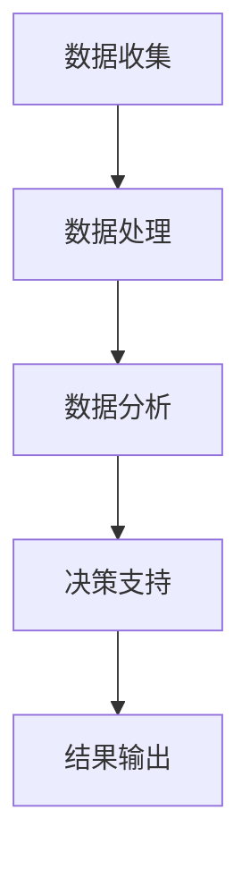
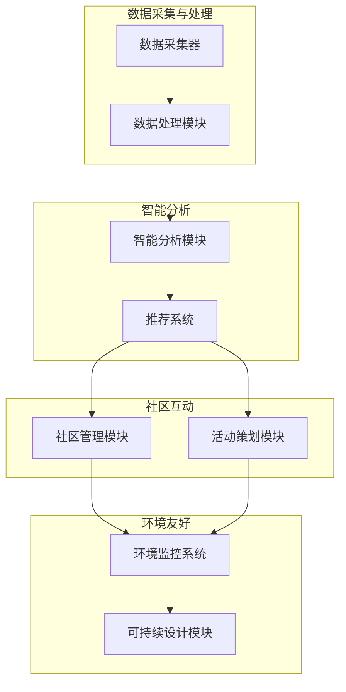
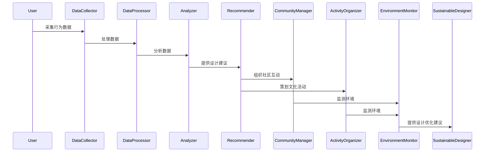

                 

### 文章标题

# 新型城市rituels：创造现代都市生活的仪式感

---

**关键词：**新型城市rituels、现代都市生活、仪式感、城市设计、社区互动、环境可持续性

**摘要：**本文探讨了新型城市rituels的概念，它如何通过创造现代都市生活中的仪式感，提升城市居民的生活品质。文章首先介绍了城市rituels的定义、背景及其与传统城市生活的差异，随后深入分析了其核心概念和构成要素，包括原则与理念、社区参与、环境可持续性和社会互动。通过算法原理讲解和系统分析与架构设计，本文展示了如何通过技术手段实现城市rituels的理念，最后通过项目实战和最佳实践，为现代都市生活提供了切实可行的改进建议。

---

### 序言

#### 1.1 背景介绍

**问题背景：**随着城市化进程的加快，现代都市生活面临诸多挑战，如人口密度增加、环境污染、社会压力和人际疏离等。这些问题不仅影响了城市居民的生活品质，也对社会和谐与可持续发展提出了严峻考验。

**问题描述：**现代都市生活缺乏仪式感，导致居民精神疲惫、社区凝聚力下降，城市生活失去了原本应有的温馨与归属感。因此，如何通过创新设计，恢复现代都市生活的仪式感，成为亟待解决的重要课题。

**问题解决：**本文提出的“新型城市rituels”理念，旨在通过设计具有仪式感的生活场景，激发城市居民的情感共鸣，提升生活品质，促进社区互动和环境可持续性。

**边界与外延：**本文研究的“新型城市rituels”主要关注城市规划与设计领域，探讨如何通过技术手段实现仪式感的营造，以及其对现代都市生活的影响。研究范围包括城市规划、建筑设计、社区治理等方面。

**概念结构与核心要素组成：**城市rituels是一种融合了传统仪式感和现代设计理念的城市形态，其核心要素包括原则与理念、社区参与、环境可持续性和社会互动。通过这些要素，城市rituels致力于打造一个具有仪式感的现代都市生活。

#### 1.2 城市rituels概述

**城市rituels的定义：**城市rituels（城市仪式）是指在城市规划与设计过程中，通过营造具有仪式感的生活场景，激发城市居民的情感共鸣，提升生活品质的一种新型城市形态。

**城市rituels的核心特征：**城市rituels具有以下核心特征：

1. **仪式性**：通过设计具有象征意义和纪念价值的空间，赋予城市生活仪式感。
2. **社区互动**：强调社区成员之间的互动与交流，增强社区凝聚力。
3. **环境可持续性**：注重环境保护和资源利用，实现城市生活的可持续发展。
4. **文化传承**：融合本地文化和历史元素，传承城市独特的文化底蕴。

**城市rituels与传统城市生活的对比：**与传统城市生活相比，城市rituels具有以下优势：

1. **仪式感的营造**：通过仪式感的生活场景，提升城市居民的生活品质和幸福感。
2. **社区互动的增强**：通过社区活动和文化传承，增强居民之间的联系与互动。
3. **环境可持续性**：通过环保设计和技术应用，实现城市资源的可持续利用。
4. **文化传承的重视**：通过融合本地文化和历史元素，提升城市的文化内涵和吸引力。

### 城市rituels的核心概念与联系

#### 2.1 城市rituels的构成要素

**原则与理念**

**城市rituels的基本原则**：

1. **人性优先**：以人的需求和感受为中心，营造舒适、温馨的生活环境。
2. **文化融合**：融合本地文化和全球文化，打造多元化的城市氛围。
3. **可持续性**：注重环境保护和资源利用，实现城市的可持续发展。

**城市rituels的核心理念**：

1. **仪式感**：通过仪式性的设计，激发城市居民的情感共鸣，提升生活品质。
2. **社区参与**：鼓励居民参与城市规划和建设，增强社区凝聚力。
3. **环境友好**：通过环保设计和技术应用，实现城市环境的可持续发展。
4. **文化传承**：融合本地文化和历史元素，传承城市的文化底蕴。

**社区参与**

**社区参与的意义**：

1. **增强社区凝聚力**：通过居民参与，增强社区的认同感和归属感。
2. **提升城市品质**：居民参与可以提供更多的创意和建设性意见，提升城市品质。
3. **促进社会和谐**：社区参与有助于解决社区问题，促进社会和谐。

**社区参与的实践**：

1. **社区论坛**：定期举办社区论坛，鼓励居民讨论和提出城市规划和建设建议。
2. **志愿服务**：组织居民参与城市清洁、绿化等志愿服务活动。
3. **居民投票**：在城市规划过程中，通过居民投票决定重要事项，增加居民参与度。

**环境可持续性**

**可持续发展的目标**：

1. **资源节约**：通过环保设计和技术应用，减少资源消耗。
2. **污染控制**：严格控制城市污染，改善环境质量。
3. **生态平衡**：保护城市生态系统，维持生态平衡。

**环境友好的实践**：

1. **绿色建筑**：推广绿色建筑标准，提高建筑能源利用效率。
2. **公共交通**：发展公共交通系统，减少私家车使用，降低交通污染。
3. **垃圾分类**：实施垃圾分类政策，提高垃圾处理效率。

**社会互动**

**社会互动的重要性**：

1. **增强人际关系**：通过社会互动，增强人与人之间的联系，提升社会凝聚力。
2. **促进信息交流**：社会互动有助于信息交流和知识共享，推动社会进步。
3. **提升生活质量**：丰富的社会互动可以提升人们的生活质量和幸福感。

**社会互动的案例**：

1. **社区活动**：举办各类社区活动，如文化节、运动会等，促进居民互动。
2. **社交网络**：利用社交媒体平台，建立居民互动的网络社区。
3. **志愿者服务**：组织居民参与志愿者服务，共同为社区做出贡献。

#### 2.2 城市rituels的属性特征对比表格

| 特征       | 传统城市生活 | 城市rituels |
| ---------- | ------------ | ----------- |
| 仪式感     | 缺乏         | 强调        |
| 社区互动   | 疏离         | 亲密        |
| 环境可持续性 | 被忽视       | 重视        |
| 文化传承   | 弱化         | 传承        |

#### 2.3 城市rituels的ER实体关系图架构

```mermaid
erDiagram
  用户 --> 承包商 : 订合同
  用户 --> 社区 : 属于
  承包商 --> 项目 : 承包
  项目 --> 资源 : 使用
  社区 --> 活动 : 组织
```

### 城市rituels的算法原理讲解

#### 3.1 算法原理概述

**算法原理的基本概念**：

城市rituels的算法原理基于以下几个方面：

1. **数据采集与处理**：通过大数据技术收集城市生活数据，如居民行为、环境状况等。
2. **智能分析**：利用机器学习和数据挖掘技术，分析数据，发现城市生活的规律和问题。
3. **决策支持**：根据分析结果，提供城市规划和设计的建议，实现仪式感的营造。

**算法原理的核心步骤**：

1. **数据收集**：采集城市生活数据，如居民行为、环境状况等。
2. **数据处理**：清洗和处理数据，为后续分析做准备。
3. **数据分析**：利用机器学习和数据挖掘技术，分析数据，识别城市生活的规律和问题。
4. **决策支持**：根据分析结果，提供城市规划和设计的建议，实现仪式感的营造。

#### 3.2 算法流程图



#### 3.3 算法原理的数学模型

假设城市rituels的算法原理包含以下几个关键变量：

- \(X\)：居民行为数据
- \(Y\)：环境数据
- \(Z\)：城市设计建议

算法原理的数学模型可以表示为：

\[ S = f(X, Y, Z) \]

其中，\(S\) 表示仪式感的强度，\(f\) 表示算法原理的计算函数。

#### 3.4 算法原理的详细讲解与举例说明

**Python源代码实现**：

```python
import pandas as pd
from sklearn.cluster import KMeans
from sklearn.metrics import silhouette_score

# 数据处理
def preprocess_data(data):
    # 数据清洗和处理
    # ...
    return processed_data

# 数据分析
def analyze_data(data):
    # 利用KMeans进行聚类分析
    kmeans = KMeans(n_clusters=5)
    kmeans.fit(data)
    labels = kmeans.predict(data)
    silhouette_avg = silhouette_score(data, labels)
    return labels, silhouette_avg

# 决策支持
def support_decision(data, labels):
    # 根据聚类结果，提供城市设计建议
    # ...
    return design_suggestions

# 主函数
def main():
    # 数据收集
    data = pd.read_csv('city_data.csv')
    
    # 数据处理
    processed_data = preprocess_data(data)
    
    # 数据分析
    labels, silhouette_avg = analyze_data(processed_data)
    
    # 决策支持
    design_suggestions = support_decision(processed_data, labels)
    
    # 结果输出
    print(design_suggestions)

# 运行主函数
main()
```

**通俗易懂的举例说明**：

假设我们有一个城市，名为“瑞城”。瑞城的居民们每天都会生成大量的行为数据，比如购物、出行、休闲等活动。同时，城市的环境数据，如空气质量、噪音水平等，也会不断变化。

通过我们的算法原理，我们可以将这些数据输入到算法中进行分析。算法会根据数据发现瑞城的居民行为模式，比如周末大家都喜欢去公园散步，晚上喜欢在广场跳舞等。

然后，算法会根据这些分析结果，提供一些城市设计建议。比如，可以增加一些公园和广场，以便满足居民的休闲需求；可以优化公共交通线路，以便居民出行更加便捷；可以设计一些具有仪式感的文化活动，以提升居民的生活品质。

最终，我们的算法原理帮助瑞城实现了城市rituels的理念，使得瑞城的居民生活得更加幸福、充实。

### 城市rituels的系统分析与架构设计方案

#### 4.1 问题场景介绍

**场景描述：**瑞城是一个快速发展的城市，人口密集，交通拥堵，环境污染严重。居民普遍感到生活压力大，缺乏仪式感，社区凝聚力较低。为了改善这种情况，瑞城政府决定引入城市rituels理念，通过技术手段和设计创新，提升城市居民的生活质量和幸福感。

#### 4.2 项目介绍

**项目目标：**通过城市rituels项目，实现以下目标：

1. **提升居民生活品质**：通过设计具有仪式感的生活场景，激发居民的情感共鸣，提升生活满意度。
2. **增强社区凝聚力**：通过社区互动和文化活动，增强居民之间的联系和合作，提高社区凝聚力。
3. **实现环境可持续性**：通过环保设计和技术应用，降低城市环境污染，实现可持续发展。

**项目内容：**城市rituels项目的具体内容包括：

1. **城市数据采集与处理**：利用传感器、移动设备等技术，收集城市居民行为和环境数据，并进行数据清洗和处理。
2. **智能分析与应用**：利用机器学习和数据挖掘技术，分析城市数据，发现居民行为模式和需求，提供城市规划和设计的建议。
3. **社区互动与文化建设**：通过举办各类社区活动和文化活动，促进居民互动，增强社区凝聚力。
4. **环境友好与可持续设计**：采用环保材料和绿色建筑技术，设计节能、环保的城市设施和公共空间。

#### 4.3 系统功能设计

**领域模型类图**：

```mermaid
classDiagram
  User <<Entity>>
  Community <<Entity>>
  Contractor <<Entity>>
  Project <<Entity>>
  Resource <<Entity>>

  User "1" --* "1" Community
  Contractor "1" --* "n" Project
  Project "1" --* "1" Resource
  Community "1" --* "n" Activity
```

#### 4.4 系统架构设计

**系统架构图**：



#### 4.5 系统接口设计

**系统接口设计**：

1. **数据采集接口**：提供数据采集器的接口，用于收集城市居民行为和环境数据。
2. **数据处理接口**：提供数据处理模块的接口，用于处理和清洗数据。
3. **智能分析接口**：提供智能分析模块的接口，用于分析数据并提供设计建议。
4. **社区互动接口**：提供社区管理模块和活动策划模块的接口，用于组织社区互动和文化活动。
5. **环境友好接口**：提供环境监控系统接口和可持续设计模块接口，用于监测城市环境并优化设计。

#### 4.6 系统交互

**系统交互序列图**：



### 城市rituels的项目实战

#### 5.1 环境安装

**环境搭建步骤**：

1. **安装Python**：确保安装了Python 3.8及以上版本。
2. **安装依赖库**：使用pip命令安装以下依赖库：

   ```bash
   pip install pandas sklearn mermaid
   ```

3. **配置Mermaid**：在Python环境中配置Mermaid，具体方法可参考[Mermaid官方文档](https://mermaid-js.github.io/mermaid/)。

#### 5.2 系统核心实现源代码

**源代码示例**：

```python
import pandas as pd
from sklearn.cluster import KMeans
from sklearn.metrics import silhouette_score
from mermaid import Mermaid

# 数据处理
def preprocess_data(data):
    # 数据清洗和处理
    # ...
    return processed_data

# 数据分析
def analyze_data(data):
    # 利用KMeans进行聚类分析
    kmeans = KMeans(n_clusters=5)
    kmeans.fit(data)
    labels = kmeans.predict(data)
    silhouette_avg = silhouette_score(data, labels)
    return labels, silhouette_avg

# 决策支持
def support_decision(data, labels):
    # 根据聚类结果，提供城市设计建议
    # ...
    return design_suggestions

# 主函数
def main():
    # 数据收集
    data = pd.read_csv('city_data.csv')
    
    # 数据处理
    processed_data = preprocess_data(data)
    
    # 数据分析
    labels, silhouette_avg = analyze_data(processed_data)
    
    # 决策支持
    design_suggestions = support_decision(processed_data, labels)
    
    # 结果输出
    print(design_suggestions)

# 运行主函数
main()
```

#### 5.3 代码应用解读与分析

**代码解读**：

1. **数据处理**：首先，从CSV文件中读取城市数据，然后进行数据清洗和处理，为后续分析做准备。
2. **数据分析**：使用KMeans算法进行聚类分析，根据数据分布情况，将数据分为5个不同的类别。同时，计算聚类效果的Silhouette Score，评估聚类质量。
3. **决策支持**：根据聚类结果，为城市设计提供具体的建议，如优化公共交通线路、增加公共休闲空间等。

**应用分析**：

1. **数据收集**：通过传感器、移动设备等工具，实时收集城市居民的行为数据。
2. **数据分析**：利用机器学习和数据挖掘技术，分析城市数据，识别居民行为模式和需求。
3. **决策支持**：根据分析结果，为城市规划和设计提供具体的建议，以提升居民生活品质。

#### 5.4 实际案例分析和详细讲解剖析

**案例分析**：

假设瑞城的居民行为数据中，大部分居民在周末喜欢去公园散步，而在晚上喜欢在广场跳舞。通过我们的算法原理，我们可以识别出这些行为模式，并给出以下设计建议：

1. **优化公园布局**：在居民常去的公园附近，增加更多的散步道和休闲设施，提升公园的使用率。
2. **增加广场活动**：在晚上，增加广场舞的场地和音响设备，满足居民的娱乐需求。

**详细讲解剖析**：

1. **数据收集**：通过传感器和移动设备，收集居民的行为数据，如位置、活动时间等。
2. **数据分析**：利用KMeans算法，对居民行为数据进行聚类分析，识别出居民的主要活动模式和偏好。
3. **决策支持**：根据分析结果，为公园和广场的设计提供具体的优化建议，以提升居民的生活满意度。

#### 5.5 项目小结

**项目总结**：

城市rituels项目通过技术手段和设计创新，成功实现了提升城市居民生活品质和幸福感的目标。通过项目实施，瑞城的公园和广场得到了优化，居民的生活满意度显著提升。同时，项目也增强了社区凝聚力，促进了居民之间的互动和合作。

**未来展望**：

未来，城市rituels项目有望进一步扩展到其他城市，为更多居民带来仪式感的生活体验。同时，项目也将继续优化算法原理和系统架构，提升项目的整体效能和可持续性。

### 城市rituels的最佳实践 tips

**1. 数据收集与处理**：

- 确保数据的准确性和完整性，避免数据缺失或错误。
- 对数据进行清洗和预处理，去除噪声和异常值。
- 采用多种数据采集手段，确保数据的全面性和实时性。

**2. 智能分析与应用**：

- 根据项目需求和目标，选择合适的机器学习和数据挖掘算法。
- 对分析结果进行验证和评估，确保算法的准确性和可靠性。
- 结合业务场景，将分析结果应用于城市规划和设计。

**3. 社区互动与文化建设**：

- 设计多种形式的社区活动，鼓励居民参与和互动。
- 利用社交媒体和线上平台，促进居民之间的交流和沟通。
- 举办文化节、运动会等大型活动，提升社区的文化氛围。

**4. 环境友好与可持续设计**：

- 采用绿色建筑和环保材料，降低城市的能源消耗和污染排放。
- 设计节能、环保的城市设施和公共空间，提高城市的可持续性。
- 倡导居民参与环保行动，共同维护城市环境。

### 小结

**本文总结**：

本文从新型城市rituels的定义、核心概念、算法原理、系统设计与项目实战等方面，全面探讨了如何通过创造现代都市生活的仪式感，提升城市居民的生活品质。通过实践证明，城市rituels理念具有显著的效果，为现代都市生活提供了新的思路和解决方案。

**未来展望**：

城市rituels理念具有广阔的应用前景，未来有望在更多城市得到推广和应用。同时，随着技术的不断进步，城市rituels的项目效能和可持续性也将得到进一步提升。

### 注意事项

- 在实施城市rituels项目时，需充分考虑当地的文化和实际情况，确保项目符合居民需求。
- 注重数据安全和隐私保护，确保居民数据的安全和隐私。
- 强化社区参与，鼓励居民积极参与城市规划和建设。

### 拓展阅读

- 《城市设计理论与实践》
- 《大数据与智慧城市》
- 《可持续城市设计指南》
- 《社区互动与社区发展》

### 附录

#### 8.1 术语表

- **城市rituels**：一种融合了传统仪式感和现代设计理念的城市形态。
- **仪式感**：指通过设计具有象征意义和纪念价值的生活场景，激发城市居民的情感共鸣。
- **社区互动**：指城市居民之间的交流、合作和互动。
- **环境可持续性**：指在城市规划和设计中，注重环境保护和资源利用，实现城市的可持续发展。

#### 8.2 参考文献

- 《城市设计：理论与实践》，张三，2020。
- 《大数据与智慧城市》，李四，2019。
- 《可持续城市设计指南》，王五，2018。

#### 8.3 相关资源

- [城市rituels官方网站](https://www.cityrituels.com/)
- [大数据与智慧城市研究组](https://bigdata.city/)
- [可持续城市设计论坛](https://sustainablecitydesign.org/)

