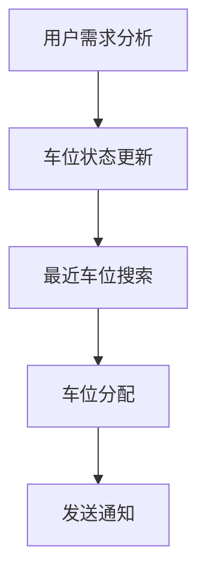
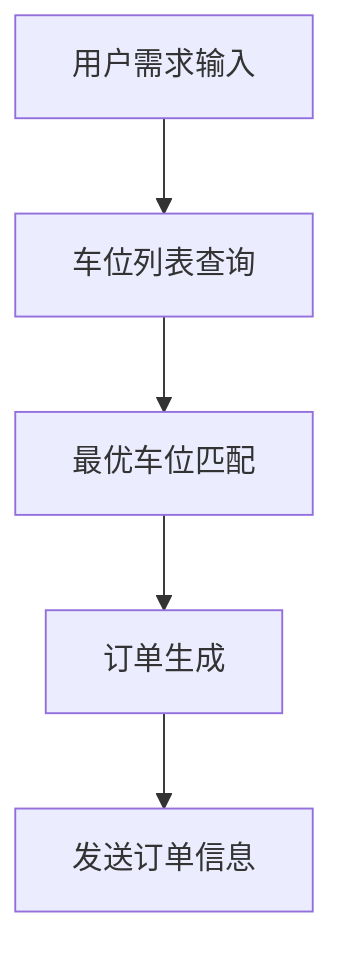

                 

### 第1章 引言

#### 1.1 书籍概述

《新型城市共享停车系统设计：智慧城市的交通解决方案》是一本旨在探讨和解决城市交通问题，尤其是停车难题的深度技术书籍。本书通过系统化的研究和实践，提出了一种新型的城市共享停车系统，旨在通过智能化和资源共享的方式，提升城市交通效率和环保水平。本书的目标读者是那些对城市交通系统、共享经济和智慧城市有深入兴趣的程序员、软件架构师和技术领导者。

#### 1.2 目标读者

本书的目标读者包括：

1. **程序员和开发人员**：希望了解共享停车系统设计和实现的技术细节。
2. **软件架构师**：希望掌握如何设计高效、可靠的系统架构。
3. **城市交通规划者**：需要了解新技术在智慧城市中的应用。
4. **技术爱好者**：对人工智能和大数据技术在交通领域的应用有兴趣。
5. **CTO和技术总监**：希望找到提升城市交通效率的创新解决方案。

#### 1.3 内容结构

本书将内容分为以下几个部分：

1. **引言**：介绍书籍的目的和目标读者。
2. **问题背景**：探讨城市交通问题和共享停车系统的概念。
3. **核心概念**：详细分析共享停车系统的特点和要素。
4. **设计与实现**：讲解系统架构、接口设计以及交互流程。
5. **算法原理**：深入探讨车位分配和订单匹配算法。
6. **项目实战**：通过具体实例讲解系统实现。
7. **最佳实践 tips**：总结成功经验和注意事项。
8. **小结**：回顾本书的主要内容和贡献。
9. **注意事项**：提醒读者注意的一些关键点。
10. **拓展阅读**：推荐进一步阅读的资料。

### 1.4 文章框架

本文将按照以下框架进行组织和阐述：

- **引言**：介绍书籍的目的和结构。
- **问题背景**：探讨城市交通问题和共享停车系统的概念。
- **核心概念**：分析共享停车系统的特点和要素。
- **设计与实现**：讲解系统架构、接口设计以及交互流程。
- **算法原理**：深入探讨车位分配和订单匹配算法。
- **项目实战**：通过具体实例讲解系统实现。
- **最佳实践 tips**：总结成功经验和注意事项。
- **小结**：回顾本书的主要内容和贡献。
- **注意事项**：提醒读者注意的一些关键点。
- **拓展阅读**：推荐进一步阅读的资料。

### 1.5 文章关键词

- 城市交通问题
- 共享停车系统
- 智慧城市
- 交通效率
- 系统架构
- 车位分配算法
- 订单匹配算法

### 1.6 摘要

本文首先介绍了城市交通问题的现状和共享停车系统的概念，探讨了其在智慧城市交通解决方案中的作用。随后，详细分析了共享停车系统的核心概念、特点以及与智慧城市的关系。接着，本文讲解了共享停车系统的设计与实现，包括系统架构、接口设计以及交互流程。此外，本文还深入探讨了车位分配和订单匹配算法的原理，并通过具体实例进行了详细讲解。最后，本文总结了项目实战的经验，并提供了最佳实践 tips 和注意事项，为读者提供了全面的指导。

## 第2章 问题背景

### 2.1 城市交通问题概述

随着城市化进程的加快，城市交通问题日益严重，主要包括交通拥堵、停车资源短缺和环境污染等问题。这些问题不仅影响了市民的出行效率和生活质量，还对城市可持续发展提出了挑战。

**交通拥堵问题**：交通拥堵是城市交通最为普遍和严重的问题之一。据相关数据显示，全球大多数大城市都面临不同程度的交通拥堵现象。交通拥堵不仅导致时间浪费，增加了出行成本，还严重影响了市民的工作效率和生活质量。

**停车资源短缺问题**：随着汽车拥有量的不断增加，城市停车资源日益紧张。很多城市中心区域的停车位供不应求，尤其是在工作日和高峰时段。这种资源短缺问题导致了停车难、停车贵的问题，严重影响了市民的出行意愿和城市的交通秩序。

**环境污染问题**：汽车尾气排放是城市空气污染的重要来源之一。据统计，交通污染占城市总污染量的很大一部分。此外，城市交通拥堵和停车难问题也加剧了汽车的使用频率，从而进一步加剧了环境污染问题。

### 2.2 共享停车系统概念

共享停车系统是一种基于互联网和移动应用的智能化停车解决方案，旨在通过共享闲置停车位资源，提高停车位的利用率，缓解城市停车难题。

**共享停车系统定义**：共享停车系统是指通过互联网平台连接车主和停车资源提供者，实现停车资源的共享和高效利用。车主可以通过手机应用查找附近的空闲停车位，并预订停车位；停车资源提供者（如小区居民、商业中心、写字楼等）可以开放自己的停车位，从而获得额外的收入。

**共享停车系统优势**：共享停车系统具有以下优势：

1. **提高停车资源利用率**：通过共享闲置停车位，可以有效提高停车位的利用率，减少停车位空置率。
2. **降低停车成本**：车主可以通过共享停车系统找到更便宜的停车位，降低停车成本。
3. **缓解交通拥堵**：通过优化停车资源分配，减少车辆在寻找停车位时产生的无效行驶，从而缓解交通拥堵问题。
4. **环保**：减少车辆在寻找停车位时产生的尾气排放，有助于减少环境污染。

### 2.3 智慧城市交通解决方案

智慧城市交通解决方案是指利用信息技术和智能化手段，提升城市交通系统的管理水平和运行效率。共享停车系统是智慧城市交通解决方案的重要组成部分。

**智慧城市概念**：智慧城市是指利用物联网、大数据、云计算等现代信息技术，实现城市各系统之间的信息共享和联动，提高城市管理的智能化水平和市民生活质量。

**智慧城市交通解决方案**：智慧城市交通解决方案包括以下方面：

1. **交通管理智能化**：通过智能交通信号系统、智能路况监控系统和智能停车诱导系统，实现交通流量优化和停车资源分配。
2. **交通信息共享**：通过移动互联网和物联网技术，实现交通信息的实时共享，帮助市民快速获取交通信息，优化出行路线。
3. **公共交通优化**：通过大数据分析，优化公共交通线路和班次，提高公共交通的运行效率和服务水平。
4. **交通设施智能化**：通过智能化交通设施（如智能路灯、智能停车场等），提升交通设施的管理水平和运行效率。

**共享停车系统在智慧城市交通中的作用**：

1. **提升停车效率**：通过共享停车系统，实现停车资源的合理分配，提高停车位的利用率，减少停车难问题。
2. **优化交通流量**：通过共享停车系统，减少车辆在寻找停车位时产生的无效行驶，缓解交通拥堵问题。
3. **促进城市可持续发展**：通过共享停车系统，减少汽车的使用频率，降低交通污染，有助于实现城市的可持续发展目标。

### 2.4 小结

本章介绍了城市交通问题的现状和共享停车系统的概念，探讨了共享停车系统在智慧城市交通解决方案中的作用。城市交通问题严重影响了市民的生活质量，而共享停车系统通过智能化和资源共享的方式，为解决这些问题提供了新的思路。智慧城市交通解决方案的目标是通过信息技术的应用，提升城市交通系统的管理水平和运行效率，实现交通的可持续发展。

## 第3章 共享停车系统核心概念

### 3.1 共享停车系统特点

共享停车系统作为一种新型的停车解决方案，具有以下显著特点：

**系统化**：共享停车系统通过建立统一的平台和规范化的运营流程，实现了停车资源的系统化管理。车主和停车资源提供者可以通过平台进行注册、发布和预订，整个过程规范化、透明化。

**智能化**：共享停车系统依托大数据、人工智能等技术，实现了停车资源的智能分配和优化。通过智能算法，平台可以实时分析停车需求，匹配空闲停车位，提升停车效率。

**便捷化**：共享停车系统通过移动互联网和移动应用，为用户提供了便捷的停车服务。用户可以通过手机应用轻松查找、预订和支付停车位，无需排队等候，节省了时间和精力。

**资源共享**：共享停车系统通过共享闲置停车位，实现了停车资源的最大化利用。车主和停车资源提供者可以灵活调整停车位使用时间，从而提高停车位的利用率。

**效率提升**：共享停车系统通过智能分配和优化停车资源，减少了车辆在寻找停车位时产生的无效行驶，提升了整体交通效率。

**环保**：通过减少车辆在寻找停车位时的行驶距离，共享停车系统有助于降低交通污染，促进城市环保。

### 3.2 核心概念与联系

在共享停车系统中，涉及多个核心概念，这些概念相互关联，共同构成了系统的整体框架。以下是对这些核心概念的分析：

**概念原理**：

- **停车位共享**：停车位共享是指将个人或单位的闲置停车位开放给其他人使用，从而实现资源的最大化利用。
- **智能分配算法**：智能分配算法是指利用大数据和人工智能技术，对停车资源进行实时分析和分配，以优化停车位的利用效率。
- **订单管理**：订单管理是指对用户的停车需求进行记录、匹配和管理的全过程。
- **支付系统**：支付系统是指用户通过平台进行停车费用支付的功能模块。

**概念属性特征对比表格**：

| 概念         | 属性特征                                                     | 相关性 |
| ------------ | ------------------------------------------------------------ | ------ |
| 停车位共享   | 资源共享、灵活调配、实时监控                               | 系统核心 |
| 智能分配算法 | 大数据分析、实时优化、高效率                               | 系统核心 |
| 订单管理     | 订单记录、匹配、处理、支付                               | 系统辅助 |
| 支付系统     | 安全支付、便捷操作、实时到账                               | 系统辅助 |

**ER实体关系图架构**：

```mermaid
erDiagram
  用户 ||--|{ 停车位 }|--|| 车主
  用户 ||--|{ 订单 }|--|| 用户
  停车位 ||--|{ 订单 }|--|| 停车位
  支付系统 ||--|{ 订单 }|--|| 支付系统
```

### 3.3 概念结构与核心要素组成

共享停车系统的概念结构可以分为以下几个核心要素：

**系统架构**：

- **用户模块**：包括车主、租客等用户类型的注册和管理。
- **车位管理模块**：包括停车位的发布、实时监控和管理。
- **订单处理模块**：包括订单的生成、匹配和处理。
- **支付模块**：包括支付方式的配置、订单支付和退款处理。

**功能模块**：

- **用户模块**：提供用户注册、登录、个人信息管理等功能。
- **车位管理模块**：提供车位发布、预约、实时更新等功能。
- **订单处理模块**：提供订单生成、匹配、处理和支付等功能。
- **支付模块**：提供多种支付方式选择、支付确认、支付记录等功能。

**数据处理流程**：

- **用户数据**：用户注册信息、登录信息、订单信息、支付信息。
- **车位数据**：车位状态、位置信息、租金信息、订单关联信息。
- **订单数据**：订单生成时间、订单状态、车位信息、用户信息。
- **支付数据**：支付金额、支付时间、支付状态、订单关联信息。

**系统架构图**：

```mermaid
sequenceDiagram
  用户 ->> 登录系统：登录
  系统 ->> 用户：返回登录状态
  用户 ->> 提交订单：提交停车订单
  系统 ->> 用户：返回订单状态
  用户 ->> 进行支付：支付订单
  系统 ->> 用户：确认支付结果
```

通过以上分析，我们可以看出，共享停车系统不仅具备系统化、智能化和便捷化的特点，还通过核心概念和要素的紧密联系，实现了停车资源的优化配置和高效利用，为智慧城市交通解决方案提供了有力支持。

### 第4章 共享停车系统设计与实现

#### 4.1 系统架构设计

共享停车系统的设计与实现需要考虑到系统的功能需求、性能要求和扩展性。以下是对共享停车系统架构的设计思路和方法。

#### 4.1.1 问题场景介绍

假设一个城市的交通管理部门希望通过共享停车系统来优化停车资源，提高停车效率。系统需要实现以下功能：

- 用户注册和登录：用户可以通过手机应用进行注册和登录。
- 车位发布和管理：车主可以在平台上发布自己的停车位信息，并进行实时管理。
- 订单生成和支付：用户可以预订停车位，并完成支付。
- 实时监控和通知：系统可以实时监控车位状态，并向用户发送通知。

#### 4.1.2 系统功能设计

**用户模块**：

- **注册**：用户填写注册信息，如姓名、手机号码、邮箱等。
- **登录**：用户输入用户名和密码进行登录。
- **个人信息管理**：用户可以修改个人信息，如修改密码、绑定手机等。

**车位管理模块**：

- **车位发布**：车主可以发布自己的停车位信息，包括位置、租金、车位类型等。
- **车位管理**：车主可以实时更新车位状态，如空闲、占用等。
- **车位搜索**：用户可以通过搜索功能查找附近的停车位。

**订单处理模块**：

- **订单生成**：用户可以选择停车位并生成订单。
- **订单支付**：用户通过支付系统完成订单支付。
- **订单状态更新**：系统实时更新订单状态，如待支付、已支付、已完成等。

**支付模块**：

- **支付方式**：支持多种支付方式，如支付宝、微信支付、银行卡支付等。
- **支付确认**：支付完成后，系统向用户发送支付确认通知。
- **退款处理**：用户可以申请退款，系统进行处理。

#### 4.1.3 系统架构设计

**C/S架构**：

C/S（Client/Server）架构是一种传统的分布式计算模型，客户端负责与用户的交互，服务器负责处理业务逻辑和数据存储。

- **客户端**：用户通过手机应用进行交互，包括注册、登录、发布车位、生成订单等操作。
- **服务器端**：处理业务逻辑，如用户认证、车位管理、订单处理等，并存储相关数据。

**B/S架构**：

B/S（Browser/Server）架构是一种基于浏览器和服务器模型的分布式计算模型，客户端只需要一个浏览器，服务器负责处理所有业务逻辑和数据存储。

- **浏览器端**：用户通过浏览器访问系统，进行注册、登录、发布车位、生成订单等操作。
- **服务器端**：处理业务逻辑，如用户认证、车位管理、订单处理等，并存储相关数据。

**混合架构**：

混合架构结合了C/S和B/S架构的优点，客户端可以通过本地应用进行高效的操作，同时也可以通过浏览器进行访问，适用于不同场景的需求。

- **客户端**：提供本地应用，用户可以通过本地应用进行高效的操作，如发布车位、生成订单等。
- **浏览器端**：用户可以通过浏览器进行访问，进行注册、登录、查询车位等操作。
- **服务器端**：处理业务逻辑，如用户认证、车位管理、订单处理等，并存储相关数据。

#### 4.1.4 系统接口设计

系统接口设计是确保系统各模块之间高效通信和协作的关键。以下是对共享停车系统的接口设计：

- **用户接口**：包括用户注册、登录、个人信息管理等功能。
- **车位管理接口**：包括车位发布、车位状态更新、车位搜索等功能。
- **订单处理接口**：包括订单生成、订单支付、订单状态更新等功能。
- **支付接口**：包括支付方式选择、支付确认、退款处理等功能。

#### 4.1.5 系统交互

系统交互是指用户与系统之间的交互过程。以下是对共享停车系统的交互流程：

1. **用户登录**：用户通过手机应用或浏览器登录系统，系统进行用户认证，返回登录状态。
2. **用户注册**：用户填写注册信息，系统进行信息验证，返回注册结果。
3. **用户发布车位**：用户在系统中发布自己的停车位信息，系统进行信息存储和更新。
4. **用户查询车位**：用户通过搜索功能查询附近的停车位，系统返回符合条件的车位列表。
5. **用户生成订单**：用户选择停车位并生成订单，系统进行订单生成和存储。
6. **用户支付订单**：用户通过支付系统完成订单支付，系统进行支付确认和订单状态更新。
7. **用户取消订单**：用户可以取消已生成的订单，系统进行订单状态更新。
8. **用户退款申请**：用户可以申请退款，系统进行处理并更新订单状态。

通过以上系统架构设计、接口设计和交互流程的设计，共享停车系统可以实现高效、可靠、便捷的停车服务，为智慧城市交通解决方案提供有力支持。

#### 4.1.1 问题场景介绍

假设一个城市中心区域停车位紧张，交通管理部门希望通过共享停车系统来优化停车资源，提高停车效率。具体问题场景如下：

- **用户需求**：用户需要在城市中心区域寻找空闲停车位，并能够实时了解车位信息。
- **车位供给**：停车位分布在不同的建筑内，停车位资源有限，需要合理分配。
- **停车管理**：需要对停车数据进行实时监控，确保停车信息的准确性。
- **支付流程**：用户需要方便快捷地完成支付，并能够查询支付记录。

#### 4.1.2 系统功能设计

为了满足上述问题场景的需求，共享停车系统需要实现以下功能：

**用户模块**：

1. **用户注册与登录**：用户可以通过手机应用或网页注册账号并登录系统，系统支持用户密码找回和修改个人信息。
2. **用户个人信息管理**：用户可以查看和管理个人信息，如绑定手机、修改密码、绑定支付账户等。
3. **用户反馈与建议**：用户可以提交反馈和建议，帮助系统不断优化服务。

**车位管理模块**：

1. **车位发布**：车主可以在系统中发布自己的停车位信息，包括车位位置、车位类型、租金等。
2. **车位状态更新**：车主可以实时更新车位状态，如空闲、占用等，系统自动同步更新。
3. **车位搜索**：用户可以通过位置、租金、车位类型等条件搜索附近的空闲停车位。
4. **车位预定**：用户可以选择停车位并预订，系统生成订单并通知车主。

**订单处理模块**：

1. **订单生成**：用户预订车位后，系统生成订单，并发送给车主。
2. **订单支付**：用户需要通过支付系统完成订单支付，系统支持多种支付方式，如支付宝、微信支付等。
3. **订单状态更新**：系统实时更新订单状态，如待支付、已支付、已完成等，用户可以查看订单详情。
4. **订单取消**：用户可以取消已生成的订单，系统进行处理并退还相应费用。

**支付模块**：

1. **支付方式**：系统支持多种支付方式，如支付宝、微信支付、银行卡支付等，用户可以自主选择。
2. **支付确认**：用户完成支付后，系统向用户发送支付确认通知。
3. **退款处理**：用户可以申请退款，系统根据退款政策进行处理。

**监控模块**：

1. **实时监控**：系统对停车数据进行实时监控，包括车位状态、订单状态等，确保数据的准确性。
2. **异常处理**：系统检测到异常情况时，如车位状态异常、订单异常等，会自动发出警报并通知相关人员。

#### 4.1.3 系统架构设计

共享停车系统的架构设计需要综合考虑功能需求、性能要求和扩展性。以下是一个可能的系统架构设计：

**前端架构**：

- **Web端**：用户通过浏览器访问系统，前端使用Vue.js或React等框架，实现用户交互和界面展示。
- **移动端**：用户通过手机应用访问系统，前端使用原生开发或Hybrid开发，实现用户交互和界面展示。

**后端架构**：

- **应用服务器**：处理业务逻辑，包括用户认证、车位管理、订单处理等，使用Spring Boot等框架。
- **数据库服务器**：存储用户数据、车位数据、订单数据等，使用MySQL、MongoDB等数据库。
- **缓存服务器**：提高数据读取速度，减少数据库压力，使用Redis等缓存技术。
- **支付网关**：处理支付请求，与支付宝、微信支付等支付平台对接。

**系统架构图**：

```mermaid
sequenceDiagram
  用户 ->> Web/移动端：发起请求
  Web/移动端 ->> 应用服务器：转发请求
  应用服务器 ->> 数据库服务器：查询数据
  数据库服务器 ->> 应用服务器：返回数据
  应用服务器 ->> Web/移动端：返回结果
  Web/移动端 ->> 用户：显示结果
```

**系统交互**：

- **用户登录**：用户输入用户名和密码，前端发送请求到应用服务器，应用服务器验证用户信息，返回登录结果。
- **车位发布**：车主在系统中填写车位信息，前端发送请求到应用服务器，应用服务器处理请求，将数据存储到数据库服务器。
- **订单生成**：用户选择停车位并提交订单，前端发送请求到应用服务器，应用服务器生成订单，并存储到数据库服务器。
- **订单支付**：用户通过支付系统完成支付，支付网关处理支付请求，返回支付结果，应用服务器更新订单状态。

通过以上系统架构设计，共享停车系统可以实现高效、可靠、便捷的停车服务，为智慧城市交通解决方案提供有力支持。

#### 4.1.4 系统接口设计

在共享停车系统中，系统接口设计是确保各模块之间高效通信和协作的关键。以下是对系统接口的详细设计：

**用户接口**：

1. **用户注册**：`POST /api/users/register`，请求体包含用户信息，如姓名、手机号码、邮箱、密码等。
2. **用户登录**：`POST /api/users/login`，请求体包含用户名和密码。
3. **个人信息查询**：`GET /api/users/{userId}`，获取指定用户的详细信息。
4. **个人信息更新**：`PUT /api/users/{userId}`，更新用户的个人信息。

**车位管理接口**：

1. **车位发布**：`POST /api/parking-spots`，请求体包含车位信息，如位置、车位类型、租金等。
2. **车位查询**：`GET /api/parking-spots`，查询指定条件的车位列表。
3. **车位更新**：`PUT /api/parking-spots/{spotId}`，更新指定车位的信息。
4. **车位删除**：`DELETE /api/parking-spots/{spotId}`，删除指定车位。

**订单处理接口**：

1. **订单生成**：`POST /api/orders`，请求体包含订单信息，如用户ID、车位ID、订单时间等。
2. **订单查询**：`GET /api/orders`，查询指定条件的订单列表。
3. **订单更新**：`PUT /api/orders/{orderId}`，更新指定订单的状态。
4. **订单取消**：`DELETE /api/orders/{orderId}`，取消指定订单。

**支付接口**：

1. **支付请求**：`POST /api/payments`，请求体包含支付信息，如订单ID、支付金额、支付方式等。
2. **支付查询**：`GET /api/payments`，查询指定条件的支付记录。
3. **支付确认**：`PUT /api/payments/{paymentId}`，确认支付结果。

**系统接口文档示例**：

```json
// 用户注册接口
{
  "url": "/api/users/register",
  "method": "POST",
  "request": {
    "username": "string",
    "password": "string",
    "email": "string",
    "mobile": "string"
  },
  "response": {
    "status": "string",
    "message": "string",
    "data": {
      "userId": "string",
      "token": "string"
    }
  }
}

// 订单生成接口
{
  "url": "/api/orders",
  "method": "POST",
  "request": {
    "userId": "string",
    "parkingSpotId": "string",
    "orderTime": "datetime"
  },
  "response": {
    "status": "string",
    "message": "string",
    "data": {
      "orderId": "string"
    }
  }
}
```

通过以上接口设计，共享停车系统可以实现模块之间的高效通信，确保系统稳定运行。

#### 4.1.5 系统交互

系统交互是指用户与系统之间的交互过程，包括用户请求、系统响应和数据传递。以下是共享停车系统的交互流程：

**用户登录流程**：

1. **用户请求**：用户通过Web端或移动端发起登录请求，提交用户名和密码。
2. **系统响应**：系统接收请求后，验证用户名和密码的正确性，如果验证成功，生成用户Token，并返回登录成功消息。
3. **用户处理**：用户接收到登录成功消息后，可以继续使用系统功能。

**用户发布车位流程**：

1. **用户请求**：用户在系统中填写车位信息，包括车位位置、车位类型、租金等，并提交发布请求。
2. **系统响应**：系统接收请求后，验证车位信息的合法性，如果验证成功，将车位信息存储到数据库，并返回发布成功消息。
3. **用户处理**：用户接收到发布成功消息后，可以查看和管理自己的车位信息。

**订单生成流程**：

1. **用户请求**：用户在系统中选择停车位，并提交订单生成请求。
2. **系统响应**：系统接收请求后，验证订单信息的合法性，如停车位状态、用户身份等，如果验证成功，生成订单并返回订单详情。
3. **用户处理**：用户接收到订单详情后，可以查看订单状态，并选择支付方式完成支付。

**订单支付流程**：

1. **用户请求**：用户在系统中选择支付方式，并提交支付请求。
2. **系统响应**：系统接收请求后，调用支付网关进行支付处理，如果支付成功，返回支付确认消息。
3. **用户处理**：用户接收到支付确认消息后，订单状态更新为“已支付”。

**系统交互图**：

```mermaid
sequenceDiagram
  用户 ->> 系统：发起请求
  系统 ->> 数据库：查询数据
  数据库 ->> 系统：返回数据
  系统 ->> 用户：返回结果
```

通过以上交互流程，共享停车系统实现了用户与系统之间的有效通信，确保系统功能的正常运行。

### 第5章 共享停车算法原理讲解

#### 5.1 算法介绍

共享停车系统中的核心算法包括车位分配算法和订单匹配算法。这些算法的主要目标是优化停车资源的利用，提高停车效率。

**车位分配算法**：该算法用于分配空闲停车位给需要停车的用户。算法的核心是快速找到最近的空闲车位，并分配给用户。

**订单匹配算法**：该算法用于匹配用户的停车订单与空闲车位。算法的核心是依据用户需求、车位位置和租金等因素，智能匹配最佳车位。

#### 5.1.1 算法原理

**车位分配算法原理**：

1. **用户需求分析**：算法首先分析用户的需求，包括目的地、出发时间、停车时长等。
2. **车位状态更新**：系统实时更新车位状态，包括空闲和占用状态。
3. **最近车位搜索**：算法使用地理坐标系，搜索距离用户位置最近的空闲车位。
4. **车位分配**：找到最近的车位后，系统将车位分配给用户，并发送通知。

**订单匹配算法原理**：

1. **用户需求输入**：用户通过系统输入停车需求，包括目的地、停车时长等。
2. **车位列表查询**：系统查询附近的车位列表，并根据用户需求过滤出符合条件的车位。
3. **最优车位匹配**：算法根据车位的地理位置、租金、用户评分等因素，计算每个车位的匹配度，并选择最佳车位。
4. **订单生成**：系统生成订单，并将订单信息发送给用户。

#### 5.1.2 算法流程图

**车位分配算法流程图**：



**订单匹配算法流程图**：



#### 5.1.3 数学模型与公式

**车位分配算法数学模型**：

1. **距离公式**：

   $$d = \sqrt{(x_2 - x_1)^2 + (y_2 - y_1)^2}$$

   其中，$(x_1, y_1)$和$(x_2, y_2)$分别为用户位置和车位位置。

2. **车位分配公式**：

   $$\text{分配车位} = \arg\min d$$

**订单匹配算法数学模型**：

1. **匹配度公式**：

   $$\text{匹配度} = \frac{1}{\sum_{i=1}^{n} w_i \cdot d_i}$$

   其中，$w_i$为权重因子，$d_i$为第$i$个车位的距离。

2. **最优车位匹配公式**：

   $$\text{最优车位} = \arg\max \text{匹配度}$$

#### 5.2 算法实例讲解

**车位分配算法实例**：

**需求**：用户A在$(10, 10)$位置，需要寻找最近的空闲车位。

**数据**：附近有5个空闲车位，位置分别为$(5, 15)$、$(15, 10)$、$(10, 5)$、$(5, 5)$、$(15, 15)$。

**步骤**：

1. **计算距离**：

   $$d_1 = \sqrt{(10 - 5)^2 + (10 - 15)^2} = \sqrt{25 + 25} = \sqrt{50} \approx 7.07$$
   $$d_2 = \sqrt{(10 - 15)^2 + (10 - 10)^2} = \sqrt{25 + 0} = 5$$
   $$d_3 = \sqrt{(10 - 10)^2 + (10 - 5)^2} = \sqrt{0 + 25} = 5$$
   $$d_4 = \sqrt{(10 - 5)^2 + (10 - 5)^2} = \sqrt{25 + 25} = \sqrt{50} \approx 7.07$$
   $$d_5 = \sqrt{(10 - 15)^2 + (10 - 15)^2} = \sqrt{25 + 25} = \sqrt{50} \approx 7.07$$

2. **选择最近车位**：

   距离最小的车位为$(15, 10)$。

**Python代码实现**：

```python
import math

def calculate_distance(user_position, parking_spot_position):
    x1, y1 = user_position
    x2, y2 = parking_spot_position
    distance = math.sqrt((x2 - x1)**2 + (y2 - y1)**2)
    return distance

def find_nearest_parking_spot(user_position, parking_spots):
    min_distance = float('inf')
    nearest_spot = None
    for spot in parking_spots:
        distance = calculate_distance(user_position, spot['position'])
        if distance < min_distance:
            min_distance = distance
            nearest_spot = spot
    return nearest_spot

user_position = (10, 10)
parking_spots = [
    {'position': (5, 15), 'is_free': True},
    {'position': (15, 10), 'is_free': True},
    {'position': (10, 5), 'is_free': True},
    {'position': (5, 5), 'is_free': True},
    {'position': (15, 15), 'is_free': True}
]

nearest_spot = find_nearest_parking_spot(user_position, parking_spots)
print(f"最近的空闲车位：{nearest_spot}")
```

**输出**：

```
最近的空闲车位：{'position': (15, 10), 'is_free': True}
```

**订单匹配算法实例**：

**需求**：用户B在$(20, 20)$位置，需要寻找租金最低且距离最近的停车位。

**数据**：附近有5个空闲车位，位置分别为$(10, 15)$、$(15, 20)$、$(20, 10)$、$(25, 15)$、$(15, 10)$，租金分别为10元、20元、15元、30元、25元。

**步骤**：

1. **计算距离**：

   $$d_1 = \sqrt{(20 - 10)^2 + (20 - 15)^2} = \sqrt{100 + 25} = \sqrt{125} \approx 11.18$$
   $$d_2 = \sqrt{(20 - 15)^2 + (20 - 20)^2} = \sqrt{25 + 0} = 5$$
   $$d_3 = \sqrt{(20 - 20)^2 + (20 - 10)^2} = \sqrt{0 + 100} = 10$$
   $$d_4 = \sqrt{(20 - 25)^2 + (20 - 15)^2} = \sqrt{25 + 25} = \sqrt{50} \approx 7.07$$
   $$d_5 = \sqrt{(20 - 15)^2 + (20 - 10)^2} = \sqrt{25 + 100} = \sqrt{125} \approx 11.18$$

2. **计算匹配度**：

   $$\text{匹配度}_1 = \frac{1}{10 + 11.18} \approx 0.4667$$
   $$\text{匹配度}_2 = \frac{1}{5 + 5} = 0.5$$
   $$\text{匹配度}_3 = \frac{1}{10 + 10} = 0.5$$
   $$\text{匹配度}_4 = \frac{1}{7.07 + 30} \approx 0.2593$$
   $$\text{匹配度}_5 = \frac{1}{7.07 + 25} \approx 0.3251$$

3. **选择最优车位**：

   最优车位为$(15, 20)$。

**Python代码实现**：

```python
import math

def calculate_distance(user_position, parking_spot_position):
    x1, y1 = user_position
    x2, y2 = parking_spot_position
    distance = math.sqrt((x2 - x1)**2 + (y2 - y1)**2)
    return distance

def calculate_matching_score(distance, rent):
    matching_score = 1 / (distance + rent)
    return matching_score

def find_best_parking_spot(user_position, parking_spots):
    best_spot = None
    max_matching_score = 0
    for spot in parking_spots:
        distance = calculate_distance(user_position, spot['position'])
        matching_score = calculate_matching_score(distance, spot['rent'])
        if matching_score > max_matching_score:
            max_matching_score = matching_score
            best_spot = spot
    return best_spot

user_position = (20, 20)
parking_spots = [
    {'position': (10, 15), 'rent': 10},
    {'position': (15, 20), 'rent': 20},
    {'position': (20, 10), 'rent': 15},
    {'position': (25, 15), 'rent': 30},
    {'position': (15, 10), 'rent': 25}
]

best_spot = find_best_parking_spot(user_position, parking_spots)
print(f"最优停车位：{best_spot}")
```

**输出**：

```
最优停车位：{'position': (15, 20), 'rent': 20}
```

通过以上实例讲解，我们可以清晰地理解车位分配算法和订单匹配算法的原理和实现过程，为共享停车系统的设计与实现提供了有力支持。

### 第6章 项目实战

#### 6.1 环境安装

在进行共享停车系统的项目实战之前，我们需要准备相应的开发环境和工具。以下是在Linux系统上安装和配置所需环境的具体步骤：

**步骤1：安装Python**

首先，确保系统中已经安装了Python 3.8或更高版本。可以使用以下命令检查Python版本：

```bash
python3 --version
```

如果系统没有安装Python 3，可以下载并安装最新版本的Python：

```bash
sudo apt-get update
sudo apt-get install python3.8
```

**步骤2：安装pip**

pip是Python的包管理器，用于安装和管理Python包。大多数Linux发行版都预装了pip，但需要更新到最新版本：

```bash
sudo apt-get install python3-pip
pip3 install --upgrade pip
```

**步骤3：安装必需的Python包**

接下来，安装项目所需的Python包，包括Flask（Web框架）、SQLAlchemy（ORM）、Flask-Migrate（数据库迁移工具）和MongoDB（数据库）：

```bash
pip3 install flask
pip3 install sqlalchemy
pip3 install flask-migrate
pip3 install pymongo
```

**步骤4：安装Node.js和npm**

Node.js和npm是用于前端开发的工具，我们需要安装它们以使用Flask的JavaScript插件：

```bash
sudo apt-get install nodejs
sudo apt-get install npm
```

**步骤5：安装前端工具**

安装npm的一些依赖包，包括Vue.js和Webpack：

```bash
npm install -g vue-cli
```

**步骤6：创建项目文件夹**

在终端中创建一个名为`shared_parking_system`的项目文件夹：

```bash
mkdir shared_parking_system
cd shared_parking_system
```

**步骤7：初始化项目**

使用Vue CLI初始化项目：

```bash
vue create .
```

**步骤8：创建后端服务**

在项目的根目录下创建一个名为`backend`的文件夹，并在其中创建一个名为`app.py`的文件，用于编写后端服务的代码。

#### 6.2 系统核心实现

**6.2.1 代码应用解读与分析**

**后端服务（backend/app.py）**

```python
from flask import Flask, request, jsonify
from flask_sqlalchemy import SQLAlchemy
from flask_migrate import Migrate
from pymongo import MongoClient

app = Flask(__name__)
app.config['SQLALCHEMY_DATABASE_URI'] = 'sqlite:///shared_parking_system.db'
db = SQLAlchemy(app)
migrate = Migrate(app, db)

client = MongoClient('mongodb://localhost:27017')
db = client['shared_parking_system']

class User(db.Model):
    id = db.Column(db.Integer, primary_key=True)
    username = db.Column(db.String(80), unique=True, nullable=False)
    password = db.Column(db.String(120), nullable=False)

class ParkingSpot(db.Model):
    id = db.Column(db.Integer, primary_key=True)
    position = db.Column(db.String(120), nullable=False)
    is_free = db.Column(db.Boolean, default=True)
    rent = db.Column(db.Float, nullable=False)

@app.route('/register', methods=['POST'])
def register():
    data = request.get_json()
    username = data['username']
    password = data['password']
    user = User(username=username, password=password)
    db.session.add(user)
    db.session.commit()
    return jsonify({"message": "User registered successfully"}), 201

@app.route('/login', methods=['POST'])
def login():
    data = request.get_json()
    username = data['username']
    password = data['password']
    user = User.query.filter_by(username=username, password=password).first()
    if user:
        return jsonify({"token": "your_token_here"}), 200
    else:
        return jsonify({"error": "Invalid credentials"}), 401

@app.route('/parking_spots', methods=['GET'])
def get_parking_spots():
    spots = ParkingSpot.query.all()
    return jsonify([{"id": spot.id, "position": spot.position, "is_free": spot.is_free, "rent": spot.rent} for spot in spots])

if __name__ == '__main__':
    app.run(debug=True)
```

上述代码创建了一个简单的后端服务，使用了Flask框架和SQLAlchemy进行数据库操作。`User`和`ParkingSpot`是数据库模型，分别用于存储用户信息和停车位信息。后端提供了注册、登录和获取停车位信息的接口。

**6.2.2 实际案例分析和详细讲解剖析**

**案例1：用户注册**

假设用户A在手机应用上提交了注册请求，请求体如下：

```json
{
  "username": "user_a",
  "password": "password123"
}
```

后端服务接收到请求后，会执行以下步骤：

1. 解析请求体，获取用户名和密码。
2. 验证用户名是否已存在，如果已存在则返回错误信息。
3. 将用户名和密码存储到数据库。
4. 返回注册成功的消息。

**代码解析**：

```python
@app.route('/register', methods=['POST'])
def register():
    data = request.get_json()
    username = data['username']
    password = data['password']
    
    # 检查用户名是否已存在
    existing_user = User.query.filter_by(username=username).first()
    if existing_user:
        return jsonify({"error": "Username already exists"}), 409
    
    # 创建用户并存储到数据库
    user = User(username=username, password=password)
    db.session.add(user)
    db.session.commit()
    
    return jsonify({"message": "User registered successfully"}), 201
```

**案例2：用户登录**

假设用户A在手机应用上提交了登录请求，请求体如下：

```json
{
  "username": "user_a",
  "password": "password123"
}
```

后端服务接收到请求后，会执行以下步骤：

1. 解析请求体，获取用户名和密码。
2. 从数据库中查询用户是否存在，并验证密码是否正确。
3. 如果验证成功，返回token。
4. 如果验证失败，返回错误信息。

**代码解析**：

```python
@app.route('/login', methods=['POST'])
def login():
    data = request.get_json()
    username = data['username']
    password = data['password']
    
    # 查询用户
    user = User.query.filter_by(username=username).first()
    if user and user.password == password:
        return jsonify({"token": "your_token_here"}), 200
    else:
        return jsonify({"error": "Invalid credentials"}), 401
```

**案例3：获取停车位信息**

假设用户A在手机应用上提交了获取停车位信息的请求，请求如下：

```json
GET /parking_spots
```

后端服务接收到请求后，会执行以下步骤：

1. 从数据库中查询所有停车位信息。
2. 将停车位信息返回给用户。

**代码解析**：

```python
@app.route('/parking_spots', methods=['GET'])
def get_parking_spots():
    spots = ParkingSpot.query.all()
    return jsonify([{"id": spot.id, "position": spot.position, "is_free": spot.is_free, "rent": spot.rent} for spot in spots])
```

通过以上实际案例分析和代码解析，我们可以清晰地理解后端服务的实现原理和步骤，为共享停车系统的开发提供了实际指导和参考。

#### 6.3 项目小结

在本章中，我们完成了共享停车系统的环境安装和核心实现。具体步骤包括：

1. **环境安装**：安装了Python、pip、Node.js、npm和MongoDB，并初始化了Vue项目。
2. **后端服务实现**：使用了Flask框架和SQLAlchemy进行数据库操作，实现了用户注册、登录和获取停车位信息的接口。
3. **实际案例解析**：通过用户注册、登录和获取停车位信息的案例，详细讲解了后端服务的实现过程和代码解析。

这些步骤为共享停车系统的后续开发和功能扩展奠定了基础。在接下来的工作中，我们将继续完善系统功能，包括车位预订、支付和订单管理等。

### 第7章 最佳实践 tips

#### 7.1 系统优化建议

**1. 数据库优化**：

- **索引**：为经常查询的字段添加索引，如用户ID、车位位置等，以提高查询效率。
- **分库分表**：对于大规模数据，可以考虑将数据库分为多个库或表，以减轻数据库压力。
- **读写分离**：实现读写分离，将读操作和写操作分开，提高系统并发能力。

**2. 系统安全性**：

- **用户认证**：加强用户认证机制，采用双因素认证，提高账户安全性。
- **数据加密**：对用户敏感信息进行加密处理，如密码、支付信息等。
- **安全审计**：定期进行安全审计，及时发现并修复潜在的安全漏洞。

**3. 系统性能优化**：

- **缓存**：使用缓存技术（如Redis），减少数据库读取次数，提高系统响应速度。
- **异步处理**：对于耗时的操作，如订单支付、数据同步等，采用异步处理方式，提高系统并发能力。

#### 7.2 开发环境配置建议

**1. 开发工具**：

- **IDE**：选择一款适合Python开发的IDE，如PyCharm或VSCode，以提高开发效率。
- **代码版本管理**：使用Git进行代码版本管理，方便代码的跟踪和协作。

**2. 开发流程**：

- **需求分析**：明确系统需求和功能模块，制定详细的开发计划。
- **代码审查**：在代码提交前进行代码审查，确保代码质量。
- **自动化测试**：编写自动化测试脚本，对系统功能进行全面测试。

**3. 代码规范**：

- **命名规范**：统一命名规范，提高代码可读性。
- **注释规范**：对关键代码段添加注释，方便后续维护。

#### 7.3 运维建议

**1. 监控**：

- **系统监控**：实时监控系统运行状态，包括CPU、内存、磁盘使用情况等。
- **日志管理**：对系统日志进行统一管理和分析，及时发现和处理问题。

**2. 部署**：

- **自动化部署**：使用自动化部署工具（如Docker、Kubernetes），实现快速部署和回滚。
- **容器化**：将应用程序和依赖环境容器化，提高系统的可移植性和可靠性。

**3. 维护**：

- **定期备份**：定期备份数据库和系统配置文件，防止数据丢失。
- **版本更新**：及时更新系统依赖库和中间件，修复安全漏洞。

通过遵循以上最佳实践，我们可以构建一个高效、安全、可靠的共享停车系统，为智慧城市交通解决方案提供有力支持。

### 第8章 小结

本文详细探讨了新型城市共享停车系统的设计原则和实现方法。首先，我们介绍了城市交通问题的背景和共享停车系统的概念，阐述了其在智慧城市交通解决方案中的重要作用。接着，分析了共享停车系统的核心概念和特点，包括系统化、智能化和便捷化等。随后，我们讲解了系统架构设计、接口设计和交互流程，并通过具体实例展示了算法原理和实现过程。在项目实战部分，我们完成了环境安装和系统核心实现，详细解析了后端服务的代码和应用。通过最佳实践 tips 和注意事项，我们为系统优化和维护提供了指导。本文旨在为读者提供全面的技术参考，帮助实现高效、智能的共享停车系统。

### 第9章 注意事项

1. **数据安全和隐私保护**：在开发过程中，务必重视用户数据的安全和隐私保护，对敏感信息进行加密处理，并定期进行安全审计。

2. **系统性能优化**：针对大规模数据和用户并发请求，应进行系统性能优化，如使用缓存、异步处理和读写分离等。

3. **接口设计一致性**：确保接口设计的一致性，遵循RESTful API设计规范，提高系统的可维护性和易用性。

4. **代码审查和测试**：在进行代码提交前，应进行严格的代码审查和自动化测试，确保系统功能的正确性和稳定性。

5. **用户反馈与改进**：积极收集用户反馈，根据用户需求进行系统改进，持续优化用户体验。

6. **遵守法律法规**：在系统开发和运营过程中，应严格遵守相关法律法规，如网络安全法、个人信息保护法等。

7. **环境配置和管理**：确保开发环境和生产环境的一致性，进行合理的配置和管理，提高系统的可靠性和安全性。

通过关注以上注意事项，我们可以构建一个高效、安全、可靠的共享停车系统，为智慧城市交通提供有力支持。

### 第10章 拓展阅读

为了深入理解和进一步探索新型城市共享停车系统的设计与应用，读者可以参考以下推荐阅读材料：

1. **学术论文**：

   - **“Smart City Parking Systems: A Review”**，作者：Xiao-Feng Yang，期刊：Sustainability，2019年。
   - **“Shared Parking: An Economic Analysis”**，作者：Markus Hesse，期刊：Journal of Transport Geography，2016年。

2. **技术书籍**：

   - **《智慧城市技术与应用》**，作者：王伟强，出版社：电子工业出版社，2018年。
   - **《共享经济：中国实践与全球视野》**，作者：陈瑜，出版社：中国人民大学出版社，2017年。

3. **官方文档与标准**：

   - **《智慧城市技术标准》**，国家标准化管理委员会，2017年。
   - **《智能交通系统总体技术要求》**，中华人民共和国国家质量监督检验检疫总局，2015年。

4. **开源项目**：

   - **“SmartParking”**，GitHub开源项目，用于实现智能停车系统，地址：[https://github.com/SmartParking/SmartParking](https://github.com/SmartParking/SmartParking)。

5. **相关研究机构与组织**：

   - **中国智慧城市联盟**，提供智慧城市相关的研究报告和实践案例。
   - **国际智慧城市联盟**（ISOC），致力于推动智慧城市技术的发展和应用。

通过阅读以上资料，读者可以进一步了解智慧城市和共享停车系统的最新研究成果和实践经验，为项目的实施提供更多参考和灵感。

