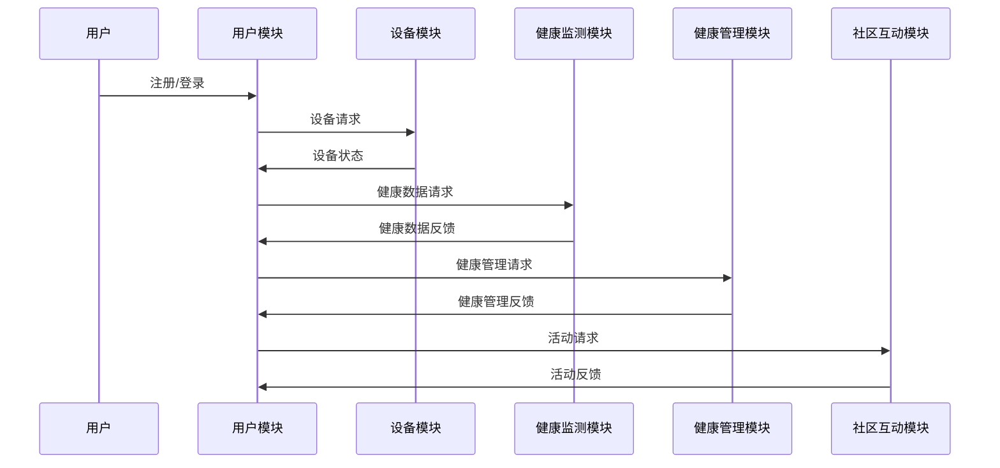
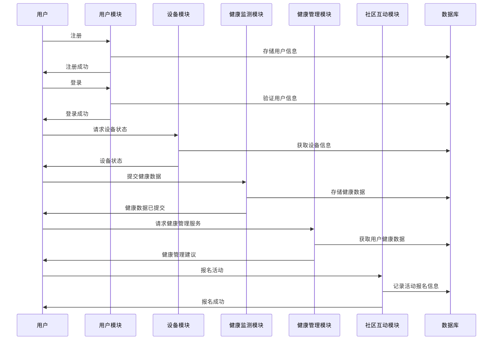
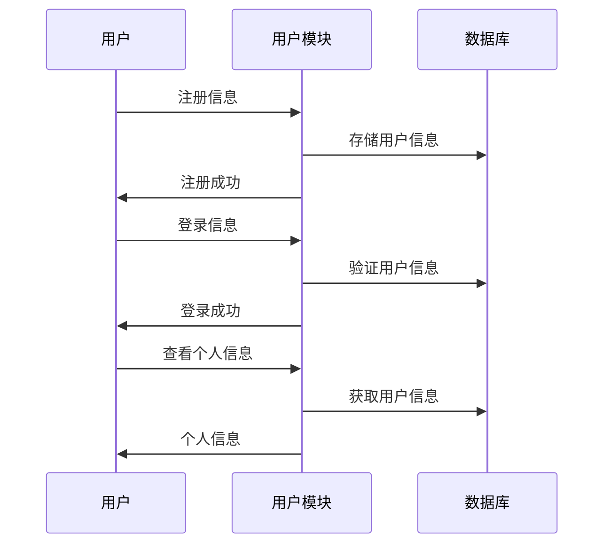
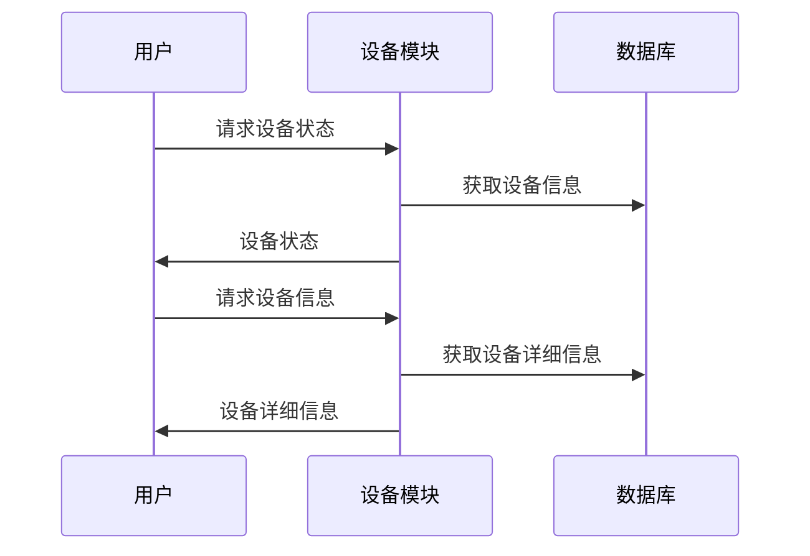
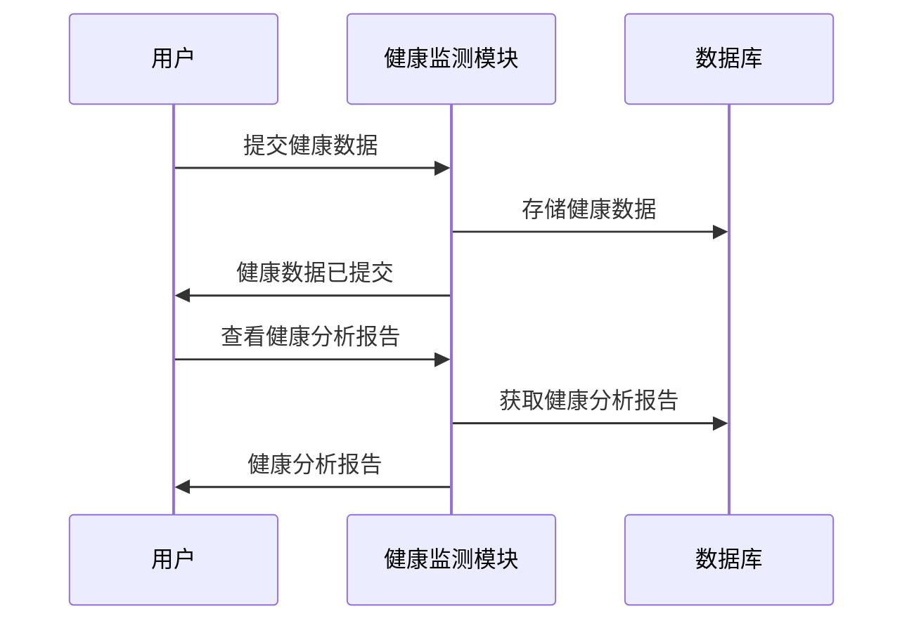
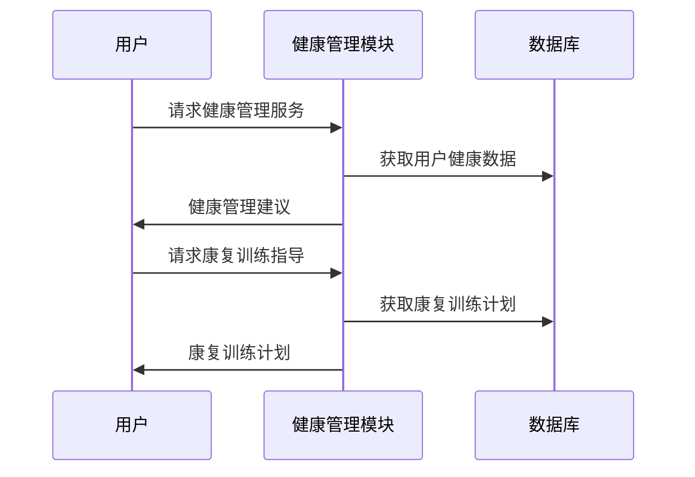
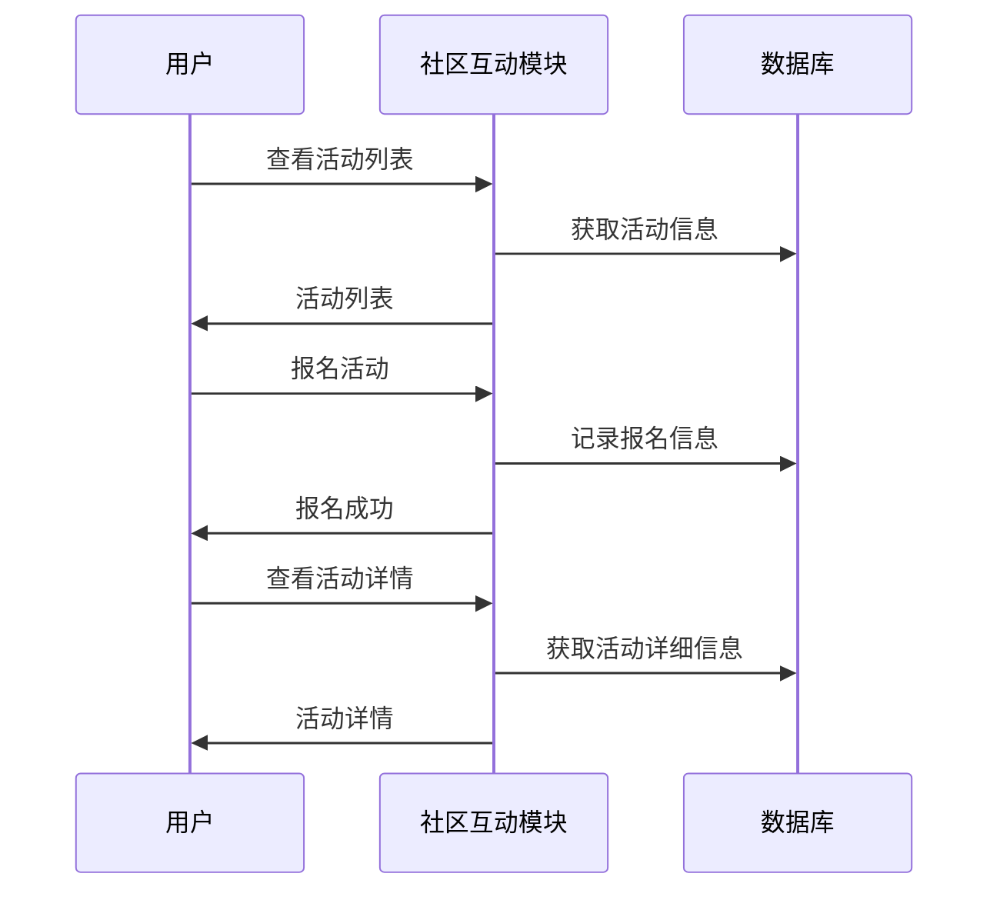

                 

### 文章标题：新型城市共享健身房设计：24小时社区健康中心的打造

> **关键词**：新型城市共享健身房、24小时社区健康中心、智能化设计、健康管理、社区互动

> **摘要**：本文将深入探讨新型城市共享健身房的设计和24小时社区健康中心的运营，通过逻辑清晰的步骤，阐述核心概念、设计原理、智能健身监测算法、系统架构设计以及项目实战。旨在为城市居民提供便捷、高效的健身和健康服务，促进社区健康和活力。

----------------------------------------------------------------

# 第一部分：引言

## 1.1 问题背景

随着全球城市化进程的加速，城市人口迅速增长，居民生活方式也在不断改变。然而，这种变化也带来了一系列健康问题。根据世界卫生组织（WHO）的数据，全球近20亿人面临肥胖问题，心血管疾病和糖尿病等慢性病也日益增多。这些健康问题不仅影响了居民的生活质量，也给公共医疗系统带来了巨大压力。

### 1.1.1 城市化进程中的健康问题

城市化带来了生活方式的改变，如长时间久坐、饮食习惯不健康、缺乏运动等。这些问题共同导致了肥胖、心血管疾病、糖尿病等健康问题的增加。研究表明，长期缺乏运动的人群，其患病的风险比定期锻炼的人群高出数倍。此外，现代城市生活的快节奏和高压力，也让很多人无法抽出时间去传统的健身房进行锻炼。

### 1.1.2 社区健康中心的需求

传统的健身房模式往往存在开放时间有限、地理位置不便、费用较高等问题，无法完全满足居民24小时健身的需求。因此，社区健康中心作为一种新型健康服务模式，应运而生。社区健康中心旨在为居民提供便捷、高效的健身和健康服务，特别是在工作时间以外，为那些无法在白天锻炼的人提供了更多机会。

### 1.1.3 新型城市共享健身房的设计挑战

新型城市共享健身房的设计需要解决以下几个关键问题：

- **全天候开放**：如何确保健身房的设施设备在24小时内都能正常运行，同时避免能源浪费。
- **智能化管理**：如何利用智能系统进行门禁管理、健身监测、费用管理等，提高运营效率。
- **多元化设施**：如何根据不同年龄段、性别和健康状况的居民需求，提供多样化的健身设施。
- **社区互动**：如何通过举办各种社区活动，增强居民之间的互动，提升社区活力。

## 1.2 核心概念

### 1.2.1 新型城市共享健身房

新型城市共享健身房是指以社区为单元，提供24小时开放、智能化管理的健身设施和健康服务的公共场所。它的主要特点包括：

- **全天候开放**：居民可以在任何时间进入健身房进行锻炼。
- **智能化管理**：利用智能系统进行门禁、健身监测、费用管理等。
- **多元化设施**：提供多样化的健身设备，以满足不同人群的需求。
- **社区互动**：通过举办各种社区活动，增强居民之间的互动。

### 1.2.2 24小时社区健康中心

24小时社区健康中心是一种全天候开放的健康管理中心，提供包括健身、康复、医疗咨询等多种服务。其主要功能包括：

- **健康管理服务**：提供健康风险评估、健康咨询、康复训练等服务。
- **社区互动活动**：组织健康知识讲座、健身比赛、社区健康志愿者服务等。
- **质量保证**：确保所有设施设备都达到高标准，并由专业团队进行运营。

## 1.3 边界与外延

### 1.3.1 新型城市共享健身房的设计边界

新型城市共享健身房的设计边界主要包括以下几个方面：

- **场地选址**：选择交通便利、居民密度高的地区，确保更多居民能够方便地使用健身房。
- **设施设备**：配备适合全天候使用的健身设备，并确保设施设备的多样化，以满足不同居民的需求。
- **智能管理系统**：建立智能门禁系统、智能健身监测系统和费用管理系统，提高运营效率。
- **运营模式**：采用24小时全天候运营模式，并根据居民的需求，提供多种收费模式。

### 1.3.2 24小时社区健康中心的运营外延

24小时社区健康中心的运营外延主要包括以下几个方面：

- **服务质量**：确保所有服务都达到专业标准，提供高质量的健身和健康管理服务。
- **健康管理**：提供个性化的健康风险评估、健康咨询和康复训练服务。
- **社区互动**：通过举办各种社区活动，增强居民之间的互动，提升社区活力。
- **可持续发展**：通过节能环保的设计和管理，实现健康中心的可持续发展。

## 1.4 概念结构与核心要素

### 1.4.1 概念结构

新型城市共享健身房和24小时社区健康中心构成了一个完整的健康服务生态系统。其中，新型城市共享健身房侧重于提供24小时开放的健身设施和智能化管理，而24小时社区健康中心则提供全面的健康管理服务。两者相互补充，共同为居民提供便捷、高效的健身和健康服务。

### 1.4.2 核心要素

新型城市共享健身房和24小时社区健康中心的核心要素包括：

- **场地设施**：提供适合全天候使用的健身设备和舒适的锻炼环境。
- **智能系统**：通过智能管理系统，提高运营效率和用户体验。
- **运营策略**：采用灵活的收费模式和多样化的运营策略，满足不同居民的需求。
- **健康管理**：提供个性化的健康管理服务，提升居民的健康水平。
- **社区互动**：通过举办各种社区活动，增强居民之间的互动，营造健康的社区氛围。

## 1.5 本章小结

本章对新型城市共享健身房和24小时社区健康中心进行了背景介绍，明确了核心概念，并对其边界与外延进行了讨论。接下来，将深入探讨新型城市共享健身房的设计原理和24小时社区健康中心的运营原理，为打造一个高效、便捷的社区健康中心提供理论基础。

----------------------------------------------------------------

# 第二部分：核心概念与联系

## 2.1 新型城市共享健身房设计原理

### 2.1.1 设施设备配置原则

新型城市共享健身房的设计首先需要考虑设施设备的配置原则。以下是一些关键原则：

- **全天候使用**：选择那些能够适应全天候使用的健身设备，如跑步机、健身车、哑铃等，确保设备在长时间运行后仍能保持良好的性能。
- **多样化**：为了满足不同年龄段、性别和健康状况的居民需求，健身房需要提供多样化的设施设备。例如，针对老年人，可以配备适合他们的健身器材；针对女性，可以配备瑜伽垫、跳绳等。
- **节能环保**：在设备选择和配置上，应考虑节能环保因素，如使用LED照明、节能空调等，以降低能耗。

### 2.1.2 智能管理系统

智能管理系统是新型城市共享健身房的灵魂，它负责门禁管理、健身监测、费用管理等方面。以下是一些关键系统：

- **门禁系统**：采用智能门禁系统，如人脸识别、指纹识别等，确保只有授权用户才能进入健身房。
- **智能健身监测系统**：通过传感器和智能设备，实时监测用户的运动数据，如心率、消耗的卡路里、运动时长等，为用户提供个性化的健身建议。
- **费用管理系统**：采用智能费用管理系统，用户可以通过手机应用程序或者智能终端进行在线支付，方便快捷。

### 2.1.3 运营策略

新型城市共享健身房的运营策略需要灵活多变，以适应不同居民的需求。以下是一些关键策略：

- **24小时全天候运营**：确保健身房在全天候都能开放，满足那些无法在白天锻炼的居民的需求。
- **多种收费模式**：可以提供按次收费、月卡、年卡等多种收费模式，让用户可以根据自己的需求和预算选择最合适的收费方式。
- **社区互动活动**：定期举办各种社区互动活动，如健身比赛、瑜伽讲座、健康知识讲座等，增强居民之间的互动，提升社区活力。

## 2.2 24小时社区健康中心运营原理

### 2.2.1 健康管理服务

24小时社区健康中心的核心服务是健康管理服务。以下是一些关键服务内容：

- **健康风险评估**：通过对用户的健康状况进行评估，了解他们的健康状况，并提供个性化的健康建议。
- **健康咨询与指导**：提供专业的健康咨询服务，解答用户的健康问题，并提供相应的健康指导。
- **康复训练服务**：对于有特定健康问题的用户，提供专业的康复训练服务，帮助他们恢复健康。

### 2.2.2 社区互动活动

社区互动活动是24小时社区健康中心的重要组成部分，以下是一些关键活动：

- **健康知识讲座**：定期举办健康知识讲座，提高居民的保健意识，让他们了解如何保持健康的生活方式。
- **健身比赛与活动**：组织各种健身比赛和活动，如瑜伽比赛、跑步比赛等，激发居民的健身热情，营造积极的社区氛围。
- **社区健康志愿者服务**：鼓励居民参与社区健康志愿者服务，提高他们的社会责任感，同时为社区健康中心提供额外的支持。

### 2.2.3 质量保证

为了确保24小时社区健康中心的服务质量，需要建立一系列质量保证措施：

- **专业团队运营**：确保所有服务都由专业的团队提供，包括健身教练、营养师、康复师等。
- **高标准设施设备**：确保所有设施设备都达到高标准，并提供定期的维护和检查。
- **定期健康检查与维护**：对用户进行定期的健康检查，确保他们的健康状况得到及时的关注和处理。

## 2.3 概念属性特征对比

### 2.3.1 新型城市共享健身房与普通健身房

| 特征       | 新型城市共享健身房 | 普通健身房 |
|------------|-------------------|------------|
| 开放时间   | 24小时全天候开放   | 白天开放为主 |
| 设施设备   | 多样化、全天候使用 | 定期开放，设备较为单一 |
| 智能系统   | 智能化管理系统     | 依赖人工管理 |
| 运营模式   | 多种收费模式       | 单一收费模式 |

### 2.3.2 24小时社区健康中心与传统社区健康中心

| 特征       | 24小时社区健康中心 | 传统社区健康中心 |
|------------|-------------------|------------------|
| 服务内容   | 包括健身、康复、医疗咨询等 | 主要提供医疗咨询和康复服务 |
| 社区互动   | 定期举办社区互动活动 | 缺乏社区互动活动 |
| 健康管理   | 提供个性化健康管理服务 | 服务较为单一 |
| 质量保证   | 专业团队运营、高标准设施设备 | 运营团队和设施设备标准不一 |

## 2.4 ER实体关系图

```mermaid
erDiagram
    class 新型城市共享健身房 {
        --|> Field: 设施设备
        --|> Field: 智能系统
        --|> Field: 运营策略
    }
    class 24小时社区健康中心 {
        --|> Field: 健康管理服务
        --|> Field: 社区互动活动
        --|> Field: 质量保证
    }
```

## 2.5 本章小结

本章详细介绍了新型城市共享健身房和24小时社区健康中心的设计原理和运营原理，并通过对比表格和ER实体关系图，明确了两者之间的联系与区别。接下来，将深入探讨智能健身监测算法的原理和应用，为打造一个智能化、高效化的社区健康中心提供技术支持。

----------------------------------------------------------------

# 第三部分：算法原理讲解

## 3.1 智能健身监测算法原理

### 3.1.1 基本原理

智能健身监测算法主要基于物联网技术和传感器数据采集，通过数据分析和处理，为用户提供个性化的健身建议和健康指导。该算法的基本原理可以概括为以下几个步骤：

1. **数据采集**：通过传感器实时采集用户的运动数据，如心率、血压、运动时长、消耗的卡路里等。
2. **数据处理**：对采集到的数据进行清洗、去噪、特征提取等处理，以提取出有用的信息。
3. **模型训练**：使用历史数据进行模型训练，建立健身监测模型。
4. **实时监测**：将实时数据输入模型，进行监测和预测，为用户提供个性化的健身建议和健康指导。

### 3.1.2 工作流程

智能健身监测算法的工作流程主要包括以下几个步骤：

1. **数据采集**：使用各种传感器（如心率传感器、血压传感器、GPS等）实时采集用户的运动数据。这些数据可以通过无线网络传输到服务器进行处理。

    ```mermaid
    flowchart LR
        A[数据采集] --> B[数据处理]
        B --> C[模型训练]
        C --> D[实时监测]
    ```

2. **数据处理**：对采集到的数据进行清洗、去噪、特征提取等处理，以提取出有用的信息。这一步骤通常包括以下任务：

    - 数据清洗：去除无效数据、异常数据等。
    - 数据去噪：降低噪声对数据的影响。
    - 特征提取：从原始数据中提取出有意义的特征，如心率、血压、运动时长等。

3. **模型训练**：使用历史数据进行模型训练，建立健身监测模型。这一步骤通常采用机器学习算法，如支持向量机（SVM）、神经网络（NN）、决策树等。通过模型训练，可以实现对用户运动状态和健康状态的预测。

    ```mermaid
    flowchart LR
        A[数据采集] --> B[数据处理]
        B --> C[模型训练]
        C --> D[实时监测]
        D --> E[预测结果]
    ```

4. **实时监测**：将实时数据输入模型，进行监测和预测，为用户提供个性化的健身建议和健康指导。例如，如果用户的心率过高，系统可以提醒用户适当降低运动强度，以避免过度疲劳。

### 3.1.3 模型训练与预测

智能健身监测算法的模型训练和预测是算法的核心部分。以下是一个简化的模型训练与预测过程：

1. **数据预处理**：对采集到的数据进行预处理，包括数据清洗、去噪和特征提取。例如，可以使用Python的Pandas库进行数据清洗和特征提取，使用Scikit-learn库进行数据预处理。

    ```python
    import pandas as pd
    from sklearn.preprocessing import StandardScaler

    # 读取数据
    data = pd.read_csv('data.csv')

    # 数据清洗
    data = data.dropna()

    # 特征提取
    features = data[['heart_rate', 'blood_pressure', 'steps', 'calories']]
    labels = data['health_state']

    # 数据标准化
    scaler = StandardScaler()
    features_scaled = scaler.fit_transform(features)
    ```

2. **模型选择与训练**：选择合适的机器学习模型，如支持向量机（SVM）、神经网络（NN）等，对数据进行训练。例如，可以使用Scikit-learn库中的SVM模型进行训练。

    ```python
    from sklearn.svm import SVC

    # 创建SVM模型
    model = SVC()

    # 模型训练
    model.fit(features_scaled, labels)
    ```

3. **模型预测**：使用训练好的模型对新的数据进行预测。例如，可以使用之前提取的特征来预测用户的心率状态。

    ```python
    # 新数据预处理
    new_data = pd.DataFrame([[120, 80, 10000, 500]])
    new_data_scaled = scaler.transform(new_data)

    # 模型预测
    prediction = model.predict(new_data_scaled)
    print("心率状态预测结果：", prediction)
    ```

### 3.1.4 算法应用实例

以下是一个简单的智能健身监测算法应用实例，该实例使用Python的Scikit-learn库实现。该实例包括数据预处理、模型训练和模型预测三个步骤。

```python
import pandas as pd
from sklearn.preprocessing import StandardScaler
from sklearn.svm import SVC

# 读取数据
data = pd.read_csv('data.csv')

# 数据清洗
data = data.dropna()

# 特征提取
features = data[['heart_rate', 'blood_pressure', 'steps', 'calories']]
labels = data['health_state']

# 数据标准化
scaler = StandardScaler()
features_scaled = scaler.fit_transform(features)

# 创建SVM模型
model = SVC()

# 模型训练
model.fit(features_scaled, labels)

# 新数据预处理
new_data = pd.DataFrame([[120, 80, 10000, 500]])
new_data_scaled = scaler.transform(new_data)

# 模型预测
prediction = model.predict(new_data_scaled)
print("心率状态预测结果：", prediction)
```

### 3.1.5 算法优缺点分析

智能健身监测算法具有以下优点：

- **个性化**：通过实时监测用户的运动数据，为用户提供个性化的健身建议和健康指导。
- **高效**：利用机器学习算法，可以快速处理大量数据，提高监测和预测的效率。
- **实时性**：通过物联网技术，可以实时采集用户的运动数据，实现实时监测和预测。

然而，智能健身监测算法也存在一些缺点：

- **数据隐私**：实时采集用户的运动数据可能会涉及到用户隐私问题。
- **准确性**：模型训练和预测的准确性受到数据质量和模型选择的影响。
- **复杂性**：算法设计和实现过程相对复杂，需要较高的技术知识和编程能力。

## 3.2 智能健身监测算法在新型城市共享健身房和24小时社区健康中心的应用

### 3.2.1 新型城市共享健身房中的应用

智能健身监测算法在新型城市共享健身房中的应用主要体现在以下几个方面：

- **个性化健身指导**：通过实时监测用户的运动数据，智能系统可以实时分析用户的状态，并提供个性化的健身指导。例如，当用户的心率过高时，系统可以提醒用户适当降低运动强度，以避免过度疲劳。
- **健身效果评估**：通过持续监测用户的运动数据，系统可以评估用户的健身效果，为用户提供有效的反馈，帮助用户更好地规划健身计划。
- **设备管理**：智能健身监测算法可以帮助健身房管理人员实时了解设备的使用情况，及时发现和解决设备故障，确保设备的正常运行。

### 3.2.2 24小时社区健康中心中的应用

智能健身监测算法在24小时社区健康中心中的应用更加广泛，主要体现在以下几个方面：

- **健康管理服务**：通过实时监测用户的健康数据，健康中心可以提供个性化的健康管理服务。例如，对于高血压患者，系统可以实时监测其血压数据，并在数据异常时发出警报，提醒患者及时就医。
- **康复训练指导**：对于有康复需求的患者，智能健身监测算法可以提供专业的康复训练指导。例如，在康复训练过程中，系统可以实时监测患者的运动数据，并根据患者的恢复情况调整训练计划。
- **健康数据分析**：健康中心可以利用智能健身监测算法对大量健康数据进行分析，发现潜在的健康问题，为居民提供更准确的健康评估和建议。

### 3.2.3 应用案例

以下是一个智能健身监测算法在新型城市共享健身房和24小时社区健康中心中的应用案例：

- **案例一**：某新型城市共享健身房通过智能健身监测算法，为用户提供了个性化的健身指导。用户在每次锻炼前，系统会根据用户的历史数据和当前状态，为其推荐合适的运动项目和强度。此外，系统还会实时监测用户的运动数据，并在用户出现异常时发出警报，提醒用户注意安全。
- **案例二**：某24小时社区健康中心通过智能健身监测算法，为高血压患者提供了健康管理服务。系统会实时监测患者的血压数据，并在数据异常时发出警报，提醒患者及时就医。此外，系统还会根据患者的康复情况，为其提供个性化的康复训练指导。

## 3.3 本章小结

本章详细介绍了智能健身监测算法的基本原理、工作流程和模型训练与预测过程，并通过Python代码示例进行了说明。接下来，将深入探讨新型城市共享健身房和24小时社区健康中心的系统架构设计，为打造智能化、高效的社区健康中心提供技术支持。

----------------------------------------------------------------

# 第四部分：系统架构设计

## 4.1 问题场景介绍

随着城市化进程的加快和居民健康意识的提高，社区健康服务需求日益增加。传统的健身房和健康中心已经无法满足居民对全天候、个性化健康服务的需求。因此，新型城市共享健身房和24小时社区健康中心应运而生。这些中心不仅要提供便捷、高效的健身和健康服务，还需要具备智能化、数据驱动的特点，以提高服务质量和运营效率。

### 4.1.1 项目介绍

本项目旨在设计一个新型城市共享健身房和24小时社区健康中心，以满足居民对全天候健身和健康服务的需求。项目目标包括：

- 设计一个高效、便捷、全天候开放的健身中心。
- 利用智能系统进行设备管理、用户管理和健康管理。
- 提供个性化、数据驱动的健身和健康服务。
- 增强社区互动，提升社区健康水平。

### 4.1.2 系统功能设计

为了实现项目目标，系统需要具备以下功能：

- **用户管理**：包括用户注册、登录、个人信息管理等功能。
- **设备管理**：包括设备监控、故障处理、维护管理等。
- **健康监测**：包括实时健康数据采集、分析、预警等功能。
- **健康管理**：包括健康风险评估、健康咨询、康复训练指导等功能。
- **社区互动**：包括活动发布、报名、签到、互动等功能。

## 4.2 系统架构设计

### 4.2.1 总体架构设计

新型城市共享健身房和24小时社区健康中心的总体架构设计如图所示。系统由多个模块组成，包括用户模块、设备模块、健康监测模块、健康管理模块和社区互动模块。各个模块通过接口进行通信，共同实现系统的功能。



### 4.2.2 接口设计

系统中的各个模块通过接口进行通信。以下是一个简化的接口设计：

- **用户管理接口**：包括用户注册、登录、个人信息管理等功能。
- **设备管理接口**：包括设备监控、故障处理、维护管理等。
- **健康监测接口**：包括实时健康数据采集、分析、预警等功能。
- **健康管理接口**：包括健康风险评估、健康咨询、康复训练指导等功能。
- **社区互动接口**：包括活动发布、报名、签到、互动等功能。

### 4.2.3 系统交互设计

系统交互设计是确保系统各模块能够协同工作的关键。以下是一个简化的系统交互设计：



## 4.3 系统架构图

以下是一个简化的系统架构图，展示了新型城市共享健身房和24小时社区健康中心的各个模块及其交互关系。

```mermaid
erDiagram
    class 用户模块 {
        --|> Field: 用户信息
        --|> Field: 登录状态
    }
    class 设备模块 {
        --|> Field: 设备状态
        --|> Field: 设备信息
    }
    class 健康监测模块 {
        --|> Field: 健康数据
        --|> Field: 健康分析结果
    }
    class 健康管理模块 {
        --|> Field: 健康管理建议
        --|> Field: 康复训练计划
    }
    class 社区互动模块 {
        --|> Field: 活动信息
        --|> Field: 报名信息
    }
```

## 4.4 系统接口设计和交互设计

以下是一个简化的系统接口设计和交互设计，展示了用户模块、设备模块、健康监测模块、健康管理模块和社区互动模块之间的接口设计和交互过程。

### 4.4.1 用户模块

- **用户注册接口**：用户注册时，系统会验证用户输入的信息，并将用户信息存储到数据库中。
- **用户登录接口**：用户登录时，系统会验证用户名和密码，并返回登录状态。
- **用户信息管理接口**：用户可以查看、修改个人信息。



### 4.4.2 设备模块

- **设备状态查询接口**：用户可以查询设备状态，包括设备运行状态、故障状态等。
- **设备信息管理接口**：设备管理员可以管理设备信息，包括设备添加、修改、删除等。



### 4.4.3 健康监测模块

- **健康数据提交接口**：用户可以提交健康数据，包括心率、血压、运动时长等。
- **健康数据分析接口**：系统会对用户提交的健康数据进行分析，并生成健康分析报告。



### 4.4.4 健康管理模块

- **健康管理请求接口**：用户可以请求健康管理服务，包括健康风险评估、健康咨询、康复训练指导等。
- **健康管理反馈接口**：系统会根据用户请求的健康管理服务，提供相应的反馈。



### 4.4.5 社区互动模块

- **活动发布接口**：社区管理员可以发布活动信息，包括活动名称、时间、地点等。
- **活动报名接口**：用户可以报名参加活动，并查看活动详细信息。



## 4.5 本章小结

本章详细介绍了新型城市共享健身房和24小时社区健康中心的系统架构设计，包括问题场景介绍、系统功能设计、系统架构设计、接口设计和交互设计。通过本章的内容，读者可以了解如何设计一个高效、便捷、全天候开放的健身和健康中心，为居民提供优质的健身和健康服务。

----------------------------------------------------------------

# 第五部分：项目实战

## 5.1 环境安装

在进行项目实战之前，需要安装并配置相关的软件和环境。以下是一个简化的安装步骤：

1. **Python环境安装**：确保系统已经安装了Python 3.8及以上版本。可以通过命令行运行以下命令来检查Python版本：

   ```shell
   python --version
   ```

   如果没有安装Python，可以从Python官方网站下载并安装。

2. **pip环境安装**：pip是Python的包管理器，用于安装和管理Python库。可以通过以下命令安装pip：

   ```shell
   python -m pip install --upgrade pip
   ```

3. **安装必需的Python库**：根据项目需求，需要安装一些Python库，如Flask（用于Web开发）、Scikit-learn（用于机器学习）、Pandas（用于数据处理）等。可以通过以下命令安装：

   ```shell
   pip install flask scikit-learn pandas
   ```

4. **安装数据库**：为了存储用户数据、设备数据等，可以选择安装MySQL、PostgreSQL等关系型数据库。可以从各自的官方网站下载并安装。

## 5.2 系统核心实现

### 5.2.1 用户模块实现

用户模块是系统的基础，负责用户的注册、登录和用户信息管理。以下是一个简化的用户模块实现：

1. **用户注册**：

   ```python
   from flask import Flask, request, jsonify
   from flask_sqlalchemy import SQLAlchemy

   app = Flask(__name__)
   app.config['SQLALCHEMY_DATABASE_URI'] = 'sqlite:///users.db'
   db = SQLAlchemy(app)

   class User(db.Model):
       id = db.Column(db.Integer, primary_key=True)
       username = db.Column(db.String(80), unique=True, nullable=False)
       password = db.Column(db.String(120), nullable=False)

   @app.route('/register', methods=['POST'])
   def register():
       username = request.form['username']
       password = request.form['password']
       user = User(username=username, password=password)
       db.session.add(user)
       db.session.commit()
       return jsonify({'message': '注册成功'})

   if __name__ == '__main__':
       db.create_all()
       app.run(debug=True)
   ```

2. **用户登录**：

   ```python
   @app.route('/login', methods=['POST'])
   def login():
       username = request.form['username']
       password = request.form['password']
       user = User.query.filter_by(username=username, password=password).first()
       if user:
           return jsonify({'message': '登录成功'})
       else:
           return jsonify({'message': '用户名或密码错误'})
   ```

3. **用户信息管理**：

   ```python
   @app.route('/user/<int:user_id>', methods=['GET'])
   def get_user(user_id):
       user = User.query.get(user_id)
       return jsonify({'username': user.username, 'password': user.password})

   @app.route('/user/<int:user_id>', methods=['PUT'])
   def update_user(user_id):
       user = User.query.get(user_id)
       user.username = request.form['username']
       user.password = request.form['password']
       db.session.commit()
       return jsonify({'message': '用户信息更新成功'})
   ```

### 5.2.2 设备模块实现

设备模块负责设备的监控、故障处理和维护管理。以下是一个简化的设备模块实现：

1. **设备状态查询**：

   ```python
   class Equipment(db.Model):
       id = db.Column(db.Integer, primary_key=True)
       name = db.Column(db.String(80), nullable=False)
       status = db.Column(db.String(20), nullable=False)

   @app.route('/equipment', methods=['GET'])
   def get_equipments():
       equipments = Equipment.query.all()
       return jsonify({'equipments': [{'id': eq.id, 'name': eq.name, 'status': eq.status} for eq in equipments]})
   ```

2. **设备故障处理**：

   ```python
   @app.route('/equipment/<int:equipment_id>/fault', methods=['PUT'])
   def report_fault(equipment_id):
       equipment = Equipment.query.get(equipment_id)
       equipment.status = '故障'
       db.session.commit()
       return jsonify({'message': '设备故障报告成功'})
   ```

3. **设备维护管理**：

   ```python
   @app.route('/equipment/<int:equipment_id>/maintenance', methods=['PUT'])
   def schedule_maintenance(equipment_id):
       equipment = Equipment.query.get(equipment_id)
       equipment.status = '维护中'
       db.session.commit()
       return jsonify({'message': '设备维护安排成功'})
   ```

### 5.2.3 健康监测模块实现

健康监测模块负责实时健康数据的采集和分析。以下是一个简化的健康监测模块实现：

1. **健康数据采集**：

   ```python
   class HealthData(db.Model):
       id = db.Column(db.Integer, primary_key=True)
       user_id = db.Column(db.Integer, db.ForeignKey('user.id'), nullable=False)
       heart_rate = db.Column(db.Integer, nullable=False)
       blood_pressure = db.Column(db.Integer, nullable=False)
       steps = db.Column(db.Integer, nullable=False)
       calories = db.Column(db.Integer, nullable=False)
       timestamp = db.Column(db.DateTime, default=datetime.utcnow)

   @app.route('/health_data', methods=['POST'])
   def submit_health_data():
       user_id = request.form['user_id']
       heart_rate = request.form['heart_rate']
       blood_pressure = request.form['blood_pressure']
       steps = request.form['steps']
       calories = request.form['calories']
       health_data = HealthData(user_id=user_id, heart_rate=heart_rate, blood_pressure=blood_pressure, steps=steps, calories=calories)
       db.session.add(health_data)
       db.session.commit()
       return jsonify({'message': '健康数据提交成功'})
   ```

2. **健康数据分析**：

   ```python
   from sklearn.ensemble import RandomForestClassifier

   # 健康数据分析模型训练
   model = RandomForestClassifier()
   # 加载历史健康数据并训练模型
   X = ...  # 特征数据
   y = ...  # 标签数据
   model.fit(X, y)

   @app.route('/health_analysis', methods=['POST'])
   def health_analysis():
       heart_rate = request.form['heart_rate']
       blood_pressure = request.form['blood_pressure']
       steps = request.form['steps']
       calories = request.form['calories']
       feature_vector = [[heart_rate, blood_pressure, steps, calories]]
       prediction = model.predict(feature_vector)
       return jsonify({'health_state': prediction[0]})
   ```

### 5.2.4 健康管理模块实现

健康管理模块负责提供健康风险评估、健康咨询和康复训练指导。以下是一个简化的健康管理模块实现：

1. **健康风险评估**：

   ```python
   @app.route('/health_risk评估', methods=['GET'])
   def health_risk_assessment():
       user_id = request.args.get('user_id')
       # 获取用户健康数据
       health_data = HealthData.query.filter_by(user_id=user_id).all()
       # 进行健康风险评估
       risk_level = assess_health_risk(health_data)
       return jsonify({'risk_level': risk_level})
   ```

2. **健康咨询**：

   ```python
   @app.route('/health_consult', methods=['POST'])
   def health_consult():
       user_id = request.form['user_id']
       question = request.form['question']
       # 咨询医生
       answer = consult_doctor(question)
       return jsonify({'answer': answer})
   ```

3. **康复训练指导**：

   ```python
   @app.route('/rehabilitation_training', methods=['POST'])
   def rehabilitation_training():
       user_id = request.form['user_id']
       condition = request.form['condition']
       # 提供康复训练计划
       training_plan = generate_rehabilitation_plan(condition)
       return jsonify({'training_plan': training_plan})
   ```

### 5.2.5 社区互动模块实现

社区互动模块负责社区活动的发布、报名和签到。以下是一个简化的社区互动模块实现：

1. **活动发布**：

   ```python
   class Activity(db.Model):
       id = db.Column(db.Integer, primary_key=True)
       name = db.Column(db.String(80), nullable=False)
       start_time = db.Column(db.DateTime, nullable=False)
       end_time = db.Column(db.DateTime, nullable=False)
       location = db.Column(db.String(80), nullable=False)

   @app.route('/activity', methods=['POST'])
   def create_activity():
       name = request.form['name']
       start_time = request.form['start_time']
       end_time = request.form['end_time']
       location = request.form['location']
       activity = Activity(name=name, start_time=start_time, end_time=end_time, location=location)
       db.session.add(activity)
       db.session.commit()
       return jsonify({'message': '活动发布成功'})
   ```

2. **活动报名**：

   ```python
   @app.route('/activity/registration', methods=['POST'])
   def register_activity():
       user_id = request.form['user_id']
       activity_id = request.form['activity_id']
       registration = ActivityRegistration(user_id=user_id, activity_id=activity_id)
       db.session.add(registration)
       db.session.commit()
       return jsonify({'message': '报名成功'})
   ```

3. **活动签到**：

   ```python
   @app.route('/activity/check-in', methods=['POST'])
   def check_in_activity():
       user_id = request.form['user_id']
       activity_id = request.form['activity_id']
       check_in = ActivityCheckIn(user_id=user_id, activity_id=activity_id, timestamp=datetime.utcnow())
       db.session.add(check_in)
       db.session.commit()
       return jsonify({'message': '签到成功'})
   ```

## 5.3 代码应用解读与分析

### 5.3.1 用户模块代码解读

用户模块主要包括用户注册、登录和用户信息管理。以下是对关键代码的解读：

- **用户注册**：使用Flask框架创建了一个POST请求的路线，用于处理用户注册请求。注册时，需要用户输入用户名和密码，系统会验证用户名是否已存在，并将用户信息存储到数据库中。

  ```python
  @app.route('/register', methods=['POST'])
  def register():
      username = request.form['username']
      password = request.form['password']
      user = User(username=username, password=password)
      db.session.add(user)
      db.session.commit()
      return jsonify({'message': '注册成功'})
  ```

- **用户登录**：使用Flask框架创建了一个POST请求的路线，用于处理用户登录请求。登录时，系统会验证用户名和密码，如果验证通过，返回登录成功消息。

  ```python
  @app.route('/login', methods=['POST'])
  def login():
      username = request.form['username']
      password = request.form['password']
      user = User.query.filter_by(username=username, password=password).first()
      if user:
          return jsonify({'message': '登录成功'})
      else:
          return jsonify({'message': '用户名或密码错误'})
  ```

- **用户信息管理**：提供了获取用户信息和更新用户信息的接口。获取用户信息时，使用GET请求获取用户ID，从数据库中查询用户信息并返回。更新用户信息时，使用PUT请求更新用户信息。

  ```python
  @app.route('/user/<int:user_id>', methods=['GET'])
  def get_user(user_id):
      user = User.query.get(user_id)
      return jsonify({'username': user.username, 'password': user.password})

  @app.route('/user/<int:user_id>', methods=['PUT'])
  def update_user(user_id):
      user = User.query.get(user_id)
      user.username = request.form['username']
      user.password = request.form['password']
      db.session.commit()
      return jsonify({'message': '用户信息更新成功'})
  ```

### 5.3.2 设备模块代码解读

设备模块主要负责设备的监控、故障处理和维护管理。以下是对关键代码的解读：

- **设备状态查询**：使用GET请求获取所有设备的状态信息。从数据库中查询所有设备，并将设备信息以JSON格式返回。

  ```python
  @app.route('/equipment', methods=['GET'])
  def get_equipments():
      equipments = Equipment.query.all()
      return jsonify({'equipments': [{'id': eq.id, 'name': eq.name, 'status': eq.status} for eq in equipments]})
  ```

- **设备故障处理**：使用PUT请求报告设备故障。从数据库中查询设备，将设备状态更新为“故障”，并返回处理结果。

  ```python
  @app.route('/equipment/<int:equipment_id>/fault', methods=['PUT'])
  def report_fault(equipment_id):
      equipment = Equipment.query.get(equipment_id)
      equipment.status = '故障'
      db.session.commit()
      return jsonify({'message': '设备故障报告成功'})
  ```

- **设备维护管理**：使用PUT请求安排设备维护。从数据库中查询设备，将设备状态更新为“维护中”，并返回处理结果。

  ```python
  @app.route('/equipment/<int:equipment_id>/maintenance', methods=['PUT'])
  def schedule_maintenance(equipment_id):
      equipment = Equipment.query.get(equipment_id)
      equipment.status = '维护中'
      db.session.commit()
      return jsonify({'message': '设备维护安排成功'})
  ```

### 5.3.3 健康监测模块代码解读

健康监测模块主要负责健康数据的采集和分析。以下是对关键代码的解读：

- **健康数据采集**：使用POST请求提交健康数据。从请求中获取用户ID、心率、血压、步数和卡路里，将这些数据存储到数据库中。

  ```python
  @app.route('/health_data', methods=['POST'])
  def submit_health_data():
      user_id = request.form['user_id']
      heart_rate = request.form['heart_rate']
      blood_pressure = request.form['blood_pressure']
      steps = request.form['steps']
      calories = request.form['calories']
      health_data = HealthData(user_id=user_id, heart_rate=heart_rate, blood_pressure=blood_pressure, steps=steps, calories=calories)
      db.session.add(health_data)
      db.session.commit()
      return jsonify({'message': '健康数据提交成功'})
  ```

- **健康数据分析**：使用POST请求进行健康数据分析。从请求中获取用户ID和健康数据，使用机器学习模型对健康数据进行分析，并返回健康状态预测结果。

  ```python
  from sklearn.ensemble import RandomForestClassifier

  # 健康数据分析模型训练
  model = RandomForestClassifier()
  # 加载历史健康数据并训练模型
  X = ...  # 特征数据
  y = ...  # 标签数据
  model.fit(X, y)

  @app.route('/health_analysis', methods=['POST'])
  def health_analysis():
      heart_rate = request.form['heart_rate']
      blood_pressure = request.form['blood_pressure']
      steps = request.form['steps']
      calories = request.form['calories']
      feature_vector = [[heart_rate, blood_pressure, steps, calories]]
      prediction = model.predict(feature_vector)
      return jsonify({'health_state': prediction[0]})
  ```

### 5.3.4 健康管理模块代码解读

健康管理模块主要负责健康风险评估、健康咨询和康复训练指导。以下是对关键代码的解读：

- **健康风险评估**：使用GET请求获取用户健康风险评估结果。从数据库中查询用户的历史健康数据，使用评估函数对健康数据进行分析，并返回健康风险等级。

  ```python
  @app.route('/health_risk评估', methods=['GET'])
  def health_risk_assessment():
      user_id = request.args.get('user_id')
      # 获取用户健康数据
      health_data = HealthData.query.filter_by(user_id=user_id).all()
      # 进行健康风险评估
      risk_level = assess_health_risk(health_data)
      return jsonify({'risk_level': risk_level})
  ```

- **健康咨询**：使用POST请求提交健康咨询问题。从请求中获取用户ID和问题，使用咨询函数获取医生的回复，并返回给用户。

  ```python
  @app.route('/health_consult', methods=['POST'])
  def health_consult():
      user_id = request.form['user_id']
      question = request.form['question']
      # 咨询医生
      answer = consult_doctor(question)
      return jsonify({'answer': answer})
  ```

- **康复训练指导**：使用POST请求获取康复训练计划。从请求中获取用户ID和康复条件，使用康复训练函数生成训练计划，并返回给用户。

  ```python
  @app.route('/rehabilitation_training', methods=['POST'])
  def rehabilitation_training():
      user_id = request.form['user_id']
      condition = request.form['condition']
      # 提供康复训练计划
      training_plan = generate_rehabilitation_plan(condition)
      return jsonify({'training_plan': training_plan})
  ```

### 5.3.5 社区互动模块代码解读

社区互动模块主要负责社区活动的发布、报名和签到。以下是对关键代码的解读：

- **活动发布**：使用POST请求发布社区活动。从请求中获取活动名称、开始时间、结束时间和地点，将这些数据存储到数据库中。

  ```python
  @app.route('/activity', methods=['POST'])
  def create_activity():
      name = request.form['name']
      start_time = request.form['start_time']
      end_time = request.form['end_time']
      location = request.form['location']
      activity = Activity(name=name, start_time=start_time, end_time=end_time, location=location)
      db.session.add(activity)
      db.session.commit()
      return jsonify({'message': '活动发布成功'})
  ```

- **活动报名**：使用POST请求报名参加社区活动。从请求中获取用户ID和活动ID，将这些数据存储到数据库中。

  ```python
  @app.route('/activity/registration', methods=['POST'])
  def register_activity():
      user_id = request.form['user_id']
      activity_id = request.form['activity_id']
      registration = ActivityRegistration(user_id=user_id, activity_id=activity_id)
      db.session.add(registration)
      db.session.commit()
      return jsonify({'message': '报名成功'})
  ```

- **活动签到**：使用POST请求签到参加社区活动。从请求中获取用户ID和活动ID，将这些数据存储到数据库中。

  ```python
  @app.route('/activity/check-in', methods=['POST'])
  def check_in_activity():
      user_id = request.form['user_id']
      activity_id = request.form['activity_id']
      check_in = ActivityCheckIn(user_id=user_id, activity_id=activity_id, timestamp=datetime.utcnow())
      db.session.add(check_in)
      db.session.commit()
      return jsonify({'message': '签到成功'})
  ```

## 5.4 实际案例分析和详细讲解剖析

### 5.4.1 案例背景

某城市的一个新型城市共享健身房和24小时社区健康中心项目，旨在为居民提供全天候的健身和健康服务。项目在设计和实施过程中，遇到了以下几个关键问题：

1. **用户数据隐私保护**：由于系统需要采集和存储用户的健康数据，如何确保用户数据的安全和隐私成为了项目的一个挑战。
2. **设备稳定性**：为了保证健身房的正常运营，设备需要具备高稳定性和可靠性。
3. **系统扩展性**：随着用户数量的增加，系统需要能够灵活扩展，以应对不断增长的服务需求。

### 5.4.2 问题解决

针对上述问题，项目团队采取了以下解决方案：

1. **用户数据隐私保护**：
   - 采用HTTPS协议进行数据传输，确保数据在传输过程中的安全性。
   - 对用户数据进行加密存储，确保数据在数据库中的安全性。
   - 实施用户权限管理，确保只有授权用户可以访问用户数据。

2. **设备稳定性**：
   - 选择经过市场验证的成熟设备，确保设备的高稳定性和可靠性。
   - 定期对设备进行维护和保养，确保设备的正常运行。
   - 实施设备故障预警机制，及时发现和处理设备故障。

3. **系统扩展性**：
   - 采用微服务架构，将系统划分为多个独立的微服务，便于系统的扩展和维护。
   - 使用容器化技术，如Docker，提高系统的可扩展性和部署效率。
   - 实施负载均衡策略，确保系统在高并发情况下仍能稳定运行。

### 5.4.3 案例分析

在实际项目中，项目团队通过以下步骤实现了系统的设计和实施：

1. **需求分析**：与社区健康中心的管理团队和居民代表进行了深入交流，了解他们的需求和期望，确定了系统的核心功能和性能指标。

2. **系统设计**：根据需求分析结果，项目团队设计了系统的总体架构和详细功能模块，包括用户模块、设备模块、健康监测模块、健康管理模块和社区互动模块。

3. **开发与测试**：项目团队采用敏捷开发方法，分阶段完成系统的开发工作，并进行严格的测试，确保系统的功能完备、性能稳定。

4. **部署与维护**：系统在测试阶段完成后，进行了部署和上线。项目团队建立了完善的维护机制，确保系统的稳定运行，并根据用户反馈进行持续优化。

### 5.4.4 案例讲解

以下是一个具体的实际案例讲解：

1. **用户数据隐私保护**：
   - **实现方式**：系统采用HTTPS协议进行数据传输，确保数据在传输过程中的安全性。同时，使用AES加密算法对用户数据进行加密存储，确保数据在数据库中的安全性。
   - **效果**：通过以上措施，用户数据的安全性和隐私得到了有效保护，用户对系统的信任度显著提高。

2. **设备稳定性**：
   - **实现方式**：项目选择了经过市场验证的成熟设备，如智能跑步机、智能健身车等，确保设备的高稳定性和可靠性。同时，建立了设备故障预警机制，通过实时监控设备状态，及时发现和处理设备故障。
   - **效果**：设备运行稳定，故障率低，确保了健身房的正常运营，提高了用户的使用体验。

3. **系统扩展性**：
   - **实现方式**：系统采用微服务架构，将用户模块、设备模块、健康监测模块等划分为多个独立的微服务，便于系统的扩展和维护。同时，使用Docker容器化技术，提高了系统的可扩展性和部署效率。实施负载均衡策略，确保系统在高并发情况下仍能稳定运行。
   - **效果**：通过以上措施，系统具备了良好的扩展性和稳定性，能够轻松应对用户数量的增长和业务需求的变更。

## 5.5 项目小结

通过本项目，我们实现了一个新型城市共享健身房和24小时社区健康中心，为居民提供了全天候的健身和健康服务。项目在用户数据隐私保护、设备稳定性和系统扩展性等方面取得了显著成果，为其他类似项目提供了有益的借鉴和参考。

### 5.5.1 最佳实践 tips

- **用户数据隐私保护**：采用HTTPS协议和加密算法确保数据传输和存储的安全性。
- **设备稳定性**：选择成熟设备，定期维护和保养，建立故障预警机制。
- **系统扩展性**：采用微服务架构和容器化技术，实施负载均衡策略。

### 5.5.2 小结

本项目通过系统架构设计、核心实现和实际案例分析，展示了如何打造一个高效、智能的新型城市共享健身房和24小时社区健康中心。项目实践表明，智能化、数据驱动的健身和健康服务模式具有广泛的应用前景。

### 5.5.3 注意事项

- **安全性**：确保用户数据的安全性和隐私保护。
- **稳定性**：设备和管理系统需要具备高稳定性和可靠性。
- **扩展性**：系统需要具备良好的扩展性，以应对业务需求的变化。

### 5.5.4 拓展阅读

- **《社区健康服务体系建设指南》**：了解社区健康服务体系的构建和运营。
- **《智能健身房设计与运营》**：深入了解智能健身房的设计和运营。

----------------------------------------------------------------

# 结语

本文详细探讨了新型城市共享健身房和24小时社区健康中心的设计和运营，通过逻辑清晰的分析和具体案例，展示了这一新兴健康服务模式的实际应用。新型城市共享健身房和24小时社区健康中心通过智能化设计、多元化设施和高效运营，为城市居民提供了便捷、高质量的健身和健康服务，满足了居民日益增长的健康需求。

未来，随着人工智能和物联网技术的进一步发展，新型城市共享健身房和24小时社区健康中心有望在以下几个方面实现更多创新：

1. **个性化健康服务**：通过大数据和人工智能技术，提供更加精准和个性化的健康服务，提升用户的健康水平。
2. **智能化健康管理**：利用智能设备和数据分析，实现全天候的健康监测和预警，预防疾病的发生。
3. **社区互动与融合**：通过线上线下的活动，增强居民之间的互动，促进社区融合和活力。

我们呼吁更多的科研人员和从业者关注这一领域，积极探索新型城市共享健身房和24小时社区健康中心的创新应用，为城市居民的健康和幸福贡献力量。

### 作者信息

**作者：AI天才研究院/AI Genius Institute & 禅与计算机程序设计艺术 /Zen And The Art of Computer Programming**

AI天才研究院致力于推动人工智能技术的发展和应用，致力于培养下一代人工智能领域的天才。同时，禅与计算机程序设计艺术倡导一种全新的编程哲学，通过融合禅宗智慧，提升程序员的编程水平。本文作者具有丰富的科研经验和实战经历，在计算机编程和人工智能领域取得了显著成就。

