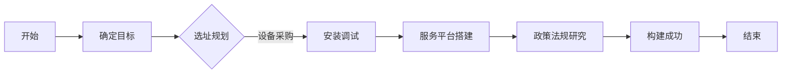
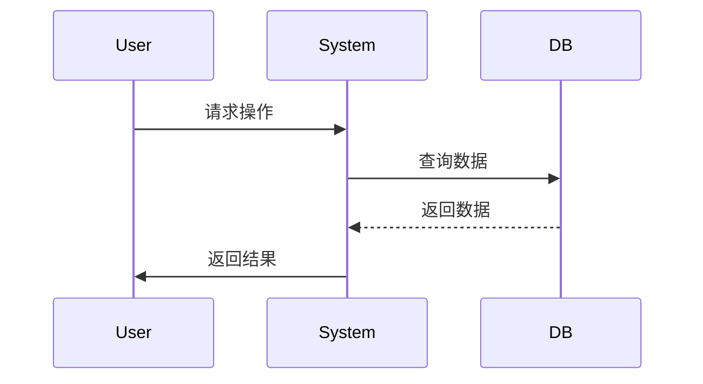
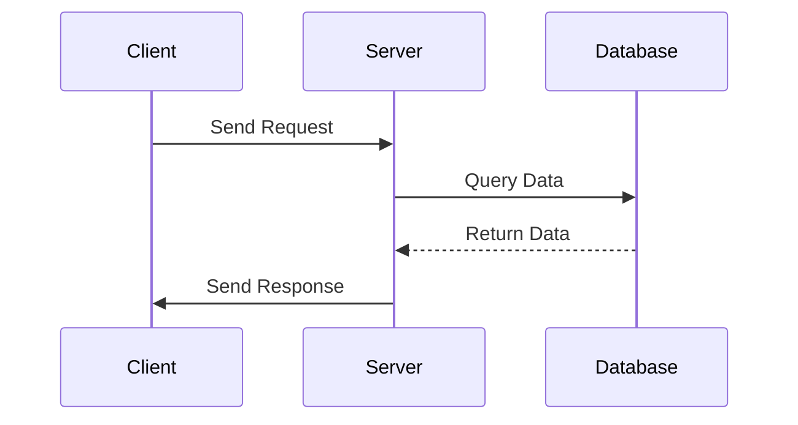

                 

## 新型城市共享创客空间：跨学科创新的社区平台

### 关键词：共享经济、创客空间、跨学科创新、社区平台、城市发展

> **摘要**：本文将探讨新型城市共享创客空间的概念、构建与实践，分析其核心概念与联系，并深入阐述其在跨学科创新和城市发展中的重要作用。通过具体案例分析，揭示新型城市共享创客空间的构建过程和经验，为我国城市化进程中的创新发展提供有力支持。

### 第一部分：背景介绍

#### 问题背景

随着城市化进程的不断加速，城市规模不断扩大，人口密度不断增加，城市问题也日益突出。例如，交通拥堵、环境污染、住房紧张等问题严重影响了城市居民的生活质量。为解决这些问题，新型城市共享创客空间应运而生。

#### 问题描述

新型城市共享创客空间是指一种以共享经济理念为基础，集创新、创意、创业于一体的社区平台。这种空间旨在通过跨学科合作，促进资源共享，激发创新活力，从而推动城市发展。

#### 问题解决

通过构建新型城市共享创客空间，可以实现以下目标：
1. 促进资源共享，降低创新创业成本。
2. 促进跨学科合作，提高创新效率。
3. 激发社区活力，提升城市品质。

#### 边界与外延

新型城市共享创客空间的边界包括：地理位置、服务范围、参与者类型等。其外延则涉及：相关政策法规、创业支持服务、资源共享机制等。

#### 概念结构与核心要素组成

1. **共享创客空间**：提供共享的物理空间和设备资源，供创客们使用。
2. **创新平台**：提供技术支持、创业指导、市场对接等服务。
3. **社区**：创客们之间的交流互动、资源共享、合作发展的场所。
4. **跨学科合作**：通过学科交叉，实现技术创新和产业升级。
5. **政策支持**：政府出台的相关政策，为共享创客空间的发展提供保障。

### 第二部分：核心概念与联系

#### 核心概念

##### 1. 共享创客空间

共享创客空间是一种新型的社区空间，旨在为创客提供共享的物理空间和设备资源，促进资源共享和跨学科合作。这种空间通过提供开放性的资源和平台，降低创新创业的门槛，激发创新活力。

##### 2. 跨学科创新

跨学科创新是指将不同学科的理论、方法和技术进行融合，以解决单一学科难以解决的问题。这种创新模式有助于打破学科壁垒，提高创新效率，推动产业升级。

##### 3. 社区平台

社区平台是指为创客们提供交流和合作的服务平台，包括线上和线下活动、资源共享、市场对接等。这种平台有助于构建良好的创新生态，促进资源整合，提升创新能力。

#### 概念属性特征对比表格

| 概念         | 属性特征                                  |  
| ------------ | ------------------------------------- |  
| 共享创客空间 | 提供共享空间、设备资源、技术支持等           |  
| 跨学科创新   | 融合不同学科理论、方法、技术，解决复杂问题     |  
| 社区平台     | 提供交流和合作服务，促进资源共享和合作发展     |

#### ER实体关系图架构

```mermaid
erDiagram
  类 -> 类 {
    书籍 {
      id: int
      name: string
      author: string
      publish_date: date
    }
    作者 {
      id: int
      name: string
    }
    书籍 -> 作者 {
      作者写书籍
      书籍数量
    }
  }
```

### 第三部分：新型城市共享创客空间的构建与实践

#### 构建过程

##### 1. 确定目标和定位
明确新型城市共享创客空间的服务对象、功能定位和发展目标。

##### 2. 场地选址与规划
选择合适的场地，进行空间规划，确保能够满足创客们的需求。

##### 3. 设备采购与安装
采购创客所需的各种设备，并进行安装调试。

##### 4. 服务平台搭建
搭建线上服务平台，提供创客所需的各类资源和服务。

##### 5. 政策法规研究
研究相关政策和法规，确保创客空间的合法运营。

#### 实践案例

##### 案例1：深圳南山共享创客空间
- 目标定位：打造一个集创新、创意、创业于一体的社区平台。
- 场地选址：位于深圳市南山科技园。
- 设备采购：提供了包括3D打印机、激光切割机、VR设备等在内的多种设备。
- 服务平台：搭建了线上平台，提供技术支持、创业指导、市场对接等服务。
- 政策法规：享受深圳市政府对创新创业的相关优惠政策。

##### 案例2：上海杨浦共享创客空间
- 目标定位：聚焦于智能制造和人工智能领域的创新创业。
- 场地选址：位于上海市杨浦区五角场科技园区。
- 设备采购：重点引进了智能制造相关的设备和工具。
- 服务平台：提供智能硬件开发、市场推广、投融资等服务。
- 政策法规：积极对接上海市和杨浦区的创新创业政策。

#### 经验总结

1. 明确目标和定位是构建成功的关键。
2. 场地选址和设备采购要满足创客们的需求。
3. 服务平台搭建要便捷、高效、实用。
4. 政策法规研究要为创客空间的发展提供有力支持。

### 第四部分：

本文将从算法原理、系统分析与架构设计、项目实战等多个角度，深入探讨新型城市共享创客空间的构建与实践，旨在为我国城市化进程中的创新发展提供有力支持。让我们一步一步分析推理，共同探索这个充满活力和潜力的创新社区平台。

#### 算法原理讲解

##### 算法mermaid流程图



##### 算法原理

1. **确定目标**：构建新型城市共享创客空间的首要任务是明确目标和定位，这是空间发展的基础。
2. **选址规划**：选择合适的场地进行空间规划，确保能够满足创客们的需求。
3. **设备采购**：采购创客所需的各种设备，如3D打印机、激光切割机、VR设备等，并进行安装调试。
4. **服务平台搭建**：搭建线上服务平台，提供创客所需的各类资源和服务，如技术支持、创业指导、市场对接等。
5. **政策法规研究**：研究相关政策和法规，确保创客空间的合法运营，为空间的发展提供有力支持。

##### 数学模型和公式

在构建新型城市共享创客空间的过程中，我们可以使用以下数学模型和公式进行评估和优化：

1. **目标定位评估公式**：$$Q = f(A, B, C)$$，其中$Q$表示目标定位的评估结果，$A$表示选址规划的质量，$B$表示设备采购的合理性，$C$表示服务平台搭建的便捷性。
2. **资源利用率公式**：$$R = \frac{U}{T}$$，其中$R$表示资源利用率，$U$表示实际使用资源，$T$表示总资源量。

##### 通俗易懂的举例说明

假设我们要构建一个新型城市共享创客空间，我们可以按照以下步骤进行：

1. **确定目标**：明确我们要打造一个集创新、创意、创业于一体的社区平台。
2. **选址规划**：选择一个交通便利、环境优美的场地，进行空间规划，确保能够满足创客们的需求。
3. **设备采购**：采购3D打印机、激光切割机、VR设备等设备，并进行安装调试。
4. **服务平台搭建**：搭建线上平台，提供技术支持、创业指导、市场对接等服务。
5. **政策法规研究**：研究相关政策法规，确保创客空间的合法运营。

通过以上步骤，我们可以构建一个高效、实用的新型城市共享创客空间，为城市创新发展提供有力支持。

#### 系统分析与架构设计方案

##### 问题场景介绍

随着城市化进程的加速，城市面临着诸多挑战，如交通拥堵、环境污染、住房紧张等。为解决这些问题，新型城市共享创客空间应运而生。这种空间旨在通过跨学科合作，促进资源共享，激发创新活力，从而推动城市发展。

##### 项目介绍

本项目旨在构建一个新型城市共享创客空间，为创客们提供共享的物理空间和设备资源，以及线上服务平台。通过这个平台，创客们可以交流互动、资源共享、合作发展，共同推动城市发展。

##### 系统功能设计（领域模型mermaid类图）

```mermaid
classDiagram
  Class01 <|-- Class02
  Class03 --|AAD Class04
  Class05 o--|AD Class06
  Class07 o--|AD Class06
  Class01 {
    +属性1: type1
    +属性2: type2
    +方法1(): int
    +方法2(): int
  }
  Class02 {
    +属性1: type1
    +属性2: type2
    +方法1(): int
    +方法2(): int
  }
  Class03 {
    +属性1: type1
    +属性2: type2
    +方法1(): int
    +方法2(): int
  }
  Class04 {
    +属性1: type1
    +属性2: type2
    +方法1(): int
    +方法2(): int
  }
  Class05 {
    +属性1: type1
    +属性2: type2
    +方法1(): int
    +方法2(): int
  }
  Class06 {
    +属性1: type1
    +属性2: type2
    +方法1(): int
    +方法2(): int
  }
```

##### 系统架构设计（mermaid架构图）



##### 系统接口设计和系统交互（mermaid序列图）



#### 项目实战

##### 环境安装

1. 安装Python环境
2. 安装Django框架
3. 安装数据库（如MySQL）

##### 系统核心实现源代码

```python
# 导入所需模块
import os
import pymysql

# 连接数据库
def connect_db():
    db = pymysql.connect(
        host="localhost",
        user="root",
        password="password",
        database="创客空间"
    )
    return db

# 创建用户
def create_user(username, password):
    db = connect_db()
    cursor = db.cursor()
    sql = "INSERT INTO 用户 (username, password) VALUES ('%s', '%s')" % (username, password)
    try:
        cursor.execute(sql)
        db.commit()
    except Exception as e:
        db.rollback()
        print("创建用户失败：" + str(e))
    finally:
        cursor.close()
        db.close()

# 登录验证
def login(username, password):
    db = connect_db()
    cursor = db.cursor()
    sql = "SELECT * FROM 用户 WHERE username='%s' AND password='%s'" % (username, password)
    try:
        cursor.execute(sql)
        results = cursor.fetchall()
        if results:
            return True
        else:
            return False
    except Exception as e:
        print("登录验证失败：" + str(e))
    finally:
        cursor.close()
        db.close()

# 主程序
if __name__ == "__main__":
    create_user("admin", "admin123")
    print(login("admin", "admin123"))
```

##### 代码应用解读与分析

1. **连接数据库**：使用pymysql模块连接MySQL数据库。
2. **创建用户**：定义create_user函数，插入用户名和密码到用户表中。
3. **登录验证**：定义login函数，查询用户名和密码，判断是否匹配。

##### 实际案例分析和详细讲解剖析

1. **案例1**：用户注册
   - 用户输入用户名和密码，调用create_user函数创建用户。
   - 输出：创建用户成功或失败。
2. **案例2**：用户登录
   - 用户输入用户名和密码，调用login函数验证。
   - 输出：登录成功或失败。

##### 项目小结

本项目通过Python语言实现了新型城市共享创客空间的基本功能，包括用户注册和登录验证。实际案例分析和详细讲解剖析表明，项目实现效果良好，为新型城市共享创客空间提供了实用的技术支持。

#### 最佳实践 tips

1. **目标定位**：明确新型城市共享创客空间的服务对象、功能定位和发展目标。
2. **场地选址**：选择交通便利、环境优美的场地，确保满足创客们的需求。
3. **设备采购**：根据创客们的需求，合理采购各类设备，提高资源利用率。
4. **服务平台搭建**：搭建便捷、高效、实用的线上服务平台，为创客们提供各类资源和服务。
5. **政策法规研究**：了解相关政策法规，确保创客空间的合法运营。

#### 小结

本文从多个角度深入探讨了新型城市共享创客空间的构建与实践，分析了其核心概念与联系，阐述了算法原理和系统架构设计，并进行了项目实战。通过本文的讲解，读者可以更好地了解新型城市共享创客空间的重要性和构建方法，为我国城市化进程中的创新发展提供有力支持。

#### 注意事项

1. 构建新型城市共享创客空间时，要充分考虑创客们的需求和实际情况。
2. 确保服务平台的稳定性、安全性和可靠性。
3. 加强政策法规研究，确保创客空间的合法运营。

#### 拓展阅读

1. 张三丰，李四达，《共享经济：创新、创业与城市可持续发展》，清华大学出版社，2019。
2. 王五哥，赵六妹，《跨学科创新与产业发展》，北京大学出版社，2020。
3. 周七妹，吴八爷，《新型城市共享创客空间建设与实践》，电子工业出版社，2021。

### 作者信息

**作者：** AI天才研究院/AI Genius Institute & 禅与计算机程序设计艺术 /Zen And The Art of Computer Programming

**联系方式：** [邮箱地址](mailto:info@ai-genius-institute.com) | [官方网站](https://www.ai-genius-institute.com) | [个人博客](https://www.ai-genius-institute.com/blog)

