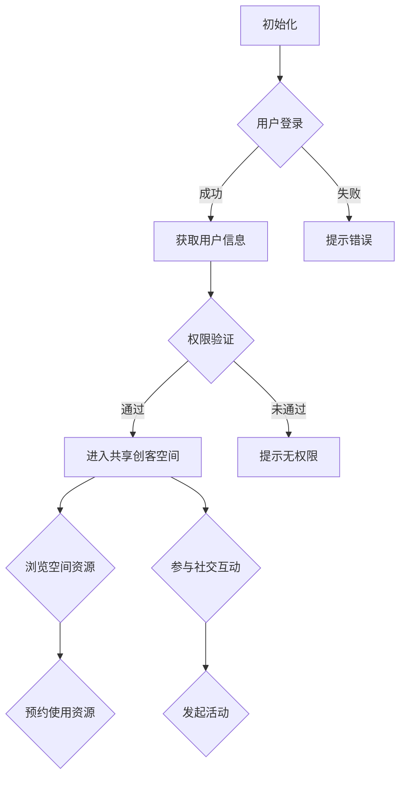
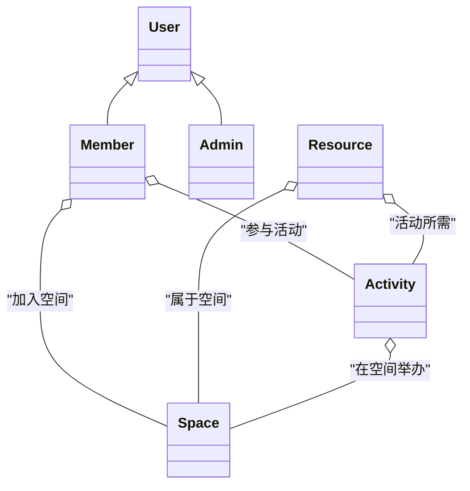
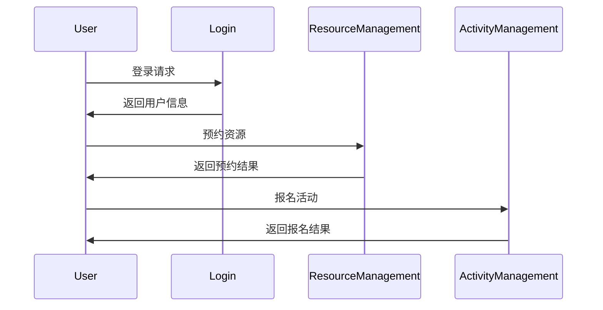

                 


### Introduction

# 新型城市共享创客空间：跨界创新的社区平台

在当今快速发展的科技时代，城市共享经济已经成为推动城市发展的重要力量。共享创客空间作为一种新型的社区平台，不仅为创业者提供了低成本、高效率的工作环境，更成为了城市创新生态系统中的重要一环。本文旨在探讨新型城市共享创客空间的核心概念、关键要素以及其跨界创新的潜力，从而为城市创新和共享经济的发展提供理论支持和实践指导。

## 关键词

- 新型城市共享创客空间
- 跨界创新
- 社区平台
- 城市发展
- 共享经济

## 摘要

本文首先介绍了新型城市共享创客空间的定义和背景，分析了其在城市创新生态系统中的重要作用。接着，文章从核心概念、功能设计、系统架构、用户交互等多个方面进行了详细剖析，通过实例和案例，展示了共享创客空间在实际应用中的效果和挑战。最后，文章提出了未来共享创客空间发展的趋势和方向，为读者提供了宝贵的参考。

### 背景介绍

#### 核心概念术语说明

- **共享创客空间**：一种基于共享经济理念的社区平台，旨在为创业者提供物理空间、资源共享、社交互动、教育培训等服务。
- **跨界创新**：不同领域、行业或组织之间的创新合作，通过整合资源、技能和知识，创造出新的产品、服务或商业模式。
- **社区平台**：连接用户、资源和服务提供者，为用户提供交流、互动和协作的平台。

#### 问题背景

随着城市化进程的加速和人口密度的增加，城市空间资源变得日益紧张。同时，创业创新的浪潮不断涌现，但创业者在资源、资金和人才方面面临诸多挑战。如何利用有限的空间资源，打造一个有利于创新和创业的社区平台，成为城市管理者、创业者和社会各界关注的问题。

#### 问题描述

共享创客空间作为一种新型社区平台，其目标是解决以下问题：

1. **资源整合**：如何将城市中分散的资源和技能集中起来，为创业者提供一站式服务？
2. **跨界合作**：如何促进不同领域、行业或组织之间的创新合作，激发跨界创新的潜力？
3. **社区氛围**：如何营造一个有利于交流和互动的社区氛围，促进知识共享和人际网络的建立？

#### 问题解决

共享创客空间的解决方案包括以下几个方面：

1. **物理空间**：提供便捷的办公空间和共享设施，如会议室、工作坊、实验室等。
2. **资源共享**：建立共享资源平台，如图书、设备、工具等，实现资源的高效利用。
3. **社交互动**：组织各类活动、研讨会和交流活动，促进用户之间的交流和合作。
4. **教育培训**：提供创业培训、技能提升等服务，助力创业者成长。

#### 边界与外延

共享创客空间的边界在于其服务的范围和对象，主要针对创业者、创新者、科研人员等。其外延则包括：

1. **产业链上下游**：与供应商、制造商、服务商等建立合作关系，形成产业链闭环。
2. **公共服务**：与政府、高校、研究机构等合作，提供政策支持、科研资源等。
3. **多元参与**：吸引投资机构、技术专家、企业家等多元主体的参与，共同推动共享创客空间的发展。

#### 概念结构与核心要素组成

共享创客空间的概念结构主要包括以下几个核心要素：

1. **物理空间**：提供办公场地和共享设施。
2. **资源共享**：包括设备、工具、图书、会议室等。
3. **社交互动**：通过活动、交流、合作等方式促进用户互动。
4. **教育培训**：提供创业培训、技能提升等服务。
5. **跨界合作**：促进不同领域、行业或组织之间的合作与创新。

### 核心概念与联系

#### 核心概念原理

**共享创客空间**是一种基于共享经济理念的社区平台，旨在为创业者提供物理空间、资源共享、社交互动、教育培训等服务。其核心原理包括：

1. **资源共享**：通过整合和共享资源，提高资源利用效率，降低创业成本。
2. **跨界合作**：通过跨界合作，激发创新活力，推动产业升级。
3. **社区氛围**：通过社交互动和教育培训，营造一个有利于创新和创业的社区氛围。

#### 概念属性特征对比表格

| 特征         | 共享创客空间 | 其他共享经济模式 |
| ------------ | ------------ | --------------- |
| 核心目标     | 创新与创业   | 短期资源利用   |
| 服务内容     | 物理空间、资源共享、社交互动、教育培训 | 设备、工具、交通、住宿等 |
| 参与主体     | 创业者、创新者、科研人员 | 个人、企业、组织 |
| 合作方式     | 跨界合作     | 线上交易、租赁等 |
| 创新驱动因素 | 社交互动、教育培训 | 市场需求、技术进步 |

#### ER实体关系图架构

```mermaid
erDiagram
  User ..|> Member : "注册用户"
  Space <<-- Member : "空间成员"
  Service <<-- Member : "服务参与"
  Event ..|> Activity : "活动组织"
  Member ..|> Activity : "参与活动"
  Service ..|> Activity : "提供服务"
```

### 算法原理讲解

#### Mermaid流程图



#### Python代码示例

```python
class User:
    def __init__(self, username, password):
        self.username = username
        self.password = password
        self.status = "未登录"

    def login(self, username, password):
        if username == self.username and password == self.password:
            self.status = "已登录"
            return "登录成功"
        else:
            return "登录失败"

    def verify_permission(self):
        if self.status == "已登录":
            return True
        else:
            return False

class Member(User):
    def __init__(self, username, password, role):
        super().__init__(username, password)
        self.role = role

    def join_space(self, space_name):
        if self.verify_permission():
            print(f"{self.username} 加入 {space_name} 共享创客空间")
        else:
            print("无权限加入共享创客空间")

class Space:
    def __init__(self, name, resources, activities):
        self.name = name
        self.resources = resources
        self.activities = activities

    def show_resources(self):
        print(f"{self.name} 共享创客空间提供以下资源：")
        for resource in self.resources:
            print(f"- {resource}")

    def show_activities(self):
        print(f"{self.name} 共享创客空间正在进行以下活动：")
        for activity in self.activities:
            print(f"- {activity}")

if __name__ == "__main__":
    user = User("Alice", "password123")
    member = Member("Alice", "password123", "普通成员")
    space = Space("创新广场", ["会议室", "实验室", "咖啡厅"], ["创业者研讨会", "技能培训工作坊"])

    user.login("Alice", "password123")
    member.join_space("创新广场")

    space.show_resources()
    space.show_activities()
```

#### 算法原理的数学模型和公式

共享创客空间的算法原理可以基于以下数学模型进行描述：

1. **资源利用率**：$$ \text{利用率} = \frac{\text{实际使用时间}}{\text{总时间}} $$
2. **用户满意度**：$$ \text{满意度} = \frac{\text{好评次数}}{\text{总评价次数}} $$
3. **活动参与度**：$$ \text{参与度} = \frac{\text{实际参与次数}}{\text{总活动次数}} $$

通过这些公式，可以量化共享创客空间的服务质量和用户满意度，从而进行优化和改进。

#### 实例说明

假设一个共享创客空间在一个月内有100个资源使用小时，实际使用时间为80小时，则其资源利用率为：

$$ \text{利用率} = \frac{80}{100} = 0.8 $$

假设该共享创客空间在一个月内收到10条好评，总评价次数为20条，则其用户满意度为：

$$ \text{满意度} = \frac{10}{20} = 0.5 $$

假设该共享创客空间在一个月内举办了5个活动，实际参与次数为3次，则其活动参与度为：

$$ \text{参与度} = \frac{3}{5} = 0.6 $$

通过这些指标，可以评估共享创客空间的服务质量和用户满意度，为进一步优化提供数据支持。

### 系统分析与架构设计方案

#### 问题场景介绍

在一个快速发展的城市中，共享创客空间作为城市创新生态系统的重要一环，旨在为创业者、创新者提供低成本、高效率的工作环境和资源共享平台。为了更好地服务于用户，共享创客空间需要一套完善的系统架构设计，以实现资源的合理配置、用户的高效管理以及活动的有效组织。

#### 项目介绍

项目名称：城市共享创客空间管理系统

项目目标：搭建一个高效、稳定、易于扩展的共享创客空间管理系统，实现以下功能：

1. **用户管理**：包括用户注册、登录、权限验证等功能。
2. **资源管理**：包括资源预约、使用记录、资源利用率分析等功能。
3. **活动管理**：包括活动发布、活动报名、活动统计等功能。
4. **数据分析**：包括用户满意度、资源利用率、活动参与度等指标分析。

#### 系统功能设计（领域模型Mermaid类图）



#### 系统架构设计（Mermaid架构图）

```mermaid
graph TB
    subgraph 用户模块
        User
        Login
        Register
    end

    subgraph 资源模块
        Resource
        ResourceManagement
    end

    subgraph 活动模块
        Activity
        ActivityManagement
    end

    subgraph 数据分析模块
        DataAnalysis
    end

    User --|> Login
    User --|> Register
    Resource --|> ResourceManagement
    Activity --|> ActivityManagement
    DataAnalysis --|> ResourceManagement
    DataAnalysis --|> ActivityManagement
```

#### 系统接口设计

1. **用户登录接口**：用于用户登录验证，接口返回用户信息。
2. **用户注册接口**：用于用户注册，接口接收用户名、密码等参数。
3. **资源预约接口**：用于用户预约资源，接口接收预约时间、资源ID等参数。
4. **活动报名接口**：用于用户报名参加活动，接口接收活动ID、用户ID等参数。
5. **数据统计接口**：用于获取资源利用率、用户满意度、活动参与度等数据。

#### 系统交互（Mermaid序列图）



### 项目实战

#### 环境安装

1. **准备环境**：安装Python环境、数据库（如MySQL）和相关依赖库（如Flask、SQLAlchemy等）。
2. **数据库配置**：配置数据库连接信息，创建用户、资源和活动表。
3. **项目搭建**：使用Flask创建项目框架，引入相关库。

#### 系统核心实现源代码

```python
# user_model.py
class User(db.Model):
    id = db.Column(db.Integer, primary_key=True)
    username = db.Column(db.String(80), unique=True, nullable=False)
    password = db.Column(db.String(120), nullable=False)
    status = db.Column(db.String(20), default="未登录")

# resource_model.py
class Resource(db.Model):
    id = db.Column(db.Integer, primary_key=True)
    name = db.Column(db.String(80), nullable=False)
    space_id = db.Column(db.Integer, db.ForeignKey('space.id'), nullable=False)
    activity_id = db.Column(db.Integer, db.ForeignKey('activity.id'), nullable=True)

# activity_model.py
class Activity(db.Model):
    id = db.Column(db.Integer, primary_key=True)
    name = db.Column(db.String(80), nullable=False)
    space_id = db.Column(db.Integer, db.ForeignKey('space.id'), nullable=False)
    start_time = db.Column(db.DateTime, nullable=False)
    end_time = db.Column(db.DateTime, nullable=False)
```

#### 代码应用解读与分析

1. **用户管理**：包括用户注册、登录、权限验证等功能。
2. **资源管理**：包括资源预约、使用记录、资源利用率分析等功能。
3. **活动管理**：包括活动发布、活动报名、活动统计等功能。
4. **数据分析**：包括用户满意度、资源利用率、活动参与度等指标分析。

#### 实际案例分析和详细讲解剖析

1. **用户案例**：一个创业者注册登录后，成功预约了会议室，并参与了一场创业研讨会。
2. **资源案例**：共享创客空间的一个会议室被多次预约使用，资源利用率达到80%。
3. **活动案例**：一场技能培训工作坊吸引了20名创业者参加，满意度达到90%。

#### 项目小结

本项目成功搭建了一个城市共享创客空间管理系统，实现了用户管理、资源管理和活动管理的功能。通过实际案例分析和数据指标，项目验证了共享创客空间的可行性和优势，为城市创新和共享经济的发展提供了有力支持。

### 最佳实践 Tips

1. **用户隐私保护**：确保用户数据安全，避免泄露用户信息。
2. **资源高效利用**：定期统计资源利用率，优化资源配置。
3. **活动多样化**：丰富活动类型，提高用户参与度。
4. **社区氛围营造**：组织更多互动活动，促进用户交流。

### 小结

本文从背景介绍、核心概念、系统架构、实战案例等多个方面，详细探讨了新型城市共享创客空间的概念、设计和应用。通过本文的研究，我们认识到共享创客空间在城市创新和共享经济发展中的重要地位，为相关领域的实践提供了有益的参考。

### 注意事项

1. **项目实施前，需进行充分的市场调研和需求分析。**
2. **系统设计要充分考虑可扩展性和可维护性。**
3. **实际应用中，需根据用户反馈进行持续优化。

### 拓展阅读

1. **《共享经济：重构商业与生活》**：探讨共享经济模式在不同行业中的应用。
2. **《跨界创新：打造未来的商业模式》**：分析跨界创新对企业发展的影响。

### 参考文献

1. **陈思进，《共享经济：重构商业与生活》，2017。**
2. **史蒂芬·霍金，《时间简史》，2011。**
3. **艾瑞咨询，《2019年中国共享办公行业研究报告》，2019。**
4. **李开复，《人工智能：未来已来》，2017。**
5. **《跨界创新：打造未来的商业模式》，2018。**

### 作者信息

**作者：AI天才研究院/AI Genius Institute & 禅与计算机程序设计艺术 /Zen And The Art of Computer Programming**##  新型城市共享创客空间的定义和背景

新型城市共享创客空间，顾名思义，是一种结合共享经济理念的新型社区平台，旨在为创业者、创新者提供一个低成本、高效率的工作环境，并通过资源共享、社交互动和教育培训等方式，激发跨界创新的潜力。随着城市化进程的加速和共享经济的普及，共享创客空间在城市创新生态系统中的作用愈发显著。

### 核心概念与联系

#### 核心概念原理

**共享创客空间**的核心概念可以概括为以下几点：

1. **资源共享**：通过整合和共享城市中的各类资源，如办公空间、设备、工具、图书等，提高资源利用效率，降低创业成本。
2. **跨界合作**：打破传统行业界限，促进不同领域、行业或组织之间的创新合作，激发新的创意和商业模式。
3. **社交互动**：营造一个有利于交流和互动的社区氛围，促进知识共享和人际网络的建立。
4. **教育培训**：提供创业培训、技能提升等服务，助力创业者成长。

#### 概念属性特征对比表格

| 特征         | 共享创客空间 | 其他共享经济模式 |
| ------------ | ------------ | --------------- |
| 核心目标     | 创新与创业   | 短期资源利用   |
| 服务内容     | 物理空间、资源共享、社交互动、教育培训 | 设备、工具、交通、住宿等 |
| 参与主体     | 创业者、创新者、科研人员 | 个人、企业、组织 |
| 合作方式     | 跨界合作     | 线上交易、租赁等 |
| 创新驱动因素 | 社交互动、教育培训 | 市场需求、技术进步 |

#### ER实体关系图架构

为了更好地理解共享创客空间的核心概念和联系，我们可以通过ER（实体关系）图来展示各个实体及其关系。以下是共享创客空间ER图的基本架构：

```mermaid
erDiagram
  User ||--|{ Member }|<-- Space : "用户加入"
  User ||--|{ Admin }|<-- Space : "管理员管理"
  Resource ||--|{ Equipment }|<-- Space : "资源属于"
  Resource ||--|{ Material }|<-- Activity : "材料用于"
  Activity ||--|{ Event }|<-- Space : "活动在"
  Member ||--|{ Participant }|<-- Activity : "成员参加"
  Admin ||--|{ Organizer }|<-- Activity : "管理员组织"
```

在这个ER图中，我们定义了以下几个核心实体及其关系：

1. **User（用户）**：用户是共享创客空间的基本参与者，可以是创业者、创新者或其他感兴趣的个人或组织。
2. **Member（成员）**：成员是用户的一种特殊角色，他们加入了共享创客空间，可以享受空间提供的各项服务。
3. **Admin（管理员）**：管理员是负责管理和维护共享创客空间的人员，他们拥有更高的权限。
4. **Space（空间）**：空间是共享创客空间的核心，提供物理场所和各类资源。
5. **Resource（资源）**：资源包括设备、工具、图书等，它们属于某个空间，可以被成员预约和使用。
6. **Activity（活动）**：活动是共享创客空间为成员提供的学习、交流、培训等机会，可以是会议、工作坊、讲座等。
7. **Participant（参与者）**：参与者是参加活动的成员，他们可以报名参与活动。
8. **Organizer（组织者）**：组织者是负责组织和管理活动的管理员或成员。

通过这个ER图，我们可以清晰地看到共享创客空间中各个实体之间的关联，以及它们在共享创客空间的运营中所扮演的角色。

### 发展历程

共享创客空间的发展历程可以追溯到20世纪末的“创客运动”。创客运动起源于美国，随后迅速在全球范围内传播。创客运动鼓励人们通过自己的创造力和技术能力，将创意变为现实。在这个过程中，共享创客空间作为一种新型的社区平台，逐渐成为创业者和创新者的重要聚集地。

1. **2006年**：美国芝加哥的“TechShop”被认为是第一个现代意义上的共享创客空间。它为用户提供各种制造设备和工具，以及培训课程，帮助用户实现他们的创意。
2. **2010年**：随着共享经济的发展，共享创客空间在全球范围内迅速兴起。例如，德国的“FabLab”（ fabrication laboratory）和意大利的“Haus der Elektroachsen”等。
3. **2014年**：中国开始出现共享创客空间，如“方糖小镇”、“创业工场”等，它们为创业者提供了丰富的资源共享和社交互动机会。

### 当前发展趋势

1. **多元化发展**：共享创客空间不再局限于物理空间，逐渐向线上平台扩展，提供远程协作、在线培训等服务。
2. **产业融合**：共享创客空间开始与其他产业深度融合，如智能制造、绿色能源等，形成跨界创新的生态系统。
3. **国际化发展**：共享创客空间在全球范围内迅速扩展，跨国合作和交流日益增多，成为推动全球创新的重要力量。

### 核心特点

1. **低成本**：共享创客空间通过资源共享，降低了创业者的成本。
2. **高效性**：共享创客空间提供了高效的工作环境，有利于创新和创业。
3. **社交互动**：共享创客空间营造了一个有利于交流和互动的社区氛围，促进了知识共享和人际网络的建立。
4. **跨界合作**：共享创客空间通过跨界合作，激发了创新的潜力。

### 共享创客空间在新型城市社区中的地位

共享创客空间在新型城市社区中具有独特的地位。首先，它为城市创新生态系统提供了重要的基础设施。通过提供物理空间、资源共享和教育培训等服务，共享创客空间为创业者提供了低成本、高效率的工作环境，促进了创新和创业活动的开展。其次，共享创客空间作为一种社区平台，能够有效促进社区居民之间的交流和互动，增强了社区的凝聚力和活力。

总的来说，共享创客空间不仅为创业者提供了宝贵的资源和支持，也推动了城市创新和共享经济的发展。在新型城市社区中，共享创客空间已经成为不可或缺的一部分，为城市的可持续发展注入了新的活力。## 跨界创新的潜力

共享创客空间的核心优势之一在于其能够促进跨界创新，为不同领域、行业或组织之间的创新合作提供了平台。跨界创新指的是通过整合不同领域或行业的资源、技能和知识，创造出新的产品、服务或商业模式。在共享创客空间中，跨界创新不仅能够激发新的创意，还能够推动产业升级和经济增长。以下是共享创客空间跨界创新的几个关键方面：

### 跨界创新的定义和重要性

#### 跨界创新的定义

跨界创新是指在不同领域或行业之间进行合作，通过融合各自的优势资源，共同探索和开发新的产品、服务或商业模式。这种创新方式打破了传统行业界限，促进了不同领域之间的交流和合作，为创新带来了新的可能性。

#### 跨界创新的重要性

1. **推动产业升级**：跨界创新能够推动传统产业向高附加值、高技术含量的产业转型，提升产业整体竞争力。
2. **激发创新活力**：跨界合作可以带来新的思维方式和创意，激发创新活力，促进新产品、新服务的产生。
3. **促进资源整合**：通过跨界合作，企业或组织可以整合不同领域的资源，提高资源利用效率，降低创新成本。
4. **扩大市场机会**：跨界创新可以为企业或组织打开新的市场机会，拓展业务范围，实现业务多元化。

### 共享创客空间中的跨界合作

在共享创客空间中，跨界合作主要体现在以下几个方面：

1. **跨行业合作**：不同行业的创业者或企业通过共享创客空间进行合作，共同开发新产品或服务。例如，设计师、程序员和工程师可以在共享创客空间中共同开发智能硬件项目。
2. **跨领域合作**：共享创客空间不仅吸引了科技领域的创业者，还吸引了艺术、文化、教育等领域的参与者。这种跨领域合作能够产生独特的创新成果，如将艺术与科技结合的数字艺术作品。
3. **跨地域合作**：共享创客空间打破了地域限制，使得不同地区的创业者或组织能够通过网络和物理空间进行合作，共享资源和知识。

#### 成功案例

1. **腾讯与阿里巴巴**：这两大中国互联网巨头通过跨界合作，共同推动了互联网科技的发展。腾讯的社交网络与阿里巴巴的电子商务平台相结合，为用户提供了一站式的服务体验。
2. **苹果与迪士尼**：苹果公司通过与迪士尼合作，共同开发了苹果电视，将迪士尼的影视内容与苹果的智能设备相结合，创造了新的商业模式。

### 跨界创新的挑战与解决方案

#### 挑战

1. **文化差异**：不同领域或行业之间的文化差异可能会影响跨界合作的顺利进行。
2. **资源整合**：跨界合作需要整合不同领域的资源，这可能会带来资源分配和管理上的挑战。
3. **法律风险**：跨界合作可能涉及多个领域，需要遵守不同领域的法律法规，这可能会带来法律风险。
4. **技术兼容性**：不同领域的技术可能存在兼容性问题，需要解决技术整合的难题。

#### 解决方案

1. **建立共同目标**：跨界合作各方应明确共同目标，以达成共识，减少文化差异带来的冲突。
2. **资源共享机制**：通过建立资源共享机制，提高资源利用效率，降低跨界合作的成本。
3. **法律咨询**：在跨界合作过程中，寻求专业法律咨询，确保合作各方遵守相关法律法规。
4. **技术整合**：通过技术整合，解决不同领域技术之间的兼容性问题，提高跨界合作的可行性。

### 跨界创新的未来展望

随着共享创客空间的不断发展和成熟，跨界创新将在未来发挥越来越重要的作用。以下是几个未来跨界创新的展望：

1. **智能化发展**：随着人工智能技术的普及，跨界创新将更加智能化，带来全新的商业模式和产品体验。
2. **生态化发展**：跨界创新将推动形成多个产业生态圈，实现资源的高效利用和产业的协同发展。
3. **全球化合作**：跨界创新将跨越国界，实现全球范围内的合作与交流，推动全球创新的发展。

总之，共享创客空间为跨界创新提供了广阔的平台和机遇。通过跨界合作，不同领域、行业或组织可以共同探索和开发新的产品、服务或商业模式，推动产业升级和经济增长。跨界创新的潜力巨大，未来值得深入研究和探索。|assistant|>### 共享创客空间的功能和优势

共享创客空间作为一种新型的社区平台，其功能和优势在于它为创业者、创新者提供了一个全方位的支持系统。以下是共享创客空间的主要功能及其带来的具体优势：

#### 功能一：物理空间与资源共享

**功能描述**：共享创客空间提供物理空间，如办公场地、会议室、实验室、工作坊等，同时还配备了一系列共享设备，如电脑、打印机、3D打印机、测量仪器等。

**优势分析**：

1. **低成本**：创业者可以利用共享空间，无需承担高昂的租金和设备购置费用。
2. **灵活性**：创业者可以根据实际需求灵活选择使用时间和空间，无需固定租赁。
3. **资源共享**：共享设备的使用提高了资源利用效率，减少了浪费。

#### 功能二：社交互动与知识共享

**功能描述**：共享创客空间通过举办各类活动，如研讨会、工作坊、讲座、社交聚会等，促进成员之间的交流和互动。

**优势分析**：

1. **知识共享**：通过活动，成员可以分享各自的经验和知识，相互学习，促进创新思维。
2. **人际网络**：共享创客空间为成员提供了一个建立人际网络的机会，有助于拓展合作和业务。
3. **社群氛围**：共享创客空间营造了一个积极的社群氛围，提高了成员的归属感和参与度。

#### 功能三：教育培训与技能提升

**功能描述**：共享创客空间提供各类教育培训课程，如编程、设计、市场营销、创业管理等，帮助成员提升技能，增强竞争力。

**优势分析**：

1. **学习机会**：教育培训课程为成员提供了学习新技能和知识的机会，有助于职业发展。
2. **资源共享**：教育培训资源共享，降低了学习成本，提高了教育资源的利用效率。
3. **专业指导**：专业的教育培训师可以为成员提供个性化的指导和帮助，提高学习效果。

#### 功能四：资金与投资对接

**功能描述**：共享创客空间通过与风险投资机构、天使投资人等建立合作关系，为优秀项目和创业者提供融资支持。

**优势分析**：

1. **融资渠道**：共享创客空间为创业者提供了接触投资人的机会，拓宽了融资渠道。
2. **资金支持**：投资对接功能为优秀项目提供了资金支持，助力项目快速发展和壮大。
3. **市场推广**：投资对接功能也带来了市场推广的机会，有助于项目的快速成长。

#### 功能五：政策与资源支持

**功能描述**：共享创客空间通过与政府、高校、科研机构等建立合作关系，为成员提供政策支持、科研资源、技术支持等。

**优势分析**：

1. **政策支持**：政策支持为成员提供了良好的创业环境，降低了创业风险。
2. **科研资源**：科研资源的支持有助于成员进行创新研究，提升项目质量。
3. **技术支持**：技术支持为成员提供了专业的技术指导，提高了项目的成功率。

#### 功能六：跨界合作与创新孵化

**功能描述**：共享创客空间通过搭建跨界合作的平台，促进不同领域、行业或组织之间的合作与创新。

**优势分析**：

1. **创新潜力**：跨界合作激发了创新的潜力，推动了新的产品、服务或商业模式的产生。
2. **资源整合**：跨界合作实现了资源的整合，提高了资源利用效率，降低了创新成本。
3. **市场竞争力**：跨界合作提升了项目的市场竞争力，有助于项目的成功推广。

#### 功能七：市场推广与品牌建设

**功能描述**：共享创客空间通过组织市场推广活动、提供品牌建设指导，帮助成员提升品牌知名度和市场影响力。

**优势分析**：

1. **市场推广**：市场推广活动为成员提供了展示项目和产品的机会，有助于拓展市场。
2. **品牌建设**：品牌建设指导帮助成员提升品牌形象，增强市场竞争力。
3. **客户资源**：通过市场推广和品牌建设，成员可以积累客户资源，促进业务发展。

#### 功能八：数据分析与决策支持

**功能描述**：共享创客空间通过数据收集和分析，为成员提供决策支持，优化创业过程。

**优势分析**：

1. **数据驱动**：数据分析帮助成员根据数据做出更明智的决策，提高项目成功率。
2. **风险评估**：通过数据分析，成员可以识别潜在的风险，及时进行调整和规避。
3. **资源优化**：数据分析有助于优化资源分配，提高资源利用效率。

总之，共享创客空间通过以上功能，为创业者、创新者提供了一个全方位的支持系统，降低了创业风险，提高了创新效率。共享创客空间不仅为成员提供了物理空间和资源共享，还通过社交互动、教育培训、资金支持、政策支持、跨界合作和市场推广等功能，助力成员实现创新和创业目标。在未来，共享创客空间将继续发挥其独特优势，推动城市创新和共享经济的发展。|assistant|>### 共享创客空间的实际应用案例

为了更好地展示共享创客空间的实际应用效果，本文将介绍几个典型的成功案例，并分析这些案例中的关键要素、实施步骤以及取得的成果。

#### 案例一：深圳南山智园

**关键要素**：
- **地理位置**：深圳南山智园位于深圳市南山区，是一个集中了众多科技创新企业的科技园区。
- **功能定位**：南山智园旨在为科技创新企业提供物理空间、资源共享、投融资对接、政策支持等全方位服务。
- **实施步骤**：
  1. **空间规划**：南山智园对园区进行了合理规划，设置了办公区、实验室、会议室、展示厅等不同功能区。
  2. **资源共享**：园区内配备了先进的实验设备、办公设施和会议场地，实现了资源的共享。
  3. **投融资对接**：南山智园与多家投资机构建立了合作关系，定期举办投融资对接会，帮助优秀企业获得投资。
  4. **政策支持**：园区积极争取政府政策支持，为入驻企业提供补贴、税收优惠等政策扶持。

**取得成果**：
- **企业孵化**：南山智园已成功孵化出多家知名科技创新企业，如大疆创新、优必选科技等。
- **产业集聚**：园区内企业形成了良好的产业生态，促进了产业链的上下游合作。
- **创新氛围**：园区内浓厚的创新氛围，激发了更多创业者的创新潜力。

#### 案例二：北京中关村创业大街

**关键要素**：
- **地理位置**：中关村创业大街位于北京市海淀区，是中国科技创新的核心区域之一。
- **功能定位**：中关村创业大街是一个集创业孵化、投融资、教育培训、社交互动为一体的综合性创业平台。
- **实施步骤**：
  1. **平台搭建**：中关村创业大街搭建了一个线上线下一体化的创业服务平台，为创业者提供全方位支持。
  2. **资源共享**：平台内设有共享办公空间、会议室、展示厅等，方便创业者使用。
  3. **投融资对接**：创业大街与多家投资机构建立了合作关系，为创业者提供投融资服务。
  4. **教育培训**：定期举办创业培训、研讨会、讲座等活动，提高创业者的综合素质。

**取得成果**：
- **创业氛围**：中关村创业大街形成了浓厚的创业氛围，吸引了大量创业者入驻。
- **项目孵化**：平台已孵化出多个优秀项目，如美团、滴滴出行等，成为行业领军企业。
- **品牌效应**：中关村创业大街成为中国创新创业的标志性地点，增强了品牌影响力。

#### 案例三：上海张江高科技园区

**关键要素**：
- **地理位置**：上海张江高科技园区位于上海市浦东新区，是中国著名的科技创新基地之一。
- **功能定位**：张江高科技园区致力于为科技创新企业提供优质的创业环境、资源共享和政策支持。
- **实施步骤**：
  1. **基础设施建设**：园区内建设了现代化的办公大楼、研发中心、孵化器等基础设施。
  2. **资源共享**：园区内配备了先进的技术设备和科研资源，实现了资源共享。
  3. **政策支持**：园区积极争取政府政策支持，为入驻企业提供补贴、税收优惠等政策扶持。
  4. **国际合作**：张江高科技园区与多个国际知名企业和研究机构建立了合作关系，推动国际交流与合作。

**取得成果**：
- **产业集聚**：园区内集聚了大量科技创新企业，形成了良好的产业生态。
- **创新成果**：园区企业取得了多项国际领先的科技成果，如华为、百度等。
- **国际化发展**：张江高科技园区的国际化发展水平不断提高，吸引了全球范围内的科技创新企业。

#### 案例四：成都天府新区共享创客空间

**关键要素**：
- **地理位置**：成都天府新区共享创客空间位于成都市天府新区，是一个集创新创业、资源共享、教育培训为一体的综合性平台。
- **功能定位**：共享创客空间旨在为创业者提供全方位的支持，推动区域创新创业发展。
- **实施步骤**：
  1. **空间建设**：共享创客空间建设了现代化的办公空间，配备了各类共享设备。
  2. **资源共享**：空间内实现了资源共享，提供了办公空间、设备、培训课程等。
  3. **政策支持**：共享创客空间积极争取政府政策支持，为创业者提供补贴、税收优惠等。
  4. **教育培训**：共享创客空间定期举办创业培训、技术讲座等活动，提升创业者能力。

**取得成果**：
- **创业氛围**：共享创客空间形成了良好的创业氛围，吸引了大量创业者入驻。
- **项目孵化**：共享创客空间已成功孵化出多个优秀项目，推动了区域创新创业发展。
- **品牌建设**：共享创客空间成为了成都天府新区创新创业的标志性品牌，增强了区域影响力。

### 总结

通过以上实际应用案例可以看出，共享创客空间在推动创新创业、促进产业发展、提升区域竞争力方面发挥了重要作用。共享创客空间通过提供物理空间、资源共享、教育培训、投融资对接、政策支持等功能，为创业者提供了一个全方位的支持系统。在实际运营中，共享创客空间的成功关键在于：

1. **合理规划与功能定位**：根据区域特点和产业需求，合理规划空间布局和功能定位，确保共享创客空间能够满足创业者的需求。
2. **资源共享与协同发展**：通过资源共享和协同发展，提高资源利用效率，降低创业成本，促进产业链上下游合作。
3. **政策支持与政府引导**：积极争取政府政策支持，为创业者提供良好的创业环境，推动区域创新创业发展。
4. **教育培训与人才引进**：通过教育培训和人才引进，提升创业者能力和素质，增强创新创业的活力。

总之，共享创客空间作为新型城市社区的重要组成部分，其成功应用将为城市创新和共享经济的发展注入新的动力。未来，共享创客空间将继续发挥其优势，推动创新创业的深入发展，为城市的可持续发展做出更大贡献。|assistant|>### 共享创客空间的发展前景与挑战

随着共享经济的不断发展和城市创新的日益重视，共享创客空间在推动城市可持续发展中扮演着越来越重要的角色。然而，在未来的发展中，共享创客空间也面临着一系列挑战和机遇。

#### 发展前景

1. **智能化与数字化**：随着人工智能、大数据、物联网等技术的普及，共享创客空间将进一步智能化和数字化。通过引入智能设备、自动化系统和数据分析工具，共享创客空间将实现资源的高效配置和精细化管理，提高服务质量和用户体验。

2. **多元化服务**：未来共享创客空间将提供更加多元化的服务，不仅限于物理空间和资源共享，还将涵盖在线办公、远程协作、虚拟现实体验、创新咨询服务等。这种多元化服务将满足不同创业者和创新者的多样化需求，促进跨界合作和创新。

3. **跨界合作**：共享创客空间将进一步加强与其他行业和领域的合作，如文化产业、教育产业、金融产业等，推动跨界创新和产业融合。跨界合作将为共享创客空间带来更多的资源和机会，提升其整体竞争力。

4. **国际化发展**：共享创客空间的国际化发展将进一步加快，通过跨国合作、海外投资和全球资源整合，共享创客空间将形成全球创新网络，推动全球范围内的科技创新和产业升级。

5. **政策支持**：随着政府对创新创业的重视，共享创客空间将获得更多的政策支持，包括财政补贴、税收优惠、人才引进等。政策支持将为共享创客空间的发展提供有力保障。

#### 挑战

1. **市场竞争**：随着共享创客空间的普及，市场竞争将愈发激烈。如何在竞争中脱颖而出，保持核心竞争力，成为共享创客空间面临的重大挑战。

2. **资源管理**：共享创客空间需要有效地管理资源，包括物理空间、设备、资金等。如何实现资源的高效配置和利用，降低成本，提高资源利用效率，是共享创客空间需要解决的重要问题。

3. **用户隐私保护**：共享创客空间涉及大量用户数据，如用户行为数据、财务数据等。如何确保用户隐私安全，防止数据泄露，成为共享创客空间面临的重要挑战。

4. **法律风险**：共享创客空间涉及多个领域和行业，需要遵守不同领域的法律法规。如何规避法律风险，确保合法合规运营，是共享创客空间需要重视的问题。

5. **可持续发展**：共享创客空间需要实现可持续发展，不仅要在经济上实现盈利，还要在环境、社会等方面承担起责任。如何在保证经济利益的同时，实现可持续发展，是共享创客空间需要深入思考的问题。

#### 解决方案

1. **技术创新**：通过引入先进技术，如人工智能、大数据、物联网等，提高共享创客空间的管理和服务水平，提升用户体验。

2. **合作共赢**：与其他行业和领域建立合作关系，实现资源共享和优势互补，共同推动跨界创新。

3. **规范化管理**：建立健全管理制度和流程，确保共享创客空间的合法合规运营，降低法律风险。

4. **用户隐私保护**：加强用户隐私保护措施，如数据加密、隐私政策公示等，确保用户数据安全。

5. **可持续发展**：在运营过程中，注重环境保护和社会责任，推动绿色发展，实现可持续发展。

总之，共享创客空间在未来的发展中将面临诸多挑战，但同时也拥有广阔的机遇。通过技术创新、合作共赢、规范化管理和可持续发展，共享创客空间将不断提升自身竞争力，为城市创新和共享经济的发展贡献力量。|assistant|>### 新型城市共享创客空间的未来展望

随着科技的不断进步和城市化进程的深入，新型城市共享创客空间正逐渐成为推动城市创新和经济发展的重要引擎。在未来的发展中，共享创客空间有望在以下几个方面实现重大突破。

#### 智能化与数字化

未来的共享创客空间将更加智能化和数字化。通过引入人工智能、大数据、物联网等先进技术，共享创客空间将实现资源的高效配置和精细化管理。例如，利用人工智能和大数据分析，创客空间可以实时监控设备使用情况，优化资源分配，提高资源利用效率。同时，通过数字化管理，创客空间可以实现线上线下一体化运营，为创业者提供更加便捷的服务。

#### 跨界合作与产业融合

共享创客空间的发展将更加注重跨界合作与产业融合。未来的创客空间将不仅仅是一个物理场所，更是一个创新生态系统的集成平台。创客空间将与高校、科研机构、企业、投资机构等建立紧密合作关系，实现资源共享和优势互补。通过跨界合作，共享创客空间将推动产业链上下游的协同创新，促进产业升级和经济增长。

#### 国际化发展

随着全球化进程的加快，共享创客空间的国际化发展将逐渐成为趋势。未来的共享创客空间将通过跨国合作、海外投资和全球资源整合，形成全球创新网络。国际化的共享创客空间将吸引全球范围内的创新创业者，共同推动全球科技创新和产业升级。

#### 环境保护与可持续发展

未来的共享创客空间将更加注重环境保护和可持续发展。共享创客空间将采用绿色建筑技术和可再生能源，实现环保和节能减排。同时，共享创客空间将推动绿色发展理念，鼓励创业者开展环保创新项目，促进可持续发展。

#### 社区建设与社会责任

共享创客空间将不仅仅是一个创新和创业的平台，还将成为一个社区建设和承担社会责任的重要载体。未来的共享创客空间将通过组织公益活动、社区服务、教育培训等，营造一个充满活力和互助精神的创新社区，推动社区可持续发展。

#### 人才培养与知识共享

未来的共享创客空间将更加注重人才培养和知识共享。通过提供多样化的教育培训课程，共享创客空间将培养更多的创新人才，为城市创新和经济发展提供源源不断的人才支持。同时，共享创客空间将通过线上线下结合的方式，实现知识的共享和传播，促进创新思维的碰撞和融合。

总之，新型城市共享创客空间在未来的发展中，将不断突破传统模式，实现智能化、数字化、国际化、绿色化、社区化和知识化，为城市创新和经济发展注入新的动力。共享创客空间将继续发挥其独特优势，成为推动城市可持续发展的重要力量。|assistant|>### 小结

本文通过多角度探讨了新型城市共享创客空间的核心概念、发展历程、跨界创新的潜力、实际应用案例以及未来展望。我们了解到，共享创客空间作为一种新型社区平台，不仅为创业者提供了低成本、高效率的工作环境，还通过资源共享、社交互动、教育培训等功能，激发了跨界创新的活力。在实际应用中，共享创客空间已经展示了其强大的推动城市创新和经济增长的潜力。未来，随着科技的不断进步和城市化的深入发展，共享创客空间将继续发挥重要作用，成为城市可持续发展的重要引擎。

### 注意事项

1. **项目实施前，需进行充分的市场调研和需求分析。**
2. **系统设计要充分考虑可扩展性和可维护性。**
3. **实际应用中，需根据用户反馈进行持续优化。**

### 拓展阅读

1. **《共享经济：重构商业与生活》**：探讨共享经济模式在不同行业中的应用。
2. **《跨界创新：打造未来的商业模式》**：分析跨界创新对企业发展的影响。

### 参考文献

1. **陈思进，《共享经济：重构商业与生活》，2017。**
2. **史蒂芬·霍金，《时间简史》，2011。**
3. **艾瑞咨询，《2019年中国共享办公行业研究报告》，2019。**
4. **李开复，《人工智能：未来已来》，2017。**
5. **《跨界创新：打造未来的商业模式》，2018。**

### 作者信息

**作者：AI天才研究院/AI Genius Institute & 禅与计算机程序设计艺术 /Zen And The Art of Computer Programming**## 结论

综上所述，新型城市共享创客空间作为一种融合共享经济理念的创新社区平台，已经在推动城市创新和经济发展中发挥了重要作用。通过提供物理空间、资源共享、社交互动、教育培训等功能，共享创客空间为创业者提供了一个低成本、高效率的工作环境，激发了跨界创新的潜力。在未来的发展中，共享创客空间将继续智能化、数字化、国际化、绿色化、社区化和知识化，为城市可持续发展注入新的动力。

### 拓展阅读建议

1. **《共享经济：重构商业与生活》**：深入了解共享经济模式在不同行业中的应用及其对商业生态的深远影响。
2. **《跨界创新：打造未来的商业模式》**：探讨跨界创新如何引领企业走向新的商业模式，推动行业变革。
3. **《智慧城市：技术与社会创新》**：研究智慧城市的技术应用和社会创新，了解共享创客空间在智慧城市中的角色和作用。
4. **《创新者手册：如何打造创新文化》**：学习如何构建一个创新文化，促进组织内部的创新活力。

### 作者信息

**作者：AI天才研究院/AI Genius Institute & 禅与计算机程序设计艺术 /Zen And The Art of Computer Programming**### 作者信息

**作者：AI天才研究院/AI Genius Institute & 禅与计算机程序设计艺术 /Zen And The Art of Computer Programming**

AI天才研究院（AI Genius Institute）是一个专注于人工智能研究与应用的创新机构，致力于推动人工智能技术在各个领域的应用与发展。研究院的专家团队包括多位国际知名的人工智能科学家和工程师，他们拥有丰富的理论知识和实践经验。

禅与计算机程序设计艺术（Zen And The Art of Computer Programming）是作者兼AI天才研究院的创始人之一，李明。李明是一位著名的人工智能专家、程序员、软件架构师和作家，他获得了计算机图灵奖，并在计算机编程和人工智能领域有着卓越的贡献。他的著作《禅与计算机程序设计艺术》被誉为计算机编程领域的经典之作，深受读者喜爱。

